# **Chapter 19** Cell Junctions and the Extracellular Matrix

- **CELL–CELL JUNCTIONS**
- **THE EXTRACELLULAR MATRIX (ECM)**
- **CELL-MATRIX JUNCTIONS**

## **2 main ways in animal cell bound**

- The apparatus of cell junctions and the extracellular matrix is critical for every aspect of the organization, function, and dynamics of multicellular structures.
- Defects in this apparatus underlie an enormous variety of diseases.

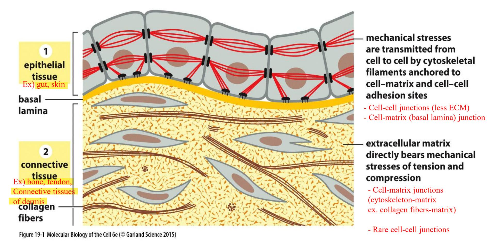

## **Various cell junctions found in a vertebrate epithelial cell**

• Junctions classified according to their primary functions.

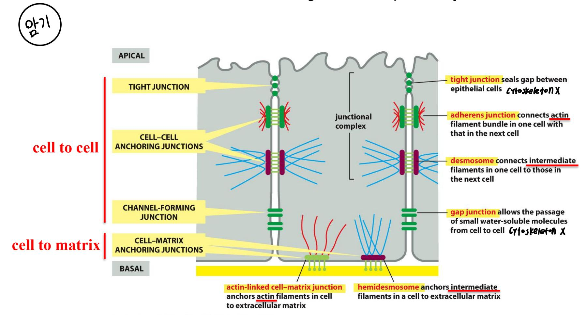

# **ANCHORING JUNCTIONS**

- **Cell-cell anchoring junctions**
- **1) adherens junction**
- **2) desmosome**
- **Cell-matrix anchoring junctions**
- **3) actin-linked cell-matrix junction**
- **4) hemidesmosome**

Each of the four major anchoring junction types depends on transmembrane adhesion proteins that span the plasma membrane, with one end linking to the cytoskeleton inside the cell and the other end linking to other structures outside it

## **Transmembrane adhesion proteins link the cytoskeleton to extracellular structures.**

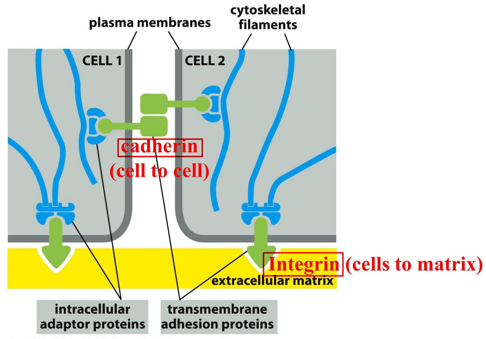

| TABLE 19-1 Anchoring Junctions        |                                                      |                                                |                                             |                                                                                           |
|---------------------------------------|------------------------------------------------------|------------------------------------------------|---------------------------------------------|-------------------------------------------------------------------------------------------|
| Junction                              | Transmembrane adhesion protein                       | Extracellular ligand                           | Intracellular cytoskeletal attachment | Intracellular adaptor proteins                                                            |
| Cell-Cell                             |                                                      |                                                |                                             |                                                                                           |
| Adherens junction                     | Classical cadherins                                  | Classical cadherin on neighboring cell      | Actin filaments                             | α-Catenin, β-catenin, plakoglobin (γ-catenin), p120-catenin, vinculin               |
| Desmosome                             | Nonclassical cadherins (desmoglein, desmocollin)     | Desmoglein and desmocollin on neighboring cell | Intermediate filaments                      | Plakoglobin (γ-catenin), plakophilin, desmoplakin                                   |
| Cell-Matrix                           |                                                      |                                                | <u>'</u>                                    |                                                                                           |
| Actin-linked cell- matrix junction | Integrin                                             | Extracellular matrix proteins                  | Actin filaments                             | Talin, kindlin, vinculin, paxillin, focal adhesion kinase (FAK), numerous others |
| Hemidesmosome                         | $\alpha_{_6}\beta_{_4}$ Integrin, type XVII collagen | Extracellular matrix proteins                  | Intermediate filaments                      | Plectin, BP230                                                                            |

Table 19-1 Molecular Biology of the Cell 6e (© Garland Science 2015)

## **CELL-CELL JUNCTIONS**

cadherin-based anchoring junctions

## **Cadherin superfamily**

- Dependence on **Ca2+ ions**
- **:** removing Ca2+ from the extracellular medium causes adhesions mediated by cadherins to come apart
- **Classical cadherins:** 
  - **E-cadherin** is present on many types of **e**pithelial cells
  - **N-cadherin** on **n**erve, muscle, and lens cells
  - **P-cadherin** on cells in the **p**lacenta and epidermis
- **Nonclassical cadherins** 
  - **protocadherin: more than 50** expressed in the brain
  - **desmosomal cadherin:** desmocollins and desmogleins that form desmosome
  - **more than 180** members in human
  - adhesive function

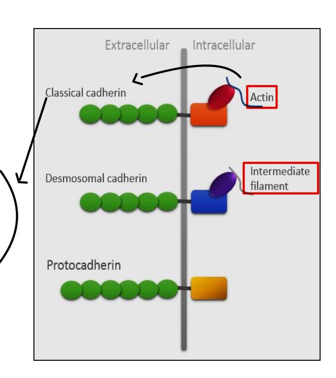

## **Cadherins Form a Diverse Family of Adhesion Molecules**

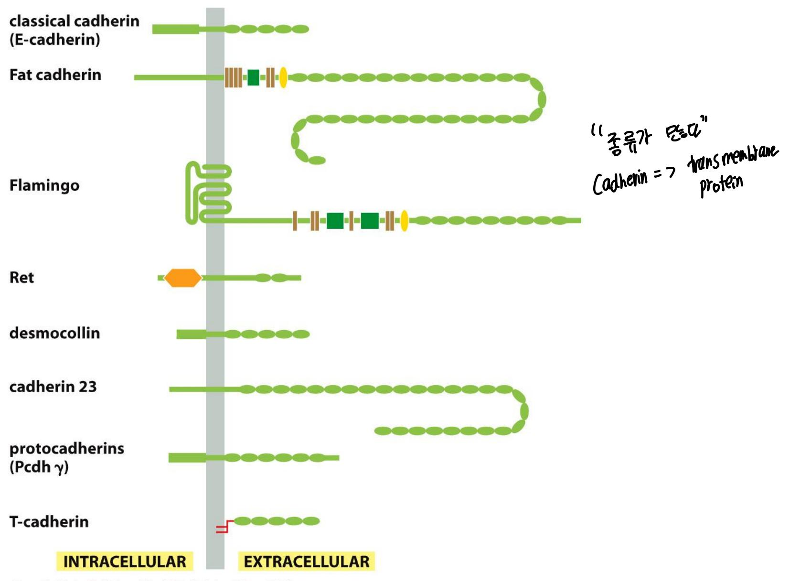

## **Transmembrane adhesion proteins link the cytoskeleton to extracellular structures.**

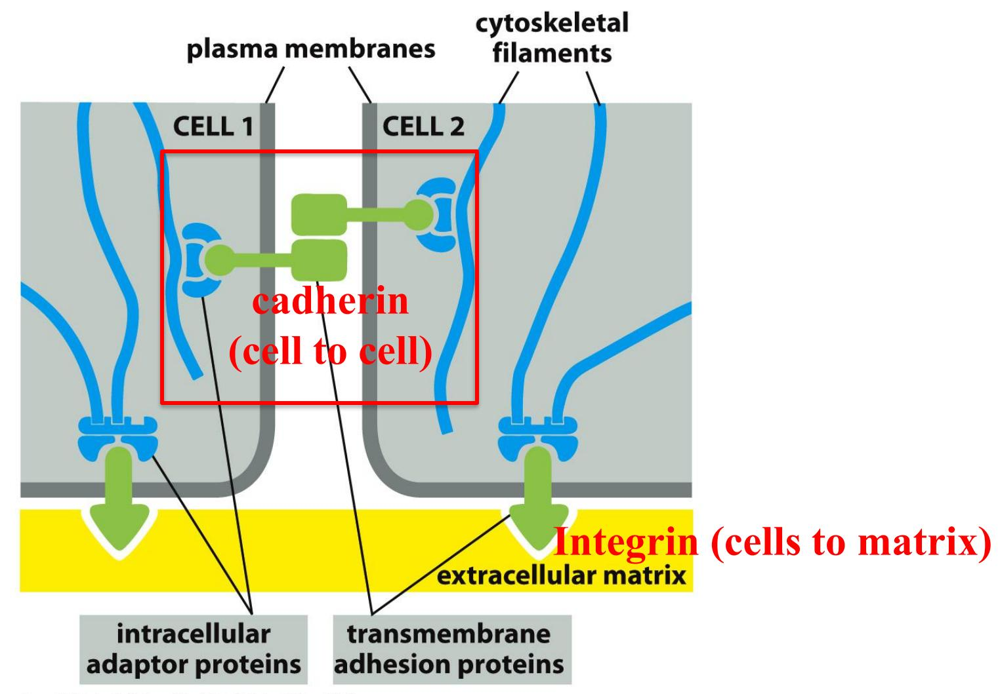

## **Cadherins mediate homophilic adhesion**

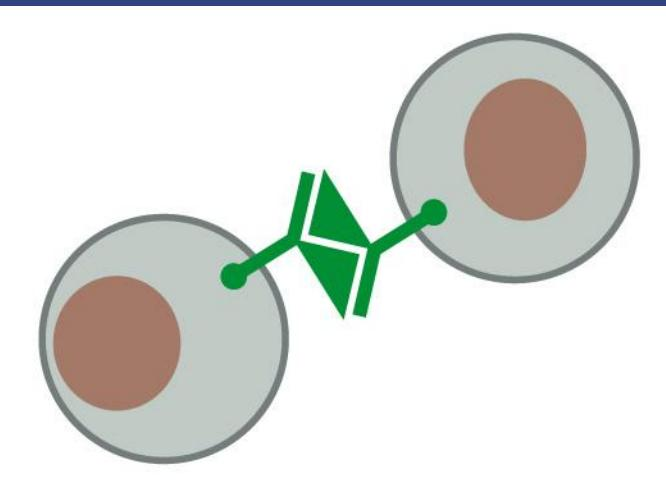

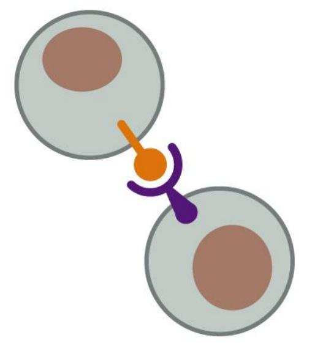

Cadherins in general bind homophilically; some other cell adhesion molecules bind heterophilically

## **Cadherins Mediate Homophilic Adhesion**

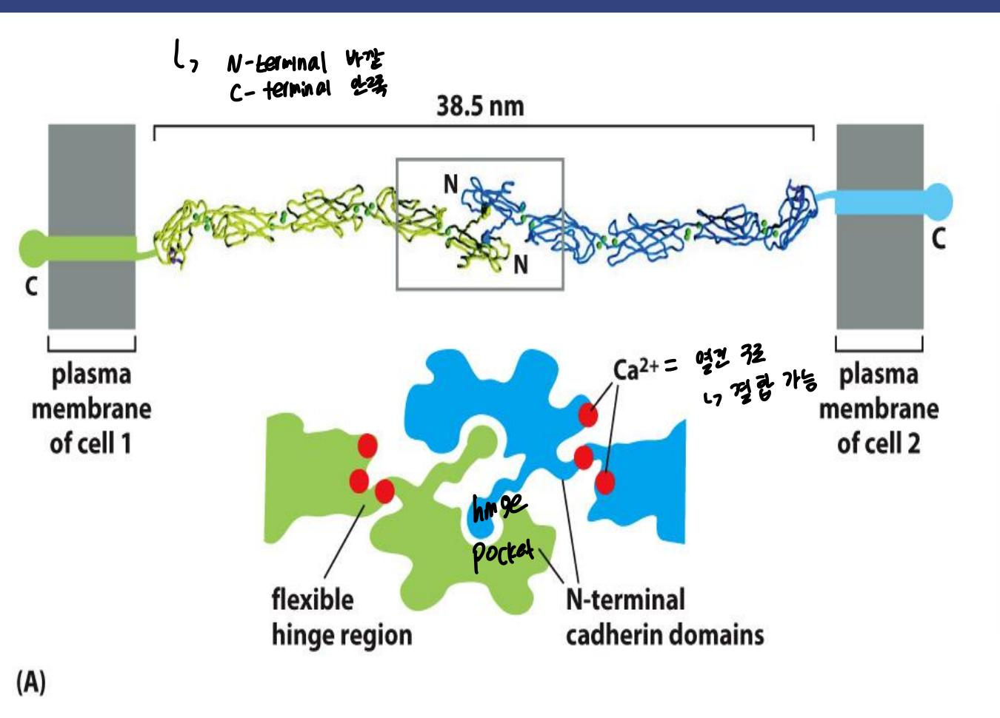

The N terminal domains each form a knob and a nearby pocket, and the cadherin molecules protruding from opposite cell membranes bind by insertion of the knob of one domain into the pocket of the other

## Higher binding affinity

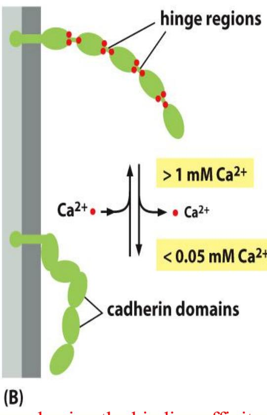

weakening the binding affinity

## Cadherins Mediate Homophilic Adhesion

Cadherins typically bind to their partners with relatively low affinity. Strong attachments result from the formation of many such weak bonds in parallel.

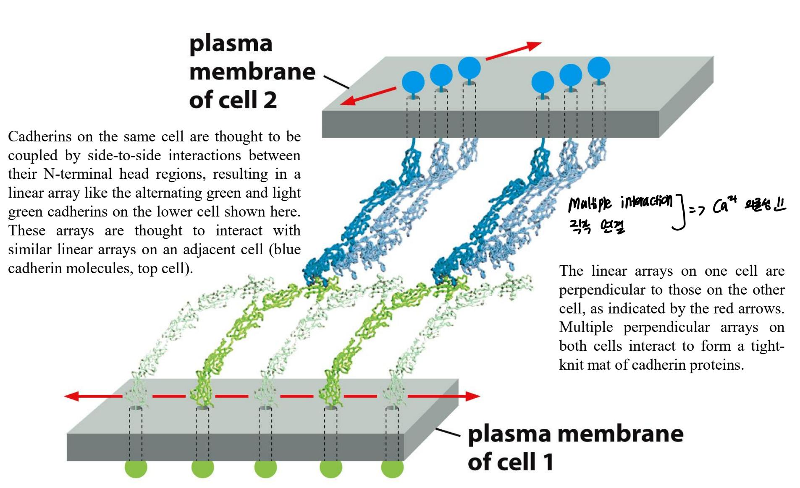

## Cadherin-dependent cell–cell adhesion guides the organization of developing tissues

### Cadherins form specific homophilic attachments

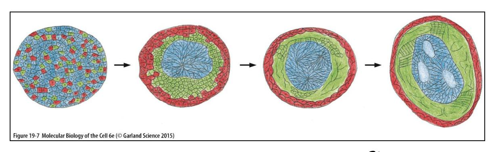

## Cells were mixed up

- → allowed to re-associate
- → dissociated cells reassembled into structures resembling of the original embryo

## Cadherin-Dependent Cell Sorting

The homophilic binding of cadherins controls the processes of tissue segregation.

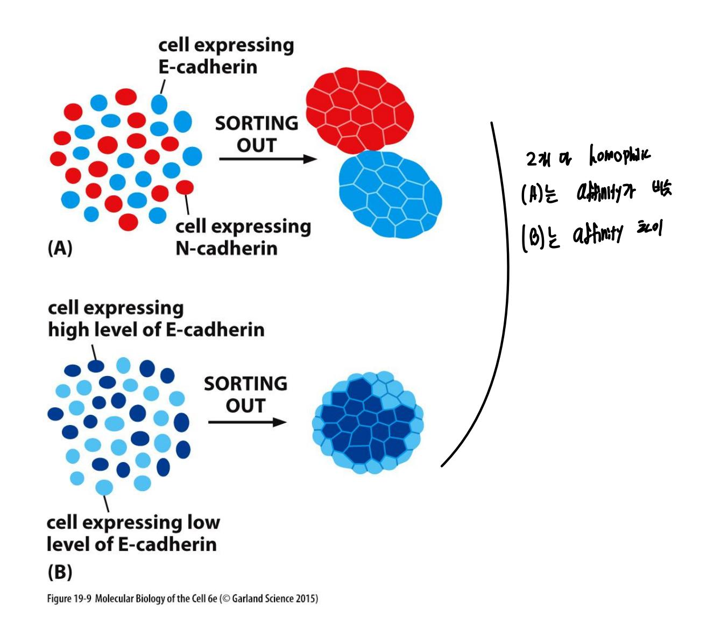

## Cadherin-Dependent Cell–Cell Adhesion Guides the Organization of Developing Tissues

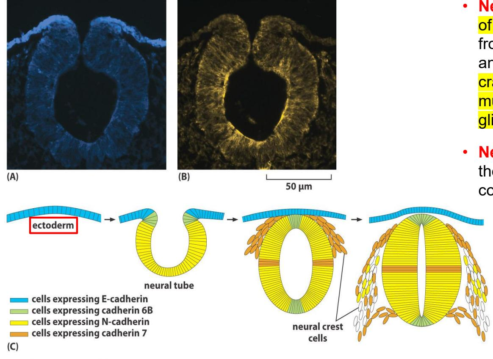

(A, B) Immunofluorescence micrographs showing the developing neural tube labeled with antibodies against (A) E-cadherin (blue) and (B) N-cadherin (yellow). (C) Neural tube cells lose E-cadherin and acquire other cadherins, including N-cadherin, while the cells in the overlying ectoderm continue to express E-cadherin. Then, when the neural crest cells migrate away from the neural tube, these cadherins become scarcely detectable, and another cadherin (cadherin 7) appears that helps hold the migrating cells together as loosely associated cell groups. Finally, when the cells aggregate to form a ganglion, they switch on expression of N-cadherin again.

- **Neural crest** cells are a temporary group of cells unique to vertebrates that arise from the embryonic ectoderm cell layer, and in turn give rise to melanocytes, craniofacial cartilage and bone, smooth muscle, peripheral and enteric neurons, glia and ganglion
- **Neural tube** is the embryo's precursor to the central nervous system, which comprises the brain and spinal cord

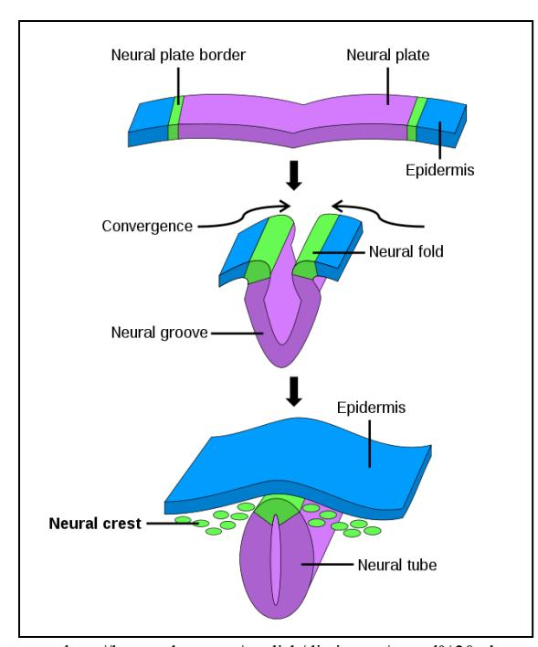

http://ko.wordow.com/english/dictionary/neural%20tube

| TABLE 19-1 Anchoring Junctions        |                                                      |                                                |                                             |                                                                                           |
|---------------------------------------|------------------------------------------------------|------------------------------------------------|---------------------------------------------|-------------------------------------------------------------------------------------------|
| Junction                              | Transmembrane adhesion protein                       | Extracellular ligand                           | Intracellular cytoskeletal attachment | Intracellular adaptor proteins                                                            |
| Cell-Cell                             |                                                      |                                                |                                             | (adhem — cytosiciet에 연결 역할                                                                |
| Adherens junction                     | Classical cadherins                                  | Classical cadherin on neighboring cell      | Actin filaments ০খন জুৱ                  | α-Catenin, β-catenin, plakoglobin (γ-catenin), p120-catenin, vinculin               |
| Desmosome                             | Nonclassical cadherins (desmoglein, desmocollin)     | Desmoglein and desmocollin on neighboring cell | Intermediate filaments                      | Plakoglobin (γ-catenin), plakophilin, desmoplakin                                   |
| Cell-Matrix                           |                                                      |                                                |                                             |                                                                                           |
| Actin-linked cell– matrix junction | Integrin                                             | Extracellular matrix proteins                  | Actin filaments                             | Talin, kindlin, vinculin, paxillin, focal adhesion kinase (FAK), numerous others |
| Hemidesmosome                         | $\alpha_{_6}\beta_{_4}$ Integrin, type XVII collagen | Extracellular matrix proteins                  | Intermediate filaments                      | Plectin, BP230                                                                            |

Table 19-1 Molecular Biology of the Cell 6e (© Garland Science 2015)

## **Catenins Link Classical Cadherins to the Actin Cytoskeleton**

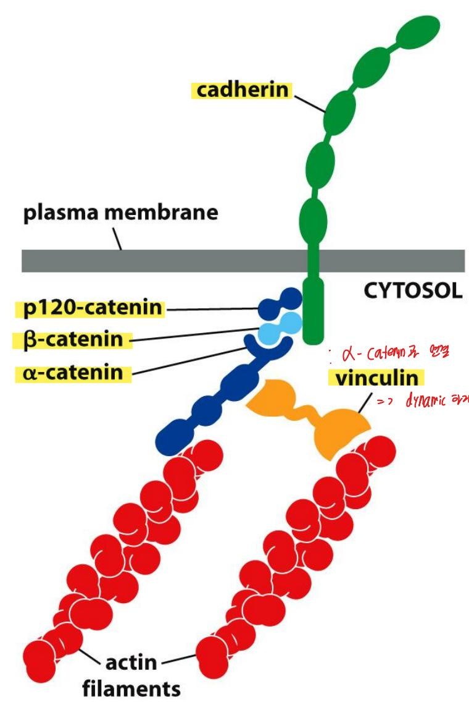

The linkage of cadherins to the cytoskeleton is indirect and depends on adaptor proteins that assemble on the cytoplasmic tail of the cadherin. At adherens junctions, the cadherin tail binds two such proteins: β-catenin and a distant relative called p120 catenin; a third protein called α-catenin interacts with β-catenin and recruits a variety of other proteins to provide a dynamic linkage to actin filaments

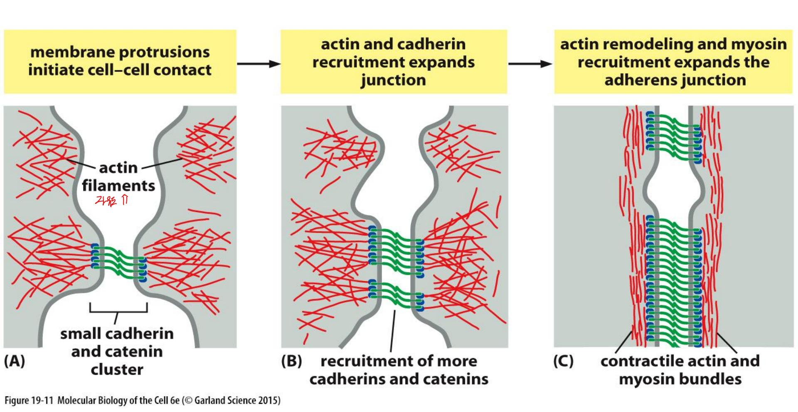

Adherens Junctions respond to forces generated by the actin cytoskeleton

### **Schematic representation of molecular mechanism of cadherin contraction**

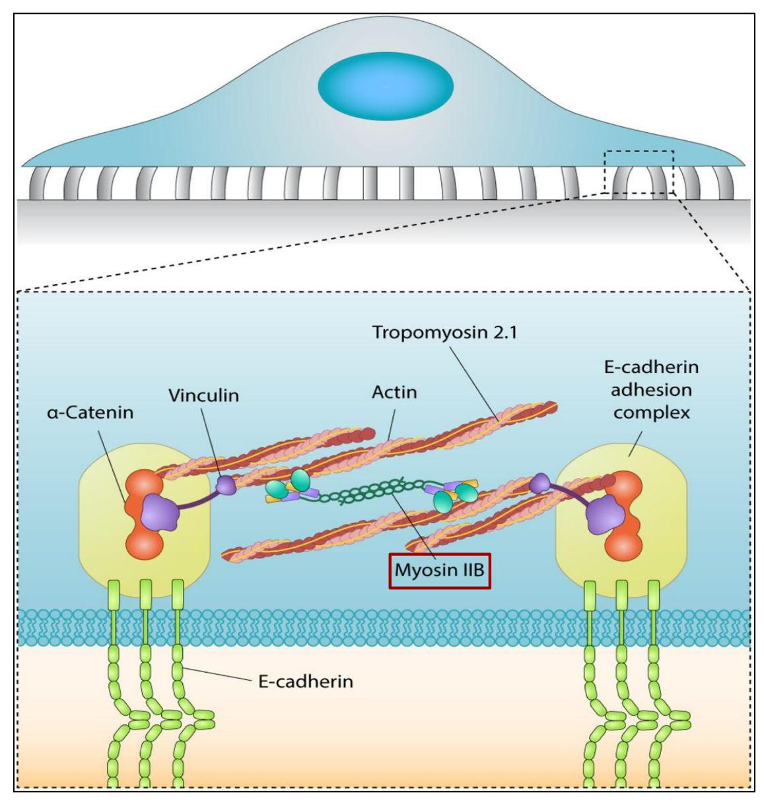

https://www.biorxiv.org/content/10.1101/318642v1.full

## **Adherens Junctions Respond to Forces Generated by the Actin Cytoskeleton**

## Mechanotransduction in an adherens junction

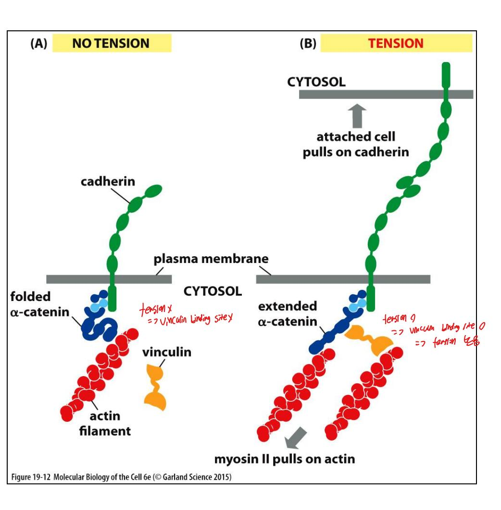

The protein α-catenin is stretched from a folded to an extended conformation when contractile activity increases at the junction. The unfolding exposes a cryptic binding site for another protein, vinculin, which promotes the recruitment of more actin to the junction

## **Tissue remodeling depends on the coordination of actin mediated contraction with cell–cell adhesion**

Adherens junctions between epithelial cells in the small intestine.

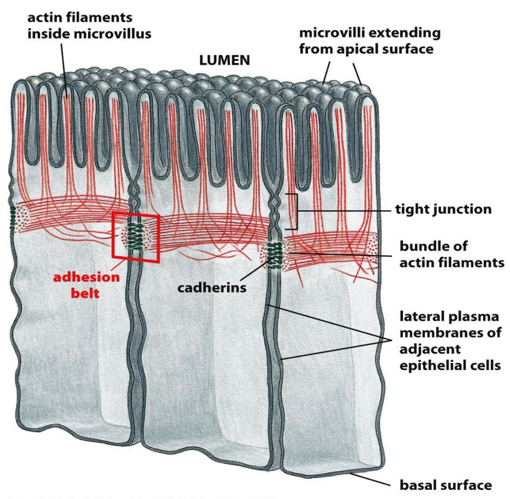

| 큰 문제는          |  |
|----------------|--|
| <u>લુવાવ્ય</u> |  |
| 바깥 🕏           |  |
| 924            |  |

| 핵심 구성요소            | 유전자(단백질)                  | 질환명(영문)                                                                              | 주요 임상 포인트                                      |
|--------------------|---------------------------|--------------------------------------------------------------------------------------|------------------------------------------------|
| Classical cadherin | CDH1 (E- cadherin)     | Hereditary Diffuse Gastric Cancer (HDGC), Lobular breast cancer predisposition | 미만형 위암·소엽성 유방암 가족성 소인, 불완전 침투·변 이별 위험 차이 |
|                    | CDH1 (E- cadherin)     | Blepharocheilodontic syndrome (BCDS1)                                                | 안검·구순구개열·치아 이상 (치아 발육부전 등)                  |
|                    | CDH3 (P- cadherin)     | Hypotrichosis with Juvenile Macular Dystrophy (HJMD) / EEM syndrome         | 소아기 진행성 탈모 + 청소 년기 황반변성 / 사지기형 동 반 가능    |
|                    | CDH2 (N- cadherin)     | (희귀) Arrhythmogenic cardiomyopathy 보고                                             | 좌/우심실 부정맥성 심근병 중 유사 표현형 보고 사례               |
| Catenin linker     | CTNNA1 (α- catenin)    | HDGC-like predisposition                                                             | CDH1 음성 가족에서 위암 소인 보고                       |
|                    | CTNND1 (p120- catenin) | Blepharocheilodontic syndrome 2 (BCDS2)                                           | BCDS와 유사한 안면·구개·치 아 이상                      |
|                    | CTNNB1 (β- catenin)    | NEDSDV 등 신경발달장애 스펙트럼                                                              | 지적장애·운동장애·시야/치아 이상; Wnt/접합 이중 역할            |

## **Desmosome**

| Junction                              | Transmembrane adhesion protein                       | Extracellular ligand                           | Intracellular cytoskeletal attachment | Intracellular adaptor proteins                                                            |
|---------------------------------------|------------------------------------------------------|------------------------------------------------|---------------------------------------------|-------------------------------------------------------------------------------------------|
| Cell-Cell                             |                                                      |                                                |                                             |                                                                                           |
| Adherens junction                     | Classical cadherins                                  | Classical cadherin on neighboring cell      | Actin filaments                             | α-Catenin, β-catenin, plakoglobin (γ-catenin) p120-catenin, vinculin                      |
| Desmosome                             | Nonclassical cadherins (desmoglein, desmocollin)     | Desmoglein and desmocollin on neighboring cell | Intermediate filaments                      | Plakoglobin (γ-catenin), plakophilin desmoplakin                                    |
| Cell-Matrix                           |                                                      |                                                |                                             |                                                                                           |
| Actin-linked cell- matrix junction | Integrin                                             | Extracellular matrix proteins                  | Actin filaments                             | Talin, kindlin, vinculin, paxillin, focal adhesion kinase (FAK), numerous others |
| Hemidesmosome                         | $\alpha_{_6}\beta_{_4}$ Integrin, type XVII collagen | Extracellular matrix proteins                  | Intermediate filaments                      | Plectin, BP230                                                                            |

Table 19-1 Molecular Biology of the Cell 6e (© Garland Science 2015)

## **Desmosomes Give Epithelia Mechanical Strength**

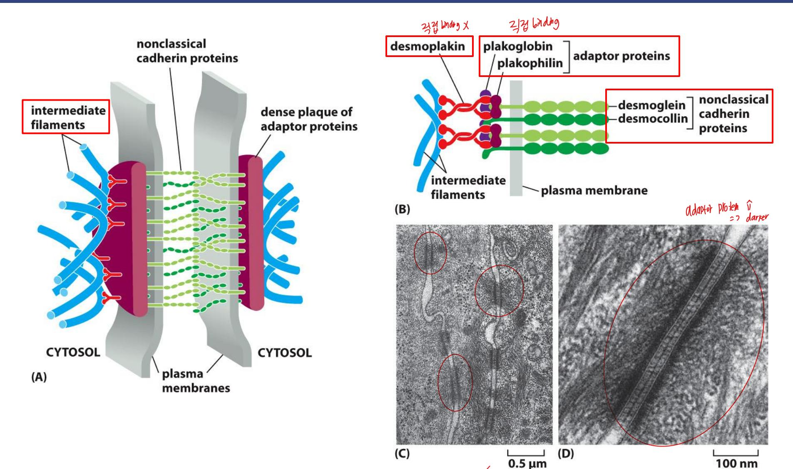

| 범주       | 주요 표적(항원/기전)                                    | 질환명                              | 임상 포인트                         |
|----------|-------------------------------------------------|----------------------------------|--------------------------------|
| 자가면역 수포성 | DSG3(±DSG1)                                     | 천포창(점막형/점막피부 형)               | 이완성 수포·미란, 점막 침범 흔함         |
|          | DSG1                                            | 천포창 박탈성(PF)                      | 표재성 수포, 점막은 보통 보 존          |
|          | Desmocollin 1 등                                 | IgA 천포창                          | 농포성·환상 병변, DIF에서 IgA 침착     |
|          | Envoplakin/Periplakin/Desmopla kin/DSG 등 다항원 | 종양연관 천포창(PNP)                    | 난치성 점막·다형성 피부 병 변, 기저 종양 동반 |
| 세균 독소 매개 | 황색포도알균 Exfoliative toxin(DSG1 절단)            | 포도상구균성 열상피부증 (SSSS) / 수포성 농가진 | 각질층 직하 박리 → 표재성 수포/박탈       |

### 천포창 (Pemphigus vulgaris)

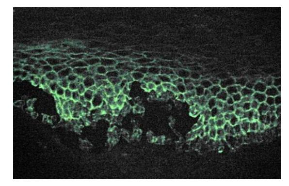

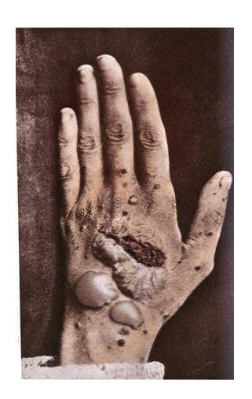

Desmoglein 1&3에 대한 auto-Antibody 생성

| 유전자(단백질)              | 질환명                                                                           | 임상 포인트                          |
|-----------------------|-------------------------------------------------------------------------------|---------------------------------|
| PKP1 (Plakophilin-1)  | Ectodermal dysplasia–skin fragility syndrome                               | 출생 직후부터 피부 미란· 균열, 모발/손발톱 이상 |
| DSP (Desmoplakin)     | Skin fragility-woolly hair syndrome                                           | 피부 취약 + 곱슬/양털 모발             |
|                       | Lethal acantholytic EB(치명적 무 극세포성 EB)                                      | 신생아기 광범위 박리·감 염, 치명적         |
| DSG1 (Desmoglein-1)   | Striate palmoplantar keratoderma(SPPK1)                                    | 줄무늬형 수장족저 각화                    |
|                       | SAM syndrome (Severe dermatitis, Multiple allergies, Metabolic wasting) | 중증 피부염·아토피/알레 르기·영양 소모       |
| DSG4                  | 국한성 열성 탈모증(Localised AR hypotrichosis)                                     | 소아기부터 진행성 탈모· 모발 취약          |
| DSC3 (Desmocollin-3)  | Hypotrichosis with recurrent skin vesicles                                    | 반복 수포 + 모발 저형 성/탈모           |
| CDSN (Corneodesmosin) | Peeling skin disease (type B)                                                 | 광범위 피부 박탈·인설(영 아기부터)         |

| 유전자(단백질)             | 질환명                          | 임상 포인트                        |
|----------------------|------------------------------|-------------------------------|
| PKP2 (Plakophilin-2) | ARVC/D(우심실 기원 부 정맥성 심근병증) | 젊은 성인 실신·심실성 부 정맥·심근 섬유지방화 |
| DSG2 (Desmoglein-2)  | ARVC/D                       | 좌·우심실 침범 가능, 진행 성          |
| DSC2 (Desmocollin-2) | ARVC/D                       | PKP2/DSG2 동반 변이와 복합 가능     |
| DSP (Desmoplakin)    | Carvajal syndrome(카르 바할)  | 확장성 심근병증 + 양털 모발 + 수장족저 각화 |
| JUP (Plakoglobin)    | Naxos disease(낙소스)           | ARVC + 양털 모발 + 수장 족저 각화    |

## 데스모좀은 피부–모발–심장을 잇는 접착 허브

자가면역(항-데스모좀 항체/독소) → 수포성 피부질환, 유전성(구조 단백질 변이) → 피부 취약/각화·모발 이상 ± 심근병증

## **Tight Junctions**

## Various cell junctions found in a vertebrate epithelial cell

• Junctions classified according to their primary functions.

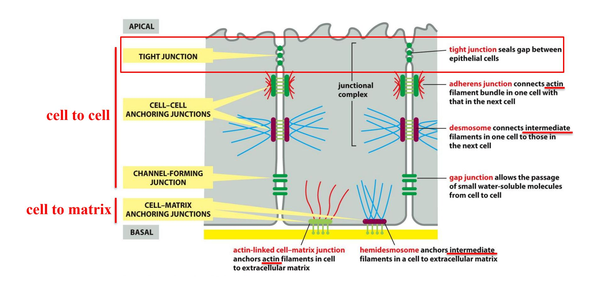

## **Tight Junctions Form a Seal Between Cells and a Fence Between Plasma Membrane Domains**

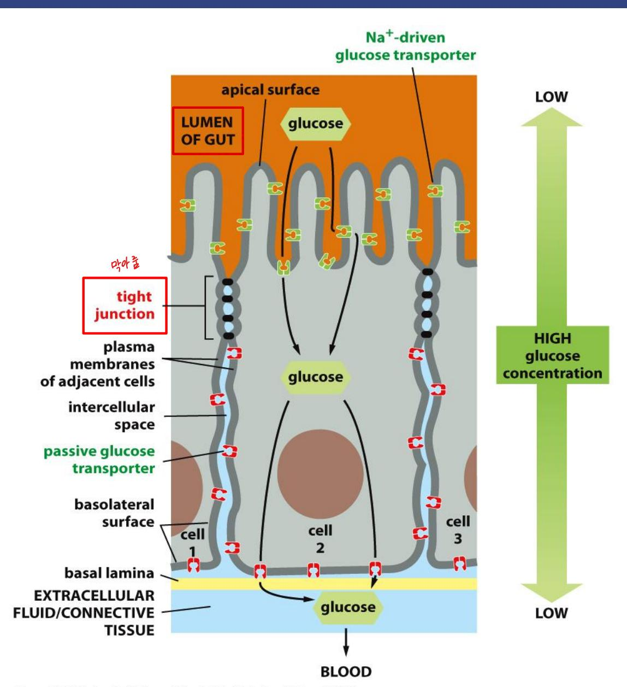

The role of tight junctions in transcellular transport:

- Diffusion barrier
- Fence function
- Confine the transport proteins
- Block the backflow of glucose

## Tight Junctions Form a Seal Between Cells and a Fence Between Plasma Membrane Domains

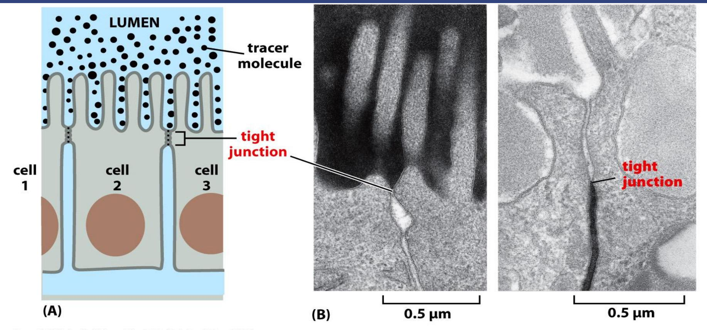

- The role of tight junctions in allowing epithelia to serve as barriers to solute diffusion
- The seal is not absolute (more permeable to inorganic ions, such as Na+) : paracellular transport

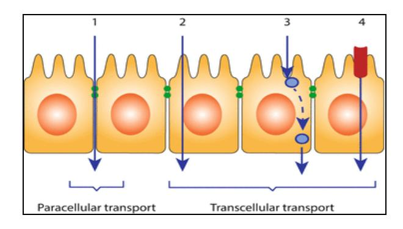

- Paracellular transport refers to the transfer of substances across an epithelium by passing through the intercellular space between the cells
- Transcellular transport is the substances travel through the cell, passing through both the apical membrane and basolateral membrane. Intestinal absorption of nutrients is thought to be dominated by transcellular transport

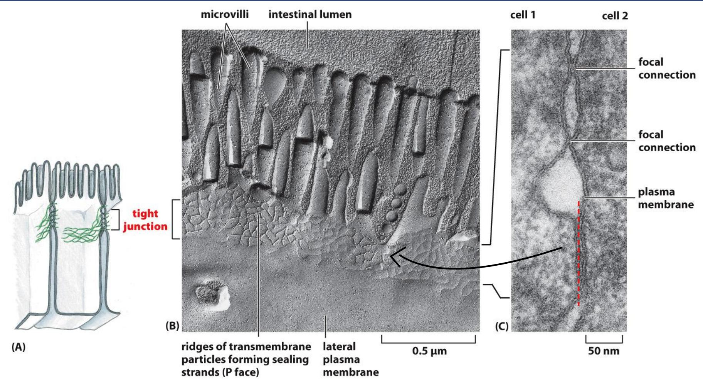

The structure of a tight junction between epithelial cells of the small intestine

## Tight Junctions Contain Strands of Transmembrane Adhesion Proteins

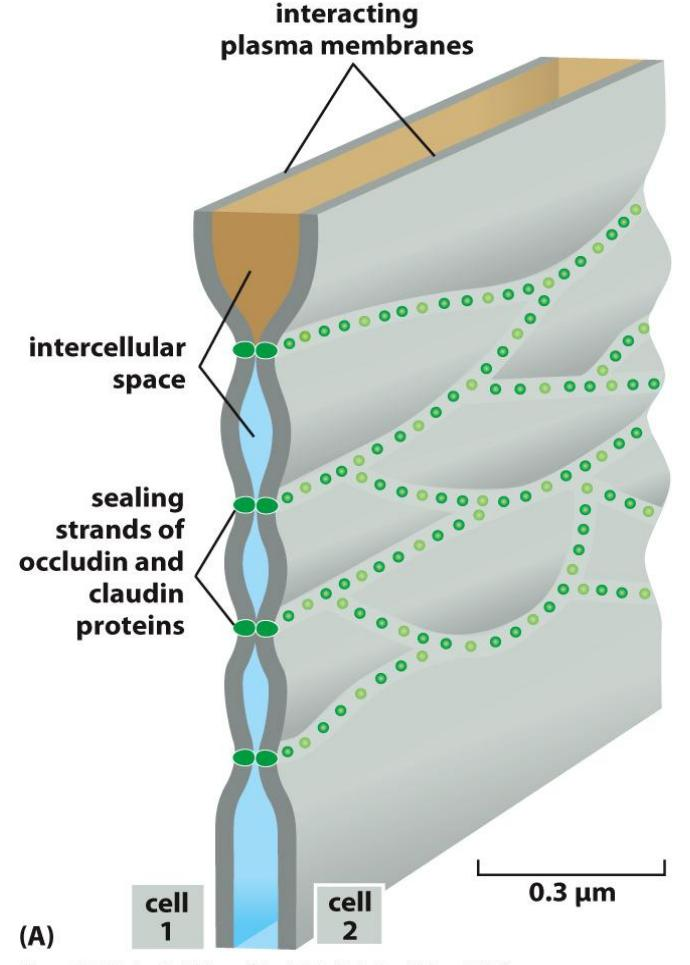

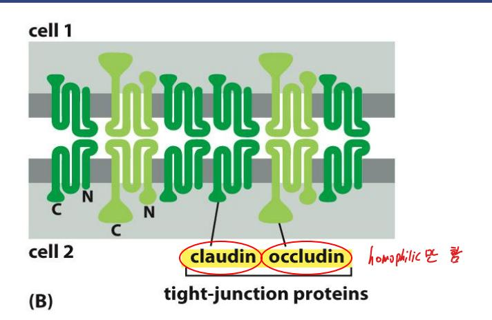

A model of a tight junction : homophilic binding

- claudin family: 24 in human
- selective channels allowing specific ions to cross the tight junctional barrier

| 유전자(단백질)               | 질환명                                      | 주요 장기/증상                                                |
|------------------------|------------------------------------------|---------------------------------------------------------|
| CLDN1 (Claudin-1)      | NISCH syndrome (선천성 비늘증-경화성 담관염)      | 피부 장벽 결함, 담도 염증/담즙정체                                    |
| CLDN14                 | 비증후성 유전성 난청 (DFNB29)                  | 달팽이관 TJ 결함 → 감각신경성 난 청                               |
| CLDN16 / CLDN19        | 가족성 저Mg혈증-고Ca 뇨-신석회화(FHHNC)           | 신세뇨관 Mg/Ca 재흡수 장애, 신석 회화; CLDN19은 시신경/망막 이상 동반 가능 |
| CLDN10                 | HELIX syndrome                           | 발한·눈물/침 분비 저하, 전해질 이 상, 피부 건조                        |
| OCLN (Occludin)        | OCLN-related pseudo- TORCH            | 대뇌 띠모양 석회화, 소뇌/피질 형성 장애, 발달지연                        |
| MARVELD2 (Tricellulin) | DFNB49 난청                                | 삼중 타이트접합 결함 → 난청                                        |
| TJP2 (ZO-2)            | PFIC type 4 <i>(진행성 가족</i> 성 간내 담즙정체) | 간세포 TJ 결함 → 담즙 누출/간부전                                   |
| JAM3                   | HDBSCC <i>(신생아기 뇌출</i> 혈·뇌석회화·백내장)    | 혈관 내피 TJ 결함, 신경발달 이상                                    |

Tight junction은 "장벽(누수 방지)" 역할이라 간담도·신장·혈관/BBB·피부 문제로 나타나기 쉽다.

## **Gap junction**

## Various cell junctions found in a vertebrate epithelial cell

• Junctions classified according to their primary functions.

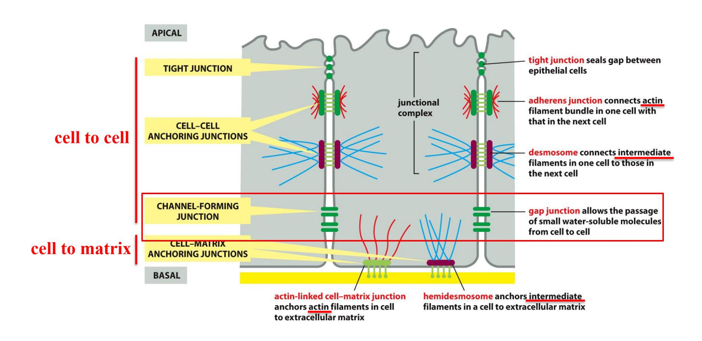

## Gap Junctions Couple Cells Both Electrically and Metabolically

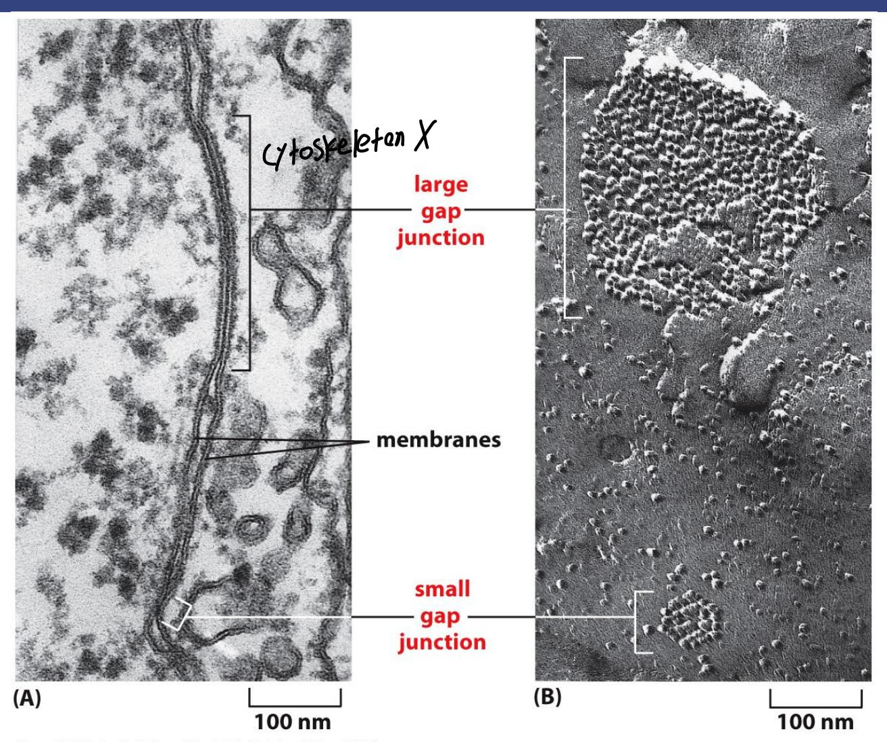

Each gap junction appears in conventional electron micrographs as a patch where the membranes of two adjacent cells are separated by a uniform narrow gap of about 2–4 nm.

## **A Gap-Junction Connexon Is Made of Six Transmembrane Connexin Subunits**

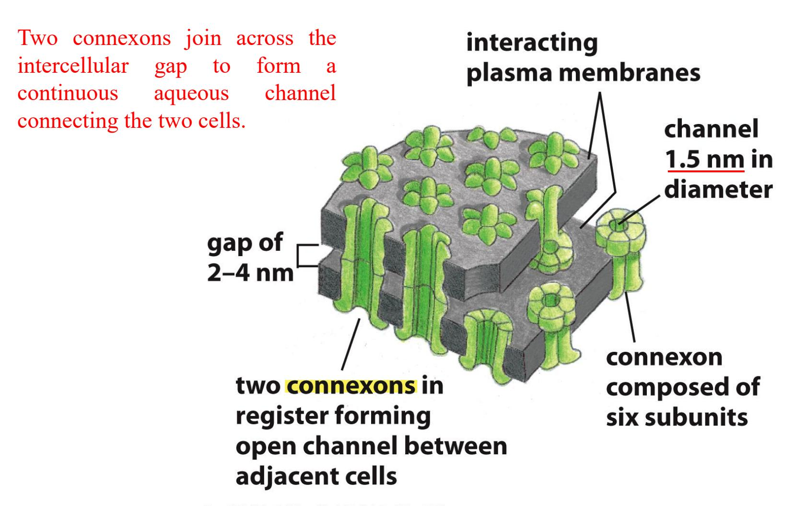

## **The size of a gap-junction channel**

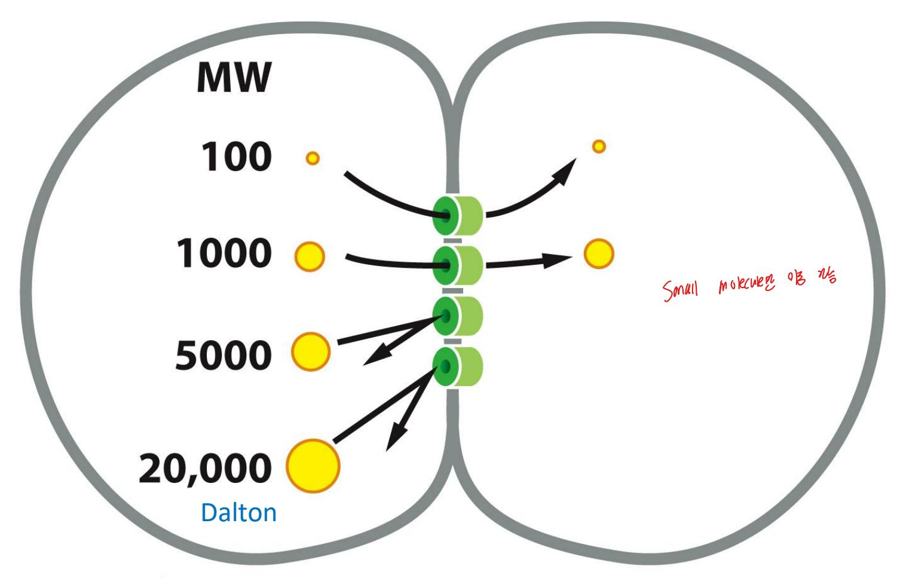

Gap junctions have a pore size of about 1.5 nm, which allows the exchange of inorganic ions and other small water-soluble molecules, but not of macromolecules such as proteins or nucleic acids.

## **Gap Junctions Couple Cells Both Electrically and Metabolically**

- An electric current injected into one cell through a microelectrode causes an electrical disturbance in the neighboring cell, due to the flow of ions carrying electric charge through gap junctions.
- → action potentials can spread rapidly from cell to cell, without the delay that occurs at chemical synapses.
- → In vertebrates, for example, electrical coupling through gap junctions synchronizes the contractions of heart muscle cells as well as those of the smooth muscle cells responsible for the peristaltic movements of the intestine.
- Gap junctions also occur in many tissues whose cells are not electrically excitable.
- → The sharing of small metabolites and ions provides a mechanism for coordinating the activities of individual cells in such tissues and for smoothing out random fluctuations in small-molecule concentrations in different cells.

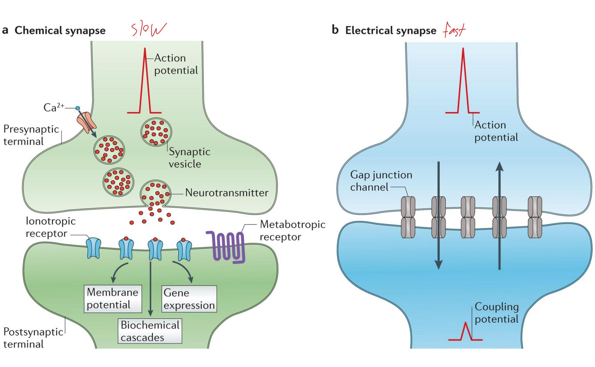

Nature Reviews | Neuroscience

## **A Gap-Junction Connexon Is Made of Six Transmembrane Connexin Subunits**

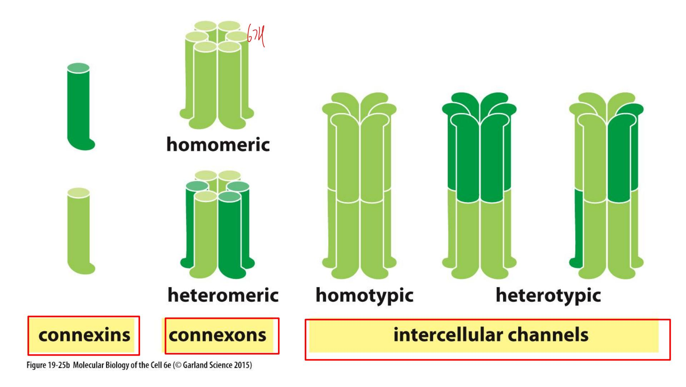

| 유전자(Connexin)                  | 질환명                                   | 주요 장기/증상                      |
|--------------------------------|---------------------------------------|-------------------------------|
| GJB2 (Cx26)                    | DFNB1 비증후성 난청 / KID syndrome       | 난청(비증후성); KID: 각막 염·어린선·난청 |
| GJB6 (Cx30)                    | DFNB1B 난청(주로 GJB2 결손과 연관)          | 감각신경성 난청                      |
| GJB1 (Cx32)                    | Charcot-Marie-Tooth disease X1     | 말초신경병(족하수, 감각저 하)          |
| GJA1 (Cx43)                    | Oculodentodigital dysplasia (ODDD) | 합지증, 법랑질 저형성, 안· 치·골 이형성   |
| GJA3 (Cx46)                    | 선천성 백내장                               | 수정체 혼탁                        |
| GJA8 (Cx50)                    | 선천성 백내장                               | 수정체 혼탁                        |
| GJB3 (Cx31) / GJB4 (Cx30.3) | Erythrokeratodermia variabilis 등   | 홍반성 반점·가변적 각화                 |
| GJA5 (Cx40)                    | 심방세동 소인/선천성 심 질환 연관                | 심방 전도 이상, 심방세동 위험          |
| GJC2 (Cx47)                    | PMD-like leukodystrophy/ 저수초백질이영양증 | 중추신경 백질 저형성, 운 동·발달지연      |

Gap junction은 "세포 간 전기·대사 커플링"이라 청각·말초신경·심장전기·수정체/피부 질환과 연결되는 경우가 많다.