# **Chapter 19 (II)** Cell Junctions and the Extracellular Matrix

### 2 main ways in animal cell bound

- The apparatus of cell junctions and the extracellular matrix is critical for every aspect of the organization, function, and dynamics of multicellular structures.
- Defects in this apparatus underlie an enormous variety of diseases.

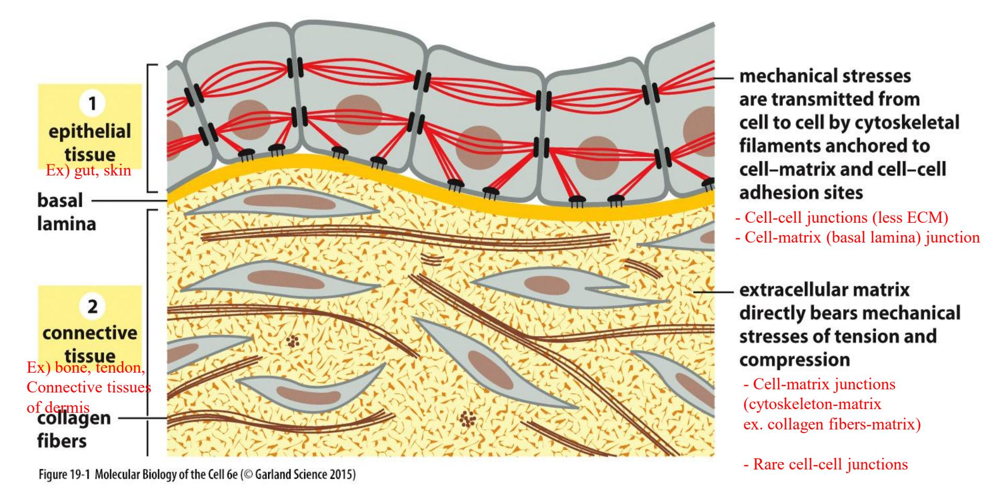

# **THE EXTRACELLULAR MATRIX OF ANIMALS**

• Many different proteins and polysaccharides that are secreted locally and assembled into an organized meshwork

### Extracellular Matrix is made and oriented by the cells within it

#### Fibroblasts in connective tissue

:The extracellular matrix surrounding the fibroblasts

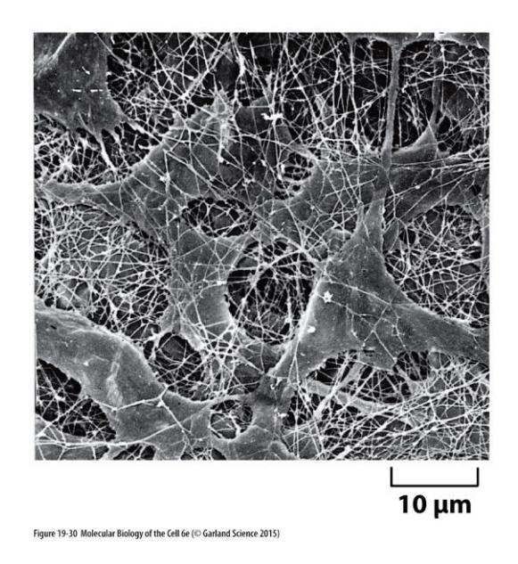

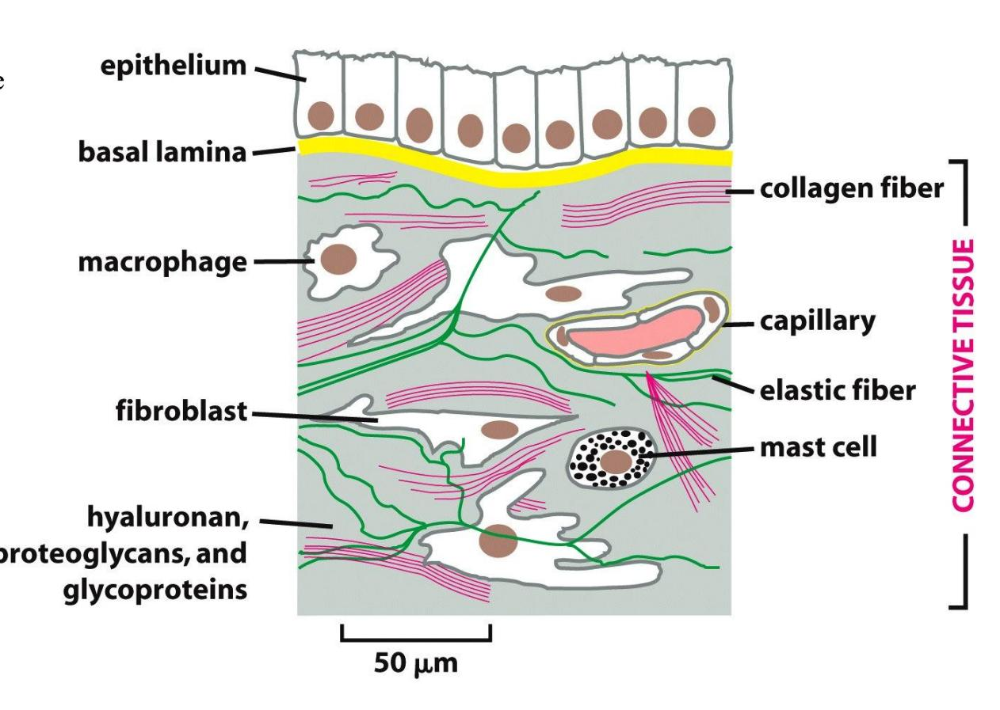

EC space is largely filled by a network of macromolecules constituting the ECM

### Three main classes of extracellular macromolecules make up the matrix

### **1. GAGs** (glycosaminoglycans)

- Long linear unbranched polysaccharide chains
- Covalently linked to protein
- Proteoglycan (GAGs + protein) form a highly hydrated, gel-like ground substance
- Polysaccharide gel
  - resists compressive forces on the matrix.
- permit the rapid diffusion of nutrients metabolites and hormones

### **2. Fibrous proteins**

- made up of polypeptide chains that are elongated
- provide strength and protection to cells and tissue

### **3. Glycoproteins**

• Asparagine-linked oligosaccharides

### **Major extracellular matrix macromolecules**

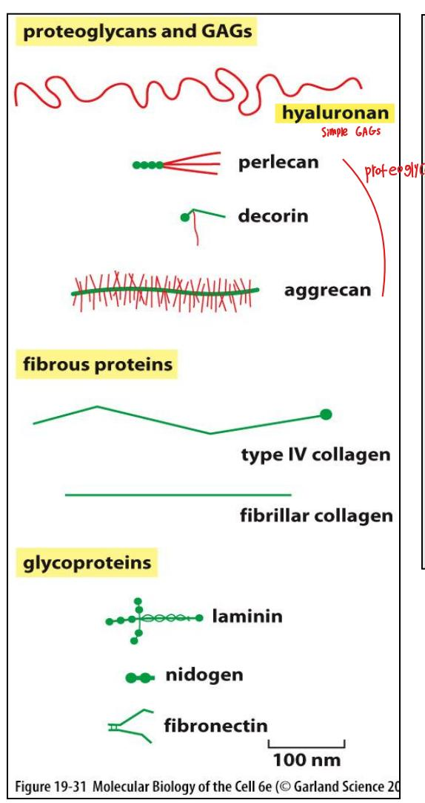

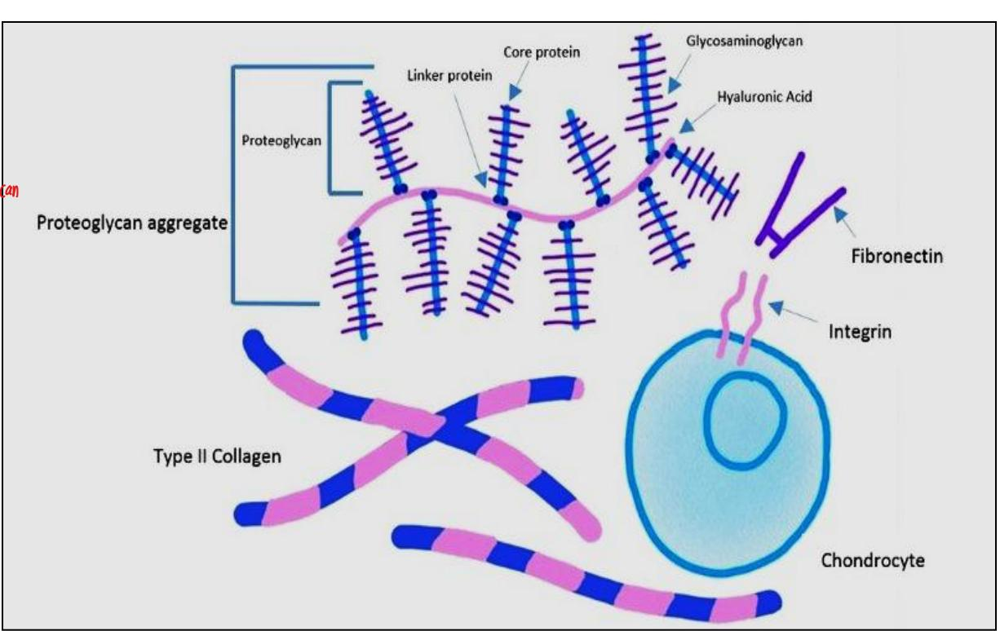

https://pediaa.com/what-is-the-difference-between-fibronectin-and-laminin/

### **Glycosaminoglycan (GAG)** Chains Occupy Large Amounts of Space and Form Hydrated Gels

- Unbranched polysaccharide chains composed of repeating disaccharide units
- Negative charged (sulfate or carboxyl groups on the sugar)
- Huge volume relative to their mass: hydration
- 4 main group: Hyaluronan, Chondroitin sulfate, Heparan sulfate, Keratan sulfate

(http://themedicalbiochemistrypage.org/glycans.php)

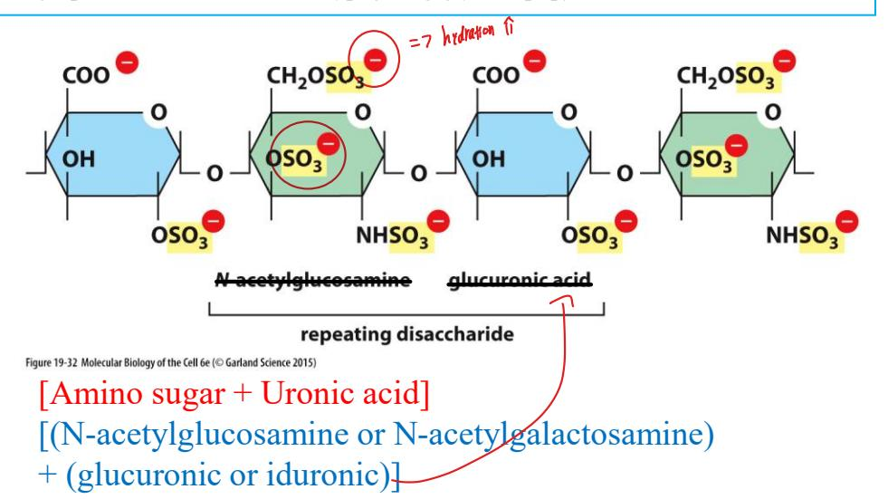

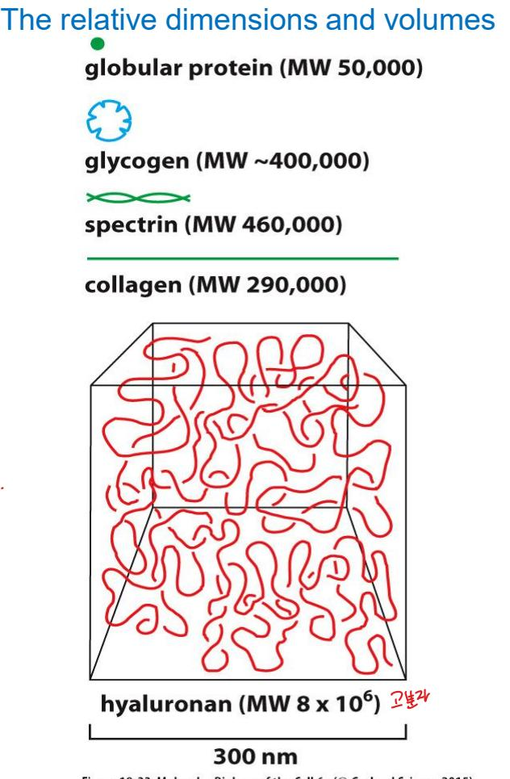

This creates a swelling pressure, or turgor, that enables the matrix to withstand compressive forces (in contrast to collagen fibrils, which resist stretching forces). The cartilage matrix that lines the knee joint, for example, can support pressures of hundreds of atmospheres in this way.

### **Hyaluronan** Acts As a Space Filler During Tissue Morphogenesis and Repair

=hyaluronic acid or hyaluronate

: repeating sequence of up to 25,000 disaccharide units

: the simplest GAGs

: no sulfated sugars : identical disaccharide units

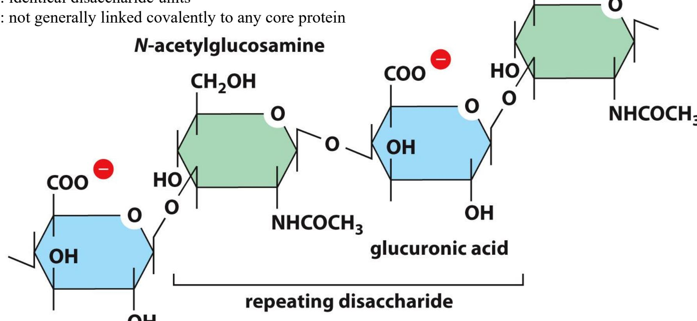

### Proteoglycans are Composed of GAG Chains Covalently Linked to a Core protein

- Except for hyaluronan, all GAGs are covalently attached to protein as proteoglycans

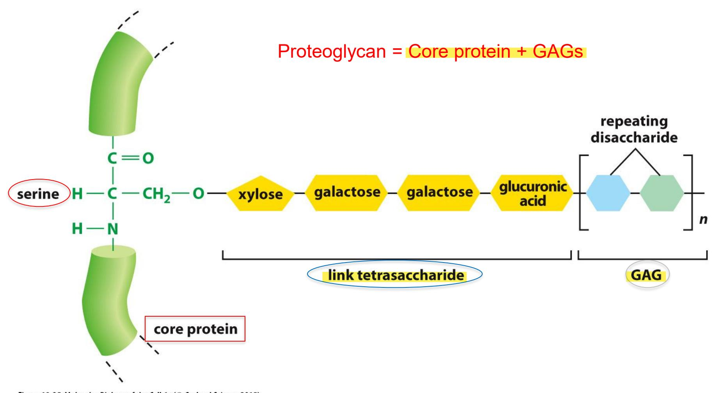

### Proteoglycans

#### Decorin

Single GAG chain Bind to collagen fibrils essential for collagen fiber formation. Mutant mice: skin fragile

#### Aggrecan:

Major component of cartilage > 100 GAG chains

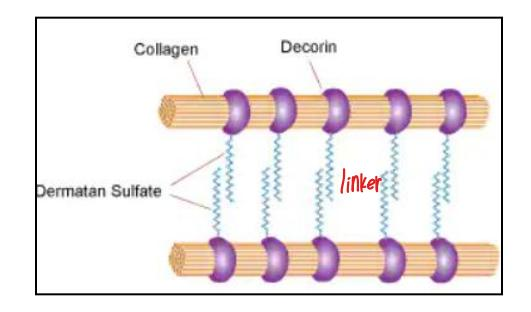

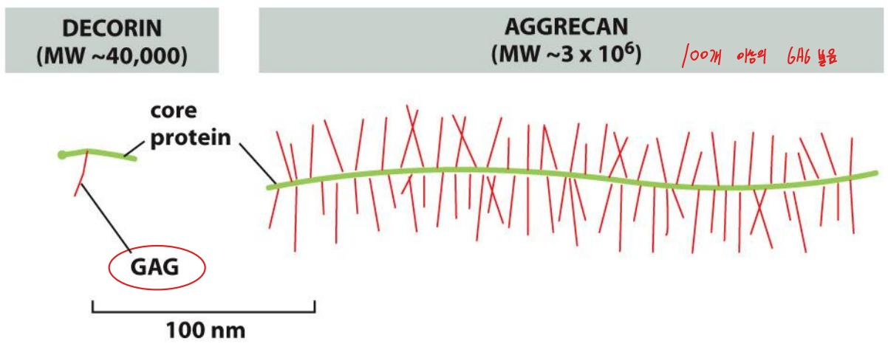

Examples of a small (decorin) and a large (aggrecan) proteoglycan found in the extracellular matrix

### Proteoglycans aggregates

GAGs and proteoglycans (e.g. decorin) associate with fibrous matrix proteins such as collagen, creating extremely complex composites.

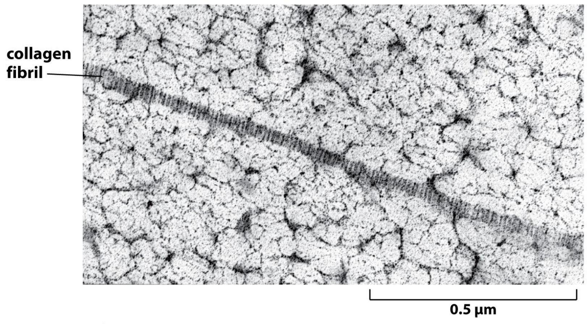

Proteoglycans in the extracellular matrix of rat cartilage

### Proteoglycans aggregates

The GAGs and proteoglycans can associate to form even larger polymeric complexes in the extracellular matrix.

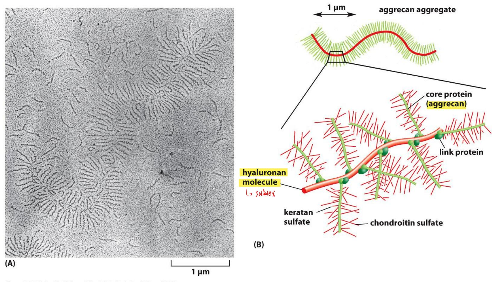

An aggrecan aggregate from fetal bovine cartilage.

### Three main classes of extracellular macromolecules make up the matrix

## **1. GAGs** (glycosaminoglycans)

- Long linear unbranched polysaccharide chains
- Covalently linked to protein
- Proteoglycan (GAGs + protein) form a highly hydrated, gel-like ground substance
- Polysaccharide gel
  - resists compressive forces on the matrix.
- permit the rapid diffusion of nutrients metabolites and hormones

### **2. Fibrous proteins (e.g. collagen, elastin)**

- made up of polypeptide chains that are elongated
- provide strength and protection to cells and tissue

### **3. Glycoproteins**

• Asparagine-linked oligosaccharides

## **Collagen**

### Collagens are the Major proteins of the Extracellular Matrix

The long, stiff, triple-stranded helical structure

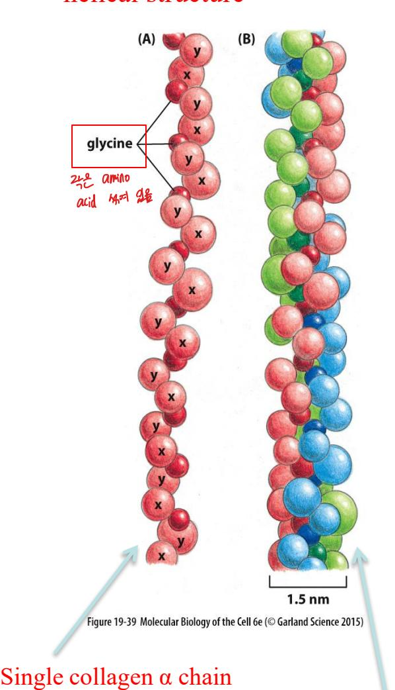

- Collagen:
- A family of fibrous proteins
- **The most abundant proteins** in mammals (about 25% of the total protein mass)
- Extremely rich in **proline and glycine**
- glycine allows the three helical chains to pack tightly
- Collagen structure:

Long (1000 AA)

Triple stranded helical structure

3 Amino acids / turn

Triplet Gly - X - Y sequence

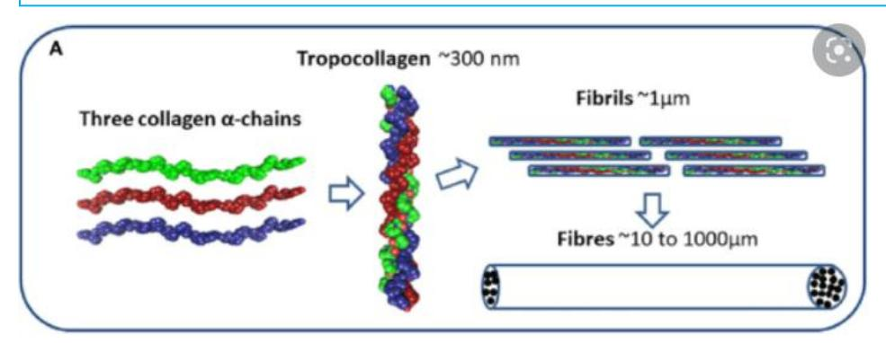

### Collagens Are the Major Proteins of the Extracellular Matrix

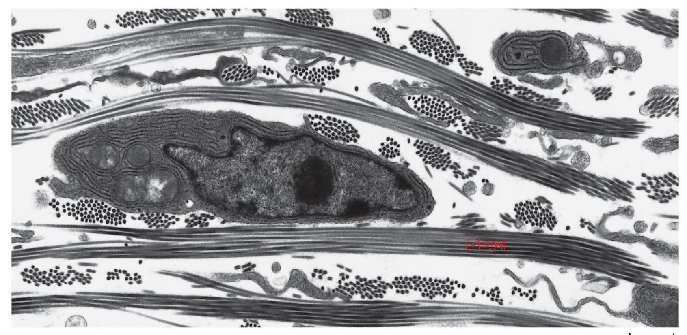

A fibroblast surrounded by collagen fibrils in the connective tissue of embryonic chick skin

- Collagen provides structural support to the extracellular space of connective tissues.
- Due to its rigidity and resistance to stretching, it is the perfect matrix for skin, tendons, bones, and ligaments.

### Collagens Are the Major Proteins of the Extracellular Matrix

|                               | Type  | Polymerized form                         | Tissue distribution                                                                               | Mutant phenotype                                                                          |
|-------------------------------|-------|------------------------------------------|---------------------------------------------------------------------------------------------------|-------------------------------------------------------------------------------------------|
| Fibril-forming (fibrillar) | 1     | Fibril                                   | Bone, skin, tendons, ligaments, cornea, internal organs (accounts for 90% of body collagen) | Severe bone defects, fractures (osteogenesis imperfecta)                                  |
|                               | II    | Fibril                                   | Cartilage, intervertebral disc, notochord, vitreous humor of the eye                              | Cartilage deficiency, dwarfism (chondrodysplasia)                                         |
|                               | Ш     | Fibril                                   | Skin, blood vessels, internal organs                                                              | Fragile skin, loose joints, blood vessels prone to rupture (Ehlers–Danlos syndrome) |
|                               | V     | Fibril (with type I)                     | As for type I                                                                                     | Fragile skin, loose joints, blood vessels prone to rupture                                |
|                               | XI    | Fibril (with type II)                    | As for type II                                                                                    | Myopia, blindness                                                                         |
| Fibril-associated             | IX    | Lateral association with type II fibrils | Cartilage                                                                                         | Osteoarthritis                                                                            |
| Network- forming           | IV    | Sheetlike network                        | Basal lamina                                                                                      | Kidney disease (glomerulonephritis), deafness                                          |
|                               | VII   | Anchoring fibrils                        | Beneath stratified squamous epithelia                                                             | Skin blistering                                                                           |
| Transmembrane                 | XVII  | Nonfibrillar                             | Hemidesmosomes                                                                                    | Skin blistering                                                                           |
| Proteoglycan core protein  | XVIII | Nonfibrillar                             | Basal lamina                                                                                      | Myopia, detached retina, hydrocephalus                                                 |

### **Secreted fibril-associated collagens help organize the fibrils**

Fibril-associated collagens (ex: type IX and XII collagen)

- Triple-stranded helical structure is interrupted by one or two **short nonhelical domains**, which makes the molecules more flexible than fibrillar collagen molecules.
- They are **not cleaved after secretion** and therefore retain their propeptides.
- They bind **in a periodic manner to the surface of fibrils** formed by the fibrillar collagens.
  - type IX molecules bind to type-II-collagen-containing fibrils in cartilage, the cornea, and the vitreous of the eye
  - type XII molecules bind to type-I-collagen-containing fibrils in tendons and various other tissues.

### Type IX collagen

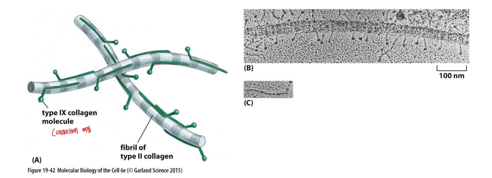

Fibril-associated collagens mediate the interaction of collagen fibrils - collagen fibrils collagen fibril - other matrix macromolecules.

### Collagens Are the Major Proteins of the Extracellular Matrix

|                               | Type  | Polymerized form                         | Tissue distribution                                                                               | Mutant phenotype                                                                    |
|-------------------------------|-------|------------------------------------------|---------------------------------------------------------------------------------------------------|-------------------------------------------------------------------------------------|
| Fibril-forming (fibrillar) | I     | Fibril                                   | Bone, skin, tendons, ligaments, cornea, internal organs (accounts for 90% of body collagen) | Severe bone defects, fractures (osteogenesis imperfecta)                            |
|                               | II    | Fibril                                   | Cartilage, intervertebral disc, notochord, vitreous humor of the eye                              | Cartilage deficiency, dwarfism (chondrodysplasia)                                   |
|                               | Ш     | Fibril                                   | Skin, blood vessels, internal organs                                                              | Fragile skin, loose joints, blood vessels prone to rupture (Ehlers–Danlos syndrome) |
|                               | V     | Fibril (with type I)                     | As for type I                                                                                     | Fragile skin, loose joints, blood vessels prone to rupture                          |
|                               | ΧI    | Fibril (with type II)                    | As for type II                                                                                    | Myopia, blindness                                                                   |
| Fibril-associated             | IX    | Lateral association with type II fibrils | Cartilage                                                                                         | Osteoarthritis                                                                      |
| Network- forming           | IV    | Sheetlike network                        | Basal lamina                                                                                      | Kidney disease (glomerulonephritis), deafness                                    |
|                               | VII   | Anchoring fibrils                        | Beneath stratified squamous epithelia                                                             | Skin blistering                                                                     |
| Transmembrane                 | XVII  | Nonfibrillar                             | Hemidesmosomes                                                                                    | Skin blistering                                                                     |
| Proteoglycan core protein     | XVIII | Nonfibrillar                             | Basal lamina                                                                                      | Myopia, detached retina, hydrocephalus                                           |

| Syndrome with     |
|-------------------|
| connective tissue |
| abnormalities     |

### **Features and Abnormalities**

Ehlers-Danlos Syndrome

Prematurely wrinkled skin, Fragile, small blood vessels Soft, velvety, stretchy skin that bruises easily mutations in the gene for type III procollagen **(***COL3A1)*

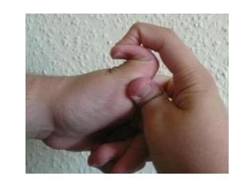

Osteogenesis imperfecta

A group of genetic disorders that mainly affect the bones

Mutations in the *COL1A1 or COL1A2* genes that encode the chains of type I procollagen, the major pro tein in bone. More than 250 mutations in both genes in OI patients

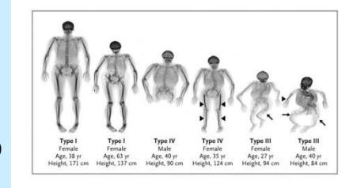

Stickler syndrome Genetic disorders affecting connective tissue, specifically collagen that results in variable problems with vision, hearing and facial and skeletal development *(COL11A1)*

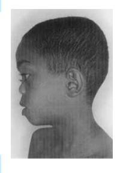

Marfan syndrome Connective tissue is abnormal (heart and blood vessels, eyes, bones, lungs, and covering of the spinal cord) *(Fibrillin-1)*

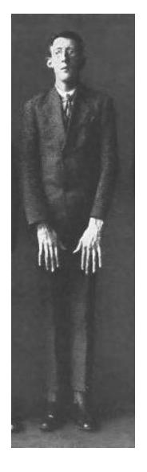

## Osteogenesis imperfecta (골형성부전)

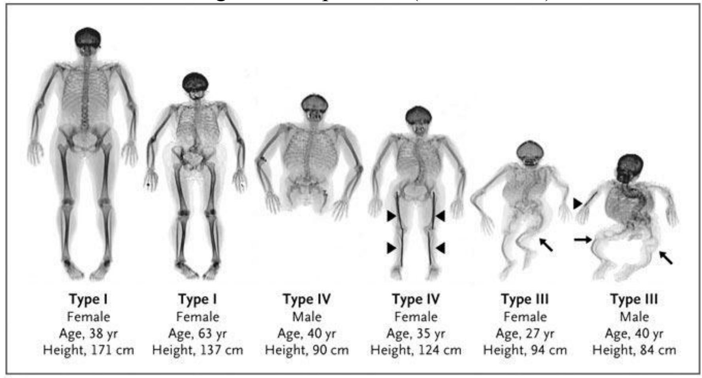

Type I - Mild forms Type III - Severe

Type IV - Undefined

## **Elastin**

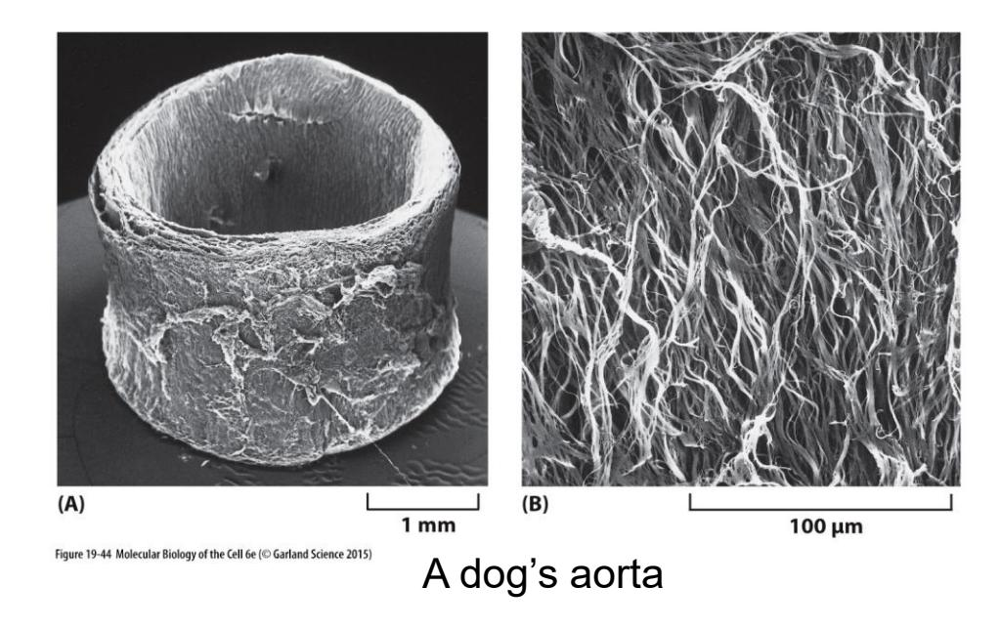

- Elastin gives tissues their elasticity in blood vessels such as the aorta
- Elastin is also very important in the lungs, elastic ligaments, elastic cartilage, the skin, and the bladder.

#### Elastin Gives Tissues Their Elasticity

#### stretch and recoil like a rubber band

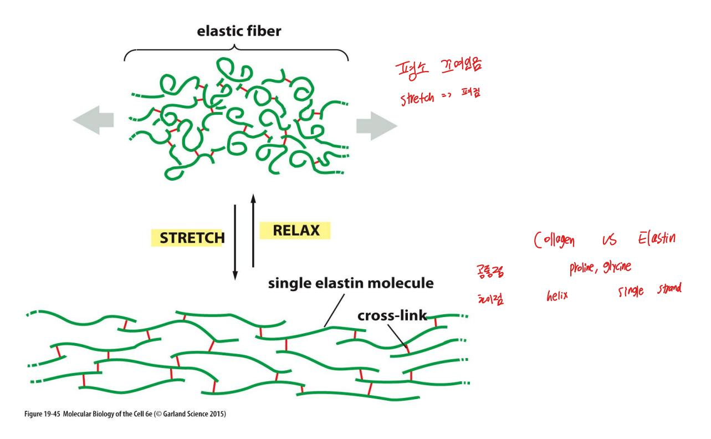

#### • Elastin

- The main component of elastic fiber
- a highly hydrophobic protein (~750 AA long)
- unusually proline and glycine rich (like collagen)
- is not glycosylated

## Elastin related disease

- The ELN gene encodes a protein called tropoelastin that is one of the two components of elastic fibers.
- Mutations in ELN gene are associated with aortic stenosis (대동맥 협착증), Cutis laxa (피부이완증), Marfan syndrome, and so on.
- Elastosis (탄력섬유증) refers to degenerative changes in the dermal tissue with increased deposition of elastin material. In solar elastosis, skin loses its strength and flexibility.

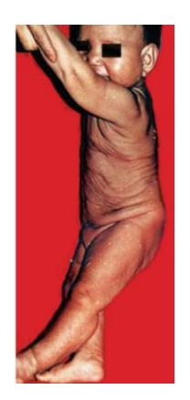

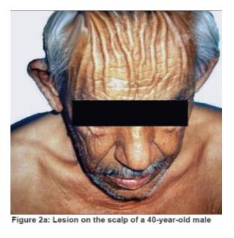

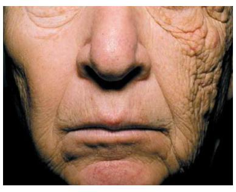

Cutis laxa solar elastosis

**Syndrome with connective tissue abnormalities**

### **Features and Abnormalities**

Marfan Syndrome (지주지증, 거미손가락) Connective tissue is abnormal (heart and blood vessels, eyes, bones, lungs, and covering of the spinal cord) *(Fibrillin-1)*

- Fibrillin-1 is a large, extracellular matrix glycoprotein that serves as a structural component of microfibrils.
- These microfibrils provide force bearing structural support in elastic and nonelastic connective tissue throughout the body.

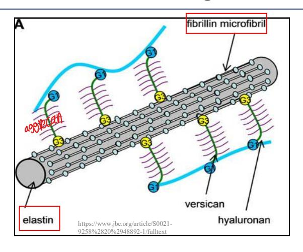

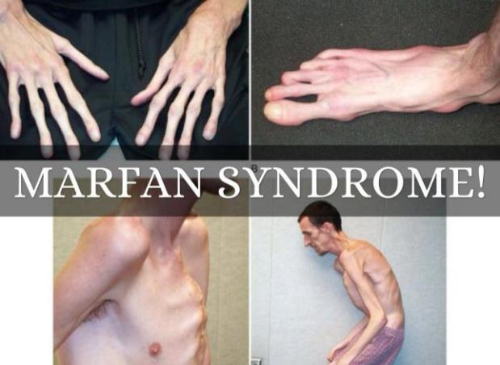

[http://c14608526.r26.cf2.rackcdn.com/A5D9EF2B-8D6B-4D37-A64C-62876C462AB7.jpg](https://www.google.co.kr/url?sa=i&rct=j&q=&esrc=s&source=images&cd=&cad=rja&uact=8&ved=0CAcQjRxqFQoTCOfj5aaP88gCFQRQpgod4WUGbg&url=https://www.haikudeck.com/manfan-syndrome-education-presentation-9mRerIpros&bvm=bv.106379543,d.dGY&psig=AFQjCNEY_FUARGtj7Q0XwFnZoC-x5u5f6w&ust=1446600933925413)

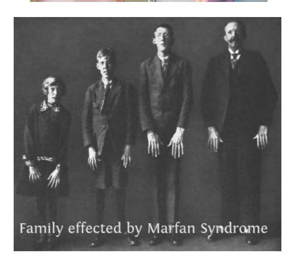

### Three main classes of extracellular macromolecules make up the matrix

### **1. GAGs** (glycosaminoglycans)

- Long linear unbranched polysaccharide chains
- Covalently linked to protein
- Proteoglycan (GAGs + protein) form a highly hydrated, gel-like ground substance
- Polysaccharide gel
  - resists compressive forces on the matrix.
- permit the rapid diffusion of nutrients metabolites and hormones

### **2. Fibrous proteins**

- made up of polypeptide chains that are elongated
- provide strength and protection to cells and tissue

### **3. Glycoproteins**

• Asparagine-linked oligosaccharides

### **Fibronectin and other multidomain glycoproteins help organize the matrix**

## Complex glycoproteins of the extracellular matrix

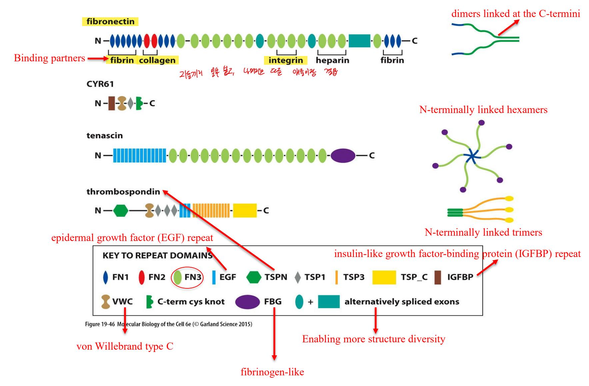

### **Fibronectin (FN)**

- Fibronectin: found in all vertebrates and important for cell-matrix interactions
- Fibronectin mutant mice die early in embryogenesis because endothelial cell fail to form proper blood vessels
- Fibronectin mutation was correlated to glomerulopathy (사구체병증), sclerosis (경화증), neural tube formation, increased virulence of bacteria infection, and so on.

RGD sequence can compete with fibronectin for the binding site on the integrin of cells, thereby inhibiting the attachment of the cells to a fibronectin matrix.

#### → **Anti-clotting drugs containing RGD sequence**

: Some snakes secrete RGD-containing anti-clotting proteins called disintegrins into their venom to cause their victims to bleed.

### Unfolding of a type III FN domain in response to tension

- Soluble FN: circulating in the blood and body fluid forming a blood clot at the site of injury
- Insoluble FN: FN fibrils, form part of ECM

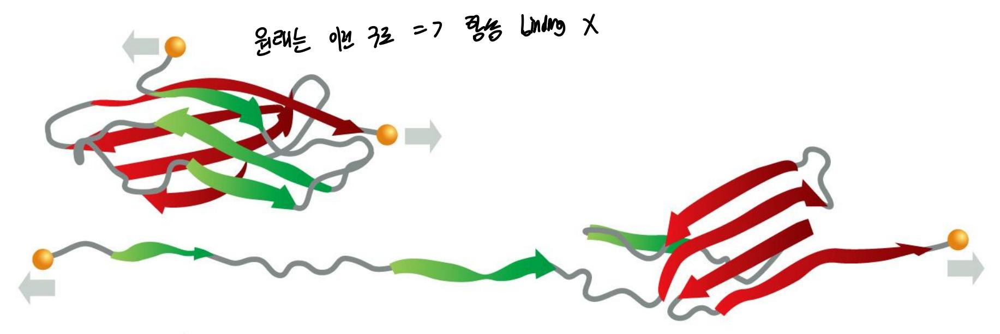

Some type III fibronectin repeats are thought to unfold when fibronectin is stretched. The unfolding exposes cryptic binding sites that interact with other fibronectin molecules resulting in the formation of fibronectin filaments.

**FN assemble only on the surface of the cell possess FN binding protein, such as integrin**

### Integrin-Fibronectin-ECM connection

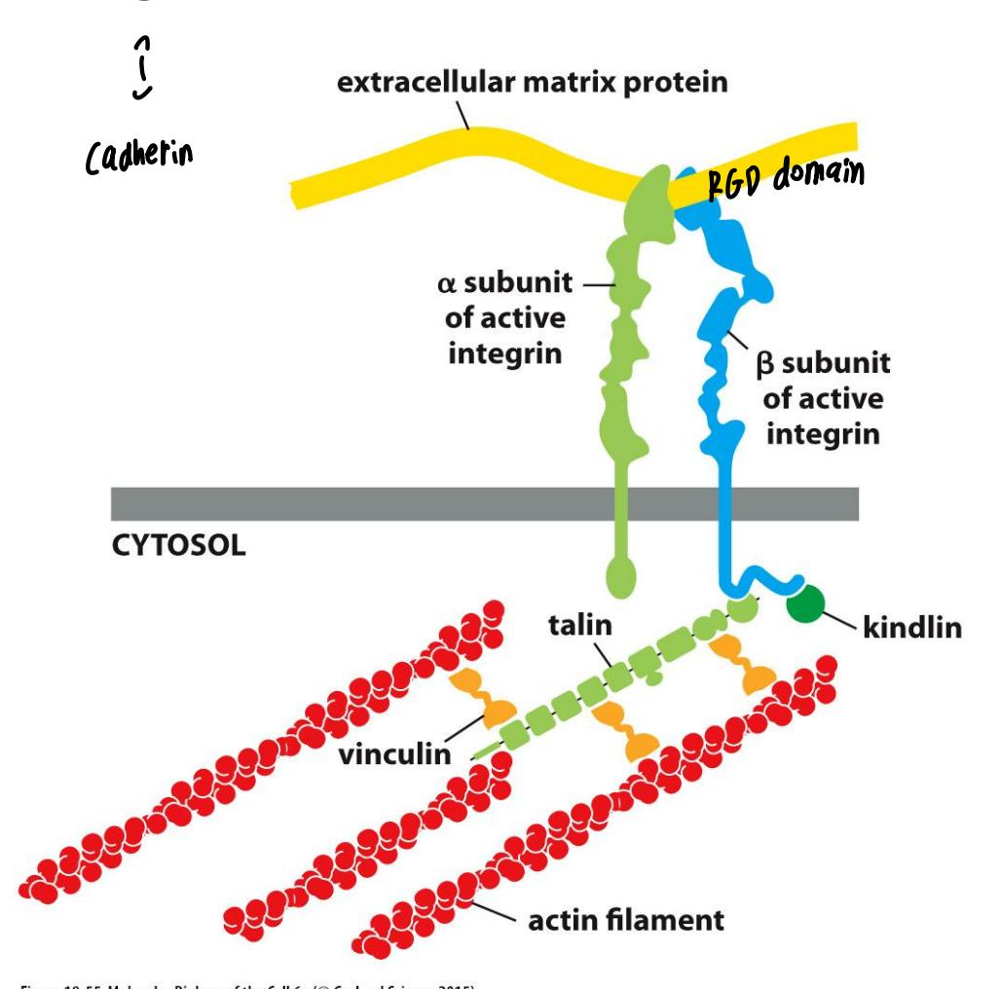

•Organization of the FN into fibrils at the cell surface

FN: EC adhesion protein

Actin: inside of the cell

Integrin: link the FN to actin fil

•FN assemble where there is a mechanical need for them (not in blood stream)

### **Transmembrane adhesion proteins link the cytoskeleton to extracellular structures.**

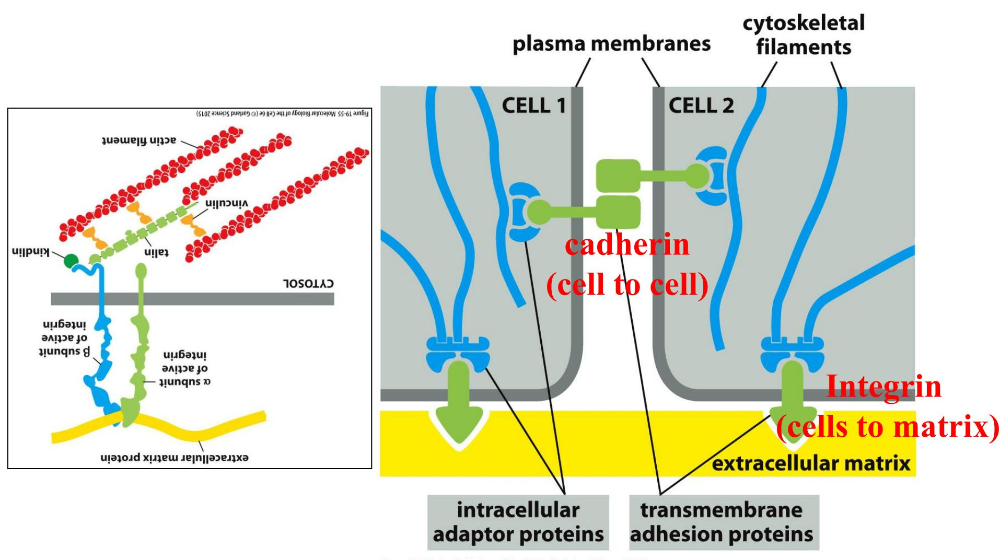

### **Organization of fibronectin into fibrils at the cell surface**

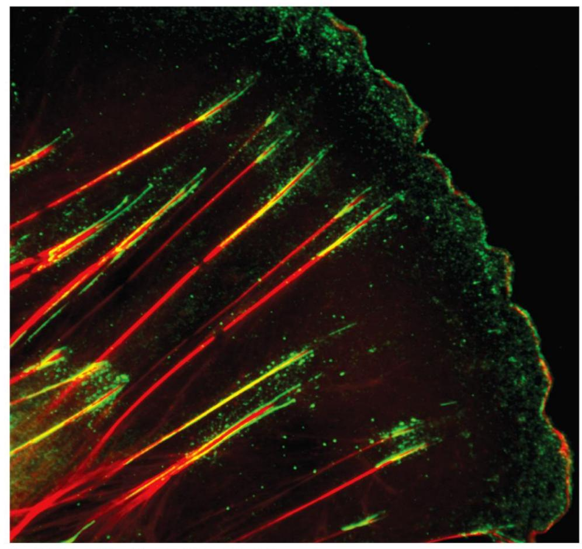

Extracellular fibronectin is stained green and intracellular actin filaments are stained red. The fibronectin is initially present as small dotlike aggregates near the leading edge of the cell. It accumulates and becomes organized into fibrils parallel to the actin filaments. Integrin molecules spanning the cell membrane link the fibronectin outside the cell to the actin filaments inside it. Tension exerted on the fibronectin molecules through this linkage is thought to stretch them, exposing binding sites that promote fibril formation.

### Collagen XVIII and fibronectin involvement in bullous scleroderma

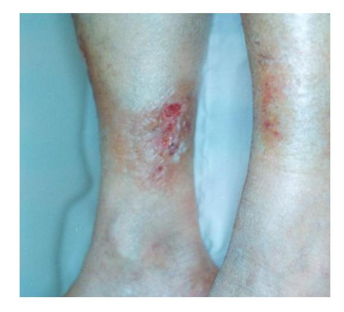

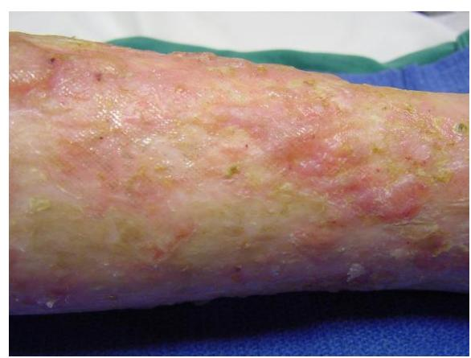

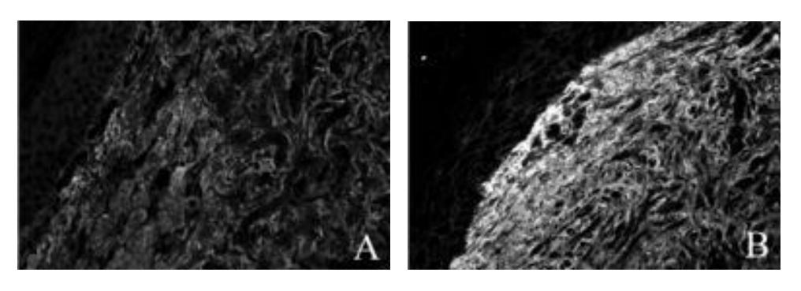

**Fibronectin deposition** in normal (*a*) and **scleroderma skin** (*b*), showing increased deposition in the scleroderma.

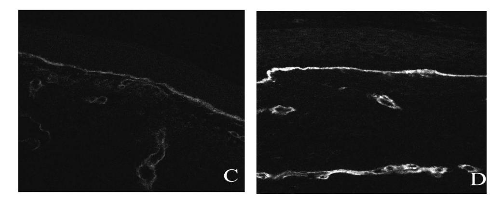

Collagen XVIII in normal (*c*) and scleroderma (피부경화증) patient (*d*).

#### **2 main ways in animal cell bound** 2 main ways in animal cell bound

- The apparatus of cell junctions and the extracellular matrix is critical for every aspect of the organization, function, and dynamics of multicellular structures.
- Defects in this apparatus underlie an enormous variety of diseases.

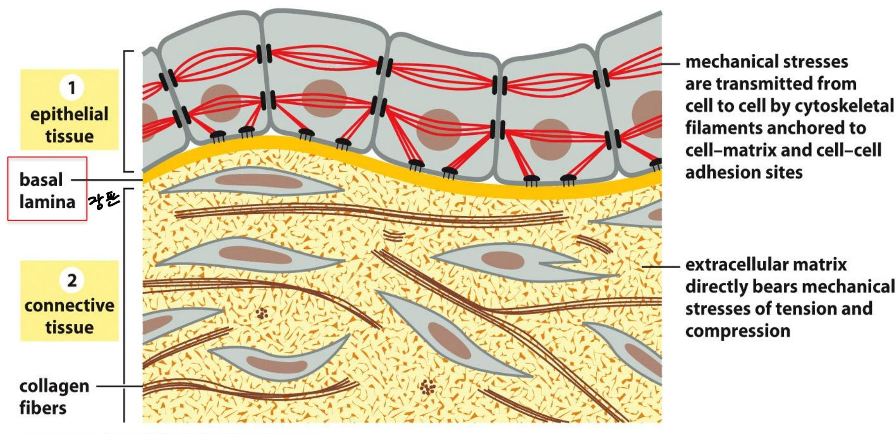

### **The structure of basal lamina observed by SEM**

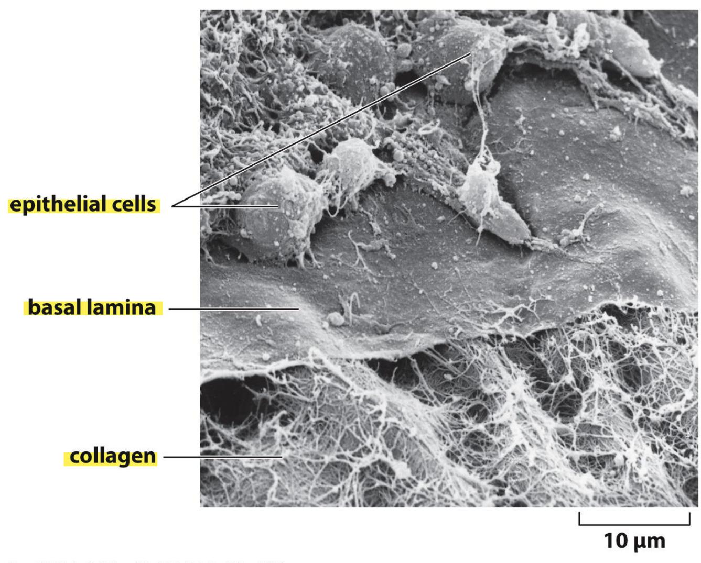

### **The Basal Lamina Is a Specialized Form of Extracellular Matrix**

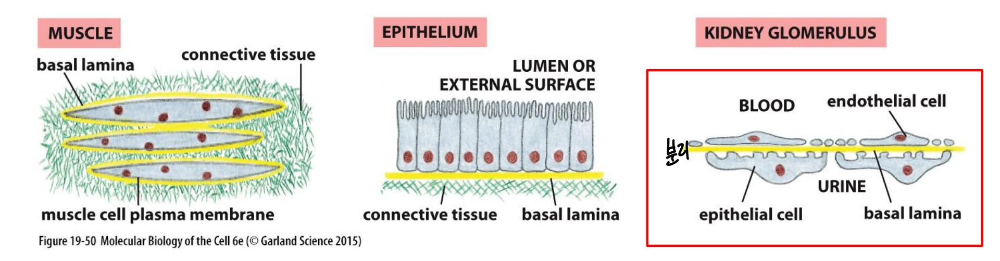

- Basal laminae are typically 40–120 nm thick.
- A sheet of basal lamina not only lies beneath epithelial cells but also surrounds individual muscle cells. The basal lamina thus separates these cells and epithelia from the underlying or surrounding connective tissue and forms the mechanical connection between them.
- In the skin, for example, the epithelial outer layer—the epidermis—depends on the strength of the basal lamina to keep it attached to the underlying connective tissue
- In the kidney glomerulus, a basal lamina lies between two cell sheets and functions as a selective filter.
- •Defective laminins can cause to diseases such as muscular dystrophy, lethal skin blistering disease (junctional epidermolysis bullosa), and defects of the kidney filter (nephrotic syndrome).

### **Genetic defects in certain basal lamina proteins**

Junctional epidermolysis bullosa (연접부수포성표피박리증, 물집표피박리증)

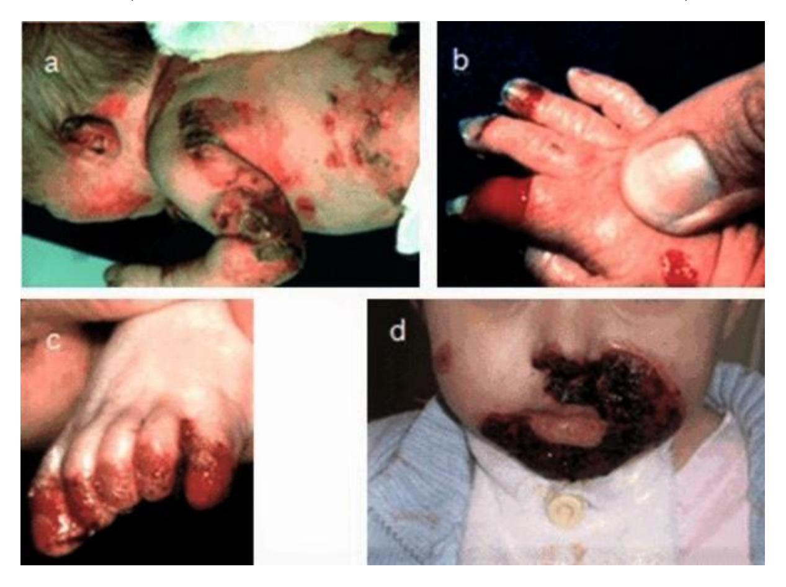

The epidermis becomes detached from the dermis.

#### **Laminin and Type IV Collagen Are Major Components of the Basal Lamina**

#### The structure of **laminin (glycoprotein)**

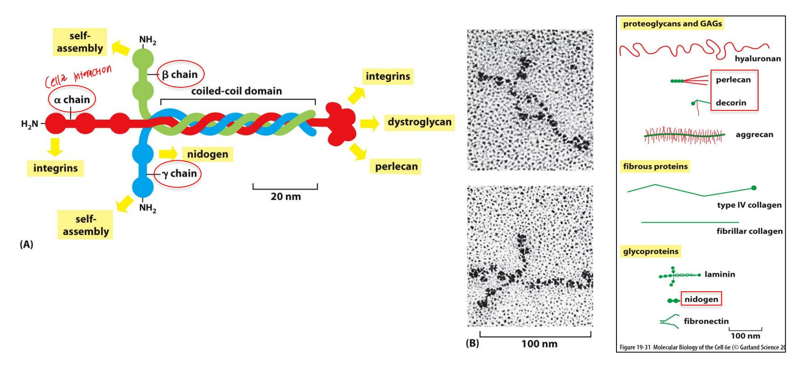

• Laminins are heterotrimeric proteins that contain an α-chain, a β-chain, and a γ-chain

### **Laminin and Type IV Collagen Are Major Components of the Basal Lamina**

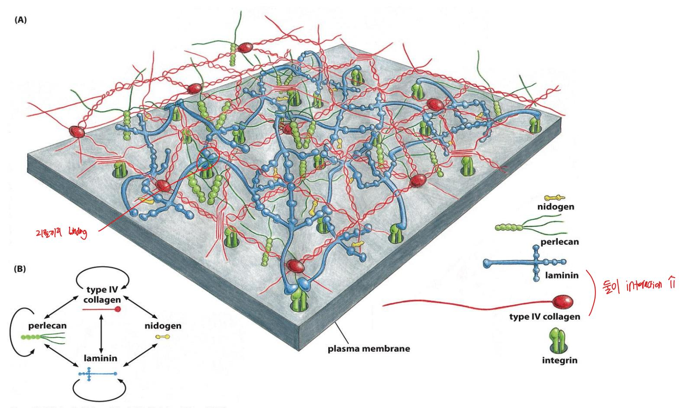

#### **A model of the molecular structure of a basal lamina**

Laminin and type IV collagen interact with other basal lamina components, such as the glycoprotein nidogen and the proteoglycan perlecan, resulting in a highly cross-linked network of proteins and proteoglycans

### Collagens Are the Major Proteins of the Extracellular Matrix

| TABLE 19-2 Some               | Types o                                     | f Collagen and Their P | roperties                                                                                         |                                                                                     |
|-------------------------------|---------------------------------------------|------------------------|---------------------------------------------------------------------------------------------------|-------------------------------------------------------------------------------------|
|                               | Туре                                        | Polymerized form       | Tissue distribution                                                                               | Mutant phenotype                                                                    |
| Fibril-forming (fibrillar) | I                                           | Fibril                 | Bone, skin, tendons, ligaments, cornea, internal organs (accounts for 90% of body collagen) | Severe bone defects, fractures (osteogenesis imperfecta)                            |
|                               | II                                          | Fibril                 | Cartilage, intervertebral disc, notochord, vitreous humor of the eye                              | Cartilage deficiency, dwarfism (chondrodysplasia)                                   |
|                               | Ш                                           | Fibril                 | Skin, blood vessels, internal organs                                                              | Fragile skin, loose joints, blood vessels prone to rupture (Ehlers-Danlos syndrome) |
|                               | V                                           | Fibril (with type I)   | As for type I                                                                                     | Fragile skin, loose joints, blood vessels prone to rupture                          |
|                               | ΧI                                          | Fibril (with type II)  | As for type II                                                                                    | Myopia, blindness                                                                   |
| Fibril-associated             | IX Lateral association with type II fibrils |                        | Cartilage                                                                                         | Osteoarthritis                                                                      |
| Network- forming           | IV                                          | Sheetlike network      | Basal lamina                                                                                      | Kidney disease (glomerulonephritis), deafness                                    |
|                               | VII                                         | Anchoring fibrils      | Beneath stratified squamous epithelia                                                             | Skin blistering                                                                     |
| Transmembrane                 | XVII                                        | Nonfibrillar           | Hemidesmosomes                                                                                    | Skin blistering                                                                     |
| Proteoglycan core protein  | XVIII                                       | Nonfibrillar           | Basal lamina                                                                                      | Myopia, detached retina, hydrocephalus                                           |

### A human hereditary kidney disorder (Alport syndrome)

### **Mutations in a type IV collagen gene result in an irregularly thickened and dysfunctional glomerular filter.**

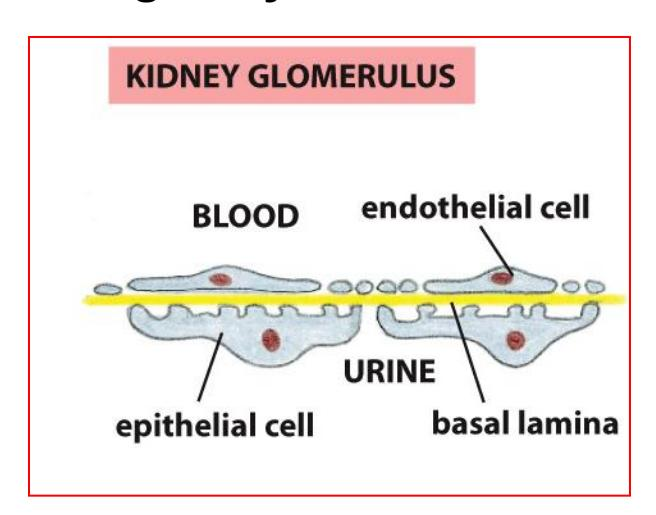

GBM: glomerular basement membrane

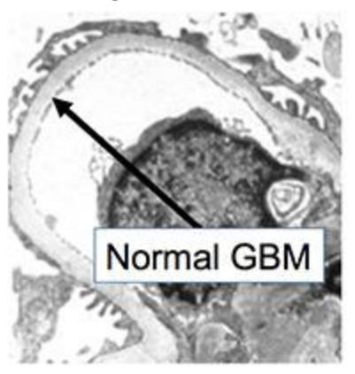

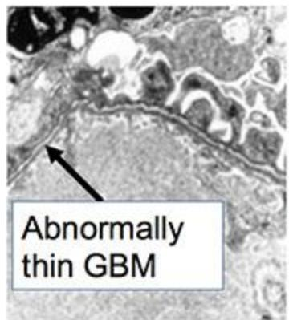

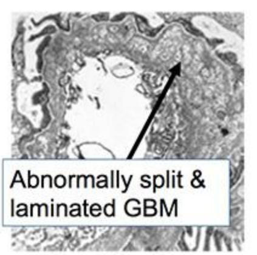

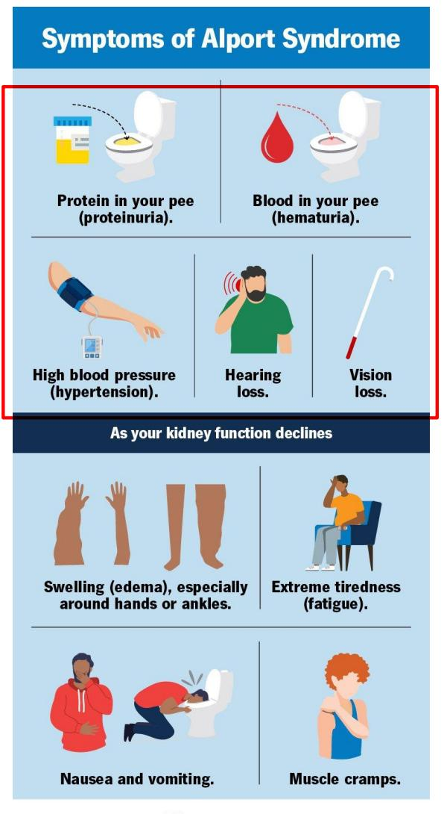

### Regeneration experiments demonstrating the special character of the junctional basal lamina at a neuromuscular junction

experiments show that the junctional basal lamina controls the localization of

synaptic components on both sides of the lamina.

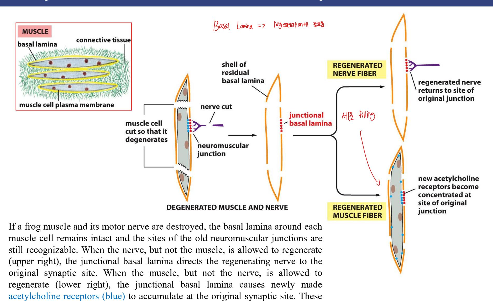

### Various cell junctions found in a vertebrate epithelial cell

• Junctions classified according to their primary functions.

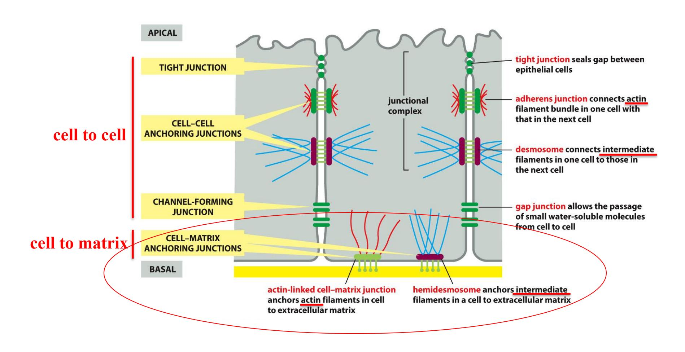

### **Integrins Are Transmembrane Heterodimers That Link the Extracellular Matrix to the Cytoskeleton**

The subunit structure of an active integrin molecule, linking extracellular matrix to the actin cytoskeleton. C-terminal tails Large N-terminals

### **Hemidesmosomes**

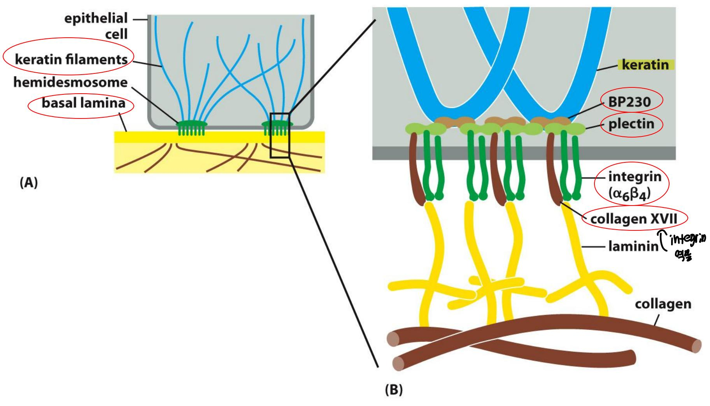

### **Some Types of Integrins**

Humans contain 24 types of integrins, formed from the products of 8 different β-chain genes and 18 different α-chain genes, dimerized in different combinations.

| ntegrin                              | Ligand*                                       | Distribution                | Phenotype when $\alpha$ subunit is mutated                       | Phenotype when β subunit is mutated                                                                                   |
|--------------------------------------|-----------------------------------------------|-----------------------------|------------------------------------------------------------------|-----------------------------------------------------------------------------------------------------------------------|
| $a_5\beta_1$                         | Fibronectin                                   | Ubiquitous                  | Death of embryo; defects in blood vessels, somites, neural crest | Early death of embryo (at implantation)                                                                            |
| $\alpha_6 \beta_1$                   | Laminin                                       | Ubiquitous                  | Severe skin blistering; defects in other epithelia also          | Early death of embryo (at implantation)                                                                               |
| $\kappa_{7}\beta_{1}$                | Laminin                                       | Muscle                      | Muscular dystrophy; defective myotendinous junctions             | Early death of embryo (at implantation)                                                                            |
| χ L β 2 (LFA1) | Ig superfamily counterreceptors (ICAM1) | White blood cells           | Impaired recruitment of leucocytes                               | Leucocyte adhesion deficience (LAD); impaired inflammatory responses; recurrent life- threatening infections |
| $x_{IIb}\beta_3$                     | Fibrinogen                                    | Platelets                   | Bleeding; no platelet aggregation (Glanzmann's disease)    | Bleeding; no platelet aggregation (Glanzmann's disease); mild osteopetrosis                                           |
| $x_6\beta_4$                         | Laminin                                       | Hemidesmosomes in epithelia | Severe skin blistering; defects in other epithelia also          | Severe skin blistering; defects in other epithelia also                                                               |

### **Fibronectin (FN)**

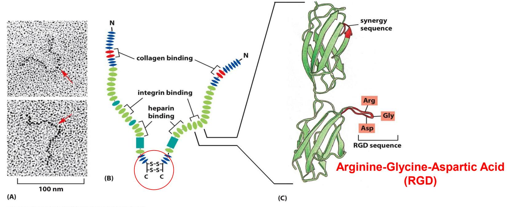

### **Some Types of Integrins**

Humans contain 24 types of integrins, formed from the products of 8 different β-chain genes and 18 different α-chain genes, dimerized in different combinations.

| Integrin                  | Ligand*                                       | Distribution                | Phenotype when α subunit is mutated                              | Phenotype when β subunit is mutated                                                                                   |
|---------------------------|-----------------------------------------------|-----------------------------|------------------------------------------------------------------|-----------------------------------------------------------------------------------------------------------------------|
| $\alpha_5 \beta_1$        | Fibronectin                                   | Ubiquitous                  | Death of embryo; defects in blood vessels, somites, neural crest | Early death of embryo (at implantation)                                                                            |
| $\alpha_6 \beta_1$        | Laminin                                       | Ubiquitous                  | Severe skin blistering; defects in other epithelia also          | Early death of embryo (at implantation)                                                                               |
| $\alpha_{7}\beta_{1}$     | Laminin                                       | Muscle                      | Muscular dystrophy; defective myotendinous junctions             | Early death of embryo (at implantation)                                                                               |
| $\alpha_L \beta_2$ (LFA1) | Ig superfamily counterreceptors (ICAM1) | White blood cells           | Impaired recruitment of leucocytes                               | Leucocyte adhesion deficience (LAD); impaired inflammatory responses; recurrent life- threatening infections |
| $\alpha_{IIb} \beta_{3}$  | Fibrinogen                                    | Platelets                   | Bleeding; no platelet aggregation (Glanzmann's disease)          | Bleeding; no platelet aggregation (Glanzmann's disease); mild osteopetrosis                                           |
| $\alpha_6 \beta_4$        | Laminin                                       | Hemidesmosomes in epithelia | Severe skin blistering; defects in other epithelia also          | Severe skin blistering; defects in other epithelia also                                                               |
| *Not all ligan            | ds are listed.                                |                             |                                                                  |                                                                                                                       |

### **Some Types of Integrins**

Humans contain 24 types of integrins, formed from the products of 8 different β-chain genes and 18 different α-chain genes, dimerized in different combinations.

| Endothelial cells |  |  |
|-------------------|--|--|
|                   |  |  |
|                   |  |  |
|                   |  |  |

#### Integrins in cell-to-cell interactions

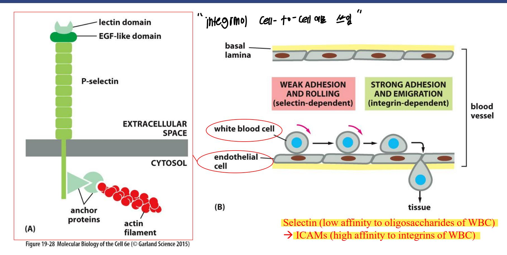

- The endothelial cells switch on expression of selectins that recognize the oligosaccharides on white blood cells and platelets, flagging the cells down to help deal with the local emergency.
- Integrins strengthen the binding of the blood cells to the endothelium. The chief endothelial cell proteins that are recognized by the white blood cell integrins are called ICAMs (intercellular cell adhesion molecules) or VCAMs (vascular cell adhesion molecules).
- The selectins mediate a weak adhesion because the binding of the lectin domain of the selectin to its carbohydrate ligand is of low affinity. This allows the white blood cell to adhere weakly and reversibly to the endothelium, rolling along the surface of the blood vessel, propelled by the flow of blood. The rolling continues until the white blood cell activates its integrins.

### Two members of the Ig superfamily of cell–cell adhesion molecules

neural cell adhesion molecule (NCAM)

: various cell types, including most nerve cells

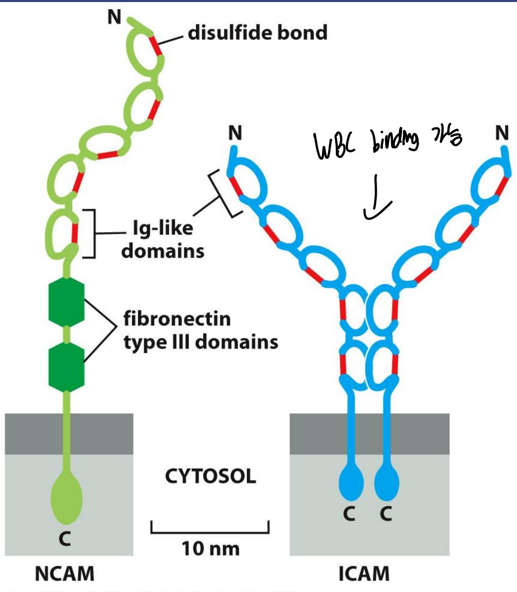

White blood cells

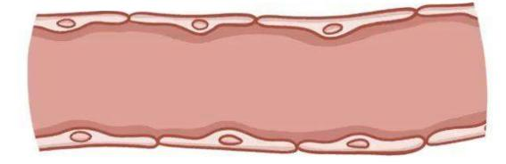

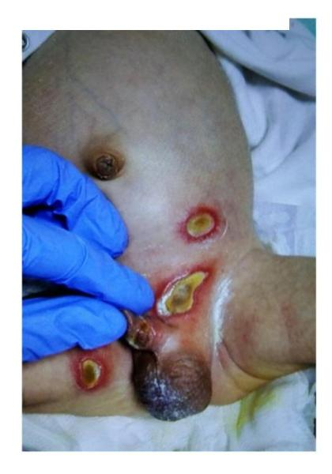

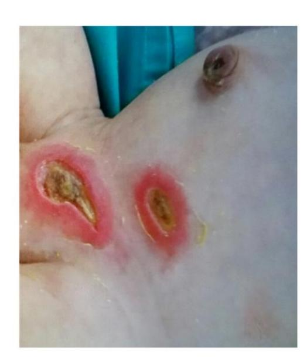

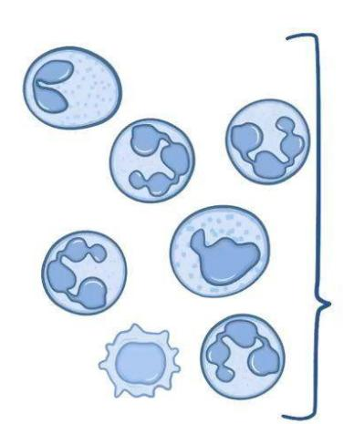

#### Glanzmann Thrombasthenia

Excessive bleeding (Often manifested as Dental bleeding, Epistaxis

Or Menorrhagia)

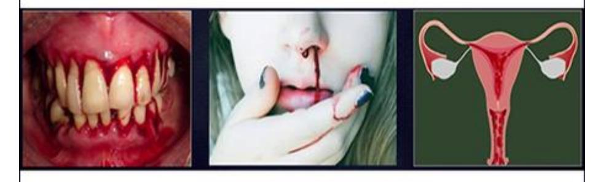

Dental Bleeding Epistaxis (Nose Bleeding)

Menorrhagia

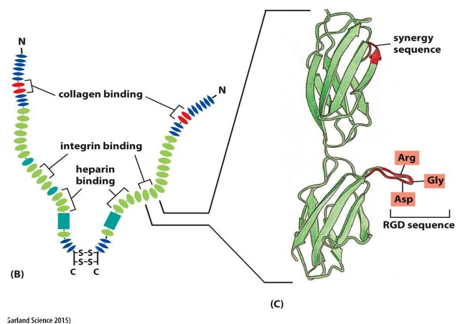

#### **Integrins Can Switch Between an Active and an Inactive Conformation**

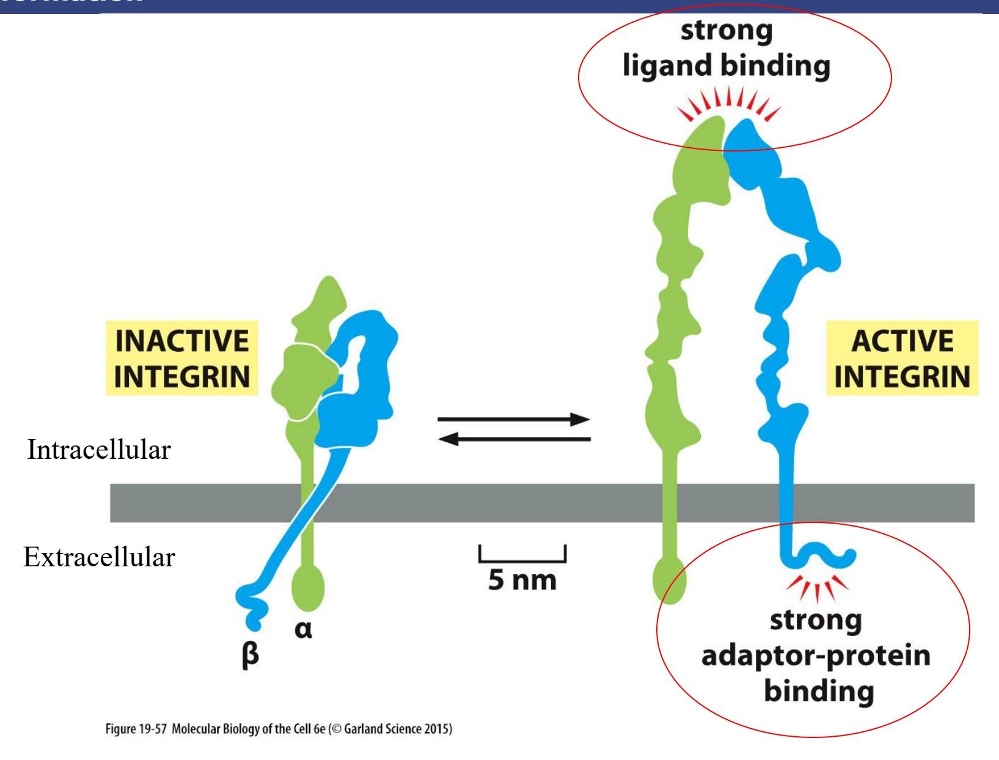

### **Activation of integrins by intracellular signaling**

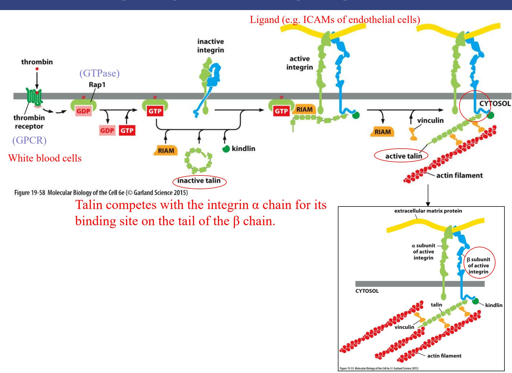

### **Cell–matrix adhesions respond to mechanical forces**

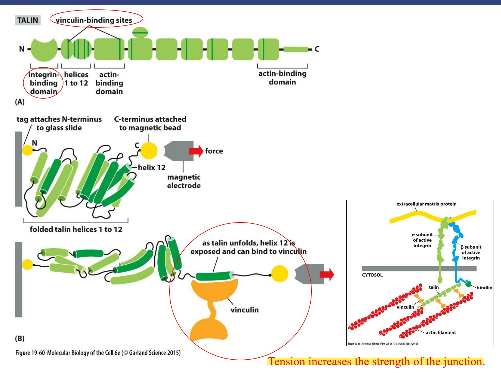