# 세 포 골 격 (1) The Cytoskeleton

2026. 04. 17. 의학과 2 학 년 세 포 생물학

# Function and dynamics of the cytoskeleton

- \* Cell shape and support
- \* Cell movement
- \* Intracellular transport of vesicles and organelles
- \* Keep organelles in place
- \* Assist in cell signaling

# The cytoskeleton

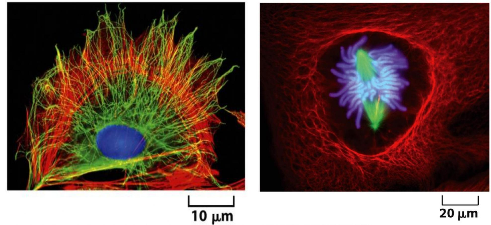

Figure 16-1b Molecular Bology of the Cell 6o (€ Garland Scence 2015)

Figure 16-1 The cytoskeleton. (A) A cell in culture has been fixed and labeled to show its cytoplasmic arrays of microtubules (green) and actin filaments (red). (B) This dividing cell has been labeled to show its spindle microtubules (green) and surrounding cage 이 intermediate filaments (red). The DNA in both cells is labeled in blue. (A, courtesy of Albert Tousson; B, courtesy of Conly Rieder.)

# Actin filaments

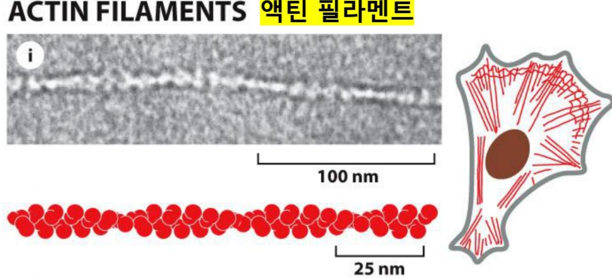

(also known as microfilaments) are helical polymers of the protein actin. They are flexible structures with a diameter of 8 nm that organize into a variety of linear bundles, two-dimensional networks, and three-dimensional gels. Although actin filaments are dispersed throughout the cell, they are most highly concentrated in the cortex, just beneath the plasma membrane. (i) Single actin filament; (ii) microvilli; (11) stress fibers (red) terminating in focal adhesions (green); (iv) striated muscle.

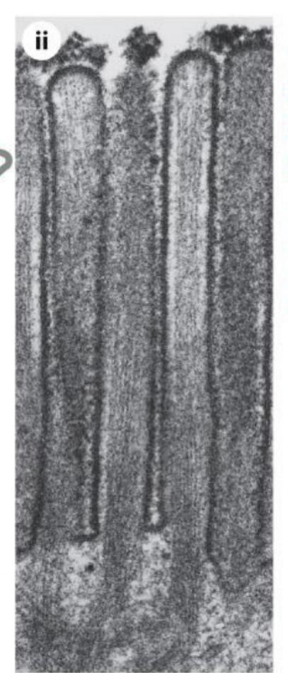

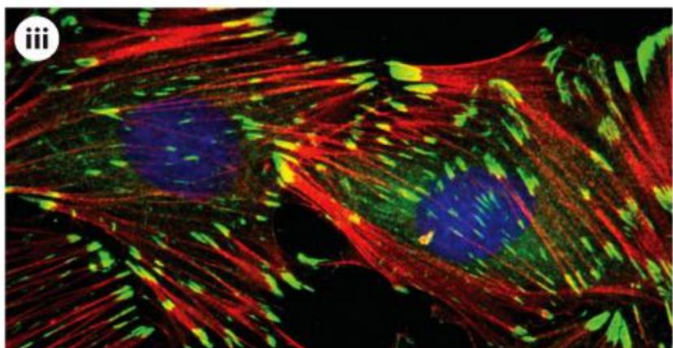

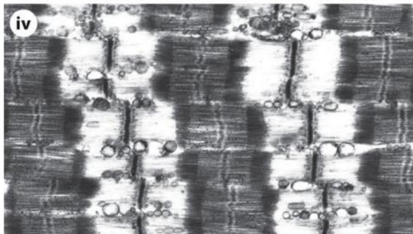

Micrographs courtesy of R. Craig (i and iv); P.T. Matsudaira and D.R. Burgess (11); K. Burridge (iii).

# MICROTUBULES 미 세 소관

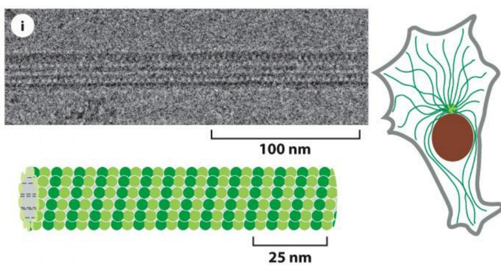

are long, hollow cylinders made of the protein tubulin. With an outer diameter of 25 nm, they are much more rigid than actin filaments. Microtubules are long and straight and frequently have one end attached 10 3 microtubule-organizing center (MTOC) called a centrosome. (i) Single microtubule; (11) cross section at the base of three cilia showing triplet microtubules; (iii) interphase microtubule array (green) and organelles (red); (iv) ciliated protozoan. Micrographs courtesy of R. Wade (i); D.T. Woodrow and

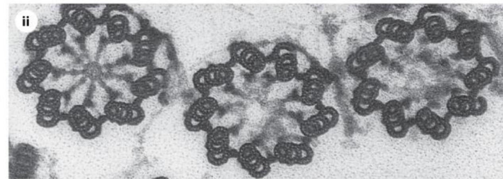

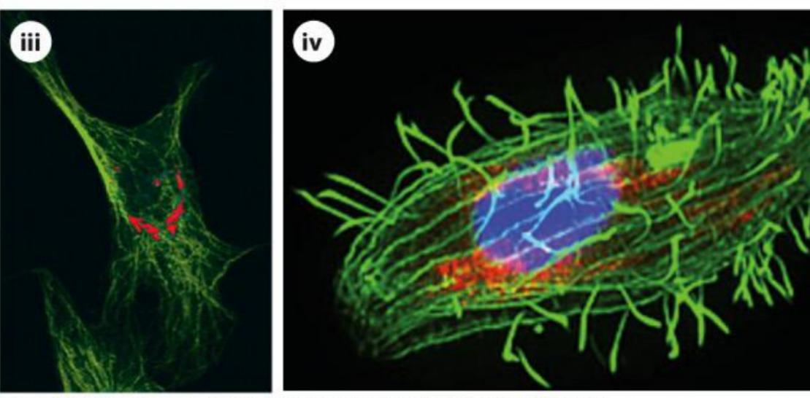

R.W. Linck (ii); D. Shima (iii); D. Burnette (iv).

# Intermediate filaments

# INTERMEDIATE FILAMENTS 중간 필라멘트 100 nm 25 nm

Intermediate filaments are ropelike fibers with a diameter of about 10 nm; they are made of intermediate filament proteins, which constitute a large and heterogeneous family. One type of intermediate filament forms a meshwork called the nuclear lamina just beneath the inner nuclear membrane. Other types extend across the cytoplasm, giving cells mechanical strength. In an epithelial tissue, they span the cytoplasm from one cell–cell junction to another, thereby strengthening the entire epithelium. (i) Individual intermediate filaments; (ii) Intermediate filaments (blue) in neurons and (iii) epithelial cell; (iv) nuclear lamina.

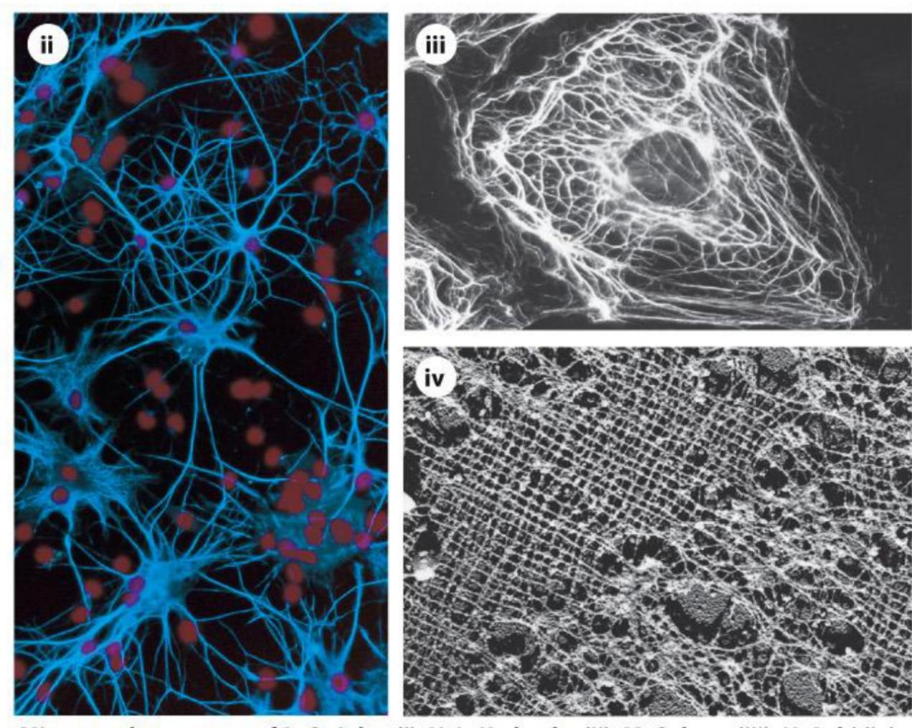

Micrographs courtesy of R. Quinlan (i); N. L. Kedersha (ii); M. Osborn (iii); U. Aebi (iv).

# **Actin Filaments**

# Cytoskeleton during cell division

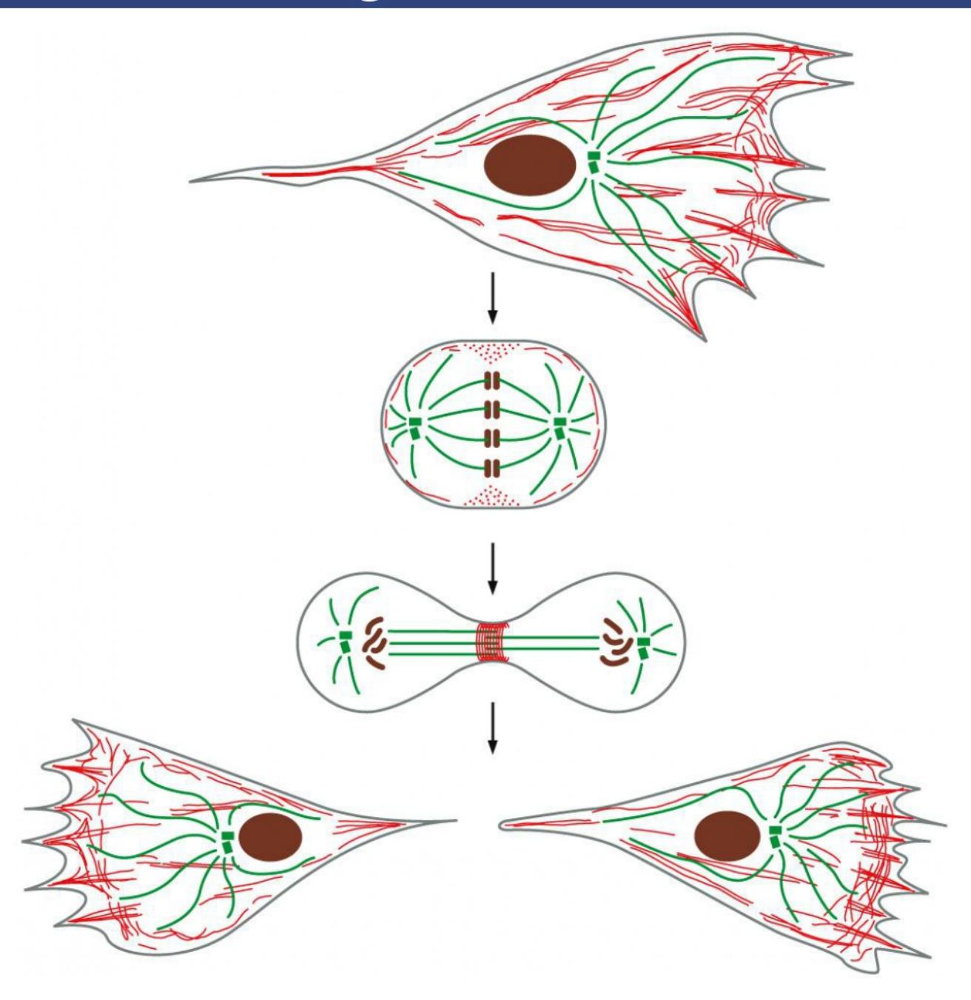

Figure 16–2 Diagram of changes in cytoskeletal organization associated with cell division. The crawling fibroblast drawn here has a polarized, dynamic actin cytoskeleton (shown in red) that assembles lamellipodia and filopodia to push its leading edge toward the right. The polarization of the actin cytoskeleton is assisted by the microtubule cytoskeleton (green), consisting of long microtubules that emanate from a single microtubuleorganizing center located in front of the nucleus. When the cell divides, the polarized microtubule array rearranges to form a bipolar mitotic spindle, which is responsible for aligning and then segregating the duplicated chromosomes (brown). The actin filaments form a contractile ring at the center of the cell that pinches the cell in two after the chromosome segregation. After cell division is complete, the two daughter cells reorganize both the microtubule and actin cytoskeletons into smaller versions of those that were present in the mother cell, enabling them to crawl their separate ways.

# The structures of an actin monomer and actin filament.

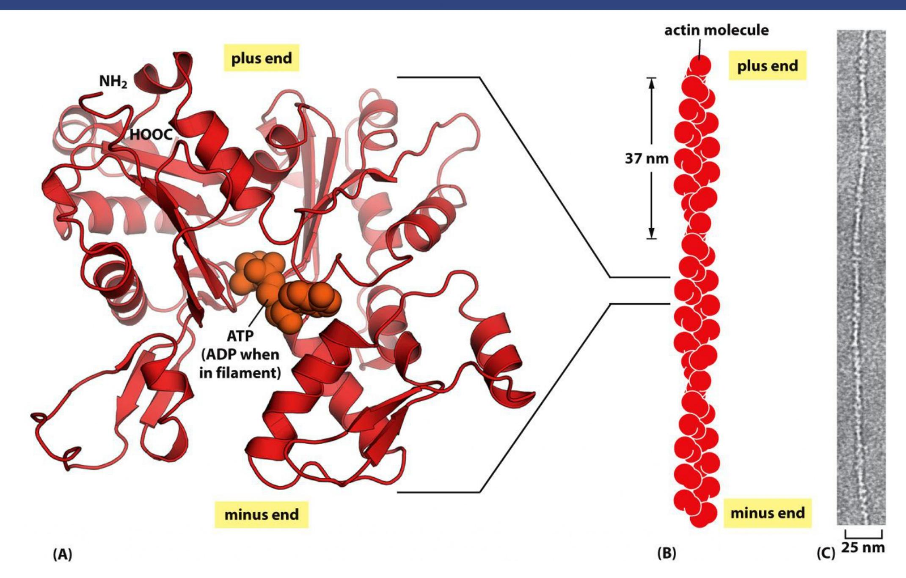

# ATP Hydrolysis Within Actin Filaments Leads to Treadmilling at Steady State

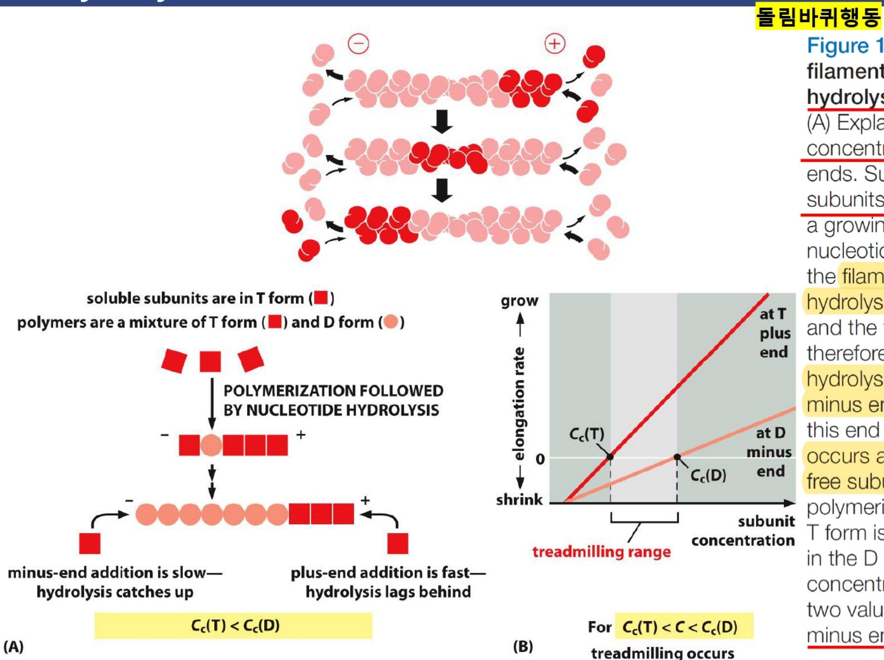

Figure 16–14 Treadmilling of an actin filament, made possible by the ATP hydrolysis that follows subunit addition. (A) Explanation for the different critical concentrations ( $C_c$ ) at the plus and minus ends. Subunits with bound ATP (T-form subunits) polymerize at both ends of a growing filament, and then undergo nucleotide <u>hydrolysis</u> within the filament. As the filament grows, elongation is faster than hydrolysis at the plus end in this example, and the terminal subunits at this end are therefore always in the T form. However, hydrolysis is faster than elongation at the minus end, and so terminal subunits at this end are in the <u>D form</u>. (B) Treadmilling occurs at intermediate concentrations of free subunits. The critical concentration for polymerization on a filament end in the T form is lower than for a filament end in the D form. If the actual subunit concentration is somewhere between these two values, the plus end grows while the minus end shrinks, resulting in treadmilling.

# The Functions of Actin Filaments Are Inhibited by Both Polymer-stabilizing and Polymer-destabilizing Chemicals

| TABLE 16-1            |                        |                             |                      |
| --------------------- | ---------------------- | --------------------------- | -------------------- |
| Chemical              | Effect on filaments | Mechanism                   | Original source   |
| Actin                 |                        |                             |                      |
| Latrunculin           | Depolymerizes          | Binds actin subunits     | Sponges              |
| Cytochalasin B     | Depolymerizes       | Caps filament plus ends  | Fungi             |
| Phalloidin            | Stabilizes             | Binds along filaments       | Amanita mushroom  |
| Microtubules          |                        |                             |                      |
| Taxol (paclitaxel) | Stabilizes             | Binds along filaments       | Yew tree          |
| Nocodazole            | Depolymerizes       | Binds tubulin subunits      | Synthetic            |
| Colchicine            | Depolymerizes          | Caps filament ends       | Autumn crocus     |

# Actin arrays in a cell moving along a flat surface

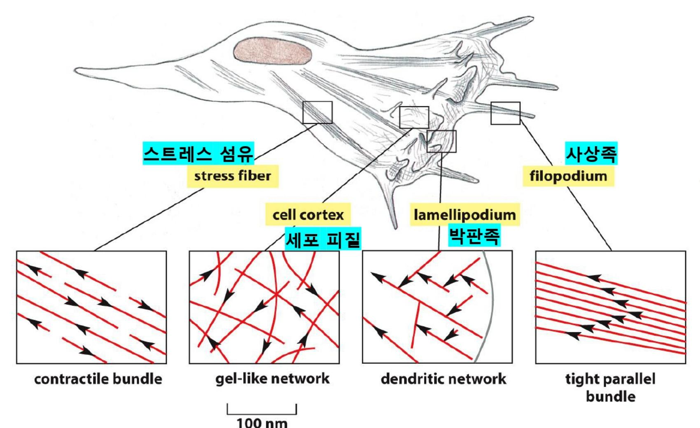

## Figure 16–21 Actin arrays in a cell.

A fibroblast crawling in a tissue-culture dish is shown with four areas enlarged to show the arrangement of actin filaments. The actin filaments are shown in *red*, with arrowheads pointing toward the minus end. Stress fibers are contractile and exert tension. The actin cortex underlies the plasma membrane and consists of gellike networks or dendritic actin networks that enable membrane protrusion at lamellopodia. Filopodia are spike-like projections of the plasma membrane that allow a cell to explore its environment.

# Effects of Rho GTPase family on actin organization

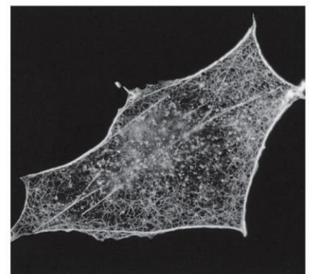

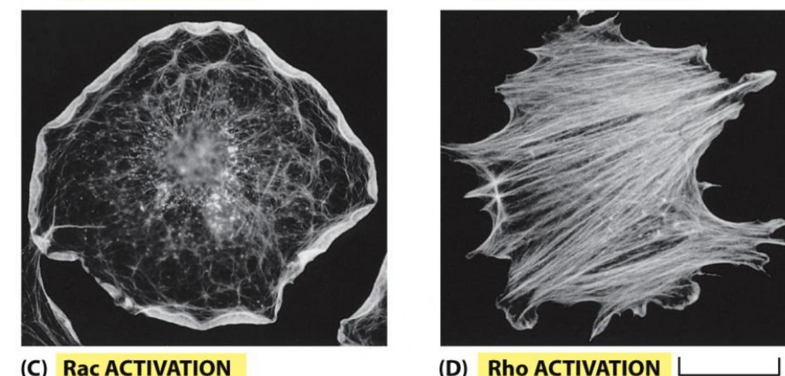

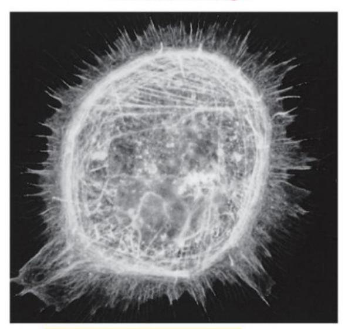

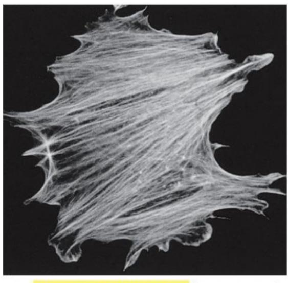

20 pm

Figure 16-84 The dramatic effects of Cdc42, Rac, and Rho on actin organization in fibroblasts. In each case, the actin filaments have been labeled with fluorescent phalloidin. (A) Serum-starved fibroblasts have actin filaments primarily in the cortex, and relatively few stress fibers. (B) Microinjection of a constitutively activated form of Cdc42 causes the protrusion of many long filopodia at the cell periphery. (C) Microinjection of a constitutively activated form of Rac, a closely related monomeric GTPase, causes the formation of an enormous lamellipodium that extends from the entire circumference of the cell. (D) Microinjection of a constitutively activated form of Rho causes the rapid assembly of many prominent stress fibers. (From A. Hall, Science 279:509-514, 1998. With permission from AAAS.)

# Actin-mediated cell movement

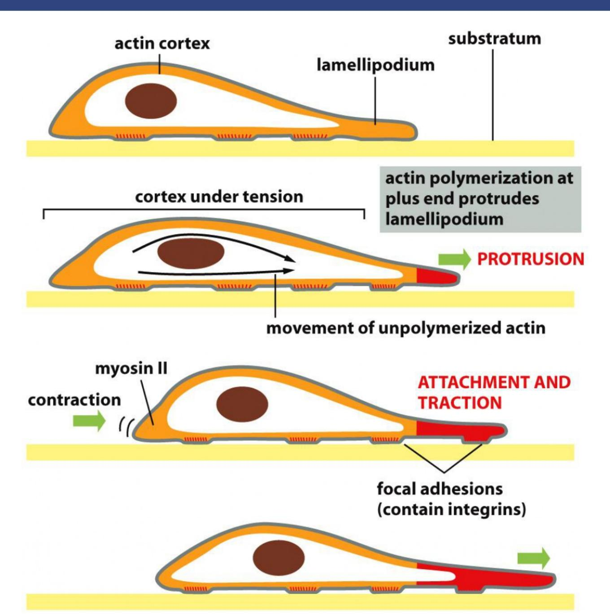

Figure 16-75 A model of how. enerated in the forward. The actin-polymerizationdependent protrusion and firm attachment of a lamellipodium at the leading edge of the cell move the edge forward (green arrows at front) and stretch the actin cortex. Contraction at the rear of the cell propels the body of the cell forward (green arrow at back) to relax some of the tension (traction). New focal contacts are made at the front, and old ones are disassembled at the back as the cell crawls forward. The same cycle can be repeated, moving the cell forward in a stepwise fashion. Alternatively, all steps can be tightly coordinated, moving the cell forward smoothly. The newly polymerized cortical actin is shown in red.

# Protrusion of the actin meshwork at the leading edge

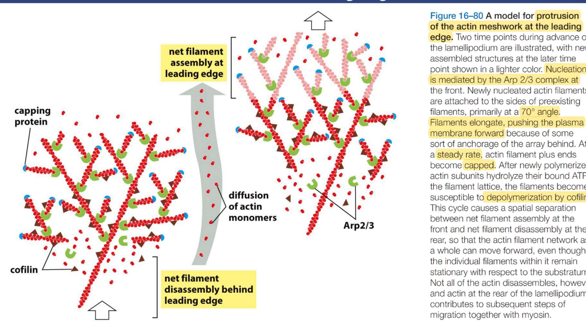

Figure 16-80 A model for protrusion

of the actin meshwork at the leading
edge. Two time points during advance of
the lamellipodium are illustrated, with newly
assembled structures at the later time
point shown in a lighter color. Nucleation
is mediated by the Arp 2/3 complex at

the front. Newly nucleated actin filaments
are attached to the sides of preexisting
filaments, primarily at a 70° angle.
Filaments elongate, pushing the plasma
membrane forward because of some

sort of anchorage of the array behind. At
a steady rate, actin filament plus ends
become capped. After newly polymerized
actin subunits hydrolyze their bound ATP in
the filament lattice, the filaments become
susceptible to depolymerization by cofilin.
This cycle causes a spatial separation
between net filament assembly at the
front and net filament disassembly at the
rear, so that the actin filament network as
a whole can move forward, even though
the individual filaments within it remain
stationary with respect to the substratum.
Not all of the actin disassembles, however,
and actin at the rear of the lamellipodium
contributes to subsequent steps of
migration together with myosin.

# Actin-Binding Proteins Influence Filament Dynamics and Organization

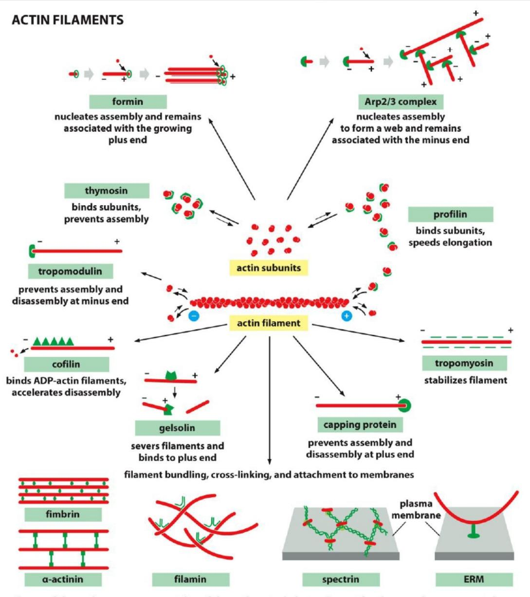

Some of the major accessory proteins of the actin cytoskeleton. Except for the myosin motor proteins, an example of each major type is shown. Each of these is discussed in the text. However, most cells contain more than a hundred different actin-binding proteins, and it is likely that there are important types of actinassociated proteins that are not yet recognized.

# Myosin superfamily members

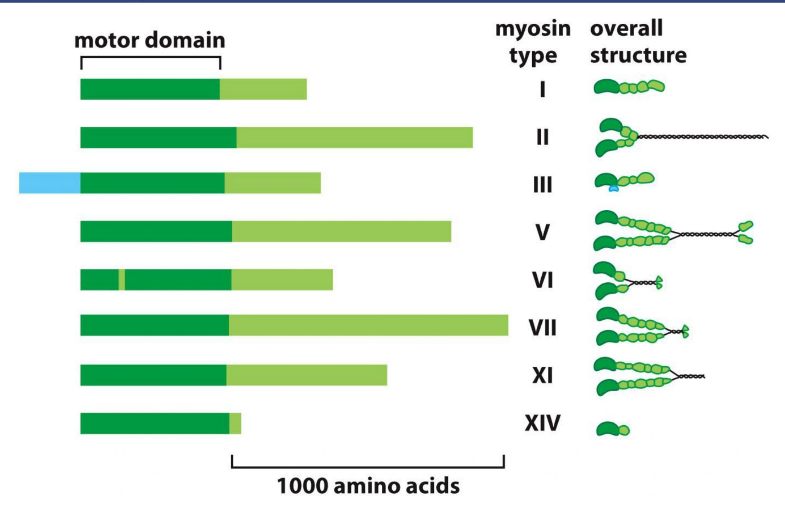

# Myosin II

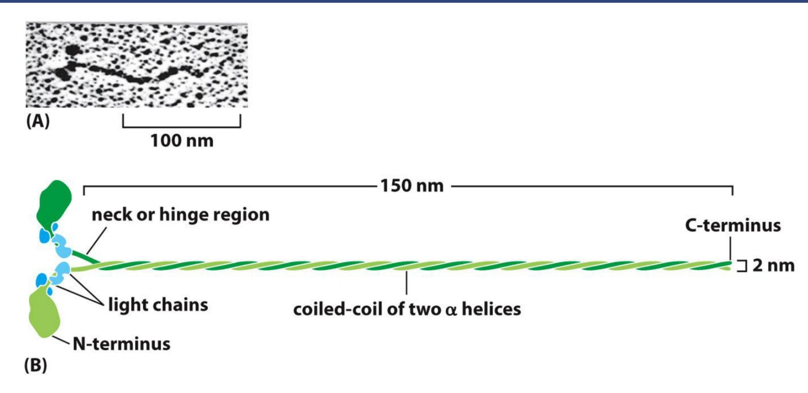

Figure 16–26 Myosin II. (A) The two globular heads and long tail of a myosin II molecule shadowed with platinum can be seen in this electron micrograph. (B) A myosin II molecule is composed of two heavy chains (each about 2000 amino acids long; green) and four light chains (blue). The light chains are of two distinct types, and one copy of each type is present on each myosin head. Dimerization occurs when the two α helices of the heavy chains wrap around each other to form a coiled-coil, driven by the association of regularly spaced hydrophobic amino acids (see Figure 3–9). The coiled-coil arrangement makes an extended rod in solution, and this part of the molecule forms the tail. (A, courtesy of David Shotton.)

# The myosin Il bipolar thick filament in muscle

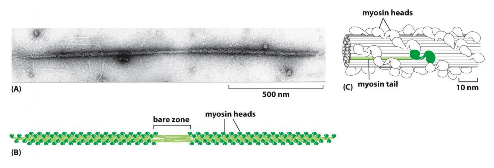

티 9나 616-27 The myosin Il bipolar thick filament in muscle. (A) Electron micrograph of a myosin | thick flament isolated from frog muscle. Note the\_central bare zone, which is free of head domains. (B) Schematic diagram, not drawn to scale. The myosin Il molecules aggregate by means of their tail regions, with their heads projecting to the outside of the filament. The bare zone in the center of the filament consists entirely of myosin Il tails. (C) A small section of a myosin Il filament as reconstructed from electron micrographs. An individual myosin molecule is highlighted in green. The cytoplasmic myosin Il filaments in non-muscle cells are much smaller, although similarly organized (see Figure 16-39). (A, courtesy of Murray Stewart; C, based on R.A. Crowther, R. Padrén and R. Craig, J. Mol. Biol. 184:429-439, 1985. With permission from Academic Press.)

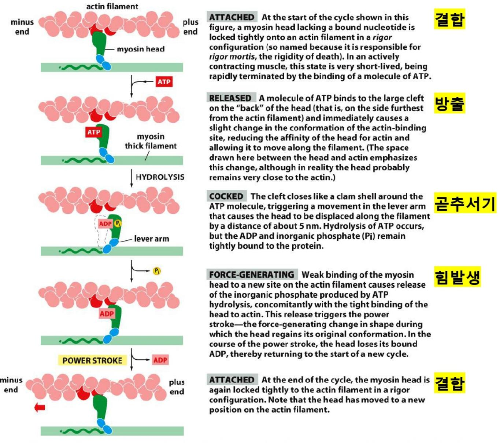

Figure 16-29 The cycle of structural changes used by myosin Il to walk along an actin filament. In the myosin Il cycle, the head remains bound to the actin filament for only about 5% of the entire cycle time, allowing many myosins to work together to move a single actin filament (Movie 16.3). (Based on |. Rayment et al., Science 261:50-58, 1993.)

# Skeletal muscle cells (also called muscle fibers)

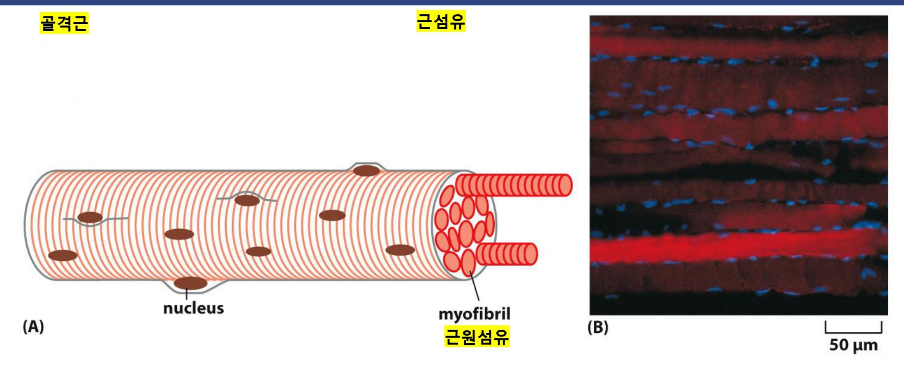

Figure 16-31 Skeletal muscle cells (also called muscle fibers). (A) These huge multinucleated cells form by the fusion of many muscle cell precursors, called myoblasts. Here, a single muscle cell is depicted. In an adult human, a muscle cell is typically 50 pum in diameter and can be up to several centimeters long. (B) Fluorescence micrograph of rat muscle, showing the peripherally located nuclei (blue) in these giant cells. Myofibrils are stained red. (B, courtesy of Nancy L. Kedersha.)

# Electron micrographs of an insect flight muscle viewed in cross section.

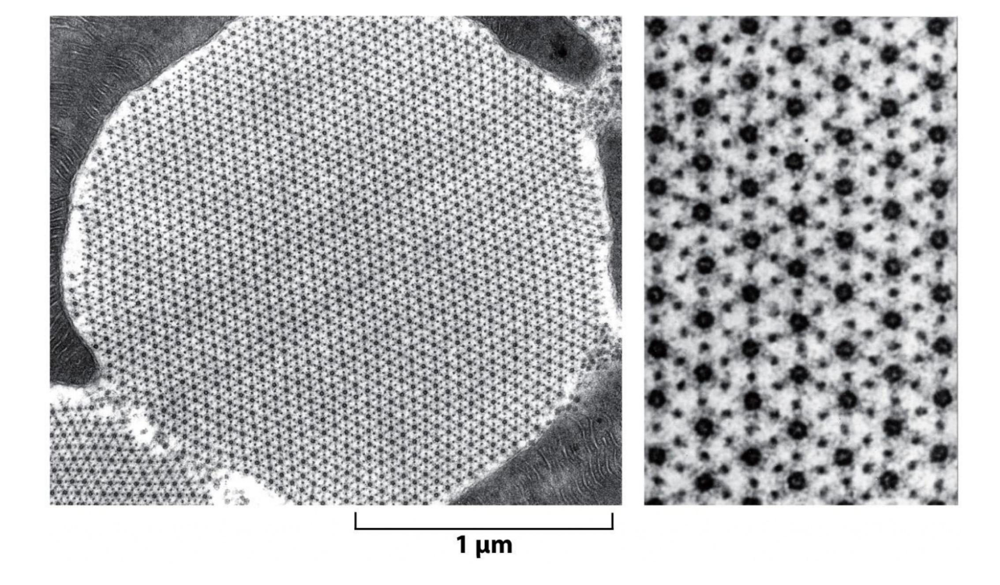

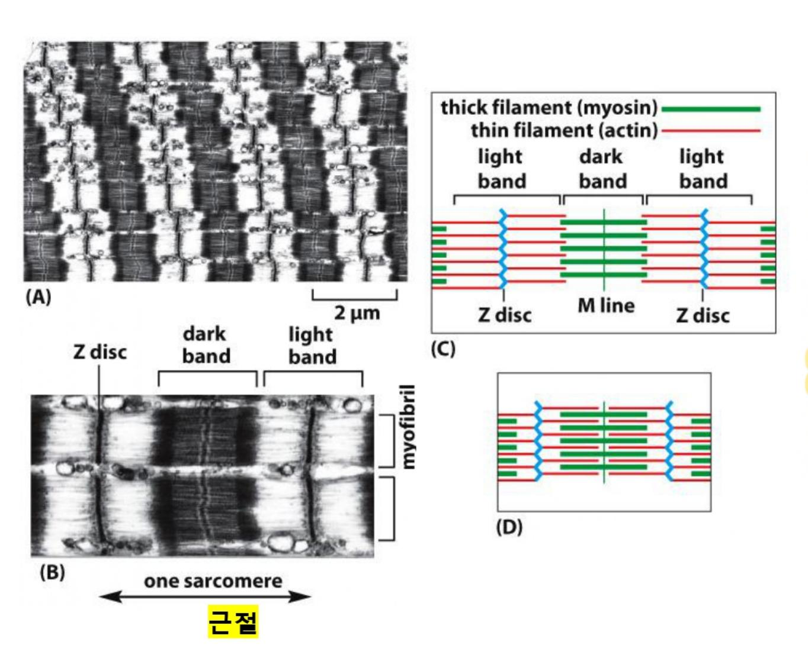

Figure 16-32 Skeletal muscle myofibrils. (A) Low-magnification electron micrograph of a longitudinal section through a skeletal muscle cell of a rabbit, showing the regular pattern of cross-striations. The cell contains many myofibrils aligned in parallel (see Figure 16-31). (8) Detail of the skeletal muscle shown in (시, showing portions of two adjacent myofibrils and the definition of a sarcomere (black arrow). (C) Schematic diagram of a single sarcomere, showing the origin of the dark and light bands seen in the electron micrographs. Thai at each end of the sarcomere, are for the plus ends of actin filaments (thin filaments); the is the location 이 proteins that link adjacent myosin Il filaments (thick filaments) to one another. (D) When the sarcomere contracts, the actin and myosin filaments slide past one another (A and B, courtesy of Roger Craig.)

# Organization of accessory proteins in a sarcomere

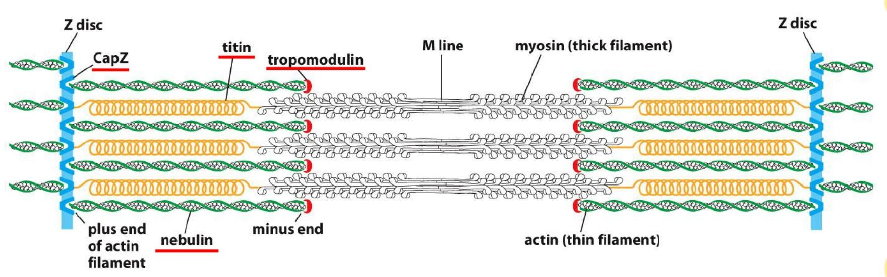

Figure 16–34 Organization of accessory proteins in a sarcomere. Each giant titin molecule extends from the Z disc to the M line—a distance of over 1 μm. Part of each titin molecule is closely associated with a myosin thick filament (which switches polarity at the M line); the rest of the titin molecule is elastic and changes length as the sarcomere contracts and relaxes. Each nebulin molecule is exactly the length of a thin filament. The actin filaments are also coated with tropomyosin and troponin (not shown; see Figure 16-36) and are capped at both ends. Tropomodulin caps the minus end of the actin filaments, and CapZ anchors the plus end at the Z disc, which also contains  $\alpha$ -actinin (not shown).

# T tubules and the sarcoplasmic reticulum

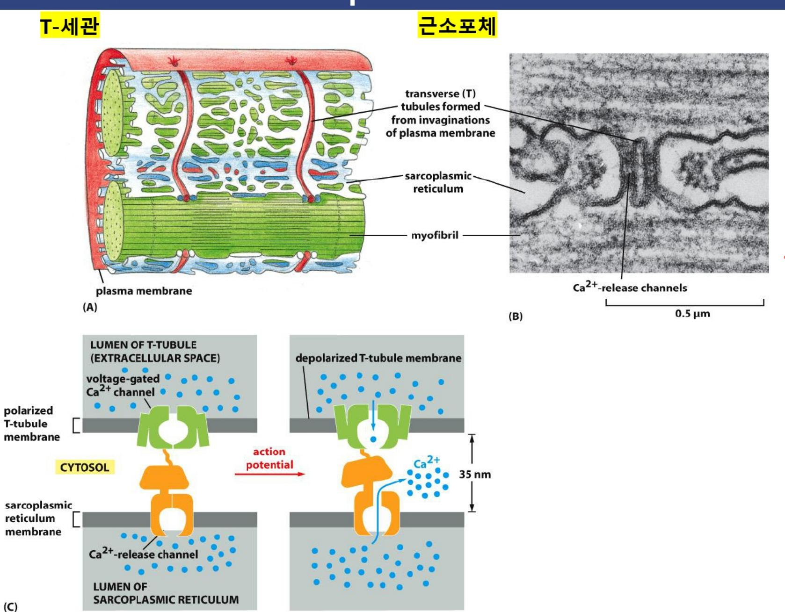

Figure 16–35 T tubules and the sarcoplasmic reticulum. (A) Drawing of the two membrane systems that relay the signal to contract from the muscle cell plasma membrane to all of the myofibrils in the cell. (B) Electron micrograph showing a cross section of a T tubule. Note the position of the large Ca2+-release channels in the sarcoplasmic reticulum membrane that connect to the adjacent T-tubule membrane. (C) Schematic diagram showing how a Ca2+-release channel in the sarcoplasmic reticulum membrane is thought to be opened by the activation of a voltage-gated Ca2+ channel (Movie 16.5). (B, courtesy of Clara Franzini-Armstrong.)

# The control of skeletal muscle contraction by troponin

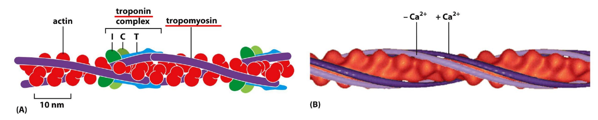

Figure 16–36 The control of skeletal muscle contraction by troponin. (A) A skeletal-muscle-cell thin filament, showing the positions of tropomyosin and troponin along the actin filament. Each tropomyosin molecule has seven evenly spaced regions with similar amino acid sequences, each of which is thought to bind to an actin subunit in the filament. (B) Reconstructed cryoelectron microscopy image of an actin filament showing the relative position of a superimposed tropomyosin strand in the presence (dark purple) or absence (light purple) of calcium. (A, adapted from G.N. Phillips, J.P. Fillers and C. Cohen, J. Mol. Biol. 192:111–131, 1986. With permission from Academic Press; B, adapted from C. Xu et al., Biophys. J. 77: 985–992, 1999. With permission from Elsevier.)

# Quiz