# 세 포 골 격 (2) The Cytoskeleton

2026. 04. 24. 의학과 2 학 년 세 포 생물학

## Microtubules

### The structure of a microtubule and its subunit

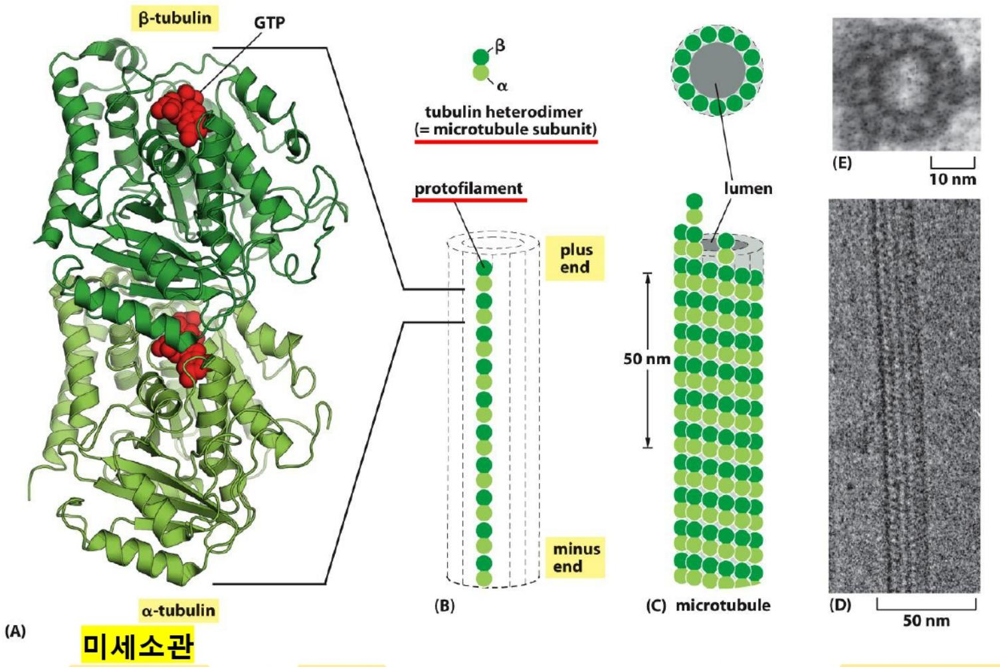

Figure 16–42 The structure of a microtubule and its subunit. (A) The subunit of each protofilament is a tubulin heterodimer, formed from a tightly linked pair of  $\alpha$ - and  $\beta$ -tubulin monomers. The GTP molecule in the  $\alpha$ -tubulin monomer is so tightly bound that it can be considered an integral part of the protein. The GTP molecule in the  $\beta$ -tubulin monomer, however, is less tightly bound and has an important role in filament dynamics. Both nucleotides are shown in *red*. (B) One tubulin subunit ( $\alpha\beta$ -heterodimer) and one protofilament are shown schematically. Each protofilament consists of many adjacent subunits with the same orientation. (C) The microtubule is a stiff hollow tube formed from 13 protofilaments aligned in parallel. (D) A short segment of a microtubule viewed in an electron microscope. (E) Electron micrograph of a cross section of a microtubule showing a ring of 13 distinct protofilaments. (D, courtesy of Richard Wade; E, courtesy of Richard Linck.)

### The preferential growth of microtubules

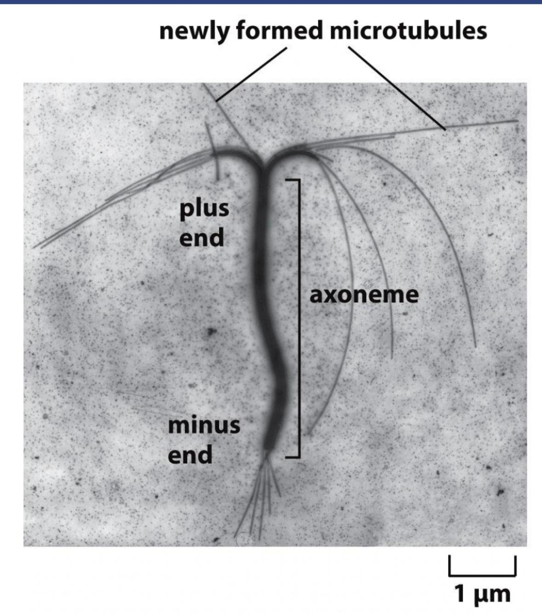

### Microtubule Functions Are Inhibited by Both Polymer-stabilizing and Polymerdestabilizing Drugs

| TABLE 16-1                   |                        |                             |                      |  |
|------------------------------|------------------------|-----------------------------|----------------------|--|
| Chemical                     | Effect on filaments | Mechanism                   | Original source   |  |
| Actin                        |                        |                             |                      |  |
| Latrunculin                  | Depolymerizes          | Binds actin subunits     | Sponges              |  |
| Cytochalasin B            | Depolymerizes       | Caps filament plus ends  | Fungi             |  |
| Phalloidin                   | Stabilizes             | Binds along filaments       | Amanita mushroom  |  |
| Microtubules                 |                        |                             |                      |  |
| Taxol' il (paclitaxel) | Stabilizes             | Binds along filaments       | Yew tree          |  |
| Nocodazole                   | Depolymerizes       | 81005 tubulin subunits      | Synthetic            |  |
| Colchicine                   | Depolymerizes          | Caps filament ends       | Autumn crocus     |  |

### The centrosome

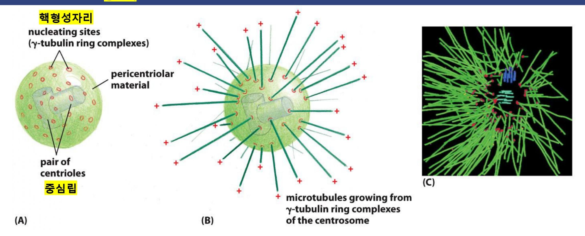

Figure 16-47 The centrosome. (A) The centrosome is the major MTOC of animal cells. Located in the cytoplasm next to the nucleus, it consists of an amorphous matrix of fibrous proteins to which the y-tubulin ring complexes that nucleate microtubule growth are attached. This matrix is organized by a pair of centrioles, as described in the text. (B) A centrosome with attached microtubules. The minus end of each microtubule is embedded in the centrosome, having grown from a y-tubulin ring complex, whereas the plus end of each microtubule is free in the cytoplasm. (C) In a reconstructed image 이 the MTOC from a C. elegans cell, a dense thicket of microtubules can be seen emanating from the centrosome. (C, from E.T. O'Toole et al., J. Cell Biol. 163:451-456, 20083. With permission from the authors.)

### A pair of centrioles in the centrosome

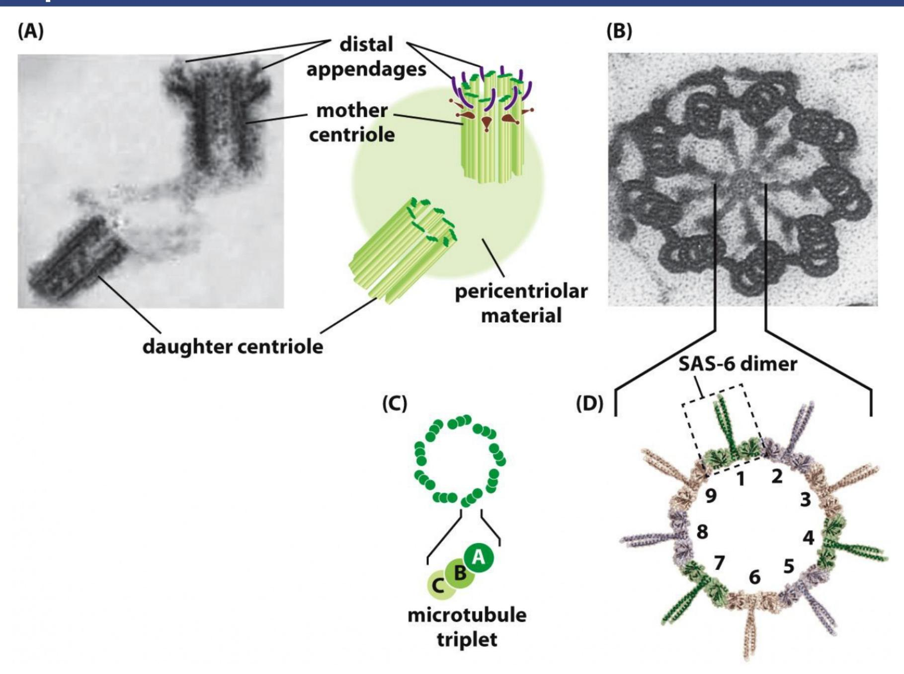

Figure 16–48 A pair of centrioles in the centrosome. (A) An electron micrograph of a thin section of an isolated centrosome showing the mother centriole with its distal appendages and the adjacent daughter centriole, which formed through a duplication event during S phase (see Figure 17-26). In the centrosome, the centriole pair is surrounded by a dense matrix of pericentriolar material from which microtubules nucleate. Centrioles also function as basal bodies to nucleate the formation of ciliary axonemes (see Figure 16–68). (B) Electron micrograph of a cross section through a centriole in the cortex of a protozoan. Each centriole is composed of nine sets of triplet microtubules arranged to form a cylinder. (C) Each triplet contains one complete microtubule (the A microtubule) fused to two incomplete microtubules (the B and C microtubules). (D) The centriolar protein SAS-6 forms a coiled-coil dimer. Nine SAS-6 dimers can self-associate to form a ring. Located at the hub of the centriole cartwheel structure. the SAS-6 ring is thought to generate the ninefold symmetry of the centriole. (A, from from M. Paintrand, et al. J. Struct. Biol. 108:107, 1992. With permission from Elsevier; B, courtesy of Richard Linck; D, courtesy of Michel Steinmetz.)

### Two Types of Motor Proteins Move Along Microtubules: kinesins and dyneins

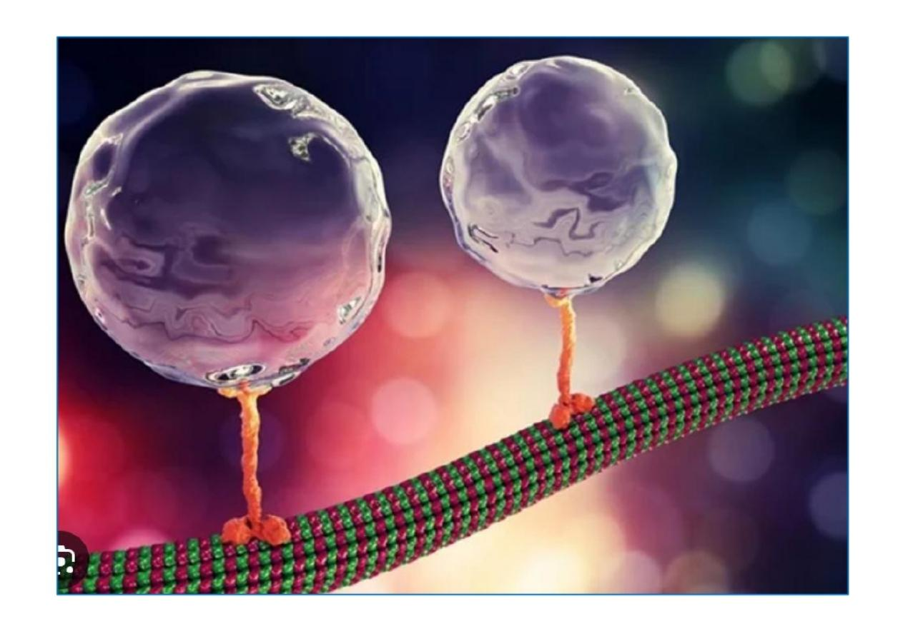

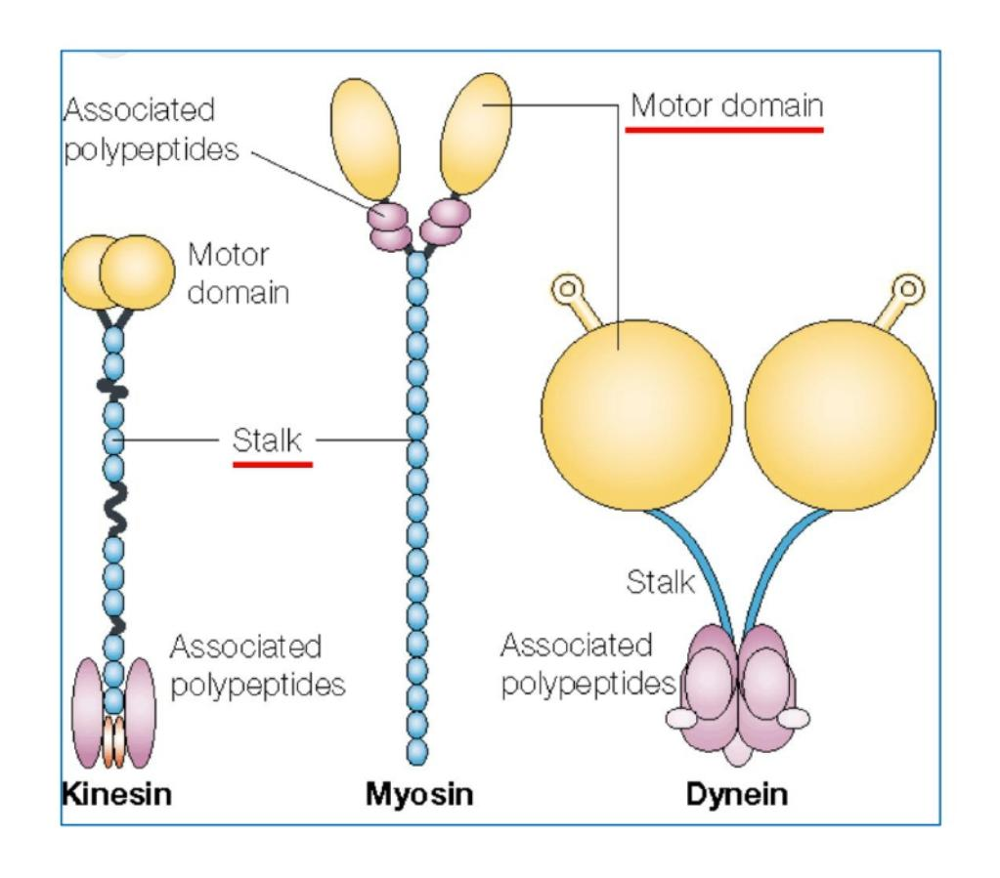

- Motors move cargo such as organelles and macromolecules
- Motors can slide microtubules relative to one another
- Motors generate specific arrangements of microtubules, as in neurons and epithelial cells
- Microtubule-based motors, such as kinesin-13, regulate microtubule dynamics

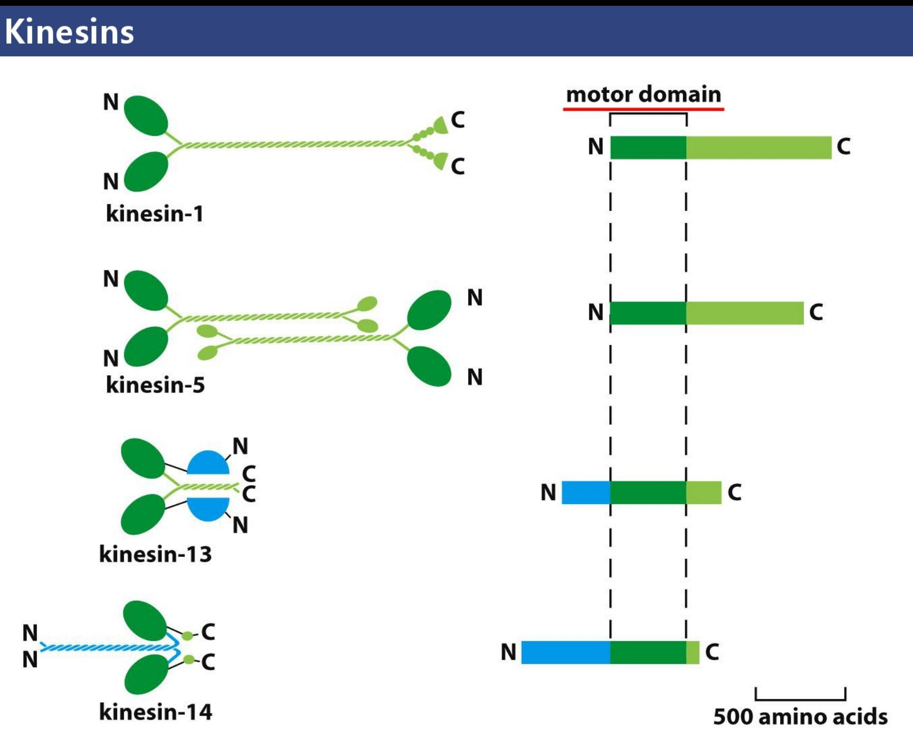

**Figure 16-56 Kinesin and kinesin-related proteins.** Structures of four kinesin superfamily members. As in the myosin superfamily, only the motor domains are conserved. Kinesin-1 has the motor domain at the N-terminus of the heavy chain. The middle domain forms a long coiled-coil, mediating dimerization. The C-terminal domain forms a tail that attaches to cargo, such as a membrane-enclosed organelle. Kinesin-5 forms tetramers where two dimers associate by their tails. The bipolar kinesin-5 tetramer is able to slide two microtubules past each other, analogous to the activity of the bipolar thick filaments formed by myosin II. Kinesin-13 has its motor domain located in the middle of the heavy chain. It is a member of a family of kinesins that have lost typical motor activity and instead bind to microtubule ends to promote depolymerization (see Figure 16-52). Kinesin-14 is a C-terminal kinesin that includes the _Drosophila_ protein Ncd and the yeast protein Kar3. These kinesins generally travel in the opposite direction from the majority of kinesins, toward the minus end instead of the plus end of a microtubule.

### The mechanochemical cycle of kinesin

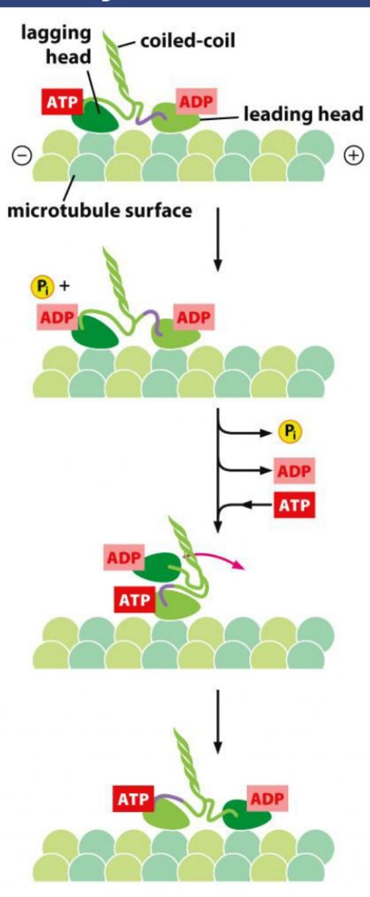

"Hand-over-hand" motion

### **Dyneins**

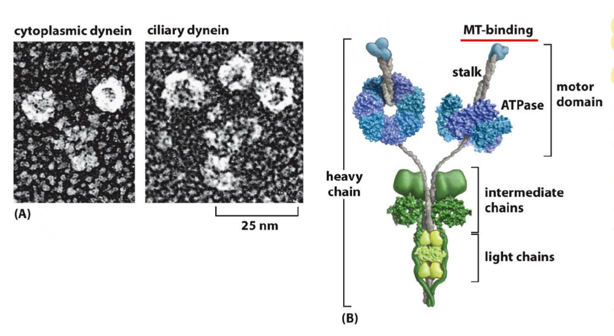

Figure 16–58 Dyneins. (A) Freeze-etch electron micrographs of a molecule of cytoplasmic dynein and a molecule of ciliary (axonemal) dynein. Like myosin II and kinesin-1, cytoplasmic dynein is a two-headed molecule. The ciliary dynein shown is from a protozoan and has three heads; ciliary dynein from animals has two heads. Note that the dynein head is very large compared with the head of either myosin or kinesin. (B) Schematic depiction of cytoplasmic dynein showing the two heavy chains (blue and gray) that contain domains for microtubule (MT) binding and ATP hydrolysis, connected by a long stalk. Bound to the heavy chain are multiple intermediate chains (dark green) and light chains (light green) that help to mediate many of dynein's functions. (A, courtesy of John Heuser; B, adapted from R. Vale, Cell 112:467–480, 2003. With permission from Cell Press.)

### Dynactin complex

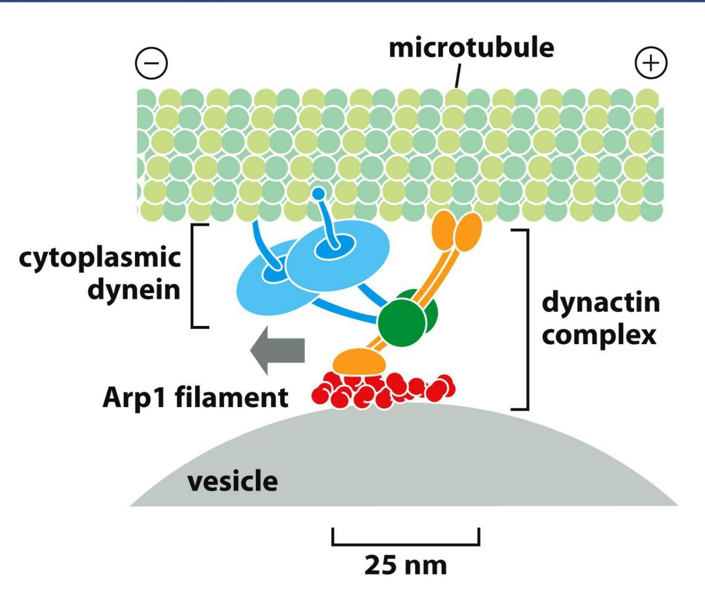

dynactin proteins to associate with membrane- complex Figure 16-60 Dynein requires the presence of a large number of accessory enclosed organelles. Dynactin is a large complex that includes components that bind weakly to microtubules, components that bind to dynein itself, and components that form 3 small, actin-like filament made 이 the actin-related protein Arp1.

### Microtubule organization in a neuron

**NEURON** 

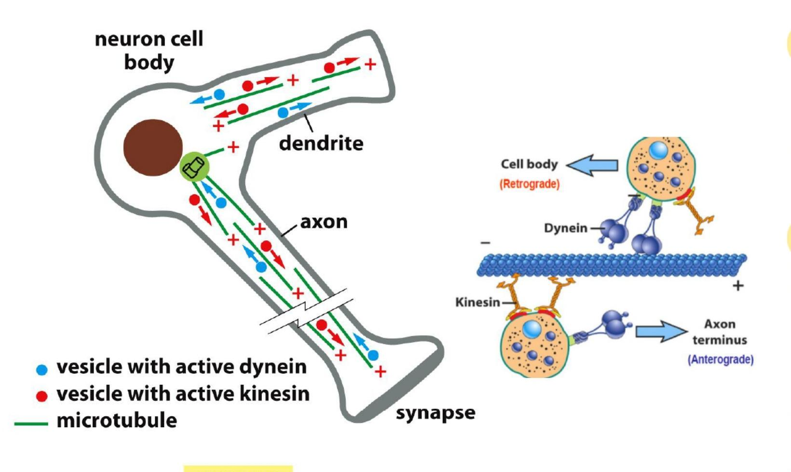

Figure 16–62 Microtubule organization in a neuron. In a neuron, microtubule organization is complex. In the axon, all microtubules share the same polarity, with the plus ends pointing outward toward the axon terminus. No single microtubule stretches the entire length of the axon; instead, short overlapping segments of parallel microtubules make the tracks for fast axonal transport. In dendrites, the microtubules are of mixed polarity, with some plus ends pointing outward and some pointing inward. Vesicles can associate with both kinesin and dynein and move in either direction along the microtubules in axons and dendrites, depending on which motor is active.

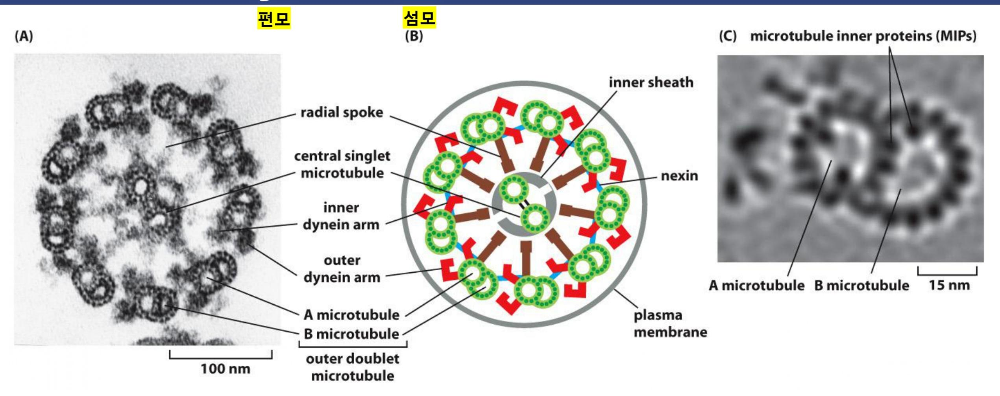

Figure 16-63 The arrangement of microtubules in a flagellum or cilium. (A) Electron micrograph of the flagellum of a green-alga cell (Chlamydomonas) shown in cross section, illustrating the distinctive "9 + 2" arrangement of microtubules. (B) Diagram of the parts of a flagellum or cilium. The various projections from the microtubules link the microtubules together and occur at regular intervals along the length of the axoneme. (C) High-resolution electron tomography image of an outer doublet microtubule showing structural details and features inside the microtubules called microtubule inner proteins (MIPs). (A, courtesy of Lewis Tilney; C, courtesy of Daniela Nicastro.)

### Ciliary dynein

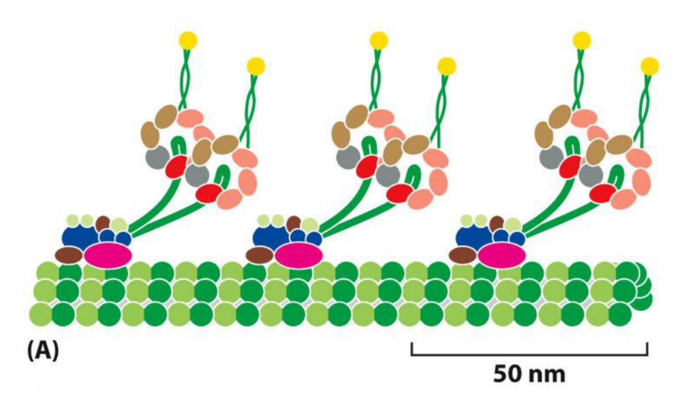

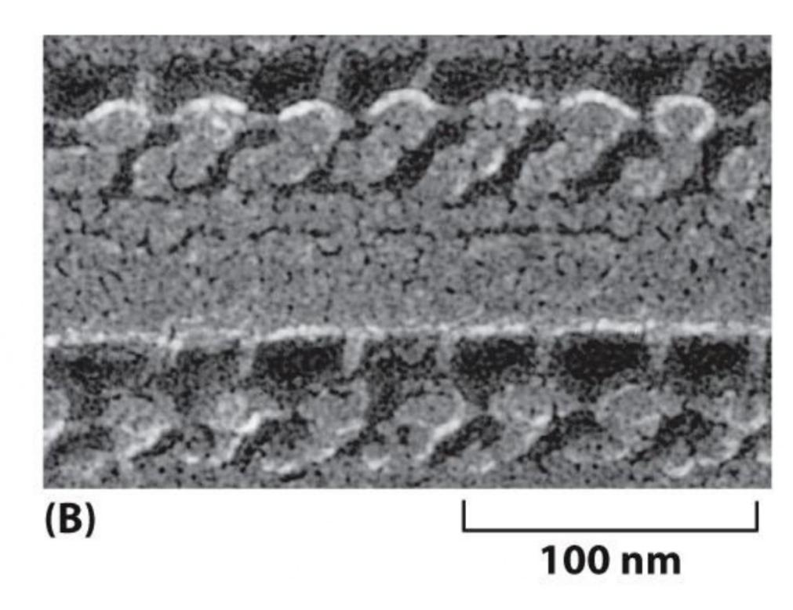

### The bending of axoneme

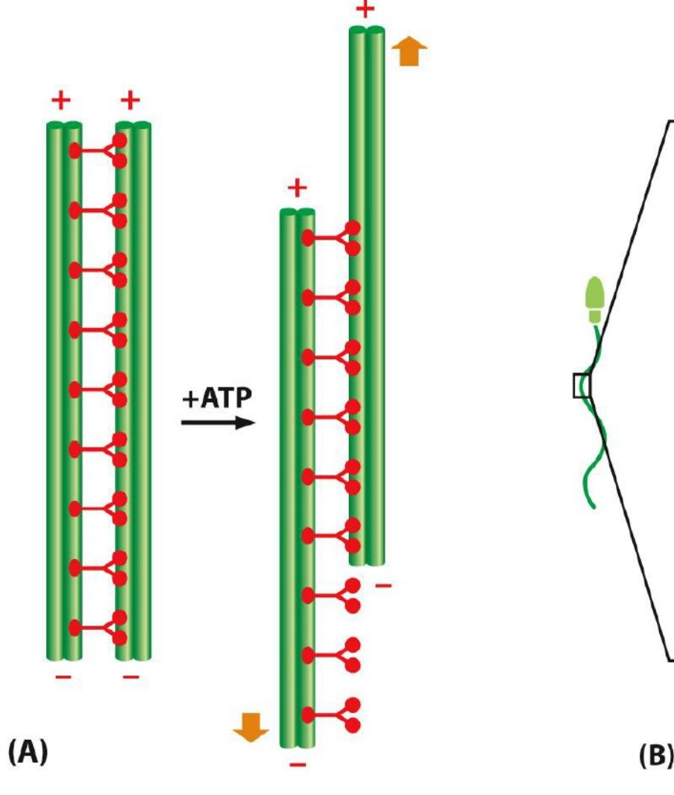

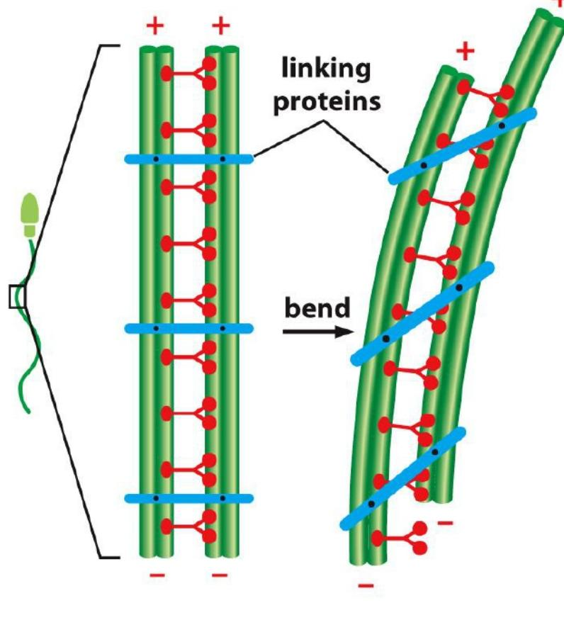

Fiiure 16-65 The bending of an (A) When axonemes are exposed to the proteolytic enzyme trypsin, the linkages holding neighboring doublet microtubules together are broken. In this case, the addition of ATP allows the motor action of the dynein heads to slide one pair of doublet microtubules against the other pair. (B) In an 38 in a sperm The motor action therefore causes a creating

### Primary cilia

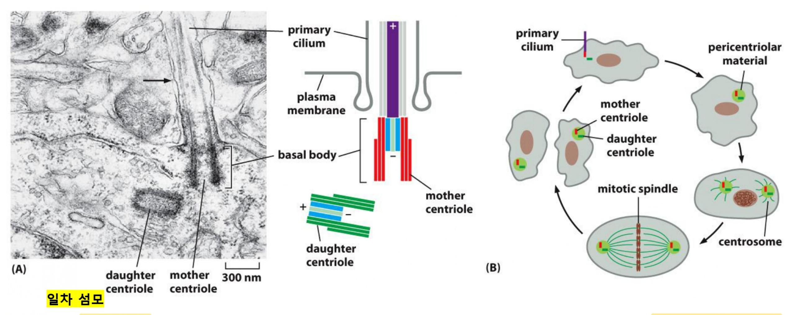

Figure 16–66 Primary cilia. (A) Electron micrograph and diagram of the basal body of a mouse neuron primary cilium. The axoneme of the primary cilium (black arrow) is nucleated by the mother centriole at the basal body, which localizes at the plasma membrane near the cell surface.

(B) Centrioles function alternately as basal bodies and as the core of centrosomes. Before a cell enters the cell division cycle, the primary cilium is shed or resorbed. The centrioles recruit pericentriolar material and duplicate during S phase, generating two centrosomes, each of which contains a pair of centrioles. The centrosomes nucleate microtubules and localize to the poles of the mitotic spindle. Upon exit from mitosis, a primary cilium again grows from the mother centriole. (A, courtesy of Josef Spacek.)

## Intermediate Filaments

### Intermediate filament construction

중간 필라멘트

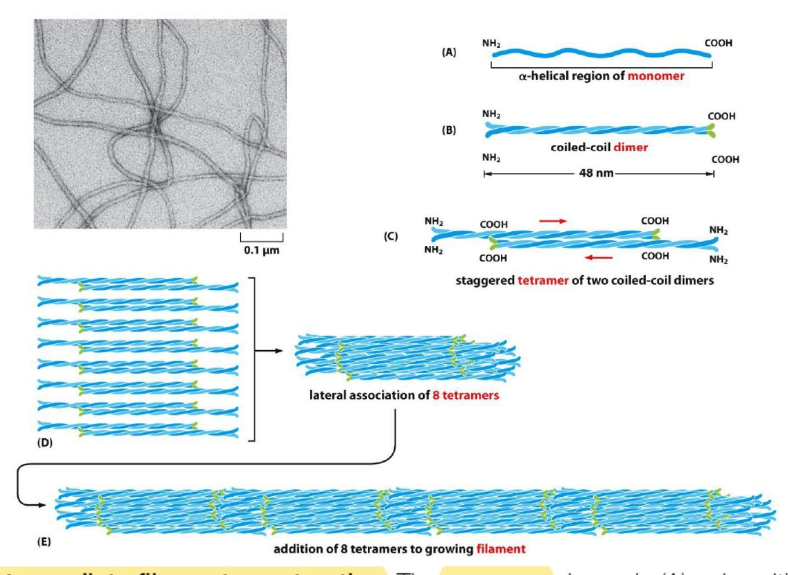

Figure 16–67 A model of intermediate filament construction. The monomer shown in (A) pairs with another monomer to form a dimer (B), in which the conserved central rod domains are aligned in parallel and wound together into a coiled-coil. (C) Two dimers then line up side by side to form an antiparallel tetramer of four polypeptide chains. Dimers and tetramers are the soluble subunits of intermediate filaments. (D) Within each tetramer, the two dimers are offset with respect to one another, thereby allowing it to associate with another tetramer. (E) In the final 10-nm ropelike filament, tetramers are packed together in a helical array, which has 16 dimers (32 coiled-coils) in cross section. Half of these dimers are pointing in each direction. An electron micrograph of intermediate filaments is shown on the upper left (Movie 16.12). (Electron micrograph courtesy of Roy Quinlan.)

### Types of Intermediate filament

| TABLE 16-2    |                                                  |                                                                  |  |
|---------------|--------------------------------------------------|------------------------------------------------------------------|--|
|               |                                                  |                                                                  |  |
| Nuclear       | Lamins A, and C B,                         | Nuclear lamina (inner lining of nuclear envelope)             |  |
| Vimentin-like | Vimentin                                         | mesenchymal origin Many cells of                           |  |
|               | Desmin                                           | Muscle                                                           |  |
|               | Glial fibrillary acidic protein                  | Glial cells (astrocytes and some Schwann cells)            |  |
|               | Peripherin                                       | Some neurons                                                     |  |
| Epithelial    | Type keratins (acidic)                     | Epithelial cells and their derivatives (e.g., hair and nails) |  |
|               | Type keratins (neutral/basic) Il           |                                                                  |  |
| Axonal        | Neurofilament proteins (NF-L, NF-M, and NF-H) | Neurons                                                          |  |

### Keratin filaments

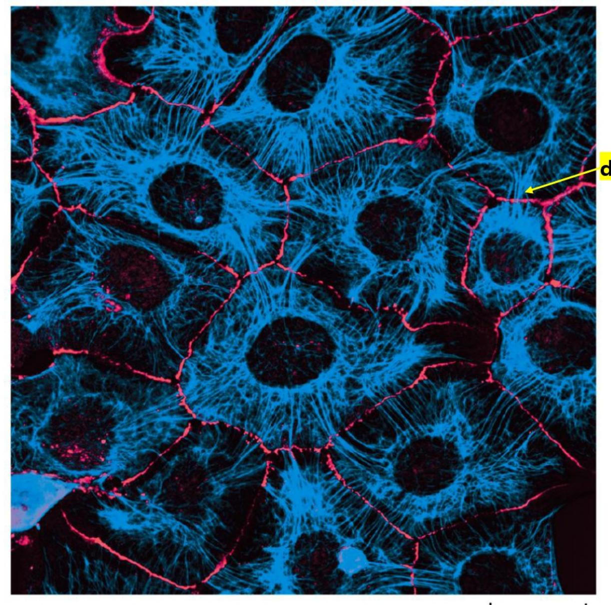

Keratin filaments in a sheet of epithelial cells in culture. The filaments in each cell are indirectly connected to those of its neighbors by desmosomes (discussed in Chapter 19). A second protein (red) has been stained to reveal the location of the cell boundaries. (Courtesy of Kathleen Green and Evangeline Amargo.)

### Blistering of the skin caused by a mutant keratin gene

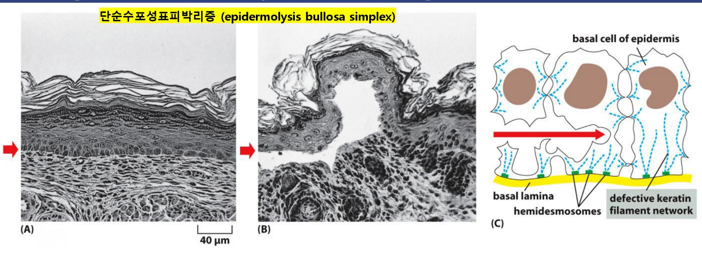

Figure 16-69 Blistering of the skin caused by a mutant keratin gene. A mutant gene encoding a truncated keratin protein (lacking both the N- and C-terminal domains) was expressed in a transgenic mouse. The defective protein assembles with the normal keratins and thereby disrupts the keratin filament network in the basal cells of the skin. Light micrographs of cross sections of (A) normal and (B) mutant skin show that the blistering results from the rupturing of cells in the basal layer of the mutant epidermis (short red arrows). (C) A sketch of three cells in the basal layer of the mutant epidermis, as observed by electron microscopy. As indicated by the red arrow, the cells rupture between the nucleus and the hemidesmosomes (discussed in Chapter 19), which connect the keratin filaments 10 the underlying basal lamina. (From P.A. Coulombe et al., J. Cell Biol. 115:1661-1674, 1991. With permission from The Rockefeller University Press.)

### Plectin cross-linking of diverse cytoskeletal elements

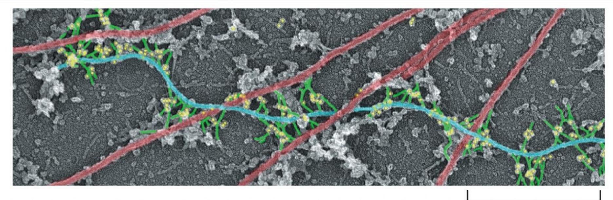

Figure 16-71 Plectin cross-linking of diverse cytoskeletal elements. Plectin (green) is seen here making crosslinks from intermediate filaments (0706) to microtubules (red). In this electron micrograph, the dots (yellow) are gold particles linked to anti-plectin antibodies. The entire actin filament network was removed to reveal these proteins. (From T.M. Svitkina et al., J. Cell Biol. 135:991- 1007, 1996. With permission from The Rockefeller University Press.)

### SUN-KASH protein complexes

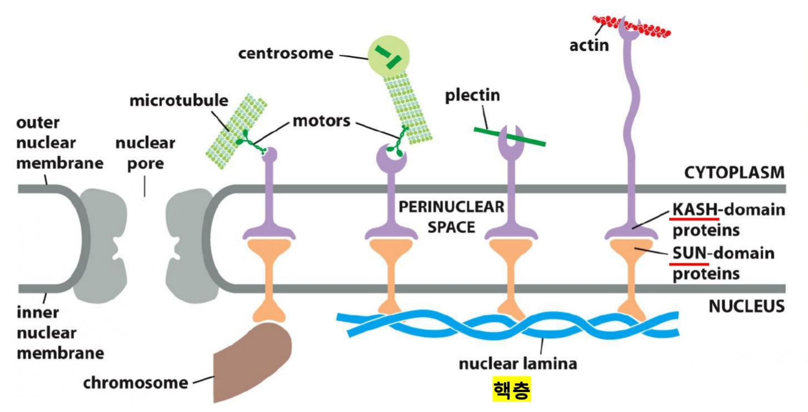

Figure 16–72 SUN–KASH protein complexes connect the nucleus and cytoplasm through the nuclear envelope. The cytoplasmic cytoskeleton is linked across the nuclear envelope to the nuclear lamina or chromosomes through SUN and KASH proteins (orange and purple, respectively). The SUN and KASH domains of these proteins bind within the lumen of the nuclear envelope. From the inner nuclear envelope, SUN proteins connect to the nuclear lamina or chromosomes. KASH proteins in the outer nuclear envelope connect to the cytoplasmic cytoskeleton by binding microtubule motor proteins, actin filaments, or plectin.

# Quiz