# INTERNAL ORGANIZATION OF THE CELL

# Membrane Structure

CHAPTER 10

Cell membranes are crucial to the life of the cell. The **plasma membrane** encloses the cell, defines its boundaries, and maintains the essential differences between the cytosol and the extracellular environment. Without plasma membranes, cells could not have evolved as individual self-replicating units. Inside eukaryotic cells, the membranes of the nucleus, endoplasmic reticulum, Golgi apparatus, mitochondria, and other membrane-enclosed organelles maintain the characteristic differences between the contents of each organelle and the cytosol. Ion gradients across membranes, established by the activities of specialized membrane proteins, can be used to synthesize ATP, to drive the transport of selected solutes across the membrane, or, as in nerve and muscle cells, to produce and transmit electrical signals. In all cells, the plasma membrane also contains proteins that act as sensors of external signals, allowing the cell to change its behavior in response to environmental cues, including signals from other cells; these protein sensors, or *receptors*, transfer information—rather than molecules—across the membrane.

Despite their differing functions, all biological membranes have a common general structure: each is a very thin film of lipid and protein molecules, held together mainly by noncovalent interactions (**Figure 10–1**). Cell membranes are

# phospholipid molecule protein molecule lipid bilayer (5 nm) (A) (B) cholesterol 100 nm

#### IN THIS CHAPTER

The Lipid Bilayer

Membrane Proteins

Figure 10–1 Two views of a cell membrane. (A) An electron micrograph of a segment of the plasma membrane of a human red blood cell seen in cross section, showing its bilayer structure. (B) A three-dimensional schematic view of a cell membrane and the general disposition of its lipid and protein constituents. (A, courtesy of Daniel S. Friend, reused by permission of E.L. Bearer.)

dynamic, fluid structures, and most of their molecules move about in the plane of the membrane. The lipid molecules are arranged as a continuous double layer about 5 nm thick. This *lipid bilayer* provides the basic fluid structure of the membrane and serves as an essentially impermeable barrier to the passage of most water-soluble molecules. Most *membrane proteins* span the lipid bilayer and mediate nearly all of the other functions of the membrane, including the transport of specific molecules across it, and the catalysis of membrane-associated reactions such as ATP synthesis. In the plasma membrane, some transmembrane proteins serve as structural links that connect the cytoskeleton through the lipid bilayer to either the extracellular matrix or an adjacent cell, while others serve as receptors to detect and transduce chemical signals in the cell's environment. It takes many kinds of membrane proteins to enable a cell to function and interact with its environment, and it is estimated that about 30% of the proteins encoded in an animal's genome are membrane proteins.

In this chapter, we consider the structure and organization of the two main constituents of biological membranes—the lipids and the proteins. Although we focus mainly on the plasma membrane, most concepts discussed apply to the various internal membranes of eukaryotic cells as well. The functions of cell membranes are considered in later chapters: their role in energy conversion and ATP synthesis, for example, is discussed in Chapter 14; their role in the transmembrane transport of small molecules in Chapter 11; and their roles in cell signaling and cell adhesion in Chapters 15 and 19, respectively. In Chapters 12 and 13, we discuss the internal membranes of the cell and the protein traffic through and between them.

# THE LIPID BILAYER

The **lipid bilayer** provides the basic structure for all cell membranes. It is easily seen by electron microscopy, and its bilayer structure is attributable exclusively to the special properties of the lipid molecules, which assemble spontaneously into bilayers even under simple artificial conditions. In this section, we discuss

Figure 10–2 The parts of a typical phospholipid molecule. This example is phosphatidylcholine, represented (A) by a formula, (B) as a space-filling model (Movie 10.1), (C) schematically, and (D) as a symbol.

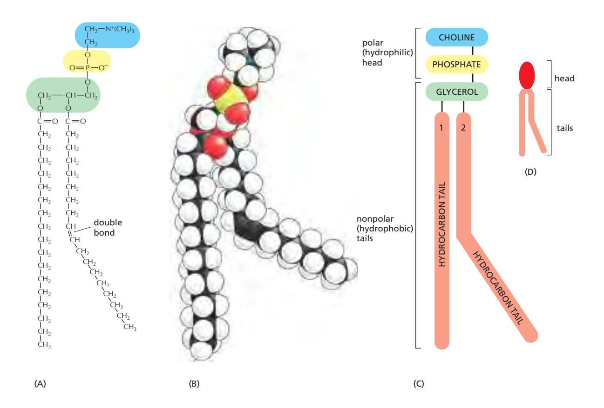

604 Chapter 10: Membrane Structure THE LIPID BILAYER 605

the different types of lipid molecules found in cell membranes and the general properties of lipid bilayers.

# Glycerophospholipids, Sphingolipids, and Sterols Are the Major Lipids in Cell Membranes

Lipid molecules constitute about 50% of the mass of most animal cell membranes, nearly all of the remainder being protein. There are approximately 5 × 106 lipid molecules in a 1 μm × 1 μm area of lipid bilayer, or about 7 × 108 lipid molecules in the plasma membrane of a red blood cell. All of the lipid molecules in cell membranes are **amphiphilic**; that is, they have a **hydrophilic** ("water-loving") or *polar* end and a **hydrophobic** ("water-fearing") or *nonpolar* end.

The most abundant membrane lipids are the **phospholipids**. These have a polar head group, which includes a phosphate group, and two hydrophobic *hydrocarbon tails*. In animal, plant, and bacterial cells, the tails are usually fatty acids, and they can differ in length (they normally contain between 14 and 24 carbon atoms). One tail typically has one or more *cis*-double bonds (that is, it is *unsaturated*), while the other tail does not (that is, it is *saturated*). As shown in **Figure 10–2**, each *cis*-double bond creates a kink in the tail. Differences in the length and saturation of the fatty acid tails influence how phospholipid molecules pack against one another, thereby affecting the fluidity of the membrane, as we discuss later.

The main phospholipids in most animal cell membranes are the **glycerophospholipids**, which have a three-carbon *glycerol* backbone (see Figure 10–2). Two long-chain fatty acids are linked through ester bonds to adjacent carbon atoms of the glycerol, and the third carbon atom of the glycerol is attached to a phosphate group, which in turn is linked to one of several types of head group. By combining several different fatty acids and head groups, cells make many different glycerophospholipids. *Phosphatidylethanolamine*, *phosphatidylserine*, and *phosphatidylcholine* are the most abundant ones in mammalian cell membranes (**Figure 10–3A, B, and C**).

Another important class of phospholipids is the *sphingolipids*, which are built from s*phingosine* rather than glycerol (**Figure 10–3D and E**). Sphingosine is a long fatty acid tail with an amino group (NH2) and two hydroxyl groups (OH) at one end. In sphingomyelin, the most common sphingolipid, a fatty acid tail

Figure 10–3 Four major phospholipids in mammalian plasma membranes. Different head groups are represented by different colors in the symbols. The lipid molecules shown in (A–C) are glycerophospholipids, which are derived from glycerol. The molecule in (D) is sphingomyelin, which is derived from (E) sphingosine and is therefore a sphingolipid. Note that only phosphatidylserine carries a net negative charge, the importance of which we discuss later; the other three are electrically neutral at physiological pH, carrying one positive and one negative charge.

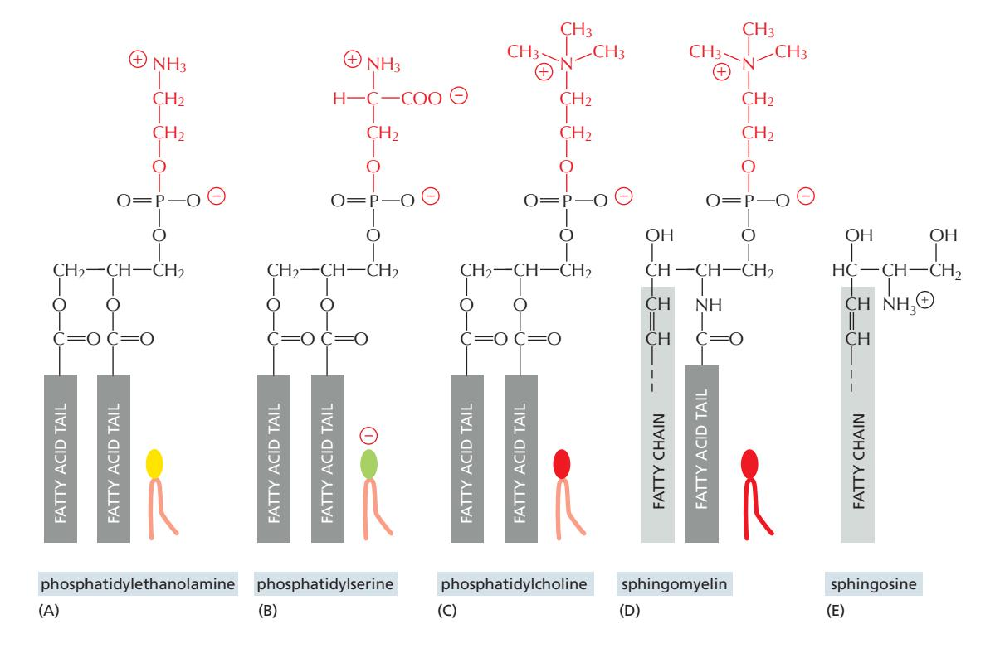

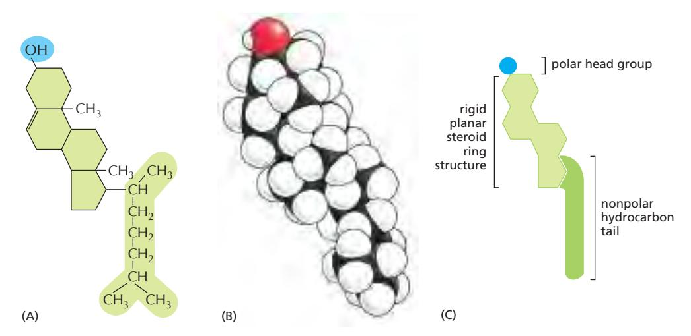

Figure 10–4 The structure of cholesterol. Cholesterol, a sterol, is represented (A) by a formula, (B) as a space-filling model, and (C) by a schematic drawing.

is attached to the amino group, and a phosphocholine group is attached to the terminal hydroxyl group. Together, the phospholipids phosphatidylcholine, phosphatidylethanolamine, phosphatidylserine, and sphingomyelin constitute more than half the mass of lipid in most mammalian cell membranes (see Table 10–1, p. 610).

In addition to phospholipids, the lipid bilayers in many cell membranes contain *glycolipids* and *sterols*. Glycolipids resemble sphingolipids, but, instead of a phosphate-linked head group, they have sugars attached. We discuss glycolipids later. Sterols are rigid ring structures related to steroids but containing a single polar hydroxyl group and a short nonpolar hydrocarbon chain (**Figure 10–4**). Different types of sterols, distinguished primarily by the side chain attached to the ringed scaffold, are found in fungi, plants, and animal cells. Eukaryotic plasma membranes contain especially large amounts of sterols—up to one molecule for every phospholipid molecule. **Cholesterol** is the major sterol found in animal cells. The cholesterol molecules orient themselves in the bilayer with their hydroxyl group close to the polar head groups of adjacent phospholipid molecules (**Figure 10–5**). MBoC7 m10.04/10.04

#### Phospholipids Spontaneously Form Bilayers

The shape and amphiphilic nature of the phospholipid molecules cause them to form bilayers spontaneously in aqueous environments. As discussed in Chapter 2, hydrophilic molecules dissolve readily in water because they contain charged groups or uncharged polar groups that can form either favorable electrostatic

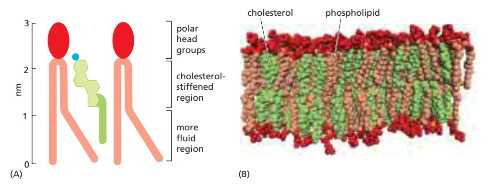

Figure 10–5 Cholesterol in a lipid bilayer. (A) Schematic drawing (to scale) of a cholesterol molecule interacting with two phospholipid molecules in one monolayer of a lipid bilayer shown in (B).

606 Chapter 10: Membrane Structure THE LIPID BILAYER 607

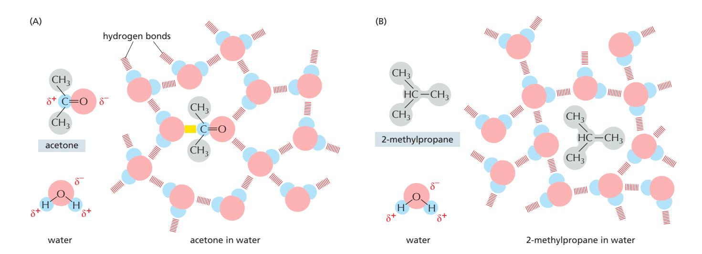

interactions or hydrogen bonds with water molecules (**Figure 10–6A**). Hydrophobic molecules, by contrast, are insoluble in water because all, or almost all, of their atoms are uncharged and nonpolar and therefore cannot form energetically favorable interactions with water molecules. If dispersed in water, this forces the adjacent water molecules to reorganize into icelike cages that surround the hydrophobic molecule (**Figure 10–6B**). Because these cage structures are more ordered than the surrounding water, their formation increases the free energy. This entropic free-energy cost is minimized, however, if the hydrophobic molecules (or the hydrophobic portions of amphiphilic molecules) cluster together so that the smallest number of water molecules is affected.

When phospholipid molecules are exposed to an aqueous environment, they behave as you would expect from the above discussion. They spontaneously pack together to minimize exposure of their hydrophobic tails to water and maximize exposure of their hydrophilic heads to water. Depending on their shape, the optimal packing arrangement is achieved in either of two ways: they can form spherical *micelles*, with the tails inward, or they can form double-layered sheets, or *bilayers*, with the hydrophobic tails sandwiched between the hydrophilic head groups (**Figure 10–7**). MBoC7 m10.06/10.06 color, and nonpolar groups are shown in *gray*.

The same forces that drive phospholipids to form bilayers also provide a self-sealing property. A small tear in the bilayer creates a free edge exposed to water; because this is energetically unfavorable, the lipids will rearrange spontaneously to eliminate the free edge. The prohibition of free edges has a profound consequence: the only way for a bilayer to avoid having edges is by closing in on

Figure 10–6 How hydrophilic and hydrophobic molecules interact differently with water. (A) Because acetone is polar, it can form hydrogen bonds *(red)* and favorable electrostatic interactions *(yellow)* with water molecules, which are also polar. Thus, acetone readily dissolves in water. (B) By contrast, 2-methylpropane is entirely hydrophobic. Because it cannot form favorable interactions with water, it forces adjacent water molecules to reorganize into icelike cage structures, which increases the free energy. This compound is therefore virtually insoluble in water. The symbol δ– indicates a partial negative charge, and δ+ indicates a partial positive charge. Polar atoms are shown in

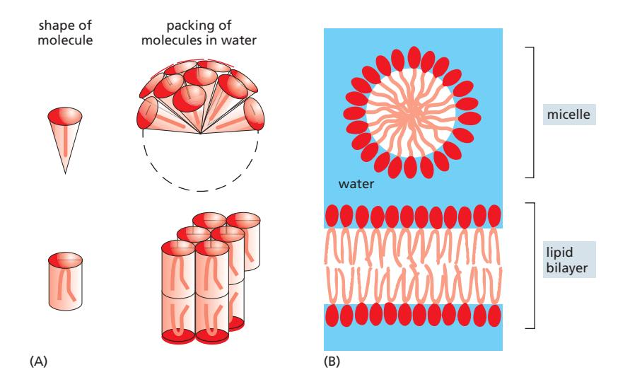

Figure 10–7 Packing arrangements of amphiphilic molecules in an aqueous environment. (A) These molecules spontaneously form micelles or bilayers in water, depending on their shape. Cone-shaped amphiphilic molecules *(above)* form micelles, whereas cylindershaped amphiphilic molecules such as phospholipids *(below)* form bilayers. (B) A micelle and a lipid bilayer seen in cross section. Note that micelles of amphiphilic molecules are thought to be much more irregular than drawn here (see Figure 10–26C).

itself and forming a sealed compartment (**Figure 10–8**). This remarkable behavior, fundamental to the creation of a living cell, follows directly from the shape and amphiphilic nature of the phospholipid molecule.

#### The Lipid Bilayer Is a Two-dimensional Fluid

A lipid bilayer also has other characteristics that make it an ideal structure for cell membranes. One of the most important of these is its fluidity, which is crucial to many membrane functions (**Movie 10.2**). Around 1970, researchers first recognized that individual lipid molecules are able to diffuse freely within the plane of a lipid bilayer. The initial demonstration came from studies of synthetic (artificial) lipid bilayers, which can be made in the form of spherical vesicles, called **liposomes** (**Figure 10–9**), or planar lipid films. Biophysical studies showed that phospholipid molecules in synthetic bilayers very rarely migrate from the monolayer (also called a *leaflet*) on one side to that on the other. This process, known as "flip-flop," occurs on a time scale of hours for any individual molecule. It is slow because during flip-flop, the hydrophilic head groups must transiently enter and pass through the hydrophobic core of the bilayer, which is energetically disfavored. Cholesterol is an exception to this rule and can flip-flop rapidly, having only a single hydroxyl group to accommodate transiently in the hydrophobic core. By contrast to flip-flop, all lipid molecules rapidly exchange places with their neighbors *within* a monolayer (∼107 times per second). This gives rise to a rapid lateral diffusion, with a diffusion coefficient (*D*) of about 10–8 cm2/sec, which means that an average lipid molecule diffuses the length of a large bacterial cell (∼2 μm) in about 1 second. These studies have also shown that individual lipid molecules rotate very rapidly about their long axis and have flexible hydrocarbon chains. Computer simulations show that lipid molecules in synthetic bilayers are very disordered, presenting an irregular, ragged surface of variously spaced and oriented head groups to the water phase on either side of the bilayer (**Figure 10–10**). The liquidity of membranes allows lipids to rapidly patch transient holes that may appear in the bilayer through mechanical or other stresses.

Similar mobility studies on labeled lipid molecules in isolated biological membranes and in living cells give results similar to those in synthetic bilayers. They demonstrate that the lipid component of a biological membrane is a twodimensional liquid in which the constituent molecules are free to move laterally. As in synthetic bilayers, individual phospholipid molecules are normally confined to their own monolayer. This confinement creates a problem for the growth of biological membranes. Phospholipid molecules are manufactured in only one monolayer of a membrane, mainly in the cytosolic monolayer of the endoplasmic reticulum membrane. If none of these newly made molecules could migrate reasonably promptly to the noncytosolic monolayer, the membrane would expand asymmetrically. The problem is solved by a special class of membrane proteins called *phospholipid translocators*, or *flippases* and *scramblases*, which catalyze the rapid flip-flop of phospholipids from one monolayer to the other, as discussed in Chapter 12.

Despite the fluidity of the lipid bilayer, liposomes do not fuse spontaneously with one another when suspended in water. Fusion does not occur because the

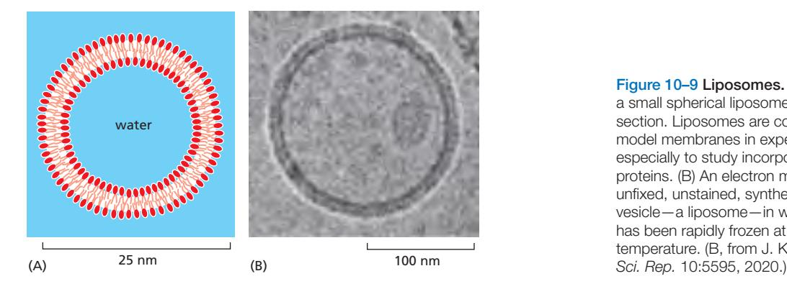

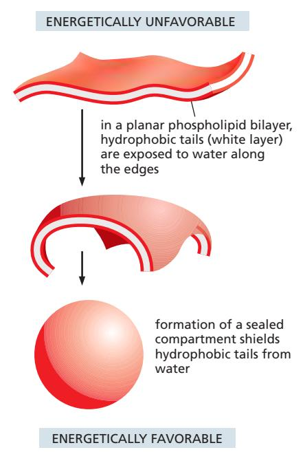

Figure 10–8 The spontaneous closure of a phospholipid bilayer to form a sealed compartment. The closed structure is stable because it avoids the exposure of the hydrophobic hydrocarbon tails to water, which would be energetically unfavorable.

Figure 10–9 Liposomes. (A) A drawing of a small spherical liposome seen in cross section. Liposomes are commonly used as model membranes in experimental studies, especially to study incorporated membrane proteins. (B) An electron micrograph of an unfixed, unstained, synthetic phospholipid vesicle—a liposome—in water, which has been rapidly frozen at liquid-nitrogen temperature. (B, from J. Kotouˇcek et al.,

608 Chapter 10: Membrane Structure THE LIPID BILAYER 609

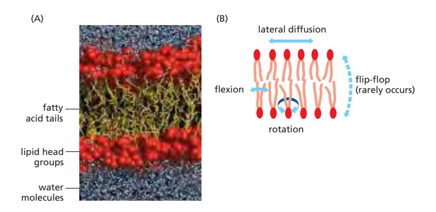

polar lipid head groups bind water molecules and ions that need to be displaced for the bilayers of two different liposomes to come into sufficiently close contact to fuse. Biological membranes have an even larger hydration shell due to the proteins embedded or associated with them. This hydration shell insulates the many internal membranes in a eukaryotic cell and prevents their uncontrolled fusion, thereby maintaining the compartmental integrity of membrane-enclosed organelles. All cell membrane fusion events are catalyzed by tightly regulated tethers that bring appropriate membranes close together and fusion proteins that force out the water layer that keeps the bilayers apart, as we discuss in Chapter 13. MBoC7 m10.10/10.10

#### The Fluidity of a Lipid Bilayer Depends on Its Composition

The fluidity of cell membranes has to be precisely regulated. It allows membrane proteins to interact rapidly and transiently, and certain membrane transport processes and enzyme activities, for example, cease when the bilayer viscosity is experimentally increased beyond a threshold level.

The fluidity of a lipid bilayer depends on both its composition and its temperature, as is readily demonstrated in studies of synthetic lipid bilayers. A synthetic bilayer made from a single type of phospholipid changes from a liquid state to a two-dimensional rigid crystalline (or gel) state at a characteristic temperature. This change of state is called a *phase transition*, and the temperature at which it occurs is lower (that is, the membrane becomes more difficult to freeze) if the hydrocarbon chains are short or have double bonds. A shorter chain length reduces the tendency of the hydrocarbon tails to interact with one another in both the same and opposite monolayer so that the membrane remains fluid at lower temperatures. Fluidity is also favored by *cis*-double bonds because they produce kinks in the chains that make them more difficult to pack together (**Figure 10–11**). The makeup of membranes as a complex mix of many different lipid species further adjusts most membranes so that they remain liquids just above the phase-transition point. Bacteria, yeasts, and other organisms whose temperature fluctuates with that of their environment adjust the fatty acid composition of their membrane lipids to maintain a relatively constant fluidity. As the temperature falls, for instance, the cells of those organisms synthesize fatty acids with more *cis*-double bonds, thereby avoiding the decrease in bilayer fluidity that would otherwise result from the temperature drop.

Sterols, such as cholesterol, modulate the properties of lipid bilayers. When mixed with phospholipids, they enhance the permeability-barrier properties of the lipid bilayer. Cholesterol inserts into the bilayer with its hydroxyl group close to the polar head groups of the phospholipids, so that its rigid, platelike steroid rings interact with—and stiffen—those regions of the hydrocarbon chains closest to the polar head groups (see Figure 10–5 and **Movie 10.3**). By decreasing the mobility of the first few CH2 groups of the hydrocarbon chains of the phospholipid molecules, cholesterol makes the lipid bilayer less deformable in this region and thereby decreases the permeability of the bilayer to small water-soluble molecules. Although cholesterol tightens the packing of the lipids in a bilayer, it does

Figure 10–10 The mobility of phospholipid molecules in an artificial lipid bilayer. (A) Starting with a model of 100 phosphatidylcholine molecules arranged in a regular bilayer, a computer calculated the position of every atom after 300 picoseconds of simulated time. From these theoretical calculations, a model of the lipid bilayer emerges that accounts for almost all of the measurable properties of a synthetic lipid bilayer, including its thickness, number of lipid molecules per membrane area, depth of water penetration, and unevenness of the two surfaces. Note that the tails in one monolayer can interact with those in the other monolayer, if the tails are long enough. (B) The different motions of a lipid molecule in a bilayer. (A, based on S.W. Chiu et al., *Biophys. J*. 69:1230–1245, 1995.)

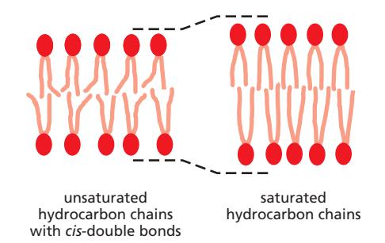

MBoC7 m10.11/10.11 Figure 10–11 The influence of *cis*-double bonds in hydrocarbon chains. The double bonds make it more difficult to pack the chains together, thereby making the lipid bilayer more difficult to freeze. In addition, because the hydrocarbon chains of unsaturated lipids are more spread apart, lipid bilayers containing them are thinner than bilayers formed exclusively from saturated lipids.

| TABLE 10–1 Approximate Lipid Compositions of Different Cell Membranes |                                     |                                      |        |                                                    |                          |                                  |
|-----------------------------------------------------------------------|-------------------------------------|--------------------------------------|--------|----------------------------------------------------|--------------------------|----------------------------------|
|                                                                       | Percentage of total lipid by weight |                                      |        |                                                    |                          |                                  |
| Lipid                                                                 | Liver cell plasma membrane    | Red blood cell plasma membrane | Myelin | Mitochondrion (inner and outer membranes) | Endoplasmic reticulum | Escherichia coli bacterium |
| Cholesterol                                                           | 17                                  | 23                                   | 22     | 3                                                  | 6                        | 0                                |
| Phosphatidylethanolamine                                              | 7                                   | 18                                   | 15     | 28                                                 | 17                       | 70                               |
| Phosphatidylserine                                                    | 4                                   | 7                                    | 9      | 2                                                  | 5                        | Trace                            |
| Phosphatidylcholine                                                   | 24                                  | 17                                   | 10     | 44                                                 | 40                       | 0                                |
| Sphingomyelin                                                         | 19                                  | 18                                   | 8      | 0                                                  | 5                        | 0                                |
| Glycolipids                                                           | 7                                   | 3                                    | 28     | Trace                                              | Trace                    | 0                                |
| Others                                                                | 22                                  | 14                                   | 8      | 23                                                 | 27                       | 30                               |

not make membranes any less fluid because it also prevents the hydrocarbon chains from coming together and crystallizing.

**Table 10–1** compares the lipid compositions of several biological membranes. Note that bacterial plasma membranes are often composed of one main type of phospholipid and contain no cholesterol. In archaea, lipids usually contain 20- to 25-carbon-long prenyl chains instead of fatty acids; prenyl and fatty acid chains are similarly hydrophobic and flexible (see Figure 10–18F). In thermophilic archaea, the longest lipid chains span both leaflets, making the membrane particularly stable to heat. Thus, lipid bilayers can be built from molecules with similar features but different molecular designs. The plasma membranes of most eukaryotic cells are more varied than those of prokaryotes and archaea, not only in containing large amounts of sterols but also in containing a mixture of different phospholipids.

Analysis of membrane lipids by mass spectrometry has revealed that the lipid composition of a typical eukaryotic cell membrane is much more complex than originally thought. These membranes contain a bewildering variety of perhaps 500–2000 different lipid species with even the simple plasma membrane of a red blood cell containing well over 150. Lipid heterogeneity antagonizes phase transitions and may help membrane-spanning proteins to fit better in the bilayer, avoiding leaks. While some of this complexity reflects the combinatorial variation in head groups, hydrocarbon chain lengths, and desaturation of the major phospholipid classes, some membranes also contain many structurally distinct minor lipids, at least some of which have important functions. The *inositol phospholipids*, for example, are present in small quantities in animal cell membranes and have crucial functions in guiding membrane traffic and in cell signaling (discussed in Chapters 13 and 15, respectively). Their local synthesis and destruction are regulated by a large number of enzymes, which create both small intracellular signaling molecules and lipid docking sites on membranes that recruit specific proteins from the cytosol, as we discuss later.

### Despite Their Fluidity, Lipid Bilayers Can Form Domains of Different Compositions

Because a lipid bilayer is a two-dimensional fluid, we might expect most types of lipid molecules in it to be well mixed and randomly distributed in their own monolayer. The van der Waals attractive forces between neighboring hydrocarbon tails are not selective enough to hold groups of phospholipid molecules together. With certain lipid mixtures in artificial bilayers, however, one can observe phase transitions that lead to the lateral segregation of lipids with specific lipids coming 610 Chapter 10: Membrane Structure THE LIPID BILAYER 611

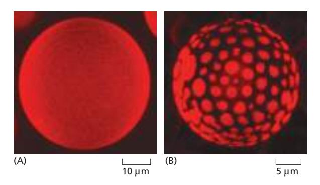

together in separate domains (**Figure 10–12**). In these cases, attractive forces between lipid molecules must outweigh the entropic cost associated with concentrating them. Phase transitions thus break the homogeneity of the bilayer into a patchwork of domains with different properties.

There has been a long debate among cell biologists about whether the lipid molecules in the plasma membrane of living cells similarly segregate into specialized domains, called **lipid rafts**. Although many lipids and membrane proteins are not distributed uniformly, large-scale lipid phase segregations are seen rarely in living cell membranes. Instead, specific membrane proteins and lipids are seen to concentrate in a more temporary, dynamic fashion facilitated by protein–protein interactions that allow the transient formation of specialized membrane regions (**Figure 10–13**). Such clusters can be tiny nanoclusters on a scale of a few molecules or larger assemblies that can be seen with electron microscopy, such as the *caveolae* (discussed in Chapter 13). The tendency of mixtures of lipids to undergo phase transitions, as seen in artificial bilayers (see Figure 10–12), may help create rafts in living cell membranes—organizing and concentrating membrane proteins either for transport in membrane vesicles (discussed in Chapter 13) or for working together in protein assemblies, such as when they convert extracellular signals into intracellular ones (discussed in Chapter 15). MBoC7 m10.12/10.12

#### Lipid Droplets Are Surrounded by a Phospholipid Monolayer

Most eukaryotic cells store an excess of lipids in **lipid droplets**, from where they can be retrieved as building blocks for membrane synthesis or as a food source fueling metabolic energy generation. Fat cells, or *adipocytes*, are specialized for lipid storage. They contain a giant lipid droplet that fills up most of their cytoplasm. Most other cells have many smaller lipid droplets, the number and size varying with the cell's metabolic state. Fatty acids can be liberated from lipid droplets on demand and exported to other cells through the bloodstream. Lipid droplets store neutral lipids, such as triacylglycerols and cholesterol esters, which are synthesized from fatty acids and cholesterol by enzymes in the endoplasmic reticulum membrane. Because these lipids do not contain hydrophilic head groups, they are exclusively hydrophobic molecules, and therefore aggregate into three-dimensional droplets rather than into bilayers.

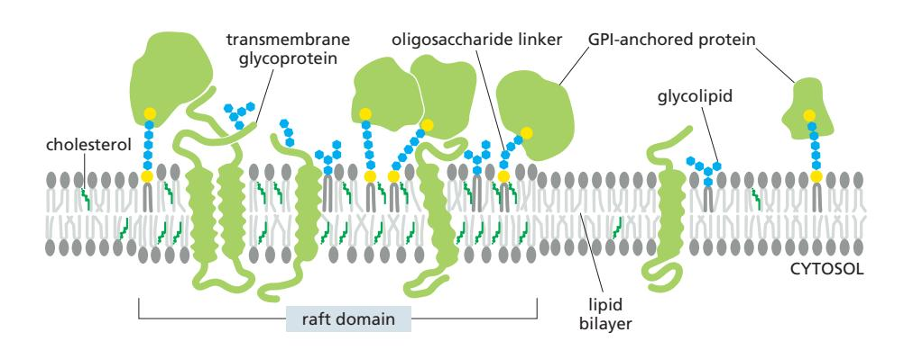

Figure 10–12 Lateral phase separation in artificial lipid bilayers. (A) Giant liposomes produced from a 1:1 mixture of phosphatidylcholine and sphingomyelin form uniform bilayers. (B) By contrast, liposomes produced from a 1:1:1 mixture of phosphatidylcholine, sphingomyelin, and cholesterol form bilayers with two separate phases. The liposomes are stained with trace concentrations of a fluorescent dye that preferentially partitions into one of the two phases. The average size of the domains formed in these giant artificial liposomes is much larger than that expected in cell membranes, where *lipid rafts* (see text) may be as small as a few nanometers in diameter. (A, from N. Kahya et al., *J. Struct. Biol*. 147:77-89, 2004. With permission from Elsevier; B, courtesy of Schwille Lab, MPG.)

Figure 10–13 A model of a raft domain.

Weak protein–protein, protein–lipid, and lipid–lipid interactions reinforce one another to partition the interacting components into raft domains. Cholesterol, sphingolipids, glycolipids, glycosylphosphatidylinositol (GPI)-anchored proteins, and some transmembrane proteins are enriched in these domains. Note that because of their composition, raft domains are thought to have an increased membrane thickness. We discuss glycolipids, GPI-anchored proteins, and oligosaccharide linkers later. (Adapted from D. Lingwood and K. Simons, *Science* 327:46–50, 2010.)

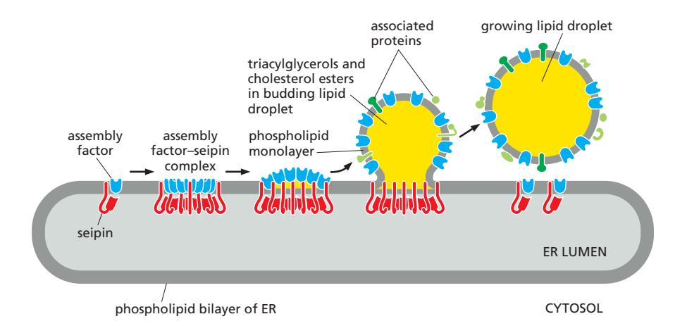

In order for these hydrophobic droplets to reside in the aqueous cytosol of the cell, their surface is covered by phospholipids oriented with their hydrophobic acyl chains facing the lipid droplet and hydrophilic head groups facing the cytosol. This is why lipid droplets are surrounded by a monolayer of phospholipids rather than the bilayer that defines all other membrane-bounded compartments of the cell. The surface of lipid droplets contains a large variety of proteins, some of which are enzymes involved in lipid metabolism. Lipid droplets form rapidly when cells are exposed to high concentrations of fatty acids. They form from the endoplasmic reticulum membrane where many enzymes of lipid metabolism are localized. **Figure 10–14** shows one model of how lipid droplets form and acquire their surrounding monolayer of phospholipids and proteins. In some specialized cells, such as liver cells and enterocytes (the absorptive cells of the gut), droplets bud into the lumen of the endoplasmic reticulum from where they are secreted as lipoprotein particles that move metabolic energy in the form of triglycerides through the body. MBoC7 m10.14/10.14

#### The Asymmetry of the Lipid Bilayer Is Functionally Important

The lipid compositions of the two monolayers of the lipid bilayer in many membranes are strikingly different. In the human red blood cell (erythrocyte) membrane, for example, almost all of the phospholipid molecules that have choline—(CH3)3N+CH2CH2OH—in their head group (phosphatidylcholine and sphingomyelin) are in the outer monolayer, whereas almost all that contain a terminal primary amino group (phosphatidylethanolamine and phosphatidylserine) are in the inner monolayer (**Figure 10–15**). Because the negatively charged phosphatidylserine is located in the inner monolayer, there is a significant difference in charge between the two halves of the bilayer. We discuss in Chapter 12 how membrane-bound phospholipid translocators generate and maintain lipid asymmetry.

Lipid asymmetry is functionally important, especially in converting extracellular signals into intracellular ones (discussed in Chapter 15). Many cytosolic proteins bind to specific lipid head groups found in the cytosolic monolayer of the lipid bilayer. The enzyme *protein kinase C* (*PKC*), for example, which is

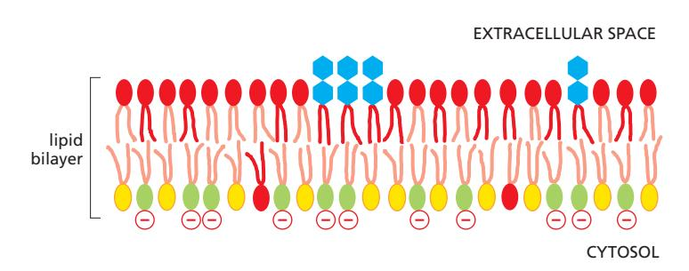

Figure 10–14 A model for the formation of lipid droplets. Neutral lipids are deposited between the two monolayers of the endoplasmic reticulum (ER) membrane forming a lenslike structure between the two monolayers. The lens forms as triacylglycerides and cholesterol esters are made and accumulate in the ER membrane and self-aggregate. Multiple copies of the transmembrane protein seipin assemble into a ring together with a lipid droplet assembly factor. In the presence of triacylglycerides, seipin dissociates from the assembly factor, which migrates to the cytosolic monolayer of the ER membrane where it facilitates a process in which the droplet buds, fills up with nonpolar lipids, and pinches off as a unique organelle that is surrounded by a single monolayer of phospholipids and associated proteins. In some cells, such as adipocytes, droplets fuse and can reach a gigantic size. (Adapted from J. Chung et al., *Dev. Cell*  51:551–563, 2019.)

Figure 10–15 The asymmetric distribution of phospholipids and glycolipids in the lipid bilayer of human red blood cells. The colors used for the phospholipid head groups are those introduced in Figure 10–3. In addition, glycolipids are drawn with hexagonal polar head groups *(blue)*. Cholesterol (not shown) is distributed roughly equally in both monolayers.

612 Chapter 10: Membrane Structure THE LIPID BILAYER 613

activated in response to various extracellular signals, binds to the cytosolic face of the plasma membrane, where phosphatidylserine is concentrated, and requires this negatively charged phospholipid for its activity.

In other cases, specific lipid head groups must first be modified to create protein-binding sites at a particular time and place. One example is *phosphatidylinositol* (*PI*), one of the minor phospholipids that are concentrated in the cytosolic monolayer of cell membranes (see Figure 13–10A, B, and C). Various lipid kinases can add phosphate groups at distinct positions on the inositol ring, creating binding sites that recruit specific proteins from the cytosol to the membrane. An important example of such a lipid kinase is *phosphoinositide 3-kinase* (*PI 3-kinase*), which is activated in response to extracellular signals and helps to recruit specific intracellular signaling proteins to the cytosolic face of the plasma membrane (see Figure 15–53). Similar lipid kinases phosphorylate inositol phospholipids in intracellular membranes and thereby help to recruit proteins that guide membrane transport.

Phospholipids in the plasma membrane are used in yet another way to convert extracellular signals into intracellular ones. The plasma membrane contains various *phospholipases* that are activated by extracellular signals to cleave specific phospholipid molecules, generating fragments of these molecules that act as short-lived intracellular messengers. *Phospholipase C*, for example, cleaves an inositol phospholipid in the cytosolic monolayer of the plasma membrane to generate two fragments, one of which remains in the membrane and helps activate protein kinase C, while the other is released into the cytosol and stimulates the release of Ca2+ from the endoplasmic reticulum (see Figure 15–29).

Animals exploit the phospholipid asymmetry of their plasma membranes to distinguish between live and dead cells. When animal cells undergo apoptosis (discussed in Chapter 18), phosphatidylserine, which is normally confined to the cytosolic (or inner) monolayer of the plasma membrane lipid bilayer, rapidly translocates to the extracellular (or outer) monolayer. The phosphatidylserine exposed on the cell surface signals neighboring cells, such as macrophages, to phagocytose the dead cell and digest it. The translocation of the phosphatidylserine in apoptotic cells occurs because the active mechanisms that generate and maintain lipid bilayer asymmetry are impaired.

# Glycolipids Are Found on the Surface of All Eukaryotic Plasma Membranes

Sugar-containing lipid molecules called **glycolipids** have the most extreme asymmetry in their membrane distribution: these molecules, whether in the plasma membrane or in intracellular membranes, are found exclusively in the monolayer facing away from the cytosol. In animal cells, they are made from sphingosine, just like sphingomyelin (see Figure 10–3). These intriguing molecules tend to selfassociate, partly through hydrogen bonds between their sugars and partly through van der Waals forces between their long and straight hydrocarbon chains, which causes them to partition preferentially into lipid raft phases (see Figure 10–13). The asymmetric distribution of glycolipids in the bilayer results from the addition of sugar groups to the lipid molecules in the lumen of the Golgi apparatus. Thus, the compartment in which they are manufactured is topologically equivalent to the exterior of the cell (discussed in Chapter 12). As they are delivered to the plasma membrane, the sugar groups are exposed at the cell surface (see Figure 10–15), where they have important roles in interactions of the cell with its surroundings.

Glycolipids probably occur in all eukaryotic cell plasma membranes, where they generally constitute about 5% of the lipid molecules in the outer monolayer. They are also found in some intracellular membranes. The most complex of the glycolipids, the **gangliosides**, contain oligosaccharides with one or more sialic acid moieties, which give gangliosides a net negative charge (**Figure 10–16**). The most abundant of the more than 40 different gangliosides that have been identified are in the plasma membrane of nerve cells, where gangliosides constitute 5–10% of the total lipid mass; they are also found in much smaller quantities in other cell types.

Gal Glc NANA Gal Gal COO OH H H H OH H H HN C CH3 O CHOH CHOH CH2OH (A) galactocerebroside (B) GM1 ganglioside (C) a sialic acid (NANA) O CH CH2 CHFATTY CHAIN FATTY ACID TAIL CH CH NH OC O CH CH2 CHFATTY CHAIN FATTY ACID TAIL CH CH NH OC OH OH GalNAc R = R O

Figure 10–16 Glycolipid molecules.

(A) Galactocerebroside is called a *neutral glycolipid* because the sugar that forms its head group is uncharged. (B) A ganglioside always contains one or more negatively charged sialic acid moieties. There are various types of sialic acid; in human cells, it is mostly *N*-acetylneuraminic acid, or NANA, whose structure is shown in (C). Whereas in bacteria and plants almost all glycolipids are derived from glycerol, as are most phospholipids, in animal cells almost all glycolipids are based on sphingosine, as is the case for sphingomyelin (see Figure 10–3). Gal = galactose, Glc = glucose, GalNAc = *N*-acetylgalactosamine; these three sugars are uncharged.

Hints as to the functions of glycolipids come from their localization. In the plasma membrane of epithelial cells, for example, glycolipids are confined to the exposed apical surface, where they may help to protect the membrane against the harsh conditions frequently found there (such as low pH and high concentrations of degradative enzymes). Charged glycolipids, such as gangliosides, may be important because of their electrical effects: their presence alters the electrical field across the membrane and the concentrations of ions—especially Ca2+—at the membrane surface. Glycolipids also function in cell-recognition processes, in which membrane-bound carbohydrate-binding proteins (*lectins*) bind to the sugar groups on both glycolipids and glycoproteins in the process of cell– cell adhesion (discussed in Chapter 19). Mutant mice that are deficient in all of their complex gangliosides show abnormalities in the nervous system, including axonal degeneration and reduced myelination. MBoC7 m10.16/10.16

The ubiquitous presence of glycolipids on the cell surface has been exploited by a number of bacterial toxins and viruses as a means to enter cells. For example, influenza virus interacts with sialic acid sugars on gangliosides during its entry into cells (see Figure 10–16). Polyomaviruses also enter the cell after binding initially to gangliosides. Similarly, the ganglioside GM1 acts as a cell-surface receptor for the bacterial toxin that causes the debilitating diarrhea of cholera. Cholera toxin binds to and enters only those cells that have GM1 on their surface, including intestinal epithelial cells. Its entry into a cell leads to a prolonged increase in the concentration of intracellular cyclic AMP (discussed in Chapter 15), which in turn causes a large efflux of Cl–, leading to the secretion of Na+, K+, HCO3 –, and water into the intestine.

#### Summary

*Biological membranes consist of a continuous double layer of lipid molecules in which membrane proteins are embedded. This lipid bilayer is fluid, with individual lipid molecules able to diffuse rapidly within their own monolayer. The membrane lipid molecules are amphiphilic. When placed in water, they assemble spontaneously into bilayers, which form sealed compartments.* 

*Although cell membranes can contain hundreds of different lipid species, the plasma membrane in animal cells contains three major classes—phospholipids,* 

*cholesterol, and glycolipids. Because of their different backbone structure, phospholipids fall into two subclasses—glycerophospholipids and sphingolipids. The lipid compositions of the inner and outer monolayers are different, reflecting the different functions of the two faces of a cell membrane. Different mixtures of lipids are found in the membranes of cells of different types, as well as in the various membranes of a single eukaryotic cell. Inositol phospholipids are a minor class of phospholipids, which in the cytosolic leaflet of the plasma membrane lipid bilayer play an important part in cell signaling: in response to extracellular signals, specific lipid kinases phosphorylate the head groups of these lipids to form docking sites for cytosolic signaling proteins, whereas specific phospholipases cleave certain inositol phospholipids to generate small intracellular signaling molecules.*

# MEMBRANE PROTEINS

Although the lipid bilayer provides the basic structure of biological membranes, the membrane proteins perform most of the membrane's specific tasks and therefore give each type of cell membrane its characteristic functional properties. Accordingly, the amounts and types of proteins in a membrane are highly variable. In the myelin membrane, which serves mainly as electrical insulation for nerve-cell axons, less than 25% of the membrane mass is protein. By contrast, in the membranes involved in ATP production (such as the internal membranes of mitochondria and chloroplasts), approximately 75% is protein. A typical plasma membrane is somewhere in between, with protein accounting for about half of its mass. Because lipid molecules are small compared with protein molecules, however, there are always many more lipid molecules than protein molecules in cell membranes—about 50 lipid molecules for each protein molecule in cell membranes that are 50% protein by mass. Membrane proteins vary widely in structure and in the way they associate with the lipid bilayer, which reflects their diverse functions.

# Membrane Proteins Can Be Associated with the Lipid Bilayer in Various Ways

**Figure 10–17** shows the different ways in which proteins can associate with the membrane. Like their lipid neighbors, **membrane proteins** are amphiphilic, having hydrophobic and hydrophilic regions. Many membrane proteins extend through the lipid bilayer, and hence are called **transmembrane proteins**, with part of their mass extruding from the membrane on both sides (Figure 10–17, examples 1, 2, and 5). Other transmembrane proteins are inserted with the bulk of their mass exposed almost exclusively on one or the other side of the membrane (Figure 10–17, examples 3 and 4). In all cases their hydrophobic regions pass through the membrane and interact with the hydrophobic tails of the lipid molecules in the interior of the bilayer, where they are sequestered away from water. Their hydrophilic regions are exposed to water on either side of the membrane.

proteins associate with the lipid bilayer. Most membrane proteins are thought to extend across the bilayer as (1) a single α helix, (2) as multiple α helices, or (5) as a rolled-up β sheet (a β barrel). Some of these *single-pass* and *multipass* proteins have a covalently attached fatty acid chain inserted in the cytosolic lipid monolayer (1). Other membrane proteins are exposed at only one side of the membrane (3, 4). These classes include glycosyltransferases that carry out glycosylation reactions in the Golgi apparatus (3) and SNARE proteins that catalyze membrane fusion (4), both discussed in Chapter 13. (6) Some of these are anchored to the cytosolic surface by an amphiphilic α helix that partitions into the cytosolic monolayer of the lipid bilayer through the hydrophobic face of the helix. (7) Others are attached to the bilayer solely by a covalently bound lipid chain—either a fatty acid chain or a prenyl group (see Figure 10–18)—in the cytosolic monolayer or, (8) via an oligosaccharide linker, to phosphatidylinositol in the noncytosolic monolayer—called a GPI anchor. (9, 10) Finally, membrane-associated proteins are attached to the membrane only by noncovalent interactions with other membrane proteins. The way in which the structure in (7) is formed is illustrated in Figure 10–18, while the way in which the GPI anchor shown in (8) is formed is

illustrated in Figure 12–30. The details of how membrane proteins become associated with the lipid bilayer are discussed in Chapter 12.

Figure 10–17 Various ways in which

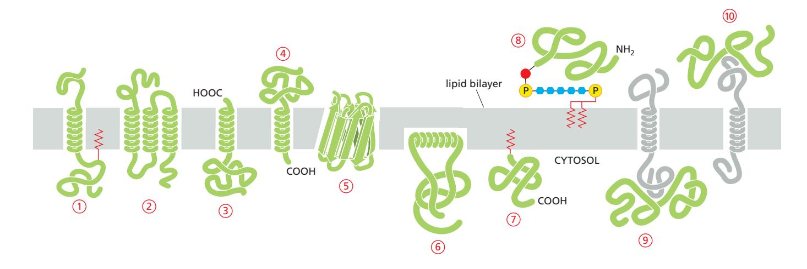

Other membrane proteins are located entirely in the cytosol and are attached to the cytosolic monolayer of the lipid bilayer, either by an amphiphilic α helix exposed on the surface of the protein (Figure 10–17, example 6) or by one or more covalently attached lipid chains (Figure 10–17, example 7). The lipid-linked pro teins in example 7 in Figure 10–17 are made as soluble proteins in the cytosol and are subsequently anchored to the membrane by the covalent attachment of the lipid group. Lipids can also be attached to the cytosolic facing domains of trans membrane proteins as an additional means of anchoring them to the membrane (see Figure 10–17, example 1).

Yet other membrane proteins are entirely exposed at the external cell sur face, being attached to the lipid bilayer only by a covalent linkage (via a specific oligosaccharide) to a lipid anchor in the outer monolayer of the plasma mem brane (Figure 10–17, example 8). These proteins are initially made and inserted into the endoplasmic reticulum (ER) by a single transmembrane segment at the C-terminus (similar to example 4 in Figure 10-17). While still in the ER, the transmembrane segment of the protein is cleaved off and a *glycosylphosphati dylinositol* (*GPI*) *anchor* is added, leaving the protein bound to the noncytosolic surface of the ER membrane solely by this anchor (discussed in Chapter 12); transport vesicles eventually deliver the protein to the plasma membrane (discussed in Chapter 13).

By contrast to these examples, **membrane-associated proteins** do not extend into the hydrophobic interior of the lipid bilayer at all; they are instead bound to either face of the membrane by noncovalent interactions with other membrane proteins (Figure 10–17, examples 9 and 10). Many of the proteins of this type can be released from the membrane by relatively gentle extraction procedures, such as exposure to solutions of very high or low ionic strength or of extreme pH, which interfere with protein–protein interactions but leave the lipid bilayer intact; these proteins are often referred to as *peripheral membrane proteins*, and their association with membranes is often regulated by the cell as we discuss next. Transmembrane proteins and many proteins held in the bilayer by lipid groups or hydrophobic polypeptide regions that insert into the hydrophobic core of the lipid bilayer cannot be released in these ways.

### Lipid Anchors Control the Membrane Localization of Some Signaling Proteins

How a membrane protein is associated with the lipid bilayer reflects the func tion of the protein. Only transmembrane proteins can function on both sides of the bilayer or transport molecules across it. Cell-surface receptors, for example, are usually transmembrane proteins that bind signal molecules in the extracellu lar space and generate different intracellular signals on the opposite side of the plasma membrane, as we discuss in Chapter 15. To transfer small hydrophilic mol ecules across a membrane, a membrane transport protein must provide a path for the molecules to cross the hydrophobic permeability barrier of the lipid bilayer; the molecular architecture of multipass transmembrane proteins (Figure 10–17, examples 2 and 5) is ideally suited for this task, as we discuss in Chapter 11.

Proteins that function on only one side of the lipid bilayer, by contrast, are often associated exclusively with either the lipid monolayer or a protein domain on that side. Some intracellular signaling proteins, for example, that help relay extra cellular signals into the cell interior are bound to the cytosolic half of the plasma membrane by one or more covalently attached lipid groups, which can be fatty acid chains or *prenyl groups* (**Figure 10–18**). In some cases, myristic acid is added to the N-terminal amino group of the protein during its synthesis on a ribosome. All members of the *Src family* of cytoplasmic protein tyrosine kinases (dis cussed in Chapter 15) are myristoylated in this way. Membrane attachment through a single lipid anchor is not very strong, however, and a second lipid group is often added to anchor proteins more firmly to a membrane. For most Src kinases, the second lipid modification is the attachment of palmitic acid to a cysteine side chain of the protein. This modification occurs in response to

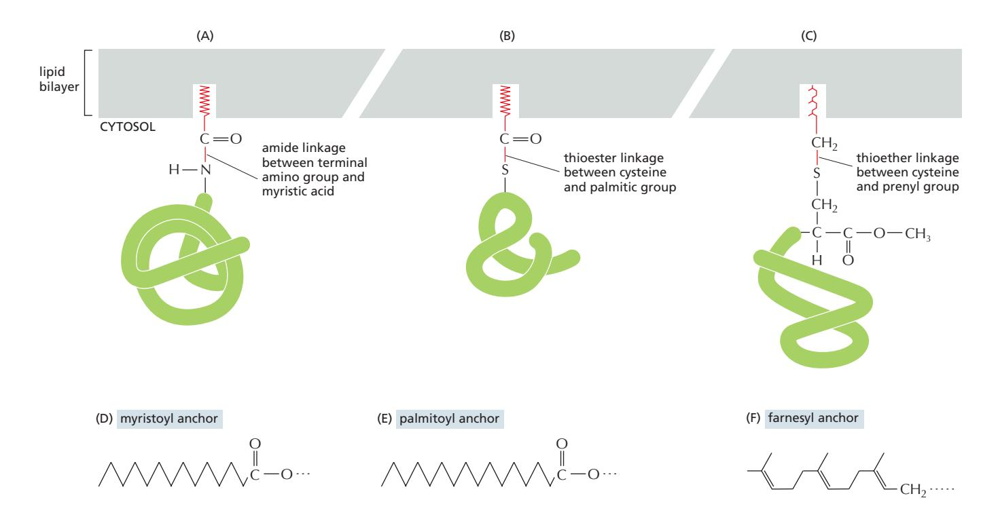

an extracellular signal and helps recruit the kinases to the plasma membrane. When the signaling pathway is turned off, the palmitic acid is removed, allowing the kinase to return to the cytosol. Other intracellular signaling proteins, such as the Ras family small GTPases (discussed in Chapter 15), use a combination of prenyl group and palmitic acid attachment to recruit the proteins to the plasma membrane.

Many proteins attach to membranes transiently. Some are classical peripheral membrane proteins that associate with membranes by regulated protein–protein interactions. Others undergo a transition from soluble to membrane protein by a conformational change that exposes a hydrophobic peptide or covalently attached lipid anchor. Many of the small GTPases of the Rab protein family that regulate intracellular membrane traffic (discussed in Chapter 13), for example, switch depending on the nucleotide that is bound to the protein. In their GDPbound state they are soluble in the cytosol, often stabilized by binding to a GDP dissociation inhibitor, or GDI, whereas in their GTP-bound state their lipid anchor is exposed and tethers them to membranes. They are membrane proteins at one moment and soluble proteins at the next. Such highly dynamic interactions greatly expand the repertoire of membrane functions. MBoC7 m10.18/10.18

# In Most Transmembrane Proteins, the Polypeptide Chain Crosses the Lipid Bilayer in an α-Helical Conformation

A transmembrane protein always has a unique orientation in the membrane. This reflects both the asymmetric manner in which it is inserted into the lipid bilayer in the ER during its biosynthesis (discussed in Chapter 12) and the different functions of its cytosolic and noncytosolic domains. These domains are separated by the membrane-spanning segments of the polypeptide chain, which contact the hydrophobic environment of the lipid bilayer and are composed largely of amino acids with nonpolar side chains. Because the peptide bonds themselves are polar and because water is absent in the bilayer, all peptide bonds in the membranespanning segments of a polypeptide are driven to form hydrogen bonds with one another (discussed in Chapter 3).

There are two ways that hydrogen-bonding between peptide bonds can be maximized. The most common way, found in the majority of transmembrane

Figure 10–18 Membrane protein attachment by a fatty acid chain or a prenyl group. The covalent attachment of either type of lipid can help localize a water-soluble protein to a membrane after its synthesis in the cytosol. (A) A fatty acid chain (myristic acid) is attached via an amide linkage to an N-terminal glycine. (B) A fatty acid chain (palmitic acid) is attached via a thioester linkage to a cysteine. (C) A prenyl chain (either farnesyl or a longer geranylgeranyl chain) is attached via a thioether linkage to a cysteine residue that is initially located four residues from the protein's C-terminus. After prenylation, the terminal three amino acids are cleaved off, and the new C-terminus is methylated before insertion of the anchor into the membrane (not shown). The structures of the lipid anchors are shown below: (D) a myristoyl anchor (derived from a 14-carbon saturated fatty acid chain), (E) a palmitoyl anchor (a 16-carbon saturated fatty acid chain), and (F) a farnesyl anchor (a 15-carbon unsaturated hydrocarbon chain composed of three 5-carbon isoprenoid repeats).

Figure 10–19 A segment of a membrane-spanning polypeptide chain crossing the lipid bilayer as an **a** helix. Only the α-carbon backbone of the polypeptide chain is shown, with the hydrophobic amino acids in *green* and the hydrophilic amino acids in *yellow*. The polypeptide segment shown is part of the single membrane-spanning protein glycophorin, which is found abundantly in the red blood cell plasma membrane. Glycophorin normally is a dimer of two identical subunits whose transmembrane segments cross in the hydrophobic interior of the bilayer. Only a single transmembrane segment is shown. (PDB code: 5EH4.)

proteins, is if the polypeptide chain forms a regular α helix as it crosses the bilayer (**Figure 10–19**). In **single-pass transmembrane proteins**, the polypeptide chain crosses only once (see Figure 10–17, example 1), whereas in **multipass transmembrane proteins**, the polypeptide chain crosses multiple times (see Figure 10–17, example 2). An alternative way for the peptide bonds in the lipid bilayer to satisfy their hydrogen-bonding requirements is for multiple transmembrane strands of a polypeptide chain to be arranged as a β sheet that is rolled up into a cylinder (a so-called *b barrel*; see Figure 10–17, example 5, and Figure 3–7). This protein architecture is seen in the *porin proteins* that we discuss later.

Progress in x-ray crystallography and single-particle cryo-electron microscopy of membrane proteins has enabled the determination of the three-dimensional structure of many of them. The structures confirm that it is often possible to predict from the protein's amino acid sequence which parts of the polypeptide chain extend across the lipid bilayer. Segments containing about 20–30 amino acids, with a high degree of hydrophobicity, are long enough to span a lipid bilayer as an α helix, and they can often be identified in *hydropathy plots* (**Figure 10–20**). From such plots, it is estimated that about 30% of an organism's proteins are transmembrane proteins, emphasizing their importance. Hydropathy plots cannot identify the membrane-spanning segments of a β barrel, as 10 amino acids or fewer are sufficient to traverse a lipid bilayer as an extended β strand, and only every other amino acid side chain is hydrophobic.

The strong drive to maximize hydrogen-bonding in the absence of water means that most transmembrane helices span the membrane completely. But multipass transmembrane proteins can also contain regions that fold into the membrane from either side, squeezing into spaces between transmembrane α helices without contacting the hydrophobic core of the lipid bilayer. Because such regions interact only with other polypeptide regions, they do not need to maximize hydrogen-bonding; they can therefore have a variety of secondary structures, including helices that extend only partway across the lipid bilayer (**Figure 10–21**). Such regions are important for the function of some membrane proteins, including water channel and ion channel proteins, in which the regions contribute to the walls of the pores traversing the membrane and confer substrate specificity on the channels, as we discuss in Chapter 11. These regions cannot be identified

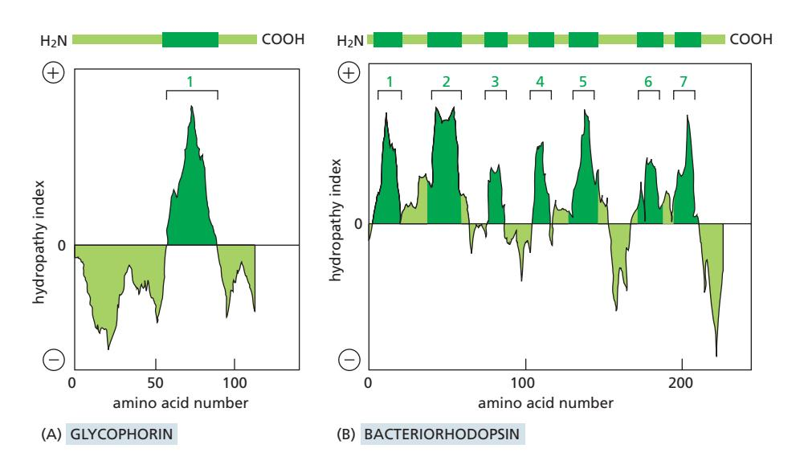

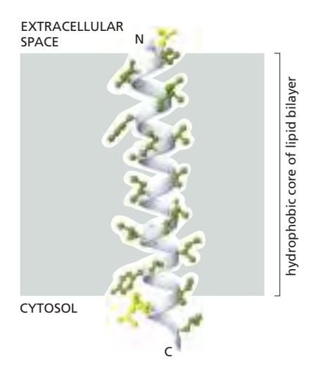

Figure 10–20 Using hydropathy plots to localize potential **a**-helical membranespanning segments in a polypeptide chain. The free energy needed to transfer successive segments of a polypeptide chain from a nonpolar solvent to water is calculated from the amino acid composition of each segment using data obtained from model compounds. This calculation is made for segments of a fixed size (usually around 10–20 amino acids), beginning with each successive amino acid in the chain. The *hydropathy index* of the segment is plotted on the Y axis as a function of its location in the chain. A positive value indicates that free energy is required for transfer to water (that is, the segment is hydrophobic), and the value assigned is an index of the amount of energy needed. Peaks in the hydropathy index appear at the positions of hydrophobic segments in the amino acid sequence. (A and B) Hydropathy plots for two membrane proteins that are discussed later in this chapter. Glycophorin (A) has a single membrane-spanning α helix and one corresponding peak in the hydropathy plot. Bacteriorhodopsin (B) has seven membrane-spanning α helices and seven corresponding peaks in the hydropathy plot. (A, adapted from D. Eisenberg, *Annu. Rev. Biochem*. 53:595–624, 1984.)

in hydropathy plots and are only revealed by determining the protein's threedimensional structure or by sequence alignment with homologous proteins whose structures are known.

# Transmembrane α Helices Often Interact with One Another

The transmembrane α helices of many single-pass membrane proteins do not contribute to the folding of the protein domains on either side of the membrane. As a consequence, it is often possible to engineer cells to produce just the cytosolic or extracellular domains of these proteins as water-soluble molecules. This approach has been invaluable for studying the structure and function of these domains, especially the domains of transmembrane receptor proteins (discussed in Chapter 15). A transmembrane α helix, even in a single-pass membrane protein, however, often does more than just anchor the protein to the lipid bilayer. Many single-pass membrane proteins form homodimers or heterodimers that are held together by noncovalent, but strong and highly specific, interactions between the two transmembrane α helices; the sequence of the amino acids of these helices contains the information that directs the protein–protein interaction.

Similarly, the transmembrane α helices in multipass membrane proteins occupy specific positions in the folded protein structure that are determined by interactions between the neighboring helices (**Figure 10–22**). These interactions are crucial for the structure and function of the many receptors, channels, and transporters that communicate or move molecules across cell membranes. In these proteins, each transmembrane helix shields regions of neighboring transmembrane helices from membrane lipids. When all the helices are packed together into the final folded structure, the outer surface of the helical bundle that is exposed to lipids is composed primarily of hydrophobic amino acids. By contrast, the interior of the helical bundle, which is not exposed directly to lipids, can contain polar and even charged amino acids that would ordinarily be disfavored in the membrane. The ability to accommodate hydrophilic amino acids within a bundle of transmembrane helices means that multipass membrane proteins can contain binding sites and channels across the membrane for hydrophilic molecules. This property affords multipass membrane proteins considerable functional diversity and probably explains why they represent the majority of membrane proteins.

### Some β Barrels Form Large Channels

Unlike a bundle of α helices that can be arranged in numerous ways, β-barrel membrane proteins are always arranged as a cylinder. This is because all hydrogen bonds must be satisfied, so a sheet that exposes an edge is energetically

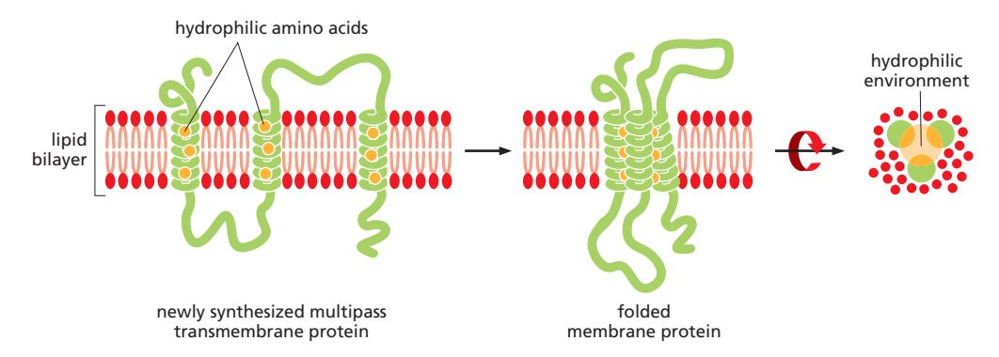

MBoC7 m10.22/10.22 Figure 10–22 Steps in the folding of a multipass transmembrane protein. Polar and charged amino acids contained in transmembrane helices are energetically disfavored in the hydrophobic environment of the lipid bilayer. They become buried in the interface between spatially adjacent helices in folded membrane proteins. In membrane protein complexes, these contacts can occur between helices from different protein subunits, as is the case for many ion channels as discussed in Chapter 11. In this way, multipass membrane proteins can provide a hydrophilic path across the hydrophobic barrier of the bilayer.

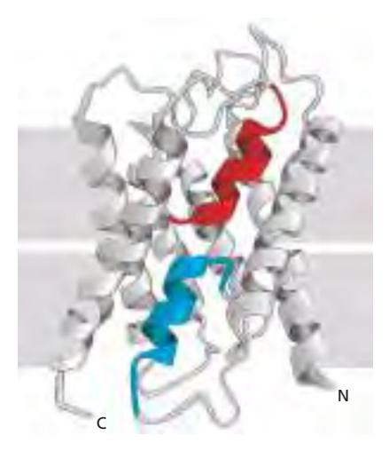

Figure 10–21 Two short **a** helices in the aquaporin water channel, each of which spans only halfway through the lipid bilayer. In the plasma membrane, four monomers, one of which is shown here, form a tetramer. Each monomer has a hydrophilic pore at its center, which allows water molecules to cross the membrane in single file (see Figure 11–20 and Movie 11.6). The two short, colored helices are buried at an interface formed by protein–protein interactions. The mechanism by which the channel allows the passage of water molecules is discussed in more detail in Chapter 11. (PDB code: 1H6I.) MBoC7 m10.21/10.21

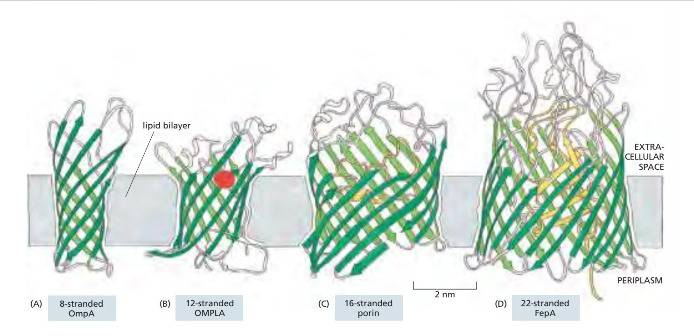

disfavored in the membrane. This means that β barrels all share the same overall architecture in which the amino acids facing the outside of the cylinder are hydrophobic. By contrast, the size of the barrel, and the content inside the barrel, are highly variable and suited to the function of each β-barrel membrane protein. For example, the number of β strands in a β barrel varies widely, from as few as 8 strands to as many as 22 (**Figure 10–23**).

β-Barrel proteins are abundant in the outer membranes of bacteria, mitochondria, and chloroplasts. Some are pore-forming proteins, which create water-filled channels that allow selected small hydrophilic molecules to cross the membrane. The porins are well-studied examples (Figure 10–23C). Many porin barrels are formed from a 16-strand, antiparallel β sheet rolled up into a cylindrical structure. Polar amino acid side chains line the aqueous channel on the inside, while nonpolar side chains project from the outside of the barrel to interact with the hydrophobic core of the lipid bilayer. Loops of the polypeptide chain often protrude into the **lumen** of the channel, narrowing it so that only certain solutes can pass. Some porins are therefore highly selective: *maltoporin*, for example, preferentially allows maltose and maltose oligomers to cross the outer membrane of *E. coli*. MBoC7 m10.23/10.23

The *FepA protein* is a more complex example of a β-barrel transport protein (Figure 10–23D). It transports iron ions across the bacterial outer membrane. It is constructed from 22 β strands, and a large globular domain completely fills the inside of the barrel. Iron ions bind to this domain, which changes its conformation to transfer the iron across the membrane.

Not all β-barrel proteins are transporters. Some form smaller barrels that are completely filled by amino acid side chains that project into the center of the barrel. These proteins function as receptors or enzymes (Figure 10–23A and B); the barrel serves as a rigid anchor, which holds the protein in the membrane and orients the cytosolic loops that form binding sites for specific intracellular molecules.

Most multipass membrane proteins in eukaryotic cells and in the bacterial plasma membrane are constructed from transmembrane α helices. The helices can slide against each other, allowing conformational changes in the protein that can open and shut ion channels, transport solutes, or transduce extracellular signals into intracellular ones. In β-barrel proteins, by contrast, hydrogen bonds bind each β strand rigidly to its neighbors, making conformational changes within the wall of the barrel unlikely. This rigidity makes β barrels remarkably

Figure 10–23 **b** barrels formed from different numbers of **b** strands. (A) The *Escherichia coli* OmpA protein serves as a receptor for a bacterial virus. (B) The *E. coli* OMPLA protein is an enzyme (a lipase) that hydrolyzes lipid molecules. The amino acids that catalyze the enzymatic reaction (indicated in *red*) protrude from the outside surface of the barrel. (C) A porin from the bacterium *Rhodobacter capsulatus* forms a water-filled pore across the outer membrane. The diameter of the channel is restricted by loops (shown in *yellow*) that protrude into the channel. (D) The *E. coli* FepA protein transports iron ions. The inside of the barrel is completely filled by a globular protein domain (shown in *yellow*) that contains an iron-binding site (not shown).

stable, allowing them to be more easily purified and crystallized than α-helical membrane proteins. This is one reason why β-barrel proteins were among the first multipass proteins whose structures were determined.

#### Many Membrane Proteins Are Glycosylated

The plasma membrane of a cell is exposed to the often harsh and constantly changing extracellular environment. How are the membrane and its embedded proteins protected from damage? One answer is that many cells have a layer of oligosaccharide and polysaccharide chains that are attached to the lipids and protein domains facing the outside. Most transmembrane proteins in animal cells are glycosylated. As in glycolipids, the sugar residues are added in the lumen of the endoplasmic reticulum and the Golgi apparatus (discussed in Chapters 12 and 13). For this reason, the oligosaccharide chains are always present on the noncytosolic side of the membrane. Another important difference between proteins (or parts of proteins) on the two sides of the membrane results from the reducing environment of the cytosol. This environment decreases the likelihood that intrachain or interchain disulfide (S–S) bonds will form between cysteines on the cytosolic side of membranes. These bonds form on the noncytosolic side, where they can help stabilize either the folded structure of the polypeptide chain or its association with other polypeptide chains (**Figure 10–24**).

Because the extracellular parts of most plasma membrane proteins are glycosylated, carbohydrates extensively coat the surface of all eukaryotic cells. These carbohydrates occur as oligosaccharide chains covalently bound to membrane proteins (glycoproteins) and lipids (glycolipids). They also occur as the polysaccharide chains of integral membrane *proteoglycan* molecules. Proteoglycans, which consist of long polysaccharide chains linked covalently to a protein core, are found mainly outside the cell, as part of the extracellular matrix (discussed in Chapter 19). But, for some proteoglycans, the protein core either extends across the lipid bilayer or is attached to the bilayer by a glycosylphosphatidylinositol (GPI) anchor.

The terms *cell coat* or *glycocalyx* are sometimes used to describe the carbohydrate-rich zone on the cell surface. This **carbohydrate layer** can be visualized by various stains, such as ruthenium red (**Figure 10–25A**), as well as by its affinity for carbohydrate-binding proteins called **lectins**, which can be labeled with a fluorescent dye or some other visible marker. Although most of the sugar groups are attached to intrinsic plasma membrane molecules, the carbohydrate layer also contains both glycoproteins and proteoglycans that have been secreted into the extracellular space and then adsorbed onto the cell surface (**Figure 10–25B**). Many of these adsorbed macromolecules are components of the extracellular matrix, so that the boundary between the plasma membrane and the extracellular matrix is often not sharply defined. One of the many functions of a slippery carbohydrate layer is to protect cells against mechanical and chemical damage; it also keeps various other cells at a distance, preventing unwanted cell–cell interactions.

The oligosaccharide side chains of glycoproteins and glycolipids are enormously diverse in their arrangement of sugars. Although they usually contain fewer than 15 sugars, the chains are often branched, and the sugars can be bonded together by various kinds of covalent linkages—unlike the amino acids in a polypeptide chain, which are all linked by identical peptide bonds. Even three sugars can be put together to form hundreds of different trisaccharides. How sugars can form such a vast variety of different structures is discussed in Chapter 2. Both the diversity and the exposed position of the oligosaccharides on the cell surface make them especially well suited to function in specific cell-recognition processes. Plasma-membrane-bound lectins that recognize specific oligosaccharides on cell-surface glycolipids and glycoproteins mediate a variety of transient cell–cell adhesion processes, including those occurring in lymphocyte recirculation and inflammatory responses (see Figure 19–28).

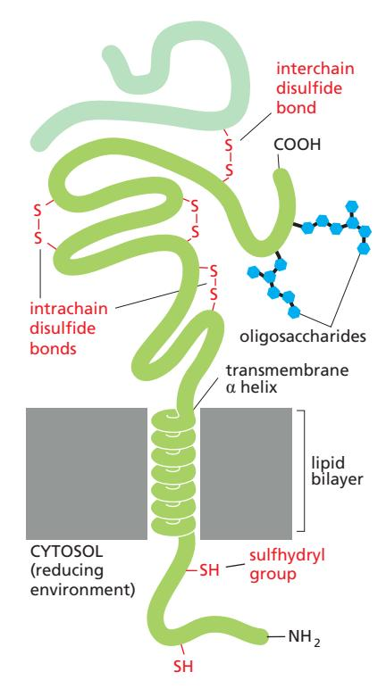

MBoC7 m10.24/10.24 Figure 10–24 A single-pass transmembrane protein. Note that the polypeptide chain traverses the lipid bilayer as a right-handed α helix and that the oligosaccharide chains and disulfide bonds are all on the noncytosolic surface of the membrane. As shown, sulfhydryl groups within a transmembrane protein can form either intrachain disulfide bonds with each other or interchain disulfide bonds with sulfhydryl groups in other proteins. The sulfhydryl groups in the cytosolic domain of the protein do not normally form disulfide bonds because the reducing environment in the cytosol maintains these groups in their reduced (–SH) form.

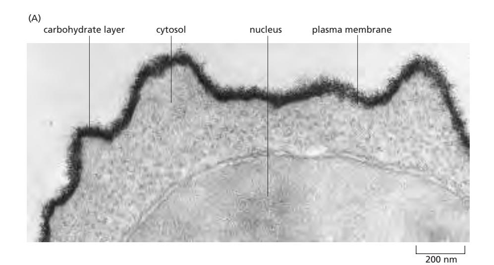

Figure 10–25 The carbohydrate layer on the cell surface. (A) This electron micrograph of the surface of a lymphocyte stained with ruthenium red emphasizes the thick carbohydrate-rich layer surrounding the cell. (B) The carbohydrate layer is made up of the oligosaccharide side chains of membrane glycolipids and membrane glycoproteins and the polysaccharide chains on membrane proteoglycans. In addition, adsorbed glycoproteins, and adsorbed proteoglycans (not shown), contribute to the carbohydrate layer in many cells. Note that all of the carbohydrate is on the extracellular surface of the membrane. (A, courtesy of Audrey M. Gluaert and G.M.W. Cook.)

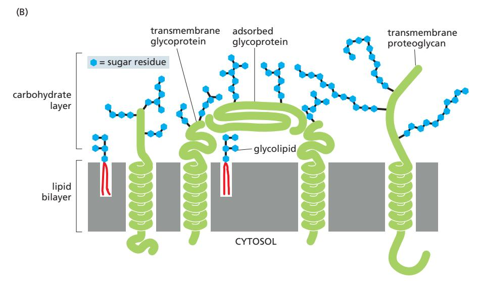

# Membrane Proteins Can Be Solubilized and Purified in Detergents

In general, only agents that disrupt hydrophobic associations and disassemble the lipid bilayer can liberate membrane proteins in a soluble form. The most useful of these for the membrane biochemist are **detergents**, which are small amphiphilic molecules of variable structure (**Movie 10.4**). Detergents are much more soluble in water than in lipids. Their polar (hydrophilic) ends can be either charged (ionic), as in *sodium dodecyl sulfate* (*SDS*), or uncharged (nonionic), as in *b*-*octylglucoside* and Triton X-100 (**Figure 10–26A**). At low concentration, detergents are monomeric in solution, but when their concentration is increased above a threshold, called the *critical micelle concentration* (*CMC*), they aggregate to form micelles (**Figure 10–26B, C, and D**). Above the CMC, detergent molecules rapidly diffuse in and out of micelles, keeping the concentration of monomer in the solution constant, no matter how many micelles are present. Because of this dynamic behavior, the structure of a micelle changes constantly: at any moment most, but not all, of the hydrophilic ends of the detergent molecules will be external facing the water phase and most, but not all, of the hydrophobic ends will be internal to the micelle. Both the CMC and the average number of detergent molecules in a micelle are characteristic properties of each detergent, but they also depend on the temperature, pH, and salt concentration. Detergent solutions are therefore complex systems and are difficult to study. MBoC7 m10.25/10.25

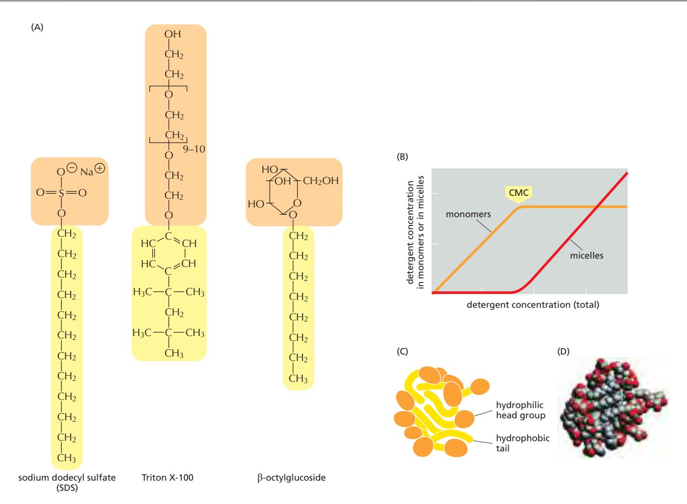

MBoC7 m10.26/10.26 Figure 10–26 The structure and function of detergents. (A) Three commonly used detergents are sodium dodecyl sulfate (SDS), an anionic detergent, and Triton X-100 and β-octylglucoside, two nonionic detergents. Triton X-100 is a mixture of compounds in which the region in brackets is repeated between 9 and 10 times. The hydrophobic portion of each detergent is shown in *yellow*, and the hydrophilic portion is shown in *orange*. (B) At low concentration, detergent molecules are monomeric in solution. As their concentration is increased beyond the critical micelle concentration (CMC), some of the detergent molecules form micelles. Note that the concentration of detergent monomer stays constant above the CMC. (C) Because they have both polar and nonpolar ends, detergent molecules are amphiphilic; and because they are coneshaped, they form micelles rather than bilayers (see Figure 10–7). Detergent micelles are thought to have constantly changing, irregular shapes. Because of packing constraints, the hydrophobic tails are partially exposed to water. (D) The space-filling model shows a snapshot in time of a micelle composed of 20 β-octylglucoside molecules, predicted by *molecular dynamics calculations*. The head groups are shown in *red* and the hydrophobic tails in *gray*. Note that the hydrophobic regions are transiently exposed. (B, adapted with permission from G. Gunnarsson, B. Jönsson, and H. Wennerström, *J. Phys. Chem. A*  84:3114–3121, 1980. Copyright 1980 American Chemical Society; C, from S. Bogusz, R.M. Venable, and R.W. Pastor, *J. Phys. Chem. B* 104:5462–5470, 2000.)

When mixed with membranes, the hydrophobic ends of detergents bind to the hydrophobic regions of the membrane proteins, where they displace lipid molecules with a collar of detergent molecules. Because the other end of the detergent molecule is polar, this binding tends to bring the membrane proteins into solution as detergent–protein complexes (**Figure 10–27**). Usually, some lipid molecules also remain attached to the protein.

Strong ionic detergents, such as SDS, can solubilize even the most hydrophobic membrane proteins. This allows the proteins to be analyzed by *SDS polyacrylamidegel electrophoresis* (discussed in Chapter 8). Such strong detergents, however, unfold (denature) proteins by disrupting their internal hydrophobic cores, thereby rendering the proteins inactive and unusable for functional studies. Nonetheless, proteins can be readily separated and purified in their SDS-denatured form. In

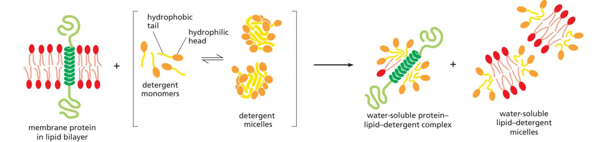

some cases, removal of the SDS allows the purified protein to renature, with recovery of functional activity.

MBoC7 m10.27/10.27 Many membrane proteins can be solubilized and then purified in an active form by the use of mild detergents. These detergents cover the hydrophobic regions on membrane-spanning segments that become exposed after lipid removal but do not unfold the protein. Especially when working with multipass membrane proteins, it is often important to maintain a thin layer of lipids upon detergent extraction to retain the protein's activity. If the detergent concentration

Figure 10–27 Solubilizing a membrane protein with a mild nonionic detergent. The detergent disrupts the lipid bilayer and brings the protein into solution as protein–lipid–detergent complexes. The phospholipids in the membrane are also solubilized by the detergent, as lipid–detergent micelles.

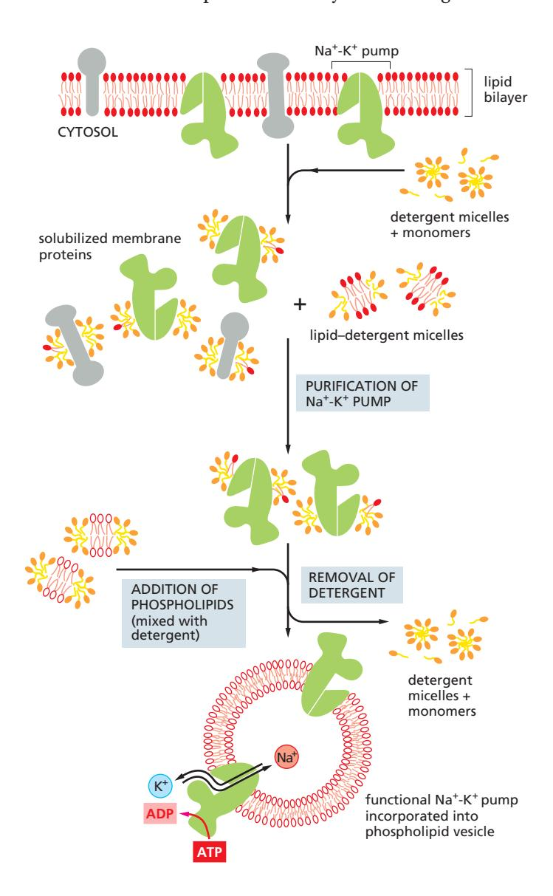

Figure 10–28 The use of mild nonionic detergents for solubilizing, purifying, and reconstituting functional membrane protein systems. In this example, functional Na+-K+ pump molecules are purified and incorporated into phospholipid vesicles. This pump is present in the plasma membrane of most animal cells, where it uses the energy of ATP hydrolysis to pump Na+ out of the cell and K+ in, as discussed in Chapter 11. The phospholipids that are newly added in the reconstitution experiments are shown with white polar head groups.

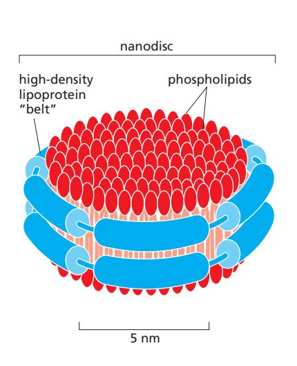

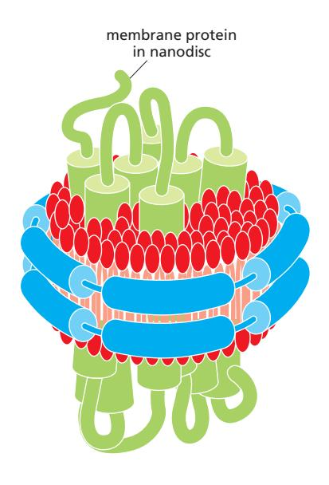

Figure 10–29 Model of a membrane protein reconstituted into a nanodisc. When detergent is removed from a solution

containing a multipass membrane protein, lipids, and a protein subunit of the highdensity lipoprotein (HDL), the membrane protein becomes embedded in a small patch of lipid bilayer, which is surrounded by a belt of the HDL protein. In such nanodiscs, the hydrophobic edges of the bilayer patch are shielded by the protein belt, which renders the assembly watersoluble.

of a solution of solubilized membrane proteins is reduced (by dilution, for example), membrane proteins do not remain soluble. In the presence of an excess of phospholipid molecules in such a solution, however, membrane proteins incorporate into small liposomes that form spontaneously. In this way, functionally active membrane protein systems can be reconstituted from purified components, providing a powerful means of analyzing the activities of membrane transporters, ion channels, signaling receptors, and so on (**Figure 10–28**). Such functional reconstitution can determine which proteins are both necessary and sufficient for a particular cell function. For example, the approach provided proof for the hypothesis that the enzymes that make ATP (ATP synthases) use H+ gradients in mitochondrial, chloroplast, and bacterial membranes to produce ATP. MBoC7 m10.29/10.29

Membrane proteins can also be reconstituted from detergent solution into nanodiscs, which are small, uniformly sized patches of membrane that are surrounded by a belt of a specially designed protein, which covers the exposed edge of the bilayer to keep the patch in solution (**Figure 10–29**). The belt protein is derived from high-density lipoproteins (HDLs), whose normal function is to keep lipids soluble for transport in the blood. In nanodiscs the membrane protein of interest can be studied in its native lipid environment and is experimentally accessible from both sides of the bilayer, which is useful, for example, for ligand-binding experiments. Proteins contained in nanodiscs can also be analyzed by single-particle electron microscopy techniques to determine their structure. By this technique (discussed in Chapter 9), the structure of a membrane protein can be determined to high resolution without a requirement of the protein of interest to crystallize into a regular lattice, which is often hard to achieve for membrane proteins. These developments have led to a rapid increase in the number of three-dimensional structures of membrane proteins and protein complexes that are known, although they are still few compared to the known structures of water-soluble proteins and protein complexes.

# Bacteriorhodopsin Is a Light-driven Proton (H+) Pump That Traverses the Lipid Bilayer as Seven α Helices

In Chapter 11, we consider how multipass transmembrane proteins mediate the selective transport of small hydrophilic molecules across cell membranes. But a detailed understanding of how such a membrane transport protein works requires precise information about its three-dimensional structure in the bilayer. *Bacteriorhodopsin* was the first membrane transport protein whose structure was determined, and it emerged as the prototype of many multipass membrane proteins that have a similar structure.

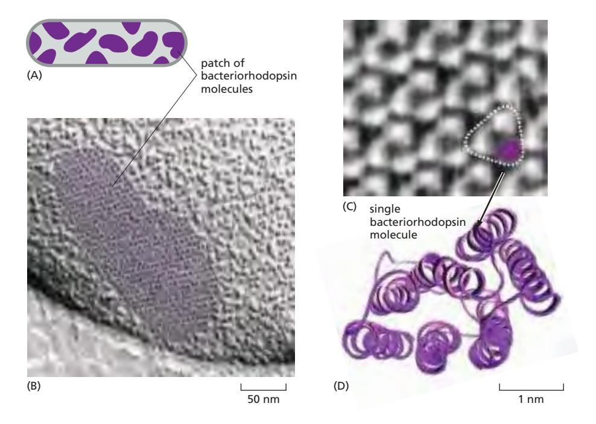

Figure 10–30 Patches of purple membrane, which contain bacteriorhodopsin in the archaeon *Halobacterium salinarum.* (A) These archaea live in saltwater pools, where they are exposed to sunlight. They have evolved a variety of light-activated proteins, including bacteriorhodopsin, which is a light-activated H+ pump in the plasma membrane. (B) The bacteriorhodopsin molecules in the purple membrane patches are tightly packed into two-dimensional crystalline arrays. (C) Details of the molecular surface visualized by atomic force microscopy. With this technique, individual bacteriorhodopsin molecules can be seen. (D) Outline of the approximate location of the bacteriorhodopsin monomer and the individual α helices in the image shown in C. (B–C, courtesy of Dieter Oesterhelt; D, PDB code: 2BRD.)

The "purple membrane" of the archaeon *Halobacterium salinarum* is a specialized patch in the plasma membrane that contains a single species of protein molecule, **bacteriorhodopsin** (**Figure 10–30A**). The protein functions as a light-activated H+ pump that transfers H+ out of the archaeal cell. The ability of bacteriorhodopsin molecules to tightly pack with each other into a planar twodimensional crystal (**Figure 10–30B, C, and D**) facilitated the determination of its three-dimensional structure.

Each bacteriorhodopsin molecule is folded into seven closely packed transmembrane α helices and contains a single light-absorbing group, or chromophore (in this case, *retinal*), which gives the protein its purple color. Retinal is vitamin A in its aldehyde form and is identical to the chromophore found in *rhodopsin* of the photoreceptor cells of the vertebrate eye (discussed in Chapter 15). Retinal is covalently linked to a lysine side chain of the bacteriorhodopsin protein. When activated by a single photon of light, the excited chromophore changes its shape and causes a series of small conformational changes in the protein, resulting in the transfer of one H+ from the inside to the outside of the cell (**Figure 10–31A**). In bright light, each bacteriorhodopsin molecule can pump several hundred protons per second. The light-driven proton transfer establishes an H+ gradient across the plasma membrane, which in turn drives the production of ATP by a second protein in the cell's plasma membrane. The energy stored in the MBoC7 m10.30/10.30

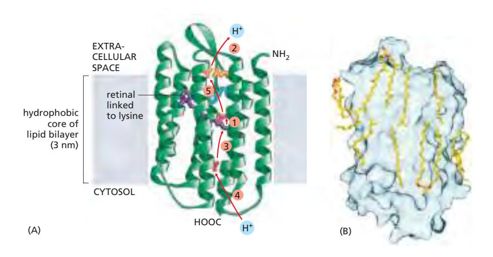

Figure 10–31 The three-dimensional structure of a bacteriorhodopsin molecule. (Movie 10.5) (A) The polypeptide chain crosses the lipid bilayer seven times as α helices. The location of the retinal chromophore *(purple)* and the probable pathway taken by H+ during the light-activated pumping cycle *(red arrows)* are shown. The first and key step is the passing of an H+ from the chromophore to the side chain of aspartic acid 85 (*red*, located next to the chromophore) that occurs upon absorption of a photon by the chromophore. Subsequently, other H+ transfer steps—in the numerical order indicated and utilizing the hydrophilic amino acid side chains that line a path through the membrane—complete the pumping cycle and return the enzyme to its starting state. (Movie 10.5 explains how the individual transfer steps are linked mechanistically.) Color code: glutamic acid *(orange)*, aspartic acid *(red)*, arginine *(blue)*. (B) The high-resolution crystal structure of bacteriorhodopsin shows many lipid molecules (*yellow* with *red* head groups) that are tightly bound to specific places on the surface of the protein. (A, adapted from H. Luecke et al., *Science* 286:255–261, 1999. B, from H. Luecke et al., *J. Mol. Biol.* 291:899–911, 1999. With permission from Elsevier.)

H+ gradient also drives other energy-requiring processes in the cell. Thus, bacteriorhodopsin converts solar energy into an H+ gradient, which provides energy to the archaeal cell.

The high-resolution crystal structure of bacteriorhodopsin reveals many lipid molecules bound in specific places on the protein surface (**Figure 10–31B**). Interactions with specific lipids are thought to help stabilize many membrane proteins, which work best and sometimes crystallize more readily if some of the lipids remain bound during detergent extraction or if specific lipids are added back to the proteins in detergent solutions. The specificity of these lipid–protein interactions helps explain why eukaryotic membranes contain such a variety of lipids, with head groups that differ in size, shape, and charge. This layer of lipids also helps to fill gaps between the jagged hydrophobic surface of the membrane protein and the hydrophobic core of the lipid bilayer and to maintain the permeability barrier of the membrane for ions and other solutes. These lipids are in dynamic association with the protein surface, binding and dissociating at a millisecond time scale. We can think of the membrane lipids as constituting a two-dimensional solvent for the proteins in the membrane, just as water constitutes a three-dimensional solvent for proteins in an aqueous solution: some membrane proteins can function only in the presence of specific lipid head groups, just as many enzymes in aqueous solution require a particular ion for activity.

Bacteriorhodopsin is a member of a large superfamily of membrane proteins with similar structures but different functions. For example, rhodopsin in rod cells of the vertebrate retina and many cell-surface receptor proteins that bind extracellular signal molecules are also built from seven transmembrane α helices. These proteins function as signal transducers rather than as transporters: each responds to an extracellular signal by activating a GTP-binding protein (G protein) inside the cell, and they are therefore called *G-protein-coupled receptors* (*GPCRs*), as we discuss in Chapter 15 (see Figure 15–6B). Although the structures of bacteriorhodopsins and GPCRs are strikingly similar, they show no sequence similarity and thus probably belong to two evolutionarily distant branches of an ancient protein family. A related class of membrane proteins, the *channelrhodopsins* that green algae use to detect light, form ion channels when they absorb a photon. When engineered so that they are expressed in animal brains, these proteins have become invaluable tools in neurobiology because they allow specific neurons to be stimulated experimentally by shining light on them, as we discuss in Chapter 11 (Figure 11–47).

#### Membrane Proteins Often Function as Large Complexes

Many membrane proteins function as part of multicomponent complexes. One is a bacterial photosynthetic reaction center, which was the first membrane protein complex to be crystallized and analyzed by x-ray diffraction. In Chapter 14, we discuss how such photosynthetic complexes function to capture light energy and use it to pump H+ across the membrane. Many of the membrane protein complexes involved in photosynthesis, proton pumping, and electron transport are even larger than the photosynthetic reaction center. The enormous photosystem II complex from cyanobacteria, for example, contains 19 protein subunits and well over 60 transmembrane helices (see Figure 14–49). Membrane proteins are often arranged in large complexes, not only for harvesting various forms of energy but also for transducing extracellular signals into intracellular ones (discussed in Chapter 15).

#### Many Membrane Proteins Diffuse in the Plane of the Membrane

Like most membrane lipids, membrane proteins do not tumble (flip-flop) across the lipid bilayer. Tumbling would require large hydrophilic domains to pass through the membrane's hydrophobic core, which is energetically prohibitive. But just like membrane lipids, proteins can rotate rapidly about an axis perpendicular to the plane of the bilayer (*rotational diffusion*) and move laterally within the membrane (*lateral diffusion*). An experiment in which mouse cells were

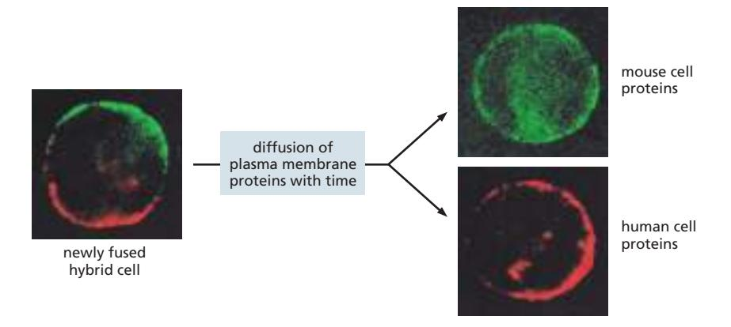

artificially fused with human cells to produce hybrid cells (*heterokaryons*) provided the first direct evidence that some plasma membrane proteins are mobile in the plane of the membrane. Two differently labeled antibodies were used to distinguish selected mouse and human plasma membrane proteins. Although at first the mouse and human proteins were confined to their own halves of the newly formed heterokaryon, the two sets of proteins diffused and mixed over the entire cell surface in about half an hour (**Figure 10–32**). Lateral membrane protein mobility is important as it allows many cell signaling proteins to assemble and disassemble into protein complexes in response to extracellular ligands, turning their signaling functions on and off. MBoC7 m10.32/10.32

The lateral diffusion rates of membrane proteins and lipids can be measured by using the technique of *fluorescence recovery after photobleaching* (*FRAP*). The method usually involves marking the membrane protein of interest with a specific fluorescent group. This can be done either with a fluorescent ligand such as a fluorophore-labeled antibody that binds to the protein or with recombinant DNA technology to express the protein fused to a fluorescent protein such as green fluorescent protein (GFP; discussed in Chapter 9). The fluorescent group is then bleached in a small area of membrane by a laser beam, and the time taken for adjacent membrane proteins carrying unbleached ligand or GFP to diffuse into the bleached area is measured (**Figure 10–33**). From FRAP measurements, we can estimate the diffusion coefficient for the marked cell-surface protein. The values of the diffusion coefficients for different membrane proteins in different cells are highly variable, because interactions with other proteins impede the diffusion of the proteins to varying degrees. Measurements of proteins that are minimally impeded in this way indicate that cell membranes have a viscosity comparable to that of olive oil.

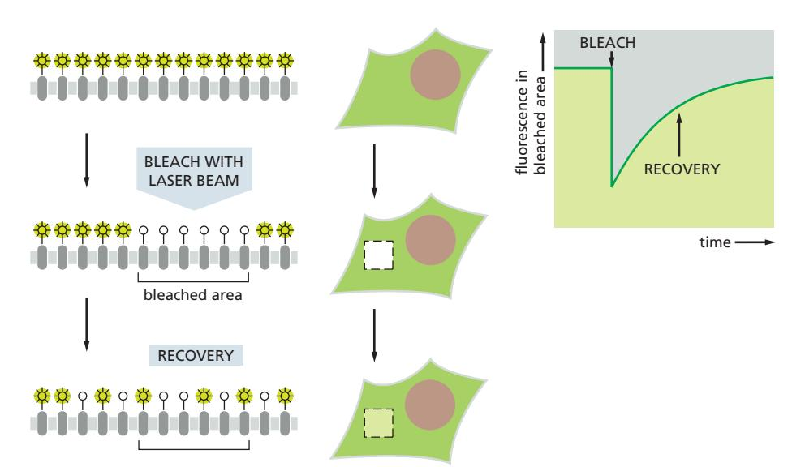

Figure 10–32 An experiment demonstrating the diffusion of proteins in the plasma membrane of mouse– human hybrid cells. In this experiment, a mouse and a human cell were fused to create a hybrid cell, which was then stained with two fluorescently labeled antibodies. One antibody (labeled with a *green* dye) detects mouse plasma membrane proteins, the other antibody (labeled with a *red* dye) detects human plasma membrane proteins. When cells are stained immediately after fusion, mouse and human plasma membrane proteins are still found in the membrane domains originating from the mouse and human cell, respectively. After a short time, however, the plasma membrane proteins diffuse over the entire cell surface and completely intermix. (From L.D. Frye and M. Edidin, *J. Cell Sci.* 7:319–335, 1970. With permission from the Company of Biologists.)

Figure 10–33 Measuring the rate of lateral diffusion of a membrane protein by fluorescence recovery after photobleaching. A specific protein of interest can be expressed as a fusion protein with green fluorescent protein (GFP), which is intrinsically fluorescent. The fluorescent molecules are bleached in a small area using a laser beam. The fluorescence intensity recovers as the bleached molecules diffuse away and unbleached molecules diffuse into the irradiated area (shown here in side and top views). The diffusion coefficient is calculated from a graph of the rate of recovery: the greater the diffusion coefficient of the membrane protein, the faster the recovery (see Figure 9–20 and Movie 10.6).

One drawback to the FRAP technique is that it monitors the movement of large populations of molecules in a relatively large area of membrane; one cannot follow individual protein molecules. If a protein fails to migrate into a bleached area, for example, one cannot tell whether the molecule is truly immobile or just restricted in its movement to a very small region of membrane—perhaps by cytoskeletal proteins. *Single-particle tracking* techniques overcome this problem by labeling individual membrane molecules with antibodies coupled to fluorescent dyes or tiny gold particles and tracking their movement by video microscopy. Using single-particle tracking, one can record the diffusion path of a single membrane protein molecule over time. Results from all of these techniques indicate that plasma membrane proteins differ widely in their diffusion characteristics, as we now discuss.

## Cells Can Confine Proteins and Lipids to Specific Domains Within a Membrane

The recognition that biological membranes are two-dimensional fluids was a major advance in understanding membrane structure and function. It has become clear, however, that the picture of a membrane as a lipid sea in which all proteins float freely is greatly oversimplified. Most cells confine membrane proteins to specific regions in a continuous lipid bilayer. We have already discussed how bacteriorhodopsin molecules in the purple membrane of *Halobacterium* assemble into large two-dimensional crystals, in which individual protein molecules are relatively fixed in relationship to one another (see Figure 10–30). ATP synthase complexes in the inner mitochondrial membrane associate into long double rows, as we discuss in Chapter 14 (see Figure 14–33). Large aggregates of this kind diffuse very slowly.

In epithelial cells, such as those that line the gut or the tubules of the kidney, certain plasma membrane enzymes and transport proteins are confined to the apical surface of the cells, whereas others are confined to the basal and lateral surfaces (**Figure 10–34**). This asymmetric distribution of membrane proteins is often essential for the function of the epithelium, as we discuss in Chapter 11 (see Figure 11–11). The lipid compositions of these two membrane domains are also different, demonstrating that epithelial cells can prevent the diffusion of lipid as well as protein molecules between the domains. The barriers set up by a specific type of intercellular junction (called a *tight junction*, discussed in Chapter 19; see Figure 19–18) maintain the separation of both protein and lipid molecules.

A cell can also create membrane domains without using intercellular junctions. As we already discussed, regulated protein–protein interactions in membranes can create nanometer-scale raft domains that are thought to function in signaling and membrane trafficking. A more extreme example is seen in the mammalian spermatozoon, a single cell that consists of several structurally and functionally distinct parts covered by a continuous plasma membrane. When a sperm cell is examined

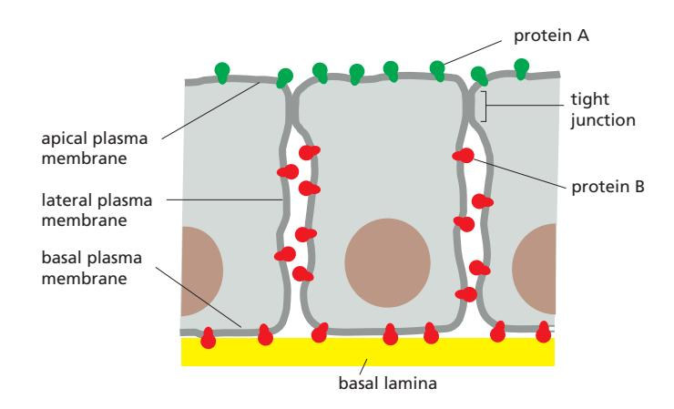

Figure 10–34 How membrane molecules can be restricted to a particular membrane domain. In this drawing of an epithelial cell, protein A (in the apical domain of the plasma membrane) and protein B (in the basal and lateral domains) can diffuse laterally in their own domains but are prevented from entering the other domain, at least partly by the specialized cell–cell junction called a tight junction. Lipid molecules in the outer (extracellular) monolayer of the plasma membrane are likewise unable to diffuse between the two domains; lipids in the inner (cytosolic) monolayer, however, are able to do so (not shown). The basal lamina is a thin mat of extracellular matrix that separates epithelial sheets from other tissues (discussed in Chapter 19).

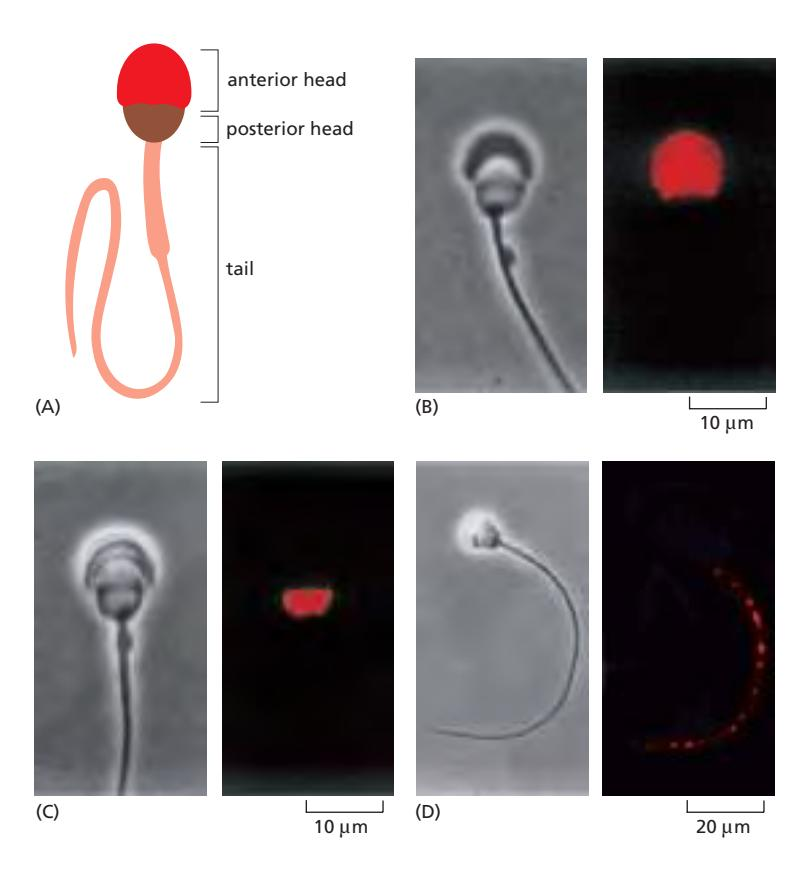

Figure 10–35 Three domains in the plasma membrane of a guinea pig sperm. (A) A drawing of a guinea pig sperm. (B–D) In the three pairs of micrographs, phase-contrast micrographs are on the *left*, and the same cell is shown with cell-surface immunofluorescence staining on the *right*. Different monoclonal antibodies selectively label cell-surface molecules on (B) the anterior head, (C) the posterior head, and (D) the tail. (From D.G. Myles, P. Primakoff, and A.R. Belvé, *Cell* 23:433–439, 1981. With permission from Elsevier.)

by immunofluorescence microscopy with a variety of antibodies, each of which reacts with a specific cell-surface molecule, the plasma membrane is found to consist of at least three distinct domains (**Figure 10–35**). Some of the membrane molecules can diffuse freely within the confines of their own domain. While the molecular nature of most "fences" that prevent the molecules from leaving their domain is not known, some molecular mechanisms for restricting membrane protein movements are understood. The plasma membrane of nerve cells, for example, contains a domain enclosing the cell body and dendrites, and another enclosing the axon; in this case a belt of actin filaments tightly associates with the plasma membrane at the cell-body–axon junction and forms part of the barrier. MBoC7 m10.35/10.35

**Figure 10–36** shows four common ways of immobilizing specific membrane proteins through protein–protein interactions.

# The Cortical Cytoskeleton Gives Membranes Mechanical Strength and Restricts Membrane Protein Diffusion

As shown in Figure 10–36B and C, a common way in which a cell restricts the lateral mobility of specific membrane proteins is to tether them to macromolecular assemblies on either side of the membrane. The characteristic biconcave shape of a red blood cell (**Figure 10–37**), for example, results from interactions of its plasma membrane proteins with an underlying *cytoskeleton*, which consists mainly of a meshwork of the filamentous protein **spectrin**. Spectrin is a long, thin, flexible rod about 100 nm in length. As the principal component of the red blood cell cytoskeleton, it maintains the structural integrity and shape of the plasma membrane, which is the cell's only membrane, as the cell has no nucleus or other organelles. The spectrin cytoskeleton is attached to the membrane through various membrane proteins. The final result is a deformable, netlike meshwork that covers the entire cytosolic surface of the cell membrane (**Figure 10–38**). This spectrin-based cytoskeleton enables the red blood cell to withstand the stress on its membrane as it is forced through narrow capillaries. Mice and humans with genetic abnormalities in spectrin are anemic and have red blood cells that are

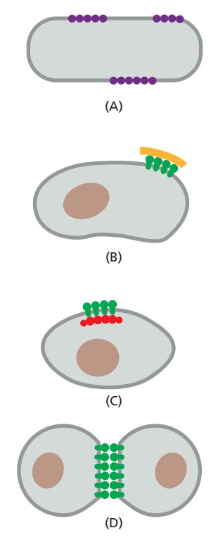

Figure 10–36 Four ways of restricting the lateral mobility of specific plasma membrane proteins. (A) The proteins can self-assemble into large aggregates (as seen for bacteriorhodopsin in the purple membrane of *Halobacterium salinarum*); they can be tethered by interactions with assemblies of macromolecules (B) outside or (C) inside the cell; or (D) they can interact with proteins on the surface of another cell. MBoC7 m10.36/10.36

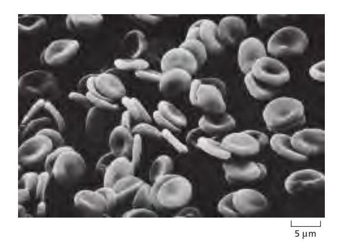

Figure 10–37 A scanning electron micrograph of human red blood cells. The cells have a biconcave shape and lack a nucleus and other organelles (Movie 10.7). (Courtesy of Bernadette Chailley.)

spherical (instead of concave) and fragile; the severity of the anemia increases with the degree of spectrin deficiency.

An analogous but much more elaborate and highly dynamic cytoskeletal network exists beneath the plasma membrane of most other cells in our body. This network, which constitutes the **cortex** of the cell, is rich in actin filaments, which are attached to the plasma membrane in numerous ways. The dynamic

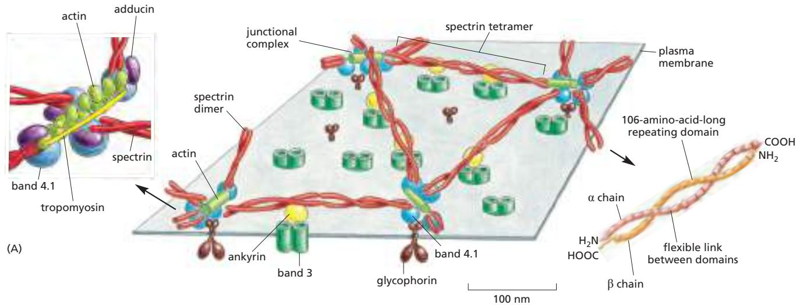

Figure 10–38 The spectrin-based cytoskeleton on the cytosolic side of the human red blood cell plasma membrane. (A) The arrangement shown in the drawing has been deduced mainly from studies on the interactions of purified proteins *in vitro.* Spectrin heterodimers (enlarged in the drawing on the *right*) are linked together into a netlike meshwork by *junctional complexes* (enlarged in the drawing on the *left*). Each spectrin heterodimer consists of two antiparallel, loosely intertwined, flexible polypeptide chains called α and β. The two spectrin chains are attached noncovalently to each other at multiple points, including at both ends. Both the α and β chains are composed largely of repeating domains. Two spectrin heterodimers join end-to-end to form tetramers.

The junctional complexes are composed of short actin filaments (containing 13 actin monomers) and the proteins *band 4.1* and *adducin*, as well as a *tropomyosin* molecule that probably determines the length of the actin filaments. The cytoskeleton is linked to the membrane through two transmembrane proteins: a multipass protein called band 3 and a single-pass protein called glycophorin. The spectrin tetramers bind to some band 3 proteins via *ankyrin* molecules, and to glycophorin and band 3 (not shown) via band 4.1 proteins.

(B) The electron micrograph shows the cytoskeleton on the cytosolic side of a red blood cell membrane after fixation and negative staining. The spectrin meshwork has been purposely stretched out to allow the details of its structure to be seen. In a normal cell, the meshwork shown would be much more crowded and occupy only about one-tenth of this area. (B, courtesy of T. Byers and D. Branton, *Proc. Natl. Acad. Sci. USA* 82:6153–6157, 1985.)

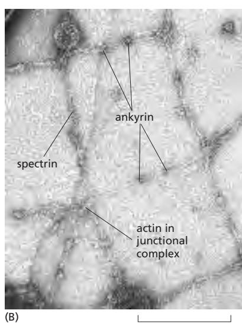

200 nm

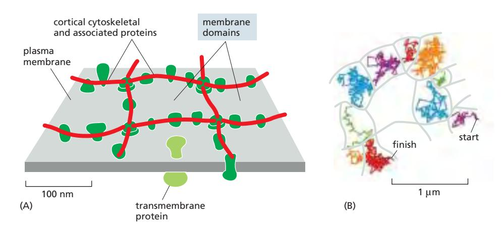

Figure 10–39 Corralling plasma membrane proteins by cortical cytoskeletal filaments. (A) The filaments are thought to provide diffusion barriers that divide the membrane into small domains, or corrals. (B) High-speed, single-particle tracking was used to follow the path of a single fluorescently labeled membrane protein of one type over time. The trace shows that an individual protein molecule diffuses within tightly delimited membrane domains and only infrequently escapes into a neighboring domain (highlighted by a switch of color). (Adapted from A. Kusumi et al., *Annu. Rev. Biophys. Biomol. Struct*. 34:351–378, 2005. With permission from Annual Reviews.)

MBoC7 m10.39/10.39 remodeling of the cortical actin network provides a driving force for many essential cell functions, including cell movement, endocytosis, and the formation of transient, mobile plasma membrane structures such as filopodia and lamellipodia discussed in Chapter 16. The cortex of nucleated cells also contains proteins that are structurally homologous to spectrin and the other components of the red cell cytoskeleton. We discuss the cortical cytoskeleton in nucleated cells and its interactions with the plasma membrane in Chapter 16.

The cortical cytoskeletal network restricts diffusion of plasma membrane proteins beyond those that are directly anchored to it. Because the cytoskeletal filaments are often closely apposed to the cytosolic surface of the plasma membrane, they can form mechanical barriers that obstruct the free diffusion of proteins in the membrane. These barriers partition the membrane into small domains, or *corrals* (**Figure 10–39A**), which can be either permanent, as in the sperm (see Figure 10–35), or transient. The barriers can be detected when the diffusion of individual membrane proteins is followed by high-speed, single-particle tracking. The proteins diffuse rapidly but are confined within an individual corral (**Figure 10–39B**); occasionally, however, thermal motions cause a few cortical filaments to detach transiently from the membrane, allowing the protein to escape into an adjacent corral.

The extent to which a transmembrane protein is confined within a corral depends on its association with other proteins and the size of its cytoplasmic domain; proteins with a large cytosolic domain will have a harder time passing through cytoskeletal barriers. When a cell-surface receptor binds its extracellular signal molecules, for example, large protein complexes build up on the cytosolic domain of the receptor, making it more difficult for the receptor to escape from its corral. It is thought that corralling helps concentrate such signaling complexes, increasing the speed and efficiency of the signaling process (discussed in Chapter 15).

#### Membrane-bending Proteins Deform Bilayers

Cell membranes assume many different shapes, as illustrated by the elaborate and varied structures of cell-surface protrusions and membrane-enclosed organelles in eukaryotic cells. Flat sheets, narrow tubules, round vesicles, fenestrated sheets, and pita-bread–shaped cisternae are all part of the repertoire. Often, a variety of shapes will be present in different regions of the same continuous bilayer. Membrane shape is controlled dynamically, as many essential cell processes—including vesicle budding, cell movement, and cell division—require elaborate transient membrane deformations. In many cases, membrane shape is influenced by dynamic pushing and pulling forces exerted by cytoskeletal or extracellular structures, as we discuss in Chapters 13 and 16. A crucial part in producing these deformations is played by **membrane-bending proteins**, which control local membrane curvature. Often, cytoskeletal dynamics and membranebending-protein forces work together. Membrane-bending proteins attach to

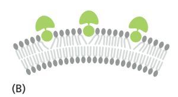

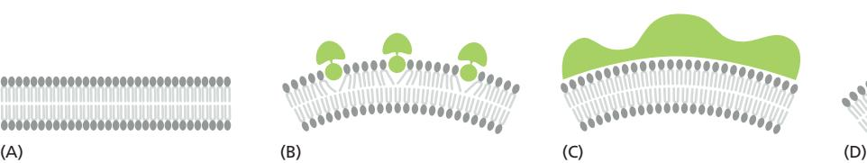

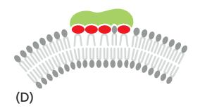

specific membrane regions as needed and act by one or more of three principal mechanisms (**Figure 10–40**):

- 1. Some insert hydrophobic protein domains or attached lipid anchors into one of the leaflets of a lipid bilayer. Increasing the area of only one leaflet causes the membrane to bend (Figure 10–40B). The proteins that shape the convoluted network of narrow endoplasmic reticulum tubules work in this way (discussed in Chapter 12).
- 2. Some membrane-bending proteins form rigid scaffolds that deform the membrane or stabilize an already bent membrane (Figure 10–40C). The coat proteins that shape the budding vesicles in intracellular transport fall into this class (discussed in Chapter 13). MB0C7 m10.40/10.40
- 3. Asymmetric distribution of cone-shaped and inverted cone-shaped lipids in the inner or outer leaflets can cause membrane bending. Some membrane-bending proteins cause particular membrane lipids to cluster together, thereby inducing membrane curvature. The ability of a lipid to induce positive or negative membrane curvature is determined by the relative cross-sectional areas of its head group and its hydrocarbon tails. For example, the large head group of phosphoinositides make these lipid molecules wedge-shaped, and their accumulation in a domain of one leaflet of a bilayer therefore induces positive curvature (Figure 10–40D). By contrast, phospholipases that remove lipid head groups produce inversely shaped lipid molecules that induce negative curvature.

Often, different membrane-bending proteins collaborate to achieve a particular curvature, as in shaping a budding transport vesicle, as we discuss in Chapter 13.

#### Summary

*Whereas the lipid bilayer determines the basic structure of biological membranes, proteins are responsible for most membrane functions, serving as specific receptors, enzymes, transporters, and so on. Transmembrane proteins extend across the lipid bilayer. Some of these membrane proteins are single-pass proteins, in which the polypeptide chain crosses the bilayer as a single a helix. Others are multipass proteins, in which the polypeptide chain crosses the bilayer multiple times—either as a series of a helices or as a b sheet rolled up into the shape of a barrel. All proteins responsible for the transport of ions and other small water-soluble molecules through the membrane are multipass proteins. Some membrane proteins do not span the bilayer but instead are attached to either side of the membrane: some are attached to the cytosolic side by an amphipathic a helix on the protein surface or by the covalent attachment of one or more lipid chains, others are attached to the noncytosolic side by a GPI anchor. Some membrane-associated proteins are bound by noncovalent interactions with transmembrane proteins. In the plasma membrane of all eukaryotic cells, most of the proteins exposed on the cell surface and some of the lipid molecules in the outer lipid monolayer have oligosaccharide chains covalently attached to them. Like the lipid molecules in the bilayer, many membrane proteins are able to diffuse rapidly in the plane of the membrane. However, cells have ways of immobilizing specific membrane proteins, as well as ways of confining both membrane protein and lipid molecules to particular domains in a continuous lipid bilayer. The dynamic association of membrane-bending proteins confers on membranes their characteristic three-dimensional shapes.* 

Figure 10–40 Three ways in which membrane-bending proteins shape membranes. Lipid bilayers are *gray* and proteins are *green*. (A) Bilayer without protein bound. (B) A hydrophobic region of the protein can insert as a wedge into one monolayer to pry lipid head groups apart. Such regions can either be amphiphilic helices as shown or hydrophobic hairpins. (C) The curved surface of the protein can bind to lipid head groups and deform the membrane or stabilize its curvature. (D) A protein can bind to and cluster lipids that have large head groups and thereby bend the membrane. (Adapted from W.A. Prinz and J.E. Hinshaw, *Crit. Rev. Biochem. Mol. Biol.* 44:278–291, 2009.)

# PROBLEMS

#### Which statements are true? Explain why or why not.

- 10–1 It is estimated that about 30% of the proteins encoded in an animal's genome are membrane proteins that are required for a cell to function and interact with its environment.
- 10–2 All of the common phospholipids—phosphatidylcholine, phosphatidylethanolamine, phosphatidylserine, and sphingomyelin—carry a positively charged moiety on their head group, but none carry a net positive charge.
- 10–3 Although phospholipid molecules are free to diffuse in the plane of the bilayer, they cannot flip-flop across the bilayer unless enzyme catalysts called phospholipid translocators are present in the membrane.
- 10–4 Whereas all the carbohydrate in the plasma membrane faces outward on the external surface of the cell, all the carbohydrate on internal membranes faces toward the cytosol.
- 10–5 Although membrane domains with different protein compositions are well known, there are at present no examples of membrane domains that differ in lipid composition.

#### Discuss the following problems.

10–6 When a lipid bilayer is torn, why does it not seal itself by forming a "hemi-micelle" cap at the edges, as shown in **Figure Q10–1**?

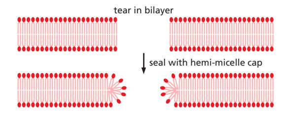

Figure Q10–1 A torn lipid bilayer sealed with a hypothetical "hemimicelle" cap (Problem 10–6).

- 10–7 Which one of the following changes is energetically favorable and occurs spontaneously in an aqueous solution?
- A. Conversion of a membrane vesicle to a flat bilayer
- B. Dispersion of one oil droplet into many small ones
- C. Formation of a bilayer from phospholipid molecules MBoC7 Q10.01
- D. Formation of a long tear in a phospholipid bilayer
- 10–8 Hydrophobic solutes are said to "force the adjacent water molecules to reorganize into icelike cages" (**Figure Q10–2**). It seems paradoxical that water molecules do not interact with hydrophobic solutes, yet they seem to "know" about the presence of a hydrophobic solute and change their behavior to interact differently with one

another. Why would such an icelike cage be energetically unfavorable relative to pure water?

- A. An icelike cage gives water a higher temperature.
- B. An icelike cage is less organized than pure water.
- C. An icelike cage is unstable and easily breaks down.
- D. An icelike cage reduces the entropy of the system.

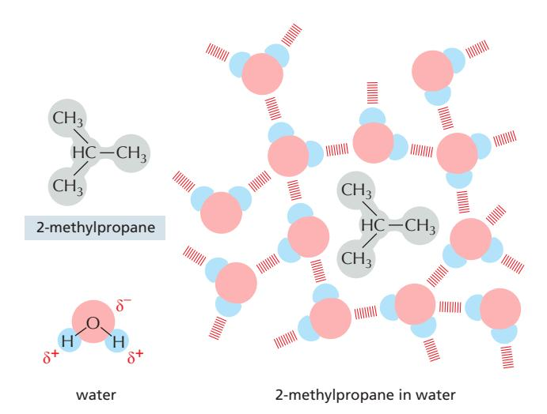

Figure Q10–2 An icelike cage of water molecules around a hydrophobic solute (Problem 10–8).

- 10–9 Margarine is made from vegetable oil by a chemical process. Do you suppose this process converts saturated fatty acids to unsaturated ones or vice versa? Explain your answer.
- 10–10 If a lipid raft is typically 70 nm in diameter and each lipid molecule has a diameter of 0.5 nm, about how many lipid molecules would there be in a lipid raft composed entirely of lipid? MBoC7 Q10.02
- 10-11 Each of the following lipid anchors is used to attach intracellular proteins to membranes *except*:
- A. A farnesyl anchor
- B. A GPI anchor
- C. A myristoyl anchor
- D. A palmitoyl anchor
- 10–12 Monomeric single-pass transmembrane proteins span a membrane with a single α helix that has characteristic chemical properties in the region of the bilayer. Which of the three 19-amino-acid sequences listed below is the most likely candidate for such a transmembrane segment? Explain the reasons for your choice. (See back of book for one-letter amino acid code; FAMILY VW is a convenient mnemonic for hydrophobic amino acids.)
- A. I T E I Y F G R M A G V I G T D L I S
- B. I T L I Y F G V M A G V I G T I L I S
- C. I T P I Y F G P M A G V I G T P L I S

634 Chapter 10: Membrane Structure REFERENCES 635

10–13 You are studying the binding of proteins to the cytoplasmic face of cultured neuroblastoma cells and have found a method that gives a good yield of inside-out vesicles from the plasma membrane. Unfortunately, your preparations are contaminated with variable amounts of right-side-out vesicles. Nothing you have tried avoids this problem. A friend suggests that you pass your vesicles over an affinity column made of lectin coupled to solid beads. What is the point of your friend's suggestion?

10–14 Glycophorin, a protein in the plasma membrane of red blood cells, normally exists as a homodimer that is held together entirely by interactions between its transmembrane domains. As transmembrane domains are hydrophobic, how is it that they can associate with one another so specifically?

10–15 Three mechanisms by which membrane-binding proteins bend a membrane are illustrated in **Figure Q10–3A, B, and C**. As shown, each of these cytosolic membrane-bending proteins would induce an invagination of the plasma membrane. Could similar kinds of cytosolic proteins induce a protrusion of the plasma membrane (**Figure Q10–3D**)? Which ones? Explain how they might work.

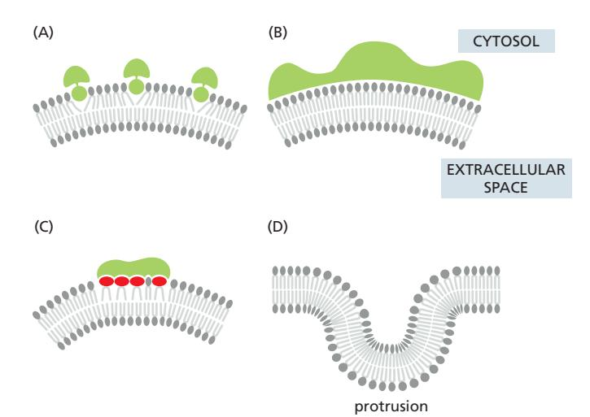

Figure Q10–3 Bending of the plasma membrane by cytosolic proteins (Problem 10–15). (A) Insertion of a protein "finger" into the cytosolic leaflet of the membrane. (B) Binding of lipids to the curved surface of a membrane-binding protein. (C) Binding of membrane proteins to membrane lipids with large head groups. (D) A segment of the plasma membrane showing a protrusion.

# REFERENCES

#### General

Bretscher MS (1973) Membrane structure: some general principles. *Science* 181, 622–629.

Edidin M (2003) Lipids on the frontier: a century of cell-membrane bilayers. *Nat. Rev. Mol. Cell Biol.* 4, 414–418.

Goñi FM (2014) The basic structure and dynamics of cell membranes: an update of the Singer-Nicolson model. *Biochim. Biophys. Acta* 1838, 1467–1476.

Langmuir I (1917) The constitution and fundamental properties of solids and liquids II: liquids. *J. Am. Chem. Soc.* 39, 1848–1906.

Pockets A (1891) Surface tension. *Nature* 43, 437–439.

Singer SJ & Nicolson GL (1972) The fluid mosaic model of the structure of cell membranes. *Science* 175, 720–731.

Tanford C (1980) The Hydrophobic Effect: Formation of Micelles and Biological Membranes. New York: Wiley.

Tanford C (2004) Ben Franklin Stilled the Waves. New York: Oxford University Press.

#### The Lipid Bilayer

Antonny B, Vanni S, Shindou H & Ferreira T (2016) From zero to six double bonds: phospholipid unsaturation and organelle function. *Trends Cell Biol*. 25, 427–436.

Brügger B (2014) Lipidomics: analysis of the lipid composition of cells and subcellular organelles by electrospray ionization mass spectrometry. *Annu. Rev. Biochem.* 83, 79–98.

Chung J, Wu X, Lambert TJ . . . Farese RV, Jr (2019) LDAF1 and seipin form a lipid droplet assembly complex. *Dev. Cell* 51, 551–563.

Clarke RJ, Hossain KR & Cao K (2020) Physiological roles of transverse lipid asymmetry of animal membranes. *Biochim. Biophys. Acta Biomembr.* 1862, 183382.

Cornell CE, Mileant A, Thakkar N . . . Keller SL (2020) Direct imaging of liquid domains in membranes by cryo-electron tomography. *Proc. Natl. Acad. Sci. USA* 117, 19713–19719.

Hakomori SI (2002) The glycosynapse. *Proc. Natl. Acad. Sci. USA* 99, 225–232.

Harayama T & Riezman H (2018) Understanding the diversity of membrane lipid composition. *Nat. Rev. Mol. Cell Biol.* 19, 281–296.

Heberle FA, Doktorova M, Scott HL . . . Levental I (2020) Direct label-free imaging of nanodomains in biomimetic and biological membranes by cryogenic electron microscopy. *Proc. Natl. Acad. Sci. US*A 117, 19943–19952.

Ichikawa S & Hirabayashi Y (1998) Glucosylceramide synthase and glycosphingolipid synthesis. *Trends Cell Biol.* 8, 198–202.

Kornberg RD & McConnell HM (1971) Lateral diffusion of phospholipids in a vesicle membrane. *Proc. Natl. Acad. Sci. USA* 68, 2564–2568.

Lingwood D & Simons K (2010) Lipid rafts as a membrane-organizing principle. *Science* 327, 46–50.

Mansilla MC, Cybulski LE, Albanesi D & de Mendoza D (2004) Control of membrane lipid fluidity by molecular thermosensors. *J. Bacteriol.* 186, 6681–6688.

Maxfield FR & van Meer G (2010) Cholesterol, the central lipid of mammalian cells. *Curr. Opin. Cell Biol.* 22, 422–429.

Munro S (2003) Lipid rafts: elusive or illusive? *Cell* 115, 377–388. Pomorski TG & Menon AK (2016) Lipid somersaults: uncovering the mechanisms of protein-mediated lipid flipping. *Prog. Lipid Res.* 64, 69–84.

Rothman JE & Lenard J (1977) Membrane asymmetry. *Science* 195, 743–753.

Walther TC & Farese RV, Jr (2017) Lipid droplet biogenesis. *Annu. Rev. Cell Dev. Biol*. 33, 491–510.

#### Membrane Proteins

Agasid MT & Robinson CV (2021) Probing membrane protein-lipid interactions. *Curr. Opin. Struct. Biol.* 69, 78–85.

- Bennett V & Baines AJ (2001) Spectrin and ankyrin-based pathways: metazoan inventions for integrating cells into tissues. *Physiol. Rev.* 81, 1353–1392.
- Bijlmakers MJ & Marsh M (2003) The on-off story of protein palmitoylation. *Trends Cell Biol.* 13, 32–42.
- Bretscher MS & Raff MC (1975) Mammalian plasma membranes. *Nature* 258, 43–49.
- Buchanan SK (1999) Beta-barrel proteins from bacterial outer membranes: structure, function and refolding. *Curr. Opin. Struct. Biol.* 9, 455–461.
- Chen Y, Lagerholm BC, Yang B & Jacobson K (2006) Methods to measure the lateral diffusion of membrane lipids and proteins. *Methods* 39, 147–153.
- Corin K & Bowie JU (2020) How bilayer properties influence membrane protein folding. *Protein Sci.* 29(12), 2348–2362.
- Curran AR & Engelman DM (2003) Sequence motifs, polar interactions and conformational changes in helical membrane proteins. *Curr. Opin. Struct. Biol.* 13, 412–417.
- Deisenhofer J & Michel H (1991) Structures of bacterial photosynthetic reaction centers. *Annu. Rev. Cell Biol.* 7, 1–23.
- Drickamer K & Taylor ME (1998) Evolving views of protein glycosylation. *Trends Biochem. Sci.* 23, 321–324.
- Giménez-Andrés M, Copi ˇc A & Antonny B (2018) The many faces of ˇ amphipathic helices. *Biomolecules* 8, 45.
- Helenius A & Simons K (1975) Solubilization of membranes by detergents. *Biochim. Biophys. Acta* 415, 29–79.
- Henderson R & Unwin PN (1975) Three-dimensional model of purple membrane obtained by electron microscopy. *Nature* 257, 28–32.
- Hite RK, Gonen T, Harrison SC & Walz T (2008) Interactions of lipids with aquaporin-0 and other membrane proteins. *Pflugers Arch.* 456, 651–661.
- Kyte J & Doolittle RF (1982) A simple method for displaying the hydropathic character of a protein. *J. Mol. Biol.* 157, 105–132.
- Lee AG (2003) Lipid-protein interactions in biological membranes: a structural perspective. *Biochim. Biophys. Acta* 1612, 1–40.
- Marchesi VT, Furthmayr H & Tomita M (1976) The red cell membrane. *Annu. Rev. Biochem.* 45, 667–698.

- Nakada C, Ritchie K, Oba Y . . . Kusumi A (2003) Accumulation of anchored proteins forms membrane diffusion barriers during neuronal polarization. *Nat. Cell Biol.* 5, 626–632.
- Oesterhelt D (1998) The structure and mechanism of the family of retinal proteins from halophilic archaea. *Curr. Opin. Struct. Biol.* 8, 489–500.
- Popot J-L (2010) Amphipols, nanodiscs, and fluorinated surfactants: three nonconventional approaches to studying membrane proteins in aqueous solution. *Annu. Rev. Biochem.* 79, 737–775.
- Prinz WA & Hinshaw JE (2009) Membrane-bending proteins. *Crit. Rev. Biochem. Mol. Biol.* 44, 278–291.
- Sezgin E, Levental I, Mayor S & Eggeling C (2017) The mystery of membrane organization: composition, regulation and roles of lipid rafts. *Nat. Rev. Mol. Cell Biol.* 18, 361–374.
- Sharon N & Lis H (2004) History of lectins: from hemagglutinins to biological recognition molecules. *Glycobiology* 14, 53R–62R.
- Sheetz MP (2001) Cell control by membrane-cytoskeleton adhesion. *Nat. Rev. Mol. Cell Biol.* 2, 392–396.
- Shibata Y, Hu J, Kozlov MM & Rapoport TA (2009) Mechanisms shaping the membranes of cellular organelles. *Annu. Rev. Cell Dev. Biol.* 25, 329–354.
- Steck TL (1974) The organization of proteins in the human red blood cell membrane. A review. *J. Cell Biol.* 62, 1–19.
- Subramaniam S (1999) The structure of bacteriorhodopsin: an emerging consensus. *Curr. Opin. Struct. Biol.* 9, 462–468.
- Vinothkumar KR & Henderson R (2010) Structures of membrane proteins. *Q. Rev. Biophys.* 43, 65–158.
- von Heijne G (2011) Membrane proteins: from bench to bits. *Biochem. Soc. Trans*. 39, 747–750.
- White SH & Wimley WC (1999) Membrane protein folding and stability: physical principles. *Annu. Rev. Biophys. Biomol. Struct.* 28, 319–365.
- Zhang Y, Daday C, Gu RX . . . Walz T (2021) Visualization of the mechanosensitive ion channel MscS under membrane tension. *Nature* 590, 509–514.