# Intracellular Organization and Protein Sorting

CHAPTER

12

The many thousands of macromolecules and their associated biochemical activities inside a cell are spatially segregated to different regions. Intracellular organization is a particularly prominent feature of eukaryotic cells, which unlike bacteria are elaborately subdivided into functionally distinct, membrane-enclosed compartments. Many of these compartments define the cell's major **organelles** such as the endoplasmic reticulum, Golgi apparatus, lysosome, plastid, and mitochondrion, the last two of which are still further subcompartmentalized by internal membranes. Other subsets of the cell's macromolecules can organize into dynamic and reversible assemblies, called **biomolecular condensates**, that can serve as specialized biochemical factories or temporary storage depots. To understand the eukaryotic cell, it is essential to know how the cell creates and maintains its complex intracellular organization.

An animal cell contains about 10 billion (1010) protein molecules of perhaps 10,000 kinds, and the synthesis of almost all of them begins in the **cytosol**, the space of the cytoplasm outside the membrane-enclosed organelles. Each newly synthesized protein is then delivered specifically to the organelle that requires it. The unique protein and lipid composition on the surface of each organelle is used as a cue to direct new deliveries of proteins and lipids to sustain that organelle's identity. The characteristic set of proteins and other specialized molecules define each organelle's structural and functional properties. They catalyze the reactions that occur there and selectively transport molecules into and out of the organelle. The intracellular transport of proteins is the central theme of both this chapter and the next. By tracing the protein traffic from one part of the cell to another, one can begin to make sense of the otherwise bewildering maze of intracellular membranes and other subcellular structures.

# THE COMPARTMENTALIZATION OF CELLS

In this brief overview of the compartments of the cell and the relationships between them, we organize the cell's organelles conceptually into a small number of discrete families, discuss how proteins are directed to specific organelles, and explain how proteins cross organelle membranes.

#### All Eukaryotic Cells Have the Same Basic Set of Membrane-enclosed Organelles

Many vital biochemical processes take place in membranes or on their surfaces. Membrane-bound enzymes, for example, catalyze lipid metabolism, and oxidative phosphorylation and photosynthesis both require a membrane to couple the transport of H+ to the synthesis of ATP. In addition to providing increased membrane area to host biochemical reactions, intracellular membrane systems form enclosed compartments that are separate from the cytosolic compartment, thus creating functionally specialized aqueous spaces within the cell. In these spaces, subsets of molecules (proteins, reactants, ions) are concentrated to optimize the biochemical reactions in which they participate. By having multiple types of compartments inside the same cell, biochemical reactions that require very different conditions, or would compete with each other, can nevertheless occur simultaneously. Because the lipid bilayer of cell membranes is impermeable to most

#### IN THIS CHAPTER

The Compartmentalization of Cells

The Endoplasmic Reticulum

Peroxisomes

The Transport of Proteins into Mitochondria and Chloroplasts

The Transport of Molecules Between the Nucleus and the Cytosol

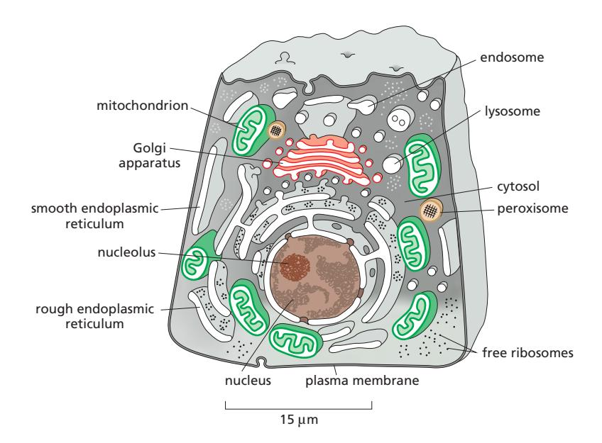

Figure 12–1 The major intracellular compartments of an animal cell.

The cytosol *(gray)*, rough endoplasmic reticulum, smooth endoplasmic reticulum, Golgi apparatus, nucleus, mitochondrion, endosome, lysosome, and peroxisome are distinct compartments isolated from the rest of the cell by at least one selectively permeable membrane (see Movie 9.2). By contrast, the nucleolus is not enclosed by a membrane and represents one example of a biomolecular condensate.

hydrophilic molecules, the membrane of an organelle must contain membrane transport proteins to import and export specific metabolites. Each organellar membrane must also have a mechanism for importing, and incorporating into the organelle, the specific proteins that make the organelle unique.

**Figure 12–1** illustrates the major intracellular compartments common to eukaryotic cells. The *nucleus* contains the genome (aside from mitochondrial and chloroplast DNA), and it is the principal site of DNA and RNA synthesis. The surrounding **cytoplasm** consists of the cytosol and the cytoplasmic organelles suspended in it. The cytosol constitutes a little more than half the total volume of the cell, and it is the main site of protein synthesis and degradation. It also performs most of the cell's intermediary metabolism; that is, the many reactions that degrade some small molecules and synthesize others to provide the building blocks for macromolecules (discussed in Chapter 2). MBoC7 m12.01/12.01

About half the total area of membrane in a eukaryotic cell encloses the labyrinthine spaces of the *endoplasmic reticulum* (*ER*). Most soluble and integral membrane proteins destined for the cell exterior or for other organelles are initially assembled at the ER. These proteins are transported into the ER as they are synthesized by ribosomes. The distinctive appearance in electron micrographs of ribosomes studding the surface of these regions of the ER is the reason they are termed the *rough ER*. The ER also produces most of the lipid and sterols for the rest of the cell and functions as a store for Ca2+ ions. These regions of the ER typically lack bound ribosomes and are called *smooth ER*.

The ER sends many of its proteins and lipids to the *Golgi apparatus*, which often consists of organized stacks of disc-like compartments called *Golgi cisternae*. The Golgi apparatus receives lipids and proteins from the ER and dispatches them to various destinations, usually covalently modifying them *en route*. *Lysosomes* contain digestive enzymes that degrade defunct intracellular organelles, as well as macromolecules and particles taken in from outside the cell by endocytosis. On the way to lysosomes, endocytosed material must first pass through a series of organelles called *endosomes*. As we will see, the ER, Golgi apparatus, lysosomes, endosomes, and plasma membrane are linked by the cell's major pathways of membrane traffic.

*Mitochondria* and *chloroplasts* generate most of the ATP that cells use to drive reactions requiring an input of free energy; chloroplasts are a specialized version of *plastids* (present in plants, algae, and some protozoa), which can also have other functions, such as the storage of food or pigment molecules. Finally, *peroxisomes* are small vesicular compartments that contain enzymes used in various oxidative reactions.

On average, the membrane-enclosed compartments together occupy nearly half the volume of a cell (**Table 12–1**), and a large amount of intracellular

TABLE 12–1 Relative Volumes Occupied by the Major Intracellular Compartments in a Liver Cell (Hepatocyte)

| Intracellular<br>compartment | Percentage<br>of total cell<br>volume |
|------------------------------|---------------------------------------|
| Cytosol                      | 54                                    |
| Mitochondria                 | 22                                    |
| Rough ER<br>cisternae        | 9                                     |
| Smooth ER<br>cisternae       | 5                                     |
| Golgi cisternae              | 1                                     |
| Nucleus                      | 6                                     |
| Peroxisomes                  | 1                                     |
| Lysosomes                    | 1                                     |
| Endosomes                    | 1                                     |

| TABLE 12–2 Relative Amounts of Membrane Types in Two Kinds<br>of Eukaryotic Cells |                                   |                           |
|-----------------------------------------------------------------------------------|-----------------------------------|---------------------------|
|                                                                                   | Percentage of total cell membrane |                           |
| Membrane type                                                                     | Liver hepatocyte*                 | Pancreatic exocrine cell* |
| Plasma membrane                                                                   | 2                                 | 5                         |
| Rough ER membrane                                                                 | 35                                | 60                        |
| Smooth ER membrane                                                                | 16                                | <1                        |
| Golgi apparatus membrane                                                          | 7                                 | 10                        |
| Mitochondria<br>Outer membrane<br>Inner membrane                                  | 7<br>32                           | 4<br>17                   |
| Nucleus<br>Inner membrane**                                                       | 0.2                               | 0.7                       |
| Secretory vesicle membrane                                                        | Not determined                    | 3                         |
| Lysosome membrane                                                                 | 0.4                               | Not determined            |
| Peroxisome membrane                                                               | 0.4                               | Not determined            |
| Endosome membrane                                                                 | 0.4                               | Not determined            |

<sup>\*</sup>These two cells are of very different sizes: the average hepatocyte has a volume of about 5000 μm3 compared with 1000 μm3 for the pancreatic exocrine cell. Total cell membrane areas are estimated at about 110,000 μm2 and 13,000 μm2, respectively.

membrane is required to make them. In liver and pancreatic cells, for example, the endoplasmic reticulum has a total membrane surface area that is, respectively, 25 times and 12 times that of the plasma membrane (**Table 12–2**). The membraneenclosed organelles are packed tightly in the cytoplasm, and, in terms of area and mass, the plasma membrane is only a minor membrane in most eukaryotic cells (**Figure 12–2**).

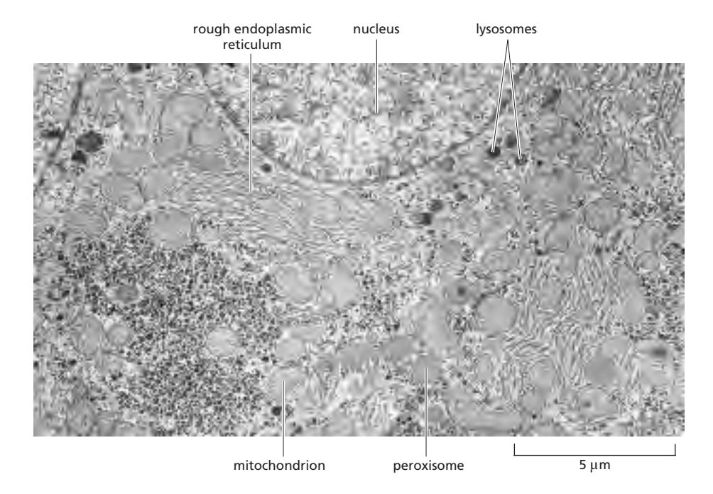

Figure 12–2 An electron micrograph of part of a liver cell seen in cross section. Examples of most of the major intracellular organelles are indicated. (Reused by permission of E.L. Bearer and Daniel S. Friend.)

<sup>\*\*</sup>The outer nuclear membrane is included in the measurement of the rough ER and is roughly equal to the inner membrane.

In general, each membrane -enclosed organelle performs the same set of basic functions in all cell types. But to serve the specialized functions of cells, these organelles vary in abundance and can have additional properties that differ from cell type to cell type. This is particularly apparent in cells that are highly special ized and therefore disproportionately rely on specific organelles. Plasma cells, for example, which daily secrete their own weight in antibody molecules into the bloodstream, contain vastly amplified amounts of rough ER, which is found in large, flat sheets. Cardiac muscle cells instead expand and specialize their smooth ER for Ca 2 <sup>+</sup> storage and proliferate their mitochondria for energy production. Moreover, membrane -enclosed organelles are often found in characteristic posi tions in the cytoplasm. In most cells, for example, the Golgi apparatus is located close to the nucleus, whereas the network of ER tubules extends from the nucleus throughout the entire cytosol. These characteristic distributions depend on inter actions of the organelles with the cytoskeleton (discussed in Chapter 16).

### Evolutionary Origins Explain the Topological Relationships of Organelles

To understand the relationships between the compartments of the cell, it is helpful to consider how they might have originated. The precursors of the first eukaryotic cells are thought to have been relatively simple cells that—like most bacterial and archaeal cells—had a plasma membrane but no internal mem branes. The plasma membrane in such cells provided all membrane -dependent functions, including the pumping of ions, ATP synthesis, protein secretion, and lipid synthesis. These ancestral precursors, like their modern -day prokary otic counterparts,probably had a 1000 - to 10,000 -fold smaller volume than present -day eukaryotic cells. To increase in volume, the ancestral cells would have needed to maintain their surface area to volume ratio to sustain the many vital functions that membranes perform.

On the basis of the appearance of modern -day archaeal cells (see Figure 1–26), the membrane surface area might have initially increased by plasma mem brane protrusions. The increased capacity to exchange metabolites with the surrounding environment via these protrusions would have facilitated symbi otic relationships with other organisms. Increased resource availability due to a combination of symbioses and membrane expansion may have allowed the evolution of progressively larger cells (**Figure 12–3**). Ultimately, the network of spaces between the numerous expanded protrusions would have become sealed off from the surrounding environment because of membrane fusion between protrusions. The consequences of this fusion are threefold and help to explain the major distinguishing features of eukaryotic cells.

First, the cell now has a set of internal membranes that are derived from an ancestral prokaryotic plasma membrane. These internal membranes enclose interior spaces that are said to be *topologically equivalent* to each other and to the exterior of the cell (**Figure 12–4**), because they can communicate with one another, in the sense that molecules can get from one to the other without having to cross a membrane. We shall see that this topological relationship holds for all of the organelles involved in the secretory and endocytic pathways, including the ER, Golgi apparatus, endosomes, lysosomes, and peroxisomes. As we discuss in detail in the next chapter, their interiors communicate exten sively with one another and with the outside of the cell via *transport vesicles*, which bud off from one organelle and fuse with another. In this way, proteins that enter the **lumen** of the ER can be secreted outside the cell.

Second, the ancestral plasma membrane that surrounded the genome is now an internal membrane that becomes the *inner nuclear membrane*. Because of how it originated, the inner nuclear membrane is continuous with other plasma membrane–derived internal membranes, including the *outer nuclear membrane*. Specialized structures, the *nuclear pore complexes*, are located at points where the inner and outer nuclear membranes connect and provide a conduit for communication between the nucleus and cytosol. Segregation of an

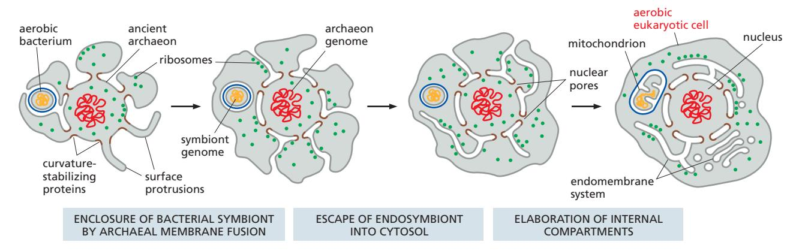

Figure 12–3 Evolutionary origins of the major internal membrane systems of a eukaryotic cell. As discussed in Chapter 1, there is evidence that the first eukaryotic cells arose when an ancient anaerobic archaeon joined forces with an aerobic bacterium roughly 1.6 billion years ago. An early step in this process was expansion of the archaeon's plasma membrane, probably through protrusions and blebs. The highly curved membrane at the necks of these protrusions might have been stabilized by proteins that eventually became part of the nuclear pore. The added surface area of these protrusions facilitated metabolite exchange with the environment and with neighboring cells. A fruitful symbiotic relationship with an aerobic bacterium might have allowed the archaeon to increase in volume. These protrusions eventually fused with each other to pinch off internal membrane-enclosed compartments, some of which contained the symbiotic bacteria. This intermediate now begins to resemble modern-day eukaryotes, with a primordial nucleus and nuclear pores, internal compartments, and an endosymbiont destined to become the mitochondrion. The lumen of the internal compartments is topologically equivalent to the extracellular space (see Figure 12–4). The membrane-enclosed endosymbiont subsequently escaped the enclosing membrane into the cytosol where it evolved into modern-day mitochondria. The internal compartments expanded and became progressively specialized to form the major intracellular compartments of a eukaryotic cell. Their common origin from a primordial intracellular compartment explains why all of these compartments can exchange material with each other through vesicular transport. The nucleus was formerly the cytosol in the ancient archaeon, explaining why the cytosol and nucleus are topologically equivalent compartments that can intermix during mitosis. (Adapted from J. Martijn and T.J.G. Ettema, *Biochem. Soc. Trans.* 41:451–457, 2013; D. Baum and B. Baum, *BMC Biol.* 12:76, 2014.) MBoC7 n12.207/12.03

organism's genetic material into a nucleus separate from the plasma membrane probably afforded greater protection from the environment. Furthermore, an expanded cytosol segregated from the nucleus would have facilitated the spatial separation of transcription from translation, thereby allowing greater regulation of gene expression by several mechanisms distinctive to eukaryotic cells.

Third, symbionts that were originally outside the cell were trapped inside the cell and became endosymbionts. At some point, endosymbionts escaped from their membrane enclosure into the cytosol where they eventually became mitochondria and plastids that contain their own genomes. The nature of these genomes and the close resemblance of the proteins in these organelles to those in some present-day bacteria provide strong evidence for their endosymbiont origins (see Figure 14–55). Like the bacteria from which they were derived,

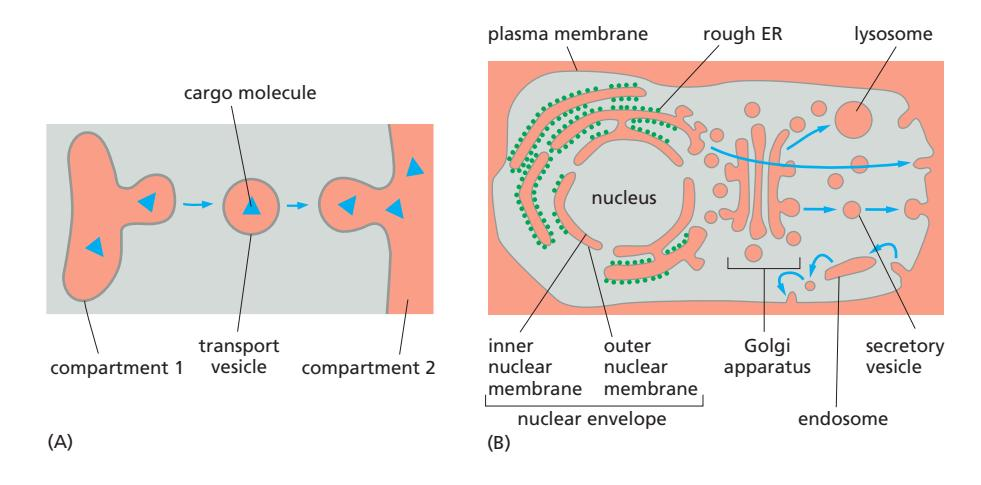

Figure 12–4 Topologically equivalent compartments in the secretory and endocytic pathways in a eukaryotic cell. Topologically equivalent spaces are shown in *red*. (A) Molecules can be carried from one compartment to another topologically equivalent compartment by transport vesicles that bud from one and fuse with the other. (B) In principle, cycles of membrane budding and fusion permit the lumen of any of the organelles shown to communicate with any other and with the cell exterior by means of transport vesicles. *Blue arrows* indicate the extensive outbound and inbound vesicular traffic (discussed in Chapter 13). Some organelles, most notably mitochondria and (in plant cells) plastids, do not take part in this communication and are isolated from the vesicular traffic between organelles shown here.

both mitochondria and plastids are enclosed by a double membrane, and they remain isolated from the extensive vesicular traffic that connects the interiors of most of the other membrane-enclosed organelles to each other and to the outside of the cell.

The evolutionary schemes we have outlined for the origins of eukaryotic organelles are most strongly supported by the striking similarities of the protein transport machinery of modern-day prokaryotes and eukaryotic organelles. The ability to transport proteins across and into membranes is a fundamental and essential feature of all living organisms. Thus, machinery that carries out these processes would have arisen in the earliest life-forms and been retained throughout evolution. The presence and orientation of these transport components therefore allow us to trace the origins and topology of the membranes within which they now reside. Consistent with the model for evolution of the endomembrane system of eukaryotic cells, the components that mediate protein import into the ER are homologous to the proteins that mediate export across the archaeal plasma membrane. Similarly, membrane protein insertion machinery in the outer and inner membranes of mitochondria and plastids contains homologous components found in the outer and inner membranes of various modern-day bacteria.

The major intracellular compartments in eukaryotic cells can therefore be categorized into three distinct families: (1) the nucleus and the cytosol, which are topologically equivalent (although functionally distinct) and connected by nuclear pore complexes; (2) all organelles that function in the secretory and endocytic pathways—including the ER, Golgi apparatus, endosomes, lysosomes, and the transport vesicles that move between them—and peroxisomes; (3) the endosymbiont-derived organelles: mitochondria and the plastids (in plants only).

# Macromolecules Can Be Segregated Without a Surrounding Membrane

A membrane barrier is not the only way subsets of macromolecules can selectively segregate within cells. As we discussed in Chapter 3, one or more interacting proteins or nucleic acids can serve as *scaffolds* in *biomolecular condensates* (see Figure 3–77). These scaffold macromolecules create the condensate through multiple weak, fluctuating binding interactions among themselves; in addition, they recruit specific proteins and nucleic acids into the condensate as *client macromolecules* (**Figure 12–5**). Once recruited, the clients typically remain within the condensate because the local concentration of its binding sites on the interacting scaffold molecule is very high. Thus, when the client dissociates from a scaffold molecule, it is more likely to re-bind to another site on the scaffold molecule or to a neighboring one within the condensate than to diffuse away altogether. In this way, a specific set of proteins and nucleic acids can be concentrated into a cellular structure that excludes other surrounding macromolecules.

The largest and most conspicuous condensate in eukaryotic cells is the *nucleolus*, the structure within the nucleus where ribosomes are assembled (**Movie 12.1**). The central scaffolding component of the nucleolus is nascent pre-rRNA that is actively transcribed from arrays of rRNA genes. Nascent prerRNA recruits numerous proteins and small nucleolar RNAs (snoRNAs) required for pre-rRNA processing. These macromolecules further recruit other scaffold proteins—plus clients that include ribosomal proteins, assembly chaperones, and modification enzymes. In total, more than 400 proteins and RNAs contribute to the formation of this enormous condensate.

Biomolecular condensates can be found in all organisms (**Figure 12–6**), and eukaryotic cells contain a dozen or more different types (**Table 12–3**). The sizes of the known condensates range from ∼50 nm in diameter (slightly bigger than ribosomes) to a micrometer or more in the case of nucleoli. These structures include many different types of ribonucleoprotein condensates (some in the nucleus and

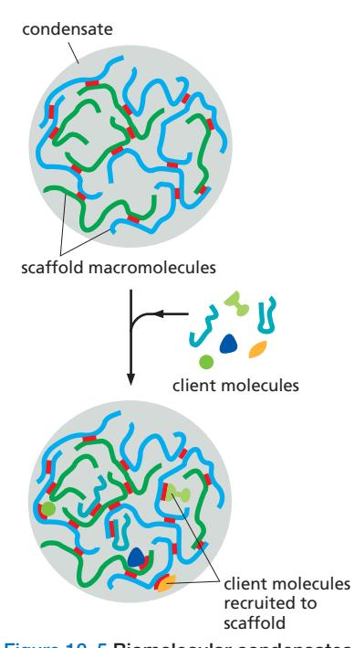

MBoC7 n12.110/12.05 Figure 12–5 Biomolecular condensates formed by scaffold macromolecules recruit clients. As described in Chapter 3 (see Figure 3–77), a set of macromolecules that participate in weak, dynamic, and multivalent interactions (shown in *red*) with each other can form a biomolecular condensate (Movie 12.1). The macromolecules that directly participate in formation of the condensate are termed "scaffolds." The scaffold proteins and RNA can recruit other macromolecules, termed "clients," via specific interactions. Condensate formation does not depend on these clients, but they are part of the condensate because of their specific scaffold interactions.

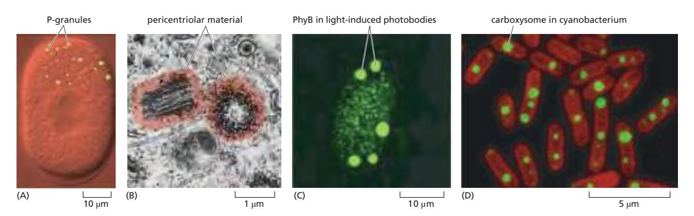

MBoC7 n12.116/12.06 Figure 12–6 Examples of biomolecular condensates in different organisms. (A) Fluorescent image of the nematode *Caenorhabditis elegans* at the single-cell stage showing P-granules that are asymmetrically distributed and inherited at cell division. P-granules contain certain mRNAs and other macromolecules. (B) The pericentriolar material in the centrosome that nucleates the assembly of microtubules in an animal cell as seen by electron microscopy. (C) Green fluorescent protein (GFP)-labeled PhyB concentrates in condensates known as photobodies in the plant nucleus when the cells are exposed to bright light. Photobodies might be sites of light-mediated signaling and gene regulation. (D) Rubisco and carbonic anhydrase are concentrated in carboxysomes *(green)* in photosynthetic bacteria (cyanobacteria). Chlorophyll is shown in *red*. Carboxysomes are analogous to the pyrenoids of algae and facilitate carbon fixation. (A, from P. Brangwynne et al., *Science* 324:1729–1732, 2009. B, from M. McGill et al., *J. Ultrastruct. Res.* 57:43–53, 1976. C, from E.K. Van Buskirk et al., *Plant Physiol*. 158:52–60, 2012. D, from Y. Fang et al., *Front. Plant Sci*. 9:article 739, 2018. Courtesy of Liu Luning.)

others in the cytoplasm), a variety of different signaling protein clusters that can form tethered to the plasma membrane, and the "biochemical factories" that form as needed to catalyze DNA repair, DNA replication, and DNA transcription in the nucleus.

As illustrated by the nucleolus, each type of condensate is enriched for a characteristic complement of proteins (and in many cases, nucleic acids) that interact with each other to maintain the condensate's identity and integrity. The specificity of at least a subset of macromolecular interactions within the condensate ensures that it remains distinct in its composition and function. Thus, biomolecular condensates and membrane-enclosed compartments represent two different mechanisms that are used by eukaryotic cells to segregate subsets of macromolecules that execute specialized biochemistry (see Table 3–3). Because of this conceptual similarity, condensates are sometimes referred to as **membraneless** 

| TABLE 12–3 Examples of Eukaryotic Biomolecular Condensates |             |                                                                         |  |
|------------------------------------------------------------|-------------|-------------------------------------------------------------------------|--|
| Biomolecular condensate                                    | Location    | Proposed associated function(s)                                         |  |
| Nucleolus                                                  | Nucleus     | rRNA transcription and ribosome assembly                                |  |
| Pyrenoid                                                   | Chloroplast | Carbon fixation from CO2 in algae                                       |  |
| Stress granules                                            | Cytosol     | Temporary storage, particularly of translation-related components       |  |
| P-granules                                                 | Cytosol     | RNA metabolism and inheritance                                          |  |
| Balbiani body                                              | Cytosol     | Localization and inheritance of mRNAs and organelles                    |  |
| Cajal body                                                 | Nucleus     | mRNA processing                                                         |  |
| Paraspeckles                                               | Nucleus     | Regulation of gene expression                                           |  |
| RNA transport granule                                      | Neuron      | RNA localization to subcellular locations in development and in neurons |  |
| PML body                                                   | Nucleus     | Storage of nuclear factors; regulation of gene expression               |  |
| Postsynaptic density                                       | Dendrite    | Organization of macromolecules needed for neuronal transmission         |  |

**organelles**. Historically, organelles were intracellular structures that could be directly visualized in the light or electron microscope. This is why the nucleolus and centrosome are called organelles. Most condensates are not organelles by this historical definition; nevertheless, they are cellular structures that segregate and concentrate specific macromolecules.

#### Multivalent Interactions Mediate Formation of Biomolecular Condensates

The formation of a biomolecular condensate requires that at least one of its constituent macromolecules engage in a set of weak, multivalent interactions with either itself or other constituents (see Figure 3–77A). The sites of these interactions are often separated by flexible and unstructured regions of the macromolecule. For example, nascent pre-rRNA in the nucleolus is a flexible molecule that binds a variety of clients and other scaffold molecules at numerous points along its length. Similarly, the scaffolding proteins that generate condensates of signaling proteins under the plasma membrane typically contain multiple protein–protein interaction domains separated by flexible *intrinsically disordered regions* that lack secondary structure. Experiments with artificial multivalent proteins have shown that this is the minimal element needed to drive condensate formation in a test tube and in cells.

Each individual interaction within a condensate is often very weak, allowing the macromolecules to rapidly exchange their relative positions. These dynamic and frequent rearrangements, together with the structural flexibility of many condensate constituents, means that the molecules within the condensate are highly mobile and do not have fixed positions relative to each other. This property causes the condensate to behave as a liquid. As discussed in Chapter 3 (pp. 171–173), despite this liquidlike property, the condensate does not dissolve into its surroundings because the interaction energy within the condensate offsets the entropy that would be gained if the molecules were dispersed. This is how the condensate can remain a liquid that stably resides within another liquid (the cytosol), a phenomenon termed "liquid–liquid phase separation."

Different noncovalent chemical bonds can form the weak interactions between macromolecules that drive condensate formation. Cation–pi interactions, pi–pi interactions, charge–charge interactions, short regions of crossed β sheets, and short stretches of nucleic acid base-pairing can all contribute to condensate formation. The key requirement is that the interactions have sufficient binding energy to offset the loss of entropy caused by association, while being sufficiently dynamic to give the condensate a liquid character. When these requirements are met, condensates have a spherical shape, deform and flow under shear force, and can undergo fusion and fission.

If the interactions in a condensate become less dynamic as incrementally more stable interactions form over time, its properties can change to that of a gel and eventually a solid where the binding interactions remain fixed. There is a continuum across the spectrum of physical properties that characterize different condensates. Cells can exploit such differences by forming a condensate within a condensate. This can occur if a subset of macromolecules within a condensate has slightly higher affinity among its macromolecules than for other macromolecules of the condensate. This subset then forms a new condensate with distinct physical properties (**Figure 12–7**). This is how the nucleolus is thought to be segregated into morphologically different concentric shells, each of which is enriched for subsets of nucleolar proteins dedicated to different aspects of ribosome assembly.

#### Biomolecular Condensates Create Biochemical Factories

The fluctuating network of interactions among the macromolecules inside of a condensate excludes other macromolecules from the surrounding environment. By contrast, nucleotides, metabolites, cofactors, and other small

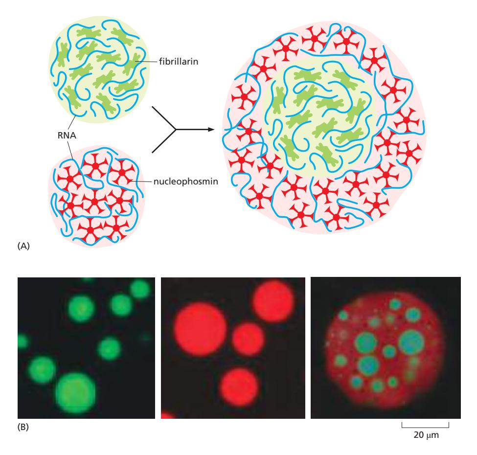

MBoC7 n12.109/12.07 Figure 12–7 Condensates with different properties can coexist as part of a larger structure. The nucleolus is a condensate that is composed of three morphologically and functionally distinct regions, one inside the other, each formed by a different set of scaffold macromolecules. (A) In the experiment shown, the scaffolds from two nucleolar substructures have been purified—fibrillarin from the nucleolus's fibrillar component and nucleophosmin from its granular component. Both of these scaffold proteins contain binding sites for RNA, and when mixed with RNA in a test tube, each purified scaffold will assemble into an RNA–protein condensate, as illustrated at *left*. However, as illustrated at *right*, when mixed together they instead form a multilayered structure that has one type of condensate encased inside the other type of condensate. (B) The condensates, formed either separately or together, viewed by fluorescence microscopy; fibrillarin is *green* and nucleophosmin is *red*. (Adapted from M. Feric et al., *Cell* 165:1686–1697, 2016.)

molecules can rapidly diffuse into the condensate where they can engage with the enzymes that reside there. The product of these enzymes within the condensate can be used by other enzymes that are coresident in the condensate before the product diffuses away. In this way, multistep reactions can be accelerated to rates beyond that possible without co-segregation of the enzymes inside a condensate.

Consider for example, the *pyrenoid*, a complex structure found in many algae that contains a condensate enriched in the enzyme ribulose 1,5-bisphosphate carboxylase/oxygenase (Rubisco) and a pyrenoid-specific scaffolding protein. The Rubisco-containing condensate is interwoven with membrane tubules. Carbonic anhydrase inside the membrane tubule converts bicarbonate (HCO3 –) into CO2, which Rubisco uses to carboxylate ribulose 1,5-bisphosphate (**Figure 12–8**). This carboxylation reaction is a critical early step in carbon fixation during photosynthesis (discussed in Chapter 14). If Rubisco were not in a condensate in close proximity to carbonic anhydrase, the low free CO2 concentration combined with a competition by oxygen for Rubisco's active site would favor reaction with oxygen (termed "photorespiration"; see Chapter 14, p. 847) over carbon fixation. Land plants do not need a pyrenoid to fix carbon because

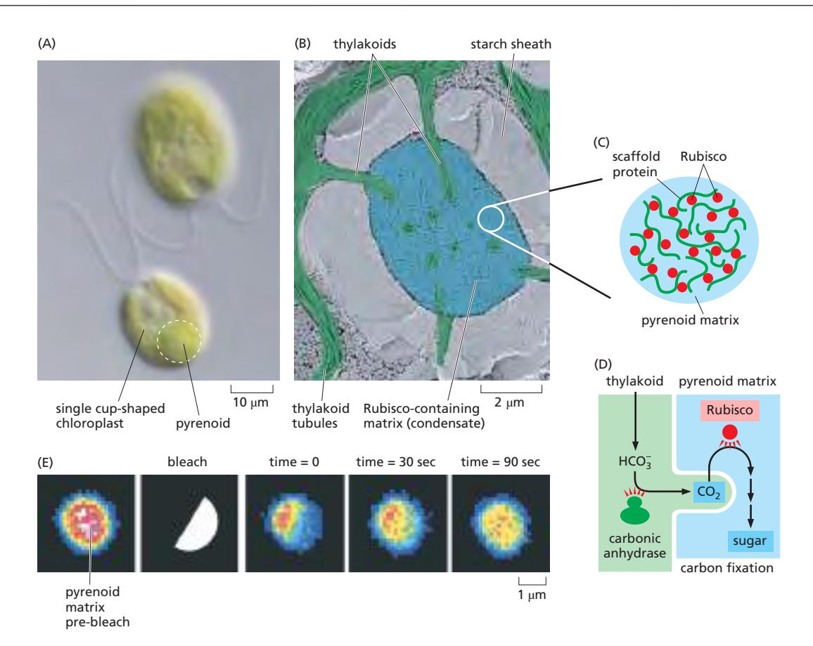

Figure 12–8 The pyrenoid contains a condensate of Rubisco that exploits locally generated CO2. (A) The pyrenoid as seen by light microscopy of the single-celled alga *Chlamydomonas reinhardtii*. (B) Scanning electron micrograph of the *C. reinhardtii* pyrenoid showing how the Rubisco-containing condensate is penetrated by tubules from the surrounding thylakoid. (C) Simplified depiction of the condensate containing the enzyme Rubisco and the multivalent scaffold protein EPYC1. (D) The tubules of thylakoid membranes in the pyrenoid contain the enzyme carbonic anhydrase. HCO3 – is used by carbonic anhydrase to generate CO2, which is used by the surrounding Rubisco in the pyrenoid matrix. The use of locally generated CO2 is thought to favor the carboxylation reaction performed by Rubisco rather than the competing oxygenation reaction that would be favored when O2 is used by Rubisco instead of CO2. (E) Experiment demonstrating that the contents inside the pyrenoid matrix are highly dynamic. Shown is a pseudocolored fluorescence image of a pyrenoid containing a Rubisco subunit tagged with a fluorescent protein. *Red* and *white* indicate the areas of brightest fluorescence, and *blue* indicates areas of dim fluorescence. The right half of the pyrenoid was photobleached, after which fluorescence was monitored over time. Fluorescent molecules from the non-bleached half intermix with the bleached molecules within 90 seconds. (A, from Carnegie Institution for Science. B, courtesy of Ursula Goodenough. E, adapted from E.S. Freeman Rosenzweig et al., *Cell* 171:148–162, 2017.) MBoC7 n12.113/12.08

CO2 in the air is more plentiful than the very low concentration of dissolved CO2 available as HCO3 – to algae living in aquatic environments. The pyrenoid illustrates how the segregation of sequential biochemical reactions into a condensate can both speed reactions and minimize alternate off-pathway outcomes. In the same way, carrying out the highly complex and ordered process of ribosome assembly within the nucleolus prevents unwanted side reactions while promoting the desired ones.

Scientists can produce artificial condensates that contain a desired set of macromolecules by engineering them with multivalent interaction domains. This approach can be used to experimentally enhance the efficiency of an otherwise unfavorable reaction. In one experiment, all of the factors required to misread a UAG stop codon as a sense codon were engineered with artificial multivalent interaction modules to generate a condensate inside the cell. The UAG codon of the mRNA within this condensate was efficiently interpreted as a sense codon, while other mRNAs in the surrounding cytosol terminated at UAG codons. This experiment illustrates the minimal features needed to produce a condensate-based biochemical factory within a cell and that such features can be rationally designed and engineered.

#### Biomolecular Condensates Form and Disassemble in Response to Need

As we have seen, the formation and stability of a biomolecular condensate rely on weak interactions among its constituents overcoming the entropy of a well-mixed system. This means that even small changes in the strength of interactions can influence the formation and physical properties of the condensate. The formation and dissolution of a condensate can therefore be readily controlled by changing the strength of the multivalent interactions that mediate its assembly. This is often accomplished by post-translational modifications, such as phosphorylation, and this mechanism is commonly used to rapidly form and disassemble large signaling clusters at the plasma membrane (**Figure 12–9**). Condensate formation and disassembly can also be induced by a change in a cellular condition such as temperature, pH, or osmolarity. The reversibility of condensate formation is used by cells to regulate condensates in response to need, and it affords the cell flexibility and speed in adapting to changing needs.

For example, the condensates called *stress granules* only form during certain types of cellular stress, and they dissolve when the stress is alleviated. These condensates are enriched in translationally inactive mRNAs, various translation factors, ribosomal subunits, and various RNA-binding proteins. They

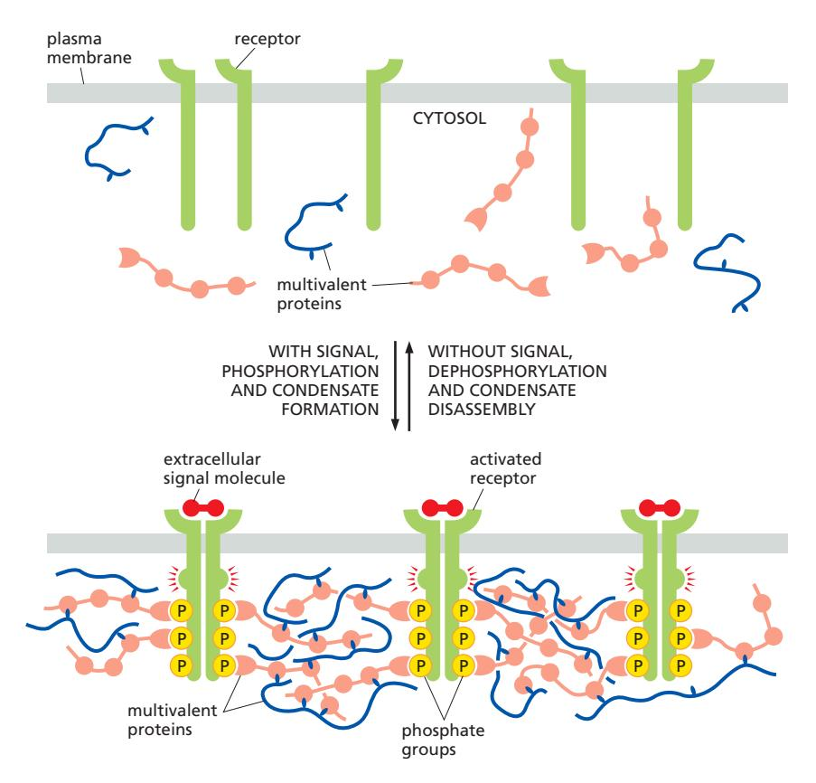

Figure 12–9 Phosphorylation regulates the formation and dissolution of condensates during signaling. When a receptor at the plasma membrane is engaged by its ligand, its cytosolic tail and associated proteins become phosphorylated. This modification, along with surrounding amino acids, forms a specific binding site for various cytosolic and membrane proteins, many of which are multivalent. The multivalent proteins interact with each other to drive the formation of a condensate that has distinctive signaling properties. When the key sites become dephosphorylated, the condensate disassembles and signaling stops. Examples of signaling clusters that form and disassemble in response to ligand are discussed in Chapter 15.

form when a block in translation initiation exposes mRNA regions that would normally be covered by translating ribosomes. When these mRNAs become exposed, they can interact with each other and with RNA-binding proteins to nucleate a condensate. It is thought that the resulting condensates serve as a storage depot for these mRNAs and factors when they are not being actively used. By temporarily sequestering these macromolecules during stress rather than degrading them, the cell can avoid the need to produce them *de novo* once the stress has been resolved.

#### Proteins Can Move Between Compartments in Different Ways

Nearly all proteins, except a few inside mitochondria and plastids, begin their synthesis on ribosomes in the cytosol. The final location of each protein depends on its amino acid sequence, which can contain one or more **sorting signals** that direct its delivery to different parts of the cell. The sorting signals in the transported protein are recognized by complementary **sorting receptors** that mediate movement between compartments. By contrast, proteins that do not have any sorting signals remain in the cytosol as permanent residents. There are four fundamentally different ways a protein is moved from one compartment to another. These four mechanisms are described below, and the transport steps at which they operate are outlined in **Figure 12–10**. We discuss protein translocation and gated transport in this chapter, vesicular transport in Chapter 13, and engulfment in both this chapter and the next.

- 1. In **protein translocation**, transmembrane *protein translocators* directly transport specific proteins from the cytosol into a space that is topologically distinct: either the other side of a membrane or within the lipid bilayer in the case of integral membrane proteins. The transported protein molecule usually must unfold to snake through the translocator. The initial transport of selected proteins from the cytosol into the ER lumen, the ER membrane, or mitochondria occurs in this way.
- 2. In **gated transport**, proteins and RNA molecules move between the cytosol and the nucleus through nuclear pore complexes in the nuclear envelope. The nuclear pore complexes function as selective gates that support the active transport of specific macromolecules and macromolecular assemblies between the two topologically equivalent spaces.
- 3. In **vesicular transport**, membrane-enclosed transport intermediates which may be small, spherical transport vesicles, elongated tubules, or larger, irregularly shaped fragments of organelles—ferry proteins from one topologically equivalent compartment to another. The transport intermediate becomes loaded with a cargo of molecules derived from the lumen and membrane of the originating compartment as it buds and pinches off. At the destination compartment, the transport intermediate fuses with the compartment's enclosing membrane to discharge its cargo

Figure 12–10 A simplified "road map" of protein traffic within a eukaryotic cell. Proteins can move from one compartment to another by protein translocation *(blue)*, gated transport *(red)*, vesicular transport *(green)*, or engulfment *(gray)*. The sorting signals that direct a given protein's movement through the system, and thereby determine its eventual location in the cell, are contained in each protein's amino acid sequence. The journey begins with the synthesis of a protein on a ribosome in the cytosol and, for many proteins, terminates when the protein reaches its final destination. Other proteins shuttle back and forth between the nucleus and cytosol. At each intermediate station *(boxes)*, a decision is made as to whether the protein is to be retained in that compartment or transported further. A sorting signal may direct either retention in or exit from a compartment. A special transport process termed "engulfment" is used to move proteins from the cytosol into the lysosome in autophagy or used to enclose chromosomes inside the nucleus during nuclear envelope re-formation after mitosis. The movement of macromolecules into and out of a condensate is not shown here. This process does not involve crossing a membrane barrier and is mediated by direct physical interactions among the macromolecules that form the condensate. We shall refer to this figure often as a guide in this chapter and the next, highlighting in color the particular pathway being discussed.

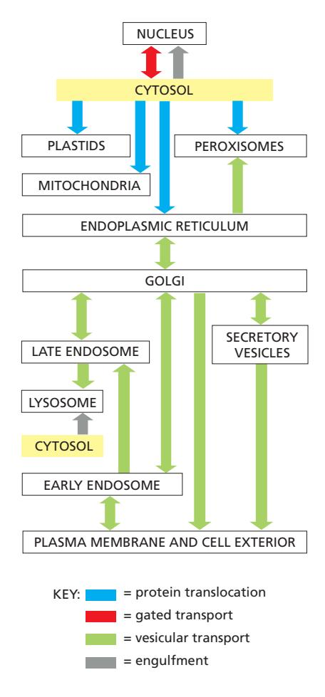

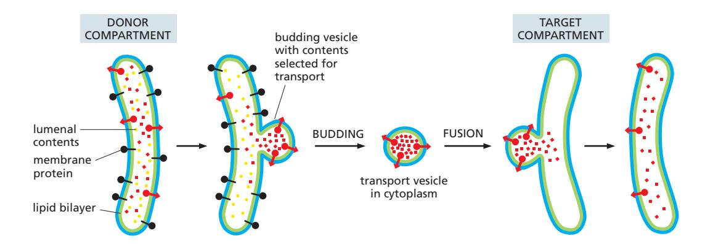

(**Figure 12–11**). The transfer of soluble and membrane-embedded proteins from the ER to the Golgi apparatus, for example, occurs in this way. The proteins transported by vesicular transport never cross a membrane during the process, and therefore retain their topological relationships within the cell.

4. In **engulfment**, such as autophagy (discussed in Chapter 13), doublemembrane sheets wrap around portions of the cytoplasm often including fragments of organelles or even entire organelles (**Figure 12–12**). This membrane structure then seals by membrane fusion to enclose a separate compartment, the autophagosome. The re-formation of the nuclear envelope after mitosis (discussed later in this chapter) follows a conceptually similar process. ER tubes and sheets wrap around decondensing chromosomes and then fuse laterally with one another to form a sealed double-membrane envelope only traversed by the nuclear pores.

In addition to these mechanisms for protein movement into and between membrane-enclosed compartments, a simpler mechanism based on direct physical binding is used by macromolecules to enter biomolecular condensates. In this mechanism, the macromolecule specifically binds to another protein or RNA that is already part of the condensate to which it is specifically recruited. Once recruited, the macromolecule remains within the condensate because of persistent and repeated interactions with its partner. The interaction between a macromolecule and its binding partner in the condensate is analogous to the interaction between a sorting signal and its cognate sorting receptor; in both cases, the interaction specifies the macromolecule's destination. MBoC7 m12.06/12.11

#### Sorting Signals and Sorting Receptors Direct Proteins to the Correct Cell Address

Sorting signals are usually composed of amino acid side chains in a protein and come in two general varieties: a linear sequence of amino acids (called a signal sequence) or a specific three-dimensional arrangement of amino acids (called a signal patch). Sorting signals for protein translocation into organelles are linear **signal sequences**, while examples of linear signals and **signal patches** are known for nuclear and vesicular transport. The linear signal sequences for protein translocation are often found at the N-terminus of the polypeptide chain. These N-terminal signal sequences are usually removed from the finished protein by specialized **signal peptidases** once the sorting process is complete. Other types of signal sequences are not removed and remain part of the final mature protein.

Each signal sequence specifies a particular destination in the cell. The signal sequence for initial transfer to the ER usually includes a linear sequence of about 5–10 predominantly hydrophobic amino acids. Many of these proteins will in turn pass from the ER to the Golgi apparatus, but those with a specific signal sequence

Figure 12–11 Vesicle budding and fusion during vesicular transport. Transport vesicles bud from one compartment (donor) and fuse with another topologically equivalent (target) compartment. In the process, a subset of soluble components *(red dots)* are transferred from lumen to lumen. Note that membrane is also transferred and that the original orientation of both proteins and lipids in the donor compartment membrane is preserved in the target compartment membrane. Thus, membrane proteins retain their asymmetrical orientation, with the same domains always facing the cytosol.

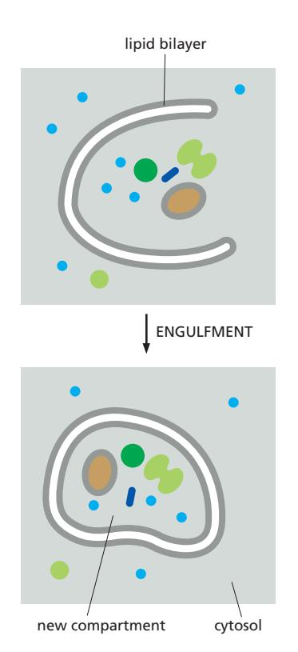

Figure 12–12 Formation of a new compartment by engulfment of contents inside of a membrane.

of four amino acids at their C-terminus are recognized as ER residents and are returned to the ER. Proteins destined for mitochondria have signal sequences of yet another type, in which positively charged amino acids alternate with hydrophobic ones. The signal for protein import into the nucleus is composed primarily of positively charged amino acids. Finally, many proteins destined for peroxisomes have a signal sequence of three characteristic amino acids at their C-terminus. A sorting signal for any particular destination needs to be sufficiently distinctive from all other sequences to permit its selective recognition by the appropriate sorting receptor.

**Figure 12–13** presents some specific signal sequences. Experiments in which the peptide is transferred from one protein to another by genetic engineering techniques have demonstrated the importance of each of these signal sequences for protein targeting. Placing the N-terminal ER signal sequence at the beginning of a cytosolic protein, for example, redirects the protein to the ER; removing or mutating the signal sequence of an ER protein causes its retention in the cytosol. Signal sequences are therefore both necessary and sufficient for protein targeting. Even though their amino acid sequences can vary greatly, the signal sequences of proteins having the same destination are often functionally interchangeable; in these instances, physical properties, such as hydrophobicity, are more important in the signal-recognition process than the exact amino acid sequence.

```
N – Met – Val – Ala – Met – Ala – Met – Ala – Ser – Leu – Gln – Ser – Ser – Met – Ser – Ser – Leu – Ser – 
 Leu – Ser – Ser – Asn – Ser – Phe – Leu – Gly – Gln – Pro – Leu – Ser – Pro – Ile – Thr – Leu – Ser – Pro – 
 Phe – Leu – Gln – Gly – 
import into plastids
 N – Met – Met – Ser – Phe – Val – Ser – Leu – Leu – Leu – Val – Gly – Ile – Leu – Phe – Trp – Ala – Thr – 
 Glu – Ala – Glu – Gln – Leu – Thr – Lys – Cys – Glu – Val – Phe – Gln – 
import into ER
 – Pro – Pro – Lys – Lys – Lys – Arg – Lys – Val – 
import into nucleus
 – Met – Glu – Glu – Leu – Ser – Gln – Ala – Leu – Ala – Ser – Ser – Phe – 
export from nucleus
 N – Met – Leu – Ser – Leu – Arg – Gln – Ser – Ile – Arg – Phe – Phe – Lys – Pro – Ala – Thr – Arg – Thr – 
 Leu – Cys – Ser – Ser – Arg – Tyr – Leu – Leu – 
import into mitochondria
 – Ser – Lys – Leu – C
import into peroxisomes
 – Lys – Asp – Glu – Leu – C
return to ER
```

Figure 12–13 Examples of signal sequences that direct proteins to different intracellular locations. The primary characteristic features of each type of signal sequence are highlighted in color. Where they are known to be important for the function of the signal sequence, negatively charged amino acids are shown in *blue* and positively charged amino acids are shown in *red*. Similarly, important hydrophobic amino acids are shown in *green* and important uncharged polar amino acids are shown in *yellow*. N– indicates the N-terminus of a protein; –C indicates the C-terminus.

Sorting signals are recognized by complementary sorting receptors that guide proteins to their appropriate destination, where the receptors unload their cargo. The receptors function catalytically: after completing one round of targeting, they return to their point of origin to be reused. Most sorting receptors recognize classes of proteins rather than an individual protein species. They can therefore be viewed as public transportation systems, dedicated to delivering numerous different components to their correct locations in the cell.

#### Construction of Most Organelles Requires Information in the Organelle Itself

When a cell reproduces by division, it has to duplicate its chromosomes, its enclosing plasma membrane, and its organelles. In general, cells do this by expanding the plasma membrane and organelles with new proteins and lipids before division and segregation to the two daughter cells. The delivery of new proteins for growth of the ER, mitochondria, and plastids requires preexisting organelle-specific protein translocators. Because the incorporation of new protein translocators requires a preexisting protein translocator, a cell must already have at least some functional ER to make more ER; the same applies to mitochondria and plastids. Thus, two types of information are required to construct these organelles: the DNA that specifies an organelle's proteins and preexisting protein translocator(s) in the organellar membrane for incorporating new deliveries of protein. Both types of information are passed from parent cell to daughter cells to maintain the cell's compartmental organization.

Some organelles, such as lysosomes, acquire all of their proteins and membrane by vesicular transport from other organelles (see Chapter 13). Because it is possible, in principle, to construct such organelles *de novo*, they do not necessarily have to be inherited at cell division. Similarly, biomolecular condensates can be constructed *de novo* by self-assembly of the constituent proteins and nucleic acids. Thus, during cell division, a condensate can be disassembled, its constituents distributed stochastically among the two daughter cells, then reassembled into a condensate. This is how the nucleolus is acquired by daughter cells.

#### Summary

*Eukaryotic cells contain intracellular membrane-enclosed organelles that make up nearly half the cell's total volume. The main ones present in all eukaryotic cells are the endoplasmic reticulum, Golgi apparatus, nucleus, mitochondria, lysosomes, endosomes, and peroxisomes; plant cells also contain plastids such as chloroplasts. All organelles contain distinct sets of proteins, which mediate each organelle's unique function.* 

*Cells can also segregate subsets of their macromolecules into biomolecular condensates such as the nucleolus. The components inside these condensates can work together to carry out specialized biochemical reactions. The cell contains a dozen or more condensates that vary widely in size and can assemble and disassemble in response to need.* 

*Each newly synthesized organellar protein must find its way from a ribosome in the cytosol, where the protein is made, to the organelle where it functions. It does so by using sorting signals in its amino acid sequence that are recognized by complementary sorting receptors, which deliver the protein to the appropriate target organelle. Proteins that function in the cytosol do not contain sorting signals and therefore remain there after they are synthesized.*

*During cell division, organelles such as the ER and mitochondria are distributed to each daughter cell. These organelles contain information that is required for their construction, and so they cannot be made de novo. Biomolecular condensates can be constructed de novo because they self-assemble from components that are encoded genetically.* 

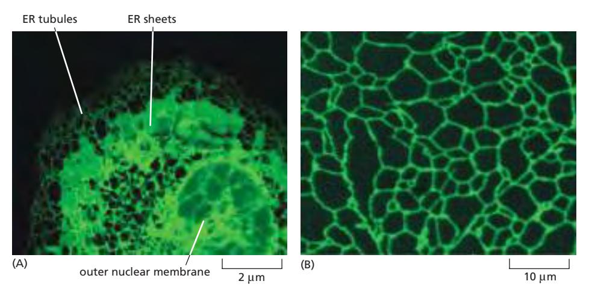

Figure 12–14 Fluorescence micrographs of the endoplasmic reticulum. (A) An animal cell in tissue culture that was genetically engineered to express an ER membrane protein fused to a fluorescent protein. The ER extends as a network of tubules and sheets throughout the entire cytosol, so that all regions of the cytosol are close to some portion of the ER membrane. The outer nuclear membrane, which is continuous with the ER, is also stained. (B) Part of an ER network in a living plant cell that was genetically engineered to express a fluorescent protein in the ER. (A, courtesy of Patrick Chitwood and Gia Voeltz. B, courtesy of Petra Boevink and Chris Hawes.)

# THE ENDOPLASMIC RETICULUM

The membrane of the **endoplasmic reticulum (ER)** typically constitutes more than half of the total membrane of an average animal cell (see Table 12–2). The ER is organized into a netlike labyrinth of branching tubules and flattened sacs that extends throughout the cytosol (**Figure 12–14** and **Movie 12.2**). The tubules and sacs interconnect, and their membrane is continuous with the outer nuclear membrane. This membrane system encloses a single internal space, called the **ER lumen**, which is continuous with the space between the inner and outer nuclear membranes. The ER often occupies more than 10% of the total cell volume (see Table 12–1). MBoC7 m12.31/12.14

The ER has a central role in the biosynthesis of both lipids and proteins, and the ER lumen stores intracellular Ca2<sup>+</sup> that is mobilized in many cell signaling responses (discussed in Chapter 15). The ER membrane is the site of production of many of the transmembrane proteins and lipids of the cell's organelles, including the ER itself, the Golgi apparatus, lysosomes, endosomes, secretory vesicles, peroxisomes, and the plasma membrane. The ER membrane is also the site at which most of the lipids for mitochondrial and plastid membranes are made. In addition, almost all of the proteins that will be secreted to the cell exterior plus those destined for the lumen of the ER, Golgi apparatus, or lysosomes—are initially delivered to the ER lumen.

#### The ER Is Structurally and Functionally Diverse

While the various functions of the ER are essential to every cell, their relative importance varies greatly between individual cell types. To meet different functional demands, distinct regions of the ER become highly specialized. Functional specialization entails dramatic changes in the proportional abundance of different parts of the ER. These changes are observed as characteristically different types of ER membrane in different types of cells. The most visually remarkable specializations are the **rough ER** and **smooth ER** (**Figure 12–15**). The rough appearance is due to the abundance of ribosomes engaged in protein synthesis bound to the surface of this part of the ER. By contrast, regions of smooth ER lack ribosomes and are dedicated to other ER functions such as the biosynthesis and metabolism of lipids. All cells have both rough and smooth ER, but their relative abundance can vary enormously in specialized cells.

Most secreted proteins are synthesized by the ribosomes that stud the surface of the rough ER. Thus, cells specialized to secrete vast amounts of protein are packed with an abundance of rough ER. For example, exocrine cells of the pancreas secrete their own weight in digestive enzymes every day, explaining why the rough ER makes up 60% of these cells' membranes (see Table 12–2). Similarly, antibody-secreting plasma cells and insulin-secreting β cells also contain a markedly expanded rough ER. This correlation between highly secretory cells and an

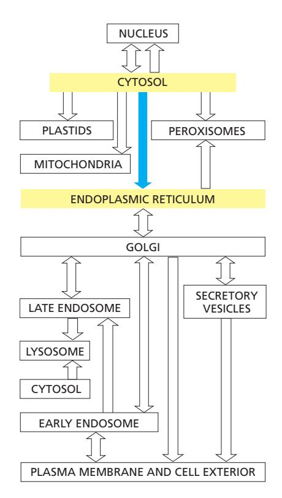

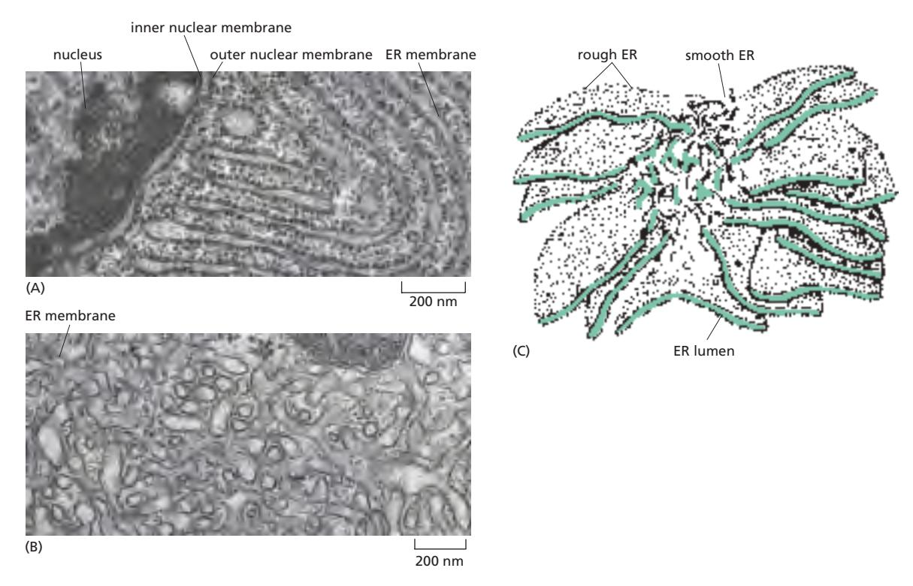

Figure 12–15 The rough and smooth ER. (A) An electron micrograph of the rough ER in a pancreatic exocrine cell that makes and secretes large amounts of digestive enzymes every day. The cytosol is filled with closely packed sheets of ER membrane that are studded with ribosomes. At the *top left* is a portion of the nucleus and its nuclear envelope; note that the outer nuclear membrane, which is continuous with the ER, is also studded with ribosomes. (B) Abundant smooth ER in a cell that secretes steroid hormone. This electron micrograph is of a testosterone-secreting Leydig cell in the human testis. (C) A three-dimensional reconstruction of a region of smooth ER and rough ER in a liver cell. The rough ER forms oriented stacks of flattened cisternae, each having a lumenal space 20–30 nm wide. The smooth ER membrane is connected to these cisternae and forms a fine network of tubules 30–60 nm in diameter. The ER lumen is colored *green*. (A, courtesy of Lelio Orci. B, courtesy of Daniel S. Friend, by permission of E.L. Bearer. C, after R.V. Kristi ´c, Ultrastructure of the Mammalian Cell. New York: Springer-Verlag, 1979. With permission from Springer Nature.)

abundance of rough ER provided biologists the first clue that the ER is responsible for the synthesis and assembly of secreted proteins. MBoC7 m12.33/12.15

In contrast to rough ER, functions for the smooth ER are more diverse and can become highly specialized. A type of smooth ER found in all cells is called *transitional ER*, from which transport vesicles carrying newly synthesized proteins and lipids bud off for transport to the Golgi apparatus. In certain specialized cells, the smooth ER has additional functions that warrant its expansion. For example, cells that synthesize steroid hormones contain prominent smooth ER to accommodate the enzymes that make cholesterol and modify it to form a variety of steroid hormones (see Figure 12–15B).

The main cell type in the liver, the *hepatocyte*, also has expanded amounts of smooth ER (see Table 12–2) serving two separate purposes. The hepatocyte is the principal site of production of *lipoprotein particles*, which carry lipids via the bloodstream to other parts of the body. The enzymes that synthesize the lipid components of the particles are enriched in the membrane of the smooth ER. In addition, these membranes contain enzymes that catalyze a series of reactions to detoxify drugs and various harmful compounds produced by metabolism. The most extensively studied of these *detoxification reactions* are carried out by the *cytochrome P450* family of enzymes. They catalyze a series of reactions in which water-insoluble drugs or metabolites that would otherwise accumulate to toxic levels in cell membranes are rendered sufficiently water soluble to leave the cell and be excreted in the urine or bile.

Another crucially important function of the ER in most eukaryotic cells is to sequester Ca2+ from the cytosol. The release of Ca2<sup>+</sup> into the cytosol from the

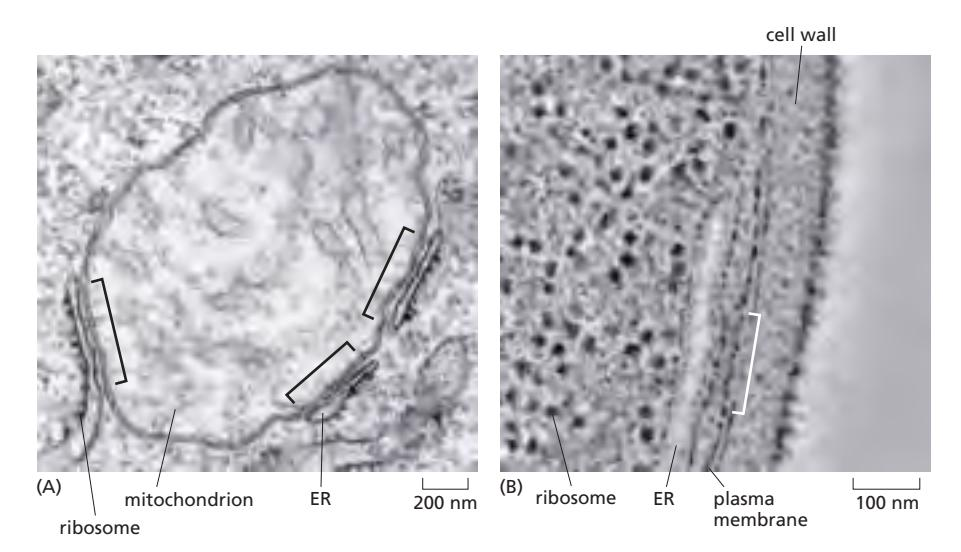

Figure 12–16 The ER makes close contacts with the mitochondria and plasma membrane. Electron micrographs of organelle contact sites between the ER and other membranes. (A) Region of a mouse embryonic fibroblast showing a mitochondrion that is closely apposed by sections of ER *(black brackets)*. (B) Yeast cell showing a section of the ER that is closely juxtaposed with the plasma membrane *(white bracket)*. [A, from P. Cosson et al., *PLOS ONE 7*(9):e46293, 2012. Courtesy of Pierre Cosson. B, courtesy of Wanda Kukulski.] MBoC7 n12.102/12.16

ER, and its subsequent reuptake, occur in many rapid responses to extracellular signals, as discussed in Chapter 15. A Ca2+ pump transports Ca2+ from the cytosol into the ER lumen. A high concentration of Ca2+-binding proteins in the ER facilitates Ca2<sup>+</sup> storage. In some cell types, specific regions of the ER are specialized for Ca2<sup>+</sup> storage. Muscle cells have an abundant, modified smooth ER called the *sarcoplasmic reticulum*. The release and reuptake of Ca2+ by the sarcoplasmic reticulum trigger myofibril contraction and relaxation, respectively, during each round of muscle contraction (discussed in Chapter 16).

Finally, the smooth ER can be specialized in regions that make intimate contacts with other organelles, most notably the mitochondria, plastids, endosomes, and the plasma membrane (**Figure 12–16**). These **organelle contact sites** are enriched for proteins involved in communication or transport of key metabolites between the juxtaposed membranes. For example, the transport of lipids from their site of synthesis in the ER to the mitochondrion is thought to occur at ER– mitochondria contact sites. Contact of ER with the plasma membrane modulates levels of plasma membrane phosphoinositides, which are lipids that participate in numerous signaling pathways (discussed in Chapters 13 and 15). Contacts between other combinations of organelles have also been observed, and it is likely that these are also involved in the selective transfer of lipids and other metabolites.

To study the functions and biochemistry of the ER, it is necessary to isolate it. This may seem to be a hopeless task because the ER is intricately interleaved with other components of the cytoplasm. Fortunately, when tissues or cells are disrupted by homogenization, the ER breaks into fragments, which reseal to form small (∼100–200 nm in diameter) closed vesicles called **microsomes** (**Figure 12–17**). To the biochemist, microsomes represent small authentic versions of the ER, still capable of protein translocation, protein glycosylation (discussed later), Ca2+ uptake and release, and lipid synthesis. *Rough microsomes*, derived from rough ER, contain ribosomes on their outside surface and enclose a small part of the ER lumen. *Smooth microsomes*, which lack ribosomes, are derived from vesiculated fragments of the smooth ER, plasma membrane, Golgi apparatus, endosomes, and mitochondria. The ribosomes attached to rough microsomes make them denser than smooth microsomes. As a result, scientists use equilibrium density centrifugation to separate the rough and smooth microsomes (Figure 12–17). Smooth microsomes derived from different organelles can

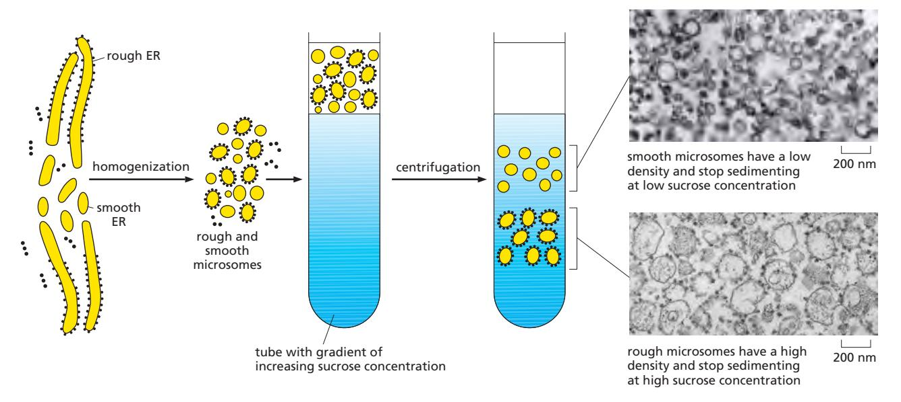

Figure 12–17 The isolation of purified rough and smooth microsomes from the ER. When an intact cell or tissue is homogenized, many of its membrane-enclosed compartments form small sealed vesicles called microsomes. When this mixture of vesicles is sedimented to equilibrium through a gradient of sucrose, the two types of microsomes separate from each other on the basis of their different densities. Note that the smooth fraction contains non-ER–derived material. Thin section electron micrographs of the purified smooth and rough microsome fractions show an abundance of ribosomestudded vesicles in the rough microsome fraction that originated from the rough ER. These are not seen in the smooth microsome fraction, which primarily contains ribosome-free vesicles originating from the smooth ER, Golgi cisternae, and other organelles. (Electron micrographs courtesy of George Palade.)

be further separated on the basis of differences in their protein content. Microsomes have been invaluable in elucidating the molecular aspects of ER function, as we discuss next.

#### Signal Sequences Were First Discovered in Proteins Imported into the Rough ER

The ER captures selected proteins from the cytosol as they are being synthesized. These proteins are of two types: *transmembrane proteins*, which become embedded in the ER membrane, and *water-soluble proteins*, which are fully translocated across the ER membrane into the ER lumen. Some of these proteins function in the ER, but many are destined to reside in another organelle, to reside in the plasma membrane, or to be secreted outside the cell. All of these proteins, regardless of their subsequent fate, are initially directed to the ER membrane by an **ER signal sequence**.

Signal sequences (and the signal sequence strategy of protein sorting) were discovered in secreted water-soluble proteins that are first translocated across the ER membrane. In the key experiment, the mRNA encoding a secreted protein was added to cytosol extracted from cells. In this cell-free reaction, ribosomes in the cytosol translated the mRNA into a protein that was slightly larger than the normal secreted protein (**Figure 12–18**)*.* When the reaction was repeated in the presence of microsomes derived from the rough ER, a protein of the correct size was produced and located inside the microsomes (Figure 12–18). By contrast, mRNA encoding a cytosolic protein produced the correctly sized product regardless of the presence or absence of rough microsomes. The *signal hypothesis* was formulated to explain these observations. According to this model, the mRNA for the secretory protein codes for a protein that is bigger than the protein that is eventually secreted. It was proposed that the extra polypeptide is a signal sequence that directs the secreted protein to the ER membrane. After the signal sequence has served its function, it is cleaved off by a *signal peptidase* in the ER membrane before the polypeptide chain has been completed.

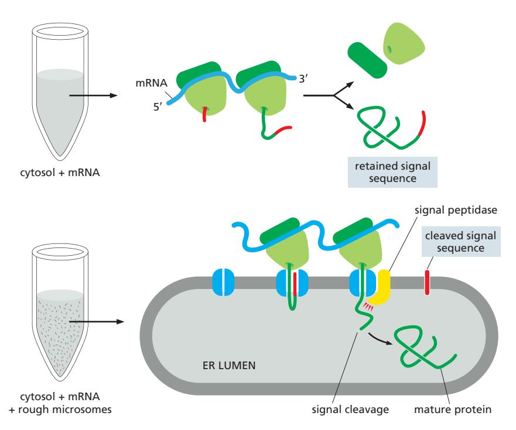

Figure 12–18 Experimental basis for the signal hypothesis. In a test tube, cytosol is mixed with mRNA that codes for a secreted protein. Two versions of this reaction are performed: one lacking and the other containing rough microsomes derived from the ER (see Figure 12–17). In both reactions, ribosomes in the cytosol translate the mRNA to produce a protein. The protein produced in the reaction lacking microsomes was observed to be slightly larger than the protein produced in the reaction containing microsomes. This difference in size was shown to be due to a small segment of protein at the N-terminus that was selectively removed only in the reaction containing microsomes. Additional analysis showed that the protein produced in the presence of microsomes was located in the microsome lumen. This collection of results was used to formulate the signal hypothesis. This sequence at the N-terminus was postulated to represent a signal sequence. When the ER signal sequence emerges from the ribosome, it directs the ribosome to a translocator on the ER membrane that forms a pore in the membrane through which the polypeptide is translocated. A signal peptidase is closely associated with the translocator and clips off the signal sequence during translation, and the mature protein is released into the lumen of the ER immediately after its synthesis is completed. The translocator is closed until the ribosome has bound, so that the permeability barrier of the ER membrane is maintained at all times.

These experiments highlight how a complex cellular process such as ER import can be reconstituted in a cell-free system by mixing together requisite cellular components such as mRNA, cytosol, and microsomes. By combining the constituent parts in different ways, the existence of signal sequences on secreted proteins was deduced long before it became possible to directly sequence their mRNAs. The ease with which this cell-free system could be manipulated proved indispensable for identifying, purifying, and studying the various components of the molecular machinery responsible for ER import. Similar systems were later established to dissect protein transport into and out of the nucleus, protein import into mitochondria and chloroplasts, and vesicular transport. MBoC7 m12.35/12.18

#### A Signal-Recognition Particle (SRP) Directs the ER Signal Sequence to a Specific Receptor at the ER

The ER signal sequence is guided to the ER membrane by at least two components: a **signal-recognition particle (SRP)**, which binds to the signal sequence, and an **SRP receptor** in the ER membrane. SRP is a large complex; in animal cells, it consists of six different polypeptide chains bound to a single RNA molecule (**Figure 12–19A**). While SRP and SRP receptor have fewer subunits in bacteria, homologs of both components are present in all living organisms.

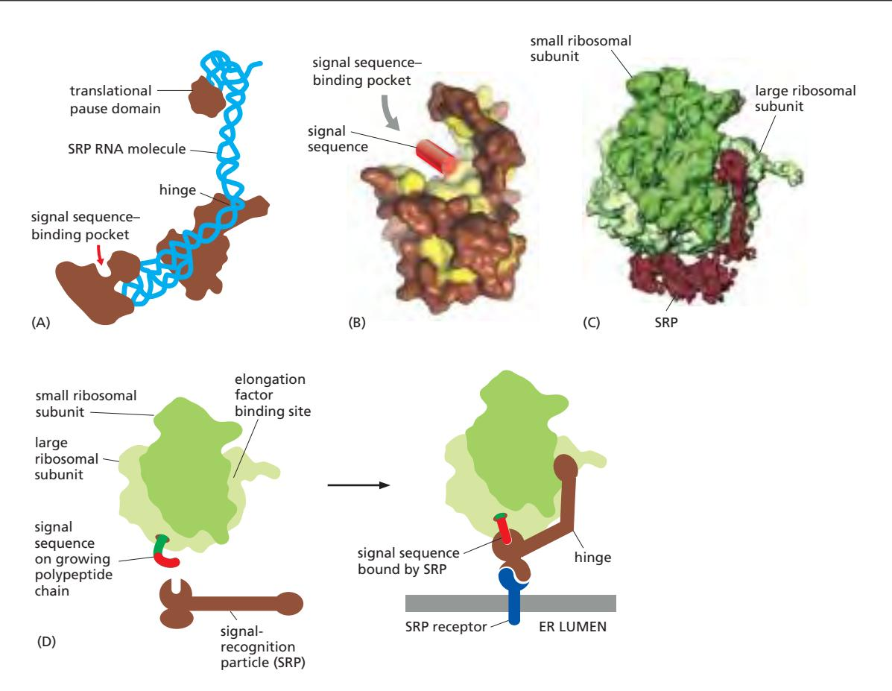

MBoC7 m12.36/12.19 Figure 12–19 The signal-recognition particle (SRP). (A) A mammalian SRP is a rodlike ribonucleoprotein complex containing six protein subunits *(brown)* and one RNA molecule *(blue)*. The SRP RNA forms a backbone that links the protein domain containing the signal sequence–binding pocket to the domain responsible for slowing translation. (B) Structure of the signal sequence–binding domain of SRP bound to the hydrophobic region of a signal sequence *(red cylinder)*. The surfaces of SRP that are hydrophobic are depicted in *yellow*. (C) The three-dimensional outline of the SRP bound to a ribosome was determined by cryo-electron microscopy. SRP binds to the large ribosomal subunit so that its signal sequence–binding pocket is positioned near the growing polypeptide chain exit site. Its translational pause domain is positioned at the interface between the ribosomal subunits, where it interferes with elongation factor binding. (D) As a signal sequence emerges from the ribosome and binds to the SRP, a conformational change in the SRP exposes a binding site for the SRP receptor. (C, adapted from M. Halic et al., *Nature* 427:808–814, 2004.)

This protein-targeting mechanism therefore arose early in evolution and has been conserved.

ER signal sequences vary greatly in amino acid sequence, but each has eight or more nonpolar amino acids at its center (see Figure 12–13). How can SRP bind specifically to so many different sequences? The answer has come from structures of one of the SRP proteins, which shows that the signal sequence–binding site is a large hydrophobic pocket enriched in methionines (**Figure 12–19B**). Because methionines have unbranched, flexible side chains, the pocket is sufficiently plastic to accommodate different hydrophobic signal sequences of various sizes and shapes.

In eukaryotic cells, SRP is a hinged rodlike structure that can wrap along the large ribosomal subunit (**Figure 12–19C**). The end of SRP that contains the signal sequence–binding pocket is positioned near the ribosomal tunnel through which newly made polypeptides emerge. This allows SRP to engage a signal sequence as it emerges from the ribosome. Once SRP engages a signal sequence, the other end of SRP can bind at the interface between the large and small ribosomal subunits (**Figure 12–19D**). This is the same site where translation elongation factors bind, so a ribosome engaged by SRP will translate proteins more slowly than normal. Slower translation presumably gives the ribosome enough time to bind to the ER membrane before completion of the polypeptide chain, thereby ensuring that the protein is not released into the cytosol. This safety device may be especially important for secreted and lysosomal hydrolases, which could wreak havoc in the cytosol; cells that secrete large amounts of hydrolases, however, take the added precaution of having high concentrations of hydrolase inhibitors in their cytosol.

When a signal sequence binds, SRP exposes a binding site for an SRP receptor (see Figure 12–19D), which is a transmembrane protein complex in the rough ER membrane. The binding of SRP to its receptor brings the SRP–ribosome complex to an unoccupied **protein translocator** in the ER membrane. The part of SRP bound near the ribosomal tunnel moves to a different site, allowing the translocator to occupy this position. SRP and SRP receptor are then released, and protein synthesis resumes at full speed. The translocator, which is now tightly bound to the translating ribosome, transfers the growing polypeptide chain across the membrane (**Figure 12–20**).

This **co-translational** transfer process creates two spatially separate populations of ribosomes. **Membrane-bound ribosomes**, attached to the cytosolic side of the ER membrane, are engaged in the synthesis of proteins that are being concurrently translocated across the ER membrane. **Free ribosomes**, unattached to any membrane, synthesize all other proteins encoded by the nuclear genome. Membrane-bound and free ribosomes are structurally and functionally identical. They differ only in the proteins they are making at any given time.

Because many ribosomes can engage with a single mRNA molecule, a **polyribosome** is usually formed. If the mRNA encodes a protein with an ER signal sequence, the polyribosome becomes attached to the ER membrane, directed there by the signal sequences on multiple growing polypeptide chains. The individual ribosomes associated with such an mRNA molecule can return to the cytosol when they finish translation and intermix with the pool of free ribosomes. The mRNA itself, however, remains attached to the ER membrane by a

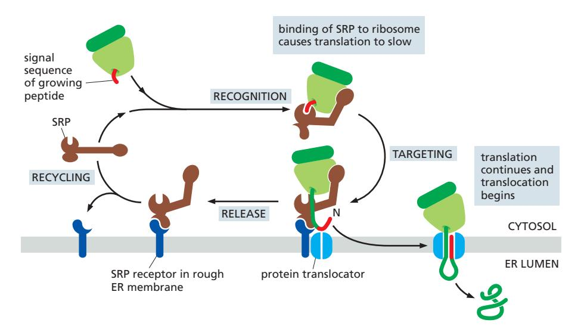

Figure 12–20 How ER signal sequences and SRP direct ribosomes to the ER membrane. The SRP and its receptor act in concert. The SRP binds to both the exposed ER signal sequence and the ribosome, thereby causing translation to slow. The SRP receptor in the ER membrane, which in animal cells is composed of two different polypeptide chains, binds the SRP–ribosome complex and directs it to the translocator. The SRP (in complex with SRP receptor) then moves away from its binding site on the ribosome, which is then occupied by the translocator in the ER membrane. SRP then releases the signal sequence, which inserts into the translocator to initiate polypeptide chain transfer across the lipid bilayer. The SRP and SRP receptor dissociate from each other and are recycled for the next round of protein targeting. Although not shown in the figure, one of the SRP proteins and both chains of the SRP receptor contain GTP-binding domains. Conformational changes that occur during cycles of GTP binding and hydrolysis (discussed in Chapter 15) ensure that SRP preferentially binds a signal sequence in the cytosol and releases it only after SRP successfully engages the SRP receptor at the ER membrane. The energy of GTP hydrolysis is therefore used to impart directionality to the cycle of SRP-mediated protein targeting. MBOC7 m12.37/12.20

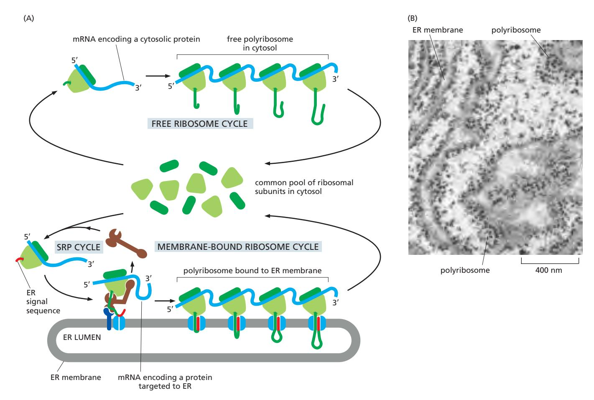

Figure 12–21 Free and membrane-bound polyribosomes. (A) A common pool of ribosomes synthesizes the proteins that stay in the cytosol and those that are transported into the ER. The ER signal sequence on a newly formed polypeptide chain binds to SRP, which directs the translating ribosome to the ER membrane. The mRNA molecule remains bound to the ER as part of a polyribosome, while the ribosomes that move along it are recycled; at the end of each round of protein synthesis, the ribosomal subunits are released and rejoin the common pool in the cytosol. (B) A thin section electron micrograph of polyribosomes attached to the ER membrane. The plane of the section in some places cuts through the ER roughly parallel to the membrane, giving a face-on view of the circular or spiral pattern of the polyribosomes. (B, courtesy of George Palade.)

changing population of ribosomes, each transiently held at the membrane by the translocator (**Figure 12–21**).

### The Polypeptide Chain Passes Through a Signal Sequence–gated Aqueous Channel in the Translocator

It had long been debated whether polypeptide chains are transferred across the ER membrane in direct contact with the lipid bilayer or through a channel in a protein translocator. The debate ended with the identification of the translocator, which was shown to form a water-filled channel across the membrane through which the polypeptide chain passes. The core of the translocator, called the **Sec61 complex**, is built from three subunits that are highly conserved from bacteria to eukaryotic cells. The structure of the Sec61 translocator revealed that 10 α helices surround a central channel (**Figure 12–22**). The channel is plugged by a short α helix that keeps the translocator closed when it is idle. It is important to keep the channel closed to prevent ions, such as Ca2+, from leaking out of the ER. During translocation, the plug moves out of the way so the polypeptide can pass through the channel.

The Sec61 translocator only opens for proteins containing a signal sequence. The ability of the Sec61 translocator to recognize signal sequences provides a proofreading step to ensure that only proteins truly intended for the ER are

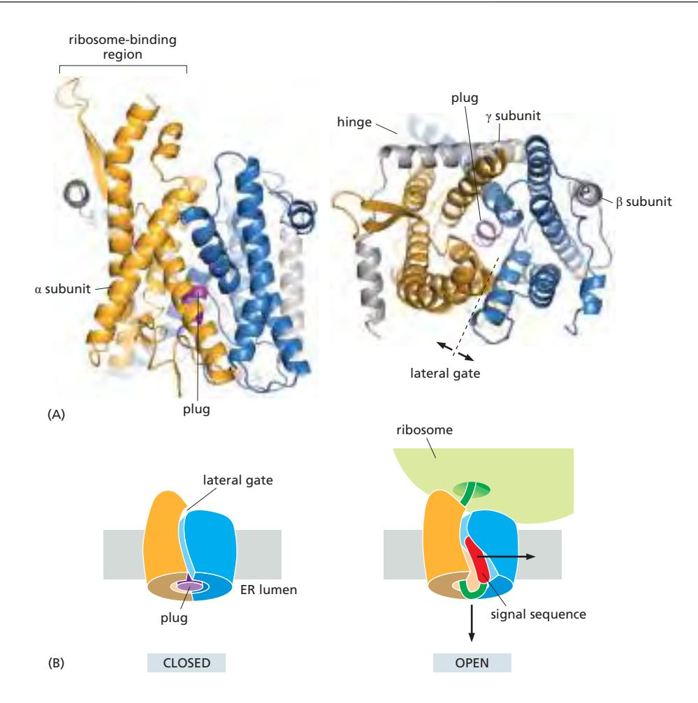

Figure 12–22 Structure of the Sec61 translocator. (A) A side view (*left*, seen from the membrane) and a top view (*right*, seen from the cytosol) of the structure of the Sec61 translocator of the archaeon *Methanococcus jannaschii* (where it is called the SecY translocator). The Sec61 α subunit has an inverted repeat structure (see Figure 11–10) and is shown in *blue* and *orange* to indicate this pseudosymmetry; the two smaller β and γ subunits are shown in *gray*. Some regions of the Sec61 α subunit that protrude into the cytosol bind to the ribosome during protein translocation. The *purple* short helix forms a plug that seals the pore when the translocator is closed. When the translocator is open, the plug helix moves out of the way. The Sec61/ SecY translocator can also open sideways toward the membrane at a lateral gate. (B) Models of the closed and functionally active states of the Sec61/SecY translocator. In the active state, a protein chain can either translocate across the membrane through the central channel in the translocator or move sideways into the lipid bilayer through the lateral gate. (A, PDB code: 1RH5.)

allowed to enter. **Cryo-electron microscopy** structures of the Sec61 translocator before and after signal sequence recognition show that the signal sequence wedges into a lateral gate, or seam, in Sec61 with its N-terminus facing the cytosol (**Figure 12–23A**). Insertion of the signal sequence at this lateral gate widens the central channel and releases the plug. The open translocator then readily accommodates the segment of polypeptide following the signal sequence inside the channel. The signal sequence, which is hydrophobic, laterally exits the gate into the membrane where it is cleaved off by signal peptidase and then rapidly degraded to amino acids by other proteases in the ER membrane and cytosol. As this mechanism illustrates, the lateral gate in the Sec61 translocator provides the access route from Sec61's central channel into the hydrophobic core of the membrane. In addition to its role in recognition of signal sequences, the lateral gate guides the integration of transmembrane proteins into the ER, as we discuss later. MBoC7 m12.39/12.22

Once the signal sequence has opened the Sec61 translocator and threaded the ensuing polypeptide into the channel, translocation occurs concurrently with continued translation. During translocation, the polypeptide tunnel inside the ribosomal large subunit is aligned with the channel within the Sec61 translocator (**Figure 12–23B**). This configuration provides a continuous path for the polypeptide from the peptidyl-transferase center in the ribosome, where new amino acids are added to the growing protein chain, to the ER lumen 15 nm away. In this way, the energy used for polypeptide elongation is indirectly harnessed to also drive translocation across the ER membrane.

When translation terminates, the C-terminus of the polypeptide is released from the ribosome and slips through the Sec61 translocator, whose plug returns to close the channel. Thus, the entire process of ER import, from signal sequence recognition by SRP to translocation through the Sec61 translocator, occurs co-translationally before the polypeptide has a chance to fold. This pathway provides one solution

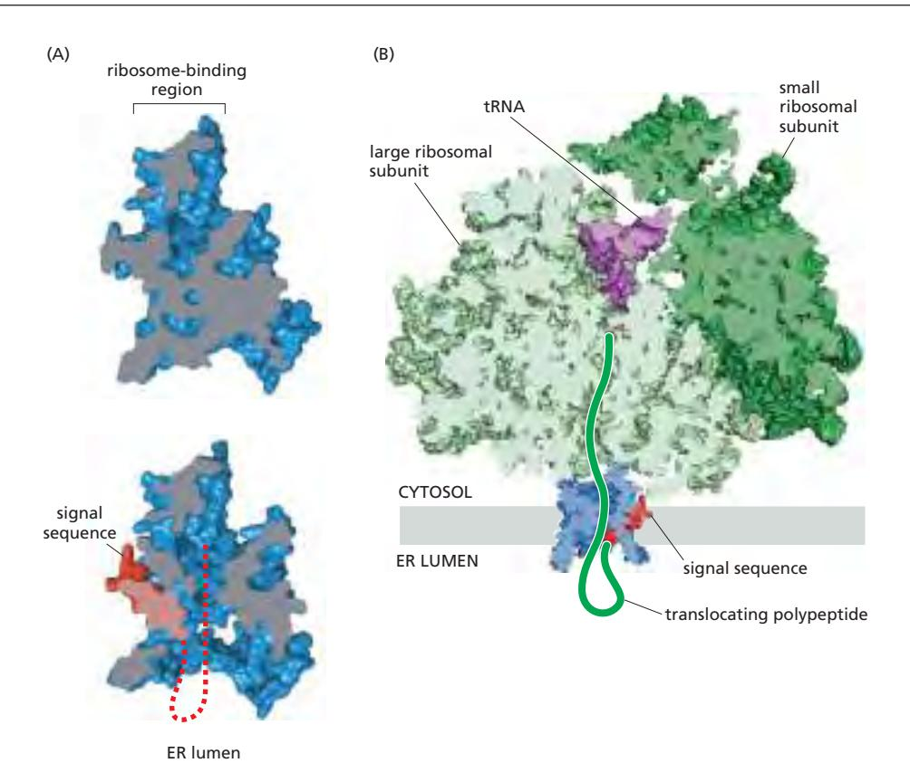

Figure 12–23 A signal sequence opens the Sec61 translocator. (A) Cross section through the Sec61 translocator before and after a signal sequence has inserted into the lateral gate. Insertion of the signal sequence causes the central channel in the translocator to widen and the plug to move out of this channel; hence, a continuous path across the membrane is now apparent *(dashed line)*. (B) Cross section through the structure of a translating ribosome *(green)* bound to a Sec61 translocator *(blue)* that has been opened by a signal sequence *(red)*. A translocating polypeptide is shown passing through the tunnel within the large ribosomal subunit and the Sec61 translocator. (A, PDB codes: 3J7Q and 3JC2; B, PDB code: 3JC2.)

to the problem of how to move a large protein across a membrane barrier without leakage of much smaller ions and metabolites during the process.

#### Translocation Across the ER Membrane Does Not Always Require Ongoing Polypeptide Chain Elongation MBoC7 m12.40/12.23

Some proteins are completely synthesized in the cytosol as precursors before they are imported into the ER, demonstrating that translocation does not always require ongoing translation (**Figure 12–24**). This is termed **post-translational** translocation. Post-translational protein translocation is more common across the yeast ER membrane and the evolutionarily related bacterial plasma membrane. In both cases, the Sec61 translocator (called SecY in bacteria) is used as the

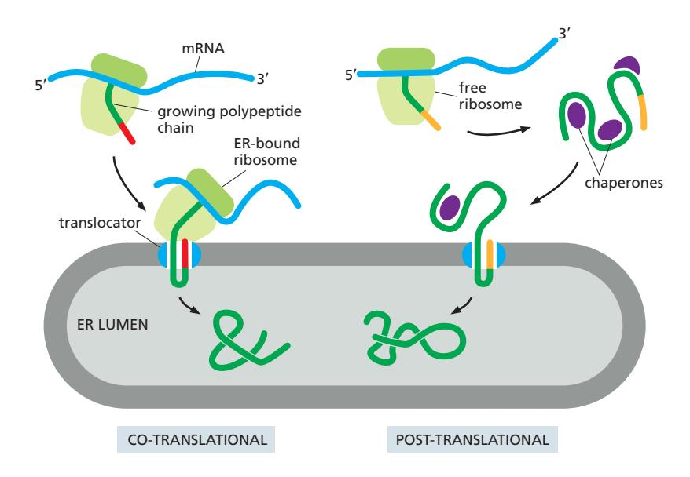

Figure 12–24 Co-translational and post-translational protein translocation. Ribosomes bind to the ER membrane during co-translational translocation. By contrast, cytosolic ribosomes complete the synthesis of a protein and release it prior to post-translational translocation. The released protein is kept unfolded in the cytosol by chaperones that dissociate before the protein is translocated across the membrane. In both cases, the protein is directed to the ER by an ER signal sequence (*red* and *orange*). See Movie 12.3.

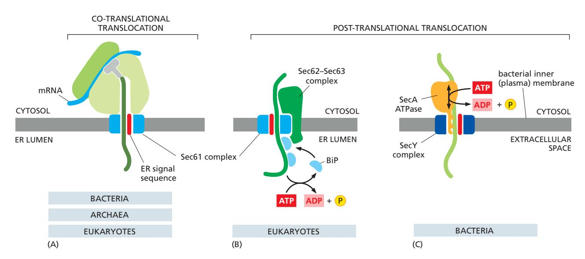

Figure 12–25 Three ways in which protein translocation can be driven through structurally similar translocators. (A) Co-translational translocation. The ribosome is brought to the membrane by the SRP and SRP receptor and then engages with the Sec61 translocator. The growing polypeptide chain is threaded across the membrane as it is made. No additional energy is needed, as the only path available to the growing chain is to cross the membrane. (B) Post-translational translocation in eukaryotic cells requires an additional complex composed of Sec62 and Sec63 proteins. This complex is attached to the Sec61 translocator and positions BiP molecules where they can bind to the translocating chain as it emerges from the translocator in the lumen of the ER. ATP-driven cycles of BiP binding and release pull the protein into the lumen. (C) Post-translational translocation in bacteria. The completed polypeptide chain is fed from the cytosolic side into the bacterial homolog of the Sec61 translocator (called SecY) in the plasma membrane by the SecA ATPase. ATP hydrolysis– driven conformational changes drive a pistonlike motion in SecA. The piston not only pushes several amino acids of the protein chain through the pore of the translocator but also prevents backsliding of the chain into the cytosol. Whereas the Sec61 translocator, SRP, and SRP receptor are found in all organisms, SecA is found exclusively in bacteria, and the Sec62–Sec63 complex is found exclusively in eukaryotic cells. (Adapted from P. Walter and A.E. Johnson, *Annu. Rev. Cell Biol.* 10:87–119, 1994.)

translocator; its narrow channel means that precursors can only be translocated as unfolded polypeptides. Thus, precursor proteins do not fold after their initial synthesis in the cytosol. Instead, they interact with other cytosolic proteins that prevent precursor folding or aggregation before they engage the Sec61 translocator. These interacting proteins typically are general chaperone proteins, such as those of the hsp70 family (discussed in Chapter 6), and must dissociate as the unfolded polypeptide is threaded through the translocator.

Just as in co-translational translocation discussed earlier, the signal peptide of a precursor directly engages the Sec61 translocator to open the channel. However, the next step of translocation across the membrane occurs differently and relies on accessory proteins that use cellular energy to either pull the polypeptide across the channel from the lumenal side or feed it into the channel from the cytosol (**Figure 12–25**). To pull proteins into the ER lumen, eukaryotic cells use accessory proteins called Sec62 and Sec63 that associate with the Sec61 translocator and position an hsp70-like chaperone protein (called *BiP*, for binding protein) adjacent to the lumenal opening of the translocation channel. Like its cytosolic cousin, BiP has a high affinity for unfolded polypeptide chains, and it binds tightly to an imported protein chain as soon as it emerges from the Sec61 translocator in the ER lumen. Tight binding by BiP prevents the protein chain from sliding backwards, favoring more of the chain to emerge into the lumen where it can bind another molecule of BiP. ATP hydrolysis by BiP causes it to release the polypeptide, making it available to bind again to any newly emerged segments of the translocating polypeptide. This energy-driven cycle of binding and release serves as a molecular ratchet that provides the driving force for protein import after a precursor has initially inserted into the Sec61 translocator.

Because bacteria transport proteins directly to the extracellular space, where energy is not available, they use a cytosolic accessory protein called the *SecA*  *ATPase*. SecA binds to the precursor polypeptide and attaches to the cytosolic side of the translocator, where it undergoes cyclic conformational changes fueled by ATP hydrolysis. Each time an ATP is hydrolyzed, a portion of the SecA protein inserts into the pore of the translocator, pushing a short segment of the precursor protein with it. As a result of this pistonlike ratchet mechanism, the SecA ATPase progressively pushes the polypeptide chain of the transported protein across the membrane.

# Transmembrane Proteins Contain Hydrophobic Segments That Are Recognized Like Signal Sequences

All of the transmembrane proteins that populate the ER, Golgi apparatus, lysosomes, endosomes, secretory vesicles, and plasma membrane are inserted into the ER membrane before moving to their final destination. Transmembrane proteins made at the ER span the lipid bilayer via one or more α-helical hydrophobic **transmembrane segments** (see Figure 10–17). Thus, the biosynthesis of membrane proteins requires some parts of the polypeptide chain to be translocated across the lipid bilayer, other parts to remain in the cytosol, and the transmembrane segments to be integrated into the membrane. Despite this additional complexity, the same factors (SRP, SRP receptor, and the Sec61 translocator) just described for transferring a soluble protein into the ER lumen also mediate transmembrane protein integration into the ER membrane. The same factors can be used because the transmembrane segments that define a transmembrane protein resemble the hydrophobic ER signal sequences that direct soluble protein translocation.

In the simplest case, a transmembrane protein contains a single transmembrane segment that will ultimately be embedded in the lipid bilayer as a membrane-spanning α helix. When this transmembrane segment emerges from the ribosome during synthesis, SRP recognizes its hydrophobic α-helical features as a signal sequence and brings this ribosome to the Sec61 translocator at the ER membrane. The transmembrane segment then inserts into the lateral gate of the Sec61 translocator, which is the same site where signal sequences bind. The orientation in which the transmembrane segment inserts into the lateral gate determines whether the protein segment preceding or the one following the transmembrane segment is moved across the membrane into the ER lumen (**Figure 12–26**). If the N-terminus is short and unfolded, orientation of the transmembrane segment depends on features of the polypeptide chain such as the distribution of nearby charged amino acids and the length of the transmembrane segment. If the preceding N-terminal segment is long and stably folded, it does not cross the membrane through the narrow Sec61 channel. In this case, the C-terminal segment that is still being synthesized, and therefore unfolded, is translocated across the membrane.

Figure 12–26 A transmembrane segment directs membrane protein insertion into the ER membrane. Many single-pass membrane proteins use their transmembrane segment to direct insertion into the ER membrane (Movie 12.3). The transmembrane segment is recognized by SRP (not shown) and delivered via the SRP receptor (not shown) to the Sec61 translocator at the ER membrane. The transmembrane segment then inserts into the lateral gate of the Sec61 translocator in one of two orientations. (A) Some transmembrane segments insert into the lateral gate such that the N-terminal domain is retained on the cytosolic side of Sec61. This orientation is favored for proteins whose N-terminal domains are very long or folded, and for transmembrane segments whose flanking amino acids have a net positive charge on the N-terminal side. (B) Some transmembrane segments insert into the lateral gate such that the C-terminal flanking region is retained on the cytosolic side of Sec61. In this case, the N-terminal flanking region is thought to translocate across the membrane through the Sec61 channel. This orientation is favored for transmembrane segments whose flanking amino acids have a net positive charge on the C-terminal side.

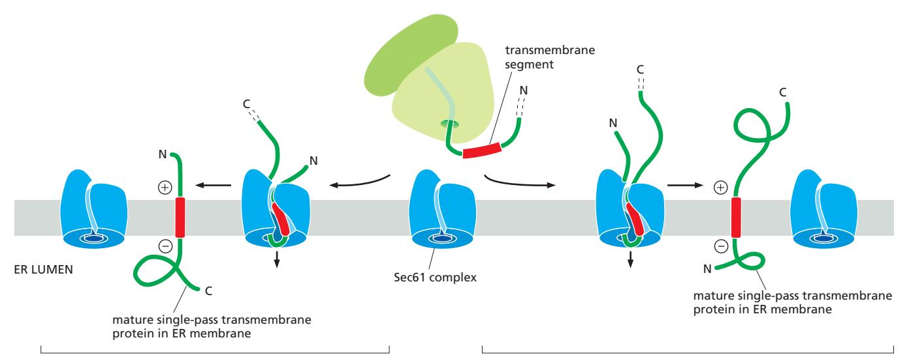

(A) (B)

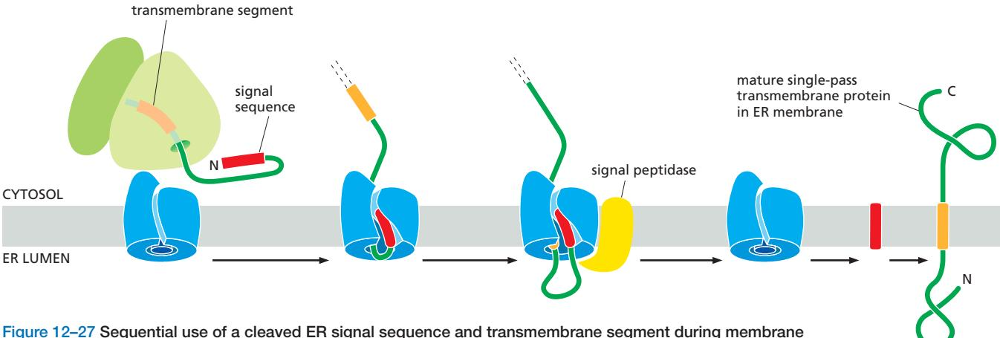

Figure 12–27 Sequential use of a cleaved ER signal sequence and transmembrane segment during membrane protein insertion. Membrane proteins that contain a relatively large N-terminal domain on the lumenal side of the ER utilize both a cleaved ER signal sequence and a transmembrane segment. Targeting to the ER membrane, initiation of translocation through Sec61, and cleavage of the signal sequence all occur exactly as for a secretory protein (see Figure 12–20). However, when the transmembrane segment enters the Sec61 translocator, translocation stops and the transmembrane segment moves through the lateral gate into the lipid bilayer. The remainder of the protein continues to be synthesized on the cytosolic side of the membrane until translation terminates.

Many transmembrane proteins contain large N-terminal lumenal domains. In this case, an N-terminal signal sequence is used to initiate translocation, just as for a soluble protein. In this way, the N-terminus of the mature polypeptide is committed to the ER lumen by the signal sequence, and the remainder of the polypeptide begins translocation through the Sec61 translocator. When a hydrophobic segment in the polypeptide emerges from the ribosome, it inserts into the lateral gate to gain access to the lipid bilayer. Because the hydrophobic segment is more stable in the membrane than in the aqueous channel, it exits the channel laterally, translocation stops, and the rest of the protein is synthesized on the cytosolic side of the ER membrane (**Figure 12–27**). MBoC7 m12.42/12.27

#### Hydrophobic Segments of Multipass Transmembrane Proteins Are Interpreted Contextually to Determine Their Orientation

In multipass transmembrane proteins, the polypeptide chain passes back and forth repeatedly across the lipid bilayer as hydrophobic α helices (see Figure 10–17). Synthesis of multipass transmembrane proteins up to the first transmembrane segment occurs as we have just described for single-pass transmembrane proteins. Hence, SRP will deliver the protein to the translocator, where the first transmembrane segment will insert into the lateral gate of the Sec61 translocator in an orientation dictated by features of the preceding N-terminal domain and nearby charged amino acids. In this way, insertion of the first transmembrane segment into the membrane effectively locks in the topology for the rest of the protein to come. From this point onward, each successive hydrophobic segment is interpreted by the Sec61 translocator on the basis of the topology and properties of the preceding parts of the protein.

Because of the tight coupling between the ribosome and Sec61 translocator, each hydrophobic segment emerges very close to the lateral gate that provides access to the lipid bilayer. In the simplest cases, the newly emerged hydrophobic segment engages the lateral gate in an orientation opposite to the most recently inserted transmembrane segment and inserts into the lipid bilayer (**Figure 12–28**). Some transmembrane segments of multipass proteins are only partially hydrophobic and would not be stable in the lipid bilayer on their own. These can nevertheless insert into the membrane if they are able to interact with one of the preceding transmembrane segments that is near the lateral gate of Sec61. This cooperation makes it possible to produce multipass transmembrane proteins that contain hydrophilic parts within the lipid bilayer, which is crucial

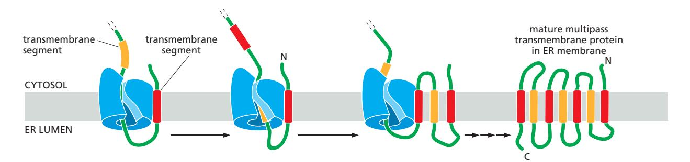

Figure 12–28 The insertion of a multipass transmembrane protein into the ER membrane. The events up to the insertion of the first transmembrane segment follow the steps for single-pass membrane proteins (see Figures 12–26 and 12–27). The orientation of this first transmembrane segment depends on the characteristics of the transmembrane segment and flanking regions just as for single-pass membrane proteins. When the next transmembrane segment emerges from the ribosome, it inserts into the lateral gate of Sec61 in an orientation opposite to that of the first transmembrane segment, then moves into the lipid bilayer. Each successive transmembrane segment is similarly inserted into the membrane via the lateral gate in an orientation opposite to that of the transmembrane segment that immediately preceded it. This proceeds until all transmembrane segments have been inserted into the membrane.

for many important proteins such as transporters and channels (discussed in Chapter 11). The hydrophilic sequences between the transmembrane segments are either synthesized into the cytosol or threaded through the Sec61 translocator, depending on the orientation of the preceding transmembrane segment. In this way, a multipass protein is woven into the membrane with successive hydrophobic segments achieving opposite orientations until all of them have been inserted into the membrane as transmembrane α helices. MBoC7 m12.44/12.28

Because membrane proteins are always inserted from the cytosolic side of the ER in this programmed manner, all copies of the same polypeptide chain will have the same orientation in the lipid bilayer. This generates an asymmetrical ER membrane in which the protein domains exposed on one side are different from those exposed on the other side. This asymmetry is maintained during the many membrane budding and fusion events that transport the proteins made in the ER to other cell membranes (discussed in Chapter 13). Thus, the way in which a newly synthesized protein is inserted into the ER membrane determines the orientation of the protein in all of the other membranes as well.

#### Some Proteins Are Integrated into the ER Membrane by a Post-translational Mechanism

Many important cytosol-facing membrane proteins are anchored in the membrane by a single transmembrane α helix very close to the C-terminus. These **tail-anchored proteins** include a large number of SNARE protein subunits that guide vesicular traffic (discussed in Chapter 13). When a tail-anchored protein is translated, the ribosome reaches the termination codon while the polypeptide sequence destined to become a transmembrane α helix is still inside the ribosome exit tunnel. Recognition by SRP is therefore not possible, and the protein is released from the ribosome into the cytosol. The hydrophobic segment is recognized by a specialized chaperone complex that transfers it to a targeting factor called Get3 (**Figure 12–29**). Although unrelated to SRP, Get3 also contains a hydrophobic pocket lined by many methionine side chains to help it recognize diverse hydrophobic segments independent of their exact sequence. Two proteins at the ER membrane called Get1 and Get2 serve not only as the receptor for Get3 but also as the translocator that inserts the hydrophobic segment of the tail-anchored protein into the lipid bilayer. This post-translational targeting mechanism is therefore conceptually similar to SRP-dependent protein targeting (see Figure 12–20). Some tail-anchored proteins are targeted to mitochondria or peroxisomes instead of the ER, but the mechanism of their targeting is not known.

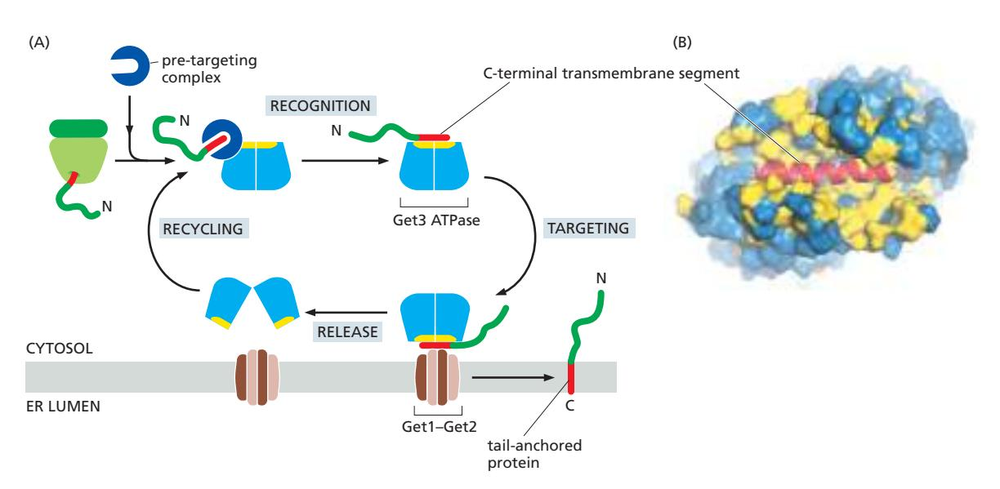

Figure 12–29 The insertion mechanism for tail-anchored proteins. (A) In this post-translational pathway for the insertion of tail-anchored membrane proteins into the ER, a soluble pre-targeting complex captures the hydrophobic C-terminal transmembrane segment *(red)* after it emerges from the ribosomal exit tunnel and loads it onto the Get3 targeting factor. The resulting complex is targeted to the ER membrane by interaction with the Get1–Get2 receptor complex, which functions as a membrane protein insertion machine. After the tail-anchored protein is released from Get3 and inserted into the ER membrane, Get3 is recycled back to the cytosol. This targeting cycle is conceptually similar to protein targeting by SRP (see Figure 12–20). Although not shown in the figures, both Get3 and SRP bind and hydrolyze nucleoside triphosphates to provide directionality to the targeting cycle. ATP is used by Get3, and GTP is used by SRP. (B) Crystal structure of the Get3 targeting factor bound to a transmembrane segment *(red helix)*. The hydrophobic transmembrane segment binds to a deep groove in Get3 lined by hydrophobic amino acids *(yellow)*, including many flexible methionines. (PDB code: 4XTR.) MBOC7 m12.46/12.29

#### Some Membrane Proteins Acquire a Covalently Attached Glycosylphosphatidylinositol (GPI) Anchor

Another way that proteins are attached to the membrane is by a **glycosylphosphatidylinositol (GPI) anchor** that is covalently linked to the C-terminus of some proteins destined for the plasma membrane. GPI-anchored proteins are initially made with an N-terminal signal sequence to direct them to the ER and a hydrophobic segment very close to the C-terminus. This hydrophobic segment is selectively recognized by a transamidase enzyme in the ER membrane that simultaneously cleaves off the hydrophobic segment and attaches a preformed GPI anchor to the rest of the protein (**Figure 12–30**). Many plasma membrane proteins are modified in this way. Because they are attached to the exterior of the plasma membrane only by their GPI anchors, they can be released from cells in soluble form in response to signals that activate a specific phospholipase in the plasma membrane. Trypanosome parasites, for example, use this mechanism to shed their coat of GPI-anchored surface proteins when attacked by the immune system. GPI anchors also participate in directing some plasma membrane proteins into specialized domains, such as lipid rafts, thus laterally segregating them from other membrane proteins (see Figure 10–13).

### Translocated Polypeptide Chains Fold and Assemble in the Lumen of the Rough ER

Proteins enter the ER lumen as unfolded polypeptides. They must therefore fold and assemble into their correct three-dimensional structures just as newly made proteins in the cytosol must fold (discussed in Chapter 3). To meet this demand, the lumen of the ER contains a high concentration of resident chaperones and other protein-folding catalysts. These **ER resident proteins** contain an **ER retention signal** of four amino acids at their C-terminus that is responsible for retaining the protein in the ER (see Figure 12–13; discussed in Chapter 13, p. 768).

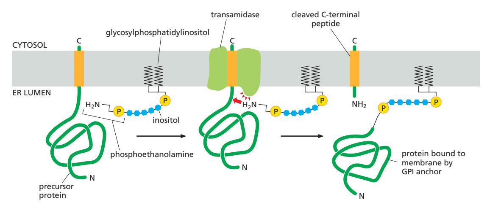

MBoC7 m12.52/12.30 Figure 12–30 The attachment of a GPI anchor to a protein in the ER. GPI-anchored proteins are targeted to the ER membrane by an N-terminal signal sequence (not shown), integrated into the membrane, and processed by signal peptidase similarly to a single-pass transmembrane protein (see Figure 12–27). Immediately after the completion of protein synthesis, the precursor protein remains anchored in the ER membrane by a hydrophobic C-terminal sequence of 15–20 amino acids; the rest of the protein is in the ER lumen. Within less than a minute, a transamidase enzyme in the ER cleaves the protein from its membrane-bound C-terminus and simultaneously attaches the new C-terminus to an amino group on a preassembled GPI intermediate. The sugar chain contains an inositol attached to the lipid from which the GPI anchor derives its name. It is followed by a glucosamine and three mannoses. The terminal mannose links to a phosphoethanolamine that provides the amino group to attach the protein through an amide bond. The signal that specifies this modification is contained within the hydrophobic C-terminal sequence and a few amino acids adjacent to it on the lumenal side of the ER membrane; if this signal is added to other proteins, they too become modified in this way. Because of the covalently linked lipid anchor, the protein remains membrane-bound, with all of its amino acids exposed initially on the lumenal side of the ER and eventually on the exterior of the plasma membrane.

The protein **BiP**, a member of the hsp70 family of chaperone proteins, is a major component of the ER folding machinery. We have already discussed how BiP pulls proteins post-translationally into the ER through the Sec61 ER translocator. Like other chaperones (discussed in Chapter 6), BiP recognizes incorrectly folded proteins, as well as protein subunits that have not yet assembled into their final oligomeric complexes. It does so by binding to exposed hydrophobic amino acid sequences that would normally be buried in the interior of correctly folded or assembled polypeptide chains. The bound BiP both prevents the protein from aggregating and helps keep it in the ER (and thus out of the Golgi apparatus and later parts of the secretory pathway). BiP hydrolyzes ATP to shuttle between highand low-affinity polypeptide-binding states. In this way, BiP periodically lets go of its substrate proteins to allow them an opportunity to fold, and then re-binds them if folding is not yet achieved.

The ER resident protein *protein disulfide isomerase* (*PDI*) catalyzes the oxidation of free sulfhydryl (SH) groups on cysteines to form disulfide (S}S) bonds (**Figure 12–31**). Almost all cysteines in protein domains exposed to either the

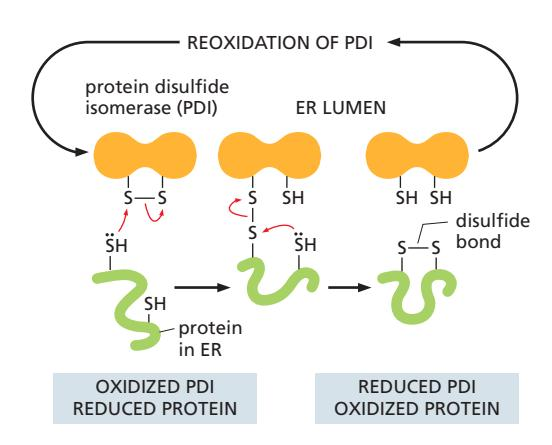

Figure 12–31 The formation of disulfide bonds in the ER. Proteins that contain free sulfhydryl (SH) groups on cysteines are oxidized during protein folding to incorporate disulfide (S}S) bonds. Protein disulfide isomerase (PDI) contains an intramolecular disulfide bond that accepts electrons from a free sulfhydryl group in the substrate protein to be oxidized. This leads to the formation of an intermolecular mixed disulfide bond between PDI and its substrate. A second free sulfhydryl group in the substrate then donates its electrons to the mixed disulfide bond, resulting in an oxidized substrate and reduced PDI. Reoxidation of PDI is carried out by other ER enzymes (not shown).

extracellular space or the lumen of organelles in the secretory and endocytic pathways are disulfide bonded. Disulfide bonds stabilize the folded state of a protein, enabling it to better withstand a harsh, variable, and chaperone-free extracellular environment. Because proteins often contain multiple cysteines, they sometimes pair incorrectly. PDI resolves this problem by rearranging the disulfide bonds in a protein until it is correctly folded. This is possible because PDI enzymes are capable of operating in reverse to reduce incorrectly paired disulfides of immature proteins. The ER lumen contains multiple members of the PDI family, some of which are specialized for reducing disulfide bonds to fully unfold misfolded proteins that need to be translocated back to the cytosol for degradation (discussed later). All PDI enzymes are therefore oxidoreductases that can catalyze either the formation or breakage of disulfide bonds in their client proteins. The formation of disulfide bonds relies on maintaining an oxidizing environment in the ER lumen. Disulfide bonds form only very rarely in domains exposed to the cytosol because of the reducing environment there.

# Most Proteins Synthesized in the Rough ER Are Glycosylated by the Addition of a Common *N*-Linked Oligosaccharide

The covalent addition of oligosaccharides to proteins is one of the major biosynthetic functions of the ER. About half of the soluble and membrane-bound proteins that are processed in the ER—including those destined for transport to the Golgi apparatus, lysosomes, plasma membrane, or extracellular space—are **glycoproteins** that are modified in this way. Some proteins in the cytosol and nucleus are also glycosylated, but not with large oligosaccharides: they instead carry a much simpler sugar modification, in which a single *N*-acetylglucosamine group is added to a serine or threonine of the protein.

During the most common form of **protein glycosylation** in the ER, a preformed *precursor oligosaccharide* (containing 14 sugars composed of 2 *N*acetylglucosamines, 9 mannoses, and 3 glucoses) is transferred as a complete unit to proteins. Because this oligosaccharide is transferred to the side-chain NH2 group of an asparagine in the protein, it is said to be *N-linked*, or *asparagine-linked* (**Figure 12–32A**). A special lipid molecule called **dolichol** (see Panel 2–5, pp. 102–103) anchors the precursor oligosaccharide in the ER membrane. The precursor oligosaccharide is transferred to the target asparagine in a single enzymatic step by an **oligosaccharyl transferase**. This membrane-bound enzyme associates with the Sec61 translocator and has its active site exposed on the lumenal side

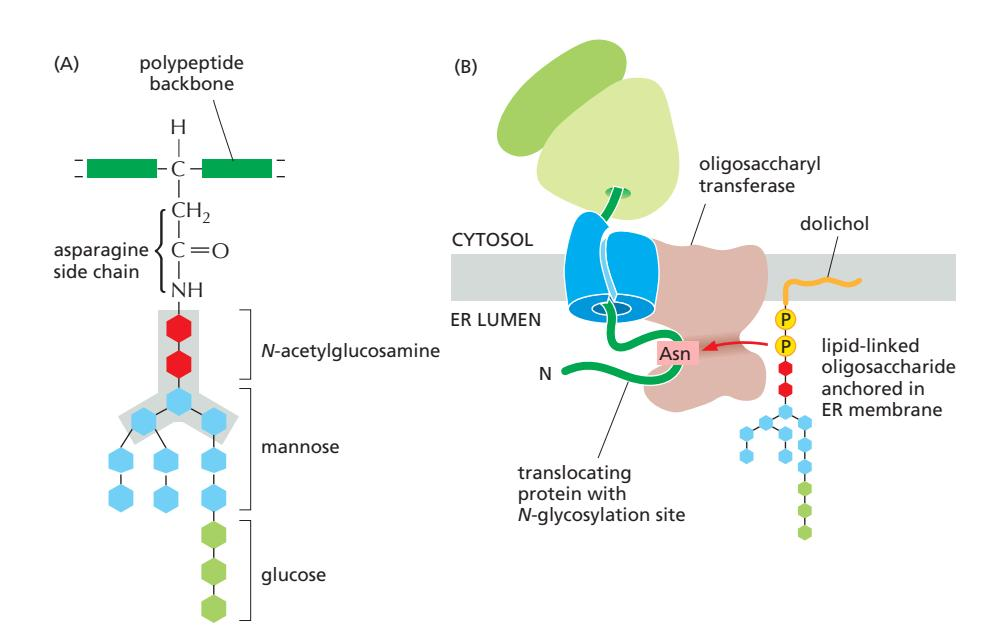

#### Figure 12–32 *N*-linked protein glycosylation in the rough ER.

(A) Almost as soon as a polypeptide chain enters the ER lumen, it is glycosylated on target asparagine amino acids. The precursor oligosaccharide (shown in color) is attached only to asparagine side chains in the sequences Asn-X-Ser and Asn-X-Thr (where X is any amino acid except proline). These sequences occur much less frequently in glycoproteins than in nonglycosylated cytosolic proteins. Evidently there has been selective pressure against these sequences during protein evolution, presumably because glycosylation at inappropriate sites would interfere with protein folding. The five sugars in the *gray box* form the core region of this oligosaccharide. For many glycoproteins, only the core sugars survive the extensive oligosaccharide trimming that takes place in the Golgi apparatus (Movie 13.4). (B) The precursor oligosaccharide is transferred from a dolichol lipid anchor to the asparagine as an intact unit in a reaction catalyzed by a transmembrane *oligosaccharyl transferase* enzyme complex. One copy of this enzyme is associated with each protein translocator in the ER membrane. Oligosaccharyl transferase contains 13 transmembrane α helices and a large ER lumenal domain that contains binding sites for the nascent protein and dolichol–oligosaccharide. The asparagine binds a tunnel that penetrates the enzyme interior. There, the amino group of the asparagine is twisted out of the plane that stabilizes the otherwise poorly reactive amide bond, activating it for reaction with the dolichol–oligosaccharide.

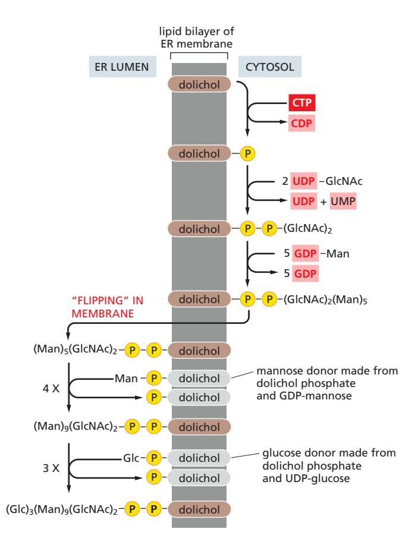

Figure 12–33 Synthesis of the lipidlinked precursor oligosaccharide in the rough ER membrane. The oligosaccharide is assembled sugar by sugar onto the carrier lipid dolichol (a polyisoprenoid; see Panel 2–5, pp. 102–103). Dolichol is long and very hydrophobic: its 22 fivecarbon units can span the thickness of a lipid bilayer more than three times, so that the attached oligosaccharide is firmly anchored in the membrane. The first sugar is linked to dolichol by a pyrophosphate bridge. This high-energy bond activates the oligosaccharide for its eventual transfer from the lipid to an asparagine side chain of a growing polypeptide on the lumenal side of the rough ER. As indicated, the synthesis of the oligosaccharide starts on the cytosolic side of the ER membrane and continues on the lumenal face after the (Man)5(GlcNAc)2 lipid intermediate is flipped across the bilayer by a transporter (which is not shown). All the subsequent glycosyl transfer reactions on the lumenal side of the ER involve transfers from dolichol-P-glucose and dolichol-Pmannose; these activated, lipid-linked monosaccharides are synthesized from dolichol phosphate and UDP-glucose or GDP-mannose (as appropriate) on the cytosolic side of the ER and are then flipped across the ER membrane. GlcNAc = *N-*acetylglucosamine; Man = mannose; Glc = glucose.

of the ER membrane. This allows the oligosaccharyl transferase to modify newly made proteins immediately after the target asparagine enters the ER lumen during protein translocation (**Figure 12–32B**).

The precursor oligosaccharide is built up sugar by sugar on the membranebound dolichol lipid. The sugars are first activated in the cytosol by the formation of *nucleotide (UDP or GDP)-sugar intermediates*, which then donate their sugar first to the dolichol lipid and then to the partially assembled oligosaccharide tree in an orderly sequence. Partway through this process, the lipid-linked oligosaccharide is flipped, with the help of a transporter, from the cytosolic to the lumenal side of the ER membrane (**Figure 12–33**). MBoC7 m12.48/12.33

The *N*-linked oligosaccharides are by far the most common oligosaccharides, being found on 90% of all glycoproteins. Less frequently, oligosaccharides are linked to the hydroxyl group on the side chain of a serine, threonine, hydroxylysine, or hydroxyproline amino acid. The first sugar of these *O-linked oligosaccharides* is added in the ER. *N*-linked and *O*-linked oligosaccharides undergo extensive processing, modification, and extension in the Golgi apparatus (Chapter 13), producing the diversity of oligosaccharide structures observed on mature glycoproteins.

#### Oligosaccharides Are Used as Tags to Mark the State of Protein Folding

It has long been debated why glycosylation is such a common modification of proteins that enter the ER. One particularly puzzling observation has been that some proteins require *N*-linked glycosylation for proper folding in the ER, yet the precise location of the oligosaccharides attached to the protein's surface does not seem to matter. A clue to the role of glycosylation in protein folding came from studies of two ER chaperone proteins, which are called **calnexin** and **calreticulin** because they require Ca2<sup>+</sup> for their activities. These chaperones are carbohydrate-binding proteins, or *lectins*, which bind to oligosaccharides on incompletely folded proteins

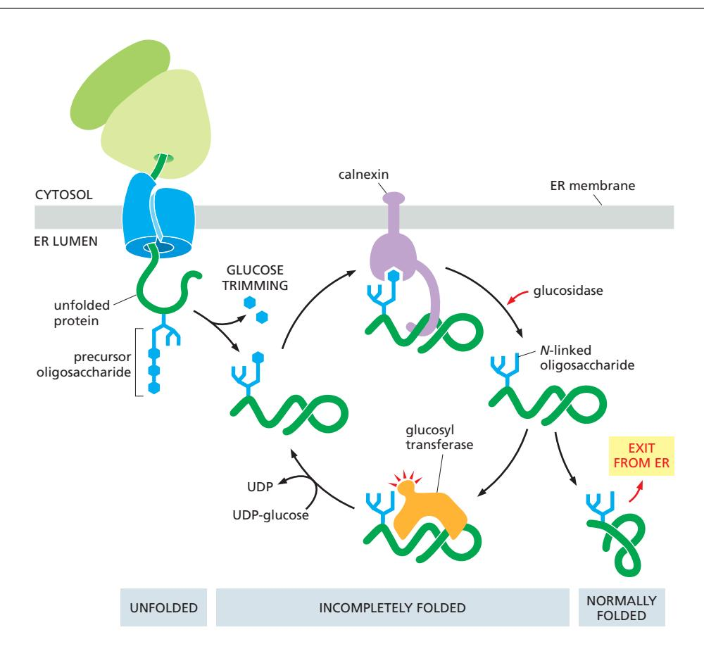

and retain them in the ER. Like other chaperones, they prevent incompletely folded proteins from irreversibly aggregating. Both calnexin and calreticulin also promote the association of incompletely folded proteins with another ER chaperone, which binds to cysteines that have not yet formed disulfide bonds. MBoC7 m12.49/12.34

How do calnexin and calreticulin distinguish properly folded from incompletely folded proteins? The answer lies in the structure of the oligosaccharide attached to the protein. Shortly after a newly made protein acquires an *N*-linked precursor oligosaccharide, ER glucosidases rapidly remove two glucoses, leaving behind a single terminal glucose. This singly glucosylated oligosaccharide is recognized by calnexin and calreticulin, ensuring that all newly made (and hence, likely to be not yet folded) glycoproteins bind to one of these chaperones. This last glucose is removed over time, leaving a de-glucosylated glycoprotein that no longer binds to calnexin or calreticulin. If the glycoprotein is folded, it can leave the ER. However, yet another ER enzyme, a glucosyl transferase, re-adds the terminal glucose selectively to glycoproteins that have not yet folded completely. The terminal glucose then causes re-association of the unfolded protein with calnexin or calreticulin. Thus, glucose trimming (by glucosidases) and glucose addition (by the glucosyl transferase) drive cycles of dissociation and re-association with calnexin and calreticulin until a newly made unfolded protein has achieved its fully folded state (**Figure 12–34**).

#### Improperly Folded Proteins Are Exported from the ER and Degraded in the Cytosol

Despite all the help from chaperones, many protein molecules translocated into the ER fail to achieve their properly folded or oligomeric state. Such proteins are exported from the ER back into the cytosol, where they are degraded in proteasomes (discussed in Chapter 6). In many ways, the mechanism of such retrotranslocation is similar to other post-translational modes of translocation.

#### Figure 12–34 The role of *N*-linked glycosylation in ER protein folding.

The ER membrane–bound chaperone protein calnexin binds to incompletely folded proteins containing one terminal glucose on *N*-linked oligosaccharides, trapping the protein in the ER. Removal of the terminal glucose by a glucosidase releases the protein from calnexin. A glucosyl transferase is the crucial enzyme that determines whether the protein is folded properly or not: if the protein is still incompletely folded, the enzyme transfers a new glucose from UDP-glucose to the *N*-linked oligosaccharide, renewing the protein's affinity for calnexin and retaining it in the ER. The cycle repeats until the protein has folded completely. Calreticulin functions similarly, except that it is a soluble ER resident protein. Another ER chaperone, ERp57 (not shown), collaborates with calnexin and calreticulin in retaining an incompletely folded protein in the ER. ERp57 recognizes free sulfhydryl groups, which are a sign of incomplete disulfide bond formation. The longer a protein spends in this cycle without folding correctly, the more likely it is that ERresident mannosidase enzymes (not shown) remove the terminal mannoses from the *N*-linked oligosaccharide. The trimmed oligosaccharide with reduced mannoses is recognized by other ER lectins that route the polypeptide for degradation. Thus, only proteins that fold promptly and exit the ER avoid trimming by mannosidases and escape degradation.

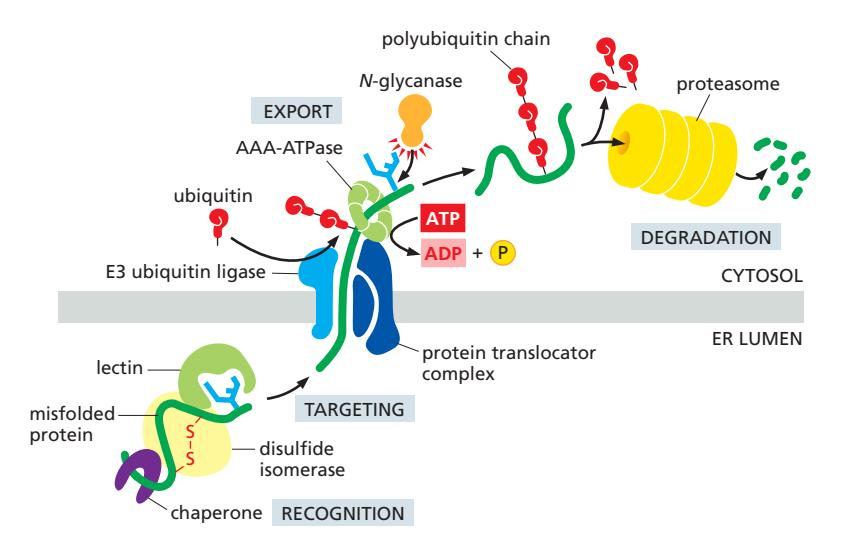

For example, like post-translational import into the ER, chaperone proteins are necessary to keep the polypeptide chain in an unfolded state prior to and during translocation. Similarly, a source of energy is required to provide directionality to the transport and to pull the protein into the cytosol. Finally, a translocator is necessary. MBOC7 m12.50/12.35

Selecting proteins from the ER for degradation is a challenging process: misfolded proteins or unassembled protein subunits should be degraded, but folding intermediates of newly made proteins should not. Help in making this distinction comes from the *N*-linked oligosaccharides, which serve as timers that measure how long a protein has spent in the ER. The slow trimming of a particular mannose on the core oligosaccharide tree by an enzyme (a mannosidase) in the ER creates a new oligosaccharide structure that ER-lumenal lectins of the retrotranslocation apparatus recognize. A protein that folds and exits from the ER faster than the mannosidase can remove its target mannose therefore escapes degradation.

In addition to the lectins in the ER that recognize the oligosaccharides, chaperones and protein disulfide isomerases associate with the proteins that must be degraded. The chaperones prevent the unfolded proteins from aggregating, and the disulfide isomerases break disulfide bonds that may have formed incorrectly, so that a linear polypeptide chain can be translocated back into the cytosol.

Multiple translocator complexes move different proteins from the ER membrane or lumen into the cytosol. Translocator complexes always contain an E3 ubiquitin ligase enzyme (Chapter 6), which attaches polyubiquitin tags to the unfolded proteins as they emerge into the cytosol, marking them for destruction. Fueled by the energy derived from ATP hydrolysis, a hexameric ATPase of the family of AAA-ATPases (see Figure 6–88) pulls the unfolded protein through the translocator into the cytosol. An *N*-glycanase removes *en bloc* any oligosaccharide chains attached to the retrotranslocated protein. Guided by its ubiquitin tag, the de-glycosylated polypeptide is rapidly fed into proteasomes, where it is degraded (**Figure 12–35**).

### Misfolded Proteins in the ER Activate an Unfolded Protein Response

Cells carefully monitor the amount of misfolded protein in various compartments. An accumulation of misfolded proteins in the cytosol, for example, triggers a *heat-shock response* (discussed in Chapter 6), which stimulates the transcription of genes encoding cytosolic chaperones that help to refold the proteins. Similarly, an accumulation of misfolded proteins in the ER triggers an **unfolded** 

#### Figure 12–35 The export and degradation of misfolded ER proteins.

Misfolded soluble proteins in the ER lumen are recognized and targeted to a translocator complex in the ER membrane. They first interact in the ER lumen with chaperones, disulfide isomerases, and lectins. The chaperones maintain the misfolded protein in an unfolded conformation and prevent their aggregation. The disulfide isomerases reduce disulfide bonds to fully unfold the protein. The lectins selectively recognize trimmed *N*-linked oligosaccharides that are generated when a protein spends too long in the ER. The lectins have binding sites on a membrane-embedded protein translocator built around an E3 ubiquitin ligase. The unfolded protein is then exported into the cytosol through the translocator. The E3 ubiquitin ligase ubiquitylates the unfolded protein as it emerges on the cytosolic side of the translocator. The ubiquitin prevents backsliding of the protein into the ER and provides a molecular handle for an AAA-ATPase that completes the extraction reaction. The unfolded protein is then de-glycosylated and degraded in proteasomes. Misfolded membrane proteins follow a similar pathway but are thought to engage the translocator sideways within the lipid bilayer. Multiple translocator complexes containing different E3 ubiquitin ligases reside in the ER. They are thought to handle different subsets of proteins that are misfolded in different ways.

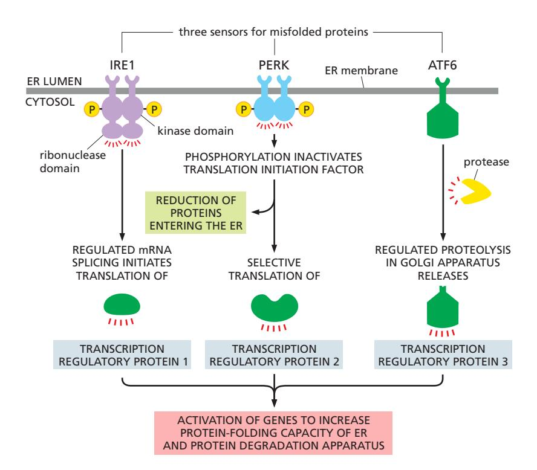

Figure 12–36 The unfolded protein response. Three parallel intracellular signaling pathways sense misfolded proteins in the ER lumen and lead to the activation of transcription in the nucleus. Each pathway begins with an ER-resident sensor of misfolded proteins. When these sensors are activated, they initiate different downstream signaling pathways. Although the downstream mechanisms are very different from each other, all of them culminate with the production of an active transcription factor. The overlapping targets of the transcription factors produce gene products that improve the proteinprocessing capacity of the ER and increase the protein degradation capacity of the cell.

**protein response**, which stimulates transcription of genes that collectively improve the protein-folding capacity of the ER. The stimulated genes code for ER chaperones, the machinery for protein retrotranslocation and degradation, factors for protein transport out of the ER, and factors for expansion of the ER. This multipronged response operates by coupling the detection of misfolded proteins in the ER lumen to the production of transcription regulatory proteins that enter the nucleus to tune the transcription of hundreds of genes. MBoC7 m12.51a/12.36

How do misfolded proteins in the ER signal to the nucleus? There are three parallel pathways that execute the unfolded protein response (**Figure 12–36**). The first pathway, which was initially discovered in yeast cells, is conserved in all eukaryotic cells and is particularly remarkable. Misfolded proteins in the ER cause IRE1, a transmembrane protein kinase in the ER, to oligomerize and phosphorylate itself. This mechanism of activation is similar to how some cell-surface receptor kinases in the plasma membrane are activated (discussed in Chapter 15). Oligomeric and phosphorylated IRE1 enables its cytosolic endoribonuclease domain to remove an intron from a specific cytosolic mRNA molecule. IRE1 accomplishes this task by cleaving the mRNA at two positions that are then joined together by an RNA ligase. The mRNA produced by this splicing reaction is translated to produce an active transcription regulatory protein that increases expression of a subset of the genes of the unfolded protein response (**Figure 12–37**). The regulated splicing of a cytosolic mRNA by IRE1 is a unique exception to the rule that all mRNA splicing occurs in the nucleus and is catalyzed by the spliceosome.

Misfolded proteins also activate a second transmembrane kinase in the ER, PERK. The target of activated PERK is a translation initiation protein whose phosphorylation has two consequences. First, translation of new proteins is reduced throughout the cell, thereby reducing the load of proteins that need to be folded in the ER. Second, some proteins are preferentially translated when translation initiation factors are scarce, and one of these is a transcription regulator that helps activate the transcription of the genes that execute the unfolded protein response.

Finally, a third transcription regulator, ATF6, is initially synthesized as a transmembrane ER protein. Because it is embedded in the ER membrane, it cannot

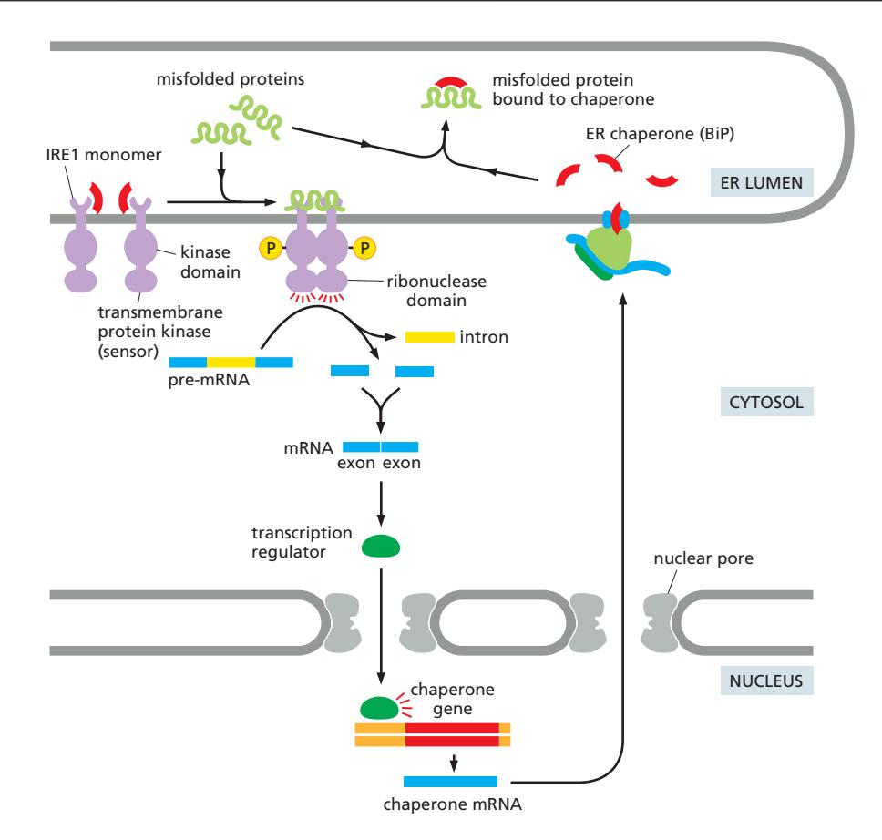

Figure 12–37 The IRE1 limb of the unfolded protein response. Regulated RNA splicing is a key regulatory switch in the unfolded protein response pathway initiated by IRE1 (Movie 12.4). During normal conditions, IRE1 is maintained in an inactive state by its association with the ER-lumenal chaperone BiP. Elevated levels of misfolded proteins activate IRE1 by a combination of two mechanisms. First, BiP dissociates from IRE1 to bind and protect misfolded proteins from aggregation. Second, misfolded proteins bind to the lumenal domain of IRE1 facilitating the formation of IRE1 oligomers. The oligomerized IRE1 phosphorylates itself on the cytosolic side, activating its ribonuclease domain. The activated ribonuclease catalyzes the splicing of a premRNA that codes for a transcription factor that ultimately activates numerous genes in the nucleus including those coding for chaperones. Elevated chaperones help reduce the level of misfolded proteins in the ER lumen, eventually turning off IRE1 signaling.

activate the transcription of genes in the nucleus. When misfolded proteins accumulate in the ER, the ATF6 protein is transported to the Golgi apparatus. Resident proteases in the Golgi apparatus membrane cleave off the cytosolic domain of ATF6, which can now migrate to the nucleus and help activate the transcription of genes encoding proteins involved in the unfolded protein response. This mechanism of activation of a latent membrane-embedded transcription factor is similar to how the transcription regulator that controls cholesterol biosynthesis is activated (discussed later in this chapter). The relative importance of each of these three pathways in the unfolded protein response differs in different cell types, enabling each cell type to tailor the unfolded protein response to its particular needs. MBoC7 m12.51b/12.37

The signaling pathways that execute the unfolded protein response are used during normal physiological conditions to adjust ER capacity to closely match demand for the ER. For example, insulin production increases substantially in pancreatic β cells in response to eating a meal. The elevated demand for the processing capacity of the ER, where insulin is initially assembled, partially activates PERK so cells can adjust insulin synthesis rates to avoid overburdening the ER. In another example, IRE1 is activated when B cells begin differentiating into antibody-secreting plasma cells. IRE1 activation dramatically expands the ER content of the cell in preparation for the very high levels of immunoglobulins that will soon be assembled there.

The unfolded protein response ultimately increases the production of proteins that improve protein processing in the ER and reduce the burden of misfolded proteins. As homeostasis is restored, the activities of IRE1, PERK, and ATF6 abate. If homeostasis cannot be restored, persistently active signaling from the ER, particularly via PERK, activates genes that initiate apoptosis. In multicellular organisms, it is often less detrimental to eliminate a persistently dysfunctional cell than risk its aberrant interactions with neighboring cells.

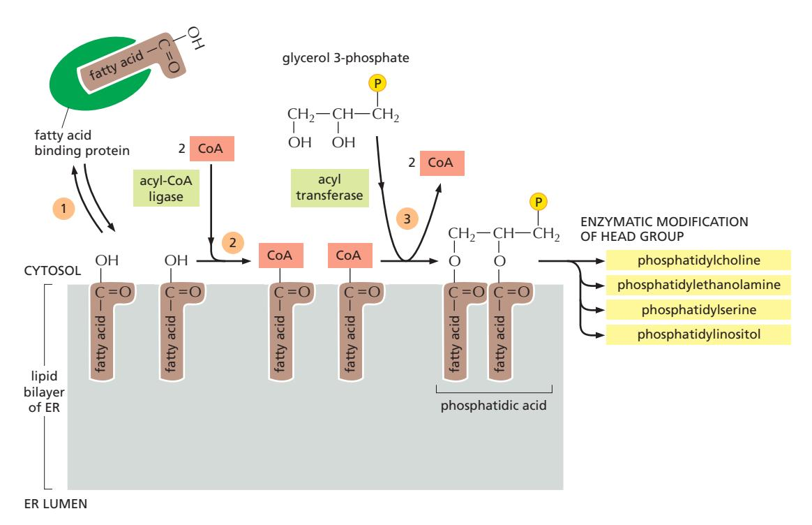

Figure 12–38 The synthesis of phospholipids at the ER membrane. As illustrated, fatty acids delivered to the ER by a cytosolic fatty acid binding protein are linked to glycerol 3-phosphate to produce phosphatidic acid, which serves as a precursor to make other phospholipids that differ in the structures of their polar head groups.

#### The ER Assembles Most Lipid Bilayers

The ER membrane is the site of synthesis of nearly all of the cell's major classes of lipids, including both phospholipids and cholesterol, required for the production of new cell membranes. The major phospholipid made is *phosphatidylcholine*, which can be formed in three steps from choline, two fatty acids, and glycerol phosphate (**Figure 12–38**). Each step is catalyzed by enzymes in the ER membrane, which have their active sites facing the cytosol, where all of the required metabolites are found. Thus, phospholipid synthesis occurs exclusively in the cytosolic leaflet of the ER membrane. Because fatty acids are not soluble in water, they are shepherded from their sites of synthesis in the cytosol to the ER by a fatty acid binding protein. After arrival in the ER membrane and activation with CoA, acyl transferases successively add two fatty acids to glycerol phosphate to produce phosphatidic acid. Phosphatidic acid is sufficiently water-insoluble to remain in the lipid bilayer; it cannot be extracted from the bilayer by the fatty acid binding proteins. It is therefore this first step that enlarges the ER lipid bilayer. The later steps determine the head group of a newly formed lipid molecule and therefore the chemical nature of the bilayer, but they do not result in net membrane growth. The two other major membrane phospholipids—phosphatidylethanolamine and phosphatidylserine (see Figure 10–3)—as well as the minor phospholipid phosphatidylinositol (PI), are all synthesized in this way.

Because phospholipid synthesis takes place in the cytosolic leaflet of the ER lipid bilayer, there needs to be a mechanism that transfers some of the newly formed phospholipid molecules to the lumenal leaflet of the bilayer. In synthetic lipid bilayers, lipids do not "flip-flop" in this way (see Figure 10–10). In the ER, however, phospholipids equilibrate across the membrane within minutes, which is almost 100,000 times faster than can be accounted for by spontaneous "flipflop." This rapid trans-bilayer movement is mediated by a poorly characterized phospholipid translocator called a *scramblase*, which nonselectively equilibrates

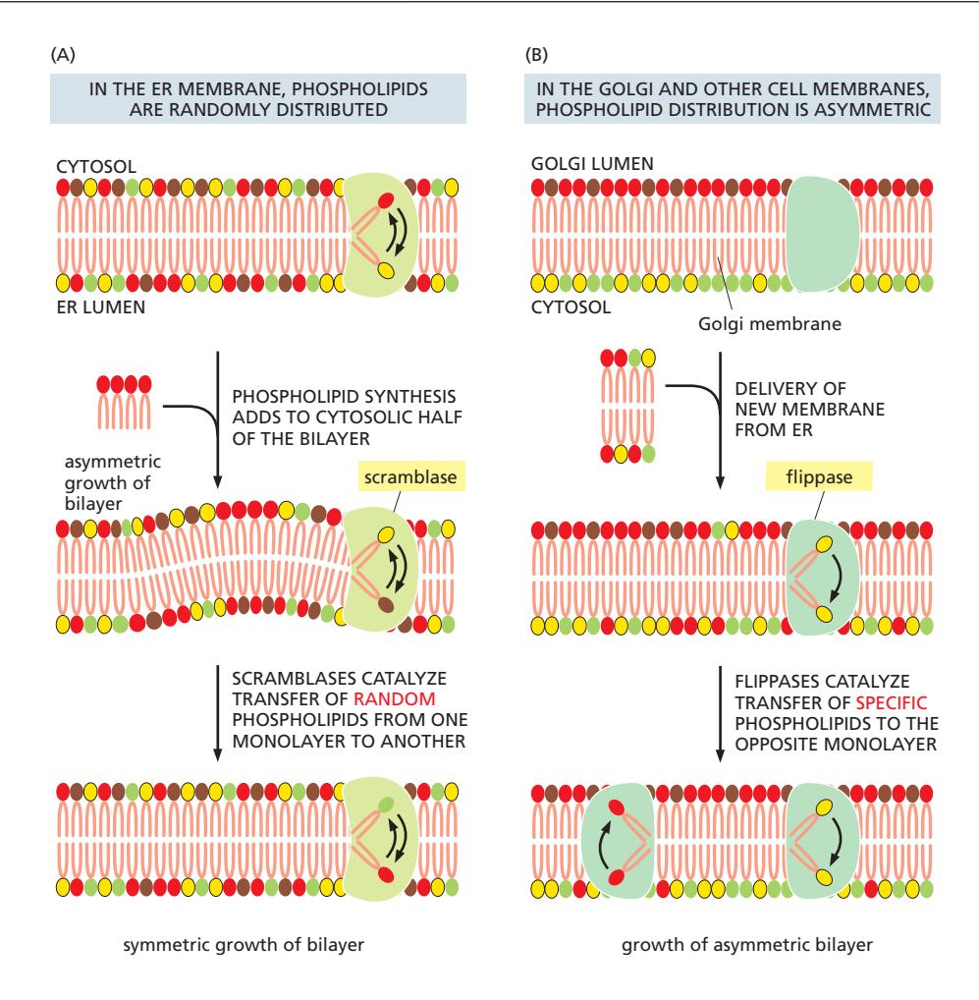

(A) Because new lipid molecules are added only to the cytosolic half of the ER membrane bilayer and lipid molecules do not flip spontaneously from one monolayer to the other, a transmembrane phospholipid translocator (called a scramblase) is required to transfer lipid molecules from the cytosolic half to the lumenal half so that the membrane grows as a bilayer. The scramblase is not specific for particular phospholipid head groups and therefore equilibrates the different phospholipids between the two monolayers. Scramblases do not need energy to catalyze phospholipid flipping and probably function by providing a

hydrophilic path for passive movement of the phospholipid head group through the hydrophobic interior of the membrane. (B) The membranes of the Golgi apparatus,

Figure 12–39 The role of phospholipid translocators in lipid bilayer synthesis.

cell surface, and other compartments of the secretory and endocytic pathways are asymmetric. When new membrane is delivered via transport vesicles, the incoming lipids must be segregated to the appropriate side of the lipid bilayer to maintain its asymmetry. This is accomplished by enzymes called flippases, which move selective phospholipids unidirectionally from one side of the bilayer to the other. Flippases typically couple the transport of their substrate (the phospholipid head group) to ATP hydrolysis, and are therefore considered active transporters (see Chapter 11).

phospholipids between the two leaflets of the lipid bilayer (**Figure 12–39**). Thus, the different types of phospholipids are thought to be equally distributed between the two leaflets of the ER membrane. MBoC7 m12.54/12.39

The ER also produces cholesterol and ceramide (**Figure 12–40**). *Ceramide* is made by condensing the amino acid serine with a fatty acid to form the amino alcohol *sphingosine* (see Figure 10–3); a second fatty acid is then covalently added to form ceramide. The ceramide is exported to the Golgi apparatus, where it serves as a precursor for the synthesis of two types of lipids. *Glycosphingolipids* (glycolipids; see Figure 10–16) are formed when oligosaccharides are added to ceramide, while *sphingomyelin* (discussed in Chapter 10) results from the addition of phosphocholine. Because glycolipids and sphingomyelin are both produced by enzymes that have their active sites exposed to the lumen of the Golgi apparatus, they are restricted to the noncytosolic leaflet of the lipid bilayers that contain them.

As discussed in Chapter 13, the plasma membrane and the membranes of the Golgi apparatus, lysosomes, and endosomes all form part of a membrane system that communicates with the ER by means of transport vesicles. A large proportion of the lipids that compose the membranes of these organelles is acquired via the membranes delivered by transport vesicles. Despite exchange of membrane lipids through vesicular transport, the lipid composition of each organellar membrane is distinct and contributes to its unique identity and functional properties. This specialization is achieved by a combination of three mechanisms. First, a transport vesicle can have a different lipid composition than the organelle it is departing, thereby delivering only a subset of lipids to its destination. Second, proteins in an organelle's membrane can modify the head groups of certain lipids to change their identity (such as production of sphingomyelin from

OH OH 
$$| CH - CH - CH_2 |$$
| CH NH  $| CH - CH_2 |$ 
| CH C = O  $| CH_2 |$ 
| (CH<sub>2</sub>)<sub>12</sub> (CH<sub>2</sub>)<sub>16</sub> |
| CH<sub>3</sub> CH<sub>3</sub>

Figure 12–40 The structure of ceramide.

Figure 12–41 The spatial relationships between the ER and several organelles within a mouse neuron. A section of the cell body of a neuron in the mouse brain was analyzed by focused ion beam-scanning electron microscopy. (A) The three-dimensional positions of the major organelles reconstructed from the serial electron microscopy images and shown in different colors. The ER *(yellow)* makes close contacts with all major organelles and the plasma membrane. (B) The mitochondria *(green)* from the reconstruction are shown with the areas that contact the ER *(red)*. (A and B, from Y. Wu et al., *Proc. Natl. Acad. Sci. USA* 114:E4859–E4867, 2017.)

ceramide) or use *flippases* to move certain phospholipids from one leaflet of the membrane to the other (Figure 12–39B). Third, specific lipids can be selectively transferred from one membrane to another by nonvesicular transport routes as discussed next.

#### Membrane Contact Sites Between the ER and Other Organelles Facilitate Selective Lipid Transfer

Mitochondria and plastids do not communicate with the ER by vesicular transport, so they require different mechanisms to import many of their lipids from the ER for growth. Carrier proteins in the cytosol called *lipid transfer proteins* ferry individual lipid molecules between membranes, functioning much like fatty acid binding proteins that shepherd fatty acids through the cytosol (see Figure 12–38). In many cases, lipid transfer proteins function at organelle contact sites where the originating and destination membranes are held within ∼10–30 nm of each other by specific junction complexes. Different lipid transfer proteins shuttle phosphatidylcholine and phosphatidylserine from the ER to mitochondria at contact sites. Disruption of the junctional complexes or the lipid transfer proteins impairs lipid import into mitochondria and causes their dysfunction.

The extensive network of the ER participates in contact sites with most other cellular organelles (**Figure 12–41**). As with the ER–mitochondria contact sites (see Figure 12–16), one of the main functions of these other organelle contact sites is to exchange lipids (**Figure 12–42**). Cells contain several families of lipid transfer proteins. Each of these can typically bind one molecule of a specific lipid (or in some cases multiple related lipids) and has additional domains that can interact with specific cellular membranes. In this manner, they serve as shuttling proteins that have distinctive specificities for the donor and acceptor membranes and the lipid they transport. Contact sites between two organellar membranes favor recruitment of the lipid transfer protein that binds these membranes, thereby enhancing the efficiency of lipid exchange. Cholesterol uses a specialized transport system from lysosomes, where it is delivered as cholesterol esters in lipoproteins, to the plasma membrane and other locations in the cell (as we discuss in Chapter 13).

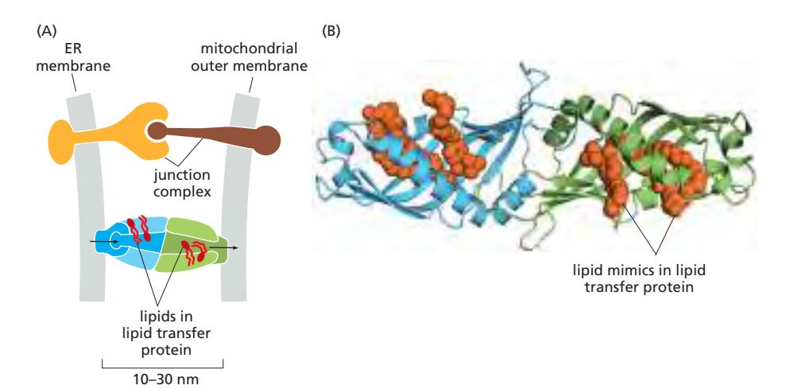

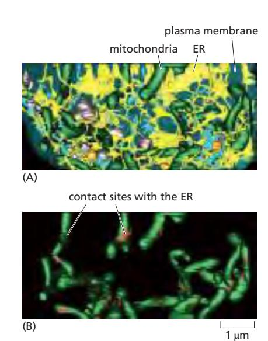

Figure 12–42 The transfer of lipids at organelle contact sites. (A) Proteins anchored to two different membranes (the ER and mitochondrion in the depicted example) interact with each other to hold the membranes 10–30 nm apart. Specialized lipid transfer proteins are recruited to these contact sites or in some cases are part of the junction complex. These transfer proteins have cavities that can bind lipids and facilitate their movement from one membrane to the other. (B) The structure of one such transfer protein is shown with lipid-like molecules bound inside its cavity. (PDB code: 4P42.)

722 Chapter 12: Intracellular Organization and Protein Sorting PEROXISOMES 723

### Summary

*The extensive ER network serves as a factory for the production of almost all of the cell's lipids. In addition, a major portion of the cell's protein synthesis occurs on the cytosolic surface of the rough ER: virtually all proteins destined for secretion or for the ER itself, the Golgi apparatus, the lysosomes, the endosomes, and the plasma membrane are first imported into the ER from the cytosol. In the ER lumen, the proteins fold and oligomerize, disulfide bonds are formed, and N-linked oligosaccharides are added. The pattern of N-linked glycosylation is used to indicate the extent of protein folding, so that proteins leave the ER only when they are properly folded. Proteins that do not fold or oligomerize correctly are translocated back into the cytosol, where they are de-glycosylated, polyubiquitylated, and degraded in proteasomes. If misfolded proteins accumulate in excess in the ER, they trigger an unfolded protein response, which activates appropriate genes in the nucleus to help the ER cope.*

*Only proteins that carry a special ER signal sequence are imported into the ER. The signal sequence is recognized by a signal-recognition particle (SRP), which binds both the growing polypeptide chain and the ribosome and directs them to a receptor protein on the cytosolic surface of the rough ER membrane. This binding to the ER membrane initiates the translocation process that threads a loop of polypeptide chain across the ER membrane through the hydrophilic pore of a protein translocator.*

*Soluble proteins—destined for the ER lumen, for secretion, or for transfer to the lumen of other organelles—pass completely into the ER lumen. Transmembrane proteins destined for the ER or for other cell membranes become anchored in the ER membrane by one or more membrane-spanning* α*-helical segments in their polypeptide chains. As these hydrophobic portions of the protein emerge from the ribosome, they are recognized by the protein translocator, which provides a passageway into the membrane. When a polypeptide contains multiple hydrophobic segments, it will pass back and forth across the bilayer multiple times as a multipass transmembrane protein.*

*The asymmetry of protein insertion and glycosylation in the ER establishes the sidedness of the membranes of all the other organelles that the ER supplies with membrane proteins. Lipids are synthesized at the cytosolic face of the ER, equilibrate between both leaflets of the lipid bilayer, and are transported to other organelles often at interorganelle junctions by lipid transfer proteins localized there. Specific flippases establish and maintain lipid asymmetry in the plasma membrane, further contributing to its sidedness.* 

# PEROXISOMES

**Peroxisomes** are major sites of oxygen utilization and are found in virtually all eukaryotic cells. They contain oxidative enzymes, such as *catalase* and *urate oxidase*, at such high concentrations that, in some cells, the peroxisomes stand out in electron micrographs because of the presence of a crystalloid protein core (**Figure 12–43**). The evolutionary origin of peroxisomes is not firmly established, but they are generally thought to represent a specialized offshoot of the membrane system that composes the secretory and endocytic pathways. One hypothesis is that peroxisomes are a vestige of an ancient organelle that performed all the oxygen metabolism in the primitive ancestors of eukaryotic cells. When the oxygen produced by photosynthetic bacteria first accumulated in the atmosphere, it would have been highly toxic to most cells. Peroxisomes might have lowered the intracellular concentration of oxygen, while also exploiting its chemical reactivity to perform useful oxidation reactions. According to this view, the later development of mitochondria rendered peroxisomes less critical for cellular metabolism because many of the same biochemical reactions—which had formerly been carried out in peroxisomes without producing energy—were now coupled to ATP formation by means of oxidative phosphorylation. The oxidation reactions performed by peroxisomes in present-day cells could therefore partly be those whose functions were not taken over by mitochondria.

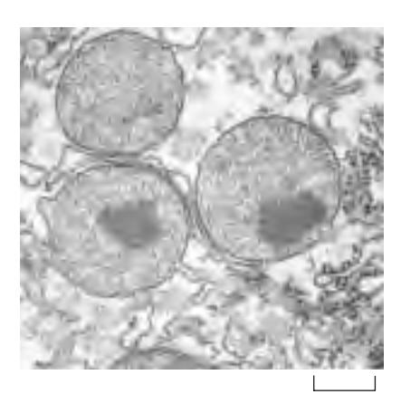

Figure 12–43 An electron micrograph of three peroxisomes in a rat liver cell. The paracrystalline, electron-dense inclusions are composed primarily of the enzyme urate oxidase. (Courtesy of Daniel S. Friend, by permission of E.L. Bearer.)

200 nm

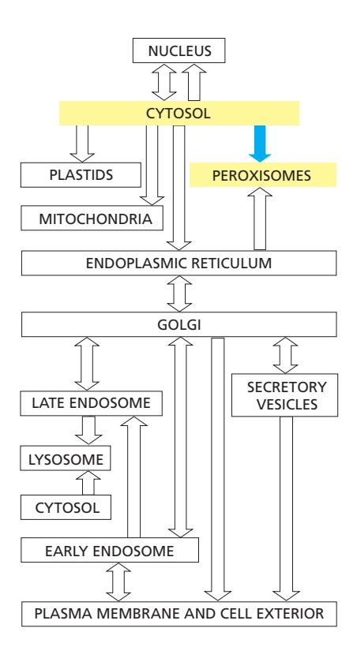

# Peroxisomes Use Molecular Oxygen and Hydrogen Peroxide to Perform Oxidation Reactions

Peroxisomes are so named because they usually contain one or more enzymes that use molecular oxygen to remove hydrogen atoms from specific organic substrates (designated here as R) in an oxidation reaction that produces *hydrogen peroxide* (*H2O2*):

$$RH_2 + O_2 \rightarrow R + H_2O_2$$

*Catalase* uses the H2O2 generated by other enzymes in the organelle to oxidize a variety of substrates—including formic acid, formaldehyde, and alcohol—by the "peroxidation" reaction: H2O2 + R′H2 → R′ + 2H2O. This type of oxidation reaction is particularly important in liver and kidney cells, where the peroxisomes detoxify various harmful molecules that enter the bloodstream. About 25% of the ethanol we drink is oxidized to acetaldehyde in this way. In addition, when excess H2O2 accumulates in the cell, catalase converts it to H2O through the reaction

$$2H_2O_2 \rightarrow 2H_2O + O_2$$

A major function of the oxidation reactions performed in peroxisomes is the breakdown of fatty acid molecules. The process, called *b oxidation*, shortens the alkyl chains of fatty acids sequentially in blocks of two carbon atoms at a time, thereby converting the fatty acids to acetyl CoA. The peroxisomes then export the acetyl CoA to the cytosol for use in biosynthetic reactions. In mammalian cells, β oxidation occurs in both mitochondria and peroxisomes; in fungi and plant cells, however, this essential reaction occurs exclusively in peroxisomes.

An essential biosynthetic function of animal peroxisomes is to catalyze the first reactions in the formation of *plasmalogens*. This abundant class of phospholipids is found in all human cells but is particularly enriched in brain, where it is a major constituent of myelin (**Figure 12–44**). Plasmalogen deficiencies cause profound abnormalities in the myelination of nerve-cell axons, which is one reason why many peroxisomal disorders lead to neurological disease.

Peroxisomes are unusually diverse organelles, and even in the various cell types of a single organism they may contain different sets of enzymes. For example, most plants have two major types of peroxisomes (**Figure 12–45**). One is present in leaves, where it participates in *photorespiration* (discussed in Chapter 14). The other type of peroxisome is present in germinating seeds, where it converts the fatty acids stored in seed lipids into the sugars needed for the growth of the young plant. Because this conversion of fats to sugars is accomplished by a series of reactions known as the *glyoxylate cycle*, these peroxisomes are also called *glyoxysomes*. In the glyoxylate cycle, two molecules of acetyl CoA produced by fatty acid breakdown in the peroxisome are used to make succinic acid, which then leaves the peroxisome and is converted into glucose in the cytosol. The glyoxylate cycle does not occur in animal cells, and animals are therefore unable to convert fats into carbohydrates.

In addition to diversification across different cell types or organisms, peroxisomes can adapt to changing conditions within a cell. Yeasts grown on sugar, for example, have a few small peroxisomes. But when some yeasts are grown on methanol, numerous large peroxisomes are formed that oxidize methanol; and when grown on fatty acids, they develop numerous large peroxisomes that break down fatty acids to acetyl CoA by β oxidation.

#### Short Signal Sequences Direct the Import of Proteins into Peroxisomes

The proteins that compose peroxisomes are delivered by two different routes (**Figure 12–46**). In the first route, some of the integral membrane proteins of the peroxisomal membrane are first inserted into the ER using the ER-resident Sec61 protein translocator. These peroxisome-destined proteins are then packaged into specialized peroxisomal precursor vesicles. New precursor vesicles

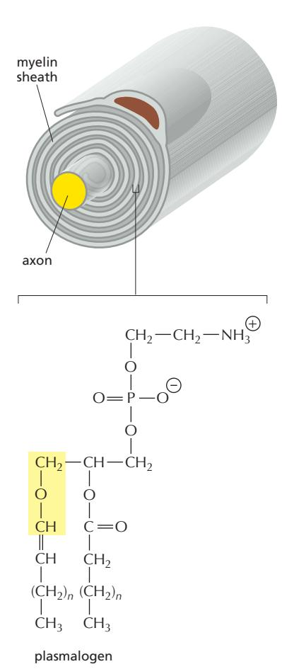

Figure 12–44 The structure of a plasmalogen. Plasmalogens are very abundant in the myelin sheaths that insulate the axons of nerve cells. They make up some 80–90% of the myelin membrane phospholipids. In addition to an ethanolamine head group and a longchain fatty acid attached to the same glycerol phosphate backbone used for phospholipids, plasmalogens contain an unusual fatty alcohol that is attached through an ether linkage highlighted in *yellow (bottom left)*. MBoC7 m12.28/12.44

724 Chapter 12: Intracellular Organization and Protein Sorting PEROXISOMES 725

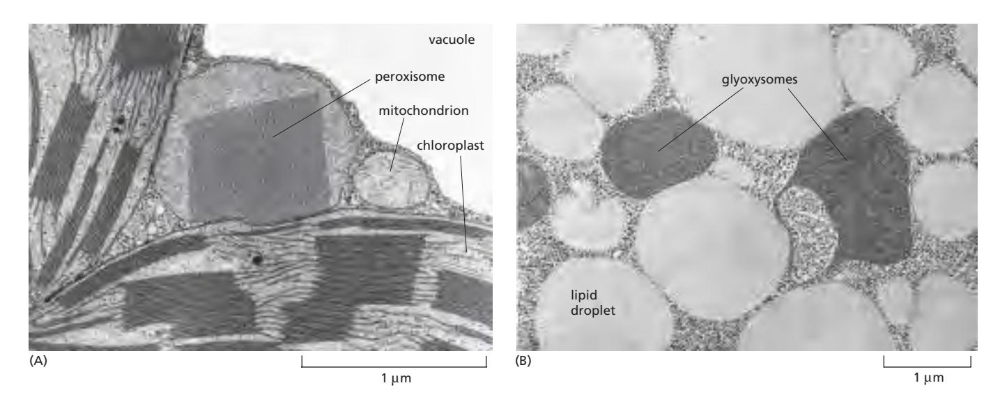

Figure 12–45 Electron micrographs of two types of peroxisomes found in plant cells. (A) A peroxisome with a paracrystalline core in a tobacco leaf mesophyll cell. Its close association with chloroplasts is thought to facilitate the exchange of materials between these organelles during photorespiration. The vacuole in plant cells is equivalent to the lysosome in animal cells. (B) Peroxisomes in a fat-storing cotyledon cell of a tomato seed 4 days after germination. Here the peroxisomes (glyoxysomes) are associated with the lipid droplets that store fat, reflecting their central role in fat mobilization and gluconeogenesis during seed germination. (A, © 1969 S.E. Frederick and E.H. Newcomb. Originally published in *J. Cell Biol.* https://doi.org/10.1083/jcb.43.2.343. With permission from Rockefeller University Press. B, from W.P. Wergin et al., *J. Ultrastruct. Res.* 30:533–557, 1970. With permission from Elsevier.)

then fuse with one another to form a new peroxisome or fuse with an existing peroxisome to facilitate its growth. In the second route, peroxisomal proteins can be imported into preexisting peroxisomes directly from the cytosol. A specific sequence of three amino acids (Ser-Lys-Leu) located at the C-terminus of many peroxisomal proteins functions as an import signal (see Figure 12–13). Other peroxisomal proteins contain a slightly longer and partially hydrophobic signal sequence near the N-terminus. If either sequence is attached to a cytosolic protein, the protein is imported into peroxisomes. MBoC7 m12.29/12.45

Peroxisomal protein import is driven by ATP hydrolysis and utilizes a collection of proteins, called **peroxins**, that catalyze the import cycle. C-terminal peroxisomal sorting signals are recognized by the peroxin Pex5 in the cytosol. This import receptor accompanies its cargo all the way into a protein translocator in the peroxisomal membrane. After cargo release inside the peroxisome, Pex5 is recycled back to the cytosol. This recycling step requires modification of Pex5 with ubiquitin, which is used as a handle by an ATPase complex composed of Pex1 and Pex6. The Pex1–Pex6 complex harnesses the energy of ATP hydrolysis to release Pex5 from peroxisomes so it can pick up the next cargo molecule.

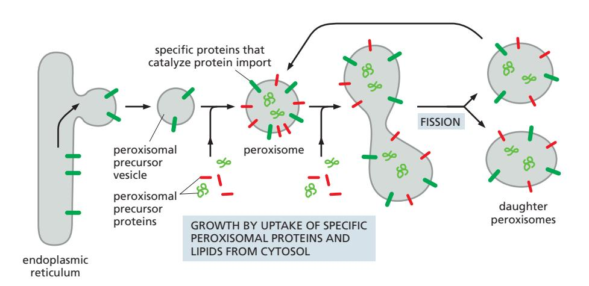

Figure 12–46 A model that explains how peroxisomes proliferate and how new peroxisomes arise. Peroxisomal precursor vesicles bud from the ER. At least two peroxisomal membrane proteins, Pex3 and Pex15, follow this route. The machinery that drives the budding reaction and that selects only peroxisomal proteins for packaging into these vesicles depends on Pex19 and other cytosolic proteins that are still unknown. Peroxisomal precursor vesicles may then fuse with one another or with preexisting peroxisomes. The peroxisomal membrane contains import receptors and protein translocators that are required for the import of peroxisomal proteins made on cytosolic ribosomes, including new copies of the import receptors and translocator components. Presumably, the lipids required for growth are also imported, although some may derive directly from the ER in the membrane of peroxisomal precursor vesicles.

N-terminal peroxisomal signal sequences are recognized by the peroxin Pex7. The Pex7–cargo complex, together with additional accessory peroxins, appear to participate in an import cycle similar to that mediated by Pex5.

The protein translocator in the peroxisomal membrane is composed of at least six different peroxins. Unlike protein translocators in the ER, the peroxisomal translocator can transport fully folded and even oligomeric proteins across the membrane. To allow the passage of large and variably sized cargo molecules, the transporter is thought to dynamically adapt in size to the particular cargo molecules to be transported. It is not known how such a large pore can be utilized for transport without leakage of contents between the cytosol and peroxisome.

The importance of protein import into peroxisomes is demonstrated by the inherited human disease *Zellweger syndrome*. Mutations in any of a dozen different peroxins, the most common being Pex1, cause an impairment in peroxisomal protein import. These individuals, whose cells contain "empty" peroxisomes, accumulate very-long-chain and branched-chain fatty acids that are normally broken down in peroxisomes. Furthermore, they are deficient in plasmalogens. These metabolic impairments cause severe abnormalities in the brain, liver, and kidneys of individuals, and they die soon after birth.

#### Summary

*Peroxisomes are specialized for carrying out oxidation reactions using molecular oxygen. They generate hydrogen peroxide, which they employ for oxidative purposes—and contain catalase to destroy the excess. All peroxisomal proteins are encoded in the cell nucleus. Some of these proteins are conveyed to peroxisomes via peroxisomal precursor vesicles that bud from the ER, but most are synthesized in the cytosol and directly imported. A specific sequence of three amino acids near the C-terminus of many of the latter proteins functions as a peroxisomal import signal that is recognized by a complementary import receptor in the cytosol. Import proceeds through a protein translocator in the peroxisomal membrane, which differs from the protein translocators in the ER in that large and fully folded proteins are imported from the cytosol without unfolding.*

# THE TRANSPORT OF PROTEINS INTO MITOCHONDRIA AND CHLOROPLASTS

Mitochondria and chloroplasts (a specialized form of plastids in green algae and plant cells) are double membrane–enclosed organelles. They specialize in ATP synthesis, using energy derived from electron transport and oxidative phosphorylation in mitochondria and from photosynthesis in chloroplasts (discussed in Chapter 14). Although both organelles contain their own DNA, ribosomes, and other components required for protein synthesis, almost all of their proteins are encoded in the cell nucleus and imported from the cytosol. Each imported protein must reach the particular organelle subcompartment in which it functions.

The different subcompartments in **mitochondria** are formed by the two concentric mitochondrial membranes (**Figure 12–47A**): the **inner mitochondrial membrane**, which encloses the **matrix space** and forms extensive invaginations called *cristae*, and the **outer mitochondrial membrane**, which is in contact with the cytosol. The space between the inner and outer membranes is subdivided into the crista space and **intermembrane space**, with protein complexes at the junctions where the cristae invaginate. Chloroplasts have an outer and inner membrane, which enclose an intermembrane space, and a stroma, which is the chloroplast equivalent of the mitochondrial matrix space (**Figure 12–47B**). They have an additional subcompartment, the *thylakoid space*, which is surrounded by the *thylakoid membrane*. The thylakoid membrane derives from the inner membrane during plastid development and is pinched off to become discontinuous with it. Each of the subcompartments in mitochondria and chloroplasts contains a distinct set of proteins.

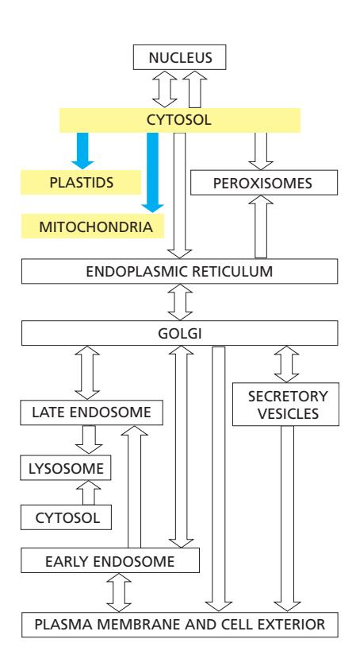

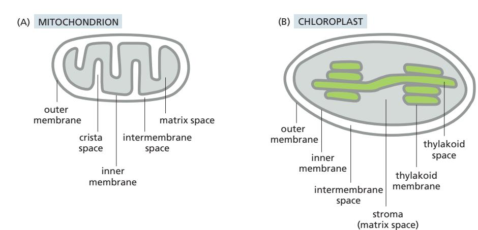

Figure 12–47 The subcompartments of mitochondria and chloroplasts. In contrast to the cristae of mitochondria (A), the thylakoids of chloroplasts (B) are not connected to the inner membrane and therefore form a sealed continuous compartment with a separate internal space.

New mitochondria and chloroplasts are produced by the growth of preexisting organelles, followed by fission (discussed in Chapter 14). The growth depends mainly on the import of proteins from the cytosol. Many of the core principles of protein import into mitochondria and chloroplasts are similar to the analogous process of protein import into the ER we discussed earlier. However, the presence of multiple membranes and subcompartments adds to the complexity of delivering newly imported proteins to the correct location. This section explains how it occurs. MBoC7 m12.19/12.47

# Translocation into Mitochondria Depends on Signal Sequences and Protein Translocators

One or more signal sequences direct all mitochondrial precursor proteins to their appropriate mitochondrial subcompartment. Many proteins entering the matrix space contain a signal sequence at their N-terminus that a signal peptidase rapidly removes after import. Other imported proteins, including all outer membrane and many inner membrane and intermembrane-space proteins, have internal signal sequences that are not removed. The signal sequences are both necessary and sufficient for the import and correct localization of the proteins: when genetic engineering techniques are used to link these signals to a cytosolic protein, the signals direct the protein to the correct mitochondrial subcompartment. Thus, the principles of the signal hypothesis, conceived to explain how proteins are segregated to the ER, also apply to mitochondria.

Multisubunit protein complexes that function as protein translocators mediate protein movement across or into mitochondrial membranes (**Figure 12–48A**). To provide access to each mitochondrial subcompartment, protein translocator complexes are located in both the inner and outer mitochondrial membranes. In general, each translocator has the capacity to recognize particular types of signals and serves as a conduit across or into the membrane within which it resides. Together, these translocators direct ∼1500 different precursor proteins from the cytosol to the appropriate subcompartment of mitochondria: the outer membrane, the intermembrane space and crista space, the inner membrane, and the matrix space.

The organization of signals in a precursor protein ultimately controls which translocator(s) the precursor protein engages and the order in which the signals are used to reach the protein's final destination inside mitochondria. This combinatorial system means that there is sometimes more than one route to reach a particular destination, the same way that different subway lines can take you from Brooklyn to Times Square in New York City. For example, membrane proteins residing in the inner mitochondrial membrane use at least three routes to arrive there. **Figure 12–48B** shows the possible routes to each mitochondrial subcompartment and the translocator complexes that direct proteins there.

The **TOM complex** is required for the import of nearly all nucleus-encoded mitochondrial proteins. It initially recognizes their signal sequences and transports

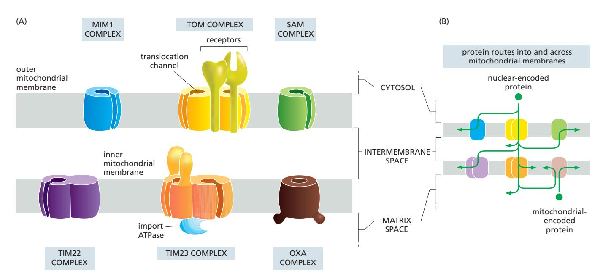

MBoC7 m12.21/12.48 Figure 12–48 The protein translocators in the mitochondrial membranes. (A) The TOM, TIM, SAM, MIM, and OXA complexes are multimeric membrane protein assemblies that catalyze protein translocation across mitochondrial membranes. The protein components of the TIM22 and TIM23 complexes that line the import channel are structurally related, suggesting a common evolutionary origin of both TIM complexes. On the matrix side, the TIM23 complex is bound to a multimeric protein complex containing mitochondrial hsp70, which acts as an import ATPase, using ATP hydrolysis to pull proteins through the pore. In animal cells, subtle variations exist in the subunit composition of the translocator complexes to adapt the mitochondrial import machinery to the particular needs of specialized cell types. (B) Newly made proteins synthesized in the cytosol can use multiple routes to arrive at their final destination. The known routes via the different protein complexes are shown as *green lines*. There are multiple routes for a protein to become embedded into the inner and outer mitochondrial membranes, including one route for mitochondrially encoded proteins synthesized in the matrix space. SAM = sorting and assembly machinery; OXA = cytochrome oxidase activity; TIM = translocator of the inner mitochondrial membrane; TOM = translocator of the outer membrane; MIM = mitochondrial import machinery.

them from the cytosol into the intermembrane space. From here, different mitochondrial proteins follow different itineraries depending on sequence features encoded in the protein. β-Barrel proteins, which are particularly abundant in the outer membrane, are passed to the **SAM complex** for insertion and folding in the outer membrane. Two different **TIM complexes** mediate protein transport at the inner membrane. Matrix proteins use the TIM23 complex for transport, while inner membrane proteins use the TIM22 complex, the TIM23 complex, or the **OXA complex** for insertion. The remainder of proteins stay in the intermembrane space where they function.

In addition to the ∼99% of mitochondrial proteins that must be imported from the cytosol, a handful of membrane proteins are encoded by the mitochondrial genome in all eukaryotes. These proteins are synthesized by mitochondrial ribosomes and inserted into the inner membrane by the OXA complex. Mitochondrially encoded membrane proteins are assembled with nuclear-encoded membrane proteins imported from the cytosol to form functional protein complexes such as the respiratory-chain complexes used for energy production (see Chapter 14). How cells communicate between the mitochondria and nucleus to ensure equal expression of the proteins that build inner membrane complexes is not understood.

### Mitochondrial Proteins Are Imported Post-translationally as Unfolded Polypeptide Chains

As we learned in an earlier section, protein translocation into the ER usually occurs as the protein is being synthesized by ribosomes that are tightly coupled to the ER protein translocator. The binding of ribosomes to the translocator during protein import is what gives the rough ER its characteristic appearance. In contrast, the protein translocators in the mitochondrial outer membrane do not bind to ribosomes, and most mitochondrial proteins are imported by a post-translational mechanism. This is why very few ribosomes are observed on the surface of mitochondria.

As with ER translocation, mitochondrial protein import can be reconstituted in a cell-free reaction in the test tube. In such experiments, a radioactively labeled mitochondrial precursor protein is mixed with purified mitochondria to permit import into the organelle. By changing the conditions in the test tube, it is possible to establish the biochemical requirements for import, to trap intermediates in the process, and to identify which translocators are used. Most of our knowledge about the molecular mechanism of mitochondrial import comes from analysis in cell-free reactions.

Mitochondrial precursor proteins do not immediately fold into their native structures after they are synthesized; instead, they remain unfolded in the cytosol through interactions with other proteins. Some of these interacting proteins are general *chaperones* of the *hsp70 family* (discussed in Chapter 6), whereas others are dedicated to mitochondrial precursor proteins and bind directly to their signal sequences. All the interacting proteins help to prevent the precursor proteins from aggregating or folding up spontaneously before they engage with the TOM complex in the outer mitochondrial membrane. As a first step in the import process, the import receptors of the TOM complex bind the signal sequence of the mitochondrial precursor protein. The unfolded polypeptide chain is then fed signal sequence first—into the translocation channel within the TOM complex as the cytosolic interacting proteins are stripped off.

Once the translocating protein protrudes into the intermembrane space, sequences within the polypeptide chain determine what happens next. For example, proteins destined for the matrix or inner membrane engage one of the TIM complexes and are either translocated across or inserted into the inner membrane. It is possible to rapidly cool a cell-free mitochondrial import reaction to arrest the proteins at an intermediate step during translocation. Experiments examining an arrested protein destined for the matrix show that it spans both the inner and outer mitochondrial membranes: its N-terminal signal sequence has been removed by the signal peptidase located in the matrix, while the C-terminal part of the protein is still exposed outside the mitochondria. We can therefore conclude that precursor proteins can pass through both mitochondrial membranes at once to enter the matrix space (**Figure 12–49**).

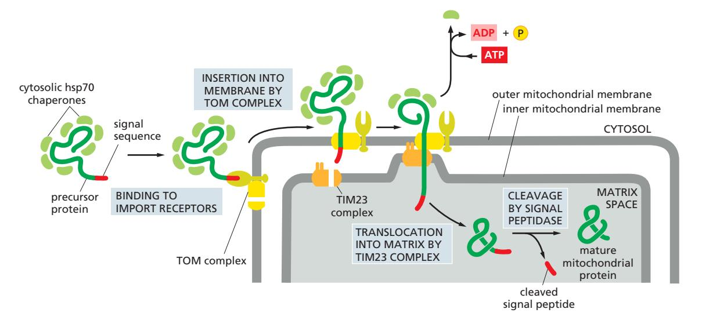

Figure 12–49 Protein import by mitochondria. The N-terminal signal sequence of the mitochondrial precursor protein is recognized by receptors of the TOM complex while the remainder of the protein is kept unfolded by cytosolic hsp70 chaperones. The protein is then translocated through the TIM23 complex so that it transiently spans both mitochondrial membranes (Movie 12.5). The signal sequence is cleaved off by a signal peptidase in the matrix space to form the mature protein. The free signal sequence is then rapidly degraded (not shown).

Although the TOM and TIM complexes usually work together to translocate precursor proteins across both membranes at the same time, they are capable of operating independently. In isolated outer membranes, for example, the TOM complex can translocate the signal sequence of precursor proteins across the membrane. Similarly, if the outer membrane is experimentally removed from isolated mitochondria, the exposed TIM23 complex can efficiently import precursor proteins into the matrix space. The experimental uncoupling of ordinarily linked processes allows each step and translocator system to be studied and understood in greater detail.

# Protein Import Is Powered by ATP Hydrolysis, a Membrane Potential, and Redox Potential

Directional transport of proteins requires energy (**Figure 12–50**). Mitochondrial protein import utilizes three different sources of energy at four discrete sites. ATP, a common fuel in most biological systems, is used at two of these sites: outside the mitochondria and inside the matrix. The other two energy sources are contributed by the membrane potential across the inner mitochondrial membrane and the redox potential of the electron-transport chain. Not all mitochondrial precursor proteins need each of these energy sources to arrive at their final destination.

The initial use of energy, needed by most mitochondrial precursor proteins at the initial stage of the translocation process, serves to maintain the polypeptide in an unfolded state prior to import (see Figure 12–49). As discussed in Chapter 6,

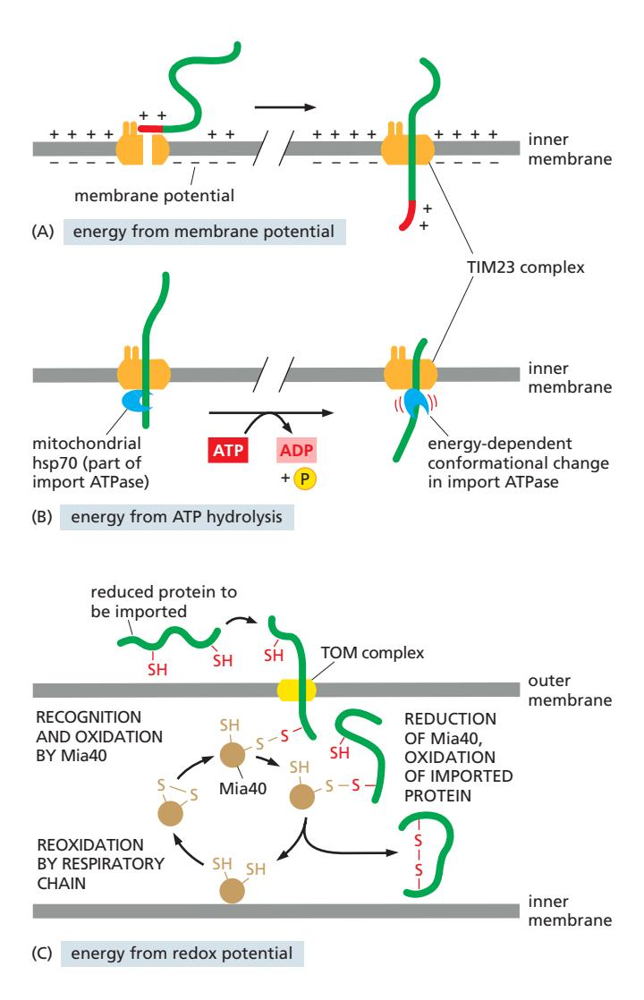

Figure 12–50 The role of energy in protein import into mitochondria. Three different sources of energy are used to import protein into the mitochondria. (A) After initial insertion of the signal sequence and of adjacent portions of the polypeptide chain into the TOM complex translocation channel (not shown), the signal sequence interacts with a TIM23 complex *(orange)*. The signal sequence is then translocated into the matrix space in a process that requires the energy in the membrane potential across the inner membrane. Positively charged amino acids in the signal sequence facilitate this membrane potential–dependent translocation reaction. (B) *Mitochondrial hsp70*, which is part of an import ATPase complex, binds to regions of the polypeptide chain as they become exposed in the matrix space, pulling the protein through the translocation channel, using the energy of ATP hydrolysis. (C) Polypeptides with multiple cysteines can sample the intermembrane space via partial translocation through the TOM complex. In the intermembrane space, these cysteines are oxidized to disulfide bonds by the enzyme Mia40, which becomes reduced in the process. The oxidized polypeptide is now partially folded, preventing it from sliding back into the cytosol. Reduced Mia40 is reoxidized by electrons provided by the respiratory chain so it can function again in the import reaction.

the chaperones that carry out this task use cycles of ATP binding and hydrolysis to control their interactions with newly synthesized polypeptides. Chaperone interaction is required to prevent premature folding in the cytosol, while chaperone dissociation is needed to permit transport through the TOM complex.

Once the signal sequence has passed through the TOM complex and is bound to a TIM complex, further translocation through the TIM translocation channel requires the membrane potential (Figure 12–50A), which is the electrical component of the electrochemical H+ gradient across the inner membrane (see Figure 11–4). Pumping of H+ from the matrix space to the intermembrane space, driven by electron-transport processes in the inner membrane (discussed in Chapter 14), maintains the electrochemical gradient. The energy in the electrochemical H+ gradient across the inner membrane drives the translocation of the positively charged signal sequences through the TIM complexes by electrophoresis. The same H+ gradient also powers most of the cell's ATP synthesis by ATP synthase complexes in the inner mitochondrial membrane.

Once the initial segment of a precursor protein reaches the matrix, **mitochondrial hsp70** is crucial for completing the import process similar to how BiP is needed for post-translation protein import into the ER. The mitochondrial hsp70 is bound to the matrix side of the TIM23 complex and acts as a motor to pull the precursor protein into the matrix space. Like its cytosolic cousin, mitochondrial hsp70 has a high affinity for unfolded polypeptide chains, and it binds tightly to an imported protein chain as soon as the chain emerges from the TIM translocator in the matrix space. The hsp70 then undergoes an ATP-dependent conformational change that exerts a pulling force on the protein being imported before releasing it. This energy-driven cycle of binding, pulling, and release continues until the protein has completed import through the TIM23 complex (Figure 12–50B). Many imported matrix proteins are passed on to another chaperone protein, *mitochondrial hsp60*, to assist their folding through cycles of ATP hydrolysis (see Chapter 6).

Certain intermembrane-space proteins that contain cysteine motifs use the difference in redox potential between the cytosol and mitochondria as a source of energy. When a portion of these proteins initially emerges into the intermembrane space, they form a transient covalent disulfide bond to the Mia40 protein (Figure 12–50C). This interaction prevents backsliding of the protein through the TOM complex into the cytosol. The imported proteins are eventually released from Mia40 in an oxidized form containing intrachain disulfide bonds, resulting in a folded protein that is now trapped in the intermembrane space. Mia40 becomes reduced in the process and is then reoxidized by passing electrons to the electron-transport chain in the inner mitochondrial membrane. In this way, the energy stored in the redox potential in the mitochondrial electron-transport chain is tapped to drive protein import.

### Transport into the Inner Mitochondrial Membrane Occurs Via Several Routes

The three different translocators in the inner mitochondrial membrane (see Figure 12–48) are all capable of membrane protein insertion. Different subsets of inner mitochondrial membrane proteins take different routes to reach one of these translocators for insertion into the membrane.

In the most common translocation route, a precursor that begins in the cytosol uses the TOM and TIM23 complexes to begin import into the matrix. However, only the N-terminal signal sequence of the transported protein actually enters the matrix space (**Figure 12–51A**). A hydrophobic amino acid sequence, strategically located after the N-terminal signal sequence, is recognized as a transmembrane domain by the TIM23 complex. This allows insertion of the transmembrane domain into the inner membrane and prevents further translocation into the matrix, perhaps through a lateral gate analogous to that found in the ER-resident Sec61 translocator. The remainder of the protein enters the intermembrane space through the TOM complex, and the signal sequence is cleaved off in the matrix.

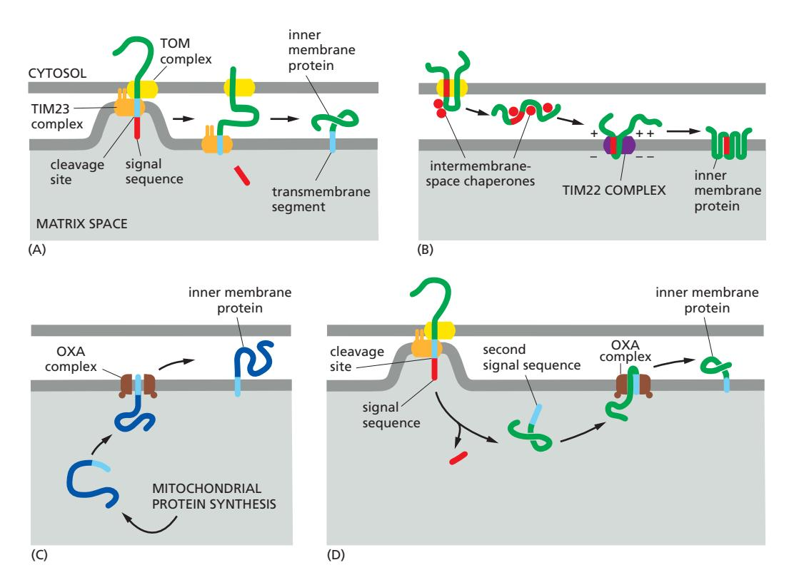

MBoC7 m12.25/12.51 Figure 12–51 Routes for the production of inner mitochondrial membrane proteins. (A) The N-terminal signal sequence *(red)* initiates import into the matrix space (see Figure 12–49). A hydrophobic transmembrane segment *(blue)* that follows the matrix-targeting signal sequence binds to the TIM23 translocator *(orange)* in the inner membrane and stops translocation. The remainder of the protein is then pulled into the intermembrane space through the TOM translocator in the outer membrane, and the transmembrane segment is released into the inner membrane, anchoring the protein there. (B) Multipass inner membrane proteins that function as metabolite transporters contain internal signal sequences and snake through the TOM complex as a loop. They then bind to the chaperones in the intermembrane space, which guide the proteins to the TIM22 complex. The TIM22 complex is specialized for the insertion of multipass inner membrane proteins. (C) The OXA complex mediates membrane protein insertion into the inner membrane for proteins that are encoded by the mitochondrial genome and translated in the matrix space. (D) The OXA complex in the inner membrane can mediate protein insertion from the matrix space. To access this route, nuclear-encoded proteins must first translocate completely into the matrix space via the TOM and TIM23 complexes. Cleavage of the signal sequence *(red)* used for the initial translocation unmasks an adjacent hydrophobic signal sequence *(blue)* at the new N-terminus. This signal then directs the protein into the inner membrane.

The second transport route to the inner membrane is specialized for a family of metabolite-specific transporters that transfer a vast number of small molecules across the inner membrane. These transporters supply substrates for metabolic enzymes in the mitochondrial matrix, such as those of the citric acid cycle, and export their products back to the cytosol. These multipass transmembrane proteins use internal signal sequences to enter the intermembrane space through the TOM complex. They engage intermembrane-space chaperones that guide them to the TIM22 complex, where hydrophobic transmembrane regions partition into the inner membrane. This insertion process requires the membrane potential to ensure that appropriate regions of the protein are transported to the matrix side so that the transporter acquires the correct topology (**Figure 12–51B**).

The final insertion route into the inner membrane uses the OXA complex. As mentioned earlier, the OXA complex also inserts the few membrane proteins that are encoded and translated in the mitochondrial matrix (**Figure 12–51C**). Thus, the OXA complex can only be accessed from the matrix side of the membrane. For this reason, nuclear-encoded membrane proteins that rely on the OXA complex for insertion must first use TIM23 to translocate into the matrix (**Figure 12–51D**). Here, the N-terminal signal sequence is removed to expose a hydrophobic signal sequence that is then used by the OXA complex for insertion into the inner membrane.

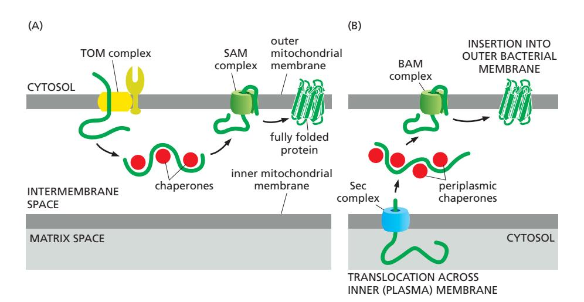

Figure 12–52 Integration of porins into the outer mitochondrial and bacterial membranes. (A) After translocation through the TOM complex in the outer mitochondrial membrane, β-barrel proteins bind to chaperones in the intermembrane space. The SAM complex then inserts the unfolded polypeptide chain into the outer membrane and helps the chain fold. (B) A structurally related BAM complex in the outer membrane of Gram-negative bacteria catalyzes β-barrel protein insertion and folding (see Figure 11–17).

#### Bacteria and Mitochondria Use Similar Mechanisms to Insert β Barrels into Their Outer Membrane

As discussed earlier in this chapter, mitochondria evolved from an ancestral endosymbiont bacterium inside the primordial eukaryotic cell. The outer mitochondrial membrane is therefore evolutionarily related to the outer membrane of Gram-negative bacteria (see Figure 11–17). Both membranes contain **porins**, abundant pore-forming β-barrel proteins that are permeable to inorganic ions and metabolites (but not to most proteins). The TOM complex only allows proteins containing hydrophobic α helices to exit laterally and thus cannot integrate porins or other β-barrel proteins into the lipid bilayer. Instead, they are first transported through the TOM complex as unfolded proteins into the intermembrane space. Specialized chaperone proteins in the intermembrane space keep the β-barrel proteins from aggregating (**Figure 12–52A**) until they are inserted and folded by the SAM complex in the outer membrane. MBoC7 m12.24/12.52

One of the central subunits of the SAM complex is homologous to a bacterial outer membrane protein that helps insert β-barrel proteins into the bacterial outer membrane. In bacteria, β-barrel proteins are inserted from the periplasmic space, which is the topological equivalent of the intermembrane space in mitochondria (**Figure 12–52B**). This conserved pathway for inserting β-barrel proteins further underscores the endosymbiotic origin of mitochondria. Notably, the central subunits of the TOM and SAM complexes are themselves β-barrel proteins. Thus, preexisting TOM and SAM complexes are required to make more copies of these essential protein translocators.

#### Two Signal Sequences Direct Proteins to the Thylakoid Membrane in Chloroplasts

Protein transport into **chloroplasts** resembles transport into mitochondria. Both processes occur post-translationally, use separate translocation complexes in each membrane, require energy, and use multiple types of signal sequences to direct a precursor to the appropriate organelle subcompartment. However, many of the protein components that form the translocation complexes differ. Moreover, whereas mitochondria harness the electrochemical H+ gradient across their inner membrane to drive transport, chloroplasts, which have an electrochemical H+ gradient across their thylakoid membrane but not their inner membrane, use GTP and ATP hydrolysis to power import across their double-membrane envelope. The functional similarities thus result from convergent evolution, reflecting the common requirements for translocation across a double membrane.

Although the signal sequences for import into chloroplasts superficially resemble those for import into mitochondria, a plant cell can have both mitochondria and chloroplasts, so proteins must partition appropriately between the two organelles. Experiments have shown that a cytosolic protein can be directed specifically to a plant cell's mitochondria if it is experimentally joined to an N-terminal signal sequence of a mitochondrial protein; the same protein joined to an N-terminal signal sequence of a chloroplast protein ends up in chloroplasts. Thus, the import receptors on each organelle distinguish between the different signal sequences.

The same compartments that are found in mitochondria are also in chloroplasts, and each has its distinctive complement of proteins that are selectively delivered there using mechanisms analogous to the mitochondrial systems. However, chloroplasts have an extra membrane-enclosed compartment, the **thylakoid**. Many chloroplast proteins, including the protein subunits of the photosynthetic system and of the ATP synthase (discussed in Chapter 14), are located in the thylakoid membrane. Many of the components of these vital complexes are encoded in the nuclear genome, and those residing in the thylakoid lumen therefore have to be imported across three membranes. The precursors of these proteins are translocated from the cytosol to their final destination in two steps using bipartite signal sequences. First, they pass across the outer and inner membranes into the **stroma** guided by an N-terminal chloroplast signal sequence. There, a stromal signal peptidase removes the N-terminal chloroplast signal sequence, unmasking a thylakoid signal sequence that follows it in the sequence of the precursor protein. The thylakoid signal sequence initiates integration into the thylakoid membrane or translocation into the thylakoid space (**Figure 12–53A**).

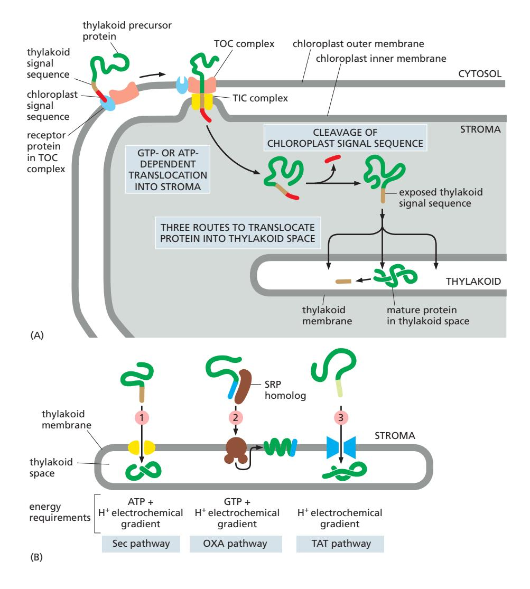

Figure 12–53 Translocation of chloroplast precursor proteins into the thylakoid space. (A) The precursor protein contains an N-terminal chloroplast signal sequence *(red)*, followed immediately by a thylakoid signal sequence *(brown).* The chloroplast signal sequence initiates translocation into the stroma by a mechanism similar to that used for the translocation of mitochondrial precursor proteins into the matrix space, although the translocator complexes, named TOC and TIC (for translocator in the outer and inner chloroplast membrane, respectively), are different. The signal sequence is then cleaved off, unmasking the thylakoid signal sequence, which initiates translocation across the thylakoid membrane. (B) Translocation into the thylakoid space or thylakoid membrane can occur by any one of at least three routes: (1) a *Sec pathway*, so called because it uses components that are homologs of Sec proteins, which mediate protein translocation across the ER and bacterial plasma membrane; (2) an *OXA-like pathway*, so called because it uses a chloroplast homolog of the OXA translocase; (3) a *TAT* (twin arginine translocation) *pathway*, so called because two arginines are critical in the signal sequences that direct proteins into this pathway, which depends on the H<sup>+</sup> gradient across the thylakoid membrane. The OXA-like pathway makes use of a chloroplast SRP that lacks an RNA subunit. This specialized SRP located in the stroma recognizes a thylakoid-directed signal sequence and functions exclusively post-translationally because it is found in a separate compartment from the ribosome that made the thylakoid precursor protein.

There are three different protein translocators in the thylakoid membrane, each of which recognizes a different type of signal sequence, handles a different subset of thylakoid precursors, and uses energy in different ways (**Figure 12–53B**). As we saw earlier, the thylakoid membrane is developmentally derived from the inner chloroplast membrane, which is evolutionarily related to the bacterial inner membrane. It is therefore not surprising that each of the three translocators in the thylakoid membrane has homologs that are used for translocation or membrane insertion in bacteria.

#### Summary

*Although mitochondria and chloroplasts have their own genetic systems, they produce less than 1% of their own proteins. Instead, the two organelles import most of their proteins from the cytosol, using similar mechanisms. In both cases, multiple protein translocator complexes in the outer and inner membranes recognize different types of signal sequences to direct a precursor to the correct organelle subcompartment. Proteins are transported in an unfolded state by a post-translational mechanism. Chaperone proteins of the cytosolic hsp70 family maintain the precursor proteins in an unfolded state prior to translocation, and a second set of hsp70 proteins in the matrix space or stroma pulls the polypeptide chain across the inner membrane. Translocation into mitochondria is powered by ATP hydrolysis, a membrane potential across the inner membrane, and the redox potential of the electron-transport chain. Translocation into chloroplasts is powered by GTP and ATP hydrolysis and a membrane potential across the thylakoid membrane. In chloroplasts, import from the stroma into the thylakoid can occur by several routes, distinguished by the protein translocator complex and energy source used.*

# THE TRANSPORT OF MOLECULES BETWEEN THE NUCLEUS AND THE CYTOSOL

The **nuclear envelope** encloses the DNA and defines the *nuclear compartment*. This envelope consists of two concentric membranes, which are perforated by nuclear pore complexes (**Figure 12–54**). Although the inner and outer nuclear membranes are continuous, they maintain distinct protein compositions. The **inner nuclear membrane** contains proteins that act as binding sites for the **nuclear lamina***,* a meshwork of polymerized protein subunits called **nuclear lamins**. The lamin proteins are members of the intermediate filament family of cytoskeletal proteins (see Chapter 16). The lamina provides structural support for

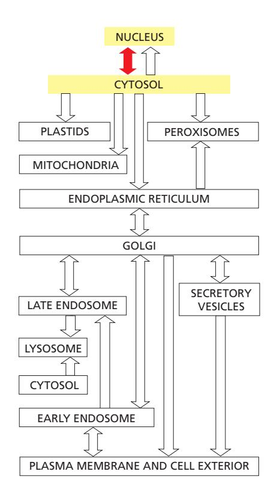

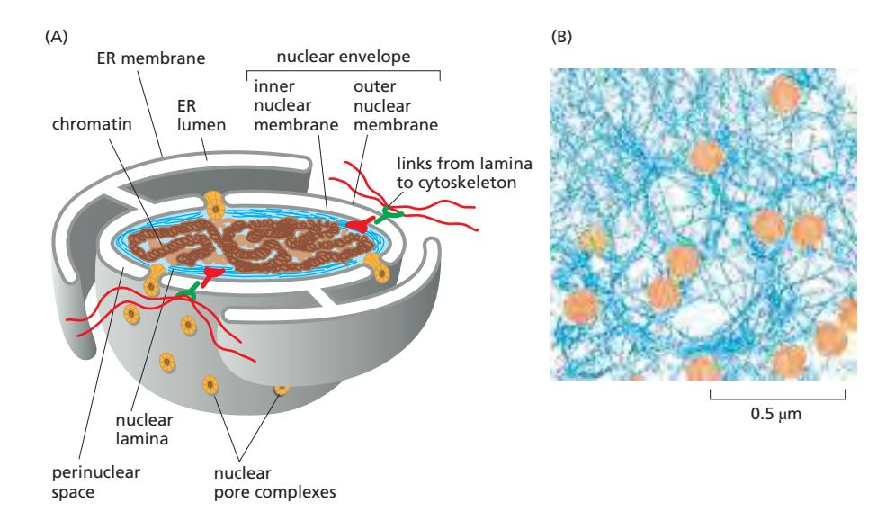

Figure 12–54 The nuclear envelope. (A) The double membrane of the nuclear

envelope is penetrated by nuclear pore complexes. Transmembrane proteins in the inner and outer nuclear membranes link the nuclear lamina to the cytosolic cytoskeleton. The outer nuclear membrane is continuous with the endoplasmic reticulum (ER). The ribosomes that are normally bound to the cytosolic surface of the ER membrane and outer nuclear membrane are not shown. (B) The nuclear lamina is a fibrous protein meshwork underlying the inner membrane. Nuclear pores are seen in *light brown*. (B, from Y. Turgay et al., *Nature* 543:261–264, 2017.)

the nuclear envelope and acts as an anchoring site for chromosomes and nuclear pore complexes. The lamina is also connected to the cytoplasmic cytoskeleton via protein complexes that span the nuclear envelope, thereby providing struc tural links between the DNA, nuclear envelope, and cytoskeleton. The **outer nuclear membrane** is continuous with the membrane of the ER and is studded with ribosomes engaged in protein synthesis (see Figure 12–15). The proteins made on these ribosomes are transported into the space between the inner and outer nuclear membranes (the *perinuclear space*), which is continuous with the ER lumen.

Nuclear pores conduct extensive bidirectional traffic between the cytosol and the nucleus. The many proteins that function in the nucleus—including histones, DNA polymerases, RNA polymerases, transcriptional regulators, and RNA -processing proteins—are selectively imported into the nuclear compart ment from the cytosol, where they are made. At the same time, all RNAs that function in the cytosol—including mRNAs, rRNAs, tRNAs, and miRNAs—are exported after they are synthesized and processed in the nucleus. Like the import process, the export process is selective; mRNAs, for example, are exported only after they have been properly modified by RNA -processing reactions in the nucleus. In some cases, multiple selective transport steps are needed to assem ble a complex structure. Ribosomes, for instance, are made from proteins that are synthesized in the cytosol, imported into the nucleus, and exported back to the cytosol only after their assembly with newly made ribosomal RNA. These pre -ribosomal particles then complete their assembly into functional ribo somes in the cytosol, with certain assembly and transport factors returning to the nucleus to help assemble the next ribosome.

#### Nuclear Pore Complexes Perforate the Nuclear Envelope

Large and elaborate **nuclear pore complexes (NPCs)** perforate the nuclear enve lope in all eukaryotes. Each NPC is composed of a set of approximately 30 different proteins, or **nucleoporins**. NPCs display eightfold rotational symmetry, with axial symmetry of the central core. Hence, each nucleoporin is present in multiple cop ies, resulting in 500–1000 protein molecules in the fully assembled NPC, with an estimated mass of 66 million daltons in yeast and 125 million daltons in vertebrates (**Figure 12–55**). Most nucleoporins are composed of repetitive protein domains of only a few different types, which have evolved through extensive gene duplication. Some of the scaffold nucleoporins that abut the membrane (see Figure 12–55) are evolutionarily and structurally related to vesicle coat protein complexes, such as clathrin and the COPII coat (discussed in Chapter 13), which shape transport vesicles. One protein is even used as a common building block in both NPCs and vesicle coats. It appears that an ancestral membrane -bending protein that helped shape the elaborate membrane systems of eukaryotic cells evolved into a family of proteins that stabilize the sharp membrane bends at nuclear pores and budding transport vesicles.

The nuclear envelope of a typical mammalian cell contains 3000–4000 NPCs, although that number varies widely, from a few hundred in glial cells to almost 20,000 in Purkinje neurons. Each NPC can transport a staggering 1000 macro molecules per second and can transport in both directions at the same time. The internal diameter of each NPC is ∼40 nm, large enough to accommodate ribosomal subunits and even viral particles. However, this enormous pore is not empty; instead, it is filled with unstructured protein regions contributed by the channel nucleoporins.

These unstructured domains contain numerous repeats of phenylalanine– glycine (FG) motifs whose weak affinity for each other creates a gel -like mesh inside the NPC. This mesh acts as a sieve that restricts the diffusion of large macromolecules while allowing smaller molecules to pass. Researchers have determined the effective size of the sieve by injecting labeled water -soluble mole cules of different sizes into the cytosol and then measuring their rate of diffusion into the nucleus. Small molecules (5000 daltons or less) diffuse in so fast that we

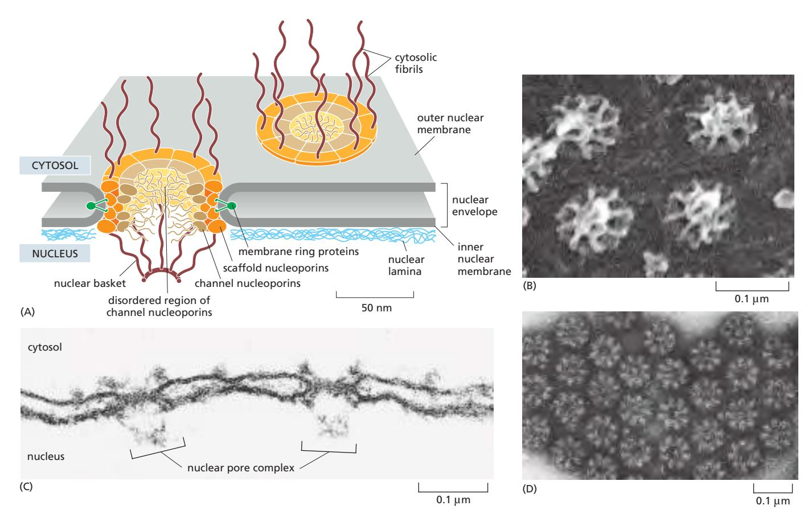

Figure 12–55 The arrangement of NPCs in the nuclear envelope. (A) In a vertebrate NPC, nucleoporins are arranged with striking eightfold rotational symmetry. In addition, immunoelectron microscope studies show that the proteins that make up the central portion of the NPC are oriented symmetrically across the nuclear envelope, so that the nuclear and cytosolic sides look identical. The eightfold rotational and twofold transverse symmetry explains how such a huge structure can be formed from only about 30 different proteins: many of the nucleoporins are present in 8, 16, or 32 copies. On the basis of their approximate localization in the central portion of the NPC, nucleoporins can be classified into (1) transmembrane ring proteins that span the nuclear envelope and anchor the NPC to the envelope; (2) scaffold nucleoporins that form layered ring structures (some scaffold nucleoporins are membrane-bending proteins that stabilize the sharp membrane curvature where the nuclear envelope is penetrated); and (3) channel nucleoporins that line a central pore. In addition to folded domains that anchor the proteins in specific places, many channel nucleoporins contain extensive unstructured regions, where the polypeptide chains are intrinsically disordered. The central pore is filled with a high concentration of these disordered domains whose weak interactions with each other form a gel that blocks the passive diffusion of large macromolecules. The disordered regions contain a large number of phenylalanine–glycine (FG) repeats. Fibrils protrude from both the cytosolic and the nuclear sides of the NPC. By contrast to the twofold transverse symmetry of the NPC core, the fibrils facing the cytosol and nucleus are different: on the nuclear side, the fibrils converge at their distal end to form a basketlike structure. The precise arrangement of individual nucleoporins in the assembled NPC is still a matter of intense debate, because atomic resolution analyses have been hindered by the sheer size and flexible nature of the NPC and by difficulties in purifying sufficient amounts of homogeneous material. A combination of electron microscopy, computational analyses, and crystal structures of nucleoporin subcomplexes has been used to develop the current models of the NPC architecture. (B) A scanning electron micrograph of the nuclear side of the nuclear envelope of an oocyte, showing NPCs with their basketlike fibrils. (C) An electron micrograph showing a side view of two NPCs *(brackets)*; note that the inner and outer nuclear membranes are continuous at the edges of the pore*.* (D) An electron micrograph showing face-on views of negatively stained NPCs. The membrane has been removed by detergent extraction. Note that some of the NPCs contain material in their center, which is thought to be trapped macromolecules in transit through these NPCs. (A, adapted from A. Hoelz et al., *Annu. Rev. Biochem.*  80:613–643, 2011. B, © 1992 M.W. Goldberg and T.D. Allen. Originally published in *J. Cell Biol.* https://doi.org/10.1083/ jcb.119.6.1429. With permission from Rockefeller University Press. C, courtesy of Werner Franke and Ulrich Scheer. D, courtesy of Ron Milligan.) MBoC7 m12.08/12.55

can consider the nuclear envelope freely permeable to them. The barrier is progressively restrictive to larger molecules such that proteins greater than ∼40,000 daltons or ∼5 nm in diameter cannot enter by passive diffusion.

Because many cell proteins are too large to diffuse passively through the NPCs, the nuclear compartment and the cytosol can maintain different protein compositions. Mature cytosolic ribosomes, for example, are about 30 nm in diameter and

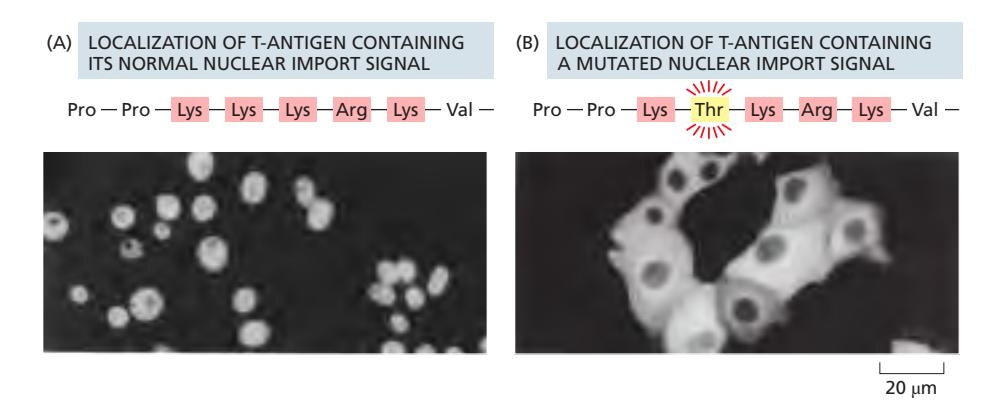

Figure 12–56 The function of a nuclear localization signal. Immunofluorescence micrographs showing the cell location of SV40 virus T-antigen containing or lacking a short sequence that serves as a nuclear localization signal. (A) The normal T-antigen protein contains the lysinerich sequence indicated and is imported to its site of action in the nucleus, as indicated by immunofluorescence staining with antibodies against the T-antigen. (B) T-antigen with an altered nuclear localization signal (a threonine replacing a lysine) remains in the cytosol. (From D. Kalderon et al., *Cell* 39:499–509, 1984. With permission from Elsevier.)

thus cannot diffuse through the NPC, confining protein synthesis to the cytosol. But how does the nucleus export newly made ribosomal subunits or import large molecules, such as DNA polymerases and RNA polymerases, which have subunit molecular masses of 100,000–200,000 daltons? As we discuss next, these and most other transported protein and RNA molecules bind to specific receptor proteins that ferry large molecules through NPCs. Even small proteins such as histones frequently use receptor-mediated mechanisms to cross the NPC, thereby increasing transport efficiency. MBoC7 m12.09/12.56

#### Nuclear Localization Signals Direct Proteins to the Nucleus

When proteins are experimentally extracted from the nucleus and reintroduced into the cytosol, even the very large ones reaccumulate efficiently in the nucleus. Sorting signals called **nuclear localization signals (NLSs)** are responsible for the selectivity of this active nuclear import process. The signals have been precisely defined by using recombinant DNA technology for numerous proteins that are imported into the nucleus (**Figure 12–56**). The most commonly used signal consists of one or two short sequences that are rich in the positively charged amino acids lysine and arginine (see Figure 12–13), with the precise sequence varying for different proteins. Some nuclear proteins contain different types of signals, some of which are not yet characterized.

NLSs can be located almost anywhere in the amino acid sequence and are thought to form loops or patches on the protein surface. Many NLSs function even when linked as short peptides to the surface of a cytosolic protein, suggesting that the precise location of the signal within the amino acid sequence of a nuclear protein is not important. Moreover, as long as one of the protein subunits of a multicomponent complex displays a nuclear localization signal, the entire complex will be imported into the nucleus.

Macromolecular transport across NPCs differs fundamentally from the transport of proteins across the membranes of other organelles: NPC transport occurs through a large, constitutively open, mesh-filled pore, rather than through a much smaller protein translocator whose aqueous pore is typically gated by the protein being transported. For this reason, fully folded proteins and large multiprotein complexes can be transported in either direction through the nuclear pore. By contrast, transport through organellar protein translocators of the ER, mitochondria, and chloroplasts is unidirectional and usually requires the protein to be extensively unfolded.

One can visualize the transport of nuclear proteins through NPCs by coating tiny colloidal gold particles with a nuclear localization signal, injecting the particles into the cytosol, and then following their fate by electron microscopy (**Figure 12–57**). The particles first arrive at the tentacle-like fibrils that extend from the scaffold nucleoporins at the rim of the NPC into the cytosol, and then proceed through the center of the NPC. This observation illustrates that NLSs impart the ability of large particles to navigate through the otherwise impermeable diffusion barrier posed by the disordered mesh inside the nuclear pore.

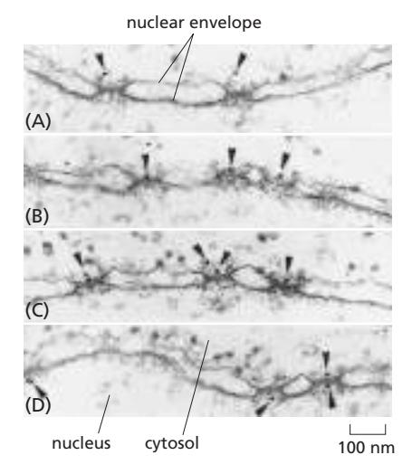

MBoC7 m12.10/12.57 Figure 12–57 Visualizing active import through NPCs. This series of electron micrographs shows 5- to 10-nm-diameter colloidal gold spheres *(arrowheads)* coated with peptides containing nuclear localization signals entering the nucleus through NPCs. The gold particles were injected into the cytosol of living cells, which then were fixed and prepared for electron microscopy at various times after injection. (A) Gold particles are first seen in proximity to the cytosolic fibrils of the NPCs. (B, C) They are then seen at the center of the NPCs, exclusively on the cytosolic face. (D) They then appear on the nuclear face. These gold particles have much larger diameters than those of the diffusion channels in the NPC and are imported by active transport. (From N. Panté and U. Aebi, *Science* 273:1729–1732, 1996. With permission from AAAS.)

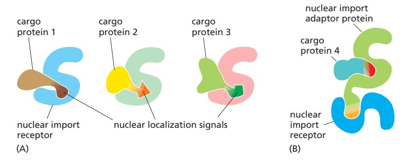

# Nuclear Import Receptors Bind to Both Nuclear Localization Signals and NPC Proteins

To initiate nuclear import, nuclear localization signals must be recognized by **nuclear transport receptors**. Most of these receptors are part of a large family of proteins called *karyopherins*. In yeast, there are 14 genes encoding karyopherins; in animal cells, the number is significantly larger. Karyopherin family members that mediate nuclear import are called **nuclear import receptors**, while those for nuclear export (discussed later) are called **nuclear export receptors**. Each import receptor can bind and transport the subset of cargo proteins containing the appropriate nuclear localization signal (**Figure 12–58A**). Nuclear import receptors sometimes use adaptor proteins that form a bridge between the import receptors and the nuclear localization signals on the proteins to be transported (**Figure 12–58B**). Some adaptor proteins are structurally related to nuclear import receptors, suggesting a common evolutionary origin. By using a variety of import receptors and adaptors, cells are able to recognize the broad repertoire of nuclear localization signals that are displayed on nuclear proteins. MBoC7 m12.11/12.58

The import receptors are soluble cytosolic proteins that contain multiple low-affinity binding sites for the FG repeats found in the unstructured domains of several nucleoporins. The FG repeats in the fibrils of cytosol-facing nucleoporins serve to initially recruit import receptors and their bound cargo proteins to NPCs. The import receptors can then bind the FG repeats that form the mesh inside the nuclear pore to disrupt interactions between the repeats. In this way, the receptor–cargo complex locally dissolves the gel-like mesh and can diffuse into and within the NPC pore (**Figure 12–59**).

It is possible to re-create in a test tube a gel consisting of unstructured polypeptides containing FG repeats. This gel displays restricted diffusion of inert cargoes in a size-dependent manner similar to diffusion through NPCs. Diffusion into this artificial gel is more than 1000-fold faster for cargoes bound to an import receptor. At this rate, a cargo in complex with an import receptor could traverse the distance across an NPC in a few milliseconds, consistent with the rate

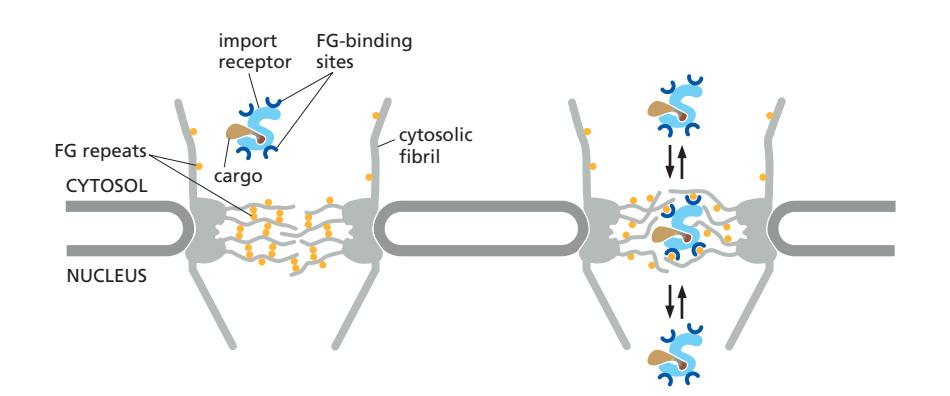

Figure 12–58 Nuclear import receptors. (A) Different nuclear import receptors bind different nuclear localization signals and thereby different cargo proteins. (B) Cargo protein 4 requires an adaptor protein to bind to its nuclear import receptor. The adaptors are structurally related to nuclear import receptors and recognize nuclear localization signals on cargo proteins. They also contain a nuclear localization signal that binds them to an import receptor, but this signal only becomes exposed when they are loaded with a cargo protein.

Figure 12–59 Interaction of nuclear import receptors with FG repeats. *Left:* Nuclear import receptors contain various low-affinity FG repeat–binding sites on their surface. This facilitates their initial recruitment to NPCs because of interactions with FG repeats found on the cytosolic fibrils of the NPCs. The interior of the NPC is filled with a mesh of FG repeat–containing proteins whose weak interactions with each other restrict nonspecific diffusion of proteins and other macromolecules through the pore. *Right:* Cargo receptors can rapidly partition into the FG repeat mesh by interacting with the FG repeats and locally melting the mesh. This partitioning into and out of the mesh substantially accelerates diffusion of the cargo receptor (and its bound cargo) through the NPC. Proteins without surface FG repeat–binding sites cannot melt the mesh, and their diffusion through the NPC is comparatively slow.

of transport observed in cells. It is important to realize that in this model, diffusion is not directional; instead, the import receptor simply accelerates diffusion to provide cargo access to the nuclear compartment. As we will see, it is the selective dissociation of cargo only on the nuclear side of the NPC that confers directionality to the import process. The import receptor then returns back to the cytosol for transport of the next cargo.

# The Ran GTPase Imposes Directionality on Nuclear Import Through NPCs

The import of nuclear proteins through NPCs concentrates specific proteins in the nucleus and thereby increases order in the cell. The cell fuels this ordering process by harnessing the energy of GTP hydrolysis by the GTPase **Ran**, which is required for both nuclear import and export.

Like other GTPases, Ran is a molecular switch that can exist in two conformational states, depending on whether GDP or GTP is bound (Figure 3–63). Two Ran-specific regulatory proteins trigger the conversion between the two states: a cytosolic *GTPase-activating protein* (*GAP*) triggers GTP hydrolysis and thus converts Ran-GTP to Ran-GDP, and a nuclear *guanine nucleotide exchange factor* (*GEF*) promotes the exchange of GDP for GTP and thus converts Ran-GDP to Ran-GTP. Because *Ran GAP* is located in the cytosol and *Ran GEF* is located in the nucleus, the cytosol contains mainly Ran-GDP, and the nucleus contains mainly Ran-GTP (**Figure 12–60A**). The partitioning of the GAP and GEF between the cytosol and nucleus in a cell is due to their preferential association with the cytosolic cytoskeleton and nuclear chromatin, respectively.

The gradient of the two conformational forms of Ran drives nuclear transport in the appropriate direction. Import receptors, facilitated by FG-repeat binding, accelerate diffusion through the mesh inside the NPC channel. When an import receptor reaches the nuclear side of the pore complex, Ran-GTP binds to it and causes the receptor to release its cargo (**Figure 12–60B**). Because this occurs only

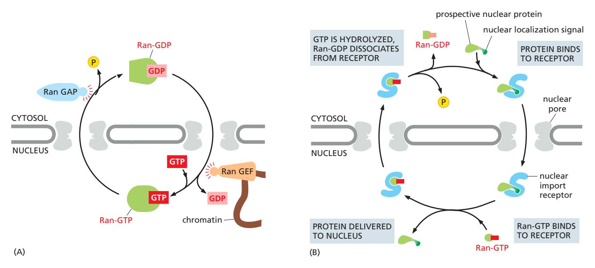

Figure 12–60 The compartmentalization of Ran-GDP and Ran-GTP provides directionality to nuclear transport. (A) Localization of Ran-GDP in the cytosol and Ran-GTP in the nucleus results from the localization of two Ran regulatory proteins: Ran GTPase-activating protein (Ran GAP) is located in the cytosol, and Ran guanine nucleotide exchange factor (Ran GEF) binds to chromatin and is therefore located in the nucleus. Ran-GDP is imported into the nucleus by its own import receptor (not shown), which is specific for the GDP-bound conformation of Ran. The Ran-GDP receptor is structurally unrelated to the main family of nuclear transport receptors. However, it also binds to FG repeats in NPC channel nucleoporins. (B) The interaction between a nuclear import receptor and its cargo is reversed by Ran-GTP. This means the receptor–cargo interaction is favored in the cytosol but disfavored in the nucleus. This results in net cargo transport from the cytosol to the nucleus.

on the nuclear side of the pore where the Ran-GTP concentration is high, the import process becomes rectified (that is, unidirectional), even though diffusion of the cargo–import receptor complex through the pore is governed by random back-and-forth diffusion.

Having discharged its cargo in the nucleus, the empty import receptor with Ran-GTP bound is transported back through the pore complex by the same mechanism of facilitated diffusion. When the complex of Ran-GTP and the import receptor reaches the cytosol, Ran GAP triggers Ran-GTP to hydrolyze its bound GTP. The resulting Ran-GDP lacks affinity for the import receptor, releasing it for another cycle of nuclear import. Thus, Ran-GDP permits cargo binding in the cytosol, while Ran-GTP stimulates cargo discharge in the nucleus, thereby imparting directionality to the import process.

#### Nuclear Export Works Like Nuclear Import, but in Reverse

The nuclear export of large molecules, such as new ribosomal subunits and RNA molecules, occurs through NPCs and also depends on a selective transport system. The transport system relies on **nuclear export signals** on the macromolecules to be exported. Export receptors bind to both the export signal, either directly or via an adaptor, and to NPC proteins to guide their cargo to the cytosol. As might be expected from the structural and evolutionary similarity of import receptors and export receptors, the import and export transport systems work in similar ways but in opposite directions: the import receptors bind their cargo molecules in the cytosol, release them in the nucleus, and are then exported to the cytosol for reuse, while the export receptors function in the opposite fashion (**Figure 12–61**).

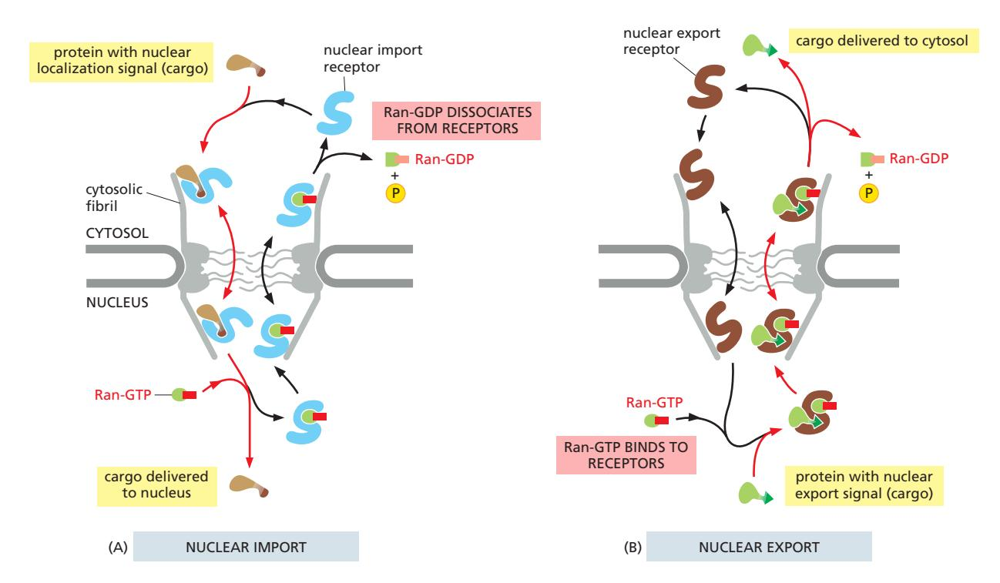

Figure 12–61 Nuclear import and nuclear export both use the Ran GTPase cycle. Movement through the NPC of loaded nuclear transport receptors occurs along the FG repeats displayed by certain NPC proteins. The differential localization of Ran-GTP in the nucleus and Ran-GDP in the cytosol provides directionality *(red arrows)* to both nuclear import (A) and nuclear export (B). Ran GAP stimulates the hydrolysis of GTP to produce Ran-GDP on the cytosolic side of the NPC (see Figure 12–60A). The critical difference between Ran-mediated nuclear import and nuclear export is the nature of cargo binding by the cargo receptor. In nuclear import, cargo binding is mutually exclusive of Ran-GTP; in nuclear export, cargo binding requires Ran-GTP. Thus, the locations where cargo is picked up and released are exactly reversed in nuclear export compared to nuclear import. MBoC7 m12.13/12.61

The ability of export receptors to work in reverse derives from the way they interact with the Ran GTPase. Ran-GTP in the nucleus promotes cargo binding to the export receptor, rather than promoting cargo dissociation as in the case of import receptors. Once the export receptor moves through the pore to the cytosol, it encounters Ran GAP, which induces the receptor to hydrolyze its GTP to GDP. As a result, the export receptor flips its conformation and releases both its cargo and Ran-GDP in the cytosol. Free export receptors and free Ran-GDP use the nuclear import pathway to enter the nucleus and complete the cycle.

As we discuss in detail in Chapter 6, cells control the export of RNAs from the nucleus. snRNAs, miRNAs, and tRNAs bind to nuclear export receptors, and they use the Ran-GTP gradient to fuel the transport process. By contrast, the export of mRNAs out of the nucleus uses a different mechanism that does not use export receptors or the Ran GTPase system. Instead, the spliced and processed mRNA is assembled with several nuclear RNA-binding proteins, some of which can bind the nuclear side of NPCs and others that bind FG repeats (see Figure 6–40). This export-competent mRNA ribonucleoprotein (mRNP) complex can then navigate through the FG repeat mesh within the NPC. A helicase complex that resides on the cytosolic side of NPCs uses the energy of ATP hydrolysis to strip several proteins from the mRNP, including the FG repeat–binding protein. This prevents the exported mRNA from reentering the NPC, making the export process unidirectional. The stripped RNA-binding proteins are rapidly imported back to the nucleus (using the import receptor and Ran GTPase system) for another round of transport.

#### Transport Through NPCs Can Be Regulated by Controlling Access to the Transport Machinery

Some proteins continually shuttle back and forth between the nucleus and the cytosol. This can happen if a protein is small enough to diffuse through the nuclear pore but contains an import or export signal that constantly retrieves it to the nucleus or cytosol. Other proteins contain both nuclear localization signals and nuclear export signals. The relative rates of their import and export determine the steady-state localization of such *shuttling proteins*: if the rate of import exceeds the rate of export, a protein will be located mainly in the nucleus; conversely, if the rate of export exceeds the rate of import, a protein will be located mainly in the cytosol. Thus, changing the rate of import, export, or both, can change the location of a protein.

As discussed in Chapter 7, cells control the activity of some transcription regulators by keeping them out of the nucleus until they are needed there (**Figure 12–62**); similarly, cells can control the translation of certain mRNAs by retaining them in the nucleus until their protein products are needed. In many cases, cells control transport by regulating nuclear localization and export signals—turning them on or off, often by phosphorylation of amino acids close to the signal sequences (**Figure 12–63**). Other transcription regulators are bound to inhibitory cytosolic proteins that either anchor them in the cytosol (through interactions with the cytoskeleton or specific organelles) or mask their nuclear localization signals so that they cannot interact with nuclear import receptors. An appropriate stimulus releases the transcription regulatory protein from its cytosolic anchor or mask, and it is then transported into the nucleus.

One important example is the latent transcription regulatory protein that controls the transcription of genes involved in cholesterol metabolism. The protein is made and stored in an inactive form as a transmembrane protein in the ER. When a cell is deprived of cholesterol, the protein is transported from the ER to the Golgi apparatus where it encounters specific proteases that cleave off the cytosolic domain, releasing it into the cytosol. This domain is then imported into the nucleus, where it activates the transcription of genes required for both cholesterol uptake and synthesis (**Figure 12–64**). Earlier in this chapter, we discussed a similar mechanism that controls the activation of the ATF6 arm of the unfolded protein response (see Figure 12–36).

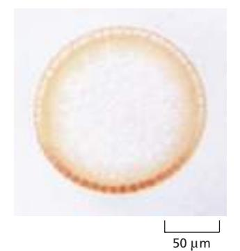

MBoC7 m12.14/12.62 Figure 12–62 The control of nuclear transport in the early *Drosophila* embryo. The embryo at this stage is a syncytium, shown here in cross section, with many nuclei in a common cytoplasm, arranged around the periphery, just beneath the plasma membrane. The transcription regulatory protein Dorsal is produced uniformly throughout the peripheral cytoplasm, but it can act only when inside the nuclei. The Dorsal protein has been stained with an enzyme-coupled antibody that yields a brown product, revealing that Dorsal is excluded from the nuclei at the dorsal side *(top)* of the embryo but is concentrated in the nuclei toward the ventral side *(bottom)* of the embryo. The regulated traffic of Dorsal into the nuclei controls the differential development

between the back and belly of the animal.

(Courtesy of Siegfried Roth.)

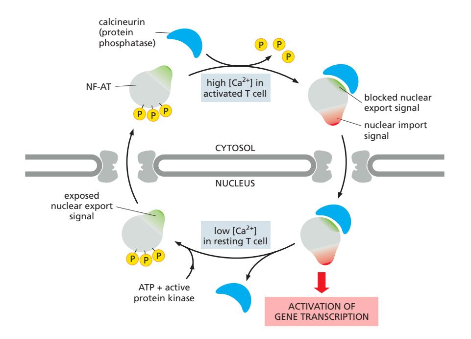

# The Nuclear Envelope Disassembles and Reassembles During Mitosis

In animal cells, the nuclear envelope is dismantled during mitosis so that microtubules can access the replicated chromosomes for segregation between the two daughter cells (discussed in Chapter 17). At the end of mitosis, the nuclear envelope reassembles, and the asymmetrical distribution of cellular contents between the cytosol and nucleus is reestablished. The major structures that must be reversibly disassembled are the nuclear lamina, the NPCs, and the membranes of the nuclear envelope. MBoC7 m12.15/12.63

The dismantling process is initiated by the cyclin-dependent kinase (Cdk) that is activated at the onset of mitosis (discussed in Chapter 17). Cdk

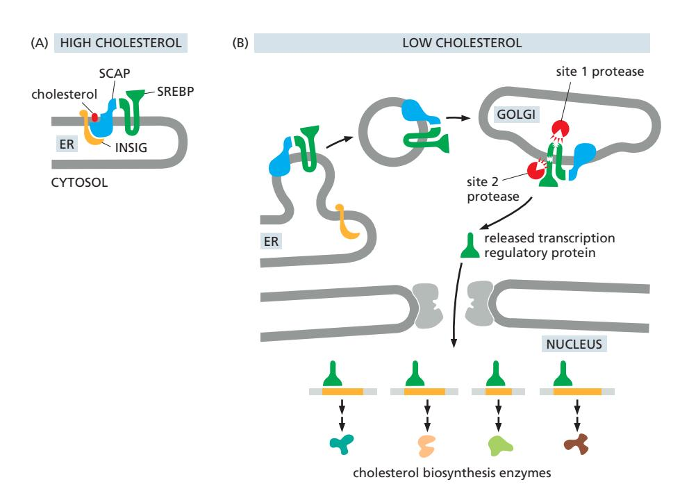

Figure 12–63 The control of nuclear import during T cell activation. The nuclear factor of activated T cells (NF-AT) is a transcription regulatory protein that, in the resting T cell, is found in the cytosol in a phosphorylated state. When T cells are activated by foreign antigen (discussed in Chapter 24), the intracellular Ca2<sup>+</sup> concentration increases. At high concentrations of Ca2+, the protein phosphatase calcineurin binds to NF-AT and dephosphorylates it. The dephosphorylation exposes nuclear import signals and blocks a nuclear export signal. The complex of NF-AT and calcineurin is therefore imported into the nucleus, where NF-AT activates the transcription of numerous genes required for T cell activation. The response shuts off when Ca2+ levels decrease, releasing NF-AT from calcineurin. Rephosphorylation of NF-AT inactivates the nuclear import signals and reexposes the nuclear export signal, causing NF-AT to relocate to the cytosol. Some of the most potent immunosuppressive drugs, including cyclosporin A and FK506, inhibit the ability of calcineurin to dephosphorylate NF-AT and thereby block the nuclear accumulation of NF-AT and T cell activation (Movie 12.6).

Figure 12–64 Feedback regulation of cholesterol biosynthesis. (A) SREBP (sterol response element binding protein), a latent transcription regulator that controls expression of cholesterol biosynthetic enzymes, is initially synthesized as an ER membrane protein. It is anchored in the ER if there is sufficient cholesterol in the membrane by interaction with a membrane protein complex composed of the proteins INSIG and SCAP (SREBP cleavage activation protein), which binds cholesterol. (B) If the cholesterolbinding site on SCAP is empty (at low cholesterol concentrations), SCAP changes conformation and dissociates from INSIG. Dissociation from INSIG frees the SCAP–SREBP complex so it can be packaged together into transport vesicles that are delivered to the Golgi apparatus. In the Golgi apparatus, two Golgi-resident proteases cleave SREBP to free its cytosolic domain from the membrane. The cytosolic domain, which is a transcription regulatory protein, then moves into the nucleus, where it binds to the promoters of genes that encode proteins involved in cholesterol biosynthesis and activates their transcription. In this way, more cholesterol is made when its concentration falls below a threshold.

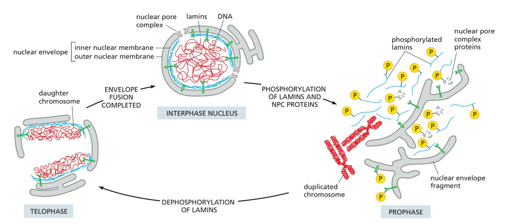

Figure 12–65 The breakdown and re-formation of the nuclear envelope and lamina during mitosis. Phosphorylation of the lamins triggers the disassembly of the nuclear lamina, which initiates the breakup of the nuclear envelope. Dephosphorylation of the lamins reverses the process. An analogous phosphorylation and dephosphorylation cycle occurs for some nucleoporins and proteins of the inner nuclear membrane, and some of these dephosphorylation events are also involved in the reassembly process. The lamin network beings to re-form around regions of individual decondensing daughter chromosomes. The lamins recruit membranes that contain interacting lamin receptors that were in the inner nuclear membrane. Eventually, as decondensation progresses, these membrane structures fuse to form a single complete nucleus. Mitotic breakdown of the nuclear envelope occurs in all metazoan cells. However, in many other species, such as yeasts, the nuclear envelope remains intact during mitosis, and the nucleus divides by fission.

phosphorylates nucleoporins, lamins, and inner nuclear membrane proteins to disrupt their interactions with each other and with chromatin. During this process, some NPC proteins become bound to nuclear import receptors, which play an important part in the reassembly of NPCs at the end of mitosis. Nuclear envelope membrane proteins—no longer tethered to the pore complexes, lamina, or chromatin—disperse throughout the ER membrane. The dynein motor protein, which moves along microtubules (discussed in Chapter 16), is recruited to the outer nuclear membrane early in mitosis and exerts a pulling force. Transmembrane proteins that tether the outer nuclear membrane to the inner nuclear membrane and lamina help transduce this force and pull the nuclear envelope off the chromatin. Together, these processes break down the barriers that normally separate the nucleus and cytosol, and the nuclear proteins that are not bound to membranes or chromosomes intermix completely with the proteins of the cytosol (**Figure 12–65**).

MBoC7 m12.18/12.65 One protein that remains bound to chromatin even after the nuclear envelope breaks down is Ran GEF. This means Ran molecules close to chromatin are mainly in their GTP-bound conformation. By contrast, Ran molecules further away are in their GDP-bound conformation because of the action of cytosolic Ran GAP. As a result, the chromosomes in mitotic cells are surrounded by a cloud of Ran-GTP, which is important for assembling the mitotic spindle that segregates chromosome into the newly forming daughter cells (discussed in Chapter 17). After chromosome segregation, Cdk is inactivated, allowing dephosphorylation of nucleoporins, lamins, and nuclear membrane proteins. This triggers reassembly of the nuclear envelope on the surface of the complete set of chromosomes in each daughter cell. The positional marker for recruitment of nuclear envelope components to chromosomes is the surrounding cloud of Ran-GTP.

Ran-GTP releases the NPC proteins from nuclear import receptors in proximity to the chromosomes. The free NPC proteins attach to the chromosome surface, where they assemble into new NPCs. At the same time, dephosphorylated lamins bind again to chromatin and recruit ER membranes via the inner nuclear membrane proteins that reside within them. The ER progressively wraps around the entire group of chromosomes until the ER forms a sealed nuclear envelope, engulfing the chromosomes and proteins bound to them (**Movie 12.7**). The newly formed inner nuclear envelope is closely applied to the surface of the chromosomes, is enriched for inner nuclear membrane proteins, and excludes all proteins except those initially bound to the mitotic chromosomes, thus conferring a high level of selectivity to the engulfment process. Because Ran-GTP is inside the nucleus and Ran-GDP remains outside, unidirectional import of proteins that contain nuclear localization signals can occur through NPCs. In this way, the nuclear protein content is replenished, while all other large proteins, including ribosomes, are kept out of the newly assembled nucleus.

#### Summary

*The nuclear envelope consists of an inner and an outer nuclear membrane that are connected with each other at perforations formed by nuclear pore complexes (NPCs). The outer nuclear membrane is continuous with the ER membrane, and the space between the inner and outer nuclear membranes is continuous with the ER lumen. RNA molecules, which are made in the nucleus, and ribosomal subunits, which are assembled there, are exported to the cytosol; in contrast, all the proteins that function in the nucleus are synthesized in the cytosol and are then imported. The extensive traffic of materials between the nucleus and cytosol occurs through NPCs, which provide a direct passageway across the nuclear envelope. The interior of NPCs contains a mesh of unstructured proteins that allows passage of small molecules but imposes a diffusion barrier that requires large macromolecules to be actively transported.*

*Nuclear localization signals and nuclear export signals on proteins to be transported through NPCs are recognized by corresponding nuclear transport receptors. These receptors function by binding their cargoes selectively on one side of the nuclear envelope, increasing the diffusion rate through NPCs, and releasing cargoes selectively on the other side. The free energy of GTP hydrolysis by the monomeric GTPase Ran is harnessed to provide the directionality for nuclear transport. Messenger RNAs are exported from the nucleus through NPCs as parts of large ribonucleoprotein complexes; they use a different transport route that uses ATP hydrolysis to remodel the complexes at the cytosolic side of NPCs. Cells regulate the transport of nuclear proteins and RNA molecules through the NPCs by controlling the access of these molecules to the transport machinery. Because nuclear localization signals are not removed, nuclear proteins can be imported repeatedly, as is required each time that the nucleus reassembles after mitosis.*

# PROBLEMS

#### Which statements are true? Explain why or why not.

- 12–1 Like the lumen of the ER, the interior of the nucleus is topologically equivalent to the outside of the cell.
- 12–2 ER-bound and free ribosomes, which are structurally and functionally identical, differ only in the proteins they happen to be making at a particular time.
- 12–3 The signal sequence binds to a hydrophobic site on the ribosome causing a slowdown in protein synthesis, which resumes when SRP binds to the signal sequence.
- 12–4 Peroxisomes are found in only a few specialized types of eukaryotic cell.
- 12–5 The two signal sequences required for insertion of nucleus-encoded proteins into the mitochondrial inner membrane via the TIM23 complex are cleaved off the protein in different mitochondrial compartments.
- 12–6 To avoid the collisions that would occur if twoway traffic through a single pore were allowed, nuclear pore complexes are specialized so that some mediate import while others mediate export.

#### Discuss the following problems.

12–7 Biomolecular condensates form just under the membrane during T cell receptor signal transduction in immune responses. Three components are critical: the transmembrane protein LAT (linker for activation of T cells), which is phosphorylated at three cytoplasmic tyrosine residues (pY); Grb2, which contains one SH2 domain and two SH3 domains; and Sos1, which contains four binding sites for SH3 domains (**Figure Q12–1A**).

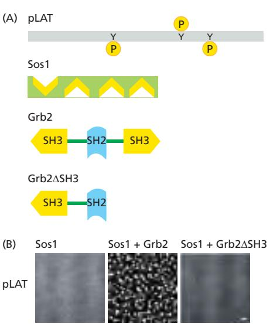

pLAT

Figure Q12–1 Condensate formation during T cell receptor signal transduction (Problem 12–7). (A) Key molecular components. (B) Appearance of small condensates (bright spots) when the critical components are present. (Modified from Figure 1A and D in X. Su et al., *Science* 352:595–599, 2016. With permission from AAAS.)

2 µm

When you insert phosphorylated LAT (pLAT) in an artificial lipid bilayer and add Grb2 and Sos1, micrometer-sized condensates form just below the bilayer (**Figure Q12–1B**). However, if you use a form of Grb2 that contains just one SH3 domain (Grb2∆SH3), instead of two, the condensates do not form (Figure Q12–1B). Why do you suppose that Grb2 supports condensate formation, while Grb2∆SH3, which is still multivalent, does not?

12–8 What is the fate of a protein with no sorting signal?

12–9 Are proteins bound for the plasma membrane common or rare among all ER membrane proteins? A few simple considerations allow one to answer this question. In a typical growing cell that is dividing once every 24 hours, the equivalent of one new plasma membrane must transit the ER every day. If the ER membrane is 20 times the area of a plasma membrane, what is the ratio of plasma membrane proteins to other membrane proteins in the ER? (Assume that all proteins on their way to the plasma membrane remain in the ER for 30 minutes on average before exiting, and that the ratio of proteins to lipids in the ER and plasma membranes is the same.)

12–10 A multipass transmembrane protein with several membrane-spanning segments is shown schematically in **Figure Q12–2**. The boxes represent membrane-spanning segments, and the arrow represents the site for cleavage of the signal sequence. In which compartments—cytosol or ER lumen—will the N- and C-termini of the mature protein be located?

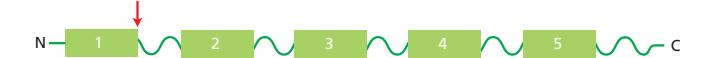

Figure Q12–2 A multipass transmembrane protein with a cleavable signal sequence (Problem 12–10). MBoC7 nQ12-103/Q12-2

12–11 All new phospholipids are added to the cytosolic leaflet of the ER membrane, yet the ER membrane has a symmetrical distribution of different phospholipids in its two leaflets. By contrast, the plasma membrane, which receives all its membrane components ultimately from the ER, has a very asymmetrical distribution of phospholipids in the two leaflets of its lipid bilayer. How is the symmetry generated in the ER membrane, and how is the asymmetry generated and maintained in the plasma membrane?

12–12 Cells with functional peroxisomes incorporate 9-(1′-pyrene)nonanol (P9OH) into membrane lipids. Exposure of such cells to ultraviolet (UV) light causes cell death by generating reactive oxygen species, which are toxic. Cells that do not make peroxisomes lack a critical enzyme responsible for incorporating P9OH into 746 Chapter 12: Intracellular Organization and Protein Sorting PROBLEMS 747

membrane lipids. How might you make use of P9OH to select for cells that are missing peroxisomes?

12–13 Components of the TIM complexes were initially identified using a genetic trick. The yeast *Ura3* gene, which encodes an enzyme that is normally located in the cytosol where it is essential for synthesis of uracil, was modified so that the protein carried an import signal for the mitochondrial matrix. A population of cells carrying the modified *Ura3* gene in place of the normal gene was then grown in the absence of uracil. Most cells died, but the rare cells that grew were shown to be defective for mitochondrial import. Explain how this selection system works. Why do most of the cells die, and why do the import-defective cells grow?

12–14 If the enzyme dihydrofolate reductase (DHFR), which is normally located in the cytosol, is engineered to carry a mitochondrial targeting sequence at its N-terminus, it is efficiently imported into mitochondria. If the modified DHFR is first incubated with methotrexate, which binds tightly to the active site, the enzyme remains in the cytosol. How do you suppose that the binding of methotrexate interferes with mitochondrial import?

12–15 Why do mitochondria need a special translocator to import proteins across the outer membrane, when the membrane already has large pores formed by porins?

12–16 Assuming that 32 million histone octamers are required to package the human genome, how many histone molecules must be transported per second per nuclear pore complex in cells whose nuclei contain 3000 nuclear pores and are dividing once per day?

12–17 Selective permeability of the nuclear pore complex (NPC) is controlled by protein components with unstructured tails that extend into the central pore. These tails are characterized by periodic repeats of the hydrophobic amino acids phenylalanine (F) and glycine (G). In a test tube at a concentration of 50 mM, the FG repeat domains of these proteins form a gel, which is held together by weak interactions between the hydrophobic FG repeats. These gels allow passive diffusion of small molecules, which fit through the holes in the mesh, but they prevent entry of larger proteins such as the fluorescent protein mCherry fused to maltose-binding protein (MBP) (**Figure Q12–3A**). However, if the nuclear import receptor, importin, is fused to a similar protein, MBP–GFP, the importin–MBP–GFP fusion readily enters the gel (**Figure Q12–3B**).

Is diffusion of importin–MBP–GFP through the FG repeat gel fast enough to account for the efficient flow of materials between the nucleus and cytosol? From experiments of the type shown in Figure Q12–3B, the diffusion coefficient (*D*) of importin–MBP–GFP through the FG repeat gel was determined to be about 0.1 μm2/sec. The equation for diffusion is *t* = *x*2/2*D*, where *t* is time and *x* is distance. About how long would it take importin–MBP– GFP to diffuse through a yeast nuclear pore (a distance of 30 nm) if the pore consisted of a gel of FG repeats?

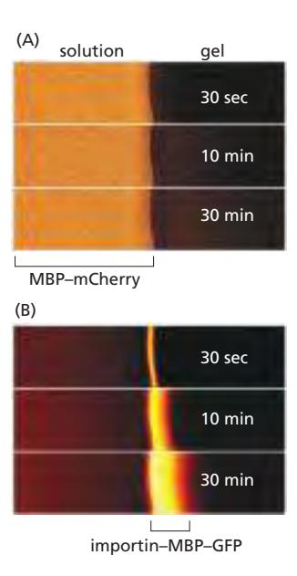

Figure Q12–3 Diffusion of proteins through FG repeat gels (Problem 12–17). Diffusion of MBP–mCherry (A) and importin–MBP–GFP (B) into a gel of FG repeats (on the *right*). The bright areas indicate regions that contain the fluorescent proteins. (Modified from Figure 2 of S. Frey & D. Görlich, *EMBO J.* 28:2554–2567, 2009.)

12–18 A classic experiment that addressed whether nuclear proteins diffused passively into the nucleus or were actively imported used several forms of radioactive nucleoplasmin, which is a large pentameric protein involved in chromatin assembly. In this experiment, either the intact protein or the nucleoplasmin heads, tails, or heads with a single tail were injected into the cytosol or the nucleus of a frog oocyte (**Figure Q12–4**). All forms of nucleoplasmin, except heads, accumulated in the nucleus when injected into the cytoplasm, and all forms were retained in the nucleus when injected there. MBoC7 mQ12.02/Q12.03

How do these experiments distinguish between active transport, in which a nuclear localization signal triggers transport by the nuclear pore complex, and passive diffusion, in which a binding site for a nuclear component allows accumulation in the nucleus?

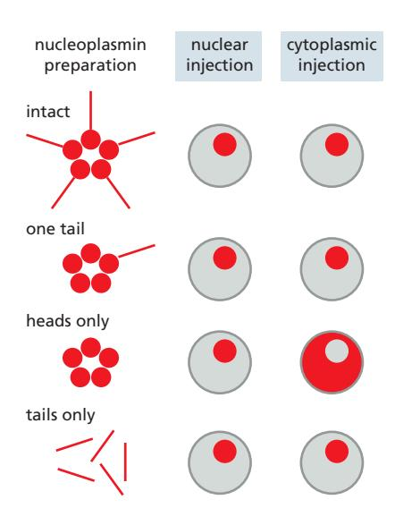

Figure Q12–4 Cellular location of injected nucleoplasmin components (Problem 12–18). The location of nucleoplasmin is indicated by the *red* areas.

# REFERENCES

#### General

Palade G (1975) Intracellular aspects of the process of protein synthesis. *Science* 189, 347–358.

#### The Compartmentalization of Cells

- Banani SF, Lee HO, Hyman AA & Rosen MK (2017) Biomolecular condensates: organizers of cellular biochemistry. *Nat. Rev. Mol. Cell Biol.* 18, 285–298.
- Baum DA & Baum B (2014) An inside-out origin for the eukaryotic cell. *BMC Biol.* 12, 76.
- Blobel G (1980) Intracellular protein topogenesis. *Proc. Natl. Acad. Sci. USA* 77, 1496–1500.
- Devos DP, Gräf R & Field MC (2014) Evolution of the nucleus. *Curr. Opin. Cell Biol.* 28, 8–15.
- Knoblach B & Rachubinski RA (2015) Motors, anchors, and connectors: orchestrators of organelle inheritance. *Annu. Rev. Cell Dev. Biol.* 31, 55–81.
- Wickner W & Schekman R (2005) Protein translocation across biological membranes. *Science* 310, 1452–1456.

#### The Endoplasmic Reticulum

- Akopian D, Shen K, Zhang X & Shan SO (2013) Signal recognition particle: an essential protein-targeting machine. *Annu. Rev. Biochem.* 82, 693–721.
- Blobel G & Dobberstein B (1975) Transfer of proteins across membranes. I. Presence of proteolytically processed and unprocessed nascent immunoglobulin light chains on membranebound ribosomes of murine myeloma. *J. Cell Biol.* 67, 835–851.
- Braakman I & Bulleid NJ (2011) Protein folding and modification in the mammalian endoplasmic reticulum. *Annu. Rev. Biochem.* 80, 71–99.
- Chen S, Novick P & Ferro-Novick S (2013) ER structure and function. *Curr. Opin. Cell Biol.* 25, 428–433.
- Christianson JC & Ye Y (2014) Cleaning up in the endoplasmic reticulum: ubiquitin in charge. *Nat. Struct. Mol. Biol.* 21, 325–335.
- Cymer F, von Heijne G & White SH (2015) Mechanisms of integral membrane protein insertion and folding. *J. Mol. Biol.* 427, 999–1022.
- Deshaies RJ, Sanders SL, Feldheim DA & Schekman R (1991) Assembly of yeast Sec proteins involved in translocation into the endoplasmic reticulum into a membrane-bound multisubunit complex. *Nature* 349, 806–808.
- Görlich D, Prehn S, Hartmann E, . . . , Rapoport TA (1992) A mammalian homolog of SEC61p and SECYp is associated with ribosomes and nascent polypeptides during translocation. *Cell* 71, 489–503.
- Hegde RS & Keenan RJ (2011) Tail-anchored membrane protein insertion into the endoplasmic reticulum. *Nat. Rev. Mol. Cell Biol.* 12, 787–798.
- Mamathambika BS & Bardwell JC (2008) Disulfide-linked protein folding pathways. *Annu. Rev. Cell Dev. Biol.* 24, 211–235.
- Marciniak SJ & Ron D (2006) Endoplasmic reticulum stress signaling in disease. *Physiol. Rev.* 86, 1133–1149.
- Milstein C, Brownlee GG, Harrison TM & Mathews MB (1972) A possible precursor of immunoglobulin light chains. *Nat. New Biol.* 239, 117–120.
- Pelham HR (1986) Speculations on the functions of the major heat shock and glucose-related proteins. *Cell* 46, 959–961.
- Pomorski TG & Menon AK (2016) Lipid somersaults: uncovering the mechanisms of protein-mediated lipid flipping. *Prog. Lipid Res.* 64, 69–84.
- Rapoport TA, Li L & Park E (2017) Structural and mechanistic insights into protein translocation. *Annu. Rev. Cell Dev. Biol.* 33, 369–390.
- Shao S & Hegde RS (2011) Membrane protein insertion at the endoplasmic reticulum. *Annu. Rev. Cell Dev. Biol.* 27, 25–56.

- Van den Berg B, Clemons Jr WM, Collinson I, . . . , Rapoport TA (2004) X-ray structure of a protein-conducting channel. *Nature* 427, 36–44.
- Walter P & Ron D (2011) The unfolded protein response: from stress pathway to homeostatic regulation. *Science* 334, 1081–1086.
- Wu H, Carvalho P & Voeltz GK (2018) Here, there, and everywhere: the importance of ER membrane contact sites. *Science* 361, eaan5835.

#### Peroxisomes

- Agrawal G & Subramani S (2016) De novo peroxisome biogenesis: evolving concepts and conundrums. *Biochim. Biophys. Acta* 1863, 892–901.
- Fujiki Y, Yagita Y & Matsuzaki T (2012) Peroxisome biogenesis disorders. *Biochim. Biophys. Acta* 1822, 1337–1342.
- Walter T & Erdmann R (2019) Current advances in protein import into peroxisomes. *Protein J.* 38, 351–362.

#### The Transport of Proteins into Mitochondria and Chloroplasts

- Araiso Y, Imai K & Endo T (2020) Structural snapshot of the mitochondrial protein import gate. *FEBS J.*, doi: 10.1111/febs.15661.
- Jarvis P & Robinson C (2004) Mechanisms of protein import and routing in chloroplasts. *Curr. Biol.* 14, R1064–R1077.
- Kessler F & Schnell DJ (2009) Chloroplast biogenesis: diversity and regulation of the protein import apparatus. *Curr. Opin. Cell Biol.* 21, 494–500.
- Schleiff E & Becker T (2011) Common ground for protein translocation: access control for mitochondria and chloroplasts. *Nat. Rev. Mol. Cell Biol.* 12, 48–59.
- Wiedemann N & Pfanner N (2017) Mitochondrial machineries for protein import and assembly. *Annu. Rev. Biochem.* 86, 685–714.

#### The Transport of Molecules Between the Nucleus and the Cytosol

- Adam SA & Gerace L (1991) Cytosolic proteins that specifically bind nuclear location signals are receptors for nuclear import. *Cell* 66, 837–847.
- Burke B & Stewart CL (2013) The nuclear lamins: flexibility in function. *Nat. Rev. Mol. Cell Biol.* 14, 13–24.
- Cole CN & Scarcelli JJ (2006) Transport of messenger RNA from the nucleus to the cytoplasm. *Curr. Opin. Cell Biol.* 18, 299–306.
- Güttinger S, Laurell E & Kutay U (2009) Orchestrating nuclear envelope disassembly and reassembly during mitosis. *Nat. Rev. Mol. Cell Biol.* 10, 178–191.
- Hetzer MW & Wente SR (2009) Border control at the nucleus: biogenesis and organization of the nuclear membrane and pore complexes. *Dev. Cell* 17, 606–616.
- Hülsmann BB, Labokha AA & Görlich D (2012) The permeability of reconstituted nuclear pores provides direct evidence for the selective phase model. *Cell* 150, 738–751.
- Köhler A & Hurt E (2007) Exporting RNA from the nucleus to the cytoplasm. *Nat. Rev. Mol. Cell Biol.* 8, 761–773.
- Lin DH & Hoelz A (2019) The structure of the nuclear pore complex (an update). *Annu. Rev. Biochem.* 88, 725–783.
- Moore MS & Blobel G (1993) The GTP-binding protein Ran/TC4 is required for protein import into the nucleus. *Nature* 365, 661–663.
- Rothballer A & Kutay U (2013) Poring over pores: nuclear pore complex insertion into the nuclear envelope. *Trends Biochem. Sci.* 38, 292–301.
- Strambio-De-Castilla C, Niepel M & Rout MP (2010) The nuclear pore complex: bridging nuclear transport and gene regulation. *Nat. Rev. Mol. Cell Biol.* 11, 490–501.
- Tran EJ & Wente SR (2006) Dynamic nuclear pore complexes: life on the edge. *Cell* 125, 1041–1053.