# Intracellular Membrane Traffic

CHAPTER

13

Every cell must eat, communicate with the world around it, and quickly respond to changes in its environment. To help accomplish these tasks, cells continually adjust the composition of their plasma membrane and internal compartments in response to need. Eukaryotic cells use an elaborate internal membrane system to add and remove cell-surface proteins, such as receptors, ion channels, and transporters (**Figure 13–1**). Through the process of *exocytosis*, the secretory pathway delivers newly synthesized proteins, carbohydrates, and lipids either to the plasma membrane or to the extracellular space. By the converse process of *endocytosis*, cells take in components of the plasma membrane and extracellular space and deliver them to internal compartments called *endosomes*.

The proteins, nutrients, lipids, and receptors delivered by endocytosis to endosomes are sorted and either recycled to the plasma membrane or delivered to *lysosomes* where they are broken down into building blocks and transported to the cytosol for use in various biosynthetic processes. Lysosomes also break down and recycle intracellular macromolecules through a process called *autophagy*. This pathway engulfs parts of the cytosol or whole organelles into a newly assembled compartment, which then fuses with lysosomes to deliver its contents for degradation. In development, cells often use autophagy to remodel their cytoplasm as they differentiate and adapt to new physiological tasks.

The interior space, or lumen, of each membrane-enclosed compartment along the secretory and endocytic pathways is topologically equivalent to the cell exterior. This means proteins can travel from the lumen of one compartment to another by means of numerous membrane-enclosed transport containers without ever having to cross a membrane (**Figure 13–2**). These containers are formed by membrane budding from a compartment and are either small spherical *vesicles*, larger irregular vesicles, or tubules. We shall use the term **transport vesicle** to apply to all forms of these containers.

Transport vesicles continually bud off from one membrane compartment and fuse with another, carrying membrane components and soluble lumenal molecules, which are referred to as **cargo**. This vesicular traffic flows along highly

#### IN THIS CHAPTER

Mechanisms of Membrane Transport and Compartment Identity

Transport from the Endoplasmic Reticulum Through the Golgi Apparatus

Transport from the *Trans* Golgi Network to the Cell Exterior and Endosomes

Transport into the Cell from the Plasma Membrane: Endocytosis

The Degradation and Recycling of Macromolecules in Lysosomes

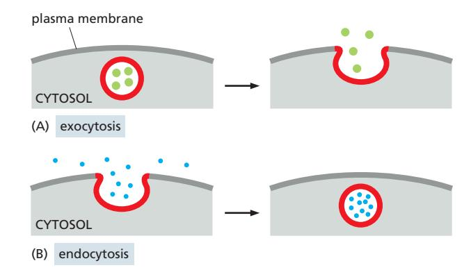

#### Figure 13–1 Exocytosis and endocytosis.

(A) In exocytosis, a transport vesicle fuses with the plasma membrane. Its content is released into the extracellular space, while the vesicle membrane *(red)* becomes continuous with the plasma membrane. (B) In endocytosis, a plasma membrane patch *(red)* is internalized, forming a transport vesicle. Its content derives from the extracellular space. The interior of the transport vesicles in panels A and B is topologically equivalent to the extracellular space.

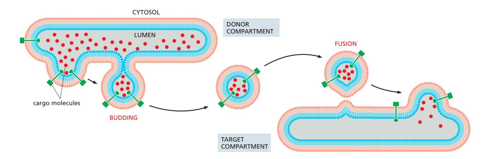

organized, directional routes, which allow the cell to secrete, eat, and remodel its plasma membrane and organelles (**Figure 13–3**). The *secretory pathway* leads outward from the endoplasmic reticulum (ER) toward the Golgi apparatus and cell surface, with a side route leading to endosomes, while the *endocytic pathway* leads inward from the plasma membrane. In each case, *retrieval pathways* bring membrane and selected proteins back to the compartment of origin to balance the flow of materials between compartments.

Figure 13–2 Vesicle transport. Transport vesicles bud off from one compartment and fuse with another. As they do so, they carry material as cargo from the *lumen* (the space within a membrane-enclosed compartment) and membrane of the donor compartment to the lumen and membrane of the target compartment, as shown.

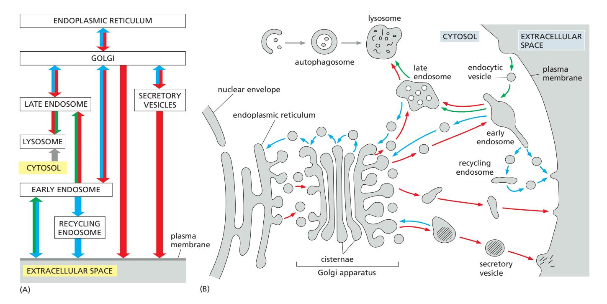

MBoC7 m13.03/13.03 Figure 13–3 A "road map" of the secretory and endocytic pathways. (A) In this schematic road map, which was introduced in Chapter 12, the endocytic and secretory pathways are illustrated with *green* and *red arrows*, respectively. In addition, *blue arrows* denote retrieval pathways for the backflow of selected components. Engulfment during autophagy is illustrated with a *gray arrow*. (B) The compartments of the eukaryotic cell involved in vesicle transport. The lumens of most membrane-enclosed compartments are topologically equivalent to each other and to the outside of the cell. All compartments shown communicate with one another and the outside of the cell by means of transport vesicles. In the secretory pathway *(red arrows)*, protein molecules are transported from the endoplasmic reticulum (ER) to the plasma membrane or (via endosomes) to lysosomes. In the endocytic pathway *(green arrows)*, molecules are ingested in endocytic vesicles derived from the plasma membrane and delivered to early endosomes and then (via late endosomes) to lysosomes. In autophagy *(gray arrows)*, cytoplasmic components engulfed into an autophagosome are delivered to lysosomes. Many endocytosed molecules are retrieved from early endosomes and returned (some via recycling endosomes) to the cell surface for reuse; similarly, some molecules are retrieved from the early and late endosomes and returned to the Golgi apparatus, and some are retrieved from the Golgi apparatus and returned to the ER. All of these retrieval pathways are shown with *blue arrows*, as in panel A.

To perform its function, each transport vesicle that buds from a compartment must be selective. It must take up only the appropriate molecules and must fuse only with the appropriate target membrane. A vesicle carrying cargo from the ER to the Golgi apparatus, for example, must exclude most other proteins that are to stay in the ER, and it must fuse only with the Golgi apparatus and not with any other organelle.

We begin this chapter by considering the molecular mechanisms of budding and fusion that underlie all vesicle transport. We then discuss the fundamental problem of how, in the face of this transport, the cell maintains the molecular and functional differences between its compartments. Finally, we consider the function of the Golgi apparatus, secretory vesicles, endosomes, and lysosomes as we trace the pathways that connect these organelles.

# MECHANISMS OF MEMBRANE TRANSPORT AND COMPARTMENT IDENTITY

Vesicle transport mediates a continual exchange of components between the 10 or more chemically distinct, membrane-enclosed compartments that collectively compose the secretory and endocytic pathways. In this section, we discuss how transport vesicles form, how they concentrate cargo within them, and how they deliver their contents selectively to another compartment. Transport begins when a special coat of proteins is assembled on a region of the cytosolic face of a membrane compartment. The coat is used to collect specific cargo components from the membrane and compartment lumen for delivery to another compartment. The coat, with the help of additional proteins, shapes the membrane into a transport vesicle that buds from the originating compartment. These vesicles selectively dock at the appropriate destination membrane and then fuse with it to deliver their cargo.

Despite the constant exchange of components between membrane-enclosed compartments, each compartment maintains its special identity of molecular markers, such as proteins or specific lipids, that are displayed on the cytosolic surface of the membrane. Cells achieve this by tightly controlling the membrane components that are packaged into departing transport vesicles. The identity markers of a compartment serve as guidance cues for outgoing traffic by recruiting the appropriate coat and for incoming traffic to ensure that transport vesicles fuse only with the correct compartment. Many of these membrane markers, however, are found on more than one compartment, and it is the specific combination of marker molecules that gives each compartment its molecular address.

#### There Are Various Types of Coated Vesicles

Most transport vesicles form from specialized, coated regions of membranes. They bud off as **coated vesicles**, which have a distinctive cage of proteins covering their cytosolic surface. Before the vesicles fuse with a target membrane, they shed their coat so that the membrane surfaces of the vesicle and destination compartment can interact directly and fuse.

The coat performs two main functions that are reflected in a common twolayered structure. First, an inner coat layer concentrates specific membrane proteins in a specialized patch, which then gives rise to the vesicle membrane. In this way, the inner layer selects the appropriate membrane molecules for transport. Second, an outer coat layer assembles into a curved, basketlike lattice that deforms the membrane patch and thereby shapes the vesicle.

There are four well-characterized types of coated vesicles, distinguished by their major coat proteins: *clathrin-coated*, *COPI-coated*, *COPII-coated*, and *retromer-coated* (**Figure 13–4**). Each type is used for different transport steps (**Figure 13–5**). Clathrin-coated vesicles mediate transport originating from the Golgi apparatus, endosome, and the plasma membrane. COPI-coated and COPII-coated vesicles mediate transport originating from the Golgi cisternae and the ER, respectively. Retromer forms coats on transport vesicles for a retrieval

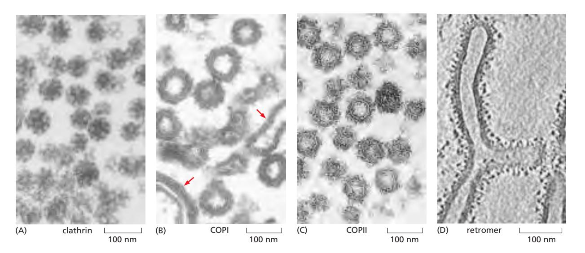

Figure 13–4 Electron micrographs of clathrin-coated, COPI-coated, COPII-coated, and retromer-coated vesicles. All coated vesicles are shown in electron micrographs at the same scale. (A) Clathrin-coated vesicles. (B) COPI-coated vesicles and Golgi cisternae *(red arrows)* from a cell-free system in which COPI-coated vesicles bud in the test tube. (C) COPII-coated vesicles. (D) Retromer-coated tubules formed in a cell-free system containing large membrane vesicles and purified retromer. (A and B, from L. Orci et al., *Cell* 46:171–184, 1986. With permission from Elsevier; C, courtesy of Charles Barlowe and Lelio Orci; D, courtesy of John Briggs.)

pathway from endosomes to the Golgi apparatus. There is, however, much more variety in coated vesicles and their functions than this short list suggests. As we discuss shortly, there are several types of clathrin-coated vesicles, each specialized for a different transport step, and the COPI-coated and COPII-coated vesicles may be similarly diverse. We discuss clathrin-coated vesicles first, as they provide a good example of how vesicles form. MBoC7 m13.04/13.04

#### The Assembly of a Clathrin Coat Drives Vesicle Formation

The major protein component of **clathrin-coated vesicles** is clathrin, which forms the outer layer of the coat. **Clathrin** is composed of a large subunit (the heavy chain) and a small subunit (the light chain). Three heavy chains and three light chains assemble into a three-legged structure called a *triskelion* (**Figure 13–6A and B**). Clathrin triskelions assemble into a basketlike framework of hexagons and pentagons on the cytosolic surface of membranes. Clathrin assembly induces the formation of coated buds (called coated pits when on the plasma membrane), which eventually pinch off to become clathrin-coated vesicles (**Figure 13–7**). Under appropriate conditions, isolated triskelions spontaneously self-assemble into typical polyhedral cages in a test tube, even

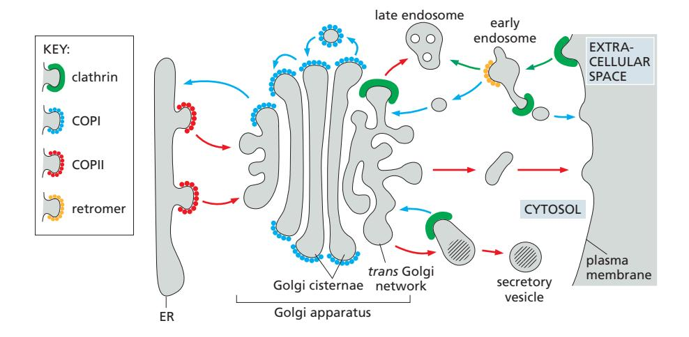

Figure 13–5 Use of different coats for different steps in vesicle traffic. Different coat proteins select different cargo and shape the transport vesicles that mediate the various steps in the secretory and endocytic pathways. When the same coats function in different places in the cell, they usually incorporate different coat protein subunits that modify their properties (not shown). Many differentiated cells have additional pathways besides those shown here, including a sorting pathway from the *trans* Golgi network to the apical surface of epithelial cells and a specialized recycling pathway for proteins of synaptic vesicles in the nerve terminals of neurons (see Figure 11–38). The arrows are colored as in Figure 13–3.

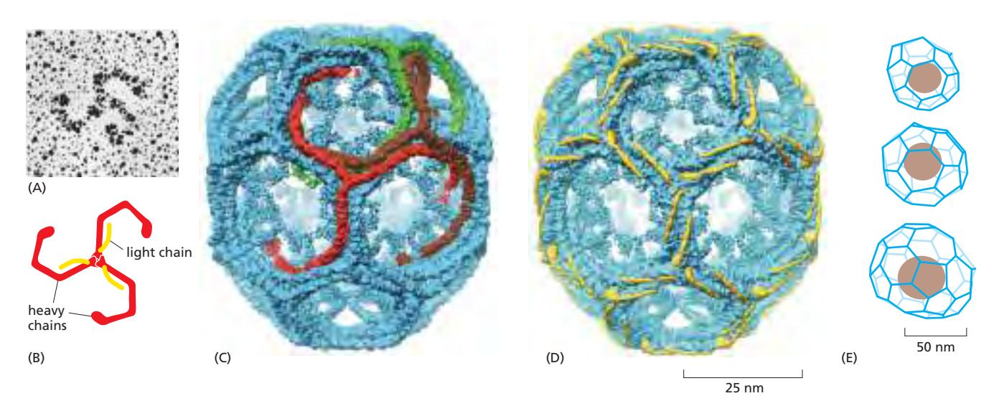

MBoC7 m13.06/13.06 Figure 13–6 The structure of a clathrin coat. (A) Electron micrograph of a clathrin triskelion shadowed with platinum. (B) Each triskelion is composed of three clathrin heavy chains and three clathrin light chains, as shown in the diagram. (C and D) A cryo-electron micrograph taken of a clathrin coat composed of 36 triskelions organized in a network of 12 pentagons and 6 hexagons, with some heavy chains (C) and light chains (D) highlighted (Movie 13.1). The light chains link to the actin cytoskeleton, which helps generate force for membrane budding and vesicle movement, and their phosphorylation regulates clathrin coat assembly. The interwoven legs of the clathrin triskelions form an outer shell from which the N-terminal domains of the triskelions protrude inward. These domains bind to the adaptor proteins shown in Figure 13–8. The coat shown was assembled biochemically from pure clathrin triskelions and is too small to enclose a membrane vesicle. (E) Structures of clathrin-coated vesicles isolated from bovine brain. The clathrin coats are constructed similarly to but in a less regular way than the coat of panels C and D, utilizing pentagons, a larger number of hexagons, and sometimes heptagons, resembling the architecture of deformed soccer balls. The structures were determined by cryo-electron microscopy and tomographic reconstruction. (A, from E. Ungewickell and D. Branton, *Nature* 289:420–422, published 1981 by Nature Publishing Group; reproduced with permission of SNCSC; C and D, from A. Fotin et al., *Nature* 432:573–579, published 2004 by Nature Publishing Group; all reproduced with permission of SNCSC; E, from Y. Cheng et al., *J. Mol. Biol*. 365:892–899, 2007. With permission from Elsevier.)

in the absence of the membrane vesicles that these baskets normally enclose (**Figure 13–6C and D**). Thus, the clathrin triskelions determine the geometry of the clathrin cage (**Figure 13–6E**).

#### Adaptor Proteins Select Cargo into Clathrin-coated Vesicles

**Adaptor proteins**, another major coat component in clathrin-coated vesicles, form a discrete inner layer of the coat, positioned between the clathrin cage and the cytosolic face of the membrane. They bind to various transmembrane protein cargoes and transmembrane receptors that capture soluble cargo molecules inside the vesicle—so-called *cargo receptors*. Adaptor proteins also bind to clathrin and recruit it to the membrane surface where it assembles and bends the membrane. In this way, the specific set of transmembrane and soluble cargoes selected by adaptor proteins is packaged into a newly formed clathrin-coated transport vesicle (**Figure 13–8**).

The assembly of adaptor proteins on the membrane is tightly controlled, in part by the cooperative interaction of the adaptor proteins with the membrane, transmembrane cargoes, and other components of the coat. The adaptor protein AP2 serves as a well-understood example. When it binds to a specific phosphorylated phosphatidylinositol lipid (a *phosphoinositide*), AP2 acquires a different conformation that exposes binding sites for cargo receptors in the membrane. The simultaneous binding to the cargo receptors and lipid head groups greatly enhances the binding of AP2 to the membrane (**Figure 13–9**). Upon binding, AP2 induces membrane curvature, which makes the binding of additional AP2 proteins in its proximity more likely. The cooperative assembly of the AP2 coat layer then is further amplified by clathrin binding, which leads to the formation and budding of a transport vesicle.

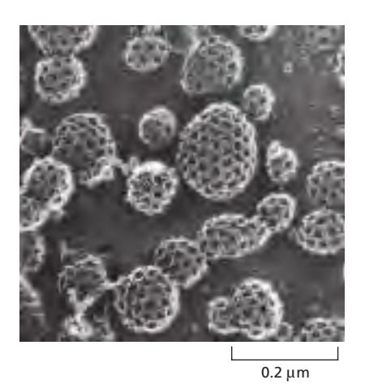

MBoC7 m13.07/13.07 Figure 13–7 Clathrin-coated pits and vesicles. This rapid-freeze, deep-etch electron micrograph shows numerous clathrin-coated pits and vesicles on the inner surface of the plasma membrane of cultured fibroblasts. The cells were rapidly frozen in liquid helium, fractured, and deepetched to expose the cytoplasmic surface of the plasma membrane. (Courtesy of John Heuser.)

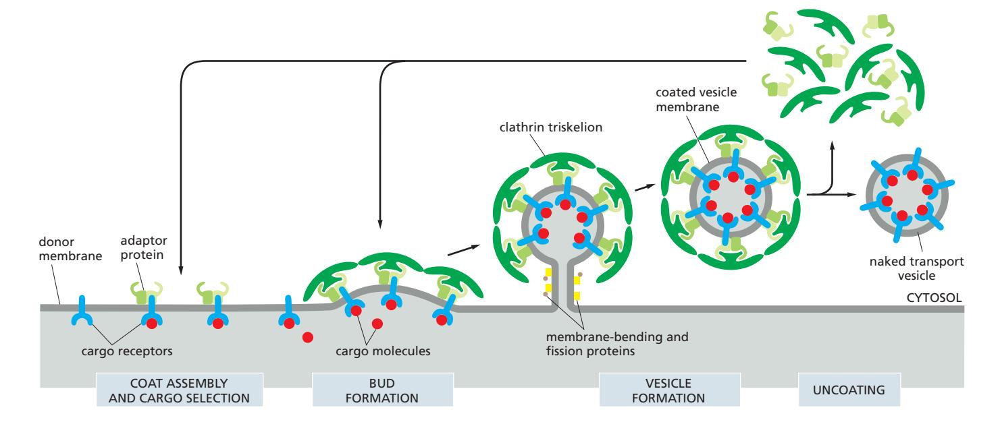

There are several types of adaptor proteins. The best characterized, like AP2, have four different protein subunits; others are single-chain proteins. Many of the adaptor proteins bind to phosphoinositides. As we will see next, different types of phosphoinositides are located in different membrane compartments, serving as one of the molecular markers of that compartment's identity. Each type of adaptor protein is specific for transmembrane cargoes and cargo receptors that share a particular amino acid sequence motif displayed on the cytosolic side of the membrane. Because different adaptor proteins have different specificities for both the type of phosphoinositide and the sequence motif they recognize, each type of adaptor protein directs assembly of a clathrin-coated vesicle only at particular membranes.

### Phosphoinositides Mark Organelles and Membrane Domains

Although inositol phospholipids typically compose less than 10% of the total phospholipids in a membrane, they have important regulatory functions. They can undergo rapid cycles of phosphorylation and dephosphorylation at the 3′, 4′, and 5′ positions of their inositol sugar head groups to produce various types of **phosphoinositides (phosphatidylinositol phosphates, or PIPs)**. The interconversion of phosphatidylinositol (PI) and PIPs is highly compartmentalized: different organelles in the endocytic and secretory pathways have distinct sets of PI and PIP kinases and PIP phosphatases (**Figure 13–10**). The distribution, regulation, and local balance of these enzymes determine the steady-state distribution MBoC7 m13.08/13.08

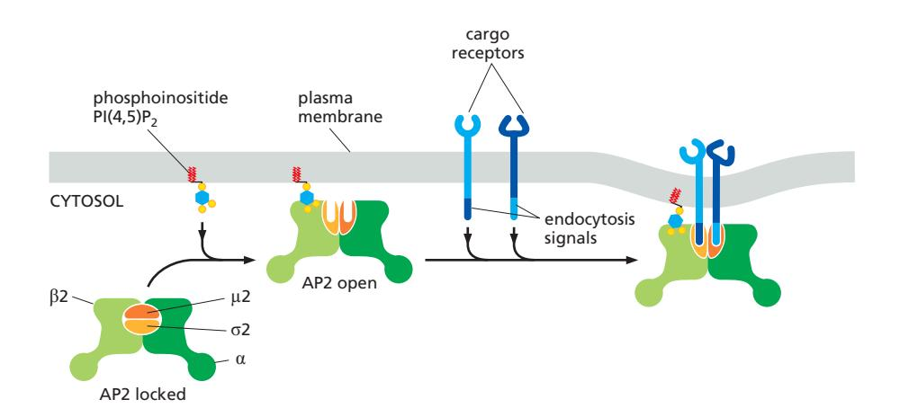

Figure 13–8 The assembly and disassembly of a clathrin coat. The assembly of the coat introduces curvature into the membrane, which leads in turn to the formation of a coated bud (called a coated pit if it is in the plasma membrane). The adaptor proteins bind both clathrin triskelions and membrane-bound cargo receptors, thereby mediating the selective recruitment of both membrane and soluble cargo molecules into the vesicle. Other membrane-bending and fission proteins are recruited to the neck of the budding vesicle, where sharp membrane curvature is introduced. The coat is rapidly lost shortly after the vesicle buds off.

Figure 13–9 Lipid-induced conformation switching of AP2. The AP2 adaptor protein complex has four subunits (α, β2, μ2, and σ2). Upon interaction with the phosphoinositide PI(4,5)P2 (see Figure 13–10) in the cytosolic leaflet of the plasma membrane, AP2 rearranges so that binding sites for cargo receptors become exposed. Each AP2 complex binds four PI(4,5)P2 molecules (for clarity, only one is shown). In the open AP2 complex, the μ2 and σ2 subunits bind the cytosolic tails of cargo receptors that display the appropriate endocytosis signals. These signals consist of short amino acid sequence motifs. When AP2 binds tightly to the membrane, it induces curvature, which favors the binding of additional AP2 complexes in the vicinity.

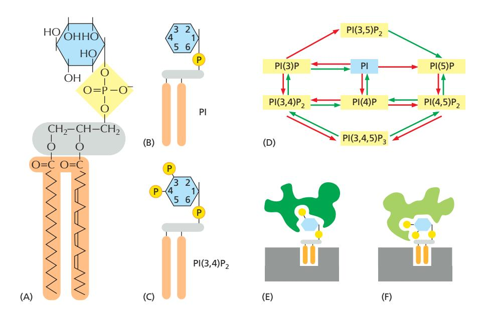

of each PIP species. As a consequence, the distribution of PIPs varies from organelle to organelle, and often within a continuous membrane from one region to another, thereby defining specialized membrane domains.

Many proteins involved at different steps in vesicle transport contain domains that bind with high specificity to the head groups of particular PIPs, distinguishing one phosphorylated form from another (see Figure 13–10). Local control of the PI and PIP kinases and PIP phosphatases can therefore be used to rapidly control the binding of proteins to a membrane or membrane domain. The production of a particular type of PIP recruits proteins containing matching PIP-binding domains. The PIP-binding proteins then help regulate vesicle formation and other steps in the control of vesicle traffic (**Figure 13–11**). The same strategy is widely used to recruit specific intracellular signaling proteins to the plasma membrane in response to extracellular signals (discussed in Chapter 15). MBoC7 m13.10/13.10

# Membrane-bending Proteins Help Deform the Membrane During Vesicle Formation

Although vesicle-budding is similar at various locations in the cell, each cell membrane poses its own special challenges. The plasma membrane, for example, is comparatively flat and stiff, owing to its cholesterol-rich lipid composition and underlying actin-rich cortex. Thus, the forces generated by clathrin coat assembly alone are not sufficient to shape and pinch off a vesicle from the plasma membrane. Other membrane-bending and force-generating proteins participate at every stage of the process.

Membrane-bending proteins that contain crescent-shaped domains, called *BAR domains*, bind to and impose their shape on the underlying membrane

Figure 13–11 The intracellular location of phosphoinositides. Different types of PIPs are located in different membranes and membrane domains, where they are often associated with specific vesicle transport events. The membrane of secretory vesicles, for example, contains PI(4)P. When the vesicles fuse with the plasma membrane, a phosphoinositide 5-kinase (PI 5-kinase) that is localized there converts the PI(4)P into PI(4,5)P2. The PI(4,5)P2, in turn, helps recruit adaptor proteins, which initiate the formation of a clathrin-coated pit, as the first step in clathrin-mediated endocytosis. Once the clathrin-coated vesicle buds off from the plasma membrane, a PI(5)P phosphatase hydrolyzes PI(4,5)P2, which weakens the binding of the adaptor proteins, promoting vesicle uncoating. We discuss phagocytosis and the distinction between regulated and constitutive exocytosis later in the chapter. (Modified from M.A. De Matteis and A. Godi, *Nat. Cell Biol.* 6: 487–492, 2004.)

Figure 13–10 Phosphatidylinositol (PI) and phosphoinositides (phosphatidylinositol phosphates, or PIPs). (A, B) The structure of PI shows the free hydroxyl groups in the inositol sugar that can be modified. (C) Phosphorylation of one, two, or three of the hydroxyl groups on PI by PI and PIP kinases produces a variety of PIP species. They are named according to the ring position (in parentheses) and the number of phosphate groups (subscript) added to PI. Phosphatidylinositol 3,4-bisphosphate [PI(3,4)P2] is shown. (D) Animal cells have several PI and PIP kinases and a similar number of PIP phosphatases, which are localized to different organelles, where they are regulated to catalyze the production of particular PIPs. The *red* and *green arrows* show the kinase and phosphatase reactions, respectively. (E, F) Phosphoinositide head groups are recognized by protein domains that discriminate between the different forms. In this way, select groups of proteins containing such domains are recruited to regions of membrane in which these phosphoinositides are present. Phosphatidylinositol 3-phosphate [PI(3)P] in the endosome membrane, and phosphatidylinositol 4,5-bisphosphate [PI(4,5)P2] in the plasma membrane, are shown. (D, modified from M.A. De Matteis and A. Godi, *Nat. Cell Biol.* 6:487–492, 2004.)

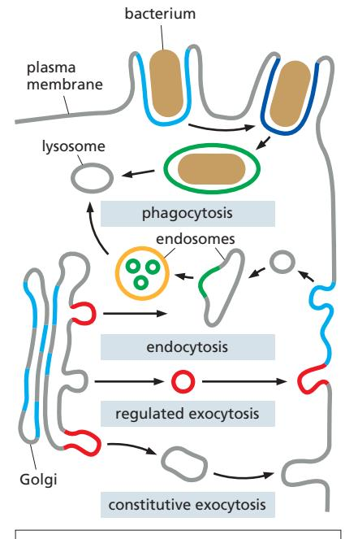

KEY: PI(3)P PI(4)P PI(4,5)P2 PI(3,5)P2 PI(3,4,5)P3

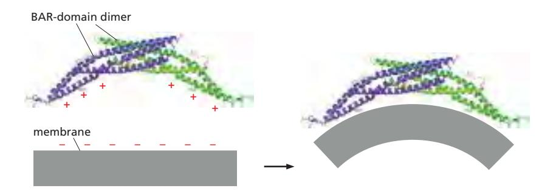

via electrostatic interactions with the lipid head groups (**Figure 13–12**; also see Figure 10–40). Some of these proteins also contain amphiphilic helices that induce membrane curvature after being inserted as wedges into the cytoplasmic leaflet of the membrane. The curved membrane generated by BAR-domain proteins is thought to help AP2 nucleate the formation of a clathrin-coated bud. MBoC7 m13.12/13.12

Other BAR-domain proteins are important in shaping the neck of a budding vesicle, where stabilization of sharp membrane bends is essential. These BAR-domain proteins, together with the clathrin machinery they help nucleate, stimulate the local assembly of actin filaments (**Figure 13–13**). The growing filaments push on the membrane surrounding the budding vesicle and further help propel it away from the membrane.

# Cytoplasmic Proteins Regulate the Pinching off and Uncoating of Coated Vesicles

As a clathrin-coated bud grows, soluble cytoplasmic proteins, including **dynamin**, assemble at the neck of the bud and ultimately pinch off the membrane to release the fully formed clathrin-coated vesicle (**Figure 13–14**). Dynamin contains a phosphoinositide-binding domain, which tethers the protein to the membrane, and a GTPase domain, which regulates the rate at which vesicles pinch off from the membrane. The pinching-off process brings the two noncytosolic leaflets of the membrane at the bud neck into close proximity and seals off the forming vesicle (see Figure 13–2). To perform this task, dynamin assembles in a ring around the neck, then undergoes a conformational change when it hydrolyzes its bound GTP. This constricts the dynamin ring together with the underlying membrane at the bud neck. In addition, dynamin may recruit lipidmodifying enzymes that change the lipid composition locally at the neck of the bud to facilitate membrane fusion.

Once released from the membrane, the vesicle rapidly loses its clathrin coat because factors that are co-packaged into a clathrin-coated vesicle initiate reactions that lead to coat disassembly. A phosphoinositide phosphatase in the vesicle depletes the phosphoinositide that binds to the adaptor proteins of the coat. In addition, *auxilin*, another vesicle protein, activates the ATPase of an hsp70 chaperone protein (see Figure 6–80) that uses the energy of ATP hydrolysis to peel off the clathrin coat. The release of the coat, however, must not happen prematurely, so additional control mechanisms must somehow prevent the clathrin from being removed before it has formed a complete vesicle.

#### Monomeric GTPases Control Coat Assembly

So far we have discussed clathrin-coated vesicles at the plasma membrane to illustrate several principles of coat formation, membrane budding, and uncoating. The formation of COPI coats, COPII coats, retromer coats, and other types of clathrin coats works by similar principles but differs in many important ways. A critical difference is the mechanism cells use to determine when and where to initiate coat formation. While local production of PIPs plays a major part in regulating the assembly of clathrin coats on the plasma membrane and Golgi apparatus, *coat-recruitment GTPases* control the assembly of COPI coats on Golgi

Figure 13–12 The structure of BAR domains. BAR-domain proteins are diverse and enable many membrane-bending processes in the cell. BAR domains are built from coiled coils that dimerize into modules that have a positively charged inner surface, which preferentially interacts with negatively charged lipid head groups to bend membranes. Local membrane deformations caused by BAR-domain proteins facilitate the binding of additional BAR-domain proteins, thereby generating a positive feedback cycle for curvature propagation. Individual BAR-domain proteins contain a distinctive curvature and often have additional features that adapt them to their specific tasks: some have short amphiphilic helices that cause further membrane deformation by wedge insertion; others are flanked by PIP-binding domains that direct them to membranes enriched in cognate phosphoinositides. (PDB code: 1ZWW.)

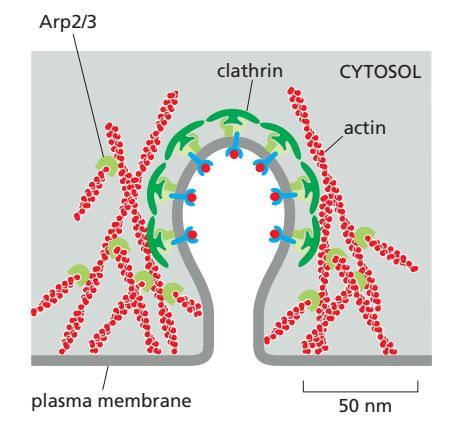

Figure 13–13 Local actin polymerization helps drive budding of membrane vesicles. Polymerization of actin filaments occurs near the vesicle neck, helping propel the budding vesicle away from the plasma membrane.

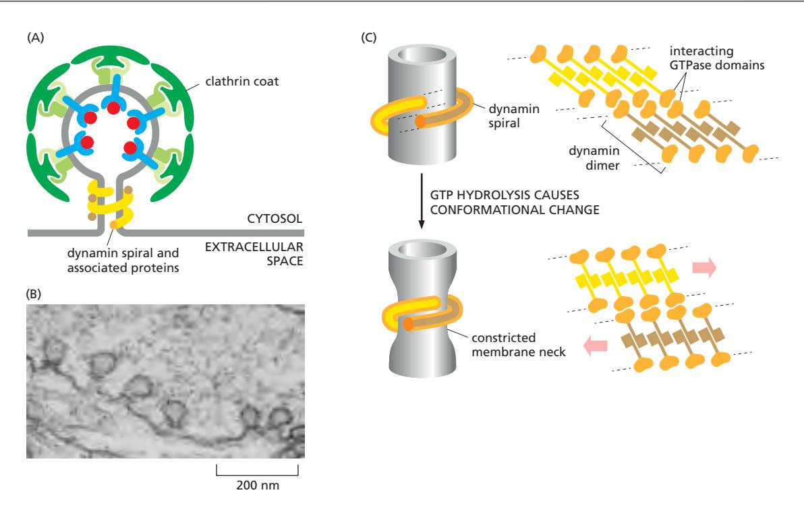

MBoC7 m13.13/13.14 Figure 13–14 The role of dynamin in pinching off clathrin-coated vesicles. (A) Multiple dynamin molecules assemble into a spiral around the neck of the forming bud. The dynamin spiral is thought to recruit other proteins to the bud neck, which, together with dynamin, destabilize the interacting lipid bilayers so that the noncytoplasmic leaflets flow together. The newly formed vesicle then pinches off from the membrane. Specific mutations in dynamin can either enhance or block the pinchingoff process. (B) Dynamin was discovered as the protein defective in the *shibire* mutant of *Drosophila.* These mutant flies become paralyzed because clathrin-mediated endocytosis stops, and the synaptic vesicle membrane fails to recycle, blocking neurotransmitter release. Deeply invaginated clathrin-coated pits form in the nerve endings of the fly's nerve cells, with a belt of mutant dynamin assembled around the neck, as shown in this thin-section electron micrograph. The pinching-off process fails because the required membrane fusion does not take place. (C) A model of how conformational changes in the GTPase domains of membrane-assembled dynamin can power a conformational change that constricts the neck of the bud. In this model, dynamin dimers polymerize to form the dynamin spiral. Where two rungs of the spiral meet, the GTPase domains of one rung's dynamins interact with the GTPase domains of the other rung's dynamins. GTP hydrolysis by the GTPase domains induces conformational changes that cause compaction of individual dynamin molecules, leading to partial constriction of the dynamin spiral. Loss of GTP weakens the interactions of the GTPase domains with each other, and rebinding of GTP reverses the compacted state to allow the GTPase domains to bind at the adjacent position on the opposite rung (this step is not shown). In this way, the dynamin molecules can undergo a stepping motion in the direction indicated by the *pink arrows*. Cycles of dynamin compaction and stepping, powered by cycles of GTP binding and hydrolysis, is one model for how dynamin constricts the neck of a budding vesicle. (B, from J.H. Koenig and K. Ikeda, *J. Neurosci.* 9:3844–3860, 1989. Copyright 1989 Society for Neuroscience. With permission from the Society for Neuroscience.)

membranes, COPII coats on ER membranes, and retromer and clathrin coats on endosomes.

**Coat-recruitment GTPases** are members of a family of monomeric GTPases. They include the **ARF proteins**, which are responsible for the assembly of both COPI and clathrin coats at Golgi membranes, the **Sar1 protein**, which is responsible for the assembly of COPII coats at the ER membrane, and Rab7, which initiates the assembly of retromer coats at the endosome membrane. As discussed in Chapter 3, GTP-binding proteins regulate many processes in eukaryotic cells. They act as molecular switches, which toggle between an active state with GTP bound and an inactive state with GDP bound. Two classes of proteins regulate the toggling: *guanine nucleotide exchange factors* (*GEFs*) activate the proteins by catalyzing the exchange of GDP for GTP, and *GTPase-activating proteins* (*GAPs*) inactivate the proteins by triggering the hydrolysis of the bound GTP to GDP (see Figures 3–68 and 15–7).

Coat-recruitment GTPases are usually found in high concentration in the cytosol in an inactive, GDP-bound state. When a **COPII-coated vesicle** is to bud from the ER membrane, a specific **Sar1 GEF** embedded in the ER membrane binds to cytosolic Sar1, causing the Sar1 to release its GDP. Because GTP is present in

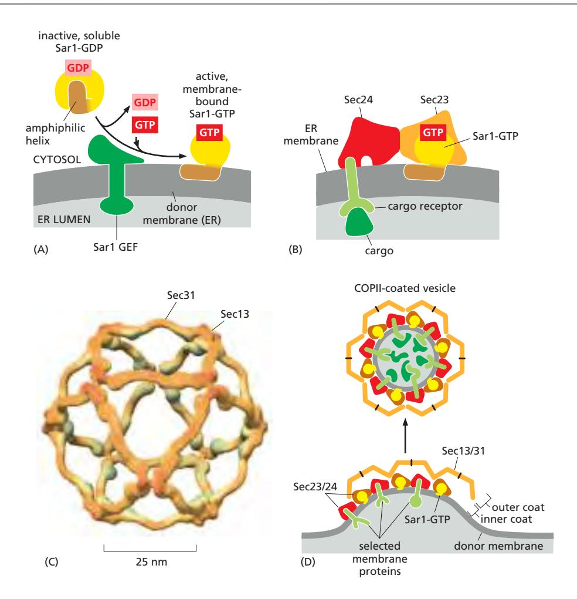

Figure 13–15 Formation of a COPIIcoated vesicle. (A) Inactive, soluble Sar1-GDP binds to a Sar1 GEF in the ER membrane, causing Sar1 to release its GDP and bind GTP. A GTP-triggered conformational change in Sar1 exposes an amphiphilic helix, which inserts into the cytoplasmic leaflet of the ER membrane, initiating membrane bending (which is not shown). (B) GTP-bound Sar1 binds to a complex of two COPII adaptor coat proteins, called Sec23 and Sec24, which form the inner coat. Sec24 has several different binding sites for the cytosolic tails of cargo receptors. The entire surface of the complex that attaches to the membrane is gently curved, matching the diameter of COPII-coated vesicles. (C) A complex of two additional COPII coat proteins, called Sec13 and Sec 31, forms the outer shell of the coat. Like clathrin, they can assemble on their own into symmetrical cages with appropriate dimensions to enclose a COPII-coated vesicle. (D) Membrane-bound, active Sar1-GTP recruits COPII adaptor proteins to the membrane. They select certain transmembrane proteins and cause the membrane to deform. The adaptor proteins then recruit the outer coat proteins, which help form a bud. A subsequent sealing event pinches off the coated vesicle. Other coated vesicles are thought to form in a similar way. (C, modified from S.M. Stagg et al., *Nature* 439:234–238, published 2006 by Nature Publishing Group. Reproduced with permission of SNCSC.)

much higher concentration in the cytosol than GDP, Sar1 binds GTP as soon as GDP is released. In its GTP-bound state, the Sar1 protein exposes an amphiphilic helix, which inserts into the cytoplasmic leaflet of the lipid bilayer of the ER membrane. The tightly bound Sar1 now recruits adaptor coat protein subunits to the ER membrane to initiate budding (**Figure 13–15**). Other GEFs and coat-recruitment GTPases operate in a similar way on other membranes (**Movie 13.2**). Some of the small monomeric GTPases use an amphiphilic helix, whereas others use an attached lipid to anchor them to membranes. Thus, GEFs located in different compartments serve as important spatial cues that control where different coat-recruitment GTPases are activated to initiate the formation of different types of transport vesicles. MBoC7 m13.14/13.15

#### Coat-recruitment GTPases Participate in Coat Disassembly

As with clathrin-coated vesicles at the plasma membrane, other types of coats must also disassemble once the transport vesicle has budded off the originating compartment. Without coat disassembly, the vesicle membrane could not fuse with that of its target compartment, and coated vesicles would permanently accumulate in the cell with no place to go. Budding vesicles therefore incorporate proteins that initiate coat disassembly only after the vesicle has fully formed. This critical switch from coat formation to coat disassembly is triggered by coat-recruitment GTPases. The hydrolysis of bound GTP to GDP causes the GTPase to change its conformation so that its hydrophobic tail pops out of the membrane, causing the vesicle's coat to disassemble. Thus, the rate at which coat-recruitment GTPases hydrolyze GTP determines the length of time their associated coats stay assembled.

COPII coats accelerate GTP hydrolysis by Sar1, and a fully formed vesicle will be produced only when bud formation occurs faster than the timed disassembly process; otherwise, disassembly will be triggered before a vesicle pinches off, and the process will have to start again, perhaps at a more appropriate time and place. Once a vesicle pinches off, GTP hydrolysis releases Sar1, but the sealed coat is sufficiently stabilized through many cooperative interactions, including binding to the cargo receptors in the membrane, that it may stay on the vesicle until the vesicle arrives at a target membrane. There, a kinase phosphorylates the coat proteins, which completes coat disassembly and readies the vesicle for fusion.

Clathrin-coated and COPI-coated vesicles, by contrast, shed their coat soon after they pinch off. For **COPI-coated vesicles**, the curvature of the vesicle membrane serves as a trigger to begin uncoating. An ARF GAP that is recruited to the COPI coat as it assembles senses the lipid packing density. When the curvature of the membrane approaches that of a transport vesicle, the ARF GAP is activated. It then stimulates ARF to hydrolyze its GTP, causing the coat to disassemble.

#### The Shape and Size of Transport Vesicles Are Diverse

The types of cargoes that need to be transported through the cell are diverse in size, shape, and topology. Transport vesicles can similarly be diverse in their morphology to accommodate the cargoes they carry. Collagen, for example, is assembled in the ER as 300-nm-long, stiff procollagen rods that then are secreted from the cell where they are eventually embedded into the extracellular matrix (discussed in Chapter 19). Procollagen rods do not fit into the 60- to 80-nm-diameter COPII vesicles that normally carry smaller cargoes. To circumvent this problem, the procollagen cargo molecules bind to transmembrane *packaging proteins* in the ER, which control the assembly of the COPII coat components (**Figure 13–16**). These events are thought to drive the local assembly of much larger COPII vesicles that accommodate the oversized cargo. Human mutations in genes encoding such packaging proteins result in collagen defects with severe consequences, such as skeletal abnormalities and other developmental defects. Similar mechanisms must regulate the sizes of vesicles required to secrete other large macromolecular complexes, including the lipoprotein particles that transport lipids out of cells.

Another variation on small spherical transport vesicles is thin membrane tubules. Tubules have a higher surface-to-volume ratio than vesicles or the larger organelles from which they form. They are therefore relatively enriched in membrane proteins compared with soluble cargo proteins. As we discuss later, this property of tubules is an important feature for sorting proteins in endosomes. The retromer coat, which is specialized for transporting membrane proteins from endosomes to the Golgi apparatus, preferentially drives the formation of tubular transport vesicles (Figure 13–4).

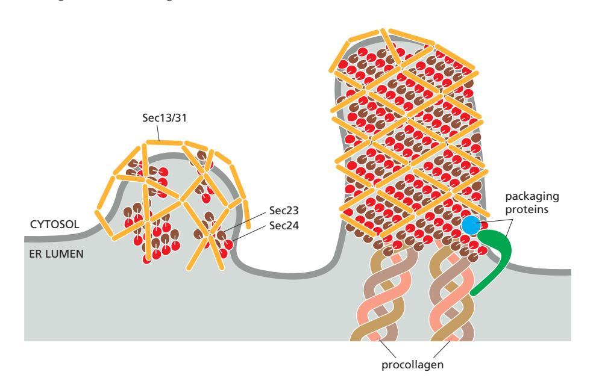

#### Figure 13–16 Packaging of procollagen into large tubular COPII-coated vesicles.

The diagrams show models for two COPII coat assembly modes. The models are based on cryo-electron tomography images of reconstituted COPII vesicles. On a spherical membrane *(left)*, the Sec23/24 inner COPII coat proteins assemble in patches that anchor the Sec13/31 outer coat COPII protein cage. The Sec13/31 rods assemble a cage of triangles, squares, and pentagons. When procollagen needs to be packaged *(right)*, special packaging proteins sense the cargo and modify the coat assembly process. This interaction recruits the COPII inner coat protein Sec24 and locally enhances the rate with which Sar1 cycles on and off the membrane (not shown). In addition, a monoubiquitin (not shown) is added to the Sec31 protein, changing the assembly properties of the outer cage. Sec23/24 proteins arrange in larger arrays, and Sec13/31 proteins arrange in a regular lattice of diamond shapes. As a result, a large tubular vesicle is formed that can accommodate the large cargo molecules. The packaging proteins are not part of the budding vesicle but remain in the ER. (Modified from G. Zanetti et al., *eLife* 2:e00951, 2013. With permission from the authors.)

# Rab Proteins Guide Transport Vesicles to Their Target Membrane

To ensure an orderly flow of vesicle traffic, transport vesicles must be highly accurate in recognizing the correct target membrane with which to fuse. Because of the diversity and crowding of membrane systems in the cytoplasm, a vesicle is likely to encounter many potential target membranes before it finds the correct one. Specificity in targeting is ensured because all transport vesicles display surface markers that identify them according to their origin and type of cargo, and target membranes display complementary receptors that recognize the appropriate markers. Two types of markers act sequentially to ensure the specificity of vesicle targeting. First, *Rab proteins* direct the vesicle to specific spots on the correct target membrane. Second, *SNARE proteins* enable the fusion of the lipid bilayers.

Like the coat-recruitment GTPases discussed earlier (see Figure 13–15), **Rab proteins** are also monomeric GTPases. With more than 60 known members in mammalian cells, the Rab subfamily is the largest of the monomeric GTPase subfamilies. Each Rab protein is associated with one or more membrane-enclosed organelles of the secretory or endocytic pathway, and each of these organelles has at least one Rab protein on its cytosolic surface (**Table 13–1**). Different Rab proteins are also found on the different types of transport vesicles that ferry cargoes between organelles. Their selective distribution on these membrane systems makes Rab proteins ideal molecular markers for identifying each type of transport vesicle and target membrane in order to guide vesicle traffic.

Rab proteins cycle between a membrane and the cytosol and regulate the reversible assembly of protein complexes on the membrane. In their GDP-bound state, they are inactive and bound to another protein (*GDP dissociation inhibitor*, or *GDI*) that keeps them soluble in the cytosol. Membrane-bound Rab GEFs activate Rab proteins by catalyzing the exchange of GDP for GTP. Once in the GTP-bound state, the Rab protein's lipid anchor inserts into the membrane where the Rab binds to a diverse set of proteins called **Rab effectors** (**Figure 13–17**). The rate of GTP hydrolysis sets the concentration of active Rab and, consequently, the concentration of its effectors on the membrane.

A Rab protein is activated on a transport vesicle when a specific component of the vesicle, often a coat component, recruits a Rab GEF. Rab protein activation has several consequences. First, the Rab protein itself serves as a specific molecular cue that can be recognized by *tethering proteins* localized at the target membrane. Tethering proteins are typically protein complexes that often contain threadlike domains that serve as "fishing lines" capable of capturing a vesicle up to 200 nm away. Second, the Rab protein can interact with *motor proteins*, common Rab effectors that propel vesicles along actin filaments or microtubules to their target membrane. Third, the Rab protein can recruit a Rab effector that selectively binds proteins on the target membrane, such as the SNARE proteins located there.

| TABLE 13–1 Subcellular Locations of Some Rab Proteins |                                                            |
|-------------------------------------------------------|------------------------------------------------------------|
| Protein                                               | Organelle                                                  |
| Rab1                                                  | ER and Golgi complex                                       |
| Rab2                                                  | cis Golgi network                                          |
| Rab3A                                                 | Synaptic vesicles, secretory vesicles                      |
| Rab4/Rab11                                            | Recycling endosomes                                        |
| Rab5                                                  | Early endosomes, plasma membrane, clathrin-coated vesicles |
| Rab6                                                  | Medial and trans Golgi cisternae                           |
| Rab7                                                  | Late endosomes                                             |
| Rab8                                                  | Cilia                                                      |
| Rab9                                                  | Late endosomes, trans Golgi network                        |

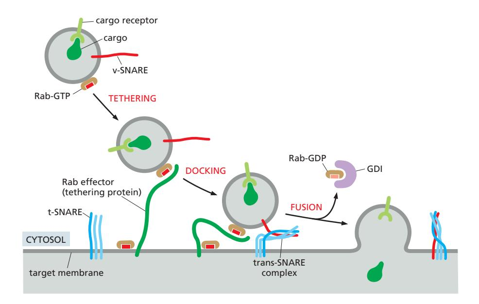

Figure 13–17 Tethering of a transport vesicle to a target membrane. Rab effector proteins interact with active Rab proteins (Rab-GTPs, *brown*) located on the target membrane, vesicle membrane, or both, to establish the first connection between the two membranes that are going to fuse. In the example shown here, the Rab effector is a filamentous tethering protein *(dark green)*. Next, SNARE proteins on the two membranes (*red* and *blue*) pair, docking the vesicle to the target membrane and catalyzing the fusion of the two apposed lipid bilayers. During docking and fusion, a Rab GAP (not shown) induces the Rab protein to hydrolyze its bound GTP to GDP, causing the Rab to dissociate from the membrane and return to the cytosol as Rab-GDP, where it is bound by a GDP dissociation inhibitor (GDI) protein that keeps the Rab soluble and inactive.

Through one or more of these mechanisms, a Rab protein selectively activated on a transport vesicle guides and docks it at the correct target membrane. Some Rab proteins, such as Rab7 discussed earlier, also function as coat-recruitment GTPases that initiate new budding events as organelles mature, as we discuss next.

# Rab Proteins Create and Change the Identity of an Organelle

In addition to acting on vesicles, Rab proteins also function on organelle membranes. As on vesicles, a specific Rab GEF at the organelle catalyzes Rab protein activation and insertion at the membrane surface. Many of the effector proteins recruited by an activated Rab protein help give the organelle its identity by directly controlling incoming and outgoing transport vesicles. These effectors include tethering proteins mentioned previously, SNAREs that mediate membrane fusion of incoming vesicles, and enzymes that generate or modify specific phosphoinositides. MBoC7 m13.16/13.17

The assembly of Rab proteins and their effectors on an organelle membrane can be cooperative and results in the formation of large, specialized membrane patches that define the identity of that organelle. Active Rab5 on the endosome membrane, for example, recruits more copies of the same Rab5 GEF that initially activated Rab5. This stimulates the recruitment of more Rab5 to the same site. At the same time, active Rab5 activates a PI 3-kinase, which locally converts PI to PI(3)P, which in turn binds some of the Rab effectors including tethering proteins and stabilizes their local membrane attachment (**Figure 13–18**). This type of positive feedback greatly amplifies the assembly process and helps to establish functionally distinct membrane domains within a continuous organelle membrane.

Figure 13–18 The formation of a Rab5 associated patch on the endosome membrane. A Rab5 GEF on the endosome membrane binds a Rab5 protein and induces it to exchange GDP for GTP. GDI is lost, and GTP binding alters the conformation of the Rab protein to expose a covalently attached lipid group, which anchors the Rab5-GTP to the membrane. Active Rab5 activates PI 3-kinase, which converts PI into PI(3)P. PI(3)P and active Rab5 together bind a variety of Rab effector proteins that contain PI(3)P-binding sites, including filamentous tethering proteins that catch incoming clathrin-coated endocytic vesicles from the plasma membrane. With the help of another effector, active Rab5 also recruits more Rab5 GEF, further enhancing the assembly of the Rab5-associated patch on the membrane. Controlled cycles of GTP hydrolysis and GDP–GTP exchange dynamically regulate the size and activity of such Rab-associated membrane patches. Unlike SNAREs, which are integral membrane proteins, the GDP– GTP cycle, coupled to the membrane– cytosol translocation cycle, endows the Rab machinery with the ability to undergo assembly and disassembly on the membrane. (Adapted from M. Zerial and H. McBride, *Nat. Rev. Mol. Cell Biol.* 2:107–117, 2001.)

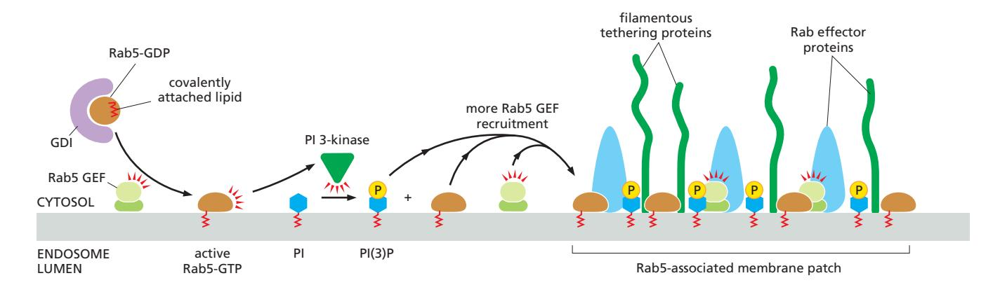

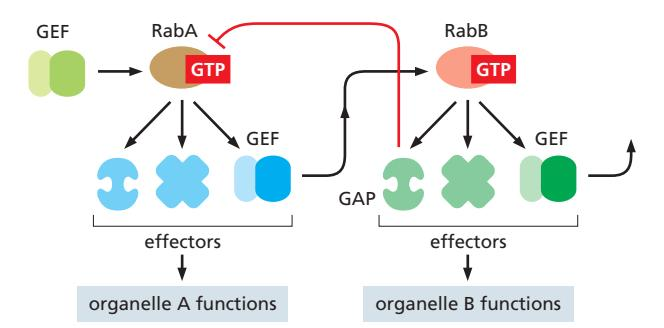

It is thought that different Rab proteins and their effectors help to create multiple specialized membrane domains, each fulfilling a particular set of functions. Thus, while the Rab5-associated membrane patch receives incoming endocytic vesicles from the plasma membrane, distinct Rab11- and Rab4-associated patches in the same endosome organize the budding of recycling vesicles that return proteins from the endosome to the plasma membrane. As we have already discussed, Rab7 on the endosome membrane serves as a coat-recruitment GTPase for retromer, initiating the formation of transport vesicles destined for the Golgi. MBoC7 m13.18/13.19

One Rab protein can be replaced by a different Rab protein, and this can change the identity of its associated organelle. This is accomplished by one Rab protein selectively recruiting and activating a different Rab protein whose complement of effectors includes proteins that inactivate the first Rab protein and thereby disassemble its associated membrane patch. Such ordered recruitment of sequentially acting Rab proteins is called a **Rab cascade** (**Figure 13–19**). Over time, for example, Rab5-associated membrane patches are replaced by Rab7 associated membrane patches on endosomal membranes. This converts an early endosome, marked by Rab5, into a late endosome, marked by Rab7. Because the set of Rab effectors recruited by Rab7 is different from that recruited by Rab5, this change reprograms the compartment including the incoming and outgoing traffic and repositions the organelle away from the plasma membrane toward the cell interior. All of the cargo contained in the early endosome that has not been recycled to the plasma membrane is now part of a late endosome. This process is also referred to as *endosome maturation*. The self-amplifying nature of the Rab-associated membrane patches renders the process of endosome maturation unidirectional and irreversible.

#### SNAREs Mediate Membrane Fusion

Once a transport vesicle has budded from its originating compartment and shed its coat, membrane fusion allows it to unload its cargo at its destination compartment. Membrane fusion requires bringing the lipid bilayers of two membranes to within 1.5 nm of each other so that they can merge. When the membranes are in such close proximity, lipids can flow from one bilayer to the other. For this close approach, water must be displaced from the hydrophilic surface of the membrane—a process that is highly energetically unfavorable and requires specialized *fusion proteins* that overcome this energy barrier. We have already discussed the role of dynamin in the related task of squeezing membranes close together during the pinching off of clathrin-coated vesicles (see Figure 13–14).

The **SNARE proteins** (also called **SNAREs**, for short) catalyze the membrane fusion reactions in vesicle transport. There are at least 35 different SNAREs in an animal cell, each associated with a particular organelle in the secretory or endocytic pathway. These transmembrane proteins exist as complementary sets, with **v-SNAREs** usually found on vesicle membranes and **t-SNAREs** usually found on target membranes (see Figure 13–17). A v-SNARE is a single polypeptide chain, whereas a t-SNARE is usually composed of three proteins. The v-SNAREs and t-SNAREs have characteristic helical domains that are mostly unstructured in isolation. When a v-SNARE interacts with a t-SNARE, the helical domains of one zipper up with the helical domains of the other to form a very stable four-helix

#### Rab cascade. The local activation of a RabA GEF leads to assembly of a RabAassociated membrane patch (sometimes called a "Rab domain") on the membrane. Active RabA recruits its effector proteins, one of which is a GEF for RabB. The RabB GEF then recruits RabB to the membrane, which in turn begins to recruit its effectors, among them a GAP for RabA. The RabA GAP activates RabA-GTP hydrolysis leading to the inactivation of the RabA and the disassembly of the RabA-associated membrane patch as the RabB-associated membrane patch grows. In this way, the RabA-associated

membrane patch is irreversibly replaced by the RabB-associated membrane patch. In principle, this sequence can be continued by the recruitment of a next GEF by RabB. (Adapted from A.H. Hutagalung and P.J. Novick, *Physiol. Rev.* 91:119–149, 2011.)

Figure 13–19 A model for a generic

Figure 13–20 A model for how SNARE proteins catalyze membrane fusion. Bilayer fusion occurs in multiple steps. A tight pairing between v- and t-SNAREs forces lipid bilayers into close apposition and expels water molecules from the interface. Lipid molecules in the two interacting (cytosolic) leaflets of the bilayers then flow between the membranes to form a connecting stalk. Lipids of the two noncytosolic leaflets then contact each other, forming a new bilayer, which widens the fusion zone (*hemifusion*, or half-fusion). Rupture of the new bilayer completes the fusion reaction.

bundle. The resulting *trans-SNARE complex* locks the two membranes together. Biochemical membrane fusion assays with all different SNARE combinations show that v- and t-SNARE pairing is highly specific. The SNAREs thus provide an additional layer of specificity in the transport process by helping to ensure that vesicles fuse only with their correct target membrane.

The extremely high stability of the trans-SNARE complex means that its assembly from initially unstructured v- and t-SNAREs is energetically favorable. This energy is exploited to pull the membrane faces together, simultaneously squeezing out water molecules from the interface to initiate lipid bilayer fusion (**Figure 13–20**). When liposomes containing purified v-SNAREs are mixed with liposomes containing complementary t-SNAREs, their membranes fuse, albeit slowly. In the cell, fusion is greatly accelerated by factors that interact with v-SNARE and t-SNARE pairs to align them precisely so they can initiate zippering. Fusion does not always follow immediately after v-SNAREs and t-SNAREs pair. As we discuss later, in the process of regulated exocytosis, zippering of the last part of the trans-SNARE complex is delayed until secretion is triggered by a specific extracellular signal.

# Interacting SNAREs Need to Be Pried Apart Before They Can Function Again

After SNARE proteins have participated in membrane fusion, the highly stable trans-SNARE complexes have to disassemble before the SNAREs can mediate new rounds of transport. A crucial protein called **NSF** cycles between membranes and the cytosol and catalyzes the disassembly process. NSF is a hexameric ATPase of the family of AAA-proteins (see Figure 6–88) that uses the energy of ATP hydrolysis to unravel the intimate interactions between the helical domains of paired SNARE proteins (**Figure 13–21**). After disassembly, the SNARE proteins can again exploit the energy gained by their assembly to drive another fusion reaction. Thus, the energy for SNARE-mediated fusion reactions ultimately comes from the ATP consumed by NSF to pry them apart. After trans-SNARE complex disassembly at the destination compartment, v-SNAREs are selectively retrieved and returned to their compartment of origin so that they can be reused in newly formed transport vesicles. Such selective retrieval pathways (discussed later) are critical for maintaining the identity of each compartment in the face of constant outgoing traffic.

Membrane fusion is important in other processes besides vesicle transport. The plasma membranes of a sperm and an egg fuse during fertilization, myoblasts fuse with one another during the development of multinucleate muscle fibers (discussed in Chapter 22), and the epithelial cells in the human placenta fuse into a giant syncytium that separates the mother from the fetus. Likewise, the ER network and mitochondria fuse and fragment in a dynamic way (discussed in Chapters 12 and 14). All cell membrane fusions require special proteins and are tightly regulated to ensure that only appropriate membranes fuse. The controls

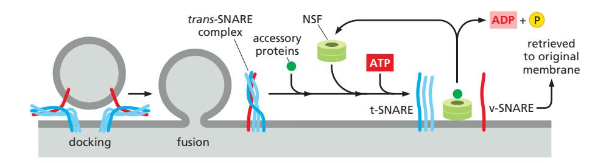

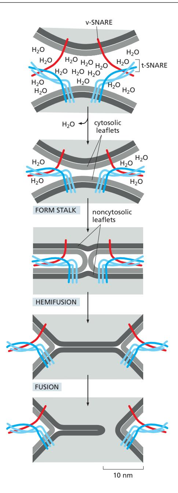

Figure 13–21 Dissociation of SNARE pairs by NSF after a membrane fusion cycle. After a v-SNARE and t-SNARE have effected the fusion of a transport vesicle with a target membrane, NSF binds to the SNARE complex and, with the help of accessory proteins, hydrolyzes ATP to pry the SNAREs apart.

are crucial for maintaining both the identity of cells and the individuality of each type of intracellular compartment.

# Viruses Encode Specialized Membrane Fusion Proteins Needed for Cell Entry

Enveloped viruses, which have a lipid bilayer–based membrane coat, enter the cells that they infect when the viral membrane fuses with a cell's membrane (discussed in Chapters 5 and 23). For example, viruses such as the human immunodeficiency virus (HIV), which causes AIDS, bind to cell-surface receptors and then fuse with the plasma membrane of the target cell (**Figure 13–22**). This fusion event allows the viral nucleic acid inside the nucleocapsid to enter the cytosol, where it replicates. Other viruses, such as the influenza virus, first enter the cell by receptor-mediated endocytosis (discussed later) and are delivered to endosomes; the low pH in endosomes activates a fusion protein in the viral envelope that catalyzes the fusion of the viral and endosomal membranes, releasing the viral nucleic acid into the cytosol. In the case of the severe acute respiratory syndrome coronavirus 2 (SARS-CoV-2), which causes COVID-19, the fusion reaction requires host proteases that cleave the virus surface protein to activate its fusion activity.

The membrane fusion reactions catalyzed by viral fusion proteins are well understood. Unlike SNARE-mediated fusion, which involves proteins in both membranes, viral fusion typically requires only the viral protein. These viral fusion proteins unfurl in the appropriate environment and insert a partially hydrophobic patch into the host membrane. The fusion protein then undergoes compaction to bring the two membranes close together to drive their fusion in a reaction analogous to SNARE-mediated fusion.

# Summary

*Directed and selective transport of particular membrane components from one membrane-enclosed compartment to another in a eukaryotic cell maintains the differences between those compartments. Transport vesicles, which can be spherical, tubular, or irregularly shaped, bud from specialized coated regions of the donor membrane. The assembly of the coat helps to collect specific membrane and soluble cargo molecules for transport and to drive the formation of the vesicle.*

*There are various types of coated vesicles. Clathrin-coated vesicles mediate transport from the plasma membrane, endosomes, and the trans Golgi network. COPI-coated and COPII-coated vesicles mediate transport between Golgi cisternae and between the ER and the Golgi apparatus. Retromer forms a coat at the endosome membrane for transport to the Golgi. Coats have a common two-layered structure: an inner layer formed of adaptor proteins traps specific cargo molecules for packaging into the vesicle and an outer layer that forms a cage and helps deform the membrane into a vesicle. The coat is shed before the vesicle fuses with its appropriate target membrane.*

*The specificity of membrane transport is mediated by several types of molecular markers that determine where transport vesicles originate and where they deliver their cargo. Local synthesis of specific phosphoinositides creates binding sites that trigger clathrin coat assembly and vesicle budding. In addition, the coat-recruitment GTPases, including Sar1 and the ARF proteins, regulate coat assembly and disassembly. Rab proteins are a large family of GTPases that function on both transport vesicles and target membranes to control the specificity of membrane transport. Active Rab proteins recruit Rab effectors, such as motor proteins, which transport vesicles along actin filaments or microtubules, and filamentous tethering proteins, which help ensure that the vesicles deliver their contents only to the appropriate target membrane. Specialized membrane domains that help determine an organelle's identity can be generated and changed in a dynamic manner by the assembly and disassembly of Rab proteins and their effectors. Complementary v-SNARE proteins on transport vesicles and t-SNARE proteins on the target membrane form stable trans-SNARE complexes,* 

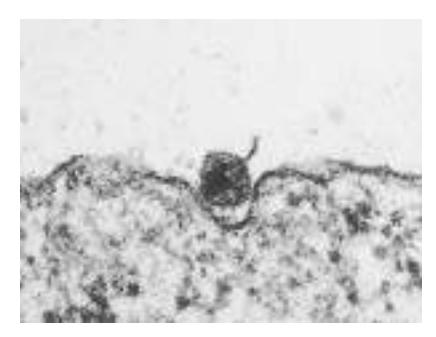

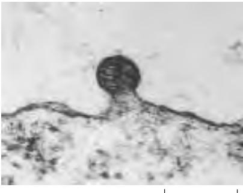

200 nm

Figure 13–22 The entry of enveloped viruses into cells. Electron micrographs showing how HIV enters a cell by fusing its membrane with the plasma membrane of the cell. (From B.S. Stein et al., *Cell* 49:659–668, 1987. With permission from Elsevier.)

*which force the two membranes into close apposition so that their lipid bilayers can fuse.*

# TRANSPORT FROM THE ENDOPLASMIC RETICULUM THROUGH THE GOLGI APPARATUS

As discussed in Chapter 12, newly synthesized proteins cross the endoplasmic reticulum (ER) membrane from the cytosol to enter the secretory pathway. These proteins are successively modified as they pass through a series of compartments from the ER to the Golgi apparatus and from the Golgi apparatus to the cell surface and elsewhere. Transfer from one compartment to the next involves a delicate balance between forward and backward (retrieval) transport pathways. Some transport vesicles select cargo molecules and move them to the next compartment in the pathway, while others retrieve escaped proteins and return them to a previous compartment where they normally function. Thus, the pathway from the ER to the cell surface consists of many sorting steps, which continually select membrane and soluble lumenal proteins for packaging and transport.

In this section, we focus mainly on the **Golgi apparatus** (also called the Golgi complex). It is a major site of carbohydrate synthesis, as well as a sorting and dispatching station for products delivered to it from the ER. The cell makes many polysaccharides in the Golgi apparatus, including the pectin and hemicellulose of the cell wall in plants and most of the glycosaminoglycans of the extracellular matrix in animals (discussed in Chapter 19). The Golgi apparatus also builds and attaches oligosaccharide chains to the many proteins and lipids that the ER sends to it. Some of these oligosaccharides serve as tags to direct specific proteins carrying them into vesicles that are then transported to endosomes for eventual delivery to lysosomes. But most proteins and lipids, once they have acquired their appropriate oligosaccharides in the Golgi apparatus, are recognized in other ways for targeting into the transport vesicles going to the cell surface and other destinations.

#### Proteins Leave the ER in COPII-coated Transport Vesicles

To initiate their journey along the secretory pathway, proteins that have entered the ER and are destined for the Golgi apparatus or beyond are first packaged into COPII-coated transport vesicles. These vesicles bud from specialized regions of the ER called *ER exit sites*, whose membrane lacks bound ribosomes. Most animal cells have ER exit sites dispersed throughout the ER network.

Entry into vesicles that leave the ER can be a selective process or can happen by default. Many transmembrane proteins are actively recruited into such vesicles, where they become concentrated. These transmembrane proteins display exit (transport) signals on their cytosolic surface that adaptor proteins of the inner COPII coat recognize (**Figure 13–23**). Soluble cargo proteins in the ER lumen have exit signals that are recognized by some of these transmembrane proteins, which serve as cargo receptors. These receptors are recycled back to the ER after they have delivered their cargo to the Golgi apparatus. Proteins without exit signals can also enter transport vesicles, including protein molecules that normally function in the ER (so-called *ER resident proteins*). These resident proteins slowly leak out of the ER and need retrieval pathways to bring them back from the Golgi apparatus. Different cargo proteins enter the transport vesicles with substantially different rates and efficiencies. These differences can be due to their folding and oligomerization efficiencies and kinetics, as well as their different capacities to engage cargo receptors and the COPII coat. The exit step from the ER is a major checkpoint at which quality control is exerted on the proteins that a cell secretes or displays on its surface, as we discussed in Chapter 12.

The exit signals that direct soluble proteins out of the ER for transport to the Golgi apparatus and beyond are not well understood. Some transmembrane proteins that serve as cargo receptors for packaging some secretory proteins into COPII-coated vesicles are lectins that bind to oligosaccharides on the secreted

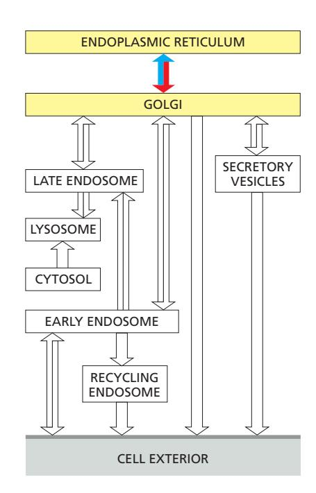

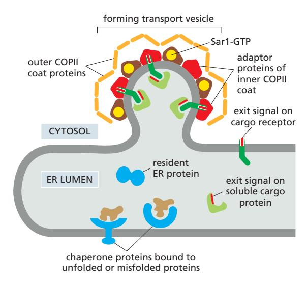

proteins. One such lectin, for example, binds to mannose on two secreted blood-clotting factors (Factor V and Factor VIII), thereby packaging the proteins into transport vesicles in the ER; its role in protein transport was identified because humans who lack it owing to an inherited mutation have lowered serum levels of Factors V and VIII, and they therefore bleed excessively. MBoC7 m13.22/13.23

# Only Proteins That Are Properly Folded and Assembled Can Leave the ER

To exit from the ER, proteins must be properly folded, and, if they are subunits of multiprotein complexes, they need to be completely assembled. Those that are misfolded or incompletely assembled transiently remain in the ER, where they are bound to chaperone proteins (discussed in Chapter 6) such as *BiP* or *calnexin*. The chaperones may cover up the exit signals or somehow anchor the proteins in the ER. Such failed proteins are eventually transported back into the cytosol, where they are degraded by proteasomes (discussed in Chapters 6 and 12). This quality-control step prevents the onward transport of misfolded or misassembled proteins that could potentially interfere with the functions of normal proteins. Such failures are surprisingly common. Most of the newly synthesized subunits of the T cell receptor (discussed in Chapter 24) and of the acetylcholine receptor (discussed in Chapter 11), for example, are normally degraded without ever reaching the cell surface where they function. Thus, cells must make a large excess of some protein molecules to produce a select few that fold, assemble, and function properly.

Sometimes, however, there are drawbacks to the stringent quality-control mechanism. The predominant mutations that cause cystic fibrosis, a common inherited disease, result in the production of a slightly misfolded form of a plasma membrane protein important for Cl– transport. Although the mutant protein would function almost normally if it reached the plasma membrane, it is retained in the ER and then is degraded by cytosolic proteasomes. This devastating disease thus results not because the mutation inactivates the protein but because potentially active protein is discarded before it reaches the plasma membrane.

# Vesicular Tubular Clusters Mediate Transport from the ER to the Golgi Apparatus

After transport vesicles have budded from ER exit sites and have shed their coat, they begin to fuse with one another. The fusion of membranes from the same compartment is called *homotypic fusion*, to distinguish it from *heterotypic fusion*, in which a membrane from one compartment fuses with the membrane of a different compartment. As with heterotypic fusion, homotypic fusion requires a set

Figure 13–23 The recruitment of membrane and soluble cargo molecules into ER transport vesicles.

Transmembrane proteins are packaged into budding transport vesicles through interactions of exit signals on their cytosolic tails with adaptor proteins of the inner COPII coat. Some of these transmembrane proteins function as cargo receptors, binding soluble proteins in the ER lumen and helping to package them into vesicles. Other proteins may enter the vesicle by bulk flow. A typical 50-nm transport vesicle contains about 200 transmembrane proteins, which can be of many different types. As indicated, unfolded or incompletely assembled proteins are bound to chaperones and transiently retained in the ER compartment.

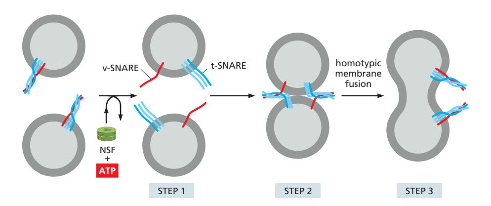

of matching SNAREs. In this case, however, the interaction is symmetrical, with both membranes contributing v-SNAREs and t-SNAREs (**Figure 13–24**).

The structures formed when ER-derived vesicles fuse with one another are called *vesicular tubular clusters*, because they have a convoluted appearance in the electron microscope (**Figure 13–25A**). These clusters constitute a compartment that is separate from the ER and lacks many of the proteins that function in the ER. They are generated continually and function as transport containers that bring material from the ER to the Golgi apparatus. The clusters move quickly along microtubules to the Golgi apparatus with which they fuse (**Figure 13–25B** and **Movie 13.3**). MBoC7 m13.23/13.24

As soon as vesicular tubular clusters form, they begin to bud off transport vesicles of their own. Unlike the COPII-coated vesicles that bud from the ER, these vesicles are COPI-coated (see Figure 13–25B). COPI-coated vesicles are unique in that the components that make up the inner and outer coat layers are recruited as a preassembled complex, called *coatomer*. They function as a *retrieval pathway*, carrying back ER resident proteins that have escaped, as well as proteins such as cargo receptors and SNAREs that participated in the ER budding and vesicle fusion reactions. This retrieval process demonstrates the exquisite control mechanisms that regulate coat assembly reactions. The COPI coat assembly begins only seconds after the COPII coats have been shed; it remains a mystery how this switch in coat assembly is controlled.

The retrieval (or retrograde) transport continues as the vesicular tubular clusters move toward the Golgi apparatus. Thus, the clusters continually mature, gradually changing their composition as selected proteins are returned to the ER.

Figure 13–24 Homotypic membrane fusion. In step 1, NSF pries apart identical pairs of v-SNAREs and t-SNAREs in both membranes (see Figure 13–21). In steps 2 and 3, the separated matching SNAREs on adjacent identical membranes interact, which leads to membrane fusion and the formation of one continuous compartment. Subsequently, the compartment grows by further homotypic fusion with vesicles from the same kind of membrane, displaying matching SNAREs. Homotypic fusion occurs when ER-derived transport vesicles fuse with one another, but also when endosomes fuse to generate larger endosomes. Rab proteins help regulate the extent of homotypic fusion and hence the size of a cell's compartments (not shown).

Figure 13–25 Vesicular tubular clusters. (A) An electron micrograph of vesicular tubular clusters forming around an exit site. Many of the vesicle-like structures seen in the micrograph are cross sections of tubules that extend above and below the plane of this thin section and are interconnected. (B) Vesicular tubular clusters move along microtubules to carry proteins from the ER to the Golgi apparatus. COPI coats mediate the budding of vesicles that return to the ER from these clusters (and from the Golgi apparatus). (A, courtesy of Judith Klumperman, from J.A. Martínez-Menárguez et al., *Cell* 98:81–90, 1999.)

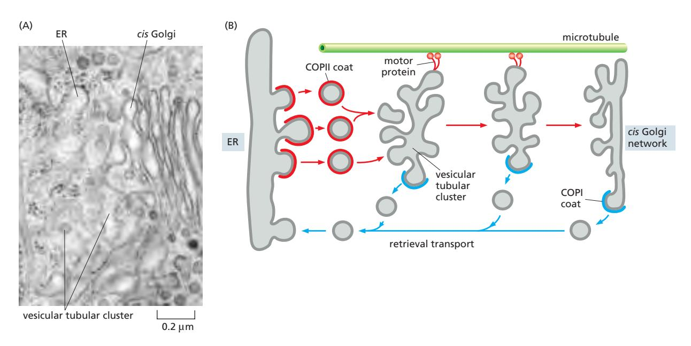

The retrieval continues from the Golgi apparatus, after the vesicular tubular clusters have delivered their cargo.

#### The Retrieval Pathway to the ER Uses Sorting Signals

The retrieval pathway for returning escaped proteins back to the ER depends on *ER retrieval signals*. Resident ER membrane proteins, for example, contain signals that bind directly to COPI coats and are thus packaged into COPI-coated transport vesicles for retrograde delivery to the ER. The best-characterized retrieval signal of this type consists of two lysines, followed by any two other amino acids, at the extreme C-terminal end of the ER membrane protein. It is called a *KKXX sequence*, based on the single-letter amino acid code. Most membrane proteins that function at the interface between the ER and Golgi apparatus, including v- and t-SNAREs and some cargo receptors, use this retrieval pathway to come back to the ER.

Soluble ER resident proteins, such as BiP, also contain a short ER retrieval signal at their C-terminal end, but it is different: it consists of a Lys-Asp-Glu-Leu or a similar sequence. If this signal (called the *KDEL sequence*) is removed from BiP by genetic engineering, the protein is slowly secreted from the cell. If the signal is transferred to a protein that is normally secreted, the protein is now efficiently returned to the ER, where it accumulates. Unlike the retrieval signals on ER membrane proteins, which can interact directly with the COPI coat, soluble ER resident proteins must bind to specialized receptor proteins such as the *KDEL receptor*—a multipass transmembrane protein that binds to the KDEL sequence and packages any protein displaying it into COPI-coated retrograde transport vesicles (**Figure 13–26**).

The KDEL receptor accomplishes this task by cycling between the ER and the Golgi apparatus, selectively binding proteins with the KDEL sequence in the Golgi apparatus and releasing them in the ER. The markedly different affinity between the receptor and the KDEL sequence in these two compartments is due to the lower pH in the Golgi apparatus, which is regulated by H+ pumps. A critical histidine in the KDEL receptor is protonated in the lower-pH environment of the Golgi apparatus, strongly favoring its interaction with the KDEL sequence. As we discuss later, pH-sensitive protein–protein interactions form the basis for many of the protein-sorting steps in the cell.

# Many Proteins Are Selectively Retained in the Compartments in Which They Function

The KDEL retrieval pathway only partly explains how ER resident proteins are maintained in the ER. As mentioned, cells that express genetically modified ER resident proteins, from which the KDEL sequence has been experimentally removed, secrete these proteins. But the rate of secretion is much slower than that

Figure 13–26 Retrieval of soluble ER resident proteins. ER resident proteins that escape from the ER are returned by vesicle transport. (A) The KDEL receptor present in both vesicular tubular clusters and the Golgi apparatus captures the soluble ER resident proteins and carries them in COPI-coated transport vesicles back to the ER. (Recall that the COPIcoated vesicles shed their coats as soon as they are formed.) Upon binding its ligands in the tubular cluster or Golgi apparatus, the KDEL receptor may change conformation, so as to facilitate its recruitment into budding COPI-coated vesicles. (B) The retrieval of ER proteins begins in vesicular tubular clusters and continues in later parts of the Golgi apparatus. In the environment of the ER, the ER resident proteins dissociate from the KDEL receptor, which is then returned to the Golgi apparatus for reuse. We discuss the different compartments of the Golgi apparatus shortly.

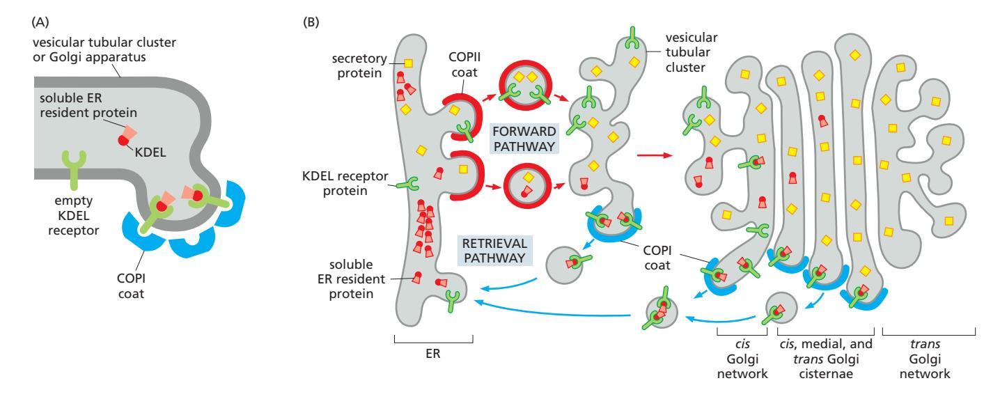

for a normal secretory protein. It seems that a mechanism that is independent of their KDEL signal normally retains ER resident proteins and that only those proteins that escape this retention mechanism are captured and returned via the KDEL receptor.

A suggested retention mechanism is that ER resident proteins bind to one another, thus forming complexes that are too big to enter transport vesicles efficiently. Because ER resident proteins are present in the ER at very high concentrations (estimated to be millimolar), relatively low-affinity interactions would suffice to retain most of the proteins in such complexes. Aggregation of proteins that function in the same compartment is a general mechanism that compartments use to organize and retain their resident proteins. Golgi enzymes that function together, for example, also bind to each other and are thereby restrained from entering transport vesicles leaving the Golgi apparatus.

### The Golgi Apparatus Consists of an Ordered Series of Compartments

Because it could be selectively visualized by silver stains, the Golgi apparatus was one of the first organelles described by early light microscopists. It consists of a collection of flattened, membrane-enclosed compartments called *cisternae*, that somewhat resemble a stack of pita breads. Each Golgi stack typically consists of four to six cisternae (**Figure 13–27**), although some unicellular flagellates can have more than 20. In animal cells, tubular connections between corresponding cisternae link many stacks, thus forming a single complex, which is usually located near the cell nucleus and close to the centrosome (**Figure 13–28A**). This localization depends on microtubules. If microtubules are experimentally depolymerized, the Golgi apparatus reorganizes into individual stacks that are found throughout the cytoplasm, adjacent to ER exit sites. Some cells, including most plant cells, have hundreds of individual Golgi stacks

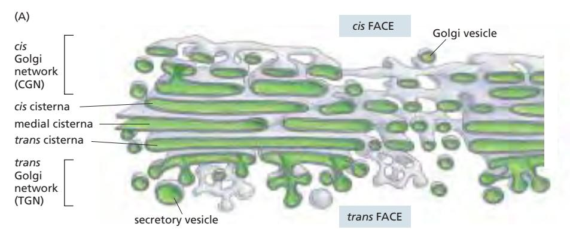

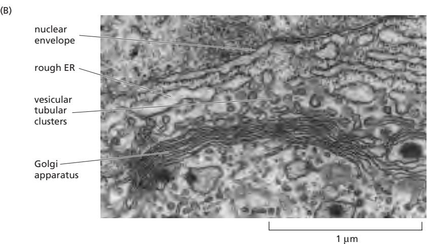

Figure 13–27 The Golgi apparatus. (A) Three-dimensional reconstruction from electron micrographs of the Golgi apparatus in a secretory animal cell. The *cis* face of the Golgi stack is that closest to the ER. (B) A thin-section electron micrograph of an animal cell. In plant cells, the Golgi apparatus is generally more distinct and more clearly separated from other intracellular membranes than in animal cells. (A, redrawn from A. Rambourg and Y. Clermont, *Eur. J. Cell Biol.* 51:189–200, 1990; B, courtesy of Brij J. Gupta.)

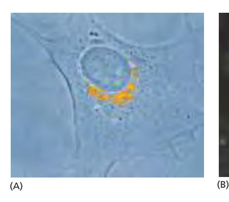

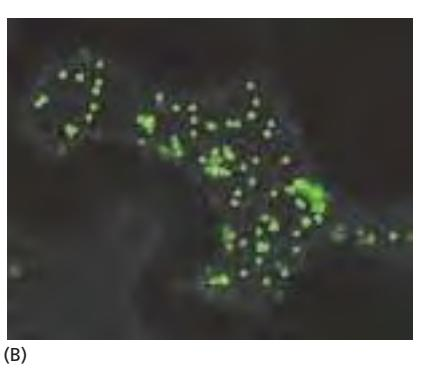

Figure 13–28 Localization of the Golgi apparatus in animal and plant cells.

(A) The Golgi apparatus in a cultured fibroblast stained with a fluorescent antibody that recognizes a Golgi resident protein *(bright orange)*. The Golgi apparatus is polarized, facing the direction in which the cell was crawling before fixation. (B) The Golgi apparatus in a plant cell that is expressing a fusion protein consisting of a resident Golgi enzyme fused to green fluorescent protein. (A, courtesy of John Henley and Mark McNiven; B, courtesy of Chris Hawes.)

dispersed throughout the cytoplasm where they are typically found adjacent to ER exit sites (**Figure 13–28B**).

During their passage through the Golgi apparatus, many transported molecules undergo an ordered series of covalent modifications. Each Golgi stack has two distinct faces: a **cis face** (or entry face) and a **trans face** (or exit face). Both *cis* and *trans* faces are closely associated with special compartments, each composed of a network of interconnected tubular and cisternal structures: the **cis Golgi network (CGN)** and the **trans Golgi network (TGN)**, respectively. The CGN is a collection of fused vesicular tubular clusters arriving from the ER. Proteins and lipids enter the *cis* Golgi network and exit from the *trans* Golgi network, bound for the cell surface or another compartment. Both networks are important for protein sorting: proteins entering the CGN can either move onward in the Golgi apparatus or be returned to the ER. Similarly, proteins exiting from the TGN move onward and are sorted according to their next destination: endosomes, secretory vesicles, or the cell surface. They also can be returned to an earlier compartment. Some membrane proteins are retained in the part of the Golgi apparatus where they function. MBoC7 m13.27/13.28

As described in Chapter 12, a single species of *N-linked oligosaccharide* is attached *en bloc* to many proteins in the ER and then trimmed while the protein is still in the ER. The oligosaccharide intermediates created by the trimming reactions serve to help proteins fold and to help transport misfolded proteins to the cytosol for degradation in proteasomes. Thus, they play an important role in controlling the quality of proteins exiting from the ER. Once these ER functions have been fulfilled, the cell reutilizes the oligosaccharides for new functions. This begins in the Golgi apparatus, which generates the heterogeneous oligosaccharide structures seen in mature proteins. After arrival in the CGN, proteins enter the first of the Golgi processing compartments (the *cis* Golgi cisterna). They then move to the next compartment (the medial cisterna) and finally to the *trans* cisterna, where glycosylation is completed. The lumen of the *trans* cisterna is thought to be continuous with the TGN, the place where proteins are segregated into different transport packages and dispatched to their next destinations.

The oligosaccharide-processing steps occur in an organized sequence in the Golgi apparatus, with each cisterna containing a characteristic mixture of processing enzymes. Proteins are modified in successive stages as they move from cisterna to cisterna across the stack, so that the stack forms a multistage processing unit.

Investigators discovered the functional differences between the *cis*, medial, and *trans* subdivisions of the Golgi apparatus by localizing the enzymes involved in processing *N*-linked oligosaccharides in distinct regions of the organelle, both by physical fractionation of the organelle and by labeling the enzymes in electron microscope sections with antibodies (**Figure 13–29**). The removal of mannose and

Figure 13–29 Molecular compartmentalization of the Golgi apparatus. A series of electron micrographs shows the Golgi apparatus (A) unstained, (B) stained with osmium, which preferentially labels the cisternae of the *cis* compartment, and (C and D) stained to reveal the location of specific enzymes. Nucleoside diphosphatase is found in the *trans* Golgi cisternae (C), while acid phosphatase is found in the *trans* Golgi network (D). Note that usually more than one cisterna is stained. The enzymes are therefore thought to be highly enriched rather than precisely localized to a specific cisterna. (Courtesy of Daniel S. Friend, by permission of E.L. Bearer.)

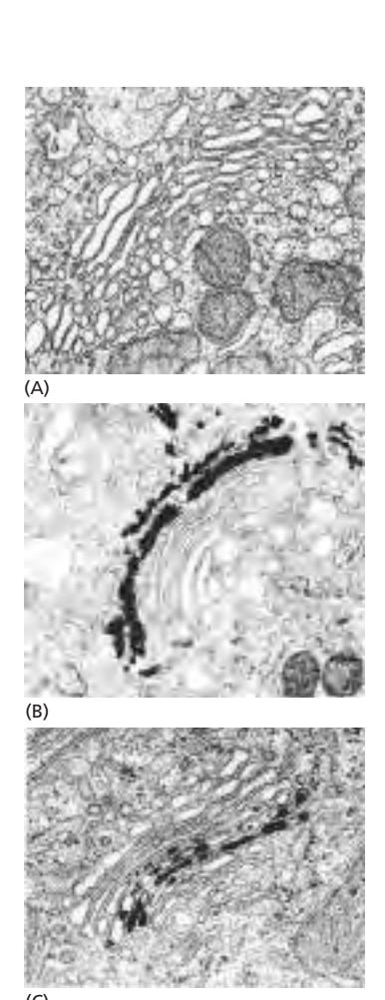

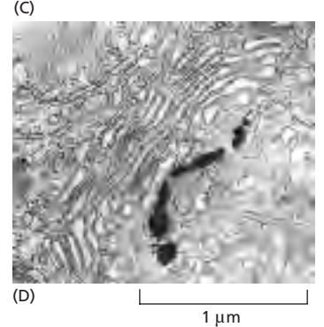

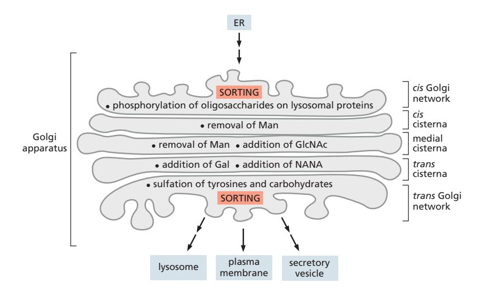

#### Figure 13–30 Oligosaccharide processing in Golgi compartments.

The localization of each processing step shown was determined by a combination of techniques, including biochemical subfractionation of the Golgi apparatus membranes and electron microscopy after staining with antibodies specific for some of the processing enzymes. Processing enzymes are not restricted to a particular cisterna; instead, their distribution is graded across the stack, such that early-acting enzymes are present mostly in the *cis* Golgi cisternae and later-acting enzymes are mostly in the *trans* Golgi cisternae. Man, mannose; GlcNAc, *N*-acetylglucosamine; Gal, galactose; NANA, *N*-acetylneuraminic acid (sialic acid).

the addition of *N*-acetylglucosamine, for example, occur in the *cis* and medial cisternae, while the addition of galactose and sialic acid occurs in the *trans* cisterna and *trans* Golgi network. **Figure 13–30** summarizes the functional compartmentalization of the Golgi apparatus. MBoC7 m13.29/13.30

#### Oligosaccharide Chains Are Processed in the Golgi Apparatus

Whereas the ER lumen is full of soluble resident proteins and enzymes, the resident proteins in the Golgi apparatus are all membrane bound. All of the Golgi glycosidases and glycosyl transferases, for example, are single-pass transmembrane proteins, many of which are organized in multienzyme complexes.

Two broad classes of *N*-linked oligosaccharides, the **complex oligosaccharides** and the **high-mannose oligosaccharides**, are attached to mammalian glycoproteins. Sometimes, both types are attached (in different places) to the same polypeptide chain. Complex oligosaccharides are generated when the original *N*-linked oligosaccharide added in the ER is trimmed and further sugars are added; by contrast, high-mannose oligosaccharides are trimmed but have no new sugars added to them in the Golgi apparatus (**Figure 13–31**). The sialic acids

Man branch and one GlcNAc and Gal branch are also found (not shown).

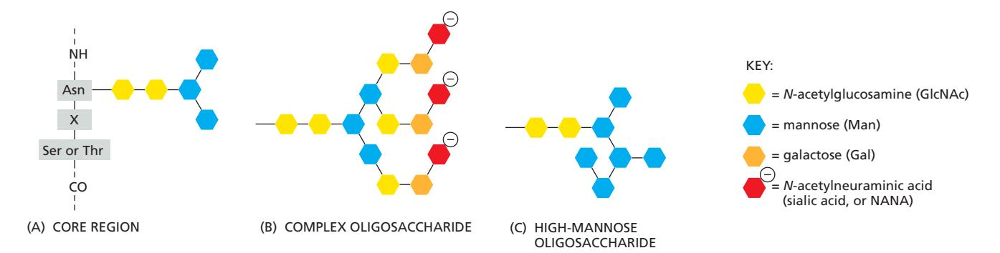

Figure 13–31 The two main classes of asparagine-linked (*N*-linked) oligosaccharides found in mature mammalian glycoproteins. (A) Both complex oligosaccharides and high-mannose oligosaccharides share a common *core region* derived by trimming the original *N*-linked oligosaccharide added in the ER (see Figure 12–32) and typically containing two *N*-acetylglucosamines (GlcNAc) and three mannoses (Man). The three amino acids constitute the sequence recognized by the oligosaccharyl transferase enzyme that adds the initial oligosaccharide to the protein. Asn, asparagine; Ser, serine; Thr, threonine; X, any amino acid, except proline. (B) Each complex oligosaccharide consists of a *core region*, together with a *terminal region* that contains a variable number of copies of a special trisaccharide unit (*N-acetylglucosamine*–*galactose*–*sialic acid*) linked to the three core mannoses. Frequently, the terminal region is truncated and contains only GlcNAc and galactose (Gal) or just GlcNAc. In addition, a fucose may be added, usually to the core GlcNAc attached to the asparagine (Asn). Thus, although the steps of processing and subsequent sugar addition are rigidly ordered, complex oligosaccharides can be heterogeneous. Moreover, although the complex oligosaccharide shown has three terminal branches, two and four branches are also common, depending on the glycoprotein and the cell in which it is made (Movie 13.4). (C) Highmannose oligosaccharides are not trimmed back all the way to the core region and contain additional mannoses. Hybrid oligosaccharides with one

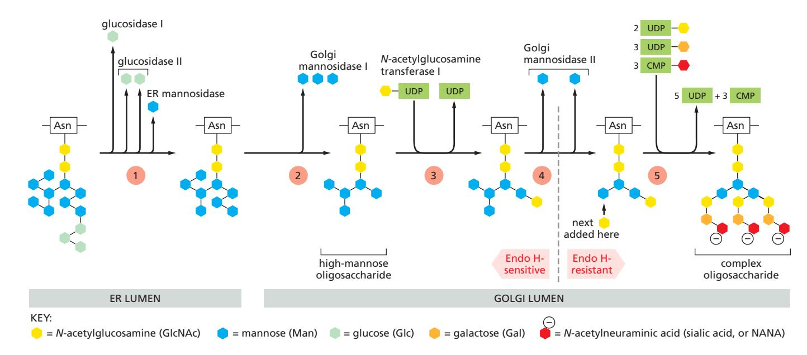

Figure 13–32 Oligosaccharide processing in the ER and the Golgi apparatus. The processing pathway is highly ordered, so that each step shown depends on the previous one. Step 1: Processing begins in the ER with the removal of the glucoses from the oligosaccharide initially transferred to the protein. Then a mannosidase in the ER membrane removes a specific mannose. The remaining steps occur in the Golgi stack. Step 2: Golgi mannosidase I removes three more mannoses. Step 3: *N*-acetylglucosamine transferase I then adds an *N*-acetylglucosamine. Step 4: Golgi mannosidase II then removes two additional mannoses. This yields the final core of three mannoses that is present in a complex oligosaccharide. At this stage, the bond between the two *N*-acetylglucosamines in the core becomes resistant to attack by a highly specific endoglycosidase (*Endo H*). Because all later structures in the pathway are also Endo H–resistant, treatment with this enzyme is widely used to distinguish complex from high-mannose oligosaccharides. Step 5: Finally, as shown in Figure 13–31, additional *N*-acetylglucosamines, galactoses, and sialic acids are added. These final steps in the synthesis of a complex oligosaccharide occur in the cisternal compartments of the Golgi apparatus: three types of glycosyl transferase enzymes act sequentially, using sugar substrates that have been activated by linkage to the indicated nucleotide; the membranes of the Golgi cisternae contain specific carrier proteins that allow each sugar nucleotide to enter in exchange for the nucleoside phosphates that are released after the sugar is attached to the protein on the lumenal face.

MBoC7 m13.31/13.32 Note that, as a biosynthetic organelle, the Golgi apparatus differs from the ER: all sugars in the Golgi are assembled inside the lumen from sugar nucleotides, whereas in the ER, the *N*-linked precursor oligosaccharide is assembled partly in the cytosol and partly in the lumen, and most lumenal reactions use dolichol-linked sugars as their substrates (see Figure 12–33).

in the complex oligosaccharides are of special importance because they bear a negative charge. Whether a given oligosaccharide remains high-mannose or is processed depends largely on its position in the protein. If the oligosaccharide is accessible to the processing enzymes in the Golgi apparatus, it is likely to be converted to a complex form; if it is inaccessible because its sugars are tightly held to the protein's surface, it is likely to remain in a high-mannose form. The processing that generates complex oligosaccharide chains follows the highly ordered pathway shown in **Figure 13–32**.

Beyond these commonalities in oligosaccharide processing that are shared among most cells, the products of the carbohydrate modifications carried out in the Golgi apparatus are highly complex and have given rise to a field of study called glycobiology. The human genome, for example, encodes hundreds of different Golgi glycosyl transferases and many glycosidases. These enzymes are expressed differently from one cell type to another and at different times during development, resulting in a variety of glycosylated forms of a given protein or lipid in different cell types and at varying stages of differentiation. The complexity of modifications is not limited to *N*-linked oligosaccharides but also occurs on *O-linked sugars*, as we discuss next.

#### Proteoglycans Are Assembled in the Golgi Apparatus

In addition to the *N*-linked oligosaccharide alterations, many proteins are modified in the Golgi apparatus in other ways as they pass through the Golgi cisternae *en route* from the ER to their final destinations. Some proteins have sugars added

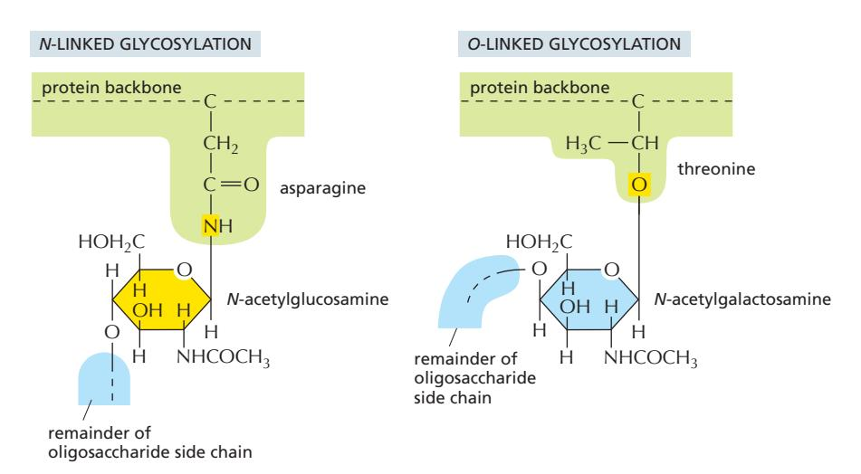

Figure 13–33 *N*- and *O*-linked glycosylation. In each case, only the single sugar group that is directly attached to the protein chain is shown.

to the hydroxyl groups of selected serines or threonines or, in some cases (such as collagens), to hydroxylated proline and lysine side chains. This **O-linked glycosylation** (**Figure 13–33**), like the extension of *N*-linked oligosaccharide chains, is catalyzed by a series of glycosyl transferase enzymes that use the sugar nucleotides in the lumen of the Golgi apparatus to add sugars to a protein one at a time. Usually, *N*-acetylgalactosamine is added first, followed by a variable number of additional sugars, ranging from just a few to 10 or more. MBoC7 m13.32/13.33

The Golgi apparatus confers the heaviest *O*-linked glycosylation of all on *mucins*, the glycoproteins in mucus secretions, and on *proteoglycan core proteins*, which it modifies to produce **proteoglycans**. As discussed in Chapter 19, this process involves the polymerization of one or more *glycosaminoglycan chains* (long, unbranched polymers composed of repeating disaccharide units; see Figure 19–35) onto serines on a core protein. Many proteoglycans are secreted and become components of the extracellular matrix, while others remain anchored to the extracellular face of the plasma membrane. Still others form a major component of slimy materials, such as the mucus that is secreted to form a protective coating on the surface of many epithelia.

The sugars incorporated into glycosaminoglycans are heavily sulfated in the Golgi apparatus immediately after these polymers are made, thus adding a significant portion of their characteristically large negative charge. Some tyrosines in proteins also become sulfated shortly before they exit from the Golgi apparatus. In both cases, the sulfation depends on the sulfate donor 3′-phosphoadenosine-5′-phosphosulfate (PAPS) (**Figure 13–34**), which is transported from the cytosol into the lumen of the *trans* Golgi network.

#### What Is the Purpose of Glycosylation?

There is an important difference between the construction of an oligosaccharide and the synthesis of other macromolecules such as DNA, RNA, and protein. Whereas nucleic acids and proteins are copied from a template in a repeated series of identical steps using the same enzyme or set of enzymes, complex carbohydrates require a different enzyme at each step. The product of each enzyme is recognized as the exclusive substrate for the next enzyme in the series. The vast abundance of glycoproteins and the complicated pathways that have evolved to synthesize them emphasize that the oligosaccharides on glycoproteins and glycosphingolipids have very important functions. A large family of genetic human diseases known as congenital disorders of glycosylation is caused by inherited mutations in individual enzymes involved in glycan modification of proteins and lipids.

$$\begin{array}{c|ccccccccccccccccccccccccccccccccccc$$

3′-phosphoadenosine-5′-phosphosulfate (PAPS)

Figure 13–34 The structure of PAPS.

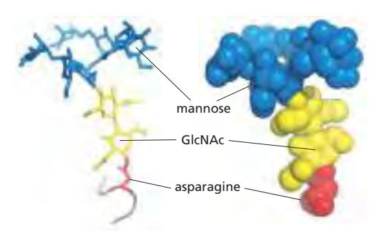

*N*-linked glycosylation, for example, is prevalent in all eukaryotes, including yeasts. *N*-linked oligosaccharides also occur in a very similar form in archaeal cell-wall proteins, suggesting that the whole machinery required for their synthesis is evolutionarily ancient. *N*-linked glycosylation promotes protein folding in two ways. First, it has a direct role in making folding intermediates more soluble, thereby preventing their aggregation. Second, the sequential modifications of the *N*-linked oligosaccharide establish a "glyco-code" that marks the progression of protein folding. This glyco-code is used by chaperones and lectins in the ER to guide protein folding and degradation (discussed in Chapter 12) and by other lectins that guide ER-to-Golgi transport. As we discuss later, oligosaccharides also participate in protein sorting in the *trans* Golgi network. MBoC7 m13.34/13.35

Because chains of sugars have limited flexibility, even a small *N*-linked oligosaccharide protruding from the surface of a glycoprotein (**Figure 13–35**) can limit the approach of other macromolecules to the protein surface. In this way, for example, the presence of oligosaccharides tends to make a glycoprotein more resistant to digestion by proteolytic enzymes. It may be that the oligosaccharides on cell-surface proteins originally provided an ancestral cell with a protective coat; compared to the rigid bacterial cell wall, such a sugar coat has the advantage that it leaves the cell with the freedom to change shape and move.

The sugar chains have since been adapted to serve other purposes as well. The mucus coat of lung and intestinal cells, for example, protects against many pathogens. The recognition of sugar chains by *lectins* in the extracellular space is important in many developmental processes and in cell–cell recognition: *selectins*, for example, are transmembrane lectins that function in cell–cell adhesion during blood-cell migration, as discussed in Chapter 19. The presence of oligosaccharides may modify a protein's antigenic and functional properties, making glycosylation an important factor in the production of proteins for pharmaceutical purposes.

Glycosylation can also have important regulatory roles. Signaling through the cell-surface signaling receptor Notch, for example, is an important factor in determining the cell's fate in development (discussed in Chapter 21). Notch is a transmembrane protein that is *O*-glycosylated by addition of a single fucose to some serines, threonines, and hydroxylysines. Some cell types express an additional glycosyl transferase that adds an *N*-acetylglucosamine to each of these fucoses in the Golgi apparatus. This addition changes the specificity of Notch for the cell-surface signal proteins that activate it.

# Transport Through the Golgi Apparatus Occurs by Multiple Mechanisms

In order to function, the Golgi apparatus must maintain its polarized multicisternal structure while facilitating the transit of a large number of diverse molecules. It is likely that multiple mechanisms are used to transport cargo molecules through the Golgi cisternae while efficiently retaining Golgi resident proteins. One mechanism involves the movement of cargo in transport vesicles from one compartment to the next while retrieving any escaped resident

Figure 13–35 The three-dimensional structure of a high-mannose *N*-linked oligosaccharide. The structure was determined by x-ray crystallographic analysis of a glycoprotein. This oligosaccharide contains only 9 sugars, whereas there are 14 sugars in the *N*-linked oligosaccharide that is initially transferred to proteins in the ER (see Figure 12–32). *Left:* a backbone model showing all atoms except hydrogens; only the asparagine side chain of the protein is shown. *Right:* a space-filling model, with the asparagine and sugars indicated using the same color scheme as at left. (PDB code: 5KZC.)

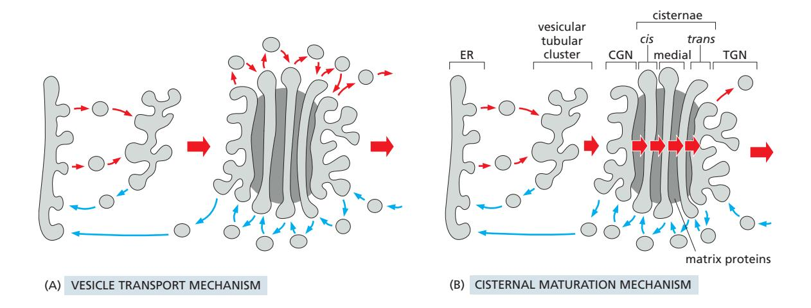

proteins using different transport vesicles (**Figure 13–36A**). This *vesicle transport mechanism* is conceptually similar to how proteins and lipids are transported from the ER to the Golgi, except that only COPI-coated vesicles are used. Although both forward- and backward-moving vesicles would likely be COPI-coated, the coats may contain different adaptor proteins that confer selectivity on the packaging of cargo molecules.

A different way for cargo to move through the Golgi apparatus involves the **cisternal maturation mechanism**. According to this view, new *cis* cisternae continually form as vesicular tubular clusters arrive from the ER and fuse with transport vesicles containing Golgi resident proteins and enzymes. As the cargo within a *cis* cisterna is modified, the enzymes leave in transport vesicles that will fuse with newly arriving vesicular tubular clusters. At the same time, the cisterna accepts transport vesicles containing enzymes from later Golgi cisternae, converting it into a medial cisterna. In this way, a cisterna full of cargo moves through the Golgi stack while different subsets of Golgi resident proteins transit backwards in COPI-coated vesicles from later to earlier cisternae (**Figure 13–36B**). When a cisterna finally moves forward to become part of the *trans* Golgi network, various types of coated vesicles bud off it until this network disappears, to be replaced by a maturing cisterna just behind. At the same time, other transport vesicles are continually retrieving membrane from post-Golgi compartments and returning it to the *trans* Golgi network. MBoC7 m13.35/13.36

It is likely that aspects of both mechanisms are used to varying degrees depending on the type of cell and the nature of cargo molecules that need to be transported. A stable core of long-lasting cisternae might exist in the center of each Golgi cisterna, while regions at the rim may undergo continual maturation, perhaps utilizing Rab cascades that change their identity. As matured pieces of the cisternae are formed, they might break off and fuse with downstream cisternae by homotypic fusion mechanisms, taking large cargo molecules such as procollagen rods and lipoprotein particles with them. In addition, COPI-coated vesicles might transport small cargo in the forward direction and retrieve escaped Golgi enzymes to their appropriate upstream cisternae.

### Golgi Matrix Proteins Help Organize the Stack

The unique architecture of the Golgi apparatus depends on both the microtubule cytoskeleton, as already mentioned, and cytoplasmic Golgi matrix proteins. The Golgi reassembly and stacking proteins (called GRASPs) form a scaffold between adjacent cisternae and give the Golgi stack its structural integrity. Other matrix proteins, called *golgins*, form long tethers composed of stiff coiled-coil domains with interspersed hinge regions. Golgins form a forest of tentacles that can extend 100–400 nm from the surface of the Golgi stack. Different members of the golgin family are found in different regions of the Golgi stack and contain binding

Figure 13–36 Two mechanisms explaining the organization of the Golgi apparatus and how proteins move through it. It is likely that transport of cargo molecules through the Golgi apparatus in the forward direction *(red arrows)* involves elements of both mechanisms. (A) In the vesicle transport mechanism, Golgi cisternae are static compartments, which contain a characteristic complement of resident enzymes. The passing of molecules from *cis* to *trans* through the Golgi is accomplished by forward-moving transport vesicles, which bud from one cisterna and fuse with the next in a *cis*to-*trans* direction. (B) In the cisternal maturation mechanism, each Golgi cisterna matures as it migrates outward through the stack. At each stage, the Golgi resident proteins that are carried forward in a maturing cisterna are moved backwards *(blue arrows)* to an earlier compartment in COPI-coated vesicles. When a newly formed cisterna moves to a medial position, for example, "leftover" *cis* Golgi enzymes would be extracted and transported retrogradely to a new *cis* cisterna behind. Likewise, the medial enzymes would be received by retrograde transport from the cisternae just ahead. In this way, a *cis* cisterna would mature to a medial and then *trans* cisterna as it moves outward.

sites for different Rab proteins. Because transport vesicles arriving from different locations have their characteristic Rab proteins on them, golgins are thought to function as tethers that initially select which part of the Golgi stack a transport vesicle engages (**Figure 13–37**).

When the cell prepares to divide, mitotic protein kinases phosphorylate the Golgi matrix proteins, causing the Golgi apparatus to fragment and disperse throughout the cytosol. The Golgi fragments are then distributed evenly to the two daughter cells, where the matrix proteins are dephosphorylated, leading to the reassembly of the Golgi stack. Similarly, during apoptosis, proteolytic cleavage of golgins by caspases (discussed in Chapter 18) leads to fragmentation of the Golgi apparatus as the cell self-destructs.

### Summary

*Correctly folded and assembled proteins in the ER are packaged into COPII-coated transport vesicles that pinch off from the ER membrane. Shortly thereafter, the vesicles shed their coat and fuse with one another to form vesicular tubular clusters. In animal cells, the clusters then move on microtubule tracks to the Golgi apparatus, where they fuse with one another to form the cis Golgi network. Any resident ER proteins that escape from the ER are returned there from the vesicular tubular clusters and Golgi apparatus by retrograde transport in COPI-coated vesicles.*

*The Golgi apparatus, unlike the ER, contains many sugar nucleotides, which glycosyl transferase enzymes use to glycosylate lipid and protein molecules as they pass through the Golgi apparatus. The mannoses on the N-linked oligosaccharides that are added to proteins in the ER are often initially removed, and further sugars are added. Moreover, the Golgi apparatus is the site where O-linked glycosylation occurs and where glycosaminoglycan chains are added to core proteins to form proteoglycans. Sulfation of the sugars in proteoglycans and of selected tyrosines on proteins also occurs in a late Golgi compartment.*

*The Golgi apparatus modifies the many proteins and lipids that it receives from the ER and then distributes them to the plasma membrane, endosomes, and secretory vesicles. The Golgi apparatus is a polarized organelle, consisting of one or more stacks of disc-shaped cisternae. Each stack is organized as a series of at least three functionally distinct compartments, termed cis, medial, and trans cisternae. The cis and trans cisternae are each connected to special sorting stations, called the cis Golgi network and the trans Golgi network, respectively. Proteins and lipids move through the Golgi stack in the cis-to-trans direction. This movement may occur by vesicle transport, by progressive maturation of the cis cisternae as they migrate continuously through the stack, or by a combination of these two mechanisms. Continual retrograde vesicle transport from later to earlier cisternae keeps the enzymes concentrated in the cisternae where they are needed. The finished new proteins end up in the trans Golgi network, which packages them in transport vesicles and dispatches them to their specific destinations in the cell.*

# TRANSPORT FROM THE *TRANS* GOLGI NETWORK TO THE CELL EXTERIOR AND ENDOSOMES

After transiting the Golgi cisternae, cargo molecules that arrive at the *trans* Golgi network (TGN) are sorted and packaged into transport vesicles that depart for different destinations. Transport vesicles destined for the *cell surface* normally leave the TGN in a steady stream as irregularly shaped tubules. The membrane proteins and the lipids in these vesicles provide new components for the cell's plasma membrane, while the soluble proteins inside the vesicles are secreted to the extracellular space. The fusion of the vesicles with the plasma membrane is called **exocytosis**. This is the route, for example, by which cells secrete most of the proteoglycans and glycoproteins of the extracellular matrix, as discussed in Chapter 19.

All cells require this **constitutive secretory pathway**, which operates continually (**Movie 13.5**). Specialized secretory cells, however, have a second secretory pathway in which soluble proteins and other substances are destined to be

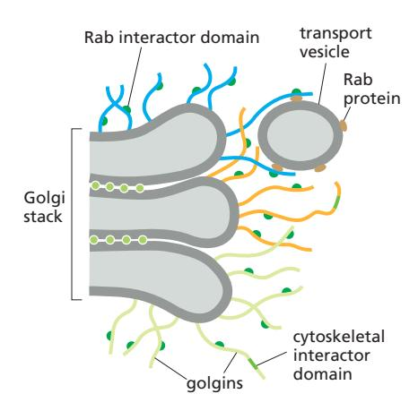

Figure 13–37 A model of golgin function. Filamentous golgins anchored to Golgi membranes capture transport vesicles by binding to Rab proteins on the vesicle surface. Different members of the golgin family of proteins are localized to different regions of the Golgi apparatus. GRASPs are shown tethering adjacent cisternae to each other.

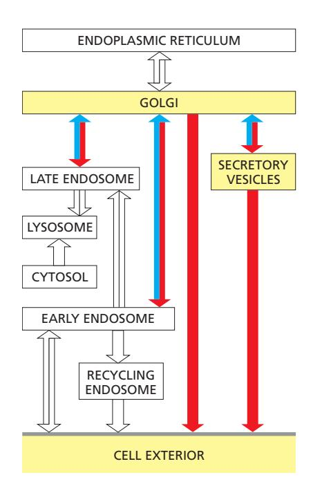

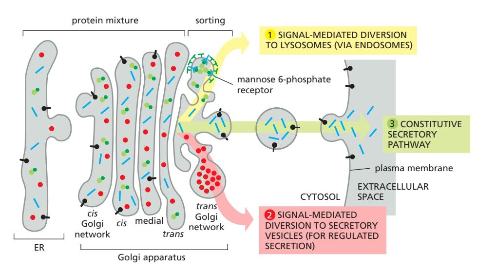

Figure 13–38 The three best-understood pathways of protein sorting in the *trans* Golgi network. (1) Proteins with the mannose 6-phosphate (M6P) marker (see Figure 13–40) are diverted to lysosomes (via endosomes) in clathrin-coated transport vesicles. (2) Proteins with signals directing them to secretory vesicles are concentrated in such vesicles as part of a regulated secretory pathway that is present only in specialized secretory cells. (3) In unpolarized cells, a constitutive secretory pathway delivers proteins with no special features to the cell surface. In polarized cells, such as epithelial cells, however, secreted and plasma membrane proteins are selectively directed to either the apical or the basolateral plasma membrane domain, so a specific signal must mediate at least one of these two pathways, as we discuss later.

initially stored in *secretory vesicles* for later release by exocytosis. This is the **regulated secretory pathway**, found mainly in cells specialized for secreting products rapidly on demand—such as hormones, neurotransmitters, or digestive enzymes.

The third major destination from the TGN is *endosomes*. Hydrolases that function in the lumen of lysosomes use this pathway to first arrive at endosomes, which progressively mature into lysosomes (discussed later). The sorting mechanism at the TGN for lysosomal hydrolase proteins is especially well understood and provides an example of how cargo molecules in the TGN are segregated among different types of transport vesicles. In this section, we consider the role of the Golgi apparatus in sorting proteins between these three pathways and compare the mechanisms of constitutive and regulated secretion. MBoC7 m13.63/13.38

# Many Proteins and Lipids Are Carried Automatically from the *Trans* Golgi Network to the Cell Surface

A cell capable of regulated secretion must separate at least three classes of proteins before they leave the TGN—those destined for lysosomes (via endosomes), those destined for secretory vesicles, and those destined for immediate delivery to the cell surface (**Figure 13–38**). Specific signals are needed to direct *secretory proteins* into secretory vesicles and lysosomal proteins into different specialized transport vesicles. The nonselective constitutive secretory pathway transports most other proteins directly to the cell surface. Because entry into this pathway does not require a particular signal, it is also called the **default pathway**. Thus, in an unpolarized cell such as a white blood cell or a fibroblast, it seems that any protein in the lumen of the Golgi apparatus is automatically carried by the constitutive pathway to the cell surface unless it is specifically returned to the ER, retained as a resident protein in the Golgi apparatus itself, or selected for the pathways that lead to regulated secretion or to endosomes. In polarized cells, where different products have to be delivered to different domains of the cell surface, we shall see that the options are more complex.

# A Mannose 6-Phosphate Receptor Sorts Lysosomal Hydrolases in the *Trans* Golgi Network

The best-understood mechanism for sorting of cargo molecules at the TGN operates on lysosomal hydrolases. Lysosomes are membrane-enclosed organelles filled with about 40 hydrolytic enzymes responsible for digesting all the macromolecules delivered there. Lysosomes are therefore a major site for degradation and recycling of proteins, nucleic acids, lipids, and even whole organelles. The function of lysosomes and the various transport routes leading to this organelle are considered later. For now, we address the pathway that selectively packages lysosomal hydrolases at the TGN into transport vesicles destined for endosomes. The vesicles that leave the TGN for endosomes incorporate the lysosomal proteins and exclude the many other proteins being packaged into different transport vesicles for delivery elsewhere.

How are lysosomal hydrolases recognized and selected in the TGN with the required accuracy? In animal cells they carry a unique marker in the form of *mannose 6-phosphate* (*M6P*) groups, which are added exclusively to the *N*-linked oligosaccharides of these soluble lysosomal enzymes as they pass through the lumen of the *cis* Golgi network (**Figure 13–39**). Transmembrane **M6P receptor proteins**, which are present in the TGN, recognize the M6P groups and bind to the lysosomal hydrolases on the lumenal side of the membrane and to adaptor proteins in assembling clathrin coats on the cytosolic side. In this way, the receptors help package the hydrolases into clathrin-coated vesicles that bud from the TGN and deliver their contents to early endosomes.

The M6P receptor protein binds to M6P at pH 6.5–6.7 in the TGN lumen and releases it at pH 6, which is the pH in the lumen of endosomes. Thus, after the receptor is delivered, the lysosomal hydrolases dissociate from the M6P receptors, which are retrieved into transport vesicles that bud from endosomes. These vesicles are coated with retromer, a coat protein complex specialized for endosome-to-TGN transport, which returns the receptors to the TGN for reuse (**Figure 13–40**).

Transport in either direction requires signals in the cytoplasmic tail of the M6P receptor that direct this protein to the endosome or back to the TGN. An adaptor protein of the clathrin coat recognizes the tail at the TGN, while retromer recognizes it at the endosome. The assembly of different coats at different membranes for the same receptor is ensured by organelle-specific markers, such as Rab7 and PI(3)P at the endosome. The recycling of the M6P receptor resembles the recycling of the KDEL receptor discussed earlier, although it differs in the type of coated vesicles that mediate the transport.

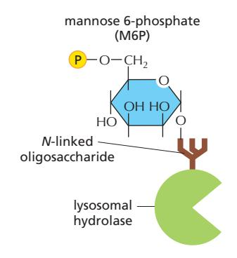

Figure 13–39 The structure of mannose 6-phosphate on a lysosomal hydrolase.

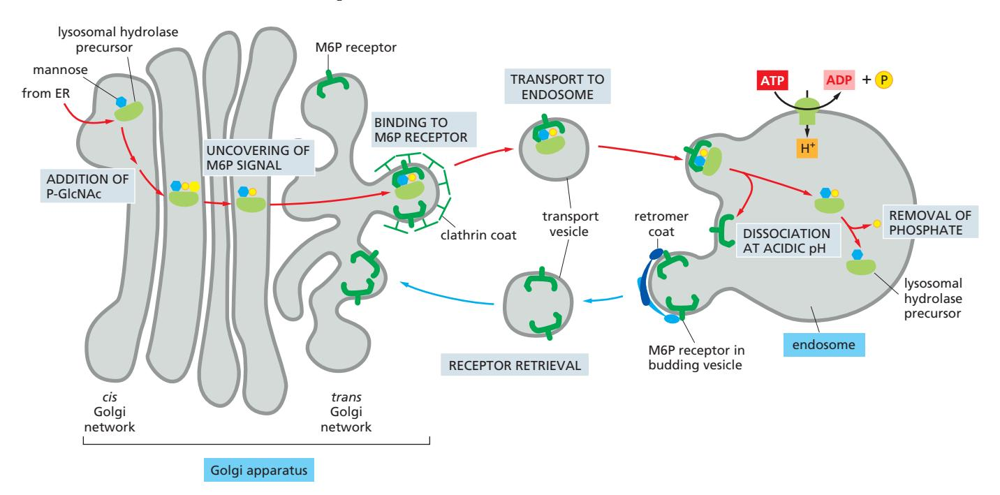

Figure 13–40 The transport of newly synthesized lysosomal hydrolases to endosomes. The sequential action of two enzymes in the *cis* and *trans* Golgi network adds mannose 6-phosphate (M6P) groups to the precursors of lysosomal enzymes (see Figure 13–41). The M6P-tagged hydrolases then segregate from all other types of proteins in the TGN because adaptor proteins (not shown) in the clathrin coat bind the M6P receptors, which, in turn, bind the M6P-modified lysosomal hydrolases. The clathrin-coated vesicles bud off from the TGN, shed their coat, and fuse with early endosomes. At the lower pH of the endosome, the hydrolases dissociate from the M6P receptors, and the empty receptors are retrieved in retromercoated vesicles to the TGN for further rounds of transport. In the endosomes, the phosphate is removed from the M6P attached to the hydrolases, which may further ensure that the hydrolases do not return to the TGN with the receptor.

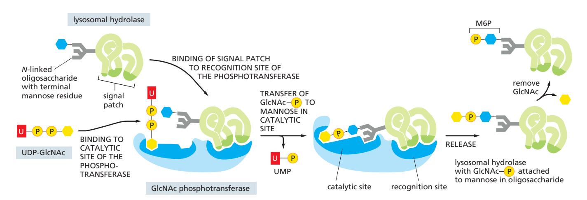

Figure 13–41 The recognition of a lysosomal hydrolase. A GlcNAc phosphotransferase recognizes lysosomal hydrolases in the Golgi apparatus. The enzyme has separate catalytic and recognition sites. The catalytic site binds both high-mannose *N*-linked oligosaccharides and UDP-GlcNAc. The recognition site binds to a signal patch that is present only on the surface of lysosomal hydrolases. A second enzyme cleaves off the GlcNAc, leaving the mannose 6-phosphate exposed.

Not all the hydrolase molecules that are tagged with M6P get to lysosomes. Some escape the normal packaging process in the *trans* Golgi network and are transported by the constitutive secretory pathway to the cell surface, where they are secreted into the extracellular fluid. Some M6P receptors, however, also take a detour to the plasma membrane, where they recapture the escaped lysosomal hydrolases and return them by *receptor-mediated endocytosis* (discussed later) to lysosomes via early and late endosomes. As lysosomal hydrolases require an acidic milieu to work, they can do little harm in the extracellular fluid, which usually has a neutral pH of 7.4.

For the sorting system that segregates lysosomal hydrolases and dispatches them to endosomes to work, the M6P groups must be added only to the appropriate glycoproteins in the Golgi apparatus. This requires specific recognition of the hydrolases by the Golgi enzymes responsible for adding M6P. Because all glycoproteins leave the ER with identical *N*-linked oligosaccharide chains, the signal for adding the M6P units to oligosaccharides must reside somewhere in the polypeptide chain of each hydrolase. Genetic engineering experiments have revealed that the recognition signal is a cluster of neighboring amino acids on each protein's surface, known as a *signal patch* (**Figure 13–41**). Because most lysosomal hydrolases contain multiple oligosaccharides, they acquire many M6P groups, providing a high-affinity signal for the M6P receptor. MBoC7 m13.46/13.41

# Defects in the GlcNAc Phosphotransferase Cause a Lysosomal Storage Disease in Humans

Genetic defects that affect one or more of the lysosomal hydrolases cause a number of human **lysosomal storage diseases**. The defects result in an accumulation of undigested substrates in lysosomes, with severe pathological consequences, most often in the nervous system. In most cases, there is a mutation in a structural gene that codes for an individual lysosomal hydrolase. This occurs in *Hurler's disease*, for example, in which the enzyme required for the breakdown of certain types of glycosaminoglycan chains is defective or missing. The most severe form of lysosomal storage disease, however, is a very rare inherited metabolic disorder called *inclusion-cell disease* (*I-cell disease*). In this condition, almost all of the hydrolytic enzymes are missing from the lysosomes of many cell types, and their undigested substrates accumulate in these lysosomes, which consequently form large *inclusions* in the cells. The consequent pathology is complex, affecting all organ systems, skeletal integrity, and mental development; individuals rarely live beyond 6 or 7 years.

I-cell disease is due to a single gene defect and, like most genetic enzyme deficiencies, it is recessive; that is, it occurs only in individuals having two copies of the defective gene. In individuals with I-cell disease, all the hydrolases missing from lysosomes are found in the blood: because they fail to sort properly in the Golgi apparatus, they are secreted rather than transported to lysosomes. The mis-sorting has been traced to a defective or missing GlcNAc phosphotransferase. Because lysosomal enzymes are not phosphorylated in the *cis* Golgi network, the M6P receptors do not segregate them into the appropriate transport vesicles in the TGN. Instead, the lysosomal hydrolases are carried to the cell surface and secreted.

In I-cell disease, the lysosomes in some cell types, such as hepatocytes, contain a normal complement of lysosomal enzymes, implying that there is another pathway for directing hydrolases to lysosomes that is used by some cell types but not others. Alternative sorting receptors function in these M6P-independent pathways. Similarly, an M6P-independent pathway in all cells sorts the membrane proteins of lysosomes from the TGN for transport to late endosomes, and those proteins are therefore normal in I-cell disease.

#### Secretory Vesicles Bud from the *Trans* Golgi Network

Cells that are specialized for secreting some of their products rapidly on demand concentrate and store these products in **secretory vesicles** (often called *densecore secretory granules* because they have dense cores when viewed in the electron microscope). As we discussed (see Figure 13–38), secretory vesicles form from the TGN, and they release their contents to the cell exterior by exocytosis in response to specific signals. The secreted product can be either a small molecule (such as histamine or a neuropeptide) or a protein (such as a hormone or digestive enzyme).

Proteins destined for secretory vesicles (called *secretory proteins*) are packaged into appropriate vesicles in the TGN by a mechanism that involves the selective aggregation of the secretory proteins. Clumps of aggregated, electrondense material can be detected by electron microscopy in the lumen of the TGN. The signals that direct secretory proteins into such aggregates are not well defined and may be quite diverse. When a gene encoding a secretory protein is artificially expressed in a secretory cell that normally does not make the protein, the foreign protein is appropriately packaged into secretory vesicles. This observation shows that, although the proteins that an individual cell expresses and packages in secretory vesicles differ, they contain common sorting signals, which function properly even when the proteins are expressed in cells that do not normally make them.

It is unclear how the aggregates of secretory proteins are segregated into secretory vesicles. Secretory vesicles have unique proteins in their membrane, some of which might serve as receptors for aggregated protein in the TGN. The aggregates are much too big, however, for each molecule of the secreted protein to be bound by its own cargo receptor, as occurs for transport of the lysosomal enzymes. Instead, the aggregate might cause the membrane region containing the cargo receptor to zipper up around the aggregate, thereby enclosing it within the budding vesicle.

Initially, the membrane of the secretory vesicles that leave the TGN is only loosely wrapped around the clusters of aggregated secretory proteins. Morphologically, these *immature secretory vesicles* resemble dilated *trans* Golgi cisternae that have pinched off from the Golgi stack. As immature secretory vesicles mature, clathrin-coated transport vesicles bud from them and go back to the TGN (**Figure 13–42**). This recycling process not only returns Golgi components to the Golgi apparatus, but also serves to concentrate the contents of secretory vesicles. The sum of all the retrieval pathways during the transit of a secretory protein from the ER through the Golgi cisternae to a mature secretory vesicle results in a 200- to 400-fold increase in net concentration.

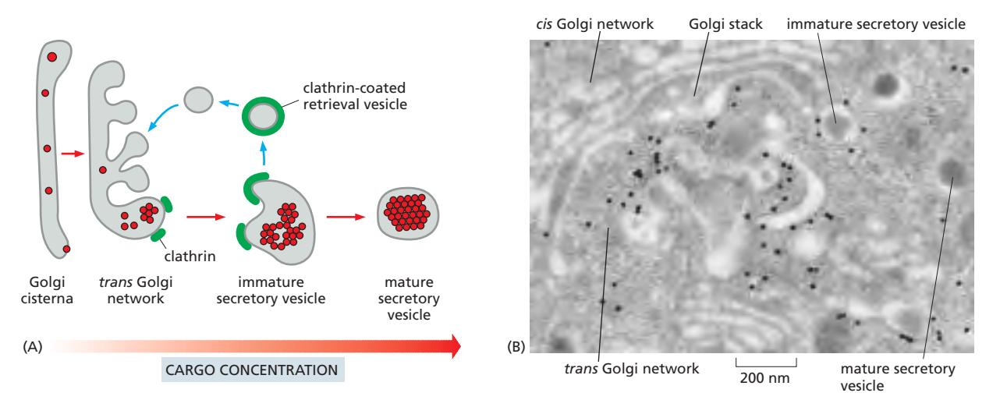

MBoC7 m13.64/13.42 Figure 13–42 The formation of secretory vesicles. (A) Secretory proteins become segregated and highly concentrated in secretory vesicles by two mechanisms. First, they aggregate in the ionic environment of the TGN; often, the aggregates become more condensed as a secretory vesicle matures and its lumen becomes more acidic. Second, clathrin-coated vesicles retrieve excess membrane and lumenal content present in immature secretory vesicles as the secretory vesicles mature. (B) This electron micrograph shows secretory vesicles forming from the TGN in an insulin-secreting β cell of the pancreas. Anti-clathrin antibodies conjugated to gold spheres *(black dots)* have been used to locate clathrin molecules. The immature secretory vesicles*,* which contain insulin precursor protein (proinsulin), contain clathrin patches, which are no longer seen on the mature secretory vesicle. (B, courtesy of Lelio Orci.)

Immature secretory vesicles also fuse with one another, and the lumens become progressively more acidic from the increasing concentration of V-type ATPases in the vesicle membrane. Acidification of the lumen further condenses the secretory protein aggregate within a vesicle whose excess membrane has now been retrieved back to the TGN. Because the final mature secretory vesicles are so densely filled with contents, the secretory cell can disgorge large amounts of material promptly by exocytosis when triggered to do so (**Figure 13–43**).

### Precursors of Secretory Proteins Are Proteolytically Processed During the Formation of Secretory Vesicles

Concentration is not the only process to which secretory proteins are subjected as the secretory vesicles mature. Many protein hormones and small neuropeptides, as well as many secreted hydrolytic enzymes, are synthesized as inactive precursors. Proteolysis is necessary to liberate the active molecules from these precursor proteins. The cleavages occur in the secretory vesicles and sometimes in the extracellular fluid after secretion. Additionally, many of the precursor proteins exit the ER with an N-terminal *propeptide* that is cleaved off only later in the secretory pathway to yield the mature protein. These proteins are initially synthesized as *pre-pro-proteins*, with the ER signal peptide (sometimes referred to as a *pre-peptide*) cleaved off earlier as the protein enters the rough ER (see Figure 12–18). In other cases, peptide signaling molecules are made as *polyproteins* that contain multiple copies of the same amino acid sequence. In still more complex cases, a variety of peptide signaling molecules are synthesized as parts of a single polyprotein that acts as a precursor for multiple end products, which are individually cleaved from the initial polypeptide chain. The same polyprotein may be processed in various ways to produce different peptides in different cell types (**Figure 13–44**).

Why is proteolytic processing so common in the secretory pathway? Some of the peptides produced in this way, such as the *enkephalins* (five-aminoacid neuropeptides with morphine-like activity), are undoubtedly too short in their mature forms to be co-translationally transported into the ER lumen or to

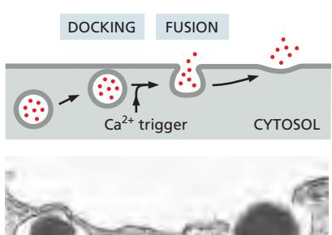

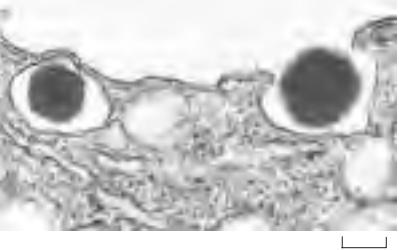

0.2 µm

MBoC7 m13.65/13.43 Figure 13–43 Exocytosis of secretory vesicles. The process is illustrated schematically *(top)* and in an electron micrograph that shows the release of insulin from a secretory vesicle of a pancreatic β cell. (Courtesy of Lelio Orci, from L. Orci et al., *Sci. Am.* 259:85–94, 1988.)

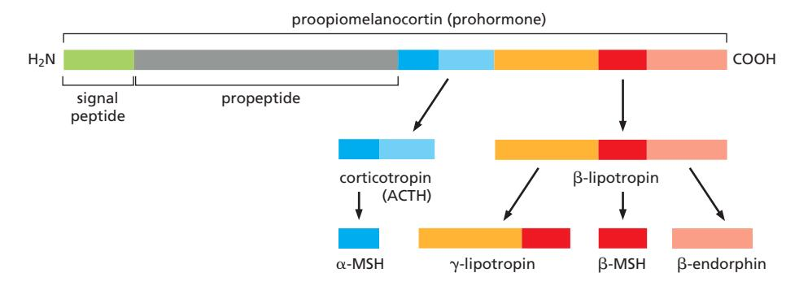

include the necessary signal for packaging into secretory vesicles. In addition, for secreted hydrolytic enzymes—or any other protein whose activity could be harmful inside the cell that makes it—delaying activation of the protein until it reaches a secretory vesicle or until after it has been secreted has a clear advantage: the delay prevents the protein from acting prematurely inside the cell in which it is synthesized.

# Secretory Vesicles Wait Near the Plasma Membrane Until Signaled to Release Their Contents

Once loaded, a secretory vesicle has to reach the site of secretion, which in some cells is far away from the TGN. Nerve cells are the most extreme example. Secretory proteins, such as peptide neurotransmitters (neuropeptides), which will be released from nerve terminals at the end of the axon, are made and packaged into secretory vesicles in the cell body. They then travel along the axon to the nerve terminals, which can be a meter or more away. As discussed in Chapter 16, motor proteins propel the vesicles along axonal microtubules, whose uniform orientation guides the vesicles in the proper direction. Microtubules also guide transport vesicles to the cell surface for constitutive exocytosis.

Whereas transport vesicles containing materials for constitutive release fuse with the plasma membrane once they arrive there, secretory vesicles in the regulated pathway wait at the membrane until the cell receives a signal for the vesicles to secrete their cargo. The signal can be an electrical nerve impulse (an action potential) or an extracellular signal molecule, such as a hormone. In either case, it leads to a transient increase in the concentration of free Ca2+ in the cytosol, which is the trigger for secretory vesicle fusion.

# For Rapid Exocytosis, Synaptic Vesicles Are Primed at the Presynaptic Plasma Membrane

Nerve cells (and some endocrine cells) contain two types of secretory vesicles. As for all secretory cells, these cells package proteins and neuropeptides in densecored secretory vesicles in the standard way for release by the regulated secretory pathway. In addition, however, they use another specialized class of tiny (∼50 nm diameter) secretory vesicles called **synaptic vesicles**. These vesicles store small *neurotransmitter molecules*, such as acetylcholine, glutamate, glycine, and γ-aminobutyric acid (GABA), which mediate rapid signaling from a nerve cell to its target cell at chemical synapses as we discussed in Chapter 11. When an action potential arrives at a nerve terminal, it causes an influx of Ca2+ through voltage-gated Ca2+ channels, which triggers the synaptic vesicles to fuse with the plasma membrane and release their contents to the extracellular space (see Figure 11–38). Some neurons fire more than 1000 times per second, releasing neurotransmitters each time.

The speed of transmitter release (taking only milliseconds) indicates that the proteins mediating the fusion reaction do not undergo complex, multistep

#### Figure 13–44 Processing pathways for the prohormone polyprotein proopiomelanocortin. The initial cleavages are made by proteases that cut next to pairs of positively charged amino acids (Lys-Arg, Lys-Lys, Arg-Lys, or Arg-Arg pairs). Trimming reactions then produce the final secreted products. Different cell types produce different concentrations of individual processing enzymes, so that the same prohormone precursor is cleaved to produce different peptide hormones. In the anterior lobe of the pituitary gland, for example, only corticotropin (ACTH) and β-lipotropin are produced from proopiomelanocortin, whereas in the intermediate lobe of the pituitary gland, mainly α-melanocyte stimulating hormone (α-MSH), γ-lipotropin, β-MSH, and β-endorphin are produced—α-MSH from

ACTH and the other three from β-lipotropin,

as shown.

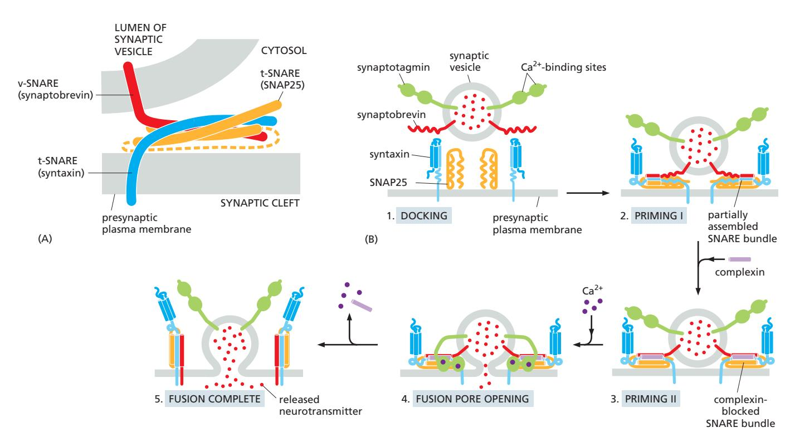

MBoC7 m13.67/13.45 Figure 13–45 Exocytosis of synaptic vesicles. For orientation at a synapse, see Figure 11–38. (A) The trans-SNARE complex responsible for docking synaptic vesicles at the plasma membrane of nerve terminals consists of three proteins. The v-SNARE *synaptobrevin* and the t-SNARE *syntaxin* are both transmembrane proteins, and each contributes one α helix to the complex. By contrast to other SNAREs discussed earlier, the t-SNARE *SNAP25* is a peripheral membrane protein that contributes two α helices to the four-helix bundle; the two helices are connected by a loop *(dashed line)* that lies parallel to the membrane and has fatty acyl chains (not shown) attached to anchor it there. The four α helices are shown as rods for simplicity. (B) At the synapse, the basic SNARE machinery is modulated by the Ca2+ sensor *synaptotagmin* and an additional protein called *complexin*. Synaptic vesicles first dock at the membrane (step 1), and the SNARE bundle partially assembles (step 2), resulting in a "primed vesicle" that is already drawn close to the membrane. The SNARE bundle assembles further, but the additional binding of complexin prevents fusion (step 3). Upon arrival of an action potential, Ca2+ enters the cell and binds to synaptotagmin, which releases the block and opens a fusion pore (step 4). Further rearrangements complete the fusion reaction (step 5) and release the fusion machinery, which now can be reused. This elaborate arrangement allows the fusion machinery to respond on the millisecond time scale essential for rapid and repetitive synaptic signaling. (A, adapted from R.B. Sutton et al., *Nature* 395:347–353, 1998; B, adapted from J. Tang et al., *Cell* 126:1175–1187, 2006. With permission from Elsevier.)

rearrangements. Rather, after vesicles have been docked at the presynaptic plasma membrane, they undergo a priming step, which prepares them for rapid fusion. In the primed state, the SNAREs are partly paired but their helices are not fully wound into the final four-helix bundle required for fusion (**Figure 13–45**). Proteins called *complexins* freeze the SNARE complexes in this metastable state. The brake imposed by the complexins is released by another synaptic vesicle protein, synaptotagmin, which contains Ca2+-binding domains. A rise in cytosolic Ca2+ triggers binding of synaptotagmin to the SNAREs, displacing the complexins. As the SNARE bundle zippers up completely, a fusion pore opens and the neurotransmitters are released. At a typical synapse, only a small number of the docked vesicles are primed and ready for exocytosis. The use of only a small fraction of primed vesicles at a time allows each synapse to fire over and over again in quick succession. With each firing, new synaptic vesicles dock and become primed to replace those that have fused and released their contents.

#### Synaptic Vesicles Can Be Recycled Locally After Exocytosis

For the nerve terminal to respond rapidly and repeatedly, synaptic vesicles need to be replenished very quickly after they discharge. This is achieved by local recycling of synaptic vesicles from the presynaptic plasma membrane in the

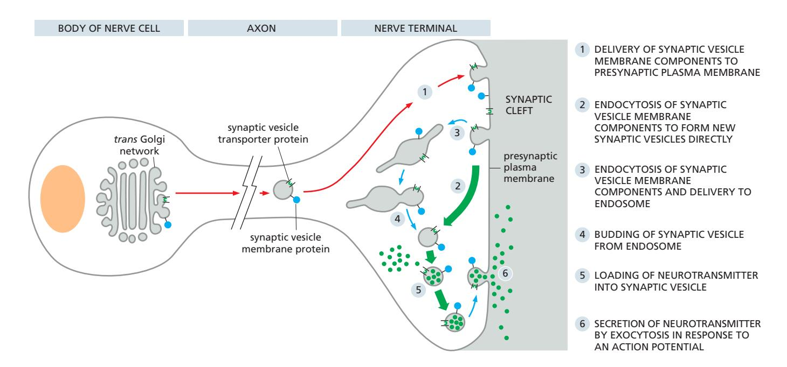

nerve terminals (**Figure 13–46**). In this process, membrane components of synaptic vesicles are removed from the surface by endocytosis almost as fast as they are added by exocytosis. Similarly, newly made membrane components of the synaptic vesicles are initially delivered to the plasma membrane by the constitutive secretory pathway and then retrieved by endocytosis. The membrane components of a synaptic vesicle include transporters specialized for the uptake of neurotransmitter from the cytosol, where the small-molecule neurotransmitters that mediate fast synaptic signaling are synthesized (**Figure 13–47**). Most of the endocytic vesicles immediately fill with neurotransmitter to become synaptic vesicles. Once filled with neurotransmitter, the synaptic vesicles can be used again (see Figure 13–46). MBoC7 m13.68/13.46

# Secretory Vesicle Membrane Components Are Quickly Removed from the Plasma Membrane

When a secretory vesicle fuses with the plasma membrane, its contents are discharged from the cell by exocytosis and its membrane becomes part of the plasma membrane. Although this should increase the surface area of the plasma membrane, it does so only transiently, because an equivalent amount of membrane is removed from the surface by endocytosis almost as fast as it is added by exocytosis, a process reminiscent of the endocytic–exocytic cycle discussed later. The proteins of the secretory vesicle membrane that are endocytosed from the plasma membrane are either recycled or shuttled to lysosomes for degradation through mechanisms discussed later. The amount of secretory vesicle membrane that is temporarily added to the plasma membrane can be enormous: in a pancreatic acinar cell discharging digestive enzymes for delivery to the gut lumen, about 900 μm2 of vesicle membrane is inserted into the apical plasma membrane (whose area is only 30 μm2) when the cell is stimulated to secrete.

Control of membrane traffic thus has a major role in maintaining the composition of the various membranes of the cell. To maintain each membrane-enclosed compartment in the secretory and endocytic pathways at a constant size, the balance between the outward and inward flows of membrane needs to be precisely regulated. For cells to grow, however, the forward flow needs to be greater than the retrograde flow, so that the membrane can increase in area. For cells to maintain a constant size, the forward and retrograde flows must be equal. We still know very little about the mechanisms that coordinate these flows.

Figure 13–46 The formation of synaptic vesicles in a nerve cell. These tiny uniform vesicles are found only in nerve cells and in some endocrine cells, where they store and secrete small-molecule neurotransmitters. The import of neurotransmitter directly into the small endocytic vesicles that form from the plasma membrane is mediated by membrane transporters that function as antiports and are driven by an H+ gradient maintained by V-type ATPase H+ pumps in the vesicle membrane (discussed in Chapter 11).

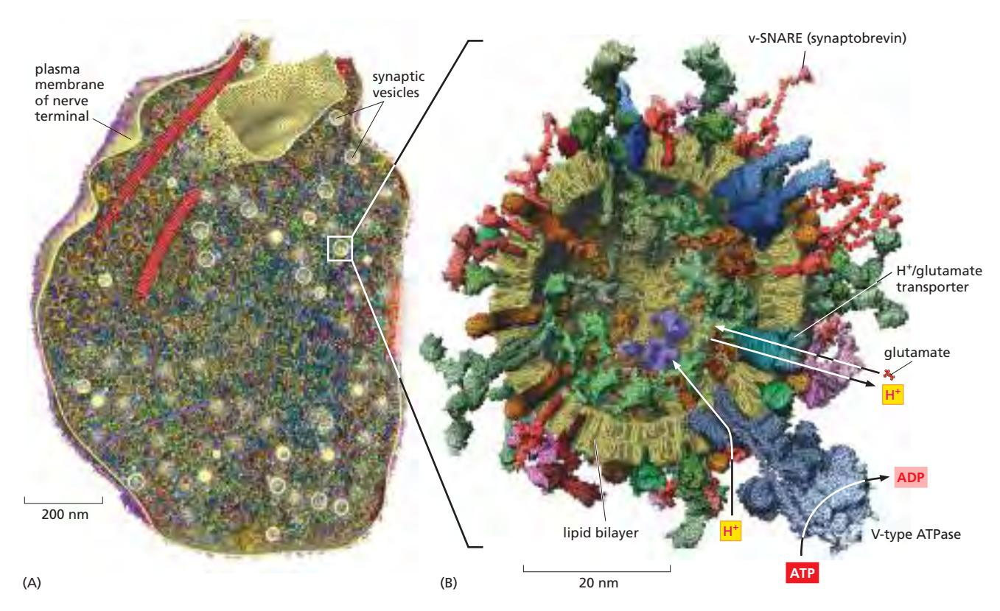

MBoC7 m13.69/13.47 Figure 13–47 Scale models of a brain presynaptic terminal and a synaptic vesicle. The illustrations show sections through a presynaptic terminal (A) and a synaptic vesicle (B) in which proteins and lipids are drawn to scale on the basis of their known stoichiometry and either known or approximated structures. The relative localization of protein molecules in different regions of the presynaptic terminal was inferred from superresolution imaging and electron microscopy. The model in A contains 300,000 proteins of 60 different kinds that vary in abundance from 150 copies to 20,000 copies. In the model in B, only 70% of the membrane proteins present in the membrane are shown; a complete model would therefore show a membrane that is even more crowded than this picture suggests (Movie 13.6). Each synaptic vesicle membrane contains 7000 phospholipid molecules and 5700 cholesterol molecules. Each also contains close to 50 different integral membrane protein molecules, which vary widely in their relative abundance and together contribute about 600 transmembrane α helices. The transmembrane v-SNARE synaptobrevin is the most abundant protein in the vesicle (∼70 copies per vesicle). By contrast, the V-type ATPase, which uses ATP hydrolysis to pump H+ into the vesicle lumen, is present in 1–2 copies per vesicle. The H+ gradient provides the energy for neurotransmitter import by an H+/neurotransmitter antiport, which loads each vesicle with 1800 neurotransmitter molecules, such as glutamate, one of which is shown to scale. (A, from B.G. Wilhelm et al., *Science* 344:1023–1028, 2014. With permission from AAAS; B, adapted from S. Takamori et al., *Cell* 127:831–846, 2006. With permission from Elsevier.)

# Some Regulated Exocytosis Events Serve to Enlarge the Plasma Membrane

An important task of regulated exocytosis is to deliver more membrane to enlarge the surface area of a cell's plasma membrane when such a need arises. A spectacular example is the plasma membrane expansion that occurs during the cellularization process in a fly embryo, which initially is a syncytium—a single cell containing about 6000 nuclei surrounded by a single plasma membrane (see Figure 21–14). Within tens of minutes, the embryo is converted into the same number of cells. This process of *cellularization* requires a vast amount of new plasma membrane, which is added by a carefully orchestrated fusion of cytoplasmic vesicles, eventually forming the plasma membranes that enclose the separate cells. Similar vesicle fusion events are required to enlarge the plasma membrane when other animal cells or plant cells divide during *cytokinesis* (discussed in Chapter 17).

Many animal cells, especially those subjected to mechanical stresses, frequently experience small ruptures in their plasma membrane. In a remarkable process thought to involve both homotypic vesicle–vesicle fusion and exocytosis, a temporary cell-surface patch is quickly fashioned from locally available

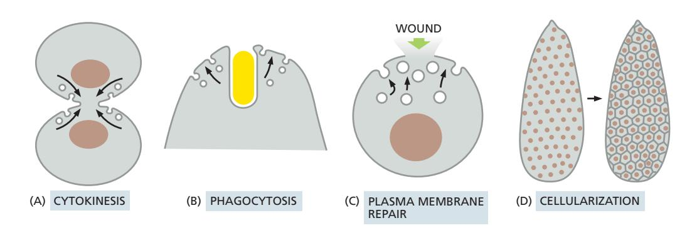

internal-membrane sources, such as lysosomes. In addition to providing an emergency barrier against leaks, the patch reduces membrane tension over the wounded area, allowing the bilayer to flow back together to restore continuity and seal the puncture. The fusion and exocytosis of vesicles that mediated membrane repair is triggered by the sudden increase of Ca2+, which is abundant in the extracellular space and rushes into the cell as soon as the plasma membrane is punctured. **Figure 13–48** shows four examples in which regulated exocytosis leads to plasma membrane expansion. MBoC7 m13.70/13.48

# Polarized Cells Direct Proteins from the *Trans* Golgi Network to the Appropriate Domain of the Plasma Membrane

Most cells in tissues are *polarized*, with two or more molecularly and functionally distinct plasma membrane domains. This raises the general problem of how the delivery of membrane from the Golgi apparatus is organized so as to maintain the differences between one cell-surface domain and another. A typical epithelial cell, for example, has an *apical domain*, which faces either an internal cavity or the outside world and often has specialized features such as cilia or a brush border of microvilli. It also has a *basolateral domain*, which covers the rest of the cell. The two domains are separated by a ring of *tight junctions* (see Figure 19–20), which prevents proteins and lipids from diffusing between the two domains, so that the differences between the two domains are maintained.

Different subsets of proteins are secreted from the apical and basolateral surfaces of the cell. Epithelial cells lining the gut, for example, secrete digestive enzymes and mucus at their apical surface and components of the basal lamina at their basolateral surface. Such cells must have ways of directing vesicles carrying different cargoes to different plasma membrane domains. Proteins destined for different domains travel together from the ER until they reach the TGN, where they are separated and dispatched in secretory or transport vesicles to the appropriate plasma membrane domain (**Figure 13–49**). These routes are known as the *direct pathways* for polarized secretion because cargo destined for the apical and basolateral domains is delivered there directly.

The apical plasma membrane of most epithelial cells is greatly enriched in glycosphingolipids, which help protect this exposed surface from damage; for example, from the digestive enzymes and low pH in sites such as the gut or stomach, respectively. Similarly, plasma membrane proteins that are linked to the lipid bilayer by a glycosylphosphatidylinositol (GPI) anchor (see Figure 12–30) are found predominantly in the apical plasma membrane. If recombinant DNA techniques are used to attach a GPI anchor to a protein that would normally be delivered to the basolateral surface, the protein is delivered to the apical surface instead. GPI-anchored proteins are thought to be directed to the apical membrane because they associate with glycosphingolipids in lipid rafts that form in the membrane of the TGN. As discussed in Chapter 10, lipid rafts form in the TGN and plasma membrane when glycosphingolipids and cholesterol molecules self-associate (see Figure 10–13). Having selected a unique set of cargo molecules, the rafts then bud from the TGN into transport vesicles destined for the apical plasma membrane.

Figure 13–48 Four examples of regulated exocytosis leading to plasma membrane enlargement. The vesicles fusing with the plasma membrane during cytokinesis (A) (discussed in Chapter 17) and phagocytosis (B) (discussed later in this chapter) are thought to be derived from endosomes, whereas those involved in wound repair (C) may be derived from plasma membranes and lysosomes. The vast amount of new plasma membrane inserted during cellularization in a fly embryo occurs by the fusion of cytoplasmic vesicles (D).

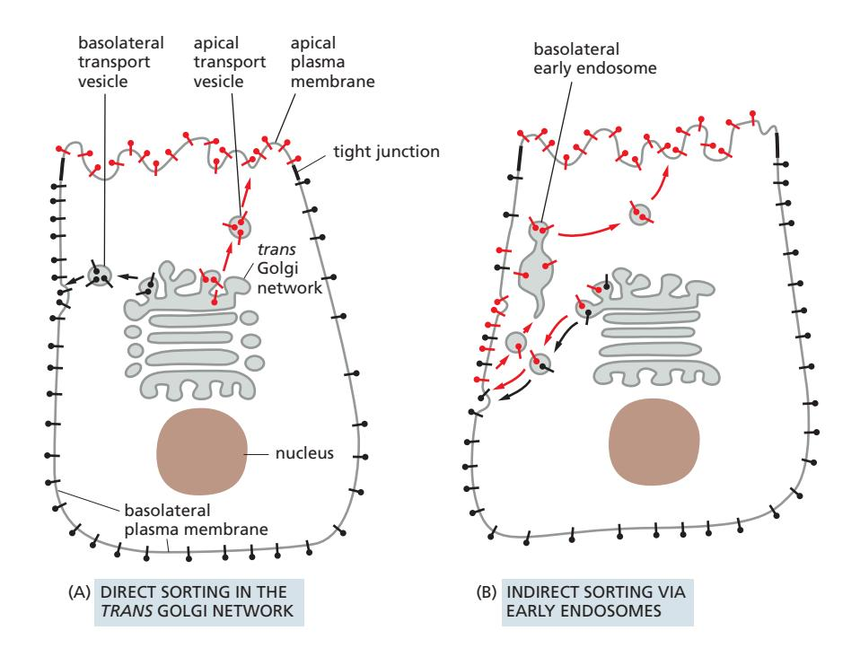

Figure 13–49 Two ways of sorting plasma membrane proteins in a polarized epithelial cell. (A) In the direct pathway, proteins destined for different plasma membrane domains are sorted and packaged into different transport vesicles. The lipid raft–dependent delivery system to the apical domain described in the text is an example of the direct pathway. (B) In the indirect pathway, a protein is retrieved from the inappropriate plasma membrane domain by endocytosis and then transported to the correct domain via early endosomes; that is, by transcytosis. The indirect pathway, for example, is used in liver hepatocytes to deliver proteins to the apical domain that lines bile ducts.

While secretory and GPI-anchored proteins rely on the direct pathways, membrane proteins can sometimes use an indirect route to arrive at the appropriate membrane surface (see Figure 13–49B). In this route, both apical and basolateral cargo travel together in transport vesicles from the TGN to the basolateral membrane. Membrane proteins that do not belong in that region of the plasma membrane are retrieved by endocytosis and are transported via early endosomes to the correct region. Membrane proteins destined for delivery to the basolateral membrane contain sorting signals in their cytosolic tail. When present in an appropriate structural context, these signals are recognized by coat proteins that package them into appropriate transport vesicles in the TGN. The same basolateral signals that are recognized in the TGN also function in early endosomes to redirect the proteins back to the basolateral plasma membrane after they have been endocytosed. A combination of direct and indirect deliveries ensures that the apical and basolateral membranes retain their distinct identities. MBoC7 m13.71/13.49

#### Summary

*Transport vesicles departing the TGN carry their contents to one of two major destinations: the plasma membrane for exocytosis or endosomes for eventual delivery to lysosomes. Vesicle transport from the TGN to the plasma membrane is further divided into a constitutive pathway or regulated pathways. Proteins follow the constitutive pathway unless they are diverted into other pathways or retained in the Golgi apparatus. In polarized cells, the transport pathways from the TGN to the plasma membrane operate selectively to ensure that different sets of membrane proteins, secreted proteins, and lipids are delivered to the different domains of the plasma membrane.*

*The regulated pathways operate only in specialized secretory cells and neurons. The molecules for regulated secretion are stored either in secretory vesicles or in synaptic vesicles, which do not fuse with the plasma membrane to release their contents until they receive an appropriate signal. Secretory vesicles containing proteins for secretion bud from the TGN. The secretory proteins become concentrated during the formation and maturation of the secretory vesicles. Synaptic vesicles, which are confined to nerve cells and some endocrine cells, form from both endocytic vesicles and from endosomes, and they mediate the regulated secretion of small-molecule neurotransmitters at the axon terminals of nerve cells.*

*Newly synthesized lysosomal proteins are carried from the TGN to endosomes by means of clathrin-coated transport vesicles before moving on to lysosomes.*  *The lysosomal hydrolases contain N-linked oligosaccharides that are covalently modified in a unique way in the cis Golgi network so that their mannoses are phosphorylated. These mannose 6-phosphate (M6P) groups are recognized by an M6P receptor protein in the trans Golgi network that segregates the hydrolases and helps package them into budding transport vesicles that deliver their contents to endosomes. The M6P receptors shuttle back and forth between the trans Golgi network and the endosomes. The low pH in endosomes and the removal of the phosphate from the M6P group cause the lysosomal hydrolases to dissociate from these receptors, making the transport of the hydrolases unidirectional. A separate transport system uses clathrin-coated vesicles to deliver resident lysosomal membrane proteins from the trans Golgi network to endosomes.*

# TRANSPORT INTO THE CELL FROM THE PLASMA MEMBRANE: ENDOCYTOSIS

The routes that lead inward from the cell surface start with the process of **endocytosis**, by which cells take up plasma membrane components, fluid, solutes, macromolecules, and particulate substances. Endocytosed cargo includes receptor–ligand complexes, a spectrum of nutrients and their carriers, extracellular matrix components, cell debris, bacteria, viruses, and, in specialized cases, even other cells. Through endocytosis, the cell regulates the composition of its plasma membrane in response to changing extracellular conditions.

In endocytosis, the material to be ingested is progressively enclosed by a small portion of the plasma membrane, which first invaginates and then pinches off to form an **endocytic vesicle** containing the ingested substance or particle. Most eukaryotic cells constantly form endocytic vesicles, a process called *pinocytosis* ("cell drinking"); in addition, some specialized cells contain dedicated pathways that take up large particles on demand, a process called *phagocytosis* ("cell eating"). Endocytic vesicles form at the plasma membrane by multiple mechanisms that differ in both the molecular machinery used and how that machinery is regulated.

Once generated at the plasma membrane, most endocytic vesicles fuse with a common receiving compartment, the *early endosome*, where internalized cargo is sorted: some cargo molecules are returned to the plasma membrane, either directly or via a *recycling endosome*, and others remain as the early endosome changes into a *late endosome* by a process termed *endosome maturation* (**Figure 13–50**). This conversion process changes the protein composition of the endosome membrane, patches of which invaginate and become incorporated within the organelles as *intralumenal vesicles*, while the endosome itself moves from the cell periphery to a location close to the nucleus. As an endosome matures, it ceases to recycle material to the plasma membrane. Instead, late

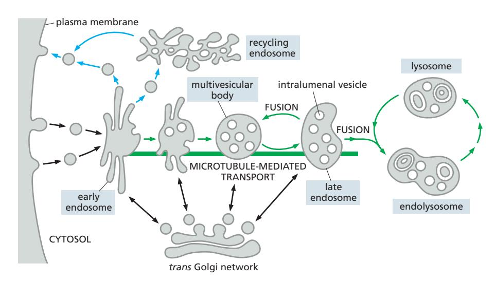

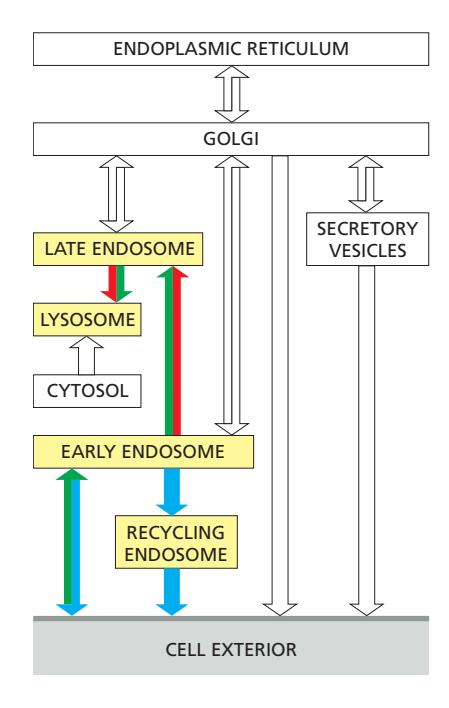

MBoC7 RM4 Figure 13–50 Endosome maturation: the endocytic pathway from the plasma membrane to lysosomes. Near the cell periphery, endocytic vesicles fuse with an early endosome, which is the primary sorting station. Tubular portions of the early endosome bud off vesicles that recycle endocytosed cargo back to the plasma membrane—either directly or indirectly via recycling endosomes. Recycling endosomes can store proteins until they are needed. Conversion of early endosomes to late endosomes is accompanied by loss of the tubular projections. Membrane proteins destined for degradation are internalized in intralumenal vesicles. The developing late endosome, or multivesicular body, moves on microtubules to the cell interior. Fully matured late endosomes no longer send vesicles to the plasma membrane, and they fuse with one another and with endolysosomes and lysosomes to degrade their contents. Each stage of endosome maturation is connected to the TGN via transport vesicles, providing a continual supply of newly synthesized lysosomal proteins.

endosomes fuse with one another and with lysosomes to form endolysosomes, which degrade their contents.

Each of the stages of endosome maturation—from the early endosome to the endolysosome—is connected to the TGN through bidirectional vesicle transport pathways. These pathways allow insertion of newly synthesized materials, such as lysosomal enzymes arriving from the ER, and the retrieval of components, such as the M6P receptor, back into the early parts of the secretory pathway. We later discuss how the cell uses and controls the various features of endocytic trafficking.

# Pinocytic Vesicles Form from Coated Pits in the Plasma Membrane

Virtually all eukaryotic cells continually ingest portions of their plasma membrane in the form of small pinocytic (endocytic) vesicles. The rate at which plasma membrane is internalized in this process of **pinocytosis** varies between cell types, but it is usually surprisingly high. A macrophage, for example, ingests 25% of its own volume of fluid each hour. This means it must ingest 3% of its plasma membrane each minute, or 100% in about half an hour. Fibroblasts endocytose at a somewhat lower rate (1% of their plasma membrane per minute), whereas some amoebae ingest their plasma membrane even more rapidly. Because a cell's surface area and volume remain unchanged during this process, it is clear that the same amount of membrane being removed by endocytosis is being added to the cell surface by the converse process of *exocytosis*. In this sense, endocytosis and exocytosis are linked processes that can be considered to constitute an *endocytic–exocytic cycle.* The coupling between exocytosis and endocytosis is particularly strict in specialized structures characterized by high membrane turnover, such as a nerve terminal.

The endocytic part of the cycle often begins at **clathrin-coated pits**. These specialized regions typically occupy about 2% of the total plasma membrane area. The lifetime of a clathrin-coated pit is short: within a minute or so of being formed, it invaginates into the cell and pinches off to form a clathrin-coated vesicle (**Figure 13–51**). About 2500 clathrin-coated vesicles pinch off from the plasma membrane of a cultured fibroblast every minute. The coated vesicles are even more transient than the coated pits: within seconds of being formed, they shed their coat and fuse with early endosomes.

### Not All Membrane Invaginations and Pinocytic Vesicles Are Clathrin Coated

In addition to clathrin-coated pits and vesicles, cells can form other types of pinocytic vesicles and membrane invaginations. Most of these clathrin-independent membrane invaginations are poorly understood, and the molecules that mediate

Figure 13–51 The formation of clathrincoated vesicles from the plasma membrane. These electron micrographs illustrate the probable sequence of events in the formation of a clathrin-coated vesicle from a clathrin-coated pit. The clathrincoated pits and vesicles shown are larger than those seen in normal-sized cells; they are from a very large hen oocyte, and they take up lipoprotein particles to form yolk. The lipoprotein particles bound to their membrane-bound receptors appear as a dense, fuzzy layer on the extracellular surface of the plasma membrane—which is the inside surface of the coated pit and vesicle. (Courtesy of M.M. Perry and A.B. Gilbert, *J. Cell Sci.* 39:257–272, 1979. With permission from the Company of Biologists.)

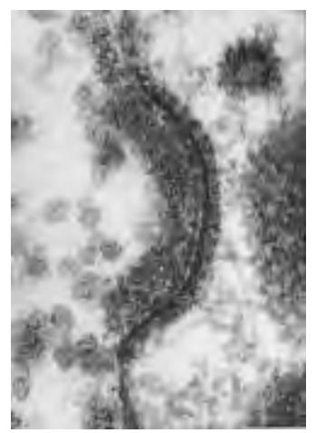

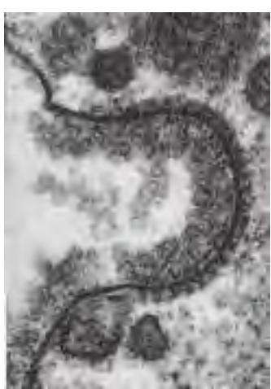

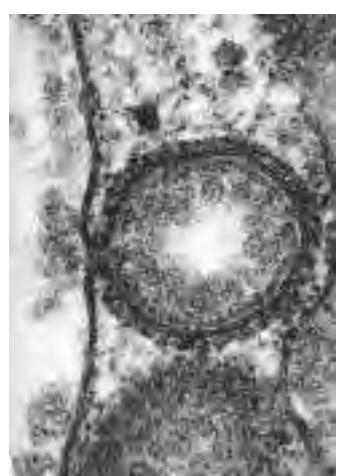

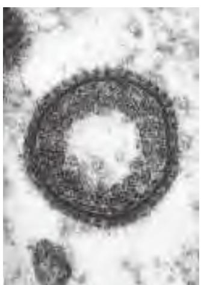

0.1 µm

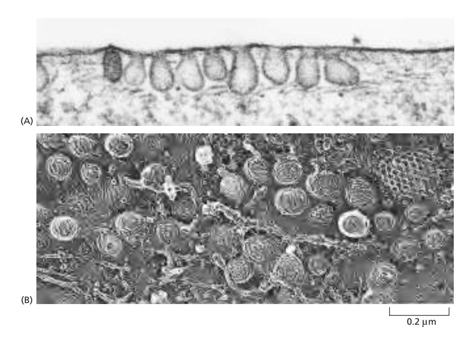

Figure 13–52 Caveolae in the plasma membrane of a fibroblast. (A) This electron micrograph shows a plasma membrane with a very high density of caveolae. (B) This rapid-freeze deep-etch image demonstrates the characteristic "cauliflower" texture of the cytosolic face of the caveolae membrane. The characteristic texture is thought to result from aggregates of caveolins and cavins. A clathrin-coated pit is also seen at the upper right. (From K.G. Rothberg et al., *Cell* 68:673–682, 1992. With permission from Elsevier.)

membrane bending and vesicle formation are often not defined fully. The bestunderstood clathrin-independent invaginations are called **caveolae** (from the Latin for "little cavities"), originally observed as a prominent feature of the endothelial cells that form the inner lining of blood vessels. MBoC7 m13.49/13.52

Caveolae, sometimes seen in the electron microscope as deeply invaginated flasks, are present in the plasma membrane of most vertebrate cell types (**Figure 13–52**). The major structural proteins in caveolae are **caveolins**, a family of unusual integral membrane proteins that each insert a hydrophobic loop into the membrane from the cytosolic side but do not extend across the membrane. On their cytosolic side, caveolins are bound to large protein complexes of cavin proteins, which are thought to stabilize the membrane curvature. Caveolae are especially rich in cholesterol, glycosphingolipids, and glycosylphosphatidylinositol (GPI)-anchored membrane proteins and might represent a type of *lipid raft* in the plasma membrane (see Figure 10–13).

In contrast to clathrin-coated and COPI-coated or COPII-coated vesicles, caveolae are usually static structures that can serve as a reservoir of additional plasma membrane. It is thought that cells subjected to dynamic changes in shear forces, such as the endothelial cells of arteries, exploit this reservoir to provide their plasma membranes greater resilience to stretch. This is accomplished by the rapid disassembly of the cavin protein scaffold in response to mechanical force, thereby allowing the underlying membrane to temporarily increase the surface area of the cell. The ability to rapidly change membrane surface area is thought to be important for accommodating dynamic changes in blood flow to different parts of the brain.

Two other endocytosis pathways are known, neither of which uses clathrin. **Macropinocytosis** is a process whereby the plasma membrane protrudes from the cell and engulfs a portion of the surrounding extracellular fluid into a *macropinosome*. This is a nonselective process for bringing fluid into the cell under certain conditions. In *phagocytosis*, the plasma membrane is directed to wrap around the particle to be engulfed until it fuses with itself, resulting in an enclosed *phagosome* inside the cell. Both processes utilize actin polymerization underneath the plasma membrane to mediate the large-scale membrane deformations required to engulf a large particle or a high volume of fluid. Both macropinosomes and phagosomes are destined to fuse with lysosomes so their internal contents can be degraded. These routes of degradation will be discussed later when we consider the function of lysosomes.

### Cells Use Receptor-mediated Endocytosis to Import Selected Extracellular Macromolecules

In most animal cells, clathrin-coated pits and vesicles provide an efficient pathway for taking up specific macromolecules from the extracellular fluid. In this process, called **receptor-mediated endocytosis**, the macromolecules bind to complementary transmembrane receptor proteins, which accumulate in coated pits, and then enter the cell as receptor–macromolecule complexes in clathrincoated vesicles (see Figure 13–51). Because ligands are selectively captured by receptors, receptor-mediated endocytosis provides a selective concentrating mechanism that increases the efficiency of internalization of particular ligands more than a hundredfold. In this way, even minor components of the extracellular fluid can be efficiently taken up in large amounts. A particularly well-understood and physiologically important example is the process that mammalian cells use to import cholesterol.

Many animal cells take up cholesterol through receptor-mediated endocytosis and, in this way, acquire most of the cholesterol they require to make new membrane. If the uptake is blocked, cholesterol accumulates in the blood and can contribute to the formation in blood vessel (artery) walls of *atherosclerotic plaques*, deposits of lipid and fibrous tissue that can cause strokes and heart attacks by blocking arterial blood flow. In fact, it was a study of humans with a strong genetic predisposition for *atherosclerosis* that first revealed the mechanism of receptor-mediated endocytosis.

Most cholesterol is transported in the blood as cholesterol esters in the form of lipid–protein particles known as **low-density lipoproteins (LDLs)** that, architecturally, resemble lipid droplets bearing a core of triacylglycerol, free cholesterol, and cholesterol esters. The droplet is stabilized by a single molecule of apolipoprotein B, a very large protein that wraps around the LDL particle (**Figure 13–53**). When a cell needs cholesterol for membrane synthesis, it makes transmembrane receptor proteins for LDL at the ER and transports them to the plasma membrane. Once in the plasma membrane, the *LDL receptor* diffuses until an endocytosis signal in its cytoplasmic tail binds the adaptor protein AP2 after AP2's conformation has been locally unlocked by binding to PI(4,5)P2 on the plasma membrane. This

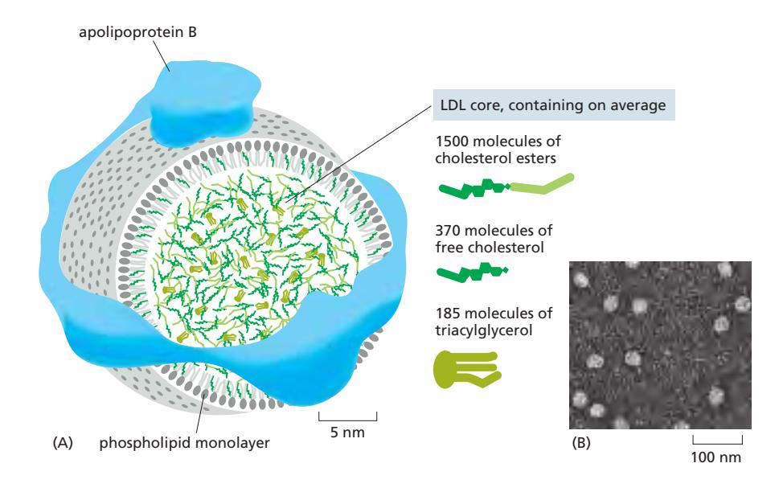

Figure 13–53 A low-density lipoprotein (LDL) particle. (A) Each roughly spherical particle has a mass of 3 × 106 daltons. It contains a core of about 1500 cholesterol molecules esterified to long-chain fatty acids and smaller amounts of free cholesterol and triacylglycerol molecules. A lipid monolayer composed of about 800 phospholipid and 500 unesterified cholesterol molecules surrounds the core of cholesterol esters. A single molecule of apolipoprotein B, a 500,000-dalton beltlike protein, organizes the particle and mediates the specific binding of LDL to cell-surface LDL receptors. (B) Purified LDL particles seen by negative staining in the electron microscope. (B, from L. Zhang et al., *J. Lipid Res.* 52:175–184, 2011. With permission from Elsevier.)

two-step mechanism of AP2 binding to an endocytosis signal (see Figure 13–9) imparts both efficiency and selectivity to the process. AP2 then recruits clathrin to initiate endocytosis.

Because coated pits constantly pinch off to form coated vesicles, any LDL particles bound to LDL receptors in the coated pits are rapidly internalized in coated vesicles. After shedding their clathrin coats, the vesicles deliver their contents to early endosomes. Once the LDL and LDL receptors encounter the low pH in early endosomes, LDL is released from its receptor and is delivered via late endosomes to lysosomes. There, the cholesterol esters in the LDL parti cles are hydrolyzed to free cholesterol, which is now available to the cell for new membrane synthesis (**Movie 13.7**). If too much free cholesterol accumulates in a cell, the cell simultaneously shuts off endogenous cholesterol synthesis (Figure 12–64) and reduces exogenous cholesterol intake by shutting off the synthesis of LDL receptors.

This regulated pathway for cholesterol uptake is disrupted in individuals who inherit defective genes encoding LDL receptors. The resulting high levels of blood cholesterol predispose these individuals to develop atherosclerosis pre maturely, and many would die at an early age of heart attacks resulting from coronary artery disease if they were not treated with drugs such as statins that lower the level of blood cholesterol. In some cases, the receptor is lacking altogether. In others, the receptors are defective—in either the extracellular binding site for LDL or the intracellular binding site for the AP2 adaptor protein in clathrin-coated pits. In the latter case, normal numbers of LDL receptors are present, but they fail to become localized in clathrin-coated pits. Although LDL binds to the surface of these mutant cells, it is not internalized, directly demonstrating the importance of clathrin-coated pits for the receptor-mediated endocytosis of cholesterol.

More than 25 distinct receptors are known to participate in receptor-mediated endocytosis of different types of molecules. They all apparently use clathrindependent internalization routes and are guided into clathrin-coated pits by signals in their cytoplasmic tails that bind to adaptor proteins in the clathrin coat. Many of these receptors, like the LDL receptor, enter coated pits irrespective of whether they have bound their specific ligands. Others enter preferentially when bound to a specific ligand, suggesting that a ligand-induced conformational change is required for them to activate the signal sequence that guides them into the pits. Because most plasma membrane proteins fail to become concentrated in clathrin-coated pits, the pits serve as molecular filters, preferentially collecting certain plasma membrane proteins (receptors) over others.

Electron microscopy of cultured cells exposed simultaneously to different labeled ligands demonstrates that many kinds of receptors can cluster in the same clathrin-coated pit, whereas some other receptors cluster in different clathrincoated pits. The plasma membrane of one clathrin-coated pit can accommodate more than 100 receptors of assorted varieties.

### Specific Proteins Are Retrieved from Early Endosomes and Returned to the Plasma Membrane

Early endosomes are the main sorting stations in the endocytic pathway, just as the *cis* and *trans* Golgi networks serve this function in the secretory pathway. In the mildly acidic environment of the early endosome, many internalized receptor proteins change their conformation and release their ligand, as already discussed for the M6P receptors. Those endocytosed ligands that dissociate from their receptors in the early endosome are usually destined for delivery to lysosomes, where they are either degraded and recycled into building blocks or utilized directly by the cell (such as the cholesterol just discussed). Some other endocy tosed ligands, however, remain bound to their receptors and thereby share the fate of the receptors.

In the early endosome, the LDL receptor dissociates from its ligand, LDL, and is recycled back to the plasma membrane for reuse, leaving the discharged LDL

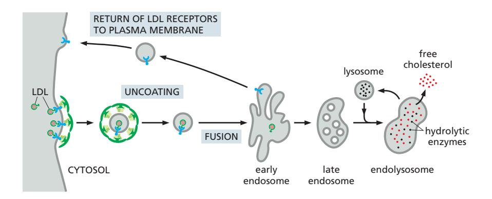

to be carried to lysosomes (**Figure 13–54**). The recycling transport vesicles bud from long, narrow tubules that extend from the early endosomes (**Figure 13–55**). It is likely that the geometry of these tubules helps the sorting process: because tubules have a large membrane area enclosing a small volume, membrane proteins become enriched over soluble proteins. The transport vesicles return the LDL receptor directly to the plasma membrane. MBoC7 m13.52/13.54

The **transferrin receptor** follows a similar recycling pathway as the LDL receptor, but unlike the LDL receptor it also recycles its ligand. Transferrin is a soluble protein that carries iron in the blood. Cell-surface transferrin receptors deliver transferrin with its bound iron to early endosomes by receptor-mediated endocytosis. The low pH in the endosome induces transferrin to release its bound iron, but the iron-free transferrin itself (called apotransferrin) remains bound to its receptor. The receptor–apotransferrin complex enters the tubular extensions of the early endosome and from there is recycled back to the plasma membrane. When the apotransferrin returns to the neutral pH of the extracellular fluid, it dissociates from the receptor and is thereby freed to pick up more iron and begin the cycle again. Thus, transferrin shuttles back and forth between the extracellular fluid and early endosomes, avoiding lysosomes and delivering iron to the cell interior, as needed for cells to grow and proliferate.

#### Recycling Endosomes Regulate Plasma Membrane Composition

The fates of endocytosed receptors—and of any ligands remaining bound to them—vary according to the specific type of receptor. As we discussed, most receptors are recycled and returned to the same plasma membrane domain from which they came; some proceed to a different domain of the plasma membrane, thereby mediating **transcytosis**; and some remain in the endosomal system and progress to lysosomes, where they are degraded, as we discuss next.

Receptors on the surface of polarized epithelial cells can transfer specific macromolecules from one extracellular space to another by transcytosis. A newborn, for example, obtains antibodies from its mother's milk (which help protect it against infection) by transporting them across the epithelium of its gut. The lumen of the gut is acidic, and, at this low pH, the antibodies in the milk bind to specific receptors on the apical (absorptive) surface of the gut epithelial cells. The receptor–antibody complexes are internalized via clathrin-coated pits and vesicles and are delivered to early endosomes. The complexes remain intact and are retrieved in transport vesicles that bud from the early endosome and subsequently fuse with the basolateral domain of the plasma membrane. On exposure to the neutral pH of the extracellular fluid that bathes the basolateral surface of the cells, the antibodies dissociate from their receptors and eventually enter the baby's bloodstream.

The transcytotic pathway from the early endosome back to the plasma membrane is not direct. The receptors first move from the early endosome to the **recycling endosome**. The variety of pathways that different receptors follow from early endosomes implies that, in addition to binding sites for their ligands and

Figure 13–54 The receptor-mediated endocytosis of LDL. Note that the LDL dissociates from its receptors in the acidic environment of the early endosome. After a number of steps, the LDL ends up in endolysosomes and lysosomes, where it is degraded to release free cholesterol. In contrast, the LDL receptors are returned to the plasma membrane via transport vesicles that bud off from the tubular region of the early endosome, as shown. For simplicity, only one LDL receptor is shown entering the cell and returning to the plasma membrane. Whether it is occupied or not, an LDL receptor typically makes one round trip into the cell and back to the plasma membrane every 10 minutes, making up to several hundred trips in its 20-hour life span.

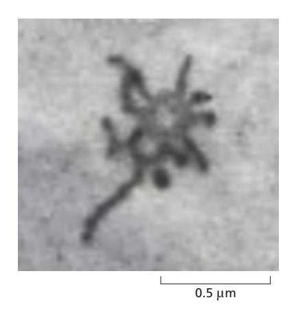

MBoC7 m13.53/13.55 Figure 13–55 Electron micrograph of an early endosome. The endosomal compartments can be made visible in the electron microscope by adding a readily detectable tracer molecule, such as the enzyme peroxidase, to the extracellular medium and allowing the cell to endocytose the tracer. Within a minute or so after adding the tracer, it starts to appear in early endosomes, just beneath the plasma membrane. The image shows an electron-dense reaction product of peroxidase in the early endosome that has been visualized in the electron microscope. Many tubular extensions protrude from the central vacuolar space of the early endosome, which will later mature to give rise to a late endosome. (© 1992 J. Tooze and M. Hollinshead. Originally published in *J. Cell Biol.* 118:813–830, 1992, doi.org/10.1083/jcb.118.4.813. With permission from Rockefeller University Press.)

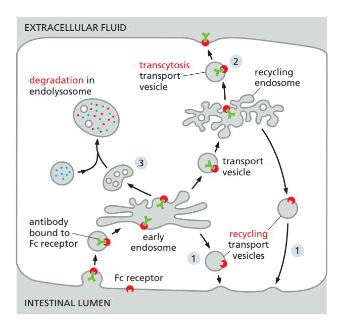

binding sites for coated pits, many receptors also possess sorting signals that guide them into the appropriate transport pathway (**Figure 13–56**).

Cells can regulate the release of membrane proteins from recycling endosomes, thus adjusting the flux of proteins through the transcytotic pathway according to need. This regulation, the mechanism of which is uncertain, allows recycling endosomes to play an important part in adjusting the concentration of specific plasma membrane proteins. Fat cells and muscle cells, for example, contain large intracellular pools of the glucose transporters that are responsible for the uptake of glucose across the plasma membrane. These membrane transport proteins are stored in specialized recycling endosomes until the hormone *insulin* stimulates the cell to increase its rate of glucose uptake. In response to the insulin signal, transport vesicles rapidly bud from the recycling endosome and deliver large numbers of glucose transporters to the plasma membrane, thereby greatly increasing the rate of glucose uptake into the cell (**Figure 13–57**). Similarly, kidney cells regulate the insertion of aquaporins and V-type ATPase into the plasma membrane to increase water reabsorption and acid excretion, respectively, both in response to hormones. MBoC7 m13.58/13.56

# Plasma Membrane Signaling Receptors Are Down-regulated by Degradation in Lysosomes

The final potential fate for endocytosed receptors is to remain in the endosome as it matures and eventually fuses with lysosomes, where the receptor is degraded. Many signaling receptors, including opioid receptors and the receptor that binds

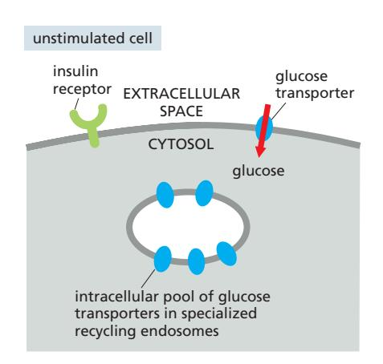

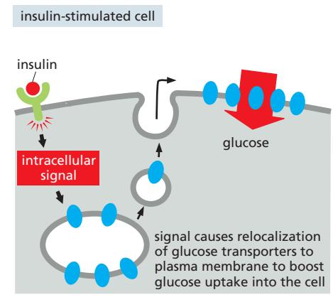

Figure 13–56 Possible fates for transmembrane receptor proteins that have been endocytosed. Three pathways from the early endosomal compartment in an epithelial cell are shown. Retrieved receptors are returned (1) to the same plasma membrane domain from which they came (*recycling*) or (2) via a recycling endosome to a different domain of the plasma membrane (*transcytosis*). (3) Receptors that are not specifically retrieved from early or recycling endosomes follow the pathway from the endosomal compartment to lysosomes, where they are degraded (*degradation*). If the ligand that is endocytosed with its receptor stays bound to the receptor in the acidic environment of the endosome, it shares the same fate as the receptor; otherwise, it is delivered to lysosomes. Recycling endosomes are a way station on the transcytotic pathway. In the transcytosis example shown here, an antibody Fc receptor on a gut epithelial cell binds antibody and is endocytosed, eventually carrying the antibody to the basolateral plasma membrane. The receptor is called an Fc receptor because it binds the Fc part of the antibody (discussed in Chapter 24).

Figure 13–57 Storage of plasma membrane proteins in recycling endosomes. Recycling endosomes can serve as an intracellular storage site for specialized plasma membrane proteins that can be mobilized when needed. In the example shown, insulin binding to the insulin receptor triggers an intracellular signaling pathway that causes the rapid insertion of glucose transporters into the plasma membrane of a fat or muscle cell, greatly increasing its glucose intake.

*epidermal growth factor* (*EGF*), follow this route. EGF is a small, extracellular signal protein that stimulates epidermal and various other cells to divide. Unlike LDL receptors, EGF receptors accumulate in clathrin-coated pits only after binding their ligand, and most do not recycle but are degraded in lysosomes, along with the ingested EGF. EGF binding therefore first activates intracellular signaling pathways and then leads to a decrease in the concentration of EGF receptors on the cell surface, a process called *receptor down-regulation*, that reduces the cell's subsequent sensitivity to EGF (see Figure 15–21).

Receptor down-regulation is highly regulated. The activated receptors are first covalently modified on the cytosolic face with the small protein ubiquitin. Unlike *polyubiquitylation*, which adds a chain of ubiquitins that typically targets a protein for degradation in proteasomes (discussed in Chapter 6), ubiquitin tagging for sorting into the clathrin-dependent endocytic pathway adds just one or a few single ubiquitin molecules to the protein—a process called *monoubiquitylation*  or *multiubiquitylation*, respectively. Ubiquitin-binding proteins recognize the attached ubiquitin and help direct the modified receptors into clathrin-coated pits. The ubiquitylated receptor does not get recycled back to the plasma membrane from the early endosome. Instead, it remains there as the endosome matures. During the maturation process, which we discuss next, the ubiquitin tag is used to selectively sort the receptor and its bound ligand into intralumenal vesicles. Receptor signaling is terminated when the receptor is sequestered into intralumenal vesicles, which ultimately are degraded in lysosomes. In this way, addition of ubiquitin blocks receptor recycling to the plasma membrane and directs the receptors into the degradation pathway.

### Early Endosomes Mature into Late Endosomes

Early endosomes are mainly derived from incoming endocytic vesicles that fuse with one another (**Movie 13.8**). Typically, an **early endosome** receives incoming vesicles for about 10 minutes before beginning its maturation into a **late endosome**. Early endosomes have tubular and vacuolar domains (see Figure 13–55). Most of the membrane surface is in the tubules, and most of the volume is in the vacuolar domain.

Many changes occur during the maturation process. (1) The endosome changes shape and location as the tubular domains are mostly recycled back to the plasma membrane, the vacuolar domains are thoroughly modified, and the endosome is moved by motors along microtubules toward the nucleus. (2) Rab proteins drive changes in phosphoinositide lipids and fusion machinery (SNAREs and tethers) on the cytosolic face of the endosome membrane to change the functional characteristics of the organelle. (3) Lysosome proteins, including lumenal hydrolases and a membrane-embedded V-type ATPase, are delivered from the TGN to the maturing endosome. (4) The V-type ATPase pumps H+ from the cytosol into the endosome lumen and further acidifies the organelle. Crucially, the increasing acidity that accompanies maturation renders lysosomal hydrolases increasingly more active, influencing many receptor–ligand interactions, thereby controlling receptor loading and unloading. (5) Intralumenal vesicles sequester endocytosed signaling receptors inside the endosome, thus halting the receptor signaling activity. Most of these events occur gradually but eventually lead to a complete transformation of the endosome into an early endolysosome.

In addition to committing selected cargo for degradation, the maturation process is important for lysosome maintenance. The continual delivery of lysosome components from the TGN to maturing endosomes ensures a steady supply of new lysosome proteins. The endocytosed materials mix in early endosomes with newly arrived acid hydrolases. Although mild digestion may start here, many hydrolases are synthesized and delivered as proenzymes, called *zymogens*, which contain extra inhibitory domains that keep the hydrolases inactive until these domains are proteolytically removed at later stages of **endosome maturation**. Moreover, the pH in early endosomes is not low enough to activate lysosomal

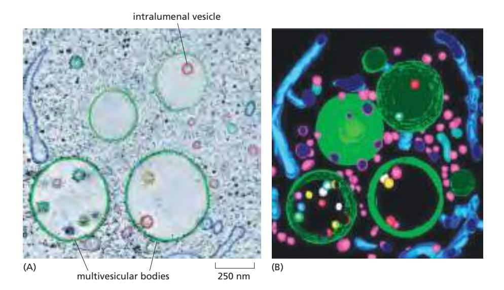

Figure 13–58 Cryo-electron microscopy (cryo-EM) tomogram of multivesicular bodies in cultured human lymphocytes. The tracing of membranes in single sections (A) allowed reconstruction of the three-dimensional arrangement of the organelles (B). The enclosing membranes of the multivesicular bodies are traced in *green*. (From J.L.A.N. Murk et al., *Proc. Natl. Acad. Sci. USA* 100:13332–13337, 2003.)

hydrolases optimally. By these means, cells can retrieve membrane proteins intact from early endosomes and recycle them back to the plasma membrane.

# ESCRT Protein Complexes Mediate the Formation of Intralumenal Vesicles in Multivesicular Bodies

As endosomes mature, patches of their membrane invaginate into the endosome lumen and pinch off to form intralumenal vesicles. Because of their appearance in the electron microscope, such maturing endosomes are also called **multivesicular bodies** (**Figure 13–58**).

The multivesicular bodies carry endocytosed membrane proteins that are to be degraded. As part of the protein-sorting process, receptors destined for degradation, such as the occupied EGF receptors described previously, selectively partition into the invaginating membrane of the multivesicular bodies. In this way, both the receptors and any signaling proteins strongly bound to them are sequestered away from the cytosol where they might otherwise continue signaling. They also are made fully accessible to the digestive enzymes that eventually will degrade them (**Figure 13–59**). In addition to endocytosed membrane proteins, multivesicular bodies include the soluble content of early endosomes destined for late endosomes and digestion in lysosomes.

As discussed earlier, sorting into intralumenal vesicles requires one or multiple ubiquitin tags, which are added to the cytosolic domains of membrane proteins. These tags initially help guide the proteins into clathrin-coated vesicles in the plasma membrane. Once delivered to the endosomal membrane, the ubiquitin tags are recognized again, this time by a series of cytosolic **ESCRT protein complexes** (*ESCRT-0, -I, -II,* and *-III*), which bind sequentially and ultimately mediate

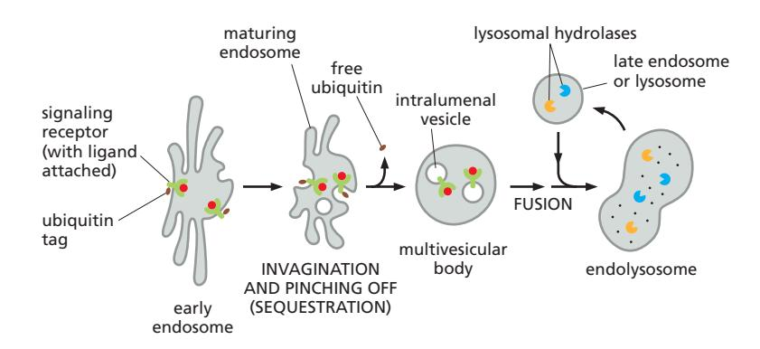

Figure 13–59 The sequestration of endocytosed proteins into intralumenal vesicles of multivesicular bodies.

Ubiquitylated membrane proteins are sorted into domains on the endosome membrane, which invaginate and pinch off to form intralumenal vesicles. The ubiquitin marker is removed and returned to the cytosol for reuse before the intralumenal vesicle closes. Eventually, lysosomal hydrolases (such as proteases and lipases) in lysosomes digest all of the internal membranes. The invagination processes are essential for complete digestion of endocytosed membrane proteins. Because the outer membrane of the multivesicular body becomes continuous with the lysosomal membrane, the hydrolases only digest the cytosolic domains of endocytosed transmembrane proteins when the protein becomes localized in intralumenal vesicles.

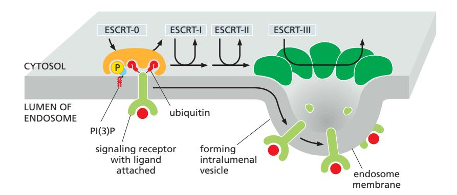

the sorting process into the intralumenal vesicles. Membrane invagination into multivesicular bodies also depends on a lipid kinase that phosphorylates phosphatidylinositol to produce PI(3)P, which serves as an additional docking site for the ESCRT complexes. For docking and vesicle invagination, ESCRT complexes require both PI(3)P and the presence of ubiquitylated cargo proteins to bind to the endosomal membrane. ESCRT-III forms large multimeric assemblies on the membrane that bend the membrane (**Figure 13–60**). MBoC7 m13.56/13.60

Mutant cells compromised in ESCRT function display signaling defects. In such cells, activated receptors cannot be down-regulated by endocytosis and packaging into multivesicular bodies. The still-active receptors therefore mediate prolonged signaling, which can lead to uncontrolled cell proliferation and cancer.

The ESCRT machinery that drives the internal budding from the endosome membrane to form intralumenal vesicles is also used in animal-cell cytokinesis and virus budding, which are topologically equivalent. In all three processes, budding occurs in a direction away from the cytosolic surface of the membrane (**Figure 13–61A**). ESCRT complexes are thought to have originated from similar components that mediate cell-membrane deformation during cytokinesis in archaea.

Although some viruses such as HIV hijack the host ESCRT machinery to bud directly out of the cell, other viruses escape using different mechanisms. For example, SARS-CoV-2, the virus that causes COVID-19, buds into the vesicular tubular clusters between the ER and Golgi apparatus, then uses the secretory pathway to exit the cell (**Figure 13–61B**). This budding reaction deforms membranes away

Figure 13–60 Sorting of endocytosed membrane proteins into the intralumenal vesicles of a multivesicular body. A series of complex binding events passes ubiquitylated membrane proteins, such as the signaling receptor with its ligand shown here, sequentially from one ESCRT complex (ESCRT-0) to the next, eventually concentrating them in membrane areas that bud into the lumen of the endosome to form intralumenal vesicles. ESCRT-III assembles into expansive multimeric structures and mediates invagination. The mechanisms of how cargo molecules are shepherded into the vesicles and how the vesicles are formed without including the ESCRT complexes themselves remain unknown. ESCRT complexes are soluble in the cytosol, are recruited to the membrane sequentially as needed, and are then released back into the cytosol as the vesicle pinches off.

Figure 13–61 Conserved mechanism in multivesicular body formation, virus budding, and cytokinesis. (A) In the three topologically equivalent processes indicated by the arrows, ESCRT complexes *(green)* shape membranes into buds that bulge away from the cytosol. (B) Electron micrographs of a cultured cell infected with SARS-CoV-2. The top panel shows virus particles budding away from the cytosol into vesicular tubular clusters between the ER and the Golgi apparatus. The virus particles are carried through the secretory pathway until they are released to the outside of the cell by exocytosis (bottom panel). (B, from N.S. Ogando et al., *J. Gen. Virol*. 101:925–940, 2020.)

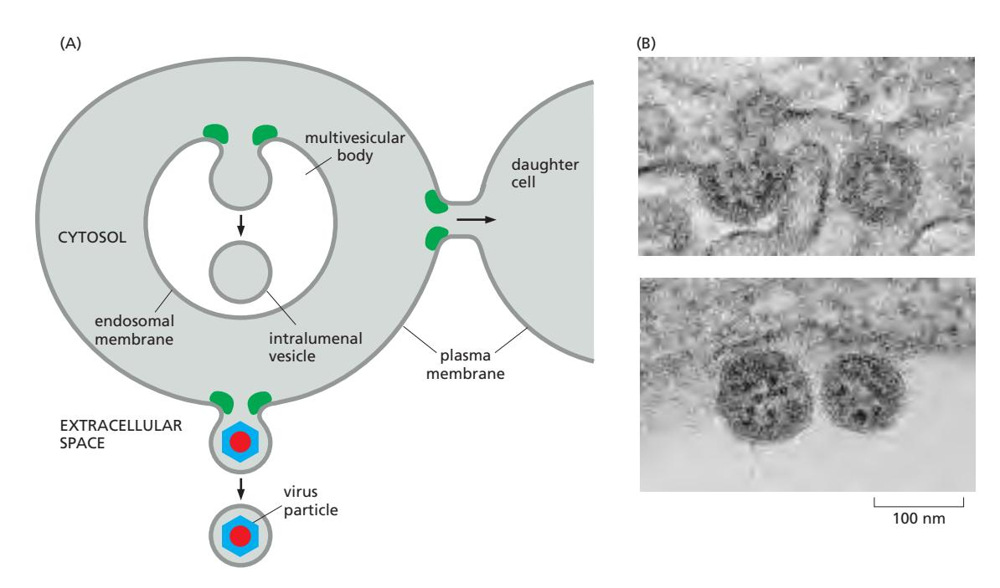

from the cytosol but does not seem to use ESCRT machinery. Instead, viral proteins are thought to facilitate budding by a mechanism that is not well understood.

#### Summary

*Cells ingest fluid, molecules, and particles by endocytosis, in which localized regions of the plasma membrane invaginate and pinch off to form endocytic vesicles. In most cells, endocytosis internalizes a large fraction of the plasma membrane every hour. The cells remain the same size because most of the plasma membrane components (proteins and lipids) that are endocytosed are continually returned to the cell surface by exocytosis. This large-scale endocytic–exocytic cycle is mediated largely by clathrin-coated pits and vesicles, but clathrin-independent endocytic pathways also contribute.*

*While many of the endocytosed molecules are quickly recycled to the plasma membrane, others eventually end up in lysosomes, where they are degraded. Most of the ligands that are endocytosed with their receptors dissociate from their receptors in the acidic environment of the endosome and eventually end up in lysosomes, while most of the receptors are recycled via transport vesicles back to the cell surface for reuse. Many cell-surface signaling receptors become tagged with ubiquitin when activated by binding their extracellular ligands. Ubiquitylation guides activated receptors into clathrin-coated pits, and they and their ligands are efficiently internalized and delivered to early endosomes.*

*Early endosomes rapidly mature into late endosomes. During maturation, patches of the endosomal membrane containing ubiquitylated receptors invaginate and pinch off to form intralumenal vesicles. This process is mediated by ESCRT complexes and sequesters the receptors away from the cytosol, which terminates their signaling activity. Late endosomes migrate along microtubules toward the interior of the cell where they fuse with one another and with lysosomes to form endolysosomes, where degradation occurs.*

*In some cases, both receptor and ligand are transferred to a different plasma membrane domain, causing the ligand to be released at a different surface from where it originated, a process called transcytosis. In some cells, endocytosed plasma membrane proteins and lipids can be stored in recycling endosomes for as long as necessary until they are needed.*

# THE DEGRADATION AND RECYCLING OF MACROMOLECULES IN LYSOSOMES

Having discussed how molecules are trafficked forward through the secretory pathway and how material enters the cell through the endocytic pathway, we now consider lysosomes. The lysosome is a terminal destination for the degradation of proteins, microorganisms, dead cells, and other materials ingested by endocytosis and phagocytosis. In addition, proteins, old organelles, and other components in the cytosol can also be degraded in lysosomes through a process termed autophagy. In this section, we begin with a brief account of lysosome structure and function, then discuss how material for degradation is delivered to lysosomes.

#### Lysosomes Are the Principal Sites of Intracellular Digestion

**Lysosomes** are membrane-enclosed organelles filled with soluble hydrolytic enzymes that digest macromolecules. Lysosomes contain about 40 types of hydrolytic enzymes, including proteases, nucleases, glycosidases, lipases, phospholipases, phosphatases, and sulfatases. All are **acid hydrolases**; that is, hydrolases that work best at acidic pH. For optimal activity, they need to be activated by proteolytic cleavage, which also requires an acid environment. The lysosome provides this acidity, maintaining an interior pH of about 4.5–5.0. By this arrangement, the contents of the cytosol are doubly protected against attack by the cell's own digestive system: the membrane of the lysosome keeps the

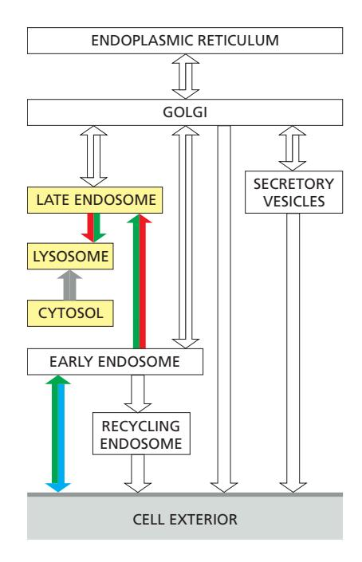

digestive enzymes out of the cytosol, but, even if they leak out, they can do little damage at the cytosolic pH of about 7.2.

Like all other membrane-enclosed organelles, the lysosome not only contains a unique collection of enzymes but also has a unique surrounding membrane. Most of the lysosome membrane proteins, for example, are highly glycosylated, which helps to protect them from the lysosome proteases in the lumen. Transport proteins in the lysosome membrane carry the final products of the digestion of macromolecules—such as amino acids, sugars, and nucleotides—to the cytosol, where the cell can either reuse or excrete them.

A *vacuolar H1 ATPase* in the lysosome membrane uses the energy of ATP hydrolysis to pump H+ into the lysosome, thereby maintaining the lumen at its acidic pH (**Figure 13–62**). The lysosome H+ pump belongs to the family of *V-type ATPases* and has a similar architecture to the mitochondrial and chloroplast ATP synthases (F-type ATPases), which convert the energy stored in H+ gradients into ATP (see Figure 11–12). By contrast to these enzymes, however, the vacuolar H+ ATPase exclusively works in reverse, pumping H+ into the organelle. Similar or identical V-type ATPases acidify all endocytic and exocytic organelles, including lysosomes, endosomes, some compartments of the Golgi apparatus, and many transport and secretory vesicles. In addition to providing a low-pH environment that is suitable for reactions occurring in the organelle lumen, the H+ gradient provides a source of energy that drives the transport of small metabolites across the organelle membrane.

#### Lysosomes Are Heterogeneous

Lysosomes are found in all eukaryotic cells. They were initially discovered by the biochemical fractionation of cell extracts; only later were they seen clearly in the electron microscope. Although extraordinarily diverse in shape and size, staining them with specific antibodies shows they are members of a single family of organelles. They can also be identified by histochemical techniques that reveal which organelles contain acid hydrolase (**Figure 13–63**).

The heterogeneous morphology of lysosomes contrasts with the relatively uniform structures of many other cell organelles. The diversity reflects the wide variety of digestive functions that acid hydrolases mediate, including the breakdown of intracellular and extracellular debris, the destruction of phagocytosed microorganisms, and the production of nutrients for the cell. Their morphological diversity, however, also reflects the way lysosomes form. Late endosomes containing material received from the plasma membrane by endocytosis and containing newly synthesized lysosomal hydrolases fuse with preexisting lysosomes to form structures that are referred to as *endolysosomes*, which then fuse with one another (**Figure 13–64**). When the majority of the endocytosed material within an endolysosome has been digested so that only resistant or slowly digestible residues remain, these organelles become "classical" lysosomes. These are relatively dense, round, and small, but they can enter the cycle again by fusing with late endosomes or endolysosomes. Thus, there is no real distinction between endolysosomes and lysosomes: they are the same except that they are in different stages of a maturation cycle. For this reason, lysosomes are sometimes viewed as a heterogeneous collection of distinct organelles, the common feature of which is a high content of hydrolytic enzymes. It is especially hard to apply a narrower definition than this in plant cells, as we discuss next.

Figure 13–63 Histochemical visualization of lysosomes. These electron micrographs show two sections of a cell stained to reveal the location of acid phosphatase, a marker enzyme for lysosomes. The larger membrane-enclosed organelles, containing dense precipitates of lead phosphate, are lysosomes. Their diverse morphology reflects variations in the amount and nature of the material they are digesting. The precipitates are produced when tissue fixed with glutaraldehyde (to fix the enzyme in place) is incubated with a phosphatase substrate in the presence of lead ions. *Red arrows* in the top panel indicate two small vesicles thought to be carrying acid hydrolases from the Golgi apparatus. (Courtesy of Daniel S. Friend, and by permission of E.L. Bearer.)

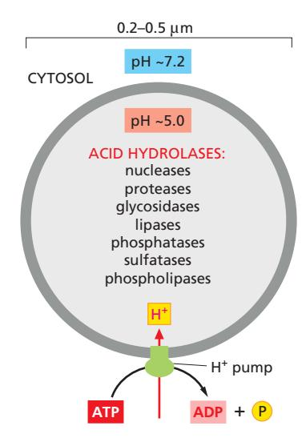

Figure 13–62 Lysosomes. The acid hydrolases are hydrolytic enzymes that are active under acidic conditions. An H+ ATPase in the membrane pumps H+ into the lysosome, maintaining its lumen at an acidic pH.

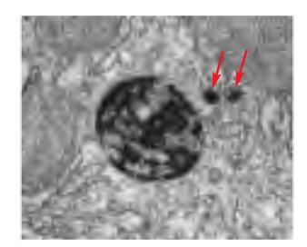

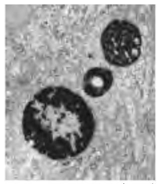

200 nm

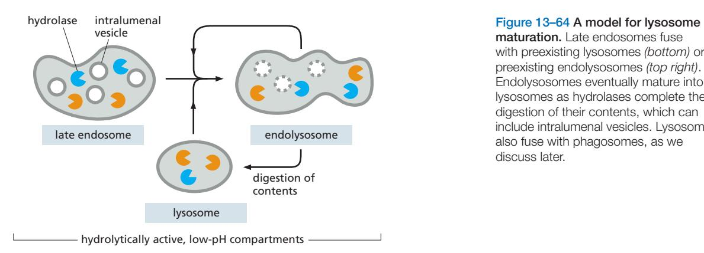

#### maturation. Late endosomes fuse with preexisting lysosomes *(bottom)* or preexisting endolysosomes *(top right)*. Endolysosomes eventually mature into lysosomes as hydrolases complete the digestion of their contents, which can include intralumenal vesicles. Lysosomes also fuse with phagosomes, as we discuss later.

### Plant and Fungal Vacuoles Are Remarkably Versatile Lysosomes

Most plant and fungal cells (including yeasts) contain one or several very large, fluid-filled vesicles called **vacuoles**. They typically occupy more than 30% of the cell volume and as much as 90% in some cell types (**Figure 13–65**). Vacuoles are related to animal-cell lysosomes and contain a variety of hydrolytic enzymes, but their functions are remarkably diverse. The plant vacuole can act as a storage organelle for both nutrients and waste products, as a degradative compartment, as an economical way of increasing cell size, and as a controller of *turgor pressure* (the osmotic pressure that pushes outward on the cell wall and keeps the plant from wilting) (**Figure 13–66**). The same cell may have different vacuoles with distinct functions, such as digestion and storage. MBoC7 m13.39/13.64

The vacuole is important as a homeostatic device, enabling plant cells to withstand wide variations in their environment. When the pH in the environment drops, for example, the flux of H+ into the cytosol is balanced, at least in part, by an increased transport of H+ into the vacuole, which tends to keep the pH in the cytosol constant. Similarly, many plant cells maintain an almost constant turgor pressure despite large changes in the tonicity of the fluid in their immediate environment. They do so by changing the osmotic pressure of the cytosol and vacuole—in part by the controlled breakdown and resynthesis of polymers such as polyphosphate in the vacuole, and in part by altering the transport rates of sugars, amino acids, and other metabolites across the plasma membrane and the vacuolar membrane. The turgor pressure regulates the activities of distinct transporters in each membrane to control these fluxes.

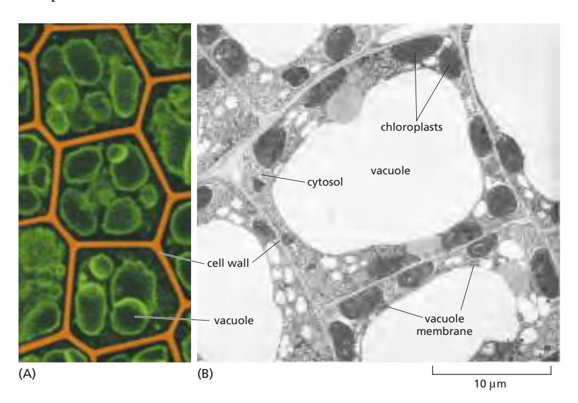

Figure 13–65 The plant-cell vacuole. (A) A confocal image of cells from an *Arabidopsis* embryo that is expressing an aquaporin—YFP (yellow fluorescent protein) fusion protein in its vacuole membrane. YFP fluorescence and the cell walls have been false colored *green* and *orange*, respectively. Each cell contains several large vacuoles. (B) This electron micrograph of cells in a young tobacco leaf shows the cytosol as a thin layer, containing chloroplasts, pressed against the cell wall by the enormous vacuole. (A, courtesy of C. Carroll and L. Frigerio, based on S. Gattolin et al., *Mol. Plant* 4:180–189, 2011; B, courtesy of J. Burgess.)

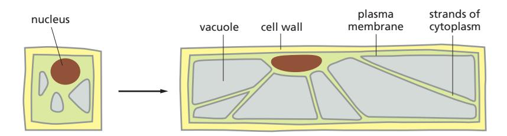

Humans often harvest substances stored in plant vacuoles—from rubber to opium to the flavoring of garlic. Many stored products have a metabolic function. Proteins, for example, can be preserved for years in the vacuoles of the storage cells of many seeds, such as those of peas and beans. When the seeds germinate, these proteins are hydrolyzed, and the resulting amino acids provide a food supply for the developing embryo. Anthocyanin pigments stored in vacuoles color the petals of many flowers so as to attract pollinating insects, while noxious molecules released from vacuoles when a plant is eaten or damaged provide a defense against predators. MBoC7 m13.41/13.66

#### Multiple Pathways Deliver Materials to Lysosomes

Lysosomes are meeting places where several streams of intracellular traffic converge. A route that leads outward from the ER via the Golgi apparatus delivers most of the lysosome's digestive enzymes, as we discussed earlier. In addition, at least three paths from the cell surface and extracellular space feed substances into lysosomes for digestion, while a fourth route called *autophagy* originates in the cytoplasm and is used to digest intracellular macromolecules and organelles.

We have already discussed how macromolecules taken up from plasma membrane and extracellular fluid by endocytosis can reside in endosomes until they mature and fuse with lysosomes. A second pathway called *macropinocytosis* specializes in the nonspecific uptake of fluids, membrane, and particles attached to the plasma membrane. A third pathway found in phagocytic cells, such as macrophages and neutrophils in vertebrates, is dedicated to the engulfment, or *phagocytosis*, of large particles and microorganisms to form *phagosomes*. In contrast to these routes originating from the plasma membrane, autophagy is used to digest cytosol, worn-out organelles, and microbes that invade the cytosol. The four paths to degradation in lysosomes are illustrated in **Figure 13–67**.

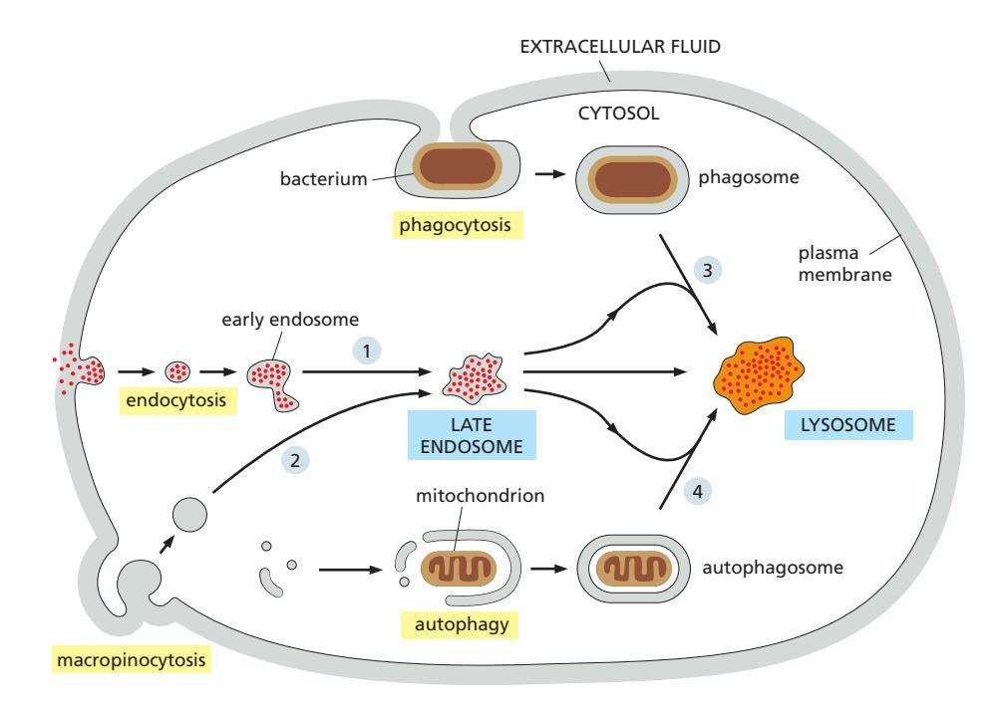

membrane Figure 13–66 The role of the vacuole in controlling the size of plant cells. A plant cell can achieve a large increase in volume without increasing the volume of the cytosol. Localized weakening of the cell wall orients a turgor-driven cell enlargement that accompanies the uptake of water into an expanding vacuole. The cytosol is eventually confined to a thin peripheral layer, which is connected to the nuclear region by strands of cytosol stabilized by bundles of actin filaments (not shown).

Figure 13–67 Four pathways to degradation in lysosomes. Materials in each pathway are derived from a different source. Note that the autophagosome has a double membrane, as we explain later in this chapter. In all cases, the final step is the fusion with lysosomes.

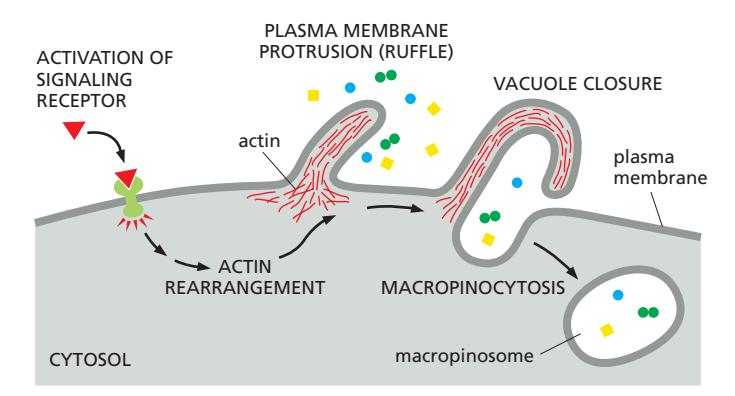

Figure 13–68 Schematic representation of macropinocytosis. Cell signaling events lead to a reprogramming of actin dynamics, which in turn triggers the formation of cellsurface ruffles. As the ruffles collapse back onto the cell surface, they nonspecifically trap extracellular fluid and macromolecules and particles contained in it, forming large vacuoles, or macropinosomes, as shown.

As we have seen, the endocytic pathway not only routes macromolecules for degradation but is also used to regulate the location and trafficking of macromolecules. By contrast, phagocytosis, macropinocytosis, and autophagy are pathways dedicated to degradation. We consider each of the latter three pathways in turn, highlighting the materials each one is responsible for degrading and the mechanisms used to deliver these materials to lysosomes. MBoC7 m13.50/13.68

# Cells Can Acquire Nutrients from the Extracellular Fluid by Macropinocytosis

Macropinocytosis was among the first types of endocytosis to be described because it is visible by light microscopy, where cells can be seen taking up the surrounding fluid into large vesicles called *macropinosomes* (**Figure 13–68**). In most cell types, macropinocytosis does not operate continually but rather is induced for a limited time in response to cell-surface receptor activation by specific cargoes, including growth factors, integrin ligands, apoptotic-cell remnants, and some viruses. These ligands activate a complex signaling pathway, resulting in a change in actin dynamics and the formation of cell-surface protrusions, called *ruffles* (discussed in Chapter 16). Macropinosomes form when the protruding ends of ruffles fuse with each other or the cell membrane, thereby trapping a portion of extracellular content.

Macropinocytosis is a dedicated degradative pathway: macropinosomes acidify and then fuse with late endosomes or endolysosomes, without recycling their cargo back to the plasma membrane. Micropinocytosis is stimulated by activation of the oncogene *Ras*. Induction of macropinocytosis can increase the bulk fluid uptake of a cell by up to tenfold. Cancer cells that contain constitutively active Ras (see Chapter 15) use enhanced micropinocytosis to obtain increased nutrients from the surrounding environment in order to support their rapid growth and division.

#### Specialized Phagocytic Cells Can Ingest Large Particles

**Phagocytosis** is a special form of endocytosis in which a cell uses large endocytic vesicles called **phagosomes** to ingest large particles such as microorganisms and dead cells. Phagocytosis is distinct, both in purpose and mechanism, from macropinocytosis, which we discussed earlier. In protozoa, phagocytosis is a form of feeding: large particles taken up into phagosomes end up in lysosomes, and the products of the subsequent digestive processes pass into the cytosol to be used as food. However, few cells in multicellular organisms are able to ingest such large particles efficiently. In the gut of animals, for example, extracellular processes break down food particles, and cells import the small products of hydrolysis.

Phagocytosis is important in most animals for purposes other than nutrition, and it is carried out mainly by specialized cells—so-called *professional* 

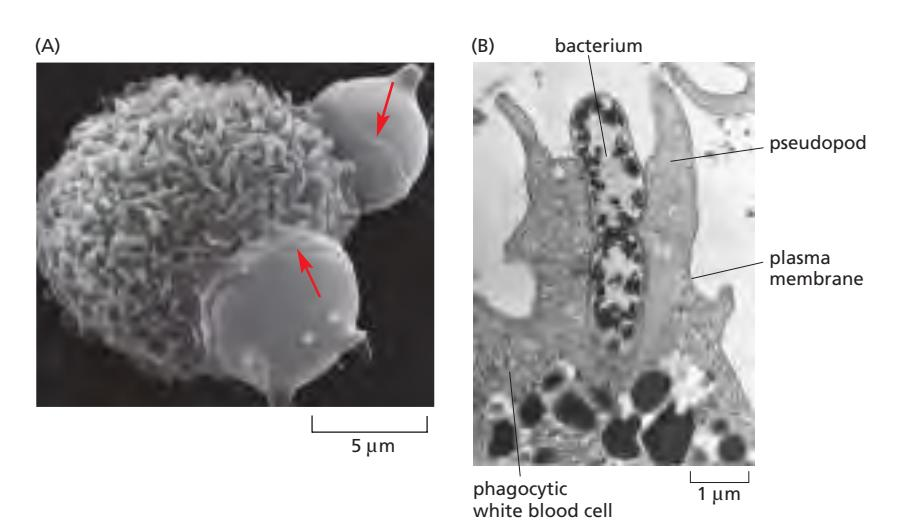

Figure 13–69 Phagocytosis by a macrophage. (A) Scanning electron micrograph of a mouse macrophage phagocytosing two chemically altered red blood cells. The *red arrows* point to edges of thin processes (pseudopods) of the macrophage that are extending as collars to engulf the red cells. (B) An electron micrograph of a neutrophil phagocytosing a bacterium, which is in the process of dividing. (A, courtesy of Jean Paul Revel; B, courtesy of Dorothy F. Bainton, Phagocytic Mechanisms in Health and Disease. New York: Intercontinental Medical Book Corporation, 1971.)

*phagocytes.* In mammals, two important classes of white blood cells that act as professional phagocytes are **macrophages** and **neutrophils** (**Movie 13.9**). These cells develop from hemopoietic stem cells (discussed in Chapter 22), and they ingest invading microorganisms to defend us against infection. Macrophages also have an important role in scavenging senescent cells and cells that have died by apoptosis (discussed in Chapter 18). In quantitative terms, the clearance of senescent and dead cells is by far the most important: our macrophages, for example, phagocytose more than 1011 senescent red blood cells in each of us every day. MBoC6 m13.60,m13.61A/13.69

The diameter of a phagosome is determined by the size of its ingested particles, and those particles can be almost as large as the phagocytic cell itself (**Figure 13–69**). Phagosomes fuse with lysosomes, and the ingested material is then degraded. Indigestible substances remain in the lysosomes, forming *residual bodies* that can be excreted from cells by exocytosis Some of the internalized plasma membrane components never reach the lysosome, because they are retrieved from the phagosome in transport vesicles and returned to the plasma membrane.

Some pathogenic bacteria have evolved elaborate mechanisms to prevent phagosome–lysosome fusion. The bacterium *Legionella pneumophila*, for example, which causes Legionnaires' disease (discussed in Chapter 23), injects into its unfortunate host a Rab-modifying enzyme that causes certain Rab proteins to misdirect membrane traffic, thereby preventing phagosome–lysosome fusion. The bacterium, thus spared from lysosomal degradation, remains in the modified phagosome, growing and dividing as an intracellular pathogen, protected from the host's adaptive immune system.

# Cargo Recognition by Cell-surface Receptors Initiates Phagocytosis

Phagocytosis is a cargo-triggered process. That is, it requires the activation of cell-surface receptors that transmit signals to the cell interior. Thus, to be phagocytosed, particles must first bind to the surface of the phagocyte (although not all particles that bind are ingested). Phagocytes have a variety of cell-surface receptors that are functionally linked to the phagocytic machinery of the cell. The best-characterized triggers of phagocytosis are antibodies, which protect us by binding to the surface of infectious microorganisms (pathogens) and initiating a series of events that culminate in the invader being phagocytosed. When antibodies initially attack a pathogen, they coat it with antibody molecules that bind to *Fc receptors* on the surface of macrophages and neutrophils, activating the receptors to induce the phagocytic cell to extend pseudopods, which engulf

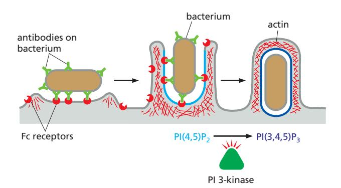

the particle and fuse at their tips to form a phagosome (**Figure 13–70**). Localized actin polymerization, initiated by Rho family GTPases and their activating Rho GEFs (discussed in Chapters 15 and 16), shapes the pseudopods. The activated Rho GTPases switch on the kinase activity of local PI kinases to produce PI(4,5)P2 in the membrane (see Figure 13–11), which stimulates actin polymerization. To seal off the phagosome and complete the engulfment, actin is depolymerized by a PI 3-kinase that converts the PI(4,5)P2 to PI(3,4,5)P3, which is required for closure of the phagosome and may also contribute to reshaping the actin network to help drive the invagination of the forming phagosome (Figure 13–70). In this way, the ordered generation and consumption of specific phosphoinositides guides sequential steps in phagosome formation. MBoC7 m13.61B/13.70

Several other classes of receptors that promote phagocytosis have been characterized. Some recognize *complement* components, which collaborate with antibodies in targeting microbes for destruction (discussed in Chapter 24). Others directly recognize oligosaccharides on the surface of certain pathogens. Still others recognize cells that have died by apoptosis. Apoptotic cells lose the asymmetric distribution of phospholipids in their plasma membrane. As a consequence, negatively charged phosphatidylserine, which is normally confined to the cytosolic leaflet of the lipid bilayer, is now exposed on the outside of the cell, where it helps to trigger the phagocytosis of the dead cell.

Remarkably, macrophages will also phagocytose a variety of inanimate particles—such as glass or latex beads and asbestos fibers—yet they do not phagocytose live cells in their own body. The living cells display "don't-eat-me" signals in the form of cell-surface proteins that bind to inhibitory receptors on the surface of macrophages. The inhibitory receptors recruit tyrosine phosphatases that antagonize the intracellular signaling events required to initiate phagocytosis, thereby locally inhibiting the phagocytic process. Thus phagocytosis, like many other cell processes, depends on a balance between positive signals that activate the process and negative signals that inhibit it. Apoptotic cells are thought both to gain "eat-me" signals (such as extracellularly exposed phosphatidylserine) and to lose their "don't-eat-me" signals, causing them to be very rapidly phagocytosed by macrophages.

#### Autophagy Degrades Unwanted Proteins and Organelles

All eukaryotic cells can carry out a process called **autophagy**, or "self-eating." During autophagy, a portion of the cytoplasm is engulfed into a membrane structure called the **autophagosome** that subsequently fuses with the lysosome where the autophagosome's contents are degraded (**Figure 13–71**). Autophagy can be either nonselective or selective. In *nonselective autophagy*, a bulk portion of cytoplasm is sequestered in autophagosomes. In *selective autophagy*, autophagosomes tightly enclose specific cargo and mostly exclude the surrounding cytosol.

Autophagy serves several important roles in the cell. During normal cell growth and in development, autophagy helps restructure differentiating cells by removing unwanted organelles or other cellular contents. When cells experience stress or starvation, nonselective autophagy is used to recycle existing

Figure 13–70 Membrane interactions and dynamics during phagocytosis. A bacterium in the body is recognized by antibodies that coat its surface. The Fc receptor on the surface of phagocytic cells recognizes the antibody, recruiting the bacterium to the plasma membrane. This initiates phagocytosis by triggering the formation of pseudopods that begin to surround the bacterium. Pseudopod extension and phagosome formation are driven by actin polymerization and reorganization, which respond to the accumulation of specific phosphoinositides in the membrane of the forming phagosome: PI(4,5)P2 stimulates actin polymerization, which promotes pseudopod formation, and then PI(3,4,5)P3 depolymerizes actin filaments at the base.

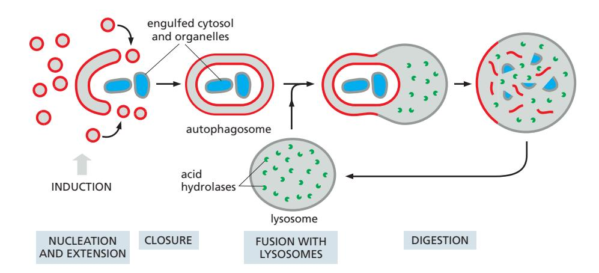

Figure 13–71 A model of autophagy. Activation of a signaling pathway initiates a nucleation event in the cytoplasm. A crescent of autophagosomal membrane grows by fusion of vesicles of unknown origin and eventually fuses to form a double-membrane-enclosed autophagosome, which sequesters a portion of the cytoplasm. The autophagosome then fuses with lysosomes containing acid hydrolases that digest its content.

proteins and macromolecules into building blocks that are used for other priorities. Selective autophagy can be used to degrade bacteria and viruses that invade the cytosol, as well as damaged proteins, protein aggregates, and damaged whole organelles. The range of cargoes degraded by autophagy explains why dysregulated autophagy contributes to diseases ranging from infectious disorders to neurodegeneration and cancer.

The autophagosome assembles by the fusion of small vesicles of unknown origin. The process begins when a phosphoinositide lipid kinase complex (termed the ATG1 complex) locally produces PI(3)P (see Figure 13–10) to mark a potential membrane site for the recruitment of several autophagy-related factors. These factors catalyze the covalent attachment of the membrane lipid phosphatidylethanolamine to a ubiquitin-like protein called ATG8. The ATG8-marked vesicles undergo homotypic fusion with each other and heterotypic fusion with vesicles containing ATG9. This results in expansion of a membrane whose identity is provided by ATG8 and other autophagy-related proteins. MBoC7 m13.43/13.71

For reasons that are not known, the growing membrane structure formed by vesicle fusion is not spherical. Instead, it is a flattened disc (similar to a Golgi apparatus cisterna) that curls into a cup-shaped structure. Fusion of the lips of this cup encloses the contents inside a compartment that is now surrounded by two membranes. The outer membrane of this newly formed autophagosome then fuses with the lysosome in a SNARE-mediated process. The inner membrane and its enclosed cargo are released into the lysosome where they are degraded by the acid hydrolases.

# The Rate of Nonselective Autophagy Is Regulated by Nutrient Availability

The activity of the ATG1 kinase complex that initiates autophagosome formation is tightly regulated. Most of the time, it is kept inactive because of phosphorylation by another protein kinase called the mTOR complex 1 (discussed in Chapter 15). The activity of mTOR complex 1 is dependent on the availability of certain amino acids generated by the recycling of proteins in the lysosome. When these amino acids become limiting, mTOR complex 1 activity is reduced, relieving its inhibition of the ATG1 complex. Activation of the ATG1 complex initiates nonselective autophagy to degrade bulk cytosol in lysosomes, thereby generating amino acids that activate the mTOR complex 1. Through this feedback loop, the rate of nonselective autophagy is dynamically regulated by the nutrient status of the cell.

Starvation-induced nonselective autophagy is particularly important in mammals in the hours immediately after birth. During this transition period, the constant nutrient supply from the womb is abruptly lost, and feeding by mouth has not yet started. Rapid acquisition of amino acids via autophagy is used to sustain critical cellular functions until a steady source of food from the mother is established. In mammals, the rate of autophagy is controlled by several other signaling pathways in addition to the mTOR complex 1. This regulation allows the cell to integrate multiple external and internal cues, such as growth factor signaling and ATP levels, into a decision about the rate of recycling of macromolecules in the cytosol.

# A Family of Cargo-specific Receptors Mediates Selective Autophagy

Selective autophagy mediates the degradation of invading microbes, damaged or otherwise unwanted organelles, and protein complexes or aggregates that are too large for degradation by the proteasome. The steps of autophagosome formation and its fusion with lysosomes are the same as in nonselective autophagy. Selective autophagy differs only at the very early stages when the cargo destined for degradation is recruited to the concave surface of the forming autophagosome membrane. This recruitment is mediated by specialized receptor proteins that recognize the cargo and have a binding site for the autophagosome-specific protein ATG8.

To accommodate the large range of potential cargoes, cells have evolved numerous cargo-specific autophagy receptors. In most cases, autophagy receptors recognize their cargo via a mark that is acquired only when the cargo is destined for degradation. The most commonly used mark is ubiquitin. For example, bacteria that escape from phagosomes and invade the cytosol are recognized by cytosolic proteins that ubiquitylate proteins on the bacterial surface. Several cargo receptors recognize the ubiquitin and other bacteria-specific proteins and recruit ATG8-containing vesicles. These vesicles fuse together, and the forming autophagosome effectively zippers around the cargo to engulf it without trapping bulk cytosol in the process (**Figure 13–72A**). This is why the shape of an autophagosome during selective autophagy typically reflects the shape of its cargo (**Figure 13–72B**).

The selective autophagy of worn out or damaged mitochondria is called *mitophagy*. As discussed in Chapters 12 and 14, when mitochondria function normally, the inner mitochondrial membrane is energized by an electrochemical H+ gradient that drives ATP synthesis and the import of mitochondrial precursor proteins and metabolites. Damaged mitochondria cannot maintain the gradient, so protein import is blocked. As a consequence, a protein kinase called Pink1, which is normally imported into mitochondria, is instead retained on the mitochondrial surface where it recruits the ubiquitin ligase Parkin from the cytosol. Parkin ubiquitylates mitochondrial outer membrane proteins, which serves as a mark for a ubiquitin-dependent cargo receptor for autophagy. Mutations in Pink1 or Parkin cause a form of early-onset Parkinson's disease, a degenerative disorder of the central nervous system. It is not known why the neurons that die prematurely in this disease are particularly reliant on mitophagy.

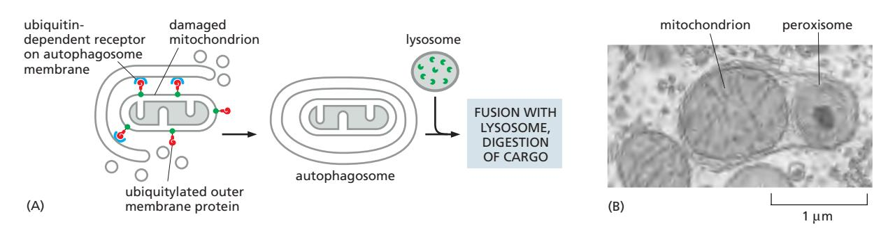

Figure 13–72 Selective autophagy is mediated by receptors that recruit cargo to the autophagosome membrane. (A) Diagram illustrating the concept of a cargo receptor *(blue)* in the autophagosome membrane that directs it to a specific cargo, in this case a damaged mitochondrion. (B) An electron micrograph of an autophagosome containing a mitochondrion and a peroxisome. (B, courtesy of Daniel S. Friend and by permission of E.L. Bearer.)

# Some Lysosomes and Multivesicular Bodies Undergo Exocytosis

Targeting of material to lysosomes is not necessarily the end of the pathway. *Lysosomal secretion* of undigested content enables cells to eliminate indigestible debris. For most cells, this seems to be a minor pathway, used only when the cells are stressed. Some cell types, however, contain specialized lysosomes that have acquired the necessary machinery for fusion with the plasma membrane. *Melanocytes* in the skin, for example, produce and store pigments in their lysosomes. These pigment-containing *melanosomes* release their pigment into the extracellular space of the epidermis by exocytosis. The melanosomes are then taken up by keratinocytes, leading to normal skin pigmentation. In some genetic disorders, defects in melanosome exocytosis block this transfer process, leading to forms of hypopigmentation (albinism). Under certain conditions, multivesicular bodies can also fuse with the plasma membrane. If that occurs, their intralumenal vesicles are released from cells. Circulating small vesicles, also called *exosomes*, have been observed in the blood and may be used to transport components between cells, although the importance of such a mechanism of potential communication between distant cells is unknown. Some exosomes may derive from direct vesicle budding events at the plasma membrane similar to how some viruses bud and are released from the cell (see Figure 13–61).

### Summary

*Lysosomes are specialized for the intracellular digestion of macromolecules. They contain unique membrane proteins and a wide variety of soluble hydrolytic enzymes that operate best at pH 5, which is the internal pH of lysosomes. An ATPdriven H1 pump in the lysosomal membrane maintains this low pH. In plants and fungi, lysosome-related compartments called vacuoles are adapted for other functions including storage, regulation of cell volume, and maintenance of turgor pressure. Lysosomes are the end product of endosome maturation. Cell-surface proteins that are endocytosed into endosomes are degraded in lysosomes unless they are retrieved back to the plasma membrane. Extracellular contents internalized by micropinocytosis are also delivered via endosomes to lysosomes and provide a source of nutrients under some conditions.* 

*Lysosomes can receive content from two other routes. In phagocytosis, cells can engulf large particles including bacteria and even other cells into phagosomes that fuse with lysosomes. Phagocytosis is usually a receptor-mediated process and is especially prominent in some specialized cell types such as macrophages. In autophagy, cells engulf parts of their own cytoplasm into a double-membrane structure called an autophagosome. The autophagosome can engulf random parts of cytosol nonselectively or specific cargoes identified by selective receptors. Nonselective autophagy is used to recycle macromolecules into their building blocks during nutrient starvation. Selective autophagy is used to destroy invading microbes, protein aggregates, and damaged or unwanted organelles.* 

# PROBLEMS

#### Which statements are true? Explain why or why not.

- 13–1 In all events involving fusion of a vesicle to a target membrane, the cytosolic leaflets of the vesicle and target bilayers always fuse together, as do the leaflets that are not in contact with the cytosol.
- 13–2 In order for a protein to exit from the ER, it must be correctly folded and, if part of a multiprotein complex, properly assembled.
- 13–3 When a foreign gene encoding a secretory protein is introduced into a secretory cell that normally does not make the protein, the alien secretory protein is not packaged into secretory vesicles.
- 13–4 More than 25 different receptors, including the low-density lipoprotein (LDL) receptor, participate in receptor-mediated endocytosis. In all cases, they enter coated pits only after they have bound their specific ligands.
- 13–5 Lysosomal membranes contain a proton pump that utilizes the energy of ATP hydrolysis to pump protons out of the lysosome, thereby maintaining the lumen at a low pH.

#### Discuss the following problems.

- 13–6 In a nondividing cell such as a liver cell, why must the flow of membrane between compartments be balanced, so that the retrieval pathways match the outward flow? Would you expect the same balanced flow in a gut epithelial cell, which is actively dividing?
- 13–7 For fusion of a vesicle with its target membrane to occur, the membranes have to be brought to within 1.5 nm so that the two bilayers can join (**Figure Q13–1**). Assuming that the relevant portions of the two membranes at the fusion site are circular regions 1.5 nm in diameter, calculate the number of water molecules that would remain between the membranes. (Water is 55.5 M and the volume of a cylinder is π*r*2*h*.) Given that an average phospholipid occupies a membrane surface area of 0.2 nm2, how many phospholipids would be present in each of the opposing monolayers at the fusion site? Are there sufficient water molecules to bind to the hydrophilic head groups of this number of phospholipids? (It is estimated that 10–12 water molecules are normally associated with each phospholipid head group at the exposed surface of a membrane.)

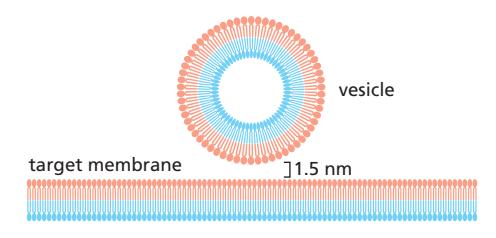

Figure Q13–1 Close approach of a vesicle and its target membrane in

13–8 SNAREs exist as complementary partners that carry out membrane fusions between appropriate vesicles and their target membranes. In this way, a vesicle with a particular variety of v-SNARE will fuse only with a membrane that carries the complementary t-SNARE. In some instances, however, fusions of identical membranes (homotypic fusions) are known to occur. For example, when a yeast cell forms a bud, vesicles derived from the mother cell's vacuole move into the bud where they fuse with one another to form a new vacuole. These vesicles carry both v-SNAREs and t-SNAREs. Are both types of SNAREs essential for this homotypic fusion event?

To test this point, you have developed an ingenious assay for fusion of vacuolar vesicles. You prepare vesicles from two different mutant strains of yeast: strain B has a defective gene for vacuolar alkaline phosphatase (Pase); strain A is defective for the protease that converts the precursor of alkaline phosphatase (pro-Pase) into its active form (Pase) (**Figure Q13–2A**). Neither strain has

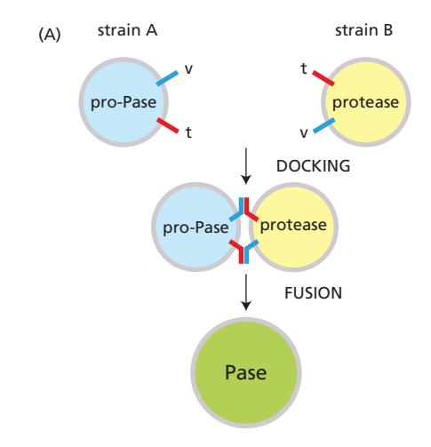

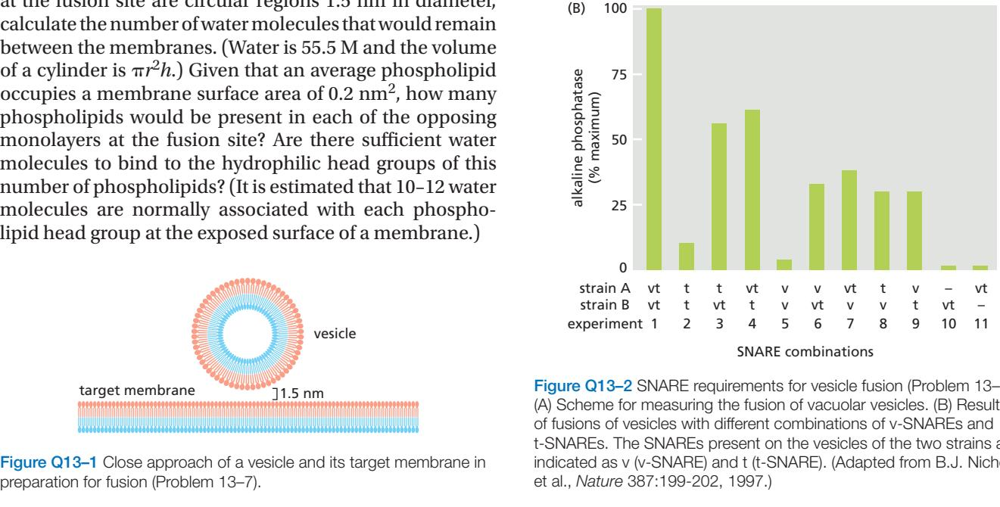

Figure Q13–2 SNARE requirements for vesicle fusion (Problem 13–8). (A) Scheme for measuring the fusion of vacuolar vesicles. (B) Results of fusions of vesicles with different combinations of v-SNAREs and t-SNAREs. The SNAREs present on the vesicles of the two strains are indicated as v (v-SNARE) and t (t-SNARE). (Adapted from B.J. Nichols et al., *Nature* 387:199-202, 1997.)

808 Chapter 13: Intracellular Membrane Traffic PROBLEMS 809

active alkaline phosphatase, but when extracts of the strains are mixed, vesicle fusion generates active alkaline phosphatase, which can be easily measured.

Now you delete the genes for the vacuolar v-SNARE, t-SNARE, or both, in each of the two yeast strains. You prepare vacuolar vesicles from each and test them for their ability to fuse, as measured by the alkaline phosphatase assay (**Figure Q13–2B**).

What do these data say about the requirements for v-SNAREs and t-SNAREs in the fusion of vacuolar vesicles? Does it matter which kind of SNARE is on which vesicle?

13–9 Enveloped viruses, which have a membrane coat, gain access to the cytosol by fusing with a cell membrane. Why do you suppose that these viruses carry their own special fusion protein, rather than making use of a cell's SNAREs?

13–10 If you were to remove the ER retrieval signal from protein disulfide isomerase (PDI), which is normally a soluble resident of the ER lumen, where would you expect the modified PDI to be located?

13–11 The KDEL receptor must shuttle back and forth between the ER and the Golgi apparatus to accomplish its task of ensuring that soluble ER proteins are retained in the ER lumen. In which compartment does the KDEL receptor bind its ligands more tightly? In which compartment does it bind its ligands more weakly? What is thought to be the basis for its different binding affinities in the two compartments? If you were designing the system, in which compartment would you have the highest concentration of KDEL receptor? Would you predict that the KDEL receptor, which is a transmembrane protein, would itself possess an ER retrieval signal?

13–12 *Drosophila shibire* mutants, which carry a temperature-sensitive mutation in the dynamin gene, are rapidly paralyzed when the temperature is elevated. They recover quickly once the temperature is lowered. The complete paralysis at the elevated temperature suggests that synaptic transmission between nerve and muscle cells is blocked. Electron micrographs of nerve terminals from the paralyzed flies showed a loss of synaptic vesicles and a tremendously increased number of coated pits relative to normal synapses (**Figure Q13–3**). What step in

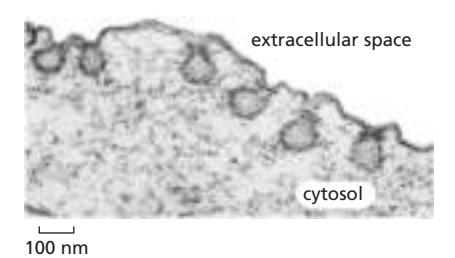

Figure Q13–3 Electron micrograph of a nerve terminal from a *shibire* mutant fly at elevated temperature (Problem 13–12). (From J.H. Koenig and K. Ikeda, *J. Neurosci*. 9:3844–3860, 1989. With permission from the Society of Neuroscience.)

synaptic transmission is defective in *shibire* mutants at high temperature?

13–13 A macrophage ingests the equivalent of 100% of its plasma membrane each half hour by endocytosis. What is the rate at which membrane is returned by exocytosis?

13–14 The recycling of transferrin receptors has been studied by covalently attaching radioactive iodine (125I) to the receptors on the cell surface at 0°C and then following their fate at 0°C and 37°C. If the labeled cells were kept at 0°C and treated with trypsin to digest the receptors on the cell surface, all the labeled transferrin receptors were completely degraded. If the cells were first warmed to 37°C for 1 hour, then cooled back to 0°C and treated with trypsin, about 70% of the labeled receptors were resistant to trypsin. Why did the transferrin receptors respond differently to trypsin digestion depending on whether they were kept at 0°C or first warmed to 37°C before they were returned to 0°C?

13–15 How does the low pH of lysosomes protect the rest of the cell from lysosomal enzymes in case the lysosome breaks?

13–16 Melanosomes are specialized lysosomes that store pigments for eventual release by exocytosis. Various cells such as skin and hair cells then take up the pigment, which accounts for their characteristic pigmentation. Mouse mutants that have defective melanosomes often have pale or unusual coat colors. One such light-colored mouse, the *Mocha* mouse (**Figure Q13–4**), has a defect in the gene for one of the subunits of the adaptor protein complex AP3, which is associated with coated vesicles budding from the *trans* Golgi network. How might the loss of AP3 cause a defect in melanosomes?

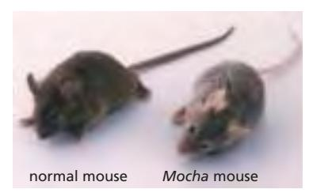

Figure Q13–4 A normal mouse and the *Mocha* mouse (Problem 13–16). In addition to its light coat color, the *Mocha* mouse has a poor sense of balance. (Courtesy of Margit Burmeister.)

# REFERENCES

#### General

- Harrison SC & Kirchhausen T (2010) Structural biology: conservation in vesicle coats. *Nature* 466, 1048–1049.
- Hernandez-Gonzalez M, Larocque G & Way M (2021) Viral use and subversion of membrane organization and trafficking. *J. Cell Sci.*  134(5), jcs252676.
- Pfeffer SR (2013) A prize for membrane magic. *Cell* 155, 1203–1206.
- Thor F, Gautschi M, Geiger R & Helenius A (2009) Bulk flow revisited: transport of a soluble protein in the secretory pathway. *Traffic* 10, 1819–1830.

#### Mechanisms of Membrane Transport and Compartment Identity

- Antonny B (2011) Mechanisms of membrane curvature sensing. *Annu. Rev. Biochem.* 80, 101–123.
- Burd C & Cullen PJ (2014) Retromer: a master conductor of endosome sorting. *Cold Spring Harb. Perspect. Biol.* 6(2), a016774.
- Faini M, Beck R, Weiland FT & Briggs JAG (2013) Vesicle coats: structure, function, and general principles of assembly. *Trends Cell Biol*. 23(6), 279-288.
- Ferguson SM & De Camilli P (2012) Dynamin, a membrane-remodelling GTPase. *Nat. Rev. Mol. Cell Biol.* 13, 75–88.
- Frost A, Unger VM & De Camilli P (2009) The BAR domain superfamily: membrane-molding macromolecules. *Cell* 137, 191–196.
- Grosshans BL, Ortiz D & Novick P (2006) Rabs and their effectors: achieving specificity in membrane traffic. *Proc. Natl. Acad. Sci. USA* 103, 11821–11827.
- Jackson LP, Kelly BT, McCoy AJ . . . Owen DJ (2010) A large-scale conformational change couples membrane recruitment to cargo binding in the AP2 clathrin adaptor complex. *Cell* 141, 1220–1229.
- Jahn R & Scheller RH (2006) SNAREs—engines for membrane fusion. *Nat. Rev. Mol. Cell Biol.* 7, 631–643.
- Jean S & Kiger AA (2012) Coordination between RAB GTPase and phosphoinositide regulation and functions. *Nat. Rev. Mol. Cell Biol.* 13, 463–470.
- Jin L, Pahuja KB, Wickliffe KE . . . Rape M (2012) Ubiquitin-dependent regulation of COPII coat size and function. *Nature* 482, 495–500.
- Martens S & McMahon HT (2008) Mechanisms of membrane fusion: disparate players and common principles. *Nat. Rev. Mol. Cell Biol.* 9, 543–556.
- McNew JA, Parlati F, Fukuda R . . . Rothman JE (2000) Compartmental specificity of cellular membrane fusion encoded in SNARE proteins. *Nature* 407, 153–159.
- Miller EA & Schekman R (2013) COPII—a flexible vesicle formation system. *Curr. Opin. Cell Biol.* 25, 420–427.
- Müller MP & Goody RS (2018) Molecular control of Rab activity by GEFs, GAPs and GDI. *Small GTPases* 9(1–2), 5–21.
- Pfeffer SR (2013) Rab GTPase regulation of membrane identity. *Curr. Opin. Cell Biol.* 25, 414–419.
- Saito K, Chen M, Bard F . . . Malhotra V (2009) TANGO1 facilitates cargo loading at endoplasmic reticulum exit sites. *Cell* 136, 891–902.

#### Transport from the Endoplasmic Reticulum Through the Golgi Apparatus

- Ellgaard L & Helenius A (2003) Quality control in the endoplasmic reticulum. *Nat. Rev. Mol. Cell Biol.* 4, 181–191.
- Emr S, Glick BS, Linstedt AD . . . Wieland FT (2009) Journeys through the Golgi—taking stock in a new era. *J. Cell Biol.* 187, 449–453.
- Farquhar MG & Palade GE (1998) The Golgi apparatus: 100 years of progress and controversy. *Trends Cell Biol.* 8, 2–10.
- Gillingham AK & Munro S (2016) Finding the Golgi: golgin coiled-coil proteins show the way. *Trends Cell Biol.* 26(6), 399–408.
- Ladinsky MS, Mastronarde DN, McIntosh JR . . . Staehelin LA (1999) Golgi structure in three dimensions: functional insights from the normal rat kidney cell. *J. Cell Biol.* 144, 1135–1149.
- Pfeffer S (2010) How the Golgi works: a cisternal progenitor model. *Proc. Natl. Acad. Sci. USA* 107, 19614–19618.

Varki A (2011) Evolutionary forces shaping the Golgi glycosylation machinery: why cell surface glycans are universal to living cells. *Cold Spring Harb. Perspect. Biol.* 3, a005462.

#### Transport From the *Trans* Golgi Network to the Cell Exterior and Endosomes

- Burgess TL & Kelly RB (1987) Constitutive and regulated secretion of proteins. *Annu. Rev. Cell Biol.* 3, 243–293.
- Martin TF (1997) Stages of regulated exocytosis. *Trends Cell Biol.* 7, 271–276. Mellman I & Nelson WJ (2008) Coordinated protein sorting, targeting and distribution in polarized cells. *Nat. Rev. Mol. Cell Biol.* 9, 833–845.
- Mostov K, Su T & ter Beest M (2003) Polarized epithelial membrane traffic: conservation and plasticity. *Nat. Cell Biol.* 5, 287–293.
- Pang ZP & Südhof TC (2010) Cell biology of Ca2+-triggered exocytosis. *Curr. Opin. Cell Biol.* 22, 496–505.
- Rizo J & Xu J (2015) The synaptic vesicle release machinery. *Annu. Rev. Biophys.* 44, 339–367.
- Schuck S & Simons K (2004) Polarized sorting in epithelial cells: raft clustering and the biogenesis of the apical membrane. *J. Cell Sci.* 117, 5955–5964.

#### Transport Into the Cell from the Plasma Membrane: Endocytosis

- Bonifacino JS & Traub LM (2003) Signals for sorting of transmembrane proteins to endosomes and lysosomes. *Annu. Rev. Biochem.* 72, 395–447.
- Brown MS & Goldstein JL (1986) A receptor-mediated pathway for cholesterol homeostasis. *Science* 232, 34–47.
- Conner SD & Schmid SL (2003) Regulated portals of entry into the cell. *Nature* 422, 37–44.
- Henne WM, Stenmark H & Emr SD (2013) Molecular mechanisms of the membrane sculpting ESCRT pathway. *Cold Spring Harb. Perspect. Biol.* 5(9), a016766.
- Howes MT, Mayor S & Parton RG (2010) Molecules, mechanisms, and cellular roles of clathrin-independent endocytosis. *Curr. Opin. Cell Biol.* 22, 519–527.
- Huotari J & Helenius A (2011) Endosome maturation. *EMBO J*. 30, 3481–3500.
- Kelly BT & Owen DJ (2011) Endocytic sorting of transmembrane protein cargo. *Curr. Opin. Cell Biol.* 23, 404–412.
- Maxfield FR & McGraw TE (2004) Endocytic recycling. *Nat. Rev. Mol. Cell Biol.* 5, 121–132.
- McMahon HT & Boucrot E (2011) Molecular mechanism and physiological functions of clathrin-mediated endocytosis. *Nat. Rev. Mol. Cell Biol.* 12, 517–533.
- Schöneberg J, Lee I-H, Iwasa JH & Hurley JH (2017) Reverse-topology membrane scission by the ESCRT proteins. *Nat. Rev. Mol. Cell Biol*. 18(1), 5–17.
- Sorkin A & von Zastrow M (2009) Endocytosis and signalling: intertwining molecular networks. *Nat. Rev. Mol. Cell Biol.* 10, 609–622.

#### The Degradation and Recycling of Macromolecules in Lysosomes

- Andrews NW (2000) Regulated secretion of conventional lysosomes. *Trends Cell Biol.* 10, 316–321.
- Bloomfield A & Kay RR (2016) Uses and abuses of micropinocytosis. *J. Cell Sci.* 129(14), 2697–2705.
- de Duve C (2005) The lysosome turns fifty. *Nat. Cell Biol.* 7, 847–849.
- Flannagan RS, Jaumouillé V & Grinstein S (2012) The cell biology of phagocytosis *Annu. Rev. Pathol.* 7, 61–98.
- Futerman AH & van Meer G (2004) The cell biology of lysosomal storage disorders. *Nat. Rev. Mol. Cell Biol.* 5, 554–565.
- Levine B & Kroemer G (2019) Biological functions of autophagy genes: a disease perspective. *Cell* 176(1–2), 11–42.
- Mizushima N, Yoshimori T & Ohsumi Y (2011) The role of Atg proteins in autophagosome formation. *Annu. Rev. Cell Dev. Biol.* 27, 107–132.