# Energy Conversion and Metabolic Compartmentation: Mitochondria and Chloroplasts

CHAPTER

14

To maintain their high degree of organization in a universe that is constantly drifting toward chaos, cells have a constant need for a plentiful supply of ATP, as explained in Chapter 2. In eukaryotic cells, most of the ATP that powers life processes is produced by specialized, membrane-enclosed, *energy-converting organelles*. These are of two types. **Mitochondria** burn food molecules to produce ATP by *oxidative phosphorylation*, and they are present in virtually all cells of animals, plants, and fungi. In contrast, **chloroplasts** harness solar energy to produce ATP by *photosynthesis*, and they occur only in plants and green algae. In electron micrographs, the most striking features of both mitochondria and chloroplasts are their extensive internal membrane systems. These internal membranes contain sets of membrane protein complexes that work together to harvest energy and then use that energy to catalyze the production of most of the cell's ATP.

Comparisons of DNA sequences suggest that the energy-converting organelles in present-day eukaryotes originated from prokaryotic cells that entered symbiotic relationships during the evolution of eukaryotes (discussed in Chapter 1). This would explain why mitochondria and chloroplasts contain their own DNA, which still encodes a subset of their proteins. Over time, the majority of the genes originally encoded in the prokaryotic genome appear to have been transferred to the nuclear genome. As a result, these organelles have become heavily dependent on those nuclear-encoded proteins being synthesized in the cytosol and then imported into the organelle. And eukaryotic cells rely on these organelles not only for the ATP they need for biosynthesis, solute transport, and movement, but also for many important biosynthetic reactions that occur inside each organelle.

The common evolutionary origin of the energy-converting machinery in mitochondria, chloroplasts, and prokaryotes (archaea and bacteria) is reflected in the fundamental mechanism that they share for harnessing energy. This mechanism is known as **chemiosmotic coupling**, signifying a link between the chemical bond–forming reactions that generate ATP ("chemi") and membrane transport processes ("osmotic"). The chemiosmotic process, which occurs in two linked stages, is performed by protein complexes embedded in the membrane that is colored in the bacterium, mitochondrion, and chloroplast shown in **Figure 14–1**.

*Stage 1*: High-energy electrons (derived from the oxidation of food molecules, from pigments excited by sunlight, or from other sources described later) are transferred along a series of electron-transport protein complexes that form an *electron-transport chain* embedded in a membrane. Each electron transfer releases a small amount of energy that is used to pump

#### IN THIS CHAPTER

The Mitochondrion

The Proton Pumps of the Electron-Transport Chain

ATP Production in Mitochondria

Chloroplasts and Photosynthesis

The Genetic Systems of Mitochondria and Chloroplasts

Figure 14–1 The membranes of bacteria, mitochondria, and chloroplasts that carry out chemiosmotic energyconversion processes. Mitochondria and chloroplasts are cell organelles that have originated from bacteria and have retained the bacterial energy-conversion mechanisms as well as other features of their ancestry. Like their bacterial ancestors, mitochondria and chloroplasts have an outer and an inner membrane. For each type of cell or organelle, it is the membrane that is colored in the figure that contains its energy-harvesting electron-transport chains. The deep invaginations of the mitochondrial inner membrane and the internal membrane system of the chloroplast harbor the machinery for cellular respiration and photosynthesis, respectively.

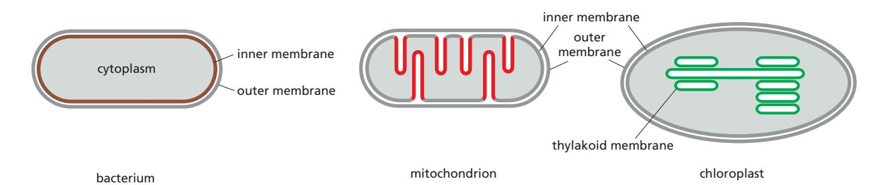

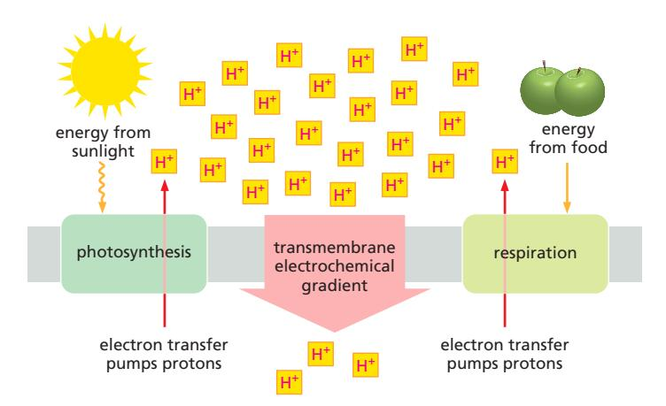

Figure 14–2 Stage 1 of chemiosmotic coupling. Energy from either sunlight or the oxidation of food compounds is captured by special, membrane-embedded protein complexes to generate an electrochemical proton gradient across a membrane. The electrochemical gradient serves as a versatile energy store that drives energyrequiring reactions in mitochondria, chloroplasts, and prokaryotes (bacteria and archaea).

protons (H+) and thereby generate a large *electrochemical gradient* across the membrane (**Figure 14–2**). As discussed in Chapter 11, such an electrochemical gradient provides a way of temporarily storing energy, and it can be harnessed to do useful work when ions flow back across the membrane. MBoC7 m14.02/14.02

*Stage 2*: The protons flow back down their electrochemical gradient through an elaborate membrane protein machine called *ATP synthase*, which uses this energy to catalyze the production of ATP from ADP and inorganic phosphate. This ubiquitous enzyme works like a turbine in the membrane, driven by a flow of protons, to synthesize ATP (**Figure 14–3**). In this way, the energy derived from either food or sunlight in stage 1 is converted into the chemical energy of a phosphate bond in ATP.

Electrons can move through protein complexes in biological systems via tightly bound metal ions or other carriers that take up and release electrons easily or by special small molecules that pick electrons up at one location and deliver them to another. For mitochondria, one critical electron carrier is NAD+, a water-soluble small molecule that takes up two electrons and one H+ derived from food molecules (fats and carbohydrates) to become NADH (see Figure 2–36). NADH transfers these electrons from food-derived molecules to the inner mitochondrial membrane. There, the electrons from the energy-rich NADH are passed from one membrane protein complex to the next, transitioning to a lower-energy state at each step, until they reach a final complex in which they combine with molecular oxygen (O2) plus protons to produce water. The energy released at each step as the electrons flow down this path from the energy-rich NADH to the low-energy water molecule drives H+ pumps that are embedded in three different protein complexes in the inner mitochondrial membrane. Together, these three complexes generate the proton gradient (or proton-motive force) that is harnessed by ATP synthase to produce ATP—the molecule that serves as the universal energy currency throughout the cell.

**Figure 14–4** compares the electron-transport processes in mitochondria, which harness energy from food molecules, with those in chloroplasts, which harness energy from sunlight. The energy-conversion systems of mitochondria and chloroplasts can be described in similar terms, and we shall see later in the chapter that two of their key components are closely related. One of these is the ATP synthase, and the other is a proton pump.

Among the crucial constituents that are unique to photosynthetic organisms are the two *photosystems*. These use the green pigment chlorophyll to capture light energy and power the transfer of electrons. The net result of the series of electron transfers in chloroplasts is opposite to the net result in mitochondria. In mitochondria, electrons derived from food are transferred to O2,with water and CO2 being the final products. But in photosynthesis, electrons are taken from water to produce O2, and these electrons are used to synthesize carbohydrates from CO2 and water. These carbohydrates then serve as the source for the other compounds a plant cell needs.

Thus, both mitochondria and chloroplasts make use of an electron-transfer chain to produce an H+ gradient that powers reactions that are critical for the cell.

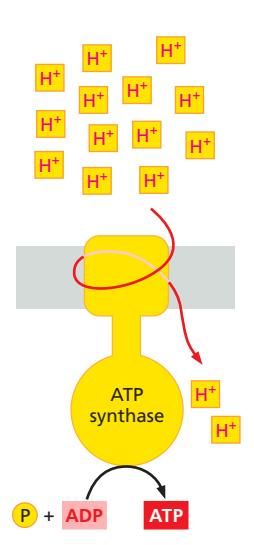

Figure 14–3 Stage 2 of chemiosmotic coupling. An ATP synthase protein machine *(yellow)* embedded in the lipid bilayer of a membrane harnesses the electrochemical proton gradient across the membrane, using this energy store to drive ATP synthesis. The *red arrow* shows the direction of proton movement through the ATP synthase. MBoC7 m14.03/14.03

812 Chapter 14: Energy Conversion and Metabolic Compartmentation: Mitochondria and Chloroplasts THE MITOCHONDRION 813

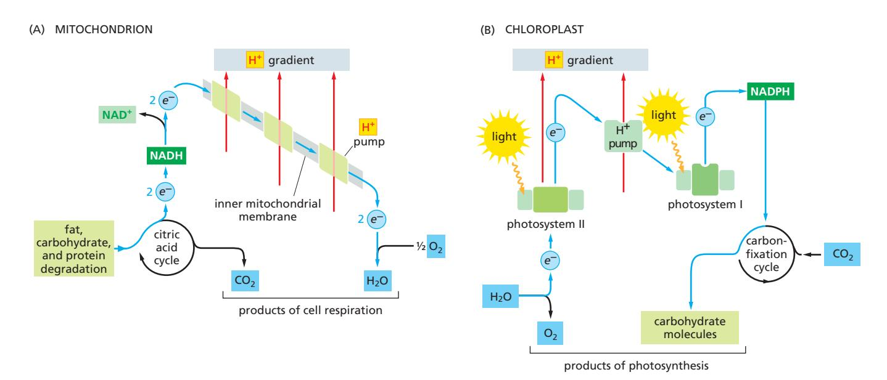

Figure 14–4 A comparison of two electron-conversion processes. The mitochondrion converts energy from chemical fuels, whereas the chloroplast converts energy from sunlight. In both cases, electron flow is indicated by *blue arrows*. As indicated, the electrons pass through a series of protein complexes embedded in a membrane. (A) In the mitochondrion, energy-rich molecules derived from fat, carbohydrate, or protein degradation are fed into the citric acid cycle. This cycle provides electrons to generate the energy-rich compound NADH from NAD+. The NADH electrons then flow down an energy gradient as they pass from one protein complex to the next in the mitochondrial electron-transport chain, until they combine with molecular O2 and H+ in the final complex to produce water. The energy released is harnessed by the three protein complexes to pump H+ across the membrane. (B) In the chloroplast, by contrast, light-derived energy is used to extract electrons from water in the photosystem II complex, and molecular O2 is released. The high-energy electrons produced by photosystem II are passed to the next protein complex in the chain, which uses some of the energy derived from electron transfer to pump protons across the membrane, before passing the electrons to photosystem I, where sunlight generates high-energy electrons that combine with NADP+ to produce NADPH (NADPH is a small molecule closely related to the NADH used in mitochondria). This NADPH then enters the *carbon-fixation cycle* along with CO2 to generate the carbohydrates that provide both the carbon and the energy required for cell processes. Note that the products in A are the inputs for B, while the products in B are inputs for A. MBoC7 m14.04/14.04

However, chloroplasts generate O2 and take up CO2, whereas mitochondria consume O2 and release CO2 (see Figure 14–4). Plants provide the food for animals, and the complementary chemistry that is performed by mitochondria and chloroplasts has been fundamental for producing a sustainable ecosystem on Earth—balancing O2 with CO2 and carbohydrate production with carbohydrate consumption.

# THE MITOCHONDRION

**Mitochondria** can occupy up to 20% of the cytoplasmic volume of a eukaryotic cell. Although they are often depicted as short, bacterium-like bodies with a diameter of 0.5–1 μm, they are in fact remarkably dynamic and plastic, moving about the cell, constantly changing shape, dividing, and fusing (**Movie 14.1**). Mitochondria are often associated with the cytoskeleton, which determines their distribution in different cell types. Thus, in highly polarized cells such as neurons, mitochondria can move long distances (up to a meter or more in the extended axons of neurons), being propelled along microtubule tracks from where they are formed in the cell body to sites of energy demand like synapses (**Movie 14.2**). In other cells, mitochondria remain fixed at points of high energy demand; for example, in skeletal or cardiac muscle cells, they pack between myofibrils, and in sperm cells they wrap tightly around the flagellum (**Figure 14–5**).

In addition to their directional movement along cytoskeletal filaments, mitochondria undergo highly dynamic interactions with other membrane systems in the cell, most notably the endoplasmic reticulum (ER). Contacts between mitochondria and ER define specialized domains thought to facilitate the exchange of lipids, calcium, and potentially other molecules between the two

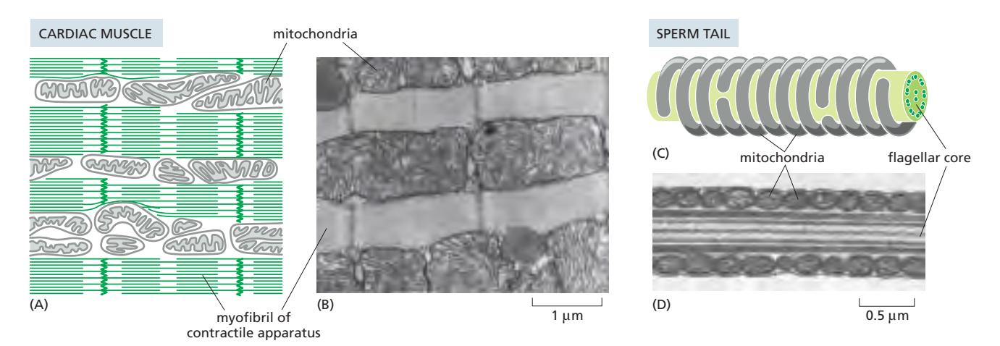

Figure 14–5 Localization of mitochondria near sites of high ATP demand. (A) In a cardiac muscle cell, mitochondria are located close to the contractile apparatus, where ATP hydrolysis provides the energy for contraction. The structure of the contractile apparatus is discussed in Chapter 16. (B) An electron micrograph of cardiac muscle shows a preponderance of mitochondria. (C) In a sperm, mitochondria are located in the tail, wrapped around a portion of the motile flagellum that requires ATP for its movement. The internal structure of the flagellar core is discussed in Chapter 16. (D) Micrograph showing a flagellum that has been thinly sliced to reveal the internal core structure as well as the surrounding mitochondria. (B, Keith Porter papers, Center for Biological Sciences Archives, University of Maryland, Baltimore County; D, from W. Bloom and D.W. Fawcett, A Textbook of Histology, 10th ed. Philadelphia, PA: W.B. Saunders Company, 1975. Reprinted with permission from the Estate of D.W. Fawcett.) MBoC7 e14.06/14.05

membrane systems. These regions of ER contact appear to be specialized domains that are also the sites of mitochondrial fission, which aids the distribution and partitioning of the mitochondria within cells, as we discuss later.

The acquisition of mitochondria was a prerequisite for the evolution of complex animals. Without mitochondria, present-day animal cells would have had to generate all of their ATP through glycolysis. When glycolysis converts glucose to pyruvate, it releases only a small fraction of the total free energy that is potentially available from glucose oxidation (see Chapter 2). In mitochondria, the metabolism of sugars is complete: pyruvate is imported into the mitochondrion and ultimately oxidized to CO2 and H2O, which allows 15 times more ATP to be made from a sugar than by glycolysis alone. As explained later, this energy source became available only after enough molecular oxygen had accumulated in Earth's atmosphere to allow organisms to take advantage, via respiration, of the energy potentially available from the complete oxidation of organic compounds.

# The Mitochondrion Has an Outer Membrane and an Inner Membrane

Like the bacteria from which they likely originated, mitochondria have an outer and an inner membrane. The two membranes have distinct functions and properties, and they delineate separate compartments within the organelle. The inner membrane, which surrounds the internal **mitochondrial matrix** compartment (**Figure 14–6**), is highly folded to form invaginations known as **cristae** (the singular is crista), which contain in their membranes the proteins of the electron-transport chain. Where the inner membrane runs parallel to the outer membrane, between the cristae, it is known as the *inner boundary membrane*. The narrow (20–30 nm) gap between the inner boundary membrane and the outer membrane is known as the **intermembrane space**. The cristae are about 20-nm-wide membrane discs or tubules that protrude deeply into the matrix and enclose the *crista space*. The *crista membrane* is continuous with the inner boundary membrane, and where their membranes join, the membrane forms narrow membrane tubes or slits, known as *crista junctions*.

Like the bacterial outer membrane, the **outer mitochondrial membrane** is freely permeable to ions and to small molecules as large as 5000 daltons. This is because it contains many porin molecules, a special class of β-barrel-type 814 Chapter 14: Energy Conversion and Metabolic Compartmentation: Mitochondria and Chloroplasts THE MITOCHONDRION 815

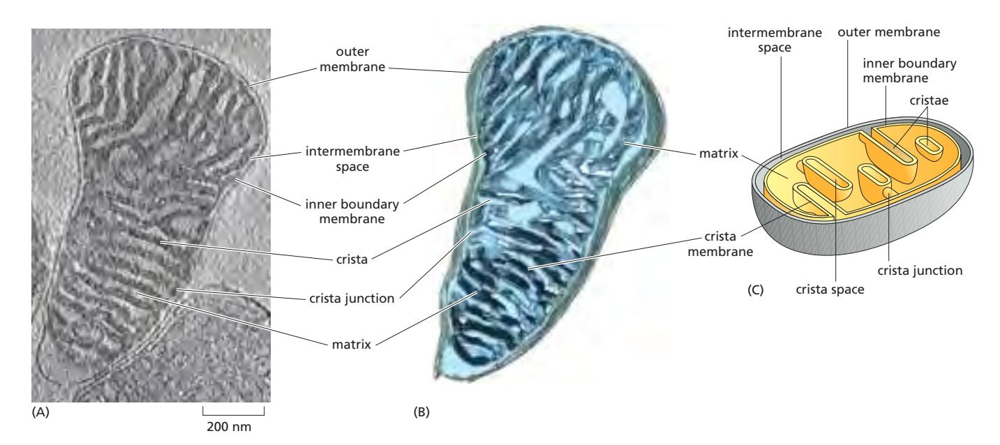

MBoC7 m14.08/14.06 Figure 14–6 Structure of a mitochondrion. (A) Tomographic slice through a three-dimensional map of a mouse heart mitochondrion determined by electron microscope tomography. The outer membrane envelops the inner boundary membrane. The inner membrane is highly folded into tubular or lamellar cristae, which crisscross the matrix. The dense matrix, which contains most of the mitochondrial protein, appears dark in the electron microscope, whereas the intermembrane space and the crista space appear light because of their lower protein content. The inner boundary membrane follows the outer membrane closely at a distance of ∼20 nm. The inner membrane turns sharply at the crista junctions, where the cristae join the inner boundary membrane. (B) Tomographic surface-rendered portion of a mouse heart mitochondrion, showing how flattened cristae project into the matrix from the inner membrane (Movie 14.3). (C) Schematic drawing of a mitochondrion showing the outer membrane *(gray)* and the inner membrane *(yellow)*. Note that the inner membrane is compartmentalized into the inner boundary membrane and the crista membrane. There are three distinct spaces: the intermembrane space, the crista space, and the matrix. (A and B, courtesy of Tobias Brandt.)

membrane protein that creates aqueous pores across the membrane (see Figure 10–21). As a consequence, the intermembrane space between the outer and inner membrane has a pH and ionic composition very similar to that of the cytoplasm, and there is no electrochemical gradient across the outer membrane.

#### Fission, Fusion, Distribution, and Degradation of Mitochondria

In mammalian cells, mitochondrial DNA makes up less than 1% of the total cellular DNA. In other cells, however, a larger fraction of the cellular DNA may be present in mitochondria or chloroplasts (**Table 14–1**), and a large fraction of the total RNA and protein synthesis takes place in the organelles.

| TABLE 14–1 Quantity of Organelles and Organelle DNA in Some Cells and Tissues |                     |                                |                        |                                                          |  |  |  |  |  |
|-------------------------------------------------------------------------------|---------------------|--------------------------------|------------------------|----------------------------------------------------------|--|--|--|--|--|
| Organism                                                                      | Tissue or cell type | DNA molecules per organelle | Organelles per cell | Organelle DNA as percentage of total cellular DNA (%) |  |  |  |  |  |
| Mitochondrial DNA                                                             |                     |                                |                        |                                                          |  |  |  |  |  |
| Rat                                                                           | Liver               | 5–10                           | 1000                   | 1                                                        |  |  |  |  |  |
| Yeast*                                                                        | Vegetative          | 2–50                           | 1–50                   | 15                                                       |  |  |  |  |  |
| Chloroplast DNA                                                               |                     |                                |                        |                                                          |  |  |  |  |  |
| Chlamydomonas                                                                 | Vegetative          | 80                             | 1                      | 7                                                        |  |  |  |  |  |
| Maize                                                                         | Leaves              | 0–300**                        | 20–40                  | 0–15**                                                   |  |  |  |  |  |

\*The large variation in the number and size of mitochondria per cell in yeasts is due to mitochondrial fusion and fission.

\*\*In maize, the amount of chloroplast DNA drops precipitously in mature leaves, after cell division ceases: the chloroplast DNA is degraded, and stable mRNAs persist to provide for protein synthesis.

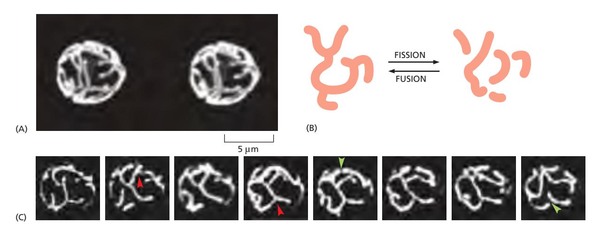

MBoC7 m14.62/14.07 Figure 14–7 The mitochondrial reticulum is dynamic. (A) In yeast cells, mitochondria form a continuous reticulum on the cytoplasmic side of the plasma membrane (stereo pair). (B) A balance between fission and fusion determines the arrangement of the mitochondria in different cells. (C) Time-lapse fluorescence microscopy shows the dynamic behavior of the mitochondrial network in a yeast cell. In addition to shape changes, fission *(green arrowheads)* and fusion *(red arrowheads)*  constantly remodel the network. These pictures were taken at 3-minute intervals. (A and C, from J. Nunnari et al., *Mol. Biol. Cell* 8:1233–1242, 1997. With permission from the American Society for Cell Biology.)

Mitochondria and chloroplasts are large enough to be visible by light microscopy in living cells. For example, mitochondria can be visualized by expressing in cells a genetically engineered fusion of a mitochondrial protein linked to green fluorescent protein (GFP), or cells can be incubated with a fluorescent dye that is specifically taken up by mitochondria because of their membrane potential. Such images demonstrate that the mitochondria in living cells are dynamic frequently dividing by fission, fusing, and changing shape (**Figure 14–7** and **Movie 14.4**). The fission of mitochondria may be necessary so that small parts of the network can pinch off and reach remote regions of the cell; for example, in the thin, extended axon and dendrites of a neuron, for them to be distributed to each of two daughters, or for them to be degraded by mitochondrial autophagy (see Chapter 13).

The fission and fusion of mitochondria are topologically complex processes that must ensure the integrity of the separate mitochondrial compartments defined by the inner and outer membranes. These processes control the number and shape of mitochondria, which can vary dramatically in different cell types, ranging from multiple spherical or wormlike organelles to a highly branched, net-shaped single organelle called a *reticulum*. Each process depends on its own special set of proteins. The mitochondrial fission machine works by assembling dynamin-related GTPases (discussed in Chapter 13) into helical oligomers that cause local constrictions in tubular mitochondria. GTP hydrolysis then generates the mechanical force that severs the inner and outer mitochondrial membranes in one step (**Figure 14–8**). Mitochondrial fusion requires two separate machineries, one each for the outer and the inner membrane (**Figure 14–9**).

Mitochondria that have become nonfunctional as assessed by loss of the proton electrochemical gradient typically become overly fragmented because of ongoing fission but loss of fusion. This state is typically coupled to the highly specific and organized degradation of such mitochondria through a

Figure 14–8 A model for mitochondrial division. Dynamin *(yellow)* exists as dimers in the cytosol, which form larger oligomeric structures in a process that requires GTP hydrolysis. At special sites of ER contact (not shown), dynamin assemblies interact with the outer mitochondrial membrane through special adaptor proteins, forming a spiral of GTP–dynamin around the mitochondrion that causes a constriction. A concerted GTP-hydrolysis event in the dynamin subunits is then thought to produce the conformational changes that result in fission. (Adapted from S. Hoppins et al., *Annu. Rev. Biochem*. 76:751–780, 2007. With permission from Annual Reviews.)

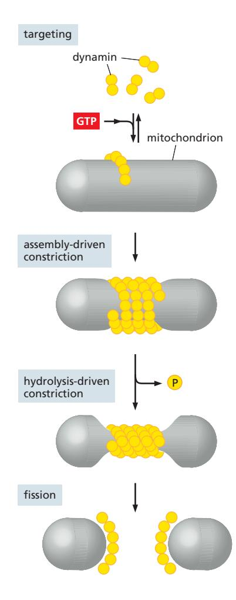

816 Chapter 14: Energy Conversion and Metabolic Compartmentation: Mitochondria and Chloroplasts THE MITOCHONDRION 817

specialized organelle-specific form of autophagy known as mitophagy (see p. 806 in Chapter 13). One mechanism that induces autophagy is based on the fact that mitochondrial protein import becomes inefficient upon loss of the electrochemical gradient, causing the Pink1 protein kinase, which is normally imported into mitochondria, to be retained on the mitochondrial outer membrane. Pink1 then phosphorylates both mitochondria-associated ubiquitin and the mitophagy regulator Parkin to initiate the formation of an autophagosome that engulfs the damaged mitochondrion. The Parkin protein is so-named because mutations in the gene encoding it (as well as the gene encoding Pink1) are associated with Parkinson's disease, which can be characterized by an accumulation of nonfunctional mitochondria.

### The Inner Membrane Cristae Contain the Machinery for Electron Transport and ATP Synthesis

Unlike the outer mitochondrial membrane, the **inner mitochondrial membrane** is a diffusion barrier to ions and small molecules, just like the inner membrane of a bacterium. However, selected ions, most notably protons and phosphate, as well as essential metabolites such as ATP, ADP, and pyruvate, can pass through it by means of specific transport proteins.

The inner mitochondrial membrane is highly differentiated into functionally distinct regions with different protein compositions. As discussed in Chapter 10, the lateral segregation of membrane regions with different protein and lipid compositions is a key feature of cells. The boundary membrane region of the inner mitochondrial membrane contains the machinery for protein import, for new membrane protein insertion, and for the assembly of the respiratory-chain complexes. The membranes of the cristae, despite being continuous with the boundary membrane, have a distinct composition. The crista membrane contains the ATP synthase enzyme that produces most of the cell's ATP: this large protein machine is also thought to structurally support the highly curved, crista membrane structure. The crista membrane also contains the large protein complexes of the **respiratory chain**—the name given to the mitochondrion's electron-transport chain. Cristae membranes have one of the highest protein densities of all biological membranes, with a lipid content of 25% and a protein content of 75% by weight.

At the cristae junctions, where the membranes of the cristae join the boundary membrane, specialized protein complexes provide a diffusion barrier that segregates the membrane proteins in the two regions of the inner membrane; these complexes are also thought to anchor the cristae to the outer membrane, thus maintaining the highly folded topology of the inner membrane. The folding of the inner membrane into cristae greatly increases the membrane area available for oxidative phosphorylation. In highly active cardiac muscle cells, for example, the total area of cristae membranes can be up to 20 times larger than the area of the cell's plasma membrane. In total, the surface area of cristae membranes in each human body adds up to roughly the size of a football field.

#### The Citric Acid Cycle in the Matrix Produces NADH

Together with the cristae that project into it, the matrix is the principal location for the majority of mitochondrial metabolic proteins. Mitochondria can use pyruvate, fatty acids, as well as other substrates as fuel. Pyruvate is derived from glucose and other sugars, whereas fatty acids are derived from fats. Unlike pyruvate and fatty acids, amino acids derived from protein degradation and the ketone bodies that can be produced from fatty acids are typically minor mitochondrial fuels, but they become very important substrates under specific situations such as prolonged fasting. All of these fuel molecules are transported across the inner mitochondrial membrane by specialized transport proteins, and they are then converted to the crucial metabolic intermediate *acetyl CoA* by enzymes located in the mitochondrial matrix (see Chapter 2).

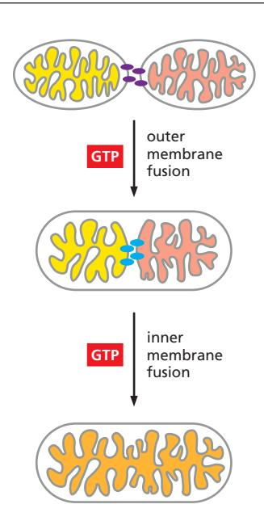

Figure 14–9 A model for mitochondrial fusion. The fusions of the outer and inner mitochondrial membranes are coordinated sequential events, each of which requires a separate set of protein factors. Outermembrane fusion is brought about by an outer-membrane GTPase *(purple)*, which forms an oligomeric complex that includes subunits anchored in each of the two membranes to be fused. Fusion of outer membranes requires GTP and an H+ gradient across the inner membrane. For fusion of the inner membrane, a dynamin-related protein forms an oligomeric tethering complex *(blue)* that includes subunits anchored in the two inner membranes to be fused. Fusion of the inner membranes requires GTP and an electrical potential across the inner membrane. (Adapted from S. Hoppins et al., *Annu. Rev. Biochem*. 76:751–780, 2007. With MBoC7 m14.64/14.09

permission from Annual Reviews.)

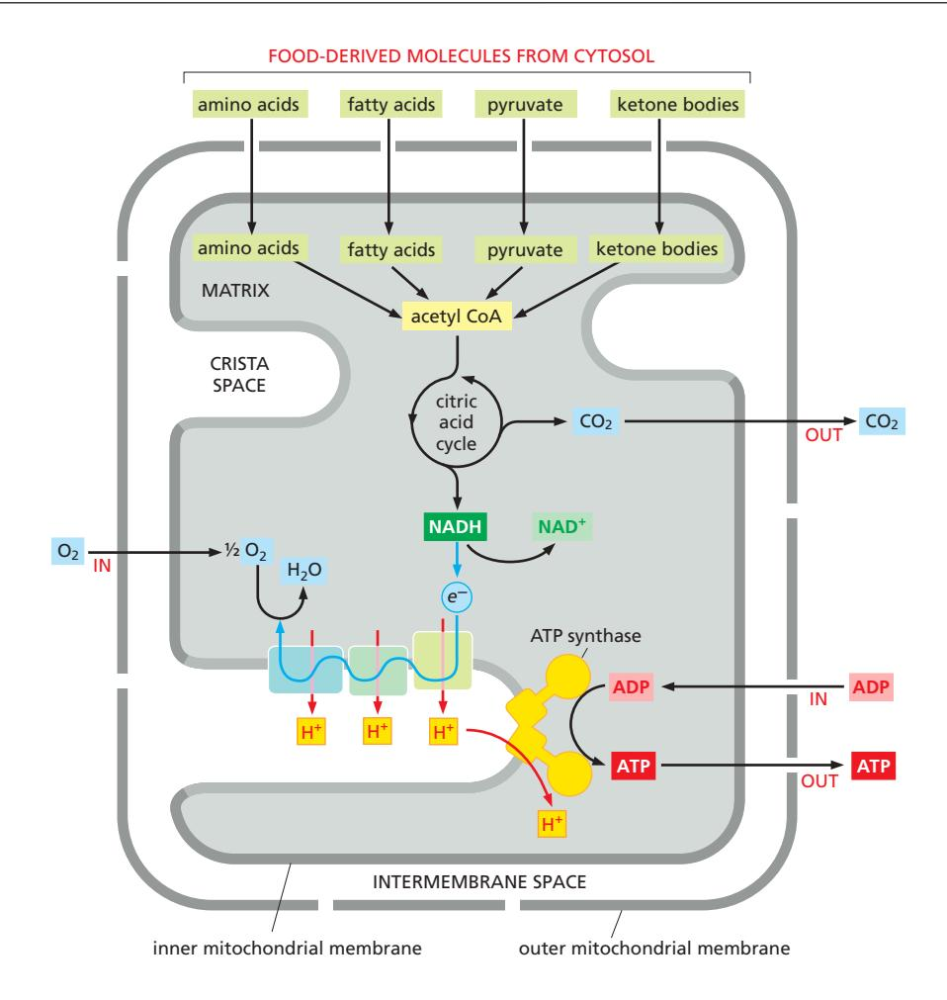

Figure 14–10 A summary of the energyconverting metabolism in mitochondria.

Pyruvate, fatty acids, amino acids, and ketone bodies enter the mitochondrion *(top of the figure)* and are broken down to acetyl CoA. The acetyl CoA is oxidized through a series of steps by the citric acid cycle, passing electrons to NAD+ thereby generating NADH, which then passes its high-energy electrons to the first of three large protein complexes in the electrontransport chain. In the process of oxidative phosphorylation, these electrons pass along the electron-transport chain in the inner membrane cristae to oxygen (O2). This electron transport generates a proton gradient, which drives the production of ATP by the ATP synthase (see Figure 14–3).

The acetyl groups in acetyl CoA are oxidized in the matrix via the *citric acid cycle*, also called the Krebs cycle (see Figure 2–58 and Movie 2.6). The oxidation of these carbon atoms in acetyl CoA produces CO2, which diffuses out of the mitochondrion to be released to the environment as a waste product. More important, the citric acid cycle saves a great deal of the bond energy released by this oxidation in the form of electrons carried by NADH. These electrons from NADH are transferred from the matrix to the electron-transport chain in the inner mitochondrial membrane, where—through the *chemiosmotic coupling* process described previously (see Figures 14–2 and 14–3)—the energy that was carried by NADH electrons is converted into phosphate-bond energy in ATP. **Figure 14–10** outlines this sequence of reactions schematically. MBoC7 m14.10/14.10

The matrix contains the genetic system of the mitochondrion, including the mitochondrial DNA and the ribosomes. The large number of enzymes required for the maintenance of the mitochondrial genetic system, as well as for many other essential reactions to be outlined next, accounts for the very high protein concentration in the matrix; at more than 500 mg/mL, this concentration is close to that in a protein crystal.

#### Mitochondria Have Many Essential Roles in Cellular Metabolism

Mitochondria not only generate most of the cell's ATP; they also provide many other essential resources for biosynthesis and cell growth (**Table 14–2**). Before describing in detail the remarkable machinery of the respiratory chain, we diverge briefly to touch on some of these important roles.

Mitochondria are critical for buffering the redox potential in the cytosol. Cells need a constant supply of the electron acceptor NAD+ for the central reaction in glycolysis that converts glyceraldehyde 3-phosphate to 1,3-bisphosphoglycerate 818 Chapter 14: Energy Conversion and Metabolic Compartmentation: Mitochondria and Chloroplasts THE MITOCHONDRION 819

| TABLE 14–2 Mitochondrial Functions                                                      |                                                                                                                                                                                            |  |  |  |
|-----------------------------------------------------------------------------------------|--------------------------------------------------------------------------------------------------------------------------------------------------------------------------------------------|--|--|--|
| Function                                                                                | Description                                                                                                                                                                                |  |  |  |
| Production of ATP                                                                       | Oxidative phosphorylation in mitochondria produces most of the ATP used by eukaryotic cells                                                                                                |  |  |  |
| Regeneration of NAD+                                                                    | NAD+ is required for glycolysis and other reactions; under aerobic conditions, this NAD+ is regenerated when NADH donates electrons to oxygen via the respiratory chain (see Chapter 2) |  |  |  |
| Provision of precursors for biosynthesis of amino acids, nucleotides, fatty acids | Intermediates produced by the citric acid cycle, which takes place in the mitochondrial matrix, serve as precursors for the synthesis of many macromolecules (see Figure 2–60)          |  |  |  |
| Participation in synthesis of heme and iron−sulfur clusters                          | These metal-containing components are synthesized in mitochondria and play a central role in respiration and other cellular processes                                                   |  |  |  |
| Cell signaling                                                                          | Mitochondria buffer the concentration of Ca2+, an ion that plays a role in many signaling processes, including muscle contraction (see Chapters 15 and 16)                              |  |  |  |
| Generation of reactive oxygen species                                                | Although reactive oxygen species can damage macromolecules, they are also involved in signaling                                                                                         |  |  |  |
| Regulation of apoptosis                                                                 | Molecules released from mitochondria trigger a proteolytic cascade that leads to cell death (see Chapter 18)                                                                            |  |  |  |

(see Figure 2–47). This NAD+ is converted to NADH in the process, and the NAD+ needs to be regenerated by transferring the high-energy NADH electrons somewhere. The NADH electrons will eventually be used to help drive oxidative phosphorylation inside the mitochondrion. But the inner mitochondrial membrane is impermeable to NADH. The electrons are therefore passed from the NADH to smaller molecules in the cytosol that can move through the inner mitochondrial membrane. Once in the matrix, these smaller molecules transfer their electrons to the NAD+ located there to form mitochondrial NADH, after which they are returned to the cytosol for recharging—creating a so-called *shuttle system* for the NADH electrons.

In cells with adequate access to oxygen, this shuttle system and the electrontransport chain provide the cell with a nearly boundless sink for electrons. But under conditions of low oxygen, such as in strenuously exercised muscle or in the center of a poorly vascularized tumor, a cell must change its metabolic program in major ways in order to generate its ATP (see p. 1175 in Chapter 20).

The biosynthesis needed in the cytosol for cell division, cell growth, and normal cell maintenance requires, in addition to ATP, both a constant supply of reducing power and small carbon-rich molecules to serve as the building blocks for the synthesis of nucleotides, amino acids, lipids, and other specialized molecules (discussed in Chapter 2). The reducing power comes from NADPH, a close relative of NADH (see Figure 2–36). Most of this NADPH is produced in the cytosol by a side pathway for the breakdown of sugars (the *pentose phosphate pathway*, an alternative to glycolysis). The needed carbon-rich molecules are almost completely derived from either intermediates of glycolysis or intermediates of the mitochondrial citric acid cycle (the "carbon skeletons" in Panel 2–1, pp. 94–95). For example, citrate produced in the mitochondrial matrix by the citric acid cycle is transported down its electrochemical gradient to the cytosol, where it is metabolized to produce the acetyl CoA that is required in the cytosol to support the production of the fatty acids and sterols that build new membranes (described in Chapter 10). Rapidly dividing normal cells and cancer cells frequently adapt their metabolism in ways that enhance this and other biosynthetic pathways, as part of their program of cell growth (see Figure 20–30).

While the majority of the reactions involved in nucleotide biosynthesis occur in the cytosol, important steps also occur in the mitochondria. For example, the molecules synthesized there provide the single-carbon units required for both purine and pyrimidine biosynthesis.

Mitochondria also play a particularly important role in the biosynthesis of protein building blocks. Mitochondrial acetyl-CoA, α-ketoglutarate, and oxaloacetate are all required for the *de novo* synthesis of amino acids, and, therefore, mitochondrial perturbations can affect amino acid metabolism. Conversely, perturbations in amino acid metabolism can have profound effects on mitochondrial energetics and function through indirect effects on the production and consumption of citric acid cycle intermediates and on the NADH+/NAD ratio.

The urea cycle is a central metabolic pathway in mammals that converts the ammonia (NH4 +) produced by the breakdown of nitrogen-containing compounds (such as amino acids) to the urea excreted in urine. Two critical steps of the urea cycle are carried out in the mitochondria of liver cells, while the remaining steps occur in the cytosol.

The biosynthesis of *heme groups*—which, as we shall see in the next part of this chapter, play a central role in electron transfer—is another critical process that is shared between the mitochondrion and the cytoplasm. Iron–sulfur clusters, which are essential not only for electron transfer in the respiratory chain (see p. 826) but also for the maintenance and stability of the nuclear genome, are produced in mitochondria (and chloroplasts). Nuclear genome instability, a hallmark of cancer, can sometimes be linked to a decreased function of cellular proteins that contain iron–sulfur clusters. In fact, for those cells that can make sufficient ATP from glycolysis, it has been proposed that iron–sulfur cluster synthesis is the mitochondrial function most essential for viability.

Mitochondria also have a central role in the biosynthesis of membrane lipids. Cardiolipin is a two-headed phospholipid (**Figure 14–11**) that is confined to the mitochondrial membranes, where it is also produced. But mitochondria are also a major source of phospholipids for the biogenesis of other cell membranes. Phosphatidylethanolamine, phosphatidylglycerol, and phosphatidic acid are synthesized in the mitochondrion, while phosphatidylinositol, phosphatidylcholine, and phosphatidylserine are primarily synthesized in the endoplasmic reticulum (ER). As described in Chapter 12, most of the cell's membranes are assembled in the ER, and a critical exchange of lipids between ER and mitochondria is thought to occur at special sites of close contact.

Finally, mitochondria are important for specialized cellular signaling mechanisms. Mitochondria play a critical regulatory role in the major controlled process of eukaryotic cell death, known as apoptosis, as detailed in Chapter 18. In addition, mitochondria buffer calcium concentrations by taking up calcium from the ER (and the sarcoplasmic reticulum in muscle cells) at special membrane junctions.

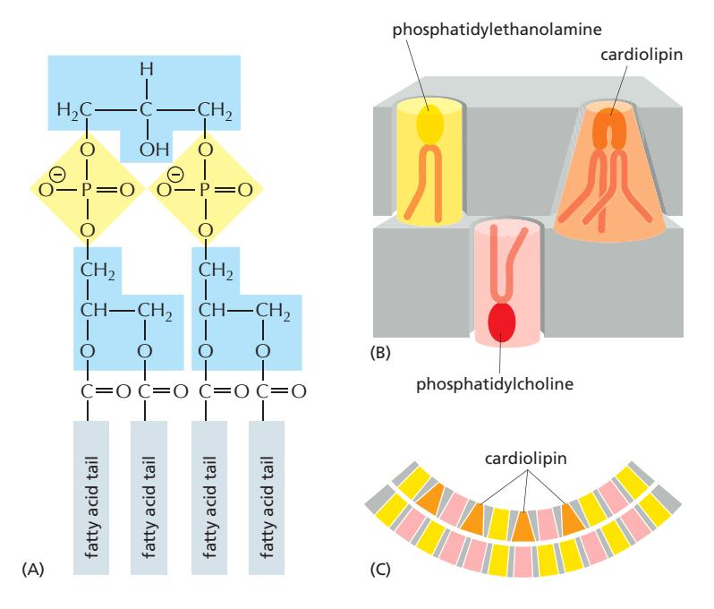

Figure 14–11 The structure of cardiolipin. (A) Cardiolipin consists of two covalently linked phospholipid units, with a total of four rather than the usual two fatty acid chains. (B) Phosphatidylcholine and phosphatidylethanolamine, which are conventional phospholipids and the most abundant lipid species in mitochondria, are shown for comparison. (C) Cardiolipin is produced in the mitochondrial membranes, where it interacts closely with membrane proteins involved in oxidative phosphorylation and ATP transport. In cristae, its unusual structure is thought to support the high curvature of this membrane, as indicated.

820 Chapter 14: Energy Conversion and Metabolic Compartmentation: Mitochondria and Chloroplasts THE MITOCHONDRION 821

Intracellular calcium levels not only control muscle contraction (see Chapter 16); alterations of calcium levels are also implicated in neurodegeneration and apoptosis. Mitochondria are also the principal site of production of reactive oxygen species, which—while they can cause damage—also play important signaling roles. And the concentrations of a number of metabolites with regulatory roles are controlled by mitochondrial metabolism and transport. Clearly, cells and organisms depend on mitochondria in many different ways, and the co-housing of diverse functions in this organelle has important implications for cell function and survival.

We now return to the central function of the mitochondrion in respiratory ATP generation.

### A Chemiosmotic Process Couples Oxidation Energy to ATP Production

Although the citric acid cycle that takes place in the mitochondrial matrix is considered to be part of aerobic metabolism, it does not itself use oxygen. Only the final step of oxidative metabolism consumes molecular oxygen (O2) directly.

Nearly all the energy available from metabolizing carbohydrates, fats, and other foodstuffs in earlier stages is saved in the form of energy-rich compounds that feed electrons into the respiratory chain in the inner mitochondrial membrane. These electrons, most of which are carried by NADH, finally combine with O2 at the end of the respiratory chain to form water. The energy released during the complex series of electron transfers from NADH to O2 is harnessed in the inner membrane to generate an electrochemical gradient that drives the conversion of ADP + phosphate to ATP. For this reason, the term **oxidative phosphorylation** is used to describe this final series of reactions (**Figure 14–12**).

The total amount of energy released by biological oxidation in the respiratory chain is equivalent to that released by the explosive combustion of hydrogen when it combines with oxygen in a single step to form water. But the combustion of hydrogen in a single-step chemical reaction, which has a strongly negative Δ*G*, releases this large amount of energy unproductively as heat. In the respiratory chain, the same energetically favorable reaction H2 + 1 2O2 → H2O is divided into small steps (**Figure 14–13**). This stepwise process allows the cell to capture

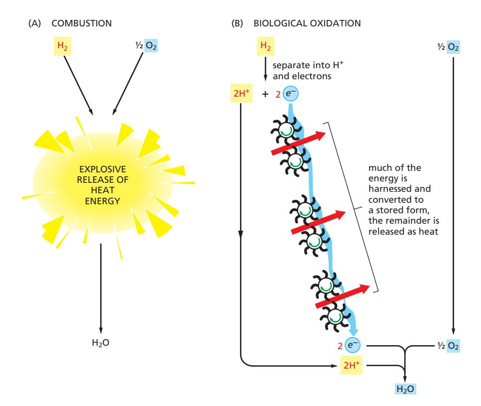

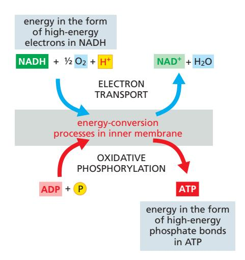

Figure 14–12 The major net energy conversion catalyzed by the mitochondrion. In the process of oxidative phosphorylation, the mitochondrial inner membrane serves as a device that changes one form of chemical-bond energy to another, converting a major part of the energy of NADH oxidation into phosphatebond energy in ATP. MBoC7 e14.13/14.12

Figure 14–13 A comparison between the biological oxidation catalyzed by the respiratory chain and combustion. (A) If hydrogen were simply burned, nearly all of the energy would be released in the form of heat. (B) In biological oxidation, about half of the released energy is stored in a form useful to the cell by means of the electrontransport chain (the respiratory chain) in the crista membrane of the mitochondrion. The rest of the energy is released as heat. In the respiratory chain, the protons and electrons, shown here as being derived from H2, are removed from hydrogen atoms that are covalently linked to NADH molecules.

and store nearly half of the total energy that is released in a useful form. At each step, the electrons, each of which can be thought of as having been removed from a hydrogen atom leaving a proton, pass through a series of electron carriers in the inner mitochondrial membrane. At each of three distinct steps along the way (marked by the three electron-transport complexes of the respiratory chain; see next part of this chapter), much of the energy released by electron transfer is utilized to produce an electrochemical gradient across the membrane (see Figure 14–2). At the end of the electron-transport chain, the electrons and protons recombine with molecular oxygen to produce water, a very low-energy molecule.

### The Energy Derived from Oxidation Is Stored as an Electrochemical Gradient

In mitochondria, the process of electron transport begins when two electrons and a proton are removed from NADH (to regenerate NAD+). These electrons are passed to the first of about 20 different electron carriers in the respiratory chain. The electrons start at a large *negative* redox potential (see **Panel 14–1**, p. 825) that is, at a high energy level—which gradually drops as they pass along the chain. Most of the electron carriers are housed in the three large multiprotein *respiratory enzyme complexes*, each composed of protein subunits that sit in the inner mitochondrial membrane. Each complex in the chain has a higher affinity for electrons than its predecessor, and electrons pass sequentially from one complex to the next until they are finally transferred to molecular oxygen, which has the highest electron affinity of all.

The net result is the pumping of H+ out of the matrix across the inner membrane, driven by the energetically favorable flow of electrons. This transmembrane movement of H+ has two major consequences:

- 1. It generates a pH gradient across the inner mitochondrial membrane, with a high pH in the matrix (close to 8) and a lower pH in the crista space.
- 2. It generates a voltage gradient across the inner mitochondrial membrane, creating a *membrane potential* with the matrix side negative and the crista space positive.

The pH gradient (ΔpH) reinforces the effect of the membrane potential (Δ*V*), because the latter acts to attract any positive ion into the matrix and to push any negative ion out. Together, ΔpH and Δ*V* make up the **electrochemical proton gradient**, which is measured in units of millivolts (mV). This gradient exerts a **proton-motive force**, which tends to drive H+ back into the matrix (**Figure 14–14**).

The electrochemical gradient across the inner membrane of a respiring mitochondrion is typically about 180 mV (the inside is electronegative), and it consists of a membrane potential of about 150 mV and a pH gradient of about 0.5 to

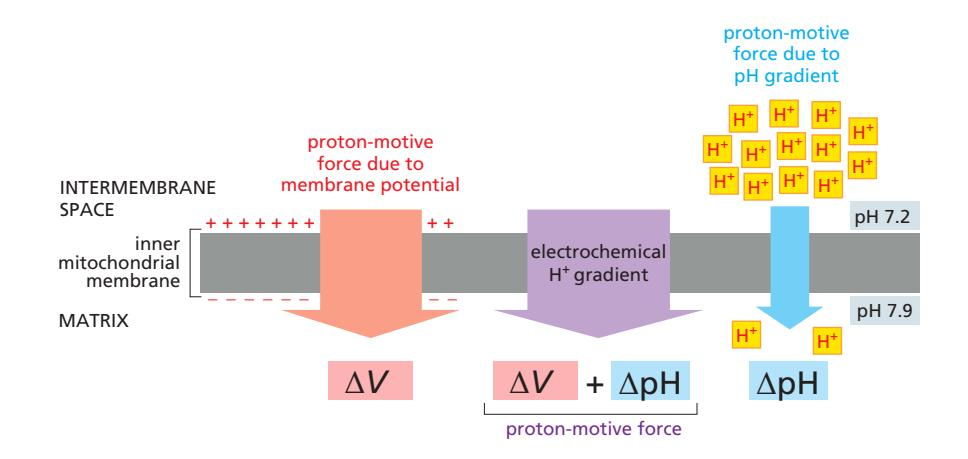

Figure 14–14 The electrochemical proton gradient across the inner mitochondrial membrane. This gradient is composed of a large force due to the membrane potential (Δ*V*) and a smaller force due to the H+ concentration gradient; that is, the pH gradient (ΔpH). Both forces combine to generate the proton-motive force, which pulls H+ back into the mitochondrial matrix. The exact relationship between these forces is expressed by the Nernst equation (see Panel 11–1, p. 656).

0.6 pH units (each ΔpH of 1 pH unit is equivalent to a membrane potential of about 60 mV). The electrochemical gradient drives not only ATP synthesis but also the energetically unfavorable transport of selected molecules across the inner mitochondrial membrane, including the import of nuclear-encoded proteins from the cytosol (discussed in Chapter 12).

#### Summary

*The mitochondrion performs most cellular oxidations and produces the bulk of an animal cell's ATP. A mitochondrion has two separate membranes: the outer membrane and the inner membrane. The inner membrane surrounds the innermost space (the matrix) of the mitochondrion, and it forms the cristae that project into the matrix and contain the electron-transport chain (the respiratory chain). The mitochondrial matrix and the inner membrane crista are the major sites of mitochondrial metabolism.* 

*The mitochondrial matrix contains a large variety of enzymes, including those that convert pyruvate and fatty acids to acetyl CoA and those that oxidize this acetyl CoA to CO2 through the citric acid cycle. These oxidation reactions produce large amounts of NADH, whose high-energy electrons are passed to the respiratory chain. The respiratory chain then uses the energy derived from transporting electrons from NADH to molecular oxygen to pump H*+ *out of the matrix. This produces a large electrochemical proton gradient across the inner mitochondrial membrane, which is composed of contributions from both a membrane potential and a pH difference. This electrochemical gradient exerts a force to drive H*+ *back into the matrix. This proton-motive force is harnessed both to produce ATP and to drive the selective transport of metabolites across the inner mitochondrial membrane.*

# THE PROTON PUMPS OF THE ELECTRON-TRANSPORT CHAIN

Having considered in general terms how a mitochondrion uses electron transport to generate a proton-motive force, we now turn to the molecular mechanisms that underlie this membrane-based energy-conversion process. In describing the respiratory chain of mitochondria, we accomplish the larger purpose of explaining how an electron-transport process can pump protons across a membrane. As stated at the beginning of this chapter, mitochondria, chloroplasts, archaea, and bacteria use very similar chemiosmotic mechanisms. In fact, these mechanisms underlie the function of all living organisms—including anaerobes that derive all their energy from electron transfers between two inorganic molecules, as we shall see later.

We start with some of the basic principles on which all of these processes depend.

#### The Redox Potential Is a Measure of Electron Affinities

In chemical reactions, any electrons removed from one molecule are always passed to another, so that whenever one molecule is oxidized, another is reduced. As with any other chemical reaction, the tendency of such **redox reactions** to proceed spontaneously depends on the free-energy change (Δ*G*) for the electron transfer, which in turn depends on the relative affinities of the two molecules for electrons.

Because electron transfers provide most of the energy for life, it is worth taking the time to understand them. As discussed in Chapter 2, acids donate protons and bases accept them (see Panel 2–2, pp. 96–97). Acids and bases exist in conjugate acid–base pairs, in which the acid is readily converted into the base by the loss of a proton. For example, acetic acid (CH3COOH) is converted into its conjugate base, the acetate ion (CH3COO–), in the reaction:

In an exactly analogous way, pairs of compounds such as NADH and NAD+ are called redox pairs, as NADH is converted to NAD+ by the loss of electrons in the reaction:

$$NADH \Longrightarrow NAD^+ + H^+ + 2e^-$$

NADH is a strong electron donor: because two of its electrons are engaged in a covalent bond, which releases energy when broken, the free-energy change for passing these electrons to many other molecules is favorable. Energy is required to form this bond from NAD+, two electrons, and a proton (the same amount of energy that is released when the bond is broken). Therefore NAD+, the redox partner of NADH, is of necessity a weak electron acceptor.

We can measure the tendency to transfer electrons from any redox pair experimentally. All that is required is the formation of an electrical circuit linking a 1:1 (equimolar) mixture of the redox pair to a second redox pair that has been arbitrarily selected as a reference standard, so that we can measure the voltage difference between them (see Panel 14–1). This voltage difference is defined as the redox potential; electrons move spontaneously from a redox pair like NADH/ NAD+ with a lower redox potential (a lower affinity for electrons) to a redox pair like O2/H2O with a higher redox potential (a higher affinity for electrons). Thus, NADH is a good molecule for donating electrons to the respiratory chain, while O2 is well suited to act as the "sink" for electrons at the end of the chain. As explained in Panel 14–1, the difference in redox potential, Δ*E*′0, is a direct measure of the standard free-energy change (Δ*G*°) for the transfer of an electron from one molecule to another.

While the standard redox potential is a useful tool to understand redox reactions, the true redox potential is also influenced by environmental factors in a cell such as pH, temperature, and electrostatic influences, which are often different from standardized conditions in cells. This issue is of particular relevance when the redox pair is embedded within a protein, where the environment is heavily influenced by nearby amino acid residues.

#### Electron Transfers Release Large Amounts of Energy

As just discussed, those pairs of compounds that have the most negative redox potentials have the weakest affinity for electrons and therefore are useful as carriers with a strong tendency to donate electrons. Conversely, those pairs that have the most positive redox potentials have the greatest affinity for electrons and therefore are useful as carriers for accepting electrons. A 1:1 mixture of NADH and NAD+ has a redox potential of –320 mV, indicating that NADH has a strong tendency to donate electrons; a 1:1 mixture of H2O and 1 2O2 has a redox potential of +820 mV, indicating that O2 has a strong tendency to accept electrons. The difference in redox potential is 1140 mV, which means that the transfer of each electron from NADH to O2 under these standard conditions is enormously favorable, with Δ*G*° = –109 kJ/mole. Twice this amount of energy is gained for the two electrons transferred per NADH molecule (see Panel 14–1). If we compare this free-energy change with that for the formation of the phosphoanhydride bonds in ATP, where Δ*G*° = 30.6 kJ/mole (see Figure 2–49), we see that, under standard conditions, the oxidation of one NADH molecule releases more than enough energy to synthesize seven molecules of ATP from ADP and phosphate. (In the cell, the number of ATP molecules generated will be lower because the standard conditions are far from the physiological ones; in addition, energy is inevitably dissipated as heat due to imperfect efficiency in energy transfers.)

#### Transition Metal Ions and Quinones Accept and Release Electrons Readily

The electron-transport properties of the membrane protein complexes in the respiratory chain depend on electron-carrying *cofactors*, most of which utilize *transition metals* such as Fe, Cu, Ni, and Mn bound to proteins in the complexes.

#### HOW REDOX POTENTIALS ARE MEASURED

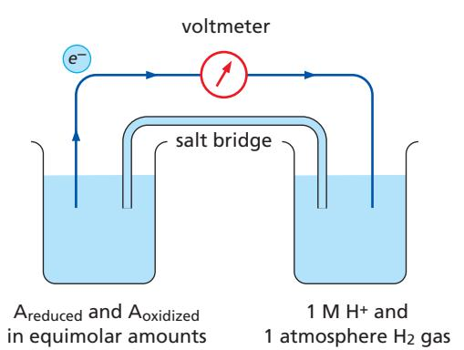

#### THE STANDARD REDOX POTENTIAL, *E′* 0

The standard redox potential for a redox pair, defined as *E*0, is measured for a standard state where all of the reactants are at a concentration of 1 M, including H+*.* Since biological reactions occur at pH 7, biologists instead define the standard state as Areduced = Aoxidized and H+ = 10–7 M. This standard redox potential is designated by the symbol *E* 0 , in place of *E*0. ′

One beaker (*left*) contains substance A with an equimolar mixture of the reduced (Areduced) and oxidized (Aoxidized) members of its redox pair. The other beaker contains the hydrogen reference standard (2H+ + 2*e*– H2), whose redox potential is arbitrarily assigned as zero by international agreement. (A salt bridge formed from a concentrated KCl solution allows K+ and Cl– to move between the beakers, as required to neutralize the charges when electrons flow between the beakers.) The metal wire (*dark blue*) provides a resistance-free path for electrons, and a voltmeter then measures the redox potential of substance A. If electrons flow from Areduced to H+, as indicated here, the redox pair formed by substance A is said to have a negative redox potential. If they instead flow from H2 to Aoxidized, the redox pair is said to have a positive redox potential.

| examples of redox reactions | standard redox ′ potential E 0 |  |
|-----------------------------|-----------------------------------------|--|
|                             |                                         |  |
|                             |                                         |  |
| c c                      |                                         |  |
|                             |                                         |  |

#### CALCULATION OF Δ*G*o FROM REDOX POTENTIALS

To determine the energy change for an electron transfer, the Δ*G* o of the reaction (kJ/mole) is calculated as follows:

 Δ*G* o = –*n*(0.096)Δ*E* 0 , where *n* is the number of electrons transferred across a redox potential change of Δ*E* 0 millivolts (mV), and ′ ′

$$\Delta E'_0 = E'_0$$
 (acceptor)  $- E'_0$  (donor)

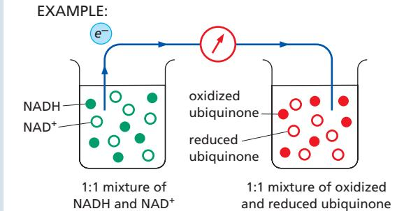

For the transfer of one electron from NADH to ubiquinone:

$$\Delta E'_0 = +30 - (-320) = +350 \text{ mV}$$

$$\Delta G^{\circ} = -n(0.096)\Delta E'_{0} = -1(0.096)(350) = -34 \text{ kJ/mole}$$

The same calculation reveals that the transfer of one electron from ubiquinone to oxygen has an even more favorable Δ*G*o of –76 kJ/mole. The Δ*G*o value for the transfer of one electron from NADH to oxygen is the sum of these two values, –110 kJ/mole.

#### EFFECT OF CONCENTRATION CHANGES

As explained in Chapter 2, the actual free-energy change for a reaction, Δ*G*, depends on the concentration of the reactants and generally will be different from the standard free-energy change, Δ*G*o . The standard redox potentials are for a 1:1 mixture of the redox pair. For example, the standard redox potential of –320 mV is for a 1:1 mixture of NADH and NAD+. But when there is an excess of NADH over NAD+, electron transfer from NADH to an electron acceptor becomes more favorable. This is reflected by a more negative redox potential and a more negative Δ*G* for electron transfer.

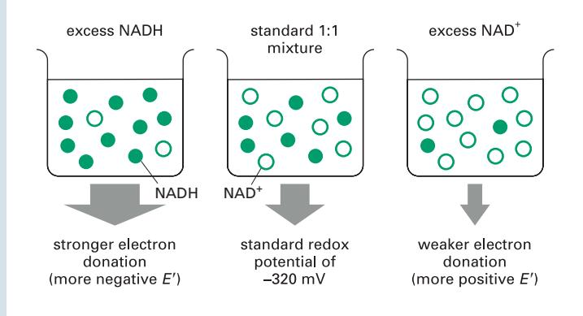

Figure 14–15 The structure of the heme group attached covalently to cytochrome *c*.

The porphyrin ring of the heme is shown in *light red*. There are six different cytochromes in the respiratory chain. Because the hemes in different cytochromes have slightly different structures and are kept in different local environments by their respective proteins, each has a different affinity for an electron and a slightly different spectroscopic signature. Note that many heme-containing proteins, including others in the electron-transport chain, bind to heme noncovalently unlike the heme in cytochrome *c* shown here. They do so through noncovalent interactions of the protein with the porphyrin ring and the heme iron.

These metals have special properties that allow them to promote both enzyme catalysis and electron-transfer reactions. Most relevant here is the fact that their ions exist in several different oxidation states with closely spaced redox potentials, which enables them to accept or give up electrons readily; this property is exploited by the membrane protein complexes in the respiratory chain to move electrons both within and between complexes.

Unlike the colorless atoms H, C, N, and O that constitute the bulk of biological molecules, transition metal ions are often brightly colored, which makes the proteins that contain them easy to study by spectroscopic methods using visible light. One family of such colored proteins, the **cytochromes**, contains a bound *heme group*, in which an iron atom is tightly held by four nitrogen atoms at the corners of a square in a *porphyrin ring* (**Figure 14–15**). Similar porphyrin rings are responsible both for the red color of blood and for the green color of leaves, binding an iron in hemoglobin or a magnesium in chlorophyll, respectively.

Iron–sulfur proteins contain a second major family of electron-transfer cofactors. In this case, either two or four iron atoms are bound to an equal number of sulfur atoms and to cysteine side chains, forming iron–sulfur clusters in the protein (**Figure 14–16**). Like the cytochrome hemes, these clusters carry one electron at a time through redox reactions with the iron atoms.

The simplest of the electron-transfer cofactors in the respiratory chain—and the only one that is not always bound to a protein—is a **quinone** (called *ubiquinone*, or *coenzyme Q*). A quinone (Q) is a small hydrophobic molecule that is freely mobile in the lipid bilayer. This *electron carrier* can accept or donate either one or two electrons. Upon reduction (note that reduced quinones are called quinols), it picks up a proton from water along with each electron (**Figure 14–17**).

In the mitochondrial electron-transport chain, six different cytochrome hemes, eight iron–sulfur clusters, three copper atoms, a flavin mononucleotide (another electron-transfer cofactor), and ubiquinone work in a defined sequence to carry electrons from NADH to O2. In total, this pathway involves more than 60 different polypeptides; these are arranged in three large membrane protein complexes, each of which binds several of the above electron-carrying cofactors (**Figure 14–18**).

As we will discuss later, there is an unusual additional respiratory chain complex that is an important component of the citric acid cycle, where it is known as *succinate dehydrogenase*. This membrane-embedded enzyme captures electrons during the conversion of succinate to fumarate (see Panel 2–9, pp. 110–111). It passes these electrons directly into the electron-transport chain via a flavin electron carrier (flavin adenine dinucleotide; FAD), instead of utilizing NAD+, and it does not pump protons (see Figure 14–18).

As we would expect, the electron-transfer cofactors have increasing affinities for electrons (higher redox potentials) as the electrons move along the respiratory chain. The redox potentials have been fine-tuned during evolution by the protein environment of each cofactor, which alters the cofactor's normal affinity for electrons. Because iron–sulfur clusters have a relatively low affinity for electrons,

Figure 14–16 The structure of an iron–sulfur cluster. Iron–sulfur clusters consist either of four iron and four sulfur atoms, as shown here, or of two irons and two sulfurs linked to cysteines in the polypeptide chain via covalent sulfur bridges; alternatively they may be linked to histidines. Although they contain several iron atoms, each iron–sulfur cluster can carry only one electron at a time. Nine different iron–sulfur clusters participate in electron transport in the respiratory chain.

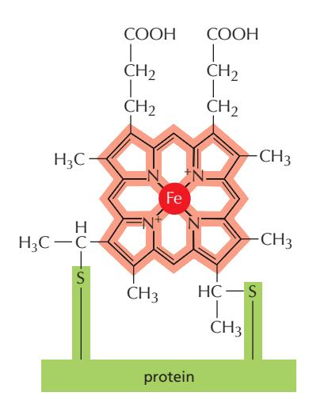

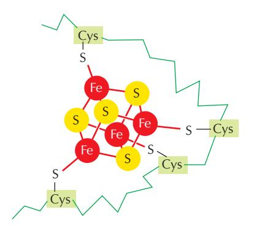

O CH3 O O H3C O CH3 hydrophobic hydrocarbon tail ubiquinone O CH3 O O• H3C CH3 O ubisemiquinone (free radical) O CH3 O H3C CH3 O ubiquinol + O *e– e* H+ *–* H + H+ H H Q QH• QH2

they predominate in the first half of the respiratory chain; in contrast, the heme cytochromes predominate further down the chain, where a higher electron affinity is required.

## NADH Transfers Its Electrons to Oxygen Through Three Large Enzyme Complexes Embedded in the Inner Membrane

Membrane proteins are difficult to purify because they are insoluble in aqueous solutions, and they are easily disrupted by the detergents that are required to solubilize them. But by using mild nonionic detergents, such as digitonin or dodecyl maltoside, they can be solubilized and purified in their native form. The three large, detergent-solubilized respiratory complexes can be reinserted into artificial lipid bilayer vesicles, and each protein complex can be shown to pump protons across the membrane as electrons pass through it.

In the mitochondrion, the three complexes are linked in series, serving as electron transport–driven H+ pumps that pump protons out of the matrix to acidify the crista space (see Figure 14–18):

- 1. The **NADH dehydrogenase complex** (typically called *Complex I*) is the largest of these respiratory enzyme complexes. It accepts electrons from NADH and passes them through a flavin mononucleotide and eight iron– sulfur clusters to ubiquinone. The reduced ubiquinol then transfers its electrons to cytochrome *c* reductase.
- 2. The **cytochrome c reductase** (also called the *cytochrome b-c*1 *complex* and typically called *Complex III*) is a large membrane protein assembly that functions as a dimer. Each monomer contains three cytochrome hemes and an iron–sulfur cluster. The complex accepts electrons from ubiquinol

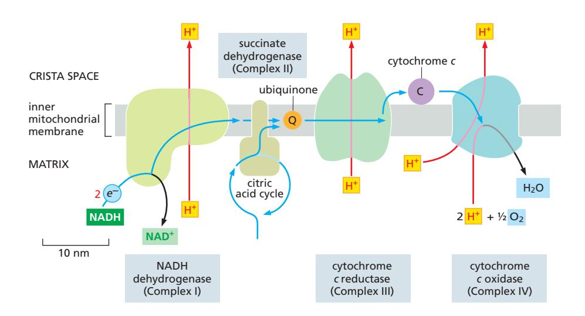

#### Figure 14–17 Quinone electron

carriers. Ubiquinone in the lipid bilayer picks up one H+ *(red)* from the aqueous environment for each electron *(blue)* it accepts from respiratory-chain complexes. The first step in this process involves the acquisition of a proton and an electron and converts the ubiquinone into an unstable ubisemiquinone radical. With the transfer of the second electron, it becomes a fully reduced ubiquinone (called ubiquinol), which is freely mobile as an electron carrier in the lipid bilayer of the membrane. When the ubiquinol donates its electrons to the next complex in the chain, the two protons are released. The long hydrophobic tail *(green)* that confines ubiquinone to the membrane consists of 6 to 10 five-carbon isoprene units, depending on the organism. The corresponding electron carrier in the photosynthetic membranes of chloroplasts is plastoquinone, which has almost the same structure and works in the same way. For simplicity, we refer to both ubiquinone and plastoquinone in this chapter as quinone (abbreviated as Q).

Figure 14–18 The path of electrons through the three respiratory-chain proton pumps (Movie 14.5). The approximate size and shape of each protein complex are shown. During the transfer of electrons from NADH to oxygen *(blue arrows)*, ubiquinone and cytochrome *c*  serve as mobile carriers that ferry electrons from one complex to the next. During the electron-transfer reactions, protons are pumped across the membrane by each of the respiratory enzyme complexes, as indicated *(red arrows)*.

The three proton pumps in the respiratory chain are typically denoted as Complex I, Complex III, and Complex IV, according to the order in which electrons pass through them from NADH. Electrons from the oxidation of succinate by succinate dehydrogenase (designated as Complex II) are fed into the electron-transport chain in the form of reduced ubiquinone. Although embedded in the crista membrane, succinate dehydrogenase does not pump protons and thus does not contribute to the protonmotive force.

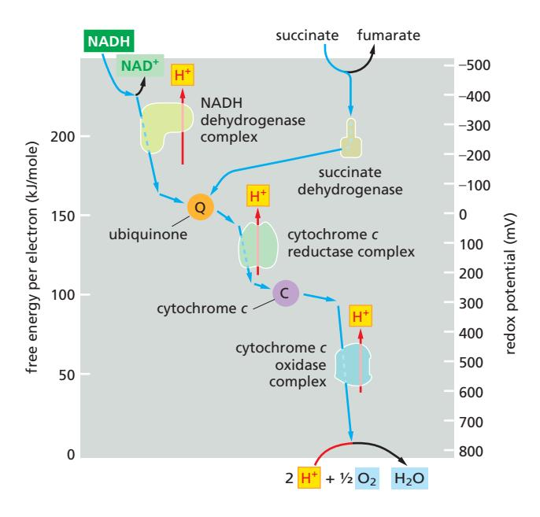

and passes them on to the small, soluble protein cytochrome *c*, which is located in the crista space and carries electrons one at a time to cytochrome *c* oxidase.

3. The **cytochrome c oxidase complex** (typically called *Complex IV*) contains two cytochrome hemes and three copper atoms. The complex accepts electrons one at a time from cytochrome *c* and passes them to molecular oxygen. In total, four electrons and four protons are needed to convert one molecule of oxygen to water. MBoC7 m14.19/14.19

We have previously discussed how the redox potential reflects electron affinities. **Figure 14–19** presents an outline of the redox potentials measured along the respiratory chain. These potentials change in three large steps, one across each proton-translocating respiratory complex. The change in redox potential between any two electron carriers is directly proportional to the free energy released when an electron transfers between them. Each complex acts as an energy-conversion device by harnessing some of this free-energy change to pump H+ across the inner membrane, thereby creating an electrochemical proton gradient as electrons pass along the chain. In addition to these proton-pumping complexes, the *succinate dehydrogenase* complex, which catalyzes the oxidation of succinate to fumarate in the citric acid cycle, is often also considered to be a component of the electron-transport chain. It is typically called *Complex II* because, like Complex I, it passes electrons to ubiquinone.

The assembly of each of these four protein complexes requires a precisely managed program because of their number of subunits and reactive cofactors. This is accomplished through the function of dedicated assembly factors that chaperone particular steps in the assembly and activation process. Loss of these assembly factors through mutation leads to human diseases; their loss mimics mutations that directly affect the complex subunits themselves.

X-ray crystallography (and, more recently, cryo-electron microscopy, or cryoEM) has elucidated the final structures of each of the respiratory-chain complexes in great detail, and we next examine each of them in turn to see how they work.

### The NADH Dehydrogenase Complex Contains Separate Modules for Electron Transport and Proton Pumping

The NADH dehydrogenase complex is a massive assembly of proteins, some integral to the membrane and others not, that receives electrons from NADH and passes them to ubiquinone. In animal mitochondria, it consists of more than Figure 14–19 Redox potential changes along the mitochondrial electrontransport chain. The redox potential (designated Δ*E*′0) increases as electrons flow down the respiratory chain to oxygen. The standard free-energy change in kilojoules, Δ*G*°, for the transfer of each of the two electrons donated by an NADH molecule can be obtained from the left-hand ordinate [Δ*G*°=–*n*(0.096) Δ*E*′0, where *n* is the number of electrons transferred across a redox potential change of Δ*E*′0 mV]. Electrons flow through a respiratory enzyme complex by passing in sequence through the multiple electron carriers in each complex *(dotted portion of blue arrows)*. As indicated, part of the favorable free-energy change is harnessed by each enzyme complex to pump H+ across the inner mitochondrial membrane *(red arrows)*. The NADH dehydrogenase pumps up to four H+ per electron, the cytochrome *c* reductase complex pumps two per electron, whereas the cytochrome *c* oxidase complex pumps one per electron.

Succinate dehydrogenase (Complex II) also passes electrons into the ubiquinone pool by oxidizing succinate and passing those electrons through a stably bound FAD+/FADH2 redox pair. Fatty acid oxidation (see Figure 2–57) also leads to the generation of FADH2, which also passes its two electrons directly to ubiquinone, bypassing NADH dehydrogenase. No proton pumping accompanies these electron transfers.

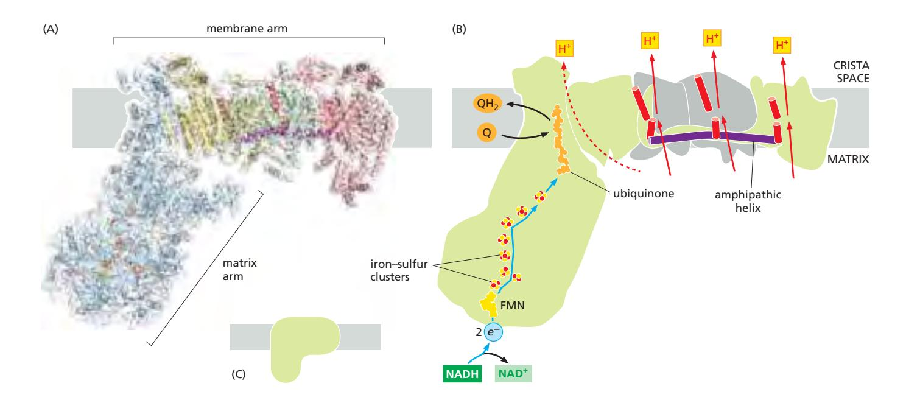

40 different protein subunits, with a molecular mass of nearly a million daltons. The x-ray crystallography and cryoEM structures of the NADH dehydrogenase complex show that it is L-shaped, with both a hydrophobic membrane arm and a hydrophilic arm that projects into the mitochondrial matrix (**Figure 14–20**).

Electron transfer and proton pumping are physically separated in the NADH dehydrogenase complex, with electron transfer occurring in the matrix arm and proton pumping in the membrane arm. The NADH docks near the tip of the matrix arm, where it transfers its electrons via a bound flavin mononucleotide to a string of iron–sulfur clusters that runs down the arm, acting like a wire to carry electrons to a protein-bound molecule of ubiquinone. Electron transfer to the quinone is thought to trigger proton translocation in a set of proton pumps in the membrane arm, and for this to happen the two processes must be energetically and mechanically linked. One hypothesized mechanism is for this link to be provided by a 6-nm-long, amphipathic α helix that runs parallel to the membrane surface on the matrix side of the membrane arm. This helix may act like the connecting rod in a steam engine to generate a mechanical, energy-transducing power stroke that links the quinone-binding site to the proton-translocating modules in the membrane (see Figure 14–20). MBoC7 m14.20/14.20

The reduction of each quinone by the transfer of its two electrons, followed by its release from the complex into the membrane, can cause four protons to be pumped out of the matrix into the crista space. In this way, NADH dehydrogenase generates roughly half of the total proton-motive force in mitochondria.

### Cytochrome *c* Reductase Takes Up and Releases Protons on Opposite Sides of the Crista Membrane, Thereby Pumping Protons

As described previously, when a quinone molecule (Q) accepts its two electrons, it also takes up two protons to form a quinol (QH2; see Figure 14–17). In the respiratory chain, ubiquinol transfers electrons to cytochrome *c* reductase, after picking them up from either NADH dehydrogenase or succinate dehydrogenase. Because the protons in this QH2 molecule are obtained from the matrix and released on the opposite side of the crista membrane, two protons are transferred from the matrix into the crista space per pair of electrons transferred (**Figure 14–21**). This simple vectorial transfer of protons supplements the electrochemical proton gradient that is created by the NADH dehydrogenase proton pumping just discussed.

Figure 14–20 The structure of NADH dehydrogenase (also known as Complex I). (A) The structure of Complex I is shown. The matrix arm of NADH dehydrogenase contains one flavin mononucleotide (FMN) and eight iron–sulfur (FeS) clusters that appear to participate in electron transport. The membrane contains more than 70 transmembrane helices, forming three distinct protonpumping modules. (B) Schematic of NADH dehydrogenase electron transport–coupled proton pumping. NADH donates two electrons, via a bound FMN *(yellow)*, to a chain of seven iron–sulfur clusters *(red and yellow spheres)*. From the terminal iron–sulfur cluster, the electrons pass to ubiquinone *(orange)*. Electron transfer results in conformational changes that are thought to be transmitted to a long amphipathic α helix *(purple)* on the matrix side of the membrane arm, which pulls on discontinuous transmembrane helices *(red)* in three membrane subunits, each of which resembles an antiporter (see Chapter 11). This movement is thought to change the conformation of charged residues in the three proton channels, resulting in the translocation of three protons out of the matrix. A fourth proton may be translocated at the interface of the two arms *(dotted line)*. (C) This shows the symbol for NADH dehydrogenase used throughout this chapter. (A, adapted from R.G. Efremov et al., *Nature* 465:441–445, 2010. PDB code: 3M9S.)

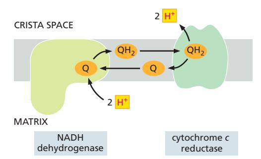

Cytochrome *c* reductase is a large assembly of membrane protein subunits. Three subunits form a catalytic core that passes electrons from ubiquinol to cytochrome *c*, with a structure that has been highly conserved from bacterial ancestors (**Figure 14–22**). It pumps protons by a vectorial transfer that is more complex than the mechanism in Figure 14–21, thereby doubling the amount of useful energy harvested. This involves a binding site for a second molecule of ubiquinone; the elaborate redox loop mechanism used is called the *Q cycle* because one of the electrons received from each QH2 molecule is transferred from MBoC7 m14.21/14.21

#### Figure 14–21 How a directional release and uptake of protons by a quinone pumps protons across a membrane.

Two protons are picked up on the matrix side of the inner mitochondrial membrane when the reaction Q + 2*e*– + 2H+ → QH2 is catalyzed by the NADH dehydrogenase complex. This molecule of ubiquinol (QH2) then binds to the crista side of cytochrome *c* reductase. When its oxidation by cytochrome *c* reductase generates two protons and two electrons (see Figure 14–17), the two protons are released into the crista space. The flow of electrons is not shown in this diagram.

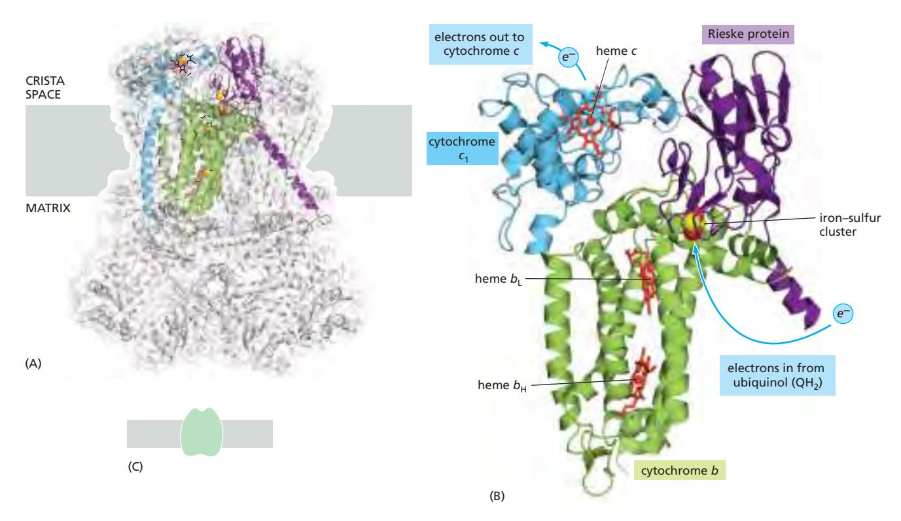

Figure 14–22 The structure of cytochrome *c* reductase. Cytochrome *c* reductase (also known as the cytochrome *b-c*1 complex) is a dimer of two identical 240,000-dalton halves, each composed of 11 different protein molecules in mammals. (A) A structural model of the entire dimer based on x-ray crystallography, showing in color the three proteins that form the functional core of the enzyme complex: cytochrome *b (green)* and cytochrome *c*1 *(blue)* are colored in one half, and the Rieske protein *(purple)* containing an Fe2S2 iron–sulfur cluster *(red and yellow)* is colored in the other. These three protein subunits interact across the two halves. (B) Transfer of electrons through cytochrome *c* reductase to the small, soluble carrier protein cytochrome *c*. Electrons entering from ubiquinol near the matrix side of the membrane are captured by the iron–sulfur cluster of the Rieske protein, which moves its iron–sulfur group back and forth to transfer these electrons to heme *c (red)*. Heme *c* then transfers them to the carrier molecule cytochrome *c*.

MBoC7 m14.22/14.22 As detailed in Figure 14–23, only one of the two electrons from each ubiquinol is transferred through this path. To increase proton pumping, the second ubiquinol electron is passed to a molecule of ubiquinone bound to cytochrome *c* reductase on the opposite side of the membrane—near the matrix. (C) This shows the symbol for cytochrome *c* reductase used throughout this chapter. (A and B, PDB code: 1EZV.)

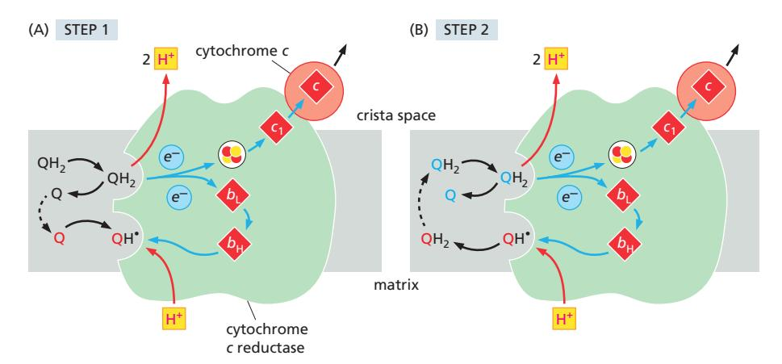

Figure 14–23 The two-step mechanism of the cytochrome *c* reductase Q cycle. A clear grasp of the processes illustrated here can be obtained from the step-by-step video provided in Movie 14.6. (A) In step 1, ubiquinol reduced by NADH dehydrogenase docks to the cytochrome *c* reductase complex. Oxidation of the quinol produces two protons and two electrons. The protons are released into the crista space. One electron passes via an iron–sulfur cluster to heme *c*1, and then to the soluble electron carrier protein cytochrome *c* on the membrane surface. The second electron passes via hemes *b*L and *b*H to a ubiquinone (*red* Q) bound at a separate site near the matrix side of the protein. Uptake of a proton from the matrix produces a ubisemiquinone radical (see Figure 14–17), which remains bound to this site (*red* QH•).

MBoC7 m14.23/14.23 (B) In step 2, a second ubiquinol (*blue* QH2) docks and releases two protons and two electrons, as described for step 1. One electron is passed to a second molecule of cytochrome *c*, whereas the other electron is accepted by the ubisemiquinone. The ubisemiquinone then takes up a proton from the matrix and is released into the lipid bilayer as fully reduced ubiquinol (*red* QH2), from whence it can subsequently rebind to the complex and donate electrons and protons as in step 1.

On balance, the oxidation of one ubiquinol in the Q cycle pumps two protons through the membrane by a directional release and uptake of protons (see Figure 14–18), while releasing another two into the crista space. In addition, in each of the two steps (A and B), one electron is transferred to a cytochrome *c* carrier protein.

ubiquinone through the complex to the carrier protein cytochrome *c* while the other electron is recycled back into the quinone pool. Through the mechanism illustrated in **Figure 14–23** and **Movie 14.6**, the **Q cycle** increases the total amount of redox energy that can be stored in the electrochemical proton gradient: for every electron that is transferred from NADH dehydrogenase to cytochrome *c,* two protons are pumped across the crista membrane into the crista space.

# The Cytochrome *c* Oxidase Complex *Pumps* Protons and Reduces O2 Using a Catalytic Iron–Copper Center

The final link in the mitochondrial electron-transport chain is cytochrome *c* oxidase, or Complex IV. The cytochrome *c* oxidase complex accepts electrons from the soluble electron carrier cytochrome *c*, and it uses yet a different, third mechanism to pump protons across the inner mitochondrial membrane. The structure of the mammalian complex is illustrated in **Figure 14–24**.

Because oxygen has a high affinity for electrons, it can release a large amount of free energy when it is reduced to form water. Thus, the evolution of cellular respiration, in which O2 is converted to water, enabled organisms to harness much more energy than can be derived from anaerobic metabolism. As we discuss later, the availability of the large amount of energy released by the reduction of molecular oxygen to form water is thought to have been essential to the emergence of multicellular life, thereby explaining why all large organisms respire. The ability of biological systems to use O2 in this way, however, requires sophisticated chemistry. Once a molecule of O2 has picked up one electron, it forms a superoxide radical anion (O2 •–) that is dangerously reactive and rapidly takes up an additional three electrons wherever it can get them, with destructive effects on its immediate environment. We can tolerate oxygen in the air we

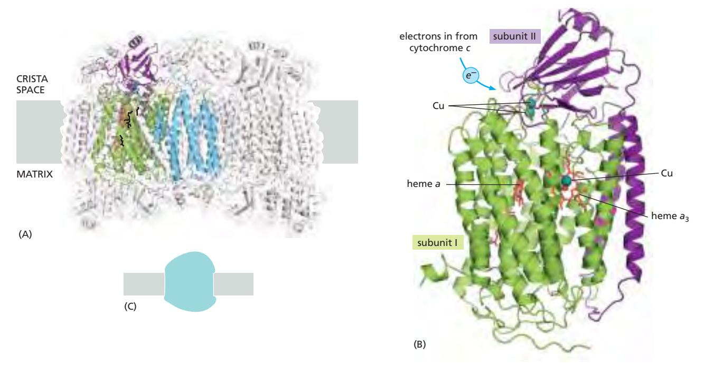

Figure 14–24 The structure of cytochrome *c* oxidase. The final complex in the human mitochondrial electron-transfer chain consists of ∼13 different protein subunits, depending on the cell type, with a total mass of approximately 204,000 daltons. (A) The entire dimeric complex is shown, positioned in the crista membrane. The highly conserved subunits I *(green)*, II *(purple)*, and III *(blue)* are encoded by the mitochondrial genome, and they form the functional core of the enzyme. (B) The functional core of the complex. Electrons pass through this structure from cytochrome *c* via bound copper ions *(blue spheres)* and hemes *(red)* to an O2 molecule bound between heme *a*3 and a copper ion. The four protons needed to reduce O2 to water are taken up from the matrix; see also Figure 14–25. (C) This shows the symbol for cytochrome *c* oxidase used throughout this chapter. (A and B, PDB code: 2OCC.)

breathe only because the uptake of the first electron by a free O2 molecule is slow and inefficient, allowing cells to use enzymes to control electron uptake by oxygen. Thus, cytochrome *c* oxidase holds on to oxygen at a special bimetallic center, where it remains clamped between a heme-linked iron atom and a copper ion until it has picked up a total of four electrons. Only then are the two oxygen atoms of the oxygen molecule safely released as two molecules of water (**Figure 14–25**).

The cytochrome *c* oxidase reaction accounts for about 90% of the total oxygen uptake in most cells. This protein complex is therefore crucial for all aerobic life. Oxygen limitation is life-threatening to obligate aerobic organisms because of an impaired activity of cytochrome *c* oxidase and these organisms respond rapidly to low oxygen levels to decrease their dependence on mitochondrial respiration. Cyanide is extremely toxic because it binds to the heme iron atoms in cytochrome *c* oxidase much more tightly than does oxygen, thereby greatly reducing mitochondrial ATP production.

#### Succinate Dehydrogenase Acts in Both the Electron-Transport Chain and the Citric Acid Cycle

In addition to the three proton pumps just discussed, one of the enzymes in the citric acid cycle, *succinate dehydrogenase* (**Figure 14–26**), is embedded in the mitochondrial crista membrane. In the course of oxidizing succinate to fumarate in the matrix, this enzyme complex captures electrons in the form of a tightly bound FADH2 molecule (see Panel 2–9, pp. 110–111) and passes them through three iron–sulfur clusters to a molecule of ubiquinone. The reduced ubiquinol then enters the pool of ubiquinol generated by Complex I and passes its two electrons to cytochrome *c* reductase in the respiratory chain (see Figure 14–18). Succinate dehydrogenase is not a proton pump, and

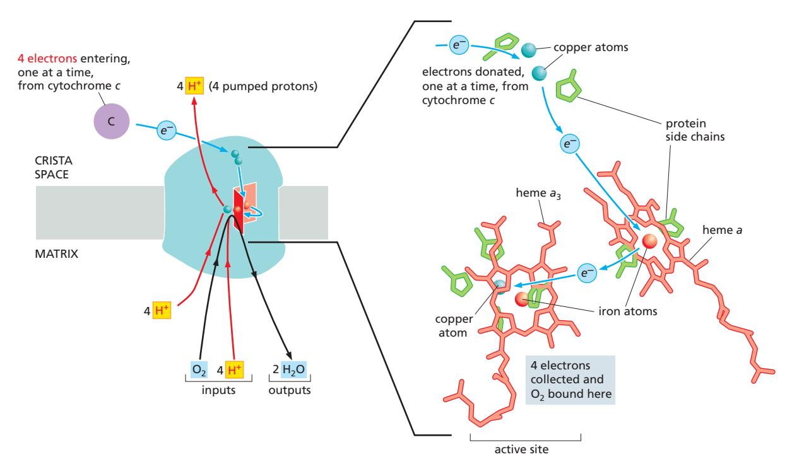

Figure 14–25 The reaction of O2 with electrons in cytochrome *c* oxidase. Electrons from cytochrome *c* pass through the complex via bound copper ions *(blue spheres)* and hemes *(red)* to an O2 molecule bound between heme *a*3 and a copper ion. Iron ions are shown as *red spheres*. The iron atom in heme *a* serves as an electron queuing point where electrons are held so that they can be released to an O2 molecule (not shown) that is held at the bimetallic center active site, which is formed by the central iron of the other heme (heme *a3*) and a closely apposed copper atom. The four protons needed to reduce O2 to water are removed from the matrix. For each O2 molecule that undergoes the reaction 4*e*– + 4H+ + O2 → 2H2O, an additional four protons are pumped out of the matrix by mechanisms driven by allosteric changes in protein conformation (see Figure 14–29).

it does not contribute directly to the electrochemical potential utilized for ATP production in mitochondria. Its dual action in the citric acid cycle and in electron transport has implications for human disease that are different from those of the other three respiratory complexes. For example, mutations that cause a decreased activity of Complex II contribute to specific forms of cancer.

# The Respiratory Chain Forms a Supercomplex in the Crista Membrane

When the three large mitochondrial respiratory complexes that pump protons in the electron-transport chain are gently isolated, they are found in even larger *supercomplexes*. Such observations support the hypothesis that this massive structure in the crista membrane helps the mobile electron carriers ubiquinone (in the crista membrane) and cytochrome *c* (in the crista space) transfer electrons more efficiently than could be accomplished with dissociated, freely diffusing electron carriers (**Figure 14–27**). The supercomplex allows a cell to capture as much of the free energy of electron transfer from NADH to O2 as possible and to avoid potentially damaging, redox side reactions. The formation of this structure depends on the presence of the mitochondrial lipid cardiolipin (see Figure 14–11) and on special proteins that are thought to hold the components together.

Figure 14–26 The structure of succinate dehydrogenase. (A) This membrane-embedded enzyme is composed of four subunits. One subunit, Sdh1, contains a covalently bound FAD cofactor *(green)* that receives an electron directly from succinate oxidation and passes it successively through the three iron–sulfur clusters *(red and yellow)* contained within Shd2 to ubiquinone. The membrane component of this complex, formed by the other two subunits, has a bound heme of unknown function *(orange)*. (B) This shows the symbol for succinate dehydrogenase used throughout this chapter. (A, PDB code: 1NEK.)

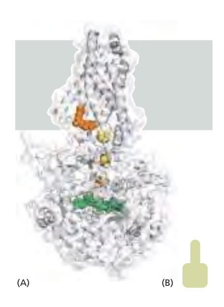

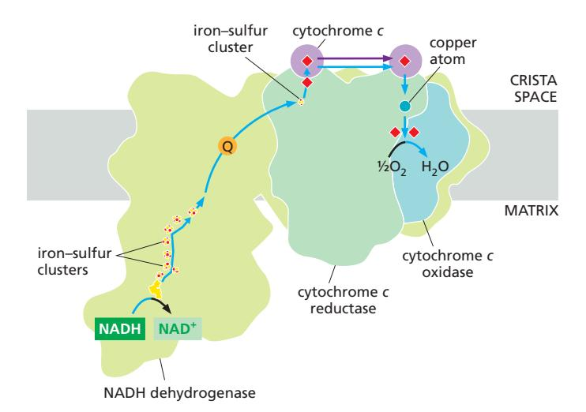

MBoC7 m14.26/14.27 Figure 14–27 The respiratory-chain supercomplex from bovine heart mitochondria. The three proton-pumping complexes of the mitochondrial respiratory chain of mammalian mitochondria assemble into large supercomplexes in the crista membrane. Supercomplexes can be isolated by mild detergent treatment of mitochondria, and their structure has been deciphered by single-particle cryoelectron microscopy. The bovine heart supercomplex has a total mass of 1.7 megadaltons. Shown is a schematic of such a complex that consists of NADH dehydrogenase, cytochrome *c* reductase, and cytochrome *c* oxidase, as indicated. The facing quinol-binding sites of NADH dehydrogenase and cytochrome *c* reductase, plus the short distance between the cytochrome *c*–binding sites in cytochrome *c* reductase and cytochrome *c* oxidase, facilitate fast, efficient electron transfer. Cofactors active in electron transport are marked as a *yellow icon* (flavin mononucleotide), *red and yellow spheres* (iron–sulfur clusters), Q (quinone), *red diamonds* (hemes), and a *blue sphere* (copper atom). Only cofactors participating in the linear flow of electrons from NADH to water are shown. *Blue arrows* indicate the path of the electrons through the supercomplex. (Adapted from T. Athoff et al., *EMBO J.*  30:4652–4664, 2011.)

#### Protons Can Move Rapidly Through Proteins Along Predefined Pathways

The protons in water are highly mobile: by rapidly dissociating from one water molecule and associating with its neighbor, they can rapidly flit through a hydrogen-bonded network of water molecules (see Figure 2–5). But how can a proton move through the hydrophobic interior of a protein embedded in the lipid bilayer? Proton-translocating proteins contain so-called *proton wires*, which are rows of polar or ionic side chains or water molecules spaced at short distances, so that the protons can jump from one to the next (**Figure 14–28**). Along such predefined pathways, protons move up to 40 times faster than through bulk water.

How does electron transport cause allosteric changes in protein conformations that pump protons? From the most basic point of view, if electron transport drives sequential allosteric changes in protein conformation that alter the redox state of the components, these conformational changes can be connected to protein wires that allow the protein to pump H+ across the crista membrane. This type of H+ pumping requires at least three distinct conformations for the pump protein, as schematically illustrated in **Figure 14–29**. Atomic-resolution structures, combined with the effects of specific amino acid changes introduced into the proteins by genetic engineering, are helping to reveal the detailed mechanisms of the proton pumping driven by electron transfer, but how these

Figure 14–28 Proton movement through water and proteins. (A) Protons move rapidly through water, hopping from one H2O molecule to the next by the continuous formation and dissociation of hydronium ions, H3O+ (see Chapter 2). In this diagram, proton jumps are indicated by *red arrows*. (B) Protons can move even more rapidly through a protein along *proton wires*. These are predefined proton paths consisting of suitably spaced amino acid side chains that accept and release protons easily (Asp, Glu) or carry a water-like hydroxyl group (Ser, Thr), along with water molecules trapped in the protein interior.

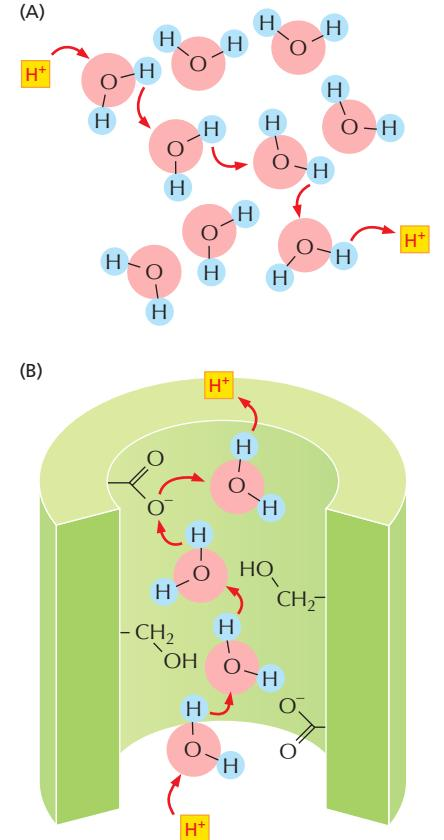

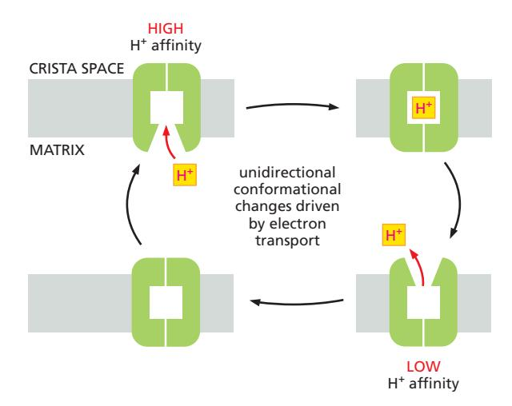

conformations are formed and regulated in the respiratory complexes remain incompletely understood.

#### Summary

*The respiratory chain is embedded in the crista membrane portion of the inner mitochondrial membrane. It contains three respiratory enzyme complexes through which electrons pass on their way from NADH to O2. Within these large protein complexes, electrons are transferred along a series of protein-bound electron carriers that include hemes and iron–sulfur clusters. The energy released as the electrons move to lower and lower energy levels is used by each protein complex to pump protons out of the mitochondrial matrix, coupling lateral electron transport to vectorial proton transport across the membrane. Electrons are shuttled between the enzyme complexes by the mobile electron carriers ubiquinone and cytochrome c to complete the electron-transport chain. The path of electron flow from NADH is as follows: NADH* → *NADH dehydrogenase complex* → *ubiquinone* → *cytochrome c reductase* → *cytochrome c* → *cytochrome c oxidase complex* → *molecular oxygen (O2). In addition, electrons derived from a citric acid cycle intermediate, succinate, enter this pathway by flowing through a fourth membrane-embedded, respiratory enzyme complex, succinate dehydrogenase, to ubiquinone.*

# ATP PRODUCTION IN MITOCHONDRIA

As we have just discussed, the three proton pumps of the respiratory chain each contribute to the formation of an electrochemical proton gradient across the inner mitochondrial membrane. This gradient drives ATP synthesis by ATP synthase, a large membrane-embedded protein complex that performs the extraordinary feat of converting the energy contained in this electrochemical gradient into biologically useful, chemical-bond energy in the form of ATP (see Figure 14–10). Protons flow down their electrochemical gradient through the membrane part of this proton turbine, and this drives the synthesis of ATP from ADP and phosphate in the part of the complex that protrudes into the mitochondrial matrix. As discussed in Chapter 2, the formation of ATP from ADP and phosphate is highly unfavorable energetically. As we shall see, ATP synthase can produce ATP only because of allosteric shape changes in this protein complex that directly couple ATP synthesis to the energetically favorable flow of protons across the membrane.

#### The Large Negative Value of Δ*G* for ATP Hydrolysis Makes ATP Useful to the Cell

An average person turns over roughly 50 kg of ATP per day. In athletes running a marathon, this figure can go up to several hundred kilograms. The ATP produced in mitochondria is derived from the energy available in the intermediates NADH,

#### Figure 14–29 A general model for H+ pumping coupled to electron transport. This type of mechanism for H+ pumping by a transmembrane protein is thought to be used by NADH dehydrogenase and cytochrome *c* oxidase, and by many other proton pumps. The protein is driven through a cycle of three conformations. In one of these conformations, the protein has a high affinity for H+, causing it to pick up an H+ on the inside of the membrane. In another conformation, the protein has a low affinity for H+, causing it to release an H+ on the outside of the membrane. As indicated, the transitions from one conformation to another occur only in one direction, because they are driven by being allosterically coupled to an energetically favorable process—in this case by the free

energy released by electron transport (see

also Chapter 11).

#### TABLE 14–3 Product Yields from the Oxidation of Sugars and Fats

#### A. Net products from oxidation of one molecule of glucose

In cytosol (glycolysis)

1 glucose → 2 pyruvate + 2 NADH + 2 ATP

In mitochondrion (pyruvate dehydrogenase and citric acid cycle)

2 pyruvate → 2 acetyl CoA + 2 NADH

2 acetyl CoA → 6 NADH + 2 FADH2 + 2 GTP

#### Net result in mitochondrion

2 pyruvate → 8 NADH + 2 FADH2 + 2 GTP

#### B. Net products from oxidation of one molecule of palmitoyl CoA (activated form of palmitate, a fatty acid)

In mitochondrion (fatty acid oxidation and citric acid cycle)

1 palmitoyl CoA → 8 acetyl CoA + 7 NADH + 7 FADH2

8 acetyl CoA → 24 NADH + 8 FADH2 + 8 GTP

#### Net result in mitochondrion

1 palmitoyl CoA → 31 NADH + 15 FADH2 + 8 GTP

FADH2, and GTP. These three energy-rich compounds are produced by the oxidation of glucose (**Table 14–3**, part A), fats (Table 14–3, part B), and other fuels.

Glycolysis alone can produce only two molecules of ATP for every molecule of glucose that is metabolized, and this is the total energy yield for the fermentation processes that occur in the absence of O2 (discussed in Chapter 2). In oxidative phosphorylation, each pair of electrons donated by the NADH produced in mitochondria can provide energy for the formation of about 2.5 molecules of ATP. Oxidative phosphorylation also produces about 1.5 ATP molecules per electron pair from the FADH2 produced by succinate dehydrogenase in the mitochondrial matrix and from the NADH molecules produced by glycolysis in the cytosol. Combining this information with the product yields of glycolysis and the citric acid cycle, we can calculate that the complete oxidation of one molecule of glucose—starting with glycolysis and ending with oxidative phosphorylation gives a net yield of about 30 molecules of ATP. Nearly all of this ATP is produced by the mitochondrial ATP synthase.

In Chapter 2, we introduced the concept of free energy (*G*). The free-energy change for a reaction, Δ*G*, determines whether that reaction will occur in a cell. We showed on pages 67–69 that the Δ*G* for a given reaction can be written as the sum of two parts: the first, called the standard free-energy change, Δ*G*°, depends only on the intrinsic characters of the reacting molecules; the second depends only on their concentrations. For the simple reaction A → B,

$$\Delta G = \Delta G^{\circ} + RT \ln \frac{[B]}{[A]}$$

where [A] and [B] denote the concentrations of A and B, and ln is the natural logarithm. Δ*G*° is the standard reference value, which can be seen to be equal to the value of Δ*G* when the molar concentrations of A and B are equal (as ln 1 = 0).

In Chapter 2, we discussed how the large, favorable free-energy change (large negative Δ*G*) for ATP hydrolysis is used, through coupled reactions, to drive many other chemical reactions in the cell that would otherwise not occur (see pp. 71–73). The ATP hydrolysis reaction produces two products, ADP and phosphate; it is therefore of the type A → B + C, where, as demonstrated in **Figure 14–30**,

$$\Delta G = \Delta G^{\circ} + RT \ln \frac{[B][C]}{[A]}$$

When ATP is hydrolyzed to ADP and phosphate under the conditions that normally exist in a cell, the free-energy change is roughly –46 to –54 kJ/mole

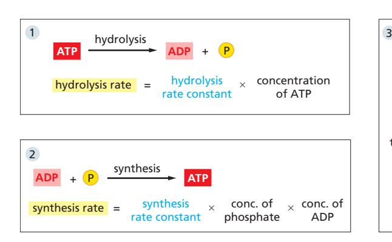

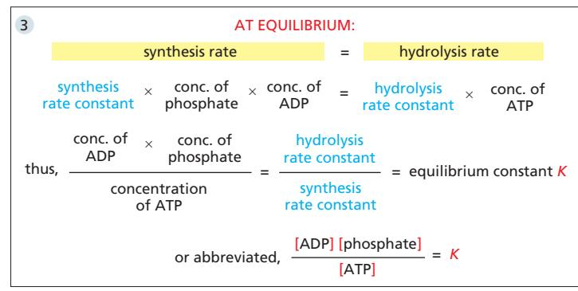

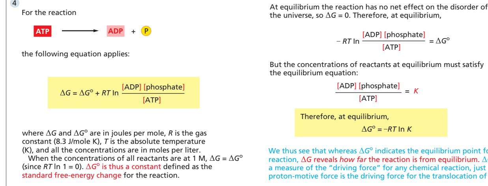

[ATP] We thus see that whereas Δ*G*o indicates the equilibrium point for a reaction, Δ*G* reveals *how far* the reaction is from equilibrium. Δ*G* is a measure of the "driving force" for any chemical reaction, just as the proton-motive force is the driving force for the translocation of protons. Therefore, at equilibrium, Δ*G*o *=* \_*RT* In*K*

[ADP] [phosphate]

[ATP]

(–11 to –13 kcal/mole). This extremely favorable Δ*G* depends on maintaining a high concentration of ATP compared with the concentrations of ADP and phosphate. When ATP, ADP, and phosphate are all present at the same concentration of 1 mole/liter (so-called standard conditions), the Δ*G* for ATP hydrolysis drops to the standard free-energy change (Δ*G*°), which is only –30.5 kJ/mole (–7.3 kcal/mole). At much lower concentrations of ATP relative to ADP and phosphate, Δ*G* becomes zero. At this point, the rate at which ADP and phosphate will join to form ATP will be equal to the rate at which ATP hydrolyzes to form ADP and phosphate. In other words, when Δ*G* = 0, the reaction is at *equilibrium* (see Figure 14–30). MBoC7 m14.29/14.30

It is Δ*G*, not Δ*G*°, that indicates how far a reaction is from equilibrium and determines whether it can drive other reactions. Because the efficient conversion of ADP to ATP in mitochondria maintains such a high concentration of ATP relative to ADP and phosphate, the ATP hydrolysis reaction in cells is kept very far from equilibrium, and Δ*G* is correspondingly very negative. Without this large disequilibrium, ATP hydrolysis could not be used to drive the reactions of the cell. At low ATP concentrations, many essential reactions would become energetically unfavorable, run backward, and the cell would die.

## The ATP Synthase Is a Nanomachine That Produces ATP by Rotary Catalysis

The **ATP synthase** is a finely tuned nanomachine composed of 23 or more separate protein subunits, with a total mass of about 600,000 daltons. The ATP synthase can work both in the forward direction, producing ATP from ADP and phosphate by consuming an electrochemical gradient, or in reverse, generating an electrochemical gradient by ATP hydrolysis. To distinguish it from other enzymes that hydrolyze ATP, it is also called an F1Fo ATP synthase or F-type ATPase.

Figure 14–30 The basic relationship between free-energy changes and equilibrium in the ATP hydrolysis reaction. The rate constants in boxes 1 and 2 are determined from experiments in which product accumulation is measured as a function of time (conc., concentration). The equilibrium constant shown here, *K*, is in units of moles per liter. (See Panel 2–7, pp. 106–107, for a discussion of free energy, and see Figure 3–42 for a discussion of the equilibrium constant.)

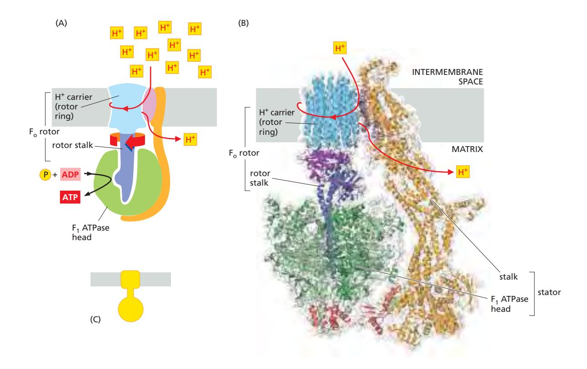

Resembling a turbine, ATP synthase is composed of both a rotor and a stator (**Figure 14–31**). To prevent the catalytic head from rotating, a stalk at the periphery of the complex (the stator stalk) connects the head to stator subunits embedded in the membrane. A second stalk in the center of the assembly (the rotor stalk) is connected to the rotor ring in the membrane, which turns as protons flow through it, driven by the electrochemical gradient across the membrane. As a result, proton flow makes the rotor stalk rotate inside the stationary head, where the catalytic sites that assemble ATP from ADP and phosphate are located. Three α and three β subunits of similar structure alternate to form the head. Each of the three β subunits has a catalytic nucleotide-binding site at the α–β interface. These catalytic sites are all in different conformations, depending on their interaction with the rotor stalk. This stalk acts like a camshaft, the device that opens and closes the valves in a combustion engine. As it rotates within the head, the stalk changes the conformations of the β subunits sequentially. One of the possible conformations of the catalytic sites has high affinity for ADP and phosphate, and as the rotor stalk pushes the binding site into a different conformation, these two substrates are driven to form ATP. As the rotor stalk continues to rotate, the binding site releases ATP, allowing the ATP-producing cycle to restart. In this way, the mechanical force exerted by the central rotor stalk is directly converted into the chemical energy of the ATP phosphate bond. MBoC7 e14.16/14.31

Serving as a proton-driven turbine, the ATP synthase is driven by H+ flow into the matrix to spin at about 8000 revolutions per minute, generating three molecules of ATP per turn. In this way, each ATP synthase can produce roughly 400 molecules of ATP per second.

The closely related ATP synthases of mitochondria, chloroplasts, and bacteria synthesize ATP by harnessing the proton-motive force across a membrane. This powers the rotation of the rotor against the stator in a counterclockwise direction, as seen from the F1 head. The same enzyme complex can also pump protons against their electrochemical gradient by hydrolyzing ATP, which then drives the clockwise rotation of the rotor. The direction of operation depends on the net free-energy change (Δ*G*) for the coupled processes of H+ translocation across the membrane and the synthesis of ATP from ADP and phosphate (**Movie 14.7** and

Figure 14–31 ATP synthase. The three-dimensional structure of the F1Fo ATP synthase determined by x-ray crystallography. Also known as an F-type ATPase, it consists of an Fo part (from "oligomycin-sensitive factor") in the membrane and the large, catalytic F1 head extending into the matrix. (A) Diagram of the enzyme complex showing how its globular head portion *(green)* is kept stationary as proton flow across the membrane drives a rotor *(light blue)* that turns the rotor stalk *(dark blue)* inside the head. (B) In bovine heart mitochondria, the Fo rotor ring in the membrane *(light blue)* has eight *c* subunits. It is attached to the γ subunit of the rotor stalk *(dark blue)* by the ε subunit *(purple)*. The catalytic F1 head consists of a ring of three α and three β subunits *(light and dark green)*, and it directly converts mechanical energy into chemical-bond energy in ATP, as described in the text. The elongated peripheral stalk of the stator *(orange)* is connected to the F1 head by the small δ subunit *(red)* at one end and to the *a* subunit in the membrane at the other. Together with the *c* subunits of the ring rotating past it, the *a* subunit creates a path for protons through the membrane. (C) The symbol for ATP synthase used throughout this book. (B, PDB codes: 2WPD, 2CLY, 2WSS, 2BO5.)

**Movie 14.8**). Measurement of the torque that the ATP synthase can produce by ATP hydrolysis reveals that the ATP synthase is 60 times more powerful than a diesel engine of equal size.

# Proton-driven Turbines Are Ancient and Critical for Energy Conversion

The membrane-embedded rotors of ATP synthases consist of a ring of identical *c* subunits (**Figure 14–32**). Each *c* subunit is a hairpin of two membrane-spanning α helices that contain a proton-binding site defined by a glutamate or aspartate in the middle of the lipid bilayer. The *a* subunit, which is part of the stator (see Figure 14–31), makes two narrow channels at the interface between the rotor and stator, each spanning half of the membrane and converging on the protonbinding site at the middle of the rotor subunit. Protons flow through the two half-channels down their electrochemical gradient from the crista space back into the matrix. The negatively charged glutamate or aspartate side chain in the binding site accepts a proton arriving from the crista space through the first halfchannel, as it rotates past the *a* subunit. The bound proton then rides around in the ring for a full cycle, whereupon it is thought to be displaced by a positively charged arginine in the *a* subunit to escape through the second half-channel into the matrix. This directional proton flow causes the rotor ring to spin against the stator like a proton-driven turbine.

The mitochondrial ATP synthase is of ancient origin: essentially the same enzyme exists in plant chloroplasts and in the plasma membrane of bacteria or archaea. The main difference between them is the number of *c* subunits in the rotor ring. In mammalian mitochondria, the ring has 8 subunits. In yeast mitochondria, the number is 10; in bacteria and archaea, it ranges from 11 to 13; in plant chloroplasts, there are 14; and the rings of some cyanobacteria contain 15 *c* subunits.

The number of *c* subunits in the ring determines how many protons need to pass through this marvelous device to make each molecule of ATP. These subunits can be thought of as cogs in the gear wheels of a bicycle. A high gear, with a small number of cogs in the wheel, is advantageous when the supply of protons is limited, as in mitochondria, but a low gear, with a large number of cogs in the wheel, is preferable when the proton gradient is high. This is the case in chloroplasts and cyanobacteria, where protons produced through the action of sunlight are plentiful. Because each rotation produces three molecules of ATP in the head, the synthesis of one ATP requires around three protons in mitochondria but up to five in photosynthetic organisms—allowing the latter organisms to create a higher ratio of ATP to ADP and thus to maintain a greater Δ*G* for ATP hydrolysis*.*

Even under scenarios where mitochondrial ATP production is not possible or necessary, mitochondria must maintain a proton gradient to power the proper import of essential proteins and metabolites. In such a situation, ATP synthase can also run in reverse as an ATP-powered proton pump that converts the energy of ATP back into a proton gradient across the membrane. Moreover, in many bacteria, the rotor of the ATP synthase in the plasma membrane changes direction routinely, from ATP synthesis mode in aerobic respiration to ATP hydrolysis mode in anaerobic metabolism. In this latter case, ATP hydrolysis serves to maintain the proton gradient across the plasma membrane, which is used to power many other essential cell functions including nutrient transport and the rotation of bacterial flagella. The V-type ATPases that acidify certain cellular organelles are

Figure 14–32 Fo ATP synthase rotor rings. (A) Atomic force microscopy image of ATP synthase rotors from the cyanobacterium *Synechococcus elongatus* in a lipid bilayer. Whereas 8 *c* subunits form the rotor in Figure 14–31, there are 13 *c* subunits in this ring. (B) The x-ray structure of the Fo ring of the ATP synthase from *Spirulina platensis*, another cyanobacterium, shows that this rotor has 15 *c* subunits. In all ATP synthases, the *c* subunits are hairpins of two membrane-spanning α helices (one subunit is highlighted in *gray*). The helices are highly hydrophobic, except for glutamine and glutamate side chains *(yellow)* that create proton-binding sites in the membrane. (A, courtesy of Thomas Meier and Denys Pogoryelov; B, PDB code: 2WIE.)

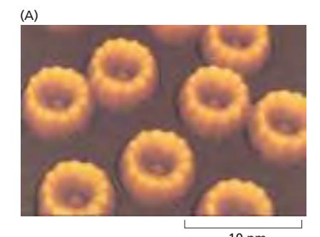

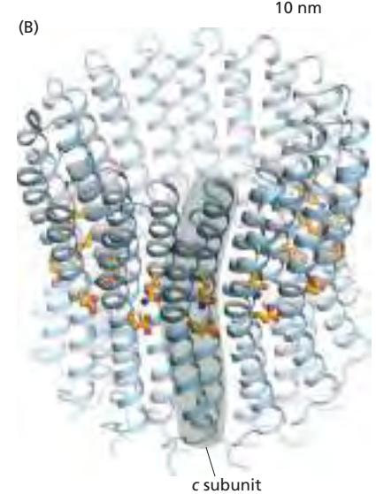

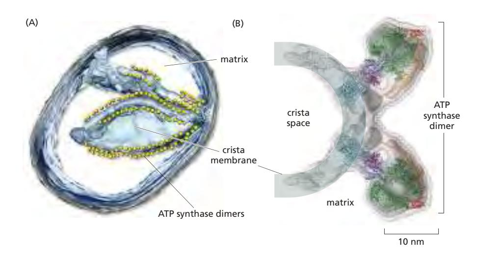

architecturally similar to the F-type ATP synthases, but they normally function in this ATP-dependent proton-pumping mode (see Figure 13–62).

#### Mitochondrial Cristae Help to Make ATP Synthesis Efficient

In the electron microscope, the mitochondrial ATP synthase complexes can be seen to project like lollipops on the matrix side of cristae membranes. Recent studies by cryo-electron microscopy and tomography have shown that this large complex is not distributed randomly in the membrane, but forms long rows of dimers along the cristae ridges (**Figure 14–33**). The dimer rows induce or stabilize these regions of high membrane curvature, which are otherwise energetically unfavorable. Indeed, the formation of ATP synthase dimers and their assembly into rows are required for cristae formation and have far-reaching consequences for cellular fitness. By contrast with bacterial or chloroplast ATP synthases, which do not form dimers, the mitochondrial complex contains additional subunits, located mostly near the membrane end of the stator stalk. If these dimer-specific subunits are mutated in yeast, the ATP synthase in the membrane remains monomeric, the mitochondria have no cristae, cellular respiration drops by half, and the cells grow more slowly. MBoC7 m14.32/14.33

Electron tomography suggests that the respiratory enzyme complexes that pump protons are located in the crista membrane at either side of the dimer rows. Protons pumped into the crista space by these respiratory-chain complexes are thought to diffuse very rapidly along the membrane surface, with the ATP synthase rows creating a proton "sink" at the cristae tips (**Figure 14–34**). *In vitro* studies suggest that the ATP synthase needs a proton gradient of about 2 pH units

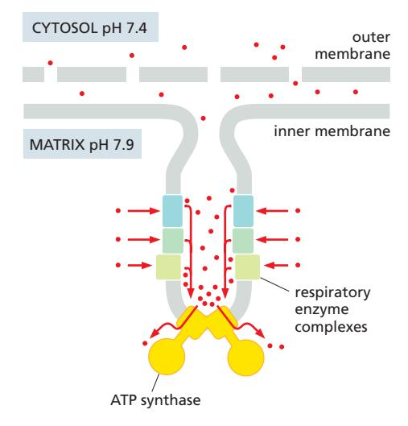

Figure 14–33 Dimers of mitochondrial ATP synthase in cristae membranes.

(A) A three-dimensional map of a small mitochondrion obtained by electron microscope tomography shows that ATP synthases form long paired rows along cristae ridges. The outer membrane is *gray*, and the inner membrane and cristae membranes have been colored *light blue*. Each head of an ATP synthase is indicated by a *yellow sphere*. (B) A three-dimensional map of a mitochondrial ATP synthase dimer in the crista membrane obtained by sub-tomogram averaging, with fitted x-ray structures (Movie 14.9). (A, from K. Davies et al., *Proc. Natl. Acad. Sci. USA* 108:14121–14126, 2011. With permission from the National Academy of Sciences. B, from K. Davies et al., *Proc. Natl. Acad. Sci. USA* 109:13602–13607, 2012. With permission from the National Academy of Sciences.)

Figure 14–34 ATP synthase dimers at cristae ridges and ATP production. At the cristae ridges, the ATP synthases *(yellow)* form a sink for protons *(red)*. The proton pumps of the electron-transport chain *(blue and green)* are located in the membrane regions on either side of the crista. As illustrated, protons tend to be enriched in the crista space and diffuse along the membrane from their source to the proton sink created by the ATP synthase. This allows efficient ATP production despite the small overall H+ gradient between the cytosol and matrix. *Red arrows* show the direction of the proton flow.

to produce ATP at the rate required by the cell, irrespective of the membrane potential. The H+ gradient across the inner mitochondrial membrane is only 0.5–0.6 pH units. The cristae thus seem to work as proton traps that enable the ATP synthase to make efficient use of the protons pumped out of the mitochondrial matrix. As we shall see in the next part of this chapter, this elaborate arrangement of membrane protein complexes is absent in chloroplasts, where the H+ gradient is much larger.

### Special Transport Proteins Move Solutes Through the Inner Membrane

Like all biological membranes, the inner mitochondrial membrane contains numerous specific *transport proteins* that allow particular substances to pass through. More than 50 of these transporters are members of a single protein family, known as mitochondrial carriers. One of the most abundant of these family members is the *ADP/ATP carrier protein* (**Figure 14–35**). This carrier shuttles the ATP produced in the matrix through the inner membrane to the intermembrane space, from where it diffuses through the outer mitochondrial membrane to the cytosol. In exchange, ADP passes from the cytosol into the matrix for recycling into ATP. ATP4– has one more negative charge than ADP3–, and the exchange of ATP and ADP is driven by the electrochemical gradient across the inner membrane, so that the more negatively charged ATP is pushed out of the matrix, and the less negatively charged ADP is pulled in. Indeed, most of these carriers utilize the electrochemical proton gradient to drive directional transport of solutes across the inner membrane (see Chapter 11). In addition to members of the mitochondrial carrier family, all of which share significant sequence and structural similarity, several unrelated proteins transport pyruvate, calcium, serine, and other critical solutes.

In some specialized fat cells, mitochondrial respiration is uncoupled from ATP synthesis by the *uncoupling protein*, another member of the mitochondrial carrier family. In these cells, known as brown or beige fat cells, most of the energy of oxidation is dissipated as heat rather than being converted into ATP. In the inner

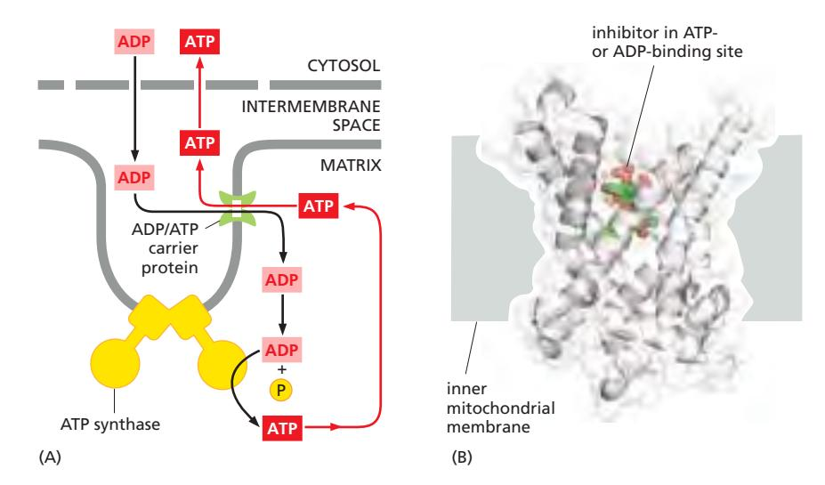

Figure 14–35 The ADP/ATP carrier protein. (A) The ADP/ATP carrier protein is a small membrane protein that carries the ATP produced on the matrix side of the inner membrane to the intermembrane space and carries the ADP that is needed for ATP synthesis into the matrix. (B) In the ADP/ATP carrier, six transmembrane α helices define a cavity that binds either ADP or ATP. In this x-ray structure, the substrate is replaced by a tightly bound inhibitor instead *(colored)*. When ADP binds from outside the inner membrane, it triggers a conformational change and is released into the matrix. In exchange, a molecule of ATP quickly binds to the matrix side of the carrier and is transported to the intermembrane space. From there the ATP diffuses through the outer mitochondrial membrane to the cytoplasm, where it powers the energy-requiring processes in the cell. (PDB code: 1OKC.)

membranes of the large mitochondria in these cells, the uncoupling protein allows protons to move down their electrochemical gradient without passing through ATP synthase. This process is switched on when heat generation is required, causing the cells to oxidize their fat stores at a rapid rate and produce heat rather than ATP. Activating this uncoupling process protects newborn human babies against the cold and has been shown to protect against obesity and diabetes in genetically engineered mice.

#### Chemiosmotic Mechanisms First Arose in Bacteria

Bacteria use enormously diverse energy sources. Some, like animal cells, are aerobic; they synthesize ATP from sugars they oxidize to CO2 and H2O by glycolysis, the citric acid cycle, and a respiratory chain in their plasma membrane that is similar to the one in the inner mitochondrial membrane. Others are strict anaerobes, deriving their energy either from glycolysis alone (by fermentation, see Figure 2–50) or from an electron-transport chain that employs a molecule other than oxygen as the final electron acceptor. The alternative electron acceptor can be a nitrogen compound (nitrate or nitrite), a sulfur compound (sulfate or sulfite), or a carbon compound (fumarate or carbonate), as examples. A series of electron carriers in the plasma membrane that are comparable to those in mitochondrial respiratory chains transfers the electrons to these acceptors.

Despite this diversity, the plasma membrane of the vast majority of bacteria contains an ATP synthase that is very similar to the one in mitochondria. In bacteria that use an electron-transport chain to harvest energy, the electron-transport chain pumps H+ out of the cell and thereby establishes a proton-motive force across the plasma membrane that drives the ATP synthase to make ATP. In other bacteria, the ATP synthase works in reverse, using the ATP produced by glycolysis to pump H+ and establish a proton gradient across the plasma membrane.

Bacteria, including the strict anaerobes, maintain a proton gradient across their plasma membrane that is harnessed to drive many other processes. It can be used to drive a flagellar motor, for example. The gradient is also harnessed to pump Na+ out of the bacterium via an Na+–H+ antiporter that takes the place of the Na+-K+ pump of eukaryotic cells. In addition, the gradient is used for the active inward transport of nutrients, such as most amino acids and many sugars: each nutrient is dragged into the cell along with one or more protons through a specific symporter (**Figure 14–36**; see also Chapter 11). In animal cells, by contrast, most inward transport across the plasma membrane is driven by the Na+ gradient (high Na+ outside, low Na+ inside) that is established by the Na+-K+ pump (see Figure 11–15).

Some unusual bacteria have adapted to live in a very alkaline environment and yet must maintain their cytoplasm at a physiological pH. For these cells, any attempt to generate an electrochemical H+ gradient would be opposed by a large H+ concentration gradient in the wrong direction (H+ higher inside than outside). Presumably for this reason, some of these bacteria substitute Na+ for H+ in all of their chemiosmotic mechanisms. The respiratory chain pumps Na+ out of the cell, the transport systems and flagellar motor are driven by an inward flux of Na+, and an Na+-driven ATP synthase synthesizes ATP. The existence of such bacteria demonstrates a critical point: the principle of chemiosmosis is more fundamental than the proton-motive force on which it is normally based.

As we discuss in the next part of this chapter, an ATP synthase coupled to chemiosmotic processes is also a central feature of plants, where it plays critical roles in both mitochondria and chloroplasts.

#### Summary

*The large amount of free energy released when H*+ *flows back into the matrix from the cristae provides the basis for ATP production on the matrix side of mitochondrial cristae membranes by a remarkable protein machine—the ATP synthase. The ATP synthase functions like a miniature turbine, and it is a reversible device that* 

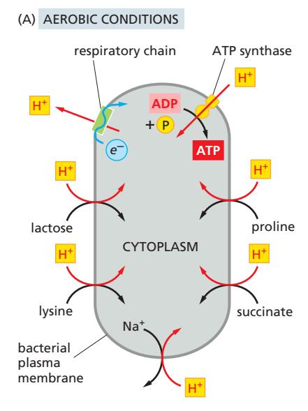

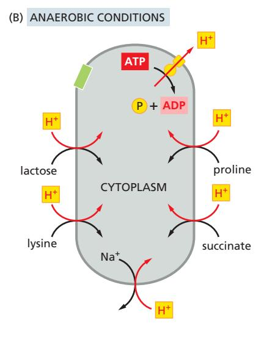

MBoC7 m14.36/14.36 Figure 14–36 Bacteria use a protonmotive force across the plasma membrane to pump nutrients into the cell and expel Na**1**. (A) In an aerobic bacterium, a respiratory chain fed by the oxidation of substrates produces an electrochemical proton gradient across the plasma membrane. This gradient is then harnessed to make ATP and to transport nutrients (proline, succinate, lactose, and lysine) into the cell and to pump Na+ out of the cell. (B) When the same bacterium grows under anaerobic conditions, it derives its ATP from glycolysis. As indicated, the ATP synthase in the plasma membrane then hydrolyzes some of this ATP to establish an electrochemical proton gradient that drives the same transport processes that depend on respiratory chain proton-pumping in A.

*can couple proton flow to either ATP synthesis or ATP hydrolysis. The transmembrane electrochemical gradient that drives ATP production in mitochondria also drives the active transport of selected metabolites across the inner mitochondrial membrane, including an efficient ADP/ATP exchange between the mitochondrion and the cytosol that keeps the cell's ATP pool highly charged. The resulting high concentration of ATP inside the cell makes the free-energy change for ATP hydrolysis extremely favorable, allowing this hydrolysis reaction to drive a large number of energy-requiring processes throughout the cell. The universal presence of an ATP synthase in bacteria, mitochondria, and chloroplasts testifies to the central importance of chemiosmotic mechanisms for life.*

# CHLOROPLASTS AND PHOTOSYNTHESIS

All animals and most microorganisms rely on the continual uptake of large amounts of organic compounds from their environment. These compounds provide both the carbon-rich building blocks for biosynthesis and the metabolic energy for life. It has been proposed that the first organisms on the primitive Earth had access to an abundance of organic compounds produced by geochemical processes, but these would have been used up early in life's evolution. Since then, the vast majority of the organic materials required by living cells has been produced by *photosynthetic organisms*, including plants and photosynthetic bacteria. The core machinery that drives all photosynthesis appears to have evolved more than 3 billion years ago in the ancestors of present-day bacteria; today it provides the major solar energy storage mechanism on Earth.

The most advanced photosynthetic bacteria are the cyanobacteria, which have minimal nutrient requirements. They use electrons from water and the energy of sunlight to convert atmospheric CO2 into organic compounds—a process called *carbon fixation*. In the course of the overall reaction

$$nH_2O + nCO_2 \xrightarrow{\text{Light}} (CH_2O)_n + nO_2$$

they also liberate into the atmosphere the molecular oxygen needed for oxidative phosphorylation. In this way, it is thought that the evolution of an organism similar to modern cyanobacteria from more primitive photosynthetic bacteria eventually made possible the development of the many different aerobic lifeforms that populate Earth today.

#### Chloroplasts Resemble Mitochondria but Have a Separate Thylakoid Compartment

Plants (including algae) developed much later than cyanobacteria, and their photosynthesis occurs in a specialized intracellular organelle—the **chloroplast** (**Figure 14–37**). There is good evidence that the chloroplast evolved after an endosymbiotic event between a eukaryotic cell and a photosynthetic

Figure 14–37 Chloroplasts in a plant cell. (A) Schematic cross section through the leaf of a green plant. (B) Light microscopy of a plant leaf cell—here, a mesophyll cell from *Zinnia elegans*—shows chloroplasts as bright green bodies, measuring several micrometers across, in the transparent cell interior. (C) An electron micrograph of a thin, stained section through a wheat leaf cell shows a thin rim of cytoplasm containing chloroplasts, the nucleus, and mitochondria—surrounding a large, water-filled vacuole. (D) At higher magnification, electron microscopy reveals the chloroplast envelope membrane and the thylakoid membrane within the chloroplast that is highly folded into grana stacks (Movie 14.10 and Movie 14.11). (B, courtesy of Preeti Dahiya; C and D, courtesy of K. Plaskitt.)

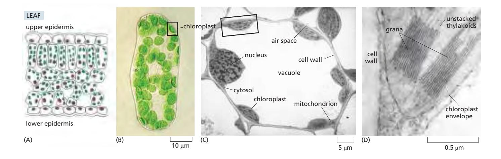

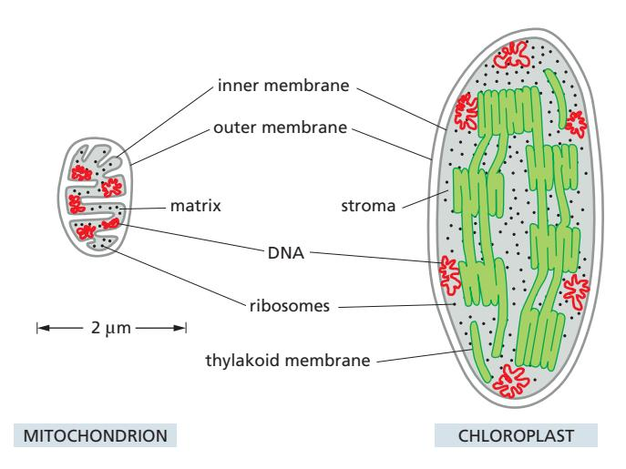

Figure 14–38 A mitochondrion and chloroplast compared. Chloroplasts are generally larger than mitochondria. In addition to an outer and inner envelope membrane, they contain the thylakoid membrane with its internal thylakoid lumen. The chloroplast thylakoid membrane, which is the site of solar energy conversion in plants and algae, corresponds to the mitochondrial cristae, which are the sites of energy conversion by cellular respiration. Unlike the crista membrane, which is continuous with the inner mitochondrial membrane at cristae junctions, the thylakoid membrane is not connected to the inner chloroplast membrane at any point.

MBoC7 m14.38/14.38 cyanobacteria-like organism. Chloroplasts use chemiosmotic mechanisms to carry out their energy interconversions in much the same way that mitochondria do. Although much larger than mitochondria, they are organized on the same principles. They have a highly permeable outer membrane; a much less permeable inner membrane, in which membrane transport proteins are embedded; and a narrow intermembrane space in between. Together, these two membranes form the chloroplast envelope (Figure 14–37D). The inner chloroplast membrane surrounds a large space called the **stroma**, which is analogous to the mitochondrial matrix and to the bacterial cytoplasm. The stroma contains many metabolic enzymes, and, as for the mitochondrial matrix, it is the place where ATP is made by the heads of ATP synthase protein machines. Like the mitochondrion, the chloroplast has its own genome and genetic system. The stroma therefore also contains a special set of ribosomes, RNAs, and the chloroplast DNA.

An important difference between the organization of mitochondria and chloroplasts is highlighted in **Figure 14–38**. The inner membrane of the chloroplast is not folded into cristae and does not contain electron-transport chains. Instead, the electron-transport chains, photosynthetic light-capturing systems, and ATP synthase are all contained in the **thylakoid membrane**, a separate, distinct membrane that forms a set of flattened, disc-like sacs, the *thylakoids*. The thylakoid membrane is highly folded into numerous local stacks of flattened vesicles called *grana*, interconnected by nonstacked thylakoids. The lumen of each thylakoid is connected with the lumen of other thylakoids, thereby defining a third internal compartment called the *thylakoid lumen*. This space represents a separate compartment in each chloroplast that is not connected to either the intermembrane space or the stroma. In addition to serving an analogous function, the thylakoid membrane has other similarities to the mitochondrial crista membrane, including a very high protein density and a unique lipid composition.

### Chloroplasts Capture Energy from Sunlight and Use It to Fix Carbon

We can group the reactions that occur during photosynthesis in chloroplasts into two broad categories:

1. The **photosynthetic electron-transfer reactions** (also called the "light reactions") occur in two large protein complexes, called *reaction centers*, embedded in the thylakoid membrane (**Figure 14–39**). A photon (a quantum of light) knocks an electron out of the green pigment molecule *chlorophyll* in the first reaction center, creating a positively charged chlorophyll ion. This high-energy electron then moves along an electron-transport chain and through a second reaction center in much the same way that an electron moves along the respiratory chain in mitochondria. During the electron-transport process, part of the energy released by electron transfer

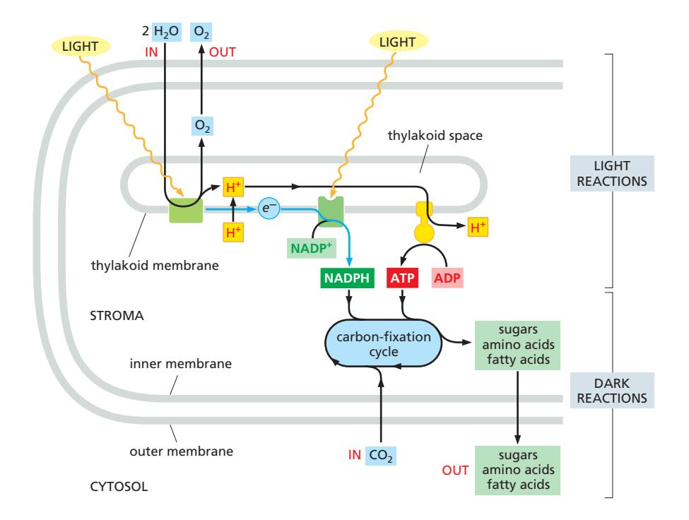

is harnessed to pump H+ ions (protons) across the thylakoid membrane. The resulting electrochemical proton gradient is then used by ATP synthase to drive the synthesis of ATP in the stroma. As the final step in this series of reactions, electrons are loaded (together with H+) onto NADP+, converting it to the energy-rich NADPH molecule. Because the positively charged chlorophyll in the first reaction center quickly regains its electrons from water (H2O), H+ and O2 gas are produced as by-products. All of these reactions are confined to the chloroplast. MBoC7 m14.39/14.39

2. The **carbon-fixation reactions** (also called the "dark reactions") do not require sunlight. Here the ATP and NADPH generated by the above light reactions serve as the source of energy and reducing power, respectively, to drive the conversion of CO2 to carbohydrate. These carbon-fixation reactions occur in the chloroplast stroma, where they generate the three-carbon sugar *glyceraldehyde 3-phosphate*. This simple sugar is an intermediate in the glycolysis and gluconeogenesis pathways. Upon export to the cytosol, it is used to produce sucrose and many other organic metabolites in the leaves of the plant. The sucrose is then exported to meet the metabolic needs of the nonphotosynthetic plant tissues, serving as a source of both carbon skeletons and energy for growth.

Thus, the formation of ATP, NADPH, and O2 (which requires light energy directly) and the conversion of CO2 to carbohydrate (which requires light energy only indirectly) are separate processes (Figure 14–39). But, they are linked by elaborate feedback mechanisms that allow a plant to manufacture sugars only when it is appropriate to do so. Several of the chloroplast enzymes required for carbon fixation, for example, are inactive in the dark and reactivated by lightstimulated electron-transport processes.

## Carbon Fixation Uses ATP and NADPH to Convert CO2 into Sugars

We have seen earlier in this chapter how mitochondria in eukaryotic cells produce ATP by using the large amount of free energy released when carbohydrates are oxidized to CO2 and H2O. The reverse reaction, in which plants make carbohydrate from CO2 and H2O, takes place in the chloroplast stroma. The large amounts

#### Figure 14–39 A summary of the energyconverting metabolism in chloroplasts.

Chloroplasts require only water and carbon dioxide as inputs for their lightdriven photosynthesis reactions, and they produce the nutrients for most other organisms on the planet. Each oxidation of two water molecules by a photochemical reaction center in the thylakoid membrane produces one molecule of oxygen, which is released into the atmosphere. At the same time, protons are concentrated in the thylakoid space. These protons create a large electrochemical gradient across the thylakoid membrane, which is utilized by the chloroplast ATP synthase to produce ATP from ADP and phosphate. The electrons withdrawn from water are transferred to a second type of photochemical reaction center to produce NADPH from NADP+. As indicated, the NADPH and ATP are fed into the *carbonfixation cycle* to reduce carbon dioxide, thereby producing the precursors for sugars, amino acids, and fatty acids. The CO2 that is taken up from the atmosphere here is the source of the carbon atoms for most organic molecules on Earth.

In a plant cell, a variety of metabolites produced in the chloroplast are exported to the cytoplasm for biosyntheses. Some of the sugar produced is stored in the form of starch granules in the chloroplast, but the rest is transported throughout the plant as sucrose or converted to starch in special storage tissues. These storage tissues serve as a major food source for animals.

$$\begin{array}{c} CH_2O \ P \\ \\ CH_2O \ P \\ \\ C=O \\ \\ H-C-OH \\ \\ H-C-OH \\ \\ CH_2O \ P \\ \end{array}$$

Figure 14–40 The initial reaction in carbon fixation. This carboxylation reaction allows one molecule each of carbon dioxide and water to be incorporated into organic carbon molecules. It is catalyzed in the chloroplast stroma by the abundant enzyme ribulose 1,5-bisphosphate carboxylase/oxygenase, or Rubisco. As indicated, the product is two molecules of 3-phosphoglycerate.

of ATP and NADPH produced by the photosynthetic electron-transfer reactions are required to drive this energetically unfavorable reaction. MBoC7 m14.40/14.40

**Figure 14–40** illustrates the central reaction of carbon fixation, in which an atom of inorganic carbon is converted to organic carbon: CO2 from the atmosphere combines with the five-carbon compound ribulose 1,5-bisphosphate plus water to yield two molecules of the three-carbon compound 3-phosphoglycerate. This carboxylation reaction is catalyzed in the chloroplast stroma by a large enzyme called *ribulose 1,5-bisphosphate carboxylase/oxygenase*, or *Rubisco.* Because the reaction is so slow (each Rubisco molecule turns over only about 3 molecules of substrate per second, compared to 1000 molecules per second for a typical enzyme), a very large number of enzyme molecules are needed. Rubisco constitutes up to 50% of the chloroplast protein mass, and it is one of the most abundant proteins on Earth. Of great importance to the global environment, Rubisco also helps to reduce the amount of the greenhouse gas CO2 in the atmosphere.

Although the production of carbohydrates from CO2 and H2O is energetically unfavorable, the fixation of CO2 catalyzed by Rubisco is an energetically favorable reaction. Carbon fixation is energetically favorable because a continuous supply of the energy-rich ribulose 1,5-bisphosphate is fed into the process via the carbon-fixation cycle described below. This compound is consumed by the addition of CO2, and it must be replenished. As we describe next, the energy and reducing power needed to regenerate ribulose 1,5-bisphosphate come from the ATP and NADPH produced by the photosynthetic light reactions.

The elaborate series of reactions in which CO2 combines with ribulose 1,5-bisphosphate to produce a simple sugar—a portion of which is used to regenerate ribulose 1,5-bisphosphate—forms a cycle, called the *carbon-fixation cycle*, or the Calvin–Benson–Bassham cycle (**Figure 14–41**). This cycle was one of the first metabolic pathways to be defined by applying radioisotopes as tracers in biochemistry. As indicated, each turn of the cycle converts six molecules of 3-phosphoglycerate to three molecules of ribulose 1,5-bisphosphate plus one molecule of glyceraldehyde 3-phosphate. The net result of each turn of the cycle is that 9 ATP and 6 NADPH molecules are used to power the conversion of 3 CO2 molecules into one molecule of glyceraldehyde 3-phosphate.

*Glyceraldehyde 3-phosphate*, the three-carbon sugar produced by the cycle, occupies a pivotal point in carbohydrate biochemistry as an intermediate in glycolysis and gluconeogenesis, enabling it to serve as the starting material for the synthesis of many other sugars and all of the other organic molecules that form the plant.

# Carbon Fixation in Some Plants Is Compartmentalized to Facilitate Growth at Low CO2 Concentrations

Although ribulose 1,5-bisphosphate carboxylase/oxygenase preferentially adds CO2 to ribulose 1,5-bisphosphate, it can also use O2 as a substrate in place of CO2, and if the concentration of CO2 is low, it will add O2 to ribulose 1,5-bisphosphate

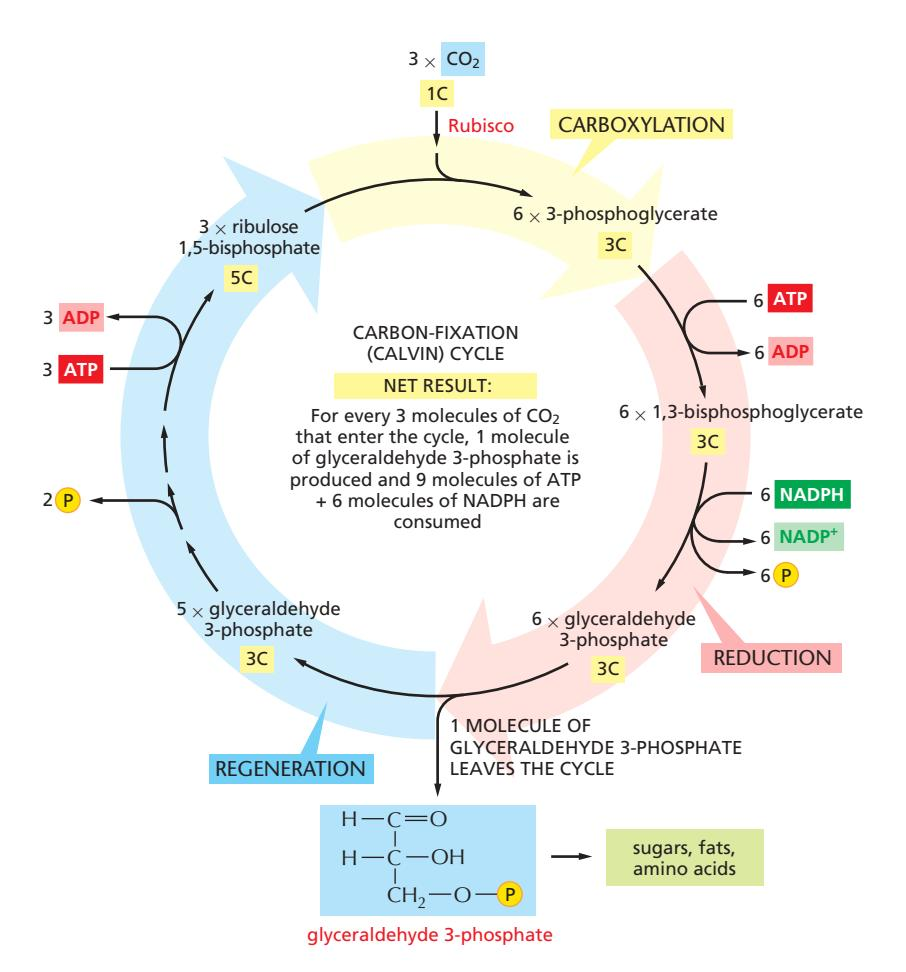

Figure 14–41 The Calvin–Benson–Bassham cycle (Calvin cycle) for carbon fixation. This central metabolic pathway allows organic molecules to be produced from CO2 and H2O. In the first stage of the cycle (carboxylation), CO2 is added to ribulose 1,5-bisphosphate, as shown in Figure 14–40. In the second stage (reduction), ATP and NADPH are consumed to produce glyceraldehyde 3-phosphate molecules. In the final stage (regeneration), some of the glyceraldehyde 3-phosphate produced is used to regenerate ribulose 1,5-bisphosphate. Other glyceraldehyde 3-phosphate molecules are either converted to starch and fat in the chloroplast stroma or transported out of the chloroplast into the cytosol. The number of carbon atoms in each type of molecule is indicated in *yellow*. There are many intermediates between glyceraldehyde 3-phosphate and ribulose 1,5-bisphosphate, but they have been omitted here for clarity. The entry of water into the cycle is also not shown (but see Figure 14–40).

instead (see Figure 14–40). This is the first step in a pathway called **photorespiration**, whose ultimate effect is to use up O2 and liberate CO2 without the production of useful energy stores. In many plants, about one-third of the CO2 fixed is lost again as CO2 because of photorespiration.

Photorespiration can be a serious liability for plants in hot, dry conditions, which cause them to close their stomata (the gas-exchange pores in their leaves, each of which is called a stoma) to avoid excessive water loss. This in turn causes the CO2 levels in the leaf to fall precipitously, thereby favoring photorespiration. A special adaptation, however, occurs in the leaves of many plants, such as corn and sugarcane, that grow in hot, dry environments. In these plants, the carbonfixation cycle occurs only in the chloroplasts of specialized *bundle-sheath cells*, which contain all of the plant's ribulose 1,5-bisphosphate carboxylase/oxygenase. These cells are protected from the air and are surrounded by a specialized layer of *mesophyll cells* that use the energy harvested by their chloroplasts to "pump" CO2 into the bundle-sheath cells. This supplies the ribulose 1,5-bisphosphate carboxylase/oxygenase with a high concentration of CO2, thereby greatly reducing photorespiration.

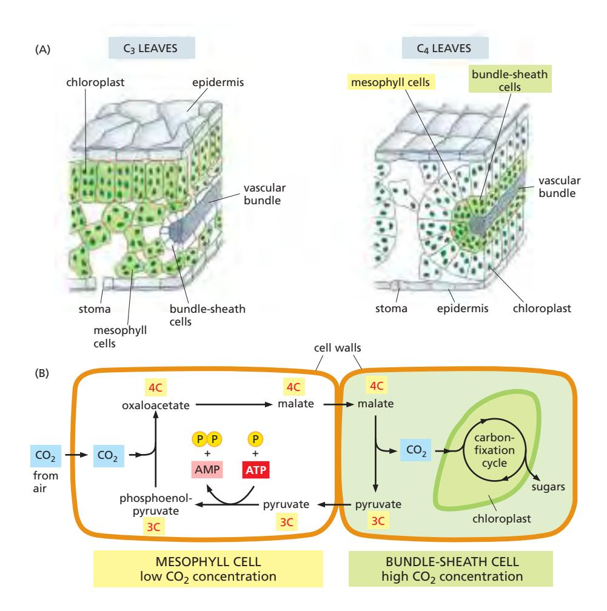

Figure 14–42 The CO2 pumping in C4 plants. (A) Comparative leaf anatomy in a C3 plant and a C4 plant. The cells with *green* cytosol in the leaf interior contain chloroplasts that perform the normal carbon-fixation cycle. In C4 plants, the mesophyll cells are specialized for CO2 pumping rather than for carbon fixation, and they thereby create a high ratio of CO2 to O2 in the bundle-sheath cells, which are the only cells in these plants where the carbon-fixation cycle occurs. The vascular bundles carry the sucrose made in the leaf to other tissues. (B) How carbon dioxide is concentrated in bundle-sheath cells by the harnessing of ATP energy in mesophyll cells.

The CO2 pump mechanism depends on a reaction cycle that begins in the cytosol of the mesophyll cells. An initial CO2-fixation step is catalyzed by an enzyme that binds CO2 (as bicarbonate) and combines it with an activated three-carbon molecule (phosphoenolpyruvate) to produce a four-carbon molecule. The four-carbon molecule diffuses into the bundle-sheath cells, where it is broken down to release the CO2 and generate a molecule with three carbons. The pumping cycle is completed when this three-carbon molecule (pyruvate) is returned to the mesophyll cells and converted back to its original activated form. Because the CO2 is initially captured by converting it into a compound containing four carbons, the CO2-pumping plants are called *C4 plants*. All other plants are called *C3 plants* because they capture CO2 into the three-carbon compound 3-phosphoglycerate (**Figure 14–42**).

As with any vectorial transport process, pumping CO2 into the bundle-sheath cells in C4 plants costs energy (ATP is hydrolyzed; see Figure 14–42B). In hot, dry environments, however, this cost can be much less than the energy lost by photorespiration in C3 plants, so C4 plants have a potential advantage. Moreover, because C4 plants can perform photosynthesis at a lower concentration of CO2 inside the leaf, they need to open their stomata less often and therefore can fix about twice as much net carbon as C3 plants per unit of water lost. This type of carbon fixation has evolved independently in several different plant lineages. Although the vast majority of plant species are C3 plants, C4 plants such as corn and sugarcane are much more effective at converting sunlight energy into biomass than C3 plants such as cereal grains. They are therefore of special importance in world agriculture. MBoC7 n14.410/14.42

Many algae have a different adaptation to manage the challenge of limited CO2 concentration, which is often a problem in the aquatic environment in which algae grow. The pyrenoid is a complex structure that contains a biomolecular

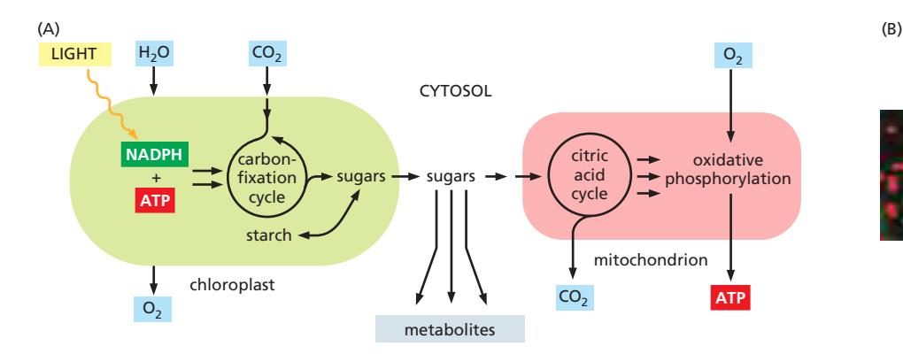

10 µm

condensate highly enriched in Rubisco along with a scaffold protein (see Figure 12–8). This condensate is interwoven with membrane tubules that contain carbonic anhydrase, an enzyme that converts the bicarbonate ions (HCO3 –) dissolved in water into CO2. The pyrenoid therefore provides CO2 for Rubisco, thereby favoring carbon fixation over deleterious photorespiration.

# The Sugars Generated by Carbon Fixation Can Be Stored as Starch or Consumed to Produce ATP

The glyceraldehyde 3-phosphate generated by carbon fixation in the chloroplast stroma can be used in a number of ways, depending on the needs of the plant. During periods of excess photosynthetic activity, much of it is converted to glucose and stored as *starch* in the chloroplast stroma. Like glycogen in animal cells, starch is a storage polymer of glucose that is found as large granules. Starch forms an important part of the diet of all animals that eat plants. Other glyceraldehyde 3-phosphate molecules are converted to different important biosynthetic or storage molecules. For example, fat, which accumulates as triglycerides and other storage esters in fat droplets, serves as an additional energy reserve. MBoC7 m14.42/14.43

At night, stored starch and fat can be broken down to glucose and fatty acids, which are exported to the cytosol to help support the metabolic needs of the plant. Some of the exported sugar enters the glycolytic pathway (see Figure 2–46), where it is converted to pyruvate. Both that pyruvate and the fatty acids can enter the plant cell mitochondria and be catabolized to acetyl CoA that is fed into the citric acid cycle, ultimately leading to the efficient production of ATP by oxidative phosphorylation (**Figure 14–43**). In this way, the metabolic transitions of the light/dark cycle of the plant are reminiscent of the fasting/feeding cycles typical of many animals.

In the cytosol, glucose exported from chloroplasts after starch hydrolysis or generated from gluconeogenesis from glyceraldehyde 3-phosphate can also be converted into the disaccharide *sucrose*. Sucrose is the major form in which sugar is transported between the cells of a plant. Just as glucose is transported in the blood of animals, so sucrose is exported from the leaves to provide carbohydrate to the rest of the plant.

#### The Thylakoid Membranes of Chloroplasts Contain the Protein Complexes Required for Photosynthesis and ATP Generation

We next need to explain how the large amounts of ATP and NADPH required for carbon fixation are generated in the chloroplast. Chloroplasts make use of chemiosmotic energy conversion in much the same way as mitochondria. As we saw in Figure 14–38, chloroplasts and mitochondria are organized on the same principles, although the chloroplast contains a separate thylakoid membrane system in which its chemiosmotic mechanisms occur. The thylakoid membranes contain two large membrane protein complexes, called *photosystems*, which endow photosynthetic organisms with the ability to capture and convert solar energy into usable forms of energy. Two other protein complexes in the thylakoid membrane work together with the photosystems to catalyze photophosphorylation—the

Figure 14–43 How chloroplasts and mitochondria collaborate to supply cells with both metabolites and ATP. (A) The inner chloroplast membrane is impermeable to the ATP and NADPH that are produced in the stroma during the

light reactions of photosynthesis. These molecules are instead funneled into the carbon-fixation cycle, where they are used to make sugars. The resulting sugars and their metabolites are either stored within the chloroplast—in the form of starch or fat—or exported to the rest of the plant cell. There, they can enter the energy-generating pathway that ends in ATP synthesis linked to oxidative phosphorylation inside the mitochondrion. Unlike the chloroplast, mitochondrial membranes contain a specific transporter that makes them permeable to ATP (see Figure 14–35). Note that the O2 released to the atmosphere by photosynthesis in chloroplasts is used for oxidative phosphorylation in mitochondria; similarly, the CO2 released by the citric acid cycle in mitochondria is used for carbon fixation in chloroplasts. (B) In a leaf, mitochondria *(red)* tend to cluster close to the chloroplasts *(green)*, as seen in this light micrograph. (B, courtesy of Olivier Grandjean.)

generation of ATP with sunlight. These have mitochondrial equivalents: a hemecontaining cytochrome *b*6-*f* complex, which both functionally and structurally resembles cytochrome *c* reductase (Complex III) in the respiratory chain; and a chloroplast ATP synthase, which closely resembles the mitochondrial ATP synthase and works in the same way.

#### Chlorophyll–Protein Complexes Can Transfer Either Excitation Energy or Electrons

The photosystems in the thylakoid membrane are multiprotein assemblies of a complexity comparable to that of the protein complexes in the mitochondrial electron-transport chain. They contain large numbers of specifically bound chlorophyll molecules, in addition to cofactors that will be familiar from our discussion of mitochondria (heme, iron–sulfur clusters, and quinones). **Chlorophyll**, the green pigment of photosynthetic organisms, has a long hydrophobic tail that makes it behave like a lipid, plus a porphyrin ring that has an extensive system of delocalized electrons in conjugated double bonds and a central Mg atom (structurally analogous to heme and its central Fe atom; **Figure 14–44**).

When a chlorophyll molecule absorbs a quantum of sunlight (a photon), the energy of the photon causes one of these electrons to move from a low-energy orbital to another orbital of higher energy. A photon of red light (∼600–700 nm wavelength) moves an electron to a low-level excited state. A higher-energy photon of blue light (∼400–500 nm) kicks an electron to a higher-energy excited state, which rapidly decays to the low-level excited state by converting the extra energy into heat (molecular motion). The excited electrons in the low-energy state tend to return to their ground state in one of three ways:

- 1. By converting the extra energy into heat (molecular motion) or to some combination of heat and light of a longer wavelength (fluorescence); this is what usually happens when light is absorbed by an isolated chlorophyll molecule in solution.
- 2. By transferring the energy—but not the electron—directly to a neighboring chlorophyll molecule by a process called *resonance energy transfer*.
- 3. By transferring the excited electron with its negative charge to another nearby molecule, an *electron acceptor*, after which the positively charged chlorophyll returns to its original state by taking up an electron from some other molecule, an *electron donor*.

Only the latter two mechanisms are useful for the capturing of energy from sunlight, and they are enabled by the chlorophylls being precisely positioned within a *chlorophyll–protein complex*. The protein coordinates the central Mg atom in the chlorophyll porphyrin, most often through a histidine side chain located in the hydrophobic interior of a membrane, causing each of the chlorophylls in the protein complex to be held at exactly defined distances and orientations. The flow of excitation energy or electrons then depends on both the precise spatial arrangement and the local protein environment of the protein-bound chlorophylls.

When excited by a photon, most protein-bound chlorophylls simply transmit the absorbed energy to another nearby chlorophyll by the process of resonance energy transfer. However, in a few specially positioned chlorophylls, the energy difference between the ground state and the excited state is just right for the photon to trigger a light-induced chemical reaction. The special state of such chlorophyll molecules derives from their close interaction with a second chlorophyll molecule in the same chlorophyll–protein complex. Together, these two chlorophylls form a *special pair*.

The photosynthetic electron-transfer process starts when a photon of suitable energy ionizes a chlorophyll molecule in such a special pair, dissociating it into an electron and a positively charged chlorophyll ion. The energized electron is then passed rapidly to a quinone in the same protein complex, preventing its unproductive reassociation with the chlorophyll ion. This light-induced transfer of

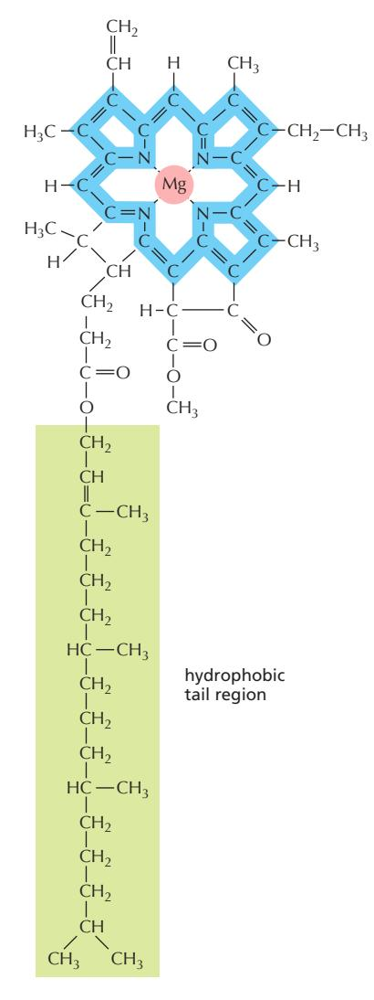

Figure 14–44 The structure of chlorophyll *a*. A magnesium atom is held in a porphyrin ring, which is related to the porphyrin ring that binds iron in heme (see Figure 14–15). Electrons are delocalized over the bonds shaded in *blue*, and the hydrophobic tail is shaded in *green*.

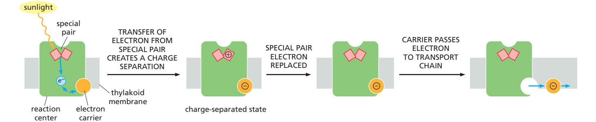

Figure 14–45 A general scheme for the charge-separation step in a photosynthetic reaction center. In a reaction center, light energy is harnessed to transfer electrons from chlorophyll to mobile electron carriers in which the electrons are held in a high-energy state. Light energy is thereby converted to chemical energy. The process starts when a photon absorbed by the special pair of chlorophylls in the reaction center knocks an electron out of one of the chlorophylls. This electron is rapidly taken up by a mobile electron carrier *(orange)* bound at the opposite membrane surface, because a set of intermediary carriers embedded in the reaction center (not shown) provides the path from the special pair to this carrier. The physical distance between the positively charged chlorophyll ion and the negatively charged electron carrier stabilizes the chargeseparated state for a short time, during which the chlorophyll ion, a strong oxidant, withdraws an electron from a suitable compound (for example, from water, an event we will discuss in detail shortly). The mobile electron carrier then diffuses away from the reaction center as a strong electron donor that will transfer its electron to an electron-transport chain.

an electron from a chlorophyll to a mobile electron carrier is the central *chargeseparation* step in photosynthesis, in which a chlorophyll becomes positively charged and an electron carrier becomes negatively charged (**Figure 14–45**). A positively charged chlorophyll ion is a very strong oxidant that is able to withdraw an electron from a low-energy substrate; in the first step of oxygenic photosynthesis, this low-energy substrate is water.

Upon transfer to a mobile carrier in the electron-transport chain, the electron has been stabilized as part of a strong electron donor and made available for subsequent reactions. These subsequent reactions require more time to complete, and we shall see how they cause the production of light-generated energy-rich compounds.

### A Photosystem Contains Chlorophylls in Antennae and a Reaction Center

There are two distinct types of chlorophyll–protein complexes in the photosynthetic membrane. A *photochemical reaction center* contains the special pair of chlorophylls just described. The other type engages exclusively in light absorption and resonance energy transfer and contains *antenna chlorophylls*. Together, the two types of chlorophyll–protein complexes help to create a **photosystem** (**Figure 14–46**).

Most of the chlorophylls in a photosystem are present in *light-harvesting complexes*, whose role is to efficiently collect the energy of photons for photosynthesis.

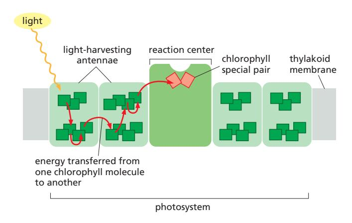

Figure 14–46 A photosystem. Each photosystem consists of a reaction center plus a large number of light-harvesting protein-bound chlorophylls (more than depicted in this figure). The solar energy for photosynthesis is collected by the antenna chlorophylls, which account for most of the chlorophyll in a plant cell. The energy hops randomly by resonance energy transfer *(red arrows)* from one chlorophyll molecule to another, until it reaches the reaction center complex, where it ionizes a chlorophyll in the special pair. The chlorophyll special pair holds its electrons at a lower energy than that of the electrons of the antenna chlorophylls, causing the energy transferred to it to become trapped there. Note that it is only energy, not electrons, that moves from one antenna chlorophyll molecule to another (Movie 14.12).

Without these antennae, the process would be slow and inefficient, inasmuch as each reaction-center chlorophyll would absorb only about one light quantum per second, even in broad daylight, whereas hundreds per second are needed for effective photosynthesis. When light excites an antenna chlorophyll molecule, the energy passes rapidly from one protein-bound chlorophyll to another by resonance energy transfer until it reaches the special pair in the reaction center.

Additional light-harvesting complexes, or LHCs, serve an accessory antenna role by collecting photon energy and transferring it to the photosystem. In addition to many chlorophyll molecules, an LHC contains orange carotenoid pigments. The carotenoids collect light of a different wavelength than that absorbed by chlorophylls, helping to make the antennae more efficient. They also have an important protective role in preventing the formation of harmful oxygen radicals in the photosynthetic membrane.

#### The Thylakoid Membrane Contains Two Different Photosystems Working in Series

As just described, the excitation energy collected by the antenna chlorophylls is delivered to the special pair in the **photochemical reaction center**. The reaction center is a transmembrane chlorophyll–protein complex that lies at the heart of photosynthesis. It harbors the special pair of chlorophyll molecules, which acts as an irreversible trap for excitation energy (see Figure 14–46).

Chloroplasts contain two functionally different although structurally related photosystems, each of which feeds electrons generated by the action of sunlight into an electron-transfer chain. In the chloroplast thylakoid membrane, *photosystem I* is confined to the unstacked stroma thylakoids, while the stacked grana thylakoids contain *photosystem II*. The two photosystems were named in order of their discovery, not of their actions in the photosynthetic pathway, and electrons are first activated in photosystem II before being transferred to photosystem I (**Figure 14–47**). The path of the electron through the two photosystems can be

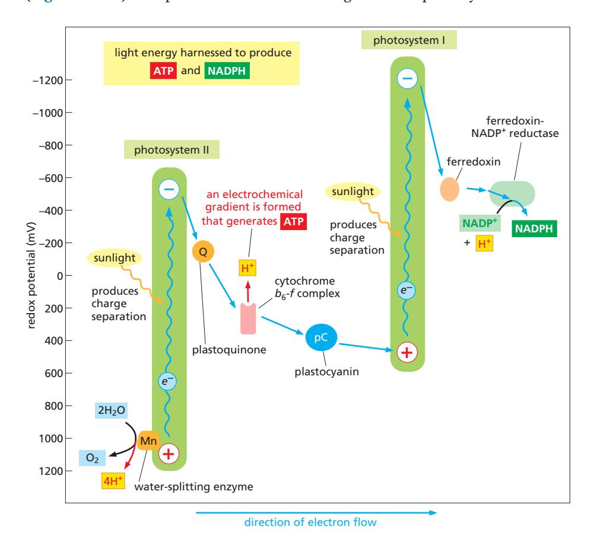

Figure 14–47 Changes in redox potential during photosynthesis. The redox potential for each molecule is indicated by its position along the vertical axis. Using excitation energy from sunlight, photosystem II passes electrons derived from water to photosystem I, which also uses sunlight energy to pass them to NADP+ through ferredoxin-NADP+ reductase. The net electron flow through the two photosystems is from water to NADP+, and it produces NADPH as well as an electrochemical proton gradient. This proton gradient is used by the ATP synthase to produce ATP. Details in this figure will be explained in the subsequent text. Note that, for historical reasons, the two photosystems were named opposite to the order in which they act, with photosystem II passing its electrons to photosystem I.

described as a Z-like trajectory and is known as the *Z scheme*. In the Z scheme, the reaction center of *photosystem II* first withdraws an electron from water. The electron passes via an electron-transport chain (composed of the electron carrier plastoquinone, the cytochrome *b*6*-f* complex, and the protein plastocyanin) to *photosystem I*, which propels the electron across the membrane in a second light-driven charge-separation reaction that leads to NADPH production. In the process, an electrochemical proton gradient is established across the thylakoid membrane that is used to fuel ATP production.

The Z scheme is necessary to bridge the very large energy gap between water and NADPH (Figure 14–47). A single quantum of visible light does not contain enough energy both to withdraw electrons from water, which holds on to its electrons very tightly (redox potential +820 mV) and therefore is a very poor electron donor, and to force them on to NADP+, which is a very poor electron acceptor (redox potential –320 mV). The Z scheme first evolved in cyanobacteria to enable them to use water as a universally available electron source. Other, simpler photosynthetic bacteria have only one photosystem. As we shall see, they cannot use water as an electron source and must rely on other, more energy-rich substrates instead, from which electrons are more readily withdrawn. The ability to extract electrons from water (and thereby to produce molecular oxygen) was acquired by plants when their ancestors took up the endosymbiotic cyanobacteria that later evolved into chloroplasts (see Figure 1–29).

# Photosystem II Uses a Manganese Cluster to Withdraw Electrons from Water

In biology, only photosystem II is able to withdraw electrons from water and to generate molecular oxygen as a by-product. This remarkable specialization of photosystem II is conferred by the unique properties of one of the two chlorophyll molecules of its special pair and by a *manganese cluster* linked to the protein. The special pair of chlorophyll molecules plus the manganese cluster form the catalytic core of the photosystem II reaction center, whose mechanism is outlined in **Figure 14–48**.

Water is an inexhaustible source of electrons, but it is also extremely stable; therefore, a large amount of energy is required to make it part with its electrons. The only compound in living organisms that is able to achieve this feat, after its ionization by light, is the chlorophyll special pair called P680 (P680/P680+ redox potential = +1270 mV). The reaction 2H2O + 4 photons → 4H+ + 4*e*– + O2 is catalyzed by its adjacent manganese cluster. Except for the electrons, the intermediates remain firmly attached to the manganese cluster until two water molecules have been fully oxidized to O2, thus ensuring that no dangerous oxygen radicals are released as the reaction proceeds. The four protons released by the two water molecules are discharged to the thylakoid space, contributing to the proton gradient across the thylakoid membrane (pH lower in the thylakoid

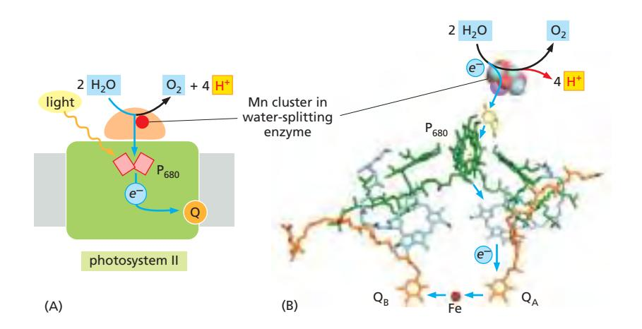

Figure 14–48 The conversion of light energy to chemical energy in the photosystem II complex. (A) Schematic diagram of the photosystem II reaction center, whose special pair of chlorophyll molecules is designated as P680 on the basis of the wavelength of its absorbance maximum (680 nm). (B) Cofactors and pigments at the core of the reaction center. Shown are the manganese (Mn) cluster, the tyrosine side chain that connects it to the P680 special pair, four chlorophylls *(green)*, two pheophytins *(light blue)*, two plastoquinones *(orange),* and an iron atom *(red)*. The path of electrons is shown by *blue arrows*. In the manganese cluster, four manganese atoms *(light blue)*, one calcium atom *(purple)*, and five oxygen atoms *(red)* work together to catalyze the oxidation of water. The water-splitting reaction occurs in four successive steps, each requiring the energy of one photon. Each photon turns a P680 reaction-center chlorophyll into a positively charged chlorophyll ion. Through an ionized tyrosine side chain *(yellow)*, this chlorophyll ion pulls an electron away from a water molecule bound at the manganese cluster. In this way, a total of four electrons are withdrawn from two water molecules to generate molecular oxygen, which is released into the atmosphere (see also Figure 4–49).

Each electron that is energized by light passes from the special pair to an electrontransfer chain inside the complex, along the indicated path to the permanently bound plastoquinone QA and then to plastoquinone QB. Once QB has picked up two electrons (plus two protons; see Figure 14–17), it dissociates from its binding site in the complex and enters the lipid bilayer as a mobile electron carrier, being immediately replaced by a new, nonreduced molecule of plastoquinone. Note that the chlorophylls and pheophytins form two symmetrical branches of a potential electron-transport chain. Only one branch is active, thus ensuring that the plastoquinones become fully reduced in minimum time.

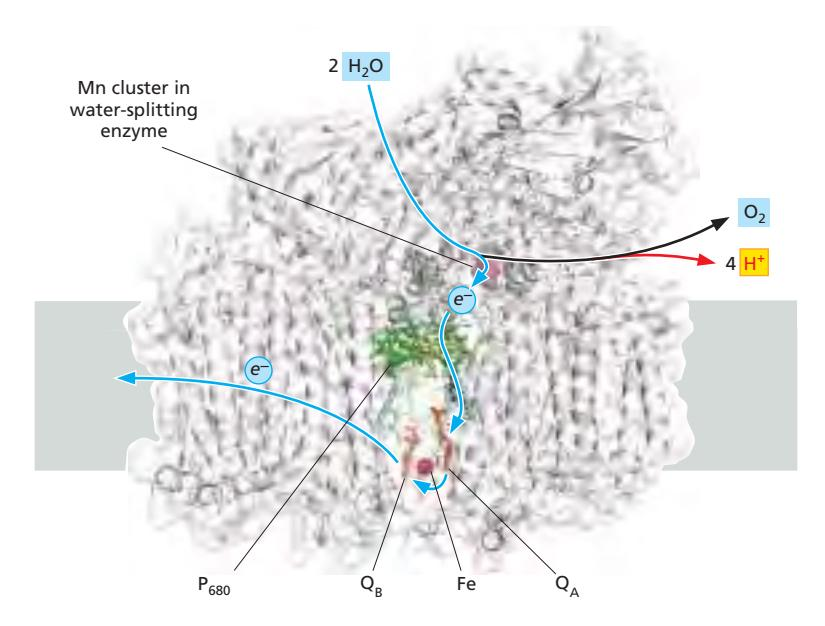

Figure 14–49 The structure of the complete photosystem II complex. This photosystem contains at least 16 protein subunits, along with 36 chlorophylls, two pheophytins, two hemes, and a number of protective carotenoids *(colored).* Most of these pigments and cofactors are deeply buried, tightly complexed to protein *(gray)*. The path of electrons is indicated by the *blue arrows* and is explained in Figure 14–48B. The photosystem II complex presented here is the cyanobacterial complex, which is simpler and more stable than the plant complex, which works in the same way. (PDB code: 3WU2.)

space than in the stroma). The unique protein environment that endows life with this all-important ability to oxidize water has remained essentially unchanged throughout billions of years of evolution (**Figure 14–49**). All of the oxygen in Earth's atmosphere is believed to have been generated in this way.

# The Cytochrome *b*6-*f* Complex Connects Photosystem II to Photosystem I

Following the path shown previously in Figure 14–49, the electrons extracted from water by photosystem II are transferred to plastoquinol, a strong electron donor similar to ubiquinol in mitochondria. This quinol, which can diffuse rapidly in the lipid bilayer of the thylakoid membrane, transfers its electrons to the *cytochrome b*6*-f complex*, whose structure is similar to the cytochrome *c* reductase in mitochondria. The cytochrome *b*6*-f* complex pumps H+ into the thylakoid space using the same Q cycle that is utilized in mitochondria (see Figure 14–21), thereby adding to the proton gradient across the thylakoid membrane.

The cytochrome *b*6*-f* complex forms the connecting link between photosystems II and I in the chloroplast electron-transport chain. It passes its electrons one at a time to the mobile electron carrier plastocyanin (a small copper-containing protein that takes the place of the cytochrome *c* in mitochondria), which transfers those electrons to photosystem I (**Figure 14–50**). As we discuss next, photosystem I then uses a second photon of light to boost the electrons that it receives to an even higher energy level.

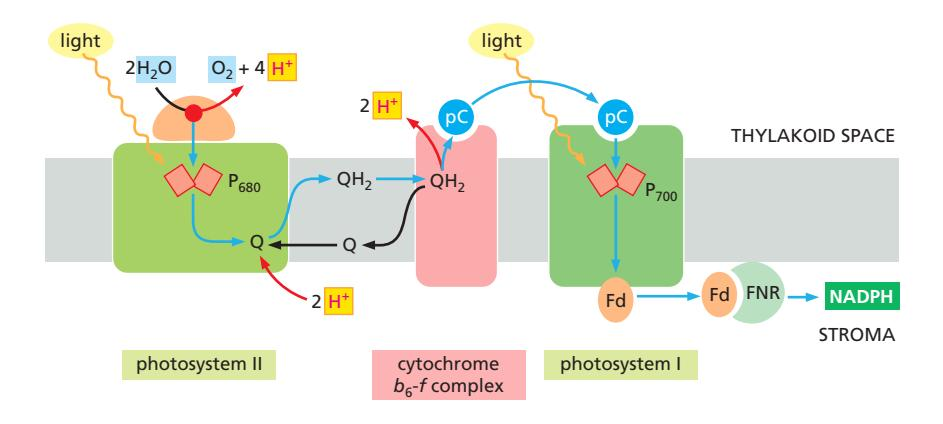

#### Figure 14–50 Electron flow through the cytochrome *b*6*-f* complex to NADPH.

The cytochrome *b*6*-f* complex is the functional equivalent of cytochrome *c* reductase (the cytochrome *b-c*1 complex) in mitochondria (see Figure 14–22). Like its mitochondrial homolog, the *b*6*-f* complex receives its electrons from a quinone and engages in a complicated Q cycle that pumps two protons across the membrane (details not shown). It passes its electrons, one at a time, to plastocyanin (pC). Plastocyanin diffuses along the membrane surface to photosystem I and transfers the electrons via ferredoxin (Fd) to the ferredoxin-NADP+ reductase (FNR), where they are utilized to produce NADPH. P700 is a special pair of chlorophylls that absorbs light of wavelength 700 nm.

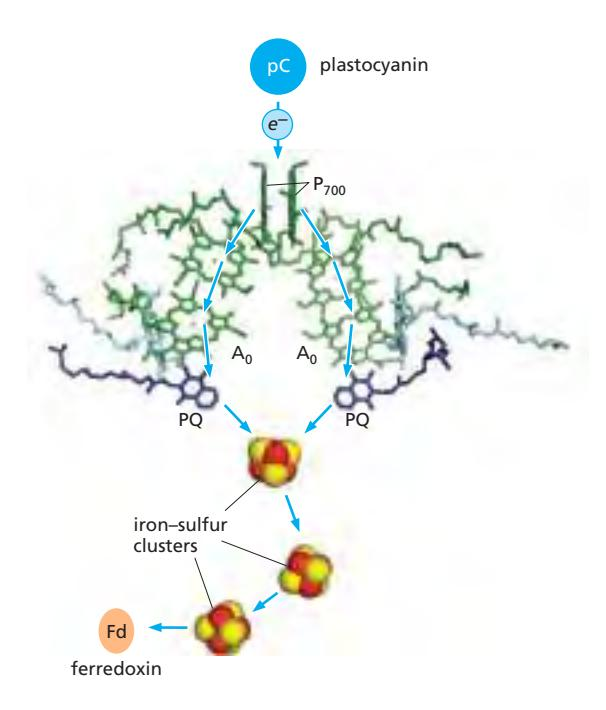

Figure 14–51 Structure and function of photosystem I. At the heart of the photosystem I complex assembly is the electron-transfer chain shown. At one end is a special pair of chlorophylls called P700 (because it absorbs light of 700-nm wavelength), receiving electrons from plastocyanin (pC). At the other end are the A0 chlorophylls, which hand the electrons on to ferredoxin via two plastoquinones (PQ; *purple*) and three iron–sulfur clusters. Even though the roles of photosystems I and II in photosynthesis are very different, their central electron-transfer chains are structurally similar, suggesting a common evolutionary origin (see Figure 14–53). Note that in photosystem I both branches of the electron-transfer chain are active, unlike in photosystem II (see Figure 14–48). (PDB code: 3LW5.)

### Photosystem I Carries Out the Second Charge-Separation Step in the Z Scheme

Photosystem I receives electrons from plastocyanin in the thylakoid space and transfers them, via a second charge-separation reaction, to the small protein ferredoxin on the opposite membrane surface (**Figure 14–51**). Then, in a final step, ferredoxin feeds its electrons to a membrane-associated enzyme complex, the *ferredoxin-NADP*+ *reductase*, which uses the electrons to reduce NADP+ to NADPH (see Figure 14–50). The reduced NADPH is released into the chloroplast stroma, where it is used for biosynthesis of glyceraldehyde 3-phosphate, amino acid precursors, and fatty acids. MBoC7 m14.51/14.51

The redox potential of the NADP+/NADPH pair (–320 mV) is already very low, and the reduction of NADP+ therefore requires a compound with an even lower redox potential. This turns out to be a chlorophyll molecule near the stromal membrane surface of photosystem I that has a redox potential of –1000 mV (chlorophyll A0), making it the strongest known electron donor in biology.

# The Chloroplast ATP Synthase Uses the Proton Gradient Generated by the Photosynthetic Light Reactions to Produce ATP

The sequence of events that results in light-driven production of ATP and NADPH in chloroplasts and cyanobacteria is summarized in **Figure 14–52**. Starting with the withdrawal of electrons from water, the light-driven chargeseparation steps in photosystems II and I enable the energetically unfavorable flow of electrons from water to NADPH (see Figure 14–47). Three small mobile electron carriers—plastoquinone, plastocyanin, and ferredoxin—participate in this process. Together with the electron-driven proton pump of the cytochrome *b*6*-f* complex, the photosystems generate a large proton gradient across the thylakoid membrane. The ATP synthase molecules embedded in the thylakoid membranes then harness this proton gradient to produce ATP in the chloroplast stroma, analogous to the synthesis of ATP in the mitochondrial matrix.

The linear Z scheme for photosynthesis thus far discussed can switch to a circular mode of electron flow through photosystem I and the *b*6*-f* complex. Here, the electrons held in the reduced ferredoxin are transferred back to the *b*6*-f* complex to reduce plastoquinone, instead of being passed to the ferredoxin-NADP+ reductase enzyme complex. This, in effect, turns photosystem I into a light-driven

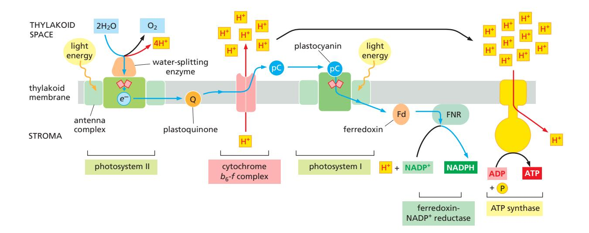

Figure 14–52 Summary of electron and proton movements during photosynthesis in the thylakoid membrane. Electrons are withdrawn, through the action of light energy, from a water molecule that is held by the manganese cluster in photosystem II. The electrons pass on to plastoquinone, which delivers them to the cytochrome *b*6*-f* complex that resembles the cytochrome *c* reductase of mitochondria and the cytochrome *b-c* complex of bacteria. They are then carried to photosystem I by the soluble electron carrier plastocyanin, the functional equivalent of cytochrome *c* in mitochondria. From photosystem I they are transferred to ferredoxin-NADP+ reductase (FNR) by the soluble carrier ferredoxin (Fd; a small protein containing an iron–sulfur center). Protons are pumped into the thylakoid space by the cytochrome *b*6*-f* complex, in the same way that protons are pumped into mitochondrial cristae by cytochrome *c* reductase (see Figure 14–23). In addition, the H+ released into the thylakoid space by water oxidation, and the H+ consumed during NADPH formation in the stroma, contribute to the generation of the electrochemical H+ gradient across the thylakoid membrane. As illustrated, this gradient drives ATP synthesis by an ATP synthase that sits in the same membrane (see Figure 14–47).

proton pump, thereby increasing the proton gradient and thus the amount of ATP made by the ATP synthase. An elaborate set of regulatory mechanisms controls this switch, which enables the chloroplast to generate either more NADPH (linear mode) or more ATP (circular mode), depending on the metabolic needs of the cell.

## The Proton-Motive Force for ATP Production in Mitochondria and Chloroplasts Is Essentially the Same

The proton gradient across the thylakoid membrane depends both on the proton-pumping activity of the cytochrome *b*6*-f* complex and on the photosynthetic activity of the two photosystems. In chloroplasts exposed to light, H+ is pumped out of the stroma (pH around 8, similar to the mitochondrial matrix) into the thylakoid space (pH 5–6), creating a gradient of 2–3 pH units across the thylakoid membrane, representing a proton-motive force of about 180 mV. This is very similar to the proton-motive force in respiring mitochondria. However, a membrane potential across the inner mitochondrial membrane makes the largest contribution to the proton-motive force that drives the mitochondrial ATP synthase to make ATP, whereas an H+ gradient predominates for chloroplasts.

#### Chemiosmotic Mechanisms Evolved in Stages

The first living cells on Earth may have consumed geochemically produced organic molecules and generated their ATP by fermentation. Because oxygen was not yet present in the atmosphere, such anaerobic fermentation reactions would have dumped organic acids—such as lactic or formic acids, for example—into the environment (see Figure 2–50). Perhaps such acids lowered the pH of the environment, favoring the survival of cells that evolved transmembrane proteins that could pump H+ out of the cytosol, thereby preventing the cell from becoming too acidic (stage 1 in **Figure 14–53**). One of these pumps may have used the energy available from ATP hydrolysis to eject H+ from the cell; such a proton pump could have been the ancestor of present-day ATP synthases.

As Earth's supply of geochemically produced nutrients began to dwindle, organisms that could find a way to pump H+ without consuming ATP would have been at an advantage: they could save the small amounts of ATP they derived from the fermentation of increasingly scarce foodstuffs to fuel other important activities. This need to conserve resources might have led to the evolution of electron-transport proteins that allowed cells to use the movement of electrons between molecules of different redox potentials as a source of energy for pumping H+ across the plasma membrane (stage 2 in Figure 14–53). Some of these cells might have used the nonfermentable organic acids that neighboring cells had excreted as waste to provide the electrons needed to feed this electron-transport system. Some present-day bacteria grow on formic acid, for example, using the small amount of redox energy derived from the transfer of electrons from formic acid to fumarate to pump H+.

Eventually, some bacteria would have developed H+-pumping electrontransport systems that were so efficient that the bacteria could harvest more redox energy than they needed to maintain their internal pH. Such cells would probably have generated large electrochemical proton gradients, which they could then use to produce ATP. Protons could leak back into the cell through the ATPdriven H+ pumps, essentially running them in reverse so that they synthesized ATP (stage 3 in Figure 14–53). Because such cells would require much less of the dwindling supply of fermentable nutrients, they would have proliferated at the expense of their neighbors.

#### By Providing an Inexhaustible Source of Reducing Power, Photosynthetic Bacteria Overcame a Major Evolutionary Obstacle

The gradual depletion of nutrients from the environment on the early Earth meant that organisms had to find some alternative source of carbon to make the sugars that serve as the precursors for so many other cell components. Although the CO2 in the atmosphere provides an abundant potential carbon source, to convert it into an organic molecule such as a carbohydrate requires reducing the fixed CO2 with a strong electron donor, such as NADPH, which can generate (CH2O) units from CO2 (see Figure 14–41). Early in cellular evolution, strong reducing agents (electron donors) are thought to have been plentiful. But once an ancestor of ATP synthase began to generate most of the ATP, it paved the way for cells to evolve a new way of generating strong reducing agents.

A major evolutionary breakthrough in energy metabolism came with the development of photochemical reaction centers that could use the energy of sunlight to produce molecules such as NADPH. It is thought that this occurred early in the process of cellular evolution in the ancestors of the green sulfur bacteria. Present-day green sulfur bacteria use light energy to transfer hydrogen atoms (as an electron plus a proton) from H2S to NADPH, thereby producing the strong reducing power required for carbon fixation. Because the redox potential of H2S is much lower than that of H2O (–230 mV for H2S compared with +820 mV for H2O), one quantum of light absorbed by the single photosystem in these bacteria is sufficient to generate NADPH via a relatively simple photosynthetic electron-transport chain.

# The Photosynthetic Electron-Transport Chains of Cyanobacteria Produced Atmospheric Oxygen and Permitted New Life-Forms

The next evolutionary step, which is thought to have occurred with the development of the cyanobacteria perhaps 3 billion years ago, was the evolution of organisms capable of using water as the electron source for CO2 reduction. This

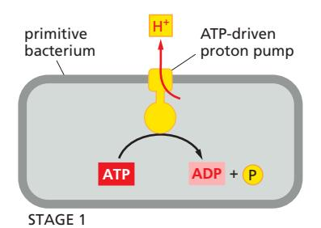

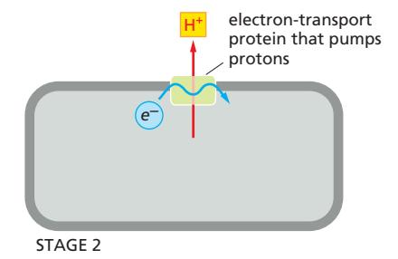

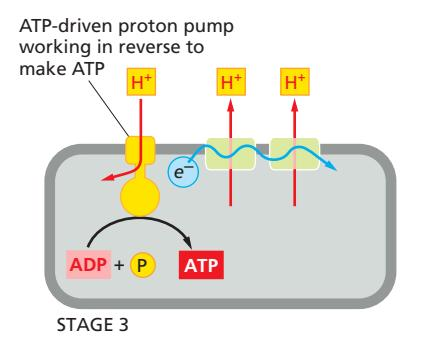

MBoC7 m14.55/14.53 Figure 14–53 How ATP synthesis by chemiosmosis might have evolved in stages. The first stage could have involved the evolution of an ATPase that pumped protons out of the cell using the energy of ATP hydrolysis. Stage 2 could have involved the evolution of a different proton pump, driven by an electron-transport chain. Stage 3 would then have linked these two systems together to generate a primitive ATP synthase that used the protons pumped by the electron-transport chain to synthesize ATP. An early bacterium with this final system would have had a selective advantage over bacteria with neither of the systems or only one.

entailed the evolution of a water-splitting enzyme and also required the addition of a second photosystem, acting in series with the first, to bridge the large gap in redox potential between H2O and NADPH. The biological consequences of this evolutionary step were far-reaching. For the first time, there would have been organisms that could survive on water, CO2, and sunlight (plus several other elements; see Figure 2–1). These cells would have been able to spread and evolve in ways denied to the earlier photosynthetic bacteria, which needed H2S or organic acids as a source of electrons. Consequently, large amounts of biologically synthesized, reduced organic materials accumulated, and oxygen entered the atmosphere for the first time.

Oxygen is highly toxic because the oxidation of biological molecules alters their structure and properties indiscriminately and irreversibly. Most anaerobic bacteria, for example, occupy environments devoid of oxygen and are rapidly killed when exposed to air. Thus, organisms on the primitive Earth would have had to evolve mechanisms to protect them from the rising O2 levels in the environment. Late evolutionary arrivals, such as ourselves, have numerous detoxifying mechanisms that protect our cells from the ill effects of oxygen.

The increase in atmospheric O2 was very slow at first and would have allowed a gradual evolution of protective devices. For example, the early seas contained large amounts of iron in its reduced, ferrous state (Fe2+), and nearly all the O2 produced by early photosynthetic bacteria would have been used up in oxidizing Fe2+ to ferric Fe3+. This conversion caused the precipitation of huge amounts of stable oxides, and the extensive banded iron formations in sedimentary rocks, beginning about 2.7 billion years ago, help to date the spread of the cyanobacteria. By about 2 billion years ago, the supply of Fe2+ was exhausted, and the deposition of further iron precipitates ceased. Geological evidence reveals how O2 levels in the atmosphere have changed over billions of years, approximating current levels only about 0.5 billion years ago (**Figure 14–54**).

The availability of O2 enabled the rise of bacteria that developed an aerobic metabolism to make their ATP. These organisms could harness the

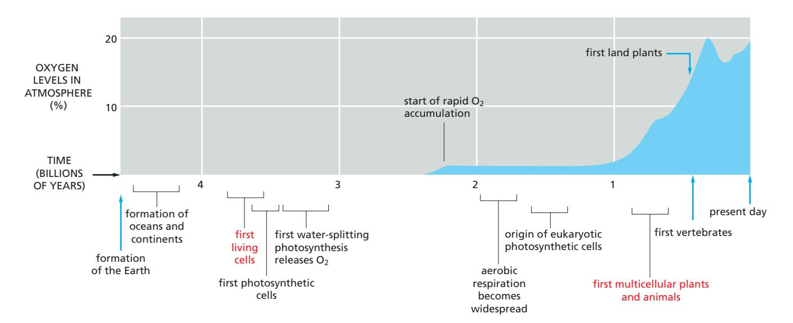

MBoC7 m14.56/14.54 Figure 14–54 Major events during the evolution of living organisms on Earth. With the evolution of the membranebased process of photosynthesis, organisms were able to make their own organic molecules from CO2 gas. The delay of more than a billion years between the appearance of bacteria that split water and released O2 during photosynthesis and the accumulation of high levels of O2 in the atmosphere is thought to be due to the initial reaction of the oxygen with the abundant ferrous iron (Fe2+) that was dissolved in the early oceans. Only when the ferrous iron was used up would oxygen have started to accumulate in the atmosphere. In response to the rising oxygen levels, nonphotosynthetic oxygen-consuming organisms evolved, and the concentration of oxygen in the atmosphere equilibrated at its present-day level.

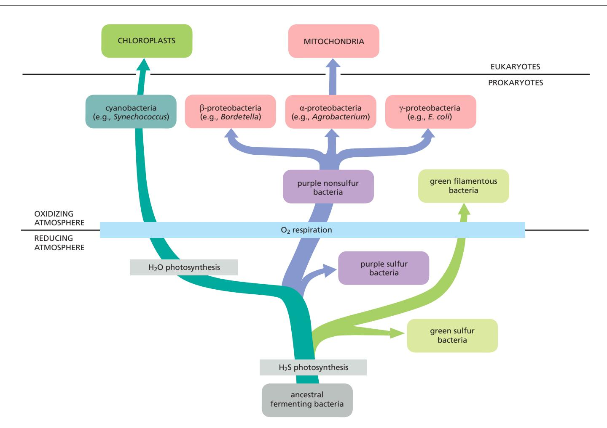

Figure 14–55 Evolutionary scheme showing the postulated origins of mitochondria and chloroplasts and their bacterial ancestors. The consumption of oxygen by respiration is thought to have first developed about 2 billion years ago. Nucleotide-sequence analyses suggest that an endosymbiotic oxygen-evolving cyanobacterium gave rise to chloroplasts *(green)*, while mitochondria *(pink)* arose from an α-proteobacterium. The nearest relatives of mitochondria are members of three closely related groups of α-proteobacteria—the rhizobacteria, agrobacteria, and rickettsias—known to form intimate associations with present-day eukaryotic cells. Proteobacteria are *pink*, purple photosynthetic bacteria are *purple*, and other photosynthetic bacteria are *light green*.

large amount of energy released by breaking down carbohydrates and other reduced organic molecules all the way to CO2 and H2O, as explained when we discussed mitochondria. Components of preexisting electron-transport complexes were modified to produce a cytochrome oxidase, so that the electrons obtained from organic or inorganic substrates could be transported to O2 as the terminal electron acceptor. Some present-day purple photosynthetic bacteria can switch between photosynthesis and respiration depending on the availability of light and O2, with only relatively minor reorganizations of their electron-transport chains.

In **Figure 14–55**, we relate these postulated evolutionary pathways to different types of bacteria. By necessity, evolution is always conservative, taking parts of the old and building on them to create something new. Thus, parts of the electron-transport chains that were derived to service anaerobic bacteria 3–4 billion years ago survive today, in altered form, in the mitochondria and chloroplasts of higher eukaryotes. A good example is the overall similarity in structure and function between the cytochrome *c* reductase that pumps H+ in the central segment of the mitochondrial respiratory chain and the analogous cytochrome *b*6*-f* complex in the electron-transport chains of both bacteria and chloroplasts, revealing their common evolutionary origin (**Figure 14–56**).

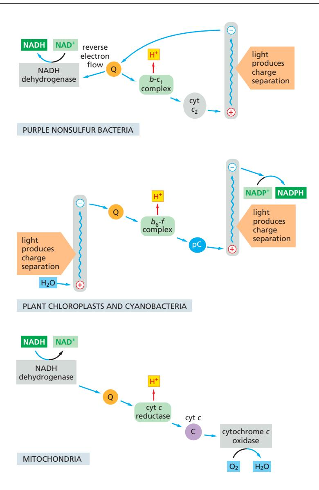

Figure 14–56 A comparison of three electron-transport chains discussed in this chapter. Bacteria, chloroplasts, and mitochondria all contain a membranebound enzyme complex that resembles the cytochrome *c* reductase of mitochondria. These complexes all accept electrons from a quinone carrier (Q) and pump H+ across their respective membranes. Moreover, in reconstituted *in vitro* systems, the different complexes can substitute for one another, and the structures of their protein components reveal that they are evolutionarily related. Note that the purple nonsulfur bacteria use a cyclic flow of electrons to produce a large electrochemical proton gradient that drives a *reverse electron flow* through NADH dehydrogenase to produce NADH from NAD+ + H+ + *e*–.

#### Summary

*Chloroplasts and photosynthetic bacteria have the unique ability to harness the energy of sunlight to produce energy-rich compounds. This is achieved by the photosystems, in which chlorophyll molecules attached to proteins are excited when hit by a photon. Photosystems are composed of light-harvesting antennae that collect solar energy and a photochemical reaction center, in which the collected energy is funneled to a chlorophyll molecule held in a special position, enabling it to withdraw electrons from an electron donor. Chloroplasts and cyanobacteria contain two distinct photosystems. The two photosystems are normally linked in series in the Z scheme, and they transfer electrons from water to NADP*+ *to form NADPH, while also generating a transmembrane electrochemical potential. One of the two photosystems—photosystem II—can split water by removing electrons from this ubiquitous, low-energy compound. It is believed that essentially all of the molecular oxygen (O2) in our atmosphere is a by-product of the water-splitting reaction in this photosystem. The three-dimensional structures of photosystems I and II are strikingly similar to those of the photosystems of purple photosynthetic bacteria, demonstrating a remarkable degree of conservation over billions of years of evolution.* MBoC7 m14.58/14.56

*The two photosystems and the cytochrome b6-f complex reside in the thylakoid membrane, a separate membrane system in the central stroma compartment of the chloroplast that is differentiated into stacked grana and unstacked stroma thylakoids. Electron-transport processes in the thylakoid membrane cause protons to be released*  *into the thylakoid space. The backflow of protons through the chloroplast ATP synthase then generates ATP. This ATP is used in conjunction with the NADPH produced by photosynthesis to drive many biosynthetic reactions in the chloroplast stroma, including the carbon-fixation cycle, which generates large amounts of carbohydrates from CO2.*

*In the early evolution of life, cyanobacteria overcame a major obstacle by devising a way to use solar energy to split water and fix carbon dioxide. By proliferating widely on Earth, the cyanobacteria eventually produced both abundant organic nutrients and the molecular oxygen that enabled the rise of a multitude of aerobic life-forms. The chloroplasts in plants have evolved from a cyanobacterium that was endocytosed long ago by an aerobic eukaryotic host organism.*

# THE GENETIC SYSTEMS OF MITOCHONDRIA AND CHLOROPLASTS

As we discussed in Chapter 1, mitochondria and chloroplasts are thought to have evolved from endosymbiotic bacteria (see Figures 1–27 and 1–29). Both types of organelles still contain their own genomes (**Figure 14–57**). As we will discuss shortly, they also retain their own machinery for transcribing that DNA into RNA and for translating mRNAs into organelle proteins.

Like bacteria, mitochondria and chloroplasts proliferate by growth and division of an existing organelle. In actively dividing cells, each type of organelle must double in mass in each cell generation and then be distributed into each daughter cell. In addition, nondividing cells must replenish organelles that are degraded as part of the continual process of organelle turnover or produce additional organelles as the need arises. Organelle growth and proliferation are therefore carefully controlled. The process is complicated because mitochondrial and chloroplast proteins are encoded in two places: the nuclear genome and the separate genomes harbored in the organelles themselves. The biogenesis of mitochondria and chloroplasts thus requires contributions from two separate genetic systems, which must be closely coordinated (see pp. 867–868).

Most organellar proteins are encoded by the nuclear DNA. The organelle imports these proteins from the cytosol, after they have been synthesized on cytosolic ribosomes. In Chapter 12, we discuss how this process is catalyzed by mitochondrial protein translocase complexes of the outer and inner mitochondrial membrane. Here, we describe the organellar genomes and genetic systems and consider the consequences of separate organelle genomes for the cell and the organism as a whole.

# The Genetic Systems of Mitochondria and Chloroplasts Resemble Those of Prokaryotes

As discussed in Chapter 12, it is thought that eukaryotic cells originated through a symbiotic relationship between an archaeon and an aerobic bacterium (an α-proteobacterium). The two organisms are postulated to have merged to form the ancestor of all nucleated cells, with the archaeon providing the nucleus and the proteobacterium serving as a respiring, ATP-producing endosymbiont—one that would eventually evolve into the mitochondrion (see Figure 12–3). This most likely occurred roughly 1.6 billion years ago, when oxygen had entered the atmosphere in substantial amounts (see Figure 14–54). The chloroplast was derived later, after the plant and animal lineages diverged, through endocytosis of an oxygen-producing cyanobacterium.

This *endosymbiont hypothesis* of organelle development receives strong support from the observation that the genetic systems of mitochondria and chloroplasts are similar to those of present-day bacteria. For example, bacterial, chloroplast, and mitochondrial genomes are typically circular and share many features of genome organization. In addition, chloroplast ribosomes are very similar to bacterial ribosomes, both in their structure and in their sensitivity to various antibiotics (such as chloramphenicol, streptomycin, erythromycin, and tetracycline). In addition, protein synthesis in chloroplasts starts with *N*-formylmethionine, as in bacteria, and

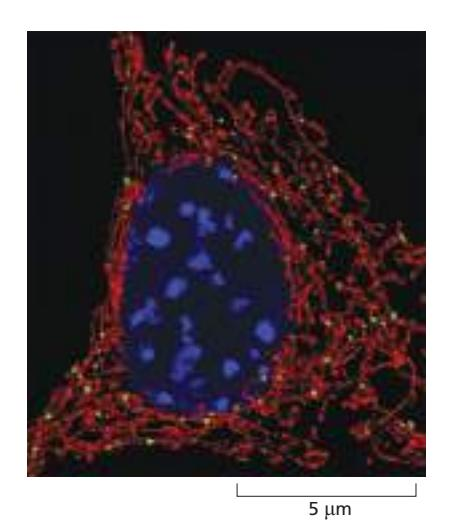

Figure 14–57 Staining of nuclear and mitochondrial DNA. In this confocal micrograph of a single fibroblast cell, the nuclear DNA is stained with a fluorescent dye *(blue)* while the mitochondrial DNA is visualized indirectly using a tagged mitochondrial transcription factor *(green)*. The mitochondrial network is stained with a fluorescent mitochondrial matrix marker *(red)*. The image was acquired using a structured illumination microscope (SIM), which yields approximately double the resolution of a confocal microscope. Numerous copies of the mitochondrial genome can be seen distributed in distinct nucleoids throughout the mitochondria that snake through the cytoplasm. [From C. Kukat et al., *Proc. Natl. Acad. Sci. USA* 108(33):13534–13539, 2011. Copyright 2011 National Academy of Sciences, USA. With permission from National Academy of Sciences.] MBoC7 m14.59/14.57

not with methionine, as in the cytosol of eukaryotic cells. Although mitochondrial genetic systems are much less similar to those of present-day bacteria than are the genetic systems of chloroplasts, their ribosomes are also structurally similar and are sensitive to antibacterial antibiotics, and the transcriptional system of mitochondria is reminiscent of bacterial and bacteriophage systems.

The processes of organellar DNA transcription, protein synthesis, and DNA replication take place where the genome is located: in the matrix of mitochondria or the stroma of chloroplasts. The enzymes that mediate these genetic processes are unique to the organelle and resemble those of bacteria (or even of bacterial viruses) rather than their eukaryotic analogs. In spite of the complexity of the system required to maintain independent organellar genomes, the nuclear genome encodes the vast majority of mitochondrial proteins, including the enzymes required for genome expression in most species. The chloroplast genome is larger than that of mitochondria and encodes several enzymes involved in transcription and translation, but even so more than 95% of chloroplast proteins are typically encoded in the nuclear genome.

#### Over Time, Mitochondria and Chloroplasts Have Exported Most of Their Genes to the Nucleus by Gene Transfer

The nature of the organellar genes located in the nucleus of the cell reveals that, over the course of eukaryotic evolution, an extensive transfer of genes from organelle to nuclear DNA has occurred. Each such successful *gene transfer* is expected to be very difficult, because any gene moved from the organelle needs to adapt to both nuclear transcription and cytoplasmic translation requirements. In addition, the protein produced needs to acquire a signal sequence that directs it to the correct organelle after its synthesis in the cytosol (see Chapter 12).

By comparing the genes in the mitochondria from different organisms, we can infer that some of the gene transfers to the nucleus occurred relatively recently. The smallest and presumably most highly evolved mitochondrial genomes, for example, encode only a few hydrophobic inner-membrane proteins of the electron-transport chain, plus ribosomal RNAs (rRNAs) and transfer RNAs (tRNAs). Other mitochondrial genomes that have remained more complex tend to contain this same subset of genes along with others (**Figure 14–58**). The

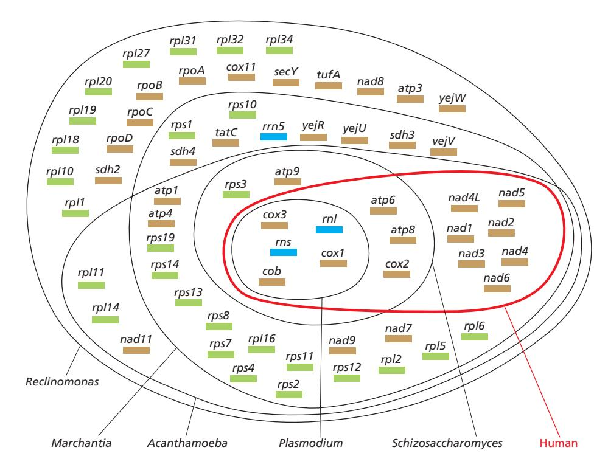

Figure 14–58 Comparison of mitochondrial genomes. Less complex mitochondrial genomes contain subsets of the genes found in larger mitochondrial genomes. Even the smallest mitochondrial genomes contain genes encoding respiratory-chain proteins and ribosomal RNAs. In the comparison shown, there are only five genes that are shared by all six mitochondrial genomes; these encode ribosomal RNAs (*rns* and *rnl*), cytochrome *b* (*cob*), and two cytochrome oxidase subunits (*cox1* and *cox3*). *Blue* indicates ribosomal RNAs; *green*, ribosomal proteins; and *brown*, components of the respiratory chain and other proteins. (Adapted from M.W. Gray et al., *Science* 283:1476–1481, 1999.)

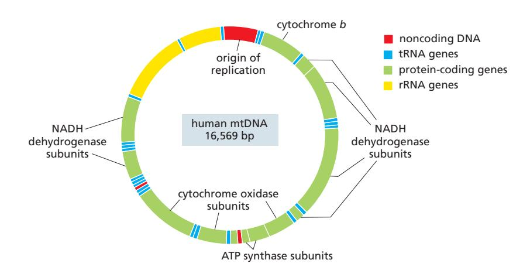

Figure 14–59 The organization of the human mitochondrial genome. The human mitochondrial genome of ∼16,600 nucleotide pairs contains 2 rRNA genes, 22 tRNA genes, and 13 protein-coding sequences. There are two transcriptional promoters, one for each strand of the mitochondrial DNA (mtDNA). The DNAs of many other animal mitochondrial genomes have been completely sequenced. Most of these animal mitochondrial DNAs contain precisely the same genes as those contained in the mitochondrial DNA of humans, with the gene order being identical for animals ranging from fish to mammals.

most complex mitochondrial genomes include genes that encode components of the mitochondrial genetic system, such as RNA polymerase subunits and ribosomal proteins; these same genes are found in the cell nucleus in yeast and all animal cells. There are only 13 protein-coding genes in human mitochondrial DNA (**Figure 14–59**).

The proteins that are encoded by genes in the organellar DNA are synthesized on ribosomes within the organelle, using organelle-produced messenger RNA (mRNA) to specify their amino acid sequence (**Figure 14–60**). The protein traffic between the cytosol and these organelles seems to be almost exclusively unidirectional: protein export from mitochondria or chloroplasts to the cytosol is rare. An important exception occurs when a cell is about to undergo apoptosis. As will be discussed in detail in Chapter 18, during apoptosis the mitochondrion releases proteins (most notably cytochrome *c*) from the crista space through its outer mitochondrial membrane as part of an elaborate signaling pathway that is triggered to cause cells to undergo programmed cell death. MBoC7 m14.65/14.59

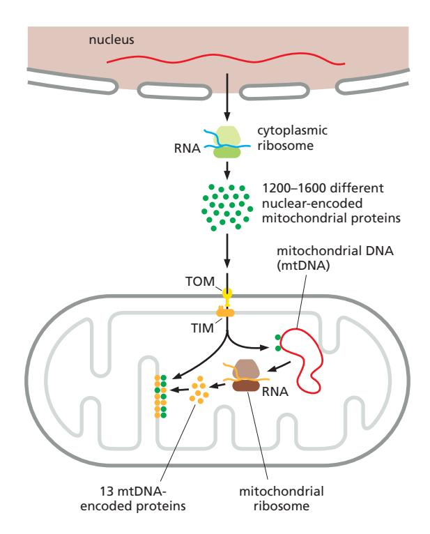

Figure 14–60 Biogenesis of the respiratory-chain proteins in human mitochondria. Most of the protein components of the mitochondrial respiratory chain are encoded by nuclear DNA (*dark green dots)*, with only a small number *(orange dots)* encoded by mitochondrial DNA (mtDNA). The mtDNAencoded subunits assemble together with the nuclear-encoded subunits to form a functional oxidative phosphorylation system.

Transcription of mtDNA produces 13 mRNAs, all of which encode subunits of the oxidative phosphorylation system, and 24 of the RNAs (22 transfer RNAs and 2 ribosomal RNAs) needed for translation of these mRNAs on the mitochondrial ribosomes. The mRNAs produced by transcription of nuclear genes are translated on cytoplasmic ribosomes *(light green)*, which are distinct from the mitochondrial ribosomes *(brown)*. The nuclear-encoded mitochondrial proteins are imported into mitochondria through protein translocases called TOM and TIM (see Figure 12–49), and they constitute the vast majority of the approximately 1200–1600 different protein species present in mammalian mitochondria. These nuclear-encoded mitochondrial proteins in humans include the majority of the oxidative phosphorylation system subunits, all proteins needed for expression and maintenance of mtDNA, and the proteins of the mitochondrial ribosomes. (Adapted from N.G. Larsson, *Annu. Rev. Biochem*. 79:683–706, 2010.)

## Mitochondria Have a Relaxed Codon Usage and Can Have a Variant Genetic Code

The human mitochondrial genome has several surprising features that distinguish it from nuclear, chloroplast, and bacterial genomes:

- 1. *Dense gene packing.* Unlike other genomes, the human mitochondrial genome seems to contain almost no noncoding DNA: nearly every nucleotide seems to be part of a coding sequence, either for a protein or for one of the rRNAs or tRNAs. Because these coding sequences run directly into each other, there is very little room left for regulatory DNA sequences. The little noncoding DNA present in the human mitochondrial genome is primarily at the origin of replication, which has essential functions in guiding replication and controlling transcription.
- 2. *Relaxed codon usage.* Whereas 30 or more tRNAs specify amino acids in the cytosol and in chloroplasts, only 22 tRNAs are required for mitochondrial protein synthesis. The normal codon–anticodon pairing rules are relaxed in mitochondria, so that many tRNA molecules recognize any one of the four nucleotides in the third (wobble) position. Such "2 out of 3" pairing allows one tRNA to pair with any one of four codons and permits protein synthesis with fewer tRNA molecules.
- 3. *Variant genetic code.* Perhaps most surprising, comparisons of mitochondrial gene sequences and the amino acid sequences of the corresponding proteins indicate that the genetic code is different: 4 of the 64 codons have different "meanings" from those of the same codons in other genomes (**Table 14–4**).

The close similarity of the genetic code in all organisms provides strong evidence that they all have evolved from a common ancestor. How, then, do we explain the differences in the genetic code in many mitochondria? A hint comes from the finding that the mitochondrial genetic code in different organisms is not the same. In the mitochondrion with the largest number of genes in Figure 14–58, that of the protozoan *Reclinomonas*, the genetic code is unchanged from the standard genetic code of the cell nucleus. Yet UGA, which is a stop codon elsewhere, is read as tryptophan in the mitochondria of mammals, fungi, and invertebrates. Similarly, the codon AGG normally codes for arginine, but it codes for *stop* in the mitochondria of mammals and codes for serine in the mitochondria of *Drosophila* (see Table 14–4). Such variation suggests that a random drift has occurred over evolutionary time in the genetic code in mitochondria. Presumably, the unusually small number of proteins encoded by the mitochondrial genome makes an occasional change in the meaning of a rare codon tolerable, whereas such a change in a larger genome would alter the function of many proteins and thereby destroy the cell.

| TABLE 14–4 Some Differences Between the "Universal" Code and Mitochondrial Genetic Codes* |             |                     |               |       |        |  |  |  |
|----------------------------------------------------------------------------------------------|-------------|---------------------|---------------|-------|--------|--|--|--|
|                                                                                              | "Universal" | Mitochondrial codes |               |       |        |  |  |  |
| Codon                                                                                        | code        | Mammals             | Invertebrates | Fungi | Plants |  |  |  |
| UGA                                                                                          | STOP        | Trp                 | Trp           | Trp   | STOP   |  |  |  |
| AUA                                                                                          | Ile         | Met                 | Met           | Met   | Ile    |  |  |  |
| CUA                                                                                          | Leu         | Leu                 | Leu           | Thr   | Leu    |  |  |  |
| AGA AGG                                                                                   | Arg         | STOP                | Ser           | Arg   | Arg    |  |  |  |
| *Red italics indicate that the code differs from the "universal" code.                       |             |                     |               |       |        |  |  |  |

Notably, in many species, one or two tRNAs for mitochondrial protein synthesis are encoded in the nucleus. Some parasites, for example trypanosomes, have not retained any tRNA genes in their mitochondrial DNA. Instead, the required tRNAs are all produced in the cytosol and are thought to be imported into the mitochondrion by special tRNA translocases that are poorly characterized but are distinct from the mitochondrial protein import system.

### Chloroplasts and Bacteria Share Many Striking Similarities

The chloroplast genomes of land plants range in size from 70,000 to 200,000 nucleotide pairs. Of the hundreds of chloroplast genomes that have now been sequenced, many are surprisingly similar, even in distantly related plants (such as tobacco and liverwort), and even those of green algae are closely related (**Figure 14–61**). Chloroplast genes are involved in three main processes: transcription, translation, and photosynthesis. Plant chloroplast genomes typically encode 80–90 proteins and around 45 RNAs, including 37 or more tRNAs. As in mitochondria, most of the organelle-encoded proteins are part of larger protein complexes that also contain one or more subunits encoded in the nucleus and imported from the cytosol.

The genomes of chloroplasts and bacteria have striking similarities. Basic regulatory sequences, such as transcription promoters and terminators, are virtually identical. The amino acid sequences of the proteins encoded in chloroplasts are clearly recognizable as bacterial, and several clusters of genes with related functions (such as those encoding ribosomal proteins) are organized in the same way in the genomes of chloroplasts, the bacterium *E. coli*, and cyanobacteria.

The mechanisms by which chloroplasts and bacteria divide are also similar. Both utilize *FtsZ* proteins, which are self-assembling GTPases related to tubulins (see Chapter 16). Bacterial FtsZ is a soluble protein that assembles into a dynamic ring of membrane-attached protofilaments beneath the plasma membrane in the middle of the dividing cell. The FtsZ ring acts as a scaffold for recruitment of other cell-division proteins and generates a contractile force that results in membrane constriction and eventually in cell division. Presumably, chloroplasts divide in very much the same way.

Although both employ membrane-interacting\GTPases, the mechanisms by which mitochondria and chloroplasts divide are fundamentally different. The machinery for chloroplast division acts from the inside, as in bacteria,

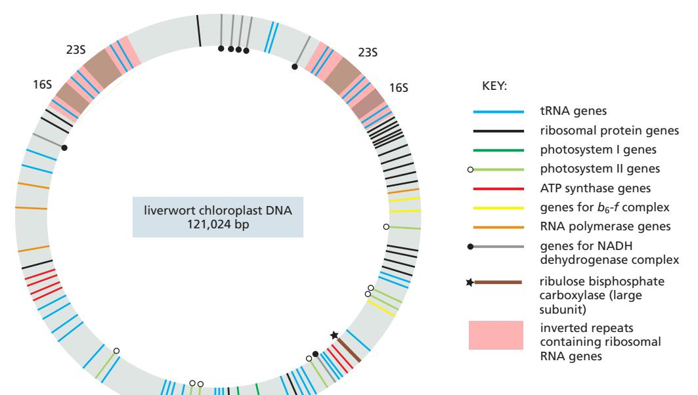

Figure 14–61 The organization of the liverwort chloroplast genome. The chloroplast genome organization is similar in all higher plants, although the size varies from species to species—depending on how much of the DNA surrounding the genes encoding the chloroplast's 16S and 23S ribosomal RNAs is present in two copies.

while the dynamin-like GTPases divide mitochondria from the outside (see Figure 14–8). The chloroplasts have remained closer to their bacterial origins than have mitochondria, inasmuch as the eukaryotic mechanisms of membrane constriction and vesicle formation have been adapted for mitochondrial fission.

The RNA editing and RNA processing that is prevalent in chloroplasts owes everything to their eukaryotic hosts. This RNA processing includes the generation of transcript 5′ and 3′ termini and the cleavage of polycistronic transcripts. In addition, an RNA editing process converts specific C residues to U and can change the amino acid specified by the edited codon. These and other RNA-based processes are catalyzed by protein families that are not found in prokaryotes.

#### Organellar Genes Are Maternally Inherited in Animals and Plants

In *Saccharomyces cerevisiae* (baker's yeast), when two haploid cells mate, they are equal in size and contribute equal amounts of mitochondrial DNA to the diploid zygote. Mitochondrial inheritance in yeasts is therefore *biparental*: both parents contribute equally to the mitochondrial gene pool of the progeny. However, during the course of the subsequent asexual, vegetative growth, the mitochondria become distributed more or less randomly to daughter cells. After a few generations, the mitochondria of any given cell contain only the DNA from one or the other parent cell, because only a small sample of the mitochondrial DNA passes from the mother cell to the bud of the daughter cell. This process is known as *mitotic segregation*, and it gives rise to a distinct form of inheritance that is called non-Mendelian, or *cytoplasmic inheritance*, in contrast to the Mendelian inheritance of nuclear genes.

The inheritance of mitochondria in animals and plants is quite different. In these organisms, the egg cell contributes much more cytoplasm to the zygote than does the male gamete (sperm in animals, pollen in plants). For example, a typical human oocyte contains about 100,000 copies of maternal mitochondrial DNA, whereas a sperm cell contains only a few. In addition, two active processes ensure that the sperm mitochondria do not compete with those in the egg. First, as sperm mature, the DNA in their mitochondria is degraded. Sperm mitochondria are also specifically recognized and eliminated from the fertilized egg cell by autophagy in very much the same way that damaged mitochondria are removed (by ubiquitylation followed by delivery to lysosomes, as discussed in Chapter 13). Because of both processes, the mitochondrial inheritance in both animals and plants is *uniparental*. More precisely, the mitochondrial DNA passes from one generation to the next by **maternal inheritance**.

In about two-thirds of higher plants, the chloroplast precursors from the male parent (contained in pollen grains) fail to enter the zygote, so that chloroplast as well as mitochondrial DNA is maternally inherited. In other plants, the chloroplast precursors from the pollen grains enter the zygote, making chloroplast inheritance biparental. In such plants, defective chloroplasts are a cause of variegation: a mixture of normal and defective chloroplasts in a zygote may sort out by mitotic segregation during plant growth and development, thereby producing alternating green and white patches in leaves. Leaf cells in the green patches contain normal chloroplasts, while those in the white patches contain defective chloroplasts (**Figure 14–62**).

# Mutations in Mitochondrial DNA Can Cause Severe Inherited Diseases

Mitochondria are marvels of efficiency in energy conversion, and they supply the cells of our body with a readily available source of ATP and perform other critical metabolic and signaling functions. But the same marvelous mechanisms that enable these essential functions also are the main source of *reactive oxygen species* (*ROS*) such as H2O2, superoxide, or hydroxyl radicals. These damaging species contribute to the inevitable accumulation of deletions and point mutations in mitochondrial DNA, which are often observed.

Figure 14–62 A variegated leaf. In the white patches, the plant cells have inherited a defective chloroplast. (Courtesy of John Innes Foundation.)

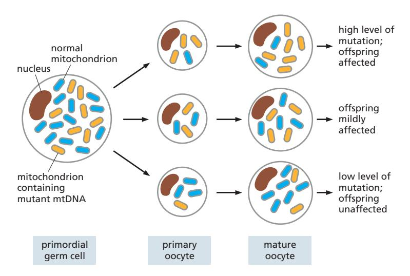

MBoC7 n14.137/14.63 Figure 14–63 Mitochondrial DNA mutations and inheritance. When a primordial germ cell carries a mixed population of normal and mutated mtDNA, those genomes are distributed randomly to primary oocytes, where they are replicated during the oocyte maturation process. Those oocytes that inherit a higher load of mutant mtDNA lead to offspring that are more likely to be afflicted with mitochondrial disease. Those that inherit a lower fraction of mutated mtDNA are more likely to be unaffected. [Adapted from R.W. Taylor and D.M. Turnbull, *Nat. Rev. Genet*. 6(5):389–402, 2005. With permission from Nature.]

The less complex DNA replication and repair systems in mitochondria mean that such accidents are corrected less efficiently. This results in a 100-fold higher occurrence of deletions and point mutations than in nuclear DNA. Mathematical modeling suggests that most of these mutations and lesions are acquired in childhood or early adult life and then proliferate by *clonal expansion* in later life. Because of mitotic segregation, some cells will accumulate higher levels of faulty mitochondrial DNA than others and will exhibit impaired metabolic function. In rare cases, these mutations are passed to progeny.

In humans, as we have explained, all the mitochondrial DNA in a fertilized egg cell is inherited from the mother. Some mothers carry a mixed population of both mutant and normal mitochondrial genomes (**Figure 14–63**). Their daughters and sons typically inherit this mixture of normal and mutant mitochondrial DNAs, although oocytes (and therefore children) frequently have a higher or lower fraction of mutant mitochondrial DNA. If the child receives a low fraction of mutant DNA, she or he will be healthy unless the process of mitotic segregation results in enrichment of defective mitochondria in a particular tissue.

Diseases caused by mutations in mitochondrial DNA are clinically recognized by their passage from affected mothers to both their daughters and their sons, with the daughters but not the sons producing children with the disease. As expected from the random nature of mitotic segregation, the symptoms of these diseases vary greatly between different family members—including not only the severity and age of onset, but also which tissue is affected. Muscle and the nervous system are the most common body systems to be affected by mitochondrial disease, likely because of their particularly high demand for ATP. There are also mitochondrial diseases that are caused by mutations in nuclear-encoded mitochondrial proteins; these diseases are inherited in the regular, Mendelian fashion.

## Why Do Mitochondria and Chloroplasts Maintain a Costly Separate System for DNA Transcription and Translation?

Why do mitochondria and chloroplasts require their own separate genetic systems, when other organelles that share the same cytoplasm, such as peroxisomes and lysosomes, do not? The question is not trivial, because maintaining a separate genetic system is costly: more than 90 proteins—including many ribosomal proteins, aminoacyl-tRNA synthetases, DNA polymerase, RNA polymerase, and RNA-processing and RNA-modifying enzymes—must be encoded by nuclear genes specifically for this purpose. As we have seen, the mitochondrial genetic system also entails the risk of disease.

The nature of the proteins encoded by the organellar genomes provides an additional layer of complexity in the maintenance of distinct genomes. The vast majority of organelle-encoded proteins act as components of large complexes that also contain proteins encoded in the nuclear genome, which must be translated in and imported from the cytosol. This creates a substantial need for coordination among the gene expression systems of the two genomes, and presumably also creates a substantial burden of quality control when protein abundance is not perfectly matched. For this and other reasons, signaling systems have evolved that regulate transcription of nuclear genes in response to damage and/or other perturbations in the function of mitochondria or chloroplasts.

Several possible reasons have been proposed for maintaining this costly and potentially hazardous arrangement. (1) The nonribosomal proteins encoded by the organellar genome are typically highly hydrophobic. This may make their production in and import from the cytoplasm simply too difficult and energyconsuming; however, several very hydrophobic proteins are synthesized in the cytosol and imported. (2) The current genome organization could be a remnant of an ancient endosymbiotic conflict. In the current arrangement, organelle function is completely dependent on the coordinated expression of both genomes. Neither the nucleus nor the organelle can control these critical functions without the concomitant response from the other. (3) It is also possible that the evolution (and eventual elimination) of the organellar genetic systems is still ongoing, but for now there is no alternative for the cell than to maintain separate genetic systems for its nuclear, mitochondrial, and chloroplast genes. As of now, the reason for the maintenance of distinct organellar genomes remains one of the most interesting and important unanswered questions in evolutionary biology.

#### Summary

*Mitochondria are organelles that allow eukaryotes to carry out oxidative phosphorylation, while chloroplasts are organelles that allow plants to carry out photosynthesis. As a result of their prokaryotic origins, each organelle maintains and reproduces itself in a highly coordinated process that requires the contribution of two separate genetic systems—one in the organelle and the other in the cell nucleus. The vast majority of the proteins in these organelles are encoded by nuclear DNA, synthesized in the cytosol, and then imported individually into the organelle. Other organellar proteins, as well as organellar ribosomal and transfer RNAs, are encoded by the organellar DNA; these are synthesized in the organelle itself.*

*The ribosomes of chloroplasts closely resemble bacterial ribosomes, while the origin of mitochondrial ribosomes is more difficult to trace. Extensive protein similarities, however, suggest that both organelles originated from bacteria: the mitochondrion when a proto-eukaryotic archaeal cell entered into a stable endosymbiotic relationship with a respiratory bacterium, and the chloroplast when a distant descendant of this first eukaryotic cell entered into a stable endosymbiotic relationship with a cyanobacterium. Although some of the genes of these former bacteria still function to make organellar proteins and RNA, most of them have been transferred into the nuclear genome, where they encode bacteria-like enzymes that are synthesized on cytosolic ribosomes and then imported into the organelle. This situation creates substantial challenges for the inter-genome coordination of gene expression, as well as producing an increased risk of mutation and disease.*

868 Chapter 14: Energy Conversion and Metabolic Compartmentation: Mitochondria and Chloroplasts PROBLEMS 869

# PROBLEMS

#### Which statements are true? Explain why or why not.

- 14–1 The three respiratory enzyme complexes in the mitochondrial inner membrane tend to associate with each other in ways that facilitate the correct transfer of electrons between appropriate complexes.
- 14–2 The number of *c* subunits in the rotor ring of ATP synthase defines how many protons need to pass through the turbine to make each molecule of ATP.
- 14–3 Mutations that are inherited according to Mendelian rules affect nuclear genes; mutations whose inheritance violates Mendelian rules are likely to affect organellar genes.

#### Discuss the following problems.

- 14–4 Heart muscle gets most of the ATP needed to power its continual contractions through oxidative phosphorylation. When oxidizing glucose to CO2, heart muscle consumes O2 at a rate of 10 μmol/min per gram of tissue, in order to replace the ATP used in contraction and give a steady-state ATP concentration of 5 μmol/g of tissue. At this rate, how many seconds would it take the heart to consume an amount of ATP equal to its steady-state levels? (Complete oxidation of one molecule of glucose to CO2 yields 30 ATP, 26 of which are derived by oxidative phosphorylation using the 12 pairs of electrons captured in the electron carriers NADH and FADH2. One pair of electrons is used to reduce each atom of oxygen.)
- 14–5 The transport of ions and small molecules across the inner mitochondrial membrane is often affected by the electrochemical gradient, whose components—the pH gradient and the membrane potential—may either oppose or drive the transport. How would the components of the electrochemical gradient affect the simultaneous transport of phosphate and protons into the matrix (**Figure Q14–1**)?

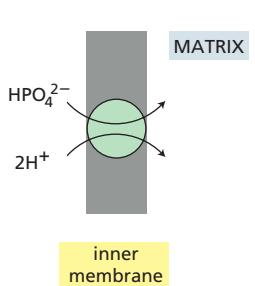

Figure Q14–1 Coupled transport of phosphate and protons across the inner mitochondrial membrane into the matrix (Problem 14–5).

14–6 If isolated mitochondria are incubated with a source of electrons such as succinate, but without oxygen, electrons enter the respiratory chain, reducing each of the electron carriers almost completely. When oxygen is then MBoC7 nQ14.101/Q14.1

introduced, the carriers become oxidized at different rates (**Figure Q14–2**). How does this result allow you to order the electron carriers in the respiratory chain? What is their order?

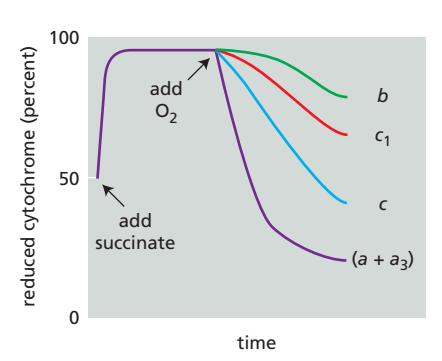

Figure Q14–2 Rapid spectrophotometric analysis of the rates of oxidation of electron carriers in the respiratory chain (Problem 14–6). Cytochromes *a* and *a*3 cannot be distinguished and thus are listed as cytochrome (*a* + *a*3).

- 14–7 Both H+ and Ca2+ are ions that move through the cytosol. Why is the movement of H+ ions so much faster than that of Ca2+ ions? How do you suppose the speed of these two ions would be affected by freezing the solution? Would you expect them to move faster or slower? Explain your answer.
- 14–8 In the 1860s, Louis Pasteur noticed that when he added O2 to a culture of yeast growing anaerobically on glucose, the rate of glucose consumption declined dramatically. Explain the basis for this result, which is known as the Pasteur effect.
- 14–9 ATP synthase is the world's smallest rotary motor. Passage of H+ ions through the membrane-embedded portion of ATP synthase (the Fo component) causes rotation of the single, central, axle-like γ subunit (the rotor stalk) inside the head group (the F1 ATPase head). The tripartite head is composed of the three αβ dimers, the β subunits of which are responsible for synthesis of ATP. The rotation of the γ subunit induces conformational changes in the αβ dimers that allow ADP and phosphate to be converted into ATP. A variety of indirect evidence had suggested rotary catalysis by ATP synthase, but seeing is believing.

To demonstrate rotary motion, a modified form of the α3β3γ complex was used. The β subunits were modified so they could be firmly anchored to a solid support, and the γ subunit was modified (on the end that normally inserts into the Fo component in the inner membrane) so that a fluorescently tagged, readily visible filament of actin could be attached (**Figure Q14–3A**). This arrangement allows rotations of the γ subunit to be visualized as revolutions of the long actin filament. In these experiments, ATP synthase was studied in the reverse of its normal mechanism by allowing it to hydrolyze ATP. At low ATP concentrations, the actin filament was observed to revolve in steps of 120° and then pause for variable lengths of time, as shown in **Figure Q14–3B**.

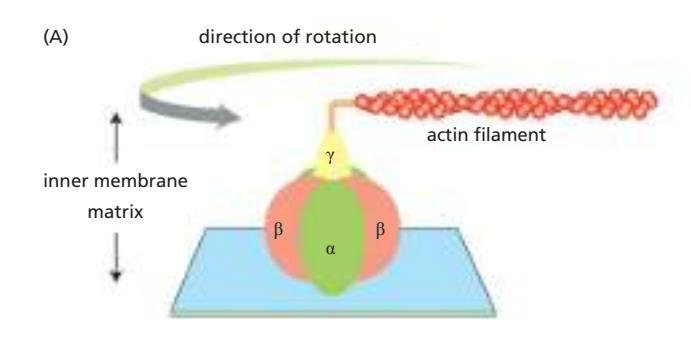

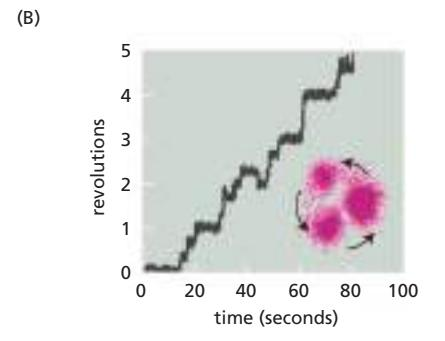

Figure Q14–3 Experimental setup for observing rotation of the γ subunit of ATP synthase (Problem 14–9). (A) The β subunits are anchored to a solid support, and a fluorescent actin filament is attached to the γ subunit. (B) The indicated trace is a typical example from one experiment. The inset shows the positions in the revolution at which the actin filament paused. (B, from R. Yasuda et al., Cell 93:1117–1124, 1998. With permission from Elsevier.)

- A. Why does the actin filament revolve in steps with pauses in between? What does this rotation correspond to in terms of the structure of the α3β3γ complex?
- B. In its normal mode of operation inside the cell, how many ATP molecules do you suppose would be synthesized for each complete 360° rotation of the γ subunit? Explain your answer.
- 14–10 In actively respiring liver mitochondria, the pH in the matrix is about half a pH unit higher than it is in the cytosol. Assuming that the cytosol is at pH 7 and the matrix is a sphere with a diameter of 1 μm [*V* = (4/3)π*r* 3 ], calculate the total number of protons in the matrix of a respiring liver mitochondrion. If the matrix began at pH 7 (equal to that in the cytosol), how many protons would have to be pumped out to establish a matrix pH of 7.5 (a difference of 0.5 pH units)?
- 14–11 Normally, the flow of electrons to O2 is tightly linked to the production of ATP via the electrochemical gradient. If ATP synthase is inhibited, for example, electrons do not flow down the electron-transport chain and respiration ceases. Since the 1940s, several substances such as 2,4-dinitrophenol—have been known to uncouple electron flow from ATP synthesis. Dinitrophenol was once prescribed as a diet drug to aid in weight loss. How would an uncoupler of oxidative phosphorylation promote weight loss? Why do you suppose dinitrophenol is no longer prescribed?

14–12 How much energy is available in visible light? How much energy does sunlight deliver to Earth? How efficient are plants at converting light energy into chemical energy? The answers to these questions provide an important backdrop to the subject of photosynthesis.

 Each quantum or photon of light has energy *h*ν, where *h* is Planck's constant (6.6 × 10–37 kJ sec/photon), and ν is the frequency in seconds–1 . The frequency of light is equal to *c*/λ, where *c* is the speed of light (3.0 × 1017 nm/sec), and λ is the wavelength in nanometers. Thus, the energy (*E*) of a photon is

$$E = h\nu = hc/\lambda$$

- A. Calculate the energy of a mole of photons (6 × 1023 photons/mole) at 400 nm (violet light), at 680 nm (red light), and at 800 nm (near-infrared light).
- B. Bright sunlight strikes Earth at the rate of about 1.3 kJ/sec per square meter. Assuming for the sake of calculation that sunlight consists of monochromatic light of wavelength 680 nm, how many seconds would it take for a mole of photons to strike a square meter?
- C. Assuming that it takes eight photons to fix one molecule of CO2 as carbohydrate under optimal conditions, calculate how long it would take a tomato plant with a leaf area of 1 square meter to make a mole of glucose from CO2. Assume that photons strike the leaf at the rate calculated above and, furthermore, that all the photons are absorbed and used to fix CO2.
- D. If it takes 468 kJ/mole to fix a mole of CO2 into carbohydrate, what is the efficiency of conversion of light energy into chemical energy after photon capture? Assume again that eight photons of red light (680 nm) are required to fix one molecule of CO2.
- 14–13 Why are plants green? ("They contain chlorophyll" is not a sufficient answer.)
- 14–14 Examine the variegated leaf shown in **Figure Q14–4**. Yellow patches surrounded by green are common, but there are no green patches surrounded by yellow. Propose an explanation for this phenomenon.

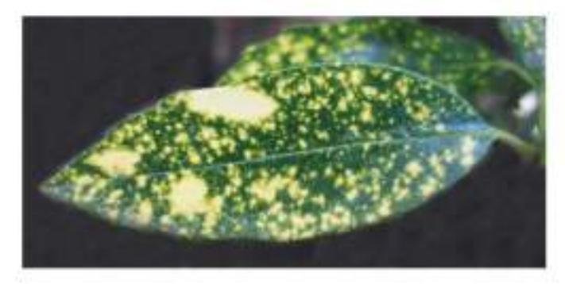

Figure Q14–4 A variegated leaf of Aucuba japonica with green and yellow patches (Problem 14–14).

870 Chapter 14: Energy Conversion and Metabolic Compartmentation: Mitochondria and Chloroplasts REFERENCES 871

# REFERENCES

#### General

- Cramer WA & Knaff DB (1990) Energy Transduction in Biological Membranes: A Textbook of Bioenergetics. New York: Springer-Verlag.
- Mathews CK, van Holde KE & Ahern K-G (2012) Biochemistry, 4th ed. San Francisco: Benjamin Cummings.
- Nicholls DG & Ferguson SJ (2013) Bioenergetics, 4th ed. New York: Academic Press.
- Schatz G (2012) The fires of life. *Annu. Rev. Biochem.* 81, 34–59.

#### The Mitochondrion

- Ernster L & Schatz G (1981) Mitochondria: a historical review. *J. Cell Biol.* 91, 227s–255s.
- Friedman JR & Nunnari J (2014) Mitochondrial form and function. *Nature* 505, 335–343.
- Mitchell P (1961) Coupling of phosphorylation to electron and hydrogen transfer by a chemi-osmotic type of mechanism. *Nature* 191, 144–148.
- Pebay-Peyroula E & Brandolin G (2004) Nucleotide exchange in mitochondria: insight at a molecular level. *Curr. Opin. Struct. Biol.* 14, 420–425.
- Roger AJ, Muñoz-Gómez SA & Kamikawa R (2017) The origin and diversification of mitochondria. *Curr. Biol.* 27, R1177–R1192.
- Scheffler IE (1999) Mitochondria. New York: Wiley-Liss.

#### The Proton Pumps of the Electron-Transport Chain

- Althoff T, Mills DJ, Popot J-L & Kühlbrandt W (2011) Arrangement of electron transport chain components in bovine mitochondrial supercomplex I1III2IV1. *EMBO J*. 30, 4652–4664.
- Baradaran R, Berrisford JM, Minhas GS & Sazanov LA (2013) Crystal structure of the entire respiratory complex I. *Nature* 494, 443–448.
- Beinert H, Holm RH & Münck E (1997) Iron-sulfur clusters: nature's modular, multipurpose structures. *Science* 277, 653–659.
- Berry EA, Guergova-Kuras M, Huang LS & Crofts AR (2000) Structure and function of cytochrome *bc* complexes. *Annu. Rev. Biochem.* 69, 1005–1075.
- Brandt U (2006) Energy converting NADH:quinone oxidoreductase (complex I). *Annu. Rev. Biochem.* 75, 69–92.
- Chance B & Williams GR (1955) A method for the localization of sites for oxidative phosphorylation. *Nature* 176, 250–254.
- Cooley JW (2013) Protein conformational changes involved in the cytochrome *bc*1 complex catalytic cycle. *Biochim. Biophys. Acta* 1827, 1340–1345.
- Efremov RG, Baradaran R & Sazanov LA (2010) The architecture of respiratory complex I. *Nature* 465, 441–445.
- Gottschalk G (1997) Bacterial Metabolism, 2nd ed. New York: Springer. Gray HB & Winkler JR (1996) Electron transfer in proteins. *Annu. Rev. Biochem.* 65, 537–561.
- Hirst J (2013) Mitochondrial complex I. *Annu. Rev. Biochem.* 82, 551–575.
- Hosler JP, Ferguson-Miller S & Mills DA (2006) Energy transduction: proton transfer through the respiratory complexes. *Annu. Rev. Biochem*. 75, 165–187.
- Hongjun Y, Schut GJ, Haja D, Adams MWW & Huilin L (2021) Evolution of complex I-like respiratory complexes. *J. Biol. Chem.* 296, 100740, 1–10.
- Hunte C, Zickermann V & Brandt U (2010) Functional modules and structural basis of conformational coupling in mitochondrial complex I. *Science* 329, 448–451.
- Kampjut D & Sazanov LA (2020) The coupling mechanism of mammalian respiratory complex I. *Science* 370(6516), eabc4209.

Keilin D (1966) The History of Cell Respiration and Cytochromes. Cambridge, UK: Cambridge University Press.

- Rouault TA, Tracey A & Tong WH (2008) Iron–sulfur cluster biogenesis and human disease. *Trends Genet.* 24, 398–407.
- Trumpower BL (2002) A concerted, alternating sites mechanism of ubiquinol oxidation by the dimeric cytochrome *bc*1 complex. *Biochim. Biophys. Acta* 1555, 166–173.
- Tsukihara T, Aoyama H, Yamashita E . . . Yoshikawa S (1996) The whole structure of the 13-subunit oxidized cytochrome *c* oxidase at 2.8 Å. *Science* 272, 1136–1144.

#### ATP Production in Mitochondria

- Abrahams JP, Leslie AG, Lutter R & Walker JE (1994) Structure at 2.8 Å resolution of F1-ATPase from bovine heart mitochondria. *Nature* 370, 621–628.
- Berg HC (2003) The rotary motor of bacterial flagella. *Annu. Rev. Biochem.* 72, 19–54.
- Boyer PD (1997) The ATP synthase—a splendid molecular machine. *Annu. Rev. Biochem*. 66, 717–749.
- Meier T, Polzer P, Diederichs K, Welte W & Dimroth P (2005) Structure of the rotor ring of F-type Na+-ATPase from *Ilyobacter tartaricus*. *Science* 308, 659–662.
- Stock D, Gibbons C, Arechaga I, Leslie AG & Walker JE (2000) The rotary mechanism of ATP synthase. *Curr. Opin. Struct. Biol*. 10, 672–679.
- von Ballmoos C, Wiedenmann A & Dimroth P (2009) Essentials for ATP synthesis by F1F0 ATP synthases. *Annu. Rev. Biochem*. 78, 649–672.

#### Chloroplasts and Photosynthesis

- Barber J (2013) Photosystem II: the water-splitting enzyme of photosynthesis. *Cold Spring Harb. Symp. Quant. Biol.* 77, 295–307.
- Bassham JA (1962) The path of carbon in photosynthesis. *Sci. Am.*  206, 89–100.
- Blankenship RE (2002) Molecular Mechanisms of Photosynthesis. Oxford, UK: Blackwell Scientific.
- Blankenship RE & Bauer CE (eds.) (1995) Anoxygenic Photosynthetic Bacteria. Dordrecht: Kluwer.
- Deisenhofer J & Michel H (1989) Nobel lecture. The photosynthetic reaction centre from the purple bacterium *Rhodopseudomonas viridis*. *EMBO J.* 8, 2149–2170.
- De Las Rivas J, Balsera M & Barber J (2004) Evolution of oxygenic photosynthesis: genome-wide analysis of the OEC extrinsic proteins. *Trends Plant Sci*. 9, 18–25.
- Hohmann-Marriott MF & Blankenship RE (2011) Evolution of photosynthesis. *Annu. Rev. Plant Biol.* 62, 515–548.
- Jordan P, Fromme P, Witt HT, Klukas O, Saenger W & Krauss N (2001) Three-dimensional structure of cyanobacterial photosystem I at 2.5 Å resolution. *Nature* 411, 909–917.
- Kobayashi K, Endo K & Wada H (2017) Specific distribution of phosphatidylglycerol to photosystem complexes in the thylakoid membrane. *Front. Plant Sci.* 8, 1991.
- Kühlbrandt W, Wang DN & Fujiyoshi Y (1994) Atomic model of plant light-harvesting complex by electron crystallography. *Nature* 367, 614–621.
- Lane N & Martin WF (2012) The origin of membrane bioenergetics. *Cell* 151, 1406–1416.
- Lyons TW, Reinhard CT & Planavsky NJ (2014) The rise of oxygen in earth's early ocean and atmosphere. *Nature* 506, 307–315.
- Nelson N & Ben-Shem A (2004) The complex architecture of oxygenic photosynthesis*. Nat. Rev. Mol. Cell Biol.* 5, 971–982.
- Orgel LE (1998) The origin of life—a review of facts and speculations. *Trends Biochem. Sci.* 23, 491–495.

- Pyc M, Cai Y, Greer MS, Yurchenko O, . . . Mullen RT (2017) Turning over a new leaf in lipid droplet biology. *Trends Plant Sci.* 22, 596–609.
- Tang K-H, Tang YJ & Blankenship RE (2011) Carbon metabolic pathways in phototrophic bacteria and their broader evolutionary implications. *Front. Microbiol.* 2, 165.
- Umena Y, Kawakami K, Shen J-R & Kamiya N (2011) Crystal structure of oxygen-evolving photosystem II at a resolution of 1.9 Å. *Nature* 473, 55–60.
- Vinyard DJ, Ananyev GM & Dismukes GC (2013) Photosystem II: the reaction center of oxygenic photosynthesis. *Annu. Rev. Biochem.*  82, 577–606.
- Yano J, Kern J, Sauer K . . . Yachandra VK (2006) Where water is oxidized to dioxygen: structure of the photosynthetic Mn4Ca cluster. *Science* 314, 821–825.
- Yoon HS (2004) A molecular timeline for the origin of photosynthetic eukaryotes. *Mol. Biol. Evol.* 21, 809–818.

#### The Genetic Systems of Mitochondria and Chloroplasts

- Al Rawi S, Louvet-Vallee SS, Djeddi D . . . Galy V (2011) Postfertilization autophagy of sperm organelles prevents paternal mitochondrial DNA transmission. *Science* 334, 1144–1147.
- Anderson S, Bankier AT, Barrell BG . . . Young IG (1981) Sequence and organization of the human mitochondrial genome. *Nature* 290, 457–465.
- Bendich AJ (2004) Circular chloroplast chromosomes: the grand illusion. *Plant Cell* 16, 1661–1666.
- Birky CW Jr (1995) Uniparental inheritance of mitochondrial and chloroplast genes: mechanisms and evolution. *Proc. Natl. Acad. Sci. USA* 92, 11331–11338.
- Bullerwell CE & Gray MW (2004) Evolution of the mitochondrial genome: protist connections to animals, fungi and plants. *Curr. Opin. Microbiol.* 7, 528–534.

- Chen XJ & Butow RA (2005) The organization and inheritance of the mitochondrial genome. *Nat. Rev. Genet.* 6, 815–825.
- Clayton DA (2000) Vertebrate mitochondrial DNA—a circle of surprises. *Exp. Cell Res.* 255, 4–9.
- Daley DO & Whelan J (2005) Why genes persist in organelle genomes. *Genome Biol.* 6, 110.
- de Duve C (2007) The origin of eukaryotes: a reappraisal. *Nat. Rev. Genet.* 8, 395–403.
- Dyall SD, Brown MT & Johnson PJ (2004) Ancient invasions: from endosymbionts to organelles. *Science* 304, 253–257.
- Falkenberg M, Larsson NG & Gustafsson CM (2007) DNA replication and transcription in mammalian mitochondria. *Annu. Rev. Biochem*. 76, 679–699.
- Harel A, Bromberg Y, Falkowski PG & Bhattacharya D (2014) Evolutionary history of redox metal-binding domains across the tree of life. *Proc. Natl. Acad. Sci. USA* 111, 7042–7047.
- Hoppins S, Lackner L & Nunnari J (2007) The machines that divide and fuse mitochondria. *Annu. Rev. Biochem.* 76, 751–780.
- Larsson NG (2010) Somatic mitochondrial DNA mutations in mammalian aging. *Annu. Rev. Biochem*. 79, 683–706.
- Ma H, Xu H & O'Farrell PH (2014) Transmission of mitochondrial mutations and action of purifying selection in *Drosophila melanogaster. Nat. Genet.* 46, 393–397.
- Neupert W & Herrmann JM (2007) Translocation of proteins into mitochondria. *Annu. Rev. Biochem*. 76, 723–749.
- Taylor RW, Barron MJ, Borthwick GM . . . Turnbull DM (2003) Mitochondrial DNA mutations in human colonic crypt stem cells. *J. Clin. Invest.* 112, 1351–1360.
- Wallace DC (1999) Mitochondrial diseases in man and mouse. *Science* 283, 1482–1488.
- Williams TA, Foster PG, Cox CJ & Embley TM (2014) An archaeal origin of eukaryotes supports only two primary domains of life. *Nature*  504, 231–236.