# The Cytoskeleton

CHAPTER

16

For cells to function properly, they must organize themselves in space and interact mechanically with each other and with their environment. They have to be correctly shaped, physically robust, and properly structured internally. Many have to change their shape and move from place to place. All cells have to be able to rearrange their internal components as they grow, divide, and adapt to changing circumstances. These spatial and mechanical functions depend on a remarkable system of filaments called the **cytoskeleton** (**Figure 16–1**).

The cytoskeleton's varied functions depend on the behavior of three main families of protein filaments—*actin filaments*, *microtubules*, and *intermediate filaments.* Each type of filament has distinct mechanical properties, dynamics, and biological roles, but all share certain fundamental features. Just as we require our ligaments, bones, and muscles to work together, so all three cytoskeletal filament systems must normally function collectively to give a cell its strength, its shape, and its ability to divide and move around.

In this chapter, we describe the function and evolutionary conservation of cellular filament systems. We explain the basic principles underlying filament assembly and disassembly and how other proteins interact with the filaments to alter their dynamics and direct their organization. Finally, we discuss how cytoskeletal systems work together with other cellular components to generate *cell polarity*, which is essential for many aspects of cell behavior and function.

# FUNCTION AND DYNAMICS OF THE CYTOSKELETON

The three major cytoskeletal filaments are responsible for different aspects of the cell's spatial organization and mechanical properties. Actin filaments determine the shape of the cell's surface and are necessary for whole-cell locomotion; they also drive the pinching of one cell into two. Microtubules determine the positions of organelles, direct intracellular transport, and form the mitotic spindle that segregates chromosomes during cell division. Intermediate filaments provide mechanical strength. All of these cytoskeletal filaments interact with hundreds of accessory proteins that regulate and link the filaments to other cell components, as well as to each other. The accessory proteins are essential for the controlled assembly of the cytoskeletal filaments in particular locations, and they include the *motor proteins*, remarkable molecular machines that convert the energy of ATP hydrolysis into mechanical force that can either move organelles along the filaments or move the filaments themselves.

In this part of the chapter, we discuss the general features of the proteins that make up the filaments of the cytoskeleton. We focus on their ability to form intrinsically polarized and self-organized structures that are highly dynamic, allowing the cell to rapidly modify cytoskeletal structure and function when conditions change.

Figure 16–1 The cytoskeleton. (A) A cell in culture has been fixed and labeled to show its cytoplasmic arrays of microtubules *(green)* and actin filaments *(red)*. (B) This dividing cell has been labeled to show its spindle microtubules *(green)* and surrounding cage of intermediate filaments *(red)*. The DNA in both cells is labeled in *blue*. (A, courtesy of Albert Tousson, High Resolution Imaging Facility, University of Alabama at Birmingham; B, courtesy of Conly Rieder.)

#### IN THIS CHAPTER

Function and Dynamics of the Cytoskeleton

Actin

Myosin and Actin

Microtubules

Intermediate Filaments and Other Cytoskeletal Polymers

Cell Polarity and Coordination of the Cytoskeleton

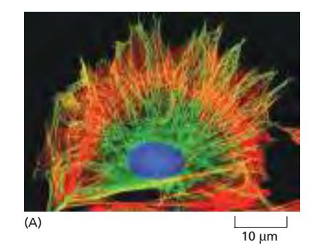

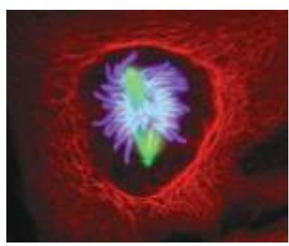

20 µm (B)

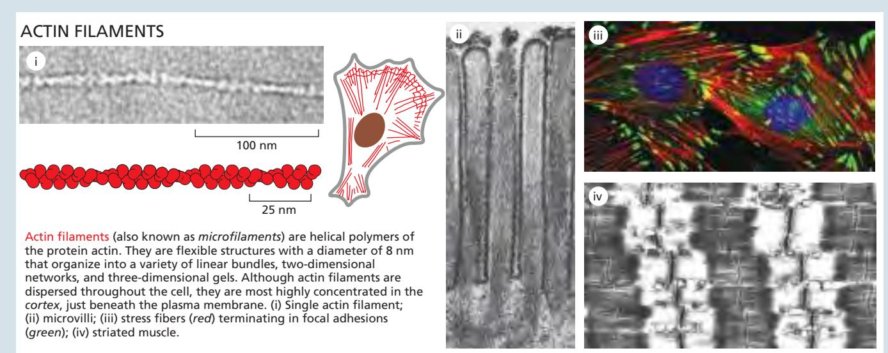

Micrographs courtesy of R. Craig (i and iv); P.T. Matsudaira and D.R. Burgess (ii); K. Burridge (iii).

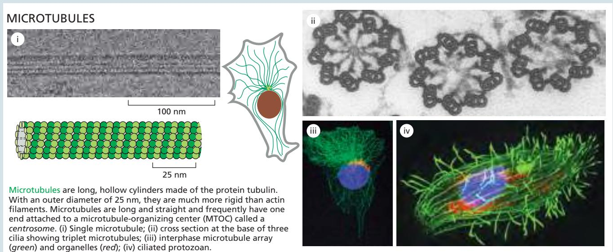

Micrographs courtesy of R. Wade (i); D.T. Woodrow and R.W. Linck (ii); J. Seemann (iii); D. Burnette (iv).

Publishing Group. Reproduced with permission of SNCSC.

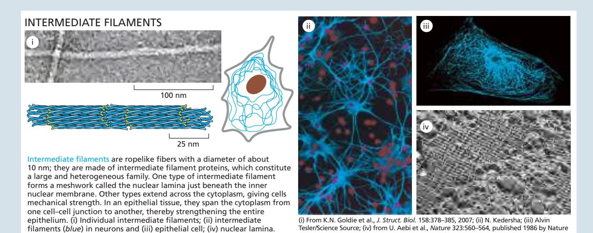

# Cytoskeletal Filaments Are Dynamic, but Can Nevertheless Form Stable Structures

Cytoskeletal systems are dynamic and adaptable, organized more like ant trails than interstate highways. A single trail of ants may persist for many hours, extending from the ant nest to a delectable picnic site, but the individual ants within the trail are anything but static. If the ant scouts find a new and better source of food or if the picnickers clean up and leave, the dynamic structure adapts with astonishing rapidity. In a similar way, large-scale cytoskeletal structures can change or persist, according to need, lasting for lengths of time ranging from less than a minute up to the cell's lifetime. But the individual macromolecular components that make up these structures are in a constant state of flux. As a result, like the alteration of an ant trail, a structural rearrangement in a cell requires little extra energy when conditions change.

Regulation of the dynamic behavior and assembly of cytoskeletal filaments allows eukaryotic cells to build an enormous range of structures from the three basic filament systems. The micrographs in **Panel 16–1** illustrate some of these structures. Actin filaments underlie the plasma membrane of animal cells in a layer called the *cell cortex*, providing strength and shape to the thin lipid bilayer. They also form many types of cell-surface projections. Some of these are dynamic structures, such as the *filopodia*, *lamellipodia*, and *pseudopodia* that cells use to explore territory and move around. More stable arrays allow cells to brace themselves against an underlying substratum and enable muscle to contract. The regular bundles of *stereocilia* on the surface of hair cells in the inner ear contain stable bundles of actin filaments that tilt as rigid rods in response to sound, and the *microvilli* on the surface of intestinal epithelial cells vastly increase the apical cell-surface area to enhance nutrient absorption. In plants, actin filaments drive rapid streaming of the cytoplasm inside cells.

Microtubules, which are frequently found in a cytoplasmic array that extends to the cell periphery, can quickly rearrange themselves to form a bipolar *mitotic spindle* during cell division. They can also form *cilia*, which function as motile whips or sensory devices on the surface of the cell, or tightly aligned bundles that serve as tracks for the transport of materials down long neuronal axons. In plant cells, organized arrays of microtubules help to direct the pattern of cell-wall synthesis, and in many protozoans they form the framework upon which the entire cell is built.

Intermediate filaments line the inner face of the nuclear envelope, forming a protective cage for the cell's DNA; in the cytosol, they are twisted into strong cables that can hold epithelial cell sheets together or help nerve cells to extend long and robust axons, and they allow us to form tough appendages such as hair and fingernails.

An important and dramatic example of rapid reorganization of the cytoskeleton occurs during cell division, as shown in **Figure 16–2** for a fibroblast growing in a tissue-culture dish. After the chromosomes have replicated, the interphase microtubule array that spreads throughout the cytoplasm is reconfigured into the bipolar *mitotic spindle*, which transfers the two copies of each chromosome into separate daughter nuclei. At the same time, the specialized actin structures that enable the fibroblast to crawl across the surface of the dish rearrange so that the cell stops moving and assumes a more spherical shape. Actin and its associated motor protein myosin then form a belt around the middle of the cell, the *contractile ring*, which constricts like a tiny muscle to pinch the cell in two. When division is complete, the cytoskeletons of the two daughter fibroblasts recreate their interphase structures, thereby converting the two rounded-up daughter cells into smaller versions of the flattened, crawling mother cell.

Many cells require rapid cytoskeletal rearrangements for their normal functioning during interphase as well. For example, the *neutrophil*, a type of white blood cell, chases and engulfs bacterial and fungal cells that accidentally gain

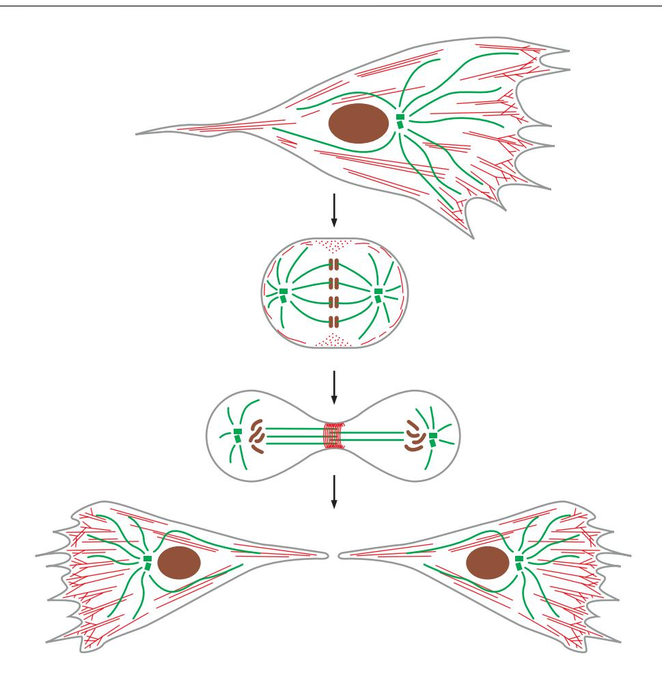

Figure 16–2 Diagram of changes in cytoskeletal organization associated with cell division. The crawling fibroblast drawn here has a polarized, dynamic actin cytoskeleton (shown in *red*) that assembles lamellipodia and filopodia to push its leading edge toward the right. The polarization of the actin cytoskeleton is assisted by the microtubule cytoskeleton *(green)*, consisting of long microtubules that emanate from a microtubule-organizing center located in front of the nucleus. When the cell divides, actin filaments are reorganized and the cell assumes a spherical shape. The polarized microtubule array rearranges to form a bipolar mitotic spindle, which is responsible for aligning and then segregating the duplicated chromosomes *(brown)*. After chromosome segregation, the actin filaments form a contractile ring at the center of the cell that pinches the cell in two. Then the two daughter cells reorganize their microtubule and actin cytoskeletons into smaller versions of those that were present in the mother cell, enabling them to crawl their separate ways.

access to the normally sterile parts of the body, as through a cut in the skin. Like most crawling cells, neutrophils advance by extending a protrusive structure filled with newly polymerized actin filaments. When the elusive bacterial prey moves in a different direction, the neutrophil can reorganize its polarized protrusive structures within seconds (**Figure 16–3**).

#### The Cytoskeleton Determines Cellular Organization and Polarity

In cells that have achieved a stable, differentiated morphology—such as mature neurons or epithelial cells—the dynamic elements of the cytoskeleton produce stable, large-scale structures for cellular organization. For example, on the specialized epithelial cells that line organs such as the intestine and the lung, cytoskeletal-based cell-surface protrusions including microvilli and cilia are able to maintain a constant location, length, and diameter over the entire lifetime of the cell. For the actin bundles at the cores of microvilli on intestinal epithelial cells, this is only a few days. But the actin bundles at the cores of

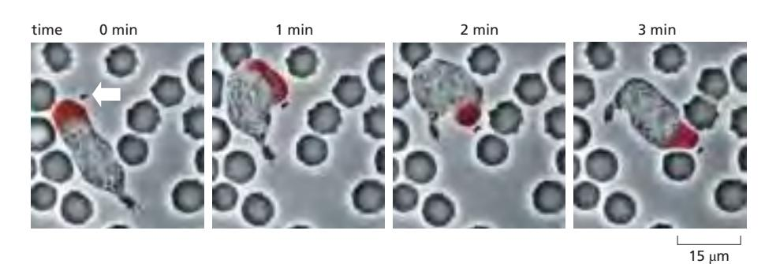

Figure 16–3 A neutrophil in pursuit of bacteria. In this preparation of human blood, a small clump of bacteria (*white arrow*) is about to be captured by a neutrophil. As the bacteria move, the neutrophil quickly reassembles the dense actin network within a *pseudopod* ("false foot") at its leading edge (highlighted in *red*) to push toward the location of the bacteria (Movie 16.1). Rapid disassembly and reassembly of the actin cytoskeleton in this cell enable it to change its orientation and direction of movement within a few minutes. (From a video recorded by David Rogers.)

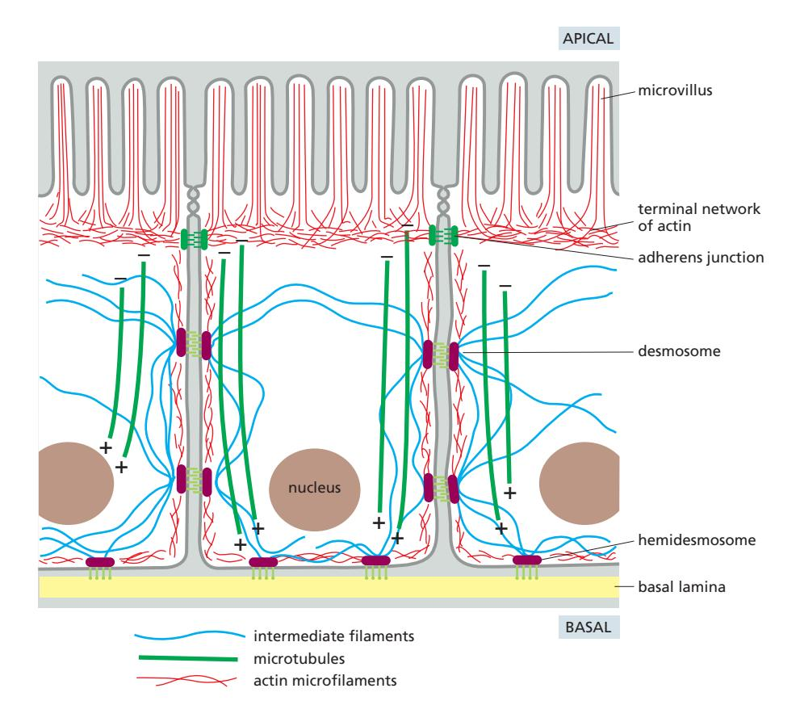

cytoskeleton in polarized epithelial cells. All the components of the cytoskeleton cooperate to produce the characteristic shapes of specialized cells, including the epithelial cells that line the small intestine, diagrammed here. At the apical (upper) surface, facing the intestinal lumen, bundled actin filaments *(red)* form microvilli that increase the cell-surface area available for absorbing nutrients from food. Below the microvilli, a circumferential band of actin filaments is connected to cell–cell adherens junctions that anchor the cells to each other. Intermediate filaments *(blue)* are anchored to other kinds of adhesive

structures, including desmosomes and hemidesmosomes, that connect the epithelial cells into a sturdy sheet and attach them to the underlying extracellular matrix; these structures are discussed in Chapter 19. Microtubules *(green)* run vertically from the top of the cell to the bottom and provide a global coordinate system that enables the cell to direct newly synthesized components to their

proper locations.

Figure 16–4 Organization of the

stereocilia on the hair cells of the inner ear must maintain their stable organization for the entire lifetime of the animal, because these cells do not turn over. Remarkably, the actin filaments in stereocilia are very stable, and polymerization and depolymerization have been observed only at their tips. We do not understand how these actin structures are maintained at a constant length for decades.

Besides forming stable, specialized cell-surface protrusions, the cytoskeleton is also responsible for large-scale cellular polarity, enabling cells to tell the difference between top and bottom or front and back. The polarity information conveyed by cytoskeletal organization is often maintained over the lifetime of the cell. For example, polarized epithelial cells use organized arrays of microtubules, actin filaments, and intermediate filaments to maintain the critical differences between the *apical surface* and the *basolateral surface*. They also must maintain strong adhesive contacts with one another to enable this single layer of cells to serve as an effective physical barrier (**Figure 16–4**). How cell polarity is established is discussed in the last part of this chapter. MBoC7 m16.04/16.04

#### Filaments Assemble from Protein Subunits That Impart Specific Physical and Dynamic Properties

Cytoskeletal filaments can reach from one end of the cell to the other, spanning tens or even hundreds of micrometers. Yet the individual protein molecules that form the filaments are only a few nanometers in size. The cell builds the filaments by assembling large numbers of the small subunits, like building a skyscraper out of bricks. Because these subunits are small, they can diffuse rapidly in the cytosol, whereas the assembled filaments cannot. In this way, cells can undergo rapid structural reorganizations, disassembling filaments at one site and reassembling them at another site far away.

Actin filaments and microtubules are built from subunits that are compact and globular—*actin subunits* for actin filaments and *tubulin subunits* for microtubules—whereas intermediate filaments are made up of subunits that are themselves elongated and fibrous. All three major types of cytoskeletal filaments form as polymeric assemblies of subunits that self-associate, using a combination of end-to-end and side-to-side protein contacts. Whereas covalent linkages between their subunits hold together the backbones of many biological polymers—including DNA, RNA, and proteins—it is weak noncovalent interactions that hold together the three types of cytoskeletal polymers. Because covalent bonds are not being formed or broken, assembly and disassembly can occur rapidly. Differences in the structures of the subunits and how they associate with one another produce important differences in the stability and mechanical properties of each type of filament.

The subunits of actin filaments and microtubules are asymmetrical and bind to one another head-to-tail so that they all point in one direction. This subunit polarity gives the filaments structural polarity along their length and makes the two ends of each polymer behave differently. In addition, the actin and tubulin subunits are enzymes that catalyze the hydrolysis of a nucleoside triphosphate (NTP)—ATP and GTP, respectively. As we discuss later, the energy derived from NTP hydrolysis helps the filaments to remodel rapidly. It allows the cell to harness the polar and dynamic properties of these filaments to generate force in a specific direction to move the leading edge of a migrating cell forward, for example, or to pull chromosomes apart during cell division. In contrast, the subunits of intermediate filaments are symmetrical and thus do not form polarized filaments with two different ends. Intermediate filament subunits also do not catalyze the hydrolysis of ATP or GTP. Nevertheless, intermediate filaments can be disassembled rapidly when required. In mitosis, for example, kinases phosphorylate the subunits, leading to their dissociation.

Cytoskeletal filaments in living cells are not built by simply stringing subunits together in single file. A thousand tubulin subunits lined up end-to-end, for example, would span the diameter of a small eukaryotic cell, but a filament formed in this way would lack the strength to avoid breakage by ambient thermal energy, unless each subunit in the filament was bound extremely tightly to its two neighbors. Such tight binding would limit the rate at which the filaments could disassemble, making the cytoskeleton a static and less useful

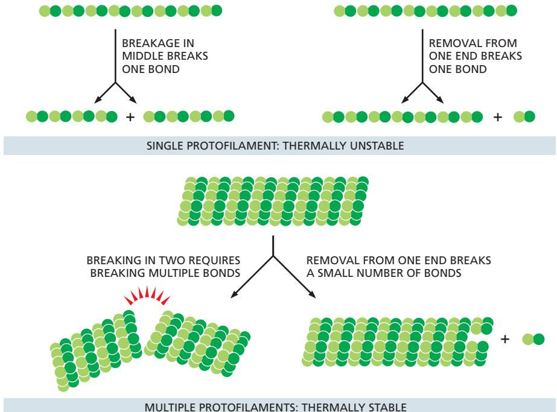

MULTIPLE PROTOFILAMENTS: THERMALLY STABLE

Figure 16–5 The thermal stability of cytoskeletal filaments with dynamic ends. A protofilament consisting of a single strand of subunits is thermally unstable, because breakage of a single bond between subunits is sufficient to break the filament. In contrast, formation of a cytoskeletal filament from more than one protofilament allows the ends to be dynamic, while enabling the filaments themselves to resist thermal breakage. In a microtubule, for example, removing a single subunit dimer from the end of the filament requires breaking noncovalent bonds with a maximum of three other subunits, whereas fracturing the filament in the middle requires breaking noncovalent bonds in all 13 protofilaments.

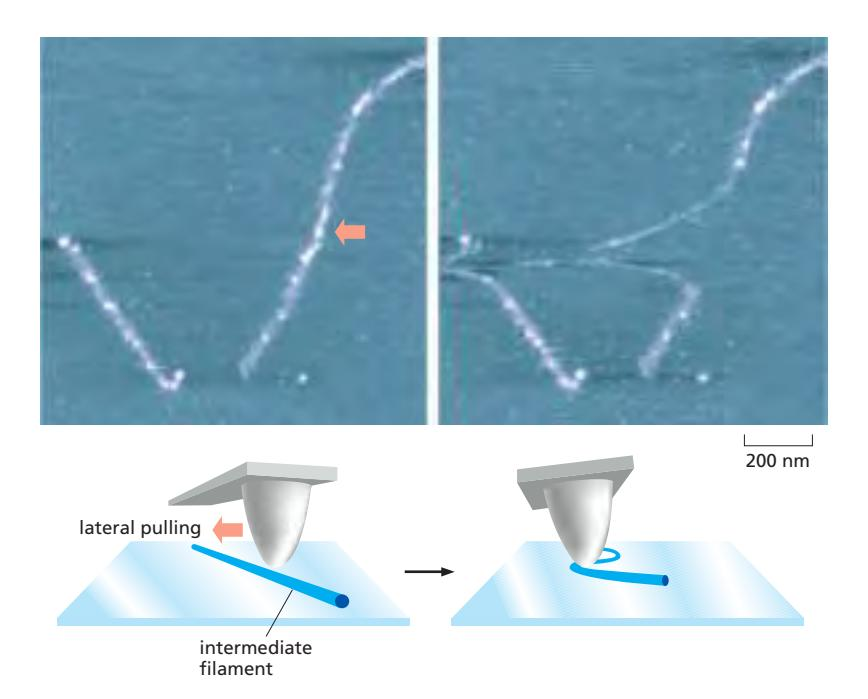

Figure 16–6 Flexibility and stretch in an intermediate filament. Intermediate filaments are formed from elongated fibrous subunits with strong lateral contacts, resulting in resistance to stretching forces. In this experiment, a tiny mechanical probe was used to rapidly scan across a surface to which intermediate filaments were adhered, providing a measurement of the height and contour of the filaments as shown in shades of *gray* to *white*. Along a single scan line *(arrow)* the applied force of the probe was increased from less than 1 nN to 30–40 nN. At this position one of the filaments stretched to more than three times its length before breaking, as illustrated in the micrographs. This technique is called atomic force microscopy. (Adapted from L. Kreplak et al., *J. Mol. Biol.* 354:569–577, 2005. With permission from Elsevier.)

structure. To provide both strength and adaptability, microtubules are built of 13 **protofilaments**—linear strings of subunits joined end to end—that associate with one another laterally to form a hollow cylinder. The addition or loss of a subunit at the end of one protofilament makes or breaks a small number of bonds. In contrast, loss of a subunit from the middle of a protofilament requires breaking many more bonds, while breaking it in two requires breaking bonds in multiple protofilaments all at the same time (**Figure 16–5**). The greater energy required to break multiple noncovalent bonds simultaneously allows microtubules to resist thermal breakage, while allowing rapid subunit addition and loss at the filament ends. Although made up of only two strands instead of 13, helical actin filament subunits also make both end-to-end and side-to-side contacts, allowing for rapid dynamics at filament ends while providing sufficient strength along the length of the filament. However, the tubular geometry of a microtubule makes it much stiffer than a two-stranded actin filament. MBoC7 m16.06/16.06

As with other specific protein–protein interactions, many hydrophobic interactions and noncovalent bonds hold the subunits in a cytoskeletal filament together (see Figure 3–4). The locations and types of subunit–subunit contacts differ for the different filaments. Intermediate filaments, for example, assemble by forming strong lateral contacts between α-helical coiled-coils, which extend over most of the length of each elongated fibrous subunit. Because the individual subunits are staggered in the filament, intermediate filaments form strong, ropelike structures that tolerate stretching and bending to a greater extent than do either actin filaments or microtubules (**Figure 16–6**).

#### Accessory Proteins and Motors Act on Cytoskeletal Filaments

The cell regulates the length and stability of its cytoskeletal filaments, their number and geometry, and their attachments to one another and to other components of the cell. Filaments can thereby form a wide variety of higher-order structures. Direct covalent modification of the filament subunits regulates some filament properties, but most of the regulation is performed by hundreds of accessory proteins that determine the spatial distribution and the dynamic behavior of the filaments, converting information received through signaling pathways into cytoskeletal action. These accessory proteins bind to the filaments or their subunits to determine the sites of assembly of new filaments, to regulate the partitioning of polymer proteins between filament and subunit forms, to change the kinetics of filament assembly and disassembly, to harness energy to gener ate force, and to link filaments to one another or to other cell structures such as organelles and the plasma membrane. In these processes, the accessory proteins bring cytoskeletal structure under the control of extracellular and intracellular signals, including those that trigger the dramatic transformations of the cytoskeleton that occur during each cell cycle. Acting in groups, the accessory proteins enable cells to maintain a highly organized but flexible internal structure and, in many cases, to move.

Among the most fascinating proteins that associate with the cytoskeleton are the motor proteins. These proteins bind to a polarized cytoskeletal filament and use the energy derived from repeated cycles of ATP hydrolysis to move along it. Dozens of different motor proteins coexist in every eukaryotic cell. They differ in the type of filament they bind to (either actin or microtubules), the direction in which they move along the filament, and the "cargo" they carry. Many motor proteins carry membrane-enclosed organelles—such as mitochondria, Golgi stacks, or secretory vesicles—to their appropriate locations in the cell. Other motor proteins cause cytoskeletal filaments to exert tension or to slide against each other, generating the force that drives such phenomena as muscle contrac tion, ciliary beating, and cell division.

Cytoskeletal motor proteins that move unidirectionally along an oriented polymer track are reminiscent of some other proteins and protein complexes dis cussed elsewhere in this book, such as DNA and RNA polymerases, helicases, and ribosomes. All of these proteins have the ability to use chemical energy to propel themselves along a linear track, with the direction of sliding dependent on the structural polarity of the track. All of them generate motion by coupling nucleoside triphosphate hydrolysis to a large-scale conformational change (see Figure 3–71).

#### Molecular Motors Operate in a Cellular Environment Dominated by Brownian Motion

Because of the microscopic size of cells, motor-based movements occur in an environment that is highly dynamic due to random thermal fluctuations called *Brownian motion*. As introduced in Chapter 1 (see p. 9), Brownian motion drives the diffusion of all of the molecules inside cells, and it is thereby critical for the rate of biochemical reactions, which require molecular collisions. Another important effect is its generation of viscous drag forces at small scales. For exam ple, a motor protein moving along a cytoskeletal filament is constantly buffeted by random collisions with water and other molecules. As soon as its motor activity ceases, the motor protein will stop dead in its tracks due to the viscous drag forces generated by these collisions.

The stopping distance for any object moving through a fluid is determined by the **Reynolds number**, which is the ratio of inertial to viscous forces acting on that object. This ratio depends on the size of the object and the velocity of its movement through the fluid. For example, whereas both a bacterium and a fish can propel themselves through water, the size and speed of the fish provide it with significant inertia, such that when it stops swimming it continues to glide through the water for some distance. In contrast, with its much smaller size and slow speed of movement, a bacterium that stops propelling itself will come to an immediate halt (**Figure 16–7**). For a fish to behave similarly, it would need to be placed in an extremely viscous medium, such as roofing tar. Inside the cell, the tiny size and slow speeds of moving molecules result in extremely low Reynolds numbers, because viscous forces are far greater than inertial forces. Thus, there is no "gliding" inside a cell.

Random Brownian motion can also be harnessed to control movement at small scales, even in the absence of motor proteins. As we describe later in this chapter, some intracellular pathogens such as the bacterium *Listeria monocytogenes* use the force of actin polymerization to move around inside a cell. This movement does not involve motor proteins. Instead, actin filaments are induced to polym erize adjacent to the bacterial surface at one end. When the bacterium randomly 956 Chapter 16: The Cytoskeleton ACTIN 957

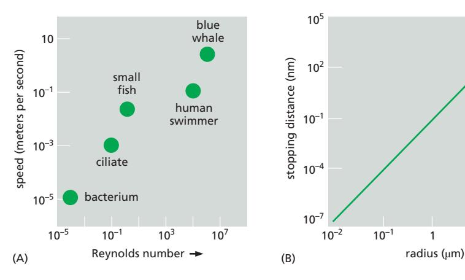

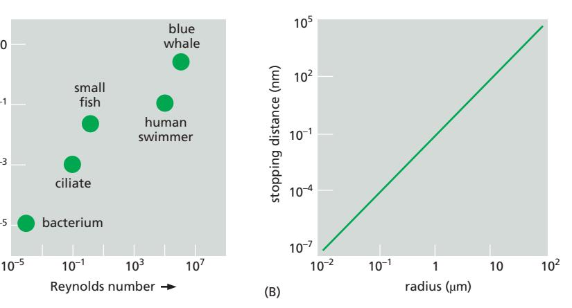

MBoC7 n1.111/1.07 Figure 16–7 Cellular life occurs at a low Reynolds number. (A) The inertia of a swimming organism is counteracted by the viscous drag of water, and the ratio of these two forces is the *Reynolds number*, which is dimensionless. As illustrated in the graph, the Reynolds number is in the range of 106 for a blue whale traveling at about 10 meters per second. For a tiny swimming bacterium moving at 10–5 meters per second, the viscosity of the water dominates and the Reynolds number decreases to about 10–4. (B) The Reynolds number indicates the extent to which an object will continue to coast or glide through a fluid after the motive force has stopped. The stopping distance in water for a sphere that has an initial velocity equal to its diameter per second is plotted. Thus, a one micron–diameter organelle would come to a halt within just a few angstroms once its forward motion ceases.

moves in the forward direction due to Brownian motion, actin quickly fills in the gap so that the bacterium cannot slip back to its original position. In this way, actin polymerization generates a force that pushes the bacterium through the cytoplasm (see Figure 16–17). A similar process drives forward movement of the plasma membrane at the leading edge of a migrating animal cell (see Figure 1–7). This phenomenon, in which random thermal motions are harnessed in a directed way, creates a *Brownian ratchet*.

#### Summary

*The cytoplasm of eukaryotic cells is spatially organized by a network of protein filaments known as the cytoskeleton. This network contains three principal types of filaments: actin filaments, microtubules, and intermediate filaments. All three types of filaments form from assemblies of subunits that self-associate using a combination of end-to-end and side-to-side protein contacts. Differences in the structure of the subunits and the manner of their self-assembly give the filaments different mechanical properties. Subunit assembly and disassembly constantly remodel all three types of cytoskeletal filaments. Actin and tubulin (the subunits of actin filaments and microtubules, respectively) bind and hydrolyze nucleoside triphosphates (ATP and GTP, respectively) and assemble head-to-tail to generate polarized filaments capable of generating force. In living cells, accessory proteins including molecular motors modulate the dynamics and organization of cytoskeletal filaments, resulting in complex events such as cell division, migration, or muscle contraction, and generating elaborate cellular architecture to form polarized tissues such as epithelia.* 

# ACTIN

The actin cytoskeleton performs a wide range of functions in diverse cell types. Each actin subunit, sometimes called globular or G-actin, is a 375-amino-acid polypeptide carrying a tightly associated molecule of ATP or ADP (**Figure 16–8A**). Actin is extraordinarily well conserved among eukaryotes. The amino acid sequences of actins from different eukaryotic species are usually about 90% identical. Small variations in actin amino acid sequence can cause significant functional differences: In vertebrates, for example, there are three isoforms of

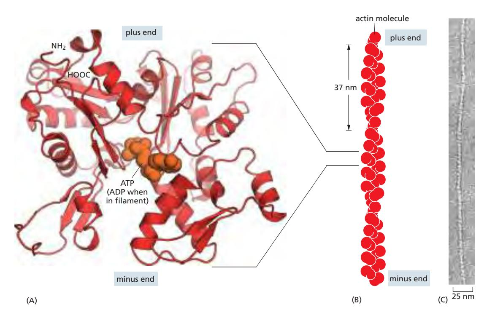

Figure 16–8 The structures of an actin monomer and actin filament. (A) The actin monomer has either ATP or ADP bound in a deep cleft in the center of the molecule. (B) Arrangement of monomers in a filament consisting of two protofilaments, held together by lateral contacts, which wind around each other as two parallel strands of a helix, with a twist repeating every 37 nm. All the subunits within the filament have the same orientation. (C) Electron micrograph of negatively stained actin filament. (C, courtesy of Roger Craig.)

actin, termed α, β, and γ, that differ slightly in their amino acid sequences and have distinct functions. α-Actin is expressed only in muscle cells, while β- and γ-actins are found together in almost all non-muscle cells. MBoC7 m16.11/16.08

# Actin Subunits Assemble Head-to-Tail to Create Flexible, Polar Filaments

Actin subunits assemble head-to-tail to form a tight, right-handed helix, forming a structure about 8 nm wide called filamentous or F-actin (**Figure 16–8B and C**). Because the asymmetrical actin subunits of a filament all point in the same direction, filaments are polar and have structurally different ends: a slowergrowing *minus end* and a faster-growing *plus end*. The minus end is also referred to as the *pointed end* and the plus end as the *barbed end* because of the arrowhead appearance of the complex formed between actin filaments and the motor protein myosin visible in electron micrographs (**Figure 16–9**). Within the filament, the subunits are positioned with their ATP-binding cleft directed toward the minus end.

Individual actin filaments are quite flexible. The stiffness of a filament can be characterized by its *persistence length*, the minimum filament length at which random thermal fluctuations are likely to cause it to bend. The persistence length of an actin filament is only a few tens of micrometers. In a living cell, however, accessory proteins frequently cross-link and bundle the filaments together, making largescale actin structures that are much more rigid than an individual actin filament.

#### Nucleation Is the Rate-limiting Step in the Formation of Actin Filaments

The regulation of actin filament formation is an important mechanism by which cells control their shape and movement. Actin subunits can spontaneously bind one another, but the association is unstable until subunits assemble into an initial 958 Chapter 16: The Cytoskeleton ACTIN 959

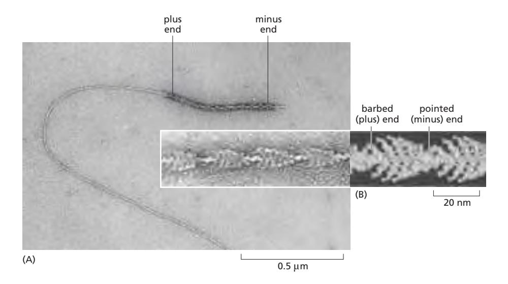

Figure 16–9 Structural polarity of the actin filament. (A) This electron micrograph shows an actin filament polymerized from a short actin filament seed that was decorated with myosin motor domains, resulting in an arrowhead pattern. The filament has grown much faster at the barbed (plus) end than at the pointed (minus) end. (B) Enlarged image and model showing the arrowhead pattern. (A, courtesy of Tom Pollard; B, adapted from M. Whittaker et al., *Ultramicroscopy* 58:245–259, 1995. With permission from Elsevier.)

oligomer, or nucleus, that is stabilized by multiple subunit–subunit contacts and can then elongate rapidly by addition of more subunits. This process is called filament *nucleation*.

Many features of actin nucleation and polymerization have been studied with purified actin in a test tube (**Figure 16–10**). The instability of smaller actin oligomers makes nucleation inefficient. When polymerization is initiated, this results in a lag phase during which no filaments are observed. During this lag phase, however, the small, unstable oligomers gradually succeed in making the transition to a more stable form that resembles an actin filament. This leads to a phase of rapid filament elongation during which subunits are added quickly to the ends of the nucleated filaments (Figure 16–10A). Finally, as the concentration of actin monomers declines, the system approaches a steady state at which the rate of addition of new subunits to the filament ends exactly balances the rate of subunit dissociation. The concentration of free subunits left in solution at this point is called the *critical concentration*, *C*c. As explained in **Panel 16–2**, the MBoC7 m16.12/16.09

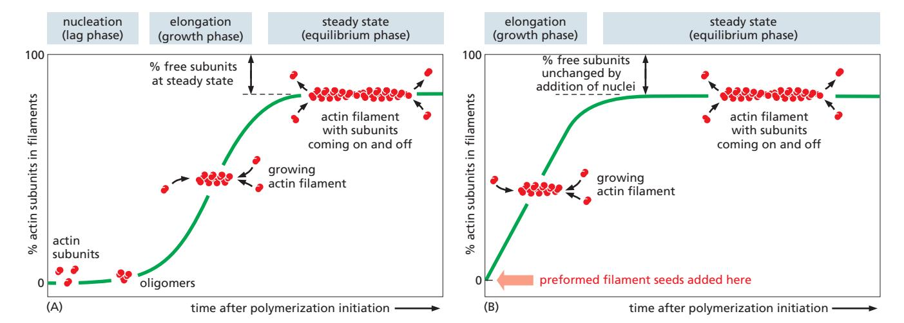

Figure 16–10 The time course of actin polymerization. Purified actin subunits were induced to polymerize in a test tube. (A) Polymerization of actin subunits into filaments occurs after a lag phase. (B) Polymerization occurs more rapidly in the presence of preformed fragments of actin filaments, which act as nuclei for filament growth. The percent (%) free subunits after polymerization reflects the critical concentration (*C*c), at which there is no net change in polymer. The *C*c has a constant value of ∼0.1 μM, but the percent of actin subunits in filaments varies depending on how much actin is present in the reaction. Actin polymerization is often studied by observing the change in the light emission from a fluorescent probe, called pyrene, that has been covalently attached to the actin. Pyrene-actin fluoresces more brightly when it is incorporated into actin filaments.

#### ON RATES AND OFF RATES

A linear polymer of protein molecules, such as an actin filament or a microtubule, assembles (polymerizes) and disassembles (depolymerizes) by the addition and removal of subunits at the ends of the polymer. The rate of addition of these subunits (called monomers) is given by the rate constant *k*on, which has units of M–1 sec–1. The rate of loss is given by *k*off (units of sec–1).

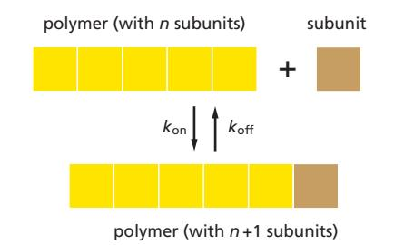

#### NUCLEATION

A helical polymer is stabilized by multiple contacts between adjacent subunits. In the case of actin, two actin molecules bind relatively weakly to each other, but addition of a third actin monomer to form a trimer makes the entire group more stable.

Further monomer addition can take place onto this trimer, which therefore acts as a nucleus for polymerization. For tubulin, the nucleus is larger and has a more complicated structure (possibly a ring of 13 or more tubulin molecules)—but the principle is the same.

 The assembly of a nucleus is relatively slow, which explains the lag phase seen during polymerization. The lag phase can be reduced or abolished entirely by adding premade nuclei, such as fragments of already polymerized microtubules or actin filaments.

#### THE CRITICAL CONCENTRATION

The number of monomers that add to the polymer (actin filament or microtubule) per second will be proportional to the concentration of the free subunit (*k*on*C*), but the subunits will leave the polymer end at a constant rate (*k*off) that does not depend on *C*. As the polymer grows, subunits are used up, and *C* is observed to drop until it reaches a constant value, called the critical concentration (*C*c). At this concentration, the rate of subunit addition equals the rate of subunit loss.

At this equilibrium,

$$k_{\text{on}}C = k_{\text{off}}$$

so that

so that 
$$C_{\rm c} = \frac{k_{\rm off}}{k_{\rm on}} = K_{\rm d}$$

where *K*d is the dissociation constant.

#### TIME COURSE OF POLYMERIZATION

The *in vitro* assembly of a protein into a long polymer such as a cytoskeletal filament typically shows the following time course:

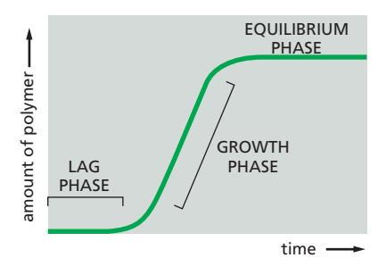

The lag phase corresponds to time taken for nucleation.

The growth phase occurs as monomers add to the exposed ends of the growing filament, causing filament elongation.

The equilibrium phase, or steady state, is reached when the growth of the polymer due to monomer addition precisely balances the shrinkage of the polymer due to disassembly back to monomers.

#### PLUS AND MINUS ENDS

The two ends of an actin filament or microtubule polymerize at different rates. The fast-growing end is called the plus end, whereas the slow-growing end is called the minus end. The difference in the rates of growth at the two ends is made possible by changes in the conformation of each subunit as it enters the polymer.

This conformational change affects the rates at which subunits add to the two ends.

 Even though *k*on and *k*off will have different values for the plus and minus ends of the polymer, their ratio *k*off/*k*on—and hence *C*c—must be the same at both ends for a simple polymerization reaction (no ATP or GTP hydrolysis). This is because exactly the same subunit interactions are broken when a subunit is lost at either end, and the final state of the subunit after dissociation is identical. Therefore, the Δ*G* for subunit

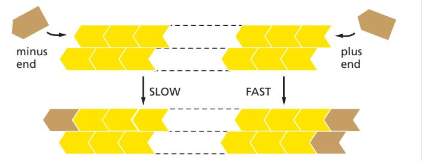

loss, which determines the equilibrium constant for its association with the end, is identical at both ends: if the plus end grows four times faster than the minus end, it must also shrink four times faster. Thus, for *C* > *C*c, both ends grow; for *C* < *C*c, both ends shrink.

 The nucleoside triphosphate hydrolysis that accompanies actin and tubulin polymerization removes this constraint.

#### NUCLEOTIDE HYDROLYSIS

Each actin molecule carries a tightly bound ATP molecule that is hydrolyzed to a tightly bound ADP molecule soon after its assembly into the polymer. Similarly, each tubulin molecule carries a tightly bound GTP molecule that is converted to a tightly bound GDP molecule soon after the molecule assembles into the polymer.

Hydrolysis of the bound nucleotide reduces the binding affinity of the subunit for neighboring subunits and makes it more likely to dissociate from each end of the filament. It is usually the form that adds to the filament and the form that leaves. T

Considering events at the plus end only:

$$\begin{array}{c|c} D \setminus D \setminus D \setminus D \setminus D \setminus T \\ \hline D \setminus D \setminus D \setminus D \setminus D \setminus D \\ \hline \end{array}$$

As before, the polymer will grow until *C* = *C*c. For illustrative purposes, we can ignore *k*D on and *k*T off since they are usually very small, so that polymer growth ceases when

$$k_{\text{on}}^{\text{T}} C = k_{\text{off}}^{\text{D}}$$
 or  $C_{\text{c}} = \frac{k_{\text{off}}^{\text{D}}}{k_{\text{on}}^{\text{T}}}$ 

D This is a steady state and not a true equilibrium, because the ATP or GTP that is hydrolyzed must be replenished by a nucleotide exchange reaction of the free subunit ( ). T

#### ATP CAPS AND GTP CAPS

The rate of addition of subunits to a growing actin filament or microtubule can be faster than the rate at which their bound nucleotide is hydrolyzed. Under such conditions, the end has a "cap" of subunits containing the nucleoside triphosphate—an ATP cap on an actin filament or a GTP cap on a microtubule.

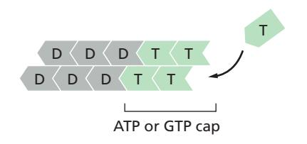

DYNAMIC INSTABILITY and TREADMILLING are two behaviors observed in cytoskeletal polymers. Both are associated with nucleoside triphosphate hydrolysis. Dynamic instability is believed to predominate in microtubules, whereas treadmilling may predominate in actin filaments.

#### TREADMILLING

One consequence of the nucleotide hydrolysis that accompanies polymer formation is to change the critical concentration at the two ends of the polymer. Because *k*D off and *k*T on refer to different reactions, their ratio *k*D off/*k*T on need not be the same at both ends of the polymer, so that:

#### *C*c (minus end) > *C*c (plus end)

Thus, if both ends of a polymer are exposed, polymerization proceeds until the concentration of free monomer reaches a value that is above *C*c for the plus end but below *C*c for the minus end. At this steady state, subunits undergo a net assembly at the plus end and a net disassembly at the minus end at an identical rate. The polymer maintains a constant length, even though there is a net flux of subunits through the polymer, known as treadmilling.

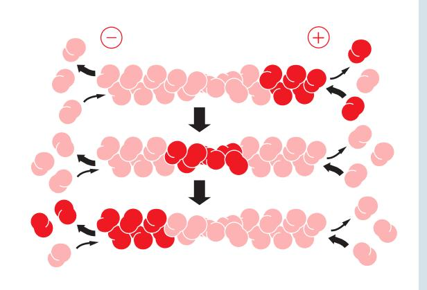

#### DYNAMIC INSTABILITY

Microtubules depolymerize about 100 times faster from an end containing GDP-tubulin than from one containing GTP-tubulin. A GTP cap favors growth, but if it is lost, then depolymerization ensues.

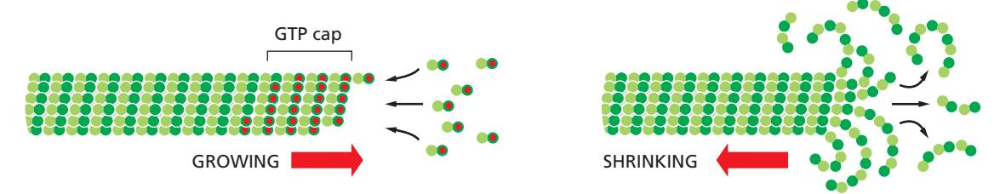

Individual microtubules can therefore alternate between a period of growth and a period of rapid disassembly, a phenomenon called dynamic instability.

value of the critical concentration is equal to the rate constant for subunit loss divided by the rate constant for subunit addition; that is, *C*c = *k*off/*k*on, which is equal to the dissociation constant, *K*d, and the inverse of the equilibrium constant, *K* (see Figure 3–42). In a test tube, the *C*c for actin polymerization—that is, the free actin monomer concentration at which the fraction of actin in the polymer stops increasing—is about 0.1 μM. Inside the cell, the concentration of unpolymerized actin is much higher than this, and the cell has evolved mechanisms to prevent most of its monomeric actin from assembling into filaments, as we discuss later.

The lag phase in filament growth is eliminated if preexisting seeds (such as fragments of actin filaments) are added to the solution at the beginning of the polymerization reaction (Figure 16–10B). The cell takes great advantage of the barrier to nucleation: it uses special proteins to catalyze filament nucleation at specific sites, thereby determining the location at which new actin filaments are assembled.

# Actin Filaments Have Two Distinct Ends That Grow at Different Rates

Because of the uniform orientation of asymmetrical actin subunits in the filament, the structures at its two ends are different. This orientation makes the two ends of each polymer different in ways that have a profound effect on filament growth rates. The kinetic rate constants for actin subunit association and dissociation *k*on and *k*off, respectively—are much greater at the plus end than at the minus end. This can be seen when an excess of purified actin monomers is allowed to assemble onto polarity-marked filaments—the plus end of the filament elongates up to 10 times faster (see Figure 16–9). If filaments are rapidly diluted so that the free subunit concentration drops below the critical concentration, the plus end also depolymerizes faster.

It is important to note, however, that the two ends of an actin filament have the same net affinity for actin subunits, if all of the subunits are bound to either ATP or ADP. Addition of a subunit to either end of a filament of *n* subunits results in a filament of *n* + 1 subunits. Thus, the free-energy difference, and therefore the equilibrium constant (and the critical concentration), must be the same for addition of subunits at either end of the polymer. In this case, the ratio of the rate constants, *k*off/*k*on, must be identical at the two ends, even though the absolute values of these rate constants are very different at each end (see Panel 16–2).

The cell takes advantage of actin filament dynamics and polarity to do mechanical work. Filament elongation proceeds spontaneously when the free-energy change (∆*G*) for addition of the soluble subunit is less than zero. This is the case when the concentration of subunits in solution exceeds the critical concentration. A cell can couple an energetically unfavorable process to this spontaneous process; thus, the cell can use free energy released during spontaneous filament polymerization to move an attached load. For example, by orienting the fastgrowing plus ends of actin filaments toward its leading edge, a motile cell can push its plasma membrane forward, as we discuss later.

#### ATP Hydrolysis Within Actin Filaments Leads to Treadmilling at Steady State

Thus far in our discussion of actin filament dynamics, we have ignored the critical fact that actin can catalyze the hydrolysis of the nucleoside triphosphate ATP. For free actin subunits, this hydrolysis proceeds very slowly; however, it is accelerated when the subunits are incorporated into filaments. Shortly after ATP hydrolysis occurs, the free phosphate group is released from each subunit, but the ADP remains trapped in the filament structure. Thus, two different types of filament structures can exist, one in the ATP-bound *T form* and one in the ADP-bound *D form*.

962 Chapter 16: The Cytoskeleton ACTIN 963

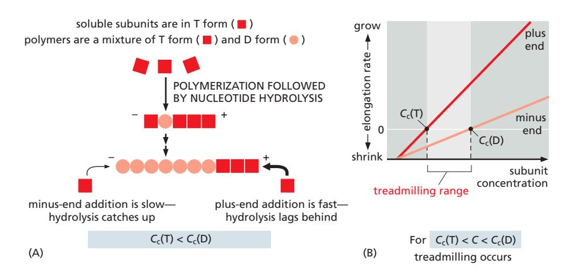

When the ATP is hydrolyzed, much of the free energy released by cleavage of the phosphate–phosphate bond is stored in the polymer. This makes the free-energy change for dissociation of a subunit from the D-form polymer more negative than the free-energy change for dissociation of a subunit from the T-form polymer. Consequently, the ratio of *k*off/*k*on for the D-form polymer, which is numerically equal to its critical concentration [*C*c(D)], is larger than the corresponding ratio for the T-form polymer. Thus, *C*c(D) is greater than *C*c(T). At certain concentrations of free subunits, D-form polymers will therefore shrink while T-form polymers grow. MBoC7 m16.14/16.11

In living cells, most soluble actin subunits are in the T form, as the free concentration of ATP is about tenfold higher than that of ADP. However, the longer the time that subunits have been in the actin filament, the more likely they are to have hydrolyzed their ATP. Whether the subunit at each end of a filament is in the T or the D form depends on the rate of this hydrolysis compared with the rate of subunit addition. If the concentration of actin monomers is greater than the critical concentration for both the T-form and D-form polymers, then subunits will add to the polymers at both ends before the ATP in the previously added subunits is hydrolyzed; as a result, the tips of the actin filament will remain in the T form*.* On the other hand, if the subunit concentration is less than the critical concentrations for both the T-form and D-form polymers, then hydrolysis may occur before the next subunit is added, and both ends of the filament will be in the D form and will shrink. At intermediate concentrations of actin subunits, it is possible for the rate of subunit addition to be faster than ATP hydrolysis at the plus end but slower than ATP hydrolysis at the minus end. In this case, the plus end of the filament remains in the T conformation, while the minus end adopts the D conformation. The filament then undergoes a net addition of subunits at the plus end while simultaneously losing subunits from the minus end. This leads to the remarkable property of filament **treadmilling** (**Figure 16–11**; see Panel 16–2).

At a particular intermediate subunit concentration, the filament growth at the plus end exactly balances the filament shrinkage at the minus end. Under these conditions, the subunits cycle rapidly between the free and filamentous states, while the total length of the filament remains unchanged. This *steady-state treadmilling* requires a constant consumption of energy in the form of ATP hydrolysis.

# The Functions of Actin Filaments Are Inhibited by Both Polymer-stabilizing and Polymer-destabilizing Chemicals

Chemical compounds that stabilize or destabilize actin filaments are important tools in studies of the filaments' dynamic behavior and function in cells. The *cytochalasins* are fungal products that prevent actin polymerization by binding to the plus end of actin filaments. *Latrunculin* prevents actin polymerization by binding to actin subunits. The *phalloidins* are toxins isolated from the *Amanita* mushroom that bind tightly all along the side of actin filaments and stabilize them

Figure 16–11 Treadmilling of an actin filament, made possible by the ATP hydrolysis that follows subunit addition. (A) Explanation for the different critical concentrations (*C*c) at the plus and minus ends. Subunits with bound ATP (T-form subunits) polymerize at both ends of a growing filament and then undergo ATP hydrolysis within the filament. As the filament grows, elongation is faster than hydrolysis at the plus end in this example, and the terminal subunits at this end are therefore always in the T form. However, hydrolysis is faster than elongation at the minus end, and so terminal subunits at this end are in the D form. (B) Treadmilling occurs at intermediate concentrations of free subunits. The critical concentration for polymerization on a filament end in the T form, *C*c(T), is lower than that for a filament end in the D form, *C*c(D). If the actual subunit concentration is somewhere between these two values, the plus end grows while the minus end shrinks, resulting in treadmilling.

| TABLE 16–1 Chemical Inhibitors of Actin and Microtubules |                        |                         |                  |     |
| -------------------------------------------------------- | ---------------------- | ----------------------- | ---------------- | --- |
| Chemical                                                 | Effect on filaments | Mechanism               | Original source  |     |
| Actin                                                    |                        |                         |                  |     |
| Latrunculin                                              | Depolymerizes          | Binds actin subunits    | Sponges          |     |
| Cytochalasin B                                           | Depolymerizes          | Caps filament plus ends | Fungi            |     |
| Phalloidin                                               | Stabilizes             | Binds along filaments   | Amanita mushroom |     |
| Microtubules                                             |                        |                         |                  |     |
| Taxol (paclitaxel)                                       | Stabilizes             | Binds along filaments   | Yew tree         |     |
| Nocodazole                                               | Depolymerizes          | Binds tubulin subunits  | Synthetic        |     |
| Colchicine                                               | Depolymerizes          | Caps both filament ends | Autumn crocus    |     |

against depolymerization. All of these compounds cause dramatic changes in the actin cytoskeleton and are toxic to cells, indicating that the function of actin filaments depends on a dynamic equilibrium between filaments and actin monomers (**Table 16–1**).

#### Actin-binding Proteins Influence Filament Dynamics and Organization

In a test tube, polymerization of actin is controlled simply by its concentration, as described earlier, and by pH and the concentrations of salts and ATP. Within a cell, however, actin behavior is also regulated by numerous accessory proteins that bind actin monomers or filaments (summarized in **Panel 16–3**). At steady state *in vitro*, when the monomer concentration is 0.1 μM, filament half-life, a measure of how long an individual actin monomer spends in a filament as it treadmills, is approximately 30 minutes. In a non-muscle vertebrate cell, the actin half-life in filaments is only 30 seconds, demonstrating that cellular factors modify the dynamic behavior of actin filaments. Actin-binding proteins dramatically alter actin filament dynamics through spatial and temporal control of filament nucleation, elongation, and depolymerization. They also regulate the association of actin with membranes as well as how filaments are organized. In the following sections, we describe the ways in which these accessory proteins modify actin function in the cell, enabling actin polymerization to generate the forces required to support, shape, and move cellular membranes.

# Actin Nucleation Is Tightly Regulated and Generates Branched or Straight Filaments

In most non-muscle vertebrate cells, approximately 50% of the actin is in filaments and 50% is soluble—and yet the soluble monomer concentration is 50–200 μM, well above the critical concentration. Why does so little of the actin polymerize into filaments? A major reason is that actin filament polymerization is tightly regulated in cells by a large number of proteins that control actin filament nucleation, almost always adjacent to a membrane surface. Proteins that contain actin monomer binding motifs linked in tandem mediate the simplest mechanism of filament nucleation. These actin-nucleating proteins bring several actin subunits together to form a seed. In most cases, actin nucleation is catalyzed by one of two different factors: the Arp2/3 complex or the formins. The first of these is a complex of proteins that includes two *actinrelated proteins*, or *ARPs*, each of which is about 45% identical to actin. The **Arp2/3 complex** nucleates actin filament growth and remains bound to the

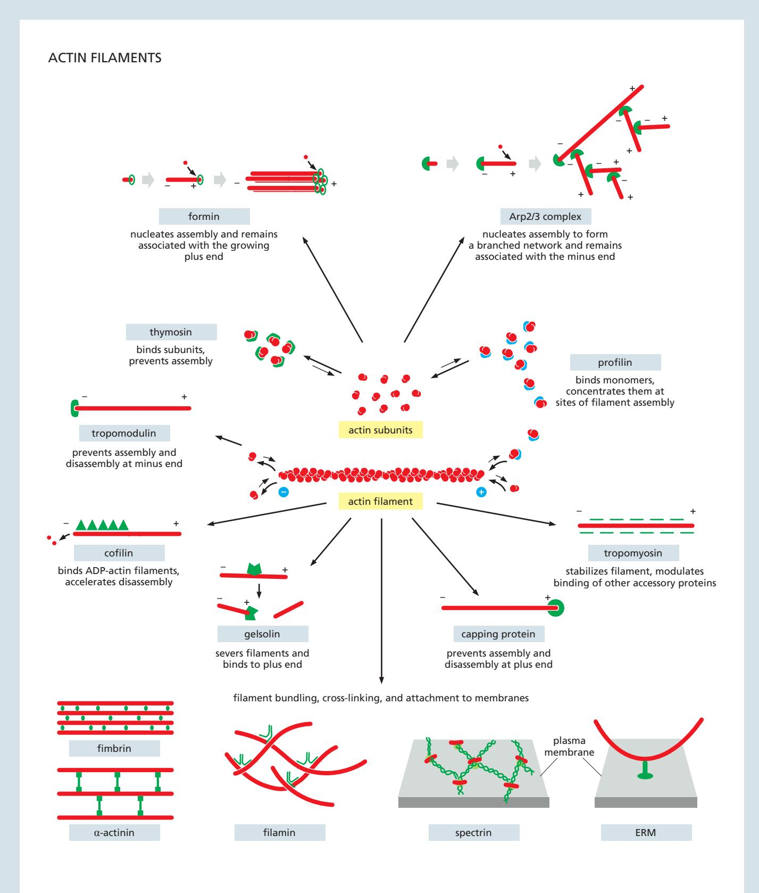

Some of the major accessory proteins of the actin cytoskeleton. Except for the myosin motor proteins, an example of each major type is shown. Each of these is discussed in the text. However, most cells contain more than a hundred different actin-binding proteins, and it is likely that there are important types of actin-associated proteins that are not yet recognized. minus end, allowing rapid elongation at the plus end (**Figure 16–12A and B**). Arp2/3 complex–mediated actin filament nucleation requires the activity of a nucleation-promoting factor (NPF). The Arp2/3 complex is further stimulated when it attaches to the side of a preexisting actin filament. Thus, Arp2/3 complex activation generates a branched array of actin filaments adjacent to a membrane, building individual filaments into a treelike network

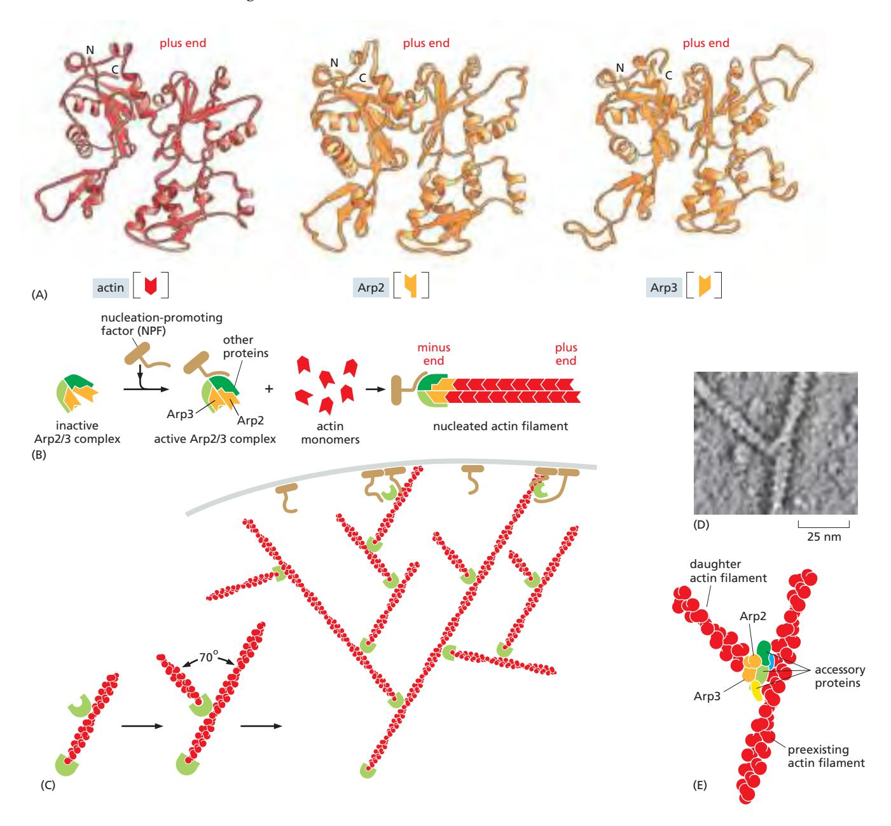

MBoC7 m16.16/16.12 Figure 16–12 Nucleation and branching of actin filaments by the Arp2/3 complex. (A) The structures of Arp2 and Arp3 compared to the structure of actin. Although the face of the molecule equivalent to the plus end *(top)* in both Arp2 and Arp3 is very similar to the plus end of actin itself, differences on the sides and minus end prevent these actin-related proteins from forming filaments on their own or coassembling into filaments with actin. (B) A model for actin filament nucleation by the Arp2/3 complex. In the absence of an activating factor, Arp2 and Arp3 are held by their accessory proteins in an orientation that prevents them from nucleating a new actin filament. When a nucleation-promoting factor (NPF; *brown*) binds the complex, Arp2 and Arp3 are brought together into a new configuration that resembles the plus end of an actin filament. Actin subunits can then assemble onto this structure, bypassing the rate-limiting step of filament nucleation. In cells, NPF activation required to induce Arp2/3-dependent nucleation occurs at membrane surfaces. (C) The Arp2/3 complex nucleates filaments most efficiently when it is bound to the side of a preexisting actin filament. The result is a filament branch that grows at a 70° angle relative to the original filament. Repeated rounds of branching nucleation result in a treelike web of actin filaments. (D) Electron micrograph of a branched actin filament formed by mixing purified actin subunits with purified Arp2/3 complexes. (E) Diagram showing the position of the Arp2/3 complex at the branch between the preexisting mother filament and the daughter filament. (D, from I. Rouiller et al., *J. Cell Biol.* 180:887–895, 2008. © 2008A. Rouiller et al. Originally published in *J. Cell Biol.* 180:887–895. https://doi.org/10.1083/jcb.200709092. With permission from Rockefeller University Press.)

966 Chapter 16: The Cytoskeleton ACTIN 967

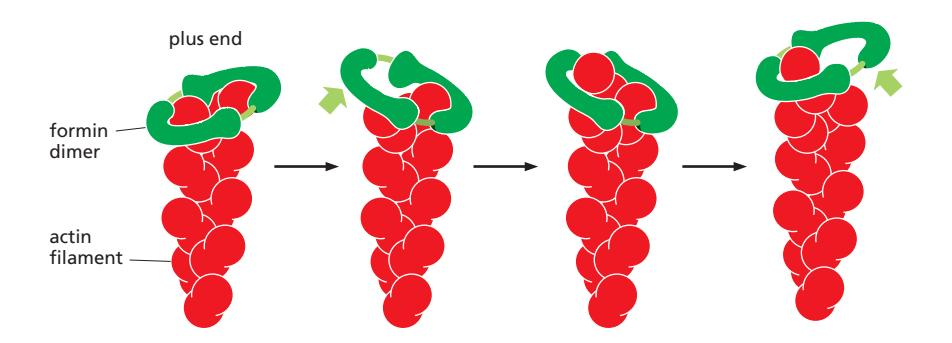

(**Figure 16–12C, D, and E**). Cells express multiple NPFs, each of which makes branched actin networks that are used to initiate various actin polymerizationdependent processes, such as transport of membrane-bound vesicles across short distances within the cell, the formation of *adherens junctions* (see Chapter 19), and *phagocytosis* (see Figure 13–70). As discussed below, NPF-driven actin polymerization frequently plays a direct role in protrusion of the leading edge of the cell during cell migration.

**Formins** are dimeric proteins that nucleate the growth of unbranched filaments that can be cross-linked by other proteins to form parallel bundles. Each formin subunit has a binding site for monomeric actin, and the formin dimer appears to nucleate actin filament polymerization by capturing two monomers. As the newly nucleated filament grows, the formin dimer remains associated with the rapidly growing plus end while still allowing the addition of new subunits at that end (**Figure 16–13**). This mechanism of filament assembly is clearly different from that used by the Arp2/3 complex, which remains stably bound to the filament minus end, preventing subunit addition or loss at that end. In addition to their role in actin nucleation, formin proteins also dramatically accelerate actin filament growth. Formins mediate assembly of a variety of cellular structures that contain polarized actin cables, including filopodia, stress fibers, and the contractile ring. MBoC7 m16.17/16.13

Actin filament nucleation by the Arp2/3 complex and formins occurs primarily at the plasma membrane, and therefore the highest density of actin filaments in most cells is at the cell periphery within the **cell cortex**. Actin filaments in this region determine the shape and movement of the cell surface, allowing the cell to change its shape and stiffness rapidly in response to changes in its external environment.

# Actin Filament Elongation Is Regulated by Monomer-binding Proteins

Once nucleated, rapid polymerization of actin depends on the further addition of actin monomers at the plus end of each filament. A key factor is the monomerbinding protein *profilin.* Profilin binds to the face of the actin monomer opposite the ATP-binding cleft, blocking the side of the monomer that would normally associate with the filament minus end, while leaving exposed the site on the monomer that binds to the plus end (see Figure 16–8). When the profilin–actin complex binds a free plus end, a conformational change in actin reduces its affinity for profilin and the profilin falls off, leaving the actin filament one subunit longer. In some cell types, a small protein called *thymosin* is highly abundant and competes with profilin for actin monomer binding, thereby further regulating the pool of actin monomers available for polymerization.

Growth of actin filaments is greatly enhanced by profilin for two reasons. First, profilin maintains a large pool of actin monomers poised for polymerization at filament plus ends. Second, binding sites for profilin are present in many formin proteins, as well as in many NPFs that activate the Arp2/3 complex. By binding to the factors that stimulate filament nucleation, profilin-bound actin monomers are recruited directly to sites of filament elongation, rapidly accelerating actin filament assembly (**Figure 16–14**).

Figure 16–13 Actin filament elongation mediated by formins. Formin proteins *(green)* form a dimeric complex that can nucleate the formation of a new actin filament *(red)* and remain associated with the rapidly growing plus end as it elongates. The formin protein maintains its binding to one of the two actin subunits exposed at the plus end as it allows each new subunit to assemble. Only part of the large dimeric formin molecule is shown here. Other regions regulate its activity and link it to particular structures in the cell. Many formins are indirectly connected to the cell plasma membrane and aid the insertional polymerization of the actin filament directly beneath the membrane surface.

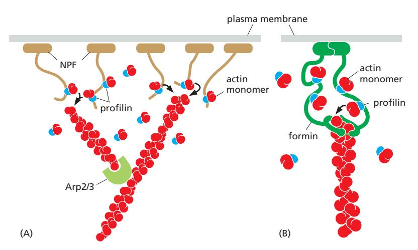

Figure 16–14 Profilin stimulates actin filament elongation. (A) Many nucleation-promoting factors (NPFs; *brown*) contain binding sites for profilin *(blue)*, which is bound to actin monomers. As a result, NPF activation leads not only to nucleation of branched actin filaments by Arp2/3 (*green*; see Figure 16–12), but also to rapid elongation of the new filaments. (B) Some members of the formin protein family possess whisker-like unstructured domains that contain several binding sites for profilin–actin complexes. This serves to recruit actin monomers to the growing plus end of the actin filament when formin is bound. Under some conditions, profilin can enhance the rate of actin filament elongation so that filament growth is faster than that expected for a diffusion-controlled reaction (see also Figure 3–76). Like NPFs, formin proteins inside the cell are activated to promote actin filament polymerization at membrane surfaces. MBoC7 n16.203/16.14

# Actin Filament–binding Proteins Alter Filament Dynamics and Organization

Actin filament behavior is regulated by two major classes of binding proteins: those that bind along the side of a filament and those that bind to the ends (see Panel 16–3). Side-binding proteins include *tropomyosin*, an elongated protein unrelated to the myosin motor that binds simultaneously to six or seven adjacent actin subunits along each of the two grooves of the helical actin filament. In addition to stabilizing and stiffening the filament, the binding of tropomyosin can prevent the actin filament from interacting with other proteins; this aspect of tropomyosin function is important in the control of muscle contraction, as we discuss later.

An actin filament that stops growing and is not specifically stabilized in the cell will depolymerize rapidly, particularly at its plus end, once the actin molecules have hydrolyzed their ATP. The binding of plus-end *capping protein* (also called *CapZ* for its location in the muscle Z band) stabilizes an actin filament at its plus end by rendering it inactive, greatly reducing the rates of filament growth and depolymerization (**Figure 16–15**). At the minus end, an actin filament may be capped by the Arp2/3 complex that was responsible for its nucleation,

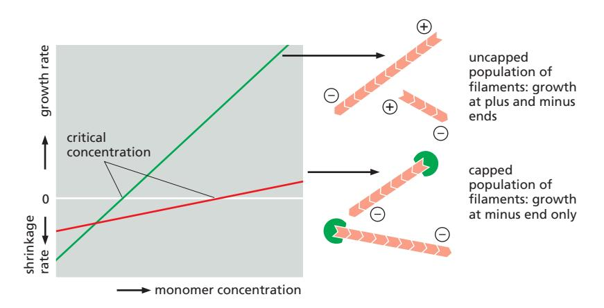

Figure 16–15 Filament capping and its effects on filament dynamics. A population of uncapped filaments adds and loses subunits at both the plus and minus ends, resulting in rapid growth or shrinkage, depending on the concentration of available free monomers *(green line)*. In the presence of a protein that caps the plus end *(red line)*, only the minus end is able to add or lose subunits; consequently, filament growth will be slower at all monomer concentrations above the critical concentration, and filament shrinkage will be slower at all monomer concentrations below the critical concentration. In addition, the critical concentration for the population shifts to that of the filament minus end.

968 Chapter 16: The Cytoskeleton ACTIN 969

although many minus ends in a typical cell are released from the Arp2/3 complex and are uncapped.

*Tropomodulin*, best known for its function in the capping of actin filaments in muscle, binds tightly to the minus ends of actin filaments that have been coated and thereby stabilized by tropomyosin. A large family of tropomodulin proteins regulates actin filament length and stability in many cell types.

End-binding proteins can affect filament dynamics even when they are present at very low levels. Because subunit addition and loss occur exclusively at filament ends, one molecule of an end-binding protein per actin filament (roughly one molecule per 200–500 actin subunits) can be enough to transform the architecture of an actin filament network. For example, rapid capping of actin filament plus ends after their nucleation at membranes focuses actin polymerization at new sites of nucleation, so that plus ends grow only where a pushing force is needed (see Figure 16–17).

The three-dimensional organization of cellular actin networks also depends on the activity of actin cross-linking proteins. Some of these cross-linking proteins bundle actin filaments into a parallel array, while others hold two actin filaments together at a large angle to each other, thereby creating a looser meshwork. Actin cross-linking proteins generally have two similar actin filament–binding sites, which can either be part of a single polypeptide chain or contributed by each of two polypeptide chains held together in a dimer (see Panel 16–3). The spacing and arrangement of these two filament-binding domains influence the type of actin structure that a given cross-linking protein forms. For example, the small monomeric protein *fimbrin* contributes to the tight packing of parallel bundles of actin filaments found in long cellular protrusions such as microvilli and the stereocilia of the inner ear's sensory hair cells. Other actin cross-linking proteins have either a flexible or a stiff, bent connection between their two binding domains, allowing them to form actin filament webs or three-dimensional networks, rather than actin bundles. The protein *filamin* achieves this by clamping together pairs of actin filaments roughly at right angles, thereby promoting the formation of a loose and highly viscous gel.

Each type of bundling protein also influences which other molecules can interact with the cross-linked actin filaments. Myosin II is the motor protein that enables stress fibers and other contractile arrays to exert tension. The very close packing of actin filaments caused by fimbrin apparently excludes myosin, and thus the parallel actin filaments held together by fimbrin are not contractile. On the other hand, α-actinin cross-links oppositely polarized actin filaments into loose bundles, allowing the binding of myosin and formation of contractile actin bundles. Because of the very different spacing and orientation of the actin filaments, bundling by fimbrin automatically discourages bundling by α-actinin, and vice versa, so that the two types of bundling protein are mutually exclusive.

As discussed previously, much of the actin polymerization in animal cells initiates at the plasma membrane where nucleation proteins are activated. Dozens of other actin-binding proteins associate with the cortical actin network. For example, a netlike meshwork of the protein **spectrin** connects to actin in the cortex of red blood cells, where it maintains cell shape and structural integrity of the plasma membrane (see pp. 630–631). More widely expressed are members of the *ERM* family (named for its first three members, ezrin, radixin, and moesin), which help organize membrane domains through their ability to interact with transmembrane proteins and the underlying actin cytoskeleton in many cell types. In so doing, they not only provide structural links to strengthen the cell cortex but also regulate the activities of signal transduction pathways. Moesin also increases cortical stiffness to promote cell rounding during mitosis. ERM proteins are thought to bind to and organize the cortical actin cytoskeleton in a variety of contexts, thereby affecting the shape and stiffness of the membrane as well as the localization and activity of signaling molecules.

#### Severing Proteins Regulate Actin Filament Depolymerization

Another important mechanism of actin filament regulation depends on proteins that break an actin filament into many smaller filaments, thereby generating a large number of new filament ends. The fate of these new ends depends on the presence of other accessory proteins. Under some conditions, newly formed ends nucleate filament elongation, thereby accelerating the assembly of new filament structures. Under other conditions, severing promotes the depolymerization of old filaments, speeding up the depolymerization rate by tenfold or more. In addition, severing changes the physical and mechanical properties of the cytoplasm: stiff, large bundles and gels become more fluid.

One class of actin-severing proteins is the *gelsolin superfamily*. These proteins are activated by high levels of cytosolic Ca2+. Gelsolin interacts with the side of the actin filament and contains subdomains that bind to two different sites: one that is exposed on the surface of the filament and one that is hidden between adjacent subunits. Activated gelsolin is thought to sever an actin filament when a thermal fluctuation creates a small gap between neighboring subunits, at which point gelsolin inserts itself into the gap to break the filament. After the severing event, gelsolin remains attached to the actin filament and caps the new plus end.

A second actin filament–destabilizing protein, found in all eukaryotic cells, is *cofilin*. Also called *actin-depolymerizing factor*, cofilin binds along the length of the actin filament, forcing the filament to twist a little more tightly (**Figure 16–16**). Mechanical stress induced by cofilin binding weakens the contacts between actin subunits in the filament, making the filament less stable and more easily severed by thermal motions, generating filament ends that undergo rapid disassembly. As a result, most of the actin filaments inside cells are shorter lived than are filaments formed from pure actin in a test tube.

Cofilin binds preferentially to ADP-containing actin filaments rather than to ATP-containing filaments. Because ATP hydrolysis is usually slower than filament assembly, the newest actin filaments in the cell still contain mostly ATP and are resistant to depolymerization by cofilin. Cofilin therefore tends to dismantle the older filaments in the cell. As discussed later, the cofilin-mediated disassembly of old but not new actin filaments is critical for the polarized, directed growth of the actin network that drives the intracellular motility of pathogens as well as cell migration. Actin filaments can be protected from cofilin by tropomyosin binding. Thus, the dynamics of actin in different subcellular locations depend on the balance of stabilizing and destabilizing accessory proteins.

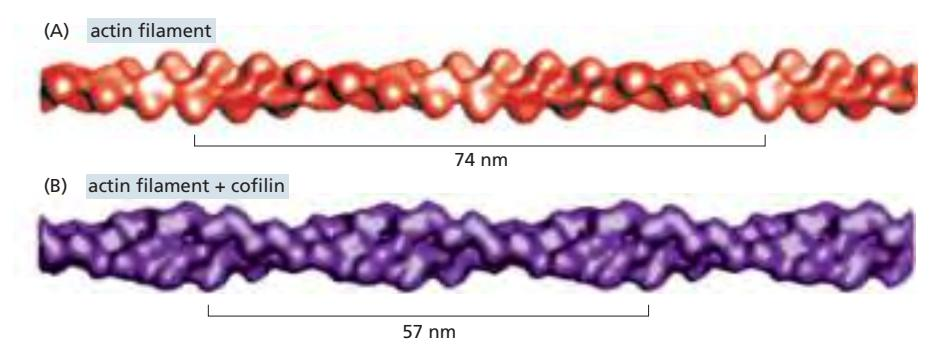

MBoC7 m16.20/16.16 Figure 16–16 Twisting of an actin filament induced by cofilin. (A) Three-dimensional reconstruction from cryo-electron micrographs of filaments made of pure actin. The bracket shows the span of two twists of the actin helix. (B) Reconstruction of an actin filament coated with cofilin, which binds in a 1:1 stoichiometry to actin subunits all along the filament. Cofilin is a small protein (14 kilodaltons) compared to actin (43 kilodaltons), and so the filament appears only slightly thicker. The energy of cofilin binding serves to deform the actin filament, twisting it more tightly and reducing the distance spanned by each twist of the helix. (© 1997 A. McGough et al. Originally published in *J. Cell Biol*. https://doi.org.10.1083/jcb.138.4.771. With permission from Rockefeller University Press.)

970 Chapter 16: The Cytoskeleton ACTIN 971

#### Bacteria Can Hijack the Host Actin Cytoskeleton

The importance of accessory proteins in actin-based motility and force production is illustrated beautifully by studies of certain bacteria and viruses that use components of the host-cell actin cytoskeleton to move through the cytoplasm. The cytoplasm of mammalian cells is extremely viscous, containing organelles and cytoskeletal elements that inhibit diffusion of large particles such as bacteria or viruses. To move around in a cell and invade neighboring cells, several pathogens, including *Listeria monocytogenes* (which causes a rare but serious form of food poisoning), overcome this problem by recruiting and activating the Arp2/3 complex at their surface. The Arp2/3 complex nucleates the assembly of actin filaments that generate a substantial force and push the bacterium through the cytoplasm at rates of up to 15 μm/min, leaving behind a long actin "comet tail" (**Figure 16–17**; see also Figures 23–29 and 23–30). This motility can be reconstituted in a test tube by adding the bacteria to a mixture of pure actin, Arp2/3 complex, cofilin, and capping protein, illustrating how actin polymerization dynamics generates movement through spatial regulation of filament assembly and disassembly. As we shall see, actin-based movement of this sort also underlies membrane protrusion at the leading edge of motile cells.

#### Actin at the Cell Cortex Determines Cell Shape

Although actin is found throughout the cytoplasm of a eukaryotic cell, dynamic actin filament behavior occurs primarily at the cell cortex. Here, through interaction with many different proteins, actin filaments are organized into several types of arrays, including branched networks, parallel bundles, and combinations of straight and branched filaments (**Figure 16–18**). Different structures are initiated by the action of distinct nucleating proteins: the actin filaments of branched networks are nucleated by the Arp2/3 complex, while bundles are made of the long, straight filaments produced by formins. Dynamics here generate distinct

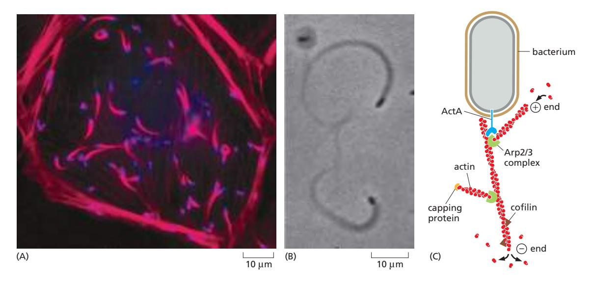

MBoC7 m16.25/16.17 Figure 16–17 The actin-based movement of *Listeria monocytogenes*. (A) Fluorescence micrograph of an infected cell that has been stained to reveal bacteria in *blue* and actin filaments in *red*. Note the cometlike tail of actin filaments behind each moving bacterium. (B) *Listeria* motility can be reconstituted in a test tube with ATP and just four purified proteins: actin, Arp2/3 complex, capping protein, and cofilin. This micrograph shows the dense actin tails behind bacteria *(black)*. (C) The ActA protein on the bacterial surface activates the Arp2/3 complex to nucleate new filament assembly along the sides of existing filaments. Filaments grow at their plus end until capped by capping protein. Actin is recycled through the action of cofilin, which enhances depolymerization at the minus ends of the filaments. By this mechanism, polymerization is focused at the rear surface of the bacterium, propelling it forward (see Movie 23.7). (A, courtesy of Julie Theriot and Tim Mitchison; B, from T.P. Loisel et al., *Nature* 401:613–616, published 1999 by Nature Publishing Group. Reproduced with permission of SNCSC.)

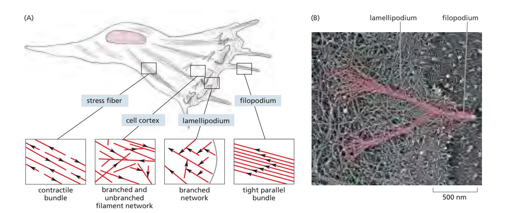

Figure 16–18 Actin arrays in a cell moving along a flat surface. (A) A schematic of a fibroblast migrating in a tissue-culture dish is shown with four areas enlarged to show the arrangement of actin filaments. The actin filaments are shown in *red*, with arrowheads pointing toward the minus end. Stress fibers are contractile and exert tension. The actin cortex underlies the plasma membrane and consists of actin networks that enable membrane protrusion at lamellipodia. Filopodia are spikelike projections of the plasma membrane that sense extracellular signals and allow a cell to explore its environment. (B) A migrating cell that was fixed, dried, and shadowed with platinum reveals a dense network of actin filaments at the leading edge (right side of image). The fast-growing plus ends are oriented toward the cell edge. Accessory proteins organize the filaments. Pseudo-colored in *red* are actin filaments in the process of becoming a filopodium. (B, courtesy of Tatyana Svitkina.)

cellular shapes and properties, as well as protrusive structures termed **filopodia** and **lamellipodia** observed in migrating fibroblasts. These are filled with dense cores of filamentous actin, which excludes membrane-enclosed organelles. The structures differ primarily in the way in which the actin is organized by actin crosslinking proteins (see Panel 16–3). Filopodia are essentially one-dimensional. They contain a core of long, bundled actin filaments, which are reminiscent of those in microvilli but longer and thinner, as well as more dynamic. Lamellipodia are two-dimensional, sheet-like structures. They contain a cross-linked mesh of actin filaments, most of which lie in a plane parallel to the solid substratum. Filopodia help cells sense environmental cues and function in cell migration. For example, filopodia extend from the leading edge of the growth cone in developing neurons and help guide them to their target. Protrusion of lamellipodia and related actinrich structures, discussed in more detail later, drives the forward movement of the leading edge of many migrating cells.

#### Distinct Modes of Cell Migration Rely on the Actin Cytoskeleton

Cell movement is one of the most striking of all cell behaviors. While some cells employ microtubule-based cilia or flagella to swim (discussed later in this chapter), many cells undergo crawling movements that rely on the actin cytoskeleton. Predatory amoebae continually crawl in search of food, and they can easily be observed to attack and devour smaller ciliates and flagellates in a drop of pond water (see Movie 1.4). During embryogenesis, the structure of an animal is created by the migrations of individual cells to specific target locations and by the coordinated movements of whole epithelial sheets (discussed in Chapter 21). In vertebrates, *neural crest cells* migrate long distances from their site of origin in the neural tube to a variety of sites throughout the embryo (see Movie 21.7). Similarly, actin-rich growth cones at the advancing tips of developing axons travel to distant synaptic targets.

The adult animal seethes with crawling cells. Macrophages and neutrophils crawl to sites of infection and engulf foreign invaders as a critical part of 972 Chapter 16: The Cytoskeleton ACTIN 973

the innate immune response. Osteoclasts tunnel into bone, forming channels that are filled in by the osteoblasts that follow them, in a continual process of bone remodeling and renewal. Similarly, fibroblasts migrate through connective tissues, remodeling them where necessary and helping to rebuild damaged structures at sites of injury. In an ordered procession, the cells in the epithelial lining of the intestine travel up the sides of the intestinal villi, replacing absorptive cells lost at the tip of the villus. Cell migration also has a role in many cancers, when cells in a primary tumor invade neighboring tissues and crawl into blood vessels or lymph vessels and then emerge at other sites in the body to form metastases.

Cell migration depends on the actin-rich cortex that lies beneath the plasma membrane. **Figure 16–19** illustrates distinct modes of cell migration on the basis of how the actin is organized. All migration is characterized by *protrusion,* in which the plasma membrane is pushed out at the front of the cell. In **mesenchymal cell migration**, characteristic of fibroblasts or epithelial cells grown on glass surfaces, the Arp2/3 complex mediates actin filament

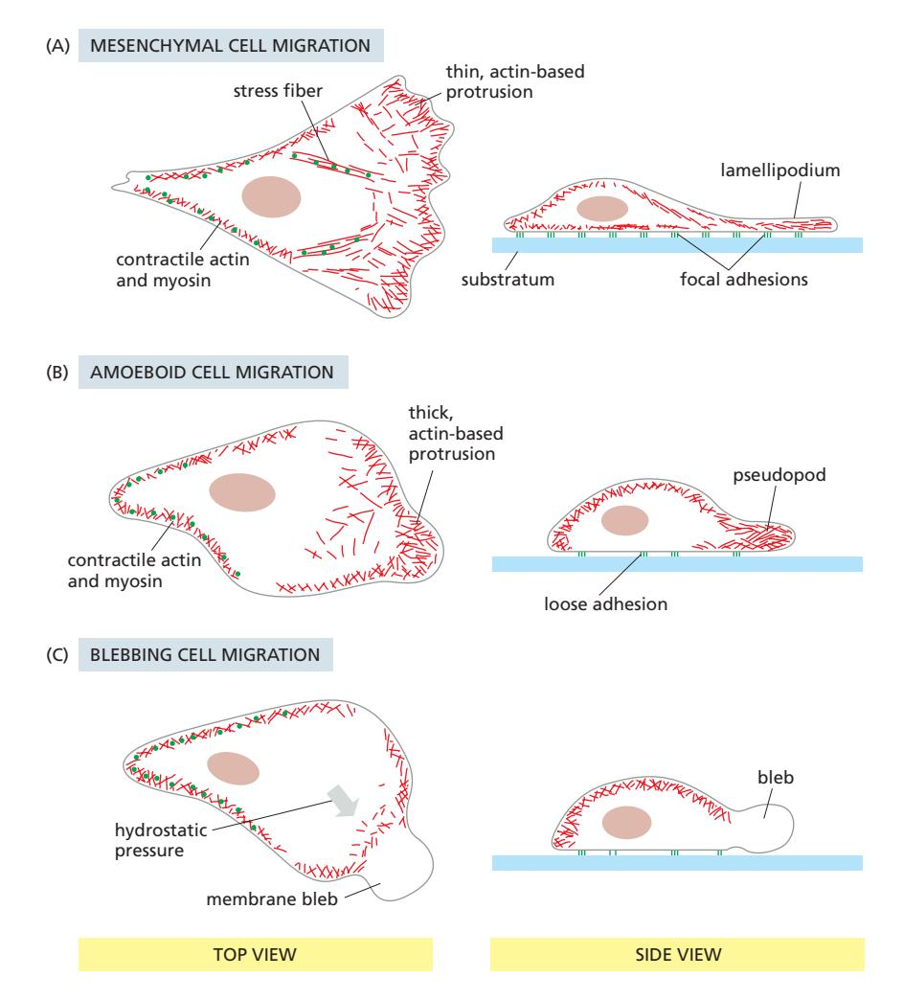

MBoC7 n16.204-16.19 Figure 16–19 Modes of cell migration. (A) In the mesenchymal mode of cell migration, focal adhesions form behind protruding lamellipodia that connect to contractile stress fibers, bracing the cell against the surface (substratum) across which it is migrating. (B) In amoeboid cell migration, a three-dimensional pseudopod is formed by explosive actin polymerization at the leading edge. Cells maintain traction even though adhesion to the substratum is reduced, enabling much more rapid cell movement. (C) Leading edge protrusion can also occur through the formation of a bleb if the plasma membrane detaches from the underlying cortex and is pushed out by hydrostatic pressure. In all three modes of migration, contraction of cortical actin and myosin II at the rear of the cell drives locomotion of the cell body.

nucleation at the leading edge of the cell, thereby generating a *lamellipodium* (see Figure 16–18). Behind the leading edge, *cofilin* (see Figure 16–16) disas sembles the older (ADP-bound) actin filaments. The actin network is therefore assembling at the front and disassembling at the back, reminiscent of the treadmilling that occurs in individual actin filaments as discussed previously (see Figure 16–11). Mesenchymal cell migration requires firm attachment to the underlying substratum, which allows the cell body to generate traction and propel itself forward. The actin cytoskeleton braces itself using stress fibers connected to integrin-based focal adhesions on the bottom surface of the cell (see Figure 19–56). Contraction of bundles of actin filaments and myosin II motors at the rear of the cell, coordinated with disassembly of attachment sites, enables the cell body to translocate.

Mesenchymal cell migration is slow, with movement rates of less than 1 μm per minute. In contrast, a second mode of cell migration, **amoeboid cell migration**, resembles the rapid movement and shape changes typical of amoebae and can be hundreds of times faster (**Movie 16.2**). This mode of move ment is typical of white blood cells such as neutrophils and is characterized by the explosive extension of cell protrusions by local activation of the Arp2/3 complex. The protrusions are much thicker than lamellipodia and are called **pseudopodia** (or pseudopods). In contrast to mesenchymal cell migration, amoeboid-type movement does not rely as heavily on integrin-based attach ments to the underlying surface. Traction nevertheless occurs through a weaker association to the substratum, and migrating cells appear more rounded. Loco motion is accompanied by a combination of protrusion at the front of the cell and contraction at the rear.

Protrusion of pseudopodia is driven by the same principles of actin fila ment polymerization and depolymerization that operate in lamellipodia, with cycles of actin nucleation, polymerization, and disassembly at the leading edge of the cell, but generating a three-dimensional rather than a two-dimensional structure. A distinct type of three-dimensional membrane protrusion can also result from a process called **blebbing**. In this case, the plasma membrane detaches locally from the underlying actin cortex, thereby allowing cytoplas mic flow to push the membrane outward. The formation of a membrane bleb depends on hydrostatic pressure, which is generated by the contraction of actin and myosin assemblies in the rear of the cell. Once blebs have extended, actin filaments reassemble on the inside surface of the blebbed membrane to form a new actin cortex.

Thus, leading-edge protrusion, adhesion to the surface, and contraction at the cell cortex underlie all modes of cell migration. These migration modes can inter convert depending on cell state, the extracellular environment, and the activation of different signaling pathways.

#### Cells Migrating in Three Dimensions Can Navigate Around Barriers

Studying the movement of cells on two-dimensional surfaces reveals import ant principles of cell migration. Most migrating cells in the body, however, must negotiate their way through a complex, three-dimensional environment. Sur rounded by other cells and extracellular matrix, migrating cells are confined in space and must navigate around physical barriers separating them from their destination. During immune surveillance, for example, white blood cells called *dendritic cells* migrate between sites of infection and lymph nodes to initiate a systemic immune response (see Chapter 24). Dendritic cell migration can be mimicked by embedding them in a three-dimensional collagen gel matrix, in which they undergo rapid amoeboid migration toward a chemotactic signal, extending a large number of actin-rich protrusions (**Figure 16–20A and B**). When introduced into a microchamber containing different-sized channels, a cell will choose the widest path (**Figure 16–20C**). Later in this chapter, we discuss how chemotactic cues induce cell polarization and guide a migrating cell in the right direction.

974 Chapter 16: The Cytoskeleton ACTIN 975

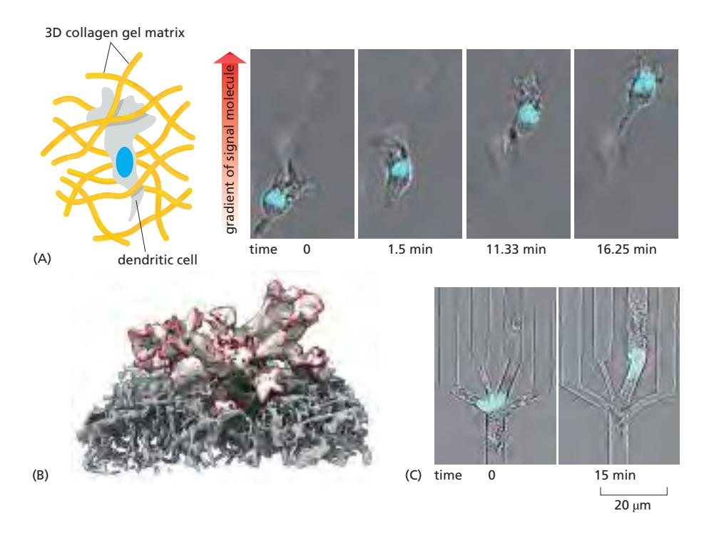

Figure 16–20 A dendritic cell migrating in three dimensions. (A) Schematic of a cell introduced into a collagen gel matrix. Images at right show that a chemotactic signal gradient induces polarized extension of pseudopodia that explore the environment, seeking out a path through gaps in the gel matrix that are typically smaller than the cell diameter. The nucleus is stained with a *blue* dye. (B) Three-dimensional image of a dendritic cell and its many pseudopodia (outlined in *red*) that is based on fluorescence microscopy. A portion of the collagen matrix surrounding the cell is shown in *gray*. (C) In this experiment, a dendritic cell was introduced into a microchannel that contains a decision point with four different pore sizes. Using the nucleus as a gauge, the cell ultimately chooses a path through the largest pore (Movie 16.3). (Courtesy of Michael Sixt.)

Some cells use specialized adhesion structures called **podosomes** that are important for cells to cross tissue barriers, for example during embryonic development. **Invadopodia** are related structures that contribute to the migration of metastatic cancer cells invading a tissue. Podosomes and invadopodia contain many of the same actin-regulatory components as other protrusions. They also secrete proteases that degrade the extracellular matrix, allowing them to carve through matrix barriers in their path. MBoC7 n16.205/16.20

#### Summary

*Actin is a highly conserved cytoskeletal protein that is present in high concentrations in nearly all eukaryotic cells. Nucleation presents a kinetic barrier to actin polymerization, but once formed, actin filaments undergo dynamic behavior due to hydrolysis of the bound ATP. Actin filaments are polarized and can undergo treadmilling when a filament assembles at the plus end while simultaneously depolymerizing at the minus end. In cells, actin filament dynamics are regulated at every step, and the varied forms and functions of actin depend on a versatile repertoire of accessory proteins. Approximately half of the actin is kept in a monomeric form through association with proteins such as profilin. Nucleation factors such as the Arp2/3 complex and formins promote formation of branched and parallel filaments, respectively. Interplay between proteins that bind or cap actin filaments and those that promote filament severing or depolymerization can slow or accelerate the kinetics of filament assembly and disassembly. Another class of accessory proteins assembles the filaments into larger ordered structures by cross-linking them to one another in geometrically defined ways. Connections between these actin arrays and the plasma membrane of cells give an animal cell mechanical strength and permit the elaboration of cortical cellular structures such as lamellipodia, filopodia, pseudopodia, and microvilli. By inducing actin filament polymerization at their surface, intracellular pathogens can hijack the host-cell cytoskeleton and move around inside the cell. Cell migration depends on the formation of protrusions at the leading edge by assembly of new actin filaments or membrane blebbing, traction against the underlying substratum, and contractile forces generated by myosin motors to bring the cell body forward.* 

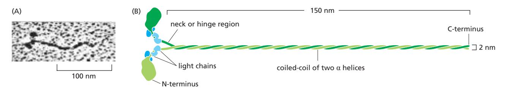

Figure 16–21 Myosin II. (A) The two globular heads and long tail of a myosin II molecule shadowed with platinum can be seen in this electron micrograph. (B) A myosin II molecule is composed of two heavy chains (each about 2000 amino acids long; *green*) and four light chains *(blue)*. The light chains are of two distinct types, and one copy of each type is present on each myosin head. Dimerization occurs when the two α helices of the heavy chains wrap around each other to form a coiledcoil, driven by the association of regularly spaced hydrophobic amino acids (see Figure 3–8). The coiled-coil arrangement makes an extended rod in solution, and this part of the molecule forms the tail. (A, courtesy of David Shotton.)

# MYOSIN AND ACTIN

A crucial feature of the actin cytoskeleton is that it can form contractile structures that cross-link and slide actin filaments relative to one another through the action of **myosin** motor proteins. Actin–myosin assemblies perform important functions in all eukaryotic cells, such as in cell migration as described earlier. In addition, actin and myosin drive muscle contraction.

# Actin-based Motor Proteins Are Members of the Myosin Superfamily

The first motor protein to be identified was skeletal muscle myosin, which generates the force for muscle contraction. This protein, now called *myosin II*, is an elongated protein formed from two heavy chains and two copies of each of two light chains. Each heavy chain has a globular head domain at its N-terminus that contains the force-generating machinery, followed by a very long α-helical amino acid sequence that forms an extended coiled-coil to mediate heavy-chain dimerization (**Figure 16–21**). The two light chains bind close to the N-terminal head domain, while the long coiled-coil tail bundles itself with the tails of other myosin molecules. In skeletal muscle, these tail–tail interactions form large, bipolar *thick filaments* that have several hundred myosin heads, oriented in opposite directions at the two ends of the thick filament (**Figure 16–22**). MBoC7 m16.26/16.21

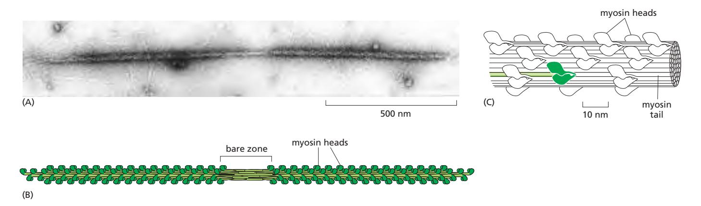

Figure 16–22 The myosin II bipolar thick filament in muscle. (A) Electron micrograph of a myosin II thick filament isolated from frog muscle. Note the central bare zone, which is free of head domains. (B) Schematic diagram, not drawn to scale. The myosin II molecules aggregate by means of their tail regions, with their heads projecting to the outside of the filament. The bare zone in the center of the filament consists entirely of myosin II tails. (C) A small section of a myosin II filament as reconstructed from electron micrographs. In the relaxed (noncontracting) state, the two heads of a myosin molecule are bent backward and sterically interfere with each other to switch off their activity. An individual myosin molecule in the inactive state is highlighted in *green*. The cytoplasmic myosin II filaments in non-muscle cells are much smaller, although similarly organized (see Figure 16–34). (A, from M. Stewart and R.W. Kensler, *J. Mol. Biol.* 192:831–851, 1986. With permission from Elsevier; C, based on R.A. Crowther et al., *J. Mol. Biol.* 184:429–439, 1985.)

976 Chapter 16: The Cytoskeleton MYOSIN AND ACTIN 977

Figure 16–23 Direct evidence for the motor activity of the myosin head. In this experiment, purified myosin heads were attached to a glass slide, and then actin filaments labeled with fluorescent phalloidin were added and allowed to bind to the myosin heads. (A) When ATP was added, the actin filaments began to glide along the surface, owing to the many individual steps taken by each of the dozens of myosin heads bound to each filament. The video frames shown in this sequence were recorded about 0.6 second apart; the two actin filaments shown *(red)* were moving in opposite directions at a rate of about 4 μm/sec. (B) Diagram of the experiment. The large *red arrows* indicate the direction of actin filament movement (Movie 16.4). (A, courtesy of James Spudich.)

Each myosin head binds and hydrolyzes ATP, using the energy of ATP hydrolysis to walk toward the plus end of an actin filament (**Figure 16–23**). The opposing orientation of the heads in the thick filament makes the filament efficient at sliding pairs of oppositely oriented actin filaments toward each other, shortening the muscle. In skeletal muscle, in which carefully arranged actin filaments are aligned in *thin filament* arrays surrounding the myosin thick filaments, the ATP-driven sliding of actin filaments results in a powerful contraction. Cardiac and smooth muscle contain myosin II molecules that are similarly arranged, although different genes encode them. MBoC7 m16.28/16.23

# Myosin Generates Force by Coupling ATP Hydrolysis to Conformational Changes

Motor proteins use structural changes in their ATP-binding sites to produce cyclic interactions with a cytoskeletal filament. Each cycle of ATP binding, hydrolysis, and release propels them forward in a single direction to a new binding site along the filament. For myosin II, each step of the movement along actin is generated by the swinging of an 8.5-nm-long α helix, or *lever arm*, which is structurally stabilized by the binding of light chains. At the base of this lever arm next to the head, there is a pistonlike helix that connects movements at the ATP-binding cleft in the head to small rotations of the so-called converter domain. A small change at this point can swing the helix like a long lever, causing the far end of the helix to move by about 5.0 nm.

These changes in the conformation of the myosin are coupled to changes in its binding affinity for actin, allowing the myosin head to release its grip on the actin filament at one point and snatch hold of it again at another. The full mechanochemical cycle of ATP binding, ATP hydrolysis, and phosphate release (which causes the *power stroke*) produces a single step of movement (**Figure 16–24**). At low ATP concentrations, the interval between the force-producing step and the binding of the next ATP is long enough that single steps can be observed (**Figure 16–25**).

# Sliding of Myosin II Along Actin Filaments Causes Muscles to Contract

Muscle contraction is the most familiar and best-understood form of movement in animals. In vertebrates, running, walking, swimming, and flying all depend on the rapid contraction of skeletal muscle on its scaffolding of bone, while

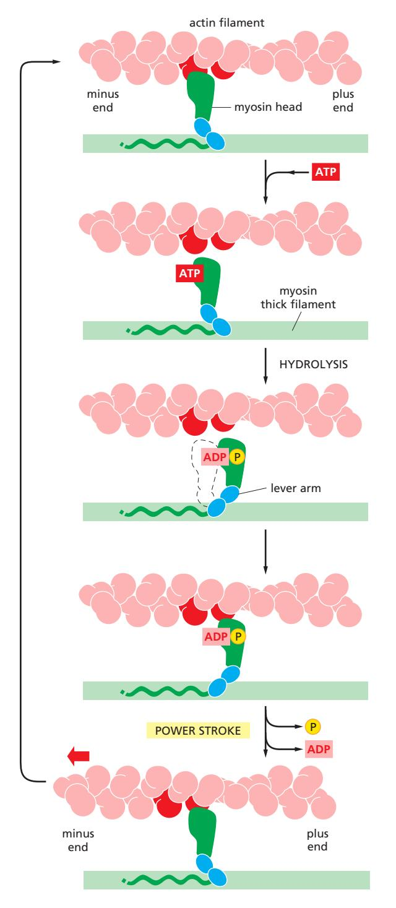

**ATTACHED** At the start of the cycle shown in this figure, a myosin head lacking a bound nucleotide is locked tightly onto an actin filament in a *rigor* configuration (so named because it is responsible for *rigor mortis*, the rigidity of death). In an actively contracting muscle, this state is very short-lived, being rapidly terminated by the binding of a molecule of ATP.

**RELEASED** A molecule of ATP binds to the large cleft on the "back" of the head (that is, on the side furthest from the actin filament) and immediately causes a slight change in the conformation of the actin-binding site, reducing the affinity of the head for actin. (The space drawn here between the head and actin emphasizes this change, although in reality the head probably remains very close to the actin.)

**COCKED** ATP binding triggers a conformational change in the cleft that leads to a rotation in the converter domain, causing the lever arm to swing out and the head to be displaced along the filament by a distance of about 5 nm. Hydrolysis of ATP occurs, but the ADP and inorganic phosphate (P) remain tightly bound to the protein.

**RE-BINDING AND POWER STROKE** The myosin head binds weakly to a new site on the actin filament, causing release of the inorganic phosphate produced by ATP hydrolysis, concomitantly with the tight binding of the head to actin. This release triggers the power stroke—the force-generating change in shape during which the head regains its original conformation. In the course of the power stroke, the head loses its bound ADP, thereby returning to the start of a new cycle.

**FORCE GENERATING** At the end of the cycle, the myosin head is again locked tightly to the actin filament in a rigor configuration. Note that the head has moved to a new position on the actin filament.

Figure 16–24 The cycle of structural changes used by myosin II to walk along an actin filament. In the myosin II cycle, the head remains bound to the actin filament for only about 5% of the entire cycle time, allowing many myosins to work together to move a single actin filament (Movie 16.5). (Based on I. Rayment et al., *Science* 261:58–65, 1993.)

involuntary movements such as heart pumping and gut peristalsis depend on the contraction of cardiac muscle and smooth muscle, respectively. All these forms of muscle contraction depend on the ATP-driven sliding of highly organized arrays of actin filaments against arrays of myosin II filaments. MBoC7 m16.29/16.24

Skeletal muscle was a relatively late evolutionary development, and muscle cells are highly specialized for rapid and efficient contraction. The long, thin muscle fibers of skeletal muscle are actually huge single cells that form during 978 Chapter 16: The Cytoskeleton MYOSIN AND ACTIN 979

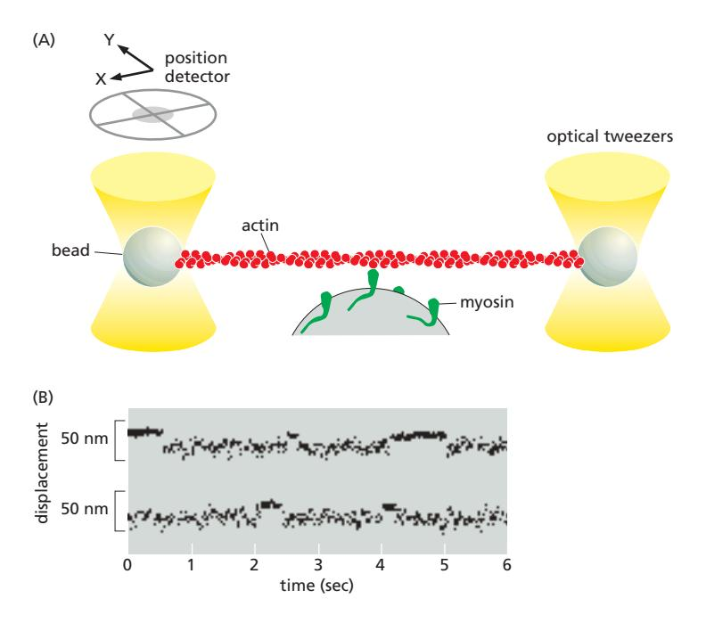

development by the fusion of many separate cells. The large muscle cell retains the many nuclei of the contributing cells. These nuclei lie just beneath the plasma membrane (**Figure 16–26**). The bulk of the cytoplasm inside is made up of myofibrils, which is the name given to the basic contractile elements of the muscle cell. A **myofibril** is a cylindrical structure 1–2 μm in diameter that is often as long as the muscle cell itself. It consists of a long, repeated chain of tiny contractile units—called *sarcomeres*, each about 2.2 μm long—which give the vertebrate myofibril its striated appearance (**Figure 16–27**). MBoC7 m16.30/16.25

Each sarcomere is formed from a miniature, precisely ordered array of parallel and partly overlapping thin and thick filaments. The *thin filaments* are composed of actin and associated proteins, and they are attached at their plus ends to a *Z disc* at each end of the sarcomere. The capped minus ends of the actin filaments extend in toward the middle of the sarcomere, where they overlap with *thick filaments*, the bipolar assemblies formed from specific muscle isoforms of myosin II (see Figure 16–22). When this region of overlap is examined in cross section by electron microscopy, the myosin filaments are arranged

Figure 16–25 The force of a single myosin molecule moving along an actin filament measured using an optical trap. (A) Schematic of the experiment, showing an actin filament with beads attached at both ends and held in place by focused beams of light called optical tweezers (Movie 16.6). The tweezers trap and move the bead and can also be used to measure the force exerted on the bead through the filament. In this experiment, the filament was positioned over another bead to which myosin II motors were attached, and the optical tweezers were used to determine the effects of myosin binding on movement of the actin filament. (B) These traces show filament movement in two separate experiments. Initially, when the actin filament is unattached to myosin, thermal motion of the filament produces noisy fluctuations in filament position. When a single myosin binds to the actin filament, thermal motion decreases abruptly, and a roughly 10-nm displacement results from movement of the filament by the motor. The motor then releases the filament. Because the ATP concentration is very low in this experiment, the myosin remains attached to the actin filament for much longer than it would in a muscle cell. (Adapted from C. Rüegg et al., *News Physiol. Sci.* 17:213–218, 2002. With permission from the American Physiological Society.)

Figure 16–26 Skeletal muscle cells (also called muscle fibers). (A) These huge multinucleated cells form by the fusion of many muscle cell precursors, called myoblasts. Here, a single muscle cell is depicted. In an adult human, a muscle cell is typically 50 μm in diameter and can be up to several centimeters long. (B) Fluorescence micrograph of rat muscle, showing the peripherally located nuclei *(blue)* in these giant cells. Myofibrils are stained *red*. (B, courtesy of Nancy L. Kedersha.)

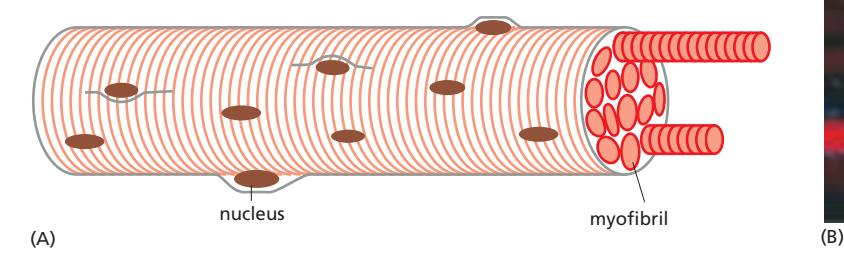

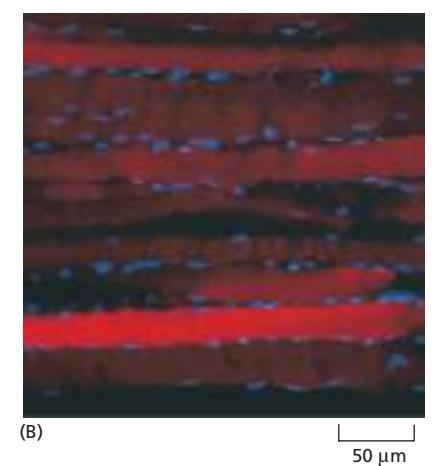

Figure 16–27 Skeletal muscle myofibrils. (A) Low-magnification electron micrograph of a longitudinal section through a skeletal muscle cell of a rabbit, showing the regular pattern of crossstriations. The cell contains many myofibrils aligned in parallel (see Figure 16–26). (B) Detail of the skeletal muscle shown in A, showing portions of two adjacent myofibrils and the definition of a sarcomere *(black arrow)*. (C) Schematic diagram of a single sarcomere, showing the origin of the dark and light bands seen in the electron micrographs. The Z discs, at each end of the sarcomere, are attachment sites for the plus ends of actin filaments (thin filaments); the M line, or midline, is the location of proteins that link adjacent myosin II filaments (thick filaments) to one another. (D) When the sarcomere contracts, the actin and myosin filaments slide past one another without shortening. (A and B, courtesy of Roger Craig.)

in a regular hexagonal lattice, with the actin filaments evenly spaced between them (**Figure 16–28**).

Sarcomere shortening is caused by the myosin filaments sliding past the actin thin filaments, with no change in the length of either type of filament (see Figure 16–27C and D). Bipolar thick filaments walk toward the plus ends of two sets of thin filaments of opposite orientations, driven by dozens of independent myosin heads that are positioned to interact with each thin filament. Because there is no coordination among the movements of the myosin heads, it is critical that they remain tightly bound to the actin filament for only a small fraction of each ATPase cycle so that they do not hold one another back. Each myosin thick filament has about 300 heads (294 in frog muscle), and each head cycles about five times per second in the course of a rapid contraction—sliding the myosin and actin filaments past one another at rates of up to 15 μm/sec and enabling the sarcomere to shorten by 10% of its length in less than one-fiftieth of a second. The rapid synchronized shortening of the thousands of sarcomeres lying end-to-end in each myofibril enables skeletal muscle to contract rapidly enough for running and flying or for playing the piano.

Accessory proteins produce the remarkable uniformity in filament organization, length, and spacing in the sarcomere and enable it to withstand the constant wear-and-tear of contraction (**Figure 16–29**). The actin filament plus ends are anchored in the Z disc, which is built from CapZ and α-actinin; CapZ in the Z disc caps the filaments (preventing depolymerization), while α-actinin holds them together in a regularly spaced bundle. Actin filaments are stabilized along their length by tropomyosin and also by a protein of enormous size, called *nebulin*, which consists almost entirely of a repeating 35-amino-acid actin-binding motif. Nebulin stretches from the Z disc toward the minus end of each thin filament, which is capped and stabilized by tropomodulin. Although there is some slow exchange of actin subunits at both ends of the muscle thin filament, such that the components of the thin filament turn over with a half-life of several days, the actin filaments in sarcomeres are remarkably stable compared with those found

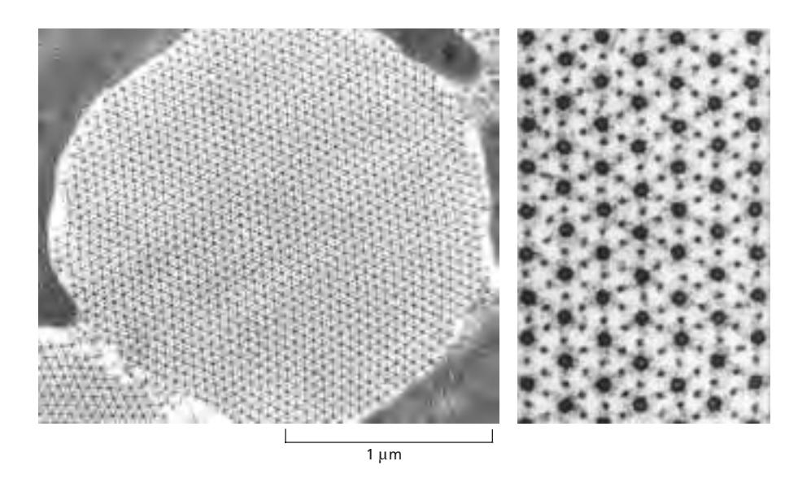

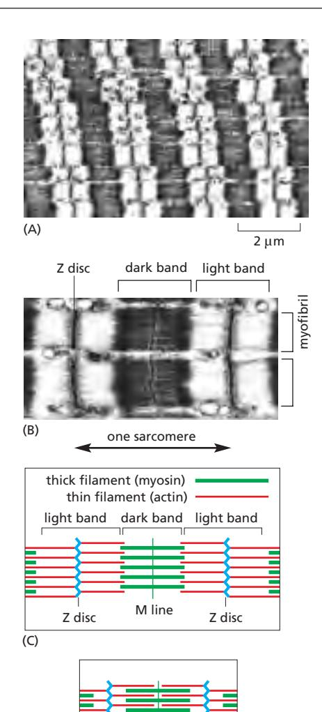

Figure 16–28 Electron micrographs of an insect flight muscle viewed in cross section. The myosin and actin filaments are packed together with almost crystalline regularity. Unlike their vertebrate counterparts, these myosin filaments have a hollow center, as seen in the enlargement on the right. The geometry of the hexagonal lattice is slightly different in vertebrate muscle. (From J. Auber and R. Couteaux, *J. Microsc*. 2:309–324, 1963. With permission from Société Française de Microscopie Électronique.)

(D)

980 Chapter 16: The Cytoskeleton MYOSIN AND ACTIN 981

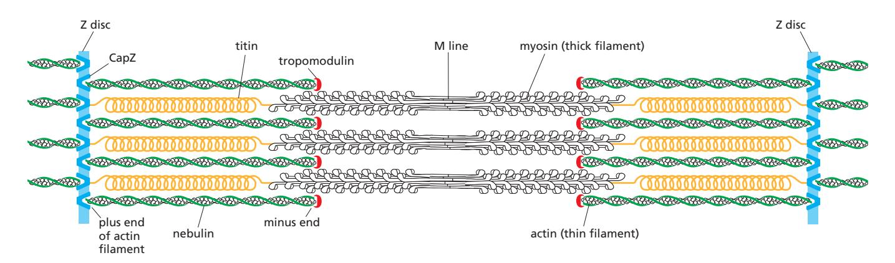

in most other cell types, whose dynamic actin filaments turn over with half-lives of a few minutes or less.

Opposing pairs of an even longer protein, called *titin*, position the thick filaments midway between the Z discs. Titin acts as a molecular spring, with a long series of immunoglobulin-like domains that can unfold one by one as stress is applied to the protein. A springlike unfolding and refolding of these domains keeps the thick filaments poised in the middle of the sarcomere and allows the muscle fiber to recover after being overstretched. In *Caenorhabditis elegans*, whose sarcomeres are longer than those in vertebrates, titin is longer as well, suggesting that it serves also as a molecular ruler, determining in this case the overall length of each sarcomere. MBoC7 m16.34/16.29

# A Sudden Rise in Cytosolic Ca2+ Concentration Initiates Muscle Contraction

The force-generating molecular interaction between myosin thick filaments and actin thin filaments takes place only when a signal passes to the skeletal muscle from the nerve that stimulates it. Immediately upon arrival of the signal, the muscle cell needs to be able to contract very rapidly, with all the sarcomeres shortening simultaneously. Two major features of the muscle cell make extremely rapid contraction possible. First, as previously discussed, the individual myosin motor heads in each thick filament spend only a small fraction of the ATP cycle time bound to the filament and actively generating force, so many myosin heads can act in rapid succession on the same thin filament without interfering with one another. Second, a specialized membrane system relays the incoming signal rapidly throughout the entire cell. The signal from the nerve triggers an action potential in the muscle cell plasma membrane (discussed in Chapter 11), and this electrical excitation spreads swiftly into a series of membranous folds—the transverse tubules, or *T tubules*—that extend inward from the plasma membrane around each myofibril. The signal is then relayed across a small gap to the *sarcoplasmic reticulum*, an adjacent weblike sheath of modified endoplasmic reticulum that surrounds each myofibril like a net stocking (**Figure 16–30A and B**).

When the incoming action potential activates a Ca2+ channel in the T-tubule membrane, it triggers the opening of a Ca2+-release channel in the closely associated sarcoplasmic reticulum membrane (**Figure 16–30C**). Ca2+ flooding into the cytosol then initiates the contraction of each myofibril. Because the signal from the muscle cell plasma membrane is passed within milliseconds (via the T tubules and sarcoplasmic reticulum) to every sarcomere in the cell, all of the myofibrils in the cell contract at once. The increase in Ca2+ concentration is transient because the Ca2+ is rapidly pumped back into the sarcoplasmic reticulum by an abundant, ATP-dependent Ca2+-pump (also called a Ca2+-ATPase) in its membrane (see Figure 11–14). Typically, the cytoplasmic Ca2+ concentration is restored to resting levels within 30 milliseconds, allowing the myofibrils to relax. Thus, muscle contraction depends

Figure 16–29 Organization of accessory proteins in a sarcomere. Each giant titin molecule extends from the Z disc to the M line—a distance of more than 1 μm. Part of each titin molecule is closely associated with a myosin thick filament (which switches polarity at the M line); the rest of the titin molecule is elastic and changes length as the sarcomere contracts and relaxes. Each nebulin molecule is exactly the length of a thin filament. The actin filaments are also coated with tropomyosin and bound intermittently by troponin (not shown; see Figure 16–31) and are capped at both ends. Tropomodulin caps the minus end of the actin filaments, and CapZ anchors the plus end at the Z disc, which also contains α-actinin (not shown).

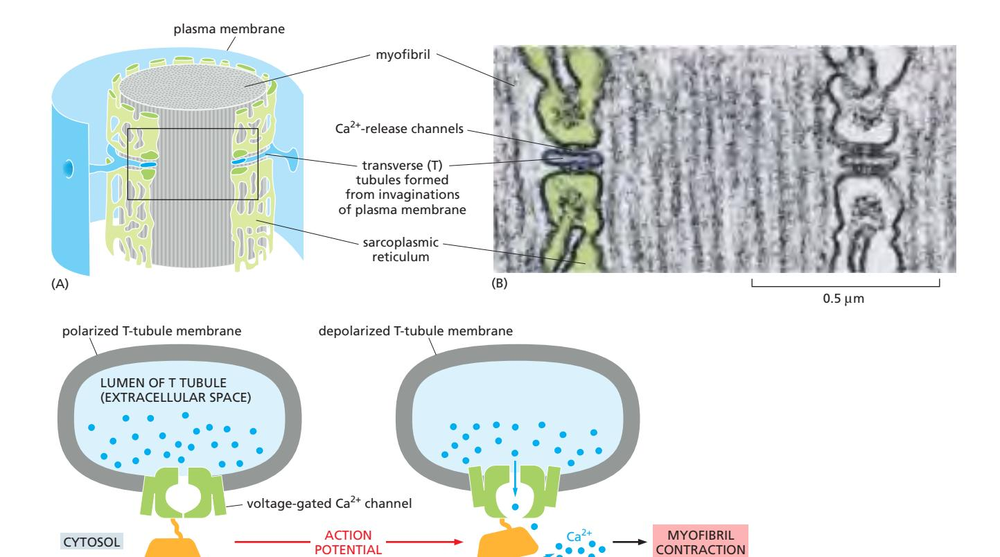

on two processes that consume enormous amounts of ATP: filament sliding, driven by the ATPase of the myosin motor domain, and Ca2+ pumping, driven by the Ca2+-pump.

Ca2+-release channel

sarcoplasmic reticulum membrane

SARCOPLASMIC RETICULUM

LUMEN OF

(C)

The Ca2+ dependence of vertebrate skeletal muscle contraction, and hence its dependence on commands transmitted via nerves, is due entirely to a set of specialized accessory proteins that are closely associated with the actin thin filaments. One of these accessory proteins is a muscle form of *tropomyosin*, the elongated protein that binds along the groove of the actin filament helix. The other is *troponin*, a complex of three polypeptides, troponins T, I, and C (named for their tropomyosin-binding, inhibitory, and Ca2+-binding activities, respectively). Troponin I binds to actin as well as to troponin T. In a resting muscle, the troponin I–T complex pulls the tropomyosin out of its normal binding groove into a position along the actin filament that interferes with the binding of myosin heads, thereby preventing any force-generating interaction. When the level of Ca2+ is raised, troponin C—which binds up to four molecules of Ca2+—causes troponin I to release its hold on actin. This allows the tropomyosin molecules to slip back into their normal position so that the myosin heads can walk along the actin filaments (**Figure 16–31**). Troponin C is closely related to the ubiquitous Ca2+-binding protein calmodulin (see Figure 15–34); it can be thought of as a specialized form of calmodulin that has acquired binding sites for troponin I and troponin T, thereby ensuring that the myofibril responds extremely rapidly to an increase in Ca2+ concentration. MBoC7 e17.44,45/16.30

Figure 16–30 T tubules and the sarcoplasmic reticulum. (A) Drawing of the two membrane systems that relay the signal to contract from the muscle cell plasma membrane to all of the myofibrils in the cell. (B) Electron micrograph showing a cross section of a T tubule. Note the position of the large Ca2+-release channels in the sarcoplasmic reticulum membrane that connect to the adjacent T-tubule membrane. (C) Schematic diagram showing how a Ca2+-release channel in the sarcoplasmic reticulum membrane is thought to be opened by the activation of a voltage-gated Ca2+ channel in the membrane of the T tubule (Movie 16.7). (B, courtesy of Clara Franzini-Armstrong.)

982 Chapter 16: The Cytoskeleton MYOSIN AND ACTIN 983

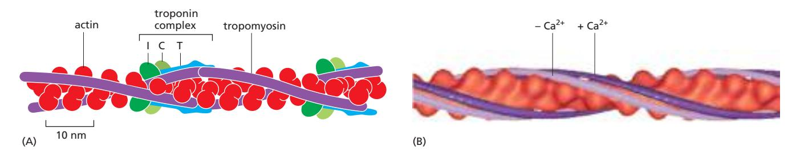

Figure 16–31 The control of skeletal muscle contraction by troponin. (A) A thin filament of a skeletal muscle cell, showing the positions of tropomyosin and troponin along the actin filament. Each tropomyosin molecule has seven evenly spaced regions with similar amino acid sequences, each of which is thought to bind to an actin subunit in the filament. (B) Reconstructed cryo-electron microscopy image of an actin filament showing the relative position of a superimposed tropomyosin strand in the presence *(dark purple)* or absence *(light purple)* of calcium. (A, adapted from G.N. Phillips et al., *J. Mol. Biol*. 192:111–131, 1986; B, adapted from C. Xu et al., *Biophys. J*. 77:985–992, 1999. With permission from the Biophysical Society.)

In smooth muscle cells, so called because they lack the regular striations of skeletal muscle, contraction is also triggered by an influx of calcium ions, but the regulatory mechanism is different. Smooth muscle forms the contractile portion of the stomach, intestine, and uterus, as well as the walls of arteries and many other structures requiring slow and sustained contractions. Smooth muscle is composed of sheets of highly elongated spindle-shaped cells, each with a single nucleus. Smooth muscle cells do not express the troponins. Instead, elevated intracellular Ca2+ levels regulate contraction by a mechanism that depends on calmodulin (**Figure 16–32**). Ca2+-bound calmodulin activates myosin MBoC7 m16.36/16.31

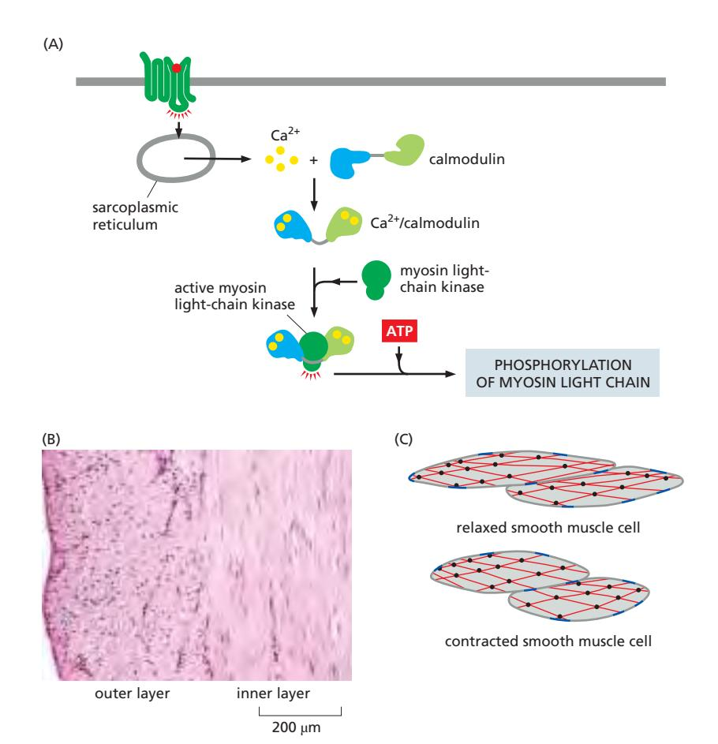

Figure 16–32 Smooth muscle contraction. (A) Upon muscle stimulation by activation of cell-surface receptors, Ca2+ released into the cytoplasm from the sarcoplasmic reticulum (SR) binds to calmodulin (see Figure 15–34). Ca2+-bound calmodulin then binds myosin light-chain kinase (MLCK), which phosphorylates myosin light chain, stimulating myosin activity. Nonmuscle myosin is regulated by the same mechanism (see Figure 16–34). (B) Smooth muscle cells in a cross section of cat intestinal wall. The outer layer of smooth muscle is oriented with the long axis of its cells extending parallel along the length of the intestine, and upon contraction will shorten the intestine. The inner layer is oriented circularly around the intestine and when contracted will cause the intestine to become narrower. Contraction of both layers squeezes material through the intestine, much like squeezing toothpaste out of a tube. (C) A model for the contractile apparatus in a smooth muscle cell, with bundles of contractile filaments containing actin and myosin *(red)* oriented obliquely to the long axis of the cell. Their contraction greatly shortens the cell. In this diagram, the bundle angles are exaggerated to schematically illustrate the effect of contraction. In addition, only a few of the many bundles are shown. (B, courtesy of Gwen V. Childs.)

light-chain kinase (MLCK), thereby inducing the phosphorylation of smooth muscle myosin on one of its two light chains. When the light chain is phosphorylated, the myosin head can interact with actin filaments and cause contraction; when it is dephosphorylated, the myosin head tends to dissociate from actin and becomes inactive.

The phosphorylation events that regulate contraction in smooth muscle cells occur relatively slowly, so that maximum contraction often requires nearly a second (compared with the few milliseconds required for contraction of a skeletal muscle cell). But rapid activation of contraction is not important in smooth muscle: its myosin II hydrolyzes ATP about 10 times more slowly than does skeletal muscle myosin, producing a slow cycle of myosin conformational changes that results in slow contraction.

#### Heart Muscle Is a Precisely Engineered Machine

The heart is the most heavily worked muscle in the body, contracting about 3 billion (3 × 109) times during the course of a human lifetime (**Movie 16.8**). Heart cells express several specific isoforms of cardiac muscle myosin and cardiac muscle actin. Even subtle changes in these cardiac-specific contractile proteins changes that would not cause any noticeable consequences in other tissues—can cause serious heart disease (**Figure 16–33**).

The normal cardiac contractile apparatus is such a highly tuned machine that a tiny abnormality anywhere in the works can be enough to gradually wear it down over years of repetitive motion. *Familial hypertrophic cardiomyopathy* is a common cause of sudden death in young athletes. It is a genetically dominant inherited condition that affects about two out of every thousand people, and it is associated with heart enlargement, abnormally small coronary vessels, and disturbances in heart rhythm (cardiac arrhythmias). The cause of this condition is either any one of more than 40 subtle point mutations in the genes encoding cardiac β-myosin heavy chain (almost all causing changes in or near the motor domain) or one of about a dozen mutations in other genes encoding contractile proteins—including myosin light chains, cardiac troponin, and tropomyosin. Minor missense mutations in the cardiac actin gene cause another type of heart condition, called *dilated cardiomyopathy*, which can also result in early heart failure.

#### Actin and Myosin Perform a Variety of Functions in Non-Muscle Cells

Most non-muscle cells contain contractile actin–myosin II assemblies that form transiently, enabling dynamic changes in cell morphology. Non-muscle contractile bundles are regulated by myosin phosphorylation rather than by troponin (**Figure 16–34A**). Contractile actin and myosin just beneath the plasma membrane in the cell cortex creates tension, and gradients in this tension lead to cell-shape changes. Actin–myosin II bundles also provide mechanical support by assembling into **stress fibers** that connect the cell to the extracellular matrix through *focal adhesions* or by forming a *circumferential belt* in an epithelial cell, connecting it to adjacent cells through *adherens junctions* (discussed in Chapter 19). As described in Chapter 17, actin and myosin II in the *contractile ring* generate the force for cytokinesis, the final stage in cell division. Finally, as discussed previously, contractile bundles also contribute to the adhesion and forward motion of migrating cells. Organization of contractile bundles is somewhat similar to the periodic organization of sarcomeres and involves many of the same proteins. However, non-muscle myosin II filaments are about sevenfold shorter than the thick filaments of skeletal muscle, and their formation is highly dynamic (**Figure 16–34B and C**).

Non-muscle cells also express a large family of other myosin proteins, which have diverse structures and functions in the cell. After the discovery of conventional muscle myosin, a second member of the family was found in the freshwater

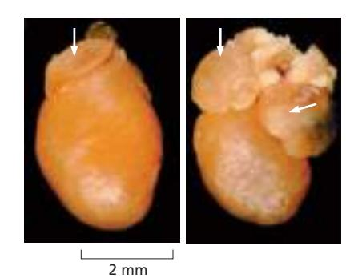

Figure 16–33 Effect on the heart of a subtle mutation in cardiac myosin. *Left*, normal heart from a 6-day-old mouse pup. *Right*, heart from a pup with a point mutation in both copies of its cardiac myosin gene, changing Arg403 to Gln. The arrows indicate the atria. In the heart from the pup with the cardiac myosin mutation, both atria are greatly enlarged (hypertrophic), and the mice die within a few weeks of birth. (From D. Fatkin et al., *J. Clin. Invest.* 103:147–153, 1999. With permission from the American Society for Clinical Investigation.) MBoC7 m16.38/16.33

984 Chapter 16: The Cytoskeleton MYOSIN AND ACTIN 985

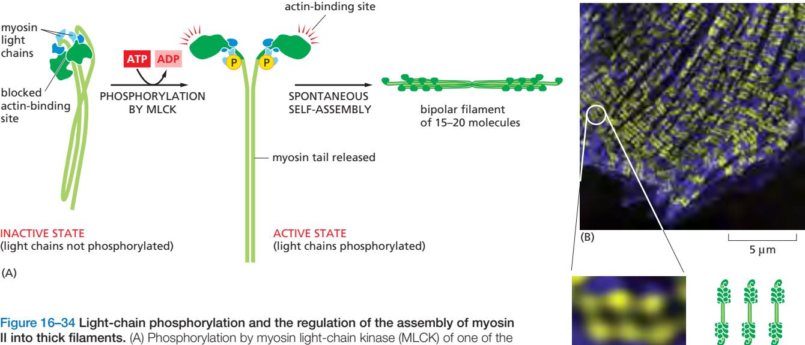

(C)

500 nm

II into thick filaments. (A) Phosphorylation by myosin light-chain kinase (MLCK) of one of the two light chains (the so-called regulatory light chain, shown in *light blue*) on non-muscle myosin II in a test tube has at least two effects: it causes a change in the conformation of the myosin heads, relieving steric inhibition to permit actin binding, and it releases the myosin tail from a "sticky patch" on the myosin head, thereby allowing the myosin molecules to assemble into short, bipolar, thick filaments. Smooth muscle is regulated by the same mechanism (see Figure 16–32). (B) Fluorescence micrograph showing the distribution of myosin light chain *(yellow)* and the actin filament cross-linker α-actinin *(blue)* in the contractile fibers of a rat embryo fibroblast. (C) A parallel stack of myosin filaments at higher magnification. These myosin II filaments are much smaller than those found in skeletal muscle cells (see Figure 16–22), but nevertheless form sarcomere-like units. (B and C, courtesy of Shiqiong Hu and Alexander Bershadsky.) MBoC7 m16.39/16.34

amoeba *Acanthamoeba castellanii*. This protein had a different tail structure and seemed to function as a monomer, and so it was named *myosin I* (for oneheaded). Conventional muscle myosin was renamed *myosin II* (for two-headed). Subsequently, many other myosin types were discovered. The heavy chains generally start with a recognizable myosin motor domain at the N-terminus and then diverge widely with a variety of C-terminal tail domains (**Figure 16–35**). The myosin family includes a number of one-headed and two-headed varieties that are about equally related to myosin I and myosin II, and the nomenclature now reflects their approximate order of discovery (myosin III through at least myosin XVIII). Sequence comparisons among diverse eukaryotes indicate that there are at least 37 distinct myosin families in the superfamily. All of the myosins except one move toward the plus end of an actin filament, although they do so at different speeds. The exception is myosin VI, which moves toward the minus end. The

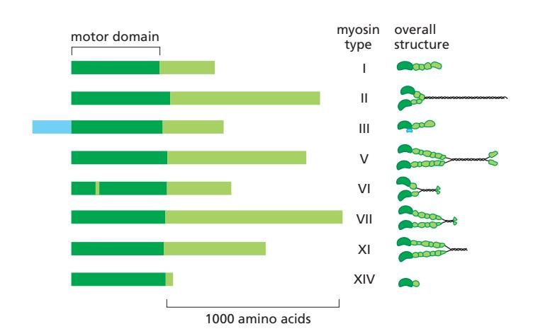

Figure 16–35 Myosin superfamily members. Comparison of the domain structure of the heavy chains of some myosin types. All myosins share similar motor domains (shown in *dark green*), but their C-terminal tails *(light green)* and N-terminal extensions *(light blue)* are very diverse. On the right are depictions of the molecular structures for these family members. Many myosins form dimers, with two motor domains per molecule, but a few (such as I, III, and XIV) seem to function as monomers, with just one motor domain. Myosin VI, despite its overall structural similarity to other family members, is unique in moving toward the minus end (instead of the plus end) of an actin filament. The small insertion within its motor head domain, not found in other myosins, is probably responsible for this change in direction.

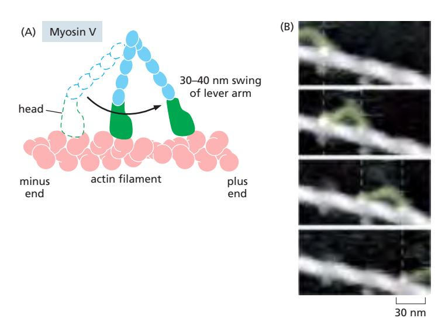

Figure 16–36 Myosin V walks along actin filaments. (A) The lever arm of myosin V is long, allowing it to take a bigger step along an actin filament than can myosin II (see Figure 16–24). (B) Atomic force microscopy images showing myosin V *(green)* walking along an actin filament. Myosin V functions to carry cargo in cells. (B, adapted from N. Kodera and T. Ando, *Biophys. Rev*. 6:237–260, 2014. Reproduced with permission of SNCSC.)

myosin tails (and the tails of motor proteins generally) have apparently diversified during evolution to permit the proteins to bind other subunits and to interact with different cargoes.

Some myosins are found only in plants, and some are found only in vertebrates. Most, however, are found in all eukaryotes, suggesting that myosins arose early in eukaryotic evolution. The human genome includes about 40 myosin genes. Nine of the human myosins are expressed primarily or exclusively in the hair cells of the inner ear, and mutations in five of them are known to cause hereditary deafness. These extremely specialized myosins are important for the construction and function of the complex and beautiful bundles of actin found in stereocilia that project from the apical surface of these cells; these cellular protrusions tilt in response to sound and convert sound waves into electrical signals. MBoC7 m16.41/16.36

The functions of most of the myosins remain to be determined, but several are well characterized. The myosin I proteins often contain either a second actin-binding site or a membrane-binding site in their tails, and they are generally involved in intracellular organization—including the protrusion of actin-rich structures at the cell surface, such as microvilli (see Panel 16–1 and Figure 16–4), and endocytosis. Myosin V is a two-headed myosin with a large step size (**Figure 16–36**) and is involved in organelle transport along actin filaments. In contrast to myosin II motors, which work in ensembles and are attached only transiently to actin filaments so as not to interfere with one another, myosin V moves continuously, or *processively*, along actin filaments without letting go. Myosin V functions are well studied in the yeast *Saccharomyces cerevisiae*, which undergoes a stereotypical pattern of growth and division called budding. Actin cables in the mother cell point toward the bud, where actin is found in patches that concentrate where cell-wall growth is taking place. Myosin V motors carry a wide range of cargoes—including mRNA, endoplasmic reticulum, and secretory vesicles—along the actin cables and into the bud (see Figure 16–76).

#### Summary

*Using their neck domain as a lever arm, myosins convert ATP hydrolysis into mechanical work to move along actin filaments in a stepwise fashion. Skeletal muscle is made up of myofibrils containing thousands of sarcomeres assembled from highly ordered arrays of actin and myosin II filaments, together with many accessory proteins. Muscle contraction is stimulated by calcium, which causes the actin filament–associated protein tropomyosin to move, uncovering myosin binding sites and allowing the filaments to slide past one another. Smooth muscle and non-muscle cells have less well-ordered contractile bundles of actin and myosin, which are regulated by myosin light-chain phosphorylation. Myosin V transports cargo by walking along actin filaments.*

986 Chapter 16: The Cytoskeleton MICROTUBULES 987

# MICROTUBULES

Microtubules are structurally more complex than actin filaments, but they are also highly dynamic and play similarly diverse and important roles in the cell. Microtubules are polymers of the protein **tubulin**. The tubulin subunit is a heterodimer formed from two closely related globular proteins called *a-tubulin* and *b-tubulin*, each comprising 445–450 amino acids, which are tightly held together by noncovalent bonds (**Figure 16–37A**). These two tubulin proteins are found only in this heterodimer, and each α or β monomer has a binding site for one molecule of GTP. The GTP that is bound to α-tubulin is physically trapped at the dimer interface and is never hydrolyzed or exchanged; it can therefore be considered to be an integral part of the tubulin heterodimer structure. In contrast, β-tubulin may be bound to either GTP or GDP and—as we shall see—this difference is important for microtubule dynamics.

Tubulin is found in all eukaryotic cells, and it exists in multiple isoforms. Its amino acid sequence has been highly conserved during evolution: thus, yeast and human tubulins are 75% identical. In mammals, there are at least six forms of α-tubulin and a similar number of β-tubulins, each encoded by a different gene. Although the different forms of tubulin are very similar and can copolymerize into mixed microtubules in a test tube, they can have distinct locations in cells and tissues and perform subtly different functions.

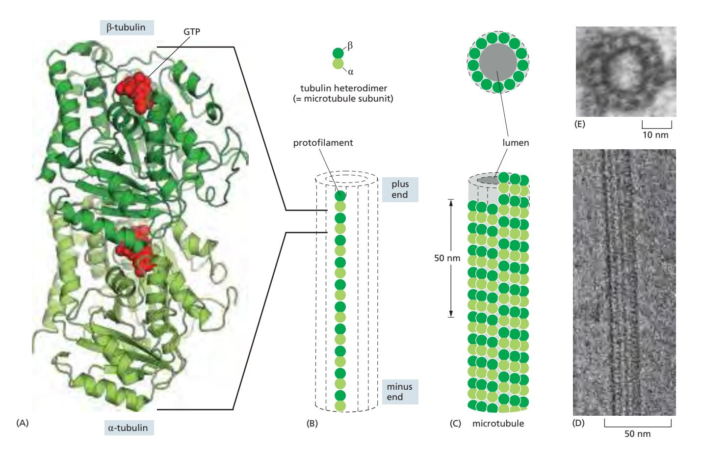

MBoC7 m16.42/16.37 Figure 16–37 The structure of a microtubule and its subunit. (A) The subunit of each protofilament is a tubulin heterodimer, formed from a tightly linked pair of α- and β-tubulin monomers. The GTP molecule in the α-tubulin monomer is so tightly bound that it can be considered an integral part of the protein. The GTP molecule in the β-tubulin monomer, however, is less tightly bound and has an important role in filament dynamics. GTP is shown in *red*. (B) One tubulin subunit (αβ-heterodimer) and one protofilament are shown schematically. Each protofilament consists of many adjacent subunits with the same orientation. (C) The microtubule is a stiff hollow tube formed from 13 protofilaments aligned in parallel. (D) A short segment of a microtubule viewed in an electron microscope. (E) Electron micrograph of a cross section of a microtubule showing a ring of 13 protofilaments. (A, PDB code: 1JFF; D, courtesy of Richard Wade; E, courtesy of Richard Linck.)

As a striking example, mutations in a particular human β-tubulin gene give rise to a paralytic eye-movement disorder because of loss of ocular nerve function. Some human neurological diseases have also been linked to mutations in a specific tubulin gene.

#### Microtubules Are Hollow Tubes Made of Protofilaments

A microtubule is a hollow cylindrical structure built from 13 parallel protofilaments, each composed of αβ-tubulin heterodimers stacked head to tail and then folded into a tube (**Figure 16–37B, C, and D**). The assembly of a microtubule generates two new types of protein–protein contacts. Along the longitudinal axis of a protofilament, the "top" of one β-tubulin molecule forms an interface with the "bottom" of the α-tubulin molecule in the adjacent heterodimer. This interface, which is very similar to the interface holding the α and β monomers together in the dimer subunit, has a high binding energy. Perpendicular to these interactions, neighboring protofilaments form lateral contacts, with the main lateral contacts occurring between monomers of the same type (α–α and β–β). A slight stagger in lateral contacts gives rise to the helical microtubule lattice, which holds most of the subunits tightly in place. As a result, the addition and loss of subunits occur almost exclusively at the microtubule ends (see Figure 16–5).

The multiple contacts among subunits make microtubules stiff and difficult to bend. The average length over which microtubules stay straight (persistence length) is more than 10 times that of actin filaments, making microtubules the stiffest and straightest structural elements found in most animal cells.

The subunits in each protofilament in a microtubule all point in the same direction, and the protofilaments themselves are aligned in parallel, with α-tubulins exposed at the minus end and β-tubulins exposed at the plus end. As for actin filaments, the regular, parallel orientation of their subunits gives microtubules both a structural and a dynamic polarity (**Figure 16–38**): the microtubule's plus end grows and shrinks much more rapidly than its minus end.

#### Microtubules Undergo a Process Called Dynamic Instability

Microtubule dynamics, like those of actin filaments, are profoundly influenced by the binding and hydrolysis of a nucleoside triphosphate—GTP for microtubules, as opposed to ATP for actin. GTP hydrolysis, which occurs only within the β-tubulin subunit of the tubulin dimer, proceeds very slowly in free tubulin subunits and is greatly accelerated when they are incorporated into microtubules. After GTP hydrolysis, a free phosphate group is released, leaving the GDP bound to β-tubulin within the microtubule lattice. Thus, as in the case of actin filaments, two different types of microtubule structures can exist, one in the *T form* bound to GTP and one in the *D form* bound to GDP. Because some of the energy of phosphate bond hydrolysis is stored as elastic strain in the polymer lattice, the

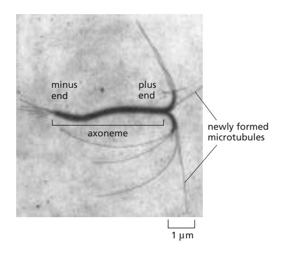

Figure 16–38 The preferential growth of microtubules at the plus end. Microtubules grow faster at one end than at the other. A stable bundle of microtubules obtained from the core of a cilium (called an axoneme) was incubated for a short time with tubulin subunits under polymerizing conditions. Microtubules grew fastest from the plus end of the microtubule bundle, the end on the right in this micrograph. (Courtesy of Gary Borisy.)

988 Chapter 16: The Cytoskeleton MICROTUBULES 989

free-energy change for dissociation of a subunit from the D-form polymer is more favorable (negative) than the free-energy change for dissociation of a subunit from the T-form polymer. This makes the ratio of *k*off/*k*on for GDP-tubulin [which is equal to its critical concentration, *C*c(D)] much higher than that of GTP-tubulin. As a result, under physiological conditions, the T form tends to polymerize and the D form tends to depolymerize.

Whether the tubulin subunits at the very end of a microtubule are in the T or the D form depends on the relative rates of tubulin addition and GTP hydrolysis. If the rate of subunit addition is low, hydrolysis is likely to occur before the next subunit is added, and the tip of the filament will then be in the D form. If the rate of subunit addition is high—and thus the filament is growing rapidly—then it is likely that a new subunit will be added to the end of the polymer before the GTP in the previously added subunit has been hydrolyzed. In this case, the tip of the polymer remains in the T form, forming a *GTP cap.* But this T form may not persist. Often GTP-tubulin subunits will assemble at the end of the microtubule at a rate similar to the rate of GTP hydrolysis, and in this case hydrolysis will sometimes "catch up" with the rate of subunit addition and transform the end to a D form. This transformation will be sudden and random, with a certain probability per unit time that depends on the concentration of free GTP-tubulin subunits, and it produces the microtubule's *dynamic instability*.

Suppose that the concentration of free tubulin is intermediate between the critical concentration for a T-form end and the critical concentration for a D-form end (that is, above the concentration necessary for T-form assembly, but below that for the D form). Now, any end that happens to be in the T form will grow, whereas any end that happens to be in the D form will shrink. On a single microtubule, an end might grow for a certain length of time in a T form, but then suddenly change to the D form and begin to shrink rapidly. At some later time, it might regain a T-form end and begin to grow again. This rapid interconversion between a growing and shrinking state, at a uniform free tubulin concentration, is called **dynamic instability** (**Figure 16–39** and **Figure 16–40A**; see Panel 16–2). The change from growth to shrinkage is called a *catastrophe*, while the change from shrinkage to growth is called a *rescue*.

The structural basis for dynamic instability is uncertain. On the basis of observations of the ends of growing and shrinking microtubules *in vitro*, one model proposed that tubulin subunits in the T form, with GTP bound to the β monomer, produce straight protofilaments that make strong and regular lateral contacts with one another, and that the hydrolysis of GTP to GDP makes these protofilaments curve (**Figure 16–40B**). More recent studies indicate that free tubulin subunits possess a similar bent conformation in both the T form and the D form. Growing microtubules with curved protofilaments at their tips have now been observed both *in vitro* and *in vivo*, and a straightening of the T form–containing protofilaments may occur subsequent to subunit incorporation as favorable lateral interactions zip them into the microtubule lattice. Regardless of the mechanism of microtubule assembly, the loss of a GTP cap and subsequent catastrophe causes protofilaments containing D-form subunits to spring apart and depolymerize (**Figure 16–40C**).

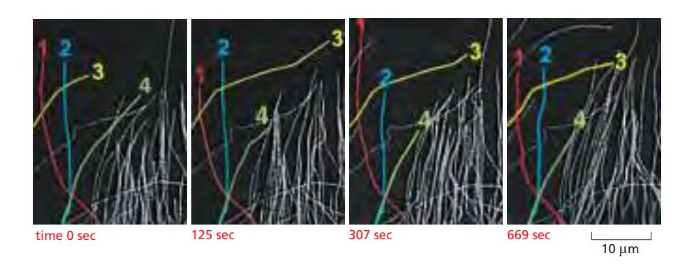

Figure 16–39 Direct observation of the dynamic instability of microtubules in a living cell. Microtubules in a newt lung epithelial cell were observed after the cell was injected with a small amount of fluorescently labeled tubulin. Notice the dynamic instability of microtubules at the edge of the cell. Four individual microtubules are highlighted for clarity; each of these shows alternating shrinkage and growth (Movie 16.9). (Courtesy of Wendy C. Salmon and Clare Waterman.)

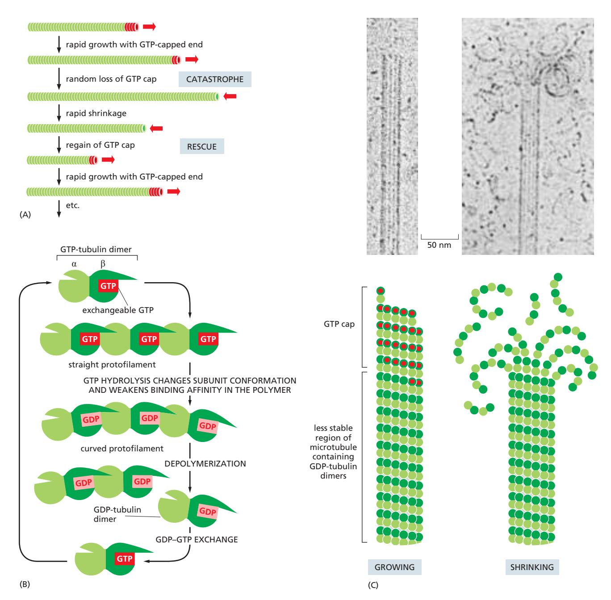

MBoC7 m16.44/16.39 Figure 16–40 Dynamic instability due to the structural differences between a growing and a shrinking microtubule end. (A) If the free tubulin concentration in solution is near the critical concentration, a single microtubule end may undergo transitions between a growing state and a shrinking state. A growing microtubule has GTP-containing subunits at its end, forming a GTP cap. If GTP hydrolysis proceeds more rapidly than subunit addition, the cap is lost and the microtubule begins to shrink, an event called a *catastrophe*. But GTP-containing subunits may still add to the shrinking end, and if enough add to form a new cap, then microtubule growth resumes, an event called a *rescue*. (B) Model for the structural consequences of GTP hydrolysis in the microtubule lattice. The addition of GTP-containing tubulin subunits to the end of a protofilament causes the end to grow in a linear conformation that can readily pack into the cylindrical wall of the microtubule. Hydrolysis of GTP after assembly changes the conformation of the subunits and tends to force the protofilament into a curved shape that is less able to pack into the microtubule wall. (C) In an intact microtubule with a stable cap of GTP-tubulin, protofilaments made from GDP-containing subunits are forced into a linear conformation by the many lateral bonds within the microtubule wall. Loss of the GTP cap, however, allows the GDP-containing protofilaments to relax into their more curved conformation. This leads to a progressive disruption of the microtubule. Above the drawings of a growing and a shrinking microtubule, electron micrographs show actual microtubules in each of these two states. Note particularly the curling, disintegrating GDP-containing protofilaments at the end of the shrinking microtubule. (C, © 1991 E.M. Mandelkow, E. Mandelkow, and R.A. Milligan. Originally published in *J. Cell Biol.* https://doi.org/10.1083/jcb.114.5.977. With permission from Rockefeller University Press.)

990 Chapter 16: The Cytoskeleton MICROTUBULES 991

Why does nucleoside triphosphate hydrolysis lead to treadmilling of actin filaments, while microtubules undergo dynamic instability? One explanation is that the tubulin subunits with GDP bound have a very low affinity for one another, with a very high *k*off/*k*on. Therefore, as soon as GTP hydrolysis occurs at the tip of a microtubule growing *in vitro*, it undergoes a catastrophe and depolymerizes completely. In contrast, ADP-actin has a lower *k*off/*k*on ratio and it depolymerizes more slowly. A second reason is thought to be differences in critical concentrations (*C*c) for the two ends of the filaments. The minus end of an actin filament has a much higher *C*c than the plus end, whereas measurements of microtubules indicate that the plus and minus ends possess a similar *C*c. Therefore, although the basic principles of actin and microtubule dynamics are very similar, with nucleoside triphosphate binding and hydrolysis leading to dynamic behaviors, quantitative differences in affinities lead to dramatic differences in their intrinsic behavior.

#### Microtubule Functions Are Inhibited by Both Polymer-stabilizing and Polymer-destabilizing Drugs

Chemical compounds that impair polymerization or depolymerization of microtubules are powerful tools for investigating the roles of these polymers in cells. Whereas *colchicine* and *nocodazole* interact with tubulin subunits and lead to microtubule depolymerization, *Taxol* binds to and stabilizes microtubules, causing a net increase in tubulin polymerization (see Table 16–1). Drugs like these have a rapid and profound effect on the organization of the microtubules in living cells. Both microtubule-depolymerizing drugs (such as nocodazole) and microtubule-polymerizing drugs (such as Taxol) preferentially kill dividing cells, because microtubule dynamics are crucial for correct function of the mitotic spindle (discussed in Chapter 17). Some of these drugs kill certain types of tumor cells in a human patient, although not without toxicity to rapidly dividing normal cells, including those in the bone marrow, intestine, and hair follicles. Taxol in particular has been widely used to treat cancers of the breast and lung, and it is frequently successful in treatment of tumors that are resistant to other chemotherapeutic agents.

#### A Protein Complex Containing γ-Tubulin Nucleates Microtubules

Because formation of a microtubule requires the interaction of many tubulin heterodimers, the concentration of tubulin subunits required for spontaneous nucleation of microtubules is very high. Microtubule nucleation therefore requires help from other factors. While α- and β-tubulins are the regular building blocks of microtubules, another type of tubulin, called *g-tubulin*, is present in much smaller amounts than α- and β-tubulin and is involved in the nucleation of microtubule growth in organisms ranging from yeasts to humans. Microtubules are generally nucleated from a specific intracellular location known as a **microtubule-organizing center (MTOC)** where γ-tubulin is most enriched. Nucleation in many cases depends on the **g-tubulin ring complex (g-TuRC)**. Within this complex, two accessory proteins bind directly to the γ-tubulin, along with several other proteins that help create a spiral ring of γ-tubulin molecules, which serves as a template that creates a microtubule with 13 protofilaments (**Figure 16–41**).

#### The Centrosome Is a Prominent Microtubule Nucleation Site

Many animal cells possess a single, well-defined MTOC called the centrosome, which is located adjacent to the nucleus and from which microtubules are nucleated at their minus ends, so the plus ends point outward and continually grow and shrink, probing the entire three-dimensional volume of the cell. A centrosome typically recruits more than 50 copies of γ-TuRC. However, most animal cells contain many hundreds of microtubules, most of which could not be stably anchored at the centrosome simply because they would not fit. Thus,

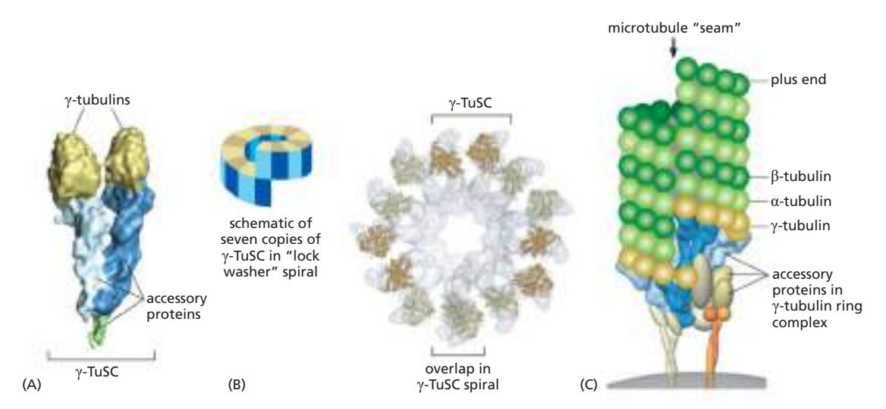

Figure 16–41 Microtubule nucleation by the **g**-tubulin ring complex. (A) Two copies of γ-tubulin associate with a pair of accessory proteins to form the γ-tubulin small complex (γ-TuSC). This image was generated by high-resolution electron microscopy of individual purified complexes. (B) Seven copies of the γ-TuSC associate to form a spiral structure in which the last γ-tubulin lies beneath the first, resulting in 13 exposed γ-tubulin subunits in a circular orientation that matches the orientation of the 13 protofilaments in a microtubule. (C) In many cell types, the γ-TuSC spiral associates with additional accessory proteins to form the γ-tubulin ring complex (γ-TuRC), which is likely to nucleate the minus end of a microtubule as shown here. Note the longitudinal discontinuity between two protofilaments, which results from the spiral orientation of the γ-tubulin subunits. Microtubules often have one such "seam" breaking the otherwise uniform helical packing of the protofilaments. (A and B, from J.M. Kollman et al., Nature 466:879–883, published 2010 by Macmillan Publishers Ltd. Reproduced with permission of SNCSC.)

the majority of γ-TuRC is found in the cytoplasm, and centrosomes are not absolutely required for microtubule nucleation, as destroying them with a laser pulse does not prevent microtubule nucleation elsewhere in the cell. A variety of proteins have been identified that anchor γ-TuRC to the centrosome, but mechanisms that activate microtubule nucleation at MTOCs and at other sites in the cell are poorly understood.

Embedded in the centrosome are the **centrioles**, a pair of cylindrical structures arranged at right angles to each other in an L-shaped configuration (**Figure 16–42**).

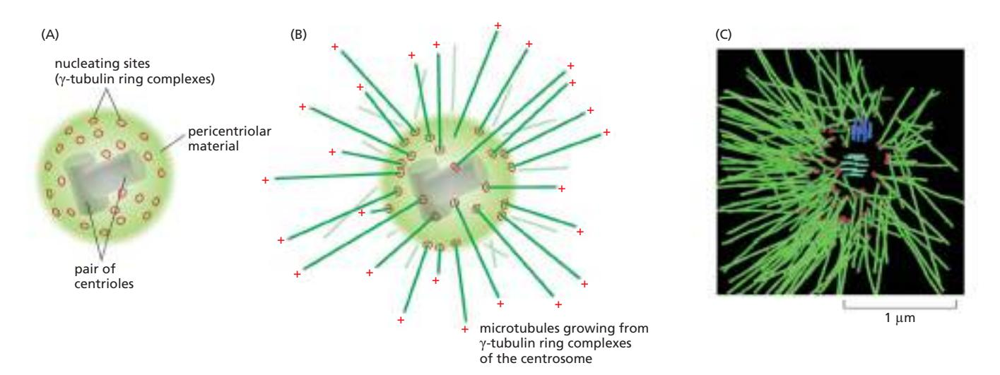

Figure 16–42 The centrosome. (A) The centrosome is a major MTOC in animal cells. Located in the cytoplasm next to the nucleus, it consists of a pair of centrioles surrounded by an amorphous matrix of fibrous proteins, the pericentriolar material, in which the γ-tubulin ring complexes that nucleate microtubule growth are embedded. (B) A centrosome with attached microtubules. The minus end of each microtubule is embedded in the centrosome, having grown from a γ-tubulin ring complex, whereas the plus end of each microtubule is free in the cytoplasm. (C) In a reconstructed image of the MTOC from a C. elegans cell, a dense thicket of microtubules can be seen emanating from the centrosome. (C, from E.T. O'Toole et al., J. Cell Biol. 163:451–456, 2003. With permission from the authors.)

992 Chapter 16: The Cytoskeleton MICROTUBULES 993

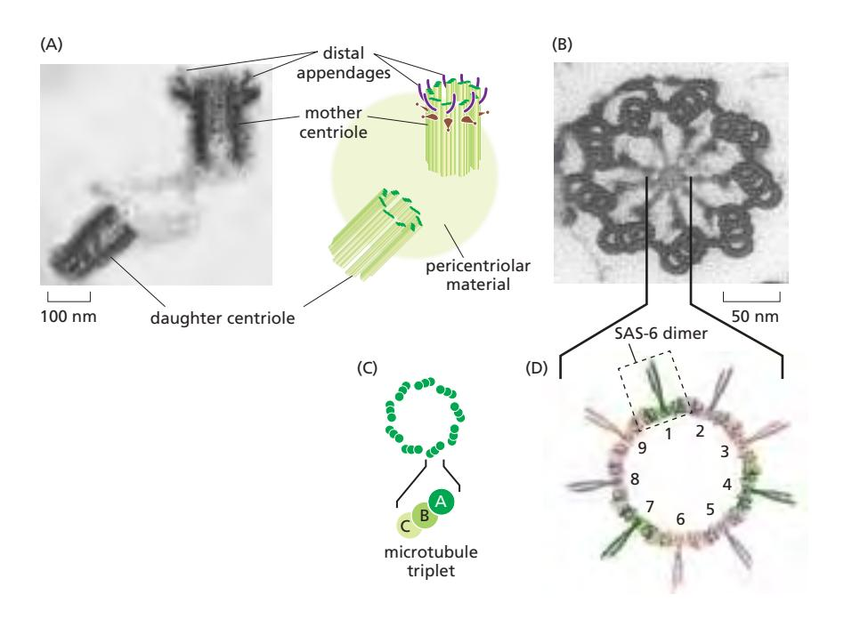

A centriole consists of a cylindrical array of short, modified microtubules arranged into a barrel shape with striking ninefold symmetry (**Figure 16–43**). Together with a large number of accessory proteins, the centrioles recruit the *pericentriolar material*, where microtubule nucleation takes place. The pericentriolar material consists of a dense spherical matrix that is thought to form through a process of biomolecular condensation (see Figure 12–6). As described in Chapter 17 (see Figure 17–29), the centrosome duplicates before mitosis, forming a pair of centrosomes that each contain a centriole pair. When mitosis begins, the two centrosomes move apart to form the poles of the mitotic spindle (see Panel 17–1). MBoC7 m16.48/16.43

# Microtubule Organization Varies Widely Among Cell Types

The arrangement of microtubules in the cytoplasm varies in different cell types (**Figure 16–44**). In budding yeast, microtubules are nucleated at an MTOC that is embedded in the nuclear envelope as a small, multilayered structure called the *spindle pole body*, also found in other fungi and diatoms*.* Higher-plant cells lack centrosomes and nucleate microtubules at sites distributed all around the nuclear envelope and at the cell cortex. Neither fungi nor most plant cells contain centrioles. Despite these differences, all these cells seem to use γ-TuRC to nucleate their microtubules.

Cultured fibroblasts contain an aster-like configuration of microtubules, with dynamic plus ends pointing outward toward the cell periphery and stable

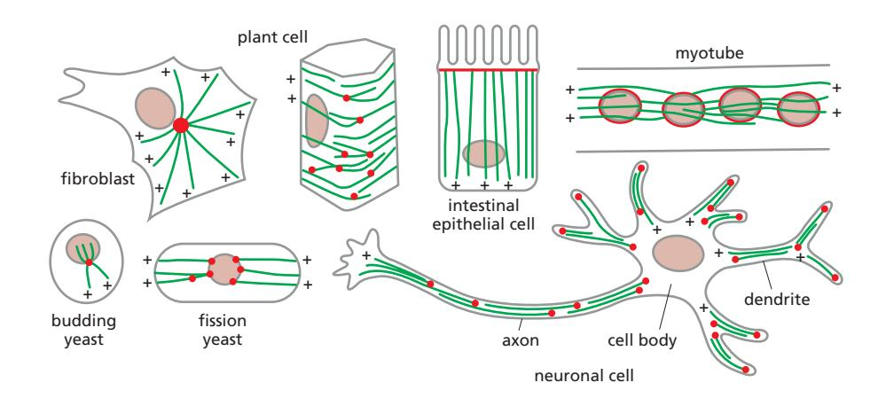

Figure 16–43 A pair of centrioles in the centrosome. (A) An electron micrograph of a thin section of an isolated centrosome from an interphase cell showing the mother centriole with its distal appendages and the adjacent daughter centriole, which formed through a duplication event during S phase (see Figure 17–29). In the centrosome, the centriole pair is surrounded by a dense matrix of pericentriolar material from which microtubules nucleate. Centrioles also function as basal bodies to nucleate the formation of ciliary axonemes (see Figure 16–58). (B) Electron micrograph of a cross section through a centriole in the cortex of a protozoan. Each centriole is composed of nine sets of microtubule triplets arranged to form a cylinder. (C) Each triplet contains one complete microtubule (the A microtubule) fused to two incomplete microtubules (the B and C microtubules). (D) The centriolar protein SAS-6 forms a coiled-coil dimer. Nine SAS-6 dimers can self-associate to form a ring. Located at the hub of the centriole cartwheel-like structure, the SAS-6 ring is thought to generate the ninefold symmetry of the centriole. (A, from M. Paintrand et al., *J. Struct. Biol.* 108:107, 1992. With permission from Elsevier; B, courtesy of Richard Linck; D, courtesy of Michel Steinmetz.)

Figure 16–44 Microtubule organization in different cell types. Microtubules *(green)* are organized by MTOCs *(red)*, which nucleate, anchor, or stabilize the microtubule minus ends. A single focal MTOC in a fibroblast or yeast cell is the primary nucleation site and leads to microtubules organized with their plus ends extending out toward the cell periphery. A more complex distribution of microtubule plus and minus ends is observed in other cell types.

# microtubule αβ-tubulin dimers – + – + – + – + – + kinesin-13 induces catastrophe and disassembly stathmin binds subunits, prevents assembly tau MAP2 plectin katanin severs microtubules MAPs stabilize microtubules by binding along sides links to intermediate filaments XMAP215 stabilizes plus ends, promotes rapid microtubule growth +TIPs associate with growing plus ends and can link them to other structures, such as membranes γ-TuRC nucleates assembly and remains associated with the minus end augmin nucleates microtubule centrosome branching – + filament bundling and cross-linking MICROTUBULES

Some of the major accessory proteins of the microtubule cytoskeleton. Except for two classes of motor proteins, an example of each major type is shown. Each of these is discussed in the text. However, most cells contain more than a hundred different microtubule-binding proteins, and—as for the actin-associated proteins—it is likely that there are important types of microtubule-associated proteins that are not yet recognized.

MICROTUBULES 995

minus ends gathered near the nucleus. Most microtubule minus ends detach from the centrosome and can be organized by other cellular structures, such as the Golgi apparatus, which functions as an MTOC in mesenchymal cells. The organization of microtubules in the cell establishes a general coordinate system, which is then used to position many organelles within the cell. Highly differentiated cells with complex morphologies, such as neurons, muscles, and epithelial cells, use additional mechanisms to establish their more elaborate internal organization. Thus, for example, when an epithelial cell forms cell–cell junctions and becomes highly polarized, the microtubule minus ends relocalize to a region near the apical plasma membrane. From this asymmetrical location, a microtubule array extends along the long axis of the cell, with plus ends directed toward the basal surface (see Figure 16–4). In many cells, the minus ends of microtubules are stabilized by association with γ-TuRC or other capping proteins, or else they serve as microtubule-depolymerization sites. One class of capping proteins, called CAMSAPs in vertebrates, acts to protect minus ends from depolymerization and anchor them to cellular structures, such as the Golgi apparatus or the cell cortex.

Neurons contain complex cytoskeletal structures. As they differentiate, neurons send out specialized processes that will either receive electrical signals (*dendrites*) or transmit electrical signals (*axons*) (see Figure 16–45). Axons and dendrites (collectively called *neurites*) are filled with bundles of microtubules that are critical to their structure and their function. In axons, all the microtubules are oriented with their minus ends pointing back toward the cell body and their plus ends pointing toward the axon terminals (see Figure 16–44). Microtubules do not reach from the cell body all the way to the axon terminals; each is typically only a few micrometers in length, but large numbers are staggered in an overlapping array. These aligned microtubule tracks act as a highway to transport specific proteins, protein-containing vesicles, and mRNAs to the axon terminals, where synapses are constructed and maintained. The longest axon in the human body reaches from the base of the spinal cord to the foot and is up to a meter in length. Dendrites are generally much shorter. The microtubules in dendrites lie parallel to one another but their polarities are mixed, with some pointing their plus ends toward the dendrite tip, and others pointing in the opposite direction.

#### Microtubule-binding Proteins Modulate Filament Dynamics and Organization

Microtubule polymerization dynamics are very different in cells than in solutions of pure tubulin. Microtubules in cells exhibit a much higher polymerization rate (typically 10–15 μm/min, relative to about 1.5 μm/min with purified tubulin at similar concentrations), a greater catastrophe frequency, and extended pauses in microtubule growth, a dynamic behavior rarely observed in pure tubulin solutions. These and other differences arise because microtubule dynamics inside the cell are governed by a variety of proteins that bind tubulin dimers or microtubules, as summarized in **Panel 16–4**.

Proteins that bind to microtubules are collectively called **microtubuleassociated proteins**, or **MAPs**. Because the short (∼20 amino acid) C-terminal tails of both α- and β-tubulin that protrude from the microtubule are enriched in glutamic and aspartic acids, the surface of the microtubule possesses a net negative charge. Many MAPs are positively charged and bind to microtubules through electrostatic interactions. Some MAPs can stabilize microtubules against disassembly. A subset of MAPs can also mediate the interaction of microtubules with other cell components. This subset is prominent in neurons, where stabilized microtubule bundles form the core of the axons and dendrites that extend from the cell body (**Figure 16–45**). These MAPs have at least one domain that binds to the microtubule surface and another that projects outward. The length of the projecting domain can determine how closely MAP-coated microtubules pack together, as demonstrated in cells engineered to overproduce different MAPs.

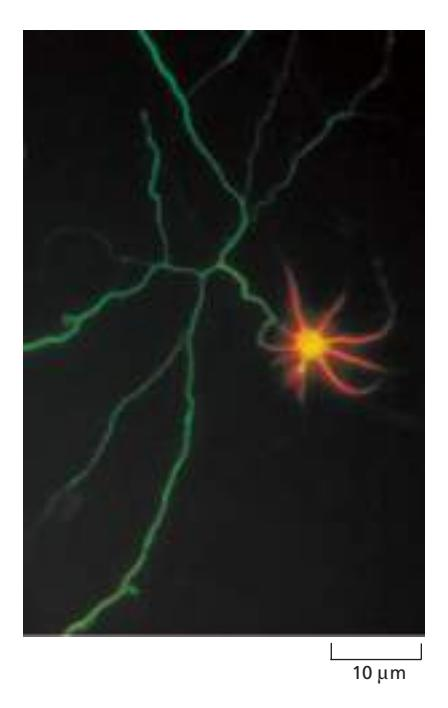

Figure 16–45 Localization of MAPs in the axon and dendrites of a neuron. This immunofluorescence micrograph shows the distribution of the proteins tau *(green)* and MAP2 *(orange)* in a hippocampal neuron in culture. Whereas tau staining is confined to the axon (long and branched in this neuron), MAP2 staining is confined to the cell body and its dendrites. The antibody used here to detect tau binds only to unphosphorylated tau; phosphorylated tau is also present in dendrites. (Courtesy of James W. Mandell and Gary A. Banker.) MBoC7 m16.50/16.45

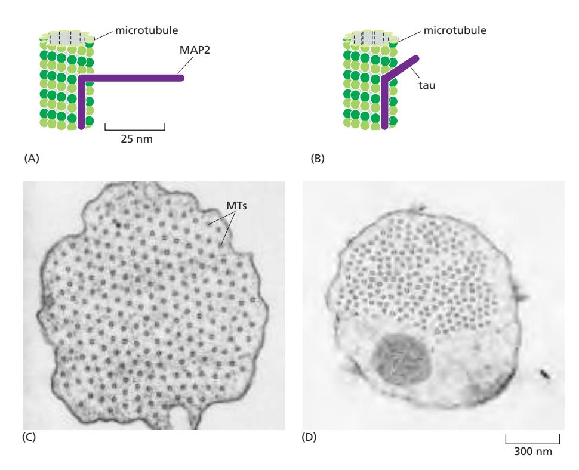

MBoC7 m16.51/16.46 Figure 16–46 Organization of microtubule bundles by MAPs. (A) One end of MAP2 binds along the microtubule lattice and extends a long projecting arm. (B) Tau possesses a shorter projection arm. (C) Electron micrograph showing a cross section through a microtubule bundle in a cell overexpressing MAP2. The regular spacing of the microtubules (MTs) in this bundle results from the constant length of the projecting arms of MAP2. (D) Similar cross section through a microtubule bundle in a cell overexpressing tau. Here the microtubules are spaced more closely together than they are in C because of tau's relatively short projecting arm. (C and D, from J. Chen et al., *Nature* 360:674–677, published 1992 by Nature Publishing Group. Reproduced with permission of SNCSC.)

Cells overexpressing MAP2, which has a long projecting domain, form bundles of stable microtubules that are kept widely spaced, while cells overexpressing tau, a MAP with a much shorter projecting domain, form bundles of more closely packed microtubules (**Figure 16–46**). MAPs are the targets of several protein kinases, and phosphorylation of a MAP can control both its activity and localization inside cells by disrupting its electrostatic interaction with microtubules.

MAPs can also recruit other proteins that organize the microtubule cytoskeleton. An important example is augmin, an 8-subunit protein complex that binds to sites along the microtubule and recruits γ-TuRC, which nucleates a new microtubule to form a microtubule branch (**Figure 16–47A**). Thus, similar to the activity of the Arp2/3 complex on actin filaments, augmin causes branching nucleation on preexisting microtubules (**Movie 16.10**). Augmin-induced branches help build the spindle during mitosis. Because they lack centrosomes, plant cells rely extensively on augmin-dependent microtubule branching nucleation to organize the microtubule cytoskeleton (**Figure 16–47B and C**).

#### Microtubule Plus End–binding Proteins Modulate Microtubule Dynamics and Attachments

While the minus ends of microtubules in many cells are usually stabilized and inert, plus ends, in contrast, efficiently explore and probe the entire volume of the cell. This process is facilitated by numerous proteins that bind to microtubule plus ends and thereby influence microtubule dynamics. These proteins can influence the rate at which a microtubule switches from a growing to a shrinking state (the frequency of catastrophes) or from a shrinking to a growing state MICROTUBULES 997

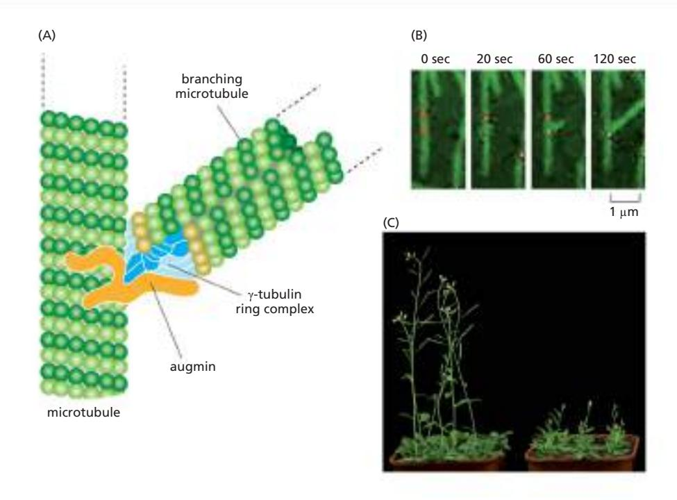

Figure 16–47 Microtubule branching by augmin. (A) Augmin binds along the side of an existing microtubule and recruits a γ-tubulin ring complex that nucleates a new microtubule with a low branching angle. (B) Fluorescence micrographs showing augmin (orange) nucleating a microtubule branch in the cortex of an epidermal cell in the plant Arabidopsis thaliana. (C) Depletion of augmin severely stunts plant growth. (B, from W. Liu et al., J. Integr. Plant Biol. 61:388–393, 2019; C, from T. Liu et al., Curr. Biol. 24:2708–2713, 2014. With permission from Elsevier.)

(the frequency of rescues). For example, members of a family of kinesin proteins known as *catastrophe factors* (or kinesin-13s) bind to microtubule ends and appear to pry protofilaments apart, lowering the normal activation-energy barrier that prevents a microtubule from springing apart into the curved protofilaments that are characteristic of the shrinking state (**Figure 16–48**). Other plus end–associated proteins act to promote rapid microtubule growth. A particularly ubiquitous example is *XMAP215*, which has close homologs in organisms that range from yeast to humans. Like formin proteins that concentrate actin subunits at the plus end of a growing actin filament, XMAP215 binds free tubulin subunits and delivers them to the plus end of a microtubule, dramatically accelerating polymerization (see Figure 16–48).

A large subset of MAPs is enriched at microtubule plus ends. Called *plus-end tracking proteins* (*1TIPs*), these MAPs bind an actively growing plus end and dissociate when the microtubule begins to shrink (**Figure 16–49**). The kinesin-13 catastrophe factors and XMAP215 mentioned above behave as +TIPs and act to modulate the growth and shrinkage of the microtubule end to which they are

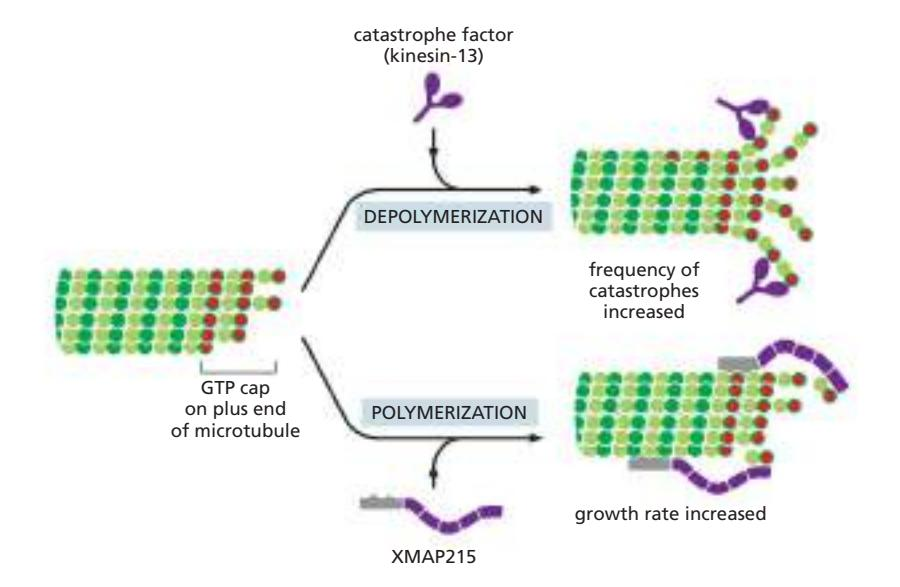

Figure 16–48 The effects of proteins that bind to microtubule ends. The transition between microtubule growth and shrinkage is controlled in cells by a variety of proteins. Catastrophe factors such as kinesin-13, a member of the kinesin motor protein superfamily, bind to microtubule ends and pry them apart, thereby promoting depolymerization. On the other hand, a MAP such as XMAP215 promotes rapid microtubule polymerization (XMAP stands for Xenopus microtubuleassociated protein, and the number refers to its molecular mass in kilodaltons). XMAP215 binds tubulin dimers and delivers them to the microtubule plus end, thereby increasing the microtubule growth rate.

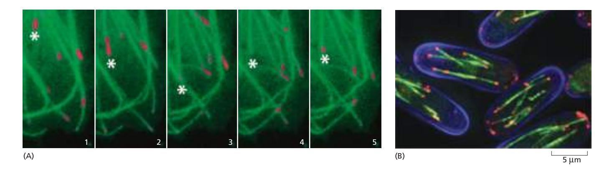

attached. Other +TIPs control microtubule positioning by helping to capture and stabilize the growing microtubule end at specific cellular targets, such as the cell cortex or the kinetochore of a mitotic chromosome. EB1 and its relatives, small dimeric proteins that are highly conserved in animals, plants, and fungi, are key players in this process. EB1 proteins do not actively move toward plus ends, but rather recognize a structural feature of the growing plus end (see Figure 16–49). Several +TIPs depend on EB1 proteins for their plus-end accumulation and also interact with each other and with the microtubule lattice. By attaching to the plus end, these factors control microtubule dynamics and also allow the cell to harness the energy of microtubule polymerization to generate pushing forces that can be used for positioning the spindle, chromosomes, or organelles.

#### Tubulin-sequestering and Microtubule-severing Proteins Modulate Microtubule Dynamics MBoC7 m16.53/16.49

As it does with actin monomers, the cell sequesters unpolymerized tubulin subunits to maintain a pool of active subunits at a level near the critical concentration. One molecule of the small protein *stathmin* (also called Op18) binds two tubulin heterodimers and prevents their addition to the ends of microtubules (**Figure 16–50**). Stathmin thus decreases the effective concentration of tubulin subunits that are available for polymerization (an action analogous to that of the drug colchicine) and enhances the likelihood that a growing microtubule will switch to the shrinking state. Phosphorylation of stathmin inhibits its binding to tubulin, and signals that cause stathmin phosphorylation can increase the rate of microtubule elongation and suppress dynamic instability. Stathmin has been implicated in the regulation of both cell proliferation and cell death. Notably, mice lacking stathmin develop normally but are less fearful than wild-type mice, reflecting a role for stathmin in neurons of the amygdala, where it is normally expressed at high levels.

Severing is another mechanism employed by the cell to destabilize microtubules. To sever a microtubule, 13 longitudinal bonds must be broken, one for each protofilament. The protein *katanin*, named after the Japanese word for "sword," accomplishes this demanding task (**Figure 16–51A and B**). Katanin belongs to a large family of proteins that use the energy of ATP hydrolysis to disassemble or remodel protein complexes. By extracting tubulin subunits from the wall of the microtubule, katanin weakens the structure and thereby promotes breakage. Katanin also releases microtubules from microtubule-organizing centers and is thought to contribute to the rapid microtubule depolymerization observed at the poles of spindles during mitosis.

Paradoxically, the loss of microtubule-severing protein activity in many cell types leads to a decrease rather than an increase in microtubules. Thus, microtubule-severing proteins play an unexpected role in stabilizing microtubules. How is this possible? During the intermediate steps of a microtubule-severing event, GDP-bound tubulin subunits are lost from the wall of the microtubule and are replaced with GTP-tubulin subunits from

Figure 16–49 **1**TIP proteins found at the growing plus ends of microtubules. (A) Frames from a fluorescence time-lapse movie of the edge of a cell expressing fluorescently labeled tubulin that incorporates into microtubules *(green)* as well as the +TIP protein EB1 tagged with a different color *(red)*. The same microtubule is marked *(asterisk)* in successive movie frames. When the microtubule is growing (frames 1, 2), EB1 is associated with the tip. When the microtubule undergoes a catastrophe and begins shrinking, EB1 is lost (frames 3, 4). The labeled EB1 is regained when growth of the microtubule is rescued (frame 5). See Movie 16.11. (B) In the fission yeast *Schizosaccharomyces pombe*, microtubules *(green)* are bound at their plus ends by the homolog of EB1 *(red)* as they grow toward the two poles of the rod-shaped cells. (A, courtesy of Anna Akhmanova and Ilya Grigoriev; B, courtesy of Takeshi Toda.)

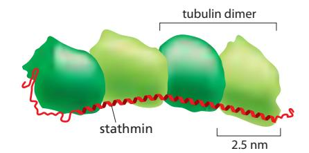

Figure 16–50 Sequestration of tubulin by stathmin. Structural studies with electron microscopy and crystallography suggest that the elongated stathmin protein binds along the side of two tubulin heterodimers. (Adapted from M.O. Steinmetz et al., *EMBO J*. 19:572–580, 2000.)

998 Chapter 16: The Cytoskeleton MICROTUBULES 999

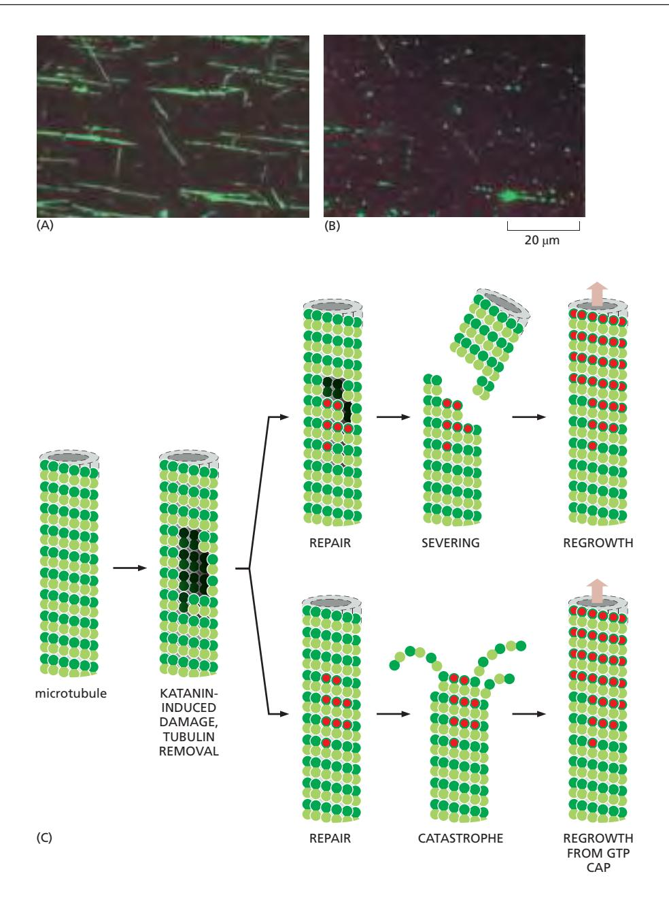

Figure 16–51 Microtubule severing by katanin can destabilize or amplify microtubules. (A) Taxol-stabilized, fluorescently labeled microtubules were adsorbed on the surface of a glass slide, to which purified katanin was added along with ATP. There are a few breaks in the microtubules 30 seconds after the addition of katanin. (B) Three minutes after the addition of katanin, the filaments have been severed in many places, leaving a series of small fragments at the previous locations of the long microtubules. (C) Incorporation of GTP-tubulin subunits from the soluble pool into sites of katanin-induced damage in the microtubule lattice stabilizes the severed end or generates an island of GTPtubulin that promotes rescue. (A and B, from J.J. Hartman et al., *Cell* 93:277–287, 1998. With permission from Elsevier. C, adapted from A. Vemu et al., *Science* 361: eaau1504, 2018. With permission from AAAS.)

the soluble pool. If a sufficient number of GTP-tubulin subunits are incorporated before the severing is complete, the new plus end of the cut microtubule will possess a stabilizing GTP-tubulin cap and will therefore polymerize. Thus microtubule severing can generate plus ends that promote growth of more polymer. Alternatively, incomplete severing could lead to an island of GTP-tubulin in the microtubule lattice that could promote a future rescue event when this site is exposed after catastrophe (**Figure 16–51C**). Although insertion of GTP-tubulin into the lattice has been observed *in vitro* with pure microtubules, the importance of this activity in cells has not yet been fully established.

#### Two Types of Motor Proteins Move Along Microtubules MBoC7 m16.55/16.51

Like actin filaments, microtubules also work together with motor proteins in a variety of cellular processes. There are two major classes of microtubule-based motors, **kinesins** and **dyneins**, which perform three major functions. First, they move cargo such as organelles and macromolecules within the cell. Unlike actinbased transport, however, microtubule-based motors are used to transport

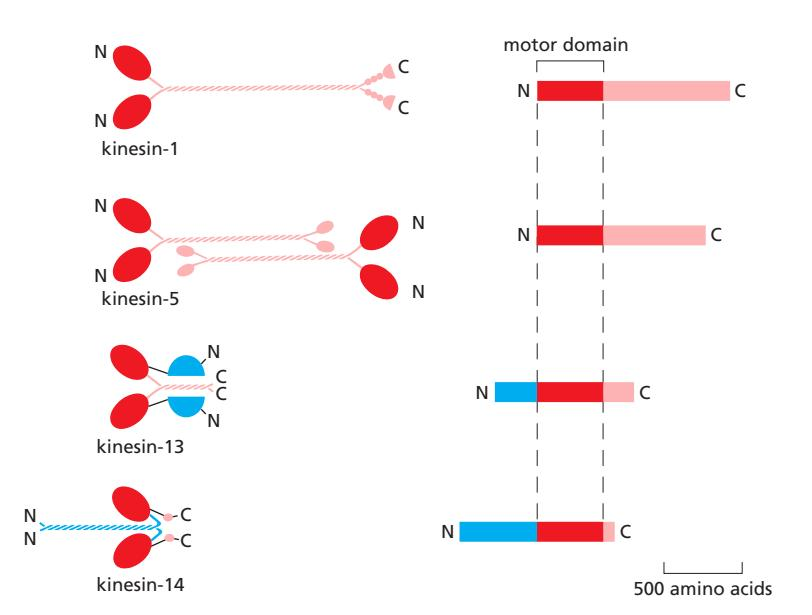

cargo over long distances. Second, motors can slide microtubules relative to one another, thereby generating specific arrangements of microtubules, as in neurons and epithelial cells (see Figure 16–44), and in the mitotic spindle (see Chapter 17). Third, a subset of microtubule-based motors regulates microtubule dynamics, as illustrated by kinesin-13 (see Figure 16–48).

Like myosins, kinesins are a large protein superfamily in which the motor domain of the heavy chain is the common element (**Figure 16–52**). The yeast *Saccharomyces cerevisiae* has six distinct kinesins. The nematode *C. elegans* has 20 kinesins, and humans have 45. **Kinesin-1** is similar to myosin II in having two heavy chains per active motor; these form two globular head motor domains that are held together by an elongated coiled-coil tail that mediates heavy-chain dimerization. Most kinesins have their motor domain at the N-terminus and walk toward the plus end of the microtubule. Kinesins with the motor domain at the C-terminus walk in the opposite direction, toward the minus end of the microtubule, while kinesin-13 has a central motor domain and does not walk at all, but uses the energy of ATP hydrolysis to depolymerize microtubule ends (see Figure 16–48). Some kinesins are monomers, and others are homodimers, heterodimers, or tetramers. The motor may be linked to a membrane-enclosed organelle via a light chain or an adaptor protein. Some kinesins possess a second microtubule-binding domain that increases its affinity for the microtubule or mediates cross-linking and sliding of two microtubules. MBoC7 m16.56/16.52

In kinesin-1, small movements at the ATP-binding site regulate the docking and undocking of the motor head domain to a long linker region. This acts to throw the second head forward along the protofilament to a binding site 8 nm closer to the microtubule plus end, which is the distance between tubulin dimers of a protofilament. The ATP-hydrolysis cycles in the two heads are closely coordinated, so that this cycle of linker docking and undocking allows the two-headed motor to move in a hand-over-hand (or head-over-head) stepwise manner (**Figure 16–53**).

The dyneins are a family of minus end–directed microtubule motors unrelated to the kinesins. They are composed of one, two, or three heavy chains (that include the motor domain) and a large and variable number of associated intermediate, light-intermediate, and light chains. The dynein family has two major branches. The first contains the *cytoplasmic dyneins*, which are homodimers of two heavy chains (**Figure 16–54**). Cytoplasmic dynein 1 is encoded by a single gene in almost all eukaryotic cells but is missing from flowering plants and some algae. It is used for organelle and mRNA trafficking, for positioning the centrosome and nucleus during cell migration, and for construction of the microtubule spindle in mitosis and meiosis. Cytoplasmic dynein 2 is found only in eukaryotic

Figure 16–52 Kinesins. Structures of four kinesin superfamily members. As in the myosin superfamily, only the motor domains are conserved. Kinesin-1 has the motor domain at the N-terminus of the heavy chain and moves toward the microtubule plus end. The middle domain forms a long coiled-coil, mediating dimerization. The C-terminal domain forms a tail that attaches to cargo, such as a membrane-enclosed organelle. Kinesin-5 forms tetramers in which two dimers associate by their tails. The bipolar kinesin-5 tetramer is able to slide two microtubules past each other, analogous to the activity of the bipolar thick filaments formed by myosin II. Kinesin-13 has its motor domain located in the middle of the heavy chain. It is a member of a family of kinesins that have lost typical motor activity and instead bind to microtubule ends to promote depolymerization (see Figure 16–48). Kinesin-14 is a C-terminal kinesin. Unlike most kinesins, members of the kinesin-14 family travel toward the microtubule minus end.

1000 Chapter 16: The Cytoskeleton MICROTUBULES 1001

Figure 16–53 The mechanochemical cycle of kinesin. Kinesin-1 is a dimer of two ATP-binding motor domains (heads) that are connected through a long coiled-coil tail (see Figure 16–52). The two kinesin motor domains work in a coordinated manner; during a kinesin "step," the rear head detaches from its tubulin binding site on the microtubule, passes the partner motor domain, and then rebinds to the next available binding site. Using this "hand-over-hand" motion, the kinesin dimer can move for long distances on the microtubule without completely letting go of its track.

At the start of each step, one of the two kinesin motor domain heads, the rear or lagging head *(dark red)*, is tightly bound to the microtubule and to ATP, while the front or leading head is loosely bound to the microtubule with ADP in its binding site. The forward displacement of the rear motor domain is driven by the dissociation of ADP and binding of ATP in the leading head (between panels 2 and 3 in this drawing). The binding of ATP to this motor domain causes a small peptide called the *neck linker* to shift from a rearward-pointing to a forward-pointing conformation (the neck linker is drawn here as a *purple* connecting line between the leading motor domain and the intertwined coiled-coil). This shift pulls the rear head forward, once it has detached from the microtubule with ADP bound [detachment requires ATP hydrolysis and phosphate (P) release]. The kinesin molecule is now poised for the next step, which proceeds by an exact repeat of the process shown (Movie 16.12).

organisms that have cilia and is used to transport material from the tip to the base of the cilia—a process called *intraflagellar transport* (IFT). *Axonemal dyneins* comprise the second branch and include monomers, heterodimers, and heterotrimers, with one, two, or three motor-containing heavy chains, respectively. They are highly specialized for the rapid and efficient microtubule sliding movements that drive the beating of cilia and flagella (discussed later).

Dyneins are the largest of the known molecular motors. Although structurally unrelated to myosins and kinesins, dyneins follow the general rule of coupling ATP hydrolysis to microtubule binding and unbinding as well as to a force-generating conformational change (**Figure 16–55**).

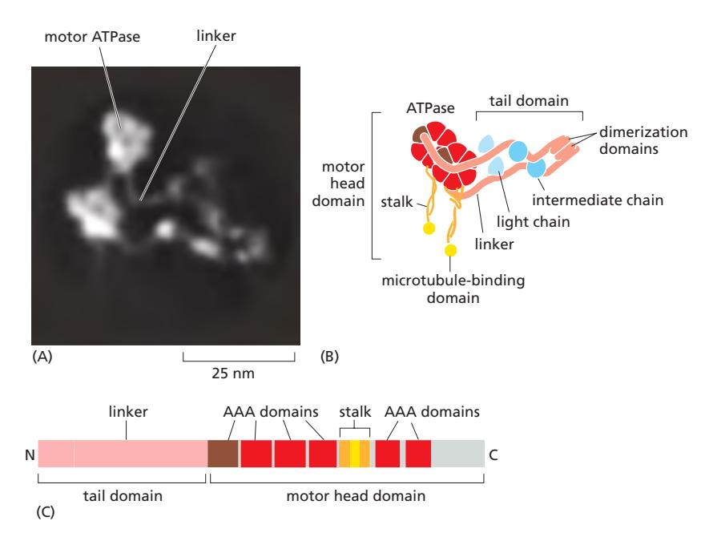

Figure 16–54 Cytoplasmic dynein. (A) Cryo-electron microscopy (cryoEM) reconstruction of a molecule of cytoplasmic dynein. Like myosin II and kinesin-1, cytoplasmic dynein is a two-headed molecule. The dynein head is very large compared with the head of either myosin or kinesin. (B) Schematic depiction of cytoplasmic dynein showing the two heavy chains that contain a motor head with domains for microtubule binding and ATP hydrolysis, connected by a long stalk. The tail domain consists of a linker that connects the motor heads to a dimerization domain. Bound to the linker domain are multiple intermediate chains and light chains *(blue)* that help to mediate many of dynein's functions. (C) The organization of domains in a dynein heavy chain. This is a huge polypeptide, containing more than 4000 amino acids. The conserved dynein motor head domain contains six AAA domains, four of which retain ATP-binding sequences, but only one of which has the major ATPase activity *(brown)*. The tail domain is not as highly conserved as the head domain and varies among different dynein subtypes. (A, courtesy of Andrew Carter.)

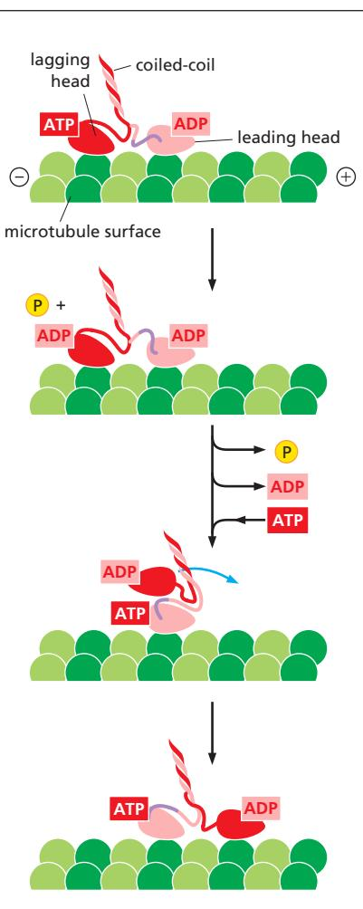

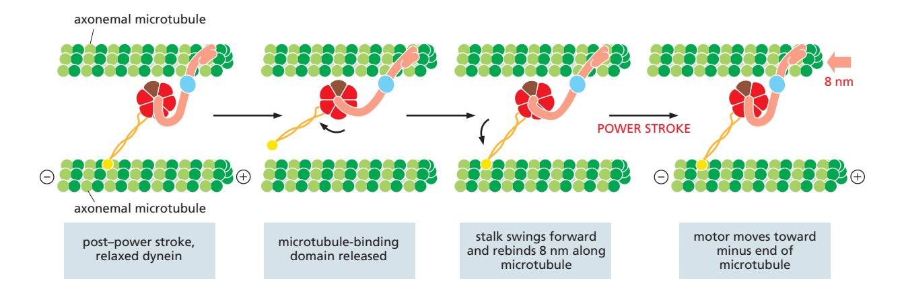

# Microtubules and Motors Move Organelles and Vesicles

A major function of cytoskeletal motors in interphase cells is the transport and positioning of membrane-enclosed organelles (**Movie 16.13**). Kinesin was originally identified as the protein responsible for fast *anterograde axonal transport*, the rapid movement of mitochondria, secretory vesicle precursors, and various synapse components down the microtubule highways of the axon to the distant nerve terminals. Cytoplasmic dynein 1 was identified as the motor responsible for transport in the opposite direction, *retrograde axonal transport*. Although organelles in most cells need not cover such long distances, their polarized transport is equally necessary. A typical microtubule array in an interphase cell is oriented with the minus ends near the center of the cell at the centrosome and the plus ends extending to the cell periphery. Thus, centripetal movements of organelles or vesicles toward the cell center require the action of minus end–directed cytoplasmic dynein motors, whereas centrifugal movements toward the periphery require plus end–directed kinesin motors. Notably, in animal cells, nearly all minus end–directed transport is driven by the single cytoplasmic dynein 1 motor, whereas at least 15 different kinesins are used for plus end–directed transport. MBoC7 n16.211/16.55

A clear example of the effect of microtubules and microtubule motors on the behavior of intracellular membranes is their role in organizing the endoplasmic reticulum (ER) and the Golgi apparatus. The network of ER membrane tubules aligns with microtubules and extends almost to the edge of the cell (**Movie 16.14**), whereas the Golgi apparatus is located near the centrosome. When cells are treated with a drug that depolymerizes microtubules, such as colchicine or nocodazole, the ER collapses to the center of the cell, while the Golgi apparatus fragments and disperses throughout the cytoplasm. *In vitro*, kinesins can tether ER-derived membranes to preformed microtubule tracks and walk toward the microtubule plus ends, dragging the ER membranes out into tubular protrusions and forming a membranous web that looks very much like the ER in cells. Conversely, dyneins are required for positioning the Golgi apparatus near the cell center of animal cells; they do this by moving Golgi vesicles along microtubule tracks toward the microtubules' minus ends at the centrosome.

The different tails and their associated light chains on specific motor proteins allow the motors to attach to their appropriate organelle cargo. Membraneassociated motor receptors that are sorted to specific membrane-enclosed compartments interact directly or indirectly with the tails of the appropriate kinesin family members. Many viruses take advantage of microtubule motor–based transport during infection and use kinesin to move from their site of replication and assembly to the plasma membrane, from which they are poised to infect neighboring cells.

For dynein, a large macromolecular assembly mediates attachment to cargoes. To translocate organelles effectively, cytoplasmic dynein, itself a huge protein complex, requires association with a second large protein complex called *dynactin* as well as with an adaptor protein that mediates their interaction and Figure 16–55 The power stroke of dynein. Illustration of the movement of a monomeric axonemal dynein found in the flagellum of the unicellular green alga *Chlamydomonas reinhardtii*. As in cytoplasmic dynein, the motor-containing head domain of axonemal dynein connects to a long, coiled-coil stalk with the microtubule-binding site at the tip. The tail attaches to an adjacent microtubule in the axoneme. Movement is thought to occur through a "linker-swing, dyneinwinch" mechanism. ATP binding and hydrolysis cause the linker to throw the head domain toward the microtubule minus end like a fishing hook. The microtubule-binding domain reattaches 8 nm along the microtubule. Release of ATP and phosphate then leads to a large conformational power stroke in the linker domain, pulling the tail and its attached microtubule toward the minus end. Each cycle generates a step of about 8 nm, thereby contributing to flagellar beating (see Figure 16–60). In the case of cytoplasmic dynein, the tail is attached to a cargo such as a vesicle, and a single power stroke transports the cargo about 8 nm along the microtubule toward its minus end (see Figure 16–56).

1002 Chapter 16: The Cytoskeleton MICROTUBULES 1003

links to a cargo such as a vesicle. The dynactin complex includes a short, actinlike filament that forms from the actin-related protein Arp1 (distinct from Arp2 and Arp3, the components of the Arp2/3 complex involved in the nucleation of conventional actin filaments) (**Figure 16–56**). A number of other proteins also contribute to dynein cargo binding and motor regulation, and their function is especially important in neurons, where defects in microtubule-based transport have been linked to neurological diseases. A striking example is smooth brain, or lissencephaly, a human disorder in which cells fail to migrate to the cerebral cortex of the developing brain. One type of lissencephaly is caused by defects in Lis1, a dynein-binding protein required for nuclear migration in several species. In the normal brain, migration of the nucleus directs the developing neural cell body toward its correct position in the cortex. In the absence of Lis1, however, this process fails, and affected children suffer from developmental delays as well as a variety of neurological defects. Dynein is required continually for neuronal function, as mutations in a dynactin subunit or in the tail region of cytoplasmic dynein lead to neuronal degeneration in humans and mice. These effects are associated with decreased retrograde axonal transport and provide strong evidence for the importance of robust axonal transport in neuronal viability.

The cell can regulate the activity of motor proteins and thereby cause either a change in the positioning of its membrane-enclosed organelles or whole-cell movements. Fish melanophores provide one of the most dramatic examples. These giant cells, which are responsible for rapid changes in skin coloration in several species of fish, contain large pigment granules that can alter their location in response to neuronal or hormonal stimulation (**Figure 16–57**). The pigment granules aggregate or disperse by moving along an extensive network of microtubules that are anchored at the centrosome by their minus ends. The tracking of individual pigment granules reveals that the inward movement is rapid and smooth, while the outward movement is jerky, with frequent backward steps. Both dynein and kinesin microtubule motors are associated with the pigment granules. The jerky outward movements may result from a tug-of-war between the two opposing

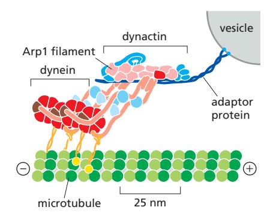

Figure 16–56 Dynactin and an adaptor protein mediate the attachment of dynein to a membrane-enclosed organelle. Dynein requires the presence of a large number of accessory proteins to associate with membrane-enclosed organelles. Dynactin is a large complex that includes components that bind weakly to microtubules, components that bind to dynein itself, and components that form a small, actin-like filament made of the actinrelated protein Arp1. Dynactin associates with two molecules of cytoplasmic dynein as well as with an adaptor protein that mediates the connection to a cargo.

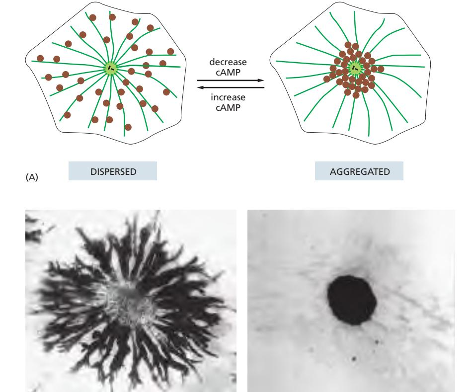

50 µm

(B)

Figure 16–57 Regulated melanosome movements in fish pigment cells.

These giant cells, which are responsible for changes in skin coloration in several species of fish, contain large pigment granules called melanosomes. The melanosomes can change their location in the cell in response to a hormonal or neuronal stimulus. (A) Schematic view of a pigment cell, showing the dispersal and aggregation of melanosomes *(brown)* in response to an increase or decrease in intracellular cyclic AMP (cAMP), respectively. Both redistributions of melanosomes occur along microtubules. (B) Bright-field images of a single cell in a scale of an African cichlid fish, showing its melanosomes either dispersed throughout the cytoplasm *(left)* or aggregated in the center of the cell *(right)*. (B, courtesy of Leah Haimo.)

microtubule motor proteins, with the stronger kinesin winning out overall. When intracellular cyclic AMP levels decrease, kinesin is inactivated, leaving dynein free to drag the pigment granules rapidly toward the cell center, changing the fish's color. In a similar way, the movement of other membrane organelles coated with particular motor proteins is controlled by a complex balance of competing signals that regulate both motor protein attachment and activity.

#### Motile Cilia and Flagella Are Built from Microtubules and Dyneins

Just as myofibrils are highly specialized and efficient motility machines built from actin and myosin filaments, cilia and flagella are highly specialized and efficient motility structures built from microtubules and dynein. Both cilia and flagella are hairlike cell appendages that have a bundle of microtubules at their core. **Flagella** are found on sperm and many protozoa. By their undulating motion, they enable the cells from which they emerge to swim through liquid media. **Cilia** are organized in a similar fashion, but they beat with a whiplike motion that resembles the breaststroke in swimming. Ciliary beating can either propel single cells through a fluid (as in the swimming of the protozoan *Paramecium*) or can move fluid over the surface of a group of cells in a tissue. In the human body, huge numbers of cilia (109/cm2 or more) line our respiratory tract, sweeping layers of mucus, trapped particles of dust, and bacteria up to the mouth where they are swallowed and ultimately eliminated. Likewise, cilia along the oviduct help to sweep eggs toward the uterus.

The movement of a cilium or a flagellum is produced by the bending of its core, which is called the **axoneme**. The axoneme is composed of microtubules and their associated proteins, arranged in a distinctive and regular pattern. Nine special microtubule doublets (comprising one complete and one partial microtubule fused together so that they share a common tubule wall) are arranged in a ring around a pair of single microtubules (**Figure 16–58**). Almost all forms of motile eukaryotic flagella and cilia (from protozoans to humans) have this characteristic arrangement. The microtubules extend continuously for the length of the axoneme, which can be 10–200 μm. At regular positions along the length of the microtubules, accessory proteins cross-link the microtubules together.

Molecules of *axonemal dynein* form bridges between adjacent microtubule doublets around the circumference of the axoneme (**Figure 16–59**). When the motor domain of this dynein is activated, the dynein molecules attached to one microtubule doublet (see Figure 16–60) attempt to walk along the adjacent

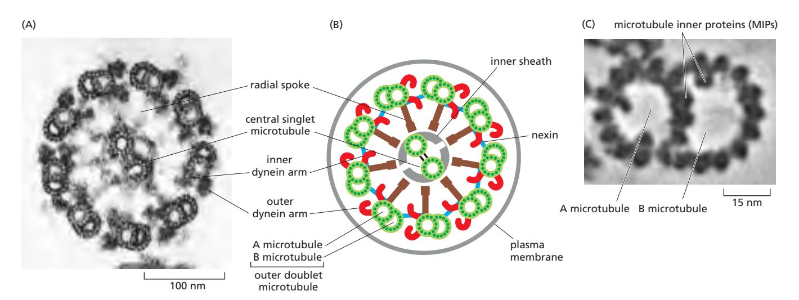

Figure 16–58 The arrangement of microtubules in a flagellum or cilium. (A) Electron micrograph of the flagellum of a green-alga cell (*Chlamydomonas*) shown in cross section, illustrating the distinctive "9 + 2" arrangement of microtubules. (B) Diagram of the parts of a flagellum or cilium. The various projections from the microtubules link the microtubules together and occur at regular intervals along the length of the axoneme. (C) High-resolution electron tomography image of an outer microtubule doublet showing structural details and features inside the microtubules called microtubule inner proteins (MIPs). (A, courtesy of Lewis Tilney; C, courtesy of Daniela Nicastro.)

1004 Chapter 16: The Cytoskeleton MICROTUBULES 1005

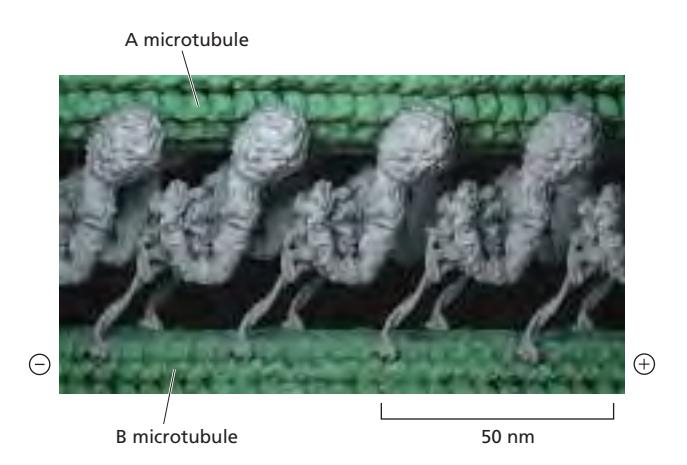

microtubule doublet, tending to force the adjacent doublets to slide relative to one another, much as actin thin filaments slide during muscle contraction. However, the presence of other links between the microtubule doublets prevents this sliding, and the dynein force is instead converted into a bending motion (**Figure 16–60**). Not all dyneins in the axoneme are active at the same time, which results in the characteristic wave-like motion of the cilium or flagellum (**Movie 16.15**).

In humans, hereditary defects in axonemal dynein cause a condition called primary ciliary dyskinesia, or Kartagener's syndrome. This syndrome is characterized by inversion of the normal asymmetry of internal organs (situs inversus) due to disruption of fluid flow in the developing embryo, male sterility due to immotile sperm, and a high susceptibility to lung infections due to paralyzed cilia being unable to clear the respiratory tract of debris and bacteria.

Bacteria also swim using cell-surface structures called flagella, but these do not contain microtubules or dynein and do not wave or beat. Instead, *bacterial flagella* are long, rigid helical filaments, made up of repeating subunits of the protein flagellin. The flagella rotate like propellers, driven by a special rotary motor embedded in the bacterial cell wall. The use of the same name to denote these two very different types of swimming apparatus is an unfortunate historical accident. MBoC7 n16.212/16.59

# Primary Cilia Perform Important Signaling Functions in Animal Cells

Many cells possess a shorter, nonmotile counterpart of cilia and flagella called the *primary cilium*. Primary cilia can be viewed as specialized compartments or organelles that perform a wide range of cellular functions but share many

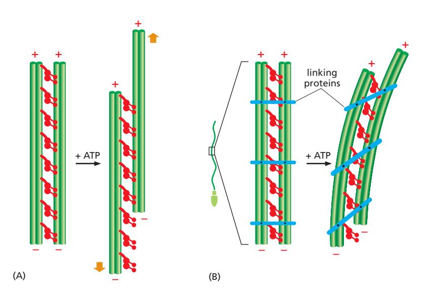

Figure 16–59 Axonemal dynein. CryoEM reconstruction of a sea urchin sperm flagellum showing dynein arms connecting the A microtubule of one doublet with the B microtubule of an adjacent doublet at regular intervals. Sperm axonemal dynein is dimeric. The tail of the molecule binds tightly to an A microtubule, while the two globular heads each have a stalk that connects to an ATP-dependent binding site on a B microtubule (see Figure 16–58). When the heads hydrolyze their bound ATP, they move toward the minus end of the B microtubule, thereby producing a sliding force between the adjacent microtubule doublets in a cilium or flagellum (see Figure 16–60). (Courtesy of Daniela Nicastro.)

Figure 16–60 The bending of an axoneme. (A) When axonemes are exposed to the proteolytic enzyme trypsin, the flexible protein links holding adjacent microtubule doublets together are broken. In this case, the addition of ATP allows the motor action of the dynein heads to slide one microtubule doublet against the adjacent doublet. (B) In an intact axoneme (such as in a spermatozoon), the flexible protein links prevent the sliding of the doublet. The motor action therefore causes a bending motion, creating waves or beating motions.

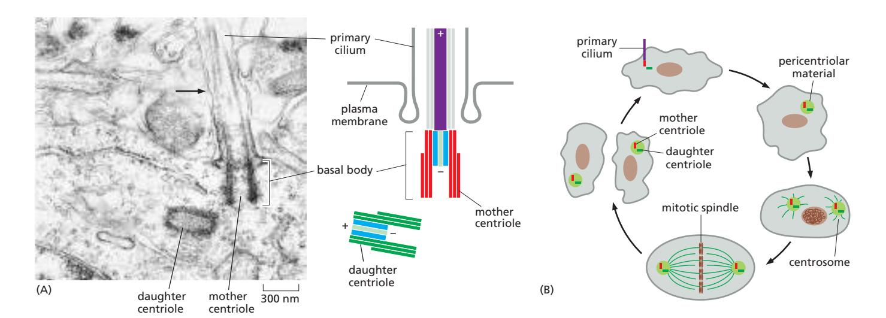

structural features with motile cilia. Both motile and nonmotile cilia are generated during interphase at plasma membrane–associated structures called *basal bodies*, which anchor them at the cell surface. At the core of each basal body is a single centriole, the same structure found in pairs embedded at the center of animal centrosomes, with nine groups of fused microtubule triplets arranged in a cartwheel (see Figure 16–43). Centrioles are multifunctional, contributing to assembly of the mitotic spindle in dividing cells but migrating to the plasma membrane of interphase cells to template the nucleation of the axoneme (**Figure 16–61**). Because no protein translation occurs in cilia, construction of the axoneme requires intraflagellar transport (IFT), a transport system discovered in the green algae *Chlamydomonas.* Analogous to the axon, motors move cargoes in both anterograde and retrograde directions, in this case driven by kinesin-2 and cytoplasmic dynein 2, respectively. MBoC7 m16.66/16.61

Primary cilia are found on the surface of almost all cell types, where they sense and respond to the exterior environment, functions best understood in the context of smell and sight. In the nasal epithelium, cilia protruding from dendrites of olfactory neurons are the site of both odorant reception and signal amplification. Similarly, the rod and cone cells of the vertebrate retina possess a specialized primary cilium called the outer segment, which is specialized for converting light into a neural signal (see Figure 15–40). Maintenance of the outer segment requires continual IFT-mediated transport of large quantities of lipids and proteins into the cilium, at rates of up to 1000 molecules per second. The links between cilia function and the senses of sight and smell are underscored by the ciliopathies, a set of disorders associated with defects in IFT, the cilium, or the basal body. In the ciliopathy Bardet–Biedl syndrome, patients cannot smell and suffer from retinal degeneration. Other characteristics of this multifaceted disorder include hearing loss, polycystic kidney disease, diabetes, obesity, and polydactyly, suggesting that primary cilia have functions in many aspects of human physiology.

#### Summary

*Microtubules are stiff polymers of tubulin molecules. They assemble by addition of GTP-containing tubulin subunits to the free end of a microtubule, with one end (the plus end) growing faster than the other. Hydrolysis of the bound GTP takes place after assembly and weakens the bonds that hold the microtubule together. Microtubules are dynamically unstable and liable to catastrophic disassembly, but they can be stabilized in cells by association with other structures. Microtubule-organizing centers such as centrosomes protect the minus ends of microtubules and continually nucleate the formation of new microtubules. Microtubule-associated proteins (MAPs) stabilize microtubules, and those that localize to the plus end (1TIPs) can alter the dynamic properties of the microtubule or mediate their interaction with* 

Figure 16–61 Primary cilia. (A) Electron micrograph and diagram of the basal body of a mouse neuron primary cilium. The axoneme of the primary cilium *(black arrow)* is nucleated by the mother centriole at the basal body, which localizes at the plasma membrane near the cell surface. (B) Centrioles function alternately as basal bodies and as the core of centrosomes. Before a cell enters the cell-division cycle, the primary cilium is shed or resorbed. The centrioles recruit pericentriolar material and duplicate during S phase, generating two centrosomes, each of which contains a pair of centrioles. The centrosomes nucleate microtubules and localize to the poles of the mitotic spindle. Upon exit from mitosis, a primary cilium again grows from the mother centriole. (A, courtesy of Josef Spacek.)

*other structures. Counteracting the stabilizing activity of MAPs are catastrophe factors, such as kinesin-13 proteins, that act to peel apart microtubule ends. Other kinesin family members as well as dynein use the energy of ATP hydrolysis to move unidirectionally along a microtubule. The motor dynein moves toward the minus end of microtubules, and its sliding of axonemal microtubules underlies the beating of cilia and flagella. Primary cilia are nonmotile sensory organelles found on many cell types.*

# INTERMEDIATE FILAMENTS AND OTHER CYTOSKELETAL POLYMERS

All eukaryotic cells contain actin and tubulin. But the third major type of cytoskeletal protein, the *intermediate filament*, forms a cytoplasmic filament only in some metazoans—including vertebrates, nematodes, and mollusks. Intermediate filaments are particularly prominent in the cytoplasm of cells that are subject to mechanical stress and are generally not found in animals that have rigid exoskeletons, such as arthropods and echinoderms. It seems that intermediate filaments impart mechanical strength to tissues for the squishier animals.

Cytoplasmic intermediate filaments are closely related to their ancestors, the much more prevalent *nuclear lamins*, which are found in many eukaryotes but missing from unicellular organisms*.* The nuclear lamins form a meshwork lining the inner membrane of the nuclear envelope, where they provide anchorage sites for chromosomes and nuclear pores. Several times during metazoan evolution, lamin genes have apparently duplicated, and the duplicates have evolved to produce rope-like, cytoplasmic intermediate filaments. In contrast to the highly conserved actins and tubulin isoforms that are encoded by a handful of genes, different families of intermediate filaments are much more diverse and are encoded by 70 different human genes with distinct, cell type–specific functions (**Table 16–2**).

#### Intermediate Filament Structure Depends on the Lateral Bundling and Twisting of Coiled-Coils

Although their amino- and carboxyl-terminal domains differ, all intermediate filament family members are elongated proteins with a conserved central α-helical domain containing 40 or so heptad repeat motifs that form an extended

| TABLE 16–2 Major Types of Intermediate Filament Proteins in Vertebrate Cells |                                                  |                                                                  |  |  |
|------------------------------------------------------------------------------|--------------------------------------------------|------------------------------------------------------------------|--|--|
| Types of intermediate filament                                         | Component polypeptides                           | Location                                                         |  |  |
| Nuclear                                                                      | Lamins A, B, and C                               | Nuclear lamina (inner lining of nuclear envelope)             |  |  |
| Vimentin-like                                                                | Vimentin                                         | Many cells of mesenchymal origin                                 |  |  |
|                                                                              | Desmin                                           | Muscle                                                           |  |  |
|                                                                              | Glial fibrillary acidic protein                  | Glial cells (astrocytes and some Schwann cells)               |  |  |
|                                                                              | Peripherin                                       | Some neurons                                                     |  |  |
| Epithelial                                                                   | Type I keratins (acidic)                         | Epithelial cells and their derivatives (e.g., hair and nails) |  |  |
| Epithelial                                                                   | Type II keratins (neutral/basic)                 |                                                                  |  |  |
| Axonal                                                                       | Neurofilament proteins (NF-L, NF-M, and NF-H) | Neurons                                                          |  |  |

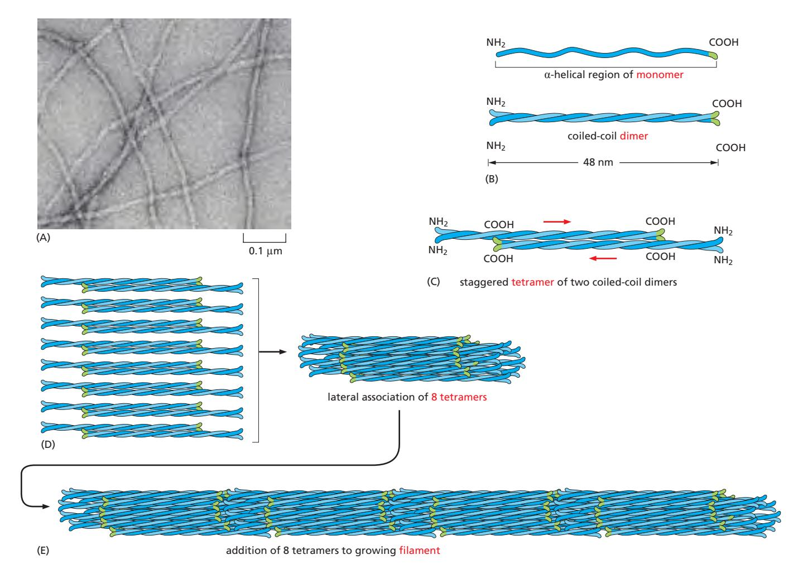

Figure 16–62 A model of intermediate filament construction. An electron micrograph of intermediate filaments is shown in (A). The monomer shown in (B) pairs with another monomer to form a dimer, in which the conserved central rod domains are aligned in parallel and wound together into a coiled-coil. (C) Two dimers then line up side by side to form an antiparallel tetramer of four polypeptide chains. Dimers and tetramers are the soluble subunits of intermediate filaments. (D) Within each tetramer, the two dimers are offset with respect to one another, thereby allowing it to associate with another tetramer. (E) In the final 10-nm-diameter filament, tetramers are packed together in a rope-like array, which has 16 dimers (32 coiled-coils) in cross section. Half of these dimers are pointing in each direction. An electron micrograph of intermediate filaments is shown on the upper left (Movie 16.16). (A, from L. Norlén et al., *Exp. Cell Res.* 313:2217–2227, 2007. With permission from Elsevier.)

coiled-coil structure with another monomer (see Figure 3–8). A pair of parallel dimers then associates in an antiparallel fashion to form a staggered tetramer (**Figure 16–62**). Unlike actin or tubulin subunits, intermediate filament subunits do not contain a binding site for ATP or GTP. Furthermore, because the tetrameric subunit is made up of two dimers pointing in opposite directions, its two ends are the same. The assembled intermediate filament therefore lacks the overall structural polarity that is critical for actin filaments and microtubules. The tetramers pack together laterally to form the filament, which includes eight parallel protofilaments made up of tetramers. Each individual intermediate filament therefore has a cross section of 32 individual α-helical coils. This large number of polypeptides all lined up together, with the strong lateral hydrophobic interactions typical of coiled-coil proteins, gives intermediate filaments a ropelike character. They can be easily bent, with a persistence length of less than 1 μm (compared to several millimeters for microtubules and about 10 μm for actin), but they are extremely difficult to break and can be stretched to more than three times their length (see Figure 16–6). MBoC7 m16.67/16.67

Less is understood about the mechanisms of assembly and disassembly of intermediate filaments than of actin filaments and microtubules. In pure protein solutions, intermediate filaments are extremely stable due to tight association of subunits, but some types of intermediate filaments, including *vimentin*, form highly dynamic structures in cells such as fibroblasts. Protein phosphorylation probably regulates their disassembly, in much the same way that phosphorylation regulates the disassembly of nuclear lamins in mitosis (see Figure 12–65). As evidence for rapid turnover, labeled subunits microinjected into tissue-culture cells incorporate into intermediate filaments within a few minutes. Remodeling of the intermediate filament network accompanies events requiring dynamic cellular reorganization, such as division, migration, and differentiation.

#### Intermediate Filaments Impart Mechanical Stability to Animal Cells

**Keratins** are the most diverse intermediate filament family: there are about 20 found in different types of human epithelial cells and about 10 more that are specific to hair and nails; analysis of the human genome sequence has revealed that there are 54 distinct keratins. Every keratin filament is made up of an equal mixture of type I (acidic) and type II (neutral/basic) keratin proteins; these form a heterodimer filament subunit (see Figure 16–62). Cross-linked keratin networks held together by disulfide bonds can survive even the death of their cells, forming tough coverings for animals, as in the outer layer of skin and in hair, nails, claws, and scales. The diversity in keratins is clinically useful in the diagnosis of epithelial cancers (carcinomas), as the particular set of keratins expressed gives an indication of the epithelial tissue in which the cancer originated and thus can help to guide the choice of treatment.

A single epithelial cell may produce multiple types of keratins, and these copolymerize into a single network (**Figure 16–63**). Keratin filaments impart mechanical strength to epithelial tissues in part by anchoring the intermediate filaments at sites of cell–cell contact, called *desmosomes*, or cell–matrix contact, called *hemidesmosomes* (see Figure 16–4). We discuss these important adhesive structures in Chapter 19. Accessory proteins, such as *filaggrin*, bundle keratin filaments in differentiating cells of the epidermis to give the outermost layers of the skin their special toughness. Individuals with mutations in the gene encoding filaggrin are strongly predisposed to dry skin diseases such as eczema.

Mutations in keratin genes cause several human genetic diseases. For example, when defective keratins are expressed in the basal cell layer of the epidermis, they produce a disorder called *epidermolysis bullosa simplex*, in which the skin blisters in response to even very slight mechanical stress, which ruptures the basal

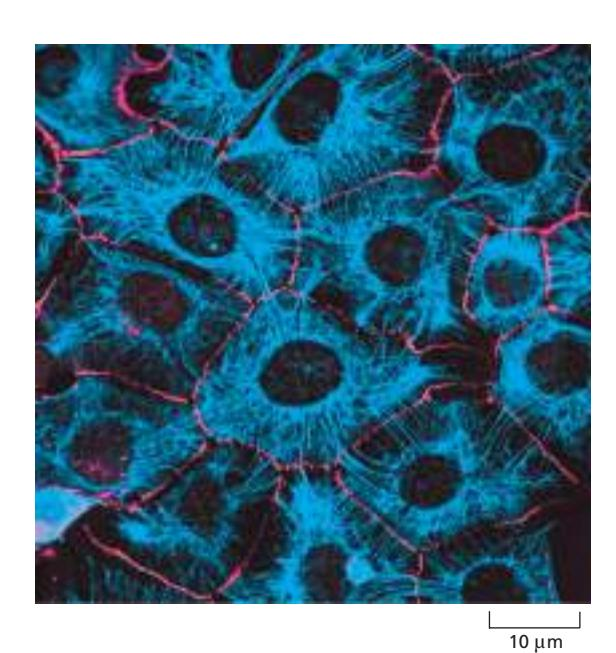

Figure 16–63 Keratin filaments in epithelial cells. Immunofluorescence micrograph of the network of keratin filaments *(blue)* in a sheet of epithelial cells in culture. The filaments in each cell are indirectly connected to those of its neighbors by desmosomes (discussed in Chapter 19). A second protein *(red)* has been stained to reveal the location of the cell boundaries. (From K.J. Green and C.A. Gaudry, *Nat. Rev. Mol. Cell Biol.* 1:208–216, published 2000 by Nature Publishing Group. Reproduced with permission of SNCSC.)

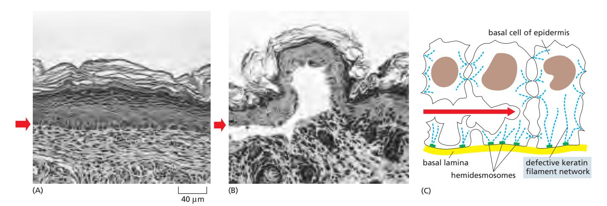

MBoC7 m16.69/16.64 Figure 16–64 Blistering of the skin caused by a mutant keratin gene. A mutant gene encoding a truncated keratin protein (lacking both the N- and C-terminal domains) was expressed in a transgenic mouse. The defective protein assembles with the normal keratins and thereby disrupts the keratin filament network in the basal cells of the skin. Light micrographs of cross sections of (A) normal and (B) mutant skin show that the blistering results from the rupturing of cells in the basal layer of the mutant epidermis *(short red arrows)*. (C) A sketch of three cells in the basal layer of the mutant epidermis, as observed by electron microscopy. As indicated by the *red arrow*, the cells rupture between the nucleus and the hemidesmosomes (discussed in Chapter 19), which connect the keratin filaments to the underlying basal lamina. (A and B, © 1991 P.A. Coulombe et al. Originally published in *J. Cell Biol.* https://doi.org/10.1083/jcb.115.6.1661. With permission from Rockefeller University Press.)

cells (**Figure 16–64**). Other types of blistering diseases, including disorders of the mouth, esophageal lining, and the cornea of the eye, are caused by mutations in the different keratins whose expression is specific to those tissues. All of these maladies are typified by cell rupture as a consequence of mechanical trauma and a disorganization or clumping of the keratin filament cytoskeleton. Many of the specific mutations that cause these diseases alter the ends of the central rod domain, demonstrating the importance of this particular part of the protein for correct filament assembly.

Members of another family of intermediate filaments, called **neurofilaments**, are found in high concentrations along the axons of vertebrate neurons (**Figure 16–65**). Three types of neurofilament proteins (NF-L, NF-M, and NF-H)

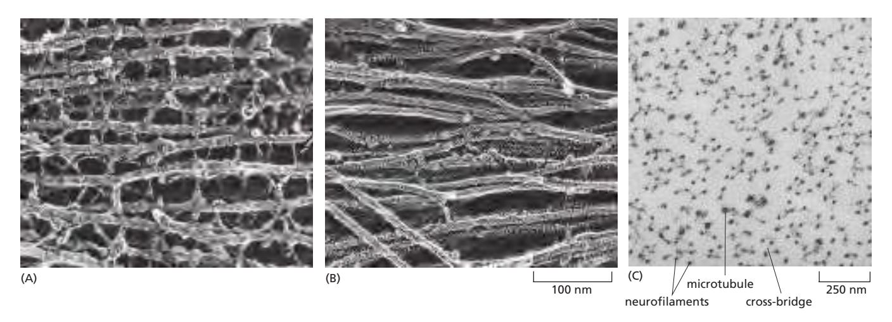

Figure 16–65 Two types of intermediate filaments in cells of the nervous system. (A) Freeze-etch electron microscopy image of neurofilaments in a nerve cell axon, showing the extensive cross-linking through protein cross-bridges—an arrangement believed to give this long cell process great tensile strength. The cross-bridges are formed by the long, nonhelical extensions at the C-terminus of the largest neurofilament protein (NF-H). (B) Freeze-etch image of glial filaments in glial cells, showing that these intermediate filaments are smooth and have few cross-bridges. (C) Conventional transmission electron micrograph of a cross section of an axon showing the regular side-to-side spacing of the neurofilaments, which greatly outnumber the microtubules. (A and B, courtesy of Nobutaka Hirokawa; C, courtesy of Anthony Brown.)

coassemble *in vivo*, forming heteropolymers. The NF-H and NF-M proteins have lengthy C-terminal tail domains that bind to neighboring filaments, generating aligned arrays with a uniform interfilament spacing. During axonal growth, new neurofilament subunits are incorporated all along the axon in a dynamic process that involves the addition of subunits along the filament length and at the ends. After an axon has grown and connected with its target cell, the diameter of the axon may increase as much as fivefold. The level of neurofilament gene expression seems to directly control axonal diameter, which in turn influences how fast electrical signals travel down the axon. In addition, neurofilaments provide strength and stability to the long cell processes of neurons.

The neurodegenerative disease amyotrophic lateral sclerosis (ALS, or Lou Gehrig's disease) is associated with an accumulation and abnormal assembly of neurofilaments in motor neuron cell bodies and in the axon, aberrations that may interfere with normal axonal transport. The degeneration of the axons leads to muscle weakness and atrophy, which is usually fatal. The overexpression of human NF-L or NF-H in mice results in mice that have an ALS-like disease. However, a causative link between neurofilament pathology and ALS has not been firmly established.

The vimentin-like filaments are a third family of intermediate filaments. *Desmin*, a member of this family, is expressed in skeletal, cardiac, and smooth muscle, where it forms a scaffold around the Z disc of the sarcomere (see Figure 16–29). Mice lacking desmin show normal initial muscle development, but adults have various muscle cell abnormalities, including misaligned muscle fibers. In humans, mutations in desmin are associated with various forms of muscular dystrophy and cardiac myopathy, illustrating the important role of desmin in stabilizing muscle fibers.

Inside the nucleus, nuclear lamins maintain the mechanical stability of the nucleus. In addition, it is becoming increasingly evident that one class of lamins, the A-type, together with many proteins of the nuclear envelope, are scaffolds for proteins that control myriad cellular processes including transcription, chromatin organization, and signal transduction. The majority of *laminopathies* is associated with mutant versions of lamin A and include tissue-specific diseases. Skeletal and cardiac abnormalities might be explained by a weakened nuclear envelope leading to cell damage and death, but laminopathies are also thought to arise from pathogenic and tissue-specific alterations in gene expression.

#### Linker Proteins Connect Cytoskeletal Filaments and Bridge the Nuclear Envelope

The intermediate filament network is linked to the rest of the cytoskeleton by members of a family of proteins called *plakins*. Plakins are large and modular, containing multiple domains that connect cytoskeletal filaments to each other and to junctional complexes. *Plectin* is a particularly interesting example. In addition to bundling intermediate filaments, it links the intermediate filaments to microtubules, actin filament bundles, and filaments of the motor protein myosin II; it also helps attach intermediate filament bundles to adhesive structures at the plasma membrane (**Figure 16–66**).

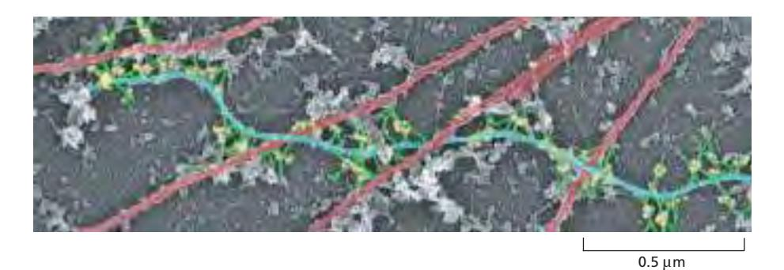

Figure 16–66 Plectin cross-linking of diverse cytoskeletal elements. Plectin *(green)* is seen here making crosslinks from intermediate filaments *(blue)* to microtubules *(red)*. In this electron micrograph, the dots *(yellow)* are gold particles linked to anti-plectin antibodies. The entire actin filament network was removed to reveal these proteins. (© 1996 T.M. Svitkina et al. Originally published in *J. Cell Biol.* http://doi.org/10.1083/ jcb.135.4.991. With permission from Rockefeller University Press.)

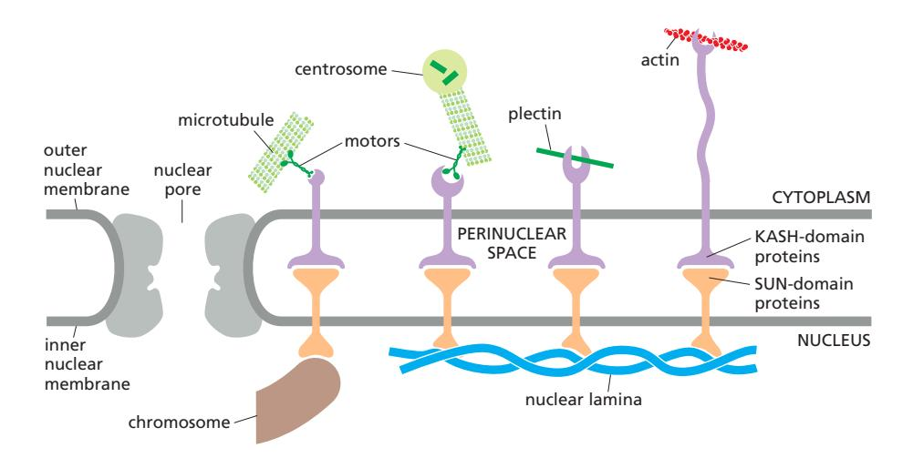

Figure 16–67 SUN–KASH protein complexes connect the nucleus and cytoplasm through the nuclear envelope. The cytoplasmic cytoskeleton is linked across the nuclear envelope to the nuclear lamina or chromosomes through SUN and KASH proteins *(orange*  and *purple*, respectively). The SUN and KASH domains of these proteins bind within the lumen of the nuclear envelope. From the inner nuclear envelope, SUN proteins connect to the nuclear lamina or chromosomes. KASH proteins in the outer nuclear envelope connect to the cytoplasmic cytoskeleton by binding microtubule motor proteins, actin filaments, or plectin.

Mutations in the gene for plectin cause a devastating human disease that combines epidermolysis bullosa (caused by disruption of skin keratin filaments), muscular dystrophy (caused by disruption of desmin filaments), and neurodegeneration (caused by disruption of neurofilaments). Mice lacking a functional plectin gene die within a few days of birth, with blistered skin and abnormal skeletal and heart muscles. Thus, although plectin may not be necessary for the initial formation and assembly of intermediate filaments, its cross-linking action is required to provide cells with the strength they need to withstand the mechanical stresses inherent to vertebrate life. MBoC7 m16.72/16.67

Plectin and other plakins can interact with protein complexes that connect the cytoskeleton to the nuclear interior. These complexes consist of SUN proteins of the inner nuclear membrane and KASH proteins of the outer nuclear membrane (**Figure 16–67**). SUN and KASH proteins bind to each other within the lumen of the nuclear envelope, forming a bridge that connects the nuclear and cytoplasmic cytoskeletons. Inside the nucleus, the SUN proteins bind to the nuclear lamina or chromosomes, whereas in the cytoplasm, KASH proteins can bind directly to actin filaments and indirectly to microtubules and intermediate filaments through association with motor proteins and plakins, respectively. This linkage serves to mechanically couple the nucleus to the cytoskeleton and is involved in many cellular functions, including chromosome movements inside the nucleus during meiosis, nuclear and centrosome positioning, nuclear migration, and global cytoskeletal organization.

# Septins Form Filaments That Contribute to Subcellular Organization

GTP-binding proteins called *septins* serve as an additional filament system in all eukaryotes except terrestrial plants. Septins assemble into nonpolar filaments that form rings and cage-like structures, which act as scaffolds to compartmentalize membranes into distinct domains or to recruit and organize the actin and microtubule cytoskeletons. First identified in budding yeast, septin filaments localize to the neck between a dividing yeast mother cell and its growing bud (**Figure 16–68A**). At this location, septins form a barrier that restricts lateral diffusion of proteins embedded in the plasma membrane, enabling cell growth to be concentrated preferentially within the bud. Septins also recruit the actin–myosin machinery that forms the contractile ring required for cytokinesis. In animal cells, septins function in cell division, migration, vesicle trafficking, and cell signaling. In primary cilia, for example, a ring of septin filaments assembles at the base of the cilium and serves as a diffusion barrier at the plasma membrane, restricting the movement of membrane proteins and establishing a specific composition in the ciliary membrane (**Figure 16–68B and C**). Reduction of septin levels impairs primary cilium formation and signaling.

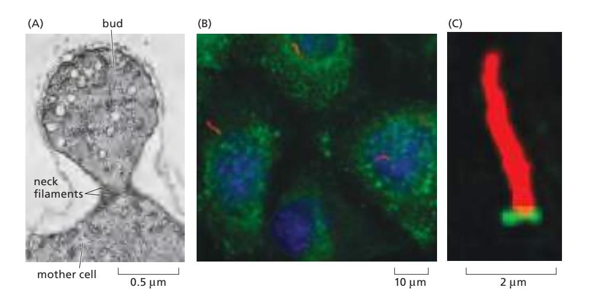

Figure 16–68 Cell compartmentalization by septins. (A) Septins form filaments in the neck region between a mother yeast cell and bud. (B) In this photomicrograph of human cultured cells, the DNA is stained *blue* and septins are labeled in *green*. The microtubules of primary cilia are labeled with an antibody that recognizes a modified (acetylated) form of tubulin *(red)* that is enriched in the axoneme. (C) A magnified image reveals a collar of septin at the base of the cilium. (A, © 1976 B. Byers and L. Goetsch. Originally published in *J. Cell Biol.* https://doi.org/10.1083 /jcb.69.3.717. With permission from Rockefeller University Press; B and C, from Q. Hu et al., *Science* 329:436–439, 2010. With permission from AAAS.)

There are 7 septin genes in yeast and 13 in humans, and septin proteins fall into four groups on the basis of sequence relationships. In a test tube, purified septins assemble into symmetrical hetero-hexamers or hetero–octamers that form nonpolar paired filaments (**Figure 16–69**). GTP binding is required for the folding of septin polypeptides, but the role of GTP hydrolysis in septin function is not understood. Septin structures assemble and disassemble inside cells, but they are not as dynamic as actin filaments and microtubules. MBoC7 m16.73/16.68

# Bacterial Cell Shape and Division Depend on Homologs of Eukaryotic Cytoskeletal Proteins

Although they are much smaller than a typical eukaryotic cell, bacterial cells of different species assume a variety of shapes, from spheres or rods to more elaborate morphologies including stars, spirals, and branched filaments (see Figure 23–3).

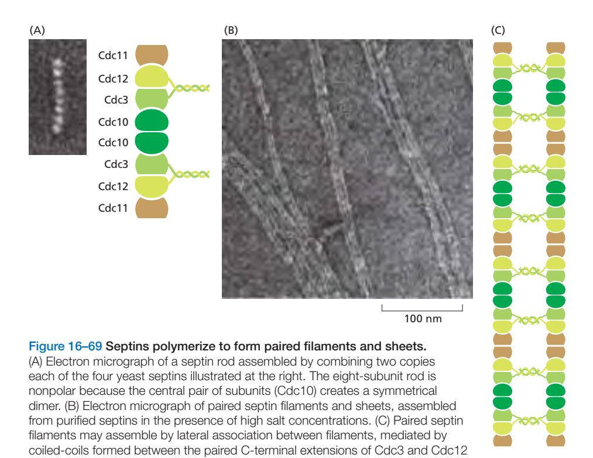

that project from each filament. (From A. Bertin et al., *Proc. Natl. Acad. Sci. USA* 105:8274–8279, 2008. With permission from the National Academy of Sciences.)

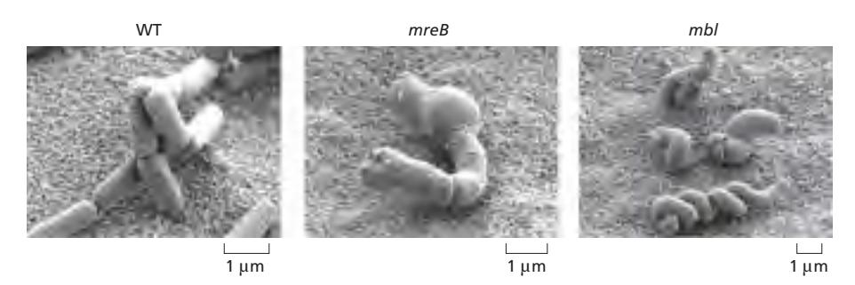

Figure 16–70 Actin homologs in bacteria determine cell shape. The common soil bacterium *Bacillus subtilis* normally forms cells with a regular rodlike shape when viewed by scanning electron microscopy *(left).* In contrast, *B. subtilis* cells lacking the actin homolog MreB or Mbl grow in distorted or twisted shapes and eventually die *(center* and *right)*. WT = wild type. [From A. Chastanet and R. Carballido-Lopez, *Front. Biosci. (Schol. Ed.)* 4:1582–1606, 2012. With permission from Frontiers in Bioscience.]

Historically, biologists assumed that a cytoskeleton was not necessary in such simple cells that also lack extensive networks of intracellular membrane-enclosed organelles. We now know, however, that the outwardly simple morphology of bacterial cells is deceptive. Bacterial cells are highly organized and contain homologs of actin, tubulin, and intermediate filaments. These filament systems are essential to regulate the synthesis and remodeling of the peptidoglycan cell wall to define cell shape and mediate cell division. Furthermore, the bacterial cytoskeleton can also play important roles in DNA segregation and intracellular organization. MBoC7 m16.08/16.70

Many bacteria contain homologs of actin. Two of these, MreB and Mbl, are found primarily in rod-shaped or spiral-shaped cells where they assemble to form dynamic patches that move circumferentially along the length of the cell. These proteins contribute to cell shape by serving as a scaffold to direct the synthesis of the peptidoglycan cell wall, in much the same way that microtubules help organize the synthesis of the cellulose cell wall in higher plant cells (see Figure 19–66). MreB and Mbl filaments are highly dynamic, with half-lives of a few minutes, and ATP hydrolysis accompanies the polymerization process. Mutations disrupting MreB or Mbl expression cause extreme abnormalities in cell shape (**Figure 16–70**).

Nearly all bacteria and many archaea also contain a homolog of tubulin called FtsZ, which can polymerize into filaments and assemble into a ring (called the Z-ring) at the site where the **septum** forms during cell division (**Figure 16–71**). Although the Z-ring persists for many minutes, the individual filaments within it are highly dynamic and have an average half-life of about 30 seconds, as they treadmill along the cell circumference and organize the cell-wall synthesis machinery. As the bacterium divides, the Z-ring becomes smaller until it has completely disassembled. However, because of high turgor pressure within bacterial cells, the energy derived from GTP hydrolysis within FtsZ filaments is unlikely to generate enough bending force to drive the membrane invagination necessary to complete cell division. Instead, FtsZ dynamics in the Z-ring are thought to spatially organize the cell-wall synthesis machinery to promote even, processive constriction. This hypothesis may explain why FtsZ GTPase mutants are viable, but yield deformed septa in *Escherichia coli* cells.

Figure 16–71 The bacterial FtsZ protein, a tubulin homolog in prokaryotes. (A) A band of FtsZ protein forms a ring in a dividing bacterial cell. This ring has been labeled by fusing the FtsZ protein to green fluorescent protein (GFP), which allows it to be observed in living *E. coli* cells with a fluorescence microscope. (B) FtsZ filaments and circles, formed *in vitro*, as visualized using electron microscopy. (C) Dividing chloroplasts *(red)* from a red alga also cleave using a protein ring made from FtsZ *(yellow)*. (A, from X. Ma et al., *Proc. Natl. Acad. Sci. USA* 93:12998–13003, 1996; B, from H.P. Erickson et al., *Proc. Natl. Acad. Sci. USA* 93:519–523, 1996. Both with permission from National Academy of Sciences; C, from S. Miyagishima et al., *Plant Cell* 13:2257–2268, 2001, with permission from American Society of Plant Biologists.)

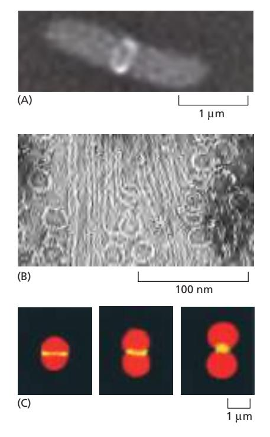

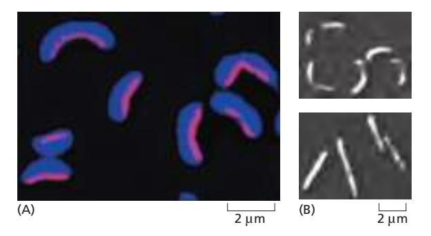

to the domains of eukaryotic intermediate filaments. (A) The crescentin protein forms a fiber (labeled in *red*) that runs down the inner side of the curving bacterial cell wall. (B) When the gene is disrupted, the bacteria grow as straight rods *(bottom)*. (From N. Ausmees et al., *Cell* 115:705– 713, 2003. With permission from Elsevier.)

Figure 16–72 *Caulobacter* and crescentin. The sickle-shaped bacterium *Caulobacter crescentus* expresses a protein, crescentin, with a series of coiledcoil domains similar in size and organization

In addition to actin and tubulin homologs, at least one bacterial species, *Caulobacter crescentus*, also harbors a protein with significant structural similarity to intermediate filaments. A protein called crescentin forms a filamentous structure that influences the unusual crescent shape of this species; when the gene encoding crescentin is deleted, the *Caulobacter* cells grow as straight rods (**Figure 16–72**). Attached to the membrane along the side of inner curvature, crescentin is thought to exert a compressive force that locally decreases peptidoglycan insertion and therefore biases cell-wall synthesis to the opposite side. MBoC7 m16.10/16.72

Other bacterial cytoskeletal proteins function in DNA segregation during cell division. A particularly intriguing bacterial actin homolog is ParM, which is encoded by a gene on certain bacterial plasmids that also carry genes responsible for antibiotic resistance and cause the spread of multidrug resistance in epidemics. Bacterial plasmids typically encode all the gene products that are necessary for their own segregation, presumably as a strategy to ensure their inheritance and propagation in bacterial hosts after plasmid replication. ParM assembles into filaments that associate at each end with a copy of the plasmid, and growth of the ParM filament pushes the replicated plasmid copies apart (**Figure 16–73**). This spindle-like structure apparently arises from the selective stabilization of filaments that bind to specialized proteins recruited to the origins of replication on

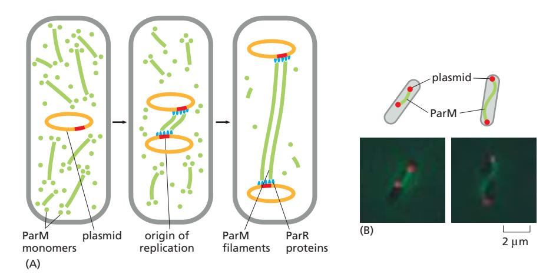

Figure 16–73 Role of the actin homolog ParM in plasmid segregation in bacteria. (A) Some bacterial drug-resistance plasmids *(orange)* encode an actin homolog, ParM, that will spontaneously nucleate to form small, dynamic filaments *(green)* throughout the bacterial cytoplasm. A second plasmid-encoded protein called ParR *(blue)* binds to specific DNA sequences in the plasmid and also stabilizes the dynamic ends of the ParM filaments. When the plasmid duplicates, both ends of the ParM filaments become stabilized, and the growing ParM filaments push the duplicated plasmids to opposite ends of the cell. (B) In these bacterial cells harboring a drug-resistance plasmid, the plasmids are labeled in *red* and the ParM protein in *green*. *Left*, a short ParM filament bundle connects the two daughter plasmids shortly after their duplication. *Right*, the fully assembled ParM filament has pushed the duplicated plasmids to the cell poles. (A, adapted from E.C. Garner et al., *Science* 306:1021–1025, 2004; B, from J. Møller-Jensen et al., *Mol. Cell* 12:1477–1487, 2003. With permission from Elsevier.) MBoC7 m16.09/16.73

the plasmids. A distant relative of both tubulin and FtsZ, called TubZ, has a similar function in other bacterial species.

Finally, the cytoskeleton plays a role in the internal organization of some bacterial cells. The best-known example applies to magnetotactic bacteria, which are capable of swimming along Earth's magnetic field to seek the optimum aquatic environment. These bacteria contain *magnetosomes*, which are small vesicles invaginated from the plasma membrane that surround magnetite crystals. Arranged in a straight line along the length of the cell, magnetosomes produce a dipole, reminiscent of a compass needle. The organization of magnetosome chains requires their association with filaments of the actin-like protein MamK (**Figure 16–74**).

Thus, all cells contain cytoskeletal proteins that perform a wide variety of functions, and the actin and tubulin families are very ancient, predating the split between the eukaryotic and bacterial kingdoms.

# Summary

*Whereas tubulin and actin have been highly conserved in evolution, intermediate filament proteins are very diverse. There are many tissue-specific forms of intermediate filaments in the cytoplasm of animal cells, including keratin filaments in epithelial cells, neurofilaments in nerve cells, and desmin filaments in muscle cells. The primary function of these filaments is to provide mechanical strength. Septins comprise an additional system of filaments that organize compartments inside cells. Bacterial cells also contain homologs of actin, tubulin, and intermediate filaments that form dynamic structures essential for cell shape and division.*

# CELL POLARITY AND COORDINATION OF THE CYTOSKELETON

A central challenge in cell biology is to understand how multiple individual molecular components collaborate to produce complex cell behaviors. Cell polarity, which we describe in this final part of the chapter, controls many aspects of cell function, such as the direction of protein secretion and signaling, the orientation of cell division, and the path a migrating cell will take. Cells polarize in response to extracellular cues or intracellular landmarks to establish specific domains on their surface. Coordination with the cytoskeleton is then required for a cell to build different structures with distinct molecular components at the front versus the back, or at the top versus the bottom. In this way, the cytoskeleton acts to transduce polarity signals to generate whole-cell organization and behavior. Carefully controlled cell-polarization processes are also required for oriented cell divisions in tissues and for development of a coherent, organized multicellular organism.

Genetic studies in yeast, flies, and worms have provided most of our current understanding of the molecular basis of cell polarity. As we shall see, with increasing complexity of a cellular system comes greater elaboration of polarity-determining mechanisms. However, many of the molecular components have been evolutionarily conserved, and in all cases the cytoskeleton plays a central role.

#### Cell Polarity Is Governed by Small GTPases in Budding Yeast

The establishment of cell polarity often begins with local regulation of the actin cytoskeleton by external or internal signals. Many polarity signals converge just beneath the plasma membrane through activation of a group of closely related small monomeric GTPases that are members of the **Rho family**—*Cdc42*, *Rac*, and *Rho*. Like other monomeric GTPases, the Rho proteins act as molecular switches that cycle between an active GTP-bound state and an inactive GDP-bound state (see Figure 3–63). The state of each GTPase depends on dedicated regulatory proteins. Guanine nucleotide exchange factors (GEFs) are required to activate

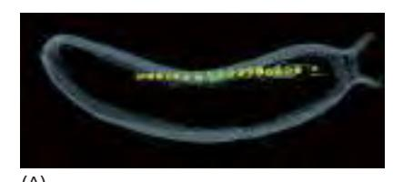

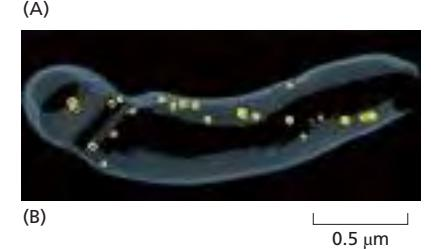

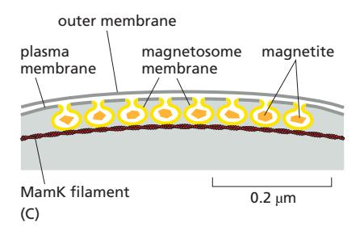

Figure 16–74 MamK organizes chains of magnetosomes. (A) Threedimensional reconstruction of a wild-type *Magnetospirillum magneticum* cell showing the cell membrane *(gray)*, magnetosomes *(yellow)*, and magnetosome-associated MamK filaments *(green)*. (B) Magnetosomes appear disordered in a *mamk* deletion mutant, and no filaments are observed. (C) Magnetosomes are formed from invaginations of the plasma membrane and form chains along MamK filaments. (A and B, adapted from A. Komeili et al., *Science* 311:242–245, 2006. With permission from AAAS.) MBoC7 n16.202/16.74

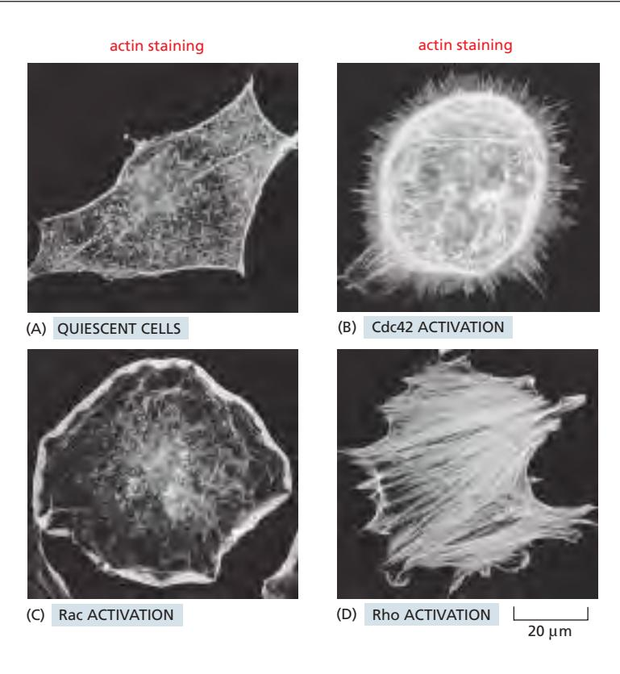

Figure 16–75 The dramatic effects of Cdc42, Rac, and Rho on actin organization in fibroblasts. In each case, the actin filaments have been labeled with fluorescent phalloidin. (A) Serum-starved fibroblasts have actin filaments primarily in the cortex and relatively few stress fibers. (B) Microinjection of a constitutively activated form of Cdc42 results in many long filopodia at the cell periphery. (C) Microinjection of a constitutively activated form of Rac causes the formation of an enormous lamellipodium that extends from the entire circumference of the cell. (D) Microinjection of a constitutively activated form of Rho causes the rapid assembly of many prominent stress fibers. (From A. Hall, *Science* 279:509–514, 1998. With permission from Catherine Nobes.)

the GTPase by replacing tightly bound GDP with GTP, whereas GTPase activating proteins (GAPs) inactivate the GTPase by promoting GTP hydrolysis, which is otherwise very slow. In addition, guanine nucleotide dissociation inhibitors (GDIs) can bind to the GDP-bound form of a GTPase and inhibit GTP exchange by a GEF.

When the GTP-bound form of each Rho family GTPase is introduced into a fibroblast cell, dramatic changes in cell shape are observed. Active Cdc42 leads to the formation of many long filopodia at the cell surface. Activation of Rac promotes actin polymerization at the cell periphery, leading to the formation of sheet-like lamellipodial protrusions. Activation of Rho promotes both the bundling of actin filaments with myosin II filaments into stress fibers and the clustering of integrins and associated proteins to form focal adhesions (**Figure 16–75**). These dramatic and complex structural changes occur because each of these three molecular switches has numerous downstream target proteins that affect actin organization and dynamics. Normally, however, these GTPase pathways are not activated uniformly throughout the cell as in this experiment, but are deployed with precise spatial and temporal regulation to generate polarized subcellular structures, which in turn give rise to changes in cell shape and behavior. MBoC7 m16.84/16.75

Cdc42 is the most highly conserved of all the Rho family GTPases and a master regulator of cell polarity in many cell types. Its importance in the establishment of cell polarity is illustrated by its role in the budding yeast *Saccharomyces cerevisiae*, which undergoes a highly polarized cell division. The formation of a new bud begins with the selection of a single bud site on the cell surface. It is crucial that only a single site is selected, because producing more than one bud would be detrimental to cell division. Before bud site selection, inactive GDP-bound Cdc42 is uniformly distributed on the cell membrane. Occasionally, a Cdc42 molecule will release its GDP and bind GTP, leading to the formation of multiple GTP-Cdc42 foci at random locations in the membrane. Eventually, one of these Cdc42 molecules recruits a protein kinase called PAK, which in turn recruits a scaffold protein together with the Cdc42 GEF. The GEF-containing complex promotes activation of neighboring GDP-bound Cdc42 molecules, resulting in positive feedback. The clustering of Cdc42-GTP molecules at a single site depletes the cytoplasmic pool of

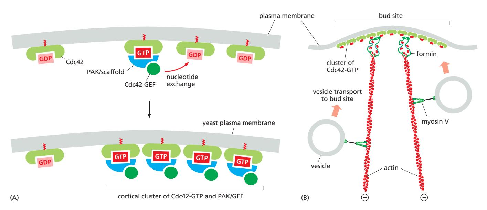

Figure 16–76 Cdc42 establishes yeast-cell polarity. (A) A positive feedback loop by which Cdc42-GTP recruits its own GEF to the plasma membrane to generate a focal site of Cdc42 activity. (B) Local activation of a formin protein by Cdc42- GTP nucleates actin filament assembly. Transport of vesicles along these actin filaments toward their plus ends by myosin V delivers cargoes necessary for growth of the bud.

the Cdc42 GEF, thereby ensuring the formation of just one localized site of Cdc42 activation (**Figure 16–76A**). This cluster of Cdc42-GTP then transmits a signal that polarizes the cytoskeleton by recruiting and activating a formin protein. Recall that formins stimulate rapid assembly of long, straight actin filaments and remain tethered at their plus ends (see Figure 16–13). The resulting actin filaments enable bud growth through the delivery of secretory vesicles and other cargoes to the polarity site by type V myosins (**Figure 16–76B**; see also Figure 16–36). In addition, both PAK and formin contribute to assembly of septin filaments at the bud neck (see Figure 16–68A). Thus, a low level of Cdc42 activity is locally amplified by positive feedback to initiate the polarized assembly of actin and septins at a single site on the mother cell. Downstream effectors then contribute to bud growth and polarized cell division to produce a daughter cell.

#### PAR Proteins Generate Anterior–Posterior Polarity in Embryos

Most animal cells do not polarize toward a single membrane site like budding yeast, but instead form complementary cortical domains that mark opposite ends of the cell. This form of polarity has been studied extensively in the early stages of embryonic development of the nematode *Caenorhabditis elegans*. The unfertilized egg is symmetrical, but the fertilized egg, or zygote, rapidly establishes the anterior–posterior axis. The first cell division then occurs asymmetrically along this axis, giving rise to two daughter cells that are of different sizes, compositions, and fates (see Figure 17–50). Genetic screens for mutants defective in this asymmetrical cell division identified *partitioning defective* (*par*) genes that encode the so-called *PAR proteins*. Subsequent studies revealed that other factors are also involved, and the precise molecular mechanisms by which anterior–posterior polarity is established in this system remain under active investigation.

The initial events leading to polarization of the zygote depend on regulation of the cortical actin cytoskeleton by the GTPase Rho. Egg symmetry is first broken when the sperm enters the egg, which marks the location of the posterior end of the embryo. The centrosome associated with the sperm nucleates a microtubule aster, which through an unknown mechanism depletes the Rho GEF from the acto-myosin cortex in that region of the cell. Local loss of Rho activity decreases myosin II–dependent cortical contractility, resulting in greater tension toward the

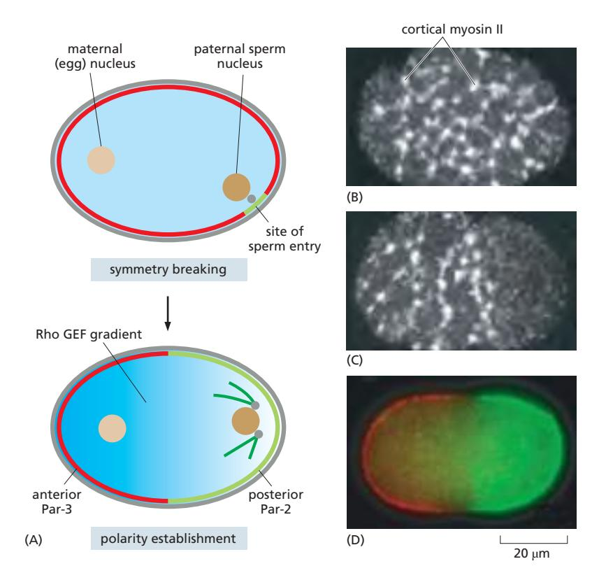

other end of the cell. This asymmetry then sets up localization of the PAR proteins so that they occupy separate cortical domains.

One set of PAR proteins, the anterior PAR proteins, includes Par-3, Par-6, Cdc42, and atypical protein kinase C (aPKC). Initially unpolarized at the cortex, these proteins move toward the anterior because of the change in contractility that causes flow within the membrane. Enrichment of the anterior PAR proteins actively displaces another set of proteins (the posterior PAR proteins, including Par-1 and Par-2), which then bind to the posterior cortex (**Figure 16–77**). These complementary cortical domains are maintained by mutual antagonism between the anterior and posterior components, which occurs through multiple mechanisms. For example, phosphorylation by aPKC in the anterior region excludes the posterior PAR proteins, while the posterior PAR proteins suppress aPKC activity in their domain. It remains unclear how PAR proteins then direct the trafficking and localization of other proteins to define the cortical domains. As in yeast, the master polarity regulator Cdc42, which is activated exclusively at the anterior cortex, likely plays a key role. MBoC7 n16.208/16.77

In all animal species, mechanisms that establish polarity in the embryo determine the overall body plan (see Chapter 21). Subsequent polarized cell divisions produce daughter cells that are destined to become different tissues in the organism. In this way, the establishment of intracellular polarity early in development sets the stage for polarity throughout the adult animal.

# Conserved Complexes Polarize Epithelial Cells and Control Their Growth

All animal cells are polarized in some way, perhaps most prominently in the epithelial cells that make up many tissues. Epithelia are sheets of tightly connected cells that line the surface of organs and act as highly selective barriers, such as the barriers between the skin and the outside environment or between the lumen of the gut and its surrounding tissues. Epithelial cells have two distinct domains: the *apical* domain at the upper surface, which faces the outside environment, and

#### cortical myosin II Figure 16–77 PAR proteins establish two distinct cortical domains in *C. elegans*.

(A) Symmetry breaking and polarity establishment occur in the fertilized egg before the maternal and paternal nuclei meet. After sperm entry, its centrosome duplicates and nucleates microtubules that decrease Rho GEF activity at what will become the posterior end of the embryo. This leads to accumulation of the anterior PAR proteins (including Par-3), allowing posterior PAR proteins (including Par-2) to bind the cortex at the posterior end. (B) Prior to fertilization, bundles of fluorescently labeled myosin II *(white)* are distributed throughout the cortex of the unpolarized egg because of the uniform distribution of activated Rho all along the plasma membrane, resulting in uniform cortical acto-myosin contractility. (C) After fertilization, local depletion of the Rho GEF near the sperm entry site (at right in this image) reduces myosin levels and contractility in the posterior cortex of the cell. (D) Par complex localization after polarization with Par-3 *(red)* at the anterior and Par-2 *(green)* at the posterior of the zygote. Multiple mechanisms operate to maintain this asymmetry through mutual antagonism between anterior and posterior PAR proteins. (B and C, from L. Rose and P. Gönczy, The *C. elegans* Research Community, WormBook, 2014, doi 10.1895/wormbook.1.30.2; D, from J. Nance and J.A. Zallen, *Development* 138:799–809, 2011. With permission from the Company of Biologists.)

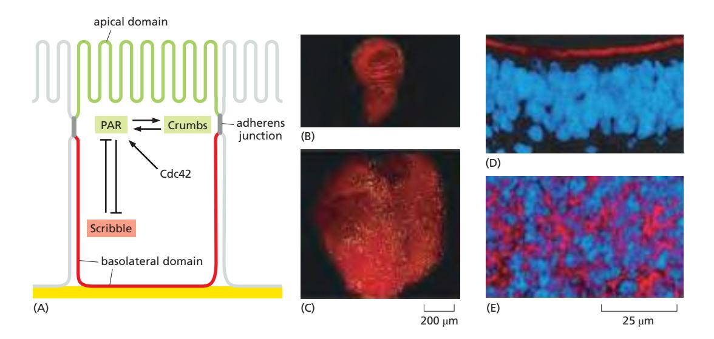

the *basolateral* domain at the bottom and side surfaces, which face the underlying matrix and adjacent cells (see Figure 16–4). Cell polarization is initiated by cues from the adjacent cells or the extracellular matrix. An important early step is the formation of cell–cell junctions that separate the apical and basolateral domains and hold the epithelial sheet together (see Chapter 19). In addition, as discussed earlier (see Figure 16–44), microtubules become aligned with their minus ends anchored at the apical surface and their plus ends pointing basally. This arrangement helps to polarize the secretory system so that nascent secreted and membrane proteins are transported to the appropriate domain. For example, digestive enzymes must be secreted exclusively into the lumen of the gut to avoid extensive damage to the surrounding tissues. MBoC7 n16 209/16.78

Much of what we know about the regulators of epithelial polarity comes from genetic screens that identified polarity-deficient mutants in *Drosophila*. These screens revealed some familiar proteins, including Cdc42 and the anterior PAR proteins, which in this system localize to the apical domain. In addition, two other protein groups were identified, termed *Crumbs* and *Scribble*, which are located in the apical and basolateral domains, respectively. Cells cannot form an apical domain in the absence of PAR or Crumbs proteins. In contrast, the apical domain is greatly expanded in the absence of Scribble proteins. This and other evidence indicate that mutual antagonism between apical and basolateral regulators helps maintain cell polarity and junctional contacts (**Figure 16–78A**). Downstream of the PAR, Crumbs, and Scribble modules, the organization of epithelial cell junctions, cytoskeleton, and secretory pathway is mediated by Rho family GTPases; the mechanisms underlying this regulation are not well understood.

Disruption of these polarity modules can lead to cellular growth defects, often through misregulation of a signaling system called the Hippo pathway (see Figure 21–67). For example, mutation of Scribble in epithelia of the developing fly larva not only leads to the loss of polarized cell organization but also promotes massive and invasive overgrowth, all characteristics of malignant tumors (**Figure 16–78B, C, D, and E**). Because Scribble proteins also help maintain polarity and normal growth in human epithelial tissues, they act as tumor suppressors (see Chapter 20).

#### Cell Migration Requires Dynamic Cell Polarity

Whereas epithelial cells maintain a polarized state throughout their lifetime to perform an essential barrier function within tissues, migrating cells display a dynamic polarity that requires continual long-distance communication and coordination between one end of a cell and the other. In addition to driving local mechanical processes such as protrusion at the front and retraction at the rear,

#### Figure 16–78 Cell-polarity protein modules identified in *Drosophila*.

(A) PAR and Crumbs proteins cooperate to assemble the apical domain and junctional complexes, whereas Scribble defines the basolateral domain. Scribble and PAR are mutually antagonistic, whereas PAR and Crumbs reinforce each other. Cdc42 helps to recruit PAR proteins. (B) Fluorescence micrograph of a wild-type *Drosophila* larval epithelial tissue called the imaginal disc stained for actin *(red)* shows the wellorganized, folded monolayer epithelium. (C) In a Scribble mutant, the imaginal disc has lost its normal morphology and grown dramatically larger because of hyperproliferation. Actively dividing cells are labeled *yellow*. (D) Higher-magnification image of a wild-type disc shows the polarized localization of actin *(red)* to the apical domain. (E) Actin organization is disrupted in the absence of Scribble. Nuclei are stained *blue*. (B and C, courtesy of David Bilder; D and E, from D. Bilder et al., *Science* 289:113–116, 2000. With permission from AAAS.)

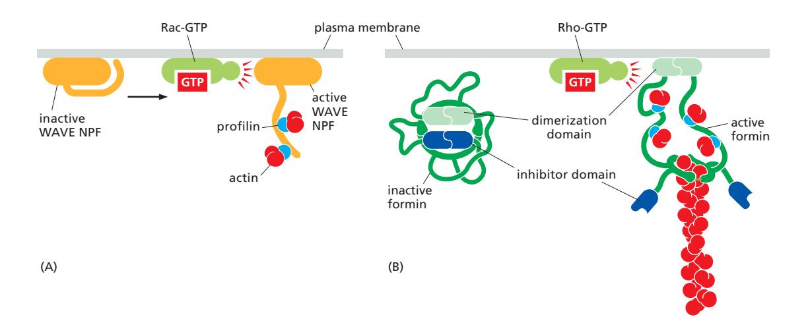

the cytoskeleton is responsible for coordinating cell shape, organization, and mechanical properties along its entire length, a distance that is typically tens of micrometers for animal cells. As we shall see, the Rho family GTPases and several cell-polarity proteins that we have already introduced are central to this process.

Cell locomotion requires an initial polarization of the cell to propel it in a particular direction. Once again, Cdc42 appears to be critical, as it sets up the overall polarity of a migrating cell. The downstream effectors of Cdc42-GTP include the polarity protein Par-3, and Cdc42 is also thought to stimulate extension of filopodia (see Figure 16–75) that help sense and respond to extracellular cues. Once polarized, protrusion of the leading edge of the cell is driven through nucleation of branched actin filaments by the Arp2/3 complex (see Figure 16–12). This process depends on Rac-GTP, which stimulates members of the WAVE family of actin nucleation-promoting factors (NPFs). A WAVE protein, present in a large regulatory complex, can exist in an inactive folded conformation and an activated open conformation. Association with Rac-GTP recruits WAVE to the plasma membrane and stabilizes the open conformation (**Figure 16–79A**). Active WAVE then stimulates nucleation of new actin filaments by Arp2/3 along the sides of existing filaments (see Figures 16–12 and 16–14A). In this way, Rac-GTP–dependent WAVE promotes the formation of branched actin networks that drive lamellipod formation at the leading edge of migrating cells (**Figure 16–80A**). MBoC7 n16.210/16.79

Rho-GTP is equally important for cell migration and has a very different set of targets. Instead of activating the Arp2/3 complex to build branched actin networks, Rho-GTP induces formin proteins to construct parallel actin bundles. Similar to the effects of Rac-GTP on WAVE, association of formins with Rho-GTP stabilizes an open, active conformation (**Figure 16–79B**). As discussed previously, formins stimulate both the nucleation and elongation of straight actin filaments (see Figures 16–13 and 16–14B). At the same time, Rho-GTP activates the Rho-associated kinase (ROCK), which stimulates another kinase called LIM, which phosphorylates and inhibits the activity of the actin-destabilizing protein cofilin. The resulting stable, unbranched actin filaments are ideal for interacting with myosin II. Furthermore, ROCK activates myosin II by inhibiting a phosphatase acting on myosin light chains (see Figure 16–34). The consequent increase in the net amount of myosin light-chain phosphorylation increases the level of contractile myosin motor-protein activity in the cell, enhancing the formation of tension-dependent structures such as stress fibers and focal adhesions (**Figure 16–80B**).

Spatial and temporal separation between the Rac and Rho pathways is thought to facilitate maintenance of the large-scale differences between the cell front and the cell rear during migration. Whereas Rac is activated exclusively at the leading edge of the cell, Rho activation predominates at the rear. Furthermore, the two pathways are mutually antagonistic. For example, Rac inhibits Rho activity through one of its effectors, the kinase PAK, which inhibits myosin II and therefore

Figure 16–79 Regulation of nucleationpromoting factors and formins by Rho family GTPases. (A) Members of the WAVE family of nucleation-promoting factors are activated upon binding to Rac-GTP at the plasma membrane. A conformational change in WAVE opens up the protein, allowing domains that were previously inaccessible to interact with both the Arp2/3 complex and profilinbound actin subunits. For clarity, the WAVE regulatory complex is not shown. (B) The activity of some formin proteins is inhibited by an autoinhibitory interaction in the absence of an active GTPase. Binding to Rho-GTP exposes a binding site for the plus end of an actin filament, as well as profilin–actin binding domains.

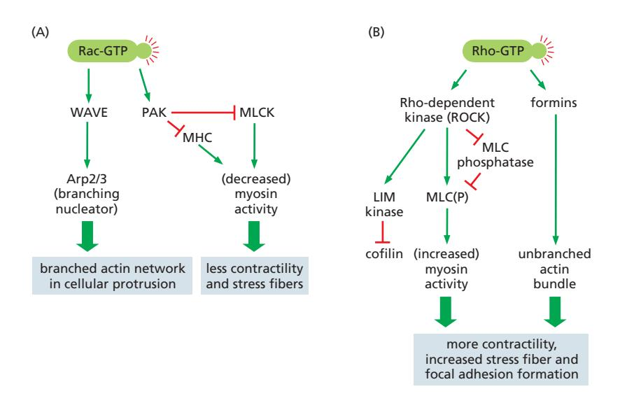

contractility. Rac and Rho also modulate the activities of the other's GEFs, GAPs, or GDIs to reinforce spatial separation of their activities.

#### External Signals Can Dictate the Direction of Cell Migration

**Chemotaxis** is the movement of a cell toward or away from a source of some diffusible chemical. These external signals act through cell surface receptors that trigger Rho family proteins to polarize and orient the cell motility apparatus, enabling directed cell migration. One well-studied example is the chemotactic movement of a class of white blood cells, called *neutrophils*, toward a source of bacterial infection. Receptor proteins on the surface of neutrophils enable them to detect very low concentrations of *N*-formylated peptides that are derived from bacterial proteins (only prokaryotes begin protein synthesis with *N*-formylmethionine). Using these receptors, neutrophils are guided to bacterial targets by their ability to detect a difference of only 1% in the concentration of these diffusible peptides on one side of the cell versus the other (**Figure 16–81A**). MBoC7 m16.85/16.80

In this case, and in the chemotaxis of *Dictyostelium* amoebae toward a source of cyclic AMP, binding of the chemoattractant to its G-protein-coupled receptor activates phosphoinositide 3-kinases (PI3Ks) (see Figure 15–53), which generate a signaling molecule [PI(3,4,5)P3] that in turn activates the Rac GTPase. Rac then activates the Arp2/3 complex leading to lamellipodial protrusion. Through an unknown mechanism, accumulation of the polarized actin network at the leading edge causes further local enhancement of PI3K activity in a positive feedback loop, strengthening the induction of protrusion. The PI(3,4,5)P3 that activates Rac cannot diffuse far from its site of synthesis, because it is rapidly converted back into PI(4,5)P2 by a constitutively active lipid phosphatase. At the same time, binding of the chemoattractant ligand to its receptor activates another signaling pathway that turns on Rho and enhances myosin-based contractility. As described in the previous section, these two pathways directly inhibit each other, such that Rac activation dominates in the front of the cell and Rho activation dominates in the rear (**Figure 16–81B**). This enables the cell to maintain its functional polarity with protrusion at the leading edge and contraction at the back.

Nondiffusible chemical cues attached to the extracellular matrix or to the surface of cells can also influence the direction of cell migration. When these signals activate receptors, they can cause increased cell adhesion and directed actin polymerization. Most long-distance cell migrations in animals, including neural-crest-cell migration and the travels of neuronal growth cones, depend on a combination of diffusible and nondiffusible signals to steer the locomoting cells or growth cones to their proper destinations.

Figure 16–80 The contrasting effects of Rac and Rho activation on actin organization. (A) Activation of the small GTPase Rac leads to alterations in actin accessory proteins that promote the formation of protrusive actin networks in lamellipodia and pseudopodia. Several different pathways contribute independently. Rac-GTP activates members of the WAVE protein family, which in turn activate actin nucleation and branched network formation by the Arp2/3 complex. In a parallel pathway, Rac-GTP activates the protein kinase PAK, which has several targets including the myosin light-chain kinase (MLCK), which is inhibited by phosphorylation. Inhibition of MLCK results in decreased phosphorylation of the myosin regulatory light chain and leads to myosin II filament disassembly and a decrease in contractile activity. In some cells, PAK also directly inhibits myosin II activity by phosphorylation of the myosin heavy chain (MHC). (B) Activation of the related GTPase Rho leads to nucleation of actin filaments by formins and increases contraction by myosin II, promoting the formation of contractile actin bundles at the rear of the cell and assembly of stress fibers. Activation of myosin II by Rho requires a Rho-associated kinase called ROCK. This kinase inhibits the phosphatase that removes the activating phosphate groups from myosin II light chains (MLC); it may also directly phosphorylate the myosin light chains in some cell types. ROCK also activates other protein kinases, such as LIM kinase, which in turn contributes to the formation of stable contractile actin filament bundles by inhibiting the actindepolymerizing factor cofilin. A similar signaling pathway is important for forming the contractile ring necessary for cytokinesis (see Figure 17–45).

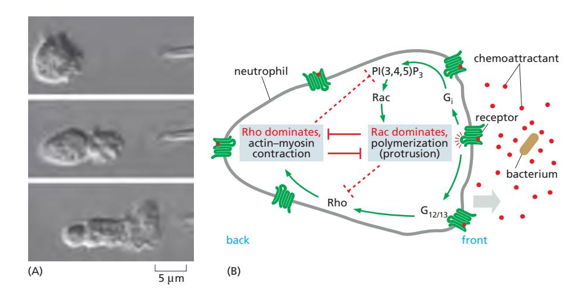

#### Communication Among Cytoskeletal Elements Supports Whole-Cell Polarity and Locomotion

The interconnected cytoskeleton is crucial for cell polarity and migration. Although polarity signals are frequently transduced by Rho family GTPases that act primarily on the actin cytoskeleton and myosin contractility, microtubules, septins, and intermediate filaments also participate. For example, vimentin intermediate filament networks associate with integrins at focal adhesions, and vimentin-deficient fibroblasts display impaired mechanical stability, migration, and contractile capacity. Furthermore, disruption of linker proteins that connect different cytoskeletal elements, including several plakins and KASH proteins, leads to defects in cell polarization and migration. Thus, interactions among cytoplasmic filament systems, as well as mechanical linkage to the nucleus, are required for complex, whole-cell behaviors such as migration.

Cells also use microtubules to support cell polarity and to organize persistent movement in a specific direction. Cross-linking proteins connect microtubule minus and plus ends to actin at the apical and basal cortex of epithelial cells, respectively. They also link the plus ends of microtubules and actin at the front of migrating cells. An example of such a cross-linker is the formin proteins, a subset of which binds to microtubules in addition to regulating actin filament assembly. These interactions enable microtubules to influence actin rearrangements and cell adhesion. By extending from the centrosome into the protrusive region of a migrating cell, microtubules can also serve as a compass to aid in directed cell migration. Microtubules also influence actin and focal adhesions by serving as tracks for motor-dependent transport of cargoes to and from the cell periphery. They can also deliver regulatory proteins, such as Rac GEFs, which bind to the +TIPs traveling on growing microtubule ends. Thus, microtubules reinforce the polarity information that the actin cytoskeleton receives from the outside world, allowing a sensitive response to weak signals and enabling motility to persist in the same direction for a prolonged period. MBoC7 m16.86/16.81

#### Summary

*Cell polarity and migration require large-scale shaping and structuring of cells. This involves the coordinated activities of all three basic filament systems along with a large variety of regulatory and motor proteins. Rho family proteins work together with cell-polarity proteins to establish stable cytoskeletal structures necessary to generate higher levels of polarity within an organism or to maintain epithelial tissues. These same factors also operate during the dynamic polarization required for directed cell migration—a widespread behavior important in embryonic development and also in wound healing, tissue maintenance, and immune system function in the adult animal—providing a prime example of complex, coordinated cytoskeletal action influenced by external cues.* 

Figure 16–81 Neutrophil polarization and chemotaxis. (A) The pipette tip at the right is leaking a small amount of the bacterial peptide formyl-Met-Leu-Phe, which is recognized by the human neutrophil as the product of a foreign invader. The neutrophil quickly extends a new lamellipodium toward the source of the chemoattractant peptide *(top)*. It then extends this lamellipodium and polarizes its cytoskeleton so that contractile myosin II is located primarily at the rear, opposite the position of the lamellipodium *(middle)*. Finally, the cell crawls toward the source of the peptide *(bottom)*. If a real bacterium were the source of the peptide, rather than an investigator's pipette, the neutrophil would engulf the bacterium and destroy it (see also Figure 16–3 and Movie 16.17). (B) Binding of bacterial molecules to G-protein-coupled receptors on the neutrophil stimulates directed motility. These receptors are found all over the surface of the cell, but are more likely to be bound to the bacterial ligand at the front. Two distinct signaling pathways contribute to the cell's polarization. At the front of the cell, stimulation of the Rac pathway leads, via the trimeric G protein Gi , to growth of protrusive actin networks. Second messengers within this pathway are short-lived, so protrusion is limited to the region of the cell closest to the stimulant. The same receptor also stimulates a second signaling pathway, via the trimeric G proteins G12 and G13, that triggers the activation of Rho. The two pathways are mutually antagonistic. Because Rac-based protrusion is active at the front of the cell, Rho is activated only at the rear of the cell, stimulating contraction of the cell rear and assisting directed movement. (A, from O.D. Weiner et al., *Nat. Cell Biol.* 1:75–81, published 1999 by Macmillan Magazines Ltd. Reproduced with permission of SNCSC.)

# PROBLEMS

#### Which statements are true? Explain why or why not.

- 16–1 The role of ATP hydrolysis in actin polymerization is similar to the role of GTP hydrolysis in tubulin polymerization: both serve to weaken subunit bonds in the polymer and thereby promote depolymerization.
- 16–2 Motor neurons trigger action potentials in muscle cell membranes that open voltage-gated Ca2+ channels in T tubules, allowing extracellular Ca2+ to enter the cytosol, bind to troponin C, and initiate rapid muscle contraction.
- 16–3 In most animal cells, minus end–directed microtubule motors deliver their cargo to the periphery of the cell, whereas plus end–directed microtubule motors deliver their cargo to the interior of the cell.
- 16–4 Because bacteria are very small and lack the elaborate networks of intracellular membrane-enclosed organelles typical of eukaryotic cells, they do not require cytoskeletal filaments.

#### Discuss the following problems.

- 16–5 A scallop is a hinged bivalve that swims by slowly opening its two-part shell and then rapidly closing it, forcing a jet of water out the back and propelling itself forward. Imagine a bacterium constructed analogously. Could it swim in its low-Reynolds-number environment using the same mechanism as the scallop? Why or why not?
- 16–6 The plus and minus ends of actin filaments grow at different rates and have different critical concentrations (*C*c). Between these critical concentrations, the filaments grow at their plus ends but shrink at their minus ends, a property termed treadmilling (**Figure Q16–1**). Is there any concentration of actin subunits at which the filament length does not change? If so, describe the concentration at which it occurs.

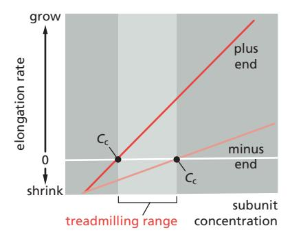

Figure Q16–1 Treadmilling at intermediate concentrations of free actin subunits (Problem 16–6).

16–7 Cofilin preferentially binds to older actin filaments and promotes their disassembly. How does cofilin distinguish old filaments from new ones? Figure nQ16-101/Q16-1

- 16–8 How is the unidirectional motion of a lamellipodium maintained?
- 16–9 Detailed measurements of sarcomere length and tension during isometric contraction in striated muscle provided crucial early support for the sliding-filament model of muscle contraction. On the basis of your understanding of the sliding-filament model and the structure of a sarcomere, propose a molecular explanation for the relationship of tension to sarcomere length in the portions of **Figure Q16–2** marked I, II, III, and IV. (In this muscle, the length of the myosin filament is 1.6 μm, and the lengths of the actin thin filaments that project from the Z discs are 1.0 μm.)

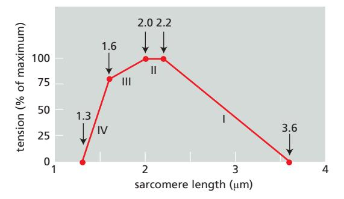

Figure Q16–2 Tension as a function of sarcomere length during isometric contraction (Problem 16–9).

- 16–10 At 1.4 mg/mL pure tubulin, microtubules grow at a rate of about 2 μm/min. At this growth rate, how many αβ-tubulin dimers (8 nm in length) are added to the ends of a microtubule each second?
- 16–11 The movements of single motor-protein molecules can be analyzed directly. Using polarized laser light, it is possible to create interference patterns that exert a centrally directed force, ranging from zero at the center to a few piconewtons at the periphery (about 200 nm from the center). Individual molecules that enter the interference pattern are rapidly pushed to the center, allowing them to be captured and moved at the experimenter's discretion.

These so-called optical tweezers can be used to position single kinesin molecules on a microtubule that is fixed to a coverslip. Although a single kinesin molecule cannot be seen optically, it can be tagged with a silica bead and tracked indirectly by following the bead (**Figure Q16–3A**). In the absence of ATP, the kinesin molecule remains at the center of the interference pattern, but with ATP it moves toward the plus end of the microtubule. As kinesin moves along the microtubule, it encounters the force of the interference pattern, which simulates the load kinesin carries during its actual function in the cell. Moreover, the pressure against the silica bead counters the effects of Brownian (thermal) motion, 1024 Chapter 16: The Cytoskeleton REFERENCES 1025

so that the position of the bead more accurately reflects the position of the kinesin molecule on the microtubule.

A trace of the movements of a kinesin molecule along a microtubule is shown in **Figure Q16–3B**.

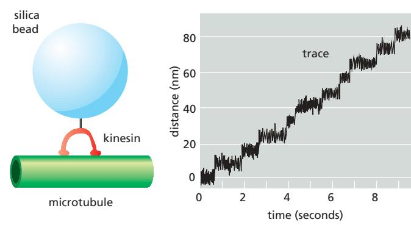

Figure mQ16-3/Q16-3 Figure Q16–3 Movement of kinesin along a microtubule (Problem 16–11). (A) Experimental setup, with kinesin linked to a silica bead, moving along a microtubule. (B) Position of kinesin (as visualized by the position of the silica bead) relative to the center of the interference pattern, as a function of time of movement along the microtubule. The jagged nature of the trace results from Brownian motion of the bead.

- A. As shown in Figure Q16–3B, all movement of kinesin is in one direction (toward the plus end of the microtubule). What supplies the free energy needed to ensure a unidirectional movement along the microtubule?
- B. What is the average rate of movement of kinesin along the microtubule?
- C. What is the length of each step that kinesin takes as it moves along the microtubule?
- D. Kinesin has two globular domains that can each bind to β-tubulin, and it moves along a single protofilament

in a microtubule. In each protofilament, the β-tubulin subunit repeats at 8-nm intervals. Given the step length and the interval between β-tubulin subunits, how do you suppose a kinesin molecule moves along a microtubule?

E. Is there anything in the data in Figure Q16–3 that tells you how many ATP molecules are hydrolyzed per step?

16–12 A mitochondrion 1 μm long can travel the 1-meter length of the axon from the spinal cord to the big toe in a day. The Olympic men's freestyle swimming record for 200 meters is 1.72 minutes. In terms of body lengths per day, who is moving faster: the mitochondrion or the Olympic record holder? (Assume that the swimmer is 2 meters tall.)

16–13 Why is it that intermediate filaments have identical ends and lack polarity, whereas actin filaments and microtubules each have two distinct ends with a defined polarity?

16–14 Once cell polarity has been established in the fertilized egg of *C. elegans* (**Figure Q16–4**), the female pronucleus migrates along the microtubules emanating from the centrosomes adjacent to the paternal nucleus, which leads to fusion of the haploid genomes. What motor is likely involved in nuclear migration?

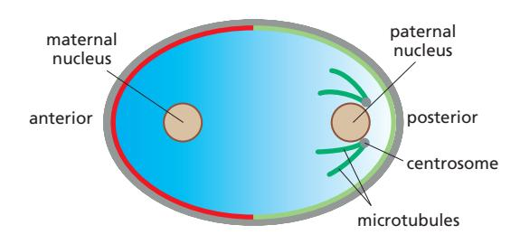

Figure Q16–4 Polarity establishment in a fertilized *C. elegans* egg prior to nuclear fusion (Problem 16–14).

# REFERENCES

#### General

Pollard TD & Goldman RD (2017) The Cytoskeleton. Cold Spring Harbor, NY: Cold Spring Harbor Laboratory Press.

#### Function and Dynamics of the Cytoskeleton

Hill TL & Kirschner MW (1982) Bioenergetics and kinetics of microtubule and actin filament assembly-disassembly. *Int. Rev. Cytol.* 78, 1–125.

Luby-Phelps K (2000) Cytoarchitecture and physical properties of cytoplasm: volume, viscosity, diffusion, intracellular surface area. *Int. Rev. Cytol.* 192, 189–221.

Oosawa F & Asakura S (1975) Thermodynamics of the Polymerization of Protein, pp. 41–55, 90–108. New York: Academic Press.

Pauling L (1953) Aggregation of globular proteins. *Discuss. Faraday Soc.* 13, 170–176.

Purcell EM (1977) Life at low Reynolds number. *Am. J. Phys.* 45, 3–11.

#### Actin

Loisel TP, Boujemaa R, Pantaloni D & Carlier MF (1999) Reconstitution of actin-based motility of *Listeria* and *Shigella* using pure proteins. *Nature* 401, 613–616.

Mullins RD, Heuser JA & Pollard TD (1998) The interaction of Arp2/3 complex with actin: nucleation, high affinity pointed end capping, and formation of branching networks of filaments. *Proc. Natl. Acad. Sci. USA* 95, 6181–6186.

Pelaseyed T & Bretscher A (2018) Regulation of actin-based apical structures on epithelial cells. *J. Cell Sci.* 131, jcs221853.

Renkawitz J, Kopf A, Stopp J . . . Sixt M (2019) Nuclear positioning facilitates amoeboid migration along the path of least resistance. *Nature* 568, 546–550.

Rottner K & Schaks M (2019) Assembling actin filaments for protrusion. *Curr. Opin. Cell Biol.* 56, 53–63.

Skau CT & Waterman CW (2015) Specification of architecture and function of actin structures by actin nucleation factors. *Annu. Rev. Biophys*. 44, 285–310.

Svitkina T (2018) The actin cytoskeleton and actin-based motility. *Cold Spring Harb. Perspect. Biol.* 10(1), a018267.

Yamada KM & Sixt M (2019) Mechanisms of 3D cell migration. *Nat. Rev. Mol. Cell Biol.* 20, 738–752.

#### Myosin and Actin

- Cooke R (2004) The sliding filament model: 1972–2004. *J. Gen. Physiol.* 123, 643–656.
- Hammer JA III & Sellers JR (2011) Walking to work: roles for class V myosins as cargo transporters. *Nat. Rev. Mol. Cell Biol.* 13, 13–26.
- Hartman MA, Finan D, Sivaramakrishnan S & Spudich JA (2011) Principles of unconventional myosin function and targeting. *Annu. Rev. Cell Dev. Biol.* 27, 133–155.
- Hu S, Dasbiswas K, Guo Z . . . Bershadsky AD (2017) Long-range selforganization of cytoskeletal myosin II filament stacks. *Nat. Cell Biol.*  19, 133–141.
- Walklate J, Ujfalusi Z & Greeves MA (2016) Myosin isoforms and the mechanochemical cross-bridge cycle. *J. Exp. Biol.* 219, 168–174.
- Yildiz A, Forkey JN, McKinney SA . . . Selvin PR (2003) Myosin V walks hand-over-hand: single fluorophore imaging with 1.5-nm localization. *Science* 300, 2061–2065.

#### Microtubules

- Brouhard GJ, Stear JH, Noetzel TL . . . Hyman AA (2008) XMAP215 is a processive microtubule polymerase. *Cell* 132, 79–88.
- Dogterom M & Yurke B (1997) Measurement of the force-velocity relation for growing microtubules. *Science* 278, 856–860.
- Goodson HV & Jonasson EM (2018) Microtubules and microtubuleassociated proteins. *Cold Spring Harb. Perspect. Biol.* 10(6), a022608.
- Hotani H & Horio T (1988) Dynamics of microtubules visualized by darkfield microscopy: treadmilling and dynamic instability. *Cell Motil. Cytoskeleton* 10, 229–236.
- Howard J, Hudspeth AJ & Vale RD (1989) Movement of microtubules by single kinesin molecules. *Nature* 342, 154–158.
- Kuo Y-W & Howard J (2020) Cutting, amplifying, and aligning microtubules with severing enzymes. *Trends Cell Biol.* 31, 50–61.
- Lin J & Nicastro D (2018) Asymmetric distribution and spatial switching of dynein activity generates ciliary motility. *Science* 360, eaar1968.
- Mitchison T & Kirschner M (1984) Dynamic instability of microtubule growth. *Nature* 312, 237–242.
- Reck-Peterson SL, Redwine WB, Vale RD & Carter AP (2018) The cytoplasmic dynein transport machinery and its many cargoes. *Nat. Rev. Mol. Cell Biol.* 19, 382–398.
- Reiter JF & Leroux MR (2017) Genes and molecular pathways underpinning ciliopathies. *Nat. Rev. Mol. Cell Biol.* 18, 533–547.
- Rice S, Lin AW, Safer D . . . Milligan RA & Vale RD (1999) A structural change in the kinesin motor protein that drives motility. *Nature* 402, 778–784.
- Stearns T & Kirschner M (1994) *In vitro* reconstitution of centrosome assembly and function: the central role of gamma-tubulin. *Cell* 76, 623–637.
- Svoboda K, Schmidt CF, Schnapp BJ & Block SM (1993) Direct observation of kinesin stepping by optical trapping interferometry. *Nature* 365, 721–727.

- Théry M & Blanchoin L (2021) Microtubule self-repair. *Curr. Opin. Cell Biol.* 68, 144–154.
- Woodruff JB, Ferreira Gomes B, Widlund PO . . . Hyman AA (2017) The centrosome is a selective condensate that nucleates microtubules by concentrating tubulin. *Cell* 169, 1066–1077.
- Wu J & Akhmanova A (2017) Microtubule-organizing centers. *Annu. Rev. Cell Dev. Biol.* 33, 51–75.

#### Intermediate Filaments and Other Cytoskeletal Polymers

- Garner EC, Bernard R, Wang W . . . Mitchison T (2011) Coupled, circumferential motions of the cell wall synthesis machinery and MreB filaments in *B. subtilis*. *Science* 333, 222–225.
- Garner EC, Campbell CS & Mullins RD (2004) Dynamic instability in a DNAsegregating prokaryotic actin homolog. *Science* 306, 1021–1025.
- Herrmann H & Aebi U (2016) Intermediate filaments: structure and assembly. *Cold Spring Harb. Perspect. Biol.* 8(11), a018242.
- Isermann P & Lammerding J (2013) Nuclear mechanics and mechanotransduction in health and disease. *Curr. Biol.* 23, R1113–R1121.
- Köster S, Weitz DA, Goldman RD, Aebi U & Herrmann H (2015) Intermediate filament networks in vitro and in vivo: from coiled-coils to filaments, fibers and networks*. Curr. Opin. Cell Biol.* 32, 82–91.
- Wagstaff J & Lowe J (2018) Prokaryotic cytoskeletons: protein filaments organizing small cells. *Nat. Rev. Microbiol.* 16, 187–201.
- Woods BL & Gladfelter AS (2021) The state of the septin cytoskeleton from assembly to function. *Curr. Opin. Cell Biol.* 68, 105–112.

#### Cell Polarity and Coordination of the Cytoskeleton

- Bilder D, Li M & Perrimon N (2000) Cooperative regulation of cell polarity and growth by *Drosophila* tumour suppressors. *Science* 289, 113–116.
- Devreotes P & Horwitz AR (2015) Signaling networks that regulate cell migration. *Cold Spring Harb. Perspect. Biol.* 7(8), a005959.
- Dogterom M & Koenderink GH (2019) Actin-microtubule crosstalk in cell biology. *Nat. Rev. Mol. Cell Biol.* 20, 38–54.
- Chiou J, Balasubramanian MK & Lew D (2017) Cell polarity in yeast. *Annu. Rev. Cell Dev. Biol.* 33, 77–101.
- Lawson CD & Ridley AJ (2017) Rho GTPase signalling complexes in cell migration and invasion. *J. Cell Biol.* 217, 447–457.
- Munro E, Nance J & Priess JR (2004) Cortical flows powered by asymmetrical contraction transport PAR proteins to establish and maintain anterior-posterior polarity in the early *C. elegans* embryo. *Dev. Cell* 7, 413–424.
- Schaks M, Giannone G & Rottner K (2019) Actin dynamics in cell migration. *Essays Biochem.* 63, 483–495.
- St. Johnston D (2018) Establishing and transducing cell polarity: common themes and variations. *Curr. Opin. Cell Biol*. 51, 33–41.