# CELLS IN THEIR SOCIAL CONTEXT

# Cell Junctions and the Extracellular Matrix

CHAPTER

19

Of all the social interactions between cells in a multicellular organism, the most fundamental are those that hold the cells together. Cells may be linked by direct interactions or they may be held together within the *extracellular matrix*, a complex network of proteins and polysaccharide chains that the cells secrete. By one means or another, cells must cohere if they are to form an organized multicellular structure that can withstand and respond to the various external forces that try to pull it apart.

Mechanisms of cell cohesion govern the architecture of tissues and organs their shape, strength, and the arrangement of different cell types. The making and breaking of the attachments between cells and the modeling of the extracellular matrix govern the way cells move within the organism, guiding them as the body grows, develops, and repairs itself. Attachments to other cells and to the extracellular matrix control the orientation and behavior of the cell's cytoskeleton, thereby allowing cells to sense and respond to changes in the mechanical features of their environment. Thus, the apparatus of cell junctions and the extracellular matrix is critical for every aspect of the organization, function, and dynamics of multicellular structures. Defects in this apparatus underlie an enormous variety of diseases.

The key features of cell junctions and the extracellular matrix are best illustrated by considering two broad categories of tissues that are found in all animals (**Figure 19–1**). **Connective tissues**, such as bone or tendon, are formed from an extracellular matrix produced by cells that are distributed sparsely in the matrix. It is the matrix—rather than the cells—that bears most of the mechanical stress to which the tissue is subjected. *Cell–matrix junctions* link connective tissue cells to the matrix, allowing the cells to move through the matrix and monitor changes in its mechanical properties.

In **epithelial tissues**, such as the lining of the gut or the epidermal covering of the skin, cells are tightly bound together into sheets called **epithelia**. The extracellular matrix is less pronounced, consisting mainly of a thin mat called the *basal lamina* (or *basement membrane*) underlying the sheet. Within the epithelium, cells are attached to each other directly by *cell–cell junctions*, where cytoskeletal filaments are anchored, transmitting stresses across the interiors of the cells, from

#### IN THIS CHAPTER

Cell–Cell Junctions

The Extracellular Matrix of Animals

Cell–Matrix Junctions

The Plant Cell Wall

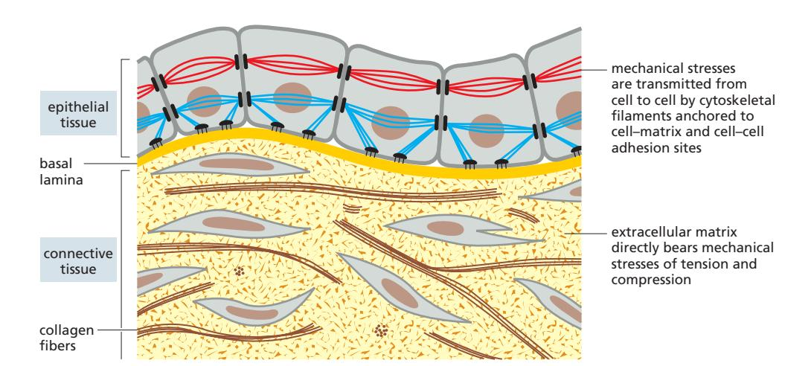

adhesion site to adhesion site. The cytoskeletons of epithelial cells are also linked to the basal lamina through cell–matrix junctions.

**Figure 19–2** provides a closer view of epithelial cells to illustrate the major types of cell–cell and cell–matrix junctions that we will discuss in this chapter. The diagram shows the typical arrangement of junctions in a *simple columnar* epithelium such as the lining of the small intestine of a vertebrate. Here, a single layer of tall cells stands on a basal lamina, with the cells' uppermost surface, or **apical** surface, free and exposed to the extracellular medium. On their sides, or *lateral* surfaces, the cells make junctions with one another. Two types of cell–cell junctions link the cytoskeletons of adjacent cells: **adherens junctions** are connected to actin filaments, and **desmosomes** are linked to intermediate filaments. Because these junctions anchor the cells strongly to each other and thus help the MBoC7 m19.01/19.01

Figure 19–1 How animal cells are bound together in two major tissue types. In connective tissue, the extracellular matrix is the main stress-bearing component. In epithelial tissue, the cytoskeleton of the cell is the main stress-bearing component: the cytoskeletons of cells are linked from cell to cell by adhesive junctions and transmit mechanical stresses across the interiors of the cells. Cell–matrix attachments bond epithelial tissue to the connective tissue beneath it.

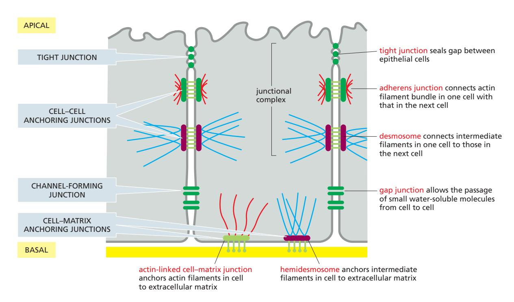

Figure 19–2 A summary of the various cell junctions found in a vertebrate epithelial cell. In the apical region of the cell, the relative positions of the junctions are the same in nearly all vertebrate epithelia. The tight junction occupies the most apical position, followed by the adherens junction (adhesion belt) and then by a special parallel row of desmosomes; together, these three junctions form a structure called a junctional complex. Gap junctions and additional desmosomes are less regularly organized. Two types of cell–matrix anchoring junctions tether the basal surface of the cell to the basal lamina. The drawing is based on epithelial cells of the small intestine.

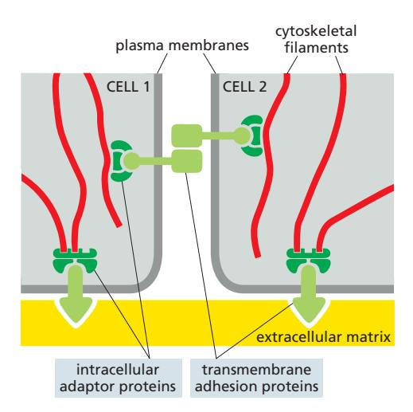

Figure 19–3 Transmembrane adhesion proteins link the cytoskeleton to extracellular structures. The external linkage may be either to other cells (cell–cell junctions, mediated typically by cadherins) or to extracellular matrix (cell–matrix junctions, mediated typically by integrins). The internal linkage to the cytoskeleton is generally indirect, via intracellular adaptor proteins, to be discussed later.

tissue withstand mechanical stress, they are sometimes called **anchoring junctions**. At the **basal** surface of the cells, two additional types of anchoring junctions link the cytoskeleton of the epithelial cell to the basal lamina: *actin-linked cell– matrix junctions* anchor actin filaments to the matrix, while *hemidesmosomes* anchor intermediate filaments to it. MBoC7 m19.03/19.03

Two other types of cell–cell junctions are shown in Figure 19–2. *Tight junctions*  hold the cells closely together near the apical surface, sealing the gap between the cells and thereby preventing molecules from leaking across the epithelium. Near the basal end of the cells are channel-forming junctions, called *gap junctions,* that create passageways linking the cytoplasms of adjacent cells.

Each of the four major anchoring junction types depends on **transmembrane adhesion proteins** that span the plasma membrane, with one end linking to the cytoskeleton inside the cell and the other end linking to other structures outside it (**Figure 19–3**). These cytoskeleton-linked transmembrane proteins fall neatly into two superfamilies, corresponding to the two basic kinds of external attachment. Proteins of the **cadherin** superfamily chiefly mediate attachment of cell to cell (**Movie 19.1**). Proteins of the **integrin** superfamily chiefly mediate attachment of cells to matrix. There is specialization within each family: some cadherins link to actin and form adherens junctions, while others link to intermediate filaments and form desmosomes; likewise, some integrins link to actin and form actinlinked cell–matrix junctions, while others link to intermediate filaments and form hemidesmosomes (**Table 19–1**).

| TABLE 19–1 Anchoring Junctions        |                                                        |                                                      |                                          |                                                                                        |  |
|---------------------------------------|--------------------------------------------------------|------------------------------------------------------|------------------------------------------|----------------------------------------------------------------------------------------|--|
| Junction                              | Transmembrane adhesion protein                      | Extracellular ligand                              | Intracellular cytoskeletal attachment | Intracellular adaptor proteins                                                         |  |
| Cell–cell                             |                                                        |                                                      |                                          |                                                                                        |  |
| Adherens junction                     | Classical cadherins                                    | Classical cadherin on neighboring cell            | Actin filaments                          | α-Catenin, β-catenin, p120-catenin, vinculin                                        |  |
| Desmosome                             | Nonclassical cadherins (desmoglein, desmocollin) | Desmoglein and desmocollin on neighboring cell | Intermediate filaments                   | Plakoglobin, plakophilin, desmoplakin                                               |  |
| Cell–matrix                           |                                                        |                                                      |                                          |                                                                                        |  |
| Actin-linked cell– matrix junction | Integrin                                               | Extracellular matrix proteins                     | Actin filaments                          | Talin, kindlin, vinculin, paxillin, focal adhesion kinase (FAK), numerous others |  |
| Hemidesmosome                         | α6β4 integrin, type XVII collagen                   | Extracellular matrix proteins                     | Intermediate filaments                   | Plectin, BP230                                                                         |  |

There are some exceptions to these rules. Some integrins, for example, mediate cell–cell rather than cell–matrix attachment. Moreover, there are other types of cell adhesion molecules that can provide transient cell–cell attachments more flimsy than anchoring junctions but sufficient to stick cells together in special circumstances.

We begin the chapter with a discussion of the major forms of cell–cell junctions. We then consider in turn the extracellular matrix of animals, the structure and function of integrin-mediated cell–matrix junctions, and, finally, the plant cell wall, a special form of extracellular matrix.

# CELL–CELL JUNCTIONS

Cell–cell junctions come in many forms and can be regulated by a variety of mechanisms. The best understood and most common are the two types of cell– cell anchoring junctions, which employ cadherins to link the cytoskeleton of one cell with that of its neighbor. Their primary function is to resist the external forces that pull cells apart. The epithelial cells of your skin, for example, must remain tightly linked when they are stretched, pinched, or poked. Cell–cell anchoring junctions must also be dynamic and adaptable, so that they can be altered or rearranged when tissues are remodeled or repaired or when there are changes in the forces acting on them.

In this section, we focus primarily on the cadherin-based anchoring junctions. We then briefly describe tight junctions and gap junctions. Finally, we consider the more transient cell–cell adhesion mechanisms employed by some cells in the bloodstream.

#### Cadherins Form a Diverse Family of Adhesion Molecules

Cadherins are present in all multicellular animals. They are also present in the choanoflagellates, which are closely related to animals but can exist either as free-living unicellular organisms or as multicellular colonies. Other eukaryotes, including fungi and plants, lack cadherins, and they are also absent from bacteria and archaea. Cadherins therefore seem to be part of the essence of what it is to be an animal.

The cadherins take their name from their dependence on Ca2+ ions: removing Ca2+ from the extracellular medium causes adhesions mediated by cadherins to come apart. The first three cadherins to be discovered were named according to the main tissues in which they were found: *E-cadherin* is present on many types of epithelial cells; *N-cadherin* on nerve, muscle, and lens cells; and *P-cadherin* on cells in the placenta and epidermis. All are also found in other tissues. These and other **classical cadherins** are closely related in sequence throughout their extracellular and intracellular domains.

There are also a large number of **nonclassical cadherins** that are more distantly related in sequence, with more than 50 expressed in the brain alone. The nonclassical cadherins include proteins with known adhesive function, such as the diverse *protocadherins* found in the brain, and the *desmocollins* and *desmogleins* that form desmosomes (see Table 19–1). Together, the classical and nonclassical cadherin proteins constitute the **cadherin superfamily** (**Figure 19–4**), with more than 180 members in humans.

#### Cadherins Mediate Homophilic Adhesion

Anchoring junctions between cells are usually symmetrical: if the linkage is to actin in the cell on one side of the junction, it will be to actin in the cell on the other side. In fact, the binding between cadherins is generally **homophilic** (liketo-like; **Figure 19–5**): cadherin molecules of a specific subtype on one cell bind to cadherin molecules of the same or closely related subtype on adjacent cells.

The spacing between the cell membranes at an anchoring junction is precisely defined and depends on the structure of the participating cadherin molecules. All 1108 Chapter 19: Cell Junctions and the Extracellular Matrix CELL–CELL JUNCTIONS 1109

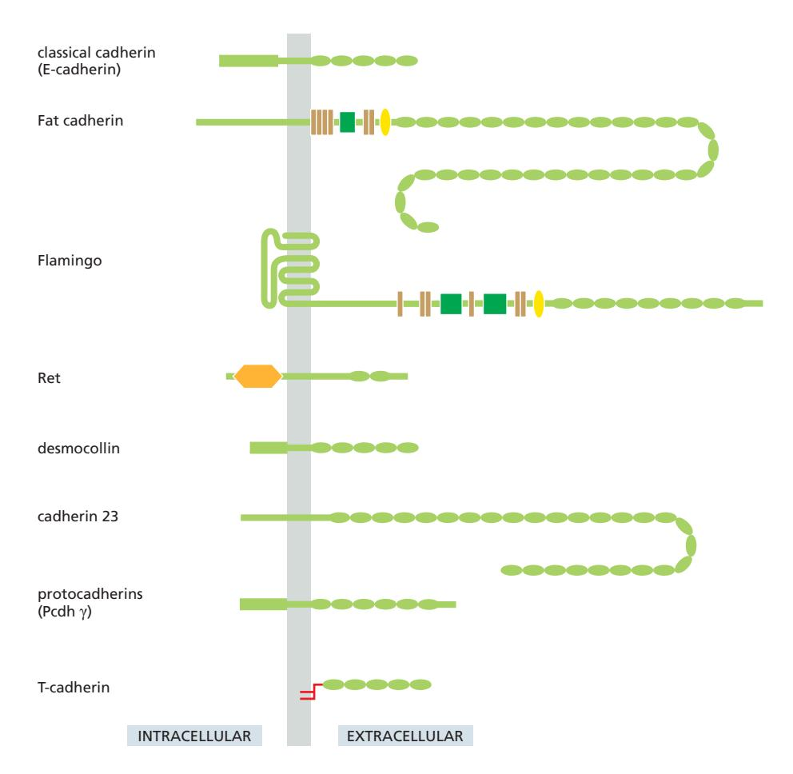

among cadherin superfamily members. These proteins all have extracellular portions containing multiple copies of the extracellular cadherin domain *(green ovals)*. In the classical cadherins of vertebrates there are 5 of these domains, and in desmogleins and desmocollins there are 4 or 5, but some nonclassical cadherins have more than 30. The intracellular portions are more varied, reflecting interactions with a wide variety of intracellular ligands, including signaling

Figure 19–4 The cadherin superfamily. The diagram shows some of the diversity

is not present, and the protein is attached to the plasma membrane by a glycosylphosphatidylinositol (GPI) anchor. The differently colored motifs in Fat, Flamingo, and Ret represent conserved domains that are also found in other protein families.

molecules and adaptor proteins that connect the cadherin to the cytoskeleton. In some cases, such as T-cadherin, a transmembrane domain

the members of the superfamily, by definition, have an extracellular portion consisting of several copies of the *extracellular cadherin* (*EC*) *domain*. Homophilic binding occurs at the N-terminal tips of the cadherin molecules—the cadherin domains that lie farthest from the membrane. These terminal domains each form a knob and a nearby pocket, and the cadherin molecules protruding from opposite cell membranes bind by insertion of the knob of one domain into the pocket of the other (**Figure 19–6A**). MBoC7 m19.04/19.4

Each cadherin domain forms a more-or-less rigid unit, joined to the next cadherin domain by a hinge. Ca2+ ions bind to sites near each hinge and prevent it from flexing, so that the whole string of cadherin domains behaves as a rigid and slightly curved rod. When Ca2+ is removed, the hinges can flex, and the structure becomes floppy (**Figure 19–6B**). At the same time, the conformation at the N-terminus is thought to change slightly, weakening the binding affinity for the matching cadherin molecule on the opposite cell.

Unlike receptors for soluble signaling molecules, which bind their specific ligand with high affinity, cadherins (and most other cell–cell adhesion proteins) typically bind to their partners with relatively low affinity. Strong attachments result from the formation of many such weak bonds in parallel. When binding to oppositely oriented partners on another cell, cadherin molecules are often clustered side-to-side with many other cadherin molecules on the same cell (**Figure 19–6C**). The strength of this junction is far greater than that of any individual intermolecular bond, and yet regulatory mechanisms can easily disassemble the junction by separating the molecules sequentially, just as two pieces of fabric can be joined strongly by Velcro and yet easily peeled apart from the sides. A similar "Velcro principle" also operates at cell–cell and cell–matrix adhesions formed by other types of transmembrane adhesion proteins.

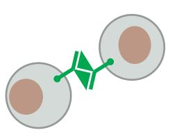

HOMOPHILIC BINDING

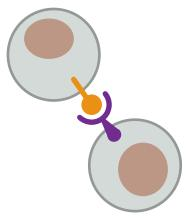

HETEROPHILIC BINDING

Figure 19–5 Homophilic versus heterophilic binding. Cadherins in general bind homophilically; some other cell adhesion molecules, discussed later, bind heterophilically.

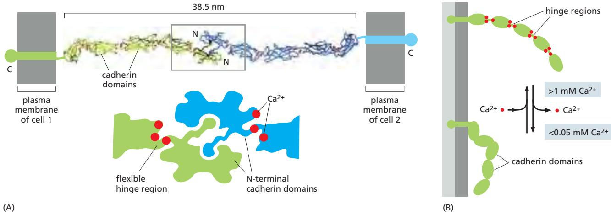

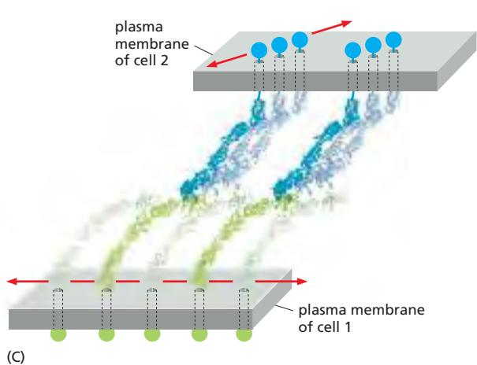

Figure 19–6 Cadherin structure and function. (A) The extracellular region of a classical cadherin contains five copies of the extracellular cadherin domain (see Figure 19–4) separated by flexible hinge regions. At a typical extracellular Ca2+ concentration (>1 mM), Ca2+ ions *(red dots)* bind in the neighborhood of each hinge, preventing it from flexing. To generate cell– cell adhesion, the cadherin domain at the N-terminal tip of one cadherin molecule binds the cadherin domain at the N-terminal tip of a cadherin molecule on another cell. The structure was determined by x-ray diffraction of the crystallized C-cadherin extracellular region. The two cadherins shown here, although identical, are colored differently for clarity. (B) If the extracellular Ca2+ concentration is decreased artificially in an experiment, Ca2+ binding decreases. As a result, increased flexibility in the hinge regions results in a floppier molecule that is no longer oriented correctly to interact with a cadherin on another cell—and adhesion fails. (C) At a typical cell–cell junction, an organized array of cadherin molecules functions like Velcro to hold cells together. Cadherins on the same cell are thought to be coupled by side-to-side interactions between their N-terminal head regions, resulting in a linear array like the alternating *green* and *light green* cadherins on the lower cell shown here. These arrays are thought to interact with perpendicular arrays on an adjacent cell (*blue* cadherin molecules, top cell). Multiple perpendicular arrays on both cells interact to form a tight-knit mat of cadherin proteins. (A, based on T.J. Boggon et al., *Science* 296:1308–1313, 2002; C, based on O.J. Harrison et al., *Structure* 19:244–256, 2011.)

# Cadherin-dependent Cell–Cell Adhesion Guides the Organization of Developing Tissues

Cadherins form specific homophilic attachments, explaining why there are so many different family members. Cadherins are not like glue, making cell surfaces generally sticky. Rather, they mediate highly selective recognition, enabling cells of a similar type to stick together and to stay segregated from other types of cells. MBoC7 m19.06/19.06

Selectivity in the way that animal cells consort with one another was first demonstrated in the 1950s, long before the discovery of cadherins, in experiments in which amphibian embryos were dissociated into single cells. These cells were then mixed up and allowed to reassociate. Remarkably, the dissociated cells often reassembled into structures resembling those of the original embryo (**Figure 19–7**).

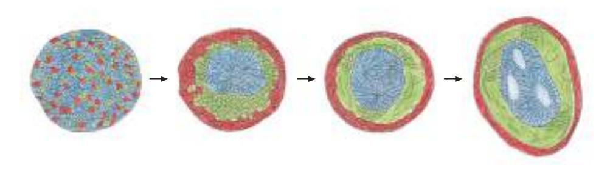

Figure 19–7 Sorting out. Cells from different layers of an early amphibian embryo will sort out according to their origins. In the classical experiment shown here, mesoderm cells *(green)*, neural plate cells *(blue)*, and epidermal cells *(red)* have been disaggregated and then reaggregated in a random mixture. They sort out into an arrangement reminiscent of a normal embryo, with a "neural tube" internally, epidermis externally, and mesoderm in between. (Modified from P.L. Townes and J. Holtfreter, *J. Exp. Zool.* 128:53–120, 1955. With permission from John Wiley & Sons.)

1110 Chapter 19: Cell Junctions and the Extracellular Matrix CELL–CELL JUNCTIONS 1111

cells

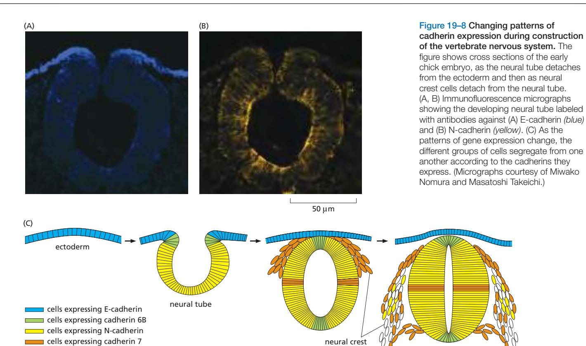

These experiments, together with numerous more recent experiments, reveal that selective cell–cell recognition systems make cells of the same differentiated tissue preferentially adhere to one another.

Cadherins play a crucial part in these cell-sorting processes. The appearance and disappearance of specific cadherins correlate with steps in embryonic development where cells regroup and change their contacts to create new tissue structures. In the vertebrate embryo, for example, changes in cadherin expression are seen when the neural tube forms and pinches off from the overlying ectoderm: neural tube cells lose E-cadherin and acquire other cadherins, including N-cadherin, while the cells in the overlying ectoderm continue to express E-cadherin (**Figure 19–8A and B**). Then, when the neural crest cells migrate away from the neural tube, these cadherins become scarcely detectable, and another cadherin (cadherin 7) appears that helps hold the migrating cells together as loosely associated cell groups (**Figure 19–8C**). Finally, when some of the neural crest cells aggregate to form a ganglion, they switch on expression of N-cadherin again. If N-cadherin is artificially overexpressed in the emerging neural crest cells, the cells fail to escape from the neural tube. MBoC7 m19.08/19.08

Studies with cultured cells further support the importance of homophilic cadherin binding in tissue segregation. In a line of cultured fibroblasts called *L cells*, for example, cadherins are not expressed and the cells do not adhere to one another. When these cells are transfected with DNA encoding E-cadherin, E-cadherins on one cell bind to E-cadherins on another, resulting in cell–cell adhesion. If L cells expressing different cadherins are mixed together, they sort out and aggregate separately, indicating that different cadherins preferentially bind to their own type (**Figure 19–9A**), mimicking what happens when cells derived from tissues that express different cadherins are mixed together. A similar segregation of cells occurs if L cells expressing different amounts of the same cadherin are mixed together (**Figure 19–9B**). It therefore seems likely that both qualitative and quantitative differences in the expression of cadherins have a role in organizing tissues.

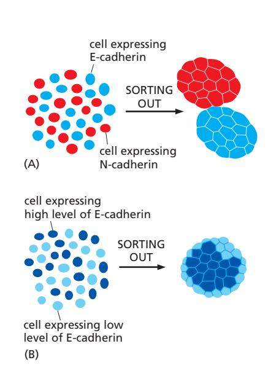

MBoC7 m19.09/19.09 Figure 19–9 Cadherin-dependent cell sorting. Cells in culture can sort themselves out according to the type and level of cadherins they express. This can be visualized by labeling different populations of cells with dyes of different colors. (A) Cells expressing N-cadherin sort out from cells expressing E-cadherin. (B) Cells expressing high levels of E-cadherin sort out from cells expressing low levels of E-cadherin. The cells expressing high levels adhere more strongly and congregate internally.

# Assembly of Strong Cell–Cell Adhesions Requires Changes in the Actin Cytoskeleton

In their mature form, adherens junctions are enormous protein complexes containing hundreds to thousands of cadherin molecules, packed into dense, regular arrays that are linked on the extracellular side by lateral interactions between cadherin domains (see Figure 19–6C). The assembly of these junctions over a large surface area is not simply a matter of adding more cadherins to an initial attachment site, but also requires changes in the underlying actin cytoskeleton. Most important, strong adhesion requires a decrease in *cortical tension* at the site of the adhesion.

Cortical tension in a cell is much like the surface tension of a water droplet. In water, binding between water molecules at the air–water interface pulls the surface inward, resulting in a spherical shape that resists disruption by other surfaces that do not interact with the water molecules (**Figure 19–10A**). Similarly, an unattached cell in suspension assumes a spherical shape because of cortical tension, which results from the contractile activity generated by bundles of actin and non-muscle myosin II at the cell cortex, just beneath the plasma membrane (**Figure 19–10B**). This cortical tension is so strong that when two cells initially interact through binding of cadherins on their surfaces, cortical tension prevents the spreading of the adhesion surface—and the cells interact at a single point.

Assembly of a large adhesion surface therefore depends on local reduction of cortical tension, which is achieved by inhibition of cortical actin–myosin fiber formation. These changes depend in part on two small GTPases called Rac and Rho. As we discussed in Chapter 16 (see Figure 16–75), signals generated by these GTPases govern local actin filament behavior: Rho generally promotes the formation of actin–myosin stress fibers at the cell cortex, while Rac inhibits the formation of these fibers and instead promotes branched actin networks. When two epithelial precursor cells first interact at a small cluster of cadherin linkages, the cadherins generate intracellular signals that promote local activation of Rac and inhibition of Rho. The result is disassembly of actin–myosin fibers and loss of local cortical tension—which then allows further cadherin recruitment to

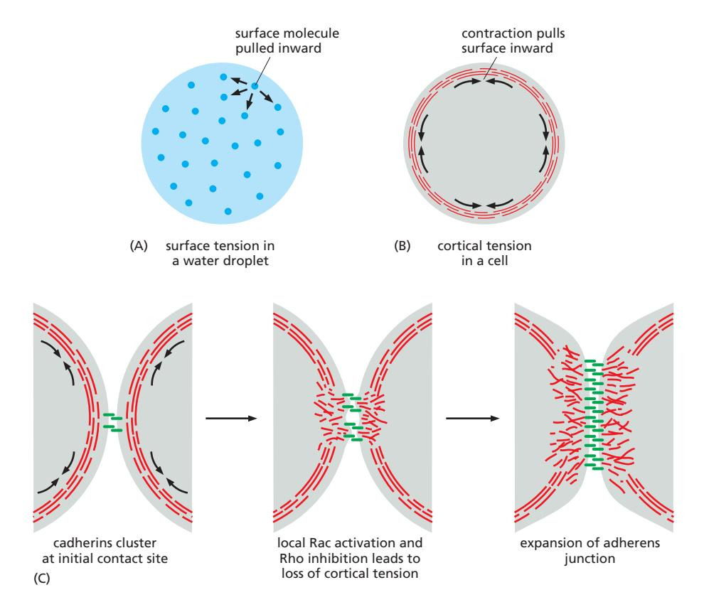

Figure 19–10 Local changes in cortical tension help promote the initial formation of an adherens junction.

(A) Surface tension of a water droplet results from binding among water molecules at the air–water interface, pulling the surface inward. (B) In an unattached cell, the contraction of actin–myosin bundles at the cell cortex *(red)* creates cortical tension, drawing the surface inward. (C) When two epithelial cell precursors first interact, small cadherin clusters *(green)* assemble at the contact site. Cortical tension prevents this initial interaction site from spreading. The cadherins generate local signals to inhibit the GTPase Rho and activate the GTPase Rac, leading to localized disassembly of actin–myosin fibers, loss of cortical tension, and formation of branched actin networks and cell protrusions––all of which allow the recruitment of more cadherins and the spreading of the cell–cell junction over a greater surface area. In the long term (not shown), the large adherens junction inhibits Rac and stimulates Rho, thereby promoting formation of local actin–myosin fibers that interact with the cadherins (see Figure 19–11).

1112 Chapter 19: Cell Junctions and the Extracellular Matrix CELL–CELL JUNCTIONS 1113

spread the adhesion to a larger surface area (**Figure 19–10C**). Rac activation has the added benefit of stimulating local actin protrusions from the cell, which also contributes to expansion of the junction. The implications of this mechanism are clear: the development of strong adhesions depends not only on the cell adhesion molecules themselves but also on the associated regulatory systems that govern actin behavior.

Eventually, after large numbers of cadherin molecules are aligned at a nascent adherens junction, Rac is inhibited and Rho is activated, which promotes the assembly of linear, contractile actin filament bundles that link the adherens junction to the actin cytoskeleton. These new linkages pull the junction inward, generating tension that stimulates further actin recruitment and expansion of the junction, as we describe in the next sections.

#### Catenins Link Classical Cadherins to the Actin Cytoskeleton

The extracellular domains of cadherins mediate homophilic binding at adherens junctions. The intracellular domains of typical cadherins, including all classical and some nonclassical ones, interact with filaments of the cytoskeleton: actin at adherens junctions and intermediate filaments at desmosomes (see Table 19–1). These cytoskeletal linkages are essential for efficient cell–cell adhesion, as cadherins that lack their cytoplasmic domains cannot stably hold cells together.

The linkage of cadherins to the cytoskeleton depends on adaptor proteins that assemble on the cytoplasmic tail of the cadherin. At adherens junctions, the cadherin tail binds two such proteins, *b-catenin* and a distant relative called *p120-catenin*; a third protein called *a-catenin* interacts with β-catenin and recruits other proteins to provide a dynamic linkage to actin filaments (**Figure 19–11**). At desmosomes, cadherins are linked to intermediate filaments through other adaptor proteins, including a β-catenin–related protein called *plakoglobin*, as we discuss later.

# Adherens Junctions Respond to Tension from Inside and Outside the Tissue

The protein complexes that mediate junctions either between cells or between cells and the extracellular matrix are dynamic machines that have the remarkable ability to sense mechanical stresses and generate biochemical signals that lead to an appropriate response. We call this *mechanotransduction*.

As we discussed in the previous sections, adherens junctions are linked through catenins to contractile bundles of actin and myosin II. These junctions are therefore subjected to pulling forces generated by the attached actin. The pulling forces are important for junction assembly and maintenance: inhibition of myosin activity, for example, results in the disassembly of many adherens junctions. Furthermore, the contractile forces acting on a junction in one cell are balanced by contractile forces at the junction of the neighboring cell, so that no cell pulls others toward it.

Adherens junctions sense the forces acting on them and modify local actin and myosin behavior to balance the forces on both sides of the junction. Evidence for these mechanisms comes from studies of pairs of cultured mammalian cells connected by adherens junctions. If contractile activity in one cell is increased experimentally, the adherens junctions linking the two cells increase in size, and the contractile activity of the second cell increases to match that of the first resulting in a balance of forces across the junction. These and other experiments reveal that adherens junctions are not simply passive sites of protein–protein binding but are tension sensors that regulate their behavior in response to changing mechanical conditions.

Mechanotransduction at cell–cell junctions is thought to depend, at least in part, on proteins in the cadherin complex that alter their shape when stretched by tension. The protein α-catenin, for example, is stretched from a folded to an extended conformation when contractile activity increases at the junction. The

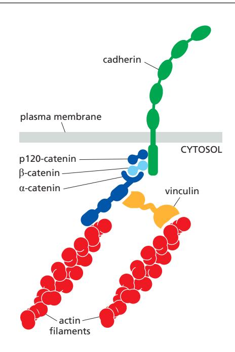

Figure 19–11 The linkage of classical cadherins to actin filaments. The cadherins are coupled indirectly to actin filaments through an adaptor protein complex containing p120-catenin, β-catenin, and α-catenin. Other proteins, including vinculin, associate with α-catenin and help provide the linkage to actin. β-Catenin has a second, and very important, function in intracellular signaling, as we discuss in Chapter 15 (see Figure 15–61). For clarity, this diagram does not show the cadherin of the adjacent cell in the junction. MBoC7 m19.10/19.11

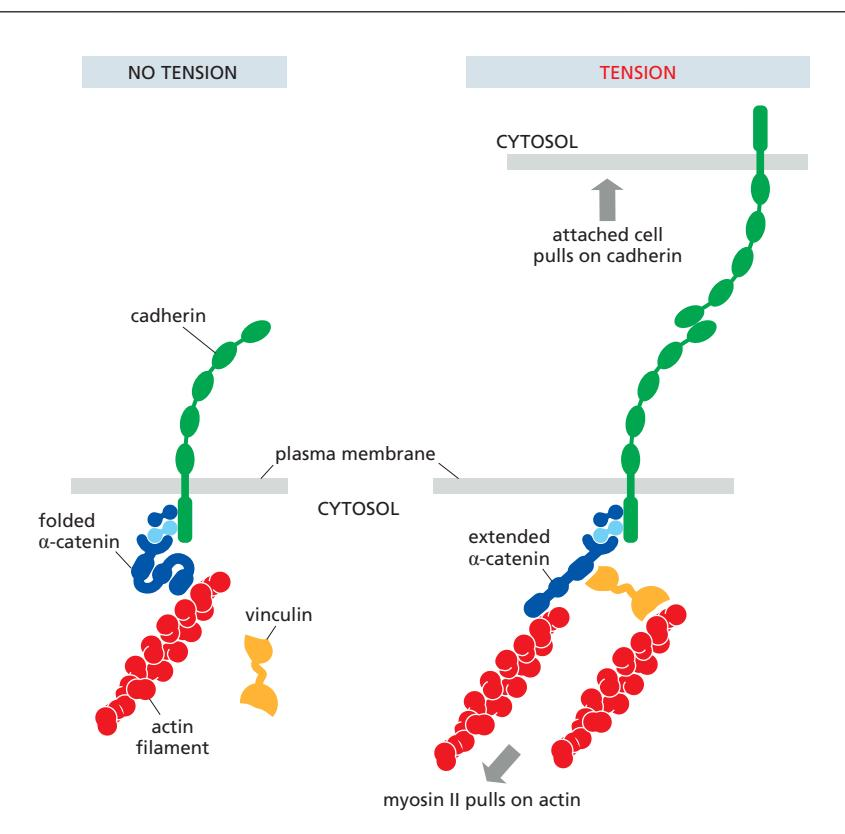

Figure 19–12 Mechanotransduction in an adherens junction. Cell–cell junctions are able to sense increased tension and respond by strengthening their actin linkages. When actin filaments are pulled from within the cell by non-muscle myosin II, the resulting force unfolds a domain in α-catenin, thereby exposing an otherwise hidden binding site for the adaptor protein vinculin. Vinculin then promotes additional actin recruitment, strengthening the linkages between the junction and the cytoskeleton.

unfolding exposes a cryptic binding site for another protein, vinculin, which promotes the recruitment of more actin to the junction (**Figure 19–12**). It is likely that these changes also lead to local regulation of the small GTPases that control actin and myosin behavior. By mechanisms such as this, pulling on a junction alters local actin behavior to make the junction stronger. Furthermore, as noted above, pulling on a junction in one cell will increase the contractile force generated in the attached cell.

Because all the cells in an epithelium are mechanically linked through their cell–cell junctions and cytoskeletons, mechanotransduction can also work over long distances. In the developing wing of *Drosophila*, for example, contraction of cells in the hinge of the wing results in mechanical stresses that spread throughout the wing, triggering changes in cell movement and orientation that are important for wing formation. It is likely that tension sensors throughout the tissue detect shifts in mechanical stress and trigger a molecular response. Because tension spreads quickly through all connected cells in a tissue, it provides an unusually rapid and effective signal for modifying cell behavior throughout the tissue. MBoC7 m19.12/19.12

## Tissue Remodeling Depends on the Coordination of Actin-mediated Contraction with Cell–Cell Adhesion

Adherens junctions are an essential part of the machinery for modeling the shapes of multicellular structures in the animal body. By indirectly linking the actin filaments in one cell to those in its neighbors, they enable the cells in the tissue to use their actin cytoskeletons in a coordinated way.

Adherens junctions occur in various forms. In many nonepithelial tissues, they appear as small punctate or linear attachments that connect the cortical actin filaments beneath the plasma membranes of two interacting cells. In heart muscle, they anchor the actin bundles of the contractile apparatus and act in parallel with desmosomes to link the contractile cells end-to-end. But the prototypical examples of adherens junctions occur in epithelia, where they often form a continuous **adhesion belt** (or *zonula adherens*) that encircles each of the cells 1114 Chapter 19: Cell Junctions and the Extracellular Matrix CELL–CELL JUNCTIONS 1115

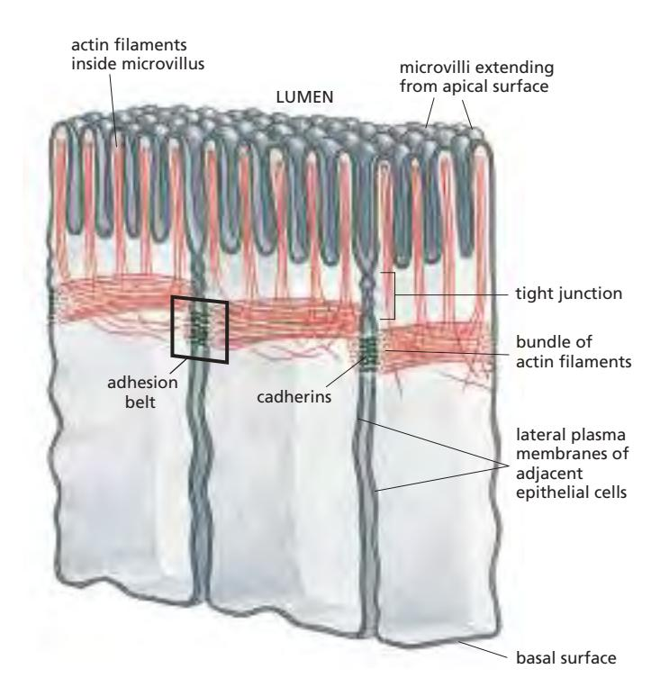

Figure 19–13 Adherens junctions between epithelial cells in the small intestine. These cells are specialized for absorption of nutrients; at their apical surfaces, facing the lumen of the gut, they have many microvilli (protrusions that increase the absorptive surface area). The adherens junction takes the form of an *adhesion belt*, encircling each of the interacting cells. Its most obvious feature is a contractile bundle of actin filaments running along the cytoplasmic surface of the junctional plasma membrane. The actin filament bundles are tethered by adaptor proteins to cadherins, which bind to cadherins on the adjacent cell. In this way, the actin filament bundles in adjacent cells are tied together. For clarity, this drawing does not show most of the other cell–cell and cell–matrix junctions of epithelial cells (see Figure 19–2).

just beneath the apical surface of the epithelium (**Figure 19–13**). Within each cell, a contractile bundle of actin filaments and myosin II lies adjacent to the adhesion belt, oriented parallel to the plasma membrane and tethered to it by the cadherins and their associated intracellular adaptor proteins. The actin–myosin bundles are thus linked, via the cadherins, into an extensive transcellular network. Coordinated contraction of this network provides the motile force for a fundamental process in animal morphogenesis—the folding of epithelial-cell sheets into tubes, spheres, and related structures (**Figure 19–14**). MBoC7 m19.13/19.13

In some forms of tissue remodeling, actin–myosin contractility is coordinated with major changes in local cell–cell adhesion patterns. An example can be found in cellular rearrangements that occur early in the development of the fruit fly *Drosophila melanogaster*. Soon after gastrulation, the outer epithelium of the

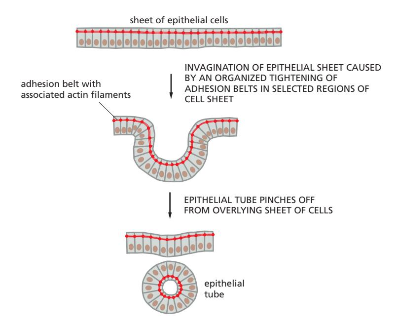

Figure 19–14 The folding of an epithelial sheet to form an epithelial tube. The oriented contraction of the bundles of actin and myosin filaments running along adhesion belts causes the epithelial cells to narrow at their apical surfaces, thereby helping the epithelial sheet to roll up into a tube. An example is the formation of the neural tube in early vertebrate development (see Figure 19–8).

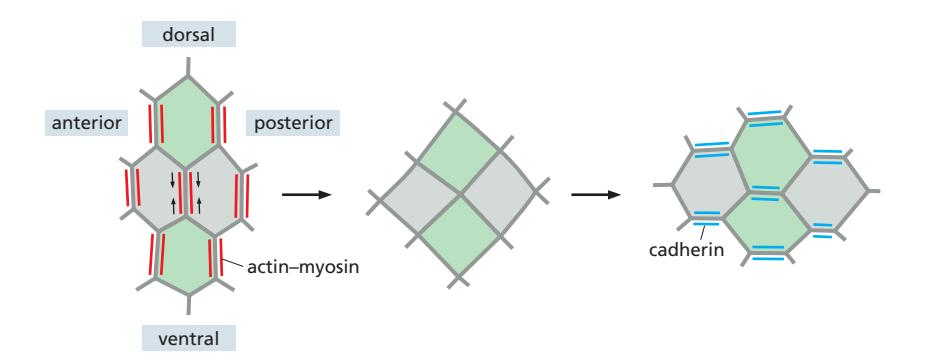

embryo is elongated by a process called *germ-band extension*, in which the cells converge inward along the dorsal–ventral axis and extend along the anterior– posterior axis. Actin-dependent contraction along dorsal–ventral cell boundaries is accompanied by a loss of specific adherens junctions to allow cells to insert themselves between other cells (a process called *intercalation*), resulting in a longer and narrower epithelium (**Figure 19–15**). We do not fully understand the mechanisms underlying the disassembly of adherens junctions along dorsal–ventral cell boundaries, but one possibility is that actin-based contractile forces pull sufficiently hard on the edges of cell–cell adhesions to peel them apart, particularly if contraction is coupled to additional regulatory mechanisms that weaken the adhesion. There is evidence, for example, that remodeling of these and other adhesions during development depends on removal of cadherins from the cell surface by clathrin-mediated endocytosis. MBoC7 m19.15/19.15

#### Desmosomes Give Epithelia Mechanical Strength

Desmosomes are structurally similar to adherens junctions but contain specialized cadherins that link to intermediate filaments instead of actin filaments. Their main function is to provide mechanical strength. Desmosomes are important in vertebrates but are not found, for example, in *Drosophila*. They are present in most mature vertebrate epithelia and are particularly plentiful in tissues that are subject to high levels of mechanical stress, such as heart muscle and the epidermis, the epithelium that forms the outer layer of the skin.

**Figure 19–16A** shows the general structure of a desmosome, and **Figure 19–16B**  shows some of the proteins that form it. Desmosomes typically appear as buttonlike spots of adhesion, riveting the cells together (**Figure 19–16C**). Inside the cell, the bundles of rope-like intermediate filaments that are anchored to the desmosomes form a structural framework of great tensile strength (**Figure 19–16D**), with linkage to similar bundles in adjacent cells, creating a network that extends throughout the tissue (**Figure 19–17**). The particular type of intermediate filaments attached to the desmosomes depends on the cell type: they are *keratin filaments* in most epithelial cells, for example, and *desmin filaments* in heart muscle cells.

The importance of desmosomes is demonstrated by some forms of the potentially fatal skin disease *pemphigus*. Affected individuals make antibodies against one of their own desmosomal cadherin proteins. These antibodies bind to and disrupt the desmosomes that hold their epidermal cells (keratinocytes) together. This results in a severe blistering of the skin, with leakage of body fluids into the loosened epithelium.

# Tight Junctions Form a Seal Between Cells and a Fence Between Plasma Membrane Domains

Sheets of epithelial cells enclose and partition the animal body, lining all its surfaces and cavities, and creating internal compartments where specialized processes occur. The epithelial sheet seems to be one of the inventions that lie at the origin of animal evolution, diversifying in a huge variety of ways but retaining an organization that is based on a set of conserved molecular mechanisms.

Figure 19–15 Remodeling of cell–cell adhesions in embryonic *Drosophila* epithelium. Depicted at *left* is a group of cells in the outer epithelium of a *Drosophila* embryo. During germ-band extension, cells converge toward each other *(middle)* on the dorsal–ventral axis and then extend *(right)* along the anterior–posterior axis. The result is intercalation: cells that were originally far apart along the dorsal–ventral axis *(green)* are inserted between the cells *(gray)* that separated them. These rearrangements depend on the spatial regulation of actin–myosin contractile bundles, which are localized primarily at the vertical cell boundaries *(red*, *left)*. Contraction of these bundles is accompanied by removal of E-cadherin (not shown) at the same cell boundaries, resulting in shrinkage and loss of adhesion along the vertical axis *(middle)*. New cadherin-based adhesions *(blue*, *right)* then form and expand along horizontal boundaries, resulting in extension of the cells in the anterior–posterior dimension.

CELL–CELL JUNCTIONS 1117

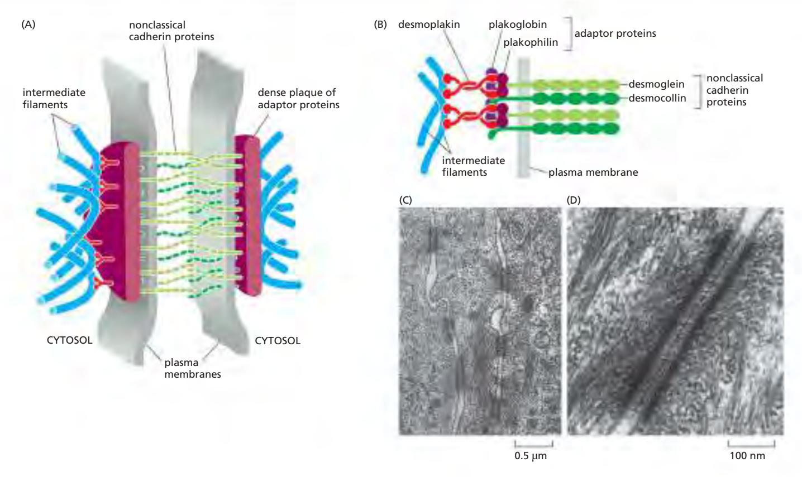

Figure 19–16 Desmosomes. (A) The structural components of a desmosome. On the cytoplasmic surface of each interacting plasma membrane is a dense plaque composed of a mixture of intracellular adaptor proteins. A bundle of intermediate filaments is attached to the surface of each plaque. Transmembrane nonclassical cadherins bind to the plaques and interact through their extracellular domains to hold the adjacent membranes together. (B) Some of the molecular components of a desmosome. Desmoglein and desmocollin are nonclassical cadherins. Their cytoplasmic tails bind plakoglobin (γ-catenin) and plakophilin (a distant relative of p120-catenin), which in turn bind to desmoplakin. Desmoplakin binds to the sides of intermediate filaments, thereby tying the desmosome to these filaments. (C) An electron micrograph of desmosome junctions between three epidermal cells in the skin of a baby mouse. (D) Part of the same tissue at higher magnification, showing a single desmosome, with intermediate filaments attached to it. (C and D, from W. He et al., Science 302:109–113, 2003. With permission from AAAS.)

Essentially all epithelia are anchored to other tissue on one side (the basal side) and free of such attachment on their opposite side (the apical side). A basal lamina lies at the interface with the underlying tissue, mediating the attachment, while the apical surface of the epithelium is generally bathed in extracellular fluid. Thus, as discussed in Chapter 16, all epithelia are structurally **polarized**, and so are their individual cells: the basal end of a cell, adherent to the basal lamina below, differs from the apical end, exposed to the medium above.

Correspondingly, all epithelia have at least one function in common: they serve as selective permeability barriers, separating the fluid that permeates the tissue on their basal side from fluid with a different chemical composition on their apical side. This barrier function requires that the adjacent cells be sealed together by **tight junctions**, so that molecules cannot leak freely across the cell sheet.

The epithelium of the small intestine provides a good illustration of tightjunction structure and function (see Figure 19–2). This epithelium has a *simple columnar* structure; that is, it consists of a single layer of tall (columnar) cells. These are of several differentiated types, but the majority are absorptive cells, specialized for uptake of nutrients from the internal cavity, or *lumen*, of the gut.

Figure 19–17 Desmosomes, hemidesmosomes, and the intermediate filament network. The keratin intermediate filament networks of adjacent cells—in this example, epithelial cells of the small intestine—are indirectly connected to one another through desmosomes, and to the basal lamina through hemidesmosomes.

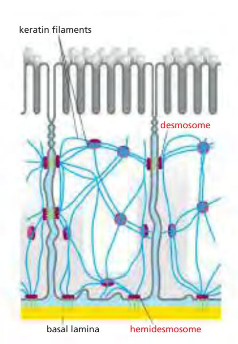

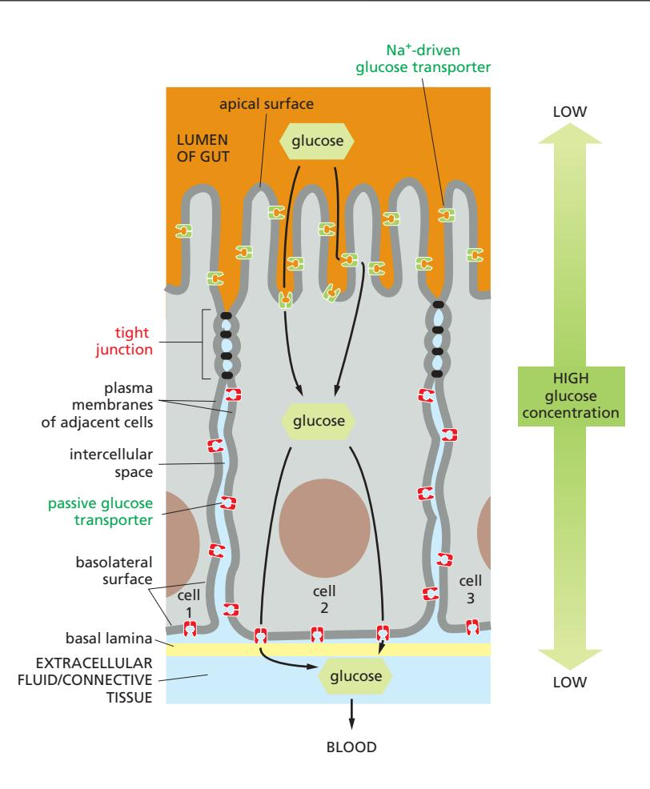

Figure 19–18 The role of tight junctions in transcellular transport. For clarity, only the tight junctions are shown. Transport proteins are confined to different regions of the plasma membrane in epithelial cells of the small intestine. This segregation results in the one-way transfer of nutrients across the epithelium from the gut lumen to the blood. In the example shown, glucose is actively transported into the cell by Na+-driven glucose transporters at its apical surface, and it leaves the cell through passive glucose transporters in its basolateral membrane. Tight junctions are thought to confine the transport proteins to their appropriate membrane domains by acting as diffusion barriers, or "fences," within the lipid bilayer of the plasma membrane; these junctions also block the backflow of glucose from the basal side of the epithelium into the gut lumen (see Movie 11.2).

The absorptive cells have to transport selected nutrients across the epithelium from the lumen into the extracellular fluid on the other side. From there, these nutrients diffuse into small blood vessels to provide nourishment to the organism. This *transcellular transport* depends on two sets of transport proteins in the plasma membrane of the absorptive cell. One set is confined to the apical surface of the cell (facing the lumen) and actively transports selected molecules into the cell from the gut. The other set is confined to the *basolateral* (basal and lateral) surfaces of the cell, and it allows the same molecules to leave the cell by passive transport into the extracellular fluid on the other side of the epithelium. For this transport activity to be effective, the spaces between the epithelial cells must be tightly sealed, so that the transported molecules cannot leak back into the gut lumen through these spaces (**Figure 19–18**). Moreover, the transport proteins must be correctly distributed in the plasma membranes: the apical transporters must be delivered to the apical membrane and must not be allowed to drift to the basolateral membrane, and the basolateral transporters must be delivered to and remain in the basolateral membrane. Tight junctions, besides sealing the gaps between the cells, also function as "fences" that help prevent apical or basolateral proteins from diffusing into the wrong region. MBoC7 m19.18/19.18

The sealing function of tight junctions is easy to demonstrate experimentally: a low-molecular-mass tracer added to one side of an epithelium will generally not pass beyond the tight junction (**Figure 19–19**). This seal is not absolute, however. Although all tight junctions are impermeable to macromolecules, their permeability to ions and other small molecules varies. Tight junctions in the epithelium lining the small intestine, for example, are 10,000 times more permeable to inorganic ions, such as Na+, than the tight junctions in the epithelium lining the urinary bladder. The movement of ions and other molecules between epithelial cells is called *paracellular transport*, and tissue-specific differences in transport rates generally result from differences in the proteins that form tight junctions.

1118 Chapter 19: Cell Junctions and the Extracellular Matrix CELL–CELL JUNCTIONS 1119

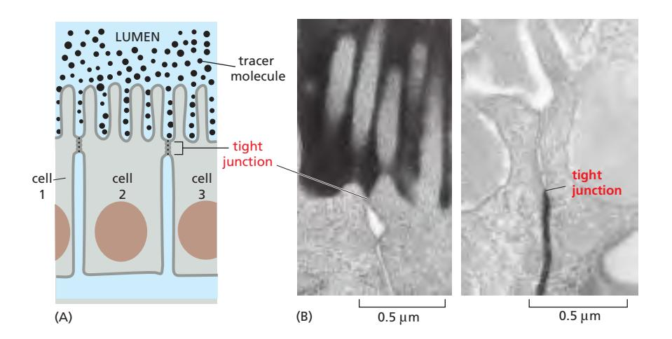

Figure 19–19 The role of tight junctions in allowing epithelia to serve as barriers to solute diffusion. (A) The drawing shows how a small extracellular tracer molecule added on one side of an epithelium is prevented from crossing the epithelium by the tight junctions that seal adjacent cells together. Adherens junctions and other cell junctions are not shown for clarity. (B) Electron micrographs of cells in an epithelium in which a small, extracellular, electron-dense tracer molecule has been added to either the apical side (on the *left*) or the basolateral side (on the *right*). The tight junction blocks passage of the tracer in both directions. (B, courtesy of Daniel Friend, by permission of E.L. Bearer.)

# Tight Junctions Contain Strands of Transmembrane Adhesion Proteins

When tight junctions are visualized by freeze-fracture electron microscopy, they are seen as a branching network of *sealing strands* that completely encircles the apical end of each cell in the epithelial sheet (**Figure 19–20A and B**). In conventional electron micrographs, the outer leaflets of the two interacting plasma membranes are tightly apposed where sealing strands are present (**Figure 19–20C**). Each sealing strand is composed of a long row of transmembrane homophilic adhesion proteins embedded in each of the two interacting plasma membranes. The extracellular domains of these proteins adhere directly to one another to occlude the intercellular space (**Figure 19–21**). MBoC7 m19.19/19.19

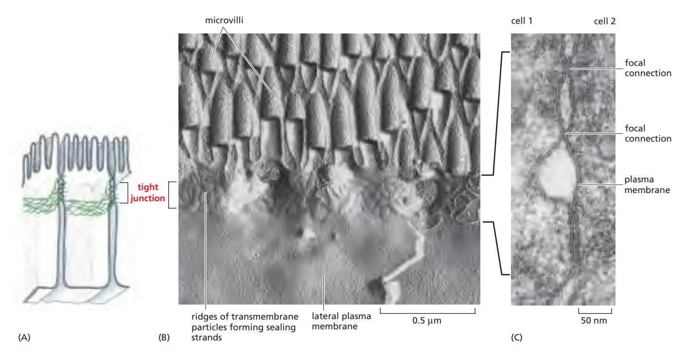

Figure 19–20 The structure of a tight junction between epithelial cells of the small intestine. The junctions are shown (A) schematically, (B) in a freeze-fracture electron micrograph, and (C) in a conventional electron micrograph. In B, the plane of the micrograph is parallel to the plane of the membrane, and the tight junction appears as a band of branching sealing strands that encircle each cell in the epithelium (see Figure 19–21A). In C, the junction is seen in cross section as a series of focal connections between the outer leaflets of the two interacting plasma membranes, each connection corresponding to a sealing strand in cross section. [B and C, from N.B. Gilula, in Cell Communication (R.P. Cox, ed.), pp. 1–29. New York: Wiley, 1974. With permission from John Wiley & Sons.]

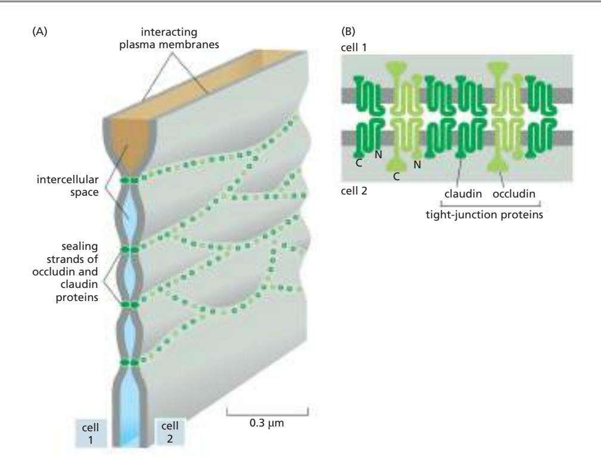

Figure 19–21 A model of a tight junction.

(A) The sealing strands hold adjacent plasma membranes together. The strands are composed of transmembrane proteins that make contact across the intercellular space and create a seal. (B) The molecular composition of a sealing strand. The major extracellular components of the tight junction are members of a family of proteins with four transmembrane domains. One of these proteins, claudin, is the most important for the assembly and structure of the sealing strands, whereas the related protein occludin governs junction permeability. The two termini of these proteins are both on the cytoplasmic side of the membrane, where they interact with large scaffolding proteins that organize the sealing strands and link the tight junction to the actin cytoskeleton (not shown here, but see Figure 19–22).

The main transmembrane proteins forming these strands are the *claudins*, which are essential for tight-junction formation and function. Mice that lack the *claudin-1* gene, for example, fail to make tight junctions between the cells in the epidermal layer of the skin; as a result, the baby mice lose water rapidly by evaporation through the skin and die within a day after birth. Conversely, if nonepithelial cells such as fibroblasts are artificially caused to express claudin genes, they will form tight-junctional connections with one another. Normal tight junctions also contain a second major transmembrane protein called *occludin*, which is not essential for the assembly or structure of the tight junction but is important for limiting junctional permeability. A third transmembrane protein, *tricellulin*, is required to seal cell membranes together and prevent transepithelial leakage at the points where three cells meet.

The claudin protein family has many members (24 in humans), and these are expressed in different combinations in different epithelia to confer particular permeability properties on the epithelial sheet. They are thought to form *paracellular pores*—selective channels allowing specific ions to cross the tight-junctional barrier, from one extracellular space to another. A specific claudin found in kidney epithelial cells, for example, is needed to let Mg2+ pass between the cells of the kidney tubules so that this ion can be resorbed from the urine into the blood. A mutation in the gene encoding this claudin results in excessive loss of Mg2+ in the urine.

#### Scaffold Proteins Organize Junctional Protein Complexes

Like the cadherin molecules of an adherens junction, the claudins and occludins of a tight junction interact with each other on their extracellular sides to promote junction assembly. Also as in adherens junctions, the organization of adhesion proteins in a tight junction depends on additional proteins that bind the cytoplasmic side of the adhesion proteins. The key organizational proteins at tight junctions are the *zonula occludens* (*ZO*) proteins. The three major members of the ZO family—ZO-1, ZO-2, and ZO-3—are large scaffold proteins that provide a structural support on which the tight junction is built. These intracellular molecules consist of strings of protein-binding domains, typically including several **PDZ domains** that can recognize and bind the C-terminal tails of specific partner proteins (**Figure 19–22**). One domain of these scaffold proteins can attach to 1120 Chapter 19: Cell Junctions and the Extracellular Matrix CELL–CELL JUNCTIONS 1121

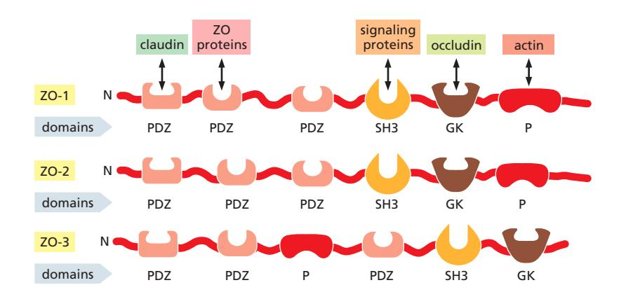

a claudin protein, while others can attach to occludin or the actin cytoskeleton. Moreover, one molecule of scaffold protein can bind to another. In this way, the cell assembles a meshwork of intracellular proteins that organizes and positions the sealing strands of the tight junction. MBoC7 m19.22/19.22

The tight-junctional network of sealing strands usually lies just apical to adherens and desmosome junctions that bond the cells together mechanically; the whole assembly is called a *junctional complex* (see Figure 19–2). The parts of this junctional complex depend on each other for their formation. For example, anti-cadherin antibodies that block the formation of adherens junctions also inhibit the formation of tight junctions.

#### Gap Junctions Couple Cells Both Electrically and Metabolically

Tight junctions block the passageways through the gaps between epithelial cells, preventing extracellular molecules from leaking from one side of an epithelium to the other. Another type of junctional structure has a radically different function: it bridges gaps between adjacent cells so as to create direct channels from the cytoplasm of one to that of the other. These channels are called **gap junctions**.

Gap junctions are present in most animal tissues, including connective tissues as well as epithelia and heart muscle. Each gap junction appears in conventional electron micrographs as a patch where the membranes of two adjacent cells are separated by a uniform narrow gap of about 2–4 nm (**Figure 19–23**). The gap is

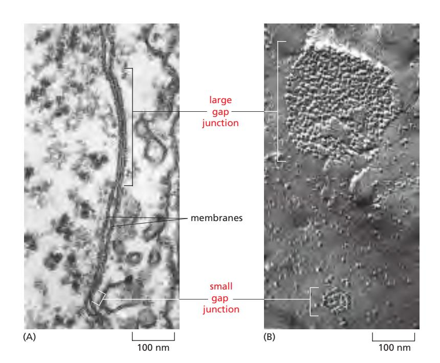

Figure 19–22 Scaffold proteins at the tight junction. The scaffold proteins ZO-1, ZO-2, and ZO-3 are concentrated beneath the plasma membrane at tight junctions. Each of the proteins contains multiple protein-binding domains, including three PDZ domains, an SH3 domain, a GK domain, and a proline-rich domain (P), linked together like beads on a flexible string. These domains enable the proteins to interact with each other and with numerous other partners, as indicated here by arrows, to generate a tightly woven protein network that organizes the sealing strands of the tight junction and links them to the actin cytoskeleton. Scaffold proteins with similar structure help organize other junctional complexes, including those at neural synapses.

Figure 19–23 Gap junctions as seen in the electron microscope. (A) Thinsection and (B) freeze-fracture electron micrographs of a large and a small gap-junction plaque between fibroblasts in culture. In B, each gap junction is seen as a cluster of homogeneous intramembrane particles. Each intramembrane particle corresponds to a connexon (see Figure 19–25). [From N.B. Gilula, in Cell Communication (R.P. Cox, ed.), pp. 1–29. New York: Wiley, 1974. With permission from John WIley and Sons.]

spanned by channel-forming proteins, of which there are two distinct families, called the *connexins* and the *innexins*. Connexins are the predominant gapjunction proteins in vertebrates, with 21 isoforms in humans. Innexins are found in the gap junctions of invertebrates.

Gap junctions have a pore size of about 1.4 nm, which allows the exchange of inorganic ions and other small water-soluble molecules, but not of macromolecules such as proteins or nucleic acids (**Figure 19–24**). An electric current injected into one cell through a microelectrode causes an electrical disturbance in the neighboring cell, due to the flow of ions carrying electric charge through gap junctions. This electrical coupling via gap junctions serves an obvious purpose in tissues containing electrically excitable cells: action potentials can spread rapidly from cell to cell, without the delay that occurs at chemical synapses. In vertebrates, for example, electrical coupling through gap junctions synchronizes the contractions of heart muscle cells as well as those of the smooth muscle cells responsible for the peristaltic movements of the intestine. Gap junctions also occur in many tissues whose cells are not electrically excitable. In principle, the sharing of small metabolites and ions provides a mechanism for coordinating the activities of individual cells in such tissues and for smoothing out random fluctuations in small-molecule concentrations in different cells.

# A Gap-Junction Connexon Is Made of Six Transmembrane Connexin Subunits

**Connexins** are four-pass transmembrane proteins, six of which assemble to form a *hemichannel*, or **connexon**. When the connexons in the plasma membranes of two cells in contact are aligned, they form a continuous aqueous channel that connects the two cell interiors (**Figure 19–25**). A gap junction consists of many such connexon pairs, forming a sort of molecular sieve. Not only does this sieve provide a communication channel between cells, but it also provides a form of cell–cell adhesion that supplements the cadherin- and claudin-mediated adhesions we discussed earlier.

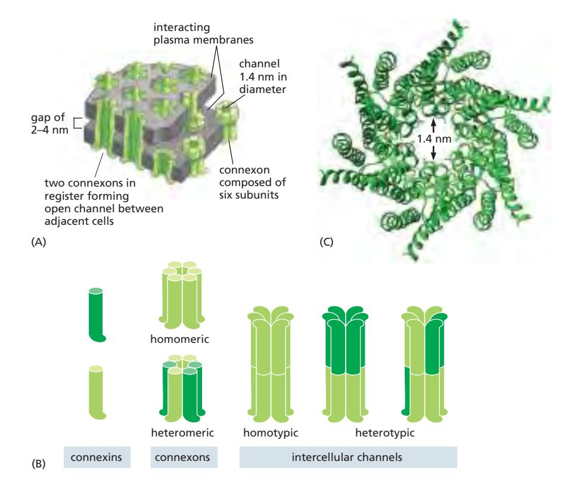

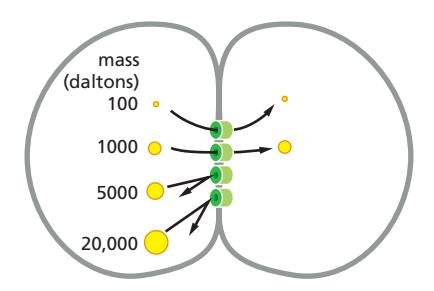

Figure 19–24 Determining the size of a gap-junction channel. When fluorescent molecules of various sizes are injected into one of two cells coupled by gap junctions, molecules with a mass of less than about 1000 daltons can pass into the other cell, but larger molecules cannot. Thus, the coupled cells share their small molecules (such as inorganic ions, sugars, amino acids, nucleotides, vitamins, and the intracellular signaling molecules cyclic AMP and inositol trisphosphate) but not their macromolecules (proteins, nucleic acids, and polysaccharides). MBoC7 m19.24/19.24

Figure 19–25 Gap junctions. (A) A drawing of the interacting plasma membranes of two adjacent cells connected by gap junctions. Each lipid bilayer is shown as a *gray* sheet. Protein assemblies called connexons *(green)*, each of which is formed by six connexin subunits, penetrate the apposed lipid bilayers. Two connexons join across the intercellular gap to form a continuous aqueous channel connecting the two cells. (B) The organization of connexins into connexons, and connexons into intercellular channels. The connexons can be homomeric or heteromeric, and the intercellular channels can be homotypic or heterotypic. (C) The highresolution structure of a homomeric gapjunction channel, determined by x-ray crystallography of human connexin 26. In this view, we are looking down on the pore, formed from six connexin subunits. The structure illustrates the general features of the channel and suggests a pore size of about 1.4 nm, as predicted from studies of gap-junction permeability with molecules of various sizes (see Figure 19–24). (PDB code: 2ZW3.)

1122 Chapter 19: Cell Junctions and the Extracellular Matrix CELL–CELL JUNCTIONS 1123

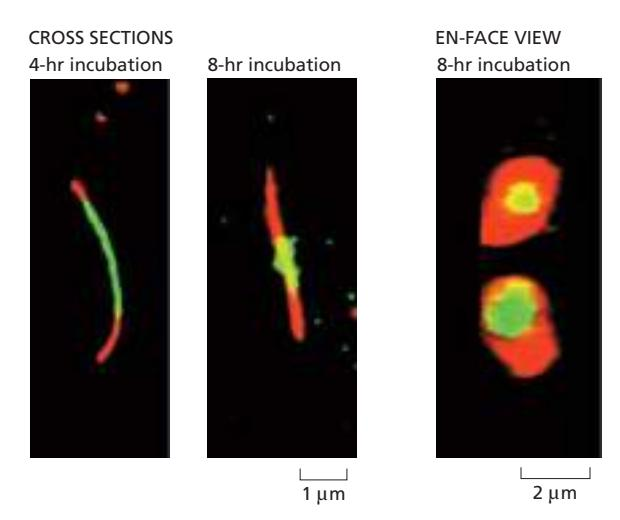

Gap junctions in different tissues can have different properties because they are formed from different combinations of connexins, creating channels that differ in permeability and regulation. Most cell types express more than one type of connexin, and two different connexin proteins can assemble into a heteromeric connexon, with its own distinct properties. Moreover, adjacent cells expressing different connexins can form intercellular channels in which the two aligned half-channels are different (see Figure 19–25B).

Like conventional ion channels (discussed in Chapter 11), individual gapjunction channels do not remain open all the time; instead, they flip between open and closed states. These changes are triggered by a variety of stimuli, including the voltage difference between the two connected cells, the membrane potential of each cell, and various chemical properties of the cytoplasm, including the pH and concentration of free Ca2+. Some subtypes of gap junctions can also be regulated by extracellular signals such as neurotransmitters. We are only just beginning to understand the physiological functions and structural basis of these various gating mechanisms. MBoC7 m19.26/19.26

Each gap-junctional plaque is a dynamic structure that can readily assemble, disassemble, or be remodeled, and it can contain a cluster of a few to many thousands of connexons (see Figure 19–23B). Studies with fluorescently labeled connexins in living cells show that new connexons are continually added around the periphery of an existing junctional plaque, while old connexons are removed from the middle of it and destroyed (**Figure 19–26**). This turnover is rapid: the connexin molecules have a half-life of only a few hours.

The mechanism of removal of old connexons from the middle of the plaque is not known, but the route of delivery of new connexons to its periphery seems clear: they are inserted into the plasma membrane by exocytosis, like other integral membrane proteins, and then diffuse in the plane of the membrane until they bump into the periphery of a connexon plaque and become trapped. This has a corollary: the plasma membrane away from the gap junction should contain connexons—hemichannels—that have not yet paired with their counterparts on another cell. It is thought that these unpaired hemichannels are normally held in a closed conformation, preventing the cell from losing its small molecules by leakage through them. But there is also evidence that in some circumstances they can open and serve as channels for the release of small signal molecules.

# In Plants, Plasmodesmata Perform Many of the Same Functions as Gap Junctions

The tissues of a plant are organized on different principles from those of an animal. Plant cells are imprisoned within tough *cell walls* composed of an extracellular matrix rich in cellulose and other polysaccharides, as we discuss later.

Figure 19–26 Connexin turnover at a gap junction. Cells were transfected with a slightly modified connexin gene, coding for a connexin with a short amino acid tag containing four cysteines in the sequence Cys-Cys-X-X-Cys-Cys (where X denotes an arbitrary amino acid). This *tetracysteine tag* can bind strongly to certain small fluorescent dye molecules, which can be added to the culture medium and will readily enter cells by diffusing across the plasma membrane. In the experiment shown, a green dye was added first to label all the connexin molecules in the cells, and the cells were then washed and incubated for 4 or 8 hours. At the end of this time, a red dye was added to the medium and the cells were washed again and fixed. Connexin molecules already present at the beginning of the experiment are labeled green (and take up no red dye because their tetracysteine tags are already saturated with green dye), while connexins synthesized subsequently, during the 4- or 8-hour incubation, are labeled red. The fluorescence images show gap junctions between pairs of cells treated in this way. The central part of the gap-junction plaque is *green*, indicating that it consists of old connexin molecules, while the periphery is *red*, indicating that it consists of connexins synthesized during the previous 4 or 8 hours. The longer the time of incubation, the smaller the green central patch of old molecules, and the larger the peripheral ring of new molecules that have been recruited to replace the old ones. (From G. Gaietta et al., *Science* 296:503–507, 2002. With permission from AAAS.)

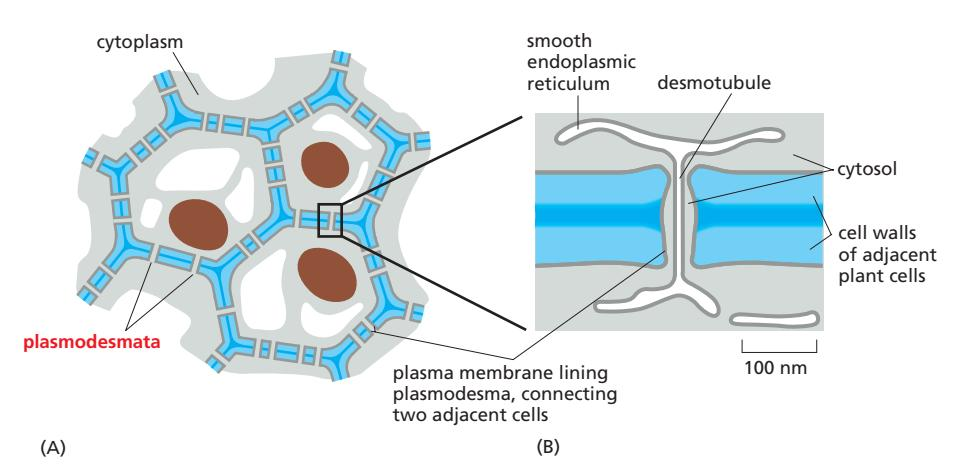

Figure 19–27 Plasmodesmata. (A) The cytoplasmic channels of plasmodesmata pierce the plant cell wall and connect cells in a plant together. (B) Each plasmodesma is lined with plasma membrane that is common to the two connected cells. It usually also contains a fine tubular structure, the desmotubule, derived from smooth endoplasmic reticulum. (C) Electron micrograph of a longitudinal section of a plasmodesma from a water fern. The plasma membrane lines the pore and is continuous from one cell to the next. Endoplasmic reticulum and its association with the central desmotubule can also be seen. (D) A similar plasmodesma seen in cross section. (C and D, from R. Overall et al., *Protoplasma* 111:134–150, 1982.)

The cell walls of adjacent cells are firmly cemented to one another, which eliminates the need for anchoring junctions to hold the cells in place. But a need for direct cell–cell communication remains. Thus, plant cells have only one class of intercellular junctions, **plasmodesmata**. Like gap junctions, they directly connect the cytoplasms of adjacent cells.

In plants, the cell wall between a typical pair of adjacent cells is at least 0.1 μm thick, and so a structure very different from a gap junction is required to mediate communication across it. Plasmodesmata solve the problem. With a few specialized exceptions, every cell in a higher plant is connected to its neighbors by these structures, which form fine cytoplasmic channels through the intervening cell walls. As shown in **Figure 19–27A**, the plasma membrane of one cell is continuous with that of its neighbor at each plasmodesma, which connects the cytoplasms of the two cells by a roughly cylindrical channel with a diameter of 20–40 nm. MBoC6 e20.31/19.27

Running through the center of the channel in most plasmodesmata is a narrower cylindrical structure, the *desmotubule*, which is continuous with elements of the smooth endoplasmic reticulum (ER) in each of the connected cells (**Figure 19–27B, C, and D**). Between the outside of the desmotubule and the inner face of the cylindrical channel formed by plasma membrane is an annulus of cytosol through which small molecules can pass from cell to cell. As each new cell wall is assembled during the cytokinesis phase of cell division, plasmodesmata are created within it. They form around elements of smooth ER that become trapped across the developing cell plate (discussed in Chapter 17). They can also be inserted *de novo* through preexisting cell walls, where they are commonly found in dense clusters called *pit fields.* When no longer required, plasmodesmata can be removed.

In spite of the radical difference in structure between plasmodesmata and gap junctions, they seem to function in remarkably similar ways. Evidence obtained by injecting tracer molecules of different sizes suggests that plasmodesmata allow the passage of molecules with a mass of less than about 800 daltons, which is similar to the size cutoff for gap junctions. As with gap junctions, transport through plasmodesmata is regulated. Dye-injection experiments, for example, show that there can be barriers to the movement of even low-molecular-mass molecules between certain cells or groups of cells that are connected by apparently normal plasmodesmata; the mechanisms that restrict communication in these cases are not understood.

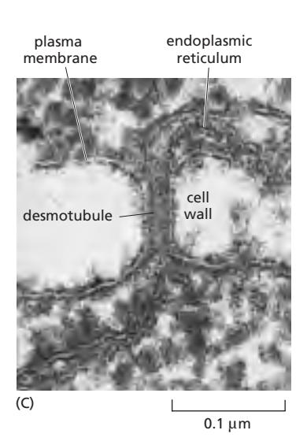

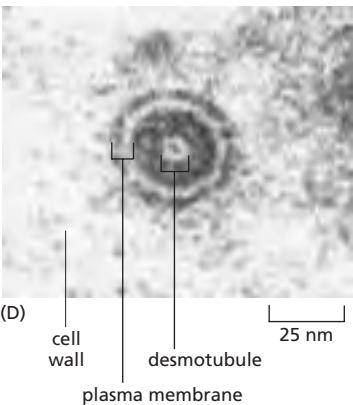

1124 Chapter 19: Cell Junctions and the Extracellular Matrix CELL–CELL JUNCTIONS 1125

# Selectins Mediate Transient Cell–Cell Adhesions in the Bloodstream

We now complete our overview of cell–cell junctions and adhesion by briefly describing some of the more specialized adhesion mechanisms used in some tissues. In addition to those we have already discussed, at least three other superfamilies of cell–cell adhesion proteins are important: the *integrins*, the *selectins*, and the adhesive *immunoglobulin* (*Ig*) *superfamily* members. We shall discuss integrins in more detail later: their main function is in cell–matrix adhesion, but a few of them mediate cell–cell adhesion in specialized circumstances. Ca2+ dependence provides one simple way to distinguish among these classes of adhesion proteins experimentally. Selectins, like cadherins and integrins, require Ca2+ for their adhesive function; Ig superfamily members do not.

**Selectins** are cell-surface carbohydrate-binding proteins (*lectins*) that mediate a variety of transient cell–cell adhesion interactions in the bloodstream. Their main role, in vertebrates at least, is in governing the traffic of white blood cells into lymphoid organs and inflamed tissues. White blood cells lead a nomadic life, roving between the bloodstream and the tissues, and this necessitates special adhesive behavior. The selectins control the binding of white blood cells to the endothelial cells lining blood vessels, thereby enabling the blood cells to migrate out of the bloodstream into a tissue.

Each selectin is a transmembrane protein with a conserved lectin domain that binds to a specific oligosaccharide on another cell (**Figure 19–28A**). There are at least three types: *L-selectin* on white blood cells, *P-selectin* on blood platelets and on endothelial cells that have been locally activated by an inflammatory response, and *E-selectin* on endothelial cells later in the inflammatory response. In a lymphoid organ, such as a lymph node or the spleen, the endothelial cells express oligosaccharides that are recognized by L-selectin on lymphocytes, causing the lymphocytes to loiter and become trapped. At sites of inflammation, the roles are reversed: the endothelial cells switch on expression of selectins that recognize the oligosaccharides on white blood cells and platelets, flagging the cells down to help deal with the local emergency. Selectins do not act alone, however; they collaborate with integrins, which strengthen the binding of the blood cells to the endothelium. The cell–cell adhesions mediated by both selectins and integrins are *heterophilic*; that is, the binding is to a molecule of a different type. Selectins bind to specific oligosaccharides on glycoproteins and glycolipids, while integrins bind to specific Ig-family proteins.

Selectins and integrins act in sequence to let white blood cells leave the bloodstream and enter tissues (**Figure 19–28B**). The selectins mediate a weak adhesion because the binding of the lectin domain of the selectin to its carbohydrate ligand

Figure 19–28 The structure and function of selectins. (A) Diagram of P-selectin, which attaches to the actin cytoskeleton through adaptor proteins. (B) How selectins and integrins mediate the cell–cell adhesions required for a white blood cell to migrate out of the bloodstream into a tissue. Selectins on endothelial cells bind weakly to oligosaccharides on the white blood cell, so that it becomes loosely attached and rolls along the vessel wall. The white blood cell then activates a cellsurface integrin called LFA1, which binds to a protein called ICAM1 (belonging to the Ig superfamily) on the membrane of the endothelial cell. The white blood cell adheres to the vessel wall and then crawls out of the vessel (Movie 19.2).

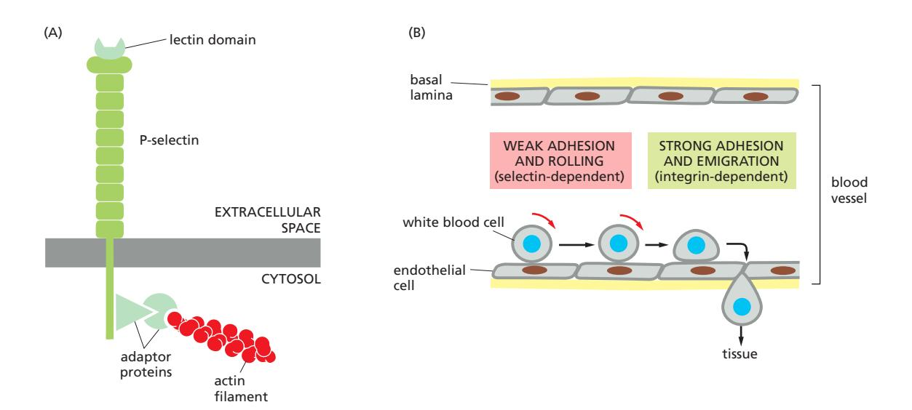

is of low affinity. This allows the white blood cell to adhere weakly and reversibly to the endothelium, rolling along the surface of the blood vessel, propelled by the flow of blood. The rolling continues until the blood cell activates its integrins. As we discuss later, these transmembrane molecules can be switched into an adhesive conformation that enables them to latch onto specific macromolecules external to the cell—in the present case, proteins on the surfaces of the endothelial cells. Once it has attached in this way, the white blood cell escapes from the bloodstream into the tissue by crawling out of the blood vessel between adjacent endothelial cells.

## Members of the Immunoglobulin Superfamily Mediate Ca2+-independent Cell–Cell Adhesion

The chief endothelial-cell proteins that are recognized by the white blood cell integrins are called *ICAMs* (*intercellular cell adhesion molecules*) or *VCAMs* (*vascular cell adhesion molecules*)*.* They are members of another large and ancient family of cell-surface molecules—the **immunoglobulin (Ig) superfamily**. These contain one or more extracellular Ig-like domains that are characteristic of antibody molecules. They have many functions outside the immune system that are unrelated to immune defenses.

While ICAMs and VCAMs on endothelial cells both mediate heterophilic binding to integrins, many other Ig superfamily members appear to mediate homophilic binding. An example is the *neural cell adhesion molecule* (*NCAM*), which is expressed by various cell types, including most nerve cells (**Figure 19–29**). NCAM can take different forms, generated by alternative splicing of an RNA transcript produced from a single gene. Some forms of NCAM carry an unusually large quantity of sialic acid (with chains containing hundreds of repeating sialic acid units). By virtue of their negative charge, the long polysialic acid chains can interfere with cell adhesion (because like charges repel one another); thus, these forms of NCAM can serve to inhibit adhesion rather than cause it.

Another group of Ig superfamily members, the *nectins*, collaborates with cadherins to help build and strengthen adherens junctions in many tissues. Members of the nectin family contain three Ig-like domains (see Figure 19–29) and interact with other nectins, sometimes with the same family member (homophilic) and sometimes with a different family member (heterophilic). Their short intracellular tail binds to an adaptor protein that links the nectin to the actin cytoskeleton and to cadherin at adherens junctions. Nectins help set up cell–cell interactions during embryonic development. In auditory and olfactory epithelia, for example, sensory cells are distributed as single cells in a field of larger support cells. The distribution of these cell types in the epithelium depends on specific interactions

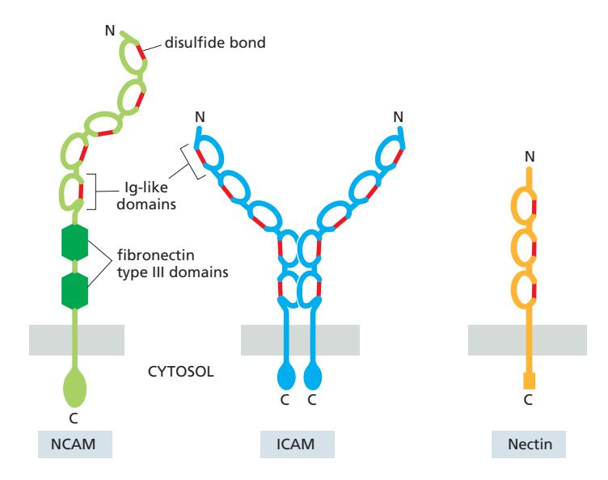

Figure 19–29 Members of the Ig superfamily of cell–cell adhesion molecules. NCAM is expressed on neurons and many other cell types, and it mediates homophilic binding. ICAM is expressed on endothelial cells and some other cell types and binds heterophilically to an integrin on white blood cells. Nectin is expressed in many cell types and is often found at adherens junctions, where it interacts with cadherins to help establish and strengthen specific cell–cell interactions during tissue formation.

between nectin family members on the surfaces of the sensory and support cells. The formation of these epithelia is defective when nectin expression is experimentally reduced.

A cell of a given type generally uses an assortment of different adhesion proteins to interact with other cells, just as each cell uses an assortment of different receptors to respond to the many soluble extracellular signal molecules in its environment. Although cadherins and Ig superfamily members are frequently expressed on the same cells, the adhesions mediated by cadherins are much stronger, and they are largely responsible for holding cells together, segregating cell collectives into discrete tissues, and maintaining tissue integrity. Members of the Ig superfamily seem to contribute more to the fine-tuning of these adhesive interactions during development and regeneration, playing a part in various specialized adhesive phenomena, such as that discussed for blood cells and specialized epithelia. Thus, while mutant mice that lack N-cadherin die early in development, those that lack Ig superfamily members develop relatively normally but show moderate abnormalities in the development of certain tissues.

#### Summary

*In epithelia, as well as in some other tissues, cells are directly attached to one another through strong cell–cell adhesions, mediated by transmembrane proteins called cadherins, which are anchored intracellularly to the cytoskeleton. Cadherins generally bind to one another homophilically: the head of one cadherin molecule binds to the head of a similar cadherin on an opposite cell. This selectivity enables mixed populations of cells of different types to sort out from one another according to the specific cadherins they express, and it helps to control cell rearrangements during development.* 

*The "classical" cadherins at adherens junctions are linked to the actin cytoskeleton by intracellular adaptor proteins called catenins. These form an anchoring complex on the intracellular tail of the cadherin molecule and are involved not only in physical anchorage but also in the detection of and response to tension and other regulatory signals at the junction.* 

*Tight junctions seal the gaps between cells in epithelia, creating a barrier to the diffusion of molecules across the cell sheet and also helping to separate the populations of proteins in the apical and basolateral plasma membrane domains of the epithelial cell. Claudins are the major transmembrane proteins forming tight junctions. Intracellular scaffold proteins organize the claudins and other junctional proteins into a complex protein network that is linked to the actin cytoskeleton.* 

*The cells of many animal tissues are coupled by gap junctions, which take the form of plaques of clustered connexons, which usually allow molecules smaller than about 1000 daltons to pass directly from the inside of one cell to the inside of the next. Cells connected by gap junctions share many of their inorganic ions and other small molecules and are therefore chemically and electrically coupled.* 

*Three additional classes of transmembrane adhesion proteins mediate more transient cell–cell adhesion: selectins, immunoglobulin (Ig) superfamily members, and integrins. Selectins are expressed on white blood cells, blood platelets, and endothelial cells; they bind heterophilically to carbohydrate groups on cell surfaces, helping to mediate the adhesive interactions between these cells. Ig superfamily proteins also play a part in these interactions, as well as in many other adhesive processes; some of them bind homophilically, some heterophilically. Integrins, though they mainly serve to attach cells to the extracellular matrix, can also mediate cell–cell adhesion by binding to specific Ig superfamily proteins.*

# THE EXTRACELLULAR MATRIX OF ANIMALS

Tissues are not made up solely of cells. They also contain a remarkably complex and intricate network of macromolecules constituting the *extracellular matrix*. This matrix is composed of many different proteins and polysaccharides that are

Figure 19–30 Fibroblasts in connective tissue. This scanning electron micrograph shows tissue from the cornea of a rat. The extracellular matrix surrounding the fibroblasts is here composed largely of collagen fibrils. The glycoproteins, hyaluronan, and proteoglycans, which normally form a hydrated gel filling the interstices of the fibrous network, have been removed by enzyme and acid treatment. (Courtesy of T. Nishida.)

secreted locally and assembled into an organized meshwork in close association with the surfaces of the cells that produce them.

The classes of macromolecules constituting the extracellular matrix in different animal tissues are broadly similar, but variations in the relative amounts of these different classes of molecules and in the ways in which they are organized give rise to an amazing diversity of materials. The matrix can become calcified to form the rock-hard structures of bone or teeth, or it can form the transparent substance of the cornea, or it can adopt the rope-like organization that gives tendons their enormous tensile strength. It forms the jelly in a jellyfish. Covering the body of a beetle or a lobster, it forms a rigid carapace. Moreover, the extracellular matrix is more than a passive scaffold to provide physical support. It has an active and complex role in regulating the behavior of the cells that touch it, inhabit it, or crawl through its meshes, influencing their survival, development, migration, proliferation, shape, and function.

In this section, we describe the major features of the extracellular matrix in animal tissues, with an emphasis on vertebrates. We begin with an overview of the major classes of macromolecules in the matrix, after which we turn to the structure and function of the *basal lamina*, the thin layer of specialized extracellular matrix that lies beneath all epithelial cells. In the next section, we then describe the varied types of junctions that connect cells to the matrix.

# The Extracellular Matrix Is Made and Oriented by the Cells Within It

The macromolecules that constitute the extracellular matrix are mainly produced locally by cells in the matrix. These cells also help to organize the matrix: the orientation of the cytoskeleton inside the cell can control the orientation of the matrix produced outside. In most connective tissues, the matrix macromolecules are secreted by cells called **fibroblasts** (**Figure 19–30**). In certain specialized types of connective tissues, such as cartilage and bone, however, they are secreted by cells of the fibroblast family that have more specific names: *chondrocytes*, for example, form cartilage, and *osteoblasts* form bone.

The extracellular matrix is constructed from three major classes of macromolecules: (1) *glycosaminoglycans* (*GAGs*), which are large and highly charged polysaccharides that are usually covalently linked to protein in the form of *proteoglycans*; (2) fibrous proteins, which are primarily members of the *collagen* family; and (3) a large class of noncollagen *glycoproteins*, which carry conventional asparagine-linked oligosaccharides (described in Chapter 12). All three classes of macromolecule have many members and come in a great variety of shapes and sizes (**Figure 19–31**). Mammals are thought to have almost 300 matrix proteins, including about 36 proteoglycans, about 40 collagens, and more than 200 glycoproteins, which usually contain multiple subdomains and self-associate to form multimers. Add to this the large number of matrix-associated proteins and enzymes that can modify matrix behavior by cross-linking, degradation, or other mechanisms, and one begins to see that the matrix is an almost infinitely variable material. Each tissue contains its own unique blend of matrix components, resulting in an extracellular matrix that is specialized for the needs of that tissue.

The proteoglycan molecules in connective tissue typically form a highly hydrated, gel-like "ground substance" in which collagens and glycoproteins are embedded. The polysaccharide gel resists compressive forces on the matrix while permitting the rapid diffusion of nutrients, metabolites, and hormones between the blood and the tissue cells. The collagen fibers strengthen and help organize

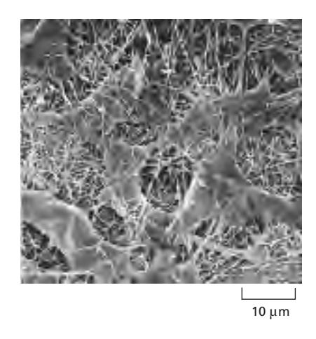

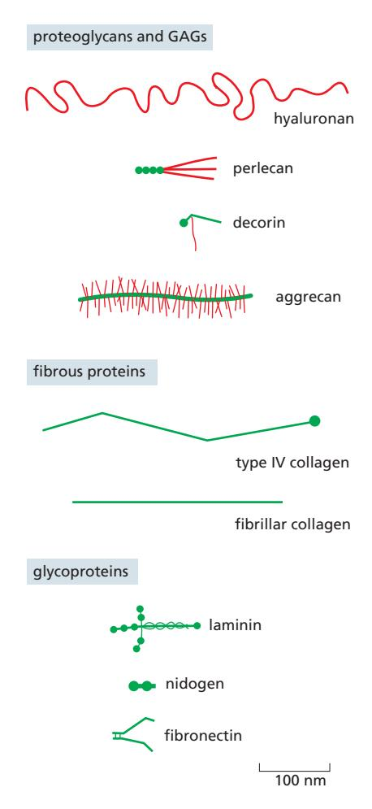

Figure 19–31 The comparative shapes and sizes of some of the major extracellular matrix macromolecules. Protein is shown in *green*, and glycosaminoglycan (GAG) in *red.*

OH O COO OH OSO3 NHSO3 O O CH2OSO3 O OH O COO OH OSO3 NHSO3 O O CH2OSO3 repeating disaccharide sulfated *N*-acetylglucosamine sulfated iduronic acid

the matrix, while other fibrous proteins, such as the rubberlike *elastin*, give it resilience. Finally, the many matrix glycoproteins help cells migrate, settle, and differentiate in the appropriate locations. MBoC7 m19.32/19.32

## Glycosaminoglycan (GAG) Chains Occupy Large Amounts of Space and Form Hydrated Gels

**Glycosaminoglycans (GAGs)** are unbranched polysaccharide chains composed of repeating disaccharide units. One of the two sugars in the repeating disaccharide is always an amino sugar (*N*-acetylglucosamine or *N*-acetylgalactosamine), which in most cases is sulfated. The second sugar is usually a uronic acid (glucuronic or iduronic). Because there are sulfate or carboxyl groups on most of their sugars, GAGs are highly negatively charged (**Figure 19–32**). Indeed, they are the most anionic molecules produced by animal cells. Four main groups of GAGs are distinguished by their sugars, the type of linkage between the sugars, and the number and location of sulfate groups: (1) *hyaluronan*, (2) *chondroitin sulfate* and *dermatan sulfate*, (3) *heparin* and *heparan sulfate*, and (4) *keratan sulfate*.

Polysaccharide chains are too stiff to fold into compact globular structures, and they are strongly hydrophilic. Thus, GAGs tend to adopt highly extended conformations that occupy a huge volume relative to their mass (**Figure 19–33**), and they form hydrated gels even at very low concentrations. The weight of GAGs in connective tissue is usually less than 10% of the weight of proteins, but GAG chains fill most of the extracellular space. Their high density of negative charges attracts a cloud of cations, especially Na+, that are osmotically active, causing large amounts of water to be sucked into the matrix. This creates a swelling pressure, or turgor, that enables the matrix to withstand compressive forces (in contrast to collagen fibrils, which resist stretching forces). The cartilage matrix that lines the knee joint, for example, can support pressures of hundreds of atmospheres in this way.

Defects in the production of GAGs can affect many different body systems. In one rare human genetic disease, for example, there is a severe deficiency in the synthesis of dermatan sulfate disaccharide. The affected individuals have a short stature, a prematurely aged appearance, and generalized defects in their skin, joints, muscles, and bones.

### Hyaluronan Acts as a Space Filler During Tissue Morphogenesis and Repair

**Hyaluronan** (also called *hyaluronic acid* or *hyaluronate*) is the simplest of the GAGs (**Figure 19–34**). It consists of a regular repeating sequence of up to 25,000 disaccharide units, is found in variable amounts in all tissues and fluids in adult animals, and is especially abundant in early embryos. Hyaluronan is not a typical GAG because it contains no sulfated sugars, all its disaccharide units are identical, its chain length is enormous, and it is not generally linked covalently to any core protein. Moreover, whereas other GAGs are synthesized inside the cell and released by exocytosis, hyaluronan is spun out directly from the cell surface by an enzyme complex embedded in the plasma membrane.

#### Figure 19–32 The repeating disaccharide sequence of a heparin glycosaminoglycan (GAG) chain.

These chains can consist of as many as 75 disaccharide units but are typically less than half that size. There is a high density of negative charges along the chain because of the presence of both carboxyl and sulfate groups; indeed, heparin is the most densely charged biological molecule known. The most common form of heparin carries three sulfate groups in each disaccharide, as shown here. *In vivo*, the proportion of sulfated and nonsulfated groups is highly variable. Heparin has an average of about 2.7 sulfates per disaccharide. Heparan sulfate is a closely related GAG that is generally about twice the length of heparin and less charged, with an average of about 1 sulfate per disaccharide.

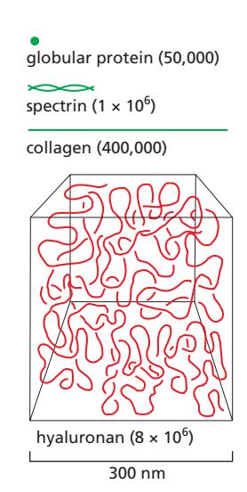

Figure 19–33 The relative dimensions and volumes occupied by various macromolecules. Several proteins and a single hydrated molecule of hyaluronan are shown, with molecular mass in daltons.

O CH2OH NHCOCH3 OH OH HO O O O COO repeating disaccharide *N*-acetylglucosamine glucuronic acid O CH2OH NHCOCH3 OH OH HO O O COO

Figure 19–34 The repeating disaccharide sequence in hyaluronan, a relatively simple GAG. This ubiquitous molecule in vertebrates consists of a single long chain of up to 25,000 disaccharides. Note the absence of sulfate groups.

Hyaluronan is thought to have a role in resisting compressive forces in tissues and joints. It is also important as a space filler during embryonic development, where it can be used to force a change in the shape of a structure, as a small quantity expands with water to occupy a large volume. Hyaluronan synthesized locally from the basal side of an epithelium can deform the epithelium by creating a cellfree space beneath it, into which cells subsequently migrate. In the developing heart, for example, hyaluronan synthesis helps in this way to drive formation of the valves and septa that separate the heart's chambers. Similar processes occur in several other organs. When cell migration ends, the excess hyaluronan is generally degraded by the enzyme *hyaluronidase*. Hyaluronan is also produced in large quantities during wound healing, and it is an important constituent of joint fluid, in which it serves as a lubricant. MBoC7 m19.34/19.34

### Proteoglycans Are Composed of GAG Chains Covalently Linked to a Core Protein

Except for hyaluronan, all GAGs are covalently attached to protein as **proteoglycans**, which are produced by most animal cells. Membrane-bound ribosomes make the polypeptide chain, or *core protein*, of a proteoglycan, which is then threaded into the lumen of the endoplasmic reticulum. The polysaccharide chains are mainly assembled on this core protein in the Golgi apparatus before delivery to the exterior of the cell by exocytosis. First, a special *linkage tetrasaccharide* is attached to a serine side chain on the core protein to serve as a primer for polysaccharide growth; then, one sugar at a time is added by specific glycosyl transferases (**Figure 19–35**). While still in the Golgi apparatus, many of the polymerized sugars are covalently modified by a sequential and coordinated series of reactions. These modifications include sulfation, which increases the negative charge, and

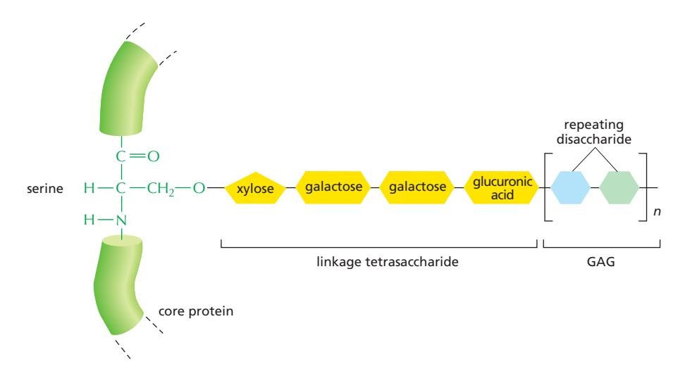

Figure 19–35 The linkage between a GAG chain and its core protein in a proteoglycan molecule. A specific linkage tetrasaccharide is first assembled on a serine side chain. The rest of the GAG chain, consisting mainly of a repeating disaccharide unit, is then synthesized, with one sugar added at a time. In chondroitin sulfate, the disaccharide is composed of d-glucuronic acid and *N*-acetyl-dgalactosamine; in heparan sulfate, it is either d-glucuronic acid or l-iduronic acid and *N*-acetyl-d-glucosamine.

epimerization, which alters the configuration of the substituents around individual carbon atoms in the sugar molecule.

Proteoglycans are clearly distinguished from other glycoproteins by the nature, quantity, and arrangement of their sugar side chains. By definition, at least one of the sugar side chains of a proteoglycan must be a GAG. Whereas glycoproteins generally contain relatively short, branched oligosaccharide chains that contribute only a small fraction of their mass, proteoglycans can contain as much as 95% carbohydrate by mass, mostly in the form of long, unbranched GAG chains, each typically about 80 sugars long.

In principle, proteoglycans have the potential for almost limitless heterogeneity. Even a single type of core protein can carry highly variable numbers and types of attached GAG chains. Moreover, the underlying repeating sequence of disaccharides in each GAG can be modified by a complex pattern of sulfate groups. The core proteins, too, are diverse, though many of them belong to structurally related families that share specific domains involved in binding to GAGs or other proteins.

Proteoglycans can be huge. The proteoglycan *aggrecan*, for example, which is a major component of cartilage, has a mass of about 3 × 106 daltons with more than 100 GAG chains. Other proteoglycans are much smaller and have only 1–10 GAG chains; an example is *decorin*, which is secreted by fibroblasts and has a single GAG chain (see Figure 19–31). Decorin binds to collagen fibrils and regulates fibril assembly and fibril diameter; mice that cannot make decorin have fragile skin that has reduced tensile strength. The GAGs and proteoglycans of these various types can associate to form even larger polymeric complexes in the extracellular matrix. Molecules of aggrecan, for example, assemble with hyaluronan in cartilage matrix to form aggregates that are as big as a bacterium (**Figure 19–36**). Moreover, besides associating with one another, GAGs and proteoglycans associate with fibrous matrix proteins such as collagen and with protein meshworks such as the basal lamina, creating extremely complex composites (**Figure 19–37**).

Not all proteoglycans are secreted components of the extracellular matrix. Some are integral components of plasma membranes and have their core protein

Figure 19–36 An aggrecan aggregate from fetal bovine cartilage. (A) An electron micrograph of an aggrecan aggregate shadowed with platinum. Many free aggrecan molecules are also visible. (B) A drawing of the giant aggrecan aggregate shown in A. It consists of about 100 aggrecan monomers (see Figure 19–31) noncovalently bound through the N-terminal domain of the core protein to a single hyaluronan molecule. A link protein binds both to the core protein of the proteoglycan and to the hyaluronan molecule, thereby stabilizing the aggregate. The molecular mass of such a complex can be 108 daltons or more, and it occupies a volume equivalent to that of a bacterium, which is about 2 μm3 . (A, courtesy of Lawrence Rosenberg.)

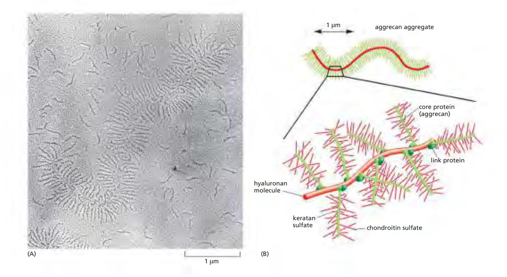

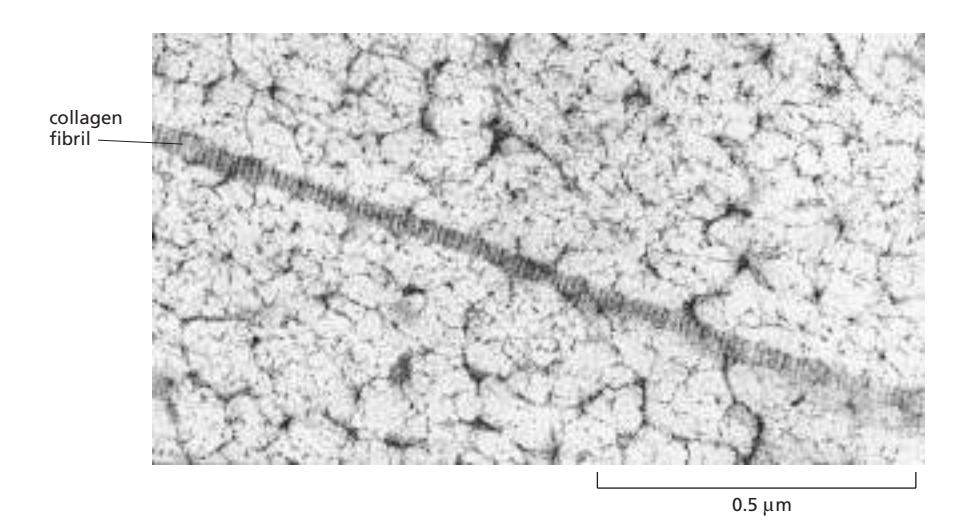

Figure 19–37 Proteoglycans in the extracellular matrix of rat cartilage.

The tissue was rapidly frozen at –196°C and fixed and stained while still frozen (a process called freeze substitution) to prevent the GAG chains from collapsing. In this electron micrograph, the proteoglycan molecules are seen to form a fine filamentous network in which a single striated collagen fibril is embedded. The more darkly stained parts of the proteoglycan molecules are the core proteins; the faintly stained threads are the GAG chains. (© 1984 E.B. Hunziker and R.K. Schenk. Originally published in *J. Cell Biol.* https://doi.org/10.1083/jcb.98.1.277. With permission from Rockefeller University Press.)

either inserted across the lipid bilayer or attached to the lipid bilayer by a glycosylphosphatidylinositol (GPI) anchor. Among the best-characterized plasma membrane proteoglycans are the *syndecans*, which have a membrane-spanning core protein whose intracellular domain interacts with the actin cytoskeleton and with signaling molecules in the cell cortex. The extracellular domain is linked to multiple GAG chains (primarily heparan sulfate). Syndecans are located on the surface of many types of cells, including fibroblasts and epithelial cells. In fibroblasts, syndecans can be found in cell–matrix adhesions, where they modulate integrin function by interacting with fibronectin on the cell surface and with cytoskeletal and signaling proteins inside the cell. As we discuss later, syndecans and related proteoglycans called *glypicans* also interact with soluble peptide growth factors, influencing their effects on cell growth and proliferation. MBoC7 m19.38/19.37

#### Collagens Are the Major Proteins of the Extracellular Matrix

The **collagens** are a family of fibrous proteins found in all multicellular animals. They are secreted in large quantities by connective-tissue cells and in smaller quantities by many other cell types. As a major component of skin and bone, collagens are the most abundant proteins in mammals, where they constitute 25% of the total protein mass.

The primary feature of a typical collagen molecule is its long, stiff, triplestranded helical structure, in which three collagen polypeptide chains, called α *chains*, are wound around one another in a rope-like superhelix (**Figure 19–38**). Collagens are extremely rich in proline and glycine, both of which are important in the formation of the triple-stranded helix.

The human genome contains 42 distinct genes coding for different collagen α chains. Different combinations of these genes are expressed in different tissues. Although in principle thousands of types of triple-stranded collagen molecules could be assembled from various combinations of the 42 α chains, only a limited number of triple-helical combinations are possible, and roughly 40 types of collagen molecules have been found. Type I is by far the most common,

Figure 19–38 The structure of a typical collagen molecule. (A) A model of part of a single collagen α chain, in which each amino acid is represented by a sphere. The chain is about 1000 amino acids long. It is arranged as a left-handed helix, with three amino acids per turn and with glycine as every third amino acid. Therefore, an α chain is composed of a series of triplet Gly-X-Y sequences, in which X and Y can be any amino acid (although X is commonly proline and Y is commonly hydroxyproline, a form of proline that is chemically modified during collagen synthesis in the cell). (B) A model of part of a collagen molecule, in which three α chains, each shown in a different color, are wrapped around one another to form a triple-stranded helical rod. Glycine is the only amino acid small enough to occupy the crowded interior of the triple helix. Only a short length of the molecule is shown; the entire molecule is 300 nm long. (From a model by B.L. Trus.)

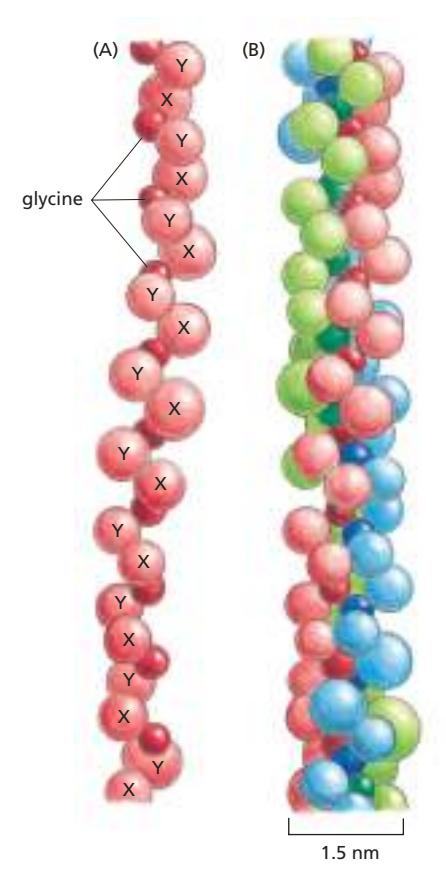

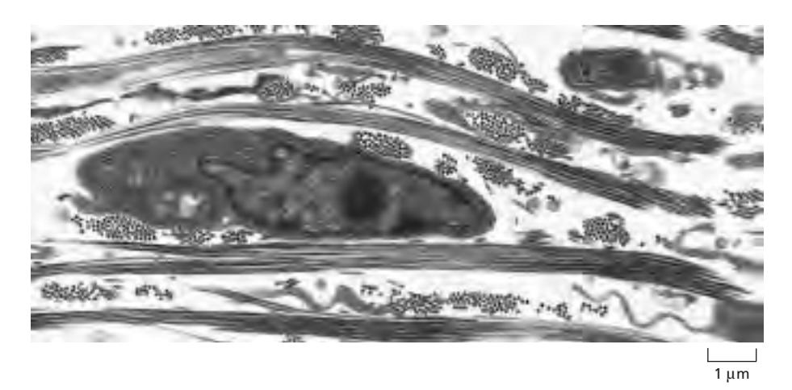

Figure 19–39 A fibroblast surrounded by collagen fibrils in the connective tissue of embryonic chick skin. In this electron micrograph, the fibrils are organized into bundles that run approximately at right angles to one another. Therefore, some bundles are oriented longitudinally, whereas others are seen in cross section. The collagen fibrils are produced by fibroblasts. (From C. Ploetz et al., *J. Struct. Biol.* 106:73–81, 1991. With permission from Elsevier.)

being the principal collagen of skin and bone. It belongs to the class of **fibrillar collagens**, or fibril-forming collagens: after being secreted into the extracellular space, they assemble into higher-order polymers called **collagen fibrils**, which are thin structures (10–300 nm in diameter) many hundreds of micrometers long in mature tissues, where they are clearly visible in electron micrographs (**Figure 19–39**; see also Figure 19–37). Collagen fibrils often aggregate into larger, cablelike bundles, several micrometers in diameter, that are visible in the light microscope as *collagen fibers*.

Collagen types IX and XII are called *fibril-associated collagens* because they decorate the surface of collagen fibrils. They are thought to link these fibrils to one another and to other components in the extracellular matrix. Types IV and VII are *network-forming collagens*: type IV forms a major part of the basal lamina, while type VII molecules form dimers that assemble into specialized structures called *anchoring fibrils.* Anchoring fibrils help attach the basal lamina of multilayered epithelia to the underlying connective tissue and therefore are especially abundant in the skin. There are also a number of "collagen-like" proteins containing short collagen-like segments. These include collagen type XVII, which has a transmembrane domain and is found in hemidesmosomes, and type XVIII, the core protein of a proteoglycan in the basal lamina.

Many proteins appear to have evolved by repeated duplications of an original DNA sequence, giving rise to a repetitive pattern of amino acids. The genes that encode the α chains of most of the fibrillar collagens provide a good example: they are very large (up to 44 kilobases in length) and contain about 50 exons. Most of the exons are 54 or multiples of 54 nucleotides long, suggesting that these collagens originated through multiple duplications of a primordial gene containing 54 nucleotides and encoding exactly six Gly-X-Y repeats (see Figure 19–38).

**Table 19–2** provides additional details for some of the collagen types discussed in this chapter.

## Collagen Chains Undergo a Series of Post-translational Modifications

Individual collagen polypeptide chains are synthesized on membrane-bound ribosomes and injected into the lumen of the endoplasmic reticulum (ER) as larger precursors, called *pro-a chains*. These precursors not only have the short amino-terminal signal peptide required to direct the nascent polypeptide to the

| TABLE 19–2 Some Types of Collagen and Their Properties |       |                                             |                                                                                                      |                                                                                                    |     |
| ------------------------------------------------------ | ----- | ------------------------------------------- | ---------------------------------------------------------------------------------------------------- | -------------------------------------------------------------------------------------------------- | --- |
|                                                        | Type  | Polymerized form                            | Tissue distribution                                                                                  | Mutant phenotype                                                                                   |     |
| Fibril-forming (fibrillar)                          | I     | Fibril                                      | Bone, skin, tendons, ligaments, cornea, internal organs (accounts for 90% of body collagen) | Severe bone defects, fractures (osteogenesis imperfecta)                                        |     |
|                                                        | II    | Fibril                                      | Cartilage, intervertebral disc, notochord, vitreous humor of the eye                           | Cartilage deficiency, dwarfism (chondrodysplasia)                                               |     |
|                                                        | III   | Fibril                                      | Skin, blood vessels, internal organs                                                              | Fragile skin, loose joints, blood vessels prone to rupture (vascular Ehlers–Danlos syndrome) |     |
|                                                        | V     | Fibril (with type I)                        | As for type I                                                                                        | Fragile skin, loose joints (classical Ehlers– Danlos syndrome)                                  |     |
|                                                        | XI    | Fibril (with type II)                       | As for type II                                                                                       | Myopia, blindness                                                                                  |     |
| Fibril-associated                                      | IX    | Lateral association with type II fibrils | Cartilage                                                                                            | Osteoarthritis                                                                                     |     |
|                                                        | XII   | Lateral association with type I fibrils  | Tendons                                                                                              | Skeletal and muscle abnormalities                                                                  |     |
| Network-forming                                        | IV    | Sheetlike network                           | Basal lamina                                                                                         | Kidney disease (glomerulonephritis), deafness                                                   |     |
|                                                        | VII   | Anchoring fibrils                           | Beneath stratified squamous epithelia                                                             | Skin blistering                                                                                    |     |
| Transmembrane                                          | XVII  | Nonfibrillar                                | Hemidesmosomes                                                                                       | Skin blistering                                                                                    |     |
| Proteoglycan core protein                           | XVIII | Nonfibrillar                                | Basal lamina                                                                                         | Myopia, detached retina, hydrocephalus                                                             |     |

Note that types I, IV, V, IX, and XI are each composed of two or three types of α chains (distinct, nonoverlapping sets in each case), whereas types II, III, VII, XII, XVII, and XVIII are composed of only one type of α chain each.

ER but also have, at both their N- and C-terminal ends, additional amino acids, called *propeptides,* that are clipped off at a later step of collagen assembly. Moreover, in the lumen of the ER, selected prolines and lysines are hydroxylated to form *hydroxyproline* and *hydroxylysine*, respectively, and some hydroxylysines are then glycosylated.

Each pro-α chain combines with two others to form a triple-stranded, helical molecule known as *procollagen*. The hydroxyl groups of hydroxyprolines and hydroxylysines (**Figure 19–40**) form interchain hydrogen bonds that help stabilize the triple-stranded helix. The enzyme that catalyzes proline hydroxylation requires ascorbic acid (vitamin C). In *scurvy*, the disease caused by a dietary deficiency of vitamin C that was common in sailors until the nineteenth century, defective pro-α chains fail to form a stable triple helix and are degraded, thereby inhibiting the production of new collagen fibrils. In healthy tissues, collagen is continually degraded and replaced (with a turnover time of months or years, depending on the tissue). In scurvy, replacement fails, and within a few months, with the gradual loss of the preexisting normal collagen in the matrix, blood vessels become fragile, teeth become loose in their sockets, and wounds cease to heal.

After secretion, the propeptides of the fibrillar procollagen molecules are removed by specific proteolytic enzymes outside the cell. This converts the procollagen molecules to collagen, which assemble in the extracellular space to form much larger collagen fibrils. The propeptides have at least two functions. First,

$$\begin{array}{c|ccccccccccccccccccccccccccccccccccc$$

Figure 19–40 Hydroxylysine and hydroxyproline. These modified amino acids are common in collagen. They are formed by enzymes that act after the lysine and proline have been incorporated into procollagen molecules.

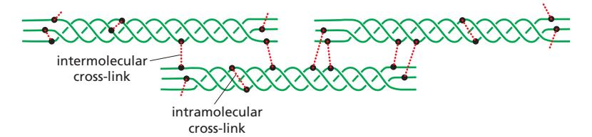

Figure 19–41 Cross-links formed between modified lysine side chains within a collagen fibril. Covalent intramolecular and intermolecular cross-links are formed in several steps. First, the extracellular enzyme lysyl oxidase deaminates certain lysines and hydroxylysines to yield highly reactive aldehyde groups. The aldehydes then react spontaneously to form covalent bonds with each other or with other lysines or hydroxylysines. Most of the cross-links form between the short nonhelical segments at each end of the collagen molecules.

they guide the intracellular formation of the triple-stranded collagen molecules. Second, because they are retained until after secretion, they prevent the intracellular formation of large collagen fibrils, which could be catastrophic for the cell. MBoC7 m19.65(5thEd)/19.41

After the fibrils have formed in the extracellular space, they are greatly strengthened by the formation of covalent cross-links between lysine residues of the constituent collagen molecules (**Figure 19–41**). The types of covalent bonds involved are found only in collagen and elastin. If cross-linking is inhibited, the tensile strength of the fibrils is drastically reduced: collagenous tissues become fragile, and structures such as skin, tendons, and blood vessels tend to tear. The extent and type of cross-linking vary from tissue to tissue. Collagen is especially highly cross-linked in the Achilles tendon, for example, where tensile strength is crucial.

#### Secreted Fibril-associated Collagens Help Organize the Fibrils

In contrast to GAGs, which resist compressive forces, collagen fibrils form structures that resist tensile forces. The fibrils have various diameters and are organized in different ways in different tissues. In mammalian skin, for example, they are woven in a wickerwork pattern so that they resist tensile stress in multiple directions; leather consists of this material, suitably preserved. In tendons, collagen fibrils are organized in parallel bundles aligned along the major axis of tension. In mature bone and in the cornea, they are arranged in orderly plywoodlike layers, with the fibrils in each layer lying parallel to one another but nearly at right angles to the fibrils in the layers on either side. The same arrangement occurs in tadpole skin (**Figure 19–42**).

The connective-tissue cells themselves determine the size and arrangement of the collagen fibrils. The cells can express one or more genes for the different types of fibrillar collagen molecules. But even fibrils composed of the same mixture of collagens have different arrangements in different tissues. How is this achieved? Part of the answer is that cells can regulate the disposition of the collagen molecules after secretion by guiding collagen fibril formation near the plasma membrane. In addition, cells can influence this organization by secreting, along with their fibrillar collagens, different kinds and amounts of other matrix macromolecules. In particular, they secrete the fibrous protein *fibronectin*, as we discuss later, and this precedes the formation of collagen fibrils and helps guide their organization.

**Fibril-associated collagens**, such as types IX and XII collagens, are thought to be especially important in organizing collagen fibrils. They differ from fibrillar collagens in the following ways. First, their triple-stranded helical structure is interrupted by one or two short nonhelical domains, which makes the molecules more flexible than fibrillar collagen molecules. Second, they do not aggregate with one another to form fibrils in the extracellular space. Instead, they bind in a periodic manner to the surface of fibrils formed by the fibrillar collagens. Type IX molecules bind to type II collagen–containing fibrils in cartilage, the cornea, and the vitreous of the eye (**Figure 19–43**), whereas type XII molecules bind to type I collagen–containing fibrils in tendons and various other tissues.

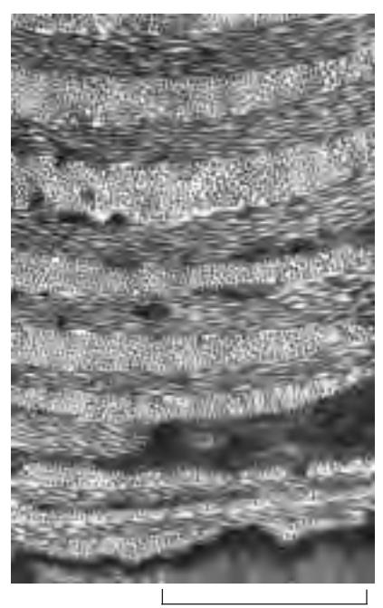

5 µm

Figure 19–42 Collagen fibrils in the tadpole skin. This electron micrograph shows the plywoodlike arrangement of the fibrils: successive layers of fibrils are laid down nearly at right angles to each other. This organization is also found in mature bone and in the cornea. (Courtesy of Jerome Gross.)

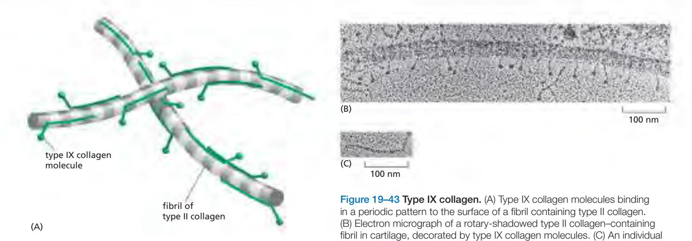

type IX collagen molecule. (B and C, © 1988, L. Vaughan et al. Originally published in J. Cell Biol. https://doi.org/10.1083/jcb.106.3.991. With

permission from Rockefeller University Press.)

Fibril-associated collagens are thought to mediate the interactions of collagen fibrils with one another and with other matrix macromolecules to help determine the organization of the fibrils in the matrix.

# Elastin Gives Tissues Their Elasticity

Many vertebrate tissues, such as skin, blood vessels, and lungs, need to be both strong and elastic in order to function. A network of **elastic fibers** in the extracellular matrix of these tissues gives them the resilience to recoil after transient stretch (**Figure 19–44**). Elastic fibers are at least five times more extensible than a rubber band of the same cross-sectional area. Long, inelastic collagen fibrils are interwoven with the elastic fibers to limit the extent of stretching and prevent the tissue from tearing.

The main component of elastic fibers is **elastin**, a highly hydrophobic protein (about 750 amino acids long), which, like collagen, is unusually rich in proline and glycine but, unlike collagen, is not glycosylated. Soluble *tropoelastin* (the biosynthetic precursor of elastin) is secreted into the extracellular space and assembled into elastic fibers close to the plasma membrane, generally in cell-surface infoldings. After secretion, the tropoelastin molecules become highly cross-linked to one another, generating an extensive network of elastin fibers and sheets. A mechanism similar to the one that operates in cross-linking collagen molecules forms cross-links between lysines in elastin molecules.

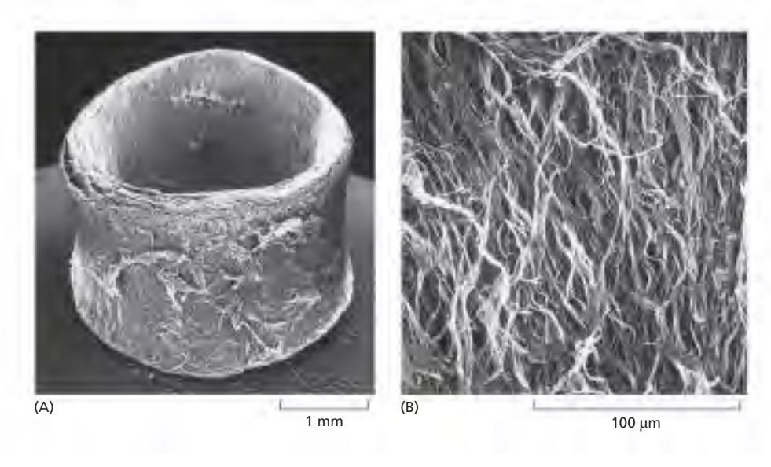

Figure 19–44 Elastic fibers. These scanning electron micrographs show (A) a low-power view of a segment of a dog's aorta and (B) a high-power view of the dense network of longitudinally oriented elastic fibers in the outer layer of the same blood vessel. All the other components have been digested away with enzymes and formic acid. (From K.S. Haas et al., Anat. Rec. 230:86–96, 1991. With permission from Wiley-Liss.)

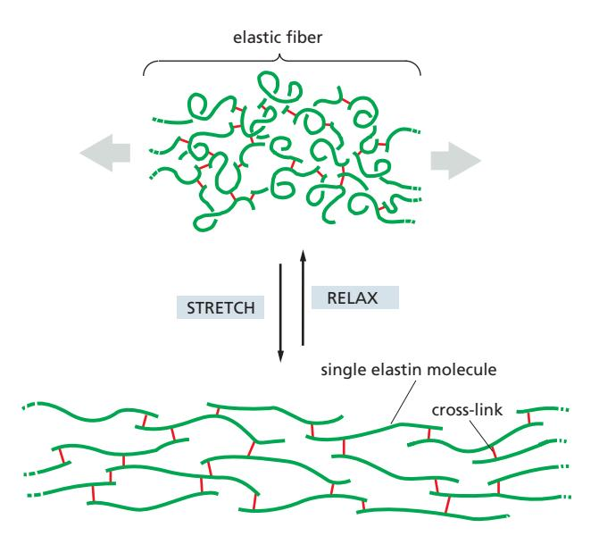

Figure 19–45 Stretching a network of elastin molecules. The molecules are joined together by covalent bonds *(red)* to generate a cross-linked network. In this model, each elastin molecule in the network can extend and contract in a manner resembling a random coil, so that the entire assembly can stretch and recoil like a rubber band.

The elastin protein is composed largely of two types of short segments that alternate along the polypeptide chain: hydrophobic segments, which are responsible for the elastic properties of the molecule; and alanine- and lysine-rich α-helical segments, which are cross-linked to adjacent molecules. Each segment is encoded by a separate exon. There is still uncertainty concerning the conformation of elastin molecules in elastic fibers and how the structure of these fibers accounts for their rubberlike properties. However, it seems that parts of the elastin polypeptide chain, like the polymer chains in ordinary rubber, adopt a loose "random-coil" conformation, and it is the random-coil nature of the component molecules cross-linked into the elastic fiber network that allows the network to stretch and recoil like a rubber band (**Figure 19–45**). MBoC7 m19.45/19.45

Elastin is the dominant extracellular matrix protein in arteries, comprising 50% of the dry weight of the largest artery—the aorta (see Figure 19–44). Mutations in the elastin gene causing a deficiency of the protein in mice or humans result in narrowing of the aorta and other arteries and excessive proliferation of smooth muscle cells in the arterial wall. Apparently, the normal elasticity of an artery is required to restrain the proliferation of these cells.

Elastic fibers do not consist solely of elastin. The elastin core is covered with a sheath of *microfibrils*, each of which has a diameter of about 10 nm. The microfibrils appear before elastin in developing tissues and seem to provide scaffolding to guide elastin deposition. Arrays of microfibrils are elastic in their own right, and in some places they persist in the absence of elastin: they help to hold the lens in its place in the eye, for example. Microfibrils are composed of a number of distinct glycoproteins, including the large glycoprotein *fibrillin*, which binds to elastin and is essential for the integrity of elastic fibers. Mutations in the fibrillin gene result in *Marfan syndrome*, a relatively common human disorder. In the most severely affected individuals, the aorta is prone to rupture; other common effects include displacement of the lens and abnormalities of the skeleton and joints. Affected individuals are often unusually tall and lanky: Abraham Lincoln is suspected to have had the condition.

## Cells Govern and Respond to the Mechanical Properties of the Matrix

Cells interact with the extracellular matrix mechanically as well as chemically, and studies in culture suggest that the mechanical interaction can have dramatic effects on the architecture of connective tissue. Thus, when fibroblasts are mixed with a meshwork of randomly oriented collagen fibrils that form a gel in a culture dish, the fibroblasts tug on the meshwork, drawing in collagen from their

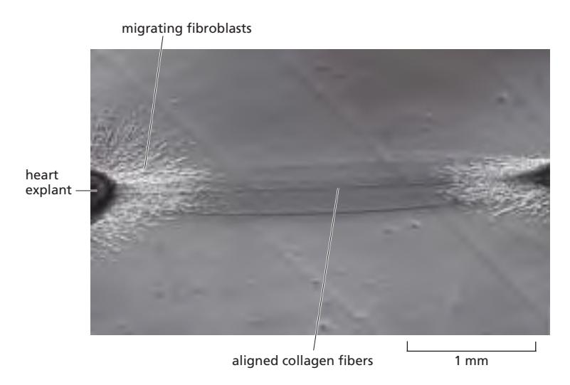

Figure 19–46 The shaping of the extracellular matrix by cells. This micrograph shows a region between two pieces of embryonic chick heart (rich in fibroblasts as well as heart muscle cells) that were cultured on a collagen gel for 4 days. A dense tract of aligned collagen fibers has formed between the explants, presumably as a result of the fibroblasts in the explants tugging on the collagen. (From D. Stopak and A.K. Harris, *Dev. Biol.*  90:383–398, 1982. With permission from Elsevier.)

surroundings and thereby causing the gel to contract to a small fraction of its initial volume. By similar activities, a cluster of fibroblasts surrounds itself with a capsule of densely packed and circumferentially oriented collagen fibers.

If two small pieces of embryonic tissue containing fibroblasts are placed far apart on a collagen gel, the intervening collagen becomes organized into a compact band of aligned fibers that connect the two explants (**Figure 19–46**). The fibroblasts subsequently migrate out from the explants along the aligned collagen fibers. Thus, the fibroblasts influence the alignment of the collagen fibers, and the collagen fibers in turn affect the distribution of the fibroblasts. MBoC7 e20.13/19.46

Fibroblasts may have a similar role in organizing the extracellular matrix inside the body. First they synthesize the collagen fibrils and deposit them in the correct orientation. Then they work on the matrix they have secreted, crawling over it and tugging on it so as to create tendons and ligaments and the tough, dense layers of connective tissue that surround and bind together most organs.

In addition to determining the orientation of the collagen fibrils they produce, fibroblasts control the overall density and composition of the extracellular matrix, which varies dramatically in different tissues. Some tissues, such as tendons and cartilage, are composed of dense matrix that is far more rigid and resistant to deformation than the soft, elastic matrix of tissues like fat and the brain. These differences depend on the ability of cells in these tissues to regulate the types of collagen and other proteins produced, the relative rates of matrix protein synthesis and degradation, and the amount of collagen and elastin cross-linking. The density of the matrix, in turn, regulates the behavior of the fibroblasts and other cells that travel through it; for example, the proliferation, migration, and developmental fate of stem cells are influenced by matrix composition and density. Abnormally high matrix density is associated with certain fibrotic diseases and appears to be a risk factor in some forms of cancer.

### Fibronectin and Other Multidomain Glycoproteins Help Organize the Matrix

In addition to proteoglycans, collagens, and elastic fibers, the extracellular matrix contains a large and varied assortment of glycoproteins that typically have multiple domains, each with specific binding sites for other matrix macromolecules and for receptors on the surface of cells (**Figure 19–47**). These proteins therefore contribute to both organizing the matrix and helping cells attach to it. Like the proteoglycans, they also guide cell movements in developing tissues by serving as tracks along which cells can migrate or as repellents that keep cells out of forbidden areas. They can also bind and thereby influence the function of peptide growth factors and other small molecules produced by nearby cells.

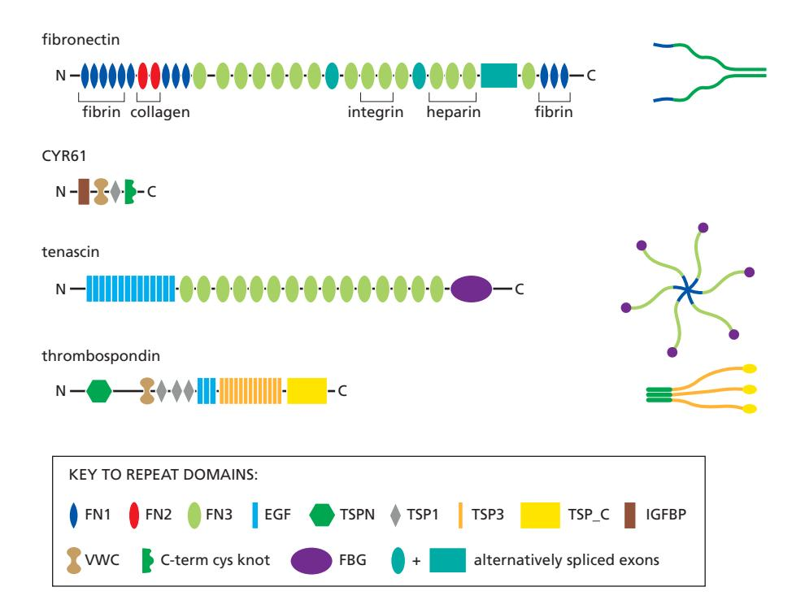

The best-understood member of this class of matrix proteins is **fibronectin**, a large glycoprotein found in all vertebrates and important for many cell–matrix interactions. Mutant mice that are unable to make fibronectin die early in embryogenesis because their endothelial cells fail to form proper blood vessels. The defect is thought to result from abnormalities in the interactions of these cells with the surrounding extracellular matrix, which normally contains fibronectin. MBoC7 n19.46/19.47

Fibronectin is a dimer composed of two very large subunits joined by disulfide bonds at their C-terminal ends. Each subunit contains a series of small repeated domains, or modules, separated by short stretches of flexible polypeptide chain (**Figure 19–48**). Each domain is usually encoded by a separate exon, suggesting that the fibronectin gene, like the genes encoding many matrix proteins, evolved by multiple exon duplications. In the human genome, there is only one fibronectin gene, containing about 50 exons of similar size, but the transcripts can be spliced in different ways to produce multiple fibronectin isoforms (see Figure 19–48B). The major repeat domain in fibronectin is called the **type III fibronectin repeat**, which is about 90 amino acids long and occurs at least 15 times in each subunit. This repeat is among the most common of all protein domains in vertebrates.

#### Fibronectin Binds to Integrins

One way to analyze a complex multifunctional protein molecule such as fibronectin is to synthesize individual regions of the protein and test their ability to bind other proteins. By these and other methods, it was possible to show that one region of fibronectin binds to collagen, another to proteoglycans, and another to specific integrins on the surface of various types of cells (see Figure 19–48B). Synthetic peptides corresponding to different segments of the integrin-binding domain were then used to show that binding depends on a specific tripeptide sequence (*Arg-Gly-Asp*, or *RGD*) that is found in one of the type III repeats (see Figure 19–48C). Even very short peptides containing this **RGD sequence** can compete with fibronectin for the binding site on cells, thereby inhibiting the attachment of the cells to a fibronectin matrix.

Several extracellular proteins besides fibronectin also have an RGD sequence that mediates cell-surface binding. Many of these proteins are components of the Figure 19–47 Complex glycoproteins of the extracellular matrix. Many matrix glycoproteins are large scaffold proteins containing multiple copies of specific protein-interaction domains. Each domain is folded into a discrete globular structure, and many such domains are arrayed along the protein like beads on a string. This diagram shows four representative proteins among the roughly 200 matrix glycoproteins that are found in mammals. Each protein contains multiple repeat domains, with the names listed in the key at the bottom. Fibronectin, for example, contains numerous copies of three different *fibronectin repeats* (types I–III, labeled here as FN1, FN2, and FN3). Two type III repeats near the center of the protein contain important binding sites for cell-surface integrins, whereas three nearby type III repeats form a binding site for heparin or heparan sulfate proteoglycans. FN repeats at the N-terminus are involved in binding fibrin or collagen. Other matrix proteins contain repeated sequences resembling those of epidermal growth factor (EGF), a major regulator of cell growth and proliferation; these repeats might serve a similar signaling function in matrix proteins. Other proteins contain domains, such as the insulin-like growth factor–binding protein (IGFBP) repeat, that bind and regulate the function of soluble growth factors. To add more structural diversity, many of these proteins are encoded by RNA transcripts that can be spliced in different ways, adding or removing exons, such as those in fibronectin. Finally, the scaffolding and regulatory functions of many matrix proteins are further expanded by assembly into multimeric forms, as shown at the right: fibronectin forms dimers linked at the C-termini, whereas tenascin and thrombospondin form N-terminally linked hexamers and trimers, respectively. Other domains include four repeats from thrombospondin (TSPN, TSP1, TSP3, TSP\_C). VWC, von Willebrand type C; FBG, fibrinogen-like. (Adapted from R.O. Hynes and A. Naba, *Cold Spring Harb. Perspect. Biol.* 4:a004903, 2012. With permission from Cold Spring Harbor Laboratory Press.)

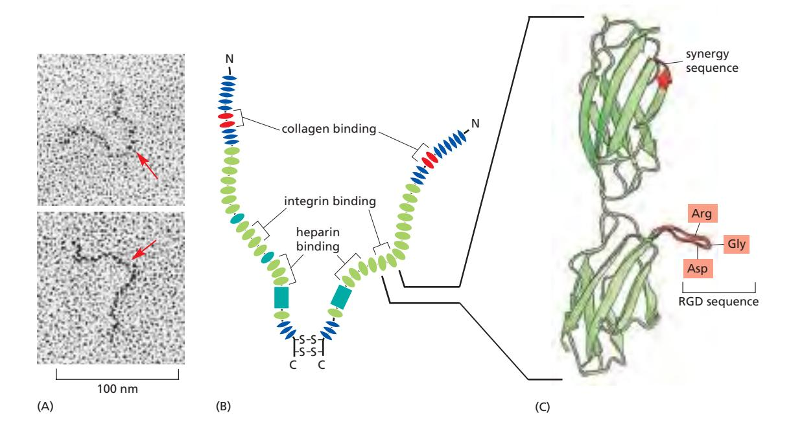

extracellular matrix, while others are involved in blood clotting. Peptides containing the RGD sequence have been useful in the development of anti-clotting drugs. Some snakes use a similar strategy to cause their victims to bleed: they secrete RGD-containing anti-clotting proteins called *disintegrins* into their venom.

The cell-surface receptors that bind RGD-containing proteins are members of the integrin family, which we describe in detail later. Each integrin specifically recognizes its own small set of matrix molecules, indicating that tight binding requires more than just the RGD sequence. Moreover, RGD sequences are not the only sequence motifs used for binding to integrins: many integrins recognize and bind to other motifs instead. MBoC7 m19.47/19.48

# Tension Exerted by Cells Regulates the Assembly of Fibronectin Fibrils

Fibronectin can exist both in a soluble form, circulating in the blood and other body fluids, and as insoluble *fibronectin fibrils*, in which fibronectin dimers are cross-linked to one another by additional disulfide bonds and form part of the extracellular matrix. Unlike fibrillar collagen molecules, however, which can self-assemble into fibrils in a test tube, fibronectin molecules assemble into fibrils only on the surface of cells, and only where those cells possess appropriate fibronectin-binding proteins—in particular, integrins. The integrins provide a linkage from the fibronectin outside the cell to the actin cytoskeleton inside it. The linkage transmits tension to the fibronectin molecules—provided that they also have an attachment to some other structure—and stretches them, exposing cryptic binding sites in the fibronectin molecules (**Figure 19–49**). This allows them Figure 19–48 The structure of a fibronectin dimer. (A) Electron micrographs of individual fibronectin dimer molecules shadowed with platinum; *red arrows* mark the joined C-termini. (B) The two polypeptide chains are similar but generally not identical (being made from the same gene but from differently spliced mRNAs). They are joined by two disulfide bonds near the C-termini. Each chain is almost 2500 amino acids long and is folded into multiple domains (see Figure 19–47). As indicated, some domains are specialized for binding to a particular molecule. For simplicity, not all of the known binding sites are shown. (C) The three-dimensional structure of the ninth and tenth type III fibronectin repeats, as determined by x-ray crystallography. Both the Arg-Gly-Asp (RGD) and the "synergy" sequences shown in *red* are important for binding to integrins on cell surfaces. (A, from J. Engel et al., *J. Mol. Biol.* 150:97–120, 1981. With permission from Elsevier; C, from D.J. Leahy, *Annu. Rev. Cell Dev. Biol.* 13:363–393, 1997. With permission from Annual Reviews.)

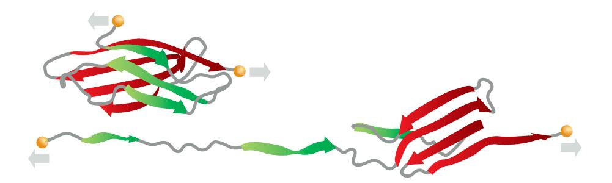

Figure 19–49 Tension-sensing by fibronectin. Some type III fibronectin repeats are thought to unfold when fibronectin is stretched. The unfolding exposes cryptic binding sites that interact with other fibronectin molecules resulting in the formation of fibronectin filaments like those shown in Figure 19–50. (From V. Vogel and M. Sheetz, *Nat. Rev. Mol. Cell Biol.* 7:265–275, 2006. With permission from Springer Nature.)

to bind directly to one another and to recruit additional fibronectin molecules to form a fibril (**Figure 19–50**). This dependence on tension and interaction with cell surfaces ensures that fibronectin fibrils assemble where there is a mechanical need for them and not in inappropriate locations such as the bloodstream.

Many other extracellular matrix proteins contain multiple copies of the type III fibronectin repeat (see Figure 19–47), and it is possible that tension exerted on these proteins also uncovers cryptic binding sites and thereby influences their behavior.

#### The Basal Lamina Is a Specialized Form of Extracellular Matrix

Thus far in this section, we have reviewed the general principles underlying the structure and function of the major classes of extracellular matrix components. We now describe how some of these components are assembled into a specialized type of extracellular matrix called the **basal lamina** (also known as the **basement membrane**). This exceedingly thin, tough, flexible sheet of matrix molecules is an essential underpinning of all epithelia. Although small in volume, it has a critical role in the architecture of the body. Like the cadherins, it seems to be one of the defining features common to all multicellular animals, and it seems to have appeared very early in their evolution. The major molecular components of the basal lamina are among the most ancient extracellular matrix macromolecules.

The basal lamina is typically 40–120 nm thick. It lies beneath epithelial cells and also surrounds individual muscle cells, fat cells, and Schwann cells (which wrap around peripheral nerve cell axons to form myelin). The basal lamina thus separates these cells and epithelia from the underlying or surrounding connective tissue and forms the mechanical connection between them. In other locations, such as the kidney glomerulus, a basal lamina lies between two cell sheets and functions as a selective filter (**Figure 19–51**). Basal laminae have more than simple structural and filtering roles, however. They are able to determine cell polarity; influence cell metabolism; organize the proteins in adjacent plasma membranes; promote cell survival, proliferation, or differentiation; and serve as highways for cell migration.

## Laminin and Type IV Collagen Are Major Components of the Basal Lamina

The basal lamina is synthesized by the cells on each side of it: the epithelial cells contribute one set of basal lamina components, while cells of the underlying bed of connective tissue (called the *stroma*, Greek for "bedding") contribute another set (**Figure 19–52**). Although the precise composition of the mature basal lamina varies from tissue to tissue and even from region to region in the same lamina, it typically contains the glycoproteins *laminin*, *type IV collagen*, and *nidogen*, along with the proteoglycan *perlecan*. Other common basal lamina components are fibronectin and *type XVIII collagen* (an atypical member of the collagen family, forming the core protein of a proteoglycan).

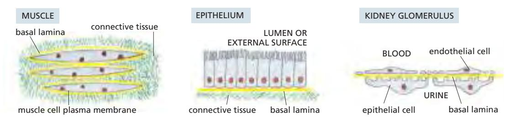

Figure 19–51 Three ways in which the basal lamina is organized. Sheets of basal lamina *(yellow)* surround certain cells (such as skeletal muscle cells), underlie epithelia, and are interposed between two cell sheets (as in the kidney glomerulus). Note that, in the kidney glomerulus, both cell sheets have gaps in them, and the basal lamina has a filtering as well as a supportive function, helping to determine which molecules will pass into the urine from the blood. The filtration also depends on other protein-based structures, called *slit diaphragms*, that span the intercellular gaps in the epithelial sheet.

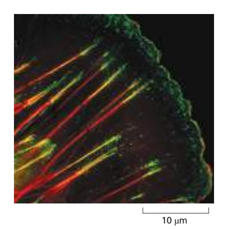

Figure 19–50 Organization of fibronectin into fibrils at the cell surface. This fluorescence micrograph shows the front end of a migrating mouse fibroblast. Extracellular fibronectin is stained *green*, and intracellular actin filaments are stained *red*. The fibronectin is initially present as small dotlike aggregates near the leading edge of the cell. It accumulates at focal adhesions (sites of anchorage of actin filaments, discussed later) and becomes organized into fibrils parallel to the actin filaments. Integrin molecules spanning the cell membrane link the fibronectin outside the cell to the actin filaments inside it (see Figure 19–56). Tension exerted on the fibronectin molecules through this linkage is thought to stretch them, exposing binding sites that promote fibril formation. (Courtesy of Roumen Pankov and Kenneth Yamada.) MBoC7 m19.49/19.50

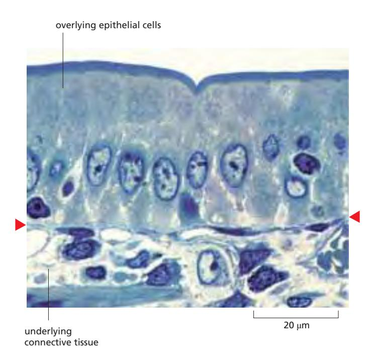

Figure 19–52 The basal lamina supports a sheet of epithelial cells. In this light micrograph of a cross section of the small intestine, the sheet of columnar epithelial cells rests on the basal lamina *(red arrowheads)*. A network of collagen fibrils and other fibers in the underlying connective tissue interacts with the lower face of the basal lamina. (Jose Luis Calvo/ Shutterstock.)

**Laminin** is the primary organizer of the sheet structure, and, early in development, the basal lamina consists mainly of laminin molecules. Laminins constitute a large family of proteins, each composed of three long polypeptide chains (α, β, and γ) held together by disulfide bonds and arranged in the shape of an asymmetric bouquet, like a bunch of three flowers whose stems are twisted together at the foot but whose heads remain separate (**Figure 19–53**). These heterotrimers can self-assemble *in vitro* into a network, largely through interactions between their heads, although interaction with cells is needed to organize the network into an orderly sheet. Because there are several isoforms of each type of chain, and MBoC7 m19.51/19.52

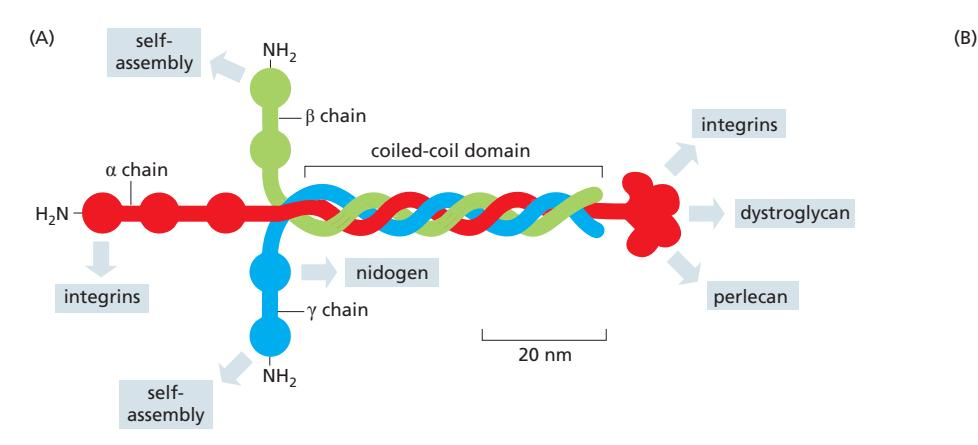

Figure 19–53 The structure of laminin. (A) The best-understood family member is laminin-111, shown here with some of its binding sites for other molecules *(gray boxes).* Laminins are multidomain glycoproteins composed of three polypeptides (α, β, and γ) that are disulfide-bonded into an asymmetric crosslike structure. Each of the polypeptide chains is more than 1500 amino acids long. Five types of α chains, four types of β chains, and three types of γ chains are known, and various combinations of these subunits can assemble to form a large variety of different laminins, which are named according to numbers assigned to each of their three subunits: laminin-111, for example, contains α1, β1, and γ1 subunits. Each isoform tends to have a specific tissue distribution: laminin-332 is found in skin, laminin-211 in muscle, and laminin-411 in endothelial cells of blood vessels. Through their binding sites for other proteins, laminin molecules play a central part in organizing the basal lamina and anchoring it to cells. (B) Electron micrographs of laminin molecules shadowed with platinum. (B, from J. Engel et al., *J. Mol. Biol.* 150:97–120, 1981. With permission from Elsevier.)

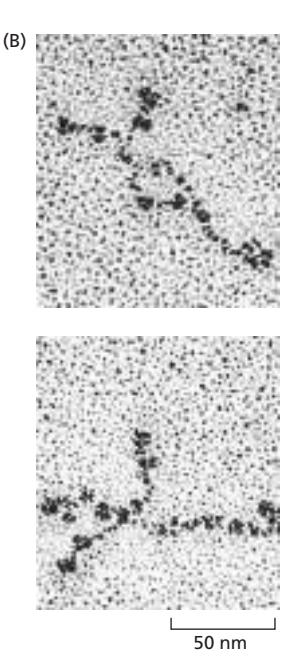

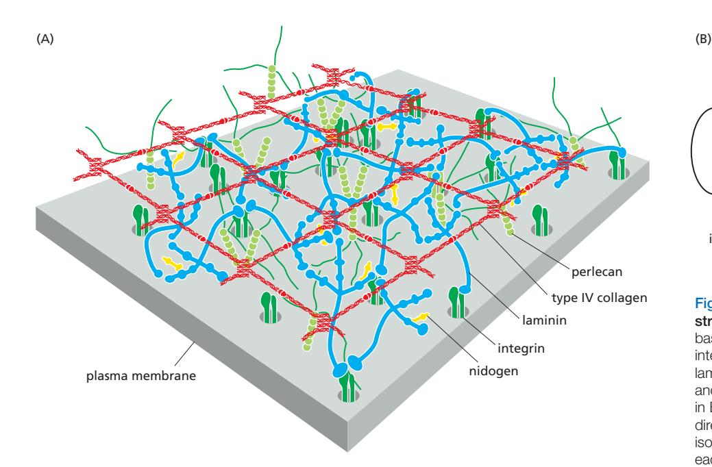

these can associate in various combinations, many different laminins can be produced, creating basal laminae with distinctive properties. The laminin γ1 chain is, however, a component of most laminin heterotrimers; mice lacking it die during embryogenesis because they are unable to make a basal lamina.

**Type IV collagen** is a second essential component of a mature basal lamina, and it, too, exists in several isoforms. Like the *fibrillar collagens* that constitute the bulk of the protein in connective tissues such as bone or tendon, type IV collagen molecules consist of three separately synthesized long protein chains that twist together to form a rope-like superhelix; however, they differ from the fibrillar collagens in that the triple-stranded helical structure is interrupted in more than 20 regions, allowing multiple bends. Type IV collagen molecules interact via their terminal domains to assemble extracellularly into a flexible, felt-like network that gives the basal lamina tensile strength.

Laminin and type IV collagen interact with other basal lamina components, such as the glycoprotein nidogen and the proteoglycan perlecan, resulting in a highly cross-linked network of proteins and proteoglycans (**Figure 19–54**). The laminin molecules that generate the initial sheet structure first join to each other while bound to receptors on the surface of the cells. The cell-surface receptors are primarily members of the integrin family, but another important type of laminin receptor is *dystroglycan*, a highly glycosylated transmembrane protein. Together, these receptors organize basal lamina assembly: they hold the laminin molecules by their feet, leaving the laminin heads positioned to interact so as to form a two-dimensional network. This laminin network then coordinates the assembly of the other basal lamina components. MBoC7 m19.53/19.54

Interactions between laminin and cell-surface receptors are critical for the adhesion of epithelia to the underlying connective tissue. In the skin, for example, the epithelial outer layer—the epidermis—depends on tight interactions with the basal lamina to keep it attached to the underlying dermis. In people with genetic defects in laminin-332, a key component of the skin basal lamina, the epidermis is poorly attached to the dermis. This causes a blistering disease called *junctional epidermolysis bullosa*, a severe and sometimes lethal condition.

#### Basal Laminae Have Diverse Functions

The basal lamina can act as a selective barrier to the movement of cells, as well as a filter for molecules. The lamina beneath an epithelium, for example, usually prevents fibroblasts in the underlying connective tissue from making contact

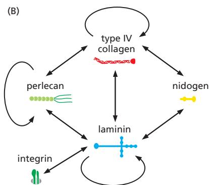

Figure 19–54 A model of the molecular structure of a basal lamina. (A) The basal lamina is formed by specific interactions (B) between the proteins laminin, type IV collagen, and nidogen and the proteoglycan perlecan. *Arrows* in B connect molecules that can bind directly to each other. There are various isoforms of type IV collagen and laminin, each with a distinctive tissue distribution. Transmembrane laminin receptors (integrins and dystroglycan) in the plasma membrane are thought to organize the assembly of the basal lamina; only the integrins are shown. (Based on H. Colognato and P.D. Yurchenco, *Dev. Dyn.* 218:213–234, 2000. With permission from John Wiley & Sons.)

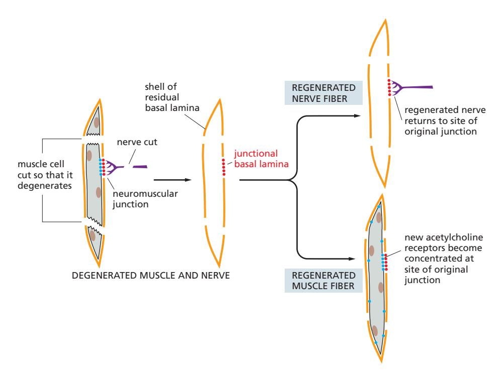

with the epithelial cells. It does not, however, stop macrophages, lymphocytes, or nerve processes from passing through it, using specialized protease enzymes to cut a hole for their transit. The basal lamina is also important in tissue regeneration after injury. When cells in tissues such as muscles, nerves, and epithelia are damaged or killed, the basal lamina often survives and provides a scaffold along which regenerating cells can migrate. In this way, the original tissue architecture is readily reconstructed. MBoC7 m19.54/19.55

A particularly striking example of the role of the basal lamina in regeneration comes from studies of the *neuromuscular junction*, the site where the nerve terminals of a motor neuron form a chemical synapse with a skeletal muscle cell (discussed in Chapter 11). In vertebrates, the basal lamina that surrounds the muscle cell separates the nerve-cell and muscle-cell plasma membranes at the synapse, and the synaptic region of the lamina has a distinctive chemical character, with special isoforms of type IV collagen and laminin and a proteoglycan called *agrin*. After a nerve or muscle injury, the basal lamina at the synapse has a central role in reconstructing the synapse at the correct location (**Figure 19–55**). Defects in components of the basal lamina at the synapse are responsible for some forms of muscular dystrophy, in which muscles develop normally but then degenerate later in life.

#### Cells Have to Be Able to Degrade Matrix, as Well as Make It

The ability of cells to degrade and destroy extracellular matrix is as important as their ability to make it and bind to it. Rapid matrix degradation is required in processes such as tissue repair, and even in the seemingly static extracellular matrix of adult animals there is a slow, continual turnover, with matrix macromolecules being degraded and resynthesized. This allows bone, for example, to be remodeled so as to adapt to changes in the stresses on it.

From the point of view of individual cells, the ability to cut through matrix is crucial in two ways: it enables them to divide while embedded in matrix, and it enables them to travel through it. Cells in connective tissues generally need to be able to stretch out in order to divide. If a cell lacks the enzymes needed to degrade the surrounding matrix, it is strongly inhibited from dividing and hindered from migrating.

Figure 19–55 Regeneration experiments demonstrating the special character of the junctional basal lamina at a neuromuscular junction. If a frog muscle and its motor nerve are destroyed, the basal lamina around each muscle cell remains intact, and the sites of the old neuromuscular junctions are still recognizable. When the nerve, but not the muscle, is allowed to regenerate *(upper right),* the junctional basal lamina directs the regenerating nerve to the original synaptic site. When the muscle, but not the nerve, is allowed to regenerate *(lower right),* the junctional basal lamina causes newly made acetylcholine receptors *(blue)*  to accumulate at the original synaptic site. These experiments show that the junctional basal lamina controls the localization of synaptic components on both sides of the lamina. Some of the molecules responsible for these effects have been identified. Motor neuron axons, for example, deposit agrin in the junctional basal lamina, where it regulates the assembly of acetylcholine receptors and other proteins in the junctional plasma membrane of the muscle cell. Reciprocally, muscle cells deposit a particular isoform of laminin in the junctional basal lamina, and this molecule is likely to interact with specific ion channels on the presynaptic membrane of the neuron.

Localized degradation of matrix components is also required wherever cells have to escape from confinement by a basal lamina. It is needed during normal branching growth of epithelial structures such as glands, for example, to allow the population of epithelial cells to increase, and needed also when white blood cells migrate across the basal lamina of a blood vessel into tissues in response to infection or injury. Matrix degradation is important both for the spread of cancer cells through the body and for their ability to proliferate in the tissues that they invade (discussed in Chapter 20).

In general, matrix components are degraded by extracellular proteolytic enzymes (proteases) that act close to the cells that produce them. Many of these proteases belong to one of two general classes. The largest group, with about 50 members in vertebrates, is the **matrix metalloproteases**, which depend on bound Ca2+ or Zn2+ for activity. The second group is the **serine proteases**, which have a reactive serine in their active site. Together, metalloproteases and serine proteases cooperate to degrade matrix proteins such as collagen, laminin, and fibronectin. Some metalloproteases, such as the *collagenases*, are highly specific, cleaving particular proteins at a small number of sites. In this way, the structural integrity of the matrix is largely retained, while the limited amount of proteolysis that occurs is sufficient for cell migration. Other metalloproteases may be less specific, but, because they are anchored to the plasma membrane, act just where they are needed; it is this type of matrix metalloprotease that is crucial for a cell's ability to divide when embedded in matrix.

Clearly, the activities of the proteases that degrade the matrix must be tightly controlled if the fabric of the body is not to collapse in a heap. Numerous mechanisms are therefore employed to ensure that matrix proteases are activated only at the correct time and place. Protease activity is generally confined to the cell surface by specific anchoring proteins, by membrane-associated activators, and by the production of specific protease inhibitors in regions where protease activity is not needed.

The proteolytic cleavage of matrix proteins does not always lead simply to their destruction, but sometimes generates protein fragments with specific biological activities. For example, cleavage of type IV collagen by matrix metalloproteases leads to the release of protein fragments that inhibit the local formation of blood vessels. Similarly, cleavage of laminin in certain tissues can generate protein fragments that help govern local cell proliferation.

### Matrix Proteoglycans and Glycoproteins Regulate the Activities of Secreted Proteins

The physical properties of extracellular matrix are important for its fundamental roles as a scaffold for tissue structure and as a substrate for cell anchorage and migration. The matrix also has an important impact on cell signaling. Cells communicate with each other by secreting peptide signal molecules, like growth factors and morphogens, that diffuse through the extracellular fluid to influence other cells (discussed in Chapter 15). On the way to their targets, the signal molecules encounter the tightly woven meshwork of the extracellular matrix, which contains a high density of negative charges and protein-interaction domains that can interact with the signal molecules, thereby altering their function in a variety of ways.

The highly charged heparan sulfate chains of proteoglycans, for example, interact with numerous secreted signal molecules, including *fibroblast growth factors* (*FGFs*) and *vascular endothelial growth factor* (*VEGF*), which (among other effects) stimulate a variety of cell types to proliferate. By providing a dense array of growth factor–binding sites, proteoglycans are thought to generate large local reservoirs of these factors, limiting their diffusion and focusing their actions on nearby cells. Similarly, proteoglycans might help generate steep morphogen gradients in an embryo, which can be important in the patterning of tissues during development. FGF activity can also be enhanced by proteoglycans, which oligomerize the FGF molecules and also interact with cell-surface FGF receptors, enabling the FGF to cross-link and activate its receptors more effectively.

The importance of proteoglycans as regulators of the distribution and activity of signal molecules is illustrated by the severe developmental defects that can occur when specific proteoglycans are inactivated by mutation. In *Drosophila*, for example, the function of several signal proteins during development is gov erned by interactions with the membrane-associated proteoglycans *Dally* and *Dally-like*. These members of the *glypican* family, like the syndecan proteogly cans described earlier, are membrane-associated proteins linked to multiple heparan sulfate molecules. They are thought to concentrate signal proteins in specific locations and act as co-receptors that collaborate with conventional cell-surface receptor proteins; as a result, they promote signaling in the correct location and prevent it in the wrong locations. In the *Drosophila* ovary, Dally is partly responsible for the restricted localization and function of a signaling protein called Dpp, which blocks differentiation of the germ-line stem cells: when the gene encoding Dally is mutated, Dpp activity is greatly reduced and oocyte development is abnormal.

Several other matrix molecules interact with signal proteins. The type IV collagen of the basal lamina interacts with Dpp in *Drosophila*, for example. Fibronectin contains a type III fibronectin repeat that interacts with VEGF and another domain that interacts with hepatocyte growth factor (HGF), thereby promoting the activities of these factors. As discussed earlier, many matrix glycoproteins contain extensive arrays of binding domains, and the arrangement of these domains is likely to influence the presentation of signal proteins to their target cells (see Figure 19–47).

Finally, many matrix glycoproteins contain domains that bind directly to spe cific cell-surface receptors, thereby generating signals that influence the behavior of the cells, as we describe in the next section.

#### Summary

*Cells are embedded in an intricate extracellular matrix, which not only binds the cells together but also influences their survival, development, shape, polarity, and migratory behavior. The matrix contains various protein fibers interwoven in a network of glycosaminoglycan (GAG) chains. GAGs are negatively charged polysaccharide chains that (except for hyaluronan) are covalently linked to pro tein to form proteoglycan molecules. GAGs attract water and occupy a large volume of extracellular space. Proteoglycans are also found on the surface of cells, where they often function as co-receptors to help cells respond to secreted signal proteins. Fiber-forming proteins give the matrix strength and resilience. The fibrillar collagens are rope-like, triple-stranded helical molecules that aggregate into long fibrils in the extracellular space, thereby providing tensile strength. They also form structures to which cells can be anchored, often via large multidomain glycoproteins, such as laminin and fibronectin, that bind to integrins on the cell surface. Elasticity is provided by elastin molecules, which form an extensive cross-linked network of fibers and sheets that can stretch and recoil.* 

*The basal lamina is a specialized form of extracellular matrix that underlies epithelial cells or is wrapped around certain other cell types, such as muscle cells. The basal lamina is organized on a framework of laminin molecules, which are linked together by their side-arms and bind to integrins and other receptors in the basal plasma membrane of overlying epithelial cells. Type IV collagen molecules, together with the protein nidogen and the large proteogly can perlecan, assemble into a sheetlike mesh that is an essential component of the mature basal lamina. Basal laminae provide mechanical support for epi thelia; they form the interface and attachment between epithelia and connective tissue; they serve as filters in the kidney; they act as barriers to keep cells in their proper compartments; they influence cell polarity and cell differentiation; and they guide cell migration during development and tissue regeneration.*

1146 Chapter 19: Cell Junctions and the Extracellular Matrix CELL–MATRIX JUNCTIONS 1147

# CELL–MATRIX JUNCTIONS

Cells make extracellular matrix, organize it, and degrade it. The matrix in turn exerts powerful influences on the cells. The influences are exerted chiefly through transmembrane cell adhesion proteins that act as *matrix receptors*. These proteins tie the matrix outside the cell to the cytoskeleton inside it, but their role goes far beyond simple passive mechanical attachment. Through them, components of the matrix can affect almost any aspect of a cell's behavior. The matrix receptors have a crucial role in epithelial cells, mediating their interactions with the basal lamina beneath them. They are no less important in connective-tissue cells, mediating the cells' interactions with the matrix that surrounds them.

Several types of molecules can function as matrix receptors or co-receptors, including the transmembrane proteoglycans. But the principal receptors on animal cells for binding most extracellular matrix proteins are the integrins. Like the cadherins and the key components of the basal lamina, integrins are part of the fundamental architectural tool kit that is characteristic of multicellular animals. The members of this large family of transmembrane adhesion molecules have a remarkable ability to transmit signals in both directions across the plasma membrane. The binding of a matrix component to an integrin can send a message into the interior of the cell, and conditions in the cell interior can send a signal outward to control binding of the integrin to the matrix. Tension applied to an integrin can cause it to tighten its grip on intracellular and extracellular structures, and loss of tension can loosen its hold, so that molecular signaling complexes fall apart on either side of the membrane. In this way, integrins can serve not only to transmit mechanical and molecular signals but also to convert one type of signal into the other.

# Integrins Are Transmembrane Heterodimers That Link the Extracellular Matrix to the Cytoskeleton

There are many varieties of integrins, but they all operate in a similar fashion. An integrin molecule is composed of two noncovalently associated glycoprotein subunits called α and β. Both subunits span the cell membrane and have short intracellular C-terminal tails and large N-terminal extracellular domains (**Figure 19–56**). The extracellular domains bind to specific amino acid sequence motifs in extracellular matrix proteins or, in some cases, in proteins on the surfaces

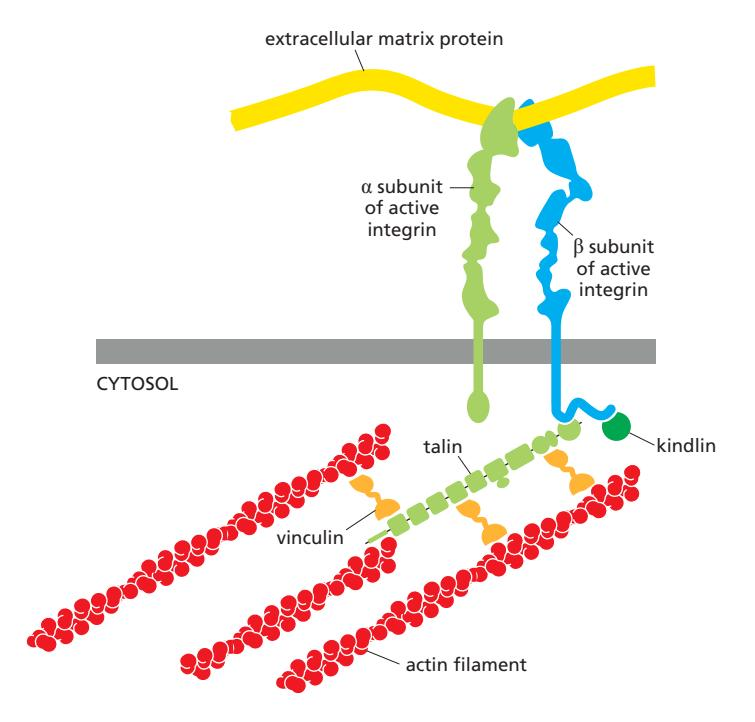

Figure 19–56 The subunit structure of an active integrin molecule, linking extracellular matrix to the actin cytoskeleton. The N-terminal heads of the integrin chains attach directly to an extracellular protein such as fibronectin; the C-terminal intracellular tail of the integrin β subunit binds to adaptor proteins that interact with filamentous actin. The best-understood adaptor is a giant protein called talin, which contains a string of multiple domains for binding actin and other proteins, such as vinculin, that help reinforce and regulate the linkage to actin filaments. One end of talin binds to a specific site on the integrin β-subunit cytoplasmic tail; other regulatory proteins, such as kindlin, bind at another site on the tail.

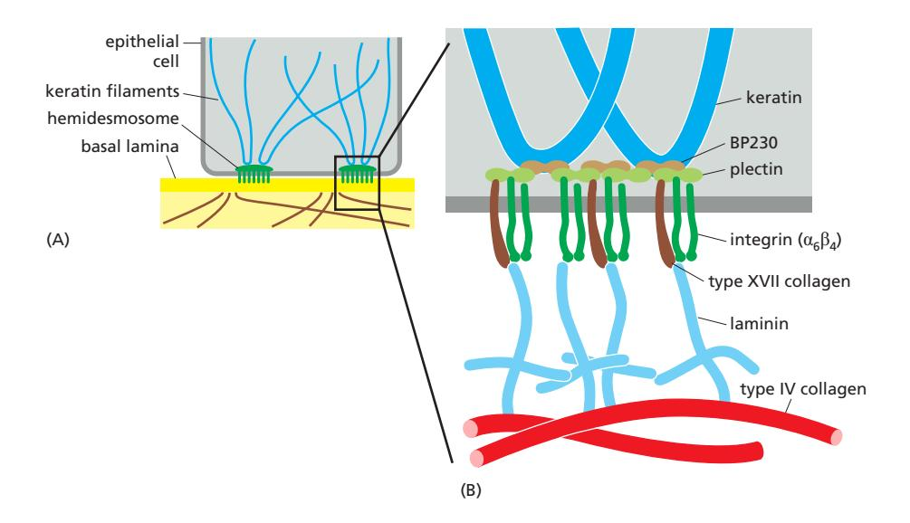

Figure 19–57 Hemidesmosomes. (A) Hemidesmosomes spot-weld epithelial cells to the basal lamina, linking laminin outside the cell to keratin filaments inside it. (B) Molecular components of a hemidesmosome. A specialized integrin (α6β4 integrin) spans the membrane, attaching to keratin filaments intracellularly via adaptor proteins called plectin and BP230, and attaching to laminin extracellularly. The adhesive complex also contains, in parallel with the integrin, an unusual collagen family member known as collagen type XVII; this has a membrane-spanning domain attached to its extracellular collagen region. Defects in any of these components can give rise to a blistering disease of the skin. One such disease, called *bullous pemphigoid*, is an autoimmune disease in which the immune system develops antibodies against collagen XVII or BP230.

of other cells. The best-understood binding site for integrins is the RGD sequence mentioned earlier (see Figure 19–48), which is found in fibronectin and other extracellular matrix proteins. Some integrins bind a Leu-Asp-Val (LDV) sequence in fibronectin and other proteins. Additional integrin-binding sequences exist in laminins and collagens.

Humans contain 24 types of integrins, which are formed from the products of 8 different β-chain genes and 18 different α-chain genes that are dimerized in different combinations. Each integrin dimer has specific properties and functions. Moreover, because the same integrin molecule in different cell types can have different ligand-binding specificities, it seems that additional cell type–specific factors can interact with integrins to modulate their binding activity. The binding of integrins to their matrix ligands is also affected by the concentration of Ca2+ and Mg2+ in the extracellular medium, reflecting the presence of divalent cationbinding domains in the α and β subunits. The divalent cations influence both the affinity and the specificity of the binding of an integrin to its extracellular ligands. MBoC7 m19.56/19.57

The intracellular portion of an integrin dimer binds to a complex of several different proteins, which together form a linkage to the cytoskeleton. For all but one of the 24 varieties of human integrins, this intracellular linkage is to actin filaments. These linkages depend on proteins that assemble at the short cytoplasmic tails of the integrin subunits (see Figure 19–56). A large adaptor protein called *talin* is a component of the linkage in many cases, but numerous additional proteins are also involved. Like the actin-linked cell–cell junctions formed by cadherins, the actin-linked cell–matrix junctions formed by integrins may be either small, inconspicuous, and transient or large, prominent, and durable. Examples of the latter are the *focal adhesions* that form when fibroblasts have sufficient time to establish strong attachments to the rigid surface of a culture dish, and the *myotendinous junctions* that attach muscle cells to their tendons.

In epithelia, the most prominent cell–matrix attachment sites are the hemidesmosomes, where a specific type of integrin anchors the cells to laminin in the basal lamina. Here, uniquely, the intracellular attachment is to keratin intermediate filaments, via the intracellular adaptor proteins plectin and BP230 (**Figure 19–57**).

#### Integrin Defects Are Responsible for Many Genetic Diseases

Although there is some overlap in the activities of the different integrins—at least five bind laminin, for example—it is the diversity of integrin functions that is more remarkable. **Table 19–3** lists some varieties of integrins and the problems that result when individual integrin α or β chains are defective.

The β1 subunit forms dimers with at least 12 distinct α subunits and is found on almost all vertebrate cells: α5β1 is a fibronectin receptor and α6β1 is a laminin 1148 Chapter 19: Cell Junctions and the Extracellular Matrix CELL–MATRIX JUNCTIONS 1149

| TABLE 19–3 Some Types of Integrins |                                               |                                |                                                                        |                                                                                                                      |  |
|------------------------------------|-----------------------------------------------|--------------------------------|------------------------------------------------------------------------|----------------------------------------------------------------------------------------------------------------------|--|
| Integrin                           | Ligand*                                       | Distribution                   | Phenotype when α subunit is mutated                                 | Phenotype when β subunit is mutated                                                                               |  |
| α5β1                               | Fibronectin                                   | Ubiquitous                     | Death of embryo; defects in blood vessels, somites, neural crest | Early death of embryo (at implantation)                                                                           |  |
| α6β1                               | Laminin                                       | Ubiquitous                     | Severe skin blistering; defects in other epithelia also             | Early death of embryo (at implantation)                                                                           |  |
| α7β1                               | Laminin                                       | Muscle                         | Muscular dystrophy; defective myotendinous junctions                | Early death of embryo (at implantation)                                                                           |  |
| αLβ2 (LFA1)                        | Ig superfamily counterreceptors (ICAM1) | White blood cells              | Impaired recruitment of leukocytes                                  | Leukocyte adhesion deficiency (LAD); impaired inflammatory responses; recurrent life threatening infections |  |
| αIIbβ3                             | Fibrinogen                                    | Platelets                      | Bleeding; no platelet aggregation (Glanzmann disease)               | Bleeding; no platelet aggregation (Glanzmann disease); mild osteopetrosis                                      |  |
| α6β4                               | Laminin                                       | Hemidesmosomes in epithelia | Severe skin blistering; defects in other epithelia also             | Severe skin blistering; defects in other epithelia also                                                           |  |
| *Not all ligands are listed.       |                                               |                                |                                                                        |                                                                                                                      |  |

receptor on many types of cells. Mutant mice that cannot make any β1 integrins die early in embryonic development. Mice that are only unable to make the α7 subunit (the partner for β1 in muscle) survive but develop muscular dystrophy (as do mice that cannot make the laminin ligand for the α7β1 integrin).

The β2 subunit forms dimers with at least four types of α subunit and is expressed exclusively on the surface of white blood cells, where it has an essential role in enabling these cells to fight infection. The β2 integrins mainly mediate cell–cell rather than cell–matrix interactions, binding to specific ligands on another cell, such as an endothelial cell. The ligands are members of the Ig superfamily of cell–cell adhesion molecules. We have already described an example earlier in the chapter: an integrin of this class (αLβ2, also known as LFA1) on white blood cells enables them to attach firmly to the Ig family protein ICAM1 on vascular endothelial cells at sites of infection (see Figure 19–28B). People with the genetic disease *leukocyte adhesion deficiency* fail to synthesize functional β2 subunits. As a consequence, their white blood cells lack the entire family of β2 receptors, and they suffer repeated bacterial infections.

The β3 integrins are found on blood platelets (as well as various other cells), and they bind several matrix proteins, including the blood clotting factor *fibrinogen.* Platelets have to interact with fibrinogen to mediate normal blood clotting, and humans with *Glanzmann disease*, who are genetically deficient in β3 integrins, suffer from defective clotting and bleed excessively.

## Integrins Can Switch Between an Active and an Inactive Conformation

A cell crawling through a tissue—a fibroblast or a macrophage, for example, or an epithelial cell migrating along a basal lamina—has to be able both to make and to break attachments to the matrix, and to do so rapidly if it is to travel quickly. Similarly, a circulating white blood cell has to be able to switch on or off its tendency to bind to endothelial cells in order to crawl out of a blood vessel at a site of inflammation. Furthermore, the making and breaking of the extracellular attachments in all these cases has to be coupled to the prompt assembly and disassembly of

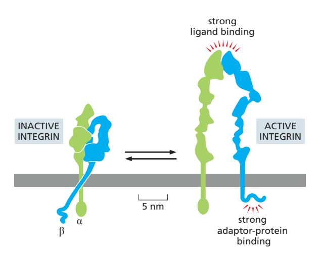

Figure 19–58 Integrins exist in two major activity states. Inactive (folded) and active (extended) structures of an integrin molecule, based on data from x-ray crystallography and other methods.

cytoskeletal attachments inside the cell. The integrin molecules that span the membrane and mediate the attachments cannot simply be passive, rigid objects with sticky patches at their two ends. They must be able to switch between an active state, where they readily form attachments, and an inactive state, where they do not.

Structural studies, using a combination of electron microscopy and x-ray crystallography, suggest that integrins exist in multiple structural conformations that reflect different states of activity (**Figure 19–58**). In the inactive state, the external segments of the integrin dimer are folded together into a compact structure that binds poorly to matrix proteins. In this state, the cytoplasmic tails of the dimer are hooked together, preventing their interaction with cytoskeletal linker proteins. In the active state, the two integrin subunits are unhooked at the membrane to expose the intracellular binding sites for cytoplasmic adaptor proteins, and the external domains unfold and extend, like a pair of legs, to expose a high-affinity matrix-binding site at the tips of the subunits. Thus, the switch from inactive to active states depends on a major conformational change that simultaneously exposes the external and internal ligand-binding sites at the ends of the integrin molecule. External matrix binding and internal cytoskeleton linkages are thereby coupled. MBoC7 m19.57/19.58

Switching between the inactive and active states is regulated by a variety of mechanisms, depending on the needs of the cell. In some cases, activation occurs by an "outside-in" mechanism: the binding of an external matrix protein, such as the RGD sequence of fibronectin, can drive some integrins to switch from the low-affinity inactive state to the high-affinity active state. As a result, binding sites for talin and other cytoplasmic adaptor proteins are exposed on the tail of the β chain. The binding of these adaptor proteins then leads to attachment of actin filaments to the intracellular end of the integrin molecule (see Figure 19–56). In this way, when the integrin catches hold of its ligand outside the cell, the cell reacts by tying the integrin molecule to the cytoskeleton, so that force can be applied at the point of cell attachment.

The chain of cause and effect can also operate in reverse. This "inside-out" integrin-activation process generally depends on intracellular regulatory signals that stimulate the ability of talin and other proteins to interact with the β chain of the integrin. Talin competes with the integrin α chain for its binding site on the tail of the β chain. Thus, when talin binds to the β chain, it blocks the intracellular α–β linkage, allowing the two legs of the integrin molecule to spring apart.

The regulation of "inside-out" integrin activation is particularly well understood in platelets, where an extracellular signal protein called thrombin binds to a specific G-protein-coupled receptor (GPCR) on the cell surface and thereby activates an intracellular signaling pathway that leads to integrin activation (**Figure 19–59**). It is likely that similar signaling pathways govern integrin activation in numerous other cell types.

1150 Chapter 19: Cell Junctions and the Extracellular Matrix CELL–MATRIX JUNCTIONS 1151

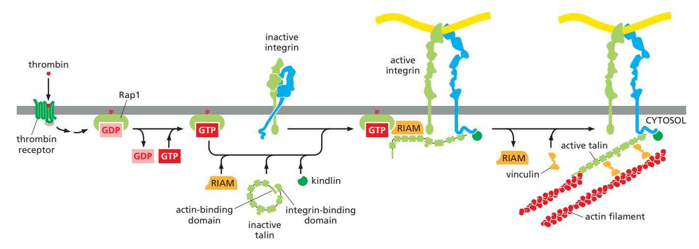

Figure 19–59 Activation of integrins by intracellular signaling. Signals received from outside the cell can act through intracellular signaling proteins to stimulate integrin activation. In platelets, as illustrated here, the extracellular signal protein thrombin activates a G-protein–coupled receptor on the cell surface, thereby initiating a signaling pathway that leads to activation of Rap1, a member of the monomeric GTPase family. Activated Rap1 interacts with the protein RIAM, which then recruits talin to the plasma membrane. Prior to this recruitment, talin is held in an inactive state by an interaction between its C-terminal actin-binding domain and its N-terminal integrin-binding domain. When it is recruited by RIAM to the plasma membrane, talin unfolds to expose its binding sites for integrin and actin. Together with another protein called kindlin, talin interacts with the integrin β chain to trigger integrin activation. Talin then interacts with actin and with adaptor proteins such as vinculin, resulting in the formation of multiple actin linkages (see Figure 19–56 and Figure 19–61).

## Integrins Cluster to Form Strong Adhesions

Integrins, like other cell adhesion molecules, differ from cell-surface receptors for hormones and for other extracellular soluble signal molecules in that they usually bind their ligand with lower affinity and are present at a 10- to 100-fold higher concentration on the cell surface. The Velcro principle, mentioned earlier in the context of cadherin adhesion (see Figure 19–6C), operates here too. After their activation, integrins cluster together to create a dense plaque in which many integrin molecules are anchored to cytoskeletal filaments. The resulting protein structure can be remarkably large and complex, as seen in the focal adhesion made by a fibroblast on the fibronectin-coated surface of a culture dish.

The assembly of mature cell–matrix junctional complexes depends on the recruitment of dozens of different scaffolding and signaling proteins. Talin is a major component of many cell–matrix complexes, but numerous other proteins also make important contributions. These include the *integrin-linked kinase* (*ILK*) and its binding partners *pinch* and *parvin*, which together form a trimeric complex that serves as an organizing hub at many junctions. Cell–matrix junctions also employ several actin-binding proteins, such as vinculin, *zyxin*, *VASP*, and *a-actinin*, to promote the assembly and organization of actin filaments. Another critical component of many cell–matrix junctions is the *focal adhesion kinase* (*FAK*), which interacts with multiple components in the junction and serves an important function in signaling, as we describe shortly.

## Extracellular Matrix Attachments Act Through Integrins to Control Cell Proliferation and Survival

Like other transmembrane cell adhesion proteins, integrins do more than just create attachments. They also activate intracellular signaling pathways and thereby allow control of almost any aspect of the cell's behavior according to the nature of the surrounding matrix and the state of the cell's attachments to it.

Many cells will not grow or proliferate in culture unless they are attached to extracellular matrix; nutrients and soluble mitogens in the culture medium are not enough. For some cell types, including epithelial, endothelial, and muscle cells, even cell survival depends on such attachments. When these cells lose contact with the extracellular matrix, they undergo apoptosis. This dependence of cell growth, proliferation, and survival on attachment to a substratum is known as **anchorage dependence**, and it is mediated mainly by integrins and the intracellular signals they generate. Mutations that disrupt or override this form of control, allowing cells to escape from anchorage dependence, occur in cancer cells and play a major part in their invasive behavior.

Our understanding of anchorage dependence has come mainly from studies of cells living on the surface of matrix-coated culture dishes. For connectivetissue cells that are normally surrounded by matrix on all sides, this is a far cry from the natural environment. Walking over a two-dimensional plain is very different from clambering through a three-dimensional jungle. The types of contacts that cells make with a rigid substratum are not the same as those, much less well studied, that they make with the deformable web of fibers of the extracellular matrix, and there are substantial differences in cell behavior in the two contexts. Nevertheless, it is likely that the same basic principles apply. Both *in vitro* and *in vivo*, intracellular signals generated at cell–matrix adhesion sites are crucial for cell proliferation and survival.

# Integrins Recruit Intracellular Signaling Proteins at Sites of Cell–Matrix Adhesion

The mechanisms by which integrins signal into the cell interior are complex, involving several pathways, and integrins and conventional signaling receptors often influence one another and work together to regulate cell behavior, as we have already emphasized. The Ras–MAP kinase pathway (see Figure 15–50), for example, can be activated both by conventional signaling receptors and by integrins, but cells often need both kinds of stimulation of this pathway at the same time to give sufficient activation to induce cell proliferation. Integrins and conventional signaling receptors also cooperate to promote cell survival (discussed in Chapters 15 and 18).

One of the best-studied modes of integrin signaling depends on a cytoplasmic protein tyrosine kinase called focal adhesion kinase (FAK). In studies of cells cultured on plastic dishes, focal adhesions are often prominent sites of tyrosine phosphorylation (**Figure 19–60**), and FAK is one of the major tyrosine-phosphorylated proteins found at these sites. When integrins cluster at cell–matrix contacts, FAK is recruited to the integrin β subunit by intracellular adaptor proteins such as talin or *paxillin* (which binds to one type of integrin α subunit). The clustered FAK molecules phosphorylate each other on a specific tyrosine, creating a

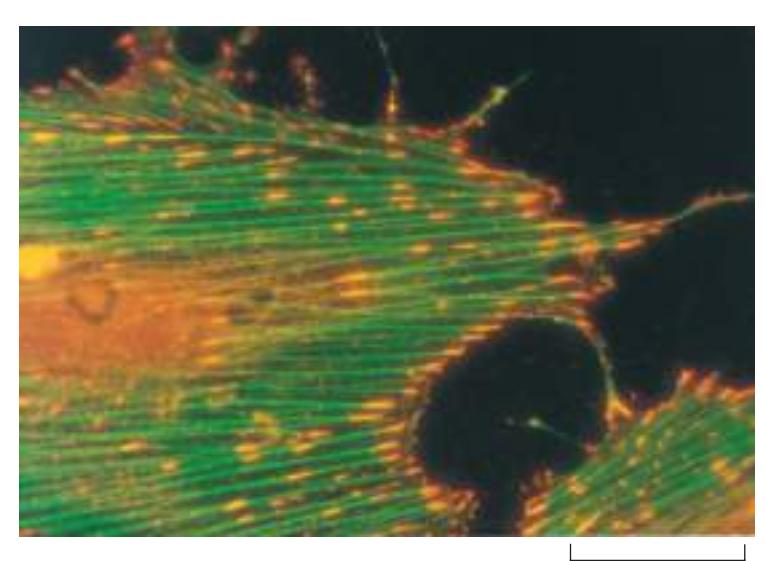

at focal adhesions. A fibroblast cultured on a fibronectin-coated substratum and stained with fluorescent antibodies: actin filaments are stained *green* and proteins that contain phosphotyrosine are *red,*  giving *orange* where the two components overlap. The actin filaments terminate at focal adhesions, where the cell attaches to the substratum by means of integrins. Proteins containing phosphotyrosine are also concentrated at these sites, reflecting the local activation of FAK and other protein kinases. Signals generated at such adhesion sites help regulate cell division, growth, and survival. (Courtesy of Keith Burridge.)

Figure 19–60 Tyrosine phosphorylation

1152 Chapter 19: Cell Junctions and the Extracellular Matrix CELL–MATRIX JUNCTIONS 1153

phosphotyrosine-docking site for members of the Src family of cytoplasmic tyrosine kinases. In addition to phosphorylating other proteins at the adhesion sites, these kinases then phosphorylate FAK on additional tyrosines, creating docking sites for a variety of additional intracellular signaling proteins. In this way, outside-in signaling from integrins, via FAK and Src family kinases, is relayed into the cell in much the same way as receptor tyrosine kinases generate signals (as discussed in Chapter 15).

#### Cell–Matrix Adhesions Respond to Mechanical Forces

Like the cell–cell junctions we described earlier, cell–matrix junctions can sense and respond to the mechanical forces that act on them. Most cell–matrix junctions, for example, are connected to a contractile actin network that tends to pull the junctions inward. When cells are attached to a rigid matrix that strongly resists such pulling forces, the cell–matrix junction is able to sense the resulting high tension and trigger a response in which it recruits additional integrins and other proteins to increase the junction's ability to withstand that tension. Cell attachment to a relatively soft matrix generates less tension and therefore a less robust response. These mechanisms allow cells to sense and respond to differences in the rigidity of extracellular matrices in different tissues.

We saw earlier that mechanotransduction at cadherin-based cell–cell junctions likely depends on junctional proteins that change their structure when the junction is stretched by tension (see Figure 19–12). The same is true for cell– matrix junctions. Talin, for example, includes a large number of binding sites for the actin-regulatory protein vinculin. Many of these sites are hidden inside folded protein domains but are exposed when those domains are unfolded by stretching the protein (**Figure 19–61**). The N-terminal end of talin binds integrin and the C-terminal end binds actin (see Figure 19–56); thus, when actin filaments are pulled by myosin motors inside the cell, the resulting tension stretches the talin rod, thereby exposing vinculin-binding sites. The vinculin molecules then recruit

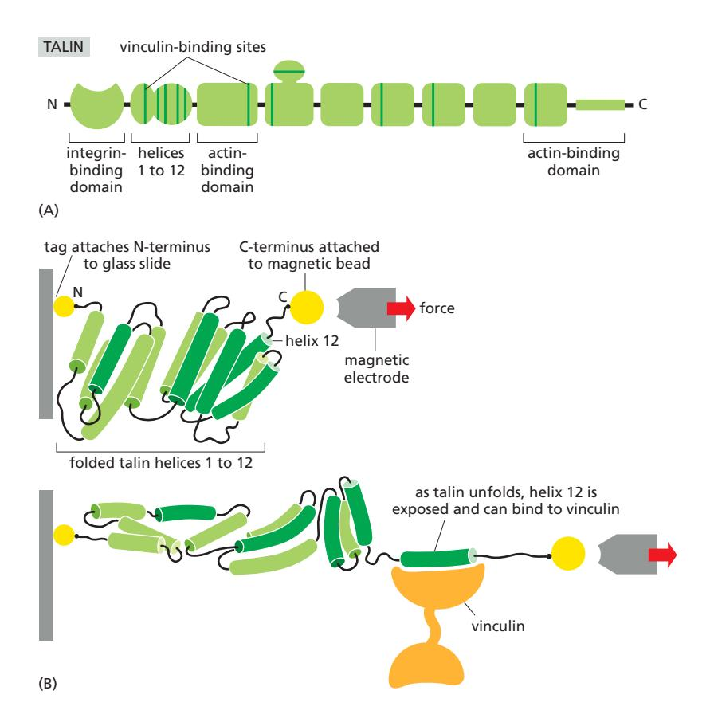

Figure 19–61 Talin is a tension sensor at cell–matrix junctions. Tension across cell–matrix junctions stimulates the local recruitment of vinculin and other actin-regulatory proteins, thereby strengthening the junction's attachment to the cytoskeleton. The experiment presented here tested the hypothesis that tension is sensed by the talin adaptor protein that links integrins to actin filaments (see Figure 19–56). (A) The long, flexible talin protein is divided into a series of folded domains, some of which contain vinculin-binding sites *(dark green lines)* that are thought to be hidden and therefore inaccessible. One domain near the N-terminus, for example, comprises a folded bundle of 12 α helices containing five vinculin-binding sites. (B) This experiment tested the hypothesis that tension stretches the 12-helix domain, thereby exposing vinculin-binding sites. A fragment of talin containing this domain was attached to an apparatus in which the domain could be stretched, as shown here. The fragment was labeled at its N-terminus with a tag that sticks to the surface of a glass slide on a microscope stage. The C-terminal end of the fragment was bound to a tiny magnetic bead, so the talin fragment could be stretched using a small magnetic electrode. The solution around the protein contained fluorescently tagged vinculin proteins. After the talin protein was stretched, excess vinculin solution was washed away, and the microscope was used to determine if any fluorescent vinculin proteins were bound to the talin protein. In the absence of stretching *(top)*, most talin molecules did not bind vinculin. When the protein was stretched *(bottom)*, two or three vinculin molecules were bound (only one is shown here for clarity). (Adapted from A. del Rio et al., *Science* 323:638–641, 2009.)

and organize additional actin filaments. Tension thereby increases the strength of the junction.

#### Summary

*Integrins are the principal cell-surface receptors used by animal cells to bind to the extracellular matrix: they function as transmembrane linkers between the extracellular matrix and the cytoskeleton. Most integrins connect to actin filaments, while those at hemidesmosomes bind to intermediate filaments. Integrin molecules are heterodimers, and the binding of extracellular matrix ligands or intracellular activator proteins such as talin results in a dramatic conformational switch from an inactive to an active state. This creates an allosteric coupling between binding to matrix outside the cell and binding to the cytoskeleton inside it, allowing the integrin to convey signals in both directions across the plasma membrane. Complex assemblies of proteins become organized around the intracellular tails of activated integrins, producing intracellular signals that can influence almost any aspect of cell behavior, from proliferation and survival, as in the phenomenon of anchorage dependence, to cell polarity and guidance of migration. Integrin-based cell–matrix junctions are also capable of mechanotransduction: they can sense and respond to mechanical forces acting across the junction.*

# THE PLANT CELL WALL

Each cell in a plant deposits, and is in turn completely enclosed by, an elaborate extracellular matrix called the *plant cell wall*. It was the thick cell walls of cork, visible in a primitive microscope, that in 1665 enabled Robert Hooke to observe and name cells for the first time. The walls of neighboring plant cells, cemented together to form the intact plant (**Figure 19–62**), are generally thicker, stronger,

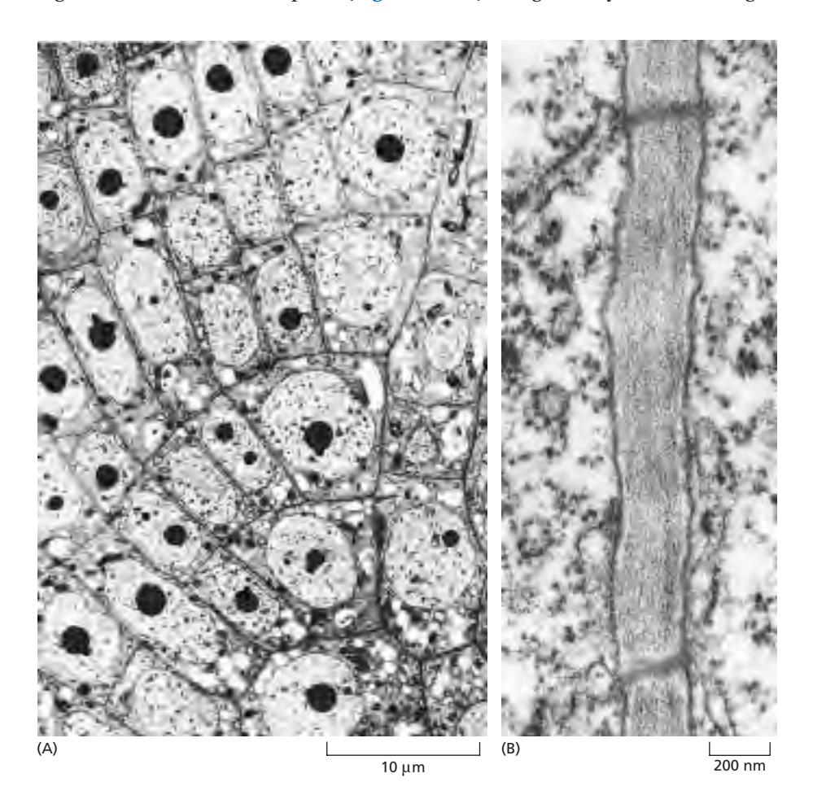

Figure 19–62 Plant cell walls. (A) Electron micrograph of the root tip of a rush, showing the organized pattern of cells that results from an ordered sequence of cell divisions in cells with relatively rigid cell walls. In this growing tissue, the cell walls are still relatively thin, appearing as fine black lines between the cells in the micrograph. (B) Section of a typical cell wall separating two adjacent plant cells. The two dark transverse bands correspond to plasmodesmata that span the wall (see Figure 19–27). (A, courtesy of C. Busby and B. Gunning, *Eur. J. Cell Biol.* 21: 214–223, 1980. With permission from Elsevier. B, courtesy of Jeremy Burgess.)

1154 Chapter 19: Cell Junctions and the Extracellular Matrix THE PLANT CELL WALL 1155

and, most important of all, more rigid than the extracellular matrix produced by animal cells. In evolving relatively rigid walls, which can be up to many micrometers thick, early plant cells forfeited the ability to crawl about and adopted a sedentary lifestyle that has persisted in all present-day plants.

#### The Composition of the Cell Wall Depends on the Cell Type

All cell walls in plants have their origin in dividing cells, as the cell plate forms during cytokinesis to create a new partition wall between the daughter cells (discussed in Chapter 17). The new cells are usually produced in special regions called *meristems*, and they are generally small in comparison with their final size. To accommodate subsequent cell growth, the walls of the newborn cells, called **primary cell walls**, are thin and extensible, although tough. Once cell growth stops, the primary wall is sometimes retained without major modification, but, more commonly, a rigid **secondary cell wall** is produced by depositing new layers of matrix inside the old ones. These new layers generally have a composition that is significantly different from that of the primary wall. The most common additional polymer in secondary walls is **lignin**, a complex network of covalently linked phenolic compounds found in the walls of the xylem vessels and fiber cells of woody tissues.

Although the cell walls of higher plants vary in both composition and organization, they are all constructed, like animal extracellular matrices, using a structural principle common to all fiber-composites, including fiberglass and reinforced concrete. One component provides tensile strength, while another, in which the first is embedded, provides resistance to compression. While the principle is the same in plants and animals, the chemistry is different. Unlike the animal extracellular matrix, which is rich in protein and other nitrogen-containing polymers, the plant cell wall is made almost entirely of polymers that contain no nitrogen, including *cellulose* and lignin. For a sedentary organism that depends on CO2, H2O, and sunlight, these two abundant biopolymers represent "cheap," carbon-based structural materials, helping to conserve the scarce fixed nitrogen available in the soil that generally limits plant growth. Thus trees, for example, make a huge investment in the cellulose and lignin that compose the bulk of their biomass.

In the cell walls of higher plants, the tensile fibers are made from the polysaccharide cellulose, the most abundant organic macromolecule on Earth, tightly linked into a network by *cross-linking glycans.* In primary cell walls, the matrix in which the cross-linked cellulose network is embedded is composed of *pectin*, a highly hydrated network of polysaccharides rich in galacturonic acid. Secondary cell walls contain additional molecules to make them rigid and permanent; lignin, in particular, forms a hard, waterproof filler in the interstices between the other components. All of these molecules are held together by a combination of covalent and noncovalent bonds to form a highly complex structure, whose composition, thickness, and architecture depend on the cell type.

The plant cell wall thus has a "skeletal" role in supporting the structure of the plant as a whole, a protective role as an enclosure for each cell individually, and a transport role, helping to form channels for the movement of fluid in the plant. When plant cells become specialized, they generally adopt a specific shape and produce specially adapted types of walls, according to which the different types of cells in a plant can be recognized and classified. We focus here, however, on the primary cell wall and the molecular architecture that underlies its remarkable combination of strength, resilience, and plasticity, as seen in the growing parts of a plant.

# The Tensile Strength of the Cell Wall Allows Plant Cells to Develop Turgor Pressure

The aqueous extracellular environment of a plant cell consists of the fluid contained in the walls that surround the cell. Although the fluid in the plant cell wall contains more solutes than does the water in the plant's external milieu (for example, soil), it is still hypotonic in comparison with the cell interior. This osmotic

CH2OH O O O OH OH 4 1 CH2OH O O O OH OH 4 1 CH2OH O OH OH 4 1 cellulose microfibril cellulose molecule *n* β1,4 linkage

Figure 19–63 Cellulose. Cellulose molecules are long, unbranched chains of β1,4-linked glucose units. Each glucose residue is inverted with respect to its neighbors, and the resulting disaccharide repeat occurs hundreds of times in a single cellulose molecule. In most higher plant cells, about 18 individual cellulose molecules assemble in parallel to form a strong, hydrogen-bonded cellulose microfibril.

imbalance causes the cell to develop a large internal hydrostatic pressure, or **turgor pressure**, which pushes outward on the cell wall, just as an inner tube pushes outward on a bicycle tire. The turgor pressure increases just to the point where the cell is in osmotic equilibrium, with no net influx of water despite the salt imbalance. The turgor pressure generated in this way may reach 10 or more atmospheres, about five times that in the average car tire. This pressure is vital to plants because it is the main driving force for cell expansion during growth, and it provides much of the mechanical rigidity of living plant tissues. Compare the wilted leaf of a dehydrated plant, for example, with the turgid leaf of a wellwatered one. It is the mechanical strength of the cell wall that allows plant cells to sustain this internal pressure. MBoC7 m19.62/19.63

# The Primary Cell Wall Is Built from Cellulose Microfibrils Interwoven with a Network of Pectic Polysaccharides

**Cellulose** gives the primary cell wall tensile strength. Each cellulose molecule consists of a linear chain of at least 500 glucose residues that are covalently linked to one another to form a ribbonlike structure, which is stabilized by hydrogen bonds within the chain (**Figure 19–63**). In addition, hydrogen bonds between adjacent cellulose molecules cause them to stick together in overlapping parallel arrays, forming bundles of about 18 cellulose chains, all of which have the same polarity. These highly ordered crystalline aggregates, many micrometers long, are called **cellulose microfibrils**, and they have a tensile strength comparable to that of steel. Sets of microfibrils are arranged in layers, or lamellae, with each microfibril about 20–40 nm from its neighbors and connected to them by long cross-linking glycan molecules, which are attached by hydrogen bonds to the surface of the microfibrils. The primary cell wall consists of several such lamellae arranged in a plywoodlike network (**Figure 19–64**).

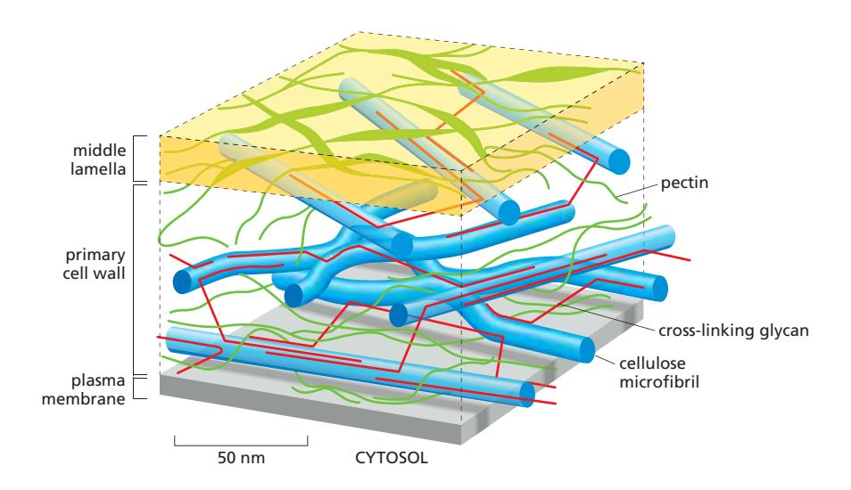

Figure 19–64 Scale model of a portion of a primary plant cell wall showing the two major polysaccharide networks. The orthogonally arranged layers of cellulose microfibrils *(blue)* are tied into a network by the cross-linking glycans *(red)* that form hydrogen bonds with the microfibrils. This network is accompanied by a network of pectin polysaccharides *(green).* The network of cellulose and cross-linking glycans provides tensile strength, while the pectin network resists compression. Cellulose, cross-linking glycans, and pectin are typically present in roughly equal amounts in a primary cell wall. The middle lamella is especially rich in pectin, and it cements adjacent cells together.

1156 Chapter 19: Cell Junctions and the Extracellular Matrix THE PLANT CELL WALL 1157

The **cross-linking glycans** are a heterogeneous group of branched polysaccharides that bind tightly to the surface of each cellulose microfibril and thereby help to cross-link the microfibrils into a complex network. There are many classes of cross-linking glycans, but they all have a long linear backbone composed of one type of sugar (glucose, xylose, or mannose) from which short side chains of other sugars protrude. The backbone sugar molecules form hydrogen bonds with the surface of cellulose microfibrils, cross-linking them in the process. Both the backbone and the side-chain sugars vary according to the plant species and its stage of development.

The network of cellulose microfibrils and cross-linking glycans includes another cross-linked polysaccharide network that is based on **pectins** (see Figure 19–64). Pectins are a heterogeneous group of branched polysaccharides that contain many negatively charged galacturonic acid units. Because of their negative charge, pectins are highly hydrated and associated with a cloud of cations, resembling the glycosaminoglycans of animal cells in the large amount of space they occupy (see Figure 19–33). When Ca2+ is added to a solution of pectin molecules, it cross-links them to produce a semirigid gel (it is pectin that is added to fruit juice to make jam or jelly). Certain pectins are particularly abundant in the *middle lamella*, the specialized region that cements together the walls of adjacent cells (see Figure 19–64); here, Ca2+ cross-links are thought to help hold cell wall components together. Although covalent bonds also play a part in linking the components, very little is known about their nature. Regulated separation of cells at the middle lamella underlies such processes as the ripening of tomatoes and the abscission (detachment) of leaves in the fall.

In addition to the two polysaccharide-based networks that form the bulk of all plant primary cell walls, proteins are present, contributing up to about 5% of the wall's dry mass. Many of these proteins are enzymes, responsible for wall turnover and remodeling, particularly during growth. Another class of wall proteins, like collagen, contains high levels of hydroxyproline. These proteins are thought to strengthen the wall, and they are produced in greatly increased amounts as a local response to attack by pathogens. From the genome sequence of *Arabidopsis*, it has been estimated that more than 700 genes are required to synthesize, assemble, and remodel the plant cell wall.

#### Oriented Cell Wall Deposition Controls Plant Cell Growth

Once a plant cell has left the meristem where it is generated, it can grow dramatically, commonly by more than a thousand times in volume. The manner of this expansion determines the final shape of each cell, and hence the final form of the plant as a whole. Turgor pressure inside the cell drives the expansion, but it is the behavior of the cell wall that governs its direction and extent. Complex wallremodeling activities are required, as well as the deposition of new wall materials. Because of their crystalline structure, the individual cellulose microfibrils in the wall are unable to stretch, and this gives them a crucial role in the process. For the cell wall to stretch or deform, the microfibrils must either slide past one another or become more widely separated, or both. The orientation of the microfibrils in the innermost layers of the wall governs the direction in which the cell expands. Cells in plants therefore anticipate their future morphology by controlling the orientation of the cellulose microfibrils that they deposit in the wall (**Figure 19–65**).

Unlike most other matrix macromolecules, which are made in the endoplasmic reticulum and Golgi apparatus and are secreted, cellulose is spun out from the surface of the cell by a plasma membrane–bound enzyme complex (*cellulose synthase*), which uses as its substrate the sugar nucleotide UDP-glucose supplied from the cytosol. Each enzyme complex, or *rosette*, is a radial array of six trimers, each containing the protein products of three separate cellulose synthase (*CESA*) genes (see Figure 19–66). Three *CESA* genes are required for primary cell wall synthesis and a different three for secondary cell wall synthesis.

As they are being synthesized, the nascent cellulose chains assemble into microfibrils. These are spun out on the extracellular surface of the plasma

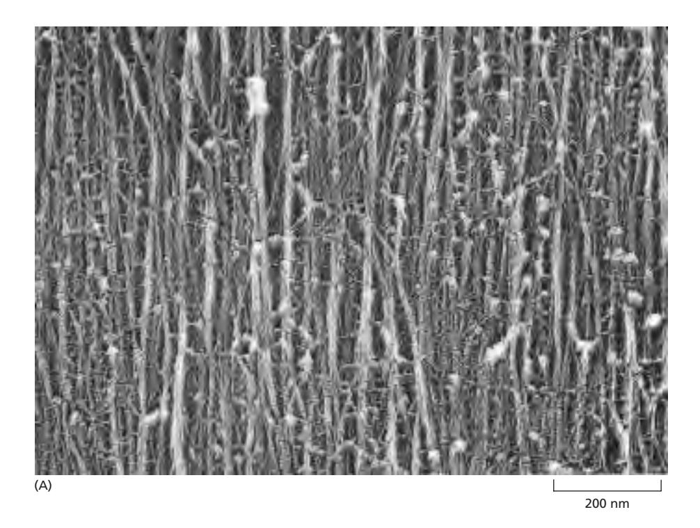

membrane, forming a layer, or lamella, in which all the microfibrils have more or less the same alignment (see Figure 19–64). Each new lamella is deposited internally to the previous one, so that the wall consists of concentrically arranged lamellae, with the oldest on the outside. The most recently deposited microfibrils in elongating cells commonly lie perpendicular to the axis of cell elongation, although the orientation of the microfibrils in the outer lamellae that were laid down earlier may be different (see Figure 19–65B and C).

#### Microtubules Orient Cell Wall Deposition

An important clue to the mechanism that dictates microfibril orientation came from observations of the microtubules in plant cells. These are frequently arranged in the cortical cytoplasm with the same orientation as the cellulose microfibrils that are currently being deposited in the cell wall in that region. These cortical microtubules form a *cortical array* close to the cytosolic face of the plasma membrane, held there by poorly characterized proteins. The congruent orientation of the cortical array of microtubules (lying just inside the plasma membrane) and cellulose microfibrils (lying just outside) is seen in many types and shapes of plant cells and is present during both primary and secondary cell wall deposition, suggesting a causal relationship. MBoC7 m19.64/19.65

This suggestion can be tested by treating a plant tissue with a microtubule-depolymerizing drug so as to disassemble the entire system of cortical microtubules. The consequences for subsequent cellulose deposition, however, are not as straightforward as might be expected. The drug treatment does not disrupt the production of new cellulose microfibrils, and in some cases cells can continue to deposit new microfibrils in the preexisting orientation. Any developmental switch in the orientation of the microfibril pattern that would normally occur between successive lamellae, however, is invariably blocked. It seems that a preexisting orientation of microfibrils can be propagated even in the absence of microtubules, but any change in the deposition of cellulose microfibrils requires that intact microtubules be present to determine the new orientation.

These observations are consistent with the following model. The cellulosesynthesizing rosettes embedded in the plasma membrane spin out long cellulose

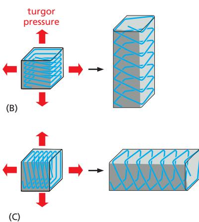

Figure 19–65 Cellulose microfibrils influence the direction of cell elongation. (A) The orientation of cellulose microfibrils in the primary cell wall of an elongating carrot cell is shown in this electron micrograph of a shadowed replica from a rapidly frozen and deep-etched cell wall. The cellulose microfibrils are aligned parallel to one another and perpendicular to the axis of cell elongation. The microfibrils are crosslinked by, and interwoven with, a complex web of matrix molecules (compare with Figure 19–64). (B, C) The cells in B and C start off with identical shapes (shown here as cubes) but with different net orientations of cellulose microfibrils in their walls. Although turgor pressure is uniform in all directions, cell wall loosening allows each cell to elongate only in a direction perpendicular to the orientation of the innermost layer of microfibrils, which have great tensile strength. Cell expansion occurs in concert with the insertion of new wall material. The final shape of an organ, such as a shoot, is determined in part by the direction in which its component cells can expand. (A, courtesy of Brian Wells and Keith Roberts.)

1158 Chapter 19: Cell Junctions and the Extracellular Matrix THE PLANT CELL WALL 1159

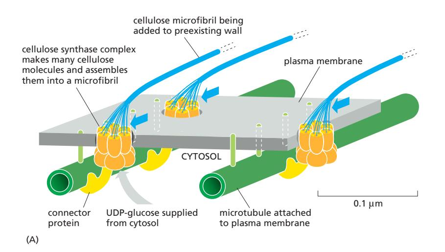

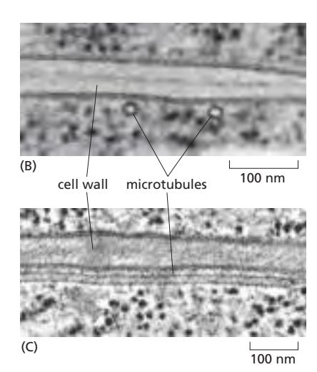

molecules. As the synthesis of cellulose molecules and their self-assembly into microfibrils proceeds, the distal end of each microfibril presumably forms indirect cross-links to the previous layer of wall material, orienting the new microfibril in parallel with the old ones as it becomes integrated into the texture of the wall. Because the microfibril is stiff, the rosette at its growing, proximal end has to move as it deposits the new material. Traveling in the plane of the membrane, the rosette moves in the direction defined by the way in which the far end of the microfibril is anchored in the existing wall. In this way, each layer of microfibrils would tend to be spun out from the membrane in the same orientation as the layer laid down previously, with the rosettes following the direction of the preexisting oriented microfibrils outside the cell. Oriented microtubules inside the cell, however, can force a change in the direction in which the rosettes move: they can create boundaries in the plasma membrane that act like the banks of a canal to constrain rosette movement (**Figure 19–66**). In this view, cellulose synthesis can occur independently of microtubules; but it is constrained spatially when cortical microtubules are present to define membrane microdomains within which the enzyme complex can move. MBoC7 m19.65/19.66

In this way, plant cells can change their direction of expansion by a sudden change in the orientation of their cortical array of microtubules. Because plant cells cannot move (being constrained by their walls), the entire morphology of a multicellular plant presumably depends on a coordinated, highly patterned deployment of cortical microtubule orientations during plant development. It is not known how these orientations are controlled, although it has been shown that the microtubules can reorient rapidly in response to extracellular stimuli, including plant growth regulators such as ethylene and auxins (discussed in Chapter 15).

Microtubules are not, however, the only cytoskeletal elements that influence wall deposition. Local foci of cortical actin filaments can also direct the deposition of new wall material at specific sites on the cell surface, contributing to the elaborate final shaping of many differentiated plant cells.

#### Summary

*Plant cells are surrounded by a tough extracellular matrix, or cell wall, which is responsible for many of the unique features of a plant's lifestyle. The wall is composed of a network of cellulose microfibrils and cross-linking glycans, embedded in a highly cross-linked matrix of pectin polysaccharides. In secondary cell walls, lignin may be deposited to make them waterproof, hard, and woody. A cortical array of microtubules can control the orientation of newly deposited cellulose microfibrils, which in turn determine the direction of cell expansion and therefore the final shape of the cell and, ultimately, of the plant as a whole.*

Figure 19–66 One model of how the orientation of newly deposited cellulose microfibrils might be determined by the orientation of cortical microtubules. (A) The large cellulose synthase complexes, or *rosettes*, are integral membrane proteins that synthesize cellulose microfibrils on the outer face of the plasma membrane. Each rosette contains six enzyme trimers, resulting in the synthesis of the 18 cellulose chains that make up a cellulose microfibril in many plant cells (see Figure 19–63). The distal ends of the stiff microfibrils become integrated into the texture of the wall, and their elongation at the proximal end pushes the synthase complex along in the plane of the membrane. Because the cortical array of microtubules is attached to the plasma membrane in a way that confines this complex to defined membrane channels, the orientation of these microtubules—when they are present—determines the axis along which the new microfibrils are laid down. (B, C) Two electron micrographs show the tight association of the cortical microtubules with the plasma membrane. One shows the microtubules in cross section while the other shows a microtubule in longitudinal section. Both emphasize the constant gap of about 20 nm between membrane and microtubule. (B and C, courtesy of Andrew Staehelin.)

# PROBLEMS

#### Which statements are true? Explain why or why not.

- 19–1 Given the numerous processes inside cells that are regulated by changes in Ca2+ concentration, it seems likely that Ca2+-dependent cell–cell adhesions are also regulated by changes in Ca2+ concentration.
- 19–2 Tight junctions perform two distinct functions: they seal the space between cells to restrict paracellular flow, and they fence off plasma membrane domains to prevent the mixing of apical and basolateral membrane proteins.
- 19–3 The elasticity of elastin derives from its high content of α helices, which act as molecular springs.
- 19–4 Integrins can convert mechanical signals into intracellular molecular signals.
- 19–5 If the entire cortical array of microtubules were disassembled by drug treatment, new cellulose microfibrils would be laid down in random orientations.

#### Discuss the following problems.

- 19–6 Comment on the following (1922) quote from Warren Lewis, who was one of the pioneers of cell biology. "Were the various types of cells to lose their stickiness for one another and for the supporting extracellular matrix, our bodies would at once disintegrate and flow off into the ground in a mixed stream of cells."
- 19–7 Cell adhesion molecules were originally identified using antibodies raised against cell-surface components to block cell aggregation. In the adhesionblocking assays, the researchers found it necessary to use antibody fragments, each with a single binding site (so-called Fab fragments), rather than intact IgG antibodies, which are Y-shaped molecules with two identical binding sites. The Fab fragments were generated by digesting the IgG antibodies with papain, a protease, to separate the two binding sites (**Figure Q19–1**). Why do you suppose it was necessary to use Fab fragments to block cell aggregation?

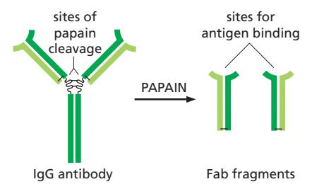

Figure Q19–1 Production of Fab fragments from IgG antibodies by digestion with papain (Problem 19–7).

19–8 The food-poisoning bacterium *Clostridium perfringens* makes a toxin that binds to members of the claudin family of proteins, which are the main constituents of tight junctions. When the C-terminus of the toxin is bound to a claudin, the N-terminus can insert into the adjacent cell membrane, forming holes that kill the cell. The portion of the toxin that binds to the claudins has proven to be a valuable reagent for investigating the properties of tight junctions. MDCK cells are a common choice for studies of tight junctions because they can form an intact epithelial sheet with high transepithelial electrical resistance (low ion permeability). MDCK cells express two claudins: claudin-1, which is not bound by the toxin, and claudin-4, which is.

When an intact MDCK epithelial sheet is incubated with the C-terminal toxin fragment, claudin-4 disappears, becoming undetectable within 24 hours. In the absence of claudin-4, the cells remain healthy and the epithelial sheet appears intact. The mean number of strands in the tight junctions that link the cells also decreases over 24 hours from about four to about two, and they are less highly branched. A functional assay for the integrity of the tight junctions shows that transepithelial resistance decreases dramatically in the presence of the toxin fragment, but the resistance can be restored by washing out the toxin fragment (**Figure Q19–2A**). Curiously, the toxin fragment produces these effects only when it is added to the basolateral side of the sheet; it has no effect when added to the apical surface (**Figure Q19–2B**).

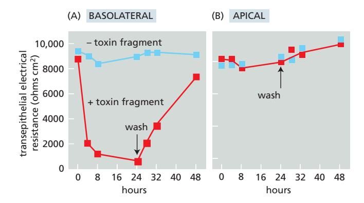

Figure Q19–2 Effects of *Clostridium* toxin fragment on the barrier function of MDCK cells (Problem 19–8). (A) Addition of toxin fragment from the basolateral side of the epithelial sheet. (B) Addition of toxin fragment from the apical side of the epithelial sheet. For a given voltage, a higher resistance (ohms cm2) gives less paracellular current.

- A. How can it be that two tight-junction strands remain, even though all of the claudin-4 has disappeared? MBoC7 Q19.02
- B. Why do you suppose the toxin fragment works when it is added to the basolateral side of the epithelial sheet but not when added to the apical side?
- 19–9 The glycosaminoglycan polysaccharide chains that are linked to specific core proteins to form the proteoglycan components of the extracellular space are highly negatively charged. How do you suppose these negatively

1160 Chapter 19: Cell Junctions and the Extracellular Matrix PROBLEMS 1161

charged polysaccharide chains help to establish a hydrated gel-like environment around the cell? How would the properties of these molecules differ if the polysaccharide chains were uncharged?

19–10 At body temperature, l-aspartate in proteins is converted to its optimal isomer d-aspartate at an appreciable rate. Most proteins in the body have a very low level of d-aspartate, if it can be detected at all. Elastin, however, has a fairly high level of d-aspartate. Moreover, the amount of d-aspartate increases in direct proportion to the age of the person from whom the sample was taken. Why do you suppose that most proteins have little if any d-aspartate, while elastin has levels of d-aspartate that increase steadily with age?

19–11 It is not an easy matter to assign particular functions to specific components of the basal lamina, because the overall structure is a complicated composite material with both mechanical and signaling properties. Nidogen, for example, cross-links two central components of the basal lamina by binding to the laminin γ chain and to type IV collagen. Given such a key role, it was surprising that mice with a homozygous knockout of the gene for nidogen-1 were entirely healthy, with no abnormal phenotype. Similarly, mice homozygous for a knockout of the gene for nidogen-2 also appeared completely normal. By contrast, mice that were homozygous for a defined mutation in the gene for the laminin γ chain, which eliminated just the binding site for nidogen, died at birth with severe defects in lung and kidney formation. The mutant portion of the laminin γ chain is thought to have no other function than to bind nidogen and does not affect laminin structure or its ability to assemble into the basal lamina. How would you explain these genetic observations, which are summarized in **Table Q19–1**? What would you predict would be the phenotype of a mouse that was homozygous for knockouts of both nidogen genes?

| TABLE Q19–1 Phenotypes of mice with genetic defects in components of the basal lamina (Problem 19–11) |                                        |               |  |  |
|----------------------------------------------------------------------------------------------------------|----------------------------------------|---------------|--|--|
| Protein                                                                                                  | Genetic defect                         | Phenotype     |  |  |
| Nidogen-1                                                                                                | Gene knockout (–/–)                    | None          |  |  |
| Nidogen-2                                                                                                | Gene knockout (–/–)                    | None          |  |  |
| Laminin γ chain                                                                                          | Nidogen binding-site deletion (+/–) | None          |  |  |
| Laminin γ chain                                                                                          | Nidogen binding-site deletion (–/–) | Dead at birth |  |  |
| +/– stands for heterozygous, –/– stands for homozygous.                                                  |                                        |               |  |  |

19–12 Discuss the following statement: "The basal lamina of muscle fibers serves as a molecular bulletin board, in which adjoining cells can post messages that direct the differentiation and function of the underlying cells."

19–13 Platelets are flat, disc-like cells with a surface area of about 20 μm2. They have about 80,000 integrin molecules on their surface. If the transmembrane portion of an integrin approximates a cylinder with a 10-nm diameter, how tightly packed are integrins on the surface of a platelet? Imagine that the surface area of the platelet is represented as a grid containing 80,000 squares, each containing one integrin. What is the average distance from one integrin to its neighbor? (Assume each integrin is at the center of its square.)

19–14 The affinity of integrins for matrix components can be modulated by changes to their cytoplasmic domains: a process known as inside-out signaling. You have identified a key region in the cytoplasmic domains of αIIbβ3 integrin that seems to be required for inside-out signaling (**Figure Q19–3**). Substitution of alanine for either D723 in the β chain or R995 in the α chain leads to a high level of spontaneous activation, under conditions where the wildtype chains are inactive. Your advisor suggests that you convert the aspartate in the β chain to an arginine (D723R) and the arginine in the α chain to an aspartate (R995D). You compare all three α chains (R995, R995A, and R995D) against all three β chains (D723, D723A, and D723R). You find that all pairs have a high level of spontaneous activation, except D723 versus R995 (the wild type) and D723R versus R995D, which have low levels. On the basis of these results, how do you think the αIIbβ3 integrin is held in its inactive state?

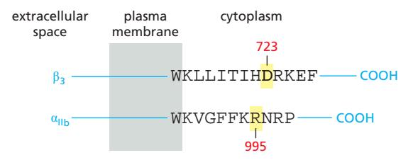

Figure Q19–3 Schematic representation of αIIbβ3 integrin (Problem 19–14). (From P.E. Hughes et al., *J. Biol. Chem.* 271:6571–6574, 1996. With permission from American Society for Biochemistry and Molecular Biology.)

MBoC7 Q19.03 19–15 Your boss is coming to dinner! All you have for a salad is some wilted, day-old lettuce. You vaguely recall that there is a trick to rejuvenating wilted lettuce, but you cannot remember what it is. Should you soak the lettuce in saltwater, soak it in tap water, or soak it in sugar water, or maybe just shine a bright light on it and hope that photosynthesis will perk it up?

19–16 A plant must be able to respond to changes in the water status of its surroundings. It does so by the flow of water molecules through water channels called aquaporins. The hydraulic conductivity of a single aquaporin is 4.4 × 10–22 m3 per second per MPa (megapascal) of pressure. What does this correspond to in terms of water molecules per second at atmospheric pressure? [Atmospheric pressure is 0.1 MPa (1 bar) and the concentration of water is 55.5 M.]

# REFERENCES

#### General

Beckerle M (ed.) (2002) Cell Adhesion. Oxford: Oxford University Press. Hynes RO & Yamada KM (eds.) (2011) Extracellular Matrix Biology (Cold Spring Harbor Perspectives in Biology). Cold Spring Harbor, NY: Cold Spring Harbor Laboratory Press.

#### Cell–Cell Junctions

- Brasch J, Harrison OJ, Honig B & Shapiro L (2012) Thinking outside the cell: how cadherins drive adhesion. *Trends Cell Biol.* 22, 299–310.
- Bruser L & Bogdan S (2017) Adherens junctions on the move membrane trafficking of E-cadherin. *Cold Spring Harb. Perspect. Biol.* 9, a0219140.
- Garcia MA, Nelson WJ & Chavez N (2018) Cell-cell junctions organize structural and signaling networks. *Cold Spring Harb. Perspect. Biol.* 10, a029181.
- Goodenough DA & Paul DL (2009) Gap junctions. *Cold Spring Harb. Perspect. Biol.* 1, a002576.
- Harris TJ & Tepass U (2010) Adherens junctions: from molecules to morphogenesis. *Nat. Rev. Mol. Cell Biol.* 11, 502–514.
- Honig B & Shapiro L (2020) Adhesion protein structure, molecular affinities, and principles of cell-cell recognition. *Cell* 181, 520–535.
- Lecuit T, Lenne PF & Munro E (2011) Force generation, transmission, and integration during cell and tissue morphogenesis. *Annu. Rev. Cell Dev. Biol.* 27, 157–184.
- Lu KJ, Danila FR, Cho Y & Faulkner C (2018) Peeking at a plant through the holes in the wall—exploring the roles of plasmodesmata. *New Phytol.* 218, 1310–1314.
- Maule AJ, Benitez-Alfonso Y & Faulkner C (2011) Plasmodesmata membrane tunnels with attitude. *Curr. Opin. Plant Biol.* 14, 683–690.
- McEver RP & Zhu C (2010) Rolling cell adhesion. *Annu. Rev. Cell Dev. Biol.* 26, 363–396.
- Najor NA (2018) Desmosomes in human disease. *Annu. Rev. Pathol.*  13, 51–70.
- Nakagawa S, Maeda S & Tsukihara T (2010) Structural and functional studies of gap junction channels. *Curr. Opin. Struct. Biol.* 20, 423–430.
- Pinheiro D & Bellaïche Y (2018) Mechanical force-driven adherens junction remodeling and epithelial dynamics. *Dev. Cell* 47, 3–19.
- Takeichi M (2014) Dynamic contacts: rearranging adherens junctions to drive epithelial remodelling. *Nat. Rev. Mol. Cell Biol.* 15, 397–410.
- Yap AS, Duszyc K & Viasnoff V (2018) Mechanosensing and mechanotransduction at cell-cell junctions. *Cold Spring Harb. Perspect. Biol.* 10, a028761.

#### The Extracellular Matrix of Animals

- Couchman JR (2010) Transmembrane signaling proteoglycans. *Annu. Rev. Cell Dev. Biol.* 26, 89–114.
- Domogatskaya A, Rodin S & Tryggvason K (2012) Functional diversity of laminins. *Annu. Rev. Cell Dev. Biol.* 28, 523–553.
- Fidler AL, Boudko SP, Rokas A & Hudson BG (2018) The triple helix of collagens—an ancient protein structure that enabled animal multicellularity and tissue evolution. *J. Cell Sci.* 131, jcs203950.
- Fidler AL, Darris CE, Chetyrkin SV . . . Hudson BG (2017) Collagen IV and basement membrane at the evolutionary dawn of metazoan tissues. *eLife* 6, e24176.
- Hynes RO & Naba A (2012) Overview of the matrisome—an inventory of extracellular matrix constituents and functions. *Cold Spring Harb. Perspect. Biol.* 4, a004903.
- Jayadev R & Sherwood DR (2017) Basement membranes. *Curr. Biol.*  27, R207–R211.
- Karamanos NK, Theocharis AD, Piperigkou Z . . . Onisto M (2021) A guide to the composition and functions of the extracellular matrix. *FEBS J*. (in press). Available at https://febs.onlinelibrary.wiley.com /doi/epdf/10.1111/febs.15776

- Lu P, Takai K, Weaver VM & Werb Z (2011) Extracellular matrix degradation and remodeling in development and disease. *Cold Spring Harb. Perspect. Biol.* 3, a005058.
- Mouw JK, Ou G & Weaver VM (2014) Extracellular matrix assembly: a multiscale deconstruction. *Nat. Rev. Mol. Cell Biol.* 15, 771–785.
- Muncie JM & Weaver VM (2018) The physical and biochemical properties of the extracellular matrix regulate cell fate. *Curr. Top. Dev. Biol.* 130, 1–37.
- Pozzi A, Yurchenco PD & Iozzo RV (2017) The nature and biology of basement membranes. *Matrix Biol.* 57–58, 1–11.
- Ricard-Blum S (2011) The collagen family. *Cold Spring Harb. Perspect. Biol.* 3, a004978.
- Schmelzer CEH & Duca L (2021) Elastic fibers: formation, function and fate during aging and disease. *FEBS J*. (in press). Available at https://febs.onlinelibrary.wiley.com/doi/epdf/10.1111/febs.15899
- Townley RA & Bülow HE (2018) Deciphering functional glycosaminoglycan motifs in development. *Curr. Opin. Struct. Biol.* 50, 144–154.

#### Cell–Matrix Junctions

- Bachmann M, Kukkurainen S, Hytonen VP & Wehrle-Haller B (2019) Cell adhesion by integrins. *Physiol. Rev.* 99, 1655–1699.
- Calderwood DA, Campbell ID & Critchley DR (2013) Talins and kindlins: partners in integrin-mediated adhesion. *Nat. Rev. Mol. Cell Biol.* 14, 503–517.
- Goult BT, Yan J & Schwartz MA (2018) Talin as a mechanosensitive signaling hub. *J. Cell Biol.* 217, 3776–3784.
- Hogg N, Patzak I & Willenbrock F (2011) The insider's guide to leukocyte integrin signalling and function. *Nat. Rev. Immunol.* 11, 416–426.
- Humphrey JD, Dufresne ER & Schwartz MA (2014) Mechanotransduction and extracellular matrix homeostasis. *Nat. Rev. Mol. Cell Biol.* 15, 802–812.
- Jansen KA, Atherton P & Ballestrem C (2017) Mechanotransduction at the cell-matrix interface. *Semin. Cell Dev. Biol.* 71, 75–83.
- Matellan C & Del Rio Hernandez AE (2019) Engineering the cellular mechanical microenvironment—from bulk mechanics to the nanoscale. *J. Cell Sci.* 132, jcs229013.
- Ross TD, Coon BG, Yun S, . . . Schwartz MA (2013) Integrins in mechanotransduction. *Curr. Opin. Cell Biol.* 25, 613–618.
- Shattil SJ, Kim C & Ginsberg MH (2010) The final steps of integrin activation: the end game. *Nat. Rev. Mol. Cell Biol.* 11, 288–300.
- Sun Z, Costell M & Fässler R (2019) Integrin activation by talin, kindlin and mechanical forces. *Nat. Cell Biol.* 21, 25–31.

#### The Plant Cell Wall

- Albersheim P, Darvill A, Roberts K et al. (2011) Plant Cell Walls: From Chemistry to Biology. New York: Garland Science.
- Braidwood L, Breuer C & Sugimoto K (2014) My body is a cage: mechanisms and modulation of plant cell growth. *New Phytol.* 201, 388–402.
- Keegstra K (2010) Plant cell walls. *Plant Physiol.* 154, 483–486.
- Lampugnani ER, Khan GA, Somssich M & Persson S (2018) Building a plant cell wall at a glance. *J. Cell Sci.* 131, jcs207373.
- Lloyd C (2011) Dynamic microtubules and the texture of plant cell walls. *Int. Rev. Cell Mol. Biol.* 287, 287–329.
- McFarlane HE, Doring A & Persson S (2014) The cell biology of cellulose synthesis. *Annu. Rev. Plant Biol.* 65, 69–94.
- Meents MJ, Watanabe Y & Samuels AL (2018) The cell biology of secondary cell wall biosynthesis. *Ann. Bot.* 121, 1107–1125.
- Polko JK & Kieber JJ (2019) The regulation of cellulose biosynthesis in plants. *Plant Cell* 31, 282–296.
- Szymanski DB & Cosgrove DJ (2009) Dynamic coordination of cytoskeletal and cell wall systems during plant cell morphogenesis. *Curr. Biol.* 19, R800–R811.
- Wolf S, Hematy K & Hofte H (2012) Growth control and cell wall signaling in plants. *Annu. Rev. Plant Biol.* 63, 381–407.