# Visualizing Cells and Their Molecules

CHAPTER

9

Understanding the structural organization of cells, and the macromolecules that build and animate them, is essential for learning how they function. In this chapter, we briefly describe some of the principal light and electron microscopy methods used to study cells and molecules. In the past decade or so, there have been major technical developments in both methods that allow us to see biological structures with increasing resolution and clarity. Optical microscopy will be our starting point because cell biology began with the light microscope, and it is still an indispensable tool. The development of methods for the specific labeling and imaging of individual cellular constituents and the reconstruction of their three-dimensional architecture has meant that, far from falling into disuse, optical microscopy continues to increase in importance. One advantage of optical microscopy is that light is relatively nondestructive. By tagging specific cell components with fluorescent probes, such as intrinsically fluorescent proteins, we can watch their movement, dynamics, and interactions in living cells.

Although conventional optical microscopy is limited in resolution by the wavelength of visible light, new methods cleverly bypass this limitation and allow the exact position of even single molecules to be mapped. By using a beam of electrons instead of visible light, electron microscopy can image the interior of cells, and their macromolecular components, at almost atomic resolution and in three dimensions. But all imaging methods involve trade-offs; in this case, the higher resolution means only small objects are imaged and only in fixed, dead cells. There is now a bewildering variety of imaging technologies for the cell biologist to choose from, and when some of these are described later in the chapter, it is worth considering why you might use one rather than another. Trade-offs will always have to be made between thin and thick specimens, living and fixed cells, high and low resolution, fast and slow imaging, signal and noise, or cells and molecules.

This chapter is intended as a companion, rather than an introduction, to the chapters that follow; readers may wish to refer back to it as applications of microscopy to basic biological problems are encountered in other chapters of the book.

# LOOKING AT CELLS AND MOLECULES IN THE LIGHT MICROSCOPE

A typical animal cell is 10–20 μm in diameter, which is just less than a tenth the size of the smallest object that we can normally see with the naked eye. Only after good light microscopes became available in the early part of the nineteenth century did Matthias Schleiden and Theodor Schwann propose that all plant and animal tissues were aggregates of individual cells. Their proposal in 1838, known as the **cell doctrine**, marks the formal birth of cell biology.

Animal cells are not only tiny, but they are also colorless and translucent. The discovery of their main internal features, therefore, depended on the development, in the late nineteenth century, of a variety of stains that provided sufficient color and contrast to make those features visible. Similarly, the far

#### IN THIS CHAPTER

Looking at Cells and Molecules in the Light Microscope

Looking at Cells and Molecules in the Electron Microscope

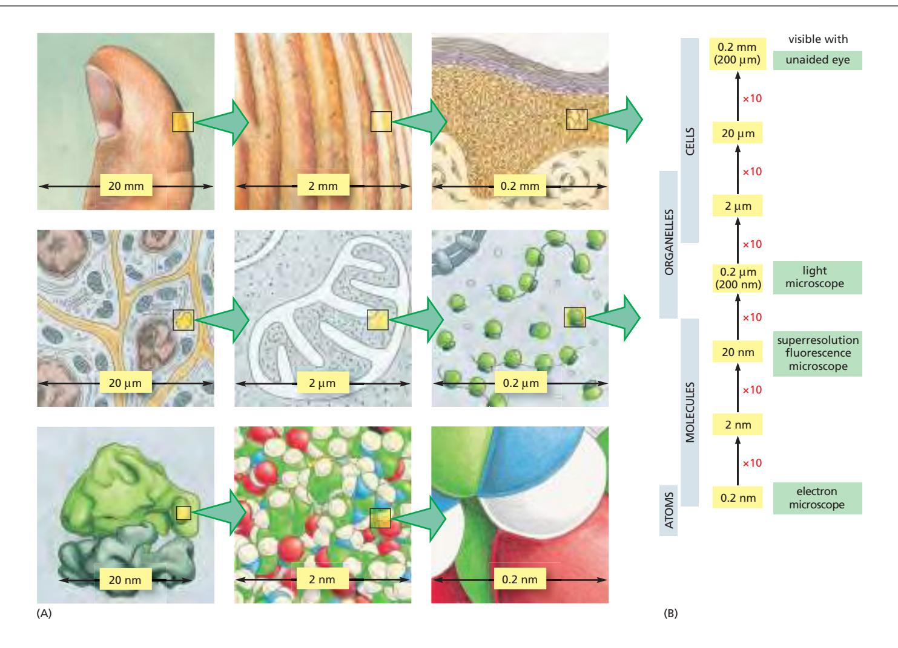

more powerful electron microscope introduced in the early 1940s required the development of new techniques for preserving and staining cells before the full complexities of their internal fine structure could begin to emerge. To this day, microscopy often relies as much on techniques for preparing the specimen as on the performance of the microscope itself. In the following discussions, we therefore consider both instruments and specimen preparation, beginning with the light microscope. MBoC7 e1.09/9.01

The images in **Figure 9–1A** illustrate a stepwise progression from a thumb to a cluster of atoms. Each successive image represents a tenfold increase in magnification. The naked eye can see features in the first two panels, the light microscope allows us to see details corresponding to about the fifth panel, and the electron microscope takes us to about the eighth or ninth panel. **Figure 9–1B** shows the sizes of various cellular and subcellular structures and the ranges of size that different types of microscopes can visualize.

# The Conventional Light Microscope Can Resolve Details 0.2 μm Apart

For well over 100 years, all microscopes were constrained by a fundamental limitation: that a given type of radiation cannot be used to probe structural details much smaller than its own wavelength. A limit to the resolution of a light microscope was therefore set by the wavelength of visible light, which ranges from about 0.4 μm (for violet) to 0.7 μm (for deep red). In practical terms, bacteria and mitochondria, which are about 500 nm (0.5 μm) wide, are generally the smallest objects whose shape we can clearly discern in a standard **light microscope**;

Figure 9–1 A sense of scale between living cells and atoms. (A) Each diagram shows an image magnified by a factor of 10 in an imaginary progression from a thumb, through skin cells, to a ribosome, to a cluster of atoms forming part of one of the many protein molecules in the ribosome. Atomic details of biological macromolecules, as shown in the last two panels, are just within the power of the electron microscope. While color has been used here in all the panels, it is not a feature of objects much smaller than the wavelength of light, so the last five panels should really be in black and white. (B) Sizes of cells and their components are shown on a logarithmic scale, indicating the range of objects that can readily be resolved by the naked eye and in the light and electron microscopes. Note that new superresolution microscopy techniques, discussed in detail later, allow an improvement in resolution by an order of magnitude compared with conventional light microscopy.

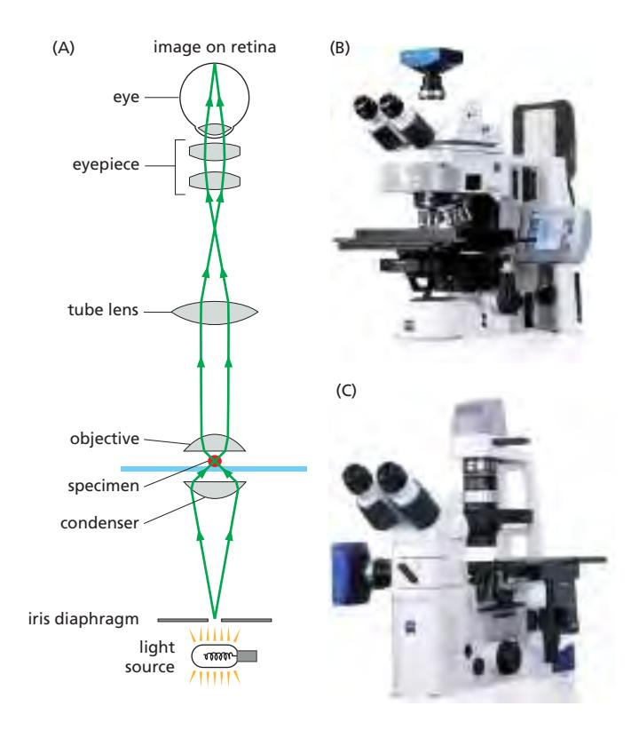

#### Figure 9–2 A light microscope.

(A) Diagram showing the light path in an upright compound microscope. Light is focused on the specimen by lenses in the condenser. A combination of objective lenses, tube lenses, and eyepiece lenses is arranged to focus an image of the illuminated specimen in the eye. (B) A modern upright research light microscope. (C) A modern inverted microscope, particularly useful for looking at cells in culture. Both microscopes are equipped for fluorescence imaging (B and C, courtesy of Carl Zeiss Microscopy, GmbH.)

details smaller than this are obscured by effects resulting from the wave-like nature of light. Let us follow the behavior of a beam of light as it passes through the lenses of a microscope (**Figure 9–2**).

Because of its wave nature, light does not follow the idealized straight ray paths that geometrical optics predicts. Instead, light waves travel through an optical system by many slightly different routes, like ripples in water, so that they interfere with one another and cause *optical diffraction* effects. If two trains of waves reaching the same point by different paths are precisely *in phase*, with crest matching crest and trough matching trough, they will reinforce each other so as to increase brightness. In contrast, if the trains of waves are *out of phase*, they will interfere with each other in such a way as to cancel each other partly or entirely (**Figure 9–3**). The interaction of light with an object changes the phase relationships of the light waves in a way that produces complex interference effects. At high magnification, for example, the shadow of an edge that is evenly illuminated with light of uniform wavelength appears as a set of parallel lines (**Figure 9–4A**), MBoC7 m9.03/9.02

The following units of length are commonly employed in microscopy:

μm (micrometer) = 10–6 m nm (nanometer) = 10–9 m Å (angstrom) = 10–10 m

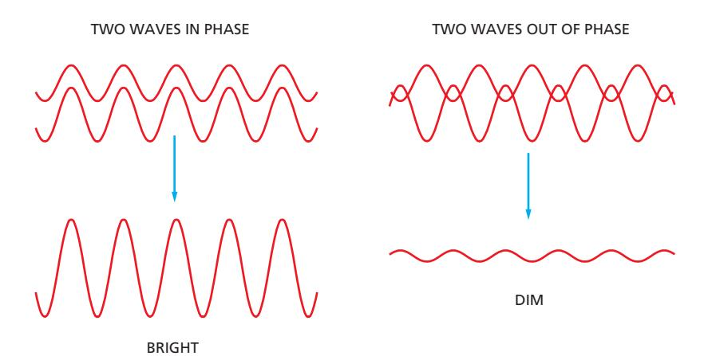

Figure 9–3 Interference between light waves. When two light waves combine in phase, the amplitude of the resultant wave is larger, and the brightness is increased. Two light waves that are out of phase cancel each other partly and produce a wave whose amplitude, and therefore brightness, is decreased.

whereas the smallest focused image of a bright circular aperture appears as a set of concentric rings (**Figure 9–4B**). For the same reason, a single point seen through a microscope appears as a blurred disc, and two point objects close together give overlapping images and may merge into one. Although no amount of refinement of the lenses can overcome the diffraction limit imposed by the wave-like nature of light, other ways of cleverly bypassing this limit have emerged, creating so-called superresolution imaging techniques that can even detect the position of single molecules. These are discussed later in the chapter.

The limiting separation at which two objects appear distinct—the so-called **limit of resolution**—depends on both the wavelength of the light and the *numerical aperture* of the lens system used. The numerical aperture affects the light-gathering ability of the lens and is related both to the angle of the cone of light that can enter it and to the refractive index of the medium the lens is operating in; the wider the microscope opens its eye, so to speak, the more sharply it can see (**Figure 9–5**). The *refractive index* is the ratio of the speed of light in a vacuum to the speed of light in a particular transparent medium. For example, for water this is 1.33, meaning that light travels 1.33 times slower in water than in a vacuum. Under the best conditions, with violet light (wavelength = 0.4 μm) and a numerical aperture of 1.4, the basic light microscope can theoretically achieve a limit of resolution of about 0.2 μm, or 200 nm. Some microscope makers at the end of the nineteenth century achieved this resolution, but it is routinely matched in contemporary, factory-produced microscopes. Although it is possible to *enlarge*  an image as much as we want—for example, by projecting it onto a screen—it is not possible, in a conventional light microscope, to resolve two objects in the light microscope that are separated by less than about 0.2 μm; they will always appear as a single object. It is important, however, to distinguish between *resolution* and *detection*. If a small object, below the resolution limit, itself emits light, then we may still be able to see or detect it. Thus, we can see a single fluorescently labeled microtubule even though it is about 10 times thinner than the resolution limit of the light microscope. Diffraction effects, however, will cause it to appear blurred and at least 0.2 μm thick (see Figure 9–14). In a similar way, we can see the stars in the night sky, even though their diameters are far below the angular resolution of our unaided eyes: they all appear as similar, slightly blurred points of light, differing only in their color and brightness.

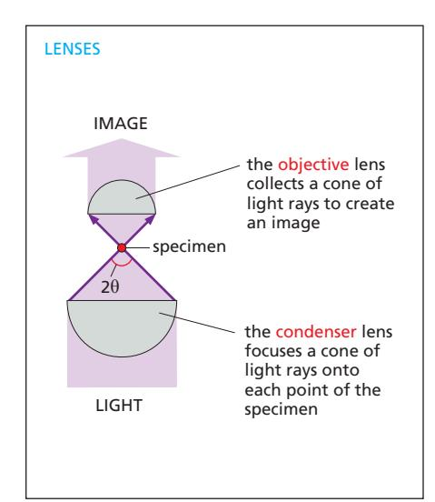

RESOLUTION: the resolving power of the microscope depends on the width of the cone of illumination and therefore on both the condenser and the objective lens. It is calculated using the formula

> resolution = 0.61 λ *n* sin θ

where:

- half the angular width of the cone of rays collected by the objective lens from a typical point in the central region of the specimen (because the maximum width is 180o, sin θ has a maximum value of 1) θ =
- the refractive index of the medium (usually air or oil) separating the specimen from the objective and condenser lenses *n* =
- the wavelength of light used (for white light a figure of 0.53 µm is commonly assumed) λ =

NUMERICAL APERTURE: *n* sin θ in the equation above is called the numerical aperture of the lens and is a function of its lightcollecting ability. For dry lenses this cannot be more than 1, but for oil-immersion lenses it can be as high as 1.4. The higher the numerical

aperture, the greater the resolution and the brighter the image (brightness is important in fluorescence microscopy). However, this advantage does necessitate very short working distances and a very small depth of field, just as in a conventional camera.

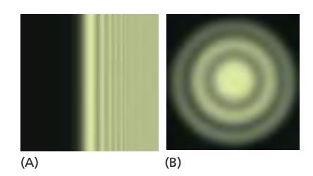

MBoC7 m9.05/9.04 Figure 9–4 Images of an edge and of a point of light. (A) The interference effects, or fringes, seen at high magnification when light of a specific wavelength passes the edge of a solid object placed between the light source and the observer. (B) The image of a point source of light. Diffraction spreads this out into a complex, circular pattern, whose width depends on the numerical aperture of the optical system: the smaller the aperture, the bigger (more blurred) the diffracted image. Two point sources can be just resolved when the center of the image of one lies within the first dark ring in the image of the other: this is used to define the limit of resolution.

Figure 9–5 Basic principles of light microscopy. The path of light rays passing through a transparent specimen in a microscope illustrates the concept of numerical aperture and its relation to the limit of resolution. The higher the numerical aperture of a lens, the brighter the image it forms and the higher its resolution.

# Photon Noise Creates Additional Limits to Resolution When Light Levels Are Low

Any image, whether produced by an electron microscope or by an optical microscope, is made by particles—electrons or photons—striking a detector of some sort. But these particles are governed by quantum mechanics, so the numbers reaching the detector are predictable only in a statistical sense. Finite samples, collected by imaging for a limited period of time (that is, by taking a snapshot), will show random variation: successive snapshots of the same scene will not be exactly identical. Moreover, every detection method has some level of background signal or noise, adding to the statistical uncertainty. With bright illumination, corresponding to very large numbers of photons or electrons, the features of the imaged specimen are accurately determined on the basis of the distribution of these particles at the detector. However, with smaller numbers of particles, the structural details of the specimen are obscured by the statistical fluctuations in the numbers of particles detected in each region, which give the image a speckled appearance and limit its precision. The term *noise* describes this random variability. Because noise in the image is proportional to the square root of the number of photons that are detected (or electrons in electron microscopy), then as the number of photons or electrons recorded increases, the absolute noise also increases, but because of the square root relationship, the percentage of noise decreases, in other words the signal-to-noise ratio improves. A poor signal-to-noise ratio is an important consideration when weak fluorescent light signals are recorded or low, but less damaging, electron doses are required.

# Living Cells Are Seen Clearly in a Phase-Contrast or a Differential-Interference-Contrast Microscope

There are many ways in which contrast in a specimen can be generated (**Figure 9–6**). While fixing and staining a specimen can generate contrast through color (Figure 9–6A), microscopists have always been challenged by the possibility that some components of the cell may be lost or distorted during specimen preparation. The only certain way to avoid the problem is to examine cells while they are alive, without fixing or freezing. For this purpose, light microscopes with special optical systems are especially useful.

In the normal **bright-field microscope**, light passing through a cell in culture forms the image directly. Another system, **dark-field microscopy**, exploits the fact that light rays can be scattered in all directions by small objects in their path.

Figure 9–6 Contrast in light microscopy. (A) The stained portion of the cell will absorb light of some wavelengths, which depends on the stain, but will allow other wavelengths to pass through it. A colored image of the cell is thereby obtained that is visible in the normal bright-field light microscope. (B) In the dark-field microscope, oblique rays of light focused on the specimen do not enter the objective lens, but light that is scattered by components in the living cell can be collected to produce a bright image on a dark background. (C) Light passing through the unstained living cell experiences very little change in amplitude, and the structural details cannot be seen even if the image is highly magnified. The phase of the light, however, is altered by its passage through either thicker or denser parts of the cell, and small phase differences can be made visible by exploiting interference effects using a phase-contrast or a differentialinterference-contrast microscope.

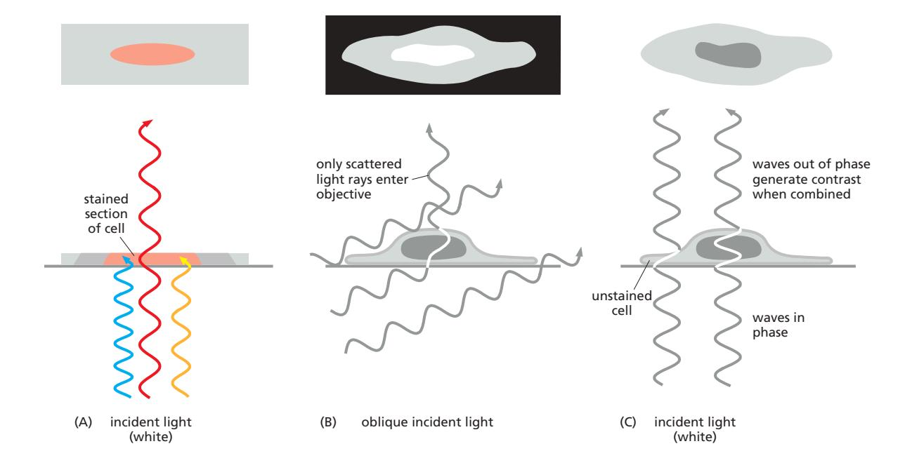

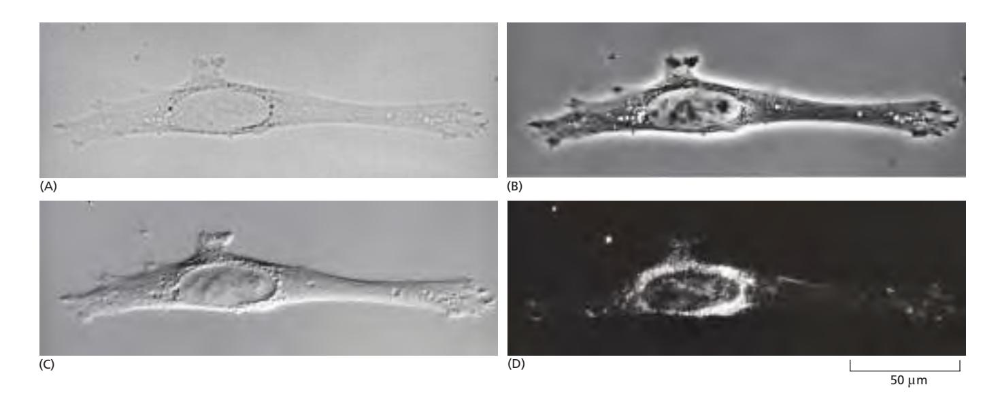

If oblique lighting from the condenser is used, which does not directly enter the objective, unstained objects in a living cell can scatter the rays, some of which then enter the objective to create a bright image against a black background (Figure 9–6B).

When light passes through a living cell, the phase of the light wave is changed according to the cell's refractive index: a relatively thick or dense part of the cell, such as a nucleus, slows the light passing through it. The phase of the light, consequently, is shifted relative to light that has passed through an adjacent thinner region of the cytoplasm (Figure 9–6C). The **phase-contrast microscope** and, in a more complex way, the **differential-interference-contrast microscope** increase these phase differences to produce amplitude differences, or contrast, when the sets of waves recombine, thereby creating an image of the cell's structure. Both types of light microscopy are widely used to look at living cells (see Movie 17.2). **Figure 9–7** compares images of the same cell obtained by four kinds of light microscopy. MBoC7 m9.08/9.07

Phase-contrast, differential-interference-contrast, and dark-field microscopy make it possible to watch the movements involved in such processes as mitosis and cell migration. Because many cellular motions are too slow to be seen in real time, it is often helpful to make time-lapse videos in which the camera records successive frames separated by a short time delay, so that when the resulting picture series is played at normal speed, events appear greatly speeded up.

#### Images Can Be Enhanced and Analyzed by Digital Techniques

Digital imaging systems, and the associated technology of **image processing**, have had a major impact on light microscopy. Certain practical limitations of microscopes relating to imperfections in their optical components have been largely overcome. Digital imaging systems have also circumvented two fundamental limitations of the human eye: the eye cannot see well in extremely dim light, and it cannot perceive small differences in light intensity against a bright background. To increase our ability to observe cells in these difficult conditions, we can attach a sensitive digital camera to a microscope. These cameras detect light by means of high-sensitivity complementary metal-oxide semiconductor (CMOS) sensors, similar to those now found in digital cameras and smartphones. Such image sensors can count individual photons and are many times more sensitive than the human eye and can detect 100 times more intensity levels. It is therefore possible to observe cells for long periods at very low light levels, thereby avoiding the damaging effects of prolonged bright light (and heat). Such sensitive detectors are especially important for viewing fluorescent molecules in living cells, as explained later.

Because images produced by digital cameras are in electronic form, they can be processed in various ways to extract latent information. Such image processing

Figure 9–7 Four types of light microscopy. Four images are shown of the same fibroblast cell in culture. All images can be obtained with most modern microscopes by interchanging optical components. (A) Bright-field microscopy, in which light is transmitted straight through the specimen. (B) Phase-contrast microscopy, in which phase alterations of light transmitted through the specimen are translated into brightness changes. (C) Differential-interference-contrast microscopy, which highlights edges where there is a steep change of refractive index. (D) Dark-field microscopy, in which the specimen is lit from the side and only the scattered light is seen.

makes it possible to compensate for several aberrations in the lenses of microscopes. Moreover, by digital image processing, contrast can be greatly enhanced to overcome the eye's limitations in detecting small differences in light intensity, and background irregularities in the optical system can be digitally subtracted. This procedure reveals small transparent objects that were previously impossible to distinguish from the background.

# Intact Tissues Are Usually Fixed and Sectioned Before Microscopy

Looking at individual living cells in culture is relatively easy, but most cells are found in complex tissues and organs, and this forces another trade-off when we want to look at them. Because most tissue samples are too thick for their individual cells to be examined directly at high resolution, they are often cut into very thin transparent slices, or *sections*. To preserve the cells within the tissue they must first be treated with a *fixative*. A common fixative is glutaraldehyde, which forms covalent bonds with the free amino groups of proteins, cross-linking them so they are stabilized and locked into position.

Because tissues are generally soft and fragile, even after fixation, they need to be either frozen or embedded in a supporting medium before they can be sectioned. The usual embedding media are waxes or resins. In liquid form, these media both permeate and surround the fixed tissue before being hardened (by cooling or by polymerization) to form a solid block, which is readily sectioned with a microtome. This is a machine with a sharp blade, usually of steel or glass, which operates like a meat slicer (**Figure 9–8**). The sections (typically 0.5–10 μm thick) are then laid flat on the surface of a glass microscope slide.

There is little in the contents of most cells (which are 70% water by weight) to impede the passage of light rays. Thus, most cells in their natural state, particularly if fixed and sectioned, are almost invisible in an ordinary light microscope. We have seen that cellular components can be made visible by techniques such as phase-contrast and differential-interference-contrast microscopy, but these methods tell us almost nothing about the underlying chemistry. There are three main approaches to working with thin tissue sections that reveal differences in the types of molecules that are present.

First, and traditionally, sections can be stained with organic dyes that have some specific affinity for particular subcellular components. The dye hematoxylin, for example, has an affinity for negatively charged molecules and therefore reveals the general distribution of DNA, RNA, and acidic proteins in a cell (**Figure 9–9**). The chemical basis for the specificity of many dyes, however, is not known, although they are used widely in hospital laboratories.

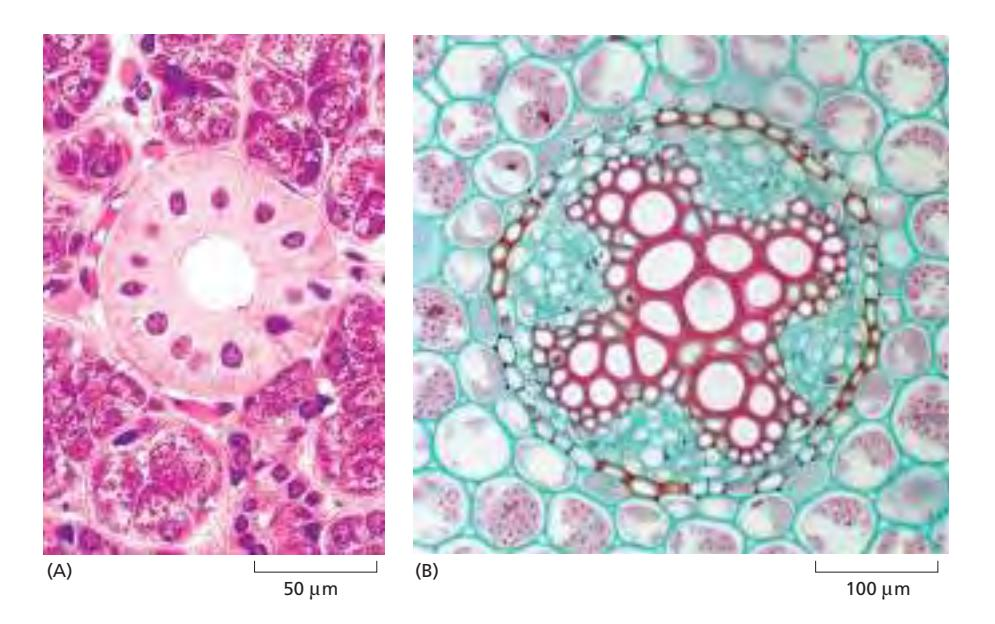

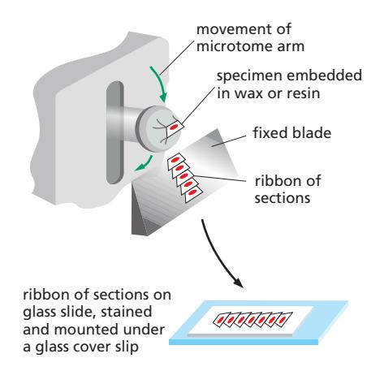

Figure 9–8 Making tissue sections. This illustration shows how an embedded tissue is sectioned with a microtome in preparation for examination in the light microscope. Very rapidly frozen samples can also be sectioned, and these better preserve the structure of cells in their native state.

Figure 9–9 Staining of cell components. (A) This section of cells in a salivary gland was stained with hematoxylin and eosin, two dyes commonly used in histology. The central duct is made of closely packed cells with nuclei stained *purple* and cytoplasm stained *red*. The duct is surrounded by groups of saliva-secreting cells. (B) This section of a young plant root is stained with two dyes, safranin and fast green. Fast green stains the cellulosic cell walls, while the safranin stains the lignified xylem cell walls *red*. (A, from R.L. Sorenson and T.C. Brelje, Atlas of Human Histology: A Guide to Microscopic Structure of Cells, Tissues and Organs, 3rd ed., 2014. With permission from the authors; B, courtesy of University of Wisconsin Plant Teaching Collection.)

Second, sectioned tissues can be used to visualize specific patterns of differential gene expression. A third and very sensitive approach, generally and widely applicable for localizing proteins of interest, depends on the use of fluorescent probes and markers, as we explain next.

# Specific Molecules Can Be Located in Cells by Fluorescence Microscopy

Fluorescent molecules absorb light at one wavelength and emit it at another, longer wavelength (**Figure 9–10A and B**). If we illuminate such a molecule at its absorbing wavelength and then view it through a filter that allows only light of the emitted wavelength to pass, it will glow against a dark background. Because the background is dark, even a minute amount of the glowing fluorescent dye can be detected. In contrast, the same number of molecules of a nonfluorescent stain, viewed conventionally, would be practically indiscernible because the absorption of light by molecules in the stain would result in only the faintest tinge of color in the light transmitted through that part of the specimen.

The fluorescent dyes used for staining cells are visualized with a **fluorescence microscope**. This microscope is similar to an ordinary upright or inverted light microscope except that the illuminating light, from a very powerful source, is passed through two sets of filters—one to filter the light before it reaches the specimen, and one to filter the light obtained from the specimen. The first filter passes only the wavelengths that excite the particular fluorescent dye, while the second filter blocks out this light and passes only those wavelengths emitted when the dye fluoresces (**Figure 9–10C**).

Fluorescence microscopy is most often used to detect specific proteins or other molecules in cells and tissues. For example, when using fluorescent nucleotide probes, *in situ* hybridization, discussed earlier (see Figure 8–63), can reveal

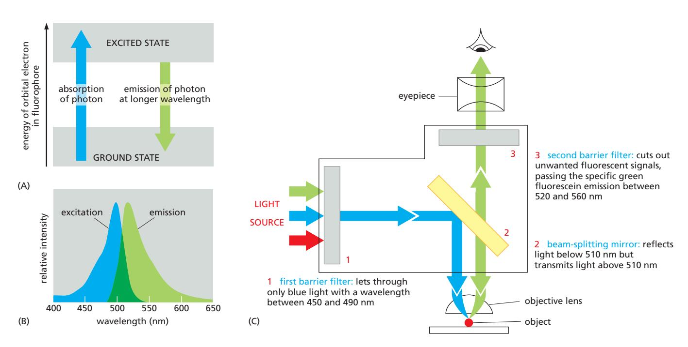

Figure 9–10 Fluorescence and the fluorescence microscope. (A) An orbital electron of a fluorochrome molecule can be raised to an excited state after the absorption of a photon. Fluorescence occurs when the electron returns to its ground state and emits a photon of light at a longer wavelength. Too much exposure to light or too bright a light can destroy the fluorochrome molecule in a process called *photobleaching*. (B) The excitation and emission spectra for the common fluorescent dye fluorescein isothiocyanate (FITC). (C) In the fluorescence microscope, a filter set consists of two barrier filters (1 and 3) and a dichroic (beam-splitting) mirror (2). This example shows the filter set for detection of the fluorescent molecule fluorescein. High-numerical-aperture objective lenses are especially important in this type of microscopy because, for a given magnification, the brightness of the fluorescent image is proportional to the fourth power of the numerical aperture (see also Figure 9–5).

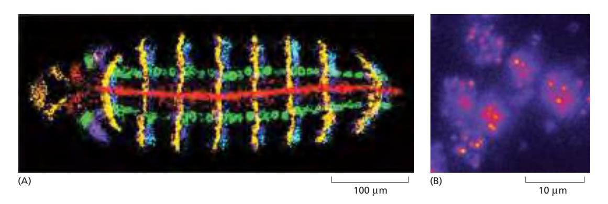

MBoC7 m9.11/9.11 Figure 9–11 RNA *in situ* hybridization. (A) As described in Chapter 8 (see Figure 8–63), it is possible to visualize the distribution of different RNAs in tissues using *in situ* hybridization. Here, the transcription pattern of five different genes involved in patterning the early fruit fly embryo is revealed in a single embryo. Each RNA probe has been fluorescently labeled, and the resulting images are displayed each in a different color ("false-colored") and then combined to give an image where different color combinations represent different sets of genes expressed. The genes whose expression pattern is revealed here are *wingless (yellow)*, *engrailed (blue)*, *short gastrulation (red)*, *intermediate neuroblasts defective (green)*, and *muscle specific homeobox (purple)*. (B) Individual RNA transcripts can be detected in a single cell. Each of these six yeast cells is expressing less than 20 transcripts of a particular gene. Using multiple DNA oligonucleotide probes to that particular gene, each labeled with many fluorescent Cy5 molecules, each individual RNA transcript can be detected as a *red spot*. [A, from D. Kosman et al., *Science* 305:846, 2004. With permission from AAAS; B, from G.M. Wadsworth, R.Y. Parikh, and H.D. Kim, Single-probe RNA FISH in yeast. *Bio Protoc.* 8(11):e2868, 2018, doi 10.21769/BioProtoc.2868.]

the cellular distribution and abundance of specific expressed RNA molecules in sectioned material or in whole mounts of small organisms, organs, or cells (**Figure 9–11**).

A versatile and widely used technique is to couple fluorescent dyes to antibody molecules, which then serve as highly specific and versatile staining reagents that bind selectively to the particular macromolecules they recognize in cells or in the extracellular matrix. Two fluorescent dyes that have been commonly used for this purpose are *fluorescein*, which emits an intense green fluorescence when excited with blue light, and *rhodamine*, which emits a deep red fluorescence when excited with green-yellow light (**Figure 9–12**). By coupling one antibody to fluorescein and another to rhodamine, the distributions of different molecules can be compared in the same cell; the two molecules are visualized separately in the microscope by switching back and forth between two sets of filters, each specific for one dye. As shown in **Figure 9–13**, multiple fluorescent dyes can be used in the same way to clearly distinguish several different types of molecules in the same cell. Many fluorescent dyes, such as Cy3, Cy5, and the Alexa dyes, have been specifically developed for fluorescence microscopy, but, like many organic fluorochromes, they fade fairly rapidly when continually illuminated. Later in the chapter, additional fluorescence microscopy methods will be discussed that can be used to monitor changes in the concentration and location of specific molecules inside

Figure 9–12 Fluorescent probes. The maximum excitation and emission wavelengths of several commonly used fluorescent probes are shown in relation to the corresponding colors of the spectrum. The photon emitted by a fluorescent molecule is necessarily of lower energy (longer wavelength) than the absorbed photon, and this accounts for the difference between the excitation and emission peaks. CFP, GFP, YFP, and RFP are cyan, green, yellow, and red fluorescent proteins, respectively. DAPI is widely used as a general fluorescent DNA probe, which absorbs ultraviolet light and fluoresces bright blue. FITC is an abbreviation for fluorescein isothiocyanate—a widely used derivative of fluorescein—which fluoresces bright green. The other probes are all commonly used to fluorescently label antibodies and other proteins. Note that although the true fluorescence emission colors are shown here, the actual color seen in the microscope will depend on the second barrier filter used (see Figure 9–10), and these are usually optimized so as to allow as many different non-overlapping colored probes to be seen in the same specimen. Thus although YFP emits in the green spectrum, it actually appears as a yellow-green in the microscope because of the filter used. The use of fluorescent proteins will be discussed later in the chapter.

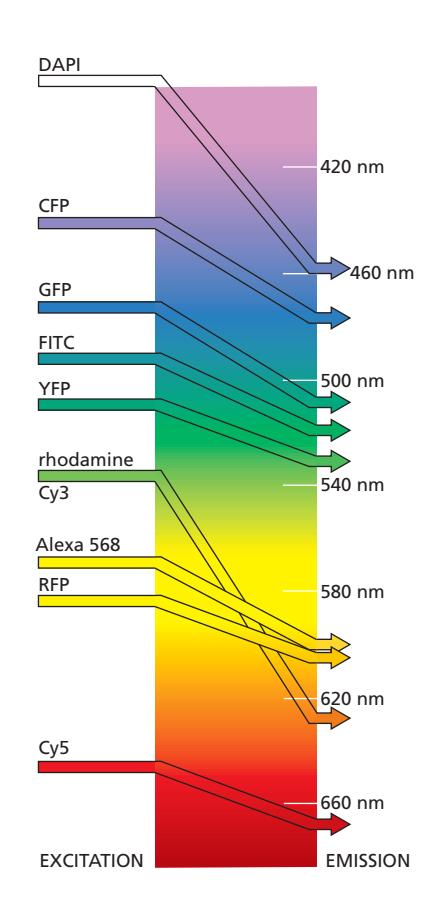

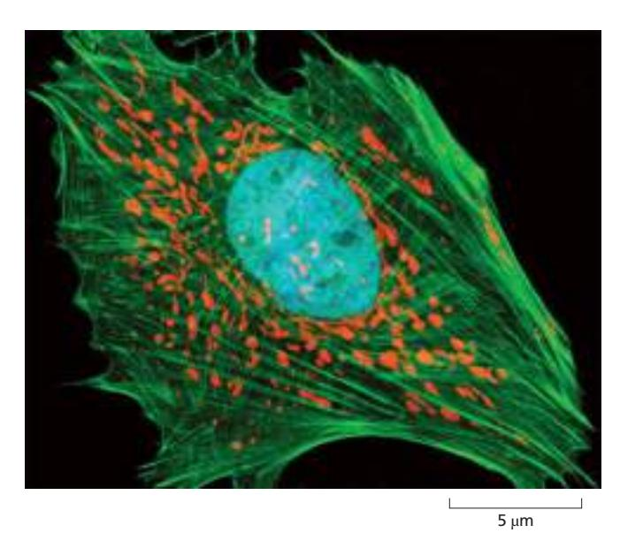

Figure 9–13 Different fluorescent probes can be visualized in the same cell. In this composite micrograph of an epithelial cell in culture, three different fluorescent probes have been used to label three different cellular components. The actin filaments of the cytoskeleton are revealed with a *green* fluorescent probe, the numerous mitochondria with a *red* fluorescent dye that accumulates inside the organelles, and the nucleus with a *blue* fluorescent dye that binds to DNA. (Courtesy of Carl Zeiss Microscopy, GmbH.)

*living* cells. As with all microscopy methods there are trade-offs to consider. In all fluorescence microscopes, the only molecules that can be imaged are those that are fluorescently labeled; all the other molecules in the cell remain hidden.

#### Antibodies Can Be Used to Detect Specific Proteins

Antibodies are proteins produced by the vertebrate immune system as a defense against infection (discussed in Chapter 24). They are unique among proteins in that they are made in billions of different forms, each with a different binding site that recognizes a specific target molecule (or *antigen*). The precise antigen specificity of antibodies makes them powerful tools for the cell biologist. When chemically coupled to fluorescent dyes, antibodies are invaluable for locating specific molecules in cells by fluorescence microscopy (**Figure 9–14**). When labeled with electron-dense particles such as colloidal gold spheres, they are used for similar purposes in the electron microscope (discussed later). The antibodies employed in microscopy are commonly either purified from antiserum so as to remove all nonspecific antibodies or they are specific monoclonal antibodies that only recognize the target molecule.

When we use antibodies as probes to detect and assay specific molecules in cells, we frequently use methods to amplify the fluorescent signal they produce. For example, although a marker molecule such as a fluorescent dye can be linked directly to an antibody—the *primary antibody*—a stronger signal is achieved by

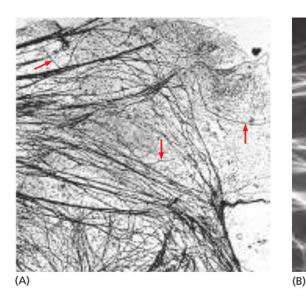

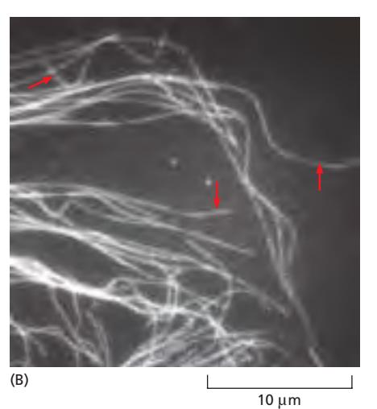

Figure 9–14 Immunofluorescence. (A) A transmission electron micrograph of the periphery of a cultured epithelial cell showing the distribution of microtubules and other filaments. (B) The same area stained with fluorescent antibodies against tubulin, the protein that assembles to form microtubules, using the technique of indirect immunocytochemistry (see Figure 9–15). *Red arrows* indicate individual microtubules that are readily recognizable in both images. Note that, because of diffraction effects, the microtubules in the light microscope appear 0.2 μm wide rather than their true width of 0.025 μm. (© 1978 M. Osborn et al. Originally published in *J. Cell Biol.* doi 10.1083/jcb.77.3.R27. With permission from Rockefeller University Press.)

using an unlabeled primary antibody and then detecting it with a group of labeled *secondary antibodies* that bind to it (**Figure 9–15**). This process is called *indirect immunocytochemistry*.

# Individual Proteins Can Be Fluorescently Tagged in Living Cells and Organisms

Even the most stable cell structures must be assembled, disassembled, and reorganized during the cell's life cycle. Other structures, often enormous on the molecular scale, rapidly change, move, and reorganize themselves as the cell conducts its internal affairs and responds to its environment. Complex, highly organized pieces of molecular machinery move components around the cell, controlling traffic into and out of the nucleus, from one organelle to another, and into and out of the cell itself. MBoC7 m9.17/9.15

Various techniques have been developed to visualize the specific components involved in such dynamic phenomena, and many of these methods use fluorescent proteins. All of the fluorescent molecules discussed so far are made outside the cell and then artificially introduced into it. But the use of genes encoding protein molecules that are themselves inherently fluorescent also enables the creation of organisms and cell lines that make their own visible tags and labels, without the introduction of foreign molecules. These cellular exhibitionists display their inner workings in glowing fluorescent color.

Foremost among the fluorescent proteins used for these purposes by cell biologists is the **green fluorescent protein (GFP)**, isolated from the jellyfish *Aequorea victoria*. This protein is encoded by a single gene, which can be cloned and introduced into cells of other species. The freshly translated protein is not fluorescent, but within an hour or so (less for some alleles of the gene, more for others) some of the amino acids undergo a self-catalyzed post-translational modification to generate an efficient fluorochrome, shielded within the interior of a barrel-like protein, which will now fluoresce green when illuminated appropriately with blue light (**Figure 9–16**). Extensive site-directed mutagenesis performed on the

#### Figure 9–15 Indirect immunocytochemistry.

This detection method is very sensitive because many molecules of the secondary antibody recognize each primary antibody. The secondary antibody is covalently coupled to a marker molecule that makes it readily detectable. Commonly used marker molecules include fluorescent dyes (for fluorescence microscopy) and colloidal gold spheres (for electron microscopy).

#### Figure 9–16 Green fluorescent protein (GFP). (A) The structure of GFP, shown here schematically, highlights the eleven β strands that form the staves of a barrel, buried within which is the active chromophore *(dark green).* (B) The chromophore is formed post-translationally from the protruding side chains of two amino acid residues in a series of autocatalytic steps. (A, PDB code: 1EMA, from M. Ormö et al., *Science* 273:1392– 1395, 1996. With permission from AAAS.)

N C O O O O H N NH HN HN N N OH OH OH OH tyrosine serine protein backbone autocatalytic steps mature GFP fluorophore (A) (B)

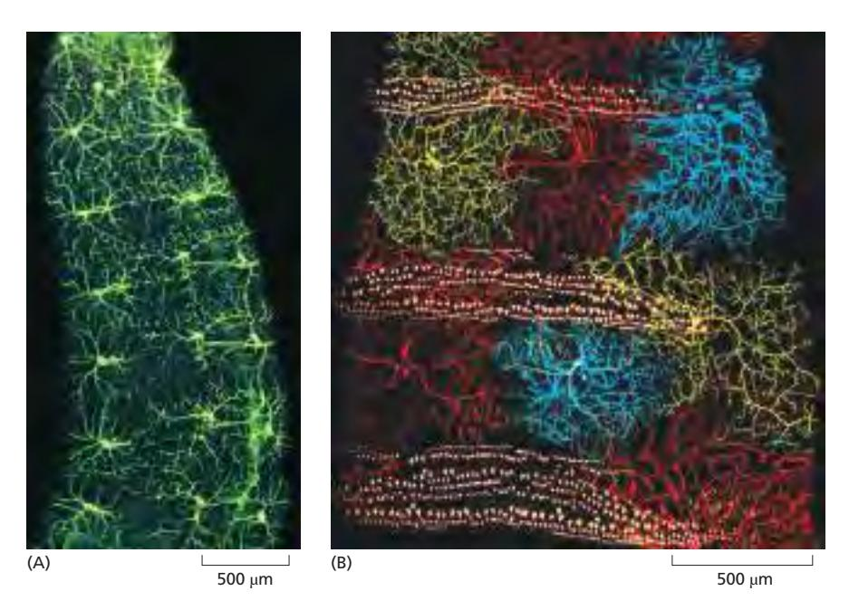

MBoC7 m9.23/9.17 Figure 9–17 Fluorescent proteins as reporter molecules. (A) For this experiment, carried out in the fruit fly, the GFP gene was joined (using recombinant DNA techniques) to a fly promoter that is active only in a specialized set of neurons. This image of a live fly embryo was captured by a fluorescence microscope and shows approximately 20 neurons, each with long projections (axons and dendrites) that communicate with other (nonfluorescent) cells. These neurons are located just under the surface of the animal and allow it to sense its immediate environment. (B) In a variation of this method, three different fluorescent proteins, red, yellow, and cyan, can be expressed at random in neurons of the live fly embryo. The genetic constructs have been arranged such that a strong pulse of blue light will activate the expression of one or other of the three fluorescent proteins at random in neuronal cells, where they are then targeted to the plasma membrane. This noninvasive control of the timing of cell labeling allows the behavior of individual cells to be followed subsequently over time. The fine detail of all the dendrites of individual sensory neurons can be clearly seen. The lines of *pale dots* arise from the autofluorescence of the bands of denticles in the cuticle that define the segments of the embryo (see Figure 21–24). (A, from W.B. Grueber et al., *Curr. Biol.* 13:618–626, 2003. With permission from Elsevier; B, from M. Boulina et al., *Development* 140:1605–1613, 2013, doi 10.1242/dev.088930. © 2013. Published by the Company of Biologists Ltd.)

original gene sequence has resulted in multiple variants that can be used effectively in organisms ranging from animals and plants to fungi and microbes. The fluorescence efficiency has also been improved, and variants have been generated with altered absorption and emission spectra from the blue-green, like blue fluorescent protein (BFP), to the far visible red. Other, related fluorescent proteins have since been discovered (for example, in corals) that also extend the range into the red region of the spectrum, like red fluorescent protein (RFP).

One of the simplest uses of GFP is as a reporter molecule, a fluorescent probe to monitor gene expression. A transgenic organism can be made with the GFP-coding sequence placed under the transcriptional control of the promoter belonging to a gene of interest, giving a directly visible readout of the gene's expression pattern in the living organism (**Figure 9–17**). In another application, a peptide location signal can be added to the GFP to direct it to a particular cell compartment, such as the endoplasmic reticulum or a mitochondrion (see Figure 9–25B), lighting up these organelles so they can be observed in the living state.

The GFP DNA-coding sequence can also be inserted at the beginning or end of the coding sequence for another protein, yielding a chimeric product consisting of that protein with a new GFP domain attached. In many cases, this GFP fusion protein behaves in the same way as the original protein, directly revealing its location and activities by means of its genetically encoded fluorescence (**Figure 9–18**). It is often possible to prove that the GFP fusion protein is functionally equivalent

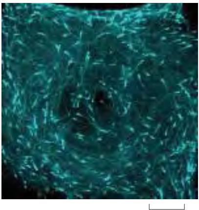

2 µm

MBoC7 n9.123/9.18 Figure 9–18 GFP-tagged proteins. This cultured mammalian cell is expressing EB3, a plus-end tracking protein that is fused to a GFP-derived blue fluorescent protein (BFP). These proteins associate with the plus ends of growing microtubules (see Figure 16–49), and their dynamics can be followed as they appear to zoom brightly around the cell. (Courtesy of Carl Zeiss Microscopy, GmbH.)

to the untagged protein, for example by using it to rescue a mutant lacking that protein. GFP tagging is the clearest and most unequivocal way of showing the distribution and dynamics of a protein in a living organism (see Movie 16.8).

#### Protein Dynamics Can Be Followed in Living Cells

Fluorescent proteins are now exploited not just to see where in a cell a particular protein is located, but also to uncover its kinetic properties and to find out whether it might interact with other molecules. We now describe techniques in which fluorescent proteins are used in this way.

First, interactions between one protein and another can be monitored by **Förster resonance energy transfer**, also called **fluorescence resonance energy transfer** but both abbreviated to **FRET**. In this technique, two molecules of interest are each labeled with a different fluorochrome, chosen so that the emission spectrum of one fluorochrome, the donor, overlaps with the absorption spectrum of the other, the acceptor. If the two proteins interact in such a way as to bring their fluorochromes into very close proximity (closer than about 5 nm), one fluorochrome, when excited, can transfer energy from the absorbed light directly (by resonance, nonradiatively) to the other. Thus, when the complex is illuminated at the excitation wavelength of the first fluorochrome, fluorescent light is produced at the emission wavelength of the second (**Figure 9–19**). This method can be used with two different spectral variants of GFP as fluorochromes to monitor processes such as the interaction of signaling molecules with their receptors (see Figure 15–49) or proteins in macromolecular complexes at specific locations inside living cells. The FRET can be measured by quantifying the reduction of the donor fluorescence in the presence of the acceptor. The efficiency of FRET is inversely proportional to the sixth power of the distance between the donor and acceptor molecules and so is extremely sensitive to small changes in distance.

The genes encoding GFP and related fluorescent proteins can be engineered to produce protein variants, usually with one or more amino acid changes, that fluoresce only weakly under normal excitation conditions but can be induced to fluoresce either more strongly or with a color shift (for example, from green to red) by activating them with a strong pulse of light at a different wavelength in a process called **photoactivation**. In principle, the biologist can then follow the local *in vivo* behavior of any protein that can be expressed as a fusion with one of

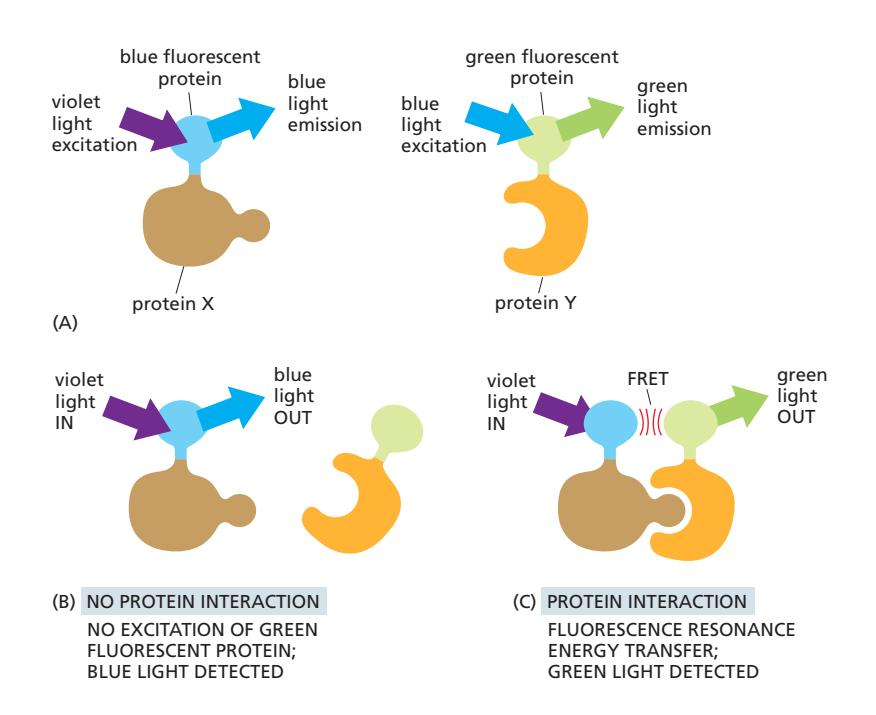

Figure 9–19 Fluorescence resonance energy transfer (FRET). To determine whether (and when) two proteins interact inside a cell, the proteins are first produced as fusion proteins attached to different color variants of green fluorescent protein (GFP). (A) In this example, protein X is coupled to a blue fluorescent protein, which is excited by violet light and emits blue light; protein Y is coupled to a green fluorescent protein, which is excited by blue light and emits green light. (B) If protein X and Y do not interact, illuminating the sample with violet light yields fluorescence only from the blue fluorescent protein. (C) When protein X and protein Y interact, the resonance transfer of energy, FRET, can now occur. Illuminating the sample with violet light excites the blue fluorescent protein, which transfers its energy to the green fluorescent protein, resulting in an emission of green light. The fluorochromes must be quite close together—within about 1–5 nm of one another—for FRET to occur. Because not every molecule of protein X and protein Y is bound at all times, some blue light may still be detected. But as the two proteins begin to interact, emission from the donor blue fluorescent protein falls as the emission from the acceptor GFP rises.

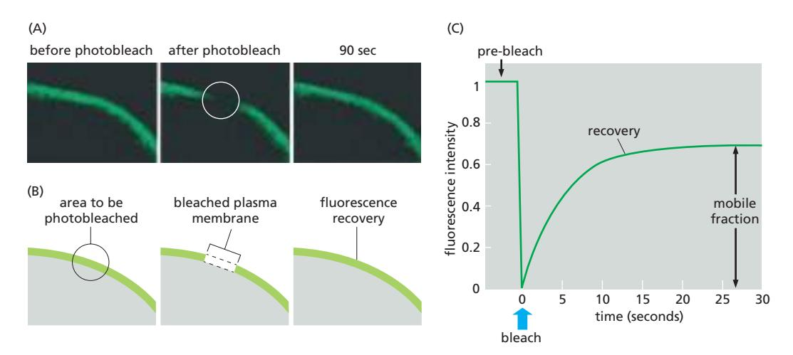

MBoC7 n9.121/9.20 Figure 9–20 Fluorescence recovery after photobleaching (FRAP). A strong focused pulse of laser light will extinguish, or bleach, fluorescent proteins. By selectively photobleaching a set of fluorescently tagged protein molecules within a defined region of a cell, the microscopist can monitor recovery over time, as the remaining fluorescent molecules move into the bleached region (see Movie 10.6). (A) This cultured mammalian cell is expressing an integral membrane protein called CD86, which is fused with a fluorescent protein. CD86 is a co-stimulatory protein present in the plasma membrane of antigen-presenting cells and is required for the activation of T cells (see Figure 24–34). After a small region of the plasma membrane is selectively photobleached, the remaining fluorescent molecules diffuse rapidly within the plane of the membrane and populate the bleached region. This recovery can be followed as a function of time. (B) Schematic diagram of the experiment shown in A. (C) Measurements of the fluorescence intensity in the bleached area as a function of time can be plotted as a fluorescence recovery curve. From such graphs quantitative data can be derived about the rate of recovery and the fraction of fluorescent protein molecules that are either mobile or immobile. (A, from S. Dorsch et al., *Nat. Methods* 6:225–230, 2009.)

these GFP variants. These genetically encoded, photoactivatable, fluorescent proteins allow the lifetime and behavior of any protein to be studied independently of other newly synthesized proteins.

Another way to exploit GFP fused to a protein of interest is known as **fluorescence recovery after photobleaching (FRAP)**. Here, a strong focused beam of light from a laser is used to extinguish the GFP fluorescence in a specified region of the cell, after which one can analyze the way in which remaining unbleached fluorescent protein molecules move into the bleached area as a function of time. This technique, like photoactivation, can deliver valuable quantitative data about a protein's kinetic parameters, such as diffusion coefficients, active transport rates, or binding and dissociation rates from other proteins (**Figure 9–20**).

#### Fluorescent Biosensors Can Monitor Cell Signaling

Extracellular signals cause rapid and transient changes in the concentration of intracellular signaling molecules that play an important role in how cells respond. But how to see and measure such dynamic and rapid changes remains a challenge. Changes in the concentration of some of these molecules, for example Ca2+ ions, can be analyzed using simple ion-sensitive indicators, whose light emission reflects the local Ca2+ ion concentration (**Figure 9–21**, and see also Figure 15–31). However, the most sensitive indicators available are a range of genetically encoded biosensors, all based on the growing family of fluorescent proteins described earlier. These sensors can be synthesized by the specific cells of interest and easily fused with protein tags that target them to specific destinations within the cell. Here they can act as molecular informants, reporting back like spies on transient signaling events to the careful observer. To convert information about changes in the level of a signaling molecule into changes in observable fluorescence intensity requires two key components: a sensing component that responds to the target signaling event, and a reporting component

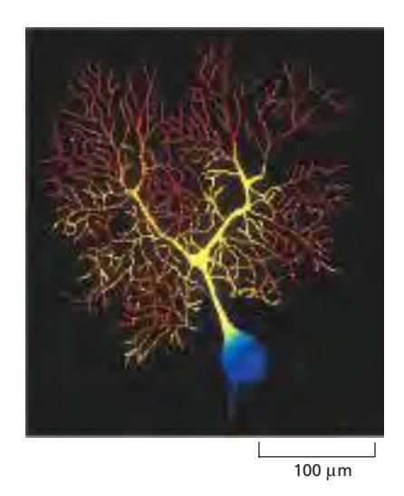

MBoC7 m9.31/9.21 Figure 9–21 Visualizing intracellular Ca2**1** concentrations by using a fluorescent indicator. The branching tree of dendrites of a Purkinje cell in the cerebellum receives more than 100,000 synapses from other neurons. The output from the cell is conveyed along the single axon seen leaving the cell body at the bottom of the picture. This image of the intracellular Ca2+ concentration in a single Purkinje cell (from the brain of a guinea pig) was taken with a low-light camera and the Ca2+-sensitive fluorescent indicator fura-2. The concentration of free Ca2+ is represented by different colors, *red* being the highest and *blue* the lowest. The highest Ca2+ levels are present in the thousands of dendritic branches. (Courtesy of D.W. Tank, J.A. Connor, M. Sugimori, and R.R. Llinas.)

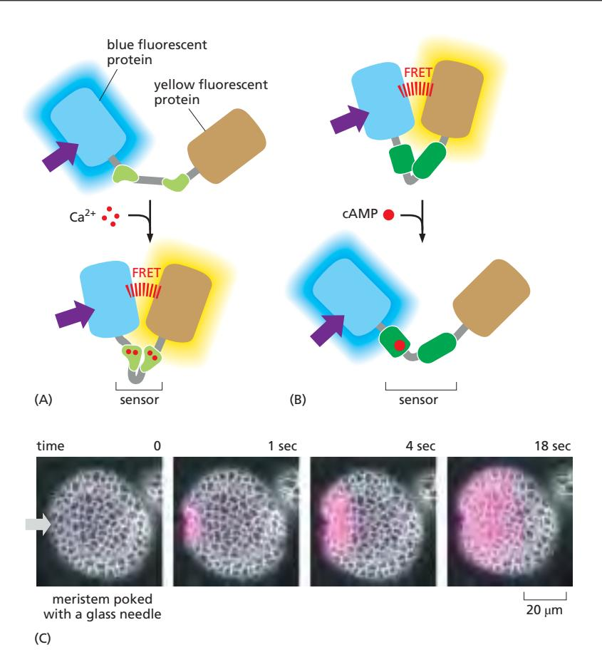

that translates that response into a visible and quantifiable output. Many biosensors use two connected fluorescent proteins that can be brought close enough together to undergo Förster resonance energy transfer (see Figure 9–19). Bringing them together, or indeed moving them apart, is a connecting sensor module. The sensor is usually a protein or protein domain that undergoes a large conformational change on binding to the target molecule. The general principle used to construct a genetically encoded biosensor is shown in **Figure 9–22**. Measuring the ratio of the intensities of light emitted by the two fluorescent proteins in the biosensor provides a quantitative measure of the concentration of the target molecule of interest. Many hundreds of such biosensors have been created. Some can monitor and measure small molecules in living cells, such as Ca2+*,* cAMP, IP3, NADPH (and hence redox state), H+ ions (and hence pH), and neurotransmitters such as acetylcholine and glutamate. Others can measure the activity of kinases, phosphatases, active caspases, and even temperature. MBoC7 n9.126/9.22

# Imaging of Complex Three-dimensional Objects Is Possible with the Optical Microscope

For ordinary light microscopy, as we have seen, a tissue has to be sliced into thin sections to be examined; the thinner the section, the crisper the image. Because information about the third dimension is lost upon sectioning, how, then, can we get a picture of the three-dimensional architecture of a cell or tissue, and how can we view the microscopic structure of a specimen that, for one reason or another, cannot first be sliced into sections? Although an optical microscope is focused on a particular focal plane within a three-dimensional specimen, all the other parts of the specimen, above and below the plane of focus, are also illuminated, and the light originating from these regions contributes to the image as out-of-focus blur. This can make it very hard to interpret the image in detail and can lead to fine image structure being obscured by the out-of-focus light.

Figure 9–22 Genetically encoded fluorescent biosensors. (A) Here we show one strategy for constructing a fluorescent biosensor for calcium ions. A sensor, in this case calmodulin (see Figure 15–34), undergoes a large conformational change on binding Ca2+. This change brings together the blue and yellow fluorescent proteins to which each end of the sensor is attached, close enough to undergo Förster resonance energy transfer (FRET) and to change the wavelength of the fluorescence emission to yellow in response to a violet excitation light. By measuring the ratio of fluorescence intensity at two wavelengths, blue and yellow, we can determine the concentration ratio of the Ca2+-bound indicator to the Ca2+-free indicator, thereby providing an accurate measurement of the free Ca2+ concentration. (B) This panel illustrates a similar strategy used to construct a biosensor for cAMP. In this case the sensor is a cAMP-regulated guanine nucleotide exchange factor, which again undergoes a large conformational change, enough to move the two attached fluorescent proteins farther apart, thus abolishing their FRET. Hence the emitted light is switched from yellow to blue. (C) A calcium biosensor, similar to that shown in A, is genetically encoded and expressed in an *Arabidopsis* seedling. When a cell in the epidermis, on the side of the shoot apical meristem, is pricked with a small glass needle, calcium enters the cell from the extracellular environment, and this response is rapidly propagated as a wave of calcium entering cells across the entire surface of the meristem. Mechanical signals help pattern plant morphogenesis, and transient calcium responses affect cell polarity. (C, from T. Li et al., *Nat. Commun*. 10:726–735, 2019. Reproduced with permission of SNCSC.)

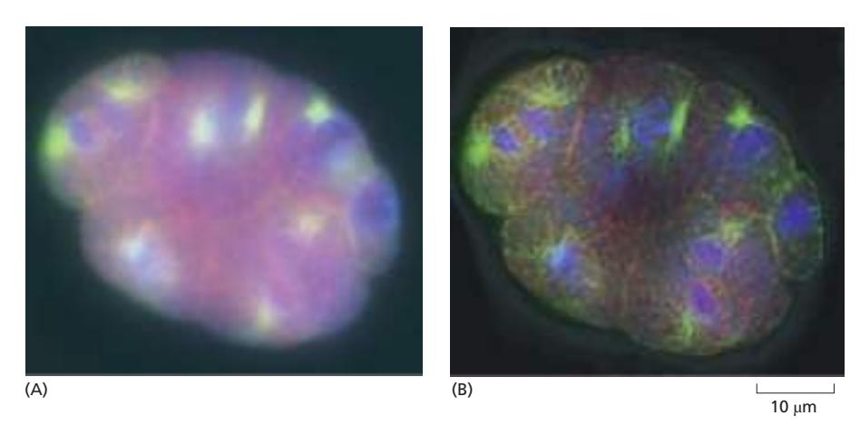

MBoC7 n9.122/9.23 Figure 9–23 Image deconvolution. (A) A light micrograph of a *Caenorhabditis elegans* embryo, fluorescently labeled for microtubules *(green)*, mitochondria *(red)*, and DNA *(blue)*. Detail at any one level of focus is blurred by light from out-of-focus levels of the specimen. (B) After deconvolution of the three-dimensional stack of images, an optical section at the same level of focus shows a much crisper image with more contrast and much reduced blurring. (A and B, from D. Sage et al., *Methods* 115:28–41, 2017, doi 10.1016/j.ymeth.2016.12.015. With permission from Elsevier.)

Two distinct but complementary approaches help to solve this problem: one is computational, the other optical. These three-dimensional microscopic imaging methods make it possible to focus on a chosen plane in a thick specimen while rejecting the light that comes from out-of-focus regions above and below that plane. Thus, one sees a crisp, thin *optical section*. From a series of such optical sections taken at different depths and stored in a computer, a three-dimensional image can be reconstructed (**Movie 9.1**). The methods do for the microscopist what the computed tomography (CT) scanner does (by different means) for the radiologist investigating a human body: both machines give detailed sectional views of the interior of an intact structure.

The computational approach is often called *image deconvolution*. To understand how it works, remember that the wave-like nature of light means that the microscope lens system produces a small blurred disc as the image of a point source of light (see Figure 9–4), with increased blurring if the point source lies above or below the focal plane. This blurred image of a point source is called the *point spread function* (see Figure 9–29). An image of a complex object can then be thought of as being built up by replacing each point of the three-dimensional specimen by a corresponding blurred disc, resulting in an image that is blurred overall. For deconvolution, a computer program uses the measured point spread function of a point source of light from that particular microscope to determine what the effect of the blurring would have been on the image, and then applies an equivalent "deblurring" (deconvolution), turning the blurred three-dimensional image into a series of clean optical sections, albeit still constrained by the diffraction limit (**Figure 9–23**).

## The Confocal Microscope Produces Optical Sections by Excluding Out-of-Focus Light

The confocal microscope achieves a result similar to that of deconvolution, but does so by manipulating the light before it is measured; it is an analog technique rather than a digital one. The optical details of the **confocal microscope** are complex, but the basic idea is simple, as illustrated in **Figure 9–24**, and the results are far superior to those obtained by conventional light microscopy.

The confocal microscope is generally used with fluorescence optics (see Figure 9–10C), but instead of illuminating the whole specimen at once, in the usual way, the optical system at any instant focuses a spot of light onto a single point at a specific depth in the specimen. This requires a source of pinpoint illumination

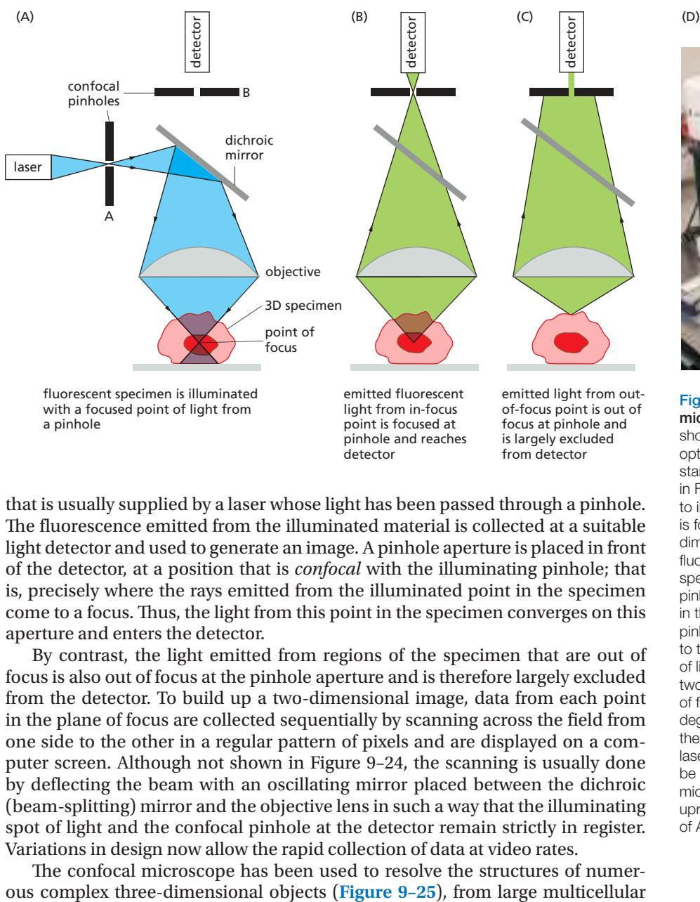

fluorescent specimen is illuminated with a focused point of light from a pinhole

emitted fluorescent light from in-focus point is focused at pinhole and reaches detector

emitted light from outof-focus point is out of focus at pinhole and is largely excluded from detector

that is usually supplied by a laser whose light has been passed through a pinhole. The fluorescence emitted from the illuminated material is collected at a suitable light detector and used to generate an image. A pinhole aperture is placed in front of the detector, at a position that is *confocal* with the illuminating pinhole; that is, precisely where the rays emitted from the illuminated point in the specimen come to a focus. Thus, the light from this point in the specimen converges on this aperture and enters the detector. MBoC7 m9.19/9.24

By contrast, the light emitted from regions of the specimen that are out of focus is also out of focus at the pinhole aperture and is therefore largely excluded from the detector. To build up a two-dimensional image, data from each point in the plane of focus are collected sequentially by scanning across the field from one side to the other in a regular pattern of pixels and are displayed on a computer screen. Although not shown in Figure 9–24, the scanning is usually done by deflecting the beam with an oscillating mirror placed between the dichroic (beam-splitting) mirror and the objective lens in such a way that the illuminating spot of light and the confocal pinhole at the detector remain strictly in register. Variations in design now allow the rapid collection of data at video rates.

The confocal microscope has been used to resolve the structures of numer-

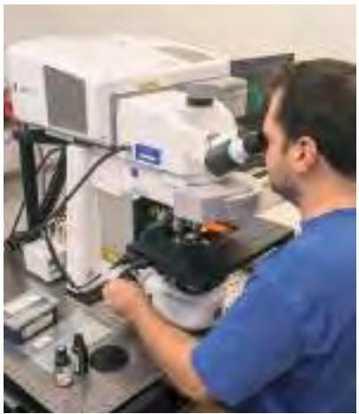

Figure 9–24 The confocal fluorescence microscope. (A) This simplified diagram shows that the basic arrangement of optical components is similar to that of the standard fluorescence microscope shown in Figure 9–10C, except that a laser is used to illuminate a small pinhole whose image is focused at a single point in the threedimensional (3D) specimen. (B) Emitted fluorescence from this focal point in the specimen is focused at a second (confocal) pinhole. (C) Emitted light from elsewhere in the specimen is not focused at the pinhole and therefore does not contribute to the final image. By scanning the beam of light across the specimen, a very sharp two-dimensional image of the exact plane of focus is built up that is not significantly degraded by light from other regions of the specimen. (D) Commercial versions of laser scanning confocal microscopes can be configured for both upright and inverted microscopes. Shown here is a standard upright confocal microscope. (D, courtesy of Andrew Davis.)

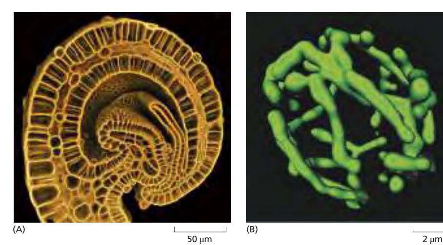

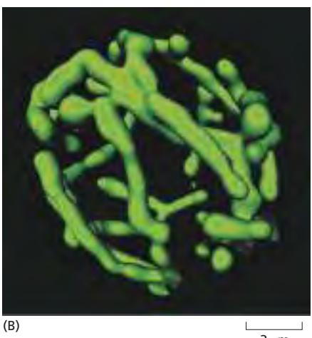

Figure 9–25 Confocal fluorescence microscopy produces clear optical sections and three-dimensional data sets. (A) The elaborate cup-shaped trap of the carnivorous water plant, *Utricularia gibba*. A stack of 452 separate confocal images using a fluorescent label for the cell walls was assembled to produce the image. (B) A reconstruction of an object can be assembled from a stack of optical sections. In this case, and at a vastly different scale, the complex branching structure of the mitochondrial compartment in a single live yeast cell is shown. (A, courtesy of Karen Lee, Claire Bushell, and Enrico Coen; B, courtesy of Stefan Hell.)

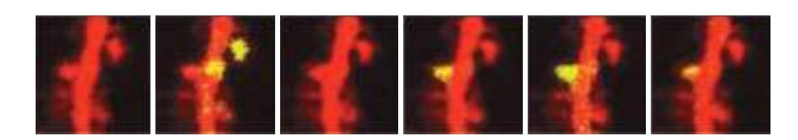

structures to subcellular structures; for example, the networks of cytoskeletal fibers, the dynamics of organelles, and the arrangements of chromosomes and genes in the nucleus.

The relative merits of deconvolution methods and confocal microscopy for three-dimensional optical microscopy depend on the specimen being imaged. Confocal microscopes tend to be better for thicker specimens with high levels of out-of-focus light. They are also generally easier to use than deconvolution systems, and the final optical sections can be seen quickly. In contrast, the complementary metal-oxide semiconductor (CMOS) cameras that are used for deconvolution systems are extremely efficient at collecting almost every photon emitted, and they can be used to make detailed three-dimensional images from specimens that are too weakly stained or too easily damaged by the bright light used for confocal microscopy.

Both methods, however, have another drawback; neither is good at coping with very thick specimens. Deconvolution methods quickly become ineffective any deeper than about 40 μm into a specimen, while confocal microscopes can only obtain images up to a depth of about 150 μm. Special microscopes can now take advantage of the way in which fluorescent molecules are excited, to probe even deeper into a specimen. Fluorescent molecules are usually excited by a single high-energy photon, of shorter wavelength than the emitted light, but they can in addition be excited by the absorption of two (or more) photons of lower energy, as long as they both arrive within a femtosecond or so of each other. The use of this longer-wavelength excitation has some important advantages. In addition to reducing background noise, red or near-infrared light can penetrate deeper into a specimen. Multiphoton microscopes, constructed to take advantage of this *two-photon* effect, can obtain sharp images, sometimes even at a depth of half a millimeter within a specimen. This is particularly valuable for studies of living tissues, notably in imaging the dynamic activity of synapses and neurons just below the surface of living brains (**Figure 9–26**). MBoC7 m9.21/9.26

# Superresolution Fluorescence Techniques Can Overcome Diffraction-limited Resolution

The variations on light microscopy we have described so far are all constrained by the classic diffraction limit to resolution described earlier; that is, to about 0.2 μm, or 200 nm (see Figure 9–5). Yet many cellular structures—from nuclear pores and ribosomes to nucleosomes and clathrin-coated pits—are much smaller than this and so are unresolvable by conventional light microscopy. However, several approaches are now available that bypass the limit imposed by the diffraction of light, and some can now successfully resolve objects as small as 10 nm, a remarkable, twentyfold improvement.

The first of these so-called **superresolution** approaches, *structured illumination microscopy* (*SIM*), is a fluorescence imaging method with a resolution of about 100 nm, or twice the resolution of conventional bright-field microscopy. SIM overcomes the diffraction limit by using a grated or structured pattern of light to illuminate the sample. The microscope's physical setup and operation are quite complex, but the general principle can be thought of as similar to creating a moiré pattern, an interference pattern created by overlaying two grids with different angles or mesh sizes (**Figure 9–27**). The illuminating grid and the sample features combine into an interference pattern in which features smaller than the grid spacing are transformed into larger patterns. This results in original features

Infrared laser light causes less damage to living cells than does visible light and can also penetrate farther, allowing microscopists to peer deeper into living tissues. The two-photon effect, in which a fluorochrome can be excited by two coincident infrared photons instead of a single high-energy photon, allows us to see

Figure 9–26 Multiphoton imaging.

changes with the calcium concentration, reveals active synapses *(yellow)* on the dendritic spines *(red)* that change as a function of time; in this case, there is a day between each image. (Courtesy of Thomas Oertner and Karel Svoboda.)

nearly 0.5 mm inside the cortex of a live mouse brain. A dye, whose fluorescence

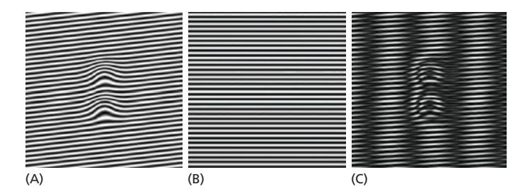

beyond the classical limit being transformed so that they can now be imaged by the optical system. Computer image processing can then be used to restore them into an image that has a resolution up to twice the classical limit. Illumination by a grid means that the parts of the sample in the dark stripes of the grid are not illuminated and therefore not imaged, so the imaging is repeated several times (usually three) after translating the grid through a fraction of the grid spacing between each image. As the interference effect is strongest for image components close to the direction of the grid bars, the whole process is repeated with the grid pattern rotated through a series of angles to obtain an equivalent enhancement in all directions. Finally, mathematically combining all these separate images by computer creates an enhanced superresolution image. SIM is versatile because it can be used with any fluorescent dye or protein, and combining SIM images captured at consecutive focal planes can create three-dimensional data sets (**Figure 9–28**). MBoC7 m9.34/9.27

To get around the diffraction limit, two other superresolution techniques exploit aspects of the point spread function, a property of the optical system mentioned earlier. The **point spread function** is the distribution of light intensity within the three-dimensional, blurred image that is formed when a single point source of light is brought to a focus with a lens. Instead of being identical to the point source, the image has an intensity distribution that is approximately described by a Gaussian distribution, which in turn determines the resolution of the lens system. Two points that are closer than the width at half-maximum

Figure 9–27 Structured illumination microscopy. The principle, illustrated here, is to illuminate a sample with patterned light and measure the moiré pattern. Shown are (A) the pattern from an unknown structure and (B) a defined grid pattern. (C) When these are combined, the resulting moiré pattern contains more information than is easily seen in A, the original pattern. If the known pattern (B) has higher spatial frequencies, then better resolution will result. However, because the spatial patterns that can be created optically are also diffraction-limited, SIM can only improve the resolution by about a factor of 2. (From B.O. Leung and K.C. Chou, *Appl. Spectrosc.* 65:967–980, 2011. With permission from SAGE.)

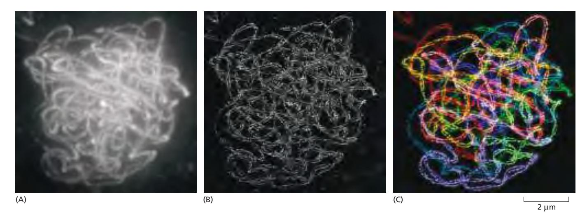

MBoC7 m9.35/9.28 Figure 9–28 Structured illumination microscopy can be used to create three-dimensional data. These threedimensional projections of the meiotic chromosomes at pachytene in a maize cell show the paired lateral elements of the synaptonemal complexes. (A) The chromosome set has been stained with a fluorescent antibody to cohesin and is viewed here by conventional fluorescence microscopy. Because the distance between the two lateral elements is about 200 nm, the diffraction limit, the two lateral elements that make up each complex are not resolved. (B) In the three-dimensional SIM image, the improved resolution enables each lateral element, about 100 nm across, to be clearly resolved, and the two chromosomes of each separate pair can be seen to coil around each other. (C) Because the complete three-dimensional data set for the whole nucleus is available, the path of each separate pair of chromosomes can be traced and artificially assigned a different color. (Courtesy of C.J. Rachel Wang, Peter Carlton, and Zacheus Cande.)

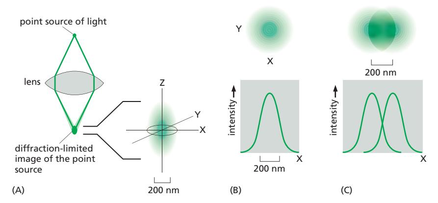

MBoC7 m9.36/9.29 Figure 9–29 The point spread function of a lens determines resolution. (A) When a point source of light is brought to a focus by a lens system, diffraction effects mean that, instead of being imaged as a point, it is blurred in all dimensions. As shown, the point spread function is elongated, meaning that the resolution is better in the XY axes than along the Z axis. (B) In the plane of the image, the distribution of light approximates a Gaussian distribution, whose width at half-maximum height under ideal conditions is about 200 nm. (C) Two separate point sources that are about 200 nm apart can still just be distinguished as separate objects in the image, but if they are any nearer than that, their images will overlap and not be resolvable.

height of this distribution will become hard to resolve because their images overlap too much (**Figure 9–29**).

In fluorescence microscopy, the excitation light is focused to a spot on the specimen by the objective lens, which then captures the photons emitted by any fluorescent molecule that the beam has raised from a ground state to an excited state. Because the excitation spot is blurred according to the point spread function, fluorescent molecules that are closer than about 200 nm will be imaged as a single blurred spot. One approach to increasing the resolution is to switch all the fluorescent molecules at the periphery of the blurry excitation spot back to their ground state or to a state where they no longer fluoresce in the normal way, leaving only those at the very center to be recorded. This can be done in practice by adding a second, very bright laser beam that wraps around the excitation beam like a torus. The wavelength and intensity of this second beam are adjusted so as to switch the fluorescent molecules off everywhere except at the very center of the point spread function, a region that can be as small as 20 nm across (**Figure 9–30**).

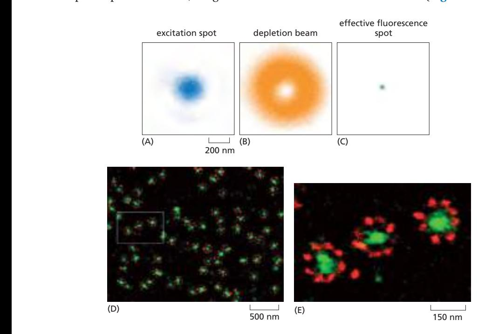

500 nm Figure 9–30 Superresolution microscopy can be achieved by reducing the size of the point spread function. (A) The size of a normal focused beam of excitatory light. (B) An extremely strong superimposed laser beam, at a different wavelength and in the shape of a torus, or doughnut, depletes emitted fluorescence everywhere in the specimen except right in the center of the beam, reducing the effective width of the point spread function (C). As the specimen is scanned, this small point spread function can then build up a crisp image in a process called STED (stimulated emission depletion) microscopy. (D) Here, STED microscopy is used to examine the structure of the nuclear pore. Fixed samples of the nuclear envelope have been stained by indirect immunofluorescence, using antibodies to different nuclear pore components. Membrane ring proteins (see Figure 12–55) have been stained *red* while the FC repeat proteins that form fibrils in the center of the pore are stained *green*. (E) An enlargement of the boxed region shows the clear eightfold symmetry of the membrane ring proteins and the central fibrillar region with a resolution of about 20 nm. [A, B, and C, from G. Donnert et al., *Proc. Natl. Acad. Sci. USA* 103: 11440–11445, 2006. Copyright 2006 National Academy of Sciences. With permission from National Academy of Sciences; D and E, from F. Gottfert et al., *Biophysical Journal* 105(1):PL01–L03, 2013. With permission from Elsevier.]

The fluorescent probes used must be in a special class that is photoswitchable: their emission can be reversibly switched on and off with lights of different wavelengths. As the specimen is scanned with this arrangement of lasers, in much the same way as in a confocal microscope, fluorescent molecules are switched on and off, and the small point spread function at each location is recorded. The diffraction limit is breached because the technique ensures that similar but very closely spaced molecules are in one of two different states, either fluorescing or dark. This approach is called *STED* (*stimulated emission depletion) microscopy,* and various microscopes using versions of the general method are now in wide use. Resolutions of 20 nm have been achieved in biological specimens (see Figure 9–30).

## Single-Molecule Localization Microscopy Also Delivers Superresolution

If a single fluorescent molecule is imaged, it appears as a circular blurry disc about 200 nm across, but if sufficient photons have contributed to this image, then the precise mathematical center of the disc-like image, and therefore the position of that fluorescent molecule, can be determined very accurately, often to within a few nanometers (**Figure 9–31**). But the problem with a specimen that contains a large number of adjacent fluorescent molecules, as we saw earlier, is that they each contribute blurry, overlapping point spread functions to the image, making the exact position of any one molecule impossible to resolve. Another way around this limitation is to arrange for only a very few, clearly separated molecules to actively fluoresce at any one moment. The exact position of each of these can then be computed, before subsequent sets of molecules are examined.

In practice, this can be achieved by using lasers to sequentially switch on a sparse subset of fluorescent molecules in a specimen containing switchable fluorescent labels. There are now hundreds of such labels, and they fall into three classes: *photoactivated* labels, which switch for example from dark to green; *photoconvertible* labels, which switch for example from green to red; and *photoswitchable* labels, which switch back and forth. Labels are activated, for example, by illumination with near-ultraviolet light, which modifies a small subset of molecules so that they fluoresce when exposed to an excitation beam at another wavelength. These are then imaged before bleaching quenches their fluorescence, and a new subset is activated. Each molecule emits a few thousand photons in response to the excitation before switching off, and the switching process can be repeated tens or even hundreds of thousands of times, allowing the exact coordinates of a very large set of single molecules to be determined. The full set can be combined and digitally displayed as an image in which the computed

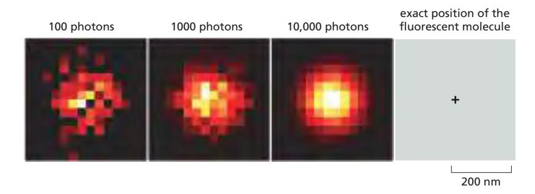

Figure 9–31 Single fluorescent molecules can be located with great accuracy. Determination of the exact mathematical center of the blurred image of a single fluorescent molecule becomes more accurate as more photons contribute to the final image. The point spread function described in the text dictates that the size of the molecular image is about 200 nm across, but in very bright specimens, the position of its center can be pinpointed to within a nanometer or so. (From A.L. McEvoy et al., *BMC Biol.* 8:106, 2010. With permission of the authors.)

successive cycles of activation and bleaching allow well-separated single fluorescent molecules to be detected

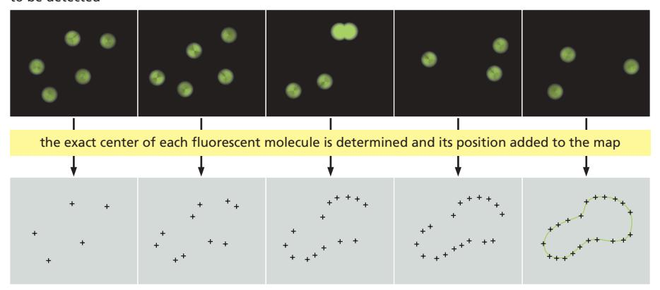

a superresolution image of the fluorescent structure is built up as the positions of tens of thousands of successive small groups of molecules are added to the map (A)

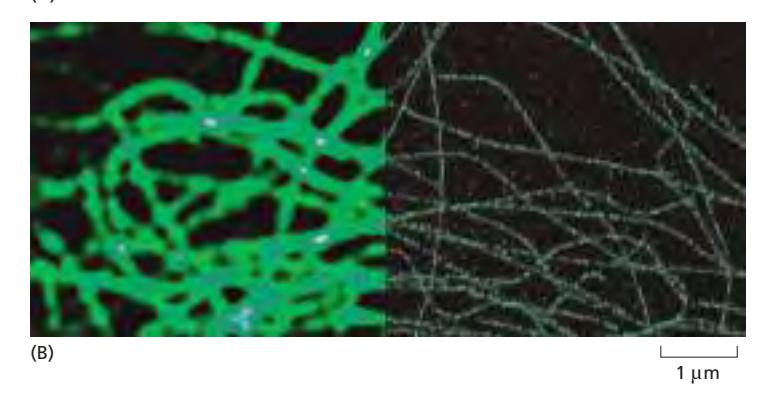

location of each individual molecule is exactly marked (**Figure 9–32**). The two main methods of **single-molecule localization microscopy (SMLM)** have been variously termed *photoactivated localization microscopy* (*PALM*) or *stochastic optical reconstruction microscopy* (*STORM*).

By switching the fluorophores off and on sequentially in different regions of the specimen as a function of time, all the superresolution imaging methods described above allow the resolution of molecules that are much closer together than the 200-nm diffraction limit. In STED, the locations of the molecules are determined by using optical methods to define exactly where their fluorescence will be on or off. In PALM and STORM, individual fluorescent molecules are switched on and off at random over a period of time, allowing their positions to be accurately determined. PALM and STORM techniques have depended on the development of novel fluorescent probes that exhibit the appropriate switching behavior. STORM originally relied on photoswitchable dyes, while PALM used photoswitchable fluorescent proteins, but the general principle is the same for both. All these methods can incorporate multicolor imaging (**Figure 9–33**), MBoC7 m9.38b,c/9.32

Figure 9–33 Multiple structures that are below the diffraction-limited resolution can be imaged by single-molecule localization microscopy. (A) Two recently divided *Escherichia coli* cells imaged in a STORM microscope with a resolution of about 20 nm. The cells are stained with three separate switchable fluorescent labels: the membrane is labeled green, the recently segregated DNA molecules are blue, and the ends of the two replicated chromosomes are seen as two bright white dots. (B) In this nerve cell, evenly spaced ring-like structures of actin *(red)* are wrapped around the circumference of the axon with a periodicity of about 190 nm, just smaller than the diffraction limit to resolution. In between are similarly spaced structures of spectrin *(blue)*. This periodic actin–spectrin cytoskeletal framework helps support the long thin axons of nerve cells. Such images depend heavily on the development of new, very fast-switching, and extremely bright fluorescent probes. (A, from C.K. Spahn et al., *Sci. Rep*. 8:14768, 2018, doi.org/10.1038/s41598- 018-33052-3; B, from K. Xu et al., *Science* 339:452–456, 2013, doi 10.1126/science.1232251.)

Figure 9–32 Single-molecule localization microscopy (SMLM). (A) In this imaginary specimen, sparse subsets of fluorescent molecules are individually switched on briefly and then bleached. The exact positions of all these well-spaced molecules can be gradually added together and built up into an image at superresolution. (B) In this portion of a cell, the microtubules have been fluorescently labeled and imaged *(left)* in a TIRF microscope (see Figure 9–38) and *(right)* at superresolution in a PALM microscope. The diameter of each microtubule on the *right* now resembles its true size, about 25 nm, rather than the 250 nm for each microtubule in the blurred diffraction-limited image on the *left*. (B, courtesy of Shinsuke Niwa.)

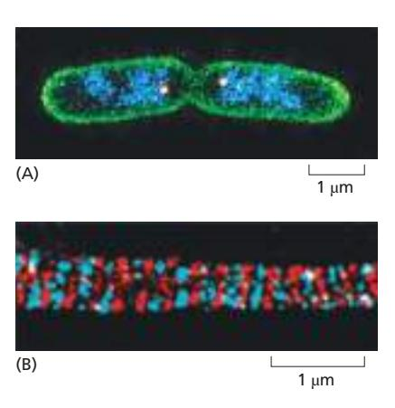

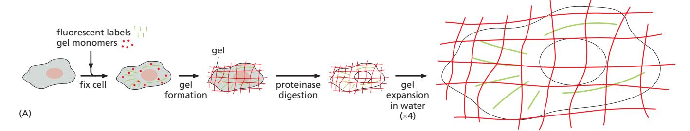

Figure 9–34 Expansion microscopy. (A) Although the technique has numerous variations, the essential features are that the fluorescently labeled sample is embedded in a polymer gel to which the fluorescent labels are covalently attached. After a proteinase digestion step, the gel is immersed in water and everything in the sample expands equally in every direction, usually by between 4 and 10 times, thus allowing details to be seen far more easily. (B) A peroxisome, whose membrane has been labeled with a fluorescent probe, appears in a confocal microscope as a blurred, diffraction-limited disc. (C) After expansion by a factor of 10, the image is captured with a standard epifluorescence microscope and, after deconvolution, shows the peroxisomal membrane well resolved and with a resolution of 25 nm. (From S. Truckenbrodt et al., *EMBO Rep.* 19:e45836, 2018, doi 10.15252/embr.201845836.)

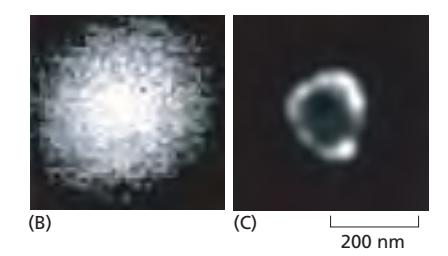

and to some extent live-cell imaging in real time. Ending the long reign of the diffraction limit has reinvigorated light microscopy and its place in cell biology research.

#### Expanding the Specimen Can Offer Higher Resolution, but with a Conventional Microscope MBoC7 n9.112/9.34

All the approaches to improvement of resolution that we have discussed so far have centered on increasingly sophisticated and expensive developments of the microscope itself. Looking at the problem from the other end, the specimen end, swelling the sample to physically make it larger would in theory allow higherresolution imaging, while still using a conventional fluorescence microscope. A new specimen preparation technique, called **expansion microscopy (ExM)**, does exactly that. The process starts by staining the fixed sample with fluorescent labels such as antibodies that target the molecules of interest. The labeled specimen is then treated with a chemical cross-linker and incubated with acrylate and acrylamide monomers. These monomers then polymerize to form a polyelectrolyte gel that simultaneously incorporates the cross-linked labels. With the labels covalently cross-linked to the polymer gel, and locked in their original relative positions, cellular material in the sample, predominantly proteins that might hinder subsequent expansion, is then carefully digested away. The gel containing the labeled specimen is now gently swollen by removing the buffer salts with water, so that it expands equally in all directions by between 4 and 10 times (**Figure 9–34A**). Two fluorochromes that were initially 100 nm apart, and consequently below the diffraction-limited resolution of a standard microscope, will now be 0.4–1.0 μm apart and are therefore easily resolved (**Figure 9–34B and C**). "Blowing-up" the sample allows effective superresolution to be enjoyed at up to 25 nm and without costly hardware (**Figure 9–35A and B**).

Expansion microscopy is proving valuable for detecting and quantitating which RNA transcripts are expressed in which individual cells in the brain. If all RNA molecules present are anchored firmly to the polymer gel before the expansion step, then the sample can be washed and re-probed sequentially with multiple fluorescent RNA probes using *in situ* hybridization (**Figure 9–35C and D**). Expansion takes place in all directions, and so depth information is also retrievable at higher resolution. Expansion microscopy samples can still be imaged by either confocal or light-sheet microscopy (discussed next), and deconvolution methods can still be used on the images—both help to improve three-dimensional imaging of large specimens.

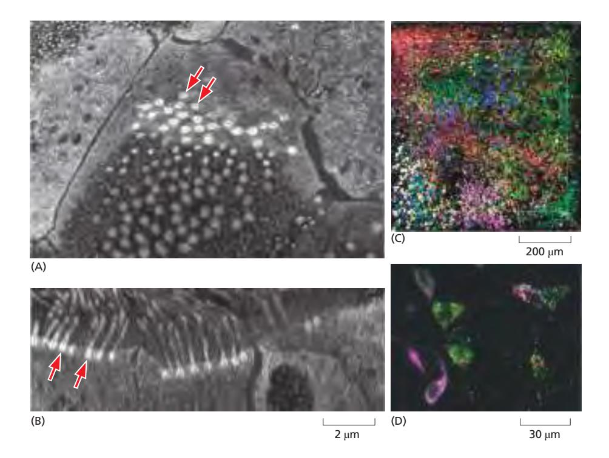

#### (A and B) Two orthogonal views of the same cultured human nasal epithelial cells that have been stained with a fluorescent dye, expanded by ten times, and then imaged by conventional confocal microscopy. The hollow centers of ciliary basal bodies, which are not resolvable by conventional microscopy, are clearly visible in both top view (A) and side view (B) *(red arrows)* (see Movie 9.1). (C and D) A segment of mouse brain lateral hypothalamus, 800 × 800 × 300 μm, that has been expanded by a factor of 2, probed by sequential rounds of *in situ* RNA hybridization, and imaged by lightsheet microscopy. The cellular expression patterns of six different genes are shown: *Gad1 (red)*, *Slc17a6 (green)*, *Hcrt (blue)*, *Trh (yellow)*, *Calb2 (magenta)*, and *Meis2 (cyan)*. (A and B, courtesy of Hugo Damstra, Lukas Kapitein, and Paul Tillberg; C and D, courtesy of Yuhan Wang, Mark Eddison, Scott Sternson, and Paul Tillberg.)

Figure 9–35 Expansion microscopy.

#### Large Multicellular Structures Can Be Imaged Over Time

Many problems in cell biology involve being able to follow the movement and behavior of cells in multicellular living organisms, in early embryo development for example. Other problems require the ability to disentangle the complexity of cellular interactions in large and dense tissues, for example the millions of connections between the neurons of the brain. The side effects of prolonged exposure to high levels of light in the first case, and depth and out-of-focus fluorescence in the second, mean that most of the techniques we have discussed so far cannot help. One way of eliminating a lot of the out-of-focus fluorescence is to arrange for the beam of light from the excitation laser to illuminate the specimen from a direction perpendicular to the axis from which the emitted fluorescence is viewed. In this arrangement, called *light-sheet microscopy*, a thin sheet of laser light, less than a micrometer thick, is scanned through the specimen, exciting only the labeled molecules at that depth in the sample to emit their fluorescence (**Figure 9–36**). There are many advantages to this method: it results in high-contrast images with very low photobleaching or photodamage, and three-dimensional information is readily obtained. It is also quick. Variants of the method allow ultrathin light sheets to scan through successive planes of a sample at a rate of hundreds of planes a second. The long-term, three-dimensional observation of living cells is a major application, for example in following early embryonic development in flies or zebrafish over a period of days. In fixed brain samples, the complex architecture of all the cells and their interconnections can be disentangled MBoC7 n9.113/9.35

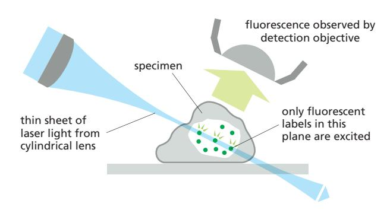

Figure 9–36 Light-sheet microscopy. A simple diagram showing how a very thin sheet of light that is projected (usually from a special cylindrical microscope objective lens) through a large specimen excites only those fluorescent labels in the thin plane that is illuminated. The resulting fluorescence is observed by an objective lens that is placed perpendicular to the light sheet. This means that, by progressively moving the specimen stage, multiple, sequential, and very sharp optical sections can be obtained rapidly and then digitally combined into a three-dimensional image.

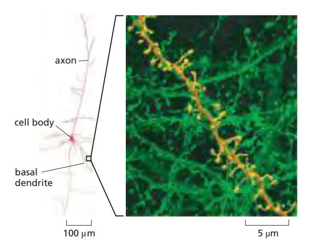

Figure 9–37 Light-sheet microscopy in the brain. A 1-mm-thick portion of a mouse brain has been prepared for expansion microscopy and then imaged with a light-sheet microscope. Reconstructions of thousands of optical sections allow the tracing of individual neurons and all their connections, such as this pyramidal neuron *(left)* from the visual cortex. On the *right* is shown the complex cellular context *(green)* for a short region of one of the neuron's basal dendrites (*orange* dendrite with its spines shown in *yellow*). (From R. Gao et al., S*cience* 363:245–261, 2019, doi 10.1126/science.aau8302. With permission from AAAS.)

(**Figure 9–37** and Movie 9.1). Light-sheet microscopy can also be combined with other techniques. Coupled with STED imaging, for example, superresolution is attainable, and higher-resolution images can also be obtained by preparing the sample for expansion microscopy.

# Single Molecules Can Be Visualized by Total Internal Reflection Fluorescence Microscopy

As we have seen, the strong background fluorescence due to light emitted or scattered by out-of-focus molecules tends to blot out the fluorescence from any one particular molecule of interest. This problem can be solved by the use of a special optical technique called *total internal reflection fluorescence* (*TIRF*) microscopy. In a TIRF microscope, laser light shines onto the cover-slip surface at the precise critical angle at which total internal reflection occurs (**Figure 9–38A**). Because of total internal reflection, the light does not enter the sample, and the majority of fluorescent molecules are not, therefore, illuminated. However, electromagnetic energy does extend, as an evanescent field, for a very short distance beyond the surface of the cover slip and into the specimen, allowing just those molecules in the layer closest to the surface to become excited. When these molecules fluoresce, their emitted light is no longer competing with out-of-focus light from the overlying molecules and can now be detected. TIRF has allowed several dramatic experiments, for instance imaging of single motor proteins moving along microtubules or actin filaments. At present, the technique is restricted to a thin layer about 200 nm below the cell surface. Although not strictly TIRF, decreasing the angle of the incident light so that it is almost parallel to the cover slip can increase the depth into the cell that can be examined, albeit not so uniformly, a feature useful in cells with an outer wall, such as those of plants and fungi (**Figure 9–38B and C**).

#### Figure 9–38 TIRF microscopy allows the detection of single fluorescent molecules near the cell surface.

(A) TIRF microscopy uses excitatory laser light to illuminate the cover-slip surface at the critical angle at which all the light is reflected by the glass–water interface. Some electromagnetic energy extends a short distance across the interface as an evanescent wave that excites just those molecules that are attached to the cover slip or are very close to its surface. (B) TIRF microscopy is used to follow the formation of an individual clathrin-coated pit and its subsequent endocytosis. In this image of the surface of the plasma membrane of an *Arabidopsis* root cell, a clathrin adaptor protein is tagged with GFP. Individual pits can be followed over time. (C) The pit ringed in B is shown at 1-second intervals, demonstrating that its appearance and its removal at the plasma membrane by endocytosis takes place in about 10 seconds. (B and C, from A. Johnson and G. Vert, *Front. Plant Sci.* 8:612, 2017, doi 10.3389 /fpls.2017.00612.)

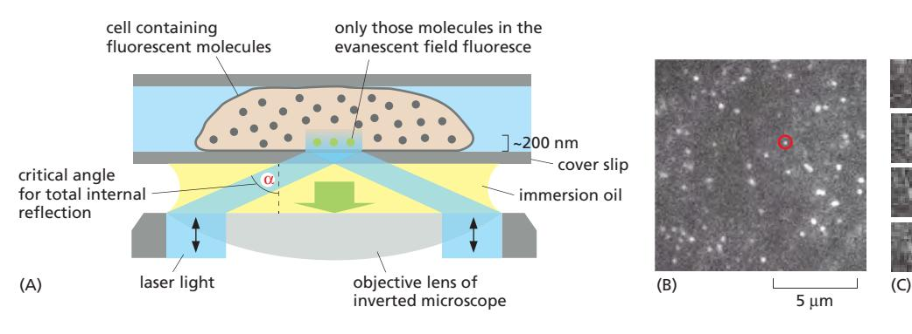

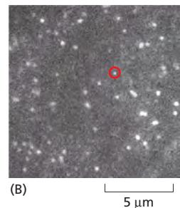

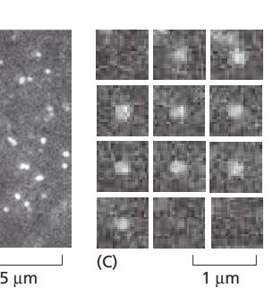

#### Summary

*Many light-microscope techniques are available for observing cells. Cells that have been fixed and stained can be studied in a conventional light microscope, whereas antibodies coupled to fluorescent dyes can be used to locate specific molecules in cells in a fluorescence microscope. Living cells can be seen with phasecontrast, differential-interference-contrast, dark-field, or bright-field microscopes. All forms of light microscopy are facilitated by digital image-processing techniques, which enhance sensitivity and refine the image. Confocal microscopy and image deconvolution both provide thin optical sections and can be used to reconstruct three-dimensional images.*

*Techniques are now available for detecting, measuring, and following almost any desired molecule in a living cell. Fluorescent labels can be introduced to measure the concentrations of specific ions or signaling molecules in individual cells or in different parts of a cell. Virtually any protein of interest can be genetically engineered as a fluorescent fusion protein and then imaged in living cells by fluorescence microscopy. The dynamic behavior and interactions of many molecules can be followed in living cells by variations on the use of fluorescent protein tags, in some cases at the level of single molecules. Various superresolution techniques can circumvent the diffraction limit in different ways and resolve molecules separated by distances as small as 20 nm.*

# LOOKING AT CELLS AND MOLECULES IN THE ELECTRON MICROSCOPE

Light microscopy is limited in the fineness of detail that it can reveal. Microscopes using other types of radiation—in particular, electron microscopes—can resolve much smaller structures than is possible with visible light. This higher resolution comes at a cost: specimen preparation for electron microscopy is complex and it is harder to be sure that what we see in the image corresponds precisely to the original living structure. It is possible, however, to use very rapid freezing to preserve structures faithfully for electron microscopy. Digital image analysis can be used to reconstruct three-dimensional objects by combining information either from many individual particles or from multiple tilted views of a single object. Together, these approaches extend the resolution and scope of electron microscopy to the point at which we can faithfully image the detailed structures of individual macromolecules and the complexes they form, even inside cells.

#### The Electron Microscope Resolves the Fine Structure of the Cell

The formal relationship between the diffraction limit to resolution and the wavelength of the illuminating radiation (see Figure 9–5) holds true for any form of radiation, whether it is a beam of light or a beam of electrons. With electrons, however, the limit of resolution is very small. The wavelength of an electron decreases as its velocity increases. In an **electron microscope** with an accelerating voltage of 100,000 V, the wavelength of an electron is 0.004 nm. In theory, the resolution of such a microscope should be about 0.002 nm, which is 100,000 times that of the conventional light microscope. Because the aberrations of an electron lens are considerably harder to correct than those of a glass lens, however, the practical resolving power of modern electron microscopes is, even with careful image processing to correct for lens aberrations, about 0.05 nm (0.5 Å) (**Figure 9–39**). This is because only the very center of the electron lenses can be used, and the effective numerical aperture is tiny. Furthermore, problems of specimen preparation, contrast, and radiation damage have generally limited the normal effective resolution for biological objects to 1 nm (10 Å). This is nonetheless about 200 times better than the resolution of the light microscope. Moreover, the performance of electron microscopes is improved by electron illumination sources called field-emission guns. These very bright and coherent sources substantially improve the resolution achieved.

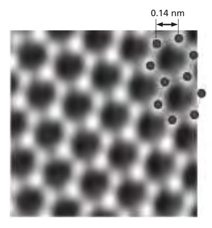

MBoC7 m9.40/9.39 Figure 9–39 The resolution of the electron microscope. This transmission electron micrograph of a monolayer of graphene resolves the individual carbon atoms as bright spots in a hexagonal lattice. Graphene is a single isolated atomic plane of graphite and forms the basis of carbon nanotubes. The distance between adjacent bonded carbon atoms is 0.14 nm (1.4 Å). Such resolution can only be obtained in a specially built transmission electron microscope in which all lens aberrations are carefully corrected, and with optimal specimens; it is rarely achieved with most conventional biological specimens. (From A. Dato et al., *Chem. Commun.* 40:6095–6097, 2009. With permission from the Royal Society of Chemistry.)

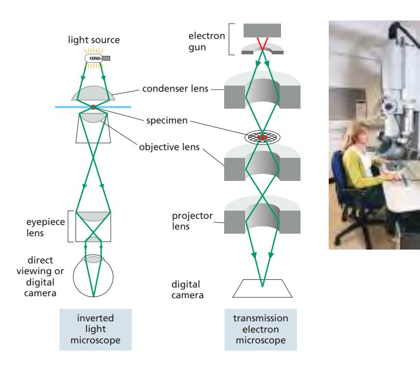

Figure 9–40 The principal features of an inverted light microscope and a transmission electron microscope. These drawings emphasize the similarities of overall design. Whereas the lenses in the light microscope are made of glass, those in the electron microscope are magnetic coils. The electron microscope requires that the specimen be placed in a vacuum. The inset shows a routine transmission electron microscope in use. (Photograph courtesy of Andrew Davis.)

In overall design, the transmission electron microscope (TEM) is similar to an inverted light microscope, albeit much larger (**Figure 9–40**). The source of illumination is a filament or cathode that emits electrons at the top of a cylindrical column about 2 m high. Because electrons are scattered by collisions with air molecules, air must first be pumped out of the column to create a vacuum. The electrons are then accelerated from the filament by a nearby anode and allowed to pass through a tiny hole to form an electron beam that travels down the column. Magnetic coils placed at intervals along the column focus the electron beam, just as glass lenses focus the light in a light microscope. The specimen is put into the vacuum, through an airlock, into the path of the electron beam. As in light microscopy, the specimen can be stained—in this case, with *electron-dense*  material. Some of the electrons passing through the specimen are scattered by structures stained with the electron-dense material; the remainder are focused to form an image. The image can be observed on a monitor or is typically recorded with a sensitive CMOS electron detector. Because the scattered electrons are lost from the beam, the dense regions of the specimen show up in the image as areas of reduced electron flux, which look dark. MBoC7 m9.41/9.40

## Biological Specimens Require Special Preparation for Electron Microscopy

In the early days of its application to biological materials, the electron microscope revealed many previously unimagined structures in cells. But before these discoveries could be made, electron microscopists had to develop new procedures for embedding, cutting, and staining tissues.

Because the specimen is exposed to a very high vacuum in the electron microscope, living tissue is usually killed and preserved by chemical fixation. As electrons have very limited penetrating power, the fixed tissues normally have to be cut into extremely thin sections (25–100 nm thick, about 1/200 the thickness of a single cell) before they are viewed. This is achieved by dehydrating the specimen, permeating it with a monomeric resin that polymerizes to form a solid block of plastic, then cutting the block with a fine glass or diamond knife on a special microtome. The resulting *ultrathin sections*, free of water and other volatile solvents, are supported on a small metal grid for viewing in the microscope (**Figure 9–41**).

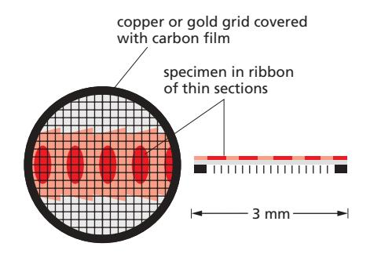

Figure 9–41 Specimen support. The metal grid that supports the thin sections of a specimen in a transmission electron microscope.

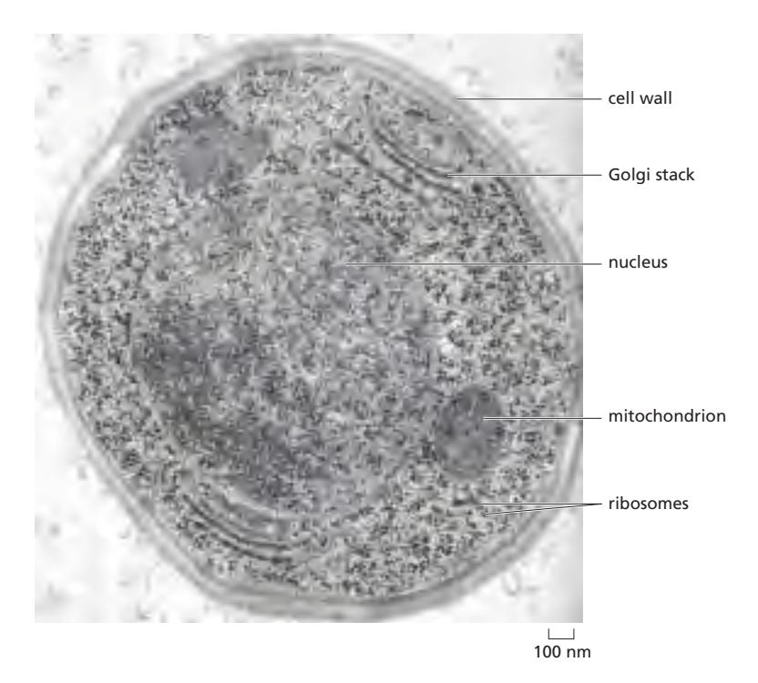

Figure 9–42 Thin section of a cell. This thin section is of a yeast cell that has been very rapidly frozen and the vitreous ice replaced by organic solvents and then by plastic resin (freeze substitution). The nucleus, mitochondria, cell wall, Golgi stacks, and ribosomes can all be readily seen in a state that is presumed to be as lifelike as possible. (Courtesy of Andrew Staehelin.)

The steps required to prepare biological material for electron microscopy are challenging. How can we be sure that the image of the fixed, dehydrated, resinembedded specimen bears any relation to the delicate, aqueous biological system present in the living cell? The best current approaches to this problem depend on rapid freezing. If an aqueous system is cooled fast enough and to a low enough temperature, the water and other components in it do not have time to rearrange themselves or crystallize into ice. Instead, the water is supercooled into a rigid but noncrystalline state—a "glass"—called vitreous ice. This rapid freezing is usually performed by plunging the sample into a coolant such as liquid ethane or by cooling it at very high pressure. MBoC7 m9.44/9.42

Some rapidly frozen specimens can be examined directly in the electron microscope using a special cooled specimen holder. In other cases, the frozen block can be fractured to reveal interior cell surfaces or the surrounding ice can be sublimed away to expose external surfaces. However, we often want to examine thin sections, and the frozen tissue can be sectioned directly in a cooled microtome. A compromise is to rapidly freeze the tissue, replace the water with organic solvents, embed the tissue in plastic resin, and finally cut sections. This approach, called *freeze substitution*, stabilizes and preserves the tissue in a condition very close to its original living state (**Figure 9–42**).

Molecules in all kinds of thin sections can be labeled to identify and localize them. We have seen earlier how antibodies can be used in conjunction with fluorescence microscopy to localize specific macromolecules. An analogous method—*immunogold electron microscopy*—can be used in the electron microscope. The usual procedure is to incubate a thin section first with a specific primary antibody, and then with a secondary antibody to which a colloidal gold particle has been attached. The gold particle is electron-dense and can be seen as a black dot in the electron microscope (**Figure 9–43**). Different antibodies can be conjugated to different-sized gold particles so multiple proteins can be localized in a single sample.

#### Heavy Metals Can Provide Additional Contrast

Although phase contrast can make unstained specimens more visible, image clarity in an electron micrograph usually depends on having a range of electron densities to provide amplitude contrast within the specimen. Electron density in

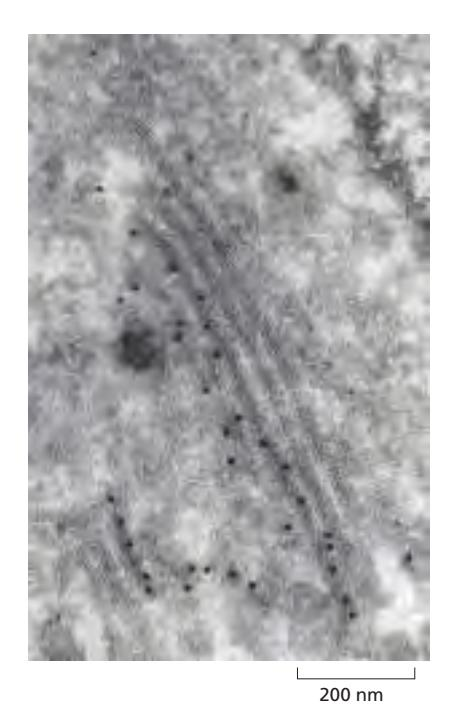

MBoC7 n9.127/9.43 Figure 9–43 Localizing proteins in electron microscopy. Immunogold electron microscopy is used here to find the specific location of a protein that is targeted to the Golgi apparatus. The protein has been tagged with a genetically encoded fluorescent protein and is localized to the trans-Golgi network. The protein is seen in this thin section using an antibody to the fluorescent protein coupled to 10-nm colloidal gold particles, seen in the electron microscope as black dots. The cell has been frozen under high pressure and freeze substituted before embedding and sectioning. (Courtesy of Charlotta Funaya and M. Teresa Alonso.)

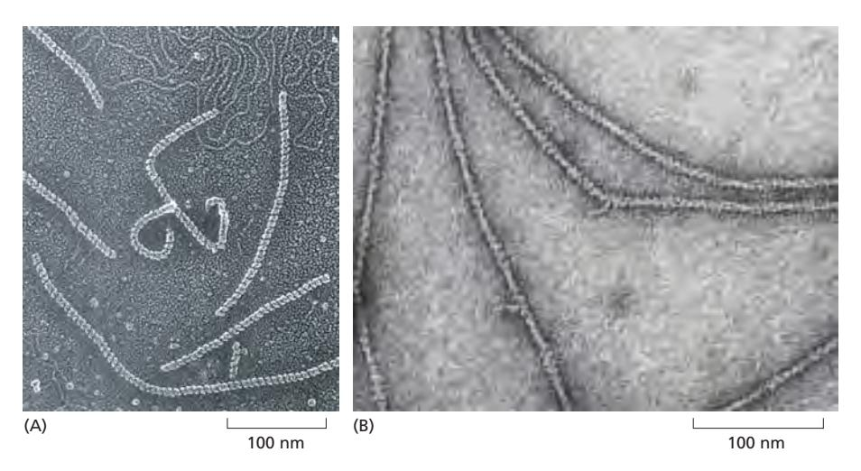

Figure 9–44 Heavy metals provide contrast in the electron microscope. (A) This transmission electron micrograph shows RecA protein together with *E. coli* DNA adsorbed to flakes of mica, frozen, carefully dried, and then shadowed with evaporated platinum atoms. The RecA protein clearly forms tight, right-handed helices around the bacterial DNA molecules, some of which can be seen free at the top of the image (see also Figure 5–48). (B) In this transmission electron micrograph of actin filaments, negatively stained with uranyl acetate, each filament is about 8 nm in diameter and is seen, on close inspection, to be composed of a helical chain of globular actin molecules (see also Figure 16–8). (A, from J. Heuser, *J. Electron Microsc. Tech.* 13:244–263, 1989; B, courtesy of Roger Craig.)

turn depends on the atomic number of the atoms that are present: the higher the atomic number, the more electrons are scattered and the darker that part of the image. Biological tissues are composed mainly of atoms of very low atomic number (primarily carbon, oxygen, nitrogen, and hydrogen). To make them more readily visible, tissues are often impregnated (before or after sectioning) with the salts of heavy metals such as uranium, lead, and osmium. The degree of impregnation, or "staining," with these salts will vary for different cell constituents. Lipids, for example, tend to stain darkly after osmium fixation, revealing the location of cell membranes (see, for example, Figure 12–2 or Figure 12–15).

Alternatively, if isolated molecules are "shadowed" by platinum or other heavy metals evaporated from a heated filament, macromolecules such as DNA or large proteins can be visualized with high contrast in the electron microscope (**Figure 9–44A**). **Negative staining** is a similar approach that also allows fine detail to be seen in isolated molecules or macromolecular machines. In this technique, the molecules are supported on the thin film of carbon on a grid and mixed with a solution of a heavy-metal salt such as uranyl formate or acetate. After the sample has dried, a very thin film of metal salt covers the carbon film everywhere except where it has been excluded by the presence of an adsorbed macromolecule. Because the macromolecule allows electrons to pass through it much more readily than does the surrounding heavy-metal stain, a reverse or negative image of the molecule is created. Negative staining is especially useful for quickly and cheaply viewing large macromolecular aggregates such as viruses or ribosomes and for seeing the subunit structure of protein filaments (**Figure 9–44B**). Shadowing and negative staining can provide high-contrast surface views of small macromolecular assemblies, but the size of the smallest metal particles in the shadow or stain limits the resolution of both techniques to about 2 nm.

## Images of Surfaces Can Be Obtained by Scanning Electron Microscopy

A **scanning electron microscope (SEM)** directly produces an image of the three-dimensional structure of the surface of a specimen. The SEM is usually smaller, simpler, and cheaper than a transmission electron microscope. Whereas

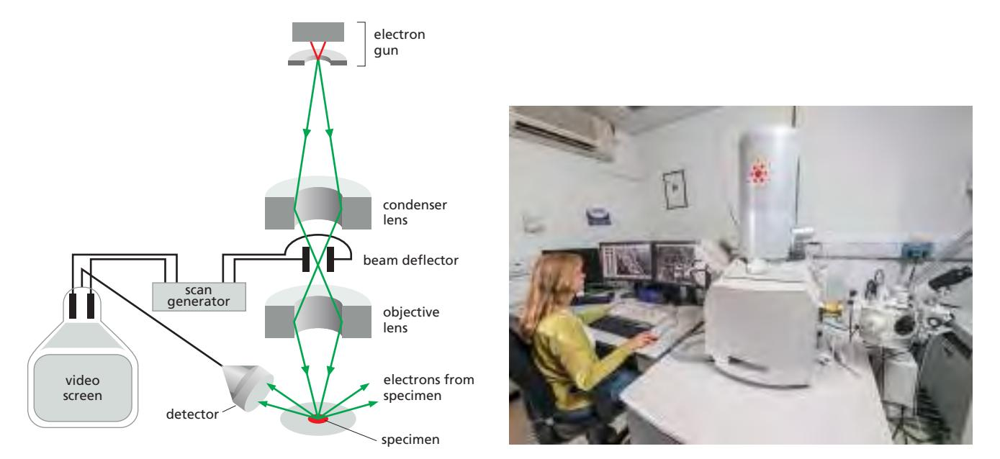

Figure 9–45 The scanning electron microscope. In an SEM, the specimen is scanned by a beam of electrons brought to a focus on the specimen by the electromagnetic coils that act as lenses. The detector measures the quantity of electrons scattered or emitted as the beam bombards each successive point on the surface of the specimen and records the intensity of successive points in an image built up on a screen. The SEM creates striking images of three-dimensional objects with great depth of focus and a resolution between 0.5 nm and 10 nm depending on the kind of instrument. (Photograph courtesy of Andy Davis.)

the TEM uses the electrons that have passed through the specimen to form an image, the SEM uses electrons that are scattered or emitted from the specimen's surface. The specimen to be examined is usually either fixed, dried, and coated with a thin layer of heavy metal or alternatively rapidly frozen and then transferred to a cooled specimen stage for coating and direct examination in the microscope (**Figure 9–45**). The specimen is scanned with a very narrow beam of electrons. The quantity of electrons scattered or emitted as this primary beam bombards each successive point of the metallic surface is measured and builds up an image on a computer screen. Often an entire plant part or small animal can be put into the microscope with very little preparation (**Figure 9–46**). MBoC7 ECB5 page 13/9.45

The SEM technique provides great depth of field, thus objects both near and far in the field of view are imaged sharply. Moreover, because the amount of electron scattering depends on the angle of the surface relative to the beam, the image has highlights and shadows that give it a three-dimensional appearance

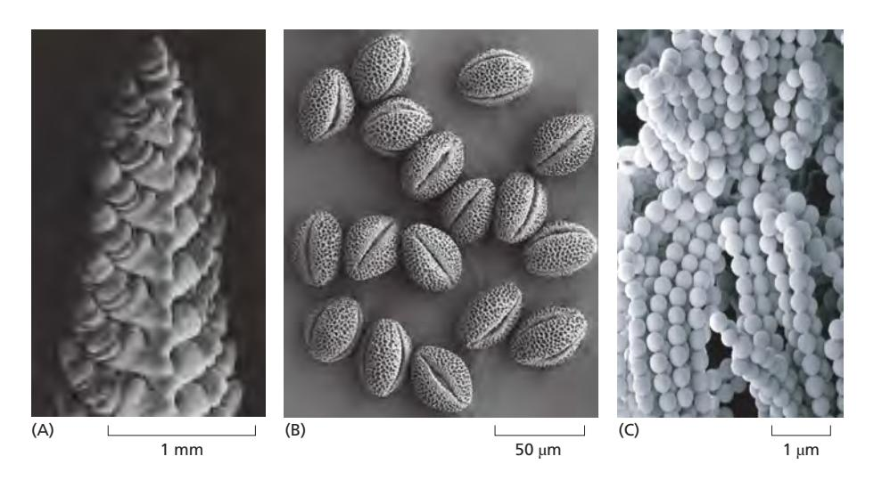

Figure 9–46 The scanning electron microscope produces surface images with great depth of field. SEM micrographs taken at a wide range of magnifications. (A) A developing wheat flower, or spike. This delicate flower spike was rapidly frozen, coated with a thin metal film, and examined in the frozen state with an SEM. This low-magnification micrograph demonstrates the large depth of focus of an SEM, even with a large specimen like this. (B) These pollen grains from a hellebore flower reveal their sculpted cell walls in the SEM. The shapes and patterns are specific for each species of pollen grain. (C) Chains of bacteria living in the blue veins of a Stilton cheese. (A, B, and C, courtesy of Kim Findlay.)

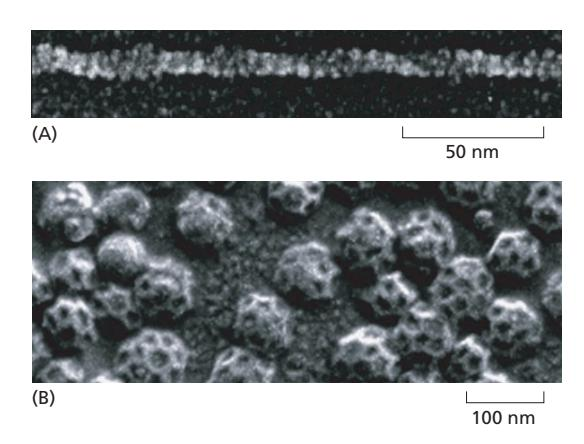

MBoC7 n9.130/9.47 Figure 9–47 Higher-resolution SEM. Macromolecular assemblies, shadowed with a very thin coating of tungsten and imaged in an SEM equipped with a field-emission electron gun. (A) An actin filament showing the helical arrangement of actin monomers. (B) Clathrin-coated vesicles. [A and B, from R. Wepf et al., in Biological Field Emission Scanning Electron Microscopy (R. Fleck and B. Humbel, eds.), pp. 269–298. Hoboken, NJ: Wiley, 2019.]

(see Figure 9–46). Only surface features can be examined, however, and in most forms of SEM, the resolution attainable is not very high (about 10 nm). As a result, the technique is usually used to study whole cells and tissues rather than subcellular organelles (see Movie 21.3). However, very-high-resolution SEMs have been developed with a bright, coherent, field-emission gun as the electron source. As resolution in the SEM depends not on the wavelength of the electron beam but on the size of the electron spot that is scanned across the specimen, this type of SEM can produce images that rival the resolution possible with a negatively stained specimen in a TEM (**Figure 9–47**).

# Electron Microscope Tomography Allows the Molecular Architecture of Cells to Be Seen in Three Dimensions

The SEM can only provide a surface view of an object, which tells us little about the important three-dimensional relationships between macromolecules and organelles within a living cell. Moreover, thin sections viewed in a TEM also often fail to convey the three-dimensional arrangement of cellular components, and the images can be misleading. It is possible to reconstruct the third dimension from serial sections, but this is a lengthy and tedious process. But even thin sections have a significant depth compared with the resolution of the electron microscope, so the TEM image can also be misleading in an opposite way, through the superimposition of objects that lie at different depths.

Because of the large depth of field of electron microscopes, all the parts of the three-dimensional specimen are in focus, and the resulting image is a projection (a superimposition of layers) of the structure along the viewing direction. The lost information in the third dimension can be recovered if we have views of the same specimen but from many different directions. The computational methods for this technique are widely used in medical CT scans. In a CT scan, the imaging equipment is moved around the patient to generate the different views. In **electron microscope (EM) tomography**, the specimen holder is tilted in the microscope, which achieves the same result. The specimen is usually tilted to a maximum of 60° in every direction, and in this way we can arrive at a three-dimensional reconstruction, in a chosen standard orientation, by combining different views of a single object. Each individual view will be very noisy, but by combining them in three dimensions and taking an average, the noise can be significantly reduced. Thick plastic sections of embedded material have been used to create three-dimensional reconstructions, or *tomograms* (**Movie 9.2**), of cells, but increasingly microscopists are applying EM tomography to unstained, frozen, hydrated sections, and even to rapidly frozen whole cells or organelles. Individual macromolecular assemblies that

#### SINGLE-PARTICLE RECONSTRUCTION BY CRYOEM

X-ray crystallography is one way to determine a protein structure. However, large macromolecular machines are often hard to crystallize, as are many integral membrane proteins, and for dynamic proteins and assemblies it is hard to access different conformations through crystallography alone. To get around these problems, investigators are increasingly turning to cryo-electron microscopy (cryoEM) to solve macromolecular structures.

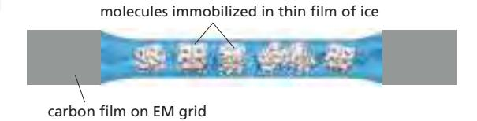

In this technique, a droplet of the pure protein in water is placed on a small EM grid that is plunged into a vat of liquid ethane at −180ºC. This freezes the proteins in a thin film of ice and the rapid freezing ensures that the surrounding water molecules have no time to form ice crystals, which would damage the protein's shape.

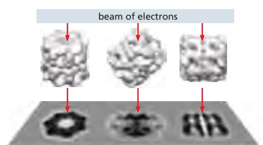

electron detector captures projected image of molecules

The sample is examined, still frozen, by high-voltage transmission electron microscopy. To avoid damage, it is important that only a few electrons pass through each part of the specimen. Sensitive detectors are therefore deployed to capture every electron that passes through the specimen. Much EM specimen preparation and data collection is now fully automated and many thousands of micrographs are typically captured, each of which will contain hundreds or thousands of individual molecules all arranged in random orientations within the ice.

Algorithms then sort the molecules into sets where each set contains molecules that are all oriented in the same direction. The thousands of images in each set are all then superimposed and averaged to improve the signal-tonoise ratio.

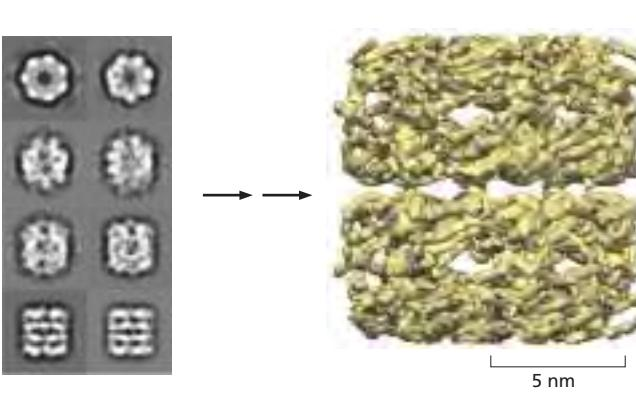

This crisper two-dimensional image set, which represents different views of the particle, are then combined and converted via a series of complex iterative steps into a high-resolution three-dimensional structure.

Model of GroEL (Courtesy of Gabriel Lander.)

> path of an rRNA loop fitted into the electron-density map

> > G C RNA bases

Mg2+

#### CRYOEM STRUCTURE OF THE RIBOSOME

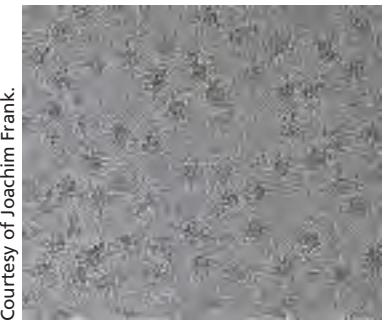

60S ribosomal subunits randomly oriented in a thin film of ice

60S large ribosomal subunit at 0.25 nm resolution

100 nm 5 nm 1 nm

Although by no means routine, big improvements in image-processing algorithms, modeling tools and sheer computing power all mean that structures of macromolecular complexes are now becoming attainable with resolutions in the 0.2- to 0.3-nm range.

This resolving power now approaches that of x-ray crystallography, and the two techniques thrive together, each bootstrapping the other to obtain ever more useful and dynamic structural information. A good example is the structure of the ribosome shown here at a resolution of 0.25 nm.

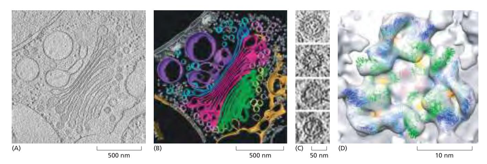

appear as multiple copies in the tomogram can be identified, and with a computational process called *subtomogram averaging* to reduce noise and gain structural information, molecular structures inside cells can now be obtained at a resolution of better than 2 nm (**Figure 9–48**). Electron microscopy now provides a robust bridge between the scale of the single molecule and that of its cellular environment.

#### Cryo-electron Microscopy Can Determine Molecular Structures at Atomic Resolution MBoC7 n9.131/9.48

As we saw earlier (p. 567), noise is important in light microscopy at low light levels, but it is a particularly severe problem for electron microscopy of unstained macromolecules. A protein molecule can tolerate a dose of only a few hundreds of electrons per square nanometer without damage, and this dose is orders of magnitude below what is needed to define an image at atomic resolution.

The solution is to obtain images of many identical molecules—perhaps hundreds of thousands of images of individual particles—and combine them to produce an averaged image, revealing structural details that are hidden by the noise in the original images. This procedure is called **single-particle reconstruction** (**Panel 9–1**). Before combining all the individual images, however, they must be aligned with each other. With the help of a computer, the digital images of randomly distributed and unaligned molecules can be processed and combined to yield high-resolution reconstructions (see Movie 13.1). Although structures that have some intrinsic symmetry, such as dimers or helical repeats, are somewhat easier to solve (**Figure 9–49**), this technique has also been used for huge macromolecular machines, such as ribosomes, that have no symmetry (see Panel 9–1).

Cryo-electron microscopy (cryoEM) depends crucially on very rapidly freezing the aqueous specimen to form vitreous ice, which does not allow ice crystals to form and therefore does not damage the specimen. A very thin (about 100 nm) film of an aqueous suspension of purified macromolecular complex is prepared on a microscope grid and is then rapidly frozen by being plunged into a coolant. A special sample holder keeps this hydrated specimen at –160°C in the vacuum of the microscope, where it can be viewed directly without fixation, staining, or drying. Unlike negative staining, in which what we see is the envelope of stain exclusion around the particle, cryoEM produces an image from the macromolecular structure itself. The specialized transmission electron microscopes required operate with much higher electron accelerating voltages than that of a routine TEM and typically run at 300,000 V. However, as very low electron doses are used to obtain cryoEM images, the intrinsic contrast in the images produced is very low, and to extract the maximum amount of structural information, special image-processing techniques must be used. Huge advances in direct electron detectors and faster, more efficient image-processing techniques that involve image alignment routines, motion correction, and contrast transfer function corrections mean that the structures of molecules as small as 100 kilodaltons can now be solved. The smaller the molecule, the noisier the image, and the main

Figure 9–48 EM tomography. The COP1 coat mediates vesicle traffic within the Golgi apparatus and retrograde traffic to the endoplasmic reticulum (ER) (see Figures 13–4 and 13–5). EM tomography has helped visualize the details of COP1 coats *in situ* on buds and vesicles in rapidly frozen *Chlamydomonas* cells. (A) One slice through a three-dimensional tomogram of a complete Golgi apparatus. (The tomogram can be seen in Movie 9.2.) (B) Using the information from several such tomograms, a portion of the Golgi is shown here, color coded to show ER *dark yellow*, the *cis* vesicles *yellow*, the four *cis* cisternae *green*, the four medial cisternae *red*, the *trans* cisterna *blue*, medial vesicles *pink*, *trans* vesicles *light blue*, and the *trans* Golgi network *purple*. Ribosomes can also be seen as small gray blobs. (C) Individual slices through COP1 vesicles in the tomogram; the bottom one is partially uncoated. (D) By identifying and averaging more than 10,000 COP1 subunits on vesicles in the tomograms, a molecular structure was obtained by subtomogram averaging at a resolution of 2 nm. Structures of the various proteins in the COP1 coat have been solved, and they can be fitted neatly into the electron-density envelope of the EM structure. A surface view of a triad of COP1 subunits on the surface of a vesicle is shown here together with the molecular structures (in color) of the individual components that have been fitted into the EM structure. (Adapted from Y.S. Bykov et al., *eLife* 6:e32493, 2017, doi 10.7554/eLife.32493.)

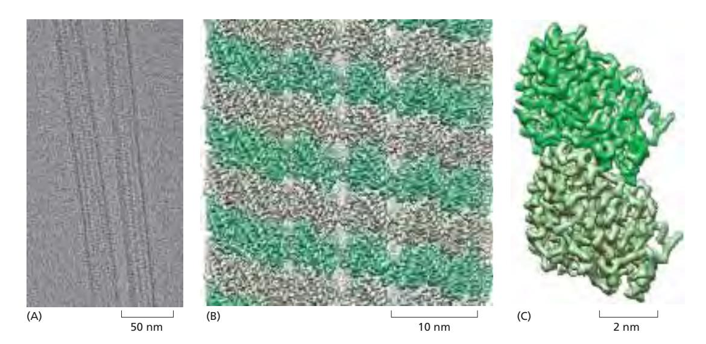

MBoC7 n9.135/9.49 Figure 9–49 CryoEM structure of microtubules. This cryoEM reconstruction of the structure of a microtubule was helped by the intrinsic symmetry of the microtubule itself (see Figure 16–37). This detailed model of the whole microtubule has allowed an examination of the way in which the protofilaments interact and the way in which the whole lattice and associated proteins are assembled. (A) CryoEM image of two intact microtubules embedded in vitreous ice. (B) A reconstruction of the surface lattice of a single microtubule at a resolution of 0.35 nm (3.5 Å). (C) The detailed electron-density map of the tubulin dimer extracted from the structure of the intact microtubule. α-Tubulin is *darker green*, and β-tubulin is *lighter green*. (From E. Nogales, *Mol. Biol. Cell* 27:3202–3204, 2016, doi 10.1091/mbc.E16-06-0372. With permission from Elsevier.)

advantages of the method are best seen with large and sometimes flexible macromolecular complexes such as viruses, ribosomes, and large integral membrane proteins that are hard to crystallize (**Figure 9–50**).

A remarkable resolution of 0.12 nm (1.2 Å) has been achieved in a particularly stable protein by cryoEM, enough to see clearly the detailed atomic structure and to rival x-ray crystallography in resolution (**Figure 9–51**). Electron microscopy, however, also has some very clear additional advantages over x-ray crystallography (discussed in Chapter 8) as a method for macromolecular structure determination. First, it does not require crystalline specimens. Second, it can deal with extremely large complexes—structures that may be too large or too variable to crystallize satisfactorily; for example, membrane proteins. Third, it allows the rapid analysis of different conformations of protein machines; for example, the different states of the F1 ATPase proton pump shown in Figure 14–31. Fourth, the glycosylation patterns and mobile loops on the surface of proteins, which are often impossible to see in x-ray structures, are more readily resolved in cryoEM structures. And fifth, only a minute amount of sample is required compared with that needed to make crystals.

The analysis of large and complex macromolecular structures is helped considerably if the atomic structure of one or more of the subunits is known, for

Figure 9–50 The spike protein on the SARS-CoV-2 virus. The SARS-CoV-2 virus was responsible for the COVID-19 pandemic. Protruding from the viral membrane are many trimeric spike proteins that mediate binding of the virus to a receptor on cells in our respiratory tract and its subsequent entry into the cell. The trimeric spike protein is a target both of our immune system and of vaccine developers. The closed conformation of the trimeric spike protein shown here, both from the top (A) and from the side (B), was obtained from rapidly frozen intact virus particles. Spike proteins were identified by computer from multiple tilted images of the viruses and subtomogram averaging applied to them. The final electron-density map was determined to a resolution of 0.35 nm, good enough for the molecular model (shown here) to be accurately fitted within its envelope, although the details of the membrane-spanning portion of the trimeric spike protein are not revealed. The proteins are heavily *N*-glycosylated, and these surface glycans are shown in *green*, while the three spike proteins are shown in *dark green*, *light blue*, and *light brown*. (PDB code: 6ZWV.)

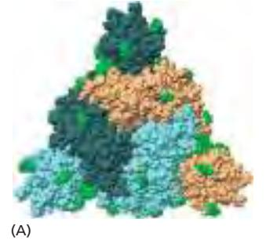

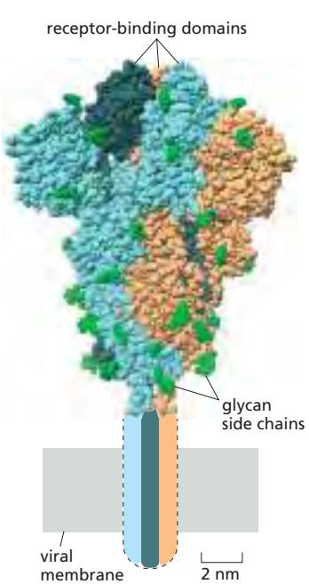

(B)

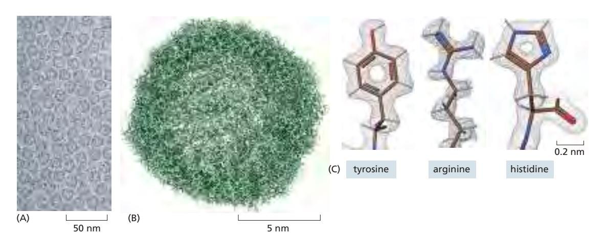

example from x-ray crystallography (**Figure 9–52**). Molecular models can then be mathematically "fitted" or docked into the envelope of the structure determined at lower resolution using the electron microscope. X-ray and cryoEM approaches often combine profitably together to determine molecular structures.

#### Light Microscopy and Electron Microscopy Are Mutually Beneficial MBoC7 n9.133/9.51

The interior of the cell is a confusing place, with molecules crowded together in the cytosol and intricate and complex membrane-bounded compartments. To discover which molecules are located exactly where and in which tiny vesicles or subcompartments of the cell is not straightforward, even with the genetically encoded labels that can target almost any protein. We have seen that superresolution light microscopy can be used to very accurately locate specific molecules within a cell. A major disadvantage, however, of all fluorescence imaging techniques is that it is only the tagged molecules that are imaged—their cellular context remains invisible. When fluorescence imaging is combined, however, with looking at the same specimen in the electron microscope, this correlative light microscopy and electron microscopy technique, or *CLEM*, can allow specific target molecules to be examined in their full cellular context. Although this can be achieved using fixed and sectioned material, most such approaches now use rapidly frozen material to co-localize target molecules both in the light and in the

PRC2

# EZH2 nucleosome DNA H3 histone tail lysine 27 histone core

#### Figure 9–51 Atomic resolution by

cryoEM. Apoferritin is a cytosolic protein, present in almost all living organisms, that reversibly stores iron in a nontoxic form. It is a large (474 kilodaltons) and particularly stable molecule. Its hollow globular cage has 24 symmetrical subunits, which means that a structure can be determined with relatively few particles. (A) Cryo-electron micrograph of cage-like apoferritin particles. (B) By use of every possible new technical advance in single-particle reconstruction, the complete cryoEM structure shown here is at the remarkable resolution of 0.12 nm (1.2 Å). (C) When the known amino acid sequence is modeled into the electrondensity map, clear electron densities can be seen associated with hydrogen atoms in the three amino acid side chains. The molecular model is fitted into the final electron-density envelope that is shown as a *gray cage*. (A, from T. Nakane et al., *Nature* 587:152– 156, 2020, doi 10.1038/s41586-020-2829-0; B, EMD-11668; C, adapted from K.M. Yip et al., *Nature* 587:157–161, 2020. With permission from Nature.)

Figure 9–52 PRC2, a large macromolecular machine. Polycomb repressive complex 2 (PRC2) is a large protein complex involved in establishing heterochromatin and the epigenetic regulation of gene expression (see Figure 4–40). PRC2 interacts with a nucleosome through the binding of the nucleosomal DNA by one of its subunits, EZH2, which also engages the extended tail of histone H3 to direct its lysine 27 (K27) to the active site for methylation. The density map of PRC2 and two essential cofactors bound to a single nucleosome was produced by single-particle cryoelectron microscopy reconstruction at a resolution of 0.35 nm. The long arm of histone H3 is shown in more detail with the protein backbone modeled into the density map. (Courtesy of Vignesh Kasinath and Eva Nogales and based on EMDB-21707. From V. Kasinath et al., *Science* 371:eabc3393, 2021. With permission from AAAS.)

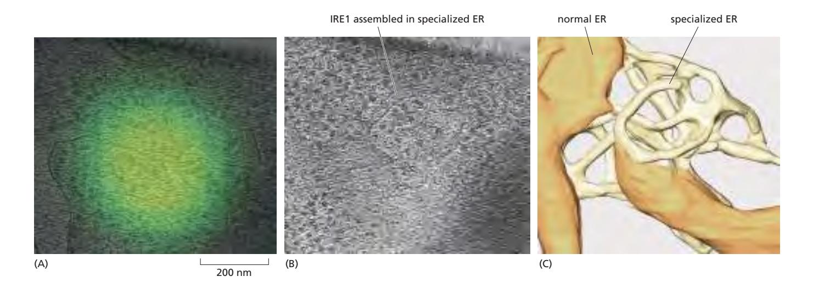

electron microscope, and of these two general approaches are common. The first is to freeze the cell or tissue, locate the positions of the target molecule with fluorescence light microscopy, and then, after transferring the frozen specimen to an electron microscope, tilting it, using EM tomography to find the exact point in the tomogram that corresponds to the fluorescent signal (**Figure 9–53**). MBoC7 n9.139/9.53

A second approach, and a demanding one too, is again to rapidly freeze the cell and locate fluorescent molecules at high resolution by single-molecule localization microscopy. The frozen cell is then transferred to a modified SEM that incorporates a separate focused ion beam, usually of gallium ions, that can be scanned across the frozen block face like a miniature milling machine, removing about 10 nm of the sample at a time. The SEM records a two-dimensional image of the scattered electrons from the surface of the block face at each step, and a three-dimensional image of the cell is gradually built up that can be correlated with the original localization data, all with a final resolution of about 5 nm (**Figure 9–54**). The technique is called *focused ion beam–scanning electron microscopy*, or FIB–SEM for short. The same technique, but without the fluorescent labels, can be used on much larger specimens that have been conventionally fixed, stained with heavy-metal salts, and embedded in plastic. Although the structural preservation may not be so good as with frozen specimens, the approach, although very time consuming, is proving useful in analyzing complex cellular interactions; for example, in mapping the neural connections in brain tissue (see Movie 9.1).

#### Using Microscopy to Study Cells Always Involves Trade-Offs

The history of cell biology has been tightly interlinked with that of microscopy. What we now know about the structure and function of cells has depended crucially on being able to image cells, organelles, and the molecules they contain—seeing is indeed believing. But for the young biologist today, there is, as we have seen, a bewildering variety of imaging technologies from which to choose, and knowing which is best suited to solve the problem at hand is not easy. All imaging approaches have trade-offs to consider. At an obvious level, the dynamics of cells are only accessible with certain kinds of light microscopies and with living cells. If higher resolution is required, with either electron microscopes or light microscopes, then that comes with increasing cost and complexity. Single-molecule localization microscopy also requires elaborate hardware and also takes many minutes to acquire each image. The cryoEM-derived structures of large protein complexes require the use of high-voltage machines that cost many millions of dollars. Such resources are usually confined to large centralized microscopy facilities that can be shared by many users. The precise localization of molecules within the cell requires the use of fluorescent labels, but, because only the labels themselves can be detected in a fluorescence microscope, the cellular

Figure 9–53 Correlated light and electron microscopy (CLEM). The correct folding of proteins in the endoplasmic reticulum (ER) is sensed by a major transmembrane protein called IRE1 (see Figures 12–36 and 12–37). If IRE1 is activated, it forms oligomers that are visible in fluorescence microscopy as bright foci. Here, stressed cells, expressing fluorescent IRE1 and growing on an EM grid, are rapidly frozen and subsequently imaged by EM tomography. The resulting tomograms can be directly correlated with the light micrographs. (A) A fluorescent spot of labeled IRE1 is shown here precisely superimposed on a slice through its corresponding EM tomogram that contains a network of ER. (B) Another slice through the tomogram at a different level shows IRE1 is localized as aggregates in a complex network of specialized, narrow ER tubules. (C) The outlines of the ER membranes in each slice of the tomogram are manually defined (in a process called segmentation), and the drawing here shows that the oligomers of IRE1 are concentrated in this convoluted network of specialized ER tubules. (A, B, and C, adapted from S.D. Carter et al., 2021, doi 10.1101/2021.02.24.432779.)

Figure 9–54 Focused ion beam–scanning electron microscopy (FIB–SEM).

Superresolution light microscopy is combined here with three-dimensional electron microscopy of rapidly frozen cells to enable the high-resolution localization of target molecules throughout the entire volume of a cell. Sequential slices through the frozen cell are obtained by steadily milling the surface of the frozen block face with a focused ion beam, while images of the surface are collected at each step in an SEM. This particular cell has been labeled with fluorescent markers for the lumen of the endoplasmic reticulum *(green)* and for the outer membrane of mitochondria *(magenta)*. (A) Three orthogonal slices through the cell show the combined electron microscope and fluorescence light microscope images. (B) A small region of the same cell imaged with a structured illumination microscope (SIM) is used to define mitochondrion and ER. (C) The corresponding block face image in the SEM. (D) The correlated electron microscope and light microscope images identify the position of the fluorescent labels in the electron micrograph. (E, F, and G) Because the three-dimensional SEM data set is of the entire cell, different views of the same area can be readily obtained. Here, the three corresponding vertical sections along the *yellow dotted lines* on the images above are shown. (From D.P. Hoffman et al., *Science* 367:265–277, 2020. With permission from AAAS.)

context is sacrificed. Imaging itself involves several trade-offs to be considered. An improvement in any one parameter—image contrast, resolution, signal-to-noise ratio, specimen damage by photons or electrons, the depth of specimen that can be imaged, or the speed of image recording—will inevitably require a sacrifice in one or more of the others, and understanding these trade-offs will help determine which approach is best for the cell biology problem being tackled. MBoC7 n9.140/9.54

#### Summary

*Discovering the detailed structure of cells and their molecules requires the higher resolution attainable in a transmission electron microscope. Three-dimensional views of the surfaces of cells and tissues are obtained by scanning electron microscopy. Specific macromolecules can be localized by combining electron microscopy with fluorescence light microscopy. EM tomography enables three-dimensional information about cellular architecture to be obtained. The shapes of isolated molecules can be roughly determined by electron microscopy techniques involving negative staining or heavy-metal shadowing, but detailed molecular structures require cryoEM and single-particle reconstruction using computational manipulations of data obtained from multiple images and multiple viewing angles to produce detailed reconstructions of macromolecules and molecular complexes. The resolution obtained with these methods means that atomic structures of individual macromolecules can be "fitted" to the images derived by electron microscopy. CryoEM can often determine the structures of molecules that are inaccessible to x-ray crystallography.*

# PROBLEMS

#### Which statements are true? Explain why or why not.

- 9–1 A fluorescent molecule, having absorbed a single photon of light at one wavelength, always emits it at a longer wavelength.
- 9–2 Transmission electron microscopy and scanning electron microscopy can both be used to examine a structure in the interior of a thin section: transmission electron microscopy provides a projection view, while scanning electron microscopy captures electrons scattered from the structure and gives a more three-dimensional view.

#### Discuss the following problems.

9–3 The diagrams in **Figure Q9–1** show the paths of light rays passing through a specimen into a dry lens or into an oil-immersion lens. Offer an explanation for why oil-immersion lenses should give better resolution. Air, glass, and oil have refractive indices of 1.00, 1.51, and 1.51, respectively.

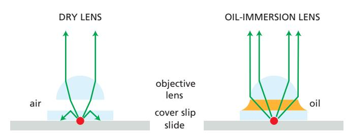

Figure Q9–1 Paths of light rays through dry and oil-immersion lenses (Problem 9–3). The *red circle* at the origin of the light rays is the specimen.

9–4 **Figure Q9–2** shows a diagram of the human eye. The refractive indices of the components in the light

path are air, 1.00; cornea, 1.38; aqueous humor, 1.33; crystalline lens, 1.41; and vitreous humor, 1.38. Where does the main refraction—the main focusing occur? What role do you suppose the lens plays? MBoC7 Problems Q9.01/Q9.01

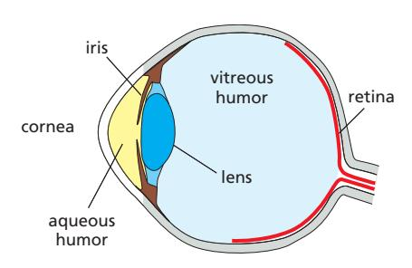

Figure Q9–2 Diagram of the human eye (Problem 9–4).

- 9–5 Why do humans see so poorly under water? And why do goggles help?
- 9–6 Explain the difference between resolution and magnification.

9–7 **Figure Q9–3** shows a series of modified fluorescent proteins that emit light in a range of colors. Several of these fluorescent proteins contain the same chromophore, yet they fluoresce at different wavelengths. How do you suppose the exact same chromophore can fluoresce at several different wavelengths?

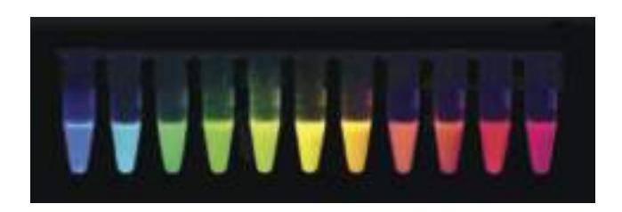

Figure Q9–3 A rainbow of colors produced by modified fluorescent proteins (Problem 9–7). (Courtesy of Nathan Shaner, Paul Steinbach, and Roger Tsien.)

9–8 A fluorescent biosensor was designed to report the cellular location of active Abl protein tyrosine kinase. A blue (cyan) fluorescent protein (CFP) and a yellow fluorescent protein (YFP) were fused to either end of a hybrid protein, which consisted of a substrate peptide recognized by the Abl protein tyrosine kinase and a phosphotyrosine-binding domain (**Figure Q9–4A**). Stimulation of the CFP domain does not cause emission by the YFP domain when the domains are separated. When the CFP and YFP domains are brought close together, however, fluorescence resonance energy transfer (FRET) MBoC7 Problems Q9.03/Q9.03

Figure Q9–4 Fluorescent biosensor designed to detect tyrosine phosphorylation (Problem 9–8). (A) Domain structure of the biosensor. Four domains are indicated: CFP, YFP, tyrosine kinase substrate peptide, and a phosphotyrosine-binding domain. (B) FRET assay. YFP/CFP is normalized to 1.0 at time zero. The biosensor was incubated in the presence (or absence) of Abl and ATP for the indicated times. *Arrow* indicates time of addition of a tyrosine phosphatase. (From A.Y. Ting et al., *Proc. Natl. Acad. Sci. USA*  98:15003–15008, 2001. With permission from National Academy of Sciences.)

600 Chapter 9: Visualizing Cells and Their Molecules REFERENCES 601

allows excitation of CFP to stimulate emission by YFP. FRET shows up experimentally as an increase in the ratio of emission at 526 nm (from YFP) versus 476 nm (from CFP) when CFP is excited by 434-nm light.

Incubation of the biosensor protein with Abl protein tyrosine kinase in the presence of ATP gave an increase in the ratio of YFP/CFP emission (**Figure Q9–4B**). In the absence of ATP or the Abl protein, no FRET occurred. FRET was also eliminated by addition of a tyrosine phosphatase (Figure Q9–4B). Describe as best you can how this biosensor detects active Abl protein tyrosine kinase.

9–9 Under ideal conditions, with the simplest of specimens (a monolayer of carbon atoms, for example) and careful image processing, the practical resolving power of modern electron microscopes is about 0.05 nm, some 25-fold above the theoretical limit of 0.002 nm. This is because only the very center of the electron lens can be used, and the effective numerical aperture (*n* sin θ) is limited by θ (half the angular width of rays collected at the objective lens). Assuming that the wavelength (λ) of the electrons is 0.004 nm and that the refractive index (*n*) is 1.0, calculate the value for θ, where resolution (0.05 nm) = 0.61 λ/*n* sin θ. How does this value of θ compare with that for a conventional light microscope (60°)?

9–10 Aquaporin water channels in the plasma membrane play a major role in water metabolism and osmoregulation in many cells. To determine their structural organization in the membrane, you use immunogold electron microscopy. You prepare a membrane sample, incubate it with primary antibodies against aquaporin then with gold-tagged secondary antibodies that bind to the primary antibodies. You then examine it by electron microscopy (**Figure Q9–5**). Are the gold particles (black dots) consistently associated with any particular structure?

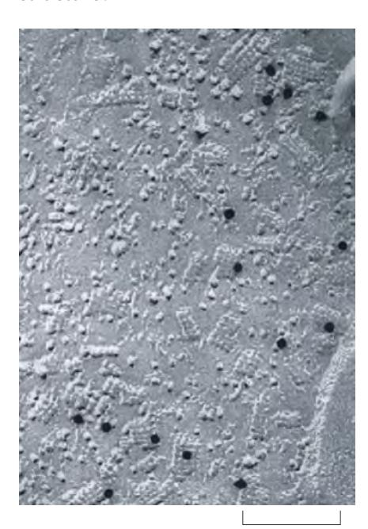

Figure Q9–5 An astrocyte membrane labeled with primary antibodies against aquaporin and then with secondary antibodies to which colloidal gold particles have been attached (Problem 9-10). (From J.E. Rash et al., *Proc. Natl. Acad. Sci. USA* 95:11981–11986, 1998. With permission from National Academy of Sciences.)

9–11 The technique of negative staining uses heavy metals such as uranium to provide contrast. If these heavy metals do not actually bind to defined biological structures (which they do not), how is it that they can help to make such structures visible?

100 nm

# REFERENCES

#### General

Vale R, Stuurman N & Thorn K (2006–2021) Microscopy Series (https://www.ibiology.org/online-biology-courses/microscopyseries/) A major online video series starts with the basics of optical microscopy and concludes with some of the latest techniques, such as superresolution microscopy.

#### Looking at Cells and Molecules in the Light Microscope

Agard DA, Hiraoka Y, Shaw P & Sedat JW (1989) Fluorescence microscopy in three dimensions. In Fluorescence Microscopy of Living Cells in Culture, part B (Taylor DL & Wang Y-L, eds.). *Methods in Cell Biology*, Vol. 30. San Diego: Academic Press.

Boulina M, Samarajeewa H, Baker JD . . . Chiba A (2013) Live imaging of multicolor-labeled cells in *Drosophila. Development* 140, 1605–1613.

Burnette DT, Sengupta P, Dai Y . . . Kachar B (2011) Bleaching/blinking assisted localization microscopy for superresolution imaging using standard fluorescent molecules. *Proc. Natl. Acad. Sci. USA* 108, 21081–21086.

Chalfie M, Tu Y, Euskirchen G . . . Prasher DC (1994) Green fluorescent protein as a marker for gene expression. *Science*  263, 802–805.

Chen F, Tillberg PW & Boyden ES (2015) Expansion microscopy. *Science* 347, 543–548.

Giepmans BN, Adams SR, Ellisman MH & Tsien RY (2006) The fluorescent toolbox for assessing protein location and function. *Science* 312, 217–224.

Greenfield EA (ed.) (2014) Antibodies: A Laboratory Manual, 2nd ed. Cold Spring Harbor, NY: Cold Spring Harbor Laboratory Press.

Greenwald EC, Mehta S & Zhang J (2018) Genetically encoded fluorescent biosensors illuminate the spatiotemporal regulation of signaling networks. *Chem. Rev*. 118, 11707–11794.

Hell S (2009) Microscopy and its focal switch. *Nat. Methods* 6, 24–32.

Huang B, Babcock H & Zhuang X (2010) Breaking the diffraction barrier: super-resolution imaging of cells. *Cell* 143, 1047–1058.

Jacquemet G, Carisey AF, Hamidi H . . . Leterrier C (2020) The cell biologist's guide to super-resolution microscopy. *J. Cell Sci.* 133, jcs240713.

Jonkman J, Brown CM, Wright GD . . . North AJ (2020) Tutorial: guidance for quantitative confocal microscopy. *Nat. Protoc*. 15, 1585–1611.

Klar TA, Jakobs S, Dyba M . . . Hell SW (2000) Fluorescence microscopy with diffraction resolution barrier broken by stimulated emission. *Proc. Natl. Acad. Sci. USA* 97, 8206–8210.

Lippincott-Schwartz J & Patterson GH (2003) Development and use of fluorescent protein markers in living cells. *Science* 300, 87–91.

- Lippincott-Schwartz J, Altan-Bonnet N & Patterson G (2003) Photobleaching and photoactivation: following protein dynamics in living cells. *Nat. Cell Biol.* 5(suppl.), S7–S14.
- Liu T-L, Upadhyayula S, Milkie DE . . . Betzig E (2018) Observing the cell in its native state: imaging subcellular dynamics in multicellular organisms. *Science* 360, eaaq1392.
- Lu C-H, Tang W-C, Liu Y-T . . . Chen B-C (2019) Lightsheet localization microscopy enables fast, large-scale, and three-dimensional superresolution imaging. *Commun. Biol.* 2, 177.
- Minsky M (1988) Memoir on inventing the confocal scanning microscope. *Scanning* 10, 128–138.
- Parton RM & Read ND (1999) Calcium and pH imaging in living cells. In Light Microscopy in Biology: A Practical Approach, 2nd ed. (Lacey AJ, ed.). Oxford: Oxford University Press.
- Patterson G, Davidson M, Manley S & Lippincott-Schwartz J (2010) Superresolution imaging using single-molecule localization. *Annu. Rev. Phys. Chem.* 61, 345–367.
- Pawley BP (ed.) (2006) Handbook of Biological Confocal Microscopy, 3rd ed. New York: Springer Science.
- Rust MJ, Bates M & Zhuang X (2006) Sub-diffraction-limit imaging by stochastic optical reconstruction microscopy (STORM). *Nat. Methods* 3, 793–795.
- Sako Y & Yanagida T (2003) Single-molecule visualization in cell biology. *Nat. Rev. Mol. Cell Biol.* 4(suppl.), SS1–SS5.
- Schermelleh L, Heintzmann R & Leonhardt H (2010) A guide to superresolution fluorescence microscopy*. J. Cell Biol.* 190, 165–175.
- Shaner NC, Steinbach PA & Tsien RY (2005) A guide to choosing fluorescent proteins. *Nat. Methods* 2, 905–909.
- Sigal YM, Zhou R & Zhuang X (2018) Visualizing and discovering cellular structures with super-resolution microscopy. *Science* 361, 880–887.
- Sluder G & Wolf DE (2007) Digital Microscopy, 3rd ed. *Methods in Cell Biology*, Vol. 81. San Diego, CA: Academic Press.
- Tsien RY (2008) Constructing and exploiting the fluorescent protein paintbox (Nobel Lecture). *Angew. Chem. Int. Ed. Engl.* 48, 5612–5626.
- Wayne R (2014) Light and Video Microscopy. San Diego, CA: Academic Press.
- White JG, Amos WB & Fordham M (1987) An evaluation of confocal versus conventional imaging of biological structures by fluorescence light microscopy. *J. Cell Biol.* 105, 41–48.
- Zernike F (1955) How I discovered phase contrast. *Science* 121, 345–349.

#### Looking at Cells and Molecules in the Electron Microscope

- Allen TD & Goldberg MW (1993) High-resolution SEM in cell biology. *Trends Cell Biol.* 3, 205–208.
- Baumeister W (2002) Electron tomography: towards visualizing the molecular organization of the cytoplasm. *Curr. Opin. Struct. Biol.* 12, 679–684.
- Beck M & Baumeister W (2016) Cryo-electron tomography: can it reveal the molecular sociology of cells in atomic detail? *Trends Cell Biol*. 26, 825–837.

- Böttcher B, Wynne SA & Crowther RA (1997) Determination of the fold of the core protein of hepatitis B virus by electron cryomicroscopy. *Nature* 386, 88–91.
- Cheng Y, Grigorieff N, Penczek PA & Walz T (2015) A primer to singleparticle cryo-electron microscopy. *Cell* 161, 438–449.
- Dubochet J, Adrian M, Chang J-J . . . Schultz P (1988) Cryo-electron microscopy of vitrified specimens. *Q. Rev. Biophys.* 21, 129–228.
- Frank J (2003) Electron microscopy of functional ribosome complexes. *Biopolymers* 68, 223–233.
- Frank J (2018) Single-particle reconstruction of biological molecules story in a sample (Nobel Lecture). *Angew. Chem. Int. Ed. Engl.* 57, 10826–10841.
- Hayat MA (2000) Principles and Techniques of Electron Microscopy, 4th ed. Cambridge: Cambridge University Press.
- Henderson R (2015) Overview and future of single particle electron cryomicroscopy. *Arch. Biochem. Biophys*. 581, 19–24.
- Henderson R (2018) From electron crystallography to single particle cryo-EM (Nobel Lecture). *Angew. Chem. Int. Ed. Engl.* 57, 10804–10825.
- Heuser J (1981) Quick-freeze, deep-etch preparation of samples for 3-D electron microscopy. *Trends Biochem. Sci.* 6, 64–68.
- Hoffman DP, Shtengel G, Shan Xu C . . . Hess HF (2020) Correlative three-dimensional super-resolution and block face electron microscopy of whole vitreously frozen cells. *Science* 367, eaaz5357.
- Kukulski W, Schorb M, Kaksonen M & Briggs JAG (2012) Plasma membrane reshaping during endocytosis is revealed by timeresolved electron tomography. *Cell* 150, 508–520.
- Lin DH, Stuwe T, Stillbach S, . . . Hoelz A (2016) Architecture of the symmetric core of the nuclear pore. *Science* 352, aaf1015.
- McDonald KL & Auer M (2006) High-pressure freezing, cellular tomography, and structural cell biology. *Biotechniques* 41, 137–139.
- McIntosh JR (2007) Cellular Electron Microscopy, 3rd ed. *Methods in Cell Biology*, Vol. 79. San Diego, CA: Academic Press.
- McIntosh R, Nicastro D & Mastronarde D (2005) New views of cells in 3D: an introduction to electron tomography. *Trends Cell Biol.* 15, 43–51.
- Nakane T, Kotecha A, Sente A . . . Scheres SHW (2020) Single-particle cryo-EM at atomic resolution. *Nature* 587, 152–156.
- Orlova EWV & Saibil HR (2011) Structural analysis of macromolecular assemblies by electron microscopy. *Chem. Rev.* 111, 7710–7748.
- Pease DC & Porter KR (1981) Electron microscopy and ultramicrotomy. *J. Cell Biol.* 91, 287s–292s.
- Unwin PNT & Henderson R (1975) Molecular structure determination by electron microscopy of unstained crystalline specimens. *J. Mol. Biol.* 94, 425–440.
- Yip KM, Fischer N, Paknia E . . . Stark H (2020) Atomic-resolution protein structure determination by cryo-EM. *Nature* 587, 157–164.
- Zhou ZH (2008) Towards atomic resolution structural determination by single particle cryo-electron microscopy. *Curr. Opin. Struct. Biol.* 18, 218–228.