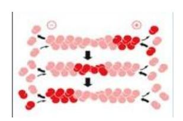
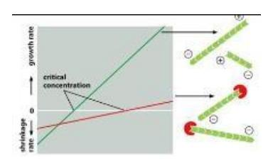
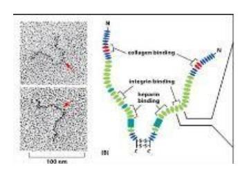
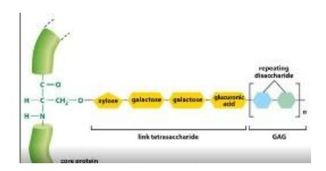

## 2022 세포생물학 기말고사 문제지

- 1. 아래는 해당작용(glycolysis) 과정에 발생되는 중간체들(intermediates)을 나열하였다. 발생 되는 순서대로 나열한 것을 고르시오. (6점)
  - I. Fructose 6-phosphate,
  - II. 3-Phophoglycerate,
  - III. 2-Phophoglycerate,
  - IV. Dihydroxyacetone phosphate,
  - V. Glyceraldehyde 3-phosphate
- 2. Pyruvate → Acetyl CoA 반응을 일으키는 효소를 고르시오. (6점)
- 3. 아래는 Citric acid cycle 과정에 발생되는 중간체들(intermediates)을 나열하였다. 발생되는 순서대로 나열한 것을 고르시오. (6점)
  - I. Succinate
  - II. α-ketoglutarate,
  - III. Oxaloacetate,
  - IV. Fumarate,
  - V. Malate
- 4. 지방산의 일종인 부티르산(CH3CH2CH2COOH)이 아래와 같이 미토콘드리아에서 완전 연 소될 때 여러 물질들을 발생시킨다. 발생되는 물질의 양이 정확한 것을 고르시오. (7점) 부티르산 → 4CO2 + ( )GTP + ( )FADH2 + ( )NADH
- 5. 주요 세 종류의 cytoskeleton 중에서 coiled coil tetramer가 8 개가 모여서 filament를 구 성하면서 filament의 방향성 특징을 나타내지 않는 cytoskeleton은? (3점)
  - (1) intermediate filament
  - (2) actin filament
  - (3) microtubule
  - (4) Collagen type 7
  - (5) elastin

6. 아래 그림은 actin filament의 길이는 일정하게 유지되지만 actin subunit이 filament에 붙 고 떨어지는 현상은 계속 진행 중이다. 이 현상을 의미하는 단어는? (3점)

- (1) Catastrophy
- (2) Treadmilling
- (3) Dynamic instability
- (4) Rescue
- (5) restabilization
- 7. actin filament assembly에서 actin monomer와 binding하여 actin filament elongation을 촉 진 조절하는 기능을 하는 단백질은? (3점)
  - (1) katanin
  - (2) cofilin
  - (3) profilin
  - (4) vinculin
  - (5) stathmin
- 8. Actin filament의 PLUS end에 capping protein이 binding 하면 actin filament dynamics에 어떤 상황이 발생하나? (3점)

- (1) 필라멘트의 + end에 Arp3가 bind 하여 성장을 촉진한다.
- (2) 플러스 끝을 덮는 캡 단백질이 있는 경우 마이너스 끝만 subunit을 추가하거나 잃을 수 있다.
- (3) 필라멘트의 + end에 gamma tubulin ring complex가 bind 하여 결과적으로 필라멘트 성장이 촉진된다.
- (4) 필라멘트의 + end에 stathmin이 bind 한다.
- (5) capping protein이 plectin을 recruit 한다.

- 9. Cardiac myosin 유전자 돌연변이로 인하여 cardiomyopathy가 발생할 수 있다. 마우스 myosin 유전자가 R403Q로 될 때 비정상적인 심장 근육이 형성되었다. R과 Q 아미노산 이름은? (3점)
  - (1) arginine to glutamic acid
  - (2) arginine to glutamine
  - (3) alanine to glutamic acid
  - (4) alanine to glutamine
  - (5) adenine to glutamine
- 10. Cell junction 들 중에서 scaffold protein을 구성하는 도메인이 membrane bound protein 과 binding 하여 occludin과 claudin을 흩어지지 못하도록 하는 junction은? (3점)
  - (1) L-selectin
  - (2) E-cadherin
  - (3) Immunoglobin superfamily
  - (4) tight junction
  - (5) gap junction
- 11. 세포들 사이의 소통을 담당하고 연결이 되어 있는 통로를 개폐하여 인접한 주변의 세포 가 독성 물질에 노출되었을 때 통로를 닫아서 세포를 보호하는 역할을 하는 cell junction 은? (3점)
  - (1) gap junction
  - (2) hemidesmosome
  - (3) tight junction
  - (4) focal adhesion
  - (5) desmosome
- 12. desmoglein-3에 대한 항체가 혈장에서 검출이 되었고, 손에서 물집이 생겨 피부조직을 생검하고 immunohistochemistry로 조직검사를 하였을 때 항체의 위치는 조직의 어느 부 위에서 확인이 될까? (3점)
  - (1) gap junction
  - (2) endothelial cell-basal laminar
  - (3) dermal-epidermal junction
  - (4) oocyte-zona pellucida
  - (5) focal adhesion

- 13. Taxol, colchicine 등은 cytoskeleton assembly를 조절하여 약효를 나타내는 drug 이다. 이 들은 어떤 mechanism으로 약효를 나타내는가? (3점)
  - (1) microtubles 분자에 결합해서 세포분열 과정을 교란시킨다.
  - (2) fibronectin assembly를 방해한다.
  - (3) 자가항체 생성을 억제한다.
  - (4) neutrophil을 활성화시킨다.
  - (5) Arp2/3를 활성화시킨다.
- 14. Fibroblast가 합성하고, connective tissue를 구성하며, 포유류에서 가장 많이 발현하는 단 백질로 whole-body protein content의 30% 정도를 차지하고 있으며, type 1 alpha 1 chain 이 돌연변이를 일으키는 경우 Osteogenesis imperfecta가 유발되는데 관여하는 extracellulat matrix는 무엇인가? (3점)
  - (1) integrn
  - (2) elastin
  - (3) collagen
  - (4) fibronectin
  - (5) MAP2
- 15. 세포내에서 물질 운반 기능을 할 때 neuron axon의 긴 미세소관을 따라서 plus-end방향 으로 운반체를 운반하는 모터 단백질은? (3점)
  - (1) kinesin
  - (2) dynein
  - (3) clathrin
  - (4) Dynamin
  - (5) connexin

16. Extracelliular matrix를 구성하는 성분 단백질 중의 하나인 다음 그림의 단백질에서 integrin binding domain에서 adhesion에 주요하게 관여하는 아미노산은? (3점)

- (1) KDEL
- (2) RGD
- (3) Leucine zipper
- (4) REDV
- (5) COPII
- 17. 조직 내에 박테리아 감염으로 혈관 내의 white blood cell이 혈관 밖으로 빠져 나갈 때 일 어나는 일련의 반응을 바르게 설명한 것은? (3점)
  - (1) 혈구 세포막에 인테그린이 가장 먼저 발현하여 혈관 내피세포 벽에 bind 한다.
  - (2) 세포막 바깥쪽에 lectin domain을 끝에 가지고 있는 P-selectin을 발현한다.
  - (3) 혈구 세포 rolling을 막기 위해 E-selectin에 대한 항체를 만든다.
  - (4) Laminin과 plectin의 binding을 활성화 시킨다.
  - (5) Immunoglobin superfamily 발현을 억제한다.
- 18. 아래 그림과 같이 proteoglycan에 glycosaminoglycan chain이 link 될 때 tetrasaccharide 가 core protein의 어느 아미노산에 연결이 되나? (3점)

- (1) Threonine
- (2) Aspartic acid
- (3) Lysine
- (4) Serine
- (5) Proline

- 19. 우리나라에서는 과거에 사형을 집행하는 방법의 하나로 사약을 마시게 하였다. 사약은 Cyanide를 주성분으로 하고 있는데, Cyanide는 electron transport chain 중 complex IV의 강력한 inhibitor이다. Cyanide에 의하여 사람이 목숨을 잃게 되는 원리를 설명하시오. (10점)
- 20. CCCP라는 약제는 미토콘드리아 내막을 가로질러 수소이온(proton)을 운반하고 이로 인 하여 내막의 proton gradient 형성을 방해한다. 한때 세계적인 제약회사에서 인체에 소량 의 CCCP를 처리하여 비만을 치료하는 방안이 심도 깊게 연구되었던 적이 있다. CCCP가 비만치료제로 활용될 수있는 원리를 설명하시오. (10점)
- 21. SUN–KASH protein complexes 돌연변이로 Emery Dreifuss muscular dystrophy가 발생하는 데, 이 두 단백질이 어떤 cytoskeleton과 어떤 방식으로 연관이 되어 이 질병이 발생하는 가? (4점)
- 22. Fibroblast 내에서 collagen이 합성되는 과정과 세포 밖에서 assembly 되는 과정을 자세 히 설명하시오. (4점)
- 23. 피부 경화증 (scleroderma) 유발에 관여하는 extracellular matrix 구성 단백질 두 가지를 들고 이들이 어떤 방식으로 관여하는지 설명하시오. (4점)
- 24. Proteoglycan과 glycoprotein의 차이점 및 공통적인 역할에 대하여 서술하시오. (4점)
- 25. 자신이 번역한 논문의 결론을 요약하여 설명하시오 (5 줄 이상 서술). (4점)