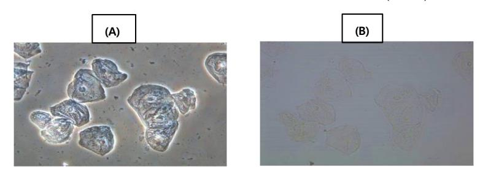
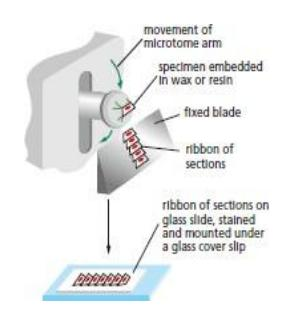
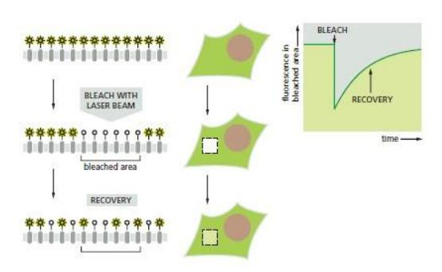
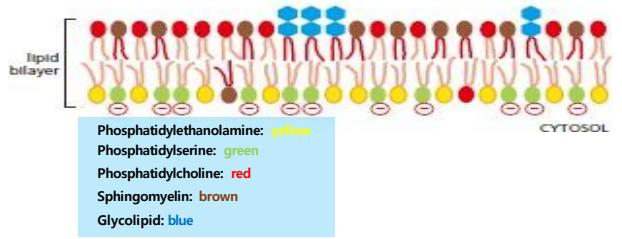
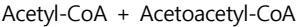
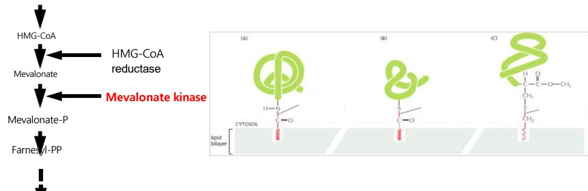
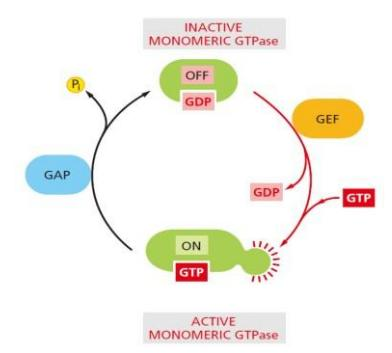
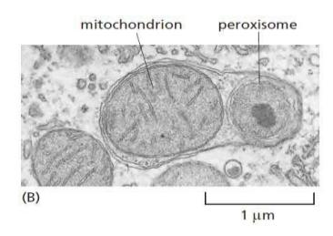

(Essential: E/ important: I/ Acceptable: A)

1> A 와 B 이미지를 얻을 수 있는 현미경에 대한 설명 중 옳은 것은? (E 2 점)

2> 다음 tissue section에 대한 설명 중 맞는 것은? (E 1점)

3> 현광현미경 이미지를 얻기 위해 다양한 primary antibody 와 secondary antibody를 이용 해 실험했으나 정확한 결과를 얻지 못함. 아래 실험 내용을 보고 잘못된 부분을 찾으시오. (I 2점)

Mitosis 동안 spindle microtubule, DNA 와 centromere를 관찰하기 위해 rabbit antibody directed against spindle microtubule 과 rabbit antibody directed against centromere 와 DAPI (DNA 염색약)를 이용하여 염색한 후 서로 다른 형광이 달린 secondary antibody를 사용해 염색 후 현미경으로 관찰하였으나 결과를 얻지 못했다.

- 4> 다음 중 광학 현미경의 분해능에 대한 설명 중 옳은 것은? (E 1점)
- 5> 공초점 현미경 원리에 대한 설명으로 맞는 것은? (E 2점)
- 6> 세포내 A 단백질의 이동을 분석하기 위해 유전자 조작을 통해 A 단백질에 GFP를 달아 fusion 단백질을 만들었다. 현 미경 관찰 결과 A단백질은 ER에서 머물러 있다가 신호 (GFP)가 계속 사라지는 것을 관찰하였다. A 단백질은 KDEL 신호를 가지고 있지 않고 ER내에 aggregation현상도 없다면 위 현미경 관찰 결과의 적절한 해석은? (I 2점)
  - ① 형광 물질인 GFP가 제대로 작동하지 않았다.
  - ② A 단백질은 ER에 머무르는 단백질로 역할 수행 후 분해됨을 확인할 수 있다
  - ③ GFP 때문에 분자가 너무 커져서 ER을 빠져나가지 못하고 결국 분해된 것이다.
  - ➃ GFP 형광이 A 단백질이 ER을 빠져나간 후 역할 하지 않아 관찰을 할 수 없었다.
  - ⑤ GFP를 잡는 secondary antibody를 사용해야 정확한 이동을 확인할 수 있을 것이다.

7> 세포질 단백질 A, B 가 상호 결합하는지 확인하기 위해 세포를 lysis 후 면역침강법 (단백질 상호 작용을 확인하는 실 험 방법)을 수행한 결과 A 단백질과 B 단백질이 서로 결합함을 확인할 수 있었다. 이 실험 결과를 명확하게 하기 위해 FRET 방법을 이용해 현미경으로 관찰하였으나 이 경우에는 결합하지 않는 것으로 판명되었다. 두 실험의 결과가 다른 이 유를 설명하시오. (I 3점)

- 8> 막 단백질의 확산속도를 측정하기 위해 다음과 아래 방법을 사용하였다. 이 방법에 대한 설명으로 옳지 않은 것은? (E 1점)
  - ① 일반적으로 형광 물질을 달아 측정한다.
  - ② Recovery가 빠르면 확산속도가 빠르다는 의미이다.
  - ③ Recovery를 이용해 막 단백질의 확산 계수를 추정할 수 있다.
  - ➃ 좁은 영역의 표백으로 한 개의 막 단백질의 이동도 관찰 가능하다.
  - ⑤ 아주 강한 빛을 주게 되면 형광이 사라지는 photobleaching을 이용한 방법이다.

- 9> 전반사 형광 현미경 (TIRF)의 설명이다. 옳은 것은? (E 2점)
  - ① 살아있는 세포의 내부를 관찰하기 위해 고안된 방법이다.
  - ② 비교적 두꺼운 cover glass를 이용해야 좋은 결과를 얻을 수 있다.
  - ③ 막 지역의 여러 tagging 된 단백질을 관찰하기 위해 고안된 방법이다.
  - ➃ 신호대비 노이즈 비가 매우 높은 매우 높은 선명한 이미지 생성이 가능하다.
  - ⑤ 감쇠장에 의해 형성된 소멸파는 낮은 에너지로 샘플 안쪽까지 도달 가능하다.
- 10> 전자 현미경의 설명 중 옳은 것은? (E 2점)
  - ① 전자의 파장은 속도에 비례한다.
  - ② 회절 한계는 광학 현미경에만 적용된다.
  - ③ 전자 현미경의 이론적 해상도는 약 0.002 nm이다.
  - ➃ 전자밀도가 높은 물질로 염색해 전자빔을 쉽게 통과시켜 이미지를 얻는다.
  - ⑤ 투과전자현미경의 모양은 광학 현미경의 모양과 동일하나 휠씬 큰 구조이다.
- 11> 아래 전자 현미경 샘플 제작 과정에 대한 설명 중 옳지 않은 것은? (E 2점)
- 12> 세포막 구성 성분인 지질의 특성 중 옳은 것은? (E 1점)
- 13> 세포의 유동성에 영향을 미치는 요인을 바르게 설명한 것은? (E 2점)
- 14> 지질 방울 (lipid droplet)에 대한 설명 중 옳은 것은? (E 1점)
  - ① 단일 인지질층으로 존재하는 소기관이다.
  - ② 지질은 세포막과 비슷한 인지질의 형태로 보관된다.
  - ③ 지질 방울을 형성하는 지질층에 단백질은 포함되지 않는다.
  - ➃ 지질 저장에 특화된 Adipocyte만이 지질 저장을 할 수 있다.
  - ⑤ 지질 방울을 형성하는 지질은 산성 지질의 형태로 저장된다.

15> 아래 그림을 보고 유추할 수 있는 것과 apoptosis (세포사멸)시 발생되는 현상에 대해 그 메커니즘을 간략히 기술하 시오. (E 2점)

16> HIDS라는 유전병은 Sterol 합성 기전에서 필수적인 Mevalonate Kinase의 기능이 돌연변이로 상실되어 나타나는 유전 병이다. 아래 그림과 연관시켜 질병의 원인을 유추해보자. (E 3점)

Sterols

17> 막단백질의 이질 이중층내 구조에 대한 설명으로 옳은 것은? (E 1점)

- 18> 당단백질의 구성에 대한 설명은 옳은 것은? (E 1점)
  - 모든 세포소기관의 안쪽은 환원된 상태로 존재한다.
  - 일부 당단백질은 외부로 완전히 방출 후 다시 붙을 수 있다.
  - 당단백질과 당지질은 세포 사이의 상호작용을 촉진시켜 밀착시킬 수 있다.
  - 주로 당 잔기들은 ER과 골지체에서 추가되기 때문에 cytosol을 향하게 된다.
  - 세포소기관 바깥쪽 (cytosol)의 이황화 결합 형성이 단백질 구조에 중요한 영향을 미친다.
- 19> 세포막의 설명으로 옳은 것은? (E 2점)
  - 막단백질은 세포막을 자유롭게 이동할 수 있다.
  - 막단백질은 특정 도메인을 건너서 이동할 수 있다.
  - 막단백질은 안쪽과 바깥쪽의 지질 이중층을 옮겨 다닐 수 있다.
  - 막단백질은 단백질-단백질 상호작용을 통해 한 지역에 고정될 수 있다.
  - 도메인 사이의 단백질은 확산이 방지되나 지질은 계속 확산이 가능하다.
- 20> 수송 소포 (transport vesicle)에 대한 설명으로 옳은 것은? (E 2점)
  - 세포막이 튀어나온 부분에서 버딩이 시작된다.
  - Coating 단백질만 있으면 버딩이 일어날 수 있다.
  - Coating 단백질이 cargo receptor를 직접 recruit 한다.
  - 소포의 안쪽과 세포의 안쪽 (cytosol)은 위상적으로 같다.
  - Cargo receptor들은 원래 세포 바깥쪽 (extracellular)에 존재하는 receptor들이다.
- 21> Clathrin 소포체의 특성 중 옳은 것은? (E 2점)
  - Clathrin은 cytosolic 단백질이다.
  - AP2 단백질은 특정 단백질과 결합으로 구조가 변형된다.
  - Clathrin은 monomer의 형태로 육각형 혹은 오각형 구조를 이룬다.
  - 같은 clathrin으로 코팅된 vesicle은 같은 cargo receptor를 가지고 있다.
  - Clathrin 코팅 단백질은 주로 소포체와 골지체 사이의 이동을 조절한다.
- 22> PI (phosphatidyl inositol)와 PIPs에 대한 설명으로 옳은 것은? (E 2점)
- 23> Dynamin에 대한 설명 중 옳은 것은? (E 2점)
- 24> 왼쪽 그림을 이용해 Sar1 단백질의 coat assembly 메커니즘을 간략히 설명하시오. (E 2점)

- 25> 소포가 목적지 (target membrane)에 도달하는 메커니즘에 대한 설명 중 옳은 것은? (E 2점)
- 26> SNARE를 통한 membrane fusion의 5단계를 나열하시오. (E 1점)

- 28> 골지체에서 이루어지는 glycosylation에 대한 설명 중 옳은 것은? (E 2점)
- 29> 골지체내 수송 단백질의 이동 메커니즘의 가설에 대한 설명 중 옳은 것은? (E 2점)
  - ① COPI vesicle은 회수 경로에만 이용된다.
  - ② Vesicle transport model에서는 ER에서 골지체로 이동할 때 COPI 이 이용된다.
  - ③ Vesicle transport model에서 골지 구조물은 안정적이지 않은 형태로 존재한다.
  - ➃ 큰 단백질의 이동이 CGN에서 멈추는 것은 Vesicle transport model로 설명할 수 있다.
  - ⑤ 인공적인 COPI vesicle을 넣는 실험에서 cargo가 TGN을 통과한 것은 maturation 모델을 지지하는 실험이다.
- 30> Lysosome에 대한 설명 중 옳은 것은? (I 1점)
- 31> 다음 현미경 이미지에 대한 설명으로 맞는 것은? (E 2점)

- 32> TGN에서 lysosome으로 들어가는 효소들의 운반과정에 대한 설명 중 틀린 것 은? (I 1점)
- 33> Clathrin independent에 pinocytic vesicle 대한 설명 중 옳은 것은? (E 2점)
- 34> Receptor mediated endocytosis에 대한 설명으로 맞는 것은? (E 2점)
- ① PI(4,5)P2가 ESCRT 복합체의 docking을 유도하는 역할을 한다.
- ② 초기 endosome은 endocytosis로 들어온 vesicle이 합쳐진 구형이다.
- ③ 생성중인 endosome은 자발적 가수분해 과정을 통해 핵쪽으로 이동한다.
- ➃ Multivesicular body의 안쪽 vesicle에는 ligand/receptor 복합체가 격리되어 있다.
- ⑤ Ubiquitin이 clathrin vesicle안에서 붙어 intralumenal vesicle로의 신호 역할을 한다.
- 35> Phagocytosis에 대한 설명으로 옳은 것은? (E 2점)
- 36> Exocytosis 과정에 대한 설명으로 맞는 것은? (E 1점)

## 재시험자 대상 주관식 두문제 출제

- 1. 세포막의 유동성에 영향을 미치는 세가지 요소와 콜레스테롤의 역할에 대해 설명하시오.
- 2. SNARE를 통한 membrane의 fusion의 5단계를 쓰시오.