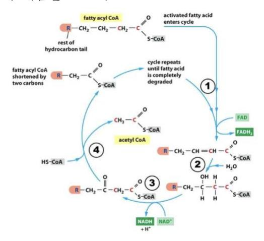
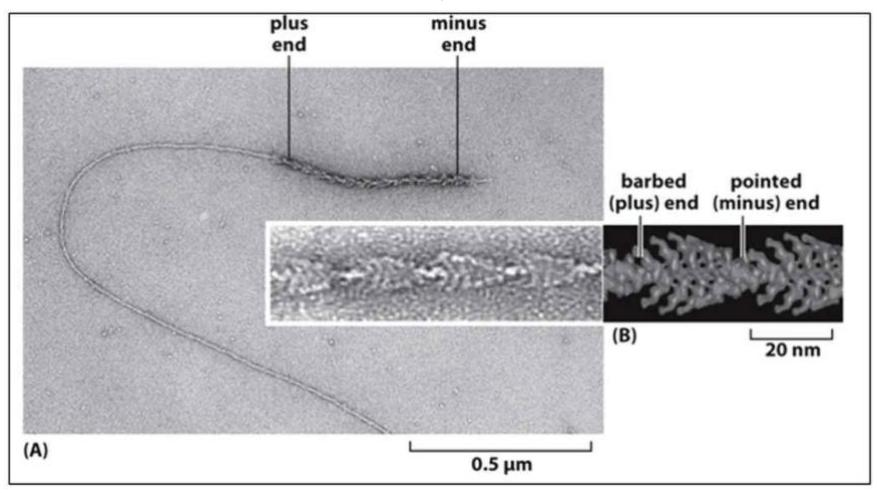
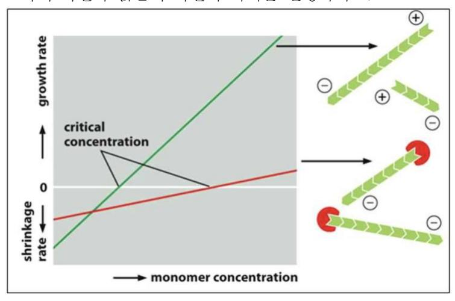
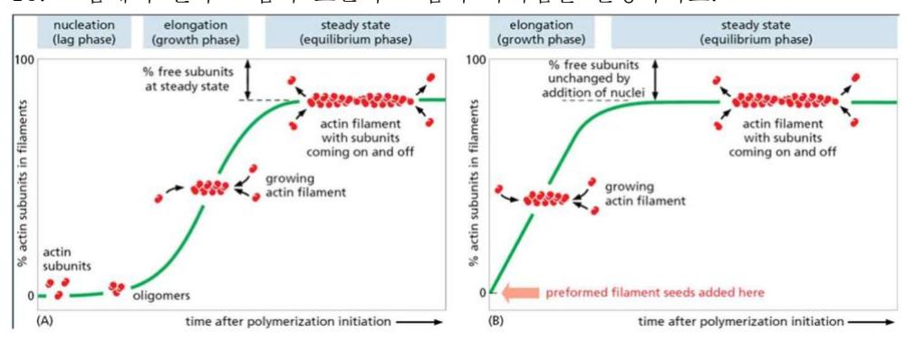
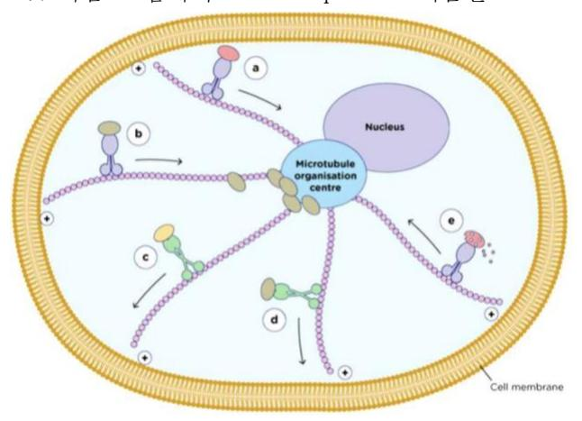
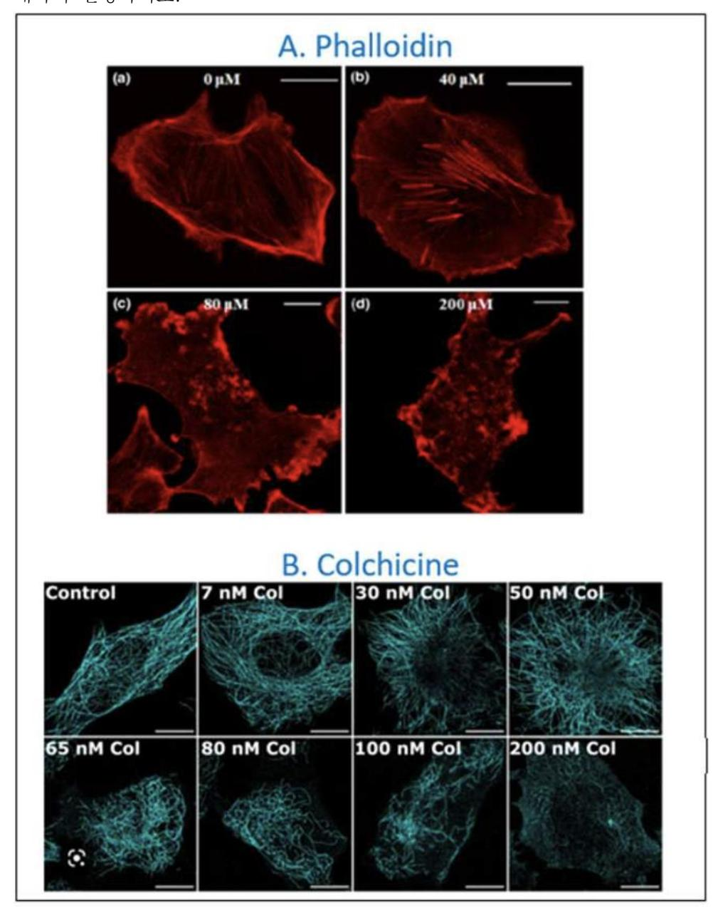
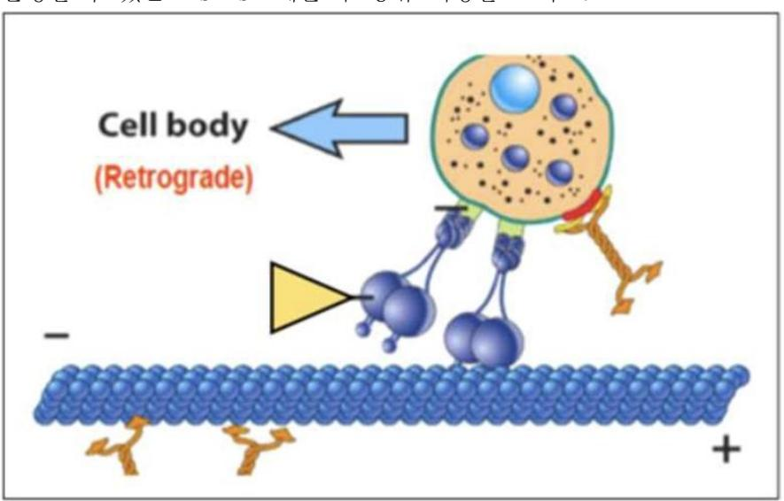
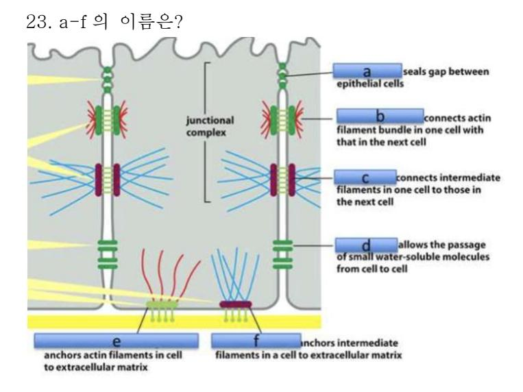
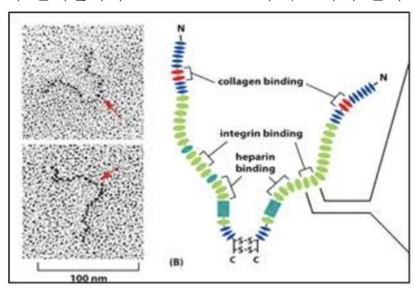
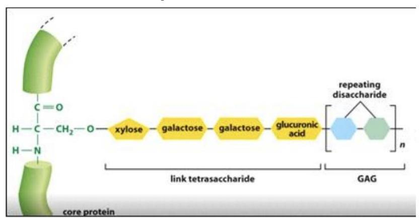

- 1. ATP 는 모든 생명체에서 에너지로 사용된다. 생명체의 에너지인 ATP 에 대한 설명으로 옳지 않은 것을 고르시오
- (1) ATP 가 모든 생명체에서 에너지로 사용되는 이유는 ATP 가 ADP 로 분해될 때 방출되는 에너지의 크기와 관련이 있다
- (2) ATP 가 ADP 와 phosphate 로 분해될 때 방출되는 에너지는 결합에너지이다
- (3) ATP 에서 방출된 에너지는 생체 내에서 일어나는 non-spontaneous reaction 을 spontaneous reaction 으로 바꿔준다
- (4) ATP 에서 방출된 에너지는 많은 경우 단백질 구조변형 유도하며, 이를 통하여 ATP 의 에너지가 substrate 에 전달된다
- (5) Substrate activation 은 ATP 가 enzyme phosphorylation(효소 인산화)을 통하여 에너지를 전달하는 방식이다
- 2. 제시글은 glycolysis(해당작용)의 intermediate(중간체)들의 일부이다. Glycolysis 과정에서 먼저 발생되는 순서대로 나열한 것을 고르시오
- (A) 1,3-bisphosphoglycerate
- (B) Fructose 1,6-bisphosphate
- (C) Phosphoenolpyruvate
- (D) Dihydroxyacetone phosphate
- (1) A, B, C, D
- (2) A, B, D, C
- (3) B, A, C, D
- (4) B, D, A, C
- (5) C, D, A, B
- 3. 제시글은 glycolysis(해당작용) 반응에 관여하는 enzyme(효소)들의 일부이다. Glycolysis 과정에서 먼저 작용하는 순서대로 나열한 것을 고르시오
- (A) Phosphoglycerate kinase (B) Aldolase (C) Enolase
- (1) A, B, C
- (2) A, C, B
- (3) B, A, C
- (4) B, C, A
- (5) C, A, B

| 4. 1 분자의 glucose 가 glycolysis 과정 중에 2 분자의 phosphoenolpyruvate 로 분해되었다. Glycolysis 가 여기에서 멈추었다면, glucose 1 분자에서 net 으로 생산된 ATP 숫자를 고르시오 (1) 0 분자 (2) 1 분자 (3) 2 분자 (4) 3 분자 (5) 4 분자 |
|-------------------------------------------------------------------------------------------------------------------------------------------------------------------------------------------------------------------------------------------------------------|
| 5. 제시글은 citric acid cycle 의 intermediate(중간체)들의 일부이다. Citric acid cycle 과정에서 먼저 발생되는 순서대로 나열한 것을 고르시오                                                                                                                         |
| (A) malate (B) succinate (C) α-ketoglutarate                                                                                                                                                                                                                |
| (1) A, B, C (2) A, C, B (3) B, A, C (4) B, C, A (5) C, B, A                                                                                                                                                                                     |
| 6. 제시글은 citric acid cycle 에 관여하는 enzyme(효소)들의 일부이다. Citric acid cycle 과정에서 먼저 작용하는 순서대로 나열한 것을 고르시오                                                                                                                     |
| (A) Fumarase (B) Succinate dehydrogenase (C) Aconitase                                                                                                                                                                                                      |
| (1) A, B, C (2) A, C, B (3) B, A, C (4) B, C, A (5) C, B, A                                                                                                                                                                                     |
| 7. Glucose 1 분자가 glycolysis 와 citiric acid cycle 을 거치며 6 분자의 이산화탄소로 분해되었다. 이때 발생된 총 NADH 의 숫자를 고르시오                                                                                                      |
| (1) 7 분자 (2) 8 분자 (3) 9 분자 (4) 10 분자 (5) 11 분자                                                                                                                                                                                                  |

- 8. 미토콘드리아의 ATP 생산 기구인 electron transport chain 에 대한 설명으로 옳지 않은 것을 고르시오
- (1) Mitochondrial inner membrane 에 존재한다
- (2) Complex I 은 NADH 로부터 전자 2 개를 전달받는다
- (3) Complex II 는 FADH2 로부터 전자를 전달받는다
- (4) Cytochrome C는 complex I과 complex II로부터 전자를 받아 complex III에 전자를 전달한다
- (5) ATP synthase 는 미토콘드리아 막 내외부의 수소이온 농도차를 이용하여 ATP 를 합성한다
- 9. 제시된 그림은 fatty acid 의 분해과정인 β-oxidation 을 표시한다. ③번 반응을 일으키는 효소의 이름을 고르시오

- (1) B-ketothiolase
- (2) Acyl CoA dehydrogenase
- (3) Hydroxyacyl CoA dehydrogenase
- (4) Enoyl CoA hydratase
- (5) Acetyl CoA carboxylase
- 10. Caprylic acid 는 탄소의 수가 8 개인 saturated fatty acid 이다. Caprylic acid 가 βoxidation 과 citric acid cycle 을 거치면 이산화탄소 8 분자로 분해될 때 발생하는 NADH 의 총 숫자를 고르시오
- (1) 15 분자
- (2) 16 분자
- (3) 17 분자
- (4) 18 분자
- (5) 19 분자

- 11. Electron transport chain 의 complex I, III, IV 는 전자의 에너지를 이용하여 수소이온을 미토콘드리아의 안쪽에서 바깥쪽으로 배출시킨다. 전자가 electron transport chain 을 이동할 때 수소이온이 미토콘드리아 밖으로 배출되는 원리를 자세히 설명하시오. 또한 수소이온이 미토콘드리아의 밖으로만 배출되는 원리를 설명하시오
- 12. Antimycin A 는 electron transport chain 의 complex III 를 inhibition 한다. 배양 중인 세포에 atimycin A 를 소량 처리하였더니, 세포가 소모하는 산소의 양이 감소하였다. 세포의 산소소비가 감소한 이유를 설명하시오
- 13. 테이블 내 보기에서 피부조직 표피에서 장력을 유지하는 flexible non polar cytoskeleton 은?

14. 다음은 actin filament elongation 을 테스트하는 실험으로 최소한 투입해야하는 물질을 쓰고 배양용기 안에서 일어난 현상을 그림을 보면서 설명하시오.

15. Filament capping 과 filament dynamics 에서 그것의 효과에 관한 그림이다. 그림에서 초록색 라인과 붉은색 라인의 차이를 설명하시오.

16. 그림에서 왼쪽 그림과 오른쪽 그림의 차이점을 설명하시오.

17. 다음 그림에서 b motor protein 이름을 쓰고 그 기능을 설명하시오.

18. 주목에서 추출한 물질인 Taxol 을 질병 치료제로 사용하였을 때 순기능과 부작용을 서술하시오.

19. 다음 그림은 cytoskeleton inhibitors 를 처리한 후 세포의 cytoskeleton 을 immunostaining 하여 confocal microscope 으로 사진을 찍은 것이다. A, B 두 그림판에서 각각의 실험의 결과에 대하여 설명하시오.

20. colchicine 을 투여 후 나타나는 현상을 볼 때 colchicine 이 binding 하는 부위는 subunit 의 어느 부위 인가?

21. 다음 그림에서 노란색 arrowhead (화살머리)가 가리키는 단백질이 dysfunction 하는 경우 발생할 수 있는 disease 예를 두 종류 이상을 쓰시오.

- 22. 테이블 내 보기에서 아래 기능을 가지고 있는 단백질을 각각 쓰시오.
- 1) Tubulin-Sequestering protein
- 2) microtubule catastrope promoting protein
- 3) Arp2/3 와 microtubule 에서 비슷한 역할을 하는 protein 은 23. a-f 의 이름은?

- 24. Cadherin 의 intracellular domain 에 직접적으로 binding 할 수 있는 catenin 2 개를 쓰시오
- 25. Cell junction 들 중에서 scaffold protein, occludin 과 claudin 으로 구성된 junction 은?
- 26. Connexon 을 통해 세포들 사이의 소통을 담당하는 cell junction 은?
- 27. Fibroblast 가 합성하고, connective tissue 를 구성하며, 포유류에서 가장 많이 발현하는 단백질로 whole-body protein content 의 25% 정도를 차지하고 있으며, type 1 alpha 1 chain 이 돌연변이를 일으키는 경우 Osteogenesis imperfecta 가 유발되는데 관여하는 extracellulat matrix 는 무엇인가?
- 28. Extracelliular matrix 를 구성하는 성분 단백질 중의 하나인 다음 그림의 단백질 이름을 쓰고, 이 단백질에서 cell adhesion 에 주요하게 관여하는 아미노산 3 개를 쓰시오

29. 아래 그림과 같이 proteoglycan 에 glycosaminoglycan chain 이 link 될 때 tetrasaccharide 가 core protein 의 어느 아미노산에 연결이 되나?

- 30. Basal Lamina 의 주요 구성 단백질 2 가지를 쓰시오
- 31. Talin 과 직접적으로 binding 할 수 있는 단백질을 3 가지 쓰시오
- 32. Inactive integrin 과 active integrin 의 구조적 차이를 설명하시오