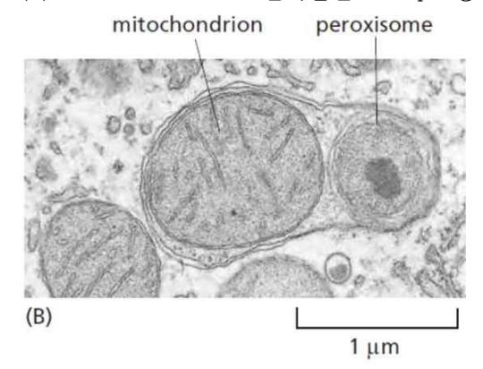
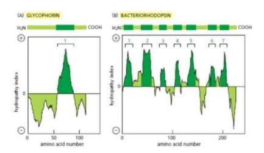
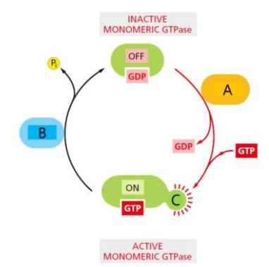

- 1. 최근 발견된 Gasdermin D (GSDMD)라는 단백질은 세포질 영역에 존재하고 있다가 특정 효소에 의해 절단된 후 세포막의 음극성 인지질에 결합해 membrane에 구멍을 만든다. 이 단백질 (GSDMD)이 세포밖으로 나왔을 때 할 수 있는 역할로 타당한 것은? (5점)
- (1) 세포막에 박혀 경화를 억제시킨다.
- (2) 박테리아 세포막의 콜레스테롤에 결합한다.
- (3) 이웃한 세포로 이동하여 세포막에 구멍을 만든다.
- (4) 침투해온 박테리아의 세포막 외부에 직접 결합하여 구멍을 만든다.
- (5) 침투한 박테리아의 내부로 들어가 음극성 인지질에 결합해 구멍을 만든다.
- 2. Dynamin에 대한 설명 중 옳은 것은? (3점)
- (1) 가수분해를 통해 polymerization을 한다.
- (2) GTPase domain을 통해 PI(4,5)P2 와 결합한다.
- (3) Membrane에 결합하지 못해도 역할을 할 수 있다.
- (4) 가수분해를 통해 GTPase domain의 dimerization을 진행한다.
- (5) 세포질쪽에 노출되어 있는 세포막쪽에 결합해 서로 모이게 하여 최종 절단하게 된다.
- 3. PI (phosphatidyl inositol)와 PIPs에 대한 설명으로 옳은 것은? (3점)
- (1) 세포막을 이루는 인지질의 50%정도를 차지한다.
- (2) 한번 생성되면 한가지 고정된 형태로만 존재한다.
- (3) PI(3,4,5) P3를 phosphatidylinositol 3,4,5-tri-phosphate 라고 읽는다.
- (4) 인지질의 글리세롤 대신 이노시톨 (inositol)이 붙어있는 것이 PI이다.
- (5) 작용하는 각 kinase와 phosphatase의 분포는 세포 소기관마다 다르다.
- 4. Clathrin 소포체의 특성 중 옳은 것은? (3점)
- (1) Clathrin은 세포외부에서 세포에 부착된다.
- (2) Clathrin은 vesicle이 목적지에 도달한 후 벗겨진다.
- (3) AP1 단백질은 G 단백질과 결합으로 구조가 변형된다.
- (4) Clathrin으로 코팅된 vesicle은 같은 cargo receptor를 갖게 된다.
- (5) Clathrin 코팅 단백질은 주로 소포체와 골지체 사이의 이동을 조절한다.
- 5. ER로의 회수 경로 (retrieval pathway)에 대한 설명 중 옳은 것은? (3점)
- (1) KDEL 신호서열로 COPI과 직접 결합한다.
- (2) ER 내부는 골지체보다 낮은 pH를 가지고 있다.
- (3) ER로의 회수 경로에는 COPII가 coating 단백질로 작용한다.
- (4) Soluble ER resident 단백질은 KKXX 신호서열을 가지고 있다.
- (5) KDEL receptor는 ER과 vesicle 그리고 골지체에 모두 존재한다.

- 6. 세포내 A 단백질의 이동을 분석하기 위해 유전자 조작을 통해 A 단백질에 GFP를 달아 fusion 단백질을 만들었다. 위상차 현미경으로 관찰한 결과 A단백질의 신호가 관찰되지 않았 다. 그러나 다른 실험을 통해 GFP가 포함된 A 단백질이 제대로 만들어진 것과 동일한 성능을 보인다는 것을 확인했다. 현미경으로 관찰하지 못한 이유로 타당한 것은? (3점)
- (1) 형광 물질인 GFP가 제대로 작동하지 않았다.
- (2) 형광 현미경을 사용해야만 GFP를 관찰할 수 있다.
- (3) GFP 때문에 분자가 너무 커서 현미경으로 관찰이 불가능하다.
- (4) A 단백질을 염색 (staining)해야 현미경으로 관찰 가능할 것이다.
- (5) GFP를 잡는 secondary antibody를 사용해야 정확한 이동을 확인할 수 있을 것이다.
- 7. 소포 (vesicle)가 목적지 (target membrane)에 도달하는 과정에서 Rab 단백질의 역할에 대한 설명 중 옳은 것은? (3점)
- (1) GDI와 결합이 Rab 단백질을 소포에서 방출시킨다.
- (2) Rab의 종류는 고정되어서 하나의 세포소기관에서 변형되지 않는다.
- (3) Rab 단백질들은 membrane에 결합한 형태로 존재해 주소지 역할을 한다.
- (4) Rab 단백질이 활성화되면 vesicle에도 존재하고 target membrane에도 존재한다.
- (5) Rab 단백질은 소포안에 soluble 형태로 존재하다가 특정 GEF를 만나면 membrane에 고 정된다.
- 8. SNARE을 통한 membrane 결합과정에 대한 설명으로 맞는 것은? (3점)
- (1) Lipid bilayer중 세포질에 노출된 쪽이 새로운 bilayer를 형성한다.
- (2) 결합에 사용된 SANRE 복합체 (V-&T-SNARE)는 사용 후 분해된다.
- (3) Hemifusion 단계에서 새로 성되는 bilayer는 소포쪽에서만 유래된다.
- (4) Stalk 형성 단계에서 lipid bilayer 중 세포질에 노출된 면이 stalk을 형성한다.
- (5) 소포와 target 세포막 사이의 물분자가 완전히 제거된 후 SNARE가 pairing 할 수 있다.
- 9. Autophagy 현미경 사진이다. 옆 사진에 대한 설명으로 맞는 것은? (3점)
- (1) 최종 분해를 위해서 SNARE가 작동해야 한다.
- (2) 세포막을 제외한 내부 물질들이 완전히 분해된다.
- (3) 외부에서 들어온 물질들의 분해에 필수적인 과정이다.
- (4) 위 형태가 되면 즉시 내부에 존재하는 것들을 분해하기 시작한다.
- (5) Hurler's disease 환자들은 autophagosome 형성이 불가능하다.

- 10. Clathrin 이 사용되지 않는 endocytosis에 대한 설명으로 옳은 것은? (3점)
- (1) Dynamin이 세포 외부에서 묶어주는 역할을 한다.
- (2) 세포질 단백질인 Cavins이 coating 단백질로 이용될 수 있다.
- (3) Caveolar endocytosis는 주로 lipid raft 지역에서 함입이 일어난다.
- (4) Macropinocytosis 과정에서 재활용을 위해 actin reorganization이 일어날 수 있다.
- (5) Macropinocytosis 과정에서는 세포내 분자 유입을 위해 특별한 수용체가 필요하다.
- 11. Phagocytosis에 대한 설명으로 옳은 것은? (2점)
- (1) Phagosome의 형성 후 바로 분해가 시작된다.
- (2) Phagosome의 크기는 actin으로 인해 일정하게 유지된다.
- (3) Pseudopod의 형성을 위해 PI(3)P가 중요한 신호 역할을 한다.
- (4) Opsonization과정을 통해 phagocyte들의 식균 작용을 억제할 수 있다.
- (5) 박테리아나 죽은 세포 등을 제거하기 위한 특별한 endocytosis 중 하나이다.
- 12. Exocytosis의 역할에 대한 설명으로 옳은 것은? (3점)
- (1) 소포안에 들어있는 물질을 외부로 방출하는 역할만 진행한다.
- (2) Synaptic 소포체는 빠른 방출을 위해 SNARE를 필요로 하지 않는다.
- (3) 세포막 손상이 자주 일어나는 세포에서 세포막 복구를 위해 활용된다.
- (4) Phagocytosis 중에 actin polymerization을 위해 필요한 물질을 분비한다.
- (5) 물질을 세포막 외부로 방출하기 위해서는 항상 특이적인 수용체가 동반되어야 한다.
- 13. Confocal 현미경을 이용해 250 uM 깊이의 조직 안쪽을 관찰하려고 했으나 선명한 이미 지를 얻는데 실패하였다. 그 원인을 바르게 설명한 것은? (3점)
- (1) 방출되는 빛이 더 긴 파장을 가질 수 있게 조절해야 된다.
- (2) 더 강한 빛을 사용하여 더 강하게 형광을 들뜨게 해야 한다.
- (3) Image deconvolution을 이용해 이미지를 처리해야 한다.
- (4) 형광 물질을 들뜨게 하는 고에너지 빛이 깊은 곳으로 침투하지 못했다.
- (5) 형광이 들뜬 후 방출되는 에너지가 현미경의 detector에 도달하지 못했다.
- 14. 광학 현미경의 회절 한계를 우회해서 더 작은 구조를 관찰하기 위해 개발된 현미경들에 대한 설명 중 옳은 것은? (2점)

STED (Stimulated emission depletion microscopy), SIM (Structured Illumination Microscopy), SMLM (Single Molecule Localization Microscopy)

- (1) SMLM은 한번의 광표백 과정이 필요하다.
- (2) SIM은 공간 패턴을 이용하기 때문에 회절 한계에서 벗어날 수 있다.
- (3) STED는 이미지 재 산 과정 없이 작은 빛의 한 지점을 관찰하는 것이 가능하다.
- (4) SIM은 한번의 빛 조사만으로 모아레 무늬에 반영된 고해상도 이미지를 얻는 것이 가능하 다.
- (5) STED은 빛을 시료에 조사함과 동시에 작은 공간을 제외한 지역에 형광을 억제하는 빛을 조사해 최종 이미지 해상도를 높이는 방법이다.

- 15. 전자 현미경의 설명으로 옳은 것은? (2점)
- (1) SEM은 시료의 내부를 관찰하기에 적합하다.
- (2) 물학적 조직은 주로 원자 번호가 낮아 더욱 어둡게 나타난다.
- (3) 전자의 낮은 투과력 때문에 시료는 매우 얇게 절단되어야 한다.
- (4) 전자의 속도를 줄여 파장을 짧게 할수록 선명한 이미지를 얻을 수 있다.
- (5) 급속 동결 방식은 물의 결정화를 진행시켜 바로 전자 현미경으로 관찰 가능하다.
- 16. 세포막의 유동성에 대한 설명으로 바른 것은? (4점)
- (1) 온도에 상관없이 콜레스테롤은 막의 경화를 억제한다.
- (2) 단세포 물은 고온 지역에서는 불포화 지방산을 많이 만든다.
- (3) 박테리아의 세포막에 존재하는 콜레스테롤은 유동성을 감소시킨다.
- (4) 온도가 낮아지면 콜레스테롤이 세포막 경화의 차단에 도움을 줄 수 있다.
- (5) 소수성 꼬리의 길이가 길어지면 반발력으로 세포막의 유동성을 증가시킨다.
- 17. 제시된 hydropathy plot에 대한 설명으로 적절한 것은? (3점)
- (1) (B) 단백질은 7개의 알파 헬릭스를 갖을 수 있다.
- (2) Plot의 양의 값은 물분자와의 친화도가 높은 것을 의미한다.
- (3) (A) 단백질에서 3개의 알파 헬릭스 (a-helix)가 세포막을 통과할 수 있다.
- (4) 베타 쉬트의 바깥쪽은 lipid와 접촉하기 때문에 hydropathy로 판단하기 쉽다.
- (5) 양의 값이 여러 개 존재하는 것은 베타 쉬트 (b-sheet)를 이루고 있음을 의미한다.

- 18. G protein의 활성 조절 기전에 대한 그림이다. 각각의 설명으로 바른 것은? (5점)
- (1) A는 항상 soluble 단백질로 존재한다.
- (2) B는 비활성 G 단백질과 결합하여 안정화시킨다.
- (3) B는 소포의 pinch off 과정에 중요한 역할을 할 수 있다.
- (4) Sar1의 C는 소수성그룹으로만 이루어져 세포막에 결합할 수 있다.
- (5) A 단백질은 모든 G 단백질에 공통적으로 작용하는 하나의 단백질이다.
- 19. 단백질의 glycosylation에 대한 설명으로 적절한 것은? (2점)
- (1) 세포 사이의 신호 전달을 차단한다.
- (2) 거대 분자의 접근을 촉진해 분해를 유도한다.
- (3) 접힘 (folding)이 이루어지는 중간체의 응집을 촉진한다.
- (4) Pathogen이 더 쉽게 공격할 수 있는 receptor역할을 할 수 있다.
- (5) Glycosylation의 순차적 변형은 단백질 접힘의 진행 정도를 나타낸다.

- 20. MKD (mevalonate kinase deficiency) 라는 병은 mevalonate kinase에 돌연변이가 발 해 fanesyl을 만들어 낼 수 없게 된다. MKD의 발병 원인으로 타당한 것은? (3점)
- (1) 단백질이 세포 외부로 방출되어 분해된다.
- (2) 단백질이 세포막에 결합하지 못해 활성을 나타내지 못한다.
- (3) 단백질이 만들어지지 않아 세포 신호 전달을 할 수 없게 된다.
- (4) 단백질의 폴딩에 영향을 주어 단백질이 제대로 역할하지 못하게 된다.
- (5) 단백질이 활성 상태인 GTP 결합 형태로 전환되지 못해 신호 전달을 하지 못한다.
- 21. 세포막을 구부러뜨리는 단백질에 대한 설명으로 옳지 않은 것은? (2점)
- (1) 리포좀 형성을 유도하여 막의 변형을 촉진한다.
- (2) 지질의 머리 그룹을 제거하여 세포막에 곡면을 형성하게 된다.
- (3) 쐐기 모양 단백질이 지질 이중층에 삽입되어 변형시킬 수 있다.
- (4) 거대 곡면을 가진 단백질이 세포막과 결합하여 같이 휘어질 수 있다.
- (5) 큰 머리 그룹을 가진 지질을 한 곳으로 모이게 하여 막을 휘게 할 수 있다.
- 22. 세포막에 대한 설명으로 옳은 것은?
- (1) 막단백질은 세포막에 박혀 이동하지 않는다.
- (2) 막단백질은 특정 도메인을 건너서 이동할 수 있다.
- (3) 막단백질은 안과 바깥쪽의 지질 이중층을 옮겨 다닐 수 있다.
- (4) Tight junction으로 막단백질과 인지질의 이동이 제한될 수 있다.
- (5) 도메인 사이의 단백질은 확산이 방지되나 지질은 계속 확산이 가능하다.
- 23. 베타 배럴 (b-barrels)에 대한 설명으로 옳은 것은?
- (1) 짧은 구조를 가지고 있어서 결정화 하기 어렵다.
- (2) 주로 박테리아, 미토콘드리아, 엽록체의 외막에 풍부하다.
- (3) 큰 통로를 형성해서 많은 분자들이 무작위로 이동할 수 있다.
- (4) 베타 배럴의 가닥 수는 일정해서 비교적 쉽게 구조를 결정할 수 있다.
- (5) 베타 배럴이 단단한 구조를 형성하고 있기 때문에 신호 전달에 중요한 역할을 할 수 있 다.

- 24. 진핵세포 내 protein traffic에 관한 설명으로 옳지 않은 것은? (4점)
- (a) In protein translocation, transmembrane protein translocators directly transport specific proteins from the cytosol into (b) a space that is topologically equivalent spaces: either the other side of a membrane or within the lipid bilayer in the case of integral membrane proteins. (c) The transported protein molecule usually must fold to snake through the translocator. (d) The initial transport of selected proteins from the cytosol into the ER lumen, ER membrane or mitochondria occurs in this way.
- (1) (1) (a) In protein translocation, transmembrane protein translocators directly transport specific proteins from the cytosol into
- (2) (2) (b) a space that is topologically equivalent spaces: either the other side of a membrane or within the lipid bilayer in the case of integral membrane proteins.
- (3) (3) (c)The transported protein molecule usually must fold to snake through the translocator.
- (4) (4) (d) The initial transport of selected proteins from the cytosol into the ER lumen, ER membrane or mitochondria occurs in this way.
- 25. 핵과 세포질 사이의 물질교환에 대한 설명으로 바르게 되어 있는 것은? (4점)
- (1) 핵막은 이중막으로 되어 있으며 외막은 소포체와 연결되어 있다.
- (2) 핵과 세포질 사이의 물질수송은 Nuclear pore complex에 의해 양방향으로 일어나며, 작 은 분자 (<5 kDa) 는 단순확산을 통해 Nuclear pore를 통과할 수 있다.
- (3) 핵 내부로 수송되는 단백질들은 negatively charged amino acids로 구성된 Nuclear localization sequence를 가진다.
- (4) Importin과 단백질 복합체는 핵막으로 들어온 뒤 운반되 단백질과 분리되고 Ran/GTP와 결합한 Importin은 다시 핵공 밖으로 수송한다.
- (5) 세포질에서는 Ran GAP가 Ran의 GTP를 가수분해해서 GDP로 바꾸고 이는 Ran이 Importin으로부터 분리된다.
- 26. 소포체의 기능에 대한 설명으로 옳지 않은 것은? (3점)
- (1) 광범위한 ER network 는 거의 모든 세포의 지질 산을 위한 공장 역할을 한다.
- (2) ER lumen에서N-linked glycosylation은 단백질 접힘의 정도를 나타내기 위해 사용되며, 따라서 단백질은 적절하게 접힐 때만 ER을 떠나게 된다.
- (3) 올바르게 접히지 않거나 올리고머화되지 않은 단백질은 세포질로 다시 이동하여 N-linked glycosylation이 제거되고, polyubiquitination되고, Proteasome에서 분해된다.
- (4) ER signal sequence를 가진 단백질은 신호 인식 입자 (SRP)에 의해 인식되며, 이는 성장 하는 폴리펩타이드 사슬과 리보솜을 포함하는 복합체의 해체를 유도한다.
- (5) ER에서 단백질 삽입과 글리코실화 비대칭성은 ER이 막 단백질로 공급하는 다른 모든 기 관의 막의 측면 (sidedness of the membranes)을 확립한다.

27. 미토콘드리아로 protein import과정 중 에너지의 역할을 보여주는 그림이다. 빈칸에 알 맞게 단어를 바르게 배열하시오.(4점)

단백질을 미토콘드리아로 가져오기 위해 세 가지 다른 에너지원이 사용됩니다. Signal sequence 및 폴리펩타이드 사슬의 인접 부분을 (a) 복합 전위 채널에 처음 삽입한 후, Signal sequence는 (b) 복합체(주황색)와 상호 작용합니다. 그런 다음 Signal sequence는 내부 막을 가로질러 막 전위의 에너지를 필요로 하는 과정에서 매트릭스 공간으로 이동됩니 다. 신호 서열에서 (c)를 띤 아미노산은 이 막 전위 의존 translocation반응을 촉진합니다. Import (d) ase 복합체의 일부인 미토콘드리아 hsp70은 매트릭스 공간에서 노출되면서 폴리 펩타이드 사슬의 영역에 결합하여 Translocation channel을 통해 단백질을 당기며, (d) hydrolysis의 에너지를 사용합니다.

- (1) TOM
- (2) TIM22
- (3) TIM23
- (4) SAM
- (5) OXA
- (6) MIM
- (7) Positively charged
- (8) Negatively charged
- (9) Polar uncharged
- (10) ATP
- (11) GTP
- 28. ER membrane과 Plasma membrane을 구성하는 phospholipid가 합성된 후 Phospholipid translocation을 유도하는 효소들을 고르시오 (4점)
- (1) Scramblase
- (2) Glycanase
- (3) Transamidase
- (4) Isomerase
- (5) Flippase
- 29. 진핵세포는 세포의 전체 부피의 거의 절반을 구성하는 세포 내 막으로 둘러싸인 (a)을 포 함합니다. 모든 진핵 세포에 존재하는 주요한 것들은 (b), (c), (d), (e), (f), (g), 그리고 (h)입 니다; 식물 세포는 또한 (i)와 같은 색소체를 포함합니다. 세포는 또한 그들의 거대 분자의 부 분 집합을 인 (nucleolus)과 같은 (j)로 분리할 수 있습니다. (5점(각 0.5점))
- 30. 페르옥시좀은 분자 산소를 사용하여 (a)을 수행하는 데 특화되어 있습니다. (b)를 성하 고 이를 산화 목적으로 사용하며 (b)를 파괴하는 촉매제를 포함합니다. 모든 퍼옥시좀 단백질 은 세포핵에 암호화되어 있습니다. 이러한 단백질 중 일부는 (c)에서 싹트는 퍼옥시좀 전구체 소포를 통해 퍼옥시좀으로 전달되지만, 대부분은 (d)에서 합성되어 직접 수입됩니다. (6점)