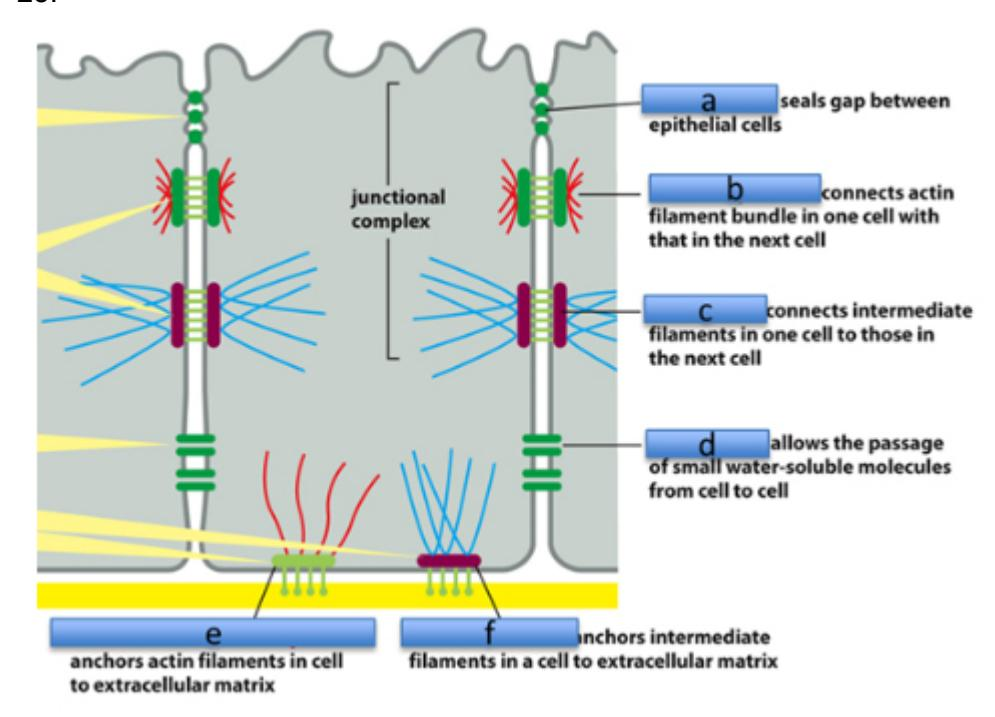

2025년 23학번 세포생물학 기말 족보

- 1.ATP 합성과 관련된 glycolysis, citric acid cycle, electron transport chain에 대한 설명으로 가장 적절한 것은?
- (1) 세 과정 모두 독립적으로 ATP를 합성한다.
- (2) Glycolysis는 세포질에서 일어나며, 산소 공급이 차단될 경우에도 ATP를 생성할 수 있다.
- (3) Citric acid cycle은 산소가 직접적으로 관여하는 반응을 포함하며, 따라서 산소가 없으면 회로 자체가 중단된다.
- (4) 세 과정 모두 산소가 필요한 과정이다.
- (5) 세 과정에 모두 FADH2가 관여한다

2.

- 3. 다음의 glycolysis 반응들 중 NADH를 생산하는 반응은?
  - 1) Glucose -> Glucose 6-phosphate
  - 2) Fructose 6-phosphate -> Fructose 1,6-bisphosphate
  - 3) Glyceraldehyde 3-phosphate -> 1,3-Bisphosphoglycerate
  - 4) Phosphoenolpyruvate -> Pyruvate
  - 5) 1,3 Bisphosphoglycerate -> 3-phosphoglycerate
- 4. 다음의 glycolysis 반응들 중 ATP를 생산하는 반응은?
- 1) Glucose -> Glucose 6-phosphate
- 2) Fructose 6-phosphate -> Fructose 1,6-bisphosphate
- 3) Glyceraldehyde 3-phosphate -> 1,3-biisphosphoglycerate
- 4) 3-phosphoglycerate -> 2-phosphoglycerate
- 5) 1,3-bisphosphoglycerate -> 3-phosphoglycerate

5.

- 6. 다음의 citric acid cycle의 반응들 중 틀린 반응은?
  - 1) Citrate -> Isocitrate
  - 2) Oxaloacetate + Acetyl-CoA -> Citrate
  - 3) a-ketoglutarate -> Succinyl-CoA
  - 4) Succinate -> Malate
  - 5) Malate -> Oxaloacetate

7.

- 8. 지방산의 일종인 카프로산(Caproic acid, C6H12O2)이 beta-oxidation 과정을 거쳐 모두 Acetyl-CoA로 분해될 때 생성되는 NADH와 FADH2의 수로 옳은 것은 무엇인가?
- 1) 2 NADH, 2 FADH2
- 2) 2 NADH, 3 FADH2
- 3) 3 NADH, 2 FADH2
- 4) 3 NADH, 3 FADH2
- 5) 3 NADH, 4 FADH2
- 9. 9. 지방산의 일종인 카프로산(Caproic acid, C6H12O2)이 미토콘드리아에서 완전히 모두 CO2로 산화될 때 생성되는 NADH와 FADH2의 수로 옳은 것은 무엇인가?
- (1) 10 NADH, 4 FADH2
- (2) 10 NADH, 5 FADH2
- (3) 11 NADH, 5 FADH2
- (4) 11 NADH, 6 FADH2
- (5) 12 NADH, 12 FADH2
- 10.
- 11.
- 12. 액틴 필라멘트의 구조와 성질에 관한 다음 설명 중 옳은 것을 모두 선택하시오.

- (1) ATP 형태로 결합한다.
- (2) Plus end에서의 중합 속도가 빠르다.
- (3) Treadmilling은 ATP 가수분해와 무관하다.
- (4) Critical concentration은 양쪽 끝에서 동일하다.
- (5) 직경이 약 8nm인 나선형 이중 가닥 구조를 가진다.
- 13. 세포 분열 시 액틴 필라멘트의 역할에 대한 설명으로 옳은 것을 모두 선택하시오.
  - (1) Contractile ring을 형성한다.
  - (2) 세포 중앙에 위치한다.
  - (3) 세포막을 두 개로 분리한다.
  - (4) 분열 수 contractile ring이 해체된다.

14.

- 15. 마이오신 II의 구조와 기능에 대한 설명 중 틀린 것은?
- (1) Heavy chain 2개를 가진다.
- (2) 길이가 약 150nm인 tail을 가진다.
- (3) ATP를 이용하여 액틴을 따라 이동한다.
- (4) Bipolar thick filament를 형성한다.
- (5) **Head**는 항상 액틴에 결합되어 있다**.**
- 16.근육 수축의 sliding filament mechanism에서 일어나는 아래 과정을 순서대로 나열한 것은?
- A. ATP 결합으로 head 분리
- B. Power stroke 발생
- C. Cocked position으로 이동
- D. 새로운 결합 부위에 결합

## **A → C → D → B**

- 17. 미세소관(microtubule)의 구조에 대한 설명으로 옳은 것을 모두 선택하시오.
- (1) β-tubulin은 GTP와 결합한다.
- (2) 미세소관은 가운데가 빈 관 모양 구조를 가진다.
- (3) α-tubulin과 β-tubulin이 이량체를 형성한다.
- (4) 미세소관은 13개의 protofilament로 구성된다.
- (5) 미세소관은 plus end와 minus end를 구별할 수 있다.
- 18. 중심체(centrosome)에 대한 설명 중 틀린 것은?
  - 1) 중심체는 MTOC 역할을 수행한다.
  - 2) 중심체는 핵막 안에 위치한다.
  - 3) 중심체는 한 쌍의 중심립으로 구성된다.
  - 4) 중심체는 γ-tubulin ring complex를 포함한다.
  - 5) 중심체는 pericentriolar material로 둘러싸여 있다.

19.

- 20. 일차 섬모(primary cilium)에 대한 설명 중 틀린 것은?
  - (1) 일차 섬모는 운동성이 없다.
  - (2) 일차 섬모는 신호 전달에 관여한다.
  - (3) 일차 섬모는 세포 분열 시 소실된다.
  - (4) 일차 섬모는 9+2 배열의 axoneme을 가진다.
  - (5) 일차 섬모는 mother centriole에서 시작된다.
- 21. 중간 필라멘트(intermediate filament)의 특징 중 틀린 것은?
- (1) 중간 필라멘트는 극성을 가지지 않는다.

- (2) 중간 필라멘트는 coiled-coil 구조를 가진다.
- (3) 중간 필라멘트는 약 10nm의 직경을 가진다.
- (4) 중간 필라멘트는 ATP를 이용하여 동적으로 조절된다.
- (5) 중간 필라멘트는 세포 유형에 따라 다른 종류가 발현된다.
- 22. 미토콘드리아 전자전달계에서 전자는 Complex I과 Complex II를 통해 독립적으로 전달된다. 그런데 Complex II가 기능을 상실하면 Complex I을 통한 전자전달은 여전히 가능함에도 불구하고, ATP 합성이 급격히 감소한다. 그 이유를 설명하시오. 23.

위 a-f의 이름은?

- 24. Cadherin의 intracellular domain에 직접적으로 binding할 수 있는 catenin 2개를 쓰시오.
- 25. 세포 접합부 기재 scaffold protein, occludin과 culdin으로 접합은 Tight junction
- 26. Connexon을 통해 세포들 사이의 소통을 담당하는 cell junction은? gap junction
- 27. Fibroblast가 합성하고, connective tissue를 구성하며, 포유류에서 가장 많이 발현하는 단백질로 whole-body protein content의 25% 정도를 차지하고 있으며, type 1 alpha 1 chain이 돌연변이를 일으키는 경우 Osteogenesis imperfecta가 유발되는데 관여하는 extracellulat matrix는 무엇인가?
- 28.
- 29.
- 30.
- 31. Talin과 직접적으로 binding할 수 있는 단백질을 3가지 쓰시오.
- 32. Inactive integrin과 active integrin의 구조적 차이를 설명하시오.