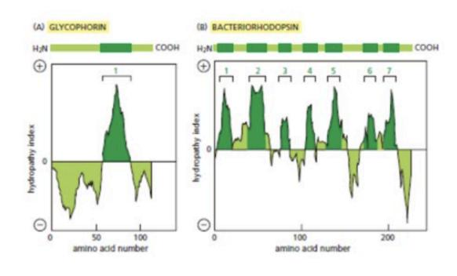
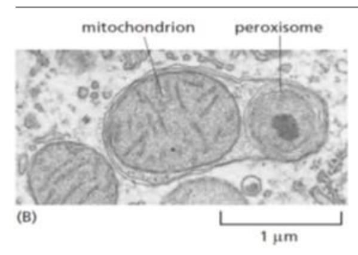

- 1. LL-37 (cathelicidin) 단백질은 항균펩타이드로 음전하가 많은 세균의 막에 삽입되어 구멍을 형성해서 세균을 죽이는 역할을 한다. 실험적으로 LL-37을 세포 내부 (세포질)에 발현시켰다면 이론상으로 어떤 일이 발생할까?
- (1) 세포막에 박혀 경화를 억제시킨다.
- (2) 세포막의 음극성 인지질에 결합하여 구멍을 형성한다.
- (3) 세포막에 존재하는 콜레스테롤의 분해를 촉진하여 세포막을 붕괴시킨다.
- (4) 세포막을 통과하여 외부로 나가 세균의 막에 삽입되어 구멍을 형성한다.
- (5) 세포막을 통과하여 외부로 나가 세포막 표면에 구멍을 만들어 세포를 사멸시킨다. 답: 2
- 2. PI (phosphatidyl inositol)와 PIPs에 대한 설명으로 옳은 것은?(ess)
- (1) 세포막을 이루는 인지질의 50%정도를 차지한다.
- (2) PI는 한 번 생성되면 다른 PIP으로 전환될 수 없다.
- (3) PI는 글리세롤 대신 이노시톨 (inositol)이 붙어 있는 구조이다.
- (4) PI(3,4,5)P₃는 phosphatidylinositol 3,4,5-triphosphate 라고 읽는다.
- (5) 각종 kinase와 phosphatase의 분포는 세포 소기관마다 달라 PIPs의 위치 특이성을 만든다. 답: 5번
- 3. 세포의 유동성에 영향을 미치는 요인을 바르게 설명한 것은?
- (1)시스 이중 결합이 꼬여 더욱 단단한 고체를 형성한다.
- (2)온도에 상관없이 콜레스테롤은 막의 경화를 차단한다.
- (3)단세포 생물은 온도가 올라가면 시스 이중 결합을 증가시킨다.
- (4)콜레스테롤이 고농도로 존재해 유동성 확보에 도움을 줄 수 있다.
- (5)박테리아의 세포막에 존재하는 콜레스테롤은 이중층의 투과성을 감소시킨다. 답:4번

4

- 5. 제시된 hydropathy plot에 대한 설명으로 적절한 것은?
- (1) (B) 단백질은 4개의 알파 헬릭스를 갖을 수 있다.
- (2) Hydropathy plot에서 양의 값은 소수성(hydrophobic) 성질을 의미한다.
- (3) 베타 쉬트의 바깥쪽은 lipid와 접촉하기 때문에 hydropathy로 판단하기 쉽다.
- (4) (A) 단백질은 3개의 베타 쉬트(b-sheet)를 구성해서 세포막을 통과할 수 있다.
- (5) 10개 이하의 짧은 소수성 잔기라도 연속적으로 나타나고 plot의 값이 양의 값이라면 세포막을 관통할 수 있다고 판단할 수 있다.

- 6 이중막(double membrane) 구조를 가진 세포 소기관을 모두 고르시오.
- (1) 핵(nucleus)
- (2) 미토콘드리아(mitochondrion)
- (3) 과산화소체(peroxisome)
- (4) 소포체(Endoplasmic Reticulum)
- (5) 골지체(Golgi apparatus)
- 7 핵 (Nucleus) 내부는 위상적으로 어느 구획과 동일한가?
- (1) 세포 외부 (Extracellulat space)
- (2) ER 내강 (ER Lumen)
- (3) 세포질 (Cytosol)
- (4) 골지체 내강 (Golgi lumen)
- (5) 리소좀 (Lysosome lumen)
- 8. 핵공복합체(NPC)에서 FG 반복 서열을 가진 무질서 영역이 존재하며, 선택적 장벽을 형성하는 구성요소는?
- (1) 막고리 단백질(Transmembrane ring proteins)
- (2) 채널 뉴클레오포린(Channel nucleoporins)
- (3) 지지대 뉴클레오포린(Scaffold nucleoporins)
- (4) 세포질 섬유(Cytosolic fibrils)
- (5) 핵 바스켓(Nuclear basket)

답(2)

- 9. ER에 결합된 리보솜(ER-bound ribosome)과 자유 리보솜(Free ribisome)에 대한 설명으로 옳은 것은?
  - (1) 구조적으로 서로 다르다
  - (2) ER 결합 리보솜은 세포질 단백질만 만든다.
  - (3) 구조적으로 동일하며, 번역하는 mRNA에 따라 달라진다.
  - (4) 추가적인 리보솜 소단위를 가진다 (Have sdditional ribosomal subunits).
  - (5) 특정 세포에서만 존재한다.

10

- 11. 수송 분류 신호(Sorting signal) 가 전혀 없는 단백질의 운명은?
  - (1) 핵으로 수입(import)된다.
  - (2) ER로 들어간다.
  - (3) 미토콘드리아로 이동한다.
  - (4) 세포질에 남는다.
  - (5) 리소좀으로 보낸다.
- 12 과산화소체(Peroxisome)에 관한 설명으로 틀린 것을 고르시오.
  - (1) 과산화소체는 단일막으로 둘러싸인 세포 소기관이다.
  - (2) 과산화소체 내부 효소들은 긴 사슬 지방산의 분해 등 산화 반응을 수행하여 과산화수소 (H2O2)를 생성한다.
  - (3) 과산화소체는 자체 DNA와 리보솜을 가지고 있어, 필요한 단백질을 세포질 수송 없이 자체 합성한다.
  - (4) 과산화소체로 향하는 단백질은 번역이 끝난 후 접힌 상태로도 수송될 수 있다.
  - (5) Plasmalogen 합성 장애는 peroxisome 기능 이상으로 발생하며, 신경세포의 myelin 형성에 영향을 줄 수 있다.

## 답: 3번

- 13 세포 내 단백질 이동 방식에는 개폐성 수송(gated transport), 막 통과 수송(transmembrane transport), 소낭 수송(vesicular transport)이 있습니다. 다음 보기 중 이러한 단백질 수송 방식에 대한 설명으로 옳은 것을 모두 고르시오.
- (1) 핵**(Nucleus)**과 세포질**(Cytosol)** 사이 단백질 이동은 핵공복합체**(Nuclear Pore Complex, NPC)** 를 통한 개폐성 수송**(Gated Transport)** 에 해당한다**.**
- (2) 미토콘드리아 기질**(Mitochondrial Matrix)** 로의 단백질 수송은 막 통과 수송**(Transmembrane Transport)** 의 한 예이며**, N-**말단 신호 서열**(N-terminal Targeting Signal)** 은 수송 후 절단된다**.**
- (3) 소포체**(ER)** 에서 골지체**(Golgi Apparatus)** 로 단백질 이동은 운반 소낭**(Vesicle)** 을 통한 소낭 수송**(Vesicular Transport)** 에 의존한다**.**
- (4) 퍼옥시좀(Peroxisome) 기질 단백질의 수송은 골지체 유래 소낭(Golgi-derived Vesicle) 을 통해 이루어진다.
- (5) 엽록체(Chloroplast) 로 향하는 단백질은 핵공(Nuclear Pore) 을 통한 수송을 거쳐 엽록체 기질(Stroma) 에 도달한다.
- 14 핵공복합체(Nuclear Pore Complex, NPC)에 대한 설명으로 옳은 것을 모두 고르시오. (1)NPC는 약 30여 종의 뉴클레오포린(Nucleoporin) 단백질로 구성되어 있으며, 8방향 대칭 (Eightfold Rotational Symmetry)의 거대한 복합체 구조를 갖는다.
- (2) 분자량 약 40 kDa 이하의 작은 단백질이나 분자는 에너지 의존적 기전(ATP사용) 없이 NPC를 통해 자유 확산 (Passive Diffusion) 으로 이동할 수 있다.
- (3) 단백질이 NPC를 통과하려면 접히지 않은(Unfolded) 상태여야 하며, 접힌 ~단백질은 수송되지 않는다.
- (4) 일부 Nucleoporin 단백질은 페닐알라닌-글리신(FG) 반복 서열 (FG-repeat Sequence) 을 지니며, 핵수송수용체 (Nuclear Transport Receptor, Importin/Exportin)와 상호작용하여 선택적 단백질 수송을 조절한다.
- (5) NPC는 동시에 양방향 수송 (Bidirectional Transport) 을 수행할 수 없으며, 한 번에 한 방향으로만 수송된다.
- 15 핵으로의 단백질 수송에 관한 설명으로 틀린 것을 고르시오.
- (1) Nuclear Localization Signal (NLS)는 주로 양전하(+)를 띠는 리신(Lys)이나 아르기닌(Arg)이 많은 서열로 이루어지며, 핵으로 수송된 후에도 해당 단백질에 그대로 남아 있다.
- (2) Nuclear Export Signal (NES)는 주로 류신(Leu)과 같은 소수성 아미노산이 풍부한 서열로, 엑스포틴(exportin)에 의해 인식되어 핵 밖으로의 단백질 수출을 매개한다.
- (3) **Ran-GTP**의 농도는 세포질**(Cytosol)**에서 높고 핵**(Nucleus)** 내부에서는 주로 **Ran-GDP** 형태가 주로 존재한다**.**
- (4) 단백질의 핵 수송 과정은 에너지 의존적이며, Ran 단백질의 GTP 가수분해를 통해 수송의 방향성이 결정된다.
- (5) Importin 단백질은 NLS 신호를 가진 cargo protein을 인식하여 결합한 뒤 핵 내부로 운반하고, 핵 안에서 Ran-GTP가 Importin에 결합하면 화물 단백질을 방출한다.
- 16. 다음 중 미토콘드리아로의 단백질 수송에 대한 설명으로 옳은 것을 모두 고르시오.
- (1) 미토콘드리아 기질(matrix)로 향하는 단백질은 보통 N-말단에 양친매성 α-나선 구조의 signal sequence를 지니며, 수송 후 미토콘드리아 기질에서 그 신호 서열이 절단된다.

- (2) 미토콘드리아로 수송되는 단백질은 세포질 리보솜에서 합성된 후 접히지 않은 상태로 미토콘드리아 외막과 내막의 TOM/TIM 복합체를 통과한다.
- (3) 미토콘드리아 단백질의 수송에는 ATP hydrolysis에 의한 에너지와 membrane potential (전기화학적 H? 기울기)이 필요하다.
- (4) 미토콘드리아 자체 mtDNA가 대부분의 미토콘드리아 단백질을 암호화하여 현지 합성하기 때문에, 핵에서 수송되는 미토콘드리아 단백질은 극히 일부에 불과하다.
- (5) 미토콘드리아로 수송되는 단백질의 signal sequence는 수송 과정 후에도 제거되지 않고 단백질에 남아 있다.
- 17 Biomolecular Condenzate에 대한 설명으로 틀린 것을 모두 고르시오.
- (1) Biomolecular condensate는 막(membrane)으로 둘러싸여 compartment를 형성한다.
- (2) Condensate 형성에 직접 관여하는 단백질이나 RNA를 scaffold라고 부른다.
- (3) Scaffold는 다른 단백질이나 RNA(client)를 선택적으로 끌어들일 수 있다.
- (4) Condensate는 주로 약하고 다가성(multivalent) 상호작용에 의해 형성된다.
- (5) Client 분자는 condensate 형성 자체에 반드시 필요하다.

18 아래의 효소들은 활성화되면 다음과 같은 역할을 수행하게 된다. 아래 효소들이 활성화될 때 나타날 수 있는 기전으로 적당한 것은?

Synaptojanin, OCRL (5-phosphatase): PI(4,5)P2 → PI4P Sac2/INPP5F (4-phosphatase): PI4P → PI SHIP2 (5-phosphatase): PI(4,5)P2 → PI(3,4)P₂, INPP4A/B가 PI(3,4)P₂ → PI3P

- (1) COPII 소포의 생성이 진행되어 Sec23/34가 recruit된다.
- (2) Dynamin이 활성화되어서 소포가 세포막에서 떨어지게 된다.
- (3) **AP2/clathrin**의 소포와의 결합력이 감소되어 떨어져 나가게 된다**.**
- (4) Rab5가 PI3K를 활성화시켜서 정확한 위치에 vesicle을 fusion시킬 수 있게 한다.
- (5) COPI 소포의 활성화가 진행되어 회수 경로 (retrieval pathway)가 활발하게 진행된다.
- 19 소포 (vesicle)가 목적지 (target membrane)에 도달하는 과정에서 Rab 단백질의 역할에 대한 바른 설명은?
- (1) GAP을 통한 가수분해가 진행되어야 Rab 단백질이 활성화된다.
- (2) Rab의 종류는 고정되어서 하나의 세포소기관에서 변형되지 않는다.
- (3) Rab5 단백질은 시간이 지나 구조 변화가 진행되어 Rab7 단백질이 된다.
- (4) **Rab** 단백질은 주소지 역할을 위해 **vesicle**과 **target membrane**에 같은 **Rab**이 활성화되어야 한다**.**
- (5) Rab 단백질은 세포질 (cytosol)에 soluble 형태로 존재하다가 특정 GEF를 만나면 vesicle의 안쪽 (lumen)지역으로 들어가 고정된다.
- 20 ER로의 회수 경로 (retrieval pathway)에 대한 설명 중 옳은 것은?
- (1) KDEL 신호 서열은 COPI 결합 신호 서열이다.

- (2) ER로의 회수 경로에는 COPII가 coating 단백질로 작용한다.
- (3) KDEL receptor는 대부분 방출되어 재활용 되지않고 분해된다.
- (4) Soluble ER resident 단백질은 KKXX 신호서열을 가지고 있다.
- (5) ER 내부는 골지체보다 상대적으로 높은 pH를 가지고 있어서 KEDL receptor와 cargo와의 결합력이 감소한다.

답:5

- 21. 골지체내 수송 단백질의 이동 메커니즘의 가설에 대한 설명 중 옳은 것은?
- (1) Vesicle transport model에서는 ER에서 골지체로 이동할 때 COPI 이 이용된다.
- (2) Vesicle transport model에서 골지 구조물은 안정적이지 않은 형태로 존재한다.
- (3) Cisternal maturation model에서는 cisternae가 고정된 상태로 소포의 이동만 가능하다.
- (4) Procollagen과 같이 매우 큰 cargo가 TGN으로 이동하는 것은 vesicle transport model로 설명할 수 있다.
- (5) **Endosome**에서 **Rab5**가 점차 줄고 **Rab7**가 증가하는 **Rab cascade**는 **Cisternal maturation model**을 설명하는 것과 유사한 모델이다**.**
- 22. Dynamin에 대한 설명 중 옳은 것은?
- (1) G domain을 통해 dimer 형성을 통해 PI(4,5)P2에 결합하게 된다.
- (2) Dynamin은 소포 형성 초기 단계에서 clathrin 코트 어셈블리를 직접 유도한다.
- (3) Dynamin은 polymerization을 통해 가수분해를 하고 소포를 세포막과 분리시킨다.
- (4) 소포체 lumen(안쪽)에 존재하다가 활성화되면 세포막에 결합하여 소포의 분리를 시작한다.
- (5) G domain이 dimer를 이루면 가수분해가 촉진되어 구조 변화가 발생되고 세포막을 조여 자르게된다.

(답 5)

- 23. Clathrin 이 사용되지 않는 endocytosis에 대한 설명으로 옳은 것은?
- (1) Caveolar endocytosis는 microtubule 의존적이며 actin과는 무관하다.
- (2) Caveolin 단백질은 세포막에 존재하며 caveolae 구조를 형성하는 데 관여한다.
- (3) Macropinocytosis 과정에서 재활용을 위해 actin reorganization이 일어날 수 있다.
- (4) Macropinocytosis는 세포 외부의 큰 입자를 선택적으로 인식하여 internalization 한다.
- (5) 모든 clathrin-independent pathway는 receptor-dependent 방식으로만 cargo를 섭취한다.

(답: 2)

- 24. SNARE을 통한 membrane 결합과정에 대한 설명으로 맞는 것은?
- (1) 세포질에 노출된 membrane이 초기 stalk을 형성한다.
- (2) 세포질쪽에 노출된 membrane이 새로운 bilayer를 형성한다.
- (3) Hemifusion 단계에서 새로 생성된 bilayer는 최종적으로 세포질로 노출된다.
- (4) 결합에 사용된 SNARE 복합체 (V-&T-SNARE)는 재사용되지 않고 분해된다.
- (5) Hemifusion 단계에서 새로 생성된 bilayer의 rupture로 생성된 내부 지역은 세포질과 위상적으로 동등하다.

## (답 1)

25 Exocytosis의 가능한 역할에 대한 설명으로 옳은 것은?

(1)세포의 내용물이 세포 밖으로 방출될 뿐만 아니라 세포막 성분을 보충하기도 한다.

- (2)Exocytosis는 오직 분비세포에서만 일어나고 다른 세포에서는 관찰되지 않는다.
- (3)신경전달물질 방출은 endocytosis에 의해 이루어지며, exocytosis는 관여하지 않는다.
- (4) Exocytosis 과정에서 clathrin 코팅소포가 직접 세포막과 융합하여 내용물을 방출한다.
- (5) 세포 외부로 분비되는 단백질은 모두 ER에서 합성되지 않고, cytosol에서 합성된 후 직접 방출된다.
- 26. Phagocytosis에 대한 설명으로 옳은 것은?
  - (1) Phagosme의 크기는 actin으로 인해 일정하게 유지된다.
  - (2) Phagocytosis는 actin cytoskeleton의 재배열에 의존한다.
  - (3) Phagocytosis는 receptor-independent하게 항상 비특이적으로 일어난다.
  - (4) Phagocytosis는 모든 세포에서 동일하게 일어나는 보편적인 세포 섭취 방식이다.
  - (5) Phagocytosis는 주로 감염 차단을 위한 단백질을 분비하기 위한 기본 경로로 사용된다.

## 27 제시된 현미경 사진에 대한 설명으로 옳지 않은 것은? (4점)

- (1) 세포질에 침투한 박테리아를 제거하는데 활용될 수 있다.
- (2) 선택적이지 않고 무조건 무작위적으로 세포 내 성분을 분해한다**.**
- (3) 불필요하거나 손상된 세포 소기관을 분해하여 세포 항상성을 유지한다.
- (4) 영양 결핍, 저산소증, 감염 등 다양한 스트레스 조건에서 유도될 수 있다.
- (5) 이중막(double-membrane) 구조를 가지며, lysosome과 융합하여 cargo를 분해한다.

## 28. Lysosome에 대한 설명 중 옳은 것은?

- 1) Lysosome은 세포내 지질의 주요 합성 장소이다.
- 2) Lysosome 내부 pH는 약 8.5이상으로, cytosol보다 높게 유지된다.
- 3) Lysosome은 세포 내 환경에 영향을 받지 않고 크기와 모양이 일정하다.
- 4) Lysosome의 enzyme들이 cytosol로 유출되면, 중성 pH 환경 때문에 일반적으로 큰 손상을 준다.
- 5) Lysosome은 endocytosis뿐 아니라 autophagy, phagocytosis와도 연계되어 분해 기능을 수행한다.

답: 5번

- 29. Receptor mediated endocytosis에 대한 설명으로 맞는 것은?
  - (1) PI(4,5)P₂가 ESCRT 복합체의 도킹을 직접 유도한다.
  - (2) 초기 엔도솜은 최종 분해가 일어나는 종착 소기관이다.
  - (3) 형성 중인 엔도솜은 자발적 가수분해로 핵쪽으로 이동한다.
  - (4) Clathrin은 소포 형성 후에도 엔도솜 내부까지 남아 vesicle trafficking을 지속적으로 조절한다.
  - (5) MVB(multivesicular body)의 내부 소포(ILV)에는 ligand/수용체 복합체가 격리되어 분해 경로로 보내진다.
- 30 단백질이 분비 과정에서 proteolytic processing을 거치는 주된 이유로 옳은 것은?
- 1) 단백질은 전구체 상태에서 골지체를 통과할 수 없기 때문이다.
- (2) 단백질이 막관통 구조로 변환되어야만 소포 내로 들어갈 수 있기 때문이다.
- (3) proteolytic processing은 단백질을 세포 내에서 분해하기 위한 과정이기 때문이다.
- (4) 전구 단백질이 세포질에서 즉시 활성화되면**,** 세포 내 항상성이 유지되기 어렵기 때문이다**.**
- (5) 전구 단백질은 후엽과 전엽에서 모두 동일한 형태로 바로 활성 호르몬으로 분비되기 때문이다.
- 31. 다음 중 FRET(Fluorescence Resonance Energy Transfer) assay에 대한 설명으로 옳은 것은?
  - 1) FRET은 두 형광 단백질이 동일한 파장을 방출할 때 발생한다.
  - 2) **FRET**은 분자 간 거리가 약 **5 nm** 범위 이내일 때 관찰될 수 있다**.**
  - 3) FRET 효율은 donor와 acceptor 형광체가 멀리 떨어져 있을수록 증가한다.
  - 4) FRET은 항상 단백질의 3차 구조를 형광으로 직접 관찰할 때 사용되는 기술이다.
  - 5) FRET은 형광체의 광표백(photobleaching)을 이용해 에너지 전달 여부를 측정한다.
- 32. 전자 현미경의 설명 중 옳은 것은?
  - 1) 전자의 파장은 속도에 비례한다.
  - 2) 회절 한계는 광학 현미경에만 적용된다.
  - 3) 전자 현미경의 이론적 해상도는 약 0.002 nm이다.
  - 4) 전자밀도가 높은 물질로 염색해 전자빔을 쉽게 통과시켜 이미지를 얻는다.
  - 5) 투과전자현미경의 구조는 광학 현미경의 구조와 동일하나 크기만 큰 구조이다.
- 33. 전반사 형광 현미경 (TIRF)의 설명으로 옳은 것은?
  - 1) 살아있는 세포의 내부를 관찰하기 위해 고안된 방법이다.
  - 2) 신호 대비 노이즈 비가 매우 낮아 흐린 이미지를 얻게 된다.
  - 3) 비교적 두꺼운 cover glass를 이용해야 좋은 결과를 얻을 수 있다.
  - 4) 세포막 근처의 형광 표지 단백질을 선택적으로 관찰하기 위해 고안된 방법이다.

- 5) 감쇠장 (evanscent wave)에 의해 형성된 소멸파는 수백 ㎛ 깊이까지 도달한다.
- 34. 막 단백질의 확산속도를 측정하기 위해 다음과 아래 방법을 사용하였다. 이 방법에 대한 설명으로 옳은 것은?
- (1) 좁은 영역을 표백하면 단일 분자의 이동을 직접 추적할 수 있다.
- (2) FRAP은 형광 표지 없이도 대부분의 단백질 확산 속도를 측정할 수 있다.
- (3) Recovery 속도가 느릴수록 막 단백질 확산 속도가 빠르다는 의미이다.
- (4) FRAP은 photobleaching 없이 형광 신호 감소를 유도하여 확산을 측정한다.
- (5) FRAP은 매우 강한 빛으로 형광을 소거한 뒤, fluorescence recovery를 관찰하는 방식이다.
- 35. 다음 중 광학 현미경의 분해능에 대한 설명 중 옳은 것은?
  - 1) 분해능의 한계는 빛의 회절 때문이다.
  - 2) 시료를 매우 얇게 제작하여 분해능을 극복할 수 있다.
  - 3) 시료를 비추는 빛이 파장이 길어질수록 분해능이 증가한다.
  - 4) 시료를 비추는 빛의 세기가 강해질수록 분해능은 선형적으로 증가한다.
  - 5) 현미경 대물렌즈와 접안렌즈의 효율을 최대화해 분해능 한계를 극복할 수 있다.